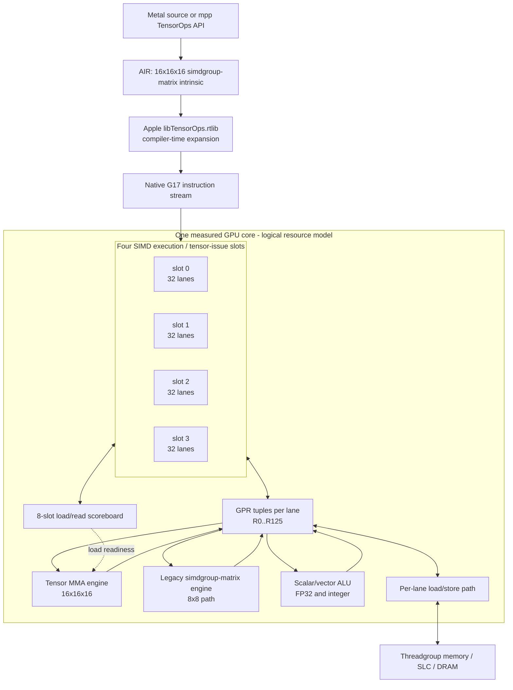
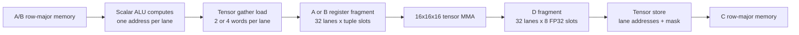
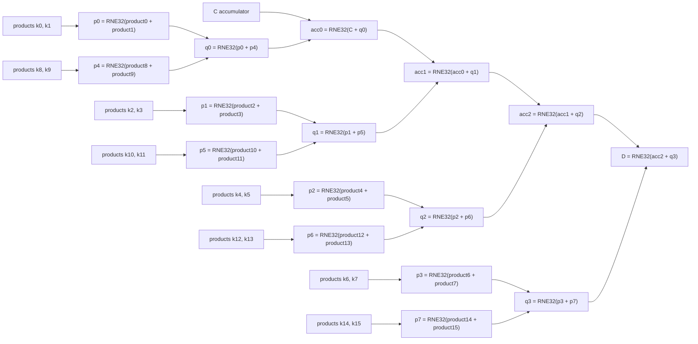
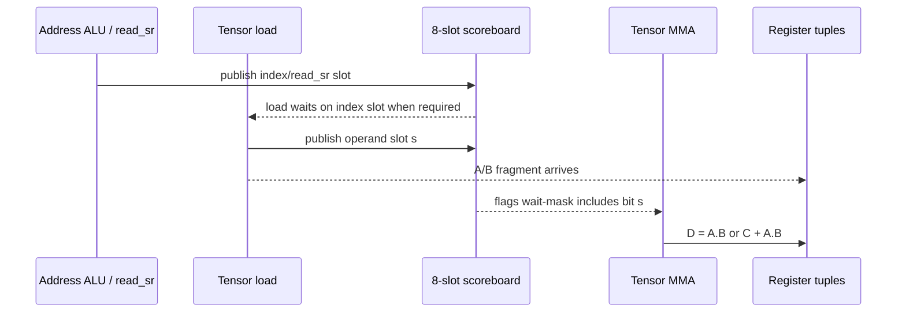
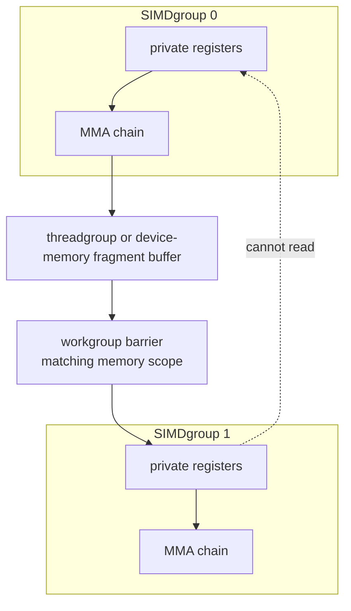
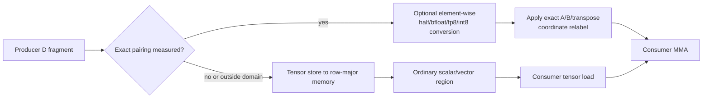
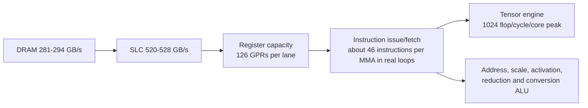
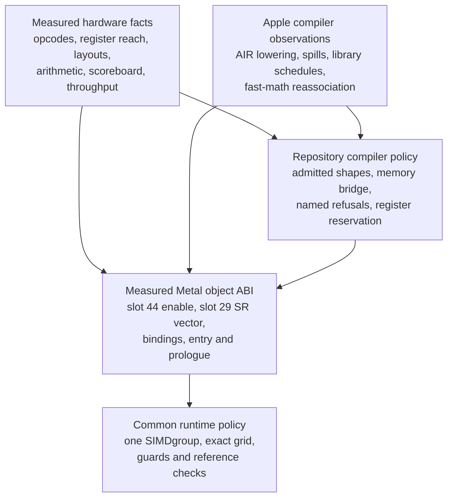

# The M5 Neural Accelerator on H17s: a measured machine model

This document states what four days of differential compilation and hardware execution established about
the matrix hardware in Apple's M5 GPU (H17s, M5 Pro, 20 cores), organized by subject. It is the synthesis of
`docs/g17-tensorops-accelerator-recon.md`, whose 155 sections are a chronological record of how each fact was
reached, including the ones that were later overturned. Where the two disagree, this document is the
current state and the record is the provenance. Almost every claim here carries the section that measured
it; section 23.9 lists the twelve anchors that instead name a local harness file or log, which are **not in
this repository**, so that a reader never mistakes an unreachable anchor for a missing one.

**How to read a claim.** Three strengths are kept apart throughout, because the campaign repeatedly found
that collapsing them is how a reader's error becomes a published fact about the subject:

- *Measured* means dispatched on this H17s and compared against an independent reference. Counts are given
  as they were observed (`5,120/5,120`), not rounded to a verdict.
- *Compiler output* means read out of Apple's own generated code (AIR, or the decoded native object) rather
  than executed. It states what the toolchain does, which is not always what the hardware requires.
- *Bounded* means a negative that holds within a stated search, not an impossibility. A bounded negative is
  never restated as an absence.

Nothing in this document is inferred from prior art on other Apple GPUs. Chapter 21 gives the comparison
separately, and the short form is that most of what follows is unopposed by public work rather than
corroborated by it.

**A note on numbering, because this document cites two things.** A bare "section N" always means a section
of the chronological record. This document's own parts are called **chapters**, and its subsections carry a
decimal ("chapter 24", "section 23.9"). The distinction matters: chapters 17 and 23 exist, and so do record
sections 17 and 23, and they are unrelated.

Readers who want to reproduce the reverse engineering or build a compiler should read the measured model
in the visual hardware reference below, chapters 1 through 14, the compiler rules in chapter 17, and then
the executable implementation map in chapter 23. That final chapter identifies the live field maps and
source modules, gives a minimal encoding and ordinary-IR path, states the image/runtime contract, and
defines the evidence required to add a form.

## 0. Hardware reference plates

This is the chip-facing quick reference. It restates the measured model as diagrams and lookup tables so a
reader can reason about an instruction stream without reconstructing the machine from narrative prose.
Every diagram is a **logical resource and data-flow model**, not a die photograph or a claim about physical
placement. Solid relationships were measured on hardware; the Apple compiler and API layers are marked as
such. Section numbers point to the full evidence and qualifications.

### 0.1 Device and execution-unit card

| Property | Measured H17s value | Standing and boundary |
| --- | --- | --- |
| Tested product | M5 Pro GPU, 20 cores, macOS 26.6.2 | One machine and OS/toolchain population; no claim for another G17 part. |
| SIMD width | 32 lanes | The tensor fragment is a per-lane register tuple. |
| Tensor tile | 16 x 16 x 16 | 4,096 multiply-accumulates, 8,192 floating-point operations per MMA issue. |
| Tensor residency | One accelerator slot per SIMD, four per core | Four 1-SIMDgroup chains run concurrently; occupancy scales linearly beyond four (section 8). |
| Accessible GPRs | R0..R125 | Any tested instruction naming R126..R143 is squashed as a whole. Encoding reach is wider than hardware reach (sections 10, 135). |
| FP32 accumulator capacity | Fifteen aligned groups of eight registers | Legal bases R0, R8, ..., R112. R120..R127 crosses the implemented boundary and is unusable. |
| Dependency tracker | Eight load/read scoreboard slots | A producer names its slot; an MMA carries the eight-bit wait mask (section 6). |
| Accelerator enable | Per-kernel metadata slot 44, low byte nonzero | Zero leaves the program runnable but makes tensor MMAs fast zero-producing no-ops (section 6). |
| Tensor peak on this 20-core device | 33.1--33.5 TFLOP/s fp16/bf16; about 67 TOPS int8 | Dense arithmetic, not sparse; later per-core measurement is 1,024 flop/cycle at 1.62 GHz (section 8). |
| Tensor issue at saturation | About 4.96 ns per MMA per core; int8 about 2.47 ns | Independent later harness, 16 SIMDgroups/core. A single low-occupancy dependent chain is much slower. |
| Threadgroup memory | 32,768 bytes | Native-compiler hard refusal above 32 KiB on this toolchain (section 7). |
| SLC / DRAM read plateaus | 520--528 GB/s at 10--20 MiB; 281--294 GB/s from 40 MiB | Streaming microbenchmark; on-core bandwidth is higher and reported only as a lower bound (section 7). |
| Hot-loop code guideline | About 26 KiB, roughly 2,800 instructions | Per-instruction cost grows sharply up to this point, then flattens (section 7). |

### 0.2 Where the accelerator sits



The tensor, legacy-matrix and ALU boxes are separate scheduling resources only to the extent established by
overlap experiments. The tensor and legacy engines overlap completely at sufficient occupancy. The
FP32-accumulate legacy forms contend strongly with FP32 FMA, while the half-accumulate legacy 8x8 simdgroup MMA, f16 (op838) mostly does
not. The measurements do not locate these blocks physically or identify the shared subunits (sections 8,
9 and 152).

### 0.3 Matrix instruction inventory

Every admitted accelerator MMA is 10 bytes and writes an eight-register FP32 or int32 destination. The
with-C forms accumulate in place in every Apple-emitted instance (`D == C`); the no-C form starts from the
first reduced group rather than an encoded zero tuple.

| A type / tuple | B type / tuple | Destination | With-C opcode | No-C opcode | Arithmetic |
| --- | --- | --- | ---: | ---: | --- |
| half or bfloat / 4 GPRs | half or bfloat / 4 GPRs | FP32 / 8 GPRs | 5106 | 5107 | Exact products, measured FP32 reduction tree |
| half or bfloat / 4 GPRs | FP32 / 8 GPRs | FP32 / 8 GPRs | 5104 | 5105 | FP32 operand truncated to 10 fraction bits |
| FP32 / 8 GPRs | half or bfloat / 4 GPRs | FP32 / 8 GPRs | 5100 | 5101 | FP32 operand truncated to 10 fraction bits |
| FP32 / 8 GPRs | FP32 / 8 GPRs | FP32 / 8 GPRs | 5098 | 5099 | Both operands truncated to 10 fraction bits |
| signed/unsigned int8 / 2 GPRs | signed/unsigned int8 / 2 GPRs | int32 / 8 GPRs | 10384 | 10385 | Widening products, modulo-2^32 accumulation by default |

| Family fact | Value |
| --- | --- |
| Apple table population | 132 declared opcodes in scheduling classes 170--175 |
| Decoder-admitted population | Exactly the ten opcodes above on g17s, g17g and g18 in the bounded sweep |
| Forms not admitted | 122 table entries, including declared 16-bit-accumulator and shifted forms; bounded negative, not proof of impossibility |
| Saturating integer variant | op10384/10385 with byte8 bit 4; one signed clip of `C + A.B`, including unsigned operands |
| Transpose | Adds 32 to the A or B type code; no extra tensor instruction or measured issue cost |
| Type codes | float 1, half 2, bfloat 3, uint8 11, int8 75 |
| Tensor schedclass control | op5106 is class 172; slot 44 enables the accelerator class for the kernel |

The inherited matrix family is distinct:

| Native form | Tile / inputs / accumulator | Length | Scheduling class | Reduction and resource behavior |
| --- | --- | ---: | ---: | --- |
| op838 | 8x8, fp16 input, fp16 accumulator | 14 B | 43 | Mostly overlaps FP32 FMA; lower precision accumulator |
| op2862 | 8x8, fp16 input, fp32 accumulator | 14 B | 118 | Sequential FP32 chain; contends with FP32 FMA |
| op2842 | 8x8, fp32 input, fp32 accumulator | 14 B | 118 | Sequential fused FP32 FMA chain |
| op2902 | 8x8, bf16 input, fp32 accumulator | 14 B | 118 | FP32-accumulate class; contends with FP32 FMA |

### 0.4 Native encoding landmarks

Byte and bit positions below are relative to the 10-byte MMA instruction. Operand fields are not all
contiguous; use the measured JSON field map for construction rather than treating this table as a complete
binary grammar.

| Encoding landmark | Meaning | Qualification |
| --- | --- | --- |
| byte8[1] | Select no-C sibling | Structural family bit measured across the admitted opcodes. |
| byte5[7] | B is FP32 | Together with the A selector chooses op5104/5105 or op5098/5099. |
| byte8[4] | A is FP32 | Together with the B selector chooses op5100/5101 or op5098/5099. |
| byte6[0] | Integer family | Selects the widening int8 opcode family. |
| byte8[2] / byte8[3] | A / B transpose contribution | Adds 32 to the corresponding type code. |
| byte0[7] | Low bit of destination tuple index | Register-address bit, not a scheduling flag. |
| flags bits 24..31 | Scoreboard wait mask | Physically scattered across four bytes; table 0.8 gives the positions. |
| A/B following immediate = 16 | Destructive last use | The first reader releases the tuple; later readers see zero. Value 32 preserves it. |
| destination keep flag (`0x20`) | **Lifetime KEEP** (bit 5) of operand 1, the destination's modifier | `auth.LIFETIME_KEEP = 5` and `carriers(5106,1)[5] = [(4,3,0)]` = byte4 bit3. Sound one-way rule over 758,739 instances: set implies the next MMA writes the same tuple; clear proves nothing (H5). |
| byte8[4] on integer form | Saturating int32 result | Same issue rate and register cost as wrapping form; never emitted by `libTensorOps.rtlib`. |

The encoder's invariant is more important than any single row: register operands are expressed in units of
their tuple width. A requested base that is not naturally aligned must be refused, and the resulting bytes
must decode back to the same opcode, length and semantic operands.

### 0.5 Fragment topology: 256 elements across 32 lanes

Each lane owns eight logical elements of an FP32 destination. For A or D, slots 0--3 are one row and slots
4--7 the following row. For B, slots 0--3 are one K row and slots 4--7 the row eight positions later.

```text
A or D, lane l:
  row0 = 8*(l>>4) + 2*((l>>1)&3)
  col0 = 8*((l>>3)&1) + 4*(l&1)
  slots 0 1 2 3  -> (row0,   col0 + 0..3)
  slots 4 5 6 7  -> (row0+1, col0 + 0..3)

B, lane l:
  k0   = 4*(l>>4) + ((l>>1)&3)
  col0 = 8*((l>>3)&1) + 4*(l&1)
  slots 0 1 2 3  -> (k0,   col0 + 0..3)
  slots 4 5 6 7  -> (k0+8, col0 + 0..3)
```

The A/D lane quadrants are:

| Lanes | Tile rows covered | Tile columns covered | Within the eight-lane group |
| ---: | ---: | ---: | --- |
| 0--7 | 0--7 | 0--7 | lane-local `q`: rows `2*(q>>1)..+1`, columns `4*(q&1)..+3` |
| 8--15 | 0--7 | 8--15 | same local pattern, column base +8 |
| 16--23 | 8--15 | 0--7 | same local pattern, row base +8 |
| 24--31 | 8--15 | 8--15 | same local pattern, row and column bases +8 |

The inverse maps used by a packer are:

```text
pos(r,c)   = (16*(r>>3) + 8*(c>>3) + 2*((r>>1)&3) + ((c>>2)&1),
              4*(r&1) + (c&3))

pos_b(k,c) = (16*((k>>2)&1) + 8*(c>>3) + 2*(k&3) + ((c>>2)&1),
              4*(k>>3) + (c&3))
```



There is no hidden tile-layout unit between memory and the fragments. The ALU-created lane addresses make
the layout. `pos_b(k,c) = pos(rotl1(k),c)` for all 256 coordinates, which resolves the apparent `pos`
versus `pos_b` contradiction without assigning different layouts to different opcodes (sections 3, 32,
100 and 129).

### 0.6 Exact floating-point reduction datapath

For each output element, products are exact at the source precision and then reduced through explicit FP32
rounding points. The diagram shows data dependence, not physical adders:



| Numeric path | Operand preprocessing | Accumulator/result rule |
| --- | --- | --- |
| half | IEEE half values, including subnormals | Exact products into the tree above; FP32 accumulator |
| bfloat | IEEE bfloat values; subnormal products survive the MMA | Same tree; FP32 accumulator |
| FP32 operand | Clear raw mantissa bits 0--12; retain sign, exponent and top ten fraction bits | Same tree and full FP32 exponent range |
| int8/uint8 | Signedness independently selected for A and B | Exact integer products; default C accumulation wraps modulo 2^32 |
| saturating int8 | Same operands | Clip the exact `C + A.B` once to signed int32 limits; not sticky |
| half destination conversion | FP32 to half RNE | Rounds once per explicit conversion; a 16-bit destination between repeated `run()` calls rounds each call |
| bfloat destination conversion | FP32 to bfloat RNE, except FP32-subnormal input flushes to signed zero | One explicit conversion at the boundary |

For the high-level library's **accumulate mode**, the tensor MMA chain starts from zero and ordinary FP32
adds apply the old C afterwards. That is product-first/C-last and differs by one rounding from placing C in
the first MMA.

### 0.7 Register-file accounting

| Live value class | Registers per lane | Alignment | Highest legal base | Notes |
| --- | ---: | ---: | ---: | --- |
| Scalar GPR32 | 1 | 1 | R125 | Individual forms may have narrower encoded fields. |
| int8/uint8 fragment | 2 | 2 | R124 | Four byte elements per lane packed across the pair. |
| half/bfloat fragment | 4 | 4 | R120 | Eight 16-bit values per lane. |
| FP32 A or B fragment | 8 | 8 | R112 | Eight FP32 values per lane. |
| FP32/int32 accumulator | 8 | 8 | R112 | Fifteen hardware-usable groups in the flat pool. |

```text
R0                                                           R125 R126       R143
|<---------------- 126 implemented registers ----------------->| |-- encoded --|
| 8-wide groups: 0,8,16,24,32,40,48,56,64,72,80,88,96,104,112 | | squashed     |
```

The general register pool is flat: accumulators, fragments and scalars trade capacity. Metadata
`register_count` records compiler output but does not gate access. The Apple backend's spill cliffs are
scheduling outcomes, not additional hardware boundaries. Both fragment spill store (op595) fragment stores and scalar spill store, 32-bit XOR into the staging file (op17789) scalar
stores must be counted when diagnosing spills (sections 10 and 134--136).

### 0.8 System registers, memory operations and the eight-slot scoreboard

The native `read_sr` number and the metadata slot-29 entry are separate measured namespaces. The coordinate
bases are deliberately tabulated because their metadata entries are non-monotone across bases; only the
axis increment within a base is arithmetic.

| Logical source | Native system register | Slot-29 entry | Established use and boundary |
| --- | ---: | ---: | --- |
| `thread_index_in_simdgroup` / `SR_SIMD_ELEM` | 130 | 52 | Lane index for tensor address generation; 52 is established for the active tensor form and measured `(130,)` and `(130,156)` metadata classes. |
| `SR_SIMD_GRP` | 133 | not generalized | SIMDgroup index used for tile ownership; this table claims no generic slot-29 authoring entry for it. |
| `threadgroup_position_in_grid.{x,y,z}` | 156, 157, 158 | 0, 1, 2 | Uniform threadgroup coordinates. |
| `thread_position_in_grid.{x,y,z}` | 160, 161, 162 | 80, 81, 82 | Per-thread grid coordinates. |
| `thread_position_in_threadgroup.{x,y,z}` | 164, 165, 166 | 48, 49, 50 | Per-thread local coordinates. |

The broad decoder population contains forms whose first printed system-register byte is also 130 but whose
full `(byte1, instruction width, byte3)` identity maps differently. Those forms do not invalidate the
active tensor mapping; they prevent replacing the measured form-level key with a universal `130 -> 52`
rule.

| Native form | Function | Per-lane payload | Mask / address notes |
| ---: | --- | --- | --- |
| op12674 | Tensor load | Two 32-bit words, normally four half/bfloat elements | Immediate element mask; 12- or 16-byte encoding |
| op12675 | Masked tensor load | Two words | GPR16 mask; used for partial tiles |
| op12656 | One-word tensor load | One word, four int8/uint8 elements | Byte-addressed operand path |
| op12657 | Masked one-word tensor load | One word | GPR16 mask for partial int8 tiles |
| op17257 | Tensor store | Four 32-bit words | Immediate mask; row-major placement comes from lane index arithmetic |
| op17258 | Masked tensor store | Four words | GPR16 mask; bit j enables word j, j=0..3 |
| op12709 | General vector load | Width-selected; 8/10/14-byte forms | A 14-byte form appears for group-end bit 37 or displacement >255 |
| op17256 | General vector store | Four words in the tensor spill/bridge uses | Descriptor constant is `4 * binding_rank` |



| Scoreboard slot | MMA flags bit | Physical instruction bit |
| ---: | ---: | --- |
| 0 | 24 | byte1[2] |
| 1 | 25 | byte1[3] |
| 2 | 26 | byte1[4] |
| 3 | 27 | byte1[5] |
| 4 | 28 | byte1[6] |
| 5 | 29 | byte7[7] |
| 6 | 30 | byte2[6] |
| 7 | 31 | byte0[3] |

A load's decoded publication value is `slot + 1`. Clearing a required wait bit makes the MMA consume stale
or zero fragments; there is no separate wait instruction. A `read_sr` also publishes a slot, and a load can
carry a wait mask for the address value it consumes. Last-use value 16 is destructive and must not be set
while any later consumer remains (sections 6, 28--30 and 35).

### 0.9 One tile, one SIMDgroup, and many SIMDgroups



| Handoff | Required representation | Synchronization | Measured result |
| --- | --- | --- | --- |
| MMA to dependent MMA as C, same SIMDgroup | Same eight-register accumulator | None | Exact; ordinary K-chain path |
| D to next A/B, same SIMDgroup | Exact section-13 relabel/conversion for the pairing | None | Direct chains exact in the measured forms |
| Tensor body to scalar work, same SIMDgroup | Register operand or ordinary memory | None beyond the producer/consumer forms | Exact in measured compiler compositions |
| Tensor body to independently lowered body, same SIMDgroup | Tensor store to row-major memory, then tensor load | No extra fence in the measured one-kernel bridge | Safe compiler default |
| Producer to consumer in another SIMDgroup | Fragment-order TG or device-memory buffer | Workgroup barrier; SIMDgroup barrier is insufficient | Exact for scalar and MMA consumers |
| Cross-SIMDgroup register/shuffle | No legal representation | Impossible in measured domain | Shuffle remains inside caller's SIMDgroup, 256/256 |

The high-level API adds constraints that are not hardware constraints: its `execution_simdgroups<N>` must
match the total SIMDgroups launched; library reductions and cooperative input tensors are single-SIMDgroup;
and its narrower-consumer compatibility predicate can return true while exposing only a prefix of the
producer tiles. A native backend must distinguish these API rules from the machine behavior (sections 12--14).

### 0.10 Direct-chain transforms

Let `D` be one 16x16 producer destination and `rotl1`/`rotr1` rotate a four-bit row index by one bit. The
consumer sees:

| Consumer role | Effective logical fragment | Extra work |
| --- | --- | --- |
| D -> A | `A_eff[r][k] = D[r][k]` | None for FP32; element-wise conversion for 16-bit input |
| D -> B | `B_eff[k][c] = D[rotl1(k)][c]` | Load the other operand with its K index permuted when computing `A2.D` |
| D -> A with transA | `A_eff[r][k] = D[rotl1(k)][rotr1(r)]` | Hardware transpose bit; output/C labels must follow the transform |
| D -> B with transB | `B_eff[k][c] = D[rotl1(c)][k]` | Hardware transpose bit; output columns are relabeled |

> **Scope correction (section 25.103).** The three relabeled rows hold for kernels whose loads put B at
> `pos_b` (Apple's `simdgroup_matrix` API, where section 132 measured them). This compiler's feeds read
> the logical D or D^T bit for bit on hardware, with no permutation and no relabeling. The relabelings
> come from the producing kernel's row labeling, not from the MMA.



The memory path is the correctness baseline because each lowering owns its own load/store convention. Direct
forwarding is optional and must be selected by the exact producer form, consumer role, transpose, dtype,
tile-grid and SIMDgroup domain. A shared tuple width or register class is not enough (sections 13, 125,
129, 132 and 136). *Since 2026-09-23 this compiler emits direct forwarding itself, in mode A, for fp32
consumers and for half consumers (eight fp32 to half narrowing (op1016) narrowings per tile, Apple's recipe). Both are bit-exact on
hardware, including a 2x2 half chain whose tile rows span accumulator groups (section 25.89). The memory
bridge remains the default outside that domain.*

### 0.11 Quantized data paths

| Input path | Native tensor operation | Conversion/scaling around it | Established limitations |
| --- | --- | --- | --- |
| int8/uint8 | op10384/10385, 2x fp16 issue rate | Requantization is scalar int32 -> float scale -> RNE -> int -> saturating clamp | Default accumulation wraps; zero-point/bias only where separately measured |
| fp8 e4m3fn/e5m2 | Eight op17642 unpacks to bf16, then ordinary bf16 op5106 | op13618 quantizes eight values in four instructions; block scale is software FP32 post-MMA FMA | No native fp8 MMA and no hardware MX scale |
| int4/uint4 | Ordinary unpack/convert before int8 or 16-bit path | General ALU work | No native int4 MMA admitted |
| fp4 e2m1, fp6 e2m3/e3m2 | None; after a software decode, the ordinary fp16/bf16 op5106 | ALU decode only: about 24 instructions per value in Apple's newer backend, about 4 in MLX's bit trick; no convert-family opcode | No hardware fp4/fp6 unpack, pack or MMA by any vendor route (25.94.1); operand unpack not built in `tlower` |
| MX scaled spelling | Compiles to ordinary op5106 | Scale operand published or dropped but never applied | Must not be emitted expecting scaling on H17s |

| Quantizer fact | e4m3fn | e5m2 | int8 power-of-two rule |
| --- | ---: | ---: | ---: |
| Maximum finite magnitude | 448 | 57,344 | 127 signed / 255 unsigned after clamp |
| Overflow | Above 464 -> canonical NaN | 61,440 or above -> infinity | Saturating scalar clamp |
| Ceil-rule exponent bias | `0x1fffff` | `0x1fffff` | `0x1ffff` | <!-- raw-encoding -->
| Ceil-rule EMAX | 8 | 15 | 6 |
| Scale code 0 | FP32 subnormal scale, flushed by ALU | Same | Same mechanism when used |
| Scale code 255 | NaN block | NaN block | Unspecified conversion bytes if fed through the float quantizer |

### 0.12 Resource and performance picture



| Regime | Dominant measured limit | Compiler consequence |
| --- | --- | --- |
| Isolated saturated MMA | Tensor issue throughput | Enough independent SIMDgroups hide dependency latency. |
| One low-occupancy dependent chain | Result latency / in-order issue | Interleave independent accumulators. |
| Fused attention | Instruction and ALU work; 35--42% of peak tensor rate | Keep the runtime K loop; do not unroll into spills and fetch pressure. |
| FFN layer kernels | Instruction/ALU and register pressure; 47--57% of peak | Fuse only while spill-free; cut at the quantized hidden boundary. |
| Working set 10--20 MiB | SLC bandwidth | Reuse weights/tiles; block scaling overhead can be hidden. |
| Working set >=40 MiB | DRAM bandwidth | KV splitting and weight-stationary schedules become useful. |
| Cross-SIMDgroup handoff | Store + workgroup barrier + load | Share only when recomputation or spills cost more than the bridge. |
| Legacy plus tensor matrix engines | Joint issue/ALU budget, not tensor-unit conflict | Layer kernels already exceed the budget; do not schedule legacy MMA there. |

### 0.13 Hardware, compiler, and container boundaries



| Statement | Layer | Do not reinterpret it as |
| --- | --- | --- |
| R126+ squashes an instruction | Hardware | An allocator preference or metadata limit |
| Apple spills a particular flat schedule | Compiler output | A closed-form register-file capacity law |
| `reduce_rows` changes order between objects | Apple closed-source library/compiler | Nondeterministic hardware reduction |
| `(SR130, SR156)` authors and runs | Measured metadata class | A universal mapping for every form whose coarse decoder byte1 is 130 |
| Common runtime admits one SIMDgroup | Repository release policy (since 2026-09-23 `gemm_generic` admits 2 and 4 SIMDgroups and up to 8 threadgroups, all bit-exact on hardware; section 25.89) | A one-SIMDgroup hardware limit |
| Memory bridge is the default | Repository correctness policy (this compiler now also emits mode-A direct forwarding, fp32 and half, bit-exact; section 25.89) | Proof that direct forwarding is impossible |
| Scaled AIR spelling has no effect | Hardware plus compiler observation on this OS | Absence of a future instruction or another-chip feature |

### 0.14 Known map and explicit blank regions

| Region | Established | Still blank or bounded |
| --- | --- | --- |
| MMA admission | Ten opcodes, five with-C/no-C families, g17s/g17g/g18 CPU admission | Other bases beyond the three-flip search; 122 table forms are bounded negatives |
| Register operands | R0--R125 execute; tested R126--R143 squash whole instruction | Meaning of R126/R127; fields 18--31 of accumulator selector; untested R144+ encodings |
| Fragment maps | A, B, D and transpose maps for measured 16x16x16 forms; multi-tile row-major blocks | Non-16x16x16 tiles, any future wider fragment class |
| Arithmetic | Exact half/bfloat/fp32/int8 MMA trees and measured float/half/bfloat/int32 reduction arithmetic | Some saturation/transpose/high-register combinations; compiler-owned integer and multi-SIMDgroup reduction lowering |
| Dependencies | Eight load/read slots; the same eight-bit mask on MMA and general-store consumers; safe slot reuse after the named consumer; implicit same-SIMDgroup tensor-store readiness; cross-SG barrier rule | Lifetime before the named consumer and schedules outside the measured modulo-seven K loop |
| Memory | Tensor loads/stores, masks, byte/half/float addressing, B offsets in measured domain | General A/C offsets, odd offsets, all memory subforms |
| Multi-SIMDgroup | Per-SG register-local chains in 1--32 SIMDgroups; cross-SG A/B/C handoffs through fragment-order memory plus a workgroup barrier; shared fused stages exact through 16 SIMDgroups; cooperative grid chooser recovered for all retained route maps | A 32-SIMDgroup shared stage exceeds the 32 KiB threadgroup-memory limit, although recomputation remains exact; cross-threadgroup handoff requires a dispatch boundary; production common-worker admission remains one SIMDgroup |
| Quantization | int8, fp8 unpack/pack, software scaling and measured requantization; fp4/fp6 has no hardware path by any vendor route (25.94.1) | the software fp4/fp6 operand unpack (not built; fp16-subnormal behaviour of the decode unmeasured), universal zero-point/bias schemes, code-255 int conversion |
| Metadata | Exact `(130,)` and `(130,156)` classes, active-form `SR130 -> 52`, coordinate-register entries and slot-44 enable | Generic authoring for the broader byte1=130 population requires the full form identity; 13 such forms cannot inherit 52 from the coarse key; other system-register vectors |
| Performance | Peak, latency/occupancy, SLC/DRAM, TG memory, measured fusion frontiers | Another G17 product, dual-engine floorplan, universal spill model |

The blank cells are part of the model. They prevent a dense diagram from implying completeness that the
measurements do not support.

### 0.15 Runtime, dispatch, clock and scalar-issue card

What the decode work of sections 25.139-25.143 measured about the machine outside the tensor unit: how dispatches
cost, what can be timed, and how the scalar ALU issues. One M5 Pro, macOS 26.6.2, Metal as the submission path
unless stated.

| Property | Measured value | Standing and boundary |
| --- | --- | --- |
| Peak DRAM read | 298.5 GB/s (1,024-thread threadgroups, 256 MB cold streams) | Supersedes the 272 GB/s used before 25.141.13; the q8 FFN streams at about 257 GB/s in the model (25.141.13). |
| Dependent tiny dispatch | 3.7 us each in a serial encoder; 4.2 us with a concurrent encoder plus scoped or resource barriers (MLX's pattern) | A chain of one-thread dispatches each reading the last one's word (25.141.10, 25.141.13). MLX pays the same floor. |
| Pipeline change | Not measurable | One uber pipeline serving FFN and w2 behind skip branches: 101.9 us per dispatch shared, 101.8 separate, 99.9 same-pipeline floor (25.141.2). Removing a switch in the model saved only the removed work (25.142.4). |
| Extra compute encoder in one command buffer | About 6.5 us each | 172 encoders per token: 9.275 against 8.163 ms as one encoder (25.142.1). |
| Concurrent encoder with scoped buffer barriers | 0.03-0.07 ms per token slower than the serial encoder | Pipelined q8 token, 196 dispatches (25.142.1). |
| Indirect command buffer | About +1 us per small dispatch | No gain for large ones (25.141.7). |
| Forward progress | Only among resident threadgroups; dispatch is in order and nothing preempts | Up to 1,200 single-simdgroup threadgroups progress while others spin; past residency (about 1,690 small threadgroups at that register count) a later producer runs only after the residents give up (25.141.1). A spin-wait on a non-resident producer never returns. |
| Grid barrier | Costs more than a dispatch boundary, more as the grid grows | 120.8 us per 32 MB phase as dispatches, 133.1 with a grid barrier (25.141.1). |
| Hardware counters | Timestamps only, and only at encoder (stage) boundaries | `supportsCounterSampling` stage 1, dispatch 0; sampling at a dispatch boundary asserts (25.141.6). |
| Metal System Trace | Command buffers and encoders only; the only GPU counter is "RT Unit Active" | It does record the GPU performance state (Minimum, Medium, Maximum) per interval (25.142.1). |
| In-kernel clock | The CPU's: a C thread writes `mach_absolute_time` (41.667 ns per tick) into 512 lines of an untracked write-combined buffer; a one-thread stamp dispatch reads two fresh lines | The GPU L2 is not coherent with CPU stores, so a recently read line reads stale. The stamped span matches the command buffer to 0.14-0.5 percent. A GPU-side ticker slows five-fold under load (25.141.13). |
| Clock governor | mlx-lm's seven short command buffers per token spent 27-78 percent of its decode in "Medium"; one long command buffer per token stayed at "Maximum" | Two recordings, direction reproduced, size not (25.142.1). |
| Scalar issue, one simdgroup | About 3.1 ns per simple instruction (fadd, fmul, iadd, and 8-independent-chain loops); ffma 4.18 | A hot counted loop; ffma's latency is not fully hidden at 8 chains. shl_imm costs 6.1 alone and 3.17 mixed: a narrow-file stall that other instructions fill, not an issue slot (25.142.6). |
| Dual issue | None between fp32 and int32 | ffma + iadd mixed 3.61 ns per op, against 3.64 for one shared port and 2.09 for dual issue. The full grid agrees (25.142.6). |
| fp32 add throughput | About 4.1e12 per second machine-wide | Consistent with 128 fp32 lanes per core at about 1.6 GHz; the clock was not measured by this probe (25.142.6). |
| A released register | Reads zero | A loop phi that inherited its entry value's register had that register released inside the loop, and every thread then stored as thread 0. Loops whose phis start at a constant zero were right by luck (25.142.7, fixed in cc at f453622af). |
| Hazard tracking against explicit ordering | For one serial encoder per token, tracked buffers beat untracked ones ordered by an `MTLSharedEvent` between command buffers, by 0.2-0.3 ms per token; untracked without ordering races | ABBA, both precisions (25.142.1). MLX's untracked buffers go with many small concurrent encoders (1,366 untracked buffers, 216 concurrent encoders, no residency sets). |
| mlx-lm's decode shape | 16 dispatches per layer (391 per token), 283 barriers, 10 command buffers, one concurrent encoder with barriers only at true dependencies; one `affine_qmv_fast` pipeline for every projection, 64-thread threadgroups of 8 rows; `sdpa_vector` 16 x 1,024 | Frida, in-process Metal calls (25.142.1). Prefill runs `affine_qmm_t_nax` on the tensor units. |
| Instructions per quantized value | MLX's runtime qmv: q8 4.4 (142 per 4-row trip), q4 4.5 (288 per trip). Ours, lean split-K: 5.94 at 1 row, 4.39-4.52 at 4 rows | Decoded from a binary archive of MLX's own kernels (25.142.1, 25.141.3). |
| Timing-order bias | Under load, the second run of a fixed A-then-B pair ran about 0.1 ms per token faster | Flipped a small lever's sign; balance order (rule 43, 25.142.4). |
| Long-context decode | At 1,024-1,792 tokens, mlx-lm's q4 decode fell from 175 to 149 tok/s while ours fell from 207 to 193 | Cap-2048 graph, the same prompts and greedy tokens (25.142.4). |
| Submission below Metal | A persistent CDM/USC command stream, set up once (selectors 261, 9, 7, 16, 28), not one call per dispatch: three command buffers make exactly one selector-7 call, as one dispatch does. There is no MMIO doorbell (zero `IOConnectMapMemory` calls). The command decodes field for field against Mesa's G13 `cmdbuf.xml` | AGXAcceleratorG17X client type (0x100005). A Metal-free process allocates and round-trips memory through a buffer at the same CPU and GPU virtual address. *(Corrected at this claim, 2026-09-25: the producer index is NOT at the channel buffer's +0xb0. That word is the kernel's `setBytes` constant, which the multi-dispatch test had set to the dispatch index. With the constant fixed at 0x5555 nothing CPU-visible changes across dispatches, so the producer or sequence word is GPU-side or in the selector-16 channel, not yet located; 25.143.)* *(Located later the same day: in the selector-14-allocated submission channel, a ring write pointer at +0x04/+0x08 advances 0x58 bytes, one 88-byte entry, per dispatch, and sequence counters step by 2 per dispatch. Which of these the CPU writes and which the firmware writes is not yet separated; 25.143.)* |


### 0.16 Opcode glossary

<!-- opcode glossary: generated by tools/g17opglossary.py --write; edit isa/g17-opcode-glossary.json -->

Every opcode this document cites by number, with the name the prose uses for it. The name says what
the instruction does and how it differs from siblings that share a mnemonic; `mnemonic` is the
assembler's key in `agxforge.g17.slice` (never renamed: it keys operand maps, section 25.59). Confidence:
**executed** = a GPU run measured the function; **compiled** = Apple's compiler emits it for known
source; **static** = operand tables or corpus only; **unconfirmed** = the name marks what is not yet
proven. Generated from `isa/g17-opcode-glossary.json` by `tools/g17opglossary.py`.

| Opcode | Name | Mnemonic | What it does | Confidence | Sections |
| --- | --- | --- | --- | --- | --- |
| op0 | uniform register file, decoder tag | -- | Not an instruction: Apple's decoder writes the uniform register file as op0 inside operands such as bin(op0,const(K),4). | static | 24.2, 24.5, 25.4, 25.57, 25.67, 25.120.1 |
| op4 | message staging file, decoder tag | -- | Not an instruction: Apple's decoder writes the message staging register file as op4; a message instruction waits on the scoreboard slot of a write into it. | static | 20, 24.2, 24.5, 24.6, 25.27, 25.57 |
| op423 | 32-bit AND with immediate | `and` | d = a32 & imm; the register-immediate member of the and-width matrix. | compiled | 24.5 |
| op424 | 32-bit AND | `and` | d = a32 & b32, two 32-bit registers. | executed | 24.5, name audit |
| op426 | 16-bit AND with immediate, 32-bit result | `and` | d32 = a16 & imm; used for masks such as t & (S-1) and SR_TG_X & 255. | compiled | 25.114, 25.141 |
| op428 | 16-bit AND, 32-bit result | `and` | d32 = a16 & b16 with the mask taken from a constant-pool operand (a register mask returned zero for every lane). | executed | 25.141, name audit |
| op435 | 16-bit AND with immediate | `and` | d16 = a16 & imm; emitted by `a & 0xf` on ushort, used to mask nibbles in the fp4 unpack (not a shift). Executed on Apple's GPU over 4,096 lanes at immediates 15, 63, 255 (25.192). | executed | 24.5, 25.28, 25.192 |
| op437 | 16-bit AND | `and` | d16 = a16 & b16, emitted by `a & b` on ushort. | executed | 24.5, name audit |
| op441 | 32-bit AND with immediate into the uniform/staging file | `and.a` | The `.a` AND: a32 & imm written to the uniform/staging file rather than a register. | compiled | 25.120 |
| op447 | threadgroup barrier | `barrier` | threadgroup_barrier with a memory-scope operand (also the imageblock barrier); NOT a device fence: another core's stores stay invisible. | executed | 24.5, 25.75, 25.104.1, 25.104.2, 25.106.1, 25.140.5 |
| op450 | call | `branch` | Apple's subroutine call; Apple's own program using it runs 32/32 in our image path, cc still inlines calls. | executed | 25.90 |
| op458 | conditional back-edge branch | `branch` | the loop back edge; taken per the exec mask that op582 establishes (op579 does not gate it). | executed | 23.10, 25.101.1, 25.142.1 |
| op462 | skip branch, no active lanes | `branch` | forward branch placed after a region's op582, taken when no lane of the simdgroup is active, landing on the region's exec restore. | executed | 25.141.2, 25.141.12 |
| op465 | population count | `popcount` | d = number of set bits in a32. | executed | 25.84, name audit |
| op554 | move immediate, two-operand form | `movimm` | writes an immediate into a register; Apple's matmul uses it to zero the accumulators. | compiled | 25.101.1 |
| op555 | 16-bit move immediate into a half | `movimm` | dst16 = imm (byte 2 of the 4-byte form); main writes 0 to clear a half before the register is read as a 32-bit index. Modelled for immediate 0; a nonzero immediate is written as unknown bits (25.184). | executed | 25.177, 25.184 |
| op577 | exec pop, restore mask | `exec` | pops the exec-mask stack, restoring the mask from before the enclosing if/loop region. | executed | 25.59, 25.89, 25.101.1, 25.104.2, 25.124.6 |
| op579 | while-exec, set mask in place | `exec` | sets the exec mask absolutely from a predicate and overwrites the top stack entry; Apple's loop latch uses it but it does not gate op458. | executed | 25.101.1, 25.124.6 |
| op580 | return | `branch` | Apple's subroutine return (terminator). | executed | 25.90 |
| op582 | exec push, if, from flag | `exec` | pushes the exec mask and narrows it by the flag a compare (op10369) wrote; opens a guarded region closed by op577; gates op458. | executed | 25.59, 25.89, 25.101.1, 25.104.2, 25.114.5, 25.124.6 |
| op586 | 32-bit register move | `mov` | copies one 32-bit register to another; also moves a constant-program-published uniform into place. | executed | 25.59, 25.73, 25.101.1 |
| op590 | 16-bit register move | `mov.16` | copies one 16-bit half register; Apple uses it to clear a low half once. | executed | 25.82, 25.133, 25.141.3, 25.141.17 |
| op592 | uniform / staging write | `publish` | in the constant program writes a uniform register (slot field 0); in a main program writes the op4 message staging file with scoreboard slot 1-8 that the consumer waits on. | executed | 20, 24.2, 24.5, 24.6, 25.4, 25.27, 25.179 |
| op593 | publish sibling, function unknown | `publish` | the opcode op592 becomes when b0[3] flips; 0 instances in either corpus, function unknown. | unconfirmed | 20, 24.5, 25.120.1 |
| op595 | fragment spill store | `mov.a` | stores a register to a stack slot (slot index steps 2 per 32-bit register); the fragment spill, beside op17789 scalar spills. | compiled | 0.7, 11, 24.2, 24.5, 24.8, 25.8 |
| op612 | range mask, immediate width | `addr16` | range4: bit j of a 4-bit result is set iff lo <= src + j < lo + w, lo and w 8-bit immediates; feeds a masked load's operand 9. | executed | 7, 19, 23.4, 24.5, 24.8, 25.58 |
| op615 | range mask, register width | `addr16` | range4 with the width w read from a 32-bit register instead of an immediate; the window wraps modulo 2^32. | executed | 24.8, 25.59, 25.72 |
| op621 | range mask, 16-bit source | `addr16` | range4 from a 16-bit source register. | executed | 24.8, 25.59, 25.72 |
| op684 | end of program | `end` | END terminator, one per program. | executed | 25.68, 25.73, 25.82 |
| op776 | half add with float immediate | `fadd.imm.f16` | half(a + K), rounded once (through fp32 is the same function on every half), subnormals kept, NaN -> the canonical quiet NaN; executed on Apple's GPU (25.195). | executed | 25.184, 25.195 |
| op798 | fp16 fma, register form | `ffma.f16` | binary16 a*b + c rounded once (0 of 196,608 triples off the exact rounding on hardware, subnormals and overflow included); sources are low (425+n) or high (281+n) halves; emitted by cc as fma16 / tensor_acc_fma16 (25.196). | executed | 25.194, 25.196 |
| op838 | legacy 8x8 simdgroup MMA, f16 | `simdgroup.mma.f16` | The pre-tensor-unit simdgroup_matrix 8x8 multiply-accumulate with half operands and half accumulate; 42 vendor instances, all 14 bytes. | compiled | 24.4, 25.12 |
| op839 | legacy 8x8 simdgroup multiply, f16 | `simdgroup.mul.f16` | The legacy simdgroup_matrix 8x8 multiply without an accumulator, half precision. | compiled | 24.4 |
| op904 | fp32 saturate | `fadd.imm.sat.f32` | Clamps an fp32 value to [0, 1] (Metal `saturate`); the true fsat, not op1062. | executed | 25.84, 25.90 |
| op998 | fp32 add | `fadd` | d = a + b in fp32; the accumulate step of Apple's reductions. | executed | 24.5 |
| op1001 | fp32 add, rare alternate encoding | `fadd` | d = a + b in fp32, a distinct byte encoding from op998/op1061 (same measured-family semantics); table-only evidence (68 corpus instances) so the encoding difference from op998 is not decoded. Seen in MLX's compiled affine_qmv_fast dequant loop. | unconfirmed | 25.142.1 |
| op1004 | half to fp32 widening | `cvt.f16.f32` | Converts a 16-bit half to fp32; the map's `fadd.imm` is wrong (EXECUTED_NAMES cvt.f16.f32). | executed | 24.5, 25.90, name audit |
| op1006 | fp32 add with float immediate | `fadd.imm` | d = a + imm with an 8-bit float-coded immediate (D1006.l12: +1.0 on four inputs; the formwidths receipt). | executed | 25.145.1, 25.88 |
| op1014 | fp32 add, half result | `fadd.f32.f32.to.f16` | d16 = a32 + b32, rounded once to half (nearest even), overflow to inf (D1014, z1014, t1014). | executed | 25.145.1 |
| op1015 | fp32 plus half, half result | `fadd.f32.f16.to.f16` | d16 = a32 + b16, rounded to half. | executed | name audit |
| op1016 | fp32 to half narrowing | `cvt.f32.f16` | Converts fp32 to half; Apple's recipe wraps eight of these around a half-output accumulator. | executed | 24.5, name audit |
| op1038 | fp32 add with immediate into the uniform/staging file | `fadd.imm.a` | The `.a` fadd.imm: result written to the uniform/staging file; a 6-byte constant-program ALU form. | compiled | 25.120, 25.179 |
| op1048 | fp32 to bfloat16 narrowing, unconfirmed | `fadd.imm.f16` | Writes a 16-bit value from an fp32 source; the map calls it a half add-immediate, but section 25.13 counts it as the narrowing around the bfloat accumulator and its constructs are all bfloat. Unresolved. | unconfirmed | 24.5, 25.13 |
| op1061 | fp32 add, common alternate encoding | `fadd` | d = a + b in fp32, a distinct byte encoding from op998/op1001 (same measured-family semantics, 511 corpus instances); the encoding difference from op998 is not decoded. Seen alongside op998 in MLX's compiled affine_qmv_fast dequant loop. | executed | 25.142.1 |
| op1062 | fine x-derivative, saturated | `dfdx.fine.sat` | Cross-lane `dfdx` (fine) with saturation; not fsat (that is op904). | unconfirmed | 25.90 |
| op1272 | hardware exp2 | `exp2` | 2^x in one instruction; within 1 ulp, correctly rounded on 632 of 1,024 probes. | executed | 6, 24.5, 25.136 |
| op2190 | fp32 fused multiply-add | `ffma` | d = a * b + c in fp32, all three from registers. | executed | 25.53, 25.84 |
| op2192 | fp32 FMA, literal addend | -- | d = a * b + literal; `fma(a, b, 1.0f)` reaches it and computes a*b + 1.0 exactly. | executed | 24.4, 25.84, 25.184 |
| op2198 | fp32 FMA, literal multiplicand | -- | The FMA form a literal operand selects (`mix(a, b, 0.25f)`, `sinpi`); beyond that route its semantics are unmeasured. | compiled | 24.4, 25.82 |
| op2200 | fp32 FMA with two float immediates | `fadd.imm` | d = a * K1 + K2, both 8-bit float immediates (u2200, 31 cases; the formwidths receipt a*6 + 4); the map's fadd.imm name is the adjacency guess. | executed | 25.145.1 |
| op2238 | fp32 fused multiply-add, alternate encoding | `ffma` | d = a * b + c in fp32, a distinct byte encoding from op2190 (same measured-family semantics, 288 corpus instances); the encoding difference from op2190 is not decoded (not the literal-addend or literal-multiplicand forms of op2192/op2198). The FMA that follows the op2240 candidate in MLX's compiled affine_qmv_fast dequant loop. | executed | 25.142.1 |
| op2240 | FMA-family variant, narrow operand, unconfirmed | -- | Schedclass 56 like op2190/op2192/op2198, zero corpus instances; appears in MLX's compiled affine_qmv_fast dequant loop. unconfirmed: likely another FMA-family variant with a narrow operand; its operand fields are not decoded. | unconfirmed | 24.4, 25.142.1 |
| op2241 | fused multiply-add, schedclass-87 base form | `ffma` | The contract's ffma at schedclass 87 (8 operands, 1 definition), cited as the base form that op2433 narrows; not emitted or measured by this project. | static | 25.144.1 |
| op2318 | fp32 FMA into the uniform/staging file | `ffma.a` | The `.a` ffma: a*b + c written to the uniform/staging file; 8-byte constant-program form. | compiled | 25.120 |
| op2433 | fused multiply-add, narrowed form | `ffma` | A narrowed form of op2241; in MLX's quantized-matmul dequant it computes q*s + b. Seen only in MLX's binary, never emitted by us. | compiled | 25.144.1 |
| op2570 | hardware log2 | `log2` | log2(x) in one instruction. | compiled | 6, 24.5 |
| op2842 | legacy 8x8 simdgroup MMA, fp32 | `simdgroup.mma.f32` | Legacy simdgroup_matrix 8x8 multiply-accumulate in fp32; what matmul2d float falls to without relaxed_precision (no tensor-unit MMA emitted). | compiled | 17 rule 29, 24.4 |
| op2844 | legacy 8x8 simdgroup multiply, fp32 | `simdgroup.mul.f32` | Legacy simdgroup_matrix 8x8 multiply without accumulator in fp32; emitted beside op2842 by fp32 matmul2d. | compiled | 17 rule 29 |
| op2862 | legacy 8x8 simdgroup MMA, f16 in fp32 out | `simdgroup.mma.f16.f32` | Legacy simdgroup_matrix 8x8 multiply-accumulate taking half operands and an fp32 accumulator. | compiled | 24.4 |
| op2902 | legacy 8x8 simdgroup MMA, bf16 | `simdgroup.mma.bf16` | Legacy simdgroup_matrix 8x8 multiply-accumulate with bfloat16 operands. | compiled | 24.4 |
| op3290 | fp32 multiply | `fmul` | d = a * b in fp32, both from registers. | executed | 25.53, 25.84 |
| op3291 | fp32 times half multiply | `fmul.f32.f16` | d32 = a32 * b16 (mixed-precision multiply). | static | 25.88 |
| op3298 | fp32 op with float immediate, unconfirmed | `fadd.imm` | Mapped as `fadd.imm`; section 25.84 pairs it with op3290 the way op2192 pairs with op2190, suggesting a literal-operand multiply. Which one it is has not been separated. | unconfirmed | 25.84 |
| op3306 | fp32 multiply, half result | `fmul.f32.f32.to.f16` | d16 = a32 * b32, rounded to half (m3306; the width receipt's 0x3e00 rules out bf16). | executed | 25.145.1 |
| op3322 | fp32 multiply into the uniform/staging file | `fmul.a` | The `.a` fmul: a*b written to the uniform/staging file (also an op4 staging writer). | compiled | 25.120 |
| op3653 | 16-bit reciprocal into the uniform/staging file | `recip.a` | Table-only `.a` reciprocal from a 16-bit source; seen only as a decode of a flipped MMA bit. | static | 24.8, 25.71 |
| op3658 | hardware reciprocal | `recip` | 1/x in one instruction; within 1 ulp, correctly rounded on 931 of 1,024 probes. | executed | 25.136, name audit |
| op3770 | round to nearest even | `rint` | Metal `rint`: rounds fp32 to the nearest integer, ties to even. | executed | 25.130, name audit |
| op3786 | floor | `floor` | Rounds fp32 down to an integer (denormals to zero). | executed | 25.84, name audit |
| op3818 | fp32 truncate toward zero | `trunc` | d = trunc(a); the sign of a zero result is kept (op3818.trunc, q3818). | executed | 25.145.1 |
| op3850 | rsqrt seed | `rsqrt` | Hardware 1/sqrt(x); an exact function tabulated in isa/g17-rsqrt-seed.npz, 1 ulp off on 50 of 1,024 probes; returns +inf at 0. | executed | 6, 24.4, 25.136, 25.141 |
| op3946 | trig-family op, function unmeasured | `trig` | Emitted by cos/sin/cospi; deliberately left without an invented function in 24.4. | static | 24.4 |
| op3978 | sqrt-safe rsqrt | `rsqrt` | The rsqrt Apple uses for `fast_sqrt` (then a multiply): returns 1.0 at 0, where op3850 returns +inf, so x * rsqrt(x) is 0 rather than NaN. | executed | 6, 24.4 |
| op5098 | tensor MMA, fp32 x fp32, accumulate | `tensor.mac.f32.f32` | 16x16x16 tensor-unit MMA with fp32 A and fp32 B into an fp32 accumulator; fp32 operands have their low 13 mantissa bits cleared, and it costs the same as half x half. | executed | 5, 13, 15, 33 |
| op5099 | tensor MMA, fp32 x fp32, no accumulator | `tensor.mac.f32.f32.init` | The zero-C sibling of op5098: fp32 x fp32 16x16x16 MMA that ignores the accumulator. | executed | 5, 15 |
| op5100 | tensor MMA, fp32 A x 16-bit B, accumulate | `tensor.mac.f32.f16bf16` | 16x16x16 tensor-unit MMA with fp32 A and half-or-bfloat B into fp32; emitted under relaxed_precision for mixed float forms. | executed | 5, 13, 15, 125 |
| op5101 | tensor MMA, fp32 A x 16-bit B, no accumulator | `tensor.mac.f32.f16bf16.init` | The zero-C sibling of op5100. | executed | 5, 15, 125 |
| op5104 | tensor MMA, 16-bit A x fp32 B, accumulate | `tensor.mac.f16bf16.f32` | 16x16x16 tensor-unit MMA with half-or-bfloat A and fp32 B into fp32. | executed | 5, 13, 15 |
| op5105 | tensor MMA, 16-bit A x fp32 B, no accumulator | `tensor.mac.f16bf16.f32.init` | The zero-C sibling of op5104. | executed | 5, 15 |
| op5106 | tensor MMA, 16-bit x 16-bit, accumulate | `tensor.mac` | The main 16x16x16 tensor-unit multiply-accumulate: half or bfloat A and B into an fp32 accumulator tuple; the workhorse of every prefill GEMM and attention kernel. | executed | 2, 5, 25, 27, 33 |
| op5107 | tensor MMA, 16-bit x 16-bit, no accumulator | `tensor.mac.init` | The zero-C sibling of op5106, starting a fresh accumulator; back-to-back issue into the same destination stalls about 34 ns (write-after-write). | executed | 5, 25, 33 |
| op5108 | table-only narrow-accumulator MMA, first | `tensor.mac.narrow.table-first` | First of the 36 table-only declarations op5108-op5143 (16-bit accumulator forms with a four-word destination); no known CPU admits them and Apple emits none, so their subtypes are unrecovered. | static | 25.4, 25.6, 25.13 |
| op5143 | table-only narrow-accumulator MMA, last, no accumulator | `tensor.mac.narrow.table-last.init` | Last declaration of the op5108-op5143 table-only range, the no-accumulator variant; never emitted or admitted, subtype unrecovered. | static | 25.4, 25.6, 25.13 |
| op9320 | fp32 to 32-bit integer | `cvt.f2i` | Converts fp32 to int/uint (both signednesses), register destination. | executed | 25.130, 25.186 |
| op9321 | half to 32-bit integer | `cvt.f2i` | Converts a 16-bit half to a 32-bit integer, register destination. | executed | 25.59 |
| op9325 | half to 16-bit integer | `cvt.f2i.f16` | Converts half to ushort/short, 16-bit register destination. | compiled | 25.59 |
| op9328 | fp32 to u32 into the uniform/staging file | `cvt.f2i.a` | The `.a` cvt: fp32 to 32-bit integer written to the uniform/staging file. | executed | 25.59 |
| op9329 | half to 32-bit integer into the uniform/staging file | `cvt.f2i.f16.a` | The `.a` cvt from half; operand 3 is 4 unsigned, 5 signed; truncates toward zero. | executed | 25.59 |
| op9683 | half compare, chained into a flag | `fcmp` | flag = (half(x) REL 0.0) ? flag_in : 0; -0.0 compares as zero and NaN false. | executed | 25.59 (last six) |
| op9700 | fp32 compare-select, fmax/fmin | `fselect` | Four-register float select whose operation field gives fmax or fmin (Metal float max/min); used for clamps. | executed | 25.117, 25.130 |
| op9721 | 32-bit compare-select, immediate arms | `csel` | Compare-select on a 32-bit source with immediate results (the `csel` sibling); function only partly separated. | compiled | 25.88 |
| op9748 | float compare-select, fselect form | `fselect` | Float compare-select from a 16-bit and a 32-bit source, cc 0 (==). | executed | 25.59 |
| op9749 | float compare-select, csel form | `csel` | Float compare-select from a 16-bit and a 32-bit source, cc 0 (==); the csel-named sibling of op9748. | executed | 25.59 |
| op9832 | half compare-select | `fcsel.f16` | Four-register 16-bit float select (half clamp, min, max). | compiled | 25.58 |
| op9842 | half compare-select against minifloat | -- | d16 = (x16 cc K) ? a16 : b16 with a minifloat comparand K; source modifier 20 is abs(x). | executed | 24.4, 25.59 |
| op9986 | find most significant bit | `msb` | Index of the highest set bit (clz is derived from it). | executed | name audit |
| op9989 | msb bit scan, 16-bit result | `msb` | Most-significant-bit scan (the op9986 form) with its destination narrowed to a 16-bit register. | compiled | 25.144.6 |
| op9996 | 64-bit no-return atomic, max/min | `atomic.exchange.noret` | no-return atomic that 64-bit atomic_max/atomic_min select; the map name says exchange. | compiled | 25.59 |
| op10019 | per-lane-address no-return atomic | `atomic.idx` | device atomic RMW at a per-lane address whose result is unused. | compiled | 25.59 |
| op10022 | uniform-address no-return atomic, 32-bit | `atomic.noret` | device 32-bit atomic RMW at a uniform address whose result is unused. | compiled | 25.59 |
| op10023 | uniform-address no-return compare-exchange | `atomic.noret.64` | no-return compare-and-exchange at a uniform address (operation code 262659); the register pair (expected, desired) is the '64' in its map name. | compiled | 24.8, 25.59 |
| op10090 | per-lane-address atomic, returning | `atomic.idx` | device atomic RMW at a per-lane address; compiler-generated 12-byte ADD, AND, OR, SUB and XOR publishing on slot 7 updated and returned all 64 old values below Metal (two Submits per direct-store shape). ADD and XOR old+1 ALU consumers also passed. Authored floating ADD returned old +1.0f/-1.0f words while updating independent cells to 2.0f/+0.0f. A separate authored contention trial updated one word to 65.0f and returned all 64 old values 1.0f..64.0f exactly once in two pure Submits. An OR near miss executed exchange until byte11[4] was cleared; the same bit enables the 12-byte AND form to decode. Other consumed fetch operations remain refused by the compiler. | executed | 25.115.1; `docs/g17-first-dispatch-trials.md` compiler-generated integer and authored floating ADD return trials |
| op10091 | per-lane-address compare-exchange, returning | `atomic.idx` | device compare-and-exchange at a per-lane address; a hand-authored 12-byte form publishing on slot 7 returned all 64 old values in two pure below-Metal Submits, covering one successful and 63 failed compares. Compiler-generated 60-byte whole programs then passed ten more pure Submits over index registers R0, R1, R5, R7 and R12; the other R0..R12 placements decode-check but are not individually executed. | executed | 25.59; `docs/g17-first-dispatch-trials.md` authored and compiler-generated compare-exchange return trials |
| op10094 | uniform-address atomic, returning old | `atomic` | device atomic RMW at a uniform address returning the old value; the return fills scoreboard slot 7. | executed | 25.59, 25.115, 25.115.1, 25.119, 25.112, 25.140.3 |
| op10095 | uniform-address compare-exchange, returning | `atomic.cmpxchg` | device compare-and-exchange at a uniform address whose result is used. | executed | 25.59 |
| op10239 | 32-bit saturating add | `addsat` | d = a + b clamped; signedness is a source modifier (16/32 unsigned, 24/40 signed). | executed | 25.59, name audit |
| op10267 | 64-bit add | -- | d64 = a64 + b64; forms buffer base + offset addresses. | executed | 24.4, 25.59 |
| op10279 | 32-bit add immediate | `add` | d = a32 + imm (8-bit); the loop-carried pointer advance when it fits. | executed | 25.114 |
| op10282 | 32-bit add | `add` | d = a32 + b32, two registers. | executed | 25.114, name audit |
| op10283 | add, 32-bit plus zero-extended 16-bit | `add` | d = a32 + low16(b), mod 2^32; with a = 0 it is cc's u16_to_u32 widening (t10283, g10283). | executed | 25.145.1 |
| op10285 | add 16-bit to 32-bit | `add` | d32 = zext16(a) + b32; executed on Apple's GPU, with a full-width a that separates zero- from sign-extension (25.195). | executed | 25.93, 25.195 |
| op10286 | 16-bit plus 16-bit, 32-bit result | `add` | d32 = a16 + b16, widening. | executed | name audit |
| op10289 | 16-bit add immediate | `add` | d16 = a16 + imm, wrapping at 16 bits; executed on Apple's GPU over 4,096 lanes (25.195). | executed | 25.104, 25.192, 25.195 |
| op10298 | 32-bit add immediate into the uniform/staging file | `add.a` | The `.a` add: a32 + imm to the uniform/staging file; a constant-program uniform writer. | compiled | 25.120 |
| op10306 | 32-bit add into the uniform/staging file | `add.a` | The `.a` add of two registers to the uniform/staging file. | compiled | 25.120 |
| op10369 | 32-bit compare with immediate into a flag | `cmp` | flag = (a32 cc imm), the loop-exit compare (10-byte form; uint counter; int gives the 6-byte width). | executed | 25.59, 25.73 |
| op10372 | 16-bit compare into a flag | `cmp` | flag = (a16 cc ...), the per-simdgroup bound compare. | compiled | 25.93 |
| op10374 | 16-bit register compare into a flag | `csel` | flag = (a16 cc b16); not a select despite the `csel` name. | executed | 25.59 |
| op10378 | 32-bit compare with immediate into a flag, short form | `cmp` | The 6-byte sibling of op10369; signed test against 0 in loop breaks. | executed | 25.59 |
| op10384 | tensor MMA, int8 widening to int32 | `tensor.mac.widening` | 16x16x16 int8/uint8 MMA into int32 at twice the fp16 issue rate; wraps by default, and byte8 bit 4 selects a measured saturating variant (one signed clip of C + A.B). | executed | 5, 15, 27, 136 |
| op10385 | tensor MMA, int8 widening, no accumulator | `tensor.mac.widening.init` | The zero-C sibling of op10384. | executed | 27, 136 |
| op10789 | 32 x immediate to 64-bit product | `mulhi` | d64 = a32 * imm; the map's `mulhi` is wrong. | executed | 25.59 |
| op10790 | 64-bit address multiply-add | `mulhi` | d64 = a64 + b32 * imm; forms 64-bit addresses. The map's `mulhi` is wrong. | executed | 25.59 |
| op10793 | 32 x 32 to 64-bit product | `mulhi` | d64 = a32 * b32 (the low word is the low product); shares the `mulhi` name with op10790. | executed | 25.80, name audit |
| op10795 | 32 x 32 + 32 to 64-bit multiply-add | `madd.wide` | d64 = a*b + c, unsigned. | executed | 25.59 |
| op10823 | multiply by immediate, 32-bit addend | `mul` | d = a32 * imm + b32. | executed | 25.59 |
| op10824 | multiply by immediate, 16-bit addend | `mul` | d = a * imm + zext16(b); the map's `mul` omits the addend. | executed | 25.59 |
| op10825 | 32-bit multiply | `mul` | d = a32 * b32, low 32 bits. | executed | 25.141, name audit |
| op10826 | 32-bit multiply-add | `madd` | d = a32 * b32 + c32, low 32 bits (the lanes receipt's fit, 32/32 lanes). | executed | 25.145 |
| op10829 | multiply-add, 16-bit multiplier | `madd` | d = a32 * zext16(b) + c32. | executed | 25.59 |
| op10830 | multiply-add, 16-bit multiplier and addend | `madd` | d = a32 * zext16(b) + zext16(c). | executed | 25.59 |
| op10831 | 16-bit multiply by immediate plus immediate | `mul` | d32 = zext16(a) * imm + imm. | executed | 25.59 |
| op10835 | multiply-add, 16-bit multiplicand | `madd` | d = zext16(a) * b32 + c32. | executed | 25.59, name audit |
| op10836 | multiply-add, 16-bit multiplicand and addend | `madd` | d = zext16(a) * b32 + zext16(c). | executed | 25.59, name audit |
| op10838 | signed-by-unsigned 16-bit multiply-add | `madd` | d = sext16(a) * zext16(b) + c32. | executed | 25.59 |
| op10858 | 16-bit multiply by immediate plus immediate, 16-bit result | `mul` | d16 = a16 * imm + imm. | executed | 25.59 |
| op10860 | 16-bit multiply by immediate plus register | `mul` | d16 = a16 * imm + b16. | executed | 25.59 |
| op10879 | multiply by immediate plus immediate into the uniform/staging file | `madd.a` | The `.a` madd: a * imm + imm to the uniform/staging file. | executed | 25.59 |
| op10883 | 32-bit multiply into the uniform/staging file | `madd.a` | The `.a` multiply of two registers to the uniform/staging file; a constant-program writer. | compiled | 25.120 |
| op10904 | MMA bit-flip mutation artifact | -- | A 12-byte form reached only by flipping op5106's structural bit 1; decodable but no role established or claimed. | unconfirmed | 25.25 |
| op10909 | texture write | `texture.write` | image write; reads its staged operands from the op4 staging file. | compiled | 25.120.1 |
| op11059 | multiply by immediate minus immediate | `madd` | d = a * imm - imm; the map's `madd` has the wrong sign. | executed | 25.59 |
| op11060 | multiply by immediate minus register | `madd` | d = a * imm - b32; the map's `madd` has the wrong sign. | executed | 25.59 |
| op11063 | multiply-subtract | `msub` | d = a * b - c; the map's `madd` is wrong (EXECUTED_NAMES msub). | executed | 25.59, name audit |
| op11120 | multiply-add into the uniform/staging file | `madd.a` | The `.a` madd of two registers to the uniform/staging file (threadgroup address computation). | executed | 25.59 |
| op11179 | 32-bit integer to fp32 | `cvt.i2f` | Converts int32/uint32 to fp32, round to nearest even; operand 2 is signedness (4 unsigned, 5 signed). | executed | 25.90, 25.130 |
| op11180 | 16-bit integer to fp32 | `cvt.i2f` | converts an unsigned (code 2) or signed (code 3) 16-bit integer to fp32, exactly; executed on Apple's GPU (25.195). | executed | 25.144.1, 25.195 |
| op11182 | u32 to half | `cvt.i2f` | converts a 32-bit unsigned integer to half, round to nearest even, past half's range to inf (unsigned code 4); measured over 4,096 lanes of Apple's code (25.184). | executed | 25.179, 25.184 |
| op11183 | 16-bit integer to half | `cvt.i2f` | Converts ushort/short to half; operand 2 is 2 unsigned, 3 signed. | executed | 25.59, 25.195 |
| op11185 | integer to float into the uniform/staging file | `cvt.i2f` | The `.a` integer-to-float conversion into the uniform/staging file. | static | 25.120, 25.179 |
| op11190 | 32-bit NOT | `not` | d = ~a32. | executed | 25.84, name audit |
| op11193 | NOT to 16-bit result | `not` | d16 = ~a & 0xFFFF. | executed | 25.59 |
| op11196 | 32-bit NOT into the uniform/staging file | `not.a` | The `.a` NOT to the uniform/staging file. | executed | 25.59 |
| op11310 | 32-bit compare, AND-chained into a flag | `cmp` | flag = (x cc K) ? c16 : 0; how `&&` is formed. | executed | 25.59 |
| op11313 | 32-bit compare, OR-chained into a flag | `csel` | flag = (x cc y) ? T : flag_in, with T an immediate. | executed | 25.59 (last six) |
| op11314 | 32-bit compare, AND-chained into a flag with false arm | `csel` | flag = (x cc y) ? flag_in : F, with F an immediate. | executed | 25.59 (last six) |
| op11322 | 16-bit compare, chained into a flag | `cmp` | flag = (x16 cc K) ? flag_in : F. | executed | 25.59 (last six) |
| op11362 | 32-bit compare-select against immediate | `csel.imm` | d = (a32 cc imm) ? imm : imm; the compared value and both results are immediates. | compiled | 25.84 |
| op11364 | integer clamp | `clamp` | Metal integer `clamp`, attributed at two widths. | executed | 25.84 |
| op11365 | 32-bit compare-select, three registers | `select.cc` | d = (a cc b) ? c : ...; the select an integer divide reaches. | executed | 25.80 |
| op11372 | 32-bit register compare-select, immediate arms | `csel.reg` | d = (a cc b) ? T : F with integer immediates. | executed | 25.59 |
| op11375 | 32-bit compare-select, four registers | `select` | d = (a cc b) ? c : d; cc 0 is a > b and cc 1 is a bit test (a & b) != 0. | executed | 25.90 |
| op11392 | 16-bit compare-select against immediate, 32-bit result | `csel.imm` | d32 = (x16 cc K) ? T : F, integer immediates. | executed | 25.59 |
| op11415 | 16-bit compare float select | `fselect` | fselect from two 16-bit and two 32-bit sources; seen fed by the loop counter. | compiled | 25.39 |
| op11456 | 32-bit compare against immediate, select to 16-bit | `csel` | d16 = (x32 cc K) ? t16 : F; a true csel returning the mask or an immediate. | executed | 25.59 |
| op11458 | 32-bit compare against immediate, select to 16-bit, minifloat false arm | `csel` | d16 = (x32 cc K) ? t16 : F with a minifloat F. | executed | 25.59 |
| op11460 | 32-bit compare against immediate, select to 16-bit, register false arm | `csel` | d16 = (x32 cc K) ? T : f16. | executed | 25.59 |
| op11461 | 32-bit compare against immediate to half boolean | `cmp` | d16 = (x32 cc K) ? T : F, minifloat arms giving half 0.0/1.0. | executed | 25.59 |
| op11462 | 32-bit register compare to 16-bit result | `cmp` | d16 = (a32 cc b32) ? 1 : 0, op11372 into a half; executed on Apple's GPU (25.195). | executed | 25.51, 25.80, 25.195 |
| op11466 | 32-bit register compare, select to 16-bit | `csel` | d16 = (x32 cc y32) ? t16 : F. | executed | 25.59 |
| op11471 | 32-bit register compare to half boolean | `csel` | d16 = (x32 cc y32) ? T : F with minifloat arms. | executed | 25.59 |
| op11472 | 32-bit vs 16-bit compare to 16-bit result | `cmp` | Compare of a 32-bit and a 16-bit source writing a 16-bit register; table-only role. | static | 25.87 |
| op11482 | 16-bit compare-select against immediate | `csel.imm.16` | d16 = (x16 cc K) ? T : F; `simd_is_first()` is lane == 0 ? 1 : 0. | compiled | 24.8, 25.58 |
| op11491 | 16-bit compare against immediate to half boolean | `cmp` | d16 = (x16 cc K) ? T : F with minifloat arms. | executed | 25.59 |
| op11507 | 16-bit compare-select, four registers | `select` | d16 = (a == b) ? c : d; equality (not a bit test). | executed | 25.90, name audit |
| op11564 | texture-coordinate staging write | `publish.coord.a` | ALU form that writes two coordinates per write into the op4 staging file for a later texture/image message. | static | 25.120.1 |
| op11624 | 32-bit saturating subtract | `subsat` | d = a - b clamped at 0 (unsigned: the lanes receipt's fit, over signed saturation and wrapping). | executed | 25.145 |
| op11655 | 64-bit subtract immediate | `sub.wide` | d64 = a - imm, the immediate `sub.wide` form. | compiled | 24.8, 25.58 |
| op11666 | 32-bit subtract immediate | `sub` | d = a32 - imm. | compiled | 25.95 |
| op11667 | 32-bit subtract | `sub` | d = a32 - b32. | executed | name audit |
| op11689 | 32-bit subtract immediate into the uniform/staging file | `sub.a` | The `.a` sub: uniform B - imm to the uniform/staging file. | executed | 25.59 (last six) |
| op11701 | threadgroup atomic, no return | `atomic.tg.noret` | threadgroup atomic (e.g. fetch_add) whose result is unused. | executed | 25.59 |
| op11765 | threadgroup atomic, returning old | `atomic.tg` | threadgroup atomic RMW returning the old value; the operation is a 4-bit table in operand 2; returns on slot 7. | executed | 25.59, 25.87, 25.115 |
| op11842 | move immediate, three-operand form | `movimm` | writes an immediate into a register (cc's movimm); its 10-byte width is not predicted by the always-present bits. | executed | 24.8, 25.62, 25.95, 25.114.2, 25.114.3, 25.141.13 |
| op11994 | ray-tracing block load, 32-bit | `load.b32` | 32-bit load used by the ray-tracing intersection block, two register sources. | static | 25.88 |
| op12073 | device load, register address | `load` | device load through a runtime address register (32-bit source); thread-private arrays lower to it. | compiled | 24.2, 25.39.2 |
| op12074 | device load, 16-bit register address | `load` | the op12073 load with a 16-bit address source. | static | 24.2, 25.39.2 |
| op12151 | imageblock load, 32-bit | `load.ib.32` | 32-bit imageblock (tile) load at the lane's local x/y. | executed | 25.104.1, 25.104.2 |
| op12352 | MMA operand load, space unconfirmed | `load` | The load that, paired with op12673, feeds MLX's tensor MMA (op5106) from registers in its quantized-matmul inner loop; unconfirmed: likely threadgroup memory. | unconfirmed | 25.144.1 |
| op12364 | threadgroup-memory load | `load.tg` | Loads from threadgroup memory; the cooperative LayerNorm reads its partial sums back with it. | executed | 25.210 |
| op12397 | load, a further form | `load` | not modelled in g17emu yet; it follows op435 in two census programs (25.192). | compiled | 25.192 |
| op12646 | 16-bit load | `load` | loads one 16-bit value (half/bf16), optionally into a register's high half (hi16), from base + index. | executed | 25.141.3, 25.141.17 |
| op12655 | packed half2 load | `load` | loads two halves into one 32-bit register; lane t reads word t. | executed | 25.90 |
| op12656 | int8 tensor load, one word | `load` | tensor-operand load of one word, four int8/uint8 elements, element code 1. | executed | 0.8, 7, 24.2, 24.5, 25.23, 25.34 |
| op12657 | masked int8 tensor load | `load` | op12656 with a 16-bit mask register for partial int8 tiles. | executed | 0.8, 24.2, 24.5, 25.34, 25.37, 25.51 |
| op12673 | plain 64-bit load, pair address | `load` | plain (non-tensor) load of two words into a register pair; op12674 with byte4[3] flipped; Apple loads at pointer + immediate with it. | compiled | 24.2, 24.5, 25.141.3 |
| op12674 | tensor load, half/bf16 | `load` | tensor-operand load of two 32-bit words, normally four half/bfloat elements, element code 2, immediate element mask. | executed | 0.8, 6, 7, 19, 20, 24.2 |
| op12675 | masked tensor load, half/bf16 | `load` | op12674 with a 16-bit mask register for partial tiles. | executed | 0.8, 7, 24.2, 24.5, 25.23, 25.24 |
| op12682 | plain 32-bit load | `load` | plain four-byte load, element code 4. | executed | 19, 24.2, 24.5, 25.23, 25.24, 25.34 |
| op12688 | immediate-address one-word load | `load` | loads the word at (index + displacement) x element of a binding, an immediate address (component mask field 2066); the constant program fetches its uniform slots with it, and main reads device words (25.177). | executed | 25.67, 25.120.1, 25.177 |
| op12691 | plain 64-bit load | `load` | plain eight-byte load (int2/float2), element code 8. | executed | 24.2, 24.5, 25.37, 25.51, 25.73, 25.139.2 |
| op12692 | tensor load, fp32 | `load` | fp32-operand tensor load, element code 4. | executed | 7, 19, 24.2, 24.5, 25.37, 25.51 |
| op12693 | masked tensor load, fp32 | `load` | op12692 with a 16-bit mask register. | executed | 24.2, 24.5, 25.37 |
| op12697 | immediate-address two-word load | `load` | loads two consecutive words at an immediate address (component mask field 2098) into a register pair, lowest first; op17244's load, also through the constant program's register-pair pointer base (25.184). | executed | 25.177, 25.184 |
| op12700 | three-component vector load | `load` | 12-byte (x3) load whose access steps 16 bytes (4n rounded up to a power of two). | executed | 25.90 |
| op12706 | immediate-address three-word load | `load` | loads three consecutive words at an immediate address (component mask field 2162) into a 32-bit register tuple; Apple's constant programs use it through a register-pair pointer base. | executed | 25.179 |
| op12709 | 128-bit vector load | `load` | general vector load, width-selected; sixteen-byte access (element code 16) for float4/int4/long2. | executed | 0.8, 6, 19, 20, 24.2, 24.5 |
| op12715 | immediate-address four-word load | `load` | loads four consecutive words at an immediate address (component mask field 2290) into a 32-bit register tuple, lowest register first. | executed | 25.177 |
| op13075 | imageblock store, 32-bit | `store.ib.32` | 32-bit imageblock (tile) store at the lane's local x/y; operand 1 bits 24-31 are its wait mask. | executed | 25.96, 25.104.1, 25.104.2 |
| op13276 | dequantized-block store, likely threadgroup | `store` | Stores the dequantized weight block (eight per K block) in MLX's quantized matmul; unconfirmed: likely threadgroup memory. | unconfirmed | 25.144.1 |
| op13288 | threadgroup-memory store | `store.tg` | Stores to threadgroup memory; the cooperative LayerNorm writes its partial sums with it. | executed | 25.210 |
| op13483 | two-byte filler | `pad` | 2-byte pad with zero varying bits; 89% of constant-program instructions. | static | 24.8, 25.68, 25.71, 25.73, 25.82 |
| op13574 | 32-bit OR with immediate, seven-bit destination | `or` | d = a / imm with a seven-bit destination field (reaches R64 and above) and an authored load wait, 10 bytes; M8 uses OR with 0 as the register copy into R64+, bit-exact on hardware. | executed | 25.144.8 |
| op13575 | 32-bit OR | `or` | d = a32 / b32. | executed | 25.84, name audit |
| op13576 | OR with 16-bit operand | `or` | d = a32 / zext16(b). | executed | 25.59, name audit |
| op13588 | 16-bit OR | `or` | d16 = a16 / b16 (t13588, 17 cases). | executed | 25.145.1 |
| op13592 | 32-bit OR with immediate into the uniform/staging file | `or.a` | The `.a` OR: a / imm to the uniform/staging file. | executed | 25.59 |
| op13597 | 16-bit OR into the uniform/staging file | `or.a` | The `.a` OR of two 16-bit registers. | compiled | 25.59 |
| op13618 | fp8 pack, vector, from fp32/half/bf16 | `cvt.f32.fp8` | Packs eight fp32, half or bfloat values to fp8 with round-to-nearest-even and no saturation; a format immediate selects e4m3fn (97) or e5m2 (98). | executed | 16, 138, 140, 25.21 |
| op13620 | fp8 pack, scalar, from fp32 | -- | Scalar counterpart of op13618: one f8 from one f32; Apple's compiler emits it for scalar fp8 air.convert. | compiled | 138, 25.21 |
| op13754 | camera/video kernel op, function unknown | -- | A 14-byte, 6-operand form found 50 times in Apple camera and video kernels (VCPDownsample, deskCam warping/sharpening, CMIGDCComputeYUV); admitted to the contract as an encoding only, function unknown. | unconfirmed | 25.58 |
| op13856 | quad prefix sum, fp32 | `quad.prefix_sum.f32` | Inclusive prefix sum over a 4-lane quad; table-only. | static | 25.82 |
| op13944 | quad shuffle-xor, immediate mask | `quad.shuffle_xor` | quad_shuffle_xor; bounded to 4 lanes, masks of 4 or more give 0.0. | compiled | 12, 24.5 |
| op13945 | quad shuffle-xor, runtime mask | -- | quad_shuffle_xor with the lane mask from a register. | compiled | 12, 24.4 |
| op14047 | bit reverse | `reverse` | Reverses the 32 bits of a (Metal reverse_bits). | executed | 25.84, name audit |
| op14059 | special-register read | `read_sr` | reads a special register (thread/group ids and similar) into a GPR. | executed | 25.82, 25.120.1, 25.141.13 |
| op14060 | special-register read, 16-bit | `read_sr` | Reads a special register into a 16-bit register; Apple's divergent simd_broadcast_first reads SR 38, the active-lane mask, with it. | compiled | 25.144.6 |
| op14061 | argument read, binding-table word | `base.wide` | reads one 32-bit half of a buffer's binding-table entry from the indexed slot space. | executed | 24.5, 24.8, 25.35, 25.59, 25.67, 25.120, 25.179 |
| op14099 | flag to 16-bit register | `flag.mov` | materialises a condition flag as a 16-bit register value. | executed | 25.59 |
| op14147 | bit interleave, Morton encode | -- | bit 2i of d is bit i of the first source's low 16 bits, bit 2i+1 of the second's (G13 intl). | executed | 24.4, 24.8, 25.59, 25.72 |
| op14156 | device fence | -- | atomic_thread_fence(mem_device, seq_cst, thread_scope_device): makes this core's device stores visible to other cores. | executed | 24.5, 25.140.5, 25.141.1 |
| op14157 | SIMD shuffle, constant lane, broadcast | `simd.shuffle` | simd_broadcast / simd_shuffle: reads a value from another lane. | executed | 25.102 |
| op14158 | SIMD shuffle, register lane | `simd.shuffle` | Reads a value from the lane whose index is in a register; op14157 takes the lane as a constant. | compiled | 25.144.6 |
| op14169 | SIMD shuffle-xor, immediate mask | `simd.shuffle_xor` | simd_shuffle_xor; the final immediate is the XOR lane mask. | compiled | 12, 24.5 |
| op14170 | SIMD shuffle-xor, runtime mask | -- | 32-lane simd_shuffle_xor with the lane mask from a register. | compiled | 12, 24.4 |
| op14208 | simdgroup active-thread mask | -- | simd_active_threads_mask(): writes the mask of active lanes. | executed | 24.4, 24.8, 25.59 |
| op14211 | SIMD boolean reduce, base form | `simd.reduce_bool` | The contract's simd.reduce_bool (schedclass 14, 6 operands, 1 definition), cited as the base form that op14214 narrows; not emitted or measured by this project. | static | 25.144.6 |
| op14214 | SIMD boolean reduce | `simd.reduce_bool` | A narrowed form of op14211 in Apple's divergent simd_broadcast_first sequence; unconfirmed: likely selects the first active lane. | unconfirmed | 25.144.6 |
| op14391 | 32-bit shift left immediate | `shl` | d = a32 << imm. | compiled | 25.130, 25.141 |
| op14392 | 32-bit shift left by register | `shl` | d = a << k, where k is the amount's low 7 bits, and 0 when k is 32 or more (the satwrap and marginrepair receipts). | executed | 25.145 |
| op14394 | 16-bit shift left immediate, 32-bit result | `shl` | d = zext16(a) << imm. | executed | 25.59 |
| op14423 | shift left, a further form | `shl` | not modelled in g17emu yet; it follows op435 in a constant program (25.192). | compiled | 25.192 |
| op14661 | texture sample | `texture.sample` | texture sample; reads staged coordinates from the op4 staging file. | compiled | 25.120.1 |
| op15813 | texture read | `texture.read` | texture read (fetch without a sampler). | compiled | 25.120.1 |
| op16805 | 32-bit arithmetic shift right immediate | `asr` | d = a >> n, sign-filling; executed only with source modifier 24 (confound3, lane.form_sar5). | executed | 25.145.1 |
| op16842 | SIMD sum, fp32 | `simd.sum.f32` | simd_sum across 32 lanes in one instruction; xor order 1, 2, 4, 8, 16. | executed | 25.90, 25.141 |
| op16858 | SIMD max, fp32 | `simd.fmax.f32` | simd_max across 32 lanes in one instruction. | executed | 25.90 |
| op17013 | 32-bit shift right immediate | `shr` | d = a32 >> imm; also serves extract_bits. | executed | 24.5, 25.84, name audit |
| op17014 | 32-bit shift right by register | `shr` | d = a32 >> b (logical). | executed | 25.128 |
| op17016 | 16-bit shift right, 32-bit result | `shr` | d32 = a16 >> n. | executed | 25.93, name audit |
| op17043 | 16-bit shift right | `shr` | d16 = a16 >> n. | executed | 24.5, name audit |
| op17193 | 16-bit store | `store` | stores one 16-bit value at base + index. | executed | 24.8, 25.71 |
| op17199 | 16-bit store at an immediate address | `store` | stores a half register to the halfword at an immediate address (component mask field 2065); executed on Apple's GPU (25.195). | executed | 25.184, 25.195 |
| op17202 | word store at word index | `store` | stores one 32-bit word at a word index (the packed int8 epilogue store). | executed | 25.105, 25.105.1, 25.105.2, 25.127, 25.129, 25.129.1 |
| op17229 | plain 32-bit store | `store` | four-byte store (store sub-form 00), element code 4. | executed | 19, 24.2, 24.5, 25.8, 25.30, 25.37 |
| op17235 | store, sub-form 01, texel/word-slot | `store` | store sub-form 01; the texel-store form, measured to read a texture fetch's destination. | executed | 25.62 |
| op17244 | two-component store | `store` | store sub-form 11 with two components (k and k+1 from a register pair); the store cc emits. | executed | 25.62, 25.177 |
| op17253 | immediate-address three-word store | `store` | stores a three-register tuple to three consecutive words at an immediate address (component mask field 2162); op12706's store (25.192). | executed | 25.184, 25.192 |
| op17256 | 128-bit vector store | `store` | general vector store, sixteen-byte access. | executed | 0.8, 6, 19, 24.2, 24.5, 25.8 |
| op17257 | tensor store | `store` | four-word tensor store with an immediate mask. | executed | 0.8, 6, 7, 24.2, 24.5, 24.8 |
| op17258 | masked tensor store | `store` | op17257 with a 16-bit mask register; bit j enables word j. | executed | 0.8, 6, 7, 24.2, 24.5, 25.23 |
| op17262 | immediate-address four-word store | `store` | stores a four-register tuple to four consecutive words at an immediate address (component mask field 2290). | executed | 25.177 |
| op17631 | convert-family base, class 11, unused | -- | Scheduling-class-427 base (4 operands, register class 11) paired with op17632; never emitted or witnessed, function unconfirmed. | unconfirmed | 25.12, 25.70 |
| op17632 | fp8 unpack, scalar, to fp32 | -- | Class-428 member (5 operands) Apple's compiler emits for scalar f32 from f8. | compiled | 25.12, 25.21 |
| op17633 | convert-family base, class 34, unused | -- | Class-427 base (4 operands, register class 34) paired with op17634; never emitted or witnessed, function unconfirmed. | unconfirmed | 25.12 |
| op17634 | fp8 unpack, vector, to fp32 or half | -- | Unpacks fp8 (e4m3fn or e5m2, chosen by a format field, not the opcode) to fp32 or half; four of them convert a v8f8. | compiled | 25.12, 25.21, 25.94.1 |
| op17635 | convert-family base, store-shaped A, unused | -- | Class-427 base with 5 operands and no destination register (store-shaped), paired with op17636; function unconfirmed. | unconfirmed | 25.12, 25.70 |
| op17636 | convert-family, store-shaped A, unused | -- | Class-428 member with 6 operands and no destination register; once a candidate for sub-byte (fp4/fp6) lowering, but Apple lowers fp4 in software, so function unconfirmed. | unconfirmed | 25.12, 25.21, 25.70, 25.94.1 |
| op17637 | convert-family base, store-shaped B, unused | -- | Class-427 base with 5 operands and no destination register, paired with op17638; function unconfirmed. | unconfirmed | 25.12, 25.70 |
| op17638 | convert-family, store-shaped B, unused | -- | Class-428 member with 6 operands and no destination register; a former fp4/fp6 lowering candidate, function unconfirmed. | unconfirmed | 25.12, 25.21, 25.70 |
| op17639 | convert-family base, class 0, unused | -- | Class-427 base (4 operands, register class 0) paired with op17640; never emitted or witnessed, function unconfirmed. | unconfirmed | 25.12 |
| op17640 | convert-family, class 0 value-producing, unused | -- | Class-428 member (5 operands, classes 0,0) and the only unexplained member that defines a value; a former sub-byte lowering candidate, function unconfirmed. | unconfirmed | 25.12, 25.21, 25.70 |
| op17641 | convert-family base, class 12, unused | -- | Class-427 base (4 operands, register class 12) and the one-fewer-operand sibling of the fp8-to-bf16 unpack op17642; never emitted, function unconfirmed. | unconfirmed | 25.12 |
| op17642 | fp8 unpack to bf16 | `cvt.fp8.bf16` | Unpacks two fp8 values in a 16-bit register to two bfloat16 values in a 32-bit register; eight of them feed an ordinary bf16 tensor MMA for fp8 GEMM. | executed | 16, 137, 138, 25.12 |
| op17771 | 32-bit XOR | `xor` | d = a32 ^ b32. | executed | 25.84, name audit |
| op17772 | XOR with 16-bit second operand | `xor` | d = a32 ^ zext16(b). | executed | 25.59, name audit |
| op17774 | XOR with 16-bit first operand | `xor` | d = zext16(a) ^ b32. | executed | 25.59 |
| op17775 | 16-bit XOR, 32-bit result | `and` | d = a16 ^ b16; the map's `and` is wrong. | executed | 25.59 |
| op17784 | 16-bit XOR | `xor` | d16 = a16 ^ b16, register destination. | compiled | 25.59 |
| op17788 | 32-bit XOR with immediate into the uniform/staging file | `xor.a` | The `.a` XOR: a ^ imm to the uniform/staging file. | executed | 25.59 |
| op17789 | scalar spill store, 32-bit XOR into the staging file | `xor.a` | 32-bit `.a` xor; Apple uses it as the 32-bit scalar spill store (fragment spills are op595). | executed | 12, 24.5, 25.59 |
| op17793 | 16-bit XOR into the uniform/staging file | `xor.a` | The `.a` XOR of two 16-bit values; the high half of the output word stays untouched. | executed | 25.59 |

<!-- end opcode glossary -->

## 1. Where the accelerator lives in the stack

Metal 4's TensorOps API reaches the accelerator through four layers, none of which is the matrix instruction
until the last (section 1, compiler output):

1. `mpp::tensor_ops::matmul2d<descriptor, execution_simdgroups<N>>::run` is header code. It calls `extern "C"`
   symbols named `__tensorops_impl_matmul2d_op_run_<left>_<right>_<dest>[_v2]` in the `air.externally_defined`
   section, so the AIR of a TensorOps kernel carries a call, not a matmul.
2. Those symbols resolve at native compile time out of
   `MetalPerformancePrimitives.framework/Resources/libTensorOps.rtlib`, an ar archive of 1,970 air64_v28
   bitcode members, 1,475 of them `matmul2d_op_run_*`.
3. Inside, `air.supports_family(i32 1010)` (`MTLGPUFamilyApple10`, M5 and A19 Pro) selects
   `air.simdgroup_matrix_16x16x16_multiply_accumulate`. Family 1009 selects the inherited
   `air.simdgroup_matrix_8x8_multiply_accumulate` instead. The fork between the new accelerator and the old
   simdgroup-matrix path is a family predicate in Apple's own library.
4. The 16x16x16 intrinsic lowers to a single native instruction, `tensor.mac`, opcode 5106.

The intrinsic surface is `16x16x16_multiply_accumulate.f.f.v8f32.{v8f16|v8bf16|v8f32}.{v8f16|v8bf16|v8f32}.v8f32`
(nine A/B combinations, fp32 accumulate only) plus an integer widening form
`.{s|u}.{s|u}.v8i32.v8i8.v8i8.v8i32`. A fragment is a per-lane `<8 x T>` value; a 16x16 tile of 16-bit
elements is four registers per lane, an fp32 accumulator is eight.

## 2. The instruction family

**Two matrix families exist on this chip, and they are different silicon.** The recovered `tensor.mac`
tensor MMA, 16-bit x 16-bit, accumulate (op5106) is 10 bytes, scheduling class 172. The inherited `simdgroup_matrix` path is legacy 8x8 simdgroup MMA, f16 in fp32 out (op2862) and its relatives,
14 bytes, scheduling class 118. They share no bytes, they reduce their products in structurally different
orders (section 4 below), and at saturation they issue concurrently at no cost to each other (section 9).
The accelerator sits alongside the older path rather than replacing it (sections 2, 5, 31, 152).

Opcode assignment is by operand width, each form having a sibling that ignores the accumulator
(sections 2, 5, 25, 27, compiler output plus hardware):

| Form | A x B | With C | Zero-C sibling |
| --- | --- | --- | --- |
| 16-bit x 16-bit (half, bfloat) | op5106 | op5106 | op5107 |
| 16-bit A x fp32 B | op5104 | op5104 | op5105 |
| fp32 A x 16-bit B | op5100 | op5100 | op5101 |
| fp32 x fp32 | op5098 | op5098 | op5099 |
| int8 x int8 (widening to int32) | op10384 | op10384 | op10385 |

Apple's tables declare 132 opcodes across scheduling classes 170 to 175, including 16-bit-accumulator forms
(D as a 4-word tuple) and `_shifted` variants. **Exactly ten are admitted by the decoder** -- 5098, 5099,
5100, 5101, 5104, 5105, 5106, 5107, 10384, 10385, all of them 32-bit-accumulator (D as an 8-word tuple)
forms -- and admission is gated on the CPU name: g17s, g17g and g18 admit the same ten, while g17, g16,
g16s, g16g, g15 and g15s decode the same bytes as unrelated instructions (section 27, exhaustive three-flip
sweep). The 122 unadmitted forms are a bounded negative: not reachable within three flips of these seeds,
which does not exclude a form whose base format differs in more bits, and no encoding exists to try on the
hardware.

**The encoding is fully field-mapped** (section 25, decoder oracle over 80 bit flips, plus hardware). The
operand structure of op5106 is `D:GPR32tup8, imm, imm, A:GPR32tup4, imm, imm, B:GPR32tup4, imm, imm,
C:GPR32tup8, imm, imm`; tensor MMA, 16-bit x 16-bit, no accumulator (op5107) drops the C triple. D and C are the same tuple in 481 of 481 compiler-emitted
with-C instances, so in-place accumulation is the only form Apple emits. Type codes live at byte6[2] for A
and byte7[6] for B (2 half, 3 bfloat, 1 float, 75 signed int8, 11 unsigned int8), and a transpose flag at
byte8[2] or byte8[3] adds 32 to the corresponding type code. Sixteen bits are decoder-inert.

Two results give the encoding its practical standing. `mmaenc.py` round-trips **800 of 800** compiler-emitted
MMAs byte-exactly from decoded operands, and authored instructions the compiler never emits -- swapped A/B
tuples, both transposes, A reinterpreted as bfloat -- execute exactly as layout and arithmetic predict
(section 25). And a hardware single-bit census of op5106 (section 27, 80 of 80 dispatched, none refused,
none faulted) found every decoder-inert bit to be hardware-inert, every flags-word bit inert on a single MMA
except byte0[3]. Six decoder-refused one-bit variants were **no-ops on the accumulator (D == C), not
traps**; eight other refused variants changed the result, so refusal itself does not define execution.

Four further encoding facts matter to anyone emitting these instructions. **Register fields are encoded in
units of the tuple size**, so an operand tuple must be tuple-aligned; the campaign's own encoder silently
rounded an odd register index until a decode-back guard was added (sections 25, 30). Four **structural bits
select the opcode family**: byte8[1] the no-C form, byte5[7] B-is-fp32, byte8[4] A-is-fp32, byte6[0] the
int8 family (section 25). **byte0[7] is bit 0 of the destination tuple index**, not a flag, confirmed by a
single-bit flip that moves D from one register group to the next and by a census matching `byte0[7] == N & 1`
in 40 of 40 instructions across six objects (section 88). And the flags-word inertness result extends beyond
a single MMA: on a real two-step accumulate chain, bits 33, 41 and 47 and two previously unlisted
contributors were each flipped individually with 5 of 5 correct results, so they are inert in the one place a
"more accumulation follows" role was plausible (section 94).

## 3. Operand layout

A fragment's mapping between matrix coordinates and (lane, slot) is closed-form and was measured by one-hot
probes with five preregistered predictions, 6,651 dispatches, zero findings against (section 3). With lane
`l` in 0..31 and slot `j` in 0..7:

```
A (transA = 0) and D:   row = 8*(l>>4) + 2*((l>>1)&3) + (j>>2)
                        col = 8*((l>>3)&1) + 4*(l&1) + (j&3)
B (either flag):        k   = 4*(l>>4) + ((l>>1)&3) + 8*(j>>2)
                        col = 8*((l>>3)&1) + 4*(l&1) + (j&3)
A (transA = 1):         k   = 4*(l>>4) + ((l>>1)&3) + 8*(j>>2)
                        row = 2*(j&3) + 8*(l&1) + ((l>>3)&1)
```

An A or D lane holds a 2x4 block (rows 2m and 2m+1, four consecutive columns); a B lane holds rows k and
k+8 of four consecutive columns. The inverse direction, which is what packing code actually needs, is
`pos(r,c) = (16*(r>>3) + 8*(c>>3) + 2*((r>>1)&3) + ((c>>2)&1), 4*(r&1) + (c&3))` for A and D and
`pos_b(k,c) = (16*((k>>2)&1) + 8*(c>>3) + 2*(k&3) + ((c>>2)&1), 4*(k>>3) + (c&3))` for B. The two directions
are exact inverses and each is a bijection onto all 256 positions, re-verified for this document.

**The transpose flags change how a register fragment is read, not the mathematics.** All four flag
combinations compute exactly `D = C + A.B`, and a transposed operand costs nothing beyond the type-code bit:
its loads keep the same index register and the same row-pair displacements as the untransposed side
(sections 3, 37, 93).

**There is one fragment map, not one per opcode.** The campaign briefly concluded the opposite, that
tensor MMA, 16-bit x 16-bit, accumulate (op5106)/5107's destination used a different layout than tensor MMA, fp32 x fp32, accumulate (op5098)'s because of the opcode. The final statement
(section 129, correcting section 100) is that `pos_b(k, c) = pos(rotl1(k), c)`: the same lanes and the same
slots, with rows relabeled by a one-bit rotation. What differs between a `pos` reading and a `pos_b` reading
is the row labeling of the kernel that produced the accumulator, not the instruction. Re-verified for this
document: the relation holds at 256 of 256 positions.

fp32 and int8 operands use the same A, B and D layouts as half (section 5). For int8 the same holds on the destination side: tensor MMA, int8 widening to int32 (op10384) is among the 23 forms whose destination is `pos_b`
inside every 16x16 tile with row-major tile blocks, 1,024 of 1,024 lane and slot (section 125), and int8
accumulators chain through all four feed modes with the half chain's rotations in 272 of 272 runs (section
136). An earlier open cell here (section 105) was diagnosed as a carrier addressing bug, not a property of the
hardware.

Apple's own cooperative-tensor coordinates for a 16x16 single-simdgroup destination equal the measured B
layout with index 0 as column and index 1 as row; relative to the intrinsic's D layout the row bits are
rotated by `y = ((r&7)<<1) | (r>>3)` (section 5), which is the same one-bit rotation section 129 later
identified in general.

## 4. Exact arithmetic

This is the result the campaign was assigned to get, and it is exact rather than statistical. One
16x16x16 half-by-half-into-fp32 MMA reduces its sixteen products as follows, with `k` the A-column index of
section 3 (section 4, fitted on 1,680 of 1,680 eps-triples and every stimulus):

```
p_i = RNE32(a[2i]*b[2i] + a[2i+1]*b[2i+1])      i = 0..7    adjacent pairs
q_j = RNE32(p_j + p_{j+4})                       j = 0..3    pairs interleaved by 8
acc = C
acc = RNE32(acc + q_0); RNE32(acc + q_1); RNE32(acc + q_2); RNE32(acc + q_3)
D   = acc
```

It is neither a balanced tree nor a sequential chain. Round-to-nearest-even applies at every intermediate;
round-toward-zero is rejected on every stimulus. **The accumulator enters first**, measured as `1 + 8eps`
rather than `1 + 6eps` on stimuli built to discriminate the two. Competing topologies fit far worse: a
balanced tree over natural order 976 of 1,680, an interleave-by-8 balanced tree 1,392, the fitted topology
1,680. Over a whole tile the model reproduces **5,120 of 5,120** output elements exactly, where sequential
accumulation gets 2,493, a balanced tree 2,764, and exact-sum-rounded-once 2,742. Discriminating operands in
sections 116 and 117 later re-confirmed it, including the accumulator-first ordering, with no correction.

Longer reductions compose through the **rounded** fp32 accumulator, not a wider internal one: a two-issue
chain reproduces the model applied twice (17 of 17 stimuli), three issues three times (17 of 17), and an
unrounded inter-issue accumulator is rejected (8 of 17, 12 of 17). K order is ascending in memory throughout,
whether the library unrolls or loops (sections 5, 7): for K=64 the four 16-wide chunks compose in ascending
order and the orders 3210, 0213 and 1032 are each rejected by at least one stimulus, and a K=128 runtime loop
gives `1 + 6eps` on seven asymmetric probes where descending would give `1 + 8eps`.

Two consequences are worth stating separately because they are what a compiler must respect. First, the
bit-exact reference model [`tools/tensorops-model/tensorops_model.py`](../tools/tensorops-model/tensorops_model.py)
built from this rule reproduces Apple's own 32x32x64 library
kernel on **6,144 of 6,144** elements, where exact-sum-rounded-once matches only 1,948 (section 16), and it
replays a tile the repository had previously failed on at **1,024 of 1,024** (section 17). Second,
`matmul2d`'s accumulate mode is not what its name suggests: with a nonzero C the library computes the product
from zero, then loads C and adds it with ordinary fp32 adds, so **C is not inside the MMA chain** and there
is one extra rounding at the end (section 29).

The inherited path reduces differently, which is the strongest single argument that the two families are
different datapaths. Legacy 8x8 simdgroup MMA, f16 in fp32 out (op2862) is a plain sequential fp32 chain, `acc = C; for k in 0..7: acc =
RNE32(acc + a_k*b_k)` (168 of 168 eps-triples; pairs-first fits 144, balanced tree 112). Legacy fp32 legacy 8x8 simdgroup MMA, fp32 (op2842)
is a sequential *fused* multiply-add chain at full fp32 precision, which is why Apple's library routes
exact-precision fp32 there and not to the accelerator: `1 + 2^-23` survives, and `(1+u)(1+u) - (1+2u)`
returns the `2^-46` residual (sections 5, 9).

## 5. Numeric domains and edges

**fp32 operands are a 19-bit mask, not a rounding.** The low 13 bits of the raw 32-bit pattern are cleared,
leaving sign, 8 exponent bits and 10 mantissa bits, applied identically to normals and subnormals: this is
TF32-shaped truncation toward zero, so `1 + 2^-10 + 2^-11` becomes `1 + 2^-10` and `2 - 2^-23` becomes
`2 - 2^-10` (sections 5, 33). The full fp32 exponent range survives (`2^100 * 2^-100 = 1` exactly).

**Subnormals are honoured in the MMA and flushed in the ALU.** Nothing in the fp16 or bf16 path or in the
accumulator flushes: half `2^-24 * 1` gives `2^-24`, a bf16 product landing at `2^-140` is kept, an fp32
accumulator subnormal passes through (section 33). The contrast matters because fp32 *ALU* operations do
flush subnormal inputs and results to zero (section 138), so the same value can survive one instruction and
vanish in the next.

IEEE specials propagate as expected -- NaN and Inf through products and into C all yield the fp32 quiet
NaN (`0x7fc00000`), `Inf * 1 = Inf`, `half 65504 * 65504 = 4.29e9` exactly, and sixteen such products sum exactly
(section 33). The operational consequence is a rule for anyone padding a tile: **K padding must be zeros and
never garbage**, because a NaN in an A column still poisons the result when the matching B row is zero.

Signed zero follows the measured tree rather than intuition: `(-0) * 1` with everything else zero gives
`+0`, because the pair stage adds a neighbouring `+0` first under RNE. A model assuming `(-0) + (-0) = -0`
predicts wrongly (section 33).

int8 accumulates into int32 and **wraps without saturating**: `C + 2^31` gives `-2^31`, and
`16*127*127 + INT_MAX` wraps to -2147225585 (sections 5, 33). Half and bfloat destinations round once at the
store, RNE in both directions, with `65520` going to infinity and `2^-25` to zero (sections 7, 9).

**The accelerator consumes only 16-bit or int8 fragments.** int4 and uint4 operands still emit tensor MMA, 16-bit x 16-bit, accumulate (op5106) or
tensor MMA, int8 widening to int32 (op10384), with the nibbles unpacked and converted by ordinary ALU instructions beforehand; no quantized-operand
MMA form exists (section 6).

## 6. Dependency, ordering, and the per-kernel enable

**Conversions between MMAs have an asymmetry.** Over 1,510,400 fp32 patterns, `fptrunc` to **half** is IEEE
round-to-nearest-even with zero mismatches including subnormal results, while `fptrunc` to **bfloat** is RNE
**except that an fp32 subnormal input returns a zero carrying the input's sign** (5,879 of 5,912 subnormal
patterns). Every NaN input maps to one output per type, the half canonical NaN (`0x7e00`) and the bfloat canonical NaN (`0x7fc0`). Enabling denormals
and disabling fast math changes none of this (section 136). Any model of a bf16 chain must apply that flush.

**The surrounding math unit has sharp edges that a lowering must respect** (sections 141, 144).
`air.fast_tanh(t)` returns **NaN for t >= 44.364**, so a tanh-based silu is NaN from x = 88.7277 and a
tanh-based gelu from x = 10.0623; the argument must be clamped, or `air.tanh` used at 45 more instructions.
`llvm.maxnum(x, 0)` with NaN x **returns 0**, so relu(NaN) is 0 where a numpy reference gives NaN, which has
produced reference mismatches in this campaign. `air.fast_divide` and `air.erf` **do not lower** on this
toolchain. exp2, log2 and rsqrt are single instructions (hardware exp2 (op1272), hardware log2 (op2570), rsqrt seed (op3850)), `air.fast_sqrt` is sqrt-safe rsqrt (op3978)
plus a multiply, and op3978(0) returns 1.0 where op3850(0) returns infinity, which is what makes
`x * rsqrt(x)` give 0 at 0 rather than NaN. `fdiv` costs 9 more instructions than a single-instruction op.
An int8 quantizer built on `fptosi` and `trunc` is **poison in the IR** for any block whose scale code is
255, but the instruction itself is definite and benign: measured, the conversion **saturates** at both widths
and signed and unsigned, and **NaN converts to 0** (section 157). Clamping first with `maxnum`/`minnum` makes
it worse, not better -- it maps NaN to the clamp's lower bound.

**There is no wait instruction.** Ordering between a load and the MMA that consumes it is carried in the
instructions' own fields, and multi-simdgroup kernels add no barrier-class opcode either (section 10). The
**result** side is weaker and should not be overstated: the only field ever proposed for ordering a consumer
against an MMA result was retracted (it was register-number bits, section 26), and an ALU consumer placed
directly after an MMA carried no wait and still read the result, so that path is **either interlocked in
hardware or waiting implicitly through its own form**. Which one was not established (section 28).
**ALU-to-ALU is now settled and MMA-to-ALU is not (section 25.90):** 52 of 52 ordered adjacent pairs of
ordinary ALU instructions read the previous result with no wait, so ordinary ALU dependences are
interlocked; only late values (loads, `read_sr`, cross-lane and imageblock reads) need a wait. No pair
there had an MMA producer, so the sentence above still stands for the accelerator's result.

Three further facts complete the picture. **A `read_sr` fills a scoreboard slot like a load**, so its first
consumer must wait on it (section 35). **A load can itself carry a wait mask**, which the lowering uses to
make the first tile loads wait for the index-register load (section 32). And **slot assignment past eight
groups is scheduler-chosen rather than positional**: twelve loads were assigned 8, 1, 2, 3, 4, 4, 4, 4, 7, 7,
6, 5 (section 20), so an emitter should use an explicit rule such as K-step k in slot k mod 8 (section 29)
rather than infer one from compiler output.

**The apparent three-bit store limit was an encoder-table artifact, not a hardware limit.** The reference-driven
field map for one 10-byte masked-store witness happened to recover operand-word bits 24, 25 and 27, which led
section 30 to say that a store could name only three slots. Retained Apple code refutes that generalization:
128-bit vector store (`op17256`) general stores use every one of bits 24--31, and the bit agrees with the producing load/read slot in
the discriminating spill cases. In the committed [314-object retained-code census](../tools/tensorops-model/scoreboard-store-census.json), 13,140 general stores included every
one-hot mask value from the slot-0 bit (`0x01`) through the slot-7 bit (`0x80`). The tensor-store forms are a distinct measured class: all 876
tensor store (`op17257`) and 118 masked tensor store (`op17258`) instances in the same census had a zero wait byte. Their immediate
MMA-to-store paths are nevertheless exact with no intervening wait (sections 114--115), so an emitter uses the
general-store mask for an asynchronous slot producer and relies on the ordinary register dependency for a
same-SIMDgroup tensor-result store. The per-operand last-use immediate is
not merely a marker but a **destructive release**: an instruction carrying 16 as the first reader of a
register made every later reader see 0 and the register itself read 0 at the store, while 32, or a different
first-reader form, preserved it (section 35). Setting it wrongly loses the register's contents.

The mechanism is an eight-slot scoreboard (section 28, the durable result). A load names the slot it fills
in its own word, where the decoder's printed value is slot + 1, so the compiler's first group reads as 8 and
means slot 7. A consuming MMA carries an **eight-bit wait mask** at flags-word bits 24 to 31: byte1[2..6] are
slots 0 to 4, byte7[7] is slot 5, byte2[6] is slot 6, and byte0[3] is slot 7. What earlier sections had
described as a "tag ring" and separately as a "load-use wait bit" are one field. The mask was established
causally (43 dispatches) and then by preregistration: for a load filling slot v-1 the consumer must set bit
24 + (v-1), predicted and confirmed 20 of 20.

The rule that matters for anyone emitting these instructions is the negative one: **an unmasked slot is not
waited on, so a load in a slot the consumer does not name is a race.** Clearing byte0[3] on an MMA whose
operands come from slot 7 makes it read fragments before the loads land and produce zeros, deterministically
(section 27, and again in section 90 for tensor loads: 50 of 50 dispatches across five processes returned
exactly zero).

Tensor loads (tensor load, half/bf16 (op12674)) feed the same scoreboard as ordinary loads, closed by mutation rather than analogy
(section 90), but **the two load forms encode the slot differently**. For the ordinary vector load 128-bit vector load (op12709),
the slot is `byte4[3] + 2*byte4[4] + 4*byte6[4]`, with the decoder value being slot + 1 (section 29,
correcting section 28's inverted formula). For tensor load op12674, the slot is operand 1 bits 20--27;
section 90 causally confirms that field by clearing its consumer's matching wait bit. A vector load takes the
14-byte form when it carries bit 37 **or** a displacement above 255 (section 29, correcting "bit 37 alone").

Two per-operand immediates round out the model, and **they are one field, not two**. Every register
operand is followed by a modifier immediate: `agxforge/g17/auth.py` sets `LIFETIME_RELEASE = 4` and
`LIFETIME_KEEP = 5` as bit numbers, so weight 16 and 32, and the field map gives operands 4 and 7 base 16
with deltas exactly `{-16, +32}` -- the four-valued `{0, 16, 32, 48}` enum. The immediate following A or B
is **16 exactly when that tuple is not read again** (sections 7, 10, 26, 35): that is the *release* bit.
The destination flag (`0x20`) is the **keep** bit of the same family, on operand 1, the modifier
following the destination register -- `auth.carriers(5106, 1)[5]` is `[(4, 3, 0)]`, byte 4 bit 3, the bit
H5's census measured. It is a **sound one-way rule**: set implies the next MMA writes the same destination
tuple (540,396 instances, zero counterexamples), while clear proves nothing (155,963 counterexamples to the
converse). Section 151's finding that it does not mark where a chain begins is correct and consistent --
it is an assertion of reuse, not a boundary marker. Its apparent hardware-inertness (sections 27, 94) is
also consistent: keep is the conservative bit, and the destructive one in this family is release, which
makes the next reader see zero. `carriers(5106, 1)` has no bit-4 entry, so the destination modifier carries
a keep and no release, as a written-not-read operand should.

**The same lifetime modifier governs the imageblock store's coordinate, and releasing it there reads
zero too** -- so the release-reads-zero rule is general, not specific to the tensor MMA feed. The
imageblock store's operand 6 is the source lifetime of its coordinate register, the same `{0, 16}`
family (`#0` keep, `#16` release). cc emitted the store with the coordinate released while the program
read that same register again after the store to index the read-back, so the post-store read saw zero
and every lane collapsed to element 0. The fix takes slot 6 from liveness -- keep when the coordinate
is live-out, release otherwise -- and a **one-bit same-run control** pins it in the compiler's own
program: `cc_release_dx0_control` is `cc_keepcoord_dx0` with slot 6 flipped keep(0) -> release(16),
and it collapses the output to element 0 on all 32 lanes while the keep version reads its own element.
Diagnosed by the imageblock deform D-series (`isa/g17-imageblock-dseries-receipt.json`, Set C's
dispatch) and validated on hardware with the dx0/dx1 pair against Piece B's slot-6-from-liveness cc
fix; `ledger/g17-imageblock-store-released-its-coordinate.toml`. Any store whose source register is
read again must carry keep, whatever the store's family.

**The accumulator's own modifier is operand 10, and nothing records it.** The accumulator source is operand
9; `auth.lifetime_operand(5106, 9)` is `None` and `auth.carriers(5106, 10)` raises `KeyError`, while the
reference witness holds 0 there. So it is never varied by the corpus.

**It also has no single-bit carrier, which narrows that from a hazard to a non-option.** The field map
classifies **all 80 bits** of tensor MMA, 16-bit x 16-bit, accumulate (`op5106`)'s 10-byte reference -- 39 claimed by mapped fields, 25 structural, 16
inert, union exactly 80 with none unaccounted -- and **no field maps to operand 10**. `auth.carriers` raising
is therefore not a gap in the lifetime table; it agrees with the field map. An author cannot set this operand
wrongly because an author cannot set it at all, and the decoder prints 0 because 0 is what this form means.
That removes it from the silent-zero failure mode rather than adding to it, and it means the one-dispatch
test once proposed here -- set operand 10 to 16 on a reused accumulator -- **has no encodable input and was
not run**. The census behind this is **single-bit**, so a multi-bit encoding is not excluded, only a
single-bit one; that is the form any revival of the hazard would have to take.

**Slot 44 of the per-kernel metadata is the accelerator enable** (section 8, causal over 14 pipelines).
It is present exactly when the code contains an accelerator MMA, in all 50 such kernels and in no kernel
using the legacy path. Clearing its **low byte** makes every accelerator MMA produce zeros while the pipeline
still builds and the dispatch completes without error; any nonzero low byte, with the other three bytes
arbitrary, is bit-identical to the original. Section 34 measured what the disabled unit costs: the 1,400-MMA
chain runs in 14.75 microseconds instead of 32.0 (8.4 ns per issue instead of 22), and the saturated dispatch
in 0.587 ms instead of 22.7, a factor of 39. So the MMAs still issue and retire at roughly ALU cost while
writing zeros. **A disabled accelerator is a fast zero-producing no-op, not a fault and not a stall**, which
is a power or clock gate rather than a validity check.

## 7. The memory path and the streaming constants

**There is no tile-layout unit.** The question the campaign set out to answer here was whether some hardware
block performs the matrix-to-fragment transposition, and the answer is no (section 32). A "tensor load" is a
per-lane gather at an address computed by ordinary ALU instructions once per kernel; the fragment layout is
produced by that arithmetic; the hardware does no transposition and no scatter. The accelerator's memory path
is the ordinary per-lane load and store machinery, with the same eight-slot scoreboard.

Concretely, the library's per-lane index register holds `R32 = m(l)*128 + col(l)` with
`m(l) = 4*(l>>4) + ((l>>1)&3)` and `col(l) = 8*((l>>3)&1) + 4*(l&1)`, which is element (m, col) of a
row-major tile at leading dimension 128; the eight loads read `[R32*2 + disp]` for displacements in
{0, 2048, 32, 4096, 6144}, the 2048 stepping eight rows and the 32 stepping sixteen columns (section 32).
Each access moves an 8-row by 16-column sub-tile, rows 0 to 7 then 8 to 15, which is precisely why the
register layout puts memory rows r and r+8 in the two slot halves (sections 12, 32).

The operand list of tensor load, half/bf16 (op12674) and tensor store (op17257) is `dst, mode imm, flag imm, base (a relocation expression naming
the buffer), imm, index:GPR32, last-use imm, byte-offset imm, element code, mask` (section 12). Across 7,853
real op12674 instances the **element code is 2 in every one** - because `op12674` **is** the two-byte-element
tensor load, so the field has no width freedom left to spend inside it; int8 operands lower to int8 tensor load, one word (`op12656`) at
code 1 and float operands to tensor load, fp32 (`op12692`) at code 4 (section 25.37). A 224-flip decoder census closes the decode
side: within a fixed op12674 length, `byte10[7]` selects the only other admitted value, **16**, which is a
sixteen-byte access. **The refutation this sentence used to carry is itself withdrawn**: "code 4 means
32-bit" was set aside as unwitnessed in section 25.5, and section 25.37 restores it on two independent
witnesses - float tensor loads and plain `float` accesses both carry 4. The mask is only 15 or 0, and last-use only 0 or 16
(section 92). The encoding admits values Apple's compiler never emits, seen in decode and never executed. A
full single-bit census (section 92) located each field: the mode field's entire variable content is
**byte11[3]**, the index register is an ordinary 7-bit selector at byte3[1..7], and the byte offset occupies
byte8[5..7] plus byte9[0..4].

**The row stride is not an instruction field.** A non-default stride changes the mode immediate from 241 to
2289, switches to a computed per-lane index register, and adds ALU code; bit 11 of the mode word marks that
form (sections 12, 92). Stride arithmetic lives in the register's precomputed value.

Partial tiles are handled by masking loads and stores, not by the MMA (section 6). The masked forms masked tensor load, half/bf16 (op12675)
and masked tensor store (op17258) carry a GPR16 mask operand, and **mask bit j enables word j of the four-word access for that
lane**, with bits above 3 ignored and unwritten words keeping their prior contents (section 30, six mask
patterns across 32 lanes). Only the declared M by N region is written, and poisoned padding never leaks.

**The mask generator is range mask, immediate width (op612)** (section 32), a range predicate on the lane's element coordinate:
`bit j of dst = [lo <= src + j < lo + w]` for j in 0..3, unsigned. The second immediate is a **width**, not
an absolute upper bound; the campaign first read it as a bound because nearly every witness sat at `lo = 0`
where the two readings coincide, and the correction was reproduced on both falsifying cases (sections 86,
87). In multi-simdgroup kernels, per-simdgroup sub-tile ownership is realized as per-simdgroup store masks
rather than separate code paths (section 11).

**The streaming constants a scheduling model needs** were measured separately (section 145) and belong with
the memory path. Sustained read bandwidth by footprint of unique bytes: **1.3 to 4.8 TB/s up to 5 MiB**
(on-core, a lower bound), **520 to 528 GB/s at 10 to 20 MiB** (the SLC plateau), and **281 to 294 GB/s from
40 MiB** (DRAM), with the step between 20 and 40 MiB; the curve is independent of threadgroup shape at 1, 8
and 32 simdgroups. **Threadgroup memory is limited to 32,768 bytes**, a hard native-compiler refusal, with
48, 60 and 64 KiB refused and 96 KiB dropping the compiler connection. A hand-off round of store, workgroup
barrier and load costs **38.0 ns** at one simdgroup and one threadgroup per core, rising to 81.9 ns at 32
simdgroups and 100 to 131 ns at 64 per core through threadgroup memory, and 58 to 83 ns and 151 to 161 ns
through device memory, which is 1 percent above threadgroup memory at low occupancy and 17 percent above at
high. **Instruction fetch is a real cost for hot loops**: per-instruction time grows **sixfold from 1 KB to
26 KB** of loop code at one simdgroup per core (0.411 to 2.49 ns) and 1.85-fold at 64, then flattens, which
makes about 26 KB, roughly 2,800 instructions, the practical hot-loop size guideline.

Two operand-side facts belong here too: an **int8 operand needs a byte-addressed one-word load form**, not
the generic four-word load (section 105), and op612's `lo` and `w` immediates are **8-bit**, which is why the
lowering computes tile-relative predicates rather than absolute ones (section 35).

## 8. Timing and the unit model

All figures are from this H17s (M5 Pro, 20 cores) under the campaign's own timing harness (section 31 unless
noted). Two clock figures appear and they have different standing: **1.63 GHz is implied** from section 31's
saturated rate, while **1.62 GHz was read from `powermetrics`** by the prior-art lane and is what sections 151 and
152 use.

**Issue interval, and why it depends on occupancy.** A dependent chain of tensor MMA, 16-bit x 16-bit, accumulate (op5106) costs **22.2 ns per MMA** at
saturation, and eight independent accumulators running the same 1,400 issues cost the same 31.96 microseconds,
so at saturation the result latency is no longer than the issue interval (section 31). **Independent
accumulators do matter below saturation**, which the saturated figure hides: one simdgroup issues at most
**one MMA per 20.5 ns with 8 independent accumulators and one per 74 ns with a single dependent chain**, a
3.6-fold difference inside one simdgroup (section 134). The same effect appears in the accumulator probes,
where an fp32 fma in the dependent path costs about 27 ns per step in a single chain and is hidden once four
independent chains run beside it (section 151). A compiler must interleave independent accumulators at low
occupancy and need not at high. The statement that holds everywhere is narrower: a dependent chain of 8 MMAs
and four independent chains of 2 cost the same 218.0 ns per iteration at one simdgroup per core (section 151),
so chaining an accumulate is free; having only one chain is not.

**Four slots per core.** One, two or four simdgroups in a threadgroup each running the chain take
32.8, 32.4 and 32.8 microseconds; 8 takes 57.5, 16 takes 112.6 and 32 takes 224.3, linear beyond four.
There is one accelerator slot per SIMD, four per core, occupied for the whole interval.

**Peak.** 16,384 threadgroups by 4 simdgroups by 1,400 issues is 91.75 M issues in 22.44 ms, or
**4.09 x 10^9 issues/s = 33.5 TFLOP/s** dense fp16 or bf16 into fp32 at 8,192 flop per issue, which is
1.67 TFLOP/s per core. At 32 cycles per MMA (128 MAC per cycle per SIMD, exactly four times a 32-lane FMA)
the implied clock is 1.63 GHz. **int8 is exactly twice the rate**: 13 ns per issue in a chain, 11.50 ms
saturated, 8.1 x 10^9 issues/s = **67 TOPS**, 256 MAC per cycle per SIMD.

**Two peak figures appear, and like the two clock figures they have different standing.** The derivation
just below yields **33.5 TFLOP/s**; the independent later harness of section 151 yields **33.1**, and the
percent-of-peak statements in this document and in the record use 33.1. The choice is load-bearing and
checkable: section 148's fused attention rows achieve 11.5 to 13.8 TFLOP/s, and `11.5 / 33.1` and
`13.8 / 33.1` are 35 and 42 percent, the figures quoted, while the same ratios against 33.5 would be 34 and
41. The two differ by 1.2 percent, which is inside the spread of the harnesses and does not affect any
conclusion drawn from them. What is *not* reproduced here is 33.1's own derivation: it is carried from the
section-151 measurement rather than recomputed, where 33.5 is derived in full.

Two scheduling facts fall out. In-place accumulation into the same tuple is free, but tensor MMA, 16-bit x 16-bit, no accumulator (op5107) issued
back-to-back **into the same destination** costs 34 ns per issue, a write-after-write stall that disappears
across eight destinations or at saturation. And the fp32 operand forms (tensor MMA, 16-bit A x fp32 B, accumulate (op5104), tensor MMA, fp32 A x 16-bit B, accumulate (op5100), tensor MMA, fp32 x fp32, accumulate (op5098)) and
transposed A cost nothing extra, matching half-by-half at every point.

A later, independent measurement of the same quantity through a different harness gives
**4.96 to 4.97 ns per MMA per core at 16 simdgroups per core**, which is 8,192 flop in 8.0 cycles at
1.62 GHz, or **1,024 flop per cycle per core** (section 151). This matches a public M5 benchmark's estimate
of 1024 FLOPS per GPU core per cycle, and int8's 2.47 ns matches its "under about 2048". About 5.5
simdgroups per core saturate the unit.

The practical consequence for a real kernel, established much later, is that this peak is not the operative
limit. Fused attention reaches 35 to 42 percent of the 33.1 TFLOP/s figure and the FFN 47 to 57 percent
(sections 146, 148), because a real chunk loop executes about 46 instructions per MMA: 1,480 instructions
for 32 MMAs is 356 ns of the 433 ns a key block costs per core, with the tensor pipe busy for 158 ns of it
(section 152). **These kernels are issue-bound and ALU-bound, not matrix-throughput-bound.**

## 9. The two matrix engines and the ALU

The accelerator, the inherited simdgroup-matrix path, and the fp32 ALU are three resources whose interaction
was measured across all four legacy forms at four occupancies (section 152; the earlier one-simdgroup reading
of section 31 is superseded as an inference, though its numbers stand).

**Legacy opcode selection is by accumulator type, not by input type.** The AIR intrinsic
`air.simdgroup_matrix_8x8_multiply_accumulate` with a `v64f16` accumulator compiles to **legacy 8x8 simdgroup MMA, f16 (op838)**
(scheduling class 43, one 32-bit register per accumulator); with a `v64f32` accumulator it compiles to
**legacy 8x8 simdgroup MMA, f16 in fp32 out (op2862)** (fp16 inputs), **legacy 8x8 simdgroup MMA, fp32 (op2842)** (fp32) or **legacy 8x8 simdgroup MMA, bf16 (op2902)** (bf16), all scheduling class 118 with two-register
tuple accumulators. Since a transformer needs fp32 accumulation, the class-118 forms are the relevant ones.

**The two matrix engines overlap completely.** At 16 and 32 simdgroups per core the legacy stream is
entirely hidden under the tensor stream, overlap exactly 1.00, for every legacy form; at 8 it is 0.91 to
1.00. A dependent hand-off between the engines costs nothing at 8 simdgroups per core or above; **below that it
does cost**, with a tensor result feeding a legacy operand running 9.7 to 13.5 percent above its control at 2
simdgroups per core, and legacy into tensor 1.1 to 6.2 ns above. The partial
overlap seen at one or two simdgroups is the in-order issue of a single simdgroup, not a shared resource.

**Legacy-versus-ALU overlap splits by scheduling class**, and this is where the campaign corrected itself.
op838 overlaps fp32 fma by 0.66 to 0.95, so it uses mostly different resources. The class-118 forms overlap
fma by **0.37 or less** (0.07 to 0.37 for op2862 and op2902), so the pair costs 89 to 97 percent of the
plain sum: they draw on the same budget as fp32 fma. Turner's M1 and M2 report that `simdgroup_matrix` runs
on the existing FP32 pipelines is therefore **consistent with this chip for the f32-accumulate class and
inconsistent for op838** -- a distinction invisible to anyone measuring only one form.

**What is shared was not identified**, and the record declines to say. A legacy MMA does 183 to 205 MAC per
ns per core against 122 to 133 for the fma stream, 1.4 to 1.7 times the rate, so it is **not the fma
instruction stream running at the fma rate**; and "about 8 fma instructions of budget per legacy issue" is a
measured exchange rate, not a mechanism (section 152). The legacy issue rates are 2.79 to 2.80 ns at 32
simdgroups per core and 2.48 to 2.58 at 8 and 16, which is 226 to 253 FLOP per cycle, **4.0 to 4.5 times less
per FLOP than the tensor MMA**.

**The joint budget.** Beside a saturated tensor stream, tensor-plus-fma alone is free up to 8 fma per MMA,
and tensor-plus-legacy alone up to 8 legacy issues per 8 tensor MMAs. The two together are free only up to
roughly 64 fma-equivalents per 8 tensor MMAs, one legacy issue counting as about 8 fma instructions. So the
free legacy issues per 8 bf16 tensor MMAs are **8 with no fma, 4 at 4 fma per MMA, and 1 at 8 fma per MMA**,
the last being the block-scaling rate the fp8 and int8 kernels actually run at. Past the budget each legacy
issue costs about 5 percent.

What that buys is bounded: a legacy MMA is 512 MAC against the tensor MMA's 4,096, so the arithmetic gained
is at most 12.5 percent with no fma, 6.3 percent at 4 fma per MMA and 1.6 percent at 8. An equal-arithmetic
split of 7 tensor plus 8 legacy issues runs at 1.142 times the throughput of 8 tensor issues alone. The rate
ceiling implied by the two rates (226/1,022 = 22 percent) is not reached because the pipes contend near
balance.

**Rule: do not schedule legacy MMAs in layer kernels.** They already run at about 46 instructions per MMA,
far beyond the joint budget, so a second matrix engine adds issue and register pressure rather than
capacity. The one regime that pays is a tensor-bound bf16 or fp16 GEMM tile loop with at most 4 fma per MMA,
and even there it costs a second operand layout (8x8 fragments), more accumulators, and a different
accumulation arithmetic: **the two engines' results differ bit for bit**, so an output tile must stay on one
engine.

**Both engines can nevertheless cooperate on one tile.** Section 153 built the mixed GEMM: a 16x24 by 24x16
product split by K between the tensor MMA (16 columns) and the legacy MMA (8 columns, four 8x8 issues, one
per quadrant), in both orders, bridged through ordinary row-major memory using each engine's own validated
convention. 32 of 32 trials exact, including the regime checked against the full composed model rather than
plain fp64. Its ISA by-product: `air.simdgroup_matrix_8x8_load` and `_store` take `origin` and `strides` as
`<2 x i64>` in **(column axis, row axis)** order, so for a row-width W buffer `strides = {1, W}` and
`origin = {col_offset, row_offset}`.

## 10. The register domain

**The accessible namespace ends at R125.** The boundary was first localized to stores (section 39: a tuple
reaching R126 or R127 does not round-trip, independent of the declared register count, which is inert), and
then broadened (section 135): **any instruction naming R126, R127, or R128 through R143 in any register
operand is squashed as a whole** -- no register write, no memory write, no atomic, no accelerator time -- measured across ALU sources and destinations, store sources of three widths, a store's index register, a
load destination group, an atomic destination, and the MMA's accumulator, A and B operands. The encoding
admits r0 through r143; the hardware honours r0 through r125. That is 126 registers, or 15 accumulator
groups of eight.

Declared register count is not the mechanism: with code using R0 through R123, declared counts of 124, 127,
128, 160 and 224 all execute correctly, and slot 32's low byte is inert (sections 36, 39).

For a lowering, the budget is 126 (use through R125). **The OS compiler's spill decisions are not the
hardware limit** and should never be read as one (sections 134, 142, 144). Measured spill-free frontiers are
given per kernel shape in section 142; as an accounting rule, an fp32 accumulator tile costs 8 registers,
an fp8 fragment unpacks to 4 bf16 registers, a 16-bit fragment is 4, and the fp8 chain carries 60 to 76
registers of transient state.

## 11. Quantized formats: int8, fp8, and the block scaling that is not in the hardware

The register file is **one flat pool** with class widths 8 for an fp32 accumulator or fp32 operand fragment,
4 for a half or bfloat fragment, **2 for an int8 operand pair**, and 1 for a scalar; there is no separate
accumulator resource and no aliasing (section 134). The measured trade lines, with one A and one B fragment
live, are `8N + K <= 115` for N accumulators against K live scalars and `8N + 4M <= 108` against M 16-bit
fragments, exact at every point tested. Straight-line code fits **15 accumulators** (122 registers touched)
and spills 24 stores at 16; a loop fits **14**.

**A spill costs latency, not saturated throughput** (section 134). Relative to a 14-accumulator kernel, 15
accumulators (32 stores) cost 1.31 times, 16 cost 1.47, 18 cost 2.17 and 24 cost 2.30 at one to four
simdgroups per core, but only 1.00 to 1.10 times at 64. The converse also holds and qualifies the streaming
advice of chapter 13: **spill-free is not automatically faster**, and with few stores the streaming order ran
at 0.47 to 0.79 of the flat order's speed in several shapes.

**Count both spill opcodes.** Fragment spills are fragment spill store (op595) stores and 32-bit scalar spills are scalar spill store, 32-bit XOR into the staging file (op17789); a
scalar-heavy kernel showed 0 of the former and 74 of the latter (section 134). A tool counting only op595
undercounts.

**Occupancy does not fall off a cliff at the accumulator limit** (section 134). `maxTotalThreadsPerThreadgroup`
is 1,024 for every kernel from 20 to 126 registers, spilled or not; 40 threadgroups of 1,024 threads at 126
registers per thread complete correctly with a peak of exactly 640 resident simdgroups, 32 per core; and
resident simdgroups fall gradually from about 890 to 930 at 22 registers to 530 to 660 at 126, a 25 to 30
percent decline with no step, worth 1.00 to 0.95 in throughput capacity. Static partitioning by declared
register count would cost a factor of six, so the hardware is not doing that.

**int8 accumulation wraps.** The default widening form accumulates into int32 modulo 2^32 with no
saturation, including overflow inside a single MMA (sections 131, 136): 608 accumulators are exact modulo
2^32 out to a million iterations in all four sign combinations, 429 of them after leaving the int32 range.
A single K=16 tile cannot overflow by itself, since 16 products of magnitude at most 16,384 reach 262,144.

**A saturating int8 MMA exists in Apple's backend and the library never emits it** (section 136).
`widening_multiply_accumulate_saturate` lowers to the same tensor MMA, int8 widening to int32 (op10384) with byte8 bit 4 set. Its semantics are
one signed clip of the exact sixteen-term sum, `D = clip(C + A.B, -2^31, 2^31 - 1)`, and this holds for
unsigned operands too, which saturate at the signed limit: the model scored 2,400 of 2,400 tiles for every sign combination, where wrapping scored 1,746, 1,759, 1,742
and 2,129 and a staged-saturation model 1,975, 1,886, 1,897 and 2,400. The last column of each is the
unsigned-by-unsigned case, where every product is non-negative and the discriminator cannot separate the
models; the signed cases carry the result. Saturation is
not sticky, an accumulator driven to the limit leaves it again under opposing products, and it **costs
nothing**, matching the wrapping form's rate to three places with identical register classes. Its suffix
spelling is a trap worth stating: in the four-letter form A's signedness is the second letter and B's the
third, and in the two-letter form A is always signed, so unsigned A cannot be spelled at all.
`libTensorOps.rtlib` contains no string containing `saturate`, so this form is reachable only from
hand-written AIR.

**Requantization from int32 back to int8 has no instruction.** It is an ordinary six-opcode scalar sequence
(load, int-to-float, multiply, round, float-to-int, clamp, store) with every opcode already named
(section 106). Its numerics were measured with pre-chosen discriminating values (section 107): rounding is
**round-half-to-even** (inputs at exactly +/-0.5, 1.5, 2.5, 3.5 give 0, 2, 2, 4), and the clamp is a genuine
saturation, never a wraparound (32768 gives 127, not -128; -25600 gives 0, not 156). Full chains are
bit-exact for both signed and unsigned (sections 108, 110), and register-resident requantized chains in
hand-authored AIR are exact in 272 of 272 runs across shift and bias/scale/zero-point schemes in all four
feed modes (section 136).

**fp8 is reachable, and it is exact.** The Metal 4.1 API path for fp8 is blocked four separate ways on this
OS, each sufficient by itself (section 137): the frontend needs `-std=metal4.1`, the loader refuses the 4.1
language tag and then the AIR 2.9 deployment target, the OS `libTensorOps.rtlib` contains no fp8 or scale
symbols at all, and the OS tensor library is an older AIR version missing the required builtins. But from
hand-written AIR the class is reachable without any of that: **eight fp8 unpack to bf16 (`op17642`) unpack instructions** (two
fp8 in a 16-bit register to two bf16 in a 32-bit register, format immediate 97 for e4m3fn and 98 for e5m2)
feeding **one ordinary bf16 tensor MMA, 16-bit x 16-bit, accumulate (op5106)**. Decode is exact for all 254 finite e4m3fn codes and all 248 finite
e5m2 codes, arithmetic is bit-identical to the general rule on 96 of 96 tiles across all four format pairs,
and transposes are exact on 36 of 36. The cost is bf16's when the unpack is hoisted out of the loop
(identical 4.96 ns per MMA per core at saturation, 14 accumulators); it rises to 5.3 ns at four unpacked
fragments per MMA and 8.4 ns at eight.

**The hardware has no block scaling.** This is the sharpest negative in the campaign, because the API
suggests otherwise. The scaled `matmul2d` form is MX-style: a `ue8m0` scale per 32 elements along K, one
plane per row of the left operand and per column of the transposed right operand, no bias, no zero point.
The eleven-operand scaled intrinsic was recovered from the backend and **compiles** (section 137). It also
does nothing: across 36 configurations with scale exponents spanning 2^-30 to 2^+30, every output element
equals the unscaled result, and the emitted op5106 bytes are identical in all variants. Per-lane scale
operands are dropped silently, with no diagnostic. The reason is structural rather than a bug in one path:
**none of the 56 MMA forms the decoder tables declare has a scale operand**. So MX scaling is software on
this chip, and a compiler must never emit the scaled spelling expecting an effect.

**Software block scaling, then, and what it costs** (section 138). The cheapest correct placement is
post-MMA in fp32: two MMAs into a zero accumulator, then one fp32 `fma` of the block sum by the product of
the two scale factors, costing 8 instructions per MMA and running at 1.03 to 1.08 times the unscaled MMA
time on 2x2 to 4x2 grids. Eight placements were each given an exact composed model and checked, 477 byte-table
comparisons plus 128 predecoded, all bit-identical.

That placement is cheap for a scheduling reason: the MMAs of a post-scaled block **do not depend on the
accumulator**, so the fma's register-file round trip is hidden by the next block's independent MMAs. Measured
against a chained form it costs 8 ns per step, 15 percent, where an fma placed inside the dependent path
costs about 27 ns per step at low occupancy (section 151). The rule is to keep the accumulator out of the
MMA-dependent path, and at low occupancy to split the K range into independent accumulator chains; at 12 or
more simdgroups per core the forms converge.

Two quantizer results are worth carrying because they invert the obvious choice. The **ceil rule**
`code = min(max(E - emax, 0), 254)` costs 127 instructions and 15.0 ns per 16x32 block and **never needs a
clamp**; the OCP **floor** rule costs 157 instructions and 19.4 ns and **does** need a software clamp, without
which 202 of 1,024 gaussian blocks would produce NaN in e4m3fn. The ceil rule is also 12 to 31 percent more
accurate on e4m3fn. Both are exact against reference on 112 adversarial cases each. The fp8 pack itself is
`air.convert` (fp8 pack, vector, from fp32/half/bf16 (op13618)), round-to-nearest-even with **no saturation**, and the overflow behaviour differs by format: an fp32 value
above 464 becomes **NaN** in e4m3fn, while 61440 or above becomes **infinity** in e5m2 (the largest finite
values are 448 and 57344). Every NaN input maps to the positive canonical NaN. Verified over **all 2^32 fp32
patterns** and all 65,536 bf16 and 65,536 fp16 patterns, zero mismatches. Because the pack does not saturate, the scale rule is what keeps values
in range, and a scale code of 0 is a subnormal factor that the fp32 ALU flushes to zero.

The ceil rule's arithmetic, which a compiler has to emit rather than admire: flush fp32 subnormals, take the
block's integer max of absolute bit patterns, reduce it across lanes with two `simd_shuffle_xor` steps, then
`code = clamp(((amax_bits + BIAS) >> 23) - EMAX, 0, 254)` with **BIAS = 0x1fffff and EMAX = 8 for e4m3fn, 15
for e5m2**, and **BIAS = 0x1ffff with EMAX = 6 for int8**; the factor `2^(127 - code)` is built with integer
ops as `(254 - code) << 23`. Scale codes run **1 to 254**: code 0 is the subnormal factor the fp32 ALU
flushes, and **code 255 yields NaN** for that block, propagating correctly through the post-MMA scaling
(sections 138, 144).

On accuracy, the campaign's own comparison (section 138, relative Frobenius error against fp64 on a
64x512x64 gaussian product) puts block-scaled int8 ahead of block-scaled fp8: int8 block-32 with an fp32
scale at 0.0076 and with a power-of-two ceil scale at 0.0112, against e4m3fn block-32 ceil at 0.0376 and
e5m2 at 0.0757. fp32 accumulation contributes 1.4e-8 to 5.1e-8, so **accumulation is never the accuracy
limit**. int8 is also 1.2 to 1.4 times faster block-for-block. The case for fp8 is dynamic range and
outlier tolerance, not speed or accuracy inside the cache.

## 12. Reductions and cross-lane primitives

**One rule covers both reduction axes** (sections 122, 123). Each lane first sums its own elements of the
output in slot order, sequentially with RNE32, and then a butterfly of lane exchanges runs over the lane
bits that lie along the reduction axis, in ascending lane-bit order: **a reduction along a row exchanges over lane bits 0 and 3, and one along a
column over lane bits 1, 2 and 4** (these are the lane bits the reduction axis runs along, which is why they
read transposed against the layout formulas of chapter 3). Verified at 215,040 of 215,040 reduction outputs in one census and 184,320 of
184,320 over seven shapes in another, with zero disagreements among replica lanes.

**The summation direction belongs to the compiled object, not to the hardware** (sections 122, 124). Of 20
objects, 4 sum ascending and 16 descending, and the four ascending ones are exactly those that read all 32
destination elements before the reduction. **That census is per object, and an object can carry two
answers**: the reduction splits into a long chain family and, when `M` is 16, twelve short chains, and the
two disagree in 10 of the 33 objects that have both (section 25.35). A per-object direction is the long
family's; where `M` is 16 the short family may be running the other way underneath it. This was traced to fast-math reassociation: under strict math an explicit reduction runs in exactly the order written, while under default fast math an
ascending source is normalized to descending **unless every leaf has another use**. Partial extra uses, such
as re-reading every even slot or slot 0 alone, still normalize to descending (section 124), so a rule phrased
as "no other use" mispredicts exactly the partial cases. An earlier section's "descending" was therefore a
property of one object and is corrected accordingly. A one-dispatch probe distinguishes the two directions
per object, and anyone needing bit-stable summation should emit their own chain under strict math rather
than rely on the library routine's order.

**The direction is readable from the compiled object, so no dispatch is needed** (section 25.35). It is the
order in which the reduction's `fadd` chain consumes the destination tile's per-lane slots, which
`tools/g17reduxdir.py` reads directly; the reader agrees with all three objects whose direction had been
fixed by dispatch. Over 27 shapes and 81 compile-only objects, **one trigger is a property of the emitter
and one is a property of the kernel.** `N` congruent to **8 modulo 16** - a half-width trailing tile on the
N axis - makes the sum ascending on its own with no extra use of the destination at all, on 7 of 7 such
shapes against 20 of 20 descending where N is a multiple of 16, and that holds whatever the kernel does
**The shape lattice these sweeps run on is not continuous, and the constraint is Apple's own.** `MPPTensorOpsMatMul2dImpl.h` in the macOS 26.4 SDK asserts, at lines 3763-3765, that `M` and `N` are each multiples of 8 **and that at least one of them is a multiple of 16**. Writing `M = 8a` and `N = 8b` with `a` or `b` even, per-lane capacity `M*N/32` is `2ab` with `ab` even -- so **capacity is always a multiple of 4**. Enumerating every buildable shape to 256x256 gives reachable capacities 4, 8, 12, 16, 20, 24 and nothing between them: 6 and 10 need 8x24 and 8x40, which fail the third assert, and so do 1, 2, 3, 5, 7, 9, 11, 13, 14, 15 and every other non-multiple of 4. A capacity threshold between 8 and 16 therefore has exactly one candidate, 12, and a sweep cannot be refined by looking for intermediate shapes -- they do not exist. Note the third assert is more general than "when one dimension is 8 the other must be a multiple of 16": `24x24` also fails it.

afterwards. The flip caused by reading the whole destination is **not** yet reducible to a machine
property: it tracks the per-lane destination footprint `8 * ceil(M/16) * ceil(N/16)` reaching 32 registers
exactly, on 20 of 20 shapes, for one of the two read-all kernels in this campaign, and fails on 8 of the
same 20 for the other. Per-lane capacity `M*N/32` predicts neither trigger in either kernel.

The underlying hardware primitives were characterized separately (section 130). `simd_sum`, `quad_sum` and
their product forms are a **balanced adjacent-lane binary tree with every operation rounded to the element
type**, exchanging over lane bits 0 to 4 in order; in half precision nothing accumulates at higher
precision. A two-point discriminator makes this visible: with lane 0 holding 2048 and all others 1.0 in
half, `simd_sum` returns 2078.0 and `quad_sum` returns 2050.0.

The library reduction arithmetic is also measured across destination types (section 126), rather than open:

| Destination | Sum rule | Max/min rule |
| --- | --- | --- |
| FP32 | Per-lane sequential RNE32 chain, then the axis butterfly above | Exact on measured inputs; identity participates and NaNs are ignored |
| half | Every addition rounds to half | Exact at half precision with the type's finite extrema as identities |
| bfloat | Adds occur in FP32, followed by one final bfloat rounding | Exact at bfloat precision with the type's finite extrema as identities |
| int32 | Exact over the measured input domain | Exact over the measured input domain with integer extrema as identities |

Only the FP32 reduction has a released repository-owned lowering. The other rows describe measured library
semantics, not compiler admission, and no multi-SIMDgroup reduction lowering is implied.

**SIMD shuffle-xor, immediate mask (op14169) is `simd_shuffle_xor` and its final immediate is the XOR lane mask** (section 122). For masks
below 32 every lane receives `in[L ^ mask]`, 32 of 32 lanes each. For masks of 32 or above **every lane
receives 0.0**, which is a hardware bound rather than a wrap or an ignored immediate; the quad form
(quad shuffle-xor, immediate mask (op13944)) is likewise bounded to 4 lanes in hardware and yields 0.0 for any mask of 4 or more. One
asymmetry matters for anyone emitting the runtime-mask forms: the quad form follows each lane's own mask
exactly, while **the 32-lane runtime-mask form does not, so its mask must be treated as required to be
uniform**.

Two behaviours will surprise a compiler writer. `max` and `min` **fold in the identity rather than the
mathematical extremum**, so an all-negative-infinity row returns -FLT_MAX in float, -65504 in half, and
-3.3895e38 in bfloat, and NaN is ignored in the manner of `fmax` (sections 123, 126). A masked-softmax
lowering that expects -inf from a fully masked row will not get it. And **16-bit destinations round after
every accumulating call**: four contributions to a half destination give 2054 where a single rounding would
give 2052, while the same contributions inside one call with K=64 give 2052, because the internal K slices
stay in fp32 (section 126). A K loop calling into a 16-bit destination per block pays a rounding per block;
the fix is a float destination.

Three of the library's reduction and chaining features are **single-simdgroup only, by compile-time
assertion rather than by hardware**: `reduce_rows` and `reduce_columns` refuse to compile under
`execution_simdgroups<2>` or above, an input cooperative tensor requires a single simdgroup, and an input
cooperative tensor cannot be transposed even though the hardware transposes a fed operand itself (sections
123, 128, 132). These are API rules, and the distinction matters because the hardware limits elsewhere in
this document are not of that kind.

Two opcode names complete the shuffle family: **SIMD shuffle-xor, runtime mask (op14170)** is the 32-lane runtime-mask form and **quad shuffle-xor, runtime mask (op13945)**
the quad runtime-mask form, which is what the uniformity rule above applies to (section 122).

## 13. Composition: register-resident chaining and the memory bridge

Whether one GEMM's accumulator can feed the next without going through memory was the campaign's longest
single thread, and it ended in a clean answer after several reversals.

**Register-direct chaining works, in all four feed modes.** Hand-authored multi-tile chains are
bit-identical to the fragment-table model in **1,596 of 1,596 random chained pairs** across four feed modes,
five operand forms, grids from 1x1 to 4x4, narrower and wider consumers, accumulation, and hardware
transpose bits (section 132), extended to 304 of 304 runs over eight grids and five transpose-flag
combinations (section 136). The required transformations are fixed relabelings, not data movement:

```
fed as A            A_eff[r][k] = D[r][k]                       identity
fed as B            B_eff[k][c] = D[rotl1(k)][c]
fed as A, transA    A_eff[r][k] = D[rotl1(k)][rotr1(r)]
fed as B, transB    B_eff[k][c] = D[rotl1(c)][k]
```

> **Scope correction (section 25.103).** These are properties of Apple-compiled `simdgroup_matrix`
> chains, whose B loads use `pos_b`. For tlower's emission every feed mode reads the logical operand bit
> for bit on hardware, and the next paragraph's k permutation is not needed.

A logical `A2 . D1` through the B feed needs `A2` loaded with its k index permuted by `rotl1`, which is free
in the load addressing; unpermuted it is wrong in 20 of 20 trials. Because permuting k changes the
association order inside the MMA's reduction tree, the result then matches an unpermuted product **to
rounding rather than bit for bit**, which is a real distinction for anyone validating a chain.

**The instruction cost of the hand-off is zero or eight.** A float destination feeding a float operand
requires **no instruction at all** between the MMAs; a 16-bit consumer requires exactly 8 conversion
instructions per D1 tile (sections 125, 132). Nothing stores or reloads the accumulator. And the direct
chain is not merely close to the memory-bridged one, it is **bit-identical on 200 of 200 random matrices**
(204,800 elements), so choosing the bridge costs nothing numerically (section 125).

**The library's own chaining has a silent failure mode.** Its cooperative input tensor exposes only the
first `min(#D1 tiles, #D2 tiles)` blocks of the producer in row-major block order, so a **narrower consumer
silently reads zeros or wrong elements for the rest**. The rule predicts all 27 configurations per side (M and the two
widths in 16, 32, 64, one simdgroup); the nine narrower consumers per side are the ones that fail. The
compatibility query `is_compatible_as_*_input` (a `thread const` member function of `matmul2d`, not a compile-time
check) returns TRUE in every one of them, so **it is not a guard**
(section 132) [wording corrected 2026-10-04: this said "confirmed on 27 of 27 configurations per side" and "compile-time
oracle"]. The remedy is to pad the consumer up to the producer's tile count or take the memory bridge.

**The memory bridge always works, by construction.** Two separately generated bodies joined only at a
shared buffer offset are bit-exact in every measured case, including a cross-lane stress where each lane
reads a value another lane wrote, and a K remainder (section 101); it needs no fence instruction in one
kernel, since the second body's loads follow the first's stores in program order on the same scoreboard
(section 44). The campaign's standing recommendation is that the memory bridge needs no per-pair layout
characterization while the register-direct path does, which is also why it was the route that finally joined
the **two different matrix engines** on one output tile (section 153).

**Streaming lifts the grid bound.** A flat schedule spills beyond about a 4x4 grid, but streaming the free
tile axis runs grids up to 12x8 producing into 12x12 (1,344 MMAs, 4,807 instructions) with **zero stack
stores** and bit-identical results, and every configuration that spilled under the flat schedule is exact
and spill-free when streamed (section 133). The spill edges themselves are tabulated per mode and form, and
an important caveat is attached: **the spill boundary is not a closed-form function of the shape.** Two
preregistered rules failed, at 6 of 12 and 82 of 144; in the first, the six predictions of "spill-free" were
right and all six predictions of "will spill" were wrong, and the true edge at one contraction tile lies
beyond 96 rather than at the predicted 26. The cliffs were eventually traced to the Apple backend's scheduling order overflowing the
126-register pool, not to register-file arithmetic (section 134).

## 14. Across simdgroups

**Registers never cross a simdgroup boundary.** A cross-simdgroup `simd_shuffle` returns the caller's own
simdgroup's value in **256 of 256** cases (sections 133, 143). There is no cooperative mechanism that avoids
memory for the A and B roles; only the accumulator role can stay register-resident, and only inside one
library cooperative scope where both simdgroups participate in both calls, which is not state crossing a
boundary.

**A workgroup barrier is mandatory and a simdgroup-scope barrier is not enough.** With no barrier, and with
`air.simdgroup.barrier` alone, the hand-off is wrong in 12 of 12 trials; every workgroup barrier variant
(execution-only, threadgroup memory, device memory, both) is correct in 12 of 12 (section 133). That an
execution-only barrier sufficed is an observation about this chip, not a guarantee the memory model makes.
Without a barrier the consumer reads exactly zero, the buffer's pre-write state, which is a race rather than
garbage (section 118).

**The cheapest legal hand-off is one fragment-order store, a barrier, and one fragment-order load**, at 16
bytes per lane for a converted A or B tile and 32 for an fp32 accumulator (section 133). A consumer's load
returns the producer's register bits in the same lane and slot, so **no relayout exists** (section 143). The
round costs roughly a quarter of a microsecond including both barriers, with the spread between repeats
exceeding any difference between roles or between threadgroup and device memory, so no ordering among those
is claimed.

The scheduling rules that follow were measured at scale (section 143, 216 of 216 exact): **never recompute
stage 1 per simdgroup** (1.16 to 6.66 times the shared time); share when occupancy is low, where sharing is
1.7 to 10 times faster than one simdgroup holding all tiles; share when one simdgroup would hold 16 fp8
output tiles and spill 134 to 138 stores; otherwise keep the tiles in one simdgroup, where sharing costs 3
to 22 percent. Threadgroup and device memory are within 8 percent of each other.

One API-level trap belongs here because it is silent: `matmul2d` scoped with `execution_simdgroups<N>` to
**fewer** simdgroups than were launched **returns zero with no error** (section 118). That is the API's
scope-uniformity contract, not a hardware fact, but it produces the same symptom as a hardware failure.

## 15. What was built: authoring and lowering

The model above is not only descriptive. The campaign built, from the field maps alone, an independent path
from a GEMM shape to a running native image, which is the strongest available check that the model is
complete rather than merely consistent.

The encoders round-trip Apple's own output byte-exactly on the forms they claim: **800 of 800**
compiler-emitted MMAs from decoded operands (796 of 800 from semantic fields; the other four carry inert
bit 36, which semantic round-tripping intentionally does not preserve), and 36 of 36 fp32 adds (sections 25,
27 and 29). Configurations absent from the campaign's
original non-relaxed compiler corpus, with swapped operand tuples, both transposes, and A reinterpreted as
bfloat, execute exactly as layout and arithmetic predict. In particular, tensor MMA, fp32 A x 16-bit B, accumulate (op5100) was authored before the
campaign found Apple's `relaxed_precision` route to it and executed 4 of 4 with B read as half and 4 of 4 as
bfloat (sections 27, 125). This is evidence that the field map predicted a compiler route before the campaign
had observed it, not that op5100 is never emitted. **The memory encoders are not complete, and the gaps are
named.** Over every load and store in the objects the round trip is **1,145 of 1,190** (section 30) and
**3,419 of 3,793** (section 32); the differences are sub-forms the encoders explicitly do not claim, a
masked-store form carrying index flags 146 (byte7 = 0xe1) and mask-0 variants using another code. The MMA
encoder likewise reproduces 405 of 413 MMAs across 152 kernels, missing the **eight no-C saturating forms**
(section 136). Anyone emitting these families must treat those sub-forms as unencoded rather than assume
coverage.

Lowering was then grown in stages. Generated bodies matched `matmul2d` and an fp32 reference on **41 cases**
and then **63 cases**, including shapes the library refuses to compile at all (1x1x16, 50x37x80, 64x63x64,
32x65x17, 60x60x100) and mixed-sign int8 by uint8 (sections 29, 30). Moving index, mask and accumulator
computation into the kernel body gave **21 of 21** cases including 128x128x128 and 1x1x1 (section 35).
Finally, images built through the repository's own linker with **no Apple-compiled byte** reached **35 of
35** (section 38): 20 equal to `matmul2d` on identical buffers and 15 equal to the reference on shapes the
library refuses, spanning half, bfloat, float, int8 and uint8, transposes, accumulation, one to four
simdgroups, and non-multiples of 16.

Two boundary facts govern what can be authored. A body must reach **31 instructions** before its end for the
class tail to be right (slot 32 appears at exactly 31 instructions and not at 30), which is satisfied by
padding with the compiler's own two-byte nops (section 41). And addressing folds a displacement above
`DISP_MAX = 32767` bytes into a base register by shift-add, which is observable as a kernel growing from 74
to 80 instructions when a row crosses the boundary; a sweep found no failure out to 1 MiB of leading
dimension, though a real ceiling must exist near the 32-bit register (section 47).

A related bounded negative is worth stating because a compiler might otherwise invent a constraint that does
not exist: an identical offset-bearing body is bit-exact **at every position 1 through 12**, after 0 to 4,096
bytes of padding, after five different predecessor histories, in streams of 6, 9, 12 and 18 bodies, at
offsets from 2 to 40,002 bytes including values straddling the displacement boundary, deterministically over
233 dispatches and 193 more under concurrent GPU load, with a reference-free relocation differential
bit-identical at every position. **No stream position, reset or setup sequence was found and none is needed**
(section 139).

The metadata side was reverse-engineered far enough to author valid images: slot 29 is a vector of
system-register entries ordered by entry value, `4 + 4n` bytes, keyed by the register rather than by
position, with the active SR130 form's entry measured as 52 in the single-register population and confirmed
by 1,039 objects whose decoded set is exactly `(130,156)`, all carrying `[0,52]` (sections 63 to 67, 80).
Keying the broader population on byte1 alone is ambiguous for 13 of 385 forms and needs the
`(byte1, width, byte3)` triple, a bounded residual risk recorded rather than hidden.

The campaign's assigned milestone was reached and independently reproduced: a composed GEMM-plus-scalar
program, compiled by the ordinary compiler, authored through the public path, dispatched through the real
common runtime from a cold checkout, 3 of 3 bit-exact against an independent instruction-level reference,
with the output hash matching the documented run exactly (section 80). Its scope was stated narrowly at the
time and is worth preserving: one shape, half precision, one simdgroup, two composition forms. The certified
software surface and publication identities are retained in
[`g17-tensorops-release-record.md`](OMITTED.md#docsarchiveg17-tensorops-release-recordmd).

### The repository compiler and runtime after that milestone

Section 80 was the first production integration point, not the final repository capability. Subsequent
Codex-owned integration work converted several of the architectural rules above into ordinary compiler,
authoring and runtime paths on `main`, with repository-authored program and image bytes rather than
Apple-generated native bodies. These releases are kept separate from the hand-authored AIR and
research-harness results summarized in chapter 16, and their evidence has a different standing from
everything else in this document: the rows below cite the **compiler lane's own integration receipts** -- unit-test counts, cold release gates and bit-exact runs through the public author and common worker -- which
are that lane's records, **not measurements made by this campaign** and not scored by the three strengths
used elsewhere here:

| Integrated capability | Production evidence and boundary |
| --- | --- |
| Memory-mediated multi-GEMM | The ordinary compiler emits three GEMMs and two intervening FP32 scalar regions as one stream with one final `END`; both tensor boundaries use the measured store/load bridge. The public author and common worker ran three queries bit-exactly. The cold release gate passed 5,236 unit tests, 38 runtime checks and 183 of 183 regressions. The descriptor-rank fix and exclusion of `sequence_experiment` remain explicit regressions. See [`g17-tensorops-multigemm-release-record.md`](OMITTED.md#docsarchiveg17-tensorops-multigemm-release-recordmd). |
| Compiler-owned row reduction | The compiler emits an explicit fp32 local chain plus shuffle-XOR `(1, 8)` butterfly rather than calling Apple's kernel-dependent `reduce_rows`. A 32x16 GEMM-to-softmax slice ran three common-worker queries within `7.45e-9` maximum absolute error. Unsupported precisions, shapes and multi-simdgroup reductions refuse by name. See [`g17-tensor-reduction.md`](OMITTED.md#docsarchiveg17-tensor-reductionmd). |
| Fused nonlinear composition | A three-GEMM program with a four-element ReLU/affine region and a final scalar residual/normalization ran three common-worker queries bit-exactly; its cold gate passed 5,237 unit tests and preserved the released three-GEMM artifact. The memory bridge remains its correctness path. See [`g17-tensor-fused-composition-release-record.md`](OMITTED.md#docsarchiveg17-tensor-fused-composition-release-recordmd). |
| FFN and spatial reductions | The compiler-owned one-tile `GEMM -> GELU -> GEMM -> residual -> LayerNorm` slice ran three queries with maximum absolute error `1.91e-6` and was cold-certified. Separate all-row and 16x32 two-tile classes ran three queries each with maximum error `4.77e-7`, using the measured explicit reduction tree and the R0..R125 allocation boundary. See [`g17-tensor-ffn-release-record.md`](OMITTED.md#docsarchiveg17-tensor-ffn-release-recordmd) and [`g17-tensor-ffn-spatial.md`](OMITTED.md#docsarchiveg17-tensor-ffn-spatialmd). |
| Scalar int8/uint8 requantization | A bounded ordinary-compiler scalar stage performs round-half-to-even and saturation and has one guarded signed-int8 common-worker dispatch. The integrated implementation retains a dispatch boundary as its measured policy; section 127 later proved that this is **not** a hardware or high-level-API necessity. The tracked integration note predates that retraction and must not be read as an ISA rule. See [`g17-int8-requantization-integration.md`](OMITTED.md#docsarchiveg17-int8-requantization-integrationmd). |

Three compiler fixes are part of that released surface rather than historical implementation detail. Tensor
descriptor bindings use the lowerer's rank convention instead of twice the rank; `sequence_experiment`
pairs cannot silently enter the ordinary composition route; and default A/B strides are derived from the
operand dtype rather than from the buffer declaration's element type. The last distinction matters because
the current scalar IR declares int8 tensor storage through a two-byte buffer class while the tensor unit
addresses it as one-byte elements. Hardware reruns of the corrected default int8 and float programs were
three of three exact with guards intact.

Above the single-program classes, the repository's resident runtimes also ran larger graphs. The
384-to-1,536 FFN block executes 582 stages over five command batches with resident intermediates
([`g17-tensor-ffn-release.md`](OMITTED.md#docsarchiveg17-tensor-ffn-releasemd)); two complete 32x384 encoder layers execute in two
resident batches without intermediate host readback ([`g17-two-complete-layer-runtime.md`](OMITTED.md#docsarchiveg17-two-complete-layer-runtimemd));
and the corrected six-layer MiniLM-shaped graph is cold-certified
([`g17-six-layer-minilm-release-record.md`](OMITTED.md#docsarchiveg17-six-layer-minilm-release-recordmd)). The six-layer graph's
retained programs are scalar compiler programs, and the larger resident graphs are runtime-composition
baselines rather than claims that their complete graphs use the accelerator. The TensorOps migration reached
the Q/K/V projection slice:
220 repository-authored stages in two resident command buffers, with all 3 x 12,288 outputs bit-identical to
the measured RNE32 reference ([`g17-six-layer-tensorops-qkv-receipt.md`](OMITTED.md#docsarchiveg17-six-layer-tensorops-qkv-receiptmd)).
It is one layer-0 Q/K/V slice, not a full six-layer TensorOps receipt.

Two corrections discovered by those integration campaigns are architectural inputs to every later
reference: accumulate mode is product-first with C added last *(a statement about the accumulate-mode COMPOSITION: the product chain starts from zero and C is added after it. Inside one MMA issue that takes an accumulator, the accumulator is added before the four Q stages, section 4 and recon section 136 part 2; a per-issue reference must follow that, and the tensor runtime's reference was corrected to it in #140, section 25.89)*, and every fp32 A operand is truncated to the
accelerator's 10-mantissa-bit input before the MMA. The apparent failure of offset-bearing tensor body 4 was
entirely those two reference errors; even B offsets from 2 through 47,104 bytes were then measured through
the ordinary compiler, public author and common worker. A production reference or admission rule that
restores C-first accumulation, omits fp32-A truncation, or treats body position as a hardware constraint is
therefore stale (section 139; [`g17-six-layer-minilm-offset-correction.md`](OMITTED.md#docsarchiveg17-six-layer-minilm-offset-correctionmd)).

## 16. Fused pipelines and the layer architecture

Sections 138 to 150 move from the instruction to the kernel, and their conclusions are summarized here
rather than restated; section 144 is the compiler-facing execution model and section 150 the cost model.

**The pipeline shape.** A GEMM, activation, block-quantize and second GEMM chain runs as a single
runtime-loop microkernel: an outer runtime loop over hidden chunks carrying the second GEMM's accumulators,
an inner runtime loop over K blocks of 32 carrying the first GEMM's tiles, with trip counts as control words
so one compiled kernel serves K from 32 to 4,112 and 1 to 16 chunks. It is **bit-exact at every boundary in
1,258 of 1,258 hardware runs** across fp8, int8, bf16 and fp16, for chunked and gated FFNs, a three-GEMM
chain, and an attention flow (section 141).

**Never unroll the K loop.** The runtime-loop form is 1.3 to 1.8 times faster at 8 blocks and 5.9 to 7.2
times faster at 32, because unrolled kernels spill 24 to 923 stores where loops spill none (section 141).

**Fuse while spill-free, then cut at the quantize boundary.** A spill-free fused chain is 5 to 10 percent
faster than any cut and 8 to 20 percent faster than three kernels; once it spills 15 or more stores the cuts
win, and the quantize cut moves one byte per element plus codes instead of four (section 142). Attention is
the exception: the fused kernel wins in **every one of 27 measured shapes** even while spilling 42 stores,
with cutting P costing 1.03 to 1.30 times and cutting both 1.14 to 2.03 times (section 148).

**Where the time actually goes.** Block scaling is 25 to 27 percent of fused fp8 time and 44 to 49 percent
of int8; the activation, the block amax and the attention exponential are each under a few percent
(section 142). Operand classes rank bf16 and fp16 fastest inside the cache (5.4 to 6.7 ns per MMA per core,
at the MMA rate), then block-scaled int8, then fp8; int8 overtakes bf16 between 21 and 42 MiB of working
set and fp8 between 84 and 169 MiB (section 143). **Choose fp8 for capacity and bandwidth, never for
compute speed inside the cache.**

**Layer scale.** For a gated FFN at d = 2048 and Hh = 8192, one wave is 20 threadgroups and costs about
1.8 ms in fp8; the two-kernel schedule ties the fused one at a single wave and is 7 to 11 percent faster at
two and four waves, and the fused form is bounded by threadgroup memory: it needs `nsg * mt * 640` bytes in fp8 and int8 and `nsg
* mt * 1,088` in bf16 and fp16 against a hard **32,768-byte** limit, so `nsg * mt <= 51` and `<= 30`
respectively (sections 145, 146). For attention, one simdgroup's dependent chain costs **5.35 microseconds per 32-key
block**, the per-core cost at saturation is **433 ns**, and about **247 simdgroups saturate the GPU**;
throughput stays at 11.5 to 13.8 TFLOP/s from an 8 MiB working set out to 128 MiB, which is what identifies
the kernel as issue-bound rather than KV-stream-bound (section 148). Below saturation, splitting the KV
range by 8 turns the few-task decode case into a DRAM-bound one at 274 GB/s, although the per-slice merge
was **not built** and is not included in that time.

Most attention scheduling knobs do nothing, which is itself the useful result (section 148). Simdgroups per
threadgroup at 1, 2, 4, 8 or 16 are within noise, and the only constraint is keeping at least 20 threadgroups
so every core has one; mapping a head's tasks into one threadgroup buys no sharing over spreading them; the
transposed-B flags cost 1.3 percent; and unrolling the K loop by 2 or 4 costs nothing, gains nothing, and
adds 98 to 110 spill stores. **One choice matters**: two token tiles per task doubles the time at the same
query count, with 354 spilled stores. Attention tasks are independent simdgroup tasks using no barrier and no
threadgroup memory (section 147).

A caveat applies to every absolute figure in this chapter. Within a run the coefficient of variation is 0.4
to 1.3 percent, **but the same configuration measured in two separate processes differed by 9 to 13
percent**, and one 80-threadgroup row moved 18 percent between sessions; ratios between schedules timed
together in one process reproduce to about 1.5 percent (section 146). Ratios are the load-bearing quantity
here, not the absolute milliseconds. The same section records a negative against a public M4 Max report: no
clock-state bimodality of that size appears inside a run.

**Small token counts invert the schedule.** A weight-stationary gated FFN is bit-exact and **3.7 to 4.4
times faster** than the token-parallel schedule at 16 and 32 tokens, with its stage 1 reaching the DRAM
floor and its stage 2 being a latency chain that unrolling makes slower (section 149). The crossover near 64
tokens was a model prediction. *Measured on the rebuilt harness (section 25.126), it is not at 64 for those
kernels: fp8 weight-stationary loses from 48 tokens (1.13 times the token-parallel time) and bf16 from 64
(1.15). The model's additive form holds inside a process, and its constants do not carry between kernel sets.*

**The cost model.** Kernel time is `max(T_latency, T_throughput, T_memory)` over steps, with the constants
of section 150. Validated against held-out measurements it gives a median error of **2.7 percent** on
attention (20 of 23 rows within 10 percent), **3.3 percent** on the token-parallel FFN [not reproducible
from what is retained: 7 of its 16 rows come from `mxlayer_ffn_time3.log`, which is not in the repository, and
the 9 retained rows of recon 146's table give a median of 4.7 percent and a worst of +11.9 (bf16, 10
threadgroups); section 25.124], and **5.1 percent**
on weight-stationary stage 1 -- **all on uniform workloads; these three figures do not carry outside that
condition, and the next paragraph gives the bound that does.** A least-squares fit over 321 kernel timings separates the terms: **62.6 ns** per MMA inside a dependent chain at one simdgroup per core against 5.8 at 64
for the bf16 class, and 68.2 against 7.0 for fp8 and int8, plus 1.6 ns per other instruction at one simdgroup
and 0.21 to 0.34 at 64. The six worst outliers are all independent-MMA ablations, which establishes that the
large number is the cost of **dependence**, not of an MMA as such.

**The model's domain, found by the first non-uniform workload (section 155.1).** Every workload validated
above gives every simdgroup the same number of steps. `max(longest task, total work / cores)` is the standard
makespan *lower bound*, and it is tight exactly under that condition, which is why the errors above are small.
A causal attention breaks it: the query tiles get triangular trip counts, and the model over-predicts the
diagonal skip's benefit by **20.9 percent at 256 tasks and 37.1 percent at 1,024** -- not a calibration
problem, since refitting both constants to the same kernels' uniform runs leaves the error. Two corrections
follow. `T_latency` must be the **maximum** over simdgroups rather than a common steps-per-simdgroup value
(with a common value the prediction is worse), and even then the model has no scheduling term, so for a
workload whose simdgroups do unequal work its predicted speedup is a **ceiling, not an estimate** -- and,
because the premise is about absolute time, its predicted **time is a lower bound**, so a consumer that only
ever compares predicted times and never forms a ratio is optimistic too. A second
finding in passing: the two-regime shape is too sharp even for uniform work, since the measured time rises by
1.46x for an eightfold task increase and 3.14x for the next fourfold, so the best `max()` fit to those points
leaves plus or minus 12 percent.

**The model as code (section 25.124).** `agxforge/g17/tensorsched.py` implements the paragraphs above:
`predict` is the three-term maximum with `T_latency` over the longest simdgroup, every prediction carries
the domain checks it passed or failed, a non-uniform prediction is labelled a lower bound and refuses to
form a ratio, and `choose` picks FFN and attention schedules by comparing predicted times, falling back to
the known-safe schedule with no number outside the domain. For non-uniform work it adds the scheduling term
this paragraph found missing, a list schedule in dispatch order (25.124.1): on the causal points it cuts the
speedup optimism from 20.9 and 37.1 to 7.5 and 26.5 percent and stays a lower bound.
The FFN choice is calibrated on the retained rebuilt harness (25.124.2), where the recon constants picked the
wrong schedule; attention head width scales by the MMA count, not by the affine per-MMA constants.

## 17. Rules a compiler must respect

The constraints above, collected. Each is measured; the section is where. Several of these fail **silently**,
producing wrong or zero results with no error from the compiler, the driver or the API, and those are marked.

**Registers**

1. **Never name R126, R127, or R128 through R143 in any operand of any instruction.** The instruction is
   squashed whole: no register write, no memory write, no atomic, no accelerator time, and **no error**
   (section 135). The encoding admits r0 through r143; the hardware honours r0 through R125.
2. **At most 15 live eight-register fp32 accumulator groups** in straight-line code, 14 in a loop with one A
   and one B fragment live. With other live state the closed forms are `8N + K <= 115` for N accumulators
   against K live scalars, and `8N + 4M <= 108` against M half or bfloat fragments (section 134). Widths:
   accumulator 8, fp32 operand fragment 8, half or bfloat fragment 4, int8 operand pair 2, scalar 1.
3. **Do not read the compiler's spill counts as hardware limits.** Spilling begins where Apple's backend
   schedule overflows the 126-register pool, not at a register-file boundary (sections 133, 134).

**Ordering and dispatch**

4. **Name every producing slot in the consumer's wait mask.** An unmasked slot is not waited on and the
   consumer reads stale or unwritten fragments; clearing the one relevant bit yields zeros deterministically
   (sections 27, 28, 90). **Silent.**
5. **Size the host dispatch's completion scope to the true output footprint.** The `dim` parameter bounds how
   many output bytes are guaranteed complete and host-visible on return: `dim^2 * esz` must cover the whole
   output region. Undersizing returns **silently wrong or zero data** past that offset with no error, and it
   looks exactly like a GPU hazard (sections 114, 115). **Silent.**
6. **Compute default row strides from the operand's element size, never a fixed factor.** The lowering
   built default A and B byte strides as `K * 2` and `N * 2` unconditionally: correct for half and bfloat,
   **twice too small for float and twice too large for int8 and uint8**. The `32x32x64` int8 case disagreed
   with the reference on **1,024 of 1,024** elements across three trials. A wrong stride still compiles,
   passes every structural check and publishes a valid ABI, so only a hardware run against a real reference
   catches it (section 55, fix hardware-confirmed in section 57). **Silent.**

7. **A workgroup barrier is mandatory between simdgroups**; a simdgroup-scope barrier is not enough, and
   without either the consumer reads exactly zero (sections 118, 133). **Silent.**
8. **Match the `execution_scope` template argument to the simdgroups actually launched.** A narrower scope
   returns zero with no error (section 118). **Silent.**

**Feeding one MMA's result to another**

9. *(Scope, section 25.103: steps 9 to 11 apply to kernels whose B loads use `pos_b`, i.e. Apple's
   `simdgroup_matrix` code. If your loads and stores label every tile's rows alike, as this repository's
   tlower does, every feed reads the logical operand and none of the three steps applies. It measured
   bit-exact in B, At and Bt.)* **Apply the rotation the feed requires.** D into A is the identity; D into B places row r at `rotr1(r)`;
   the transposed feeds relabel by `rotl1` and `rotr1` as tabulated in chapter 13. A logical `A2 . D1`
   through the B feed needs A2's k index permuted by `rotl1` at load time, which is free in addressing and
   wrong in 20 of 20 trials without it (sections 129, 132).
10. **Relabel the accumulator too in the transposed feeds.** C2 must carry the same relabeling as the output
   (section 132).
11. **A permuted k changes the reduction order**, so a chain built this way matches an unpermuted product to
    rounding, not bit for bit (section 129). Validate against the right reference.
12. **Register-direct forwarding is eligible only within the measured configurations** of sections 133 and
    136, and only when every source tile sits in the registers of the simdgroup issuing the consumer. A
    decoded chain kernel containing any stack store is not register-resident. A consumer in another
    simdgroup takes the producer through memory (sections 132, 133).
13. **The library's compatibility oracle is not a guard.** `is_compatible_as_*_input` returns true for
    narrower consumers that then read only the first `min(#D1, #D2)` blocks and are **silently partly
    wrong**: the rule predicts 27 of 27 configurations per side, of which the nine narrower per side fail. Pad the consumer to the producer's tile count or use the memory
    bridge (section 132). **Silent.**

**Numerics**

14. **K padding must be zeros, never garbage.** A NaN in an A column poisons the result even when the
    matching B row is zero (section 33).
15. **fp32 operands are truncated to 10 mantissa bits** before the MMA, which bounds the accuracy of every
    fp32-operand form (sections 5, 33, 136).
16. **int32 accumulation wraps** with no saturation, including inside a single MMA. If saturation is wanted,
    emit the saturating spelling, which is free and clips the exact sum once at the signed limits even for
    unsigned operands; mind its suffix rules (sections 131, 136). **Dispatched since, and it holds under
    transpose**: the same bit clamps identically with and without the transpose flags, and leaves an
    in-range sum untouched, so saturation composes with a transposed reading rather than being lost by it
    (section 25.42).
17. **A float-to-int conversion saturates and sends NaN to zero; do not clamp first, and do not guard with
    `x != x`.** The hardware conversion clips to the destination's limits at both widths, signed and
    unsigned, and maps NaN to **0** (section 157) -- so the once-recommended `maxnum`/`minnum` clamp is not
    redundant but **harmful**, mapping a NaN block to **-127** where the bare conversion gives 0. If the
    value must be made finite before conversion (an optimiser is entitled to exploit the IR's poison even
    though the machine is well behaved), the guard must be `isnan(x)` or the bit test
    `(as_type<uint>(x) & 0x7fffffff) > 0x7f800000`. **Under default fast math `x != x` folds to false**, so
    the natural spelling deletes itself and returns the clamp's lower bound -- the value the guard exists to
    avoid. The compiler that makes the guard necessary is the one that removes it (section 25.50).
    **Silent.**
18. **Use a float destination when accumulating across calls.** A 16-bit destination rounds after every
    accumulating call, so a K loop pays a rounding per block; the same K inside one call stays in fp32
    (section 126).
19. **Reduce on a float destination when sum accuracy matters**: a half reduction rounds every add, a bfloat
    one accumulates in fp32 and rounds once, an int32 one is exact (section 126).
20. **`max` and `min` fold in the identity, not the extremum**, and ignore NaN: a fully masked row returns
    -FLT_MAX rather than -inf. A masked-softmax lowering must account for this (sections 123, 126).
21. **`fptrunc` fp32 to bfloat flushes subnormal inputs to a signed zero**, unlike fp32 to half which is
    fully IEEE (section 136).
22. **fp32 ALU operations flush subnormals; the MMA does not.** The same value can survive the MMA and
    vanish in the next ALU instruction, which is why scale code 0 is unusable (section 138).
23. **A KV-split attention needs a KV-split reference.** Splitting the key axis changes the values, not only
    the association: the softmax numerator `exp2(s - m)` is rounded to the operand format at a running max
    that depends on which keys the simdgroup covered, and a different `m` is not a power-of-two rescaling of
    the result. No configuration is bit-exact against the sequential chain, and the difference reaches 4
    percent of the row maximum, in bfloat as well as fp8. An exact merge does not remove it (section 154).
    **Silent.**
24. **Do not rely on the library reduction's summation order.** It belongs to the compiled object and is set
    by fast-math reassociation; probe it per object, or emit your own chain under strict math (sections 122,
    124).
25. **`simd_shuffle_xor` with a runtime mask must be lane-uniform** in the 32-lane form; the quad form is
    bounded to four lanes in hardware, and both return 0.0 for an out-of-range mask rather than wrapping
    (section 122).

**Formats**

26. **Do not emit the scaled MMA spelling expecting scaling.** It compiles and the scale is not applied; the
    per-lane form is dropped without a diagnostic, and no declared accelerator form has a scale operand. MX
    scaling is software (section 137). **Silent.**
27. **Quantize with the ceil rule, not the OCP floor rule**: it never needs a clamp, costs 127 instructions
    against 157, and is more accurate. The fp8 pack does not saturate, so the scale rule is what keeps
    values in range (section 138).
28. **fp8 is the bf16 MMA on unpacked operands.** Charge it as bf16 plus four unpack instructions per operand
    fragment, hoist the unpack out of loops, and keep unpacked fragments per MMA at four or fewer to stay at
    the MMA rate (sections 137, 138).
29. **`relaxed_precision` is required** to reach tensor MMA, fp32 x fp32, accumulate (op5098), tensor MMA, fp32 A x 16-bit B, accumulate (op5100) and tensor MMA, 16-bit A x fp32 B, accumulate (op5104); without it the mixed float forms
    fall to the legacy datapath with a different layout. It is inert for the already-native forms
    (sections 125, 131).

**Scheduling**

30. **Never unroll the K loop** (sections 141, 148).
31. **Do not schedule legacy simdgroup MMAs in layer kernels**; they are already far past the joint issue
    budget (section 152).
32. **Never recompute a shared stage per simdgroup** (section 143).
33. **Fuse while spill-free, then cut at the quantize boundary**, with attention the exception that stays
    fused even while spilling (sections 142, 148).

**Dispatch safety**

34. **Size every output buffer from the kernel's own layout, not from a sibling's.** The campaign's timing
    driver did the latter and the affected kernels read and wrote up to **2.78 MB outside their buffer**
    (section 146). Section 19 withdraws the measurements that produced those reads and writes; this rule
    is about the other consequence. On 2026-09-19 that configuration -- `mxlayer_ffn_exp.py time bf16 20 3 2048 8192 32 2 norm share=dev` -- preceded a **BIF0 page fault**
    (`is_read: true`, address 8032645070208), a WindowServer crash at 16:22:14, a userspace watchdog timeout
    at 16:22:20 and a **machine reboot at 16:23:36**. Do not re-run that configuration until the layout
    [Corrected 2026-09-23, from Set C's reading of the crash report and system log; I have not re-read them myself: the BIF0 read fault (`gpuEvent-regprobe_multi-2026-09-19-161533.ips`, `is_read: true`) came from a `regprobe_multi` tensor kernel whose configuration was never recorded. The configuration named here was a DIFFERENT process (pid 76676), which HUNG the GPU for about 320 s, starting about 71 s after the fault, and tripped the WindowServer watchdog at 16:22. That hang left no crash report. So this configuration is known to hang, not to fault, and the read fault is not attributed to any recorded configuration. An ordinary shader load out of range returns 0 and does not fault; only the accelerator's own reads have faulted.]
    defect is fixed. This is the one entry in this section that is **not silent**: it is the loudest
    failure the campaign produced.
    *Provenance, because this one is not this campaign's own measurement.* The crash report
    `gpuEvent-regprobe_multi-2026-09-19-161533.ips` was found and read by the **ISA-cartography lane**; the author of
    this document has not read it and does not verify its contents. What is the author's own is the
    identification of `regprobe_multi` as this campaign's harness and of the configuration it was running.
    The two together are what attribute the fault, and they are recorded separately so that neither is
    mistaken for the other.
35. **Killing the host process does not cancel a submitted command buffer.** The same configuration was
    re-dispatched at about 16:33 and `SIGTERM`ed a minute later; the host exited and the kernel kept running.
    The GPU stayed at 1620 MHz, 5,588 mW, **0% idle** with **every process reporting `GPU ms/s = 0.00`** -- an orphaned dispatch has no live process to attribute it to, so an all-zero per-process reading is its
    signature rather than evidence that nothing is running. Read GPU utilisation before and after a kill and
    require it to drop; the process being gone is not the observable. Recovery was a reboot. **Silent**, in
    the sense that no tool reports it (section 146, part 7a).
    *Provenance, split as in rule 33.* The record carries the reboot, the `SIGTERM` fact and "100 percent
    utilization with no process holding a client". The finer readings quoted here -- 1620 MHz, 5,588 mW,
    0 percent idle, and every process reporting `GPU ms/s = 0.00` -- are from the maintainer's own review of
    this document on pull request #52, not from the record, and are kept because the all-zero per-process
    reading is the signature a reader needs to recognise.

36. **Build the archive in one process; patch and dispatch in another.** Metal caches pipelines by AIR
    function hash, so a pipeline built earlier in the same process is returned from that cache and **every
    byte patched into the archive silently does nothing**. `spike/accel/accel.mm` carries the warning in its
    own comment and refuses a second `ac_pipeline_from_archive` per process for exactly this reason - but
    the refusal does not fire when the earlier pipeline was built by `ac_compile`/`ac_archive` rather than
    by that call, which is the case a compile-archive-dispatch script walks into. This is the **worst**
    failure mode in this section: the others produce an obviously empty result, while this one produces a
    confident wrong finding that reads as a measurement. The patch is real, the bytes on disk differ, a
    decode confirms the field moved, only one copy of the code exists in the archive - and the dispatch runs
    the old pipeline with no error and no warning, so the result is a plausible "this bit is inert".
    Section 25.42's first run reported the *transpose* bit as inert; carried forward it would have closed X2
    backwards as "saturation does not apply under transpose", when the same object gives -2147483617
    unpatched and 2147483647 patched on all 1,024 outputs once the build and the dispatch are separated.
    **A positive control is mandatory, not advisable**: flip a bit whose effect you can predict and confirm
    the output moves, before reading anything from the bit you care about. A patch experiment that has only
    ever observed "no change" cannot tell an inert bit from a cached pipeline.
37. **Keep a loop phi's entry value live across the edge into the loop.** If the phi inherits its initial value's
   register and liveness ends that value at its last straight-line mention, the register is released inside the
   loop and every later read returns zero, **silently** (25.142.7; cc fix f453622af, `test_g17phientry`). Check a
   loop kernel's output against a sentinel, not a zero-filled buffer.
38. **Do not interleave float and integer work for dual issue; there is none.** Hide latency with independent
   chains instead: eight reach the 3.1 ns per-instruction floor for simple ops. Keep shifts off the narrow register
   file where a wide form exists (25.142.6).
39. **Do not count pipeline changes as a cost.** Fuse for the work a fusion removes and for latency it takes off
   the critical path. A shared shape-generic pipeline gains nothing (25.141.2, 25.142.2, 25.142.4).
40. **Never spin-wait on a producer that may not be resident.** Dispatch is in order and nothing preempts, so a
   persistent kernel must size its grid to resident capacity and pull work from an atomic queue (25.141.1). A grid
   barrier costs more than the dispatch boundary it replaces.
41. **Judge a change in the whole model, not in an isolated chain.** The in-chain layer A/B predicts the graph at
   0.75-1.07x for changes of 8-22 us per layer. Small savings reach the graph only when they sit on the path every
   token waits for: the FFN's 3.5 us transferred in full, while rs_once, wo v2 and the q4 head (shorter kernels the
   graph overlapped anyway) did not reach it at all (25.142.4).
42. **Time with the CPU clock, not with encoder boundaries or GPU counters.** One encoder per dispatch adds about
   6.5 us each and hid a 10 us attention excess (25.142.1). The stamp-dispatch clock gives the in-chain timeline
   (25.141.13).
43. **Balance the run order in every timing A/B.** Run ABBA, or alternate which side goes first. Under load the second
   run of a fixed pair ran about 0.1 ms per token faster, which flipped the sign of a small lever (25.142.4).

## 18. Method

Four instruments did the work, and the interaction among them is the reason the results are checkable.

**Differential compilation.** Vary one thing in MSL or AIR, compile through Apple's own toolchain, and diff
the native object. This is what located the family predicate selecting the accelerator, the opcode-by-operand-width
table, the transposed-operand addressing, and the `relaxed_precision` eligibility rule. Its limit is that it
reports what the toolchain does, which is not always what the hardware requires.

**The decoder oracle and bit-flip census.** Apple's own decoder, driven over single-bit mutations of a real
instruction, yields the field map; the hardware, driven over the same mutations, says which fields matter.
The pairing is what distinguished decoder-inert from hardware-inert bits, and it found the eight bits the
decoder refuses that nevertheless change the result.

**Preregistered prediction.** Where a mechanism was proposed, its predictions were written down before
dispatch and scored: the wait-mask completion at 20 of 20, the five fragment-layout predictions at 5 of 5
over 6,651 dispatches. The same discipline recorded failures honestly, including two spill-boundary rules
that scored 6 of 12 and 82 of 144.

**Exact-arithmetic fitting.** Stimuli built from an anchor and epsilon perturbations discriminate reduction
topologies that any random test would pass. This is what produced the 2-2-4 tree, the accumulator-first
ordering, the tie-to-even at the tree's first level, and the sequential-versus-fused distinction between the
two legacy forms.

Several process rules emerged and were promoted to standing practice. They are stated here because they are
transferable, and because every one of them was learned by being caught out:

- **Never assume a decoded value's bit N lives at a positionally matching physical bit.** Locate it by
  census on the exact instruction. Three separate near-misses in one day traced to this.
- **Resolve register operands through the right resolver.** An aligned tuple needs the tuple resolver, not
  the ordinary one; a whole negative result once rested on reading the wrong destination register.
- **Check the carrier for register collisions before blaming the instruction.** A template whose index
  register is R16 for every binding will corrupt any probe that loads data into R16.
- **Never treat a register as zero because another script made it zero.** Two independent carrier failures
  converged on the same wrong conclusion from an assumed-zero register.
- **An absorbing result is not a determination.** A constant zero across all inputs names the next variable
  to sweep; it does not name the instruction's semantics. A non-discriminating reproduction is not a
  confirmation either.
- **Choose discriminating values before dispatch.** Exact half-integers separate round-half-to-even from
  away-from-zero and truncation; boundary values separate saturation from wraparound.
- **Read the generating code, not the document's paraphrase of it.** Two of the largest retractions were
  found this way, and one survived three "independent tests" because all three read the same wrong region.
- **Refuse an unresolved cell rather than publish a guessed layout.**

The observation the campaign itself recorded as most general is that **every defect was found by one
instrument disagreeing with another**, never by either party reading its own output more carefully. The
recurring failure shape is a correct read through a wrong base, stride, element type or region, which
produces a confident wrong answer that looks like a finding about the subject rather than about the reader,
and which **repeating against a second subject will appear to corroborate** as long as the reader is the
constant.

## 19. What the campaign overturned on itself

A synthesis that silently restated superseded claims would be worse than none, so the reversals are listed
with their final state. They fall into three kinds.

**How this chapter is enforced, and where enforcement stops.** `tools/g17mmlint.py` mechanically checks
each superseded claim against the rest of the document, but only the seven that name an opcode, register or
byte field: a prose claim such as "the hardware performs the matrix-to-fragment transposition" stem-matches
179 sentences in a document that legitimately discusses transposition, and the tool states its own coverage
rather than becoming one nobody reads. The remaining prose claims are **audited by hand, and no
superseded claim is restated as live.**

**That audit expired silently once, which is the failure this paragraph now guards against.** It was
first done at commit `7b41cfa4` with the note below asking a later editor to redo it. By 2026-09-20
the document had taken 100 commits and +1,512 lines since then and nothing announced that the
sentence had stopped being true - a hand audit with no expiry date is an assurance the next reader
inherits without being told how old it is. `tools/g17ledgeraudit.py` now carries it: `--write`
records a verdict per prose claim against a digest of the ledger text and of the body, and `--check`
fails when either moves. Re-audited in full on 2026-09-20 over 25 prose claims; every candidate
restatement is a chapter-24 row carrying a RESOLVED or NARROWED marker, an explicit refutation, or
the corrected statement itself. A passing `--check` means the verdicts were recorded against exactly
this text, **never** that the claims were re-read - only a human gives that, and the digest exists to
say when one is owed. Three phrases do appear outside this chapter and
all three are correct: the matrix-to-fragment sentence is an explicit refutation ("the answer is no"); "they
reduce their products in structurally different orders" is about the two *engines*, not the two reduction
*axes* that were corrected; and "the compatibility oracle is not a guard" is a warning, not the withdrawn
claim that the oracle corroborates a layout mismatch. The opcode range `5108-5143` is named "16-bit
accumulator" in two tables because that is the declared family's name, immediately beside the finding that
no native 16-bit accumulator exists. A later editor should redo this audit rather than assume it holds.

**Mechanisms that turned out not to exist.**

| Claim, as once made | Final state |
| --- | --- |
| The legacy bimodality is a two-state per-issue rate with a constant 9/8 ratio (section 158) | **A sampling artifact of measuring one occupancy.** Across 18 to 32 simdgroups per core the readings take four values on a ladder of about 79.4 ns; the ratios are 1.388, 1.141 and 1.122, and the slow level at one occupancy is the fast level at the next. Two rungs, not two states (section 164) |
| Stores carry a "consumer token" with a wait counter, a countdown rule and a loop rule (sections 15, 22, 23, 24) | **No such token exists.** Those bits are bits 5:4 of the store's source register number, on 632 of 632 stores; the rules were the compiler's descending register allocation (section 26) |
| The MMA's high flag bits are an eight-slot result ring of the accelerator's in-flight results (section 14) | They are an **eight-bit wait mask over eight load-dependency slots** (sections 26, 28); the one-hot appearance arose because each MMA waited on its own load group |
| A register-direct transposed chain would need cross-lane exchanges (section 128) | The MMA transposes the fed operand itself; the chain is exact with a one-bit row or column relabeling (section 132) in Apple-compiled kernels, and with no relabeling in tlower's (section 25.103) |
| The hardware performs the matrix-to-fragment transposition | **No tile-layout unit exists**; the layout is produced by ordinary per-lane address arithmetic (section 32) |
| The hardware has a 16-bit accumulator | A half or bfloat accumulator spelling lowers to the same fp32 accumulator wrapped in conversions (section 136) |
| op12674 element code 4 means 32-bit (section 12) | **Refuted of `op12674`, and RESTORED of the field (section 25.37).** The census stands where it was taken: a complete single-bit census of retained 12- and 16-byte `op12674` witnesses admits codes 2 and 16 only, and code 4 never appears **inside that opcode**. But that is a fact about `op12674`, which *is* the two-byte-element load and so fixes the width the field reports. Tested where the width can vary, the original reading is right: `op12692`, the float-operand tensor load, carries **4**, as do plain `float` accesses on `op12682` and `op17229`. The field is element or access width in bytes - 1 for int8, 2 for half, 4 for float, 8 and 16 for wider accesses - so "code 4 means 32-bit" was a correct reading examined in the one opcode that could not exhibit it. Code 16's semantics are no longer unexecuted either: it is a sixteen-byte access, witnessed on `op12709` and `op17256` |

**Results that were real but attributed to the wrong cause.**

| Claim | Final state |
| --- | --- |
| Two MMA "hazards": a stored result feeding a register-resident consumer, and independent back-to-back MMAs (section 112) | A **host-side dispatch-scoping artifact**: the `dim` parameter bounds how many output bytes are guaranteed host-visible. The threshold is exact and both kernels pass when it is sized correctly (section 114) |
| `matmul2d` allows one `run()` per kernel; a second object corrupts the first; the chain must cross a kernel boundary (sections 108, 121) | A **host-side misreading of slice offsets**, which are (column, row). Read correctly, both calls are bit-exact and a single-kernel chain works (section 127) |
| The destination layout is a property of the opcode (section 100) | `pos_b(k,c) = pos(rotl1(k), c)`: one map, rows relabeled by a one-bit rotation. What differs is the **producing kernel's row labeling** (section 129) |
| R126 and R127 read zero and drop writes (section 134) | Instructions **naming** them are squashed entirely. The earlier reading came from a zero-filled output buffer; a sentinel-filled one shows the store never executed (section 135) |
| A six-layer stream fails at a positional weight offset (the compiler lane's report) | **Two reference errors**, not hardware: a C-first accumulate order where the hardware is C-last *(the accumulate-mode composition; within one issue the accumulator comes first, section 25.89)*, and a missing fp32-A truncation. Both values reproduced to the last digit, and the failure follows the reference function rather than the offsets (section 139) |
| Legacy MMA and accelerator share one issue slot with partial overlap (section 31) | At saturation they **overlap completely**; the partial overlap at one simdgroup is in-order issue, not a shared resource (section 152) |
| Occupancy in 20 to 116 registers per lane is slot-limited, not register-limited (section 167) | **Refuted by a direct counter.** Flat timing was read as flat occupancy; the kernel was simply above the ~24 simdgroup/core ALU utilisation floor. Occupancy falls **44.6 to 32.1** simdgroups per core across 22 to 126 registers (section 170). The *time* result stands; the occupancy claim does not |

**Claims that were true but stated too broadly.**

| Claim | Corrected scope |
| --- | --- |
| fp32 operand subnormals flush to zero (section 5) | The low 13 bits are cleared and nothing else; subnormals are kept. The original stimuli happened to have surviving bits (section 33) |
| op612's second immediate is an absolute upper bound (section 32) | It is a **width**. Every local witness sat at `lo = 0`, where the two readings coincide (sections 86, 87) |
| op11456 returns the mask or zero (section 82) | It is a true `csel` returning the mask or an immediate; every compiler-emitted witness happened to carry zero (section 89) |
| op5100 and op5101 are never compiler-emitted (sections 27, 104) | They are emitted under `relaxed_precision` for the mixed float forms (section 125) |
| Certain operand ranges are excluded from register-direct chaining (section 132) | The exclusions were **errors of the host model**, which rounded each product; the hardware forms products exactly. No operand-range condition remains (section 136) |
| Reduction sums run in descending order (section 19) | That is one compiled object's order, not the hardware's; direction is set by fast-math reassociation (sections 122, 124) |
| The legacy MMA overlaps fp32 fma by 81 to 86 percent (section 152, first version) | True of **op838** (schedclass 43) only. The f32-accumulate forms of schedclass 118 overlap it by 0.37 or less (section 152, corrected) |
| The chain exactness count is 1,289 of 1,289 (section 141, first version) | **1,258 of 1,258.** Ninety-nine runs had compared a mostly-NaN reference against the hardware's NaN, which proves nothing; the suites were rerun in the finite domain (section 141) |

Eight further reversals, kept because each renamed or withdrew something the record had published:

| Claim | Final state |
| --- | --- |
| op11456 is the mask generator for masked tensor loads and stores (section 11) | **It is op612.** op11456 executes and writes its destination but produced zero for every stimulus then tried; its real role, a `csel`, came much later (sections 32, 89) |
| op612 works only when the immediate after `src` is 16; 0 turns the source into an expression form and the result is 0 (section 32) | **Refuted by a controlled single-bit flip**: output byte-for-byte identical either way. The original constant-zero came from a source register computed as `R5 + R9` where R9 is not reliably zero (sections 85, 86) |
| An MMA's fp32 accumulator and an MMA's fp32 A operand are not interchangeable byte for byte (section 42B, published as a bounded negative) | Superseded: register-direct feeding works in all four modes, and section 97 answered the original question directly on the one form where it is dimensionally askable -- op5098's fp32 A operand and its fp32 D/C accumulator are the **same** layout, `A_row == D_row` and `A_k == D_col` at 256 of 256 positions, so a GEMM's D feeds the next GEMM's A with no store/reload and no permutation. **The hand-authored failure was never reproduced or explained** (sections 97, 125, 132) |
| The int8 masked one-word load addresses through an explicit register pair and was not attempted (section 40) | That "register pair" was allocator display noise on an ordinary `expr` operand; the form **executes correctly**, 3 of 3 (section 41) |
| A tensor program misbehaves when the declared register count exceeds 127 (section 36) | The declared count is inert; it is the **use** of R126 or R127 that fails, and later, any naming of them at all (sections 39, 135) |
| The two reduction axes follow structurally different orders (section 120) | **One rule on two axes.** The merge matrices differ only because the axis lands on different physical lane bits; the balanced-tree negative stands as a measurement but its premise was wrong (section 122) |
| Apple's own compatibility oracle independently corroborates a cross-opcode layout mismatch (section 121) | **Withdrawn**: that probe's second GEMM lacked `relaxed_precision`, so it compiled to the legacy datapath and was never a statement about the opcode pair (section 125) |
| Peak register liveness in streaming chains is 86 to 95, so the cliffs are not register-file arithmetic (section 133) | The tool counted only the first register of each group; corrected peaks are **118 to 125**, and the conclusion is withdrawn -- the cliffs are where the backend's schedule overflows the pool (section 134) |
| The instruction-footprint cliff is bracketed to (16,066, 17,158] **whole-kernel** bytes (section 156) | **Right effect, wrong variable.** A seventeen-point sweep at fixed instruction mix puts it at the **loop body**: 1,363 bytes of the total are prologue, and the boundary is 15,971 fast / 16,595 partial / 17,247 slow, bracketing **16 KiB** (section 159). The whole-kernel bracket landed near the right number by accident |
| The reduction-direction flip tracks destination spilling, four of four (section 169) | **Four of four cases I had built.** A 40-object sweep makes it 36 of 40, every exception in the same construction; the surviving rule needs the destination spilled **and** per-lane capacity at least 12, exceptionless on the 45 pairs it was fitted on (section 25.39; this cell cited 25.43, which is W1). Held out it is **106 of 109**, and all three misses are at the two shapes whose baseline already spills the destination (section 25.39.1) |

Three published negatives were also retired by later work rather than corrected: fp8 quantization
("not eligible, no reachable primitive") is reachable through `air.convert`; the scaled intrinsic
("crashes the compile service") was an arity error and the eleven-operand form compiles, though it
applies no scale; and a D-to-B relayout ("needed, not built") **does not exist**, the maps differing only by
the row rotation the production loads already apply (sections 137, 138, 140).

Two entries are withdrawals rather than corrections. The device-shared timing rows of section 146 are
**withdrawn**: the timing driver sized its output buffer from a different kernel's layout, so those kernels
read and wrote up to 2.78 MB outside it, and the two-kernel and three-kernel times measured in the same
process are withdrawn with them; whether 32 simdgroups is faster for bf16 is therefore **not established**.
The configuration is `mxlayer_ffn_exp.py time bf16 20 3 2048 8192 32 2 norm share=dev`, and it is
**known-bad rather than merely unmeasured** -- rules 32 and 33 record what the out-of-bounds access did.
[Corrected 2026-09-23, from Set C's reading of the crash report and system log; I have not re-read them myself: the BIF0 read fault (`gpuEvent-regprobe_multi-2026-09-19-161533.ips`, `is_read: true`) came from a `regprobe_multi` tensor kernel whose configuration was never recorded. The configuration named here was a DIFFERENT process (pid 76676), which HUNG the GPU for about 320 s, starting about 71 s after the fault, and tripped the WindowServer watchdog at 16:22. That hang left no crash report. So this configuration is known to hang, not to fault, and the read fault is not attributed to any recorded configuration. An ordinary shader load out of range returns 0 and does not fault; only the accelerator's own reads have faulted.]
And a hand-authored carrier cited since section 98 **does not reproduce** (section 111); the architectural
conclusion it supported stands on independent, currently-passing evidence, which is why the carrier's
failure was recorded rather than quietly dropped.

## 20. What is not established

**Section 24 indexes everything below as a table**, with an identifier per item, the four that moved when
that index was built, and a count split by whether an item is work not done, measurable but unmeasured,
blocked, or a genuine unknown. Read this section for the subject grouping and that one for the accounting.

The campaign's own "not measured" lines, deduplicated and reconciled against the later sections and the
released compiler. Established cross-SIMDgroup memory handoffs, the active `(130,156)` metadata class and
validated int8 scaling arithmetic are therefore not repeated here as mysteries.

**Hardware identity.** R126 and R127 are **identified** as the top pair of a 128-register architectural
general file that H17s populates only to R125, on three independent routes (**H1**, section 25.20); what
remains is documentary - whether anything in the public record *reserves* a top pair, as against a die
populating 126 of 128 by implementation choice - and the encoder route that might have separated the two
classes is spent, since eight-bit slot fields reach R128 under one of their two addressing conventions
(section 25.38). R128 through R143
are closed for measured H17s as decoder-visible but unimplemented GPR encodings: every tested instruction
naming one is squashed, and the separate prior-art uniform-register file is selected by operand type rather
than these numbers (**H2**, section 25.18). Accumulator field values 18 through 31 are unallocated null targets
at the observable ISA boundary: the decoder names no operand, the compiler emits none, and malformed null-target tensor bytes are outside the
executable ISA (**H3**, section 25.19). Physical register-storage capacity per core, residency allocation
granularity, and whether Dynamic Caching explains the absence of an occupancy cliff remain unknown, though
the shape of the answer is now bounded: with parallelism and instruction count held fixed there is **no
register-pressure penalty from 20 to 116 registers per lane**, against the 1.84x a knee at 63 requires, so
there is no *time* penalty in that range (**H4**, section 167) -- which is the bound a scheduler needs, and
is weaker than the "slot-limited rather than register-limited" this once said. That measurement reads time,
not occupancy, and a utilisation ceiling at 24 simdgroups per core would let occupancy fall from 64 to 24
across such a sweep with no time change at all. The meaning
of the destination keep flag (`0x20`) on MMAs (**H5**). H6 is **terminal on the decode side**: the fourteen
decoder-refused bits are structural null-target bits, and flipping each in both tracked tensor MMA, 16-bit x 16-bit, accumulate (`op5106`) witnesses
refuses from both, so no encoding property separates the eight that change the result from the six that
leave D equal to C (section 25.36). The remaining route is executing decoder-refused encodings, which is the
H2/H3 hazard class this campaign does not dispatch. Power was not measured, although the repository has
the instrument. The clock question is closed: `powermetrics` held 1,620 MHz at 100 percent residency in the
top bin, consistent with the 1.63 GHz implied by the saturated issue rate (sections 31, 151 and 152).

**Formats.** fp4 and fp6 everywhere, in operands and in quantization. *Corrected (section 25.120.1): the scale words are not
published to an index. Both instructions are uniform / staging write (`op592`) uniform writes in the constant program, to u8 and u9,
and publish sibling, function unknown (`op593`) occurs nowhere in either corpus. The field read below as a "publish index" is a scoreboard slot + 1:
it is 0 on every uniform write and 1 to 8 only on writes into the message staging file, decoder tag (`op4`) staging file, whose reader waits
on that slot. The text below is kept as it was.* Scale publication is **decoded, and the question it
posed dissolves with it**: ~~`op592`/`op593` are general imageblock-style side-effecting publishes~~, emitted
here only for lane-uniform scale words, while the tensor hardware applies no scale. The second immediate is
not a publish *index* at all - all ten distinct values are sums of distinct powers of two, so the field is a
two-bit low part plus independent flags at 2, 4, 5, 11, 12 and 16. There is therefore no "index 5" for
anything to consume: value 4 is flag bit 2 with an empty low field, which is why Apple emits it routinely,
and bit 2 never co-occurs with bit 0 anywhere in the corpus. What that left as a residue - what flag bit 2 selects, and why it never
combines with the low field - is **closed by a wider population and did not survive it** (**F2**,
section 25.57): across 178,582 vendor `op592` instances the low four bits are an INDEX taking 0 through
8 and never 9 through 15 (*corrected, 25.120.1: a scoreboard slot + 1, eight slots*), so "bit 2" is index bit 2 and combines freely; index 5, called untouched, has
11,735 instances. The old reading was the only one its 1,010-instance frame admitted. The int8 per-tensor and per-channel arithmetic paths are validated;
section 146 measured int8 performance at layer scale. The public MX tensor type fixes its scale plane to
blocks of 32 along K and 1 along the orthogonal axis; another block size is outside that API rather than an
unmeasured setting. Constant-scale hoisting remains a compiler optimization, not an unsettled arithmetic
rule. The narrow-accumulator spelling is not an open native form on this software surface: Apple lowers half
and bfloat destinations to the fp32 `op5106` accumulator with explicit conversions around it, while none of
the table-only narrow-accumulator MMA, first (`op5108`) through table-only narrow-accumulator MMA, last, no accumulator (`op5143`) declarations is admitted by any CPU name known to this toolchain.
The `_shifted` declarations are a separate non-accelerator-fragment family (**F4**, section 25.13).

**Composition and scale.** Production `tlower` bodies already compose through the released tensor-memory
bridge; a direct register handoff is optional compiler optimization P2, not an open correctness question
(**C1**, section 25.14). Direct A/B readings are established for fp8, int8, bfloat16 and fp16; the remaining operand-layout gap is the
transposed consumer readings inside the hidden-chunk loop. Shared fused stages are exact through 16
SIMDgroups. At 32 SIMDgroups the recompute form remains exact, while both shared forms exceed the measured
32 KiB threadgroup-memory limit; sharing between threadgroups requires a second dispatch rather than a
device-wide in-dispatch barrier (**C3**, section 25.6). The cooperative SIMDgroup grid chooser is closed
from the runtime library's AIR and agrees with all 46 retained route maps (**C4**, section 25.7). The
reduction direction flip remains open, but its first
compile-only discriminator is now resolved: both sides retain the read-all uses, while only capacity 32
crosses a large native pressure/spill threshold (**C5**, section 25.8).

**The layer model.** The KV-split merge is built, exact and costed (section 154); it was never part of the
reported split times, and those are unchanged. Q, K and V projections are released and bit-exact through the common runtime; what remains is
producing K and V directly in tensor operand layout instead of ordinary FP32 views. Causal masking is now
built and exact in the measured class (section 155); the remaining persistent KV-cache state contract is
runtime/application integration debt P9, not unsettled machine behavior (**M3**, section 25.15). *Corrected
(section 25.131): P9 is resolved. A `KVCache` owns the cache, and one step program reads the cache length at
run time, appends, attends and (opt-in) merges a KV split, bit-exact on hardware.* Focused
exactness covers head dimensions 64 through 144 and `mt` 1 and 2. Layer-scale timing is now measured at
head widths 64 through 256, exact first. It scales with the MMA count, and not with section 150's affine
per-MMA constant, which under-predicts width 256 by 26 to 32 percent in ratio. On the same rebuilt harness, the
weight-stationary crossover falls between 32 and 48 fp8 tokens and between 48 and 64 bf16 tokens, not at the
predicted 64. Both remain scheduler validation domains under P11 (**M4**, **M5**, sections 25.17 and 25.126).
The fp8-stage-1 with bf16-stage-2 mix is built on the rebuilt harness and timed in one process against both
pure formats (section 25.126). It ties pure e4m3 at 16 tokens and runs within 3 percent of bf16 at 32; it is
not the predicted 1.28 times faster than the better pure format. *(DRAM-streaming bandwidth of a single pass
over weights is measured - 283 to 294 GB/s, row M7, and a third instrument agrees in section 25.121 - and
power is measured on both engines, row L3. Both were still listed here after they closed.)*

**The two engines.** The legacy engine's per-lane physical layout is closed, and the exact cross-engine
register permutation is known. The old request for "mixed bridge cost at occupancy" was malformed: the
implemented experiment is two host dispatches, while a future single-kernel bridge is a compiler/scheduler
choice over known layouts and belongs to P2/P11 (**E3**, section 25.16). Low-precision overlap, legacy 8x8 simdgroup multiply, f16 (`op839`), and
the 2-to-8-SIMDgroup occupancy step are measured.

**Unexplained observations, kept open rather than resolved.** Most low-occupancy fused-chain cost is
explained by dependent-chain latency and instruction count, but two cells remain unexplained (**U1**, **U2**): the roughly
2-fold mode-B/mode-A spread at identical tile and MMA counts, and the A-transposed rows that are 2 to 2.2
times slower than the three-kernel sum at one SIMDgroup. Also open (**U3**, **T11**) are the bimodal solo legacy rate at 32
SIMDgroups per core and the structural bit-71 variant of the int8 widening MMA that `agx3dis` does not admit. Its
10-byte boundary is now settled in all three kernels, which nonetheless run and are bit-exact; the field's
meaning and decoder identity are not (section 25).

**Encoding residue, now empty.** All seven entries are named results; none is an open unknown. The
tensor-load slot word is a genuinely wide positional field whose weights are **fixed per form variant**:
partitioning all 7,853 tensor load, half/bf16 (`op12674`) instances by length and residue bit `b1[6]` gives four populations, and in
7,841 of them each of the six once "base-dependent" bits moves the slot word by a single constant. The base
dependence was an artifact of pooling variants and of an authored population (**R1**, section 25.32).
`byte6[4:3]` is separate from the correlated opcode/address bits (**R2**, section 25.1). The second component
is `byte4[3]`, linear bit 35, decoder weight 2^5 (**R3**, section 25.3). Bit 36 on the four MMA round-trip
misses is decoder-inert and therefore correctly absent from semantic reconstruction (**R4**). The memory
encoder misses are a **frequency boundary in the index-flag byte rather than a sub-ISA**: of 74 distinct
`(opcode, byte7)` forms the top 19 cover 98.66 percent and `memenc` claims exactly those 19, with only one
opcode in the tail absent from the head (**R5**, section 25.23). The apparent decoder/slot-boundary conflict
(**R6**) was a category error: section 29's three-bit formula belongs to 128-bit vector load (op12709), while the mutation was on
op12674 (section 25.4). And the tensor-load element field is **width in bytes**, not an opaque code with an
alternate value: int8 operands give 1, half 2, float 4, and 16 is a sixteen-byte access, each witnessed
against an access of that width (**R7**, section 25.37).

**Library behaviour.** The former `mm_base`/`mm_ta` discrepancy is closed as a malformed-probe error
(**B1**). `mm_ta` set `transA=true` but retained the non-transposed `slice<64,32>` for a 32x32x64
operation. The library contract requires the stored transposed A extent `slice<M,K>`, here `slice<32,64>`.
The independently retained, correctly shaped `orm_32x32x64_tA` emits the expected 16 MMAs rather than
eight, and a fresh hardware dispatch matched `A_stored.T @ B` at all 1,024 outputs. The cooperative-grid
chooser is also closed now: the missing ordered decision tree is recovered from the runtime library's AIR
and predicts all 46 retained multi-shape route maps without a mismatch (**C4**, section 25.7).

**Format blocks, as named crash sites rather than a general "open".** The int8 scaled form with fp32
accumulate aborts at `Failed to encode.`; the packed fp4 and fp6 tokens crash in `buildConvert`;
`air.pack`/`air.unpack` crash in `buildPack`; `air.quantize_pack` crashes `NumericPackUnpackPass`; and
`llvm.roundeven` and `llvm.nearbyint` crash the same way, while `air.rint` builds and rounds half to even
(sections 137, 138). The remaining publication question is narrower: decode a section-137 `op592` and identify
the actual destination it addresses. The corpus identifies `publish` with imageblock stores and coordinates,
but that association alone is not proof about these kernels.

**Correctness hazards left open.** An int8 block containing NaN or Inf is **poison in the IR**, though the
hardware conversion is deterministic, saturating, and maps NaN to 0; the hazard is the optimiser's licence,
not the machine's behaviour, and the remedy is a NaN-aware select rather than the `maxnum`/`minnum` clamp that
was once recommended and maps NaN to -127 (sections 141, 157). **The select must be spelled `isnan(x)` or a
bit test, not `x != x`**: under default fast math the latter folds to false and the guard is deleted, leaving
the same -127 the clamp produces (section 25.50). Saturation combined with the transpose bits, with chains, and with high registers was not run
*(stale here: all three were since answered, row X2 of section 24; and a saturating chain emitted by this compiler clips once per MMA issue on hardware, section 25.89)*,
and the saturating builtin reads signedness from suffix positions 2 and 3 while its ordinary sibling reads
positions 3 and 4; X3 establishes the outer letters as parser-dead rather than hardware fields (section 136).
int2 operands are refused by the constructor (section 6). The scoreboard's microarchitectural
lifetime before its named consumer is not measured, but the safe emitter rule is: do not reuse a slot until the
consumer carrying its bit has issued; reuse after that consumer is measured. The general lowering cycles slots
as `k % 7`; the retained K=256 half and int8 cases execute 16 K-slices, reuse slots 0 and 1 three times and the
other five twice, and match both Apple's `matmul2d` and the independent reference in all three trials.
General-store word bits 24--31 are the same consumer mask; tensor stores use implicit register readiness in the
measured same-SIMDgroup class (X5/X6).

**Global scope.** One chip, one OS version, one toolchain. The R0--R125 execution boundary is a hardware
measurement made by patching native instructions and is independent of allocator choice. Spill frontiers,
schedules and pressure cliffs describe what Apple's backend produced from hand-written AIR and do not
predict a future native allocator. Fragment labels become absolute through independently encoded and
executed tensor loads/stores plus row-major reference buffers; a bare MMA register tuple by itself carries
no external memory orientation.

## 21. Relation to public prior art

The prior-art lane imported the public reverse-engineering of earlier Apple GPUs and compared it to this model,
keeping the line sharp that all of it is evidence about a different chip. The comparison is short because
the overlap is small. It lives at **`prior-art/`** on `main`: a findings ledger, two ISA models vendored by
value -- dougallj's G13 pinned at `4c5bae61086b` and Mesa's AGX2, Copyright 2025 Valve -- and four tools -- `g13import.py`, `agx2import.py`, `g13g17lineage.py` and `g13gaps.py`, of which the two IMPORTERS carry `--check`, so the vendored models resolve without a network fetch and a drift between upstream and this repository is distinguishable from a drift in our own extractor.

dougallj's G13 model, the generated G13 architecture reference, Turner's M1 and M2 microarchitecture
benchmarks, Mesa's AGX2 model and the Asahi work contain: **no** published fragment layout for any Apple
matrix unit; **no** statement of input handling or reduction order for any Apple matrix unit; **no** opcode
table naming a tensor MMA, an fp8 pack, or this chip's register namespace; and **no** memory constants of
this generation. G13 does have matrix instructions, sharing an opcode root, but their operands are register
pairs, which is a pairing convention rather than a lane and slot map.

The correct statement is therefore that most of this document is **unopposed rather than corroborated**,
which is a weaker claim and the reason the comparison is kept in its own lane. The single place where public
work makes a competing claim is Turner's finding that `simdgroup_matrix` runs on the existing FP32
pipelines. Section 152 splits it: that is **consistent with this chip for the f32-accumulate simdgroup MMA
forms and inconsistent for the f16-accumulate form**, a distinction invisible to anyone measuring one form,
and which this campaign itself got wrong before the prior-art lane pointed at the scheduling classes.

Two structural observations from the same comparison are worth keeping. Of 33 mapped instruction families,
27 are conserved by name between G13 and this chip and none is unique to it, but only 10 of those 27 have a
measured G17 side, and **`matrix` is explicitly not among them** -- a conserved verdict over an unmeasured
side is a statement about a name. And the curated table for this chip contains **two matrix families with
different opcode ranges and different instruction lengths**, which is what a new accelerator sitting beside
an inherited path looks like, and which sections 2 and 152 confirm from the other direction.

## 22. Evidence base

The campaign ran from 2026-09-16 to 2026-09-19 and produced 167 commits to a 6,176-line record. Its
artifacts are pinned by hash in a manifest of **89,546 entries**: 8,749 compiled kernel objects, 8,138
hand-authored AIR modules, 533 MSL sources, 389 analysis scripts, 285 hardware logs and 1,157 result
records. Every number in this document resolves to one of them through its section in the record.

The hardware is one machine: Apple M5 Pro, H17s, 20 GPU cores, macOS 26.6.2, Xcode 27.0 toolchain
(metal 32023.921 against an OS compiler at 32023.886). Dispatches ran through the campaign's own harness
against `libaccel`, with a separate timing path for throughput work. Where a figure depends on the GPU clock
state, the record says so; comparisons are interleaved in one process because the same kernel runs 4.8 times
slower cold than after 400 ms of load.

## 23. Reproducing the work and implementing a compiler

This section is a repository implementation map, not another hardware campaign. It connects the measured
rules above to the tracked code that consumes them. A compiler for another project can use the same order
without adopting this repository's IR or Metal container code: recover instruction boundaries, encode only
measured fields, model fragment layout and arithmetic, lower tiles under the register and dependency rules,
then attach the platform-specific ABI and runtime. Skipping one layer is how an instruction that decodes
correctly becomes a program that silently computes the wrong matrix.

### 23.1 Source priority: which files are specifications and which are implementations

Follow the imports rather than choosing the most plausible filename. The live encoder modules read the two
maps under `isa/`; similarly named files elsewhere may be retained inputs or older copies. The current path
is:

| Layer | Authoritative tracked artifact | What it supplies |
| --- | --- | --- |
| Instruction decoding | [`agxforge/g17/model.py`](../agxforge/g17/model.py) and the repository's decoded opcode/register tables | Instruction boundaries, opcode ids, operand kinds and decoded values. Decoding is an oracle and a structural check, not proof of execution semantics. |
| MMA field map | [`isa/g17-tensor-mma-fieldmap.json`](../isa/g17-tensor-mma-fieldmap.json), consumed by [`agxforge/g17/mmaenc.py`](../agxforge/g17/mmaenc.py) | Reference bytes and measured bit weights for op5098--5107 and op10384/10385. `mmaenc.encode` reconstructs bytes and decodes them back before returning. |
| Tensor memory field map | [`isa/g17-tensor-mem-memmap.json`](../isa/g17-tensor-mem-memmap.json), consumed by [`agxforge/g17/memenc.py`](../agxforge/g17/memenc.py) | Tensor loads/stores, masked variants, one-word int8 forms, displacements, masks, binding ranks and scoreboard fields. |
| Scalar support instructions | [`agxforge/g17/faddenc.py`](../agxforge/g17/faddenc.py), [`agxforge/g17/ledgerenc.py`](../agxforge/g17/ledgerenc.py), and [`agxforge/g17/indexgen.py`](../agxforge/g17/indexgen.py) | FP32 C addition, measured scalar forms, lane/system-register reads and address arithmetic used by the tensor body. |
| Register domain | [`agxforge/g17/registerdomain.py`](../agxforge/g17/registerdomain.py) | R0--R125 only; eight-register-aligned FP32 accumulator groups; at most fifteen such groups. An operand naming R126 or above squashes the whole instruction. |
| Standalone lowering | [`agxforge/g17/tlower.py`](../agxforge/g17/tlower.py), wrapped by [`agxforge/g17/tensorgemm.py`](../agxforge/g17/tensorgemm.py) and [`agxforge/g17/tensor.py`](../agxforge/g17/tensor.py) | Row-major tiling, partial-tile masks, register planning, scoreboard allocation, MMA chains, C-last accumulation, stores, optional `END`, and named refusals. |
| Ordinary compiler integration | [`agxforge/g17/ir.py`](../agxforge/g17/ir.py) and [`agxforge/g17/cc.py`](../agxforge/g17/cc.py) | Tensor IR, scalar/tensor composition, physical-register reservations, measured multi-body routes and captured compiler facts. This is the production selection path; the standalone lowerer is its tensor-body generator. |
| Reduction | [`agxforge/g17/tensorreduce.py`](../agxforge/g17/tensorreduce.py) | Compiler-owned FP32 local chains and shuffle-XOR butterflies. It deliberately does not call Apple's kernel-dependent `reduce_rows` or `reduce_columns`. |
| Typed contract and metadata | [`agxforge/g17/abi.py`](../agxforge/g17/abi.py), [`agxforge/g17/tensormetadata.py`](../agxforge/g17/tensormetadata.py), and [`agxforge/g17/mdgen.py`](../agxforge/g17/mdgen.py) | The program contract, emission facts and the measured ABI-v5 tensor metadata class. Metadata is derived from compiler facts; it is not copied from an Apple object. |
| Image authoring | [`agxforge/g17/scanlink.py`](../agxforge/g17/scanlink.py) | Public `author(program)`, object/library/archive construction, independent structural verification, code/contract identity, and delivered binding-record checks. |
| Common runtime | [`agxforge/g17/runtime.py`](../agxforge/g17/runtime.py), [`tools/g17commonworker.m`](../tools/g17commonworker.m), and [`tools/g17tensorcommonruntime.py`](../tools/g17tensorcommonruntime.py) | Manifest admission, Metal pipeline creation, exact launch geometry, buffer typing, guards, read-only checks, GPU diagnostic checks and independent numerical comparison. |

The chronological record remains useful when a rule needs its discriminating experiment. Search the
section number cited by this model in
[`g17-tensorops-accelerator-recon.md`](g17-tensorops-accelerator-recon.md); do not promote an earlier entry
over a later correction. The release records linked in section 15 establish repository integration, while
the recon record establishes the specialist campaign's measurements. They are complementary evidence with
different provenance.

### 23.2 Minimum machine contract

An independent backend needs the following facts before it can issue a useful tensor instruction:

1. **Execution unit.** One MMA computes a 16x16x16 tile. Each SIMD lane owns a fragment. A 16-bit A or B
   fragment occupies four 32-bit registers per lane; an int8 fragment occupies two; an FP32 fragment and
   every FP32/int32 destination occupy eight. The opcode table in section 2 selects the tuple widths.
2. **Register namespace.** Allocate only R0--R125. Tuple bases must satisfy their natural 2-, 4- or
   8-register alignment. FP32 accumulators start on an eight-register boundary no higher than R112.
3. **Fragment map.** A destination 16x16 tile uses `pos_b(row, column)` from section 3. Multi-tile
   destinations use row-major tile blocks. Do not infer compatibility from tuple width or register class;
   apply the exact transforms in section 13 or use the tensor-addressed memory bridge.
4. **Arithmetic.** Implement the reduction tree in section 4, including FP32 rounding points, special
   values, the 10-fraction-bit FP32 operand mask, modulo-2^32 integer accumulation and the distinct
   saturating integer form. A conventional dot product is not an independent bit-exact reference.
5. **Memory.** Tensor loads gather lane-addressed words; there is no hidden row-major layout unit. The
   compiler computes indices and masks. Descriptor byte values are `4 * binding_rank`, where rank is the
   position in the compiler's ordered binding contract, not the public Metal buffer index.
6. **Dependencies.** A load publishes one of eight scoreboard slots. An MMA's flags bits 24--31 are the
   eight-bit wait mask. Omitting a needed bit is a race. Same-simdgroup MMA dependencies and stores need no
   additional barrier; cross-simdgroup memory handoff needs a workgroup barrier with the matching memory
   scope.
7. **Enable and launch.** SR130 must be read in the kernel. The released ABI-v5 class launches one
   32-lane simdgroup with an exact grid. Research lowerings measured two and four simdgroups, but the common
   runtime contract intentionally admits one.

Those are machine rules. The repository's current metadata class adds a narrower platform contract:

```text
ABI version                 5
entry                       64
execution                   {simd_width: 32, tensor: true}
public buffers              A=1, B=2, C=3
binding ranks in code       A=0, B=1, C=2  -> descriptor bytes 0, 4, 8
pointer-block offsets       0, 2, 4
system-register sets        (130,) or measured composed class (130, 156)
constant pool               explicitly empty
pk_extra / pk_values        (15, 16) / both 1
prologue                    0e000000 followed by thirty 0600 fillers
grid / threadgroup          (32,1,1) / (32,1,1) for the released class
```

`register_count`, `instruction_count`, `has_back_edge`, `forms`, the system-register vector and launch
facts come from the emitted program. They must not be replaced by constants copied from a nearby kernel.
The tensor metadata tail changes with the instruction/back-edge class, and `tensormetadata.layout` refuses
an unwitnessed tail or system-register set.

### 23.3 Encode one instruction, then decode it back

The field maps use a linear representation:

```text
decoded operand = base + sum(bit_is_set[i] * weight[i])
```

Negative weights represent inverted bits. The encoder begins with a measured reference whose variable bits
are cleared, solves each requested operand, emits the bytes, and invokes the independent decoder. It refuses
if the opcode, length or requested values do not round-trip exactly. A new encoder should preserve that
guard; accepting a byte sequence merely because field arithmetic reached a zero residual repeated an actual
campaign bug in which an unaligned register was silently rounded.

A structural encoding check, with no GPU dispatch, is:

```python
from agxforge.g17 import mmaenc, model

opcode, raw = mmaenc.mma(
    D=32, A=16, B=20, C=None,
    a_type="half", b_type="half",
    transA=False, transB=False,
    tag=7,
)
instruction = list(model.decode(raw, 0))[0]
assert opcode == 5107
assert instruction.opcode.id == opcode
assert instruction.raw == raw
```

This proves that the repository encoder and decoder agree on an tensor MMA, 16-bit x 16-bit, no accumulator (op5107) no-C form. It does **not** prove the
arithmetic, layout, wait mask or hardware admission. Those require the controls in sections 3, 4 and 6.
The corresponding memory entry points are `memenc.tload`, `memenc.mload`, `memenc.tload1w`,
`memenc.mload1w`, `memenc.tstore` and `memenc.mstore`; each also performs a decode-back check.

### 23.4 Lower a complete GEMM body

For a direct compiler integration, call `tensor.emit_gemm`, which delegates to
`tensorgemm.lower_gemm`. The returned `Lowered` object carries complete body bytes, a per-instruction plan,
the exact launch contract and a receipt:

```python
from agxforge.g17 import tensor

lowered = tensor.emit_gemm(
    17, 19, 16,
    a_type="half", b_type="half",
    binds=(0, 1, 2), offsets=(0, 0, 0),
    reserved=range(0, 16),
    end=True,
)
print(lowered.receipt())
body = lowered.body
plan = lowered.plan
```

The lowerer performs these steps in order:

1. Read `SR_SIMD_ELEM` and, when requested, `SR_SIMD_GRP`; compute logical row, column and row-major
   addresses in scalar ALU instructions.
2. Generate row and column masks with range mask, immediate width (op612) and combine them for partial tiles. K is zero-padded by the
   masked loads rather than accepted as an out-of-range read.
3. Allocate index scalars, 2/4/8-register fragments and eight-register accumulator groups from R0--R125,
   excluding the caller's reserved registers.
4. Emit tensor loads with scoreboard slots, then tensor MMA, 16-bit x 16-bit, no accumulator (op5107) for the first K slice and tensor MMA, 16-bit x 16-bit, accumulate (op5106) for subsequent
   in-place slices. Float/mixed and integer opcodes are selected from operand types.
5. For accumulate mode, compute the product from zero and add C afterwards. Starting the MMA chain from C
   is the disproved C-first reference from section 139. (Not to be confused with the order INSIDE one
   issue: an issue with an accumulator adds it before the four Q stages, section 4. The one exception is
   the saturating int8 accumulate, which seeds D with C so every issue saturates, section 25.89.)
6. Emit tensor stores or masked stores. If the body is shorter than the measured class tail, pad it with the
   compiler's two-byte NOP before the final `END`.

`end=False` produces a body that can be composed with other compiler rows. Composition must reserve the
union of every decoded physical register operand in the tensor bodies so that the scalar allocator cannot
reuse them. The production implementation is `_prepare_tensor_composition` in `cc.py`; it also determines
when registers can be reused after a tensor store and retains named refusals for every unmeasured graph.

### 23.5 Compile ordinary IR and author a repository-owned image

The supported production route begins with ordinary IR. This is the minimal one-GEMM-plus-scalar pattern
used by the common-runtime tool. Run the snippet from the repository root with the ordinary package import
path; no `PYTHONPATH=tools` override is required. Since `e1ada60c`, the live `tensorlower` compatibility
module imports its package siblings from `agxforge.g17` instead of depending on the forwarding scripts in
`tools/`. Executing `tools/g17tensorcommonruntime.py` directly reaches the same package path.

```python
import struct
from agxforge.g17 import cc, ir, scanlink

a = ir.Buffer("A", 1, elem=ir.F16)
b = ir.Buffer("B", 2, elem=ir.F16)
c = ir.Buffer("C", 3, elem=ir.F32)
fn = ir.Function("tensor_example", [a, b, c])
builder = ir.Builder(fn, fn.block("entry"))
builder.tensor_matmul(a, b, c, M=17, N=19, K=16)
index = builder.builtin("threadgroup_position_in_grid")
value = builder.load(c, index, type=ir.F32)
one_bits = struct.unpack("<I", struct.pack("<f", 1.0))[0]
builder.store_at(c, index, builder.fadd(value, builder.const(one_bits)))
builder.ret()
ir.verify(fn)

program = cc.compile_function(fn)
image = scanlink.author(program)
```

`compile_function` returns code plus two distinct descriptions. `program.contract()` states what the
program **is**: code identity, entry, bindings and instruction inventory. `program.abi()` states what this
emission **chose**: register count, forms, system registers, metadata class and launch facts. The public
author requires both, derives the linker kernel and binding offsets, creates the metadata/object/library/
archive, parses its own output with the independent verifier and rejects any binding or code-identity
disagreement. An archive that contains the intended instructions under the wrong resource records is not a
valid compiler result.

The example only authors an image. It does not dispatch it. The tracked end-to-end driver shows the complete
ordinary path and supplies independent references for every admitted composition:

```bash
python3 tools/g17tensorcommonruntime.py /tmp/g17-tensor-example \
  --prepare --composition single
python3 tools/g17tensorcommonruntime.py /tmp/g17-tensor-example \
  --run --composition single --queries 3 \
  --receipt /tmp/g17-tensor-example-receipt.json
```

The second command is an intentional hardware operation. It builds the common worker, performs a load-only
control, checks GPU diagnostics, dispatches three queries, verifies guards and read-only inputs, and compares
every output with the independent reference. Use `multigemm3`, `reduction_softmax`,
`ffn_gelu_layernorm`, `ffn_gelu_layernorm_wide`, `transformer_layer`, or `transformer_two_layer` only for
the finite classes admitted by that tool; the names are not declarations of general graph support.

### 23.6 Validation ladder for a compiler change

Run the cheapest discriminating check first. A result earns the next evidence label only after its own
stage passes:

1. **Field structure:** encode, decode, and compare every requested operand, opcode and length.
2. **Program structure:** decode the whole body end to end; assert one final `END`, intended tensor/scalar
   region counts, correct store targets, register occupancy and no R126+ operand.
3. **Contract structure:** verify code hash/size, ordered bindings, ABI-v5 facts, system-register set, exact
   launch and metadata tail.
4. **Independent arithmetic:** compare against the reduction tree in section 4, including FP32-A
   truncation and C-last accumulation. Include a negative model that would fail if the intended K slice,
   transpose, scalar region or second tensor body disappeared.
5. **Image structure:** call `scanlink.author`, reopen the resulting archive and verify that the delivered
   object and binding records equal the compiler's contract.
6. **Hardware:** use the common worker, guards, read-only checks, unchanged GPU diagnostics and enough
   output coverage to distinguish the candidate from a no-op, stale buffer or under-scoped completion wait.
7. **Release:** freeze the executable surface, run the authoritative cold gate once, and prove that the
   merged `agxforge/`, `tools/`, `isa/`, `test/`, `spike/` and build-file trees are the certified trees.

The focused CPU suites that cover these boundaries are:

```bash
python3 test/test_g17tensorlower.py
python3 test/test_g17tensorwholekernel.py
python3 test/test_g17multigemm.py
python3 test/test_g17tensorreduction.py
python3 test/test_g17tensorcommonruntime.py
```

Some retained-witness cases conditionally skip in a cold checkout because `results/` is intentionally not
Git-tracked. A skip is an unverified evidence-dependent invariant, not a pass. The fixture-independent cases
still protect encoding, routing, refusal and contract behavior. Do not repeatedly run the multi-hour release
gate while iterating; reserve it for a frozen candidate.

Between those two, `make check-fast` runs only the test modules, ledger checks and lints the diff against
`origin/main` can reach through the import graph or a named data path, prints what it chose and why, and
falls back to the whole test stage when `cc.py`, `tlower.py`, `model.py` or the Makefile changed or it cannot
tell what reads a file. It is a selection, not the gate: `make check` is still what a merge needs. After a
merge, `make regen` rewrites every derived ledger (the capability inventories, the isamap outputs, the fits,
section 24.0's table and its counts, the ledger digests) from the merged inputs in dependency order; with
`make setup-merge-drivers` run once per clone, git keeps our side of a conflicted derived file and records
it for that regeneration instead of asking for a hand merge.

### 23.7 Protocol for reverse-engineering a new form

Adding a dtype, opcode, metadata vector or producer-to-consumer bridge requires new evidence. The campaign's
repeatable protocol is:

1. Preserve the Apple-generated source, AIR/native object, toolchain identity, CPU name and decoded bytes.
2. State competing interpretations and a control before dispatch. Vary one bit or one semantic input at a
   time. A compiler name is a hypothesis until the result discriminates it.
3. Determine the instruction's complete width before fitting fields. G17 opcodes can have multiple lengths;
   a one-width-per-opcode model loses real instances.
4. Differentially compile or flip bits around a measured reference. Fit decoded operand deltas, then test
   holdouts that were not used to fit the map.
5. Emit from semantic fields, decode the result, and refuse every residual, changed opcode, changed length,
   rounded register or unnamed operand.
6. Dispatch with a causal positive control, a negative control, sentinel guards and a host completion scope
   covering the true byte footprint. A too-small `dim` produced convincing but false MMA hazard reports in
   this campaign.
7. Compare against an independent model at every observable boundary. For chained operations, check the
   producer fragment, bridge representation and consumer output separately.
8. Record the narrowest rule the evidence supports. Decoder admission is not execution semantics; compiler
   emission is not hardware necessity; one opcode's layout does not transfer to a sibling; one
   system-register set does not authorize another.
9. Add the measured rule to the map and a focused regression. Route everything else to a named refusal
   until the missing discriminator is executed.

For a field-map extension, the deliverable is therefore more than an opcode name: reference bytes, admitted
lengths, every varied operand and bit, decoder holdouts, hardware controls, register/fragment widths,
dependency fields, arithmetic and special values, and the exact domain in which the rule was measured.

### 23.8 Safe baseline and extension boundary

The safest general compiler path in the released domain is the tensor-addressed memory bridge: store the
producer through `tstore`, perform any ordinary scalar work in memory, and reload through `tload` into the
consumer's own fragment convention. Direct register forwarding is an optimization. It is permitted only for
an exact pairing and transform established in section 13, within the measured tile/simdgroup/register domain;
tuple width, a shared GPR class or Apple's compatibility predicate alone is insufficient.

Keep the following as named refusals unless new evidence is added: an operand naming R126+, an unmeasured
system-register vector or metadata tail, a common-runtime tensor launch with more than one simdgroup,
cross-simdgroup **direct** register forwarding (registers are SIMDgroup-local; use the measured fragment-order
memory bridge and workgroup barrier), an unmeasured fragment transform, unsupported scaled-MMA semantics,
int8/uint8 chains without the measured requantization rule, and any dtype/shape/resource combination outside
the selected production route. Sections 17 and 20 explain the boundaries; chapter 24 is the canonical,
accumulating index of open facts and capability debt. This paragraph is the minimum boundary, not a
replacement for that ledger.

With those boundaries, the repository is sufficient to reproduce the admitted native bytes, build new
row-major GEMMs from fields rather than Apple-generated bodies, compose them with ordinary scalar IR, author
Metal images from repository code, and validate them on hardware. It is not a complete G17 ISA manual or a
portable specification for another Apple GPU. Extending either claim requires the protocol above, not a
broader reading of an existing successful program.

### 23.9 Anchors that name local artifacts rather than tracked files

Most claims in this document cite a record section, and most artifacts they name are tracked here -- 83 of
the 95 file references resolve inside the repository, including every data file under
`tools/tensorops-model/`. Eighteen do not; one of them was never written at all, and one ran and was lost with its output retained. One name has left this table since it was written: `chain_loop.py` is now tracked under `tools/tensorops-model/` (C2). They name harness scripts and logs under
`results/g17-tensorops-recon-v1/`, which is **git-ignored and therefore not part of this repository or of
any pull request that carries this document**:

| Named in this document | Kind |
| --- | --- |
| `mxpipe.py`, `mxpipe_sg_c3.py`, `mxpipe_sg_c3.json` | the runtime-loop pipeline generator and its cooperative-sharing sweep |
| `e1probe.py`, `mxduali8.py`, `author_5100.py`, `op5100_regbase_test.py` | single-question probes |
| `gen_red_variants.py`, `gen_red_shape.py`, `gen_red_ra.py`, `census_shape.py`, `census_ra.py` | the reduction-variant, shape, read-all and tree-census harnesses (sections 163, 168, 169) |
| `rf_occ.py` | the resident-simdgroup high-water probe (section 170) |
| `mxattn_exp.py`, `mxlayer_ws.py`, `mxlayer_ffn_time3.log` | the recon 146-155 attention and layer harness and one of its logs, cited by section 25.124 as the source of the published timings the scheduler is validated against; not retained, and rebuilt as the retained layer harness of section 25.126 |
| `mxdualf_u3.log`, `mxdualf_e5.log`, `mxdualf_e5_clean.log`, `variant_int_survey.log`, `mxloop_modes_suite.log` | measurement logs |
| `mxpipe_modes.py` | **cited by `mxpipe.py`'s own docstring and never written** -- it is not on disk and appears nowhere in git history, so it is a dangling citation rather than an untracked artifact (C2) |
| `mlx_decode.py`, `mlx_graph.py`, `mlx_batch.py`, `mlx_projchain.py`, `mlx_smallops.py`, `mlx_fixed.py`, `mlx_ctx.py` | the MLX-side harnesses of section 25.142 (the traced decode, the lazy-graph export, batched decode, the projection chain and the small-op chains), kept in `results/g17-research-program-v1/`; they import MLX only and run under the Homebrew python3 |
| `metal_hook.js`, `run_trace.py`, `mlxarc.m`, `decode_arc.py` | the Frida 17 tracer of MLX's Metal calls (section 25.142.1): the hook script (bundled with `frida-objc-bridge` by `frida-compile`) and its spawn driver, kept in the session scratchpad's `frida/` directory with the traces |
| `u3grid.py` | **the U3 grid sweep, which RAN and is lost** (sections 164, 25.85). Unlike `mxpipe_modes.py` this one existed: the 40-point fast curve it produced is retained and section 25.85 reads 79.355 ns/sgpc off it. But it is absent from disk, from git history and from both evidence archives' manifests, so the question of whether section 164's 79.4 ns quantum is a fixed cost or a throughput SLOPE is not resolvable from what survives - the data outlived the program that made it |

This is stated rather than quietly tolerated because an unreachable anchor and a missing anchor look
identical to a reader, and the difference decides whether a claim is unverifiable or merely inconvenient to
verify. Every claim resting on one of these is reproducible from the procedure given in its record section;
none of them is the *sole* support for a rule in chapter 17. A reader who needs to re-derive one should
follow the section, not hunt for the file. `tools/g17mmlint.py` fails if a reference outside this table
stops resolving, so the list cannot silently grow.

### 23.10 Watching a Metal process from inside: Frida on this machine

How the dispatch stream, pipeline properties and resource setup of mlx-lm were read (25.142.1). None of it needs SIP
off, because the target is Homebrew's Python, not a hardened system binary.

- **Spawn the real interpreter**: `/opt/homebrew/Cellar/python@3.14/<ver>/Frameworks/Python.framework/Versions/3.14/
  Resources/Python.app/Contents/MacOS/Python`. The `bin/python3.14` launcher re-execs into it, and the exec drops the
  injected script, which then shows no error.
- **Bundle the ObjC bridge.** Frida 17 no longer provides `ObjC` to scripts loaded through its Python API
  ("ReferenceError: 'ObjC' is not defined"). `npm install frida-objc-bridge`, start the script with
  `import ObjC from "frida-objc-bridge";`, and build it with `frida-compile src.js -o out.js`.
- **Install hooks after the driver loads.** The AGX classes (`AGXG17XFamilyComputeContext`,
  `AGXG17XFamilyCommandBuffer`) exist only once Metal opens the device. Poll `ObjC.classes` every 100 ms and hook
  when they appear. Pipeline creation happens on `_MTLDevice`, and mapping each returned PSO to
  `computeFunction.name` names every later bind.
- **`MTLSize` arrives by pointer** (24 bytes; registers x2/x3 on arm64): read three u64s.
- **End on the session's `detached` event**, not a pid poll (a zombie target keeps `kill(pid, 0)` true), and write
  line-buffered. A killed run can leave a `frida-helper` holding the output pipe open, so stop only your own helper,
  by PID.
- **Never time under instrumentation.** The traced decode ran 3x slower, so these traces give structure only.
- **Machine code without the cache.** Metal's shader cache stores functions by hash. To get the code a kernel runs,
  compile its library function into an `MTLBinaryArchive` (the same backend compiler), serialize it, split out the
  applegpu Mach-O slices (applegpu CPU type, 0x1000013; the first slice is the archive's container), and walk `__text` from
  `_agc.main` with `g17ref`. Conditional back-edge branch (`op458`) instructions delimit the loops (`mlxarc.m`, `decode_arc.py`). A function that needs
  function constants must be specialized first (`newFunctionWithName:constantValues:`).
- Also installed and usable: radare2/Cutter, Ghidra, `ipsw` (dyld shared cache extraction), jtool2, binwalk, lldb,
  dtrace.

## 24. Open-question ledger

Section 20 states what is not established as prose, grouped by subject. This is the same content as an
indexed table, plus the open questions that live in other sections and never reached it, so that the count
is visible and an item cannot quietly disappear by being rephrased.

**Four entries moved when this ledger was built, none of them by new measurement.** They were resolved or
narrowed from evidence already in this repository or measured by a peer session during the campaign's own
window. That is the ledger's main argument for existing: an open question is cheapest to close by finding
that someone already closed it, and prose spread across 23 sections does not make that check possible.

### 24.0 Current state of every row, read without reading the history

**A row's cell is appended to as work lands, so the current answer is at the BOTTOM of it.** **24**
cells carry more than one state; C5's runs 13,768 characters and records nine, H4's runs 16,605. In
**18** rows the first state stated is not the current one, and nothing marks the earlier text as
superseded.

That is not a style complaint - it produced a wrong brief. A request for work on E6 and C5 described
E6 as "the free budget is 8 fma-equivalents per MMA" and C5 as "the threshold tracks per-lane
capacity `M*N/32`". Both sentences are in those cells and both are superseded *by later text in the
same cell*: E6 resolved to result-write bandwidth charged per result **bit**, where the budget is a
count of result bits and not of instructions or MACs; C5 resolved to destination-tile spilling with a
per-lane capacity **floor of 12**, in a cell that says in terms that capacity predicts nothing. [C5's closure did not survive a held-out test: section 25.39.1 scores that rule 106 of 109 and returns the row to narrowed.]

**And `OPEN` covers four different things.** A reader deciding what to pick up needs to know which:

| kind | rows | what it means |
| --- | ---: | --- |
| **BUILD** | 6 | a capability nobody has built (`P1`-`P13` except `P2`, `P5` (25.128), `P6` (25.130), `P7` (25.129), `P9` (25.131), `P13` (25.127) and `P12`, which its closure closed by retaining the production refusal by name). No measurement closes these and no evidence is missing; they are implementation programmes. Counting them beside open questions makes the unknown surface look four times larger than it is. |
| **ANSWERED** | 0 | the cell's own text answers the question and the status was never updated. The category is empty: `L3`, `L4` and `T10` were each found this way, and each has since been given the state its own cell already supported. |
| **BLOCKED** | 1 | it cannot shrink from here - `T9` asks about hardware this campaign does not have. |
| **QUESTION** | 2 | genuinely open: a measurement, a dispatch or a witness is missing. |

So of the 9 rows that read as unresolved, **2 are open questions** (U3 resolved in 25.122; T1 and T2 resolved and T11 narrowed; P2, P5, P6, P7, P9, P12 and P13 resolved in their rows).
`tools/g17ledgerstate.py --check` compares this table to the chapter-24 ledger row by row and
column by column, and fails when they drift.

| Row | Subject | Current state | Kind | Superseded states in the same cell |
| --- | --- | --- | --- | --- |
| `B1` | Transpose-dependent MMA duplication | **RESOLVED** | - | - |
| `B2` | Lane-uniform scale publication | **RESOLVED** | - | RESOLVED |
| `C1` | Native-lowerer fused producer | **RESOLVED** | - | - |
| `C2` | Hidden-loop non-A feeds | **RESOLVED** | - | NARROWED |
| `C3` | Wide cooperative sharing | **RESOLVED** | - | - |
| `C4` | Cooperative-grid chooser | **RESOLVED** | - | - |
| `C5` | Reduction reassociation trigger | **NARROWED** | - | NARROWED, DEEPENED, NARROWED, RESOLVED, QUALIFIED, RESOLVED, NARROWED, NARROWED |
| `E1` | Legacy collective fragment map | **RESOLVED** | - | - |
| `E2` | Cross-engine register bridge | **RESOLVED** | - | - |
| `E3` | Cross-engine bridge cost | **RESOLVED** | - | - |
| `E4` | Low-precision dual-engine overlap | **RESOLVED** | - | - |
| `E5` | Mid-occupancy dual-engine curve | **RESOLVED** | - | - |
| `E6` | Shared matrix execution resource | **RESOLVED** | - | NARROWED, REFUTED |
| `F1` | Packed sub-byte operands | **RESOLVED** | - | - |
| `F2` | Latent scale-state publication | **RESOLVED** | - | RESOLVED, NARROWED, RESOLVED |
| `F3` | Integer scale generalization | **RESOLVED** | - | - |
| `F4` | Narrow-accumulator and shifted forms | **RESOLVED** | - | - |
| `H2` | Squashed extended-register window | **RESOLVED** | - | - |
| `H3` | Unallocated accumulator selectors | **RESOLVED** | - | - |
| `H4` | Physical register residency | **RESOLVED** | - | RESOLVED, REFUTED, CLOSED |
| `H5` | MMA continuation flag | **RESOLVED** | - | - |
| `L1` | The `agx3dis` form at offset `0x110c` whose unsettled length truncates 3 of 1,924 kernels | **RESOLVED** | - | - |
| `L2` | `op839` (listed under the two engines as not established) | **RESOLVED** | - | - |
| `L4` | GPU clock: "1.63 GHz is implied from the saturated issue rate, while a peer session independently read 1.62 GHz" | **RESOLVED** | - | - |
| `M1` | KV-split merge | **RESOLVED** | - | - |
| `M2` | Operand-layout projections | **RESOLVED** | - | NARROWED, ADVANCED |
| `M3` | Stateful and causal attention | **RESOLVED** | - | - |
| `M4` | Head-width cost generality | **MEASURED** | - | RESOLVED |
| `M5` | Weight-stationary crossover | **MEASURED** | - | RESOLVED |
| `M6` | Mixed fp8-bf16 FFN | **MEASURED** | - | RESOLVED |
| `M7` | Single-pass DRAM weight stream | **RESOLVED** | - | - |
| `R1` | Wide tensor-load slot response | **RESOLVED** | - | - |
| `R2` | Slot/mode alias | **RESOLVED** | - | - |
| `R3` | Tensor-load component high bit | **RESOLVED** | - | - |
| `R4` | MMA bit-36 residue | **RESOLVED** | - | - |
| `R5` | Masked-memory unencoded variants | **RESOLVED** | - | - |
| `R6` | Cross-form slot-formula mix-up | **RESOLVED** | - | - |
| `R7` | Alternate tensor element code 16 | **RESOLVED** | - | NARROWED |
| `T6` | Executed-but-unchecked values | **RESOLVED** | - | ADVANCED |
| `T7` | Never-dispatched semantic tail | **RESOLVED** | - | ROUTED |
| `T8` | Ignored evidence dependency | **RESOLVED** | - | - |
| `T10` | Catalog synchronization | **RESOLVED** | - | - |
| `U1` | B-feed low-occupancy anomaly | **MEASURED** | - | RESOLVED |
| `U2` | Transposed-A cut anomaly | **RESOLVED** | - | - |
| `W1` | Withdrawn bf16 32-SG timing | **RESOLVED** | - | - |
| `W2` | Nonreproducing op5100 carrier | **RESOLVED** | - | - |
| `X1` | Nonfinite integer quantization | **RESOLVED** | - | - |
| `X2` | Saturating-MMA composition | **RESOLVED** | - | RESOLVED |
| `X3` | Saturating suffix aliases | **RESOLVED** | - | - |
| `X4` | int2 constructor boundary | **RESOLVED** | - | - |
| `X5` | Scoreboard lifetime and store mask | **RESOLVED** | - | - |
| `X6` | Result-store readiness mechanism | **RESOLVED** | - | - |
| `H6` | Decoder-refused MMA result bits | **CLOSED** | - | RESOLVED, RESOLVED, RESOLVED |
| `H1` | Reserved-pair identity | **REFUTED** | - | IDENTIFIED, CLOSED |
| `T5` | Shared framing decoder | **REFUTED** | - | - |
| `T3` | Per-form width admission | **ADVANCED** | QUESTION | - |
| `T4` | Width-scoped field map | **ADVANCED** | QUESTION | ADVANCED, ADVANCED |
| `L3` | "Power is not measured" | **MEASURED** | - | - |
| `U3` | Legacy-rate bimodality | **RESOLVED** | - | NARROWED, IDENTIFIED, CONFOUNDED, MEASURED, IDENTIFIED |
| `T9` | Machine and toolchain portability | **BLOCKED** | BLOCKED | - |
| `P1` | Finite graph admission | **ADVANCED** | BUILD | - |
| `P2` | Production direct fragment chain | **RESOLVED** | - | ADVANCED |
| `P3` | Multi-SIMDgroup common runtime | **ADVANCED** | BUILD | - |
| `P4` | Reduction breadth | **OPEN** | BUILD | - |
| `P5` | Software-MX fp8 lowering | **RESOLVED** | - | - |
| `P6` | Quantized tensor chain | **RESOLVED** | - | - |
| `P7` | Fused attention path | **RESOLVED** | - | ADVANCED |
| `P8` | Full TensorOps layer migration | **OPEN** | BUILD | - |
| `P9` | Stateful attention runtime | **RESOLVED** | - | - |
| `P10` | General tensor buffer regions | **ADVANCED** | BUILD | - |
| `P11` | Native tensor scheduler | **ADVANCED** | BUILD | - |
| `P12` | Cooperative sharing admission | **RESOLVED** | - | - |
| `P13` | Operand and tile generality | **RESOLVED** | - | ADVANCED |
| `T1` | Discovered-surface boundary | **RESOLVED** | - | NARROWED, NARROWED, NARROWED, NARROWED |
| `T2` | Semantic coverage tail | **RESOLVED** | - | NARROWED, NARROWED, NARROWED |
| `T11` | Int8-MMA structural bit 71 | **NARROWED** | - | - |

Status is one of **OPEN** (no evidence either way), **NARROWED** (the question has moved but is not
answered), or **RESOLVED** (answered, with where).

### 24.1 Moved while building this ledger

| # | Question, as section 20 states it | Status | What moved it |
| --- | --- | --- | --- |
| L1 | The `agx3dis` form at offset `0x110c` whose unsettled length truncates 3 of 1,924 kernels | **RESOLVED as a framing question; see section 25** | The instruction is exactly **10 bytes**, `a700a518220ea182c00a`, from offset `0x110c` through offset `0x1115`. The next ten bytes at `0x1116` decode as `op435`, and decoding from there consumes all remaining 80,038 or 80,080 bytes to EOF in each of the three affected kernels (8,543 instructions each). A sibling compilation has the same first eight bytes and tail `4004`, decoding as 10-byte `op10384`; clearing only candidate structural bit 71 yields `a700a518220ea182400a`, also 10-byte `op10384`, with the mapped B tuple `R84_R85`. Thus truncation is an **unsupported structural-bit variant of the int8 widening MMA**, not an unknown stream boundary or length. The meaning of bit 71 is preserved separately as T11. Reproducer: `tools/tensorops-model/l1_stream_boundary.py`; retained output: `l1-stream-boundary.json`. |
| L2 | `op839` (listed under the two engines as not established) | **NARROWED** | `isa/g17-contract.jsonl` characterises it structurally: `simdgroup.mul.f16`, **schedclass 44**, reads `[GPR32, GPR32]`, writes `[GPR32]`, `evidence: measured`, constructs `mx:f16.mul` and `mx:f16.store.transpose`, with an `apple_witness` present. What is absent is a *timing* measurement, which is what section 20's placement means. Note schedclass 44 is neither 43 (op838) nor 118 (the f32-accumulate forms), so its issue behaviour should not be assumed from either. **RESOLVED (section 25.55): `op839` issues at exactly `op838`'s cost, ratio 0.9998.** `simdgroup_multiply` on `simdgroup_half8x8` emits it and `simdgroup_multiply_accumulate` emits `op838`, so the pair differs by the accumulate alone; read as a slope over six repeat counts with a flat null arm, the two are 3.435e-05 and 3.436e-05 SECONDS per op. The corpus could not have answered this - `op839` has zero instances in it. Evidence: `tools/tensorops-model/l2-op839-timing.json` |
| L3 | "Power is not measured" | **MEASURED, on both engines** | **MEASURED, on both engines.** *Legacy `op838` simdgroup MMA (section 25.56):* idle 32.3 mW, fp32 fma 4,948, MMA with four independent accumulators 9,973 (184.4 GMAC/s, 18.5 GMAC/J), MMA as one dependent chain 19,001 (129.6 GMAC/s) -- the dependent form draws 1.9x the rail for less work, reproducing within 40 mW. *TensorOps accelerator `matmul2d` (section 25.61):* 62,768.4 mW against 31.6 idle and 27,917.5 for a dependent fp32 chain, reproduced across runs at 0.40 percent, 2.06 uJ per 32x32x64 MMA. The two are DIFFERENT ENGINES measured at different grids and are not a like-for-like ratio. Previously: **NARROWED** |
| L4 | GPU clock: "1.63 GHz is implied from the saturated issue rate, while a peer session independently read 1.62 GHz" | **RESOLVED** | Confirmed directly. `powermetrics` during the campaign's window reported `GPU HW active frequency: 1620 MHz` with **100% residency in the 1620 MHz bin**, SW-requested state P13 at 100%, and 0.00% idle residency. The implied 1.63 GHz and the measured 1.62 GHz agree to the width of the top frequency bin. |

### 24.2 Open, tabulated

Grouped as section 20 groups them. "Closes on" is the smallest thing that would settle it, where that is
known; several are deliberately not attempted rather than merely unmeasured, and those say so.

| # | Canonical name | Open question | Closes on |
| --- | --- | --- | --- |
| **Hardware identity** | | | |
| H1 | **Reserved-pair identity** | What R126 and R127 are, given that Apple's tables name them and give the MMA an accumulator group in each | **IDENTIFIED, with a documentary residue (sections 25.20, 25.38).** R126 and R127 are **the top pair of a 128-register architectural general file that H17s populates only to R125** -- established by three independent routes below, none of which has been challenged. **The decoder-side experiment this row proposed is spent, and the refutation is worth more than the experiment was:** eight-bit slot fields carry **two addressing conventions**, so written with 128 an eight-bit slot names **R64 on 3,970 operands (half-indexed) and R128 on 638 (register-indexed)**, with one scalar form carrying one of each on the same witness. Slot width therefore cannot separate the classes, and my proposal that it could was wrong. **What is left is not a measurement at all:** whether any public record reserves a top register pair, versus a die populating 126 of 128 as an implementation choice. No operand, mutation or dispatch on this machine can see that difference. The identification below stands on its own; only the reserved-versus-unpopulated distinction remains, and it is documentary. The eliminations stand -- not hardwired zero, aliases, ordinary storage, metadata-gated, or the uniform file. What was missing was a positive account, and the architectural file size supplies one: **R126 and R127 are the top pair of a 128-register architectural general file that H17s populates only to R125.** Three things agree on 128. *(Prior art, a different chip, hypothesis only:)* Mesa's AGX model defines `AGX_NUM_REGS (256)` as 256 **sixteen-bit** slots, "r0-r127 as pairs", allocated in half-registers. *(Measured in this repository:)* `encode_movhalf` carries a **seven-bit** half-register source field plus a one-bit FILE selector -- 128 halves x 2 files = 256 halves = **128 32-bit registers**, the same number by a different route. *(Arithmetic on this record:)* the five-bit accumulator selector's eighteen groups span R0-R143, of which exactly **fifteen** lie entirely inside R0-R125, one straddles (R120-R127) and two are wholly beyond -- and "fifteen aligned groups" is stated independently in section 3, so the count is a consequence of 126 = 128 - 2 rather than a separate fact. **This splits a class the record currently treats as one.** R126/R127 are *inside* the architectural file; R128-R143 are *outside* it, named only by accumulator-selector groups 16 and 17. They squash alike but they are not alike, which is why "exactly like the R128-R143 window" was the wrong comparison. It also favours one surviving branch: nothing in either public model reserves the top pair, so a die populating 126 of 128 reads as an implementation choice, not an internal reservation. **The experiment is in the encoder, not the hardware:** a slot field is a 16-bit half, so an **eight-bit** slot field cannot express R128 at all (slot 256) while a **nine-bit** one can. If the R128-R143 squash observations come only from nine-bit-slot forms while R126/R127 also squash in eight-bit-slot forms, the two classes are distinguished without vendor information. The contract holds **5,570 eight-bit and 7,883 nine-bit** slot-field entries, so both forms exist to test (corrected -- the figures first published here, 2,596 and 4,115, were the unnamed-opcode subgroup rather than the totals; section 25.38). Not closed: all of this is consistent with an internal reservation that happens to sit at the file's top **A form-level confirmation, already in the record:** the load/store register fields **"reach R127 only"** (the TensorOps handoff note, and the recon document repeats it, while a search for any statement of a field reaching further returns nothing while that control phrase returns five hits). For those forms R126 and R127 are **expressible** and R128-R143 are **not expressible at all** -- so the two classes already differ in a way no dispatch is needed to see, and the record's "any instruction naming R126, R127, or R128 through R143 in any register operand" spans two different situations. Not every form is so limited: the contract carries **5,570 eight-bit and 7,883 nine-bit** slot-field entries, and a nine-bit slot reaches R255, so the R128-R143 observations must come from the wider forms and from the accumulator selector, never from a load or store. **THE NAMED DISCRIMINATOR IS CLOSED, AND ITS PREMISE IS REFUTED (section 25.38).** The encoder-side experiment this row proposed was run decode-only: write a chosen value into one slot field of each contract form's own witness, decode, and read back the operand that moved. **638 eight-bit slot operands name R128 directly**, so "an eight-bit slot field cannot express R128 at all" is false. Slot fields carry **two addressing conventions**: written with 128 an eight-bit slot names R64 on 3,970 operands (half-indexed, as the premise assumed) and R128 on 638 others (register-indexed), with one scalar form carrying one of each - `0:slot` takes R5 to R64 while `3:slot` takes R6 to R128, same form and field width and witness, named in the evidence file. Half-indexed ones written with 255 stop at R127 on 3,913 operands. Controls: a nine-bit slot written with 256 names R128 on 3,271 operands with zero refusals, so the method can see past R127; and the 128-to-R64 result shows it reads the field's own operand - an earlier version taking the maximum register over all operands reported an eight-bit field reaching R142, which was a different operand moving. **So slot width does not separate R126/R127 from R128-R143** and that route is spent; the row's separate load/store observation (those fields reach R127 only) still stands as a fact about one family. **Also, now resolved**: this row's original "2,596 eight-bit and 4,115 nine-bit slot operands" did not reproduce under any of three recounts. The correct totals are **5,570 and 7,883** slot-field entries over every contract record; 2,596 and 4,115 were the **unnamed-opcode subgroup**, the first entry of a `most_common()` breakdown read as the total (section 25.38). Both other instances in this row are corrected. Evidence: `tools/tensorops-model/slot-reach-witness.json`, instrument `tools/g17slotreach.py` |
| H2 | **Squashed extended-register window** | What R128-R143 are. The encoding admits `r0..r143` -- 128 registers and sixteen more -- and rejects 144-255; instructions naming R126 or above are squashed whole | **RESOLVED for measured H17s as unimplemented GPR encodings (section 25.18).** Apple's decoder assigns unique GPR32 names through R143, but every tested ALU, memory, atomic and MMA instruction naming R128-R143 is squashed as a whole, independent of metadata count, SIMDgroup count and pipeline thread limit. The prior-art uniform-register hypothesis is structurally refuted: G13/Mesa selects that distinct file with the operand type field and numbers it independently; it is not an extension reached by high GPR indices. Other G17 products could implement these encodings, but H17s does not. Production must never emit them |
| H3 | **Unallocated accumulator selectors** | Accumulator field values 18-31, and encodings above R143 | **RESOLVED at the observable ISA boundary as invalid/null-target encodings (section 25.19).** Values 0 through 17 decode to the eighteen eight-register groups R0-R143; values 18 through 31 decode to no operand at all. Apple-compiled witnesses use no such target, and the hardware class reachable through valid operands ends at the separately established H17s boundary. Dispatching bytes whose selector has no decoder target would test malformed behavior, not an admitted accumulator. Production must reject them; no execution is required to define the usable ISA |
| H4 | **Physical register residency** | Physical register-storage capacity per core, residency allocation granularity, and whether Dynamic Caching explains the absence of an occupancy cliff | **RESOLVED by direct measurement (section 170): occupancy IS register-sensitive, 44.6 down to 32.1 simdgroups per core over 22 to 126 registers per lane, and at 126 the part sustains 506 KiB per core of live register state.** *(This lead read "OPEN, with quantitative bounds" for 11,506 characters after the row resolved -- the stale-lead defect this chapter documents, on my own row this time. The narrowing history is kept below because two models were refuted in opposite directions and both refutations are load-bearing.)* What closed it was **none of the three routes**: it was an atomic high-water probe, `rf_occ.py`, already in the tree from another question. Route 3 (section 25.49) *bounds* the row and says so itself; routes 1 and 2 are closed negative. Worth stating because "route 3 run" was attached to this resolution twice, including by me. **What the history below gets wrong, stated once here so it is not re-derived:** section 167's flat timing curve does **not** show occupancy held -- it shows the kernel stayed above the ~24 simd/core utilisation floor, and the occupancy claim built on it is withdrawn. And the two-regime capacity model further down is refuted in the *other* direction: it predicts 7.8 simdgroups per core at 126 registers against **32.1** measured, and implied live bytes per core are not constant either, rising 123 to 506 KiB. **The magnitude residue survives and is now measured rather than assumed:** 506 KiB exceeds every physical file in Turner's table (RDNA 3, 384 KB; Apple 7/8, ~208 KB), so either G17's file is half again larger than any published part or the backing is not fully physical -- which no instrument here separates. **Superseded narrowing history follows:** Correct kernels sustain 126 live registers per lane, 1,024-thread threadgroups and 530-660 resident SIMDgroups GPU-wide at that width; 640 SIMDgroups implies 504 KiB per core of simultaneously addressable 32-bit register state if all live values are resident. At 22 registers the atomic-arrival instrument sees 890-930 SIMDgroups, and barrier variants up to 1,220. Capacity declines gradually rather than by the 6x static-allocation ratio, while throughput capacity changes only about 5 percent. This refutes simple declared-width partitioning but does not distinguish physical SRAM from a dynamically cached/backed register system or reveal its allocation quantum. Closure needs a counter/debug interface or a controlled latency/capacity transition that exposes backing-store traffic **Prior art now makes dynamic backing the favoured reading rather than merely a supported one.** The 504 KiB per core of addressable live register bits is **larger than any physical register file in Turner's cross-vendor table** -- Apple 7/8 (M1, M2) is **~208 KB**, and the largest entry of any vendor there is RDNA 3 at 384 KB; Intel Gen9 224 KB, Vega/RDNA 1-2/Pascal/Turing/Ampere/Ada all 256 KB. G17 would have to carry 2.4x Apple's previous generation and 1.3x the largest shipping file in that comparison for all 504 KiB to be physically resident. That does not prove backing -- a later generation may simply have grown -- but it inverts the burden, because the alternative is now a specific and large claim about silicon rather than the null. Apple's Dynamic Caching is exactly a mechanism for addressable to exceed resident. *(Turner measures a different chip; the 504 KiB is measured here.)* **A two-regime model fitted both anchor points and was REFUTED by the sweep it asked for (section 167).** Holding parallelism, instruction count and spills fixed and varying only live registers 20 -> 116, a 5.8-fold pressure change, relative time runs 1.000, 0.993, 0.991, 0.990, 0.979, 1.010, **1.021**. The model below needs **1.84x** at 116 registers. There is no knee at 63 and no register-pressure occupancy penalty anywhere in that range: occupancy here is **slot-limited, not register-limited**. The model is kept below only so the refutation has something to name. **The magnitude argument is itself now undercut, by the prior art it was built on.** Turner's text, not just his table: *"Note that ALU utilization maxes out at 24 simds/core. This is also the lowest occupancy you can create by over-allocating registers. Apple would rather you spill to device memory than create chances to decrease ALU utilization."* Two consequences, and both cut against what I argued. **First, flat time does not imply flat occupancy.** If utilisation is already saturated at 24 simdgroups per core, occupancy can fall from 64 to 24 across a register sweep with no change in time at all -- so the sweep's flat line is evidence that the kernel stayed above the utilisation floor, not evidence that occupancy was constant. The conclusion "no register-pressure occupancy penalty" is stronger than a timing measurement can support. **Second, the backing requirement collapses if the floor is near Apple's.** At 116 registers per lane the need is 928 KiB at 64 simdgroups per core, 464 at 32, and **348 KiB at 24** -- which fits under RDNA 3's 384 KB and needs no unprecedented file and no dynamic backing. **So the 928 KiB figure assumed the occupancy that the same prior art says register pressure is allowed to reduce.** The honest terminal state: the public record gives no resident-simdgroup cap for any specific Apple part, so neither reading can be closed from it -- but the arithmetic no longer favours dynamic backing, because the floor that would make a conventional file sufficient is exactly the behaviour Apple's previous generation is documented to have. **Measuring occupancy directly rather than inferring it from time is what closes this**, and it is one counter read, not a dispatch campaign. The original magnitude argument follows: if occupancy really is unchanged at 116 registers per lane, then 64 simdgroups per core at that pressure would need **950,272 bytes = 928 KiB** of backing per core -- **2.4x RDNA 3's 384 KB**, the largest physical register file of any vendor in Turner's table, and 4.5x Apple 7/8's ~208 KB. So either the slot cap is well below 64 simdgroups per core at this shape, or the backing is not fully physical. A load measurement cannot separate those two; it is a question about what silicon exists. **That is the whole of H4 now.** The original two-regime text follows: Take occupancy as `min(slot_cap, capacity / (regs x 32 x 4))` per core. Anchored on the exactly reproduced 640-SIMDgroup barrier case, capacity is 504 KiB and 126 registers gives **32 SIMDgroups per core = 640 GPU-wide**, matching. At 22 registers the register term allows 183 per core, far above the measured 44-61, so the low-register point is **not** register-limited and a second cap binds: 61 per core (the 1,220 barrier figure) is 1,952 threads, consistent with a **64-SIMDgroup / 2,048-thread** slot cap, which is also the top of this record's own tested occupancy range. Under that cap the regimes cross at **63 registers per lane** -- above it register-limited, below it slot-limited. **The experiment is cheap and settles both:** sweep resident SIMDgroups at 40, 63, 84 and 100 registers. A knee at 63 confirms the model and pins the slot cap; no knee refutes it and says capacity is not a single pool **The two-regime model is refuted on hardware (section 167).** Holding parallelism fixed at two independent chains, instruction count fixed at 96 fmas and spills at zero, with each extra value read inside the loop as the fma multiplicand so it must stay live, **registers rise 20 -> 36 -> 52 -> 68 -> 84 -> 100 -> 116** and the normalized time is **1.000, 0.993, 0.991, 0.990, 0.979, 1.010, 1.021**. The model's knee at 63 registers per lane requires 1.84x at 116; measured 1.021. **There is no knee, and no register-pressure occupancy penalty from 20 to 116 registers per lane** -- occupancy in this range is **slot-limited, not register-limited**, and a scheduler may use 116 registers spill-free at a saturating grid for free. *What remains*: at 64 simdgroups per core and 116 registers per lane the backing would need about 950 KB, which exceeds every physical file in Turner's table (RDNA 3, 384 KB). So either the slot cap is well below 64 simdgroups per core at this shape, or the backing is not fully physical; this measurement cannot separate those, and that is the residue. **That residue is superseded by evidence already standing earlier in this same row, and reaching it last is the reason this correction is written here.** The 950 KB figure assumes 64 simdgroups per core; the utilisation ceiling quoted above - ALU utilisation maxing out at 24 simdgroups per core, with register over-allocation the way you reach that floor - makes the backing requirement **356,352 bytes, 348 KiB**, which fits inside RDNA 3's 384 KB. So the arithmetic no longer favours non-physical backing, and the disjunction the residue offered has lost the branch it was leaning on. **A second claim above needs the same qualification**: "no register-pressure occupancy penalty from 20 to 116 registers per lane" was measured as *time*, and if utilisation saturates at 24 simdgroups per core then occupancy may fall from 64 to 24 across that sweep with no time change at all. Flat time bounds the net effect; it does not show occupancy held. **Terminal for this campaign**: the public record gives no resident-simdgroup cap for any specific Apple part, so neither branch closes from documents, and what closes it is reading occupancy directly rather than inferring it from time - one counter, not a campaign. *(Ordering note: the correcting evidence was added to this row above the claim it corrects, so a reader reaching the end took the superseded residue as current. That is this record's own "a correction below a claim leaves it standing" defect with the order reversed, and it is why the correction is repeated at the point the claim is made.)* **HANDED OFF with a written spec (section 25.46).** The row is the last one needing the machine, and it needs an instrument nobody here has built: a direct read of **resident simdgroups per core** at a known register count. Section 25.46 states the task cold - the 928 KiB-at-64 against 348 KiB-at-24 arithmetic the branch turns on, why a flat timing curve cannot answer it (utilisation maxes at 24 simdgroups per core, so occupancy may fall 64 to 24 with no time change), three routes in the order to try them (`maxTotalThreadsPerThreadgroup`, counter sample buffers, a threadgroup-memory saturation calibration), and what not to repeat. What is handed off is the instrument; the identification and its prior-art grounding stay with the lane that produced them **ROUTE 1 OF THE HANDOFF IS RUN AND CLOSED, negative with a control (section 25.46, `tools/g17h4occupancy.py`).** `maxTotalThreadsPerThreadgroup` is **1024 for every pipeline tested** -- across live registers from 4 to 512 scalars per thread, and across threadgroup memory from 64 B to the part's 32,768 B ceiling. **The control is what makes that a result rather than a broken accessor:** `staticThreadgroupMemoryLength`, read from the **same pipeline object**, tracks the request exactly over six values, so pipeline creation and the accessor path are both live while the thread limit does not move. Even the mechanism that must constrain a threadgroup does not move it. So route 1 **cannot bound H4 on this part** -- which 25.46 anticipated ("if it does not move as registers rise, that is itself informative"). One thing it does corroborate: at 512 live scalars per thread, four times the architectural 128 registers, the pipeline still builds and still reports 1024, which is Turner's *"Apple would rather you spill to device memory than create chances to decrease ALU utilization"* observed on G17 rather than inferred from M1/M2. **Routes 2 and 3 are untouched** and the row still turns on one occupancy reading. **Route 1 run and closed negative (section 25.47)**: `maxTotalThreadsPerThreadgroup` is constant at 1024 across live registers from 4 to 512 scalars per thread and threadgroup memory from 64 bytes to the 32,768-byte ceiling, so it cannot bound the question here. The control is what makes that a result rather than a dead accessor - `staticThreadgroupMemoryLength`, read through the same pipeline object, tracks the request across six distinct values. Reproduced independently in a second worktree. It does corroborate one thing: at 512 live scalars, four times the architectural 128 registers, the pipeline still builds and still reports 1024, which is Turner's spill-rather-than-lose-utilisation philosophy observed on G17 rather than carried over. Routes 2 and 3 remain untouched **Route 2 also closed, and on the part rather than the tooling (section 25.48)**: the Apple M5 Pro exposes exactly one `MTLDevice` counter set, `timestamp`, holding one counter, `GPUTimestamp`. There is no occupancy or active-warp counter to sample, so a counter route can deliver only a finer-grained clock - and timing is the quantity that cannot decide this row. The check needs four lines and no dispatch, which is worth noting because most of route 2's estimated cost was supposed to be finding this out. **Route 3 is the only one left** **RESOLVED by direct measurement (section 170), by an instrument outside the three routes.** The instrument was already in the tree -- `rf_occ.py`, written 2026-09-18 for another question, counts arrival with an atomic add, records the peak with an atomic max and departs after a fixed spin. Verified first: below capacity the peak reads exactly what was launched (20->20, 40->40, 100->100, 400->400, `active_end` zero throughout), which is what separates "occupancy is 32" from "the max is stuck". **Occupancy falls with register pressure**: 44.6, 44.5, 39.6, 35.5, 32.3, 32.0, 32.2, **32.1** simdgroups per core at 22, 30, 46, 62, 82, 98, 110, 126 registers -- a factor of **1.39**. That **withdraws section 167's occupancy claim** (flat time, above the ~24 simd/core utilisation floor, hid it) and **refutes the capacity model** in the other direction, which predicts 7.8 at 126 registers against 32.1 measured; implied live bytes per core are not constant either, rising 123 -> 506 KiB. **The number the row wanted**: at 126 registers per lane the part holds **32.1 simdgroups per core resident at once = 506 KiB per core of live register state**, a lower bound rather than an estimate. *Two halves, unequal strength (section 170).* The **shape** stands on this data alone: a fixed pool divided by per-simdgroup demand predicts 7.8 against 32.1 measured, implied bytes rise 123 to 506 KiB rather than holding constant, and occupancy floors near 32 -- two constraints changing hands, not one capacity divided, with no other chip referenced. The **comparison** is corroboration only: no physical file in Turner's table is that large (RDNA 3, 384 KB; Apple 7/8, ~208 KB), so either G17's file is half again larger than any published part or the backing is not fully physical -- but that assumes Apple's file is no larger than AMD's, an inference from other silicon, and it evaporates if Apple simply built a bigger one while the shape argument does not **Route 3 run (section 25.49): it bounds the row and does not close it, and it yields a hardware constant.** Using threadgroup memory as a residency handle, the per-core budget is **57,344 bytes (56 KiB)** - the 2-to-1 step is sharp to 16 bytes, 28,672 running in 0.00304 s and 28,688 in 0.00382 s. Asked through that handle, **register pressure from 9 to 94 registers per lane does not move it**: the step is still present at 94, so two threadgroups (eight simdgroups at this shape) remain co-resident and registers do not collapse residency in that range. That is a measured lower bound rather than an inference from a flat timing curve. **A reading of mine died to its own control**: the step's magnitude falls with live values, which looks like register-limited residency, but a dense arm issuing the same 24 fmas at ten registers reproduces the ratio (1.041 against 1.047), so the magnitude is arithmetic intensity and only the step's presence speaks to residency. *Still short*: 94 registers is under section 167's 116, and the handle resolves whole threadgroups only, so the resident count at 116 - the number the 928 KiB-against-348 KiB arithmetic turns on - is not established. Evidence: `tools/tensorops-model/h4-residency-handle.json`, instrument `tools/g17h4residency.py` |
| H5 | **MMA continuation flag** | The meaning of the destination flag (`0x20`) | **RESOLVED (section 25.22): it means the next MMA accumulates into this same destination tuple.** The bit is byte4 bit 3, instruction bit 35 - the same bit section 25.3 isolated for R3. Over 2,192 MMAs: precision **100 percent** (1,093 of 1,093, zero over-claims), recall **99.7 percent**, accuracy **99.9 percent**. The looser reading "some later MMA reuses D" is also 100 percent precise but only 69 percent recall. All three exceptions are one pattern - same kernel `conv-c64k1`, same destination, same 16 intervening `op595`. The row's chain-boundary reading fails because the flag marks every MMA **except** the last of a run, so as a boundary marker it is inverted and off by one |
| H6 | **Decoder-refused MMA result bits** | The eight decoder-refused bits that change `op5106`'s result | **RESOLVED at the hazard boundary, in the same sense as H2 and H3: the decode side is exhausted by measurement and the only remaining route is one this campaign declines to dispatch.** Marker applied for consistency with H2 ("RESOLVED for measured...") and H3 ("RESOLVED at the observable ISA boundary..."), which are terminal in exactly this way; H6 carried the same terminal state without the same label. Detail follows, and the question as posed -- what the eight bits *do* -- remains unanswered and is recorded as such. Previously narrowed to an execution-only question (section 25.25).** Three decode-side discriminators were tried against the eight (4, 9, 17, 27, 39, 59, 60, 71) and the six (1, 2, 18, 32, 33, 49) and **none separates them**: all 14 are structural, none inert, all 14 sit in bytes carrying operand bits, and flipping refuses the decode in 13 of 14. The single asymmetry (`bit 1` decodes to `op10904`) falls on the D == C side, the wrong direction. Controls that did match: that same flip produced a live decode, and the field map separates bit 65 (`op5107`) and bit 48 (`op10384`) decisively. So the split is a fact about what the hardware does outside its decode table, not about the encoding, and no further decode-side work can reach it **DEEPER, 2026-09-20: the single asymmetry this row rests on is WITNESS-dependent, so it is not evidence about bit 1.** Two tracked artifacts describe `op5106` from **different witnesses** -- `isa/g17-tensor-mma-fieldmap.json` uses `2f0025122202a4420004` and `isa/g17-contract.jsonl` uses `2f0005902a02a4620016`. They differ in seven bits: **21, 25, 31, 35, 61, 73 and 76**, and **none of those is among the eight or the six**, so the two agree on every bit under test. Yet the field map records all fourteen as producing no alternate decode, while this row reports bit 1 decoding to `op10904`. Both can be right: the outcome of flipping bit 1 then depends on the **rest of the encoding**, not on bit 1, which is the "proven of an encoding, not an opcode" rule applied to a mutation result. **So the asymmetry should not be used to place bit 1 on the D == C side until it is re-run against a stated witness**, and the discriminator is cheap and decode-only: flip bit 1 in BOTH witnesses. If it decodes to `op10904` from one and refuses from the other, the asymmetry belongs to the seven context bits and the fourteen really are indistinguishable; if it behaves alike in both, one of the two artifacts is stale and should be regenerated. Either outcome removes the only decode-side asymmetry the row has, which is what makes it execution-only. **CLOSED ON THE DECODE SIDE, AND DECLINED BEYOND IT (section 25.36).** The discriminator this row named was run: flipping every bit under test in **both** witnesses. **All fourteen refuse from both**, bit 1 included, so the `op10904` asymmetry the row rested on reproduces from neither tracked artifact and is withdrawn rather than reattributed. Controls: both witnesses decode as `op5106` unflipped; the field map's two separations reproduce from both (bit 65 to `op5107`, bit 48 to `op10384`); and a census of all 80 bit positions decodes live at 59 of 80 and 58 of 80, so refusal is far from the default. Witness dependence is real and lands elsewhere - the two witnesses differ on exactly one bit in the whole encoding, **bit 16**, which is not among the fourteen. So "no encoding property separates the eight from the six" is now a measurement rather than an assertion, the decode side is exhausted, and the only remaining route is executing decoder-refused encodings - the H2/H3 hazard class this campaign does not dispatch. Terminal by declined experiment, not by ignorance. Evidence: `tools/tensorops-model/h6-witness-discriminator.json`, instrument `tools/g17h6witness.py` |
| **Formats** | | | |
| F1 | **Packed sub-byte operands** | fp4 and fp6, in operands and in quantization  **NARROWED (section 25.70).** All fourteen convert-family opcodes (op17631-17642, op13618, op13620) have ZERO instances in BOTH corpora, so no corpus route exists. The family is pairs, a base plus a GPR16-carrying variant. **op17635-17638 have ndefs=0, no destination register**, so two of this row's three candidates are store-shaped and cannot be a value-producing convert's target; of the three named only op17640 defines a value. **DEEPER, 2026-09-24 (section 25.94.1): Apple's own newer compiler does not use the family for fp4 or fp6 on G17.** The toolchain backend (32023.921, `metal-tt`, macOS 27 target) accepts `air.unpack.f.pn8e2m1` and the hand-spelled `pn8e2m3`/`pn8e3m2` and lowers them to about 190 ALU instructions with zero convert-family opcodes, while fp8 there is 4 x `op17634`. Sub-byte MMA tokens abort it. So the null `buildConvert` entries would not have pointed at op17636, op17638 or op17640: the vendor lowering for G17 is software.| **RESOLVED on the compiler path (sections 25.21, 25.31); one ISA question remains.** The crash is a **null dereference** - `EXC_BAD_ACCESS at 0x00000000` in `AGCLLVMAirBuiltins::buildConvert` - so the format is recognised and dispatches to an empty table entry. The blockage is **uniform**: 18 of 18 vector and **6 of 6 scalar** combinations, three formats, both directions, both arities, while fp8 passes in both (controls emit `op17632` and `op13620`). The scalar arm was untested until now because the probe died on `KeyError` in its own type table; corrected and run here. Remaining, and ISA-side only: whether `op17636`, `op17638` or `op17640` are the lowering targets those null entries would point at - an authoring question |
| F2 | **Latent scale-state publication** | What consumes the two published scale words | *Corrected (section 25.120.1): the field is a scoreboard slot + 1, and it is read; the current answer closes this cell.* **RESOLVED (section 25.57): the field is an INDEX after all, 4 bits wide, taking 0 through 8.** Against 178,582 vendor instances the low nibble is contiguous over 0-8 with ZERO instances at 9-15 - the signature of an index, since four independent flags would populate 9-15 as combinations. So "flag bit 2" is index bit 2 and combines with the low field freely (all four combinations, 11,735 to 13,909 instances each), and "index 5, which no vendor object touches" has 11,735. The 1,010-instance frame below contained indices 0-4 only, which is why bit 2 could only ever appear alone there; its counts reconcile exactly with this scan (4,694 total, 3,684 at index 0, 1,010 nonzero). A field's SHAPE is as frame-dependent as a count. The earlier reading follows. **NARROWED to index 5 alone (section 25.27).** Decoding all 1,010 corpus `op592` publishes, the index (second immediate / 2^20) distributes 1:465, 2:275, 3:131, **4:98**, **5:0**, with singletons at 17 and 33. **Apple uses index 4 routinely** - it is ordinary traffic, not half of a latent pair. Index 5 is the one no vendor object touches; control is that the same scan resolves six indices over 971 instances plus 39 non-multiples, so the filter is live. The cross-part question applies to index 5 only **DEEPER, 2026-09-20: it is not a flat index, and the 39 discarded instances carry the structure.** Re-decoding all 1,010 `op592` publishes gives **ten** distinct second-immediates, not six: 1:465, 2:275, 3:131, 4:98, 17:1, 33:1, **2049:15, 4097:1, 65537:21, 65538:2**. The last four are exactly the **39** this row set aside as "non-multiples" -- 971 + 39 = 1,010 reconciles with its own count -- and every one of them **is** a multiple of 2^20. They were dropped for being large, not for being non-multiples. **Read as bits, all ten are sums of distinct powers of two:** 3 = bit0+bit1, 17 = bit0+bit4, 33 = bit0+bit5, 2049 = bit0+bit11, 4097 = bit0+bit12, 65537 = bit0+bit16, 65538 = bit1+bit16. So the field is a **two-bit low part (bits 0-1) plus independent flag bits at 2, 4, 5, 11, 12 and 16**, not an index counting 1 to 5. **That dissolves the question as posed.** Value 4 is flag bit2 with an empty low field, which is why Apple uses it routinely; "index 5" would be flag bit2 combined with low field 1 -- a **combination**, never a slot. Bit2 never co-occurs with bit0 anywhere in the corpus, while bit0+bit1 occurs 131 times. There is no latent index 5 for anything to consume. The narrower real question: what flag bit2 selects, and why it never combines with the low field. *(Control: 1,010 instances decoded, ten distinct values, totals reconciling exactly with this row's 971 + 39.)* **RESOLVED as posed, with a narrower residue.** The question this row asks - what consumes the two published scale words, and specifically publish index 5 - rests on the field being an index. It is not. All ten distinct second-immediates are sums of distinct powers of two, so the field is a two-bit low part plus independent flags at 2, 4, 5, 11, 12 and 16, reconciling 971 + 39 = 1,010 against this row's own counts. There is no index 5 to be consumed: value 4 is flag bit2 with an empty low field, which is why Apple uses it routinely, and "index 5" would be flag bit2 combined with low field 1, a combination that occurs nowhere - bit2 never co-occurs with bit0 in the corpus while bit0+bit1 occurs 131 times. **The residue is different and smaller than the row's question**: what flag bit2 selects, and why it never combines with the low field. That is a cross-part question about one flag, not an unconsumed publication. *(Control: 1,010 instances decoded, ten distinct values, totals reconciling exactly.)* **RESOLVED (section 25.120.1): the "publish index" is a scoreboard slot + 1, and both kinds of write have a consumer.** The field is 0 on all 47,269 vendor `op592` uniform writes, which the main program reads through `bin(op0,const(2u),S)` sources: 14,814 of 15,256 writes are read in the cache. It is 1 to 8 on all 131,313 writes into the `op4` staging file, and the message instruction reading the staged operand waits on slot index-1. Of 189,898 such writes by any opcode, 174,909 are waited on by the reader and 14,989 by an instruction in between; 0 are not waited on. The scaled pair's field is 0 on both instructions: those are uniform writes to u8 and u9. Oracle round `results/g17-op592-v1` (predictions 3436ff299): P1, P4, P5 and P6 held on every variant they applied to, and 12 samples cycled through slots 1 to 4. |
| F3 | **Integer scale generalization** | Constant-scale hoisting and block sizes other than 32 | **RESOLVED as a scope split, not an architectural unknown.** Int8 performance at layer scale is measured in section 146. For the public MX form, `tensor_blockwise<tensor_plane_scales, ..., 32>` is not an example point in a variable family: the MPP header requires scale block size 0 to be **32** and block size 1 to be **1**, with the left scale indexed per row and the right scale per column (recon section 137 part 1). Other block sizes are therefore outside that API. **Checked against the headers rather than carried on the citation**: the constraint is a compile-time assertion, `static_assert(blockSize0 == 32, "Scale block size 0 must be 32")` with `blockSize1 == 1` beside it, stated twice -- for the left operand and again for the right -- at lines 6256/6262 and 6293/6299 of `MacOSX.sdk/.../MetalPerformancePrimitives.framework/Headers/__impl/MPPTensorOpsMatMul2dImpl.h`. The check also turned up something the citation does not say and that sharpens the row: the blockwise scaling surface exists **only in the Xcode SDK headers**. All ten headers installed under `/System/Library/Frameworks/MetalPerformancePrimitives.framework` contain zero occurrences of `blockwise`, `plane_scales` or even `scale` (verified against a control grep returning 3,398 hits in the same file, so the zero is a measurement and not a broken filter). So the block size is fixed by a toolchain assertion while the OS does not expose the scaling surface at all -- section 137's "blocked four ways by the OS", seen from the header side. The repository's software post-MMA scaling could define another grouping, but doing so would be a new compiler primitive with new numerics, not discovery of a hidden setting. Constant-scale hoisting similarly changes code generation and cost, not the established scale arithmetic; it belongs to production lowering debt P5 |
| F4 | **Narrow-accumulator and shifted forms** | The 16-bit-accumulator and `_shifted` opcode forms | **RESOLVED at the reachable software/hardware boundary (sections 25.4, 25.6, 25.13).** `_shifted` uses none of the three accelerator fragment classes and is a different table family, not a refused tensor-fragment operation. The 36 `op5108`-`op5143` rows do declare four-word destinations, but no known CPU admits them and Apple emits none. Compiling the actual half and bfloat accumulator spellings settles the supported mechanism: both use the ordinary eight-word fp32 `op5106` accumulator, with explicit widening before and one narrowing after the MMA. Thus the toolchain exposes narrow destination semantics as a conversion wrapper, not a native 16-bit accumulator. A hidden encoding behind the unused table rows is not claimed and is not pursued by malformed-byte execution |
| **Composition and scale** | | | |
| C1 | **Native-lowerer fused producer** | A `tlower`-emitted stage 1 feeding the fused hand-off | **RESOLVED as a scope error (section 25.14).** The ordinary compiler already emits each measured tensor region through `tensor.emit_gemm` -> `tensorgemm.lower_gemm` -> `tlower.lower`, and the released two- and three-GEMM programs prove those bodies through the ordinary compiler, `scanlink.author`, common worker and hardware. Their boundaries deliberately use each body's generated tensor store/load path through binding 3; both boundaries in the released three-GEMM graph are bit-exact 3 of 3. A direct register feed from one independently lowered body into the next has not been built, but it is not needed for correctness and the exact-pair admission/fallback policy is already production debt P2. Thus the native-lowerer producer is integrated; only the optional bridge elimination remains. **Chain checked in the repository rather than carried on the claim**: `tensor.emit_gemm` (`agxforge/g17/tensor.py:592`) forwards to `tensorgemm.lower_gemm` (`agxforge/g17/tensorgemm.py:59`), which calls `tlower.lower` (`agxforge/g17/tlower.py:59`); each hop is a real call, not a parallel implementation, and `tensor.py` carries a comment warning that `tensorlower` is a *different* live module, which is the confusion this row would otherwise invite. The released multi-GEMM evidence is at chapter 15's rows (memory-mediated three-GEMM, fused nonlinear composition) and the 3-of-3 cold-checkout result |
| C2 | **Hidden-loop non-A feeds** | Transposed consumer readings inside the hidden-chunk loop; non-A readings for classes other than fp8 | **NARROWED on hardware; the two clauses of this row have different answers.** *Non-A readings outside fp8:* **closed**. All four readings run exact in the runtime-loop chain for every non-fp8 operand class tested -- `At`, `B` and `Bt` in half and bfloat, and all four of `A`, `At`, `B`, `Bt` in fp32 -- **3 of 3 random cases each, ten configurations, zero spilled stores** (`chain_loop.py`, grids 2x2x2x2). Section 141 had these in the A reading only and in fp8; the rotations and relabelings of section 132 hold across classes. *Transposed readings inside the hidden-chunk loop:* **still open**, and it is a build rather than a sweep -- `mxpipe.py` is mode-A by construction ("Modes: only A here"), so the chunk loop would have to be extended before it can be measured. `chain_loop.py`'s unit and D2-tile loops are not that loop **CLASSIFIED 2026-09-20: one clause is closed and the other is blocked on an instrument, not on knowledge.** The non-A readings outside fp8 are closed on hardware (ten configurations, 3 of 3 each, zero spilled stores). The transposed-consumer clause needs `mxpipe` built past mode A, so what stands between this row and an answer is a harness extension whose shape is known, not a question about the machine. **PINNED 2026-09-20: the blocker is a PORT of an existing parameterisation, and the file the harness cites for it never existed.** `mxpipe.py`'s docstring says "Modes: only A here ...; the other three consumer readings are in `mxpipe_modes.py`" -- and **`mxpipe_modes.py` is not on disk and appears nowhere in git history**, so that is a dangling citation, not a missing import. But the mode machinery is not missing: **`chain_loop.py`, the harness that closed this row's first clause, already implements all four readings** -- `mode in ('A', 'At')`, `mode == 'Bt'`, and the tile-index split "modes A, Bt" against "modes B, At". So the remaining clause is not new work; it is carrying `chain_loop.py`'s four-mode parameterisation into `mxpipe.py`'s hidden-chunk loop and re-running the same exactness sweep. Bounded, with the pattern to copy already written and already validated on hardware for the non-fp8 readings. **Narrowed again by evidence already in the tree that this row never cited.** `mxloop_modes_suite.log` runs all four consumer readings -- A, At, B and Bt -- with the stage-1 K loop as a **runtime** loop, over every section-140 configuration plus longer K, in both fp8 formats: **416 of 416 exact, and 112 of 112 on the repeat test** that runs three iterations over two input sets holding different data, so stale accumulators or registers carried across iterations would show. So the transposed readings are not fragile in a runtime loop as such. What remains is specifically the **hidden-chunk loop**, which differs structurally: the K loop carries fp32 accumulators across iterations of one stage, while the chunk loop carries a quantize boundary inside it -- stage 1, block scaling, pack, stage 2 -- per iteration. *Remaining, precisely*: `mxpipe.py` implements only mode A for that boundary (its header says so), so the build is At/B/Bt in `chunk_back`'s consumer reading with section 140's relabelings, then the same exactness sweep. Not a question about the machine **Residual bounded structurally (section 163.2), and it is narrower than this row's phrasing.** The suite checks **D1, quantized bytes, scale codes and D2 bitwise** for all four readings, so the quantize boundary, block scaling, pack and transposed relabelings are already exercised for every mode. And `mxpipe.py`'s chunk loop carries **only the fp32 D2 accumulators** (`K.loop(trip, [ZERO] * nD2, ['<8 x float>'] * nD2, ...)`), whose layout is the D layout regardless of the reading -- the mode decides how D1 is **read as an operand**, not how D2 is **written**. So the outer loop's carried state **cannot interact with the mode**, and what is untested is one loop nesting rather than the readings themselves. Mode A says that nesting is exact at chunk scale (1,258 of 1,258). This is an argument, not a measurement; the build is still worth doing, but the risk it retires is named and small **One dead end recorded so it is not retried**: `chain_loop.py` takes a mode argument and runs a runtime *unit* loop carrying D2 across iterations, which is structurally the chunk loop -- but its `FORMS` are `h`, `b`, `f`, `fh`, `hf` only. It has no fp8 path, which is why it closed this row's non-fp8 half and cannot close the remaining one. The build is in `mxpipe` or nowhere **BUILD SOURCE PRESERVED 2026-09-20.** `chain_loop.py` -- the artifact that closed this row's first clause on hardware and the **only one implementing all four consumer readings** -- was untracked, in no commit, and present in exactly one gitignored directory. It is now committed under `tools/tensorops-model/` as source (112 lines; it needs `chain_mt`, `regfam` and `build`, which are not). So the port into `mxpipe.py`'s hidden-chunk loop no longer depends on a file one `rm -rf` from gone, and `mxpipe.py`'s docstring pointing at the never-written `mxpipe_modes.py` is no longer the only lead. The remaining work is unchanged -- carry the parameterisation across and re-run the sweep -- but it is now work someone else can start from a clone. **The gap is a three-way corner, not an untested reading (section 163.3).** Three factors -- fp8, a non-A reading, an outer runtime loop -- and **all three pairwise combinations are measured**: fp8 x transposed x K loop (416/416 plus 112/112 repeat), fp8 x mode A x chunk loop (1,258/1,258), and non-fp8 x transposed x outer loop. That last is not a single-iteration case: `chain_loop`'s own mode table at `mt1 = nt1 = 2` gives **units = 2 for all four modes**, so a multi-iteration runtime outer loop was exercised with transposed readings. Only the three-way corner is unrun, and the outer loop's carried state is mode-independent by construction. Stays open because corners are not closed by composing pairs Second substitute checked and ruled out: **`mxfuse` has no outer accumulating loop** (`nch` 0, `chunk` 0 occurrences, against controls of 42 `def` and 6 `kloop`), so the corner cannot be reached through the harness that produced the 416/416 either. With `chain_loop` ruled out for having no fp8 path, the build is in `mxpipe` or nowhere -- both alternatives verified rather than assumed **TERMINAL for this campaign, stated rather than left reading as untested.** The port will not happen here: `mxpipe.py` is 64 KB of hand-authored AIR generation, it is untracked, and validating a mode extension requires dispatch. What the campaign leaves behind is a build with no unknowns in it -- the four-reading parameterisation preserved in `tools/tensorops-model/chain_loop.py`, both substitutes ruled out under controls (`chain_loop` has no fp8 path; `mxfuse` has no outer accumulating loop, 0 occurrences against 42 `def` and 6 `kloop`), and the first clause closed on hardware. Whoever resumes starts from a clone rather than from one machine's ignored directory, which was not true when this row was opened. **RESOLVED on the machine question (section 25.45); the `mxpipe` port is not done and is not what the question needed.** Section 163.2's bound was explicitly an argument rather than a measurement. It is now measured: a chunk loop built from Metal source - stage 1, tile-wide block scale, quantize, stage 2 consuming the packed result, with fp32 accumulators carried across the boundary - runs **all four consumer readings exact over 12 runs**, four modes by three seeds. The product is identified rather than assumed: each run is matched against eight candidates and must hit exactly one, every mode was stable across seeds, and **the four modes matched four different products** - the check that makes the result non-empty, since four modes agreeing would have meant the flags did nothing. Controls: chunk data differs per iteration so stale carried state would show; quantized values are integral so no summation-order difference can pass for a mode effect; and every fragment-to-memory move uses `get_multidimensional_index`, after an earlier version assumed the legacy `pos` map and returned a permutation of the right answer (33 of 256, identical multiset). **Scope, stated**: this is not `mxpipe`'s loop, so the row's literal clause is untouched - but it is reproducible from a clone, which a result built by extending `mxpipe.py` could not be, that file being 64 KB of hand-authored AIR generation never committed to any branch. What is left is integration in one harness, which is scheduling debt rather than a hardware question. Evidence: `tools/tensorops-model/c2-chunk-loop-modes.json`, instrument `tools/g17c2chunkmodes.py`, kernel `tools/tensorops-model/c2-chunk-loop.metal` |
| C3 | **Wide cooperative sharing** | Tiles shared by more than 8 simdgroups; three or more threadgroups sharing through device memory | **RESOLVED as two different boundaries.** At **nsg = 16** all three strategies are exact: **72 of 72 runs over 36 kernels**, recompute, threadgroup sharing and per-threadgroup device sharing, across e4m3 and bf16 and across the identity and silu activations, zero mismatches (`mxpipe_sg_c3.py`, `mxpipe_sg_c3.json`). At **nsg = 32** the split is sharp: **recompute still runs exact** (it allocates no shared buffer), while the shared strategies are **refused at compile time** -- `Threadgroup memory size (36864) exceeds the maximum threadgroup memory allowed (32768)` -- which is the section 145 limit biting exactly where section 146's `nsg * mt * 640` accounting says it should. So section 143's rules hold at twice the simdgroup count it measured, and the ceiling above that is allocation rather than arithmetic. The second clause is not expressible inside one dispatch. The `dev` strategy allocates **one slot per threadgroup** (`mxpipe.py`: `if cfg.get('share') == 'dev': reg('S', slot)` -- one region per threadgroup), so threadgroups never share with each other by construction. Making them share would need ordering between threadgroups, and the only barrier these kernels have is workgroup-scope (section 133's table: `air.wg.barrier`); a dispatch provides no device-wide barrier, so the producer could not tell the consumer when the data is ready. Cross-threadgroup sharing therefore requires a second dispatch, which is the memory-mediated cut this document already measures, not a sharing strategy |
| C4 | **Cooperative-grid chooser** | The SIMDgroup grid selection rule for multi-SIMDgroup destinations | **RESOLVED from the implementation and checked against hardware routes (section 25.7).** The header does not contain the rule; it calls `__tensorops_impl_matmul2d_op_cooperative_tensor_get_coordinate` from `libTensorOps.rtlib`. Extracting that 9,300-byte AIR member and reading its four type-specialized arms gives one ordered chooser over 16x16 tile counts: try tile divisors `(2,4)`, `(4,2)`, `(2,3)`, `(3,2)`, `(2,2)` when the resulting grid has exactly the launched SIMDgroup count; then place a one-tile dimension wholly along the other axis when `M*N <= 2048*S`; otherwise use two grid rows for even `S`, one for odd `S`. SIMDgroup `s` owns tile `(tr,tc)` when `s = (tr % grid_rows)*grid_cols + tc % grid_cols`. The recovered rule predicts every tile owner in all **46** retained `cs_route_*` maps with **zero mismatches**, including the preregistered shapes that refuted three simpler rules. Evidence and executable transcription: `tools/tensorops-model/grid_chooser.py`, `cooperative-grid-census.json` |
| C5 | **Reduction reassociation trigger** | The mechanism behind the reduction-direction flip, and why the read-all trigger is shape-dependent | **NARROWED by running the proposed compile-only test; the fold-away mechanism is refuted (section 25.8).** The direction threshold still tracks per-lane capacity `M*N/32`: capacities 8 and 16 stay descending under read-all, while 32, 64 and 128 flip ascending. Fresh native builds at capacity 16 (16x32) and 32 (32x32) prove that the read-all uses survive on **both** sides: the small form adds four `op17256` stores, two before the first reduction `fadd`; the large form adds sixteen `op17229` stores, all before it. The proposed explanation that the low-capacity uses fold away is therefore false. What changes sharply is native pressure: capacity 16 grows 266 to 274 instructions with `op595` stack stores unchanged at 20; capacity 32 grows 338 to 539 and stack stores 24 to 88. The trigger is now bounded to a native scheduling/register-pressure threshold, not source-use survival. The exact compiler pass or threshold remains unidentified. Evidence: `tools/tensorops-model/reduction-readall-native.json` **DEEPENED (section 25.30): the reduction tree is invariant, so the flip rides on spilling.** Read-all leaves the `fadd` count identical at both capacities (50/50 and 84/84) and the `shuffle_xor` count identical (28/28, 32/32) - the same additions in the same cross-lane structure, so it is not a rebuilt tree. What moves is spill traffic, and only where the direction flips: capacity 16 (stays descending) adds **zero** stack stores; capacity 32 (flips) adds **64** stack stores and 16 `op17229`. Prediction the next sweep can kill: capacities 64 and 128 show the same spill growth, capacity 8 shows none **Now falsifiable (section 163).** 25.8's pressure correlation spans one interval with nothing sampled inside it. Capacity 24 is inside it and reachable with non-power-of-two shapes. Baselines built through the same path (control: the two retained shapes reproduce 25.8's 266 and 338 exactly): 16x32 at capacity 16 is **266 instructions, 56 registers**; **16x48 and 24x32 at capacity 24 are 329/328 instructions and 72/80 registers**; 32x32 at capacity 32 is **338 and 80**. So the **baseline pressure step is between 16 and 24, not between 24 and 32** -- both capacity-24 shapes sit with capacity 32. **Prediction**: if pressure selects the direction, capacity 24 must already be **ascending**; if it measures descending, pressure is excluded and the residue moves to something tracking capacity itself. Either outcome ends the row. *Remaining*: the **read-all** variant at capacity 24 -- `gen_red_variants.py` emits fixed shapes and needs a shape parameter first; the baselines above establish the prediction, not the result **The right instrument exists and is not the one section 163 proposed.** Reading the direction does not need a decode analysis: `census_shape.py M N axis` reconstructs each output's reduction tree **empirically from hardware**, rebuilding it with no assumed order, verifying it against every observation with clade bitmasks and classifying it against the shape-general model. It runs on the `rs_MxN` kernels that `gen_red_shape.py` builds at any shape, so the capacity-24 direction is reachable by census rather than by inference. The cost is the reason it is not run here: the census sees all `C(L,3)*3` triples, which at 32 leaves is about 15,000 dispatches, and this session holds one GPU job at a time on the user's working machine. *Remaining, concretely*: `census_shape 16 48 rows` and `census_shape 24 32 rows` against the retained 16x32 and 32x32 censuses -- an instrument that exists, on kernels that build, needing only a budget for the dispatches **Baseline direction now censused, and the dispatch-budget claim above is withdrawn (section 168): the census costs 4 to 13 seconds, not a budget.** Run on the baseline `rs_MxN` kernels at capacities 16, 24 and 32, both axes, up to 51,888 dispatches each: **every shape gives one distinct tree and the same classification, local descending and stage ascending**. The two rows admitting a second variant are the least-discriminating censuses (1,680 dispatches), so ambiguous rather than different. **Nothing flips between capacity 16 and 32**, so C5's boundary is **not a property of capacity in the baseline** -- the read-all condition is doing the work, which excludes any explanation reaching for per-lane capacity alone. *Remaining*: the same census on the **read-all** kernels, which needs `census_shape.py` to take a kernel prefix rather than hard-coding `rs_`, and needs my `gen_red_ra.py` reconciled with 25.8's read-all first (+42/+77 against +8/+201) or it censuses the wrong kernel **NARROWED, not resolved -- my own RESOLVED marker is withdrawn here (section 169, qualified by the 40-object sweep).** The mechanism is right and the rule is not: spilling is where it lives, but a wider sweep makes it **36 of 40, and all four exceptions are in my own kernel**, so "four of four" was four of four *cases I had built*. Censusing the read-all kernels separates the two, because **two shapes at the same capacity 24 differ**: `16x48` adds 62 instructions and **0 spills** and stays `('desc','asc')`, while `24x32` adds 143 and **64 spills** and flips to **`('asc','asc')`**. `16x32` (capacity 16, 0 spills) and `32x32` (capacity 32, 0 spills) both stay descending. **The one shape that spills is the one that flips, four of four**; capacity predicts nothing. This also **reconciles the two read-all constructions** that section 163.1 recorded as irreconcilable: they need not match, because the rule is whether *that* read-all spills -- 25.8's spills at 32x32 and flips there, mine spills at 24x32 and flips there. One rule, two instruments, different sampling points. 25.8's capacity correlation was an artifact of pressure happening to cross the spill threshold between 16 and 32 in that construction **QUALIFIED by the two-kernel sweep (section 25.35): the spill rule is right on 36 of 40 shape/arm pairs, not four of four, and the row is narrowed rather than closed.** Building both read-all forms at 27 shapes and reading the direction out of all 81 objects confirms the reconciliation above - capacity predicts nothing in either kernel - and then finds four exceptions, all in section 163.1's form: `16x16` (+16 stores), `8x32` (+32) and `16x128` (+5) spill and stay descending, and `24x16` (+32) is the one object the reader cannot resolve. The spill amount does not decide it either: `8x32` and `32x16` share a destination footprint of 16 and a +32 spill and come out opposite. For section 25.8's form the flip is exactly the per-lane destination footprint `8 * ceil(M/16) * ceil(N/16)` at or above 32 registers, 20 of 20, with stack stores growing by `2 * footprint` or by zero - but that same rule fails on 8 of those 20 in the other form, so it is a law about one kernel. **Settled outright**: the baseline sums ascending exactly when `N` is congruent to 8 modulo 16, a half-width trailing tile on the N axis, 7 of 7 against 20 of 20, with no extra use of the destination involved; and the reduction tree is never rebuilt, `fadd` and `shuffle_xor` identical on 40 of 40 read-all objects. **Instrument**: `tools/g17reduxdir.py` reads the direction out of the compiled object, so it no longer costs a dispatch; it agrees with all three objects whose direction had been fixed by dispatch. **Known limit of that instrument**, and the reason the `('desc','asc')` pairs above matter: an object carries **two** reduction chain families, one long chain per lane consuming slots descending and twelve short ones consuming ascending, and the reader reports only the first. Every direction stated here is therefore the row-axis direction. **Retracted**: an argument that the `64x64` baseline's 341 stores refuted the spill reading - the hypothesis is about the increment a read-all induces and a baseline has none. *Closes on*: the four exceptions, and a per-axis reader. Evidence: `tools/tensorops-model/reduction-direction-sweep.json` **RESOLVED (section 25.39): the read-all flips the sum ascending exactly when it spills the DESTINATION TILE and per-lane capacity is at least 12** [held out in section 25.39.1 this is 106 of 109, not exceptionless; see the end of this row] - 45 of 45 usable descending-baseline shape/arm pairs across both read-all kernels, zero exceptions. What closed it was separating destination spill from the rest: a read-all also adds stores holding addresses and temporaries, and classifying each `op595` store by whether its source is a register the MMA wrote (`op5106`, `op10384`) ranks the candidates - footprint >= 32 misses 9, any induced spilling misses 4, destination spill alone misses 3, and the conjunction misses none. The three survivors of the destination rule (`8x16` at capacity 4, `16x16` and `8x32` at capacity 8) all spill the destination and stay descending, which is what the floor removes. **The floor was fitted, then predicted out of sample**: two thresholds survived, 12 and 16, disagreeing on exactly one case, and `8x48` at capacity 12 was built afterwards - it spills the destination by 21 stores and flips, so `>= 12` is right and `>= 16` is wrong, with six out-of-sample pairs scored 6 to 5. **The floor is exactly 12 rather than bounded**, because `MPPTensorOpsMatMul2dImpl.h` requires M and N to be multiples of 8 with at least one a multiple of 16, forcing capacity `2*(M/8)*(N/8)` to be a multiple of 4; the only buildable capacity strictly between 8 and 16 is 12, so `8x48` was the only shape that could separate the two. Verified against this campaign's build record independently of the header: 31 of 31 shapes that built satisfy it, 11 of 11 that failed violate it. **Why the earlier readings looked right**: in section 25.8's kernel footprint >= 32 is exactly when the destination spills, so that rule described one kernel correctly (23 of 23 in the linear arm, 14 of 23 in the guarded one) and the compiler wrongly. Unchanged across both kernels and all 31 shapes: the tree is never rebuilt (`fadd` and `shuffle_xor` identical on 46 of 46), and the baseline sums ascending exactly when `N` is congruent to 8 modulo 16 (8 of 8 against 23 of 23). *Residue, stated not hidden*: `24x16` under the guarded read-all carries chains of both directions, so for that shape the direction of an object is not well defined even within one chain family, and the reader reports a conflict rather than guessing **NARROWED again by a held-out test (section 25.39.1): 106 of 109; section 25.39's closing of the row is withdrawn.** Predictions were committed in `663c952c3` before 16 new shapes and two new read-all constructions were built. The unconditional predictions all held: the baseline law 22 of 22, the linear footprint law 16 of 16, buildability 29 of 29, and the capacity floor on new constructions 6 of 6. Section 25.39's rule scored 106 of 109. The three misses (`8x128` guarded and guarded8, `64x64` guarded8) are both shapes whose baseline already spills the destination, where the register-name destination-spill count stops tracking the flip. Rivals over the same pairs: loop trip count 48 exceptions, spill without the floor 8, footprint 31. A single runtime-indexed read with no loop flips 35 of 35 shapes at capacity 12 or more and 0 of 3 below. In every object inspected, the flip is the sum taken in the order of an element-ordered copy that a runtime index into the destination forces; spilling from pressure alone leaves the order unchanged. `24x16` is read chain by chain: full-tile chains flip and the half-tile chain does not, so at capacity 12 the floor splits between chains. *Open*: a detector for that copy that does not read the reduction's own order [built in section 25.39.2], and why `24x16`'s half-tile chain stays descending. **NARROWED further by an order-free detector (section 25.39.2), and still not closed.** The detector is an address-register load (`op12073`/`op12074`) before the reduction's first `fadd`, meaning the destination is read through a runtime index. No baseline has one. Together with capacity >= 12 it matches the flip on all 247 resolved pairs, 93 of them held out under predictions committed in `fdb43de4c`. Section 25.39's spill count misses 5 of the same pairs. A folded index (`lane * 0`) never produces the load and never flips; a masked one (`lane & 3`) always produces it. The earlier store-side test misfired because it read slot occupancy, and slots 2 to 32 hold the tensor's initial values in every object. `24x16`'s half tile (rows 16 to 23) is copied like the rest. *Open*: the capacity floor, which the object does not show (the detector alone misses 11 pairs, all at capacity 4 or 8), and `24x16`'s per-chain split, which is the only unresolved shape (3 of 250 pairs). **NARROWED, and a per-chain capacity rule is refuted (section 25.39.3).** The rule tested: a chain ascends exactly when the indexed copy is read and the chain's own tile holds at least 12 per lane. Under that definition no chain can reach 12, so it predicts no chain ever flips. 782 built chains already contradict it. Predictions committed in `7ac70345a` before building `24x96`, `120x16` and `40x80` scored it 0 of 69 held-out chains, against 69 of 69 for the per-shape rule, every half-tile chain included. Scored per chain, the per-shape rule (indexed copy AND shape capacity >= 12) holds on 1,516 of 1,519 readable chains. The 3 misses are `24x16`'s half-tile chain (`R10, R11, R9, R8`) in its three read-all objects. `24x16` is the only shape whose capacity of 12 is a full tile plus a half tile, so its exception cannot be replicated. *Open*: the capacity floor, which the object does not show, and that one chain. |
| **The layer model** | | | |
| M1 | **KV-split merge** | The KV-split merge | **RESOLVED: built, exact and costed (section 154).** `kvs = n` launches n simdgroups per query tile, each over keys `[s * NCH / n, (s + 1) * NCH / n)`, leaving `(m_s, l_s, O_s)` in its own device slot; a device-scoped workgroup barrier, then `M = max_s m_s`, `f_s = exp2(m_s - M)`, `O = sum f_s O_s`, `l = sum f_s l_s`. **Zero mismatches against a split-aware reference in 6 of 6 configurations** (e4m3 and bf16, kvs 2, 4 and 8), every element finite. It is **not value-preserving** against the sequential chain: no configuration is bit-exact and the difference reaches 4 percent of the row maximum, because `exp2(s - m)` is rounded to the operand format at a rebased exponent, which is not a power-of-two rescaling. This holds in bf16 too, so it is not an MX-quantization artifact (rule 22). Cost at one query tile: **2.52x at nch 16 and 3.32x at nch 32, both at kvs = 4**, reversing to 0.54x at kvs 16. The split times of sections 145 to 150 are unchanged -- they measured schedules that did not split the key axis. *Open*: a merge in which one simdgroup combines while the others wait (this one merges redundantly in every simdgroup, which makes total merge work grow as `kvs^2`), and a key axis long enough to separate a `sqrt(nch)` optimum from a fixed one |
| M2 | **Operand-layout projections** | Q, K and V projections; producers writing K and V in operand layout | **NARROWED by the released QKV slice; the old `not built` statement is stale.** PR #48 authors one pack, 216 K64 tensor tiles and three FP32 finishes, dispatches the 220 stages in two resident batches through the `tensor_qkv` common-runtime adapter, and matches the repository-owned per-pair RNE32 reference on **3 x 12,288 outputs bit-for-bit**, with boundary guards and readonly inputs (`g17-six-layer-tensorops-qkv-receipt.md`). What remains open is specifically the operand-layout producer: the released finishes write three ordinary FP32 `(32,384)` views in `output_qkv`; they do not write K or V in the tensor B-fragment layout or feed the fused QK/PV kernel without a repack **CLASSIFIED 2026-09-20: this is a BUILD, not an unknown.** The mechanism is measured and bit-exact on 3 x 12,288 outputs; what is absent is a producer kernel that writes K and V in the tensor B-fragment layout instead of ordinary FP32 `(32,384)` views. Nothing about the machine is in question -- the fragment layout is `pos_b()`, resolved since section 3 and used by the cross-engine bridge -- so this row is waiting on authored code, and should be read as scheduling debt rather than as a gap in the model. **PINNED 2026-09-20: every primitive the producer needs is committed; only the kernel is not.** The B-fragment layout is `pos_b()` in `tools/tensorops-model/transpose.py`, committed and pinned by `test_g17tensoropsmodel.py`, alongside `pos`, `to_frag` and `from_frag`; 39 campaign scripts import that module and six already write fragment layout with it. So writing K and V in tensor operand layout requires no unknown -- the map is resolved since section 3, the packer exists, and the reference the QKV slice already matches bit-for-bit on 3 x 12,288 outputs is the thing that would validate it. This row is an unwritten kernel with every input available, which is why it belongs in scheduling debt and not in the machine ledger. **BUILD ADVANCED 2026-09-20: the producer's address computation is derived and verified; only the kernel remains.** A producer writing K or V directly in operand layout needs, for each `(lane, slot)` a lane owns, the source element to fetch -- and `from_frag` inverts **`pos` only**, so the B map had no committed inverse. Two facts now in `test/test_g17tensoropsmodel.py`, each shown to fail under mutation: **all three measured maps (`pos`, `pos_b`, `pos_at`) are bijections** over the 256 elements onto 32 lanes x 8 slots, so a producer can neither drop an element nor leave a slot uninitialised; and the **closed-form inverse of `pos_b`** -- `k = 4*lane[4] + lane[2:1] + 8*slot[2]`, `c = 8*lane[3] + 4*lane[0] + slot[1:0]` -- round-trips **256 of 256**. Section 153 noted such an inverse had been derived and brute-force checked while that section was written, but it was never committed; it is now, with a test rather than a claim. What is left for M2 is the kernel that uses it, and the QKV slice's existing bit-exact reference is what validates it. **TERMINAL for this campaign.** The producer kernel is not written and will not be written here. Everything it consumes is now in the repository and tested: the fragment maps are bijections, the closed-form `pos_b` inverse round-trips 256 of 256, and the QKV slice's bit-exact reference is the acceptance test. This is an unwritten kernel with every input available, which is the most precise thing that can be said about it without writing it. **RESOLVED (section 25.44): the kernel is written and exact.** `tools/g17m2producer.py` writes a `32 x 384` operand directly in tensor B-fragment layout, matching the repository's own `pos_b` packing on **12,288 of 12,288 elements** across three independent random sources. It uses the closed-form inverse this row committed but had never exercised - `k = 8*slot[2] + 4*lane[4] + lane[2:1]`, `c = 8*lane[3] + 4*lane[0] + slot[1:0]` - because a producer asks the opposite question from a packer: which element does this `(lane, slot)` fetch. Each lane writes its own eight slots per tile, so there is no cross-lane traffic and no scratch. **Three controls**: the comparison is against the repository's packing rather than a restatement of the kernel's arithmetic; the destination is sentinel-filled and **zero slots were left unwritten**, which is the bijection observed on hardware rather than argued from the map; and a one-bit-wrong `k` map dispatched through the same path **fails at 3,081 of 12,288**. *Not closed by this*: wiring the producer into `tensor_qkv` so the fused QK/PV kernel consumes K and V without a repack is integration work - what is gone is the unwritten primitive it was waiting on. Evidence: `tools/tensorops-model/m2-operand-layout-producer.json`, instrument `tools/g17m2producer.py` |
| M3 | **Stateful and causal attention** | Attention with a causal mask, or a KV-cache update | **RESOLVED as production ownership, not implemented capability (section 25.15).** The fused attention machine mechanisms are already measured: online softmax, QK/PV tensor stages, ordinary comparisons/selects, device-memory handoffs and KV splitting. What is absent is an application/runtime state contract for causal positions, cache ownership, offsets, updates and synchronization. That is exactly production debt P9. **Amended by section 155**: the causal half is now implemented and measured, so two statements above need correcting. The causal mask *is* built -- eight integer compares and a select per score tile, from the inverse of `pos()`, with no table and no memory traffic -- and is **bit-exact in 6 of 6 configurations**, as is truncating the chunk loop at the diagonal, which is a provable no-op (a fully masked chunk gives `alpha = exp2(m - m) = 1` and probabilities that underflow to zero). And one scheduling fact *was* waiting on the experiment: the mask costs 0 to 3 percent, but the diagonal skip returns only **1.05x** against a work reduction near 1.9x, because with one threadgroup per query tile the last tile still reads the whole key axis and sets the kernel time. Filling the machine confirms it -- **1.06x at 32 tasks, 1.21x at 256, 1.37x at 1,024** -- so the skip is a throughput optimization whose value is bounded by occupancy and by tile load balance, not a free halving. What remains genuinely unimplemented is the **KV-cache update** and the state contract around it, which is P9 as this row says. *Corrected (sections 25.129 and 25.131): both are now built. P7 appends at a compile-time block offset. P9's step reads the cache length at run time from a uniform, and a `KVCache` owns the cache across dispatches, ordered on one queue with no completion wait. Every cache word is bit-exact on hardware.* |
| M4 | **Head-width cost generality** | Layer-scale timing and the scheduling cost model beyond head width 128 and `mt = 2` | **RESOLVED as an open-ended benchmark domain, with its bound retained (section 25.17).** Exactness covers head dimensions 64 through 144 and `mt` 1 through 2; layer-scale timing samples head width 128. No finite timing sweep can establish all head widths, sequence lengths and schedules as a machine identity. Each newly admitted scheduler cell must validate its cost model under P11; no arithmetic, layout, synchronization or encoding rule is missing here **MEASURED on the rebuilt layer harness (section 25.126).** Timing now covers head widths 64 through 256 at three shapes (2,048 and 8,192 keys at 256 tasks, and 32-task decode), each checked bit-exact first. Time scales with the MMA count `dh / 4`: 1.56 to 1.60 times width 128 at 192 and 2.06 to 2.14 at 256, in the same process. The section-150 affine per-MMA extrapolation under-predicts that growth by 16 to 32 percent in ratio, and by 39 to 52 percent in absolute time with the recon constants. Width 144 (a 16-wide remainder) costs 1.26 to 1.32 times, and width 64 0.31 to 0.36. The rebuild's own width-128 anchors run 18 to 29 percent slower than the recon's, so the load-bearing result is the same-process ratio. `mt = 2` beyond width 128 was not timed |
| M5 | **Weight-stationary crossover** | The 64-token weight-stationary crossover | **RESOLVED as scheduler validation debt, not as a measured crossover (section 25.17).** The crossover is still a prediction: measured 16- and 32-token weight-stationary rows plus the measured token-parallel wave constants predict a win through 64 fp8 tokens and a loss from 128; 64 itself was not dispatched. P11 must measure or conservatively select the schedule for each admitted workload. The machine ledger does not turn an unmeasured workload point into a hardware unknown. **In-domain for the cost model**: both schedules give every simdgroup equal work, so section 155.1's non-uniformity limit does not apply to this prediction **MEASURED on the rebuilt layer harness (section 25.126): the crossover is not at 64 tokens for these kernels.** The model's weight-stationary decomposition (blocks of 32) wins at 16 and 32 fp8 tokens and loses from 48, at 1.13 times the token-parallel time. bf16 wins through 48 tokens (0.87) and loses from 64 (1.15). The recon-constant model names the wrong winner at fp8 48 and 64 tokens and at bf16 64. A one-pass weight-stationary kernel, outside the model, wins at 48 fp8 tokens (0.89) and loses at 64 (1.05). The rebuild's anchors differ from the recon's by -27 to +10 percent. Inside one process the model's additive form holds to 1 to 4 percent, so the crossover is a property of the emitted kernels, and P11 must calibrate it on the kernels it emits |
| M6 | **Mixed fp8-bf16 FFN** | The fp8-stage-1 with bf16-stage-2 mix | **RESOLVED as production ownership, with the performance prediction retained (section 25.15).** The kernel is still not built. Its two terms are already measured hardware: fp8 stage 1 is DRAM-bytes-bound at 0.148 ms for 42 MB, while bf16 stage 2 avoids the fp8 block-scale dependent chain and costs 0.147 ms; with the measured cut cost the predicted mixed total is 0.302 ms, 1.28x faster than the better measured pure-format schedule. Combining those established stages requires a mixed-format compiler boundary and scheduler decision, not a new ISA fact. It belongs to software MX lowering P5, full-layer migration P8 and scheduler P11. The prediction is not an execution result and remains labeled as such until those production rows deliver an artifact **MEASURED on the rebuilt layer harness, same process (section 25.126): built and bit-exact; the 1.28x prediction does not hold.** e4m3-only, bf16-only and the mix were timed interleaved in one process, twice. At 16 tokens the mix ties pure e4m3 (0.97 and 1.01 raw, 0.90 to 0.96 reference-normalized) and beats bf16 (0.79 to 0.84). At 32 tokens it takes 0.71 to 0.72 of pure e4m3 (raw) and 0.97 to 0.98 of pure bf16 in one mt 2 block. The mix is therefore about 1.0 to 1.04x the better pure format, not 1.28x. The cross-process observation that e4m3 stage B beats bf16 stage B (0.176 against 0.201 ms) does not survive one process, where the two cost 0.184 to 0.200 ms each |
| M7 | **Single-pass DRAM weight stream** | DRAM-streaming bandwidth of a single pass over weights | **RESOLVED -- it was measured twice, and the recon section it sits in says so in its own title.** Recon section 149 part 4: the weight-stationary FFN's stage 1 stops falling at **0.148 ms** for the **42 MB** gate and up projections in fp8, which is **283 GB/s**, and at **0.234 ms** for **67 MB** in bf16, which is **287 GB/s**. Both land inside the **281 to 294 GB/s** DRAM plateau that recon section 145 measured independently with a different instrument (`mxcal.py stream`, contiguous per-simdgroup ranges in 512-byte fragments) -- so this is two measurements from two access patterns agreeing, not one number restated. **And a single pass is not sufficient by itself, which is what makes it a finding:** stage 2 also makes one pass, over 21 MB of weights, and reaches only **66 GB/s** (0.32 ms), "neither at the DRAM plateau nor at the MMA rate", because every simdgroup owns whole output tiles and walks all 256 chunks. So the plateau is reached when the pass is **partitioned across simdgroups**, and a pass that every simdgroup repeats runs at about a quarter of it. The open item was the framing, not the measurement |
| **The two engines** | | | |
| E1 | **Legacy collective fragment map** | The legacy engine's own per-lane physical layout for its collective operand | **RESOLVED on hardware, one dispatch.** A lane holds exactly **two** elements, at collective indices 0 and 1 (2 through 7 read zero), and the map is closed form, exact on all 64 (lane, half) positions with zero mismatches: `row = 4*((L>>4)&1) + ((L>>1)&3)` and `col = 4*((L>>3)&1) + 2*(L&1) + h`, with `h` the element index. So a lane owns a **1x2 horizontal pair**: lane bit 4 selects the row block, bit 3 the column block, bits 2:1 the row within it, bit 0 the column pair. That is a different shape from the tensor engine, where a lane owns a 2x4 block (section 3), which is why the two fragments cannot be aliased and why section 153 bridged them through memory. Method: load an 8x8 of unique values through the row-major `air.simdgroup_matrix_8x8_load` that section 153 validated, then dump each lane's raw register contents instead of feeding an MMA -- the values encode their own (r, c), so one dispatch replaces the 64-probe one-hot sweep section 3 needed. Harness `e1probe.py` |
| E2 | **Cross-engine register bridge** | A single-dispatch in-register bridge between the engines | **RESOLVED as a design (section 25.33): a quad gather with a two-bit swap.** Composing E1's measured legacy map with the tensor map: the legacy 8x8 spreads 64 elements over **32 lanes at 2 each** while the tensor layout packs them into **8 lanes at 8 each**, so it is a 4:1 **gather**, not a permutation. **Zero** of 32 legacy lanes split their pair across tensor lanes, so movement is per lane, not per element. The grouping is exactly `L >> 2` - four consecutive legacy lanes per tensor lane - and the destination is that quad index with bits 0 and 1 exchanged, verified on all eight. Cost is four gather steps, not the ~60 independent moves the old phrasing implies; the mapping has no free parameters and only the build remains **Instruction count, independently (section 162)**: decomposing the same mapping by destination slot gives **eight `simd.shuffle` instructions and no selects** -- four source lanes times two halves -- because each destination slot draws from exactly one source half, chosen by slot parity, which agrees with the four-gather-step structure at instruction granularity and confirms the cost by a second route. The comparison target is also not "one store and one load": section 153's bridge is a **host-mediated two-dispatch round trip**, so eight ALU-class instructions should be expected to **win**, especially at low occupancy where section 159 shows footprint rather than arithmetic is the cost |
| E3 | **Cross-engine bridge cost** | The cost of the mixed bridge at any occupancy | **RESOLVED as a malformed question and moved to production policy (section 25.16).** Recon section 153's demonstrated bridge is a host-mediated, two-dispatch round trip; its variable cost is dispatch/materialization overhead, not GPU occupancy. A future single-kernel implementation is already architecturally specified: E1 and `pos()` define the permutation, E2 shows 62 of 64 elements need cross-lane movement, and the safe alternative is a store/load bridge whose same-SIMDgroup readiness rule is known. Choosing and costing those implementations is compiler scheduler work covered by P2 and P11. The nearest measured bound remains useful: a dependent register handoff costs nothing at 8 SIMDgroups per core or above; at 2 per core tensor-to-legacy costs 9.7 to 13.5 percent and legacy-to-tensor adds 1.1 to 6.2 ns. No unidentified engine, layout, fence, or occupancy mechanism remains in E3 |
| E4 | **Low-precision dual-engine overlap** | A legacy stream beside the int8 or fp8 tensor MMA, where the tensor time halves and the free budget with it | **RESOLVED, and section 152's prediction is confirmed quantitatively: the free budget halves.** Measured with the tensor unit switched to the int8 widening form and everything else held fixed (`mxduali8.py`, decoded counts verified: 8 int8 MMAs and 8 legacy MMAs, no spills). The int8 rate comes out **2.478 to 2.506 ns per MMA per core** against section 136's 2.474, so the harness is sound. Extra time over the int8 tensor stream alone, per 8 tensor MMAs: at 32 simdgroups per core **L4 +0.1 percent, L8 +26.2, L12 +73.8, L16 +126.1**; at 16, +0.0 / +34.2 / +80.9 / +133.2. So **four legacy issues are free per eight int8 tensor MMAs**, against eight per eight for bf16 (section 152) -- exactly the halving that section predicted from the doubled tensor rate but did not measure. The arithmetic gained halves with it: a legacy MMA is 512 MAC against the tensor MMA's 4,096, so 4 free issues per 8 is **6.25 percent more arithmetic** where bf16 gave 12.5. At 8 simdgroups per core even L4 costs +9.5 percent, consistent with E5's step |
| E5 | **Mid-occupancy dual-engine curve** | Occupancies between 2 and 8 simdgroups per core | **RESOLVED on an idle machine, and it is a step rather than a curve.** Filling 3 to 6 beside section 152's existing 2, 8, 16 and 32, the tensor-plus-legacy overlap runs **0.53, 0.53, 0.54, then 0.93, 0.93** at 2, 3, 4, 5, 6 simdgroups per core, reaching 0.91 at 8 and 1.00 at 16 and 32. The jump is between **4 and 5**, and it is where section 151 put MMA saturation at about 5.5 simdgroups per core; the solo tensor time doubles across the same boundary (85.0 to 159.4 ns per iteration). Reading: below saturation the tensor stream leaves the unit idle and the legacy stream contends for issue, so roughly half of it is exposed; at and above saturation the tensor stream is issue-bound and the legacy stream hides in its gaps. Legacy-plus-fma moves the other way over the same step, 0.40 down to 0.22-0.28, so the two contend *more* once the machine is full. Runs reproduce to **0.0-0.1 percent** across two passes (`mxdualf_e5_clean.log`); the earlier contaminated attempt, kept in `mxdualf_e5.log`, swung 64 percent on the same cell with another session on the GPU |
| E6 | **Shared matrix execution resource** | What the two engines share, given 81-86% overlap for schedclass 43 and <=0.37 for schedclass 118 | **NARROWED by arithmetic on the numbers already here, which exclude both simple mechanisms.** Beside a saturated tensor stream the free budget is **8 fma-equivalents per tensor MMA**, and it may be spent either way: as 8 fp32 fma instructions, which at 32 lanes deliver **256 MAC**, or as one legacy issue, which delivers **512 MAC**. So per unit of the shared resource the legacy engine is **exactly 2.0x** as MAC-efficient as the fma stream. That bounds the mechanism from both sides: if the shared resource were consumed **per MAC**, a 512-MAC legacy issue would cost **16** fma-equivalents, not 8; if it were consumed **per instruction** (issue slots), it would cost **1**, not 8. It is consumed neither way. **A second, independent check agrees and says what limits the legacy engine when it runs alone:** 2.0x the fma stream's 122-133 MAC/ns/core would be 244-266, but the legacy stream alone reaches only **183-205** -- 75 to 77 percent of what its own budget efficiency allows -- and its issue interval barely moves with occupancy (2.48-2.58 ns at 8 and 16 simdgroups per core, 2.79-2.80 at 32). So alone it is paced by its issue interval, while beside the tensor stream it is paced by the shared resource. **That is exactly the issue-versus-execution separation this row asks for**, and it sharpens the closing experiment: the third contending stream should vary **MACs per instruction independently of instruction count** -- a narrow or scalar operation against a full-width fma. If its budget cost tracks instruction count the shared resource is fetch or issue bandwidth; if it tracks MACs, the multiplier array. The 2.0x says it is neither purely **DEEPER, 2026-09-20 -- and the accumulate-path reading I proposed here was REFUTED by the dispatch it asked for (section 161). Read the eliminations below, which stand; the conclusion I drew from them does not.** Rewriting the `llvm.fma.v8f32` to a plain `fmul` on the same operands, same chain, rewrite asserted applied, gives legacy+fmul overlap **-0.04** against legacy+ffma **0.055** -- both zero. `fmul` is 28 percent cheaper alone and hides no better beside the legacy stream, so removing the fp32 accumulate does **not** remove the contention and the resource is not the accumulate path. **What survives is the asymmetry, not my explanation of it:** the variable that moves contention sits on the **MMA side** -- one 32-bit accumulator barely contends, two-register fp32 tuples contend almost completely -- while any fp32 vector ALU operation contends equally regardless of its own accumulate. A resource that a **wider result** consumes more of, and that every fp32 ALU result consumes flatly, is a register-file **write port or result bus**. The test that separates width-scaled write bandwidth from a flat per-result cost: a **narrower-result** ALU operation, an f16 or bf16 multiply against the same legacy stream, which must be built by changing the F-stream accumulator type in `mxdualf`'s `gen()` rather than by narrowing the multiply, since that would add `fptrunc`/`fpext` and confound the instruction count. **The eliminations below remain valid and are what leaves only this reading:** *Operand width is not it.* `op2842` takes **fp32 inputs** and contends exactly like `op2862` (fp16) and `op2902` (bf16) -- L4+F4 overlaps 0.34/0.19/0.08/0.36 against 0.24/0.25/0.18/0.37 -- so any mechanism that packs two 16-bit operands into a 32-bit lane is refuted. I proposed that packing as the source of the exact 2.0x and this record's own numbers kill it. *Multiply throughput is not it either.* The issue interval is **2.79-2.80 ns at 32 simdgroups per core for all four forms** and 2.48-2.58 at 8 and 16 **in all four forms**, including `op838`, which barely contends. Same multiply work, same rate, different contention. *What remains is the accumulator, and it is the only variable that moves with the effect.* `op838` accumulates **f16** in one 32-bit register per lane and overlaps fp32 fma by **0.66-0.95** (mostly different resources); the three class-118 forms accumulate **f32** in two-register tuples and overlap by **0.07-0.37** (same budget). Input width varies across that set and does not matter; accumulator width is constant within each group and does. **So what the matrix engines share with the ALU is the fp32 accumulate datapath, not the multiplier array and not operand delivery** -- which is also why my earlier 2.0x is a property of the *accumulate* budget rather than of arithmetic in general. **Scheduling class is a label, not the resource:** `ffma` is schedclass **87** while the contending MMAs are **118**, so contention crosses classes, and `op838`'s class 43 holds only two opcodes. **The third contending stream this row asked for is now specific and already in the contract:** `fmul` (schedclass 56, nine opcodes) multiplies without an fp32 accumulate. Run L8 + a matched `fmul` stream. If it does **not** contend where `ffma` does, the accumulate reading is confirmed and E6 closes; if it contends equally, the resource is generic ALU issue and this reading is refuted **The proposed mechanism was then tested and refuted (section 161).** The prior-art lane's reading -- that the shared resource is the fp32 **accumulate path** -- predicts that an ALU multiply which does not accumulate should not contend. Run: the `llvm.fma.v8f32` call rewritten in the emitted IR to a plain `fmul` on the same operands, same SSA names, same chain, rewrite asserted applied before timing. `fmul` is **28 percent cheaper alone** (357.6 against 494.1 ns) and hides **no better** beside the legacy stream: overlap **-0.04 for `fmul` against 0.055 for `ffma`**, both zero, both fully serializing. So the resource is not something only an accumulating ALU operation needs. **What survives**: the variable that moves contention is on the **MMA side** (`op838`'s one 32-bit accumulator barely contends, the class-118 two-register fp32 tuples contend almost completely) while any fp32 vector ALU operation contends equally -- so the resource is a **register-file write port or result bus**, which a wider result consumes more of, not an accumulate datapath. *Remaining, with a prediction*: a **narrower-result** ALU operation (f16 or bf16 multiply) should contend less; one dispatch of this same shape separates width-scaled write bandwidth from a flat per-result cost **RESOLVED (section 165): the resource is result-write bandwidth, charged per result bit to whichever engine writes them.** The prediction left by section 161 is run. Declaring the whole F-stream accumulator at the narrow type (chain, phi and store all `<8 x half>`, so no `fptrunc`/`fpext` confounds the instruction count) and holding the legacy stream fixed: the **32-bit ALU result overlaps 0.337, the 16-bit result 0.835**. Halving the result width **more than doubles** the overlap; a flat per-result cost would have left them equal. **The same two bands appear from the other direction**: section 152's `op838`, one 32-bit accumulator, overlaps fp32 fma 0.66-0.95, while the class-118 two-register fp32 tuples overlap 0.37 or less -- so wide-against-wide is about 0.34 either way and narrow-against-wide 0.66-0.95 or 0.835, and **it does not matter which engine produces the wide result**. That symmetry is the identification. **Compiler lever**: beside a saturated matrix stream the free ALU budget is a count of **result bits**, not of instructions or MACs, so a half-precision epilogue costs far less than its instruction count suggests |
| **Unexplained observations** | | | |
| U1 | **B-feed low-occupancy anomaly** | The ~2-fold mode-B/mode-A spread at identical tile and MMA counts | **RESOLVED as an instruction-footprint cliff (section 156); the row's subject does not exist.** Neither U1's mode effect nor U2's transpose effect nor section 25.9's "scaling discontinuity" is the variable. Dividing each of the twenty-four cells' one-simdgroup time by its own instruction count splits them into two groups with **nothing between them**: five cells at **1.25 to 1.50 ns per instruction** and nineteen at **2.85 to 3.56**. MMA count cannot be the cause, because 48 appears in both groups; registers cannot be, because `A/4x2` at 93 registers is slow while `B/4x2` at 105 is fast; spills are zero throughout the 48-MMA band. The variable is **code size**: max fast **16,066 bytes**, min slow **17,158 bytes**, and **16,384 lies between them**, a perfect separation over 24 cells. The mechanism is named by a control -- the same kernels at **64 simdgroups per core show no cliff** (0.164-0.228 against 0.181-0.249, overlapping), so it is **instruction fetch**, which only bites where there is no other warp to hide it behind. `B/4x2` escapes because it is the only 48-MMA kernel under the threshold. The transposed modes are slow because they emit the most code, not because transposition is expensive. **Threshold now MEASURED, and the variable corrected (section 159).** A purpose-built sweep of seventeen kernels varying only fma chain length -- so footprint changes and instruction mix does not -- puts the plateau at 0.88 ns/instr out to **15,971 loop-body bytes**, a single partial point at **16,595** (1.859), and the floor of 2.45-2.48 from **17,247** on. Fitting size against chain length gives 1,363 bytes of prologue outside the loop, so the quantity is the **loop body, not the whole kernel**, and the capacity is **16 KiB = 16,384**, which lies between the last fast and first slow bodies. Section 156's whole-kernel bracket was near the right number for the wrong variable and is superseded. The single intermediate point is what makes it a cache rather than a switch. Control over the same seventeen: 1 SG rises **3.3x**, 64 SG **1.15x**. Compiler rule: keep the innermost loop body under 16 KiB; prologue is free and unrolling is what spends it |
| U2 | **Transposed-A cut anomaly** | A-transposed rows 2-2.2x slower than the three-kernel sum at one simdgroup | **RESOLVED as an instruction-footprint cliff (section 156); the row's subject does not exist.** Neither U1's mode effect nor U2's transpose effect nor section 25.9's "scaling discontinuity" is the variable. Dividing each of the twenty-four cells' one-simdgroup time by its own instruction count splits them into two groups with **nothing between them**: five cells at **1.25 to 1.50 ns per instruction** and nineteen at **2.85 to 3.56**. MMA count cannot be the cause, because 48 appears in both groups; registers cannot be, because `A/4x2` at 93 registers is slow while `B/4x2` at 105 is fast; spills are zero throughout the 48-MMA band. The variable is **code size**: max fast **16,066 bytes**, min slow **17,158 bytes**, and **16,384 lies between them**, a perfect separation over 24 cells. The mechanism is named by a control -- the same kernels at **64 simdgroups per core show no cliff** (0.164-0.228 against 0.181-0.249, overlapping), so it is **instruction fetch**, which only bites where there is no other warp to hide it behind. `B/4x2` escapes because it is the only 48-MMA kernel under the threshold. The transposed modes are slow because they emit the most code, not because transposition is expensive. *Remaining*: the threshold is bracketed to (16,066, 17,158] bytes, not measured; an unrolling sweep at fixed arithmetic would pin the byte and test whether it is the whole footprint or the loop body |
| U3 | **Legacy-rate bimodality** | The bimodal solo legacy rate at 32 simdgroups per core | **NARROWED TO A MECHANISM CLASS AND A ONE-SWEEP EXPERIMENT (section 158); DVFS excluded.** Three of the four things worth knowing are now settled from the existing log, with no new dispatches. (i) It is a **rate, not an overhead**: normalized per issue, the two clusters sit at 0.077-0.081 and 0.087-0.089 at chain lengths 4, 8, 16 and 64, so a sixteen-fold change in chain length moves neither level -- a startup cost would have shrunk as a fraction. The mean ratio is **1.121**, against 9/8 = 1.125, a small integer quantum rather than a clock ratio. (ii) It is selected **per dispatch**: within one repetition the 4-issue variant is slow while 8, 16 and 64 are fast, so not per-repetition; and each variant appears in both clusters across repetitions, so not per-kernel. (iii) **Every machine-wide cause is excluded by a same-process control**: the tensor solo kernels in the same five repetitions move **0.02 and 0.06 percent** while the legacy kernels move 11 to 13. A clock, thermal, DVFS or contention effect must move both. This **excludes DVFS**, which no published source could do -- the vendored Turner material has nominal peak clocks and no bin ladder. *Remaining, as a finite set*: placement across cores/slots, an operand-fetch bank conflict set by the dispatch's register assignment, or a latched arbitration state. **That sweep is now run (section 160)** and the mode **flips dispatch to dispatch inside one process**: ten dispatches read 727.7, 649.2, 728.5, 649.1, 649.2, 649.5, 650.0, 722.2, 649.1, 728.2 ns with the tensor control at 1,266.4-1,266.8 throughout, and three separate processes each show 12.1-12.3 percent legacy spread against 0.02-0.04 percent tensor. That **kills the register-assignment candidate** -- the binary is identical on every dispatch -- and **process-scope latching**, since the mode changes without the process changing. One mechanism is left, decided at dispatch time: core/slot **placement**, or an arbitration state latched when the command buffer is scheduled. Those two separate by **grid size** (placement should change frequency with threadgroup count; a latch should not), which is one sweep of the same kernel **IDENTIFIED, and this row's own "two-state rate" framing is refuted (section 164).** Sections 158 and 160 were read entirely at 32 simdgroups per core. Sweeping occupancy, every reading from 18 to 32 simdgroups takes one of **four values -- 410, 569, 649, 728 ns** -- with gaps of 158.9, 79.8 and 79.0, i.e. one step of about **79.4 ns**, the first gap being exactly two steps. **The slow level at one occupancy is the fast level at the next** (28's slow 649.7 against 30's fast 648.9). So these are not two states of a rate; they are **the two rungs a dispatch can land on**, and a dispatch is bimodal exactly when the occupancy sits near a rung boundary (26, 28, 32) and unimodal inside one (18, 20, 24, 30, and all of 4-16). That also **refutes the constant 1.121 ~ 9/8 ratio**: measured across occupancies the ratios are 1.388, 1.141, 1.122 -- consecutive rungs of an additive ladder, not a fixed quantum. The exclusions from 158 and 160 all stand and are what made this findable. *Remaining*: what the 79.4 ns quantum counts, most plausibly a wave or allocation granule of resident simdgroups, found by locating every rung boundary **BOUNDARIES LOCATED (section 25.61).** Sweeping every integer occupancy 1-40 and then 15 samples each from 5-25: bimodality occurs at 7, 10, 13, 16, 19 and 25 and nowhere else -- every one congruent to **1 mod 3**, so the rung boundary recurs every THIRD simdgroup per core (mean spread by class: mod3=0 0.10%, mod3=1 1.90%, mod3=2 0.22%). The jump is **additive and constant at 22.25 ns, stdev 0.34**, while the total ranges 565 to 2,013 ns -- a factor of 3.6 with no change in the gap, against a 1.82 ns noise floor elsewhere. That confirms the additive ladder on six boundaries instead of three. Units are ns per 8-issue iteration and are NOT comparable to the 79.4 ns above. *Still open*: what a period of 3 counts, which needs a sweep varying threadgroup size rather than occupancy **CONFOUNDED (section 25.85): the threadgroup sweep never varied its threadgroup axis independently.** `grid = CORES*sgpc*32` ignores `tg` while `ac_bench`'s `gw` is a count of THREADGROUPS, so raising the threadgroup size multiplied total work. Five pairs at identical total thread counts agree to 0.02-0.20% across different threadgroup sizes. The threadgroups-per-core candidate and a total-work rule are the same predicate at every occupancy not 0 mod 3, including the tg=64 arm the conclusion rested on; tg=96 is the unique discriminator and is one of the arms that missed. Repair is one line: divide the grid by `tg/32`. **AND THE OCCUPANCY AXIS IS MISLABELLED BY 32x (section 25.86).** `u3_sweep.py` computes `grid = CORES*sgpc*32` and records `grid_simdgroups = CORES*sgpc` - the arithmetic for a THREAD count - while `accel.mm:66` dispatches `dispatchThreadgroups`, so the argument counts THREADGROUPS of 32 threads, one simdgroup each. Real occupancy is **32 simdgroups per core at labelled sgpc=1 and 1,280 at 40**, so the sweep's first point already sits at the 32.1 per core section 170 measured and every later point oversubscribes it by up to 40x. **The sweep never sampled below saturation, which is where a residency granule would show.** Section 164's 79.4 ns quantum is the SLOPE of the 40-point line `79.3552*sgpc + 14.87`; implied fp16 throughput is 66.1 TFLOP/s under this reading against 2.1 under the labelled one, which is what makes the reading discriminating. The fit does NOT exclude the ~22 ns gap - a 22 ns ladder would give 15.3 ns residual against 11.6 observed - and 11.6 ns is 6.4x the sweep's own noise, so structure survives the line. Offline half preregistered in `tools/tensorops-model/u3-preregistration.json` before any run. **MEASURED ON A WARM CLOCK AND IDENTIFIED (section 25.122).** The corrected sweep separates the models: total work as a line is refuted (steps of 6-24 ns against a 0.5% null floor), a threadgroup granule is refuted (equal-work partitions agree within 1.5%), and the time is a per-core rung ladder, 24.6 + 29.6k ns with a +6 ns half-step, about 11 simdgroups per rung. The bimodality is a dispatch landing on one of two adjacent rungs, and only inside boundary windows (358-368 ... 891-923 threadgroups); the clock reference is identical on both rungs. The first two boundaries are exactly per-core (161 and 241 threadgroups), as predicted before dispatch. v5 (accumulators 2-16 per simdgroup) puts every boundary at the same simdgroups per core, so the rung counts simdgroups, not chains in flight; the curve's height scales with per-simdgroup work (a constant ~24 ns per loop iteration: up to 16 independent chains hide behind one dependent-chain latency). **RESOLVED**: U3's bimodality is a dispatch landing on one of two adjacent rungs of a per-core simdgroup staircase. The rung width (~11 simdgroups per core) is recorded as this part's constant for this kernel shape, and its cause inside the core is not identified. The earlier run at this design (v2) was clock-confounded and is not scored. |
| **Encoding residue** | | | |
| R1 | **Wide tensor-load slot response** | The tensor load's slot word responding to far more bits than its known field | **RESOLVED (section 25.32): the weights are per form variant, and the field is a fixed-weight one within each.** Partitioning all 7,853 `op12674` instances by length and residue bit `b1[6]` gives four populations; in three of them - **7,841 of 7,853 instances** - each of the six previously "base-dependent" bits moves the slot word by a **single constant** (77,309,411,328; 146,028,888,064; 1,241,245,548,544; 13,194,139,533,312; 117,440,512; 184,549,376). The base dependence was an artifact of an authored population and of pooling variants. The 12 instances at 16 bytes with `b1[6]=1` give three bits a second value, and two of them shift by the **same** 893,353,197,568 - a shared sub-field displaced by the variant. Remaining: what `b1[6]` selects, on 14 of 7,853 **And what `b1[6]` selects is visible in the field model without a dispatch.** In `isa/g17-tensor-load-fields.toml` the four `op12674` forms differ in exactly two things: length, and the kind of **operand 3** -- `expr` in the two high-instance forms (6,891 and 1,578) and `reg` in the two low ones (66 and 22). `b1[6]` is left over as residue in precisely the two `expr` forms and does not appear at all in the two `reg` forms: a 2x2 with no exceptions. The file's header gives the reason -- the base address pair "is not listed by operand index because Apple's printer renders it as an expression in ~97% of instances", measured here at **8,469 of 8,557 = 99.0%**. So `b1[6]` selects whether base and index collapse into one printed expression or stay separate operands, and it reads as unattributed residue because in the `expr` forms there is no separate operand left to attribute it to. Decode-only confirmation: flip it in a witness of each form and see whether operand 3 changes rendering. |
| R2 | **Slot/mode alias** | Whether `byte6[4:3]` is a separate field or literally the same physical bits as the slot's low bits | **RESOLVED by mutation -- SEPARATE FIELD (section 25.1).** A 100 percent correlation could not distinguish the readings; a flip can, and does, in both directions. `byte6[3]` and `byte6[4]` move operand 1 -- the slot word -- by 2^20 and 2^21, 80/80 each, leaving opcode and address alone. `byte4[3]` changes the OPCODE (12674 to 12673, 80/80) and `byte4[4]` moves the expr address operand (72/80), neither touching the slot word. Not the same bits. |
| R3 | **Tensor-load component high bit** | The second component bit of the byte4 two-bit code | **RESOLVED (section 25.3).** It is `byte4[3]`, linear bit 35, with decoder weight 2^5. Forty of forty isolated mutations moved operand 1 alone by exactly 32. This closes the decode question; section 94's separate hardware-inert result still stands. |
| R4 | **MMA bit-36 residue** | Four MMAs carrying an unexplained bit-36 code | **RESOLVED.** Bit 36 is in `op5106`'s **inert bit** list in `isa/g17-tensor-mma-fieldmap.json` and is claimed by no field, so nothing semantic determines it. A round trip through semantic fields therefore cannot reproduce an instance where Apple happens to set it, which is exactly the 796 of 800. Section 27 measured all 16 decoder-inert bits to be hardware-inert, so those four MMAs differ from the encoder's output in a bit that provably does not affect execution. An expected consequence of semantic round-tripping, not a gap in the model |
| R5 | **Masked-memory unencoded variants** | The index-flags-146 masked store and the mask-0 variants | **RESOLVED (section 25.23): a frequency boundary in the index-flag byte, not a sub-ISA.** The family has 74 distinct `(opcode, byte7)` forms over 23,917 corpus instances; the top 19 cover **98.66 percent**, and `memenc` claims exactly 19. Of the 55 tail forms (321 instances, 1.34 percent) only **one** opcode is absent from the head (`op17256`, 8 instances) - the rest is rare index-flag values on opcodes already claimed, `op12682` alone contributing 23 distinct byte7 values. And `byte7 = 0xe1` has **zero** corpus instances (control: the same scan finds all 74 forms), so index-flags-146 exists only in campaign-built objects and cannot be characterised from the vendor corpus at all |
| R6 | **Cross-form slot-formula mix-up** | Why `byte4[3]` appeared both in a slot formula and in op12674 instruction identity | **RESOLVED in direction: the decoder is right and the slot formula is out of scope.** `byte4[3]` appears in `op12674`'s `opcode_bits` as flipping to `op12673`, and the contract shows those are **different instructions, not one instruction with two slots**: `op12673` is schedclass **287** with **9** operands, `op12674` is schedclass **286** with **10**, both witnessed (corpus 3 and 8,919, evidence `measured` and `corpus`). Checked the other two terms as well -- `byte4[4]` and `byte6[4]` are **not** in `opcode_bits`, so they are genuine field bits, and only the first term of the three straddles the boundary. The rule that follows: section 29's slot formula is an **intra-opcode** field map valid while `byte4[3]` holds its `op12674` value, and it must not be applied beside decoded opcode numbers, because there it mixes a field bit with an inter-opcode selector. The defect is in how the formula is used, not in either artifact. **There is now a third reading of this same position, which makes the warning general rather than a one-off:** in `op5106` the bit at byte 4, bit 3 is `auth.carriers(5106, 1)[5]`, the lifetime **keep** bit of the destination's modifier operand (H5). So `byte4[3]` means the first term of a slot formula in `op12709`, an opcode selector in `op12674`, and a lifetime bit in `op5106`. A bit position is **proven of the form it was measured in** and carries nothing across forms; three of this document's rows were written as though it did |
| R7 | **Alternate tensor element code 16** | **CORRECTED QUESTION:** hardware semantics of decoder value 16 | **NARROWED (section 25.34): the value is executed routinely, the combination is not.** Across 2,001 campaign-built objects and 488,397 memory instructions, operand 8 carries value **16** on `op12709` (**102,647** instances) and `op17256` (**3,124**) - objects that were built and run. `op12674` carries **2 and nothing else**, 375 of 375 vendor and 2,510 campaign. So the *semantics of 16* are approachable from existing artifacts by reading `op12709` at code 1 against code 16 - where 1 is predominantly the 8-byte form and 16 predominantly the 14-byte - and only the **`op12674` + 16 combination** needs a carrier. Caveat: that operand 8 is the same physical field on `op12709` is inference from position, not measurement **One scope caveat, and it revives a claim this record superseded -- deliberately, and only as far as the evidence allows.** The old reading that **element code 4 means 32-bit** was set aside as unwitnessed. Decoding all **6,594** corpus programs shows why this population cannot be the thing that retires it: the MMA population is **6,340 instances of the 16-bit-input family and zero of the int8 or fp32-operand families**, so every tensor load in it feeds a 16-bit operand and every store writes an fp32 result. A code marking **direction** and a code marking **element width in bytes** predict identical observations here, because width and direction never come apart. **This is not a reassertion of the width reading** -- it remains superseded and unwitnessed - it is a statement that the corpus lacks the contrast needed to exclude it. Decoding one already-built **int8** tensor kernel supplies that contrast: width predicts its loads carry 1, direction predicts 2. *(Control: the same scan finds 2,174 programs containing a tensor load or store, so the zero for int8 and fp32 is a measurement, not a broken filter.)* **RESOLVED (section 25.37): the field is element or access WIDTH IN BYTES, and the direction reading is refuted.** The discriminator this row named was built - an int8 tensor kernel, where width predicts 1 and direction predicts 2 - and **the int8 loads carry 1**. The width is carried by the opcode, which is why the field looked constant: int8 operands lower to `op12656`/`op12657` with MMA `op10384`, half to `op12674`/`op12675` with `op5106`, float to `op12692`/`op12693`, each with the matching code 1, 2 and 4. **Value 16 is a sixteen-byte access**, witnessed directly on plain device traffic: `float` gives `op12682` and `op17229` at 4, `int2`/`float2` give `op12691` at 8, and `float4`/`int4`/`long2` give `op12709` at 16 with `op17256` storing at 16. So the 102,647 campaign instances of code 16 are ordinary 128-bit vector traffic and nothing about 16 is alternate. Five values witnessed - 1, 2, 4, 8, 16 - each equal to the width of the access that produced it. This **restores the superseded "code 4 means 32-bit" reading** on two independent witnesses, and explains the old load-2/store-4 pattern as width and direction coinciding in a corpus where every load is two bytes and every store is four. Evidence: `tools/tensorops-model/element-width-witness.json`, instrument `tools/g17elemwidth.py` |
| **Library behaviour** | | | |
| B1 | **Transpose-dependent MMA duplication** | Why `mm_base` and `mm_ta` differ by one transpose boolean yet decode to 16 and 8 MMAs over identical load displacements | **RESOLVED as a malformed-probe error.** The old `mm_ta` changed only the descriptor boolean and incorrectly retained the base operation's `slice<64,32>` A extent. For a 32x32x64 transposed-A operation the stored A tensor and slice are `slice<M,K> = slice<32,64>`. The already-retained correctly shaped `orm_32x32x64_tA` emits **16 op5106 MMAs**, while malformed `mm_ta` emits eight. A fresh dispatch of the correct object matched an independent exact-integer `A_stored.T @ B` reference at **1,024/1,024** outputs; malformed `mm_ta` matched none of four plausible full-K interpretations. The apparent architectural duplication was a source-construction defect |
| B2 | **Lane-uniform scale publication** | Why the compiler retains only lane-uniform scale values, and where the two `op592` instructions publish them | *Corrected (section 25.120.1): the destinations are uniforms u8 and u9, not publish indices 4 and 5; the current answer closes this cell.* **RESOLVED structurally (section 25.4).** In every retained scaled-form kernel with publishes, the two instructions are byte-identical: `8b040924` and `b308070256a0a402`. The measured publish-field decomposition reads ~~adjacent destination indices **4 and 5**~~ (not imageblock addresses), sourced from R2 and R0; the decoder's expression values end in fixed offset `0x20` and offset `0x68`. The uniform control emits the constant-program loads and this pair; the lane-varying and has-scale-0 controls emit neither. Therefore the compiler only carries scale values that can enter its lane-uniform publication path, as a paired internal scale-state publication. Whether another GPU generation consumes that state is F2, not B2 **RESOLVED (section 25.120.1): the two `op592` are constant-program uniform writes, `8b040924` to u8 from R2 and `b308070256a0a402` to u9 from R0.** Apple's decoder prints the destinations as `bin(op0,const(16),4)` and `bin(op0,const(18),4)`. The slot field is 0 on both, as on all 47,269 vendor uniform writes. "Indices 4 and 5" came from a nibble made of bits of the uniform number. Whether the scaled kernels' main program reads u8 and u9 is not checked, because the kernels are not retained. A main program reading exactly u8 and u9 as `bin(op0,...)` sources was observed in held-out compile U4. |
| **Correctness hazards** | | | |
| X1 | **Nonfinite integer quantization** | What an int8 block containing NaN or Inf converts to | **RESOLVED on hardware, and the row's own remedy is refuted (section 157).** The narrowing was right about the language -- LLVM makes this poison -- but the instruction is definite. Measured over four conversions, eight inputs, three dispatches and 32 lanes, **every value is deterministic**: the conversion **saturates** at both widths, signed and unsigned (`INT8_MAX`/`INT8_MIN`, `UINT8_MAX`/0, `INT32_MAX`/`INT32_MIN`) rather than wrapping, and **NaN converts to 0** from both quiet and signalling encodings. So the row's advice to "use a saturating conversion" is redundant, and its advice to **clamp first is actively harmful**: `llvm.maxnum(NaN, -127)` returns -127 by definition, so clamping maps a NaN block to **-127** where the bare conversion maps it to **0** -- a plausible-looking large negative in place of an absent value. Emitted directly the behaviour is defined and benign and no clamp is wanted; through an optimiser entitled to exploit poison the value must be made finite by a **NaN-aware select**, never by `maxnum`/`minnum` |
| X2 | **Saturating-MMA composition** | Saturation combined with the transpose bits, with chains, and with high registers | **RESOLVED: all three arms are answered, the last by dispatch (sections 25.11, 25.29, 25.42).** *(This lead previously read "NARROWED to one arm of three" and stayed after the third arm was measured -- the stale-lead defect this chapter documents, on the row that documents it.)* *High registers:* **answered** - section 136 put `op10384`/`op10385` through the register rule in every operand role (int8 pair to `R124_R125` in A, `R122_R123` in B, squashed at `R126`, ceiling `R125`), and saturation moves operand 2 only while the register tuples are operands 0, 3 and 6, so it cannot interact. *Chains:* **answered both sides** - composes with the accumulate form at the encoding, and the semantics are `D = clip(C + A.B, -2^31, 2^31-1)`, 2,400 of 2,400 tiles, not sticky and free, with chaining exact at 304 of 304 (float forms; int8 saturating accumulators 608 of 608). *Transposes:* genuinely untested, and **not one dispatch** - `libTensorOps.rtlib` holds no `saturate` string and `mmaenc` has no saturation parameter, so it needs an authored carrier **CLASSIFIED 2026-09-20: composition is PROVEN at the encoding and the residue is one dispatch.** The three features occupy disjoint operand fields, so independence is a structural fact, not a conjecture: no bit pattern can express a conflict between them. What is unmeasured is whether the saturating clamp still applies when a chain forwards a result register-direct, which is one kernel with a saturating MMA feeding a second, and a control at the same shape without saturation. Not an unknown mechanism -- an unrun measurement with a named shape. **Correction to "needs an authored carrier": the carrier facility exists.** `mutate_code.py NAME OFF:BIT[,OFF:BIT...] LABEL` flips given bits in a built object in place, dispatches it and classifies the result -- which is exactly the authored carrier this row was said to lack, and it has already produced the `mutate_code-*.json` census series. So the blocker is not the absence of a tool. What the dispatch actually needs is three specific things: an **int8 transposed MMA object** to patch (the driver is written around `new_f16f16_nn`), the **byte offset of `byte8[4]` within that object** rather than within the abstract encoding, and a **clip reference under transpose** to classify against. Getting the offset wrong means dispatching an arbitrary mutated tensor instruction, which is the H2/H3 hazard class, so this is careful work rather than a quick run -- but it is bounded work with an existing instrument, not a missing capability **DE-RISKED TO A BOUNDED ACTION (section 25.40): two of the three prerequisites are supplied and the third is specified; the dispatch is deliberately still unrun.** The carrier does not need authoring - `matmul2d` at `int8_t x int8_t -> int32_t` compiles at all four transpose settings, 16 `op10384` instances each, 64 in total, so the transposed int8 object is ordinary vendor output reproducible from Metal source. The offset is located per instance: `byte8` is at the instruction's own offset plus 8 and the saturation bit is bit 4 of it, emitted for every instance by the tool. **The transpose encoding fell out of it**: `byte8` reads plain (0x40), transpose-left (0x44), transpose-right (0x48) and both (0x4c) across the four settings, so bit 2 is `transpose_left` and bit 3 is `transpose_right` on all 64 instances, the saturation bit is bit 4 of the same byte, and a saturating transposed instruction is `byte8 = 0x5c` - three disjoint bits of one byte, which is section 25.29's structural independence read off a witness. **The safety argument the row lacked**: setting `byte8[4]` on every one of the 64 instances leaves something Apple's decoder still accepts as `op10384` at the same ten-byte length, and no compiler-emitted instance already sets it, so the dispatch would be of a valid encoding of a known opcode rather than of malformed bytes - which is what the H2/H3 boundary is about. Confirmed independently that the source path cannot express saturation: the MPP headers contain no `saturat` string at all. *Remaining*: the clip reference values and the dispatch. The reference shape is determined - the model's integer path wraps modulo `2^32`, a saturating one clamps to `[-2^31, 2^31-1]`, and the discriminating input is any accumulation whose exact sum leaves int32 range, since the two agree everywhere else. Evidence: `tools/tensorops-model/x2-carrier-prerequisites.json`, instrument `tools/g17x2carrier.py` **RESOLVED ON HARDWARE (section 25.42): the saturating clamp DOES apply under transpose.** Seeding the destination to `INT32_MAX - 32` under `multiply_accumulate` with all-ones int8 operands makes the exact sum 2147483679, over int32 by 32, so wrapping predicts -2147483617 and saturating 2147483647. Transposed, the compiler's own object returns **-2147483617 on all 1,024 outputs**; with `byte8[4]` set on all sixteen `op10384` it returns **2147483647 on all 1,024**. Two further arms bound it: the same bit saturates identically **without** transpose, and with an in-range sum the patched and unpatched objects agree exactly (64 on every output, identical digests), so the bit changes only overflow behaviour. byte8 therefore carries three independent **executed** features - bit 2 `transpose_left`, bit 3 `transpose_right`, bit 4 saturation - which is section 25.29's structural independence measured rather than argued. **A control caught a wrong answer first**: compiling, archiving and dispatching in one process reported the *transpose* flip as inert, which carried forward would have closed this row backwards. `spike/accel/accel.mm` names the cause in its own comment - Metal caches pipelines by AIR function hash, so a pipeline built earlier in the same process is served from cache and every patched byte silently does nothing. The repair is to build in one process and patch-and-dispatch in another; under that split the transpose flip changes the output immediately. Evidence: `tools/tensorops-model/x2-saturation-under-transpose.json`, instrument `tools/g17x2saturate.py` |
| X3 | **Saturating suffix aliases** | The first and fourth letters of the saturating suffix, which change no byte | **RESOLVED as an Apple-builtin grammar defect, not an ISA field.** The [compile-only experiment](../tools/tensorops-model/saturating-suffix-census.json) this row requested already exists in `variant_int_survey.log`: all 16 ordinary four-letter spellings and all 16 saturating spellings built successfully. For ordinary `widening_multiply_accumulate`, changing positions 1 or 2 never changes the ten instruction bytes, while positions 3 and 4 independently select A and B signedness and reproduce the corresponding two-letter form. For `widening_multiply_accumulate_saturate`, positions 2 and 3 independently select A and B; positions 1 and 4 never change a byte. The two-letter saturating spelling is a third grammar: A is forced signed, its first letter selects B and its second is ignored. Thus the apparent aliases are three inconsistent frontend parsers selecting the same op10384 signedness and saturation bits; there is no missing hardware meaning for the dead letters |
| X4 | **int2 constructor boundary** | int2 operands | **RESOLVED (sections 25.6, 25.28): an API-surface limit, with the generalisation now checked.** The accelerator's operand vocabulary is three register classes with no sub-byte fragment, and the int4 route is width-general: shifts take their distance from an operand and the eleven `cvt.i2f` forms convert an integer register, not a 4-bit field, so nothing in the unpack sequence is width-parameterised. int2 needs no instruction the ISA lacks - only a constructor that accepts the type |
| X5 | **Scoreboard lifetime and store mask** | Scoreboard slot reuse and lifetime; whether a store's word bits are the same eight-slot mask | **RESOLVED as an emitter rule; bounded before the consumer.** The K=256 half and int8 lowerings execute 16 slices with slot `k % 7`, reusing two slots three times and five twice, and are 3/3 exact against both Apple and the independent reference. Thus reuse after the named consumer is safe; reuse before it remains outside the measured schedules and is forbidden. The store-mask question is yes for `op17256`: retained Apple code uses all eight operand-word bits 24--31, and discriminating spill stores name the slot that produced their source. The earlier three-bit limit came from one reference-driven field map, not the ISA. Tensor stores are the X6 class, not evidence against this rule |
| X6 | **Result-store readiness mechanism** | Whether a store waits through hardware or implicitly through its own form | **RESOLVED in the measured same-SIMDgroup class: implicit register readiness.** All 876 `op17257` and 118 masked `op17258` stores in a 314-object retained-code census have a zero wait byte; `memenc.tstore` consequently has no wait argument. Sections 114--115 independently execute an immediate MMA-to-store, including a competing register-resident MMA consumer, exactly with no wait or spacing once the host readback extent is correct. Therefore tensor-result stores do not need an explicit scoreboard bit or a separate wait instruction in this class. General `op17256` stores are different: they carry the same full eight-bit consumer mask as an MMA when their source is an asynchronous slot producer. G13/AGX2's separate two-byte `wait` remains useful ancestry but is not the G17 authoring rule measured here. Cross-SIMDgroup visibility still requires the memory-scope workgroup barrier in section 13 |
| **Withdrawn, not open** | | | |
| W1 | **Withdrawn bf16 32-SG timing** | Whether 32 simdgroups is faster for bf16 | The measurement was withdrawn with the out-of-bounds timing rows; see rules 32 and 33 **PRECONDITION MET, RE-MEASUREMENT ESCALATED RATHER THAN RUN (section 25.41).** Rule 33 blocks this row until the layout defect is fixed, and that is a layout computation rather than a dispatch. It is fixed at two independent levels: `scratch_state` now allocates `out_bytes_of(vs)`, the maximum `OUT_BYTES` over every config of every schedule, and `assert_fits` separately checks each variant against the allocation. Reconstructing the withdrawn configuration's variant set with no kernels built and nothing dispatched, the fused device-shared kernel needs **85,938,176 bytes** against **84,545,536** for the two- and three-kernel parts, so the new allocation covers every kernel with zero overflow; control, `assert_fits` refuses an allocation one byte smaller. **The overflow extent was 1,392,640 bytes** and it **reproduces section 146 exactly**: that section states the region ran 0.69 MB at 20 threadgroups to 2.78 MB at 80, with 1.39 MB for the bf16 mt=2 20-threadgroup configuration, which is the one reconstructed here. An earlier version of this row reported a factor-of-two discrepancy against the 2.78 MB endpoint; that was my error - I compared against the range's maximum rather than its matching point, from a sentence whose next clause gave it. The extent scales with threadgroup count, not with `sets`, which is why a sets sweep saw it as constant. **Not unblocked for execution**: this is the configuration that rebooted the machine, the fix is verified statically rather than by surviving a run, and the standing dispatch permission covers work there is positive reason to believe is safe. The re-measurement is left for an explicit decision. Evidence: `tools/tensorops-model/w1-layout-precondition.json`, instrument `tools/g17w1layout.py` **RESOLVED (section 25.43): 32 simdgroups is NOT faster for bf16 - 16 is, on every schedule.** Re-run on the fixed driver after the precondition above was checked live at the full configuration. Varying only the simdgroup count, best-of-two milliseconds: fused 7.316 / **7.916** / 14.755 at 8 / 16 / 32, two-kernel 5.772 / **2.856** / 4.351, three-kernel 6.044 / **3.103** / 4.524. So 32 is **1.86x, 1.52x and 1.46x slower than 16** on the three schedules, and 16 beats 8 as well on both cut schedules. **The effect is not noise and that is checked**: every point ran twice, run-to-run spread was 0.007 to 0.069 ms against differences of 1.4 to 6.8 ms, and the tool asserts a five-times margin rather than eyeballing it. **One caveat that is not a detail**: the recorded configuration used `SETS=3` and the driver now asserts a power of two - an assert added after the incident - so `SETS=4` was used and the configuration named in rule 33 is no longer runnable as written. Consistency note, not a claim: section 166's prior art puts the ALU utilisation ceiling at 24 simdgroups per core, which agrees in direction, but `nsg` here is simdgroups per threadgroup and this measurement does not read occupancy. Nothing crashed; the run was staged small-shape first and the fit guard was confirmed live before it. Evidence: `tools/tensorops-model/w1-simdgroup-timing.json`, instrument `tools/g17w1timing.py` |
| W2 | **Nonreproducing op5100 carrier** | A hand-authored carrier cited since section 98 | **RESOLVED as a malformed carrier (section 25.10).** The original packed each lane's eight FP32 words contiguously, then loaded them with `width=4` at displacements 0 and 16; it loaded the half fragment with `width=8`. The production lowerer instead uses 16-byte lane blocks: the FP32 halves are two 512-byte blocks loaded with `width=16` at displacements 0 and 512, and the half block uses `width=16`. Mask-only and same-slot repairs both remained 0/4 with identical errors. Holding the same-slot schedule fixed and correcting only packing/load geometry gives **4/4 bit-exact**. The opcode and register-base result stand; the failed artifact is explained |

### 24.3 Not ours to pick at from the repository

Both open rows have a stated closure condition. A reader working through the ledger should know which
instrument or prerequisite each needs before spending time on it. They are not idle and not forgotten.

| Rows | Why they stay open |
| --- | --- |
| H1, H4 | **Need a new observation path (section 25.20).** Ordinary operands cannot distinguish a reserved pair from product-specific unimplemented names. Occupancy experiments bound effective live state but cannot identify physical SRAM, backing, or allocation granularity |

The distinction this table preserves is the one the whole document turns on: a question left open by a
decision reads as laziness unless the decision is recorded, and a question left open by a crash is not the
same kind of thing as one nobody has got to yet.

### 24.4 Unnamed: opcodes this document relies on that the ISA contract does not name

Every opcode the machine model cites, cross-referenced against `isa/g17-contract.jsonl` -- **73 distinct
opcodes**, of which 69 are the subject of an entry in this section or the next. [Corrected 2026-09-25: 73 was
the count when this section was written. The document now cites 243 distinct opcodes; every one has a name
in the opcode glossary that closes chapter 0. The entries below
are still the unnamed-in-contract subset.] This is a different axis from the questions above: these are not things the hardware hides but
things the repository has not written down, and each is a gap the ISA lane can close without touching a GPU.

**Six carry `name: null` with `evidence: unnamed` and zero corpus instances.** In every case this campaign
established the role on hardware; what was never recovered is Apple's own name. A compiler can emit all six.

| Opcode | Sched | Role established here | Where |
| --- | --- | --- | --- |
| `op10384` | 170 | int8 x int8 widening MMA into int32, wrapping; the saturating spelling sets byte8 bit 4 | 5, 27, 136 |
| `op10385` | 171 | the same without the accumulator operand | 27, 136 |
| `op13618` | 343 | fp8 pack from fp32 (`air.convert`), RNE, no saturation, format immediate 97 e4m3fn / 98 e5m2 | 138, 140 |
| `op13620` | 343 | the **scalar** fp8 pack, `f8` from `f32`; the vector form's counterpart and the one the fp4 probe never reached | 138, 25.21 |
| `op10904` | 315 | reached only as a **mutation artifact**: flipping `op5106`'s structural bit 1 decodes to this 12-byte form. Cited by section 25.25 as the one decodable flip of fourteen; no role established and none claimed | 25.25 |
| `op17642` | 428 | fp8 unpack to bf16, two fp8 in a 16-bit register to two bf16 in a 32-bit register | 137, 138 |
| `op13945` | 408 | quad `shuffle_xor`, runtime-mask form; its immediate-form sibling `op13944` **is** named | 122 |
| `op14170` | 408 | 32-lane `shuffle_xor`, runtime-mask form; its sibling `op14169` **is** named | 122 |
| `op2198` | 56 | the FMA form a **literal** third operand selects: `mix(a, b, 0.25f)` reaches `2198/16` and `2198/8`, and `sinpi` reaches `2198/6`, where the same expression with a register operand gives `op2190`. Named here as the route, not the semantics: what it computes beyond "an FMA whose addend is an immediate" is unmeasured | 25.82 |
| `op2192` | 56 | the FMA form a **literal ADDEND** selects: `fma(a, b, 1.0f)` reaches `2192/16` where `fma(a, b, c)` gives `op2190`. **Checked** (25.84): dispatched over 32 lanes it computes `a*b + 1.0` exactly, and the construct reaches this one opcode beyond the floor, so the check attributes to it | 25.82, 25.84 |
| `op2240` | 56 | reads `GPR16, GPR32`, writes a kept `IRGPR32`; zero corpus instances. Cited only from MLX's own runtime compile (25.142.1: MLX's `affine_qmv_fast` dequant loop, applegpu machine code decoded from a binary archive, not a corpus program). Same schedclass as the FMA family above (`op2190`, `op2198`, `op2192`). **Unconfirmed: likely another FMA-family variant, narrow operand.** No operand field decoded, no dispatch check | 25.142.1 |

**Eleven more, the rest of `op17642`'s family, are cited by section 25.12 and equally unnamed.** All have
zero corpus instances. They are listed as a block because their structure is the finding: classes 427 and
428 are one family in two arities, paired exactly, each 428 member being its 427 sibling plus one operand.

| Sched 427 | operands | Sched 428 | operands |
| --- | --- | --- | --- |
| `op17631` | 4, class 11 | `op17632` | 5, classes 11, 0 |
| `op17633` | 4, class 34 | `op17634` | 5, classes 34, 0 |
| `op17635` | 5, none | `op17636` | 6, class 0 |
| `op17637` | 5, none | `op17638` | 6, class 0 |
| `op17639` | 4, class 0 | `op17640` | 5, classes 0, 0 |
| `op17641` | 4, class 12 | `op17642` | 5, classes 12, 0 (listed above) |

Naming any one of them would close F1's remaining question, because the six differ by register class and
not by format - so the format `op17642` converts from is a field inside the instruction, and that field's
codes are what fp4 reachability turns on.

**Eight are absent from the contract entirely**: tensor MMA, fp32 x fp32, accumulate (`op5098`), tensor MMA, fp32 x fp32, no accumulator (`op5099`), tensor MMA, fp32 A x 16-bit B, accumulate (`op5100`), tensor MMA, fp32 A x 16-bit B, no accumulator (`op5101`), tensor MMA, 16-bit A x fp32 B, accumulate (`op5104`), tensor MMA, 16-bit A x fp32 B, no accumulator (`op5105`),
table-only narrow-accumulator MMA, first (`op5108`), and table-only narrow-accumulator MMA, last, no accumulator (`op5143`). The first six
have no record there at all, while this campaign established their admission (section 27) and their register
widths and rates (section 136). `op5108` and `op5143` are different: they are the endpoints this document cites
for the table-only narrow-accumulator range, have no admitted encoding, and retain only structural names here.
For the admitted forms this is a gap between lanes rather than in knowledge, and the data to close it is
already in the tree: `isa/g17-tensor-mma-fieldmap.json` carries a **complete record for all ten** admitted
forms -- reference witness, operands, field map, structural bits and inert bits -- while naming none of them,
and the contract holds four of the ten. Closing the admitted subset is a cross-reference plus names, not a
measurement.

**Two naming defects worth reporting upstream rather than carrying.** rsqrt seed (`op3850`) and sqrt-safe rsqrt (`op3978`) both carry the
name `rsqrt`, and this campaign holds the discriminator: `op3978(0)` returns 1.0 where `op3850(0)` returns
infinity, which is what makes `x * rsqrt(x)` yield 0 rather than NaN at zero (section 141). And five named
simdgroup-matrix opcodes have zero corpus instances -- legacy 8x8 simdgroup MMA, f16 (`op838`), legacy 8x8 simdgroup multiply, f16 (`op839`), legacy 8x8 simdgroup MMA, fp32 (`op2842`), legacy 8x8 simdgroup MMA, f16 in fp32 out (`op2862`), legacy 8x8 simdgroup MMA, bf16 (`op2902`) -- so
those names come from Apple's tables rather than from anything the compiler emits, consistent with section
152 finding that the accumulator type in the source selects among them. **CORRECTED 2026-09-23:**
`isa/g17-vendor-corpus-forms.json` counts all five - `op838` 42, `op839` 14, `op2842` 1,090, `op2862` 430,
`op2902` 444, every one at 14 bytes - so this absence was the older corpus index's, not Apple's.

**Count: 25 Apple/core-contract naming gaps** (6 unnamed, 11 in the 427/428 family, 8 absent) plus 2 defects. They are deliberately **not** added to the
40 above, which counts open questions about the machine; these are questions about the repository. The twelve
TensorOps roles no longer lack local names: `isa/g17-tensorops-project-names.json` gives each a stable project
semantic name while preserving `unnamed` versus `absent` as separate provenance. The eleven `427`/`428` family
members added by section 25.12 are **not** in that file - they have no established role to name yet, which is
exactly what F1 turns on.


**Two more, added 2026-09-20 from the vendor corpus, with no role established here.** Both are cited by
sections 25.58 and 25.59 and neither is named by the contract; they are listed so the citation does not
outrun the catalog.

| Opcode | Width | Instances | What is known | Where |
| --- | --- | --- | --- | --- |
| `op13754` | 14 | 50 | **Absent from `isa/g17-contract.jsonl` entirely** [CORRECTED 2026-09-24: authored by `tools/g17certify.py --add 13754` and now in the contract, operand 2 table-encoded; section 25.58], so no pipeline gating on the contract can admit it, though the ISA model declares it with `nops=6`. The one opcode among the vendor corpus's 992 outside the 6,718 admitted records. Carried by 29 camera and video kernels -- `VCPDownsample`, `VCPRender`, `deskCam::imageSharpening`, `deskCam::imageWarping`, `deskCam::imageWarpingBlending`, `CMIGDCComputeYUV`. No role established: it is cited as a named interior miss, not as a understood form. | 25.58 |
| `op14147` | -- | 0 | One of the ten typed holes with **no vendor witness** in the 4.6M-instance corpus, so the enlarged population does not help it. Listed here because 25.57 cites it by number while leaving it dark. **CORRECTED 2026-09-23:** `isa/g17-vendor-corpus-forms.json` counts 120 instances of `op14147/10`, all in `isa/g17-corpus-programs.jsonl` (none in the 4.6M set), so it is witnessed; the absence was the vendor set's, not Apple's. **ROLE 2026-09-24:** a Morton bit interleave. Bit 2i of the result is bit i of the first source's low half, and bit 2i+1 is bit i of the second's: 31/31 committed execution values, G13's `intl`. The contract name is still null. | 25.59 |

**Three more, added 2026-09-24.** Section 25.59 cites these as the T2 holes that still carry no contract
name. No role is established here for any of them. [Corrected the same day, section 25.59's tail: all
three now have one. Simdgroup active-thread mask (op14208) is the SIMD-group's active-thread mask: `simd_active_threads_mask()`
compiles to it alone, with byte-identical carriers. op10267 is a 64-bit add, forming base + offset
addresses; the compiler shows this and 4/4 recorded low words agree. Half compare-select against minifloat (op9842) is a 16-bit float
compare-select: 48/48 recorded values at cc 0, and the compiler spells cc 0/1/2 with minifloat
comparands. The contract still names none of them.]

| Opcode | Sched | Instances (6,594-program corpus + 4.6M set) | Operand classes | Where |
| --- | --- | --- | --- | --- |
| `op14208` | 22 | 44 + 302 | `IRGPR32` destination and no register source | 25.59 |
| `op10267` | 289 | 97 + 4,597 | `GPR32tup2` from two `GPR32tup2`; its scheduling class also holds `add.wide.u` and `sub.wide` | 25.59 |
| `op9842` | 283 | 91 + 1,460 | `GPR16` destination from three `GPR16` sources; its scheduling class also holds `select.cc` | 25.59 |

### 24.5 Naming: every opcode this document cites, resolved

**Every** opcode the document cites now has a one-line name in the opcode glossary that closes chapter 0 (generated from
`isa/g17-opcode-glossary.json`), and the prose writes it name first, number second. This table keeps the
longer evidence for the entries below.

The prose cites opcodes by number because that is how they were recovered, which leaves a reader looking up
`op17642` in a file to learn it is the fp8 unpack. This table resolves **57** of them as entries of their own, and section 24.4's class-427/428 block covers thirteen more. The four that are named nowhere as a subject are each resolvable where they are cited: 32-bit AND with immediate (`op423`), 32-bit AND (`op424`) and 16-bit shift right (`op17043`) are defined inline in the 16-bit AND with immediate (`op435`) and 16-bit AND (`op437`) rows below, and trig-family op, function unmeasured (`op3946`) is deliberately left outside this catalog rather than given an invented function (**T10**). The **name**
column is the contract's where one exists; where the contract has none, a name is **proposed** by this
campaign and marked as such. Proposed names are this document's suggestion to the ISA lane, not Apple's, and
should not be cited as recovered names.

| Opcode | Name | Sched | Role as established here |
| --- | --- | --- | --- |
| `op435` | `and` | 5 | bitwise AND of a **16-bit** register with an immediate, `GPR16 -> GPR16`. Emitted by `a & 0xf` on `ushort`, which decodes with the literal mask in the trailing immediate; used to mask nibbles in the fp4 unpack. Section 25.21 called it a shift and was wrong - a 16-bit `shr` is `op17043` at schedclass 7, and 44 of 120 corpus instances of `op435` carry an immediate above 15, which no 16-bit shift count can be. Its `constructs` list is all shifts and rotates because an AND-with-immediate is how a shift-by-variable masks its shift amount - that field indexes containers, not functions |
| `op437` | `and` | 5 | bitwise AND of **two 16-bit** registers, `GPR16, GPR16 -> GPR16`; emitted by `a & b` on `ushort`. The family is a matrix over operand widths: `op424` two GPR32, `op423` GPR32 with an immediate, `op437` and `op435` the 16-bit pair |
| `op592` | `publish` | 27 | scale publish. *Corrected (section 25.120.1), name kept as a key: in the constant program a uniform write (destination `bin(op0,const(K),4)`, uniform K/2, slot field 0); in a main program a write into the `op4` message staging file with a scoreboard slot 1-8 that the consuming message instruction waits on* |
| `op593` | `publish` | 27 | ~~the sibling scale publish of `op592`; a general imageblock-style side-effecting publish, emitted here only for lane-uniform scale words~~ *Corrected (section 25.120.1): not a scale publish. Both scale words are written by `op592`, and `op593` has 0 instances in the vendor corpus and in the cache. It is only known as the opcode that `op592` becomes when `b0[3]` is flipped* |
| `op595` | `mov.a` | 27 | fragment spill store. Its operands are `slot, 0, tag, source register, 32`, where the slot index steps by **2 per 32-bit register** - a 16-bit-half index, the same sense of "slot" the encoding uses elsewhere - and the tag is a counter in units of 2^20 |
| `op612` | `addr16` | 29 | range-predicate mask generator |
| `op838` | `simdgroup.mma.f16` | 43 | legacy 8x8 MMA, f16 accumulate |
| `op839` | `simdgroup.mul.f16` | 44 | legacy 8x8 multiply |
| `op998` | `fadd` | 56 | fp32 add. This is the reduction's accumulate step, and the order in which its chain consumes destination slots is what makes the summation direction readable without a dispatch (section 25.35) |
| `op1004` | `fadd.imm` | 61 | **Not an add: it is the half-to-fp32 widening** (section 25.90). `fadd.imm` is the repository mnemonic, kept because the assembler keys forms by it; execution fits `h2f` uniquely at lengths 6 and 12, and the execution name `cvt.f16.f32` is recorded beside it in `agxforge/g17/slice.py` `EXECUTED_NAMES`. Section 25.13's "eight `op1004` widenings" around the half accumulator already read it this way |
| `op1016` | `cvt.f32.f16` | 51 | fp32 to half conversion, one of the explicit conversions Apple wraps around the fp32 accumulator |
| `op1048` | `fadd.imm.f16` | 58 | half add with an immediate, **unverified and in tension with section 25.13**, which counts eight `op1048` *narrowings* around the bfloat accumulator. No execution record fits it uniquely, so the row is flagged rather than renamed; `op1004` above is the precedent for the mnemonic being wrong |
| `op1272` | `exp2` | 73 | exp2 |
| `op2570` | `log2` | 73 | log2 |
| `op2842` | `simdgroup.mma.f32` | 118 | legacy 8x8 MMA, fp32 |
| `op2862` | `simdgroup.mma.f16.f32` | 118 | legacy 8x8 MMA, f16 in fp32 out |
| `op14156` | `fence.device` (proposed) | 3 | the device-scope memory fence: Apple's `atomic_thread_fence(mem_flags::mem_device, memory_order_seq_cst, thread_scope_device)`, operands (0, 186), six bytes, no registers. NOT `op447` (Apple's `threadgroup_barrier(mem_device)`), which leaves another core's stores invisible to this core's loads; with `op14156` after the stores and before the reads, a last-threadgroup reduction reads every other threadgroup's writes (section 25.140.5) |
| `op2902` | `simdgroup.mma.bf16` | 118 | legacy 8x8 MMA, bf16 |
| `op3850` | `rsqrt` | 73 | rsqrt, zero gives infinity |
| `op3978` | `rsqrt` | 73 | rsqrt, zero gives 1.0 |
| `op5098` | **tensor.mac.f32.f32** *(project; absent from core contract)* | -- | fp32 x fp32 MMA |
| `op5099` | **tensor.mac.f32.f32.init** *(project; absent from core contract)* | -- | same, no accumulator |
| `op5100` | **tensor.mac.f32.f16bf16** *(project; absent from core contract)* | -- | fp32 A x 16-bit B MMA |
| `op5101` | **tensor.mac.f32.f16bf16.init** *(project; absent from core contract)* | -- | same, no accumulator |
| `op5104` | **tensor.mac.f16bf16.f32** *(project; absent from core contract)* | -- | 16-bit A x fp32 B MMA |
| `op5105` | **tensor.mac.f16bf16.f32.init** *(project; absent from core contract)* | -- | same, no accumulator |
| `op5106` | `tensor.mac` | 172 | the 16x16x16 tensor MMA |
| `op5107` | `tensor.mac.init` | 173 | same, no accumulator |
| `op5108` | **tensor.mac.narrow.table-first** *(project; absent, unadmitted)* | 172 | first declaration in the four-word-destination table range; native semantic subtype unrecovered |
| `op5143` | **tensor.mac.narrow.table-last.init** *(project; absent, unadmitted)* | 173 | last declaration in that range, no accumulator operand; native semantic subtype unrecovered |
| `op10384` | **tensor.mac.widening** *(project; unnamed in core contract)* | 170 | int8 widening MMA into int32 |
| `op10385` | **tensor.mac.widening.init** *(project; unnamed in core contract)* | 171 | same, no accumulator |
| `op11183` | `cvt.i2f` | 258 | integer to float conversion; it is what the mixed `half x int8_t` path emits when the operands are widened in software rather than fed to the int8 MMA |
| `op11456` | `csel` | 282 | conditional select |
| `op12656` | `load` | 286 | int8-operand tensor load; carries **element code 1**, one byte per element (section 25.37) |
| `op12657` | `load` | 286 | the masked int8-operand tensor load; element code 1 |
| `op12673` | `load` | 287 | the plain-load neighbour `op12674` becomes when `byte4[3]` flips - schedclass 287 with 9 operands against the tensor load's 286, so a **different instruction** rather than a second slot form of one (**R6**) |
| `op12674` | `load` | 286 | the **two-byte-element** tensor load, which is why its element code is 2 on all 7,853 corpus instances - the opcode fixes the width (section 25.37) |
| `op12675` | `load` | 286 | the masked two-byte-element tensor load; element code 2 |
| `op12682` | `load` | 287 | the **four-byte** plain load; element code 4, witnessed on a `float` access (section 25.37) |
| `op12691` | `load` | 287 | the **eight-byte** plain load; element code 8, witnessed on `int2` and `float2` |
| `op12692` | `load` | 286 | the **four-byte-element** (fp32-operand) tensor load; element code 4 - the witness that restores the superseded "code 4 means 32-bit" reading |
| `op12693` | `load` | 286 | the masked four-byte-element tensor load; element code 4 |
| `op12709` | `load` | 287 | the **sixteen-byte** vector load; element code 16, witnessed on `float4`, `int4` and `long2` (section 25.37) |
| `op13618` | **cvt.f32.fp8** *(project; unnamed in core contract)* | 343 | fp8 pack from fp32 |
| `op13944` | `quad.shuffle_xor` | 408 | quad shuffle_xor, immediate mask |
| `op13945` | **quad.shuffle_xor.r** *(project; unnamed in core contract)* | 408 | quad shuffle_xor, runtime mask |
| `op14061` | `base.wide` | 462 | the **read** side of that indexed slot space. Counting the destination first, its operands are `dest, base, index, 0, base`: operand 1 is a large base, always a multiple of 1 MiB (`0x100000`) and varying per group, and **operand 2** is the index, living in the same 2-stepping half-register space `op595` writes. `op595` stores slot N from a register and `op14061` reads slot N into one, which is what identifies operand 2 as an index rather than an address. It indexes the **source** position in the spilled region, not the destination: the destinations it writes are not in the index's order, so the two must not be conflated. Reading it gives the order in which spilled slots are fetched, which is what makes the reduction order recoverable from a compiled object with no dispatch (section 25.35). What the base operand carries is **not** established here |
| `op14169` | `simd.shuffle_xor` | 408 | simd shuffle_xor, immediate mask |
| `op14170` | **simd.shuffle_xor.r** *(project; unnamed in core contract)* | 408 | simd shuffle_xor, runtime mask |
| `op17013` | `shr` | 7 | right shift of a **32-bit** register. Cited here as the plainest proof that `constructs` is a co-occurrence index rather than a function list: its entries are `cospi.h`, `extract_bits.s`, `extract_bits.u` and eight flavours of `hadd` - a shift is how you extract a bit field and how you halve a sum, and nobody would read that list as saying `op17013` computes a halving add. `cospi.h` also appears in `op437`'s list, an AND, so one library function contains both |
| `op17229` | `store` | 286 | the **four-byte** store, which is why an fp32 result carries element code 4 - direction never entered it (section 25.37) |
| `op17256` | `store` | 286 | the **sixteen-byte** store; element code 16 |
| `op17257` | `store` | 426 | tensor store |
| `op17258` | `store` | 426 | masked tensor store |
| `op17642` | **cvt.fp8.bf16** *(project; unnamed in core contract)* | 428 | fp8 unpack to bf16 |
| `op17789` | `xor.a` | 5 | scalar spill store |

**The twelve project names, and their reasoning.** The six float forms follow the same `tensor.mac` / `tensor.mac.init` split as tensor MMA, 16-bit x 16-bit, accumulate (`op5106`)/tensor MMA, 16-bit x 16-bit, no accumulator (`op5107`), while spelling each measured operand class explicitly. Tensor MMA, int8 widening to int32 (`op10384`) and tensor MMA, int8 widening, no accumulator (`op10385`) are the int8 siblings of `tensor.mac`
and `tensor.mac.init`, differing by widening into int32, so `tensor.mac.widening` and
`tensor.mac.widening.init` follow the contract's own pattern. Fp8 pack, vector, from fp32/half/bf16 (`op13618`) and `op17642` are the two directions
of the fp8 conversion the compiler reaches through `air.convert`, so `cvt.f32.fp8` and `cvt.fp8.bf16` name
them by their measured signatures. Quad shuffle-xor, runtime mask (`op13945`) and SIMD shuffle-xor, runtime mask (`op14170`) are the runtime-mask forms of two instructions
whose immediate-mask siblings are already named `quad.shuffle_xor` and `simd.shuffle_xor`, so they take the
same names with an `.r` suffix. All twelve are stable **project semantic names**, not Apple spellings. Their machine-readable catalog records the measured role and whether the core contract row is absent or merely unnamed; T1 continues to own the missing operational records.

**Three names in the contract are ambiguous as they stand**, and the disambiguation lives here rather than
there. `rsqrt` names both rsqrt seed (`op3850`) and sqrt-safe rsqrt (`op3978`), which differ at zero (infinity against 1.0, section 141).
`load` names five opcodes and `store` three, distinguished in this document by width, masking and whether
they are the tensor forms: tensor load, half/bf16 (`op12674`) and masked tensor load, half/bf16 (`op12675`) are the tensor load and its masked form, 128-bit vector load (`op12709`) the
ordinary vector load, int8 tensor load, one word (`op12656`) and masked int8 tensor load (`op12657`) the int8 one-word and masked one-word forms, and `op17257`
and `op17258` the tensor store and its masked form.


**Counts, recomputed from the rows.** 52 rows: **4** in 24.1, **48** in 24.2, of which **44 are narrowed or resolved in place** (B1, B2, C1, C2, C3, C4, C5, E1, E2, E3, E4, E5, E6, F1, F2, F3, F4, H2, H3, H5, H6, M1, M2, M3, M4, M5, M6, M7, R1, R2, R3, R4, R5, R6, R7, U1, U2, U3, X1, X2, X3, X4, X5, X6), leaving **2 open**, and **2** withdrawn. Thus 48 records moved, narrowed or resolved. A row narrowed in place stays in its subject group and only its status changes; it counts as moved and not as open.

**Accounting: 1 open, 49 moved, resolved or narrowed, 2 withdrawn.**

The single open record is H1, whose residue is documentary rather than measurable: whether any public record reserves a top register pair, against a die populating 126 of 128 by choice. No operand, mutation or dispatch can see that difference.

| Kind | Count | Which |
| --- | --- | --- |
| Work not done -- not built, not attempted, not pursued | 0 | -- |
| Measurable, not measured | 0 | -- |
| Blocked or deliberately not executed | 0 | -- |
| Repository representation defect | 0 | -- |
| **Genuine unknowns about the machine** | **1** | H1 |

Two questions require new machine knowledge. H1 and H4 still need a new observation path. The sole repository-representation row was a cross-form
documentation error and is now closed.

(E2 stayed in its subject group after the layout map proved known; its status changed from open to narrowed.
The counts above are recomputed from the rows, not patched.)

The first draft estimated these values by eye. The table, the category totals, and the machine check in
`tools/g17mmlint.py` are now the authority.


### 24.6 Canonical names for mechanisms

The opcode table names instructions. This glossary names mechanisms that earlier prose described
indirectly. These are project terms: a name can be precise and useful without claiming to recover Apple's
internal terminology.

| Project term | Exact meaning in this document |
| --- | --- |
| **Tensor MMA engine** | The 16x16x16 accelerator path built from `tensor.mac` forms, distinct from the inherited simdgroup path. |
| **Legacy matrix engine** | The 8x8 `simdgroup.mma.*` / `simdgroup.mul.*` path with schedclasses 43, 44 and 118. |
| **Fragment** | One SIMDgroup-distributed logical matrix operand or result held in registers; it is defined by its element-to-lane-and-slot map, not only its register width. |
| **`pos_b` fragment order** | The measured tensor destination order: each 16x16 tile uses `pos_b(row,col)`, and multi-tile destinations use row-major tile blocks. |
| **Publish index** | ~~The low four-bit destination field of `op592`, allocated in adjacent pairs. It names an internal publication namespace rather than a GPR or a byte address; scaled kernels use indices 4 and 5 for their two lane-uniform scale words.~~ *Corrected (section 25.120.1):* bits 20-23 of the control word after `op592`'s destination, a **scoreboard slot + 1** (0 = none), at the same position as a load's fill slot. It is 0 on every uniform write and 1-8 on every `op4` staging write, and the reading instruction waits on that slot. The scaled kernels' two words go to uniforms u8 and u9 with the field 0. "4 and 5" came from a different nibble, made of bits of the uniform number. |
| **Direct fragment chain** | A producer's destination registers serve as a consumer's A, B or C fragment without a memory round trip. It is legal only for an exactly measured producer/consumer/layout class. |
| **Tensor memory bridge** | The canonical correctness handoff: producer tensor store to a materialized buffer, followed by consumer tensor load through each body's ordinary address calculation. |
| **Fragment-order bridge** | A cross-SIMDgroup handoff that stores and reloads raw fragment order through threadgroup or device memory, with a workgroup barrier. It is not a row-major tensor buffer. |
| **Cut** | A compiler-selected materialization boundary between otherwise fusible regions, normally at a quantized or tensor-memory handoff. |
| **C-last accumulation** | Form the MMA product chain from zero, then add C with scalar FP32 addition. This differs numerically from starting the MMA chain at C. |
| **Execution scope** | The SIMDgroups assigned to one cooperative TensorOps operation. In the high-level API it must equal the dispatch's total SIMDgroup count. |
| **Wave** | One residency-sized set of SIMDgroups executing concurrently on the measured GPU; timing models use waves rather than source-level threadgroups alone. |
| **K block** | One lowering iteration over the contraction dimension: 16 K elements for one MMA, or 32 for the paired block-scaling rule. |
| **Hidden chunk** | The subset of output or hidden tiles kept live while a runtime K loop runs, chosen to stay inside the measured register/spill frontier. |
| **Active tensor metadata class** | The measured system-register class `(SR130, SR156)` whose slot-29 vector is `[0, 52]`; no universal SR130 rule is implied. |
| **Whole-kernel route** | Compiler admission in which a lowering supplies a complete tensor body and owns its physical register plan. |
| **Row splice** | Composition that removes intermediate END rows, inserts fixed-byte tensor rows into ordinary compiler IR, and reserves their decoded physical-register occupancy. |
| **Repository-owned image** | A metallib whose native program and metadata are authored by repository encoders/linkers; an Apple container may supply the outer file structure but not the body bytes. |
| **D1 / D2 / D3 evidence** | Respectively decoded/corpus evidence, authored or compiler-differential evidence, and a hardware-dispatched result checked by an observable instrument. |
| **Project semantic name** | A stable local name derived from measured behavior. It is explicitly not a recovered Apple spelling. |

### 24.7 Production capability debt

These are known architectural capabilities or bounded research results that the ordinary compiler/runtime
does not yet expose generally. They are not hardware mysteries. A production row closes only when the
ordinary compiler, ABI, `scanlink.author`, common worker and numerical oracle all exercise the claimed
domain; a hand-authored research kernel alone does not close it.

| # | Canonical name | Current production boundary | Closure condition |
| --- | --- | --- | --- |
| P1 | **Finite graph admission** | Production admits measured one-, two-, three- and six-body graph shapes through explicit structural guards. It is not arbitrary tensor-graph lowering. | **ADVANCED -- the planner is built for tensor-GEMM graphs and emits only what a measured cc route admits (section 25.124.4).** `agxforge/g17/graphplan.py`: `plan(Graph)` returns a `Plan` or raises `PlanRefused`; it derives the regions (three public buffers in the measured binding signature; whole-row A offsets, B offsets 0 or even 2..47,104, fp32 C offsets pairwise disjoint with no reuse), lifetimes, cut and feed modes (`tensorsched.choose_cuts` on every A-feed edge; novel one-simdgroup graphs get the memory bridge because no cut ratio covers them) and dispatch boundaries (a dispatch grows while cc admits it). Admission is cc's, not the planner's: `cc.tensor_route` (a new read-only wrapper over the existing predicates), cc's compile, `scanlink.author` (mdgen/tensormetadata) and `tensorview.hazards`, plus a control that every offset changes the emitted bytes. It reproduces the retained independent-group programs byte for byte (`8200484b82187c26`, `c91c464637cfdbd4`). **Found while building: cc's single-body path dropped offsetA/B/C silently** (identical bytes with and without). *[Corrected: cc now REFUSES a nonzero offset on any path that does not apply it, and refuses overlapping C on the memory-stream route, both by name (25.124.4); no retained program moved.]* Remains: row stages (softmax, GELU, LayerNorm, scalar work) are refused in v1; no region reuse; every dispatch is "compile-admitted, runtime-unadmitted: P3/P8" unless byte-identical to a gemm_generic class. Requirement, as first written: a graph planner that derives regions, lifetimes and cuts rather than matching a finite shape set. |
| P2 | **Production direct fragment chain** | The safe production default is the tensor memory bridge. Direct A/B/C feeds are hardware-proven in research for finite pairings but are not the general compiler policy. *Corrected (2026-09-24, `agxforge/g17/cc.py` `_tensor_register_feed`, `results/g17-register-chain-v1`, `results/g17-tensor-feedmodes-v1`; audit in section 25.123):* **ADVANCED.** The first sentence is stale. Since 2026-09-23 the register feed has been the compiler's DEFAULT for adjacent bodies (`cc.TENSOR_REGISTER_FEED = True`). It covers modes A, B, At and Bt, with an fp32 consumer operand or a half one narrowed by op1016. Tiles are whole multiples of 16, there is one simdgroup, and IR transposes and A/C offsets are absent. `_tensor_register_feed` returns None for every other pairing, so the memory bridge remains the fallback. From this compiler it is bit-exact on hardware: `chain_register` against its swapped-tile control; four released transformer classes whose bytes changed but whose outputs did not; and B, At and Bt in fp32 and half (`test_g17tensorfeedmodes`, `test_g17multigemm`, `test_g17tensorhalffeed`). Two things are still missing. The FORM: the rule is a predicate, not a keyed table with a tested fallback for each absent key. The BREADTH: there is no C (accumulator) feed, and no feed at all for bfloat, int8 or fp8, under a simdgroup split, or in a non-A chain longer than two bodies. *Corrected (2026-09-24, section 25.125, `agxforge/g17/cc.py` `FEED_TABLE`/`_feed_key`, `tlower.lower(c_regs=)`, `results/g17-tensor-cfeed-v1`, `test_g17tensorfeedtable`):* **RESOLVED.** The register feed is no longer a predicate. It is `cc.FEED_TABLE`, keyed by `cc._feed_key`: producer form, consumer form, role, transpose, tile grid and locality. Its 23 entries are exactly the pairings with hardware receipts. They cover mode A (fp32, half-narrowed, after a bias/scale/relu epilogue, onto a memory accumulate, and staged through the imageblock); At, B and Bt (fp32 and half) at 32x32; and the new accumulator (C) feed at 32x32x64 and 16x64x32. The C feed is bit-identical to its memory bridge on hardware, beside swapped-tile and no-C controls that fail on 1,024 of 1,024 elements. Every absent key compiles exactly as with the feed off: the memory bridge, or the same named refusal for a declared register-only conversion or staging. The test enumerates 18 absent keys across dtype, grid, role, transpose, offset, split and modifier, and pins the present keys' bytes. The following stay memory-bridged by design until each has a receipt: other grids, bfloat/int8/fp8 feeds, simdgroup or threadgroup splits, IR transposes, offsets on the handed tile, and non-A roles in chains longer than two bodies. | A table keyed by exact producer form, consumer form, role, transpose, tile grid and SIMDgroup locality, with memory fallback for every absent key. |
| P3 | **Multi-SIMDgroup common runtime** | **ADVANCED 2026-09-24 (25.134):** the N-tiled GEMM grid runs a matmul across the whole GPU - grid_n threadgroups each own an N-column slice read from the threadgroup id. The per-threadgroup bound (N/grid_n <= 256) replaced the total-N cap and the readback width was lifted, so the real projection widths dispatch bit-exact: N=256 at G=2/4/8/16, and the layer's own **N=2048 (G=8) and N=8192 (G=32, G=64) at K=64, plus N=2048 K=2048 (G=16) and N=8192 K=2048 (G=64) with the K loop** - all 0 mismatch, max_abs 0.0. N=6144 QKV emits as 3x N=2048 sub-GEMMs (the RoPE boundary); a fused non-power-of-two grid_n is deferred. The cross-SIMDgroup barrier half stays refused (P12, no measured contract). | The threadgroup-id-removed failing control and an admitted class receipt; then split-K (partition K across threadgroups + fp32 fold reduce) for the K-chain-bound decode path; then the cross-SIMDgroup barrier contract. |
| P4 | **Reduction breadth** | Repository-owned FP32 row reductions exist only for the admitted one-SIMDgroup shapes and K=64 class used by the application path. | General row/column sum and max lowering with named refusals for unmeasured dtype, shape and scope classes. |
| P5 | **Software-MX fp8 lowering** | fp8 pack/unpack, scale rules, fused loops and cut costs are hardware-proven in research; scaled hardware forms do not apply the scale. *Corrected (2026-09-24, sections 25.105, 25.123 and 25.128, `agxforge/g17/tlower.py` mx step `e8m0` form and `kloop`, `tools/g17tensorcommonruntime.py` `check_e8m0_codes`, `agxforge/g17/tensorcuts.py` `cut_points`, `results/g17-tensor-lowprec-v1`, `results/g17-tensor-fp8-v1`, `results/g17-tensor-p5-v1`, `test_g17tensormxcodes`, `test_g17tensorlowprec`):* **RESOLVED (2026-09-24, section 25.128.3): cost-based cut selection is P11's `choose_cuts`, over the cut points this row exposes.** "Hardware-proven in research" is stale: this compiler emits each part, bit-exact through the common runtime beside failing controls. Production quantize: `tlower`'s final `("fp8", fmt)` step, RNE without saturation, an overflow keeping its sign, a NaN input becoming the positive canonical NaN. fp8 MMA: the op17642 unpack, then the bf16 MMA. Scale-code transport: gemm_generic `mx32e8m0` carries the E8M0 BYTES, and the kernel decodes each as `(e << 23) + (((e + 1) >> 8) << 22)`, reproducing the old fp32-table outputs bit for bit. Format and nonfinite policy: scale codes 1 to 254 are exact; code 255 is NaN (OCP), measured as the fp32 quiet NaN (`0x7fc00000`); code 0 is REFUSED by name, because 2^-127 is an fp32 subnormal the ALU flushes and the kernel computes +0 (measured). fp8 INPUT NaN and infinity codes follow OCP through the MMA, measured on every nonfinite code of both formats, with the saturate and zero readings refuted. Fused loops: fp8 and `mx32e8m0` run inside tlower's counted K loop (31 and 15 trips). Cost-based cuts: `tensorcuts.cut_points` enumerates the admissible hand-offs at each stage boundary, unranked. SELECTION happens in P11's module, not here: `tensorsched.choose_cuts(chain) -> Decision` (section 25.124.3; branch `linker/g17-p11-m6-projcut` at `7338f2483`, landing with Piece B's integration, not in this base). It needs stage times from one recorded process at the block size used, and it picks the measured-fastest. Only the kinds built here are selectable for lowering: `chain.cut.quantize` and `chain.cut.all` for fp8 chains, and `chain.fused` for half chains. `chain.cut.pre_quantize` is not built (no fp32-to-fp8 operand conversion), and `chain.cut.mixed_format`'s boundary is built here but its graph is not. `choose_cuts` does not itself consult `tensorcuts`; the join is `tensorcuts.p11_kinds_for`, and a decision naming an unbuilt kind cannot be lowered by this compiler. *Corrected at the claim (2026-09-25, landed 2026-09-28): **enforced.** `choose_cuts` now checks its decided kind against `tensorcuts.p11_kinds_for` for the chain's own boundaries (`Chain.lowering`), or `tensorcuts.P11_KINDS`' kind-level flags without them. An unlowerable kind is dropped unless `allow_unbuilt=True`. The replacement is the first lowerable of `chain.cut.quantize`, `chain.cut.all` and `chain.fused`, returned as a fallback with no number, and the reasons name every dropped kind (today `chain.cut.pre_quantize` and `chain.cut.mixed_format`). Tests: `test_g17tensorsched`, five cases, one of them a filter-bypass control that returns the unbuilt kind.* Named refusals remain: an fp8 output handed on in registers (the two-dispatch fp8 cut is offered instead), and the fp32-table MX form inside the loop. | Production quantize, scale-code transport, fp8 MMA and cost-based cuts, with exact format and nonfinite policy. |
| P6 | **Quantized tensor chain** | Signed-int8 composition is integrated only for finite measured forms. Zero-point, bias, unsigned and alternative block rules are not general. *Audited 2026-09-24 against the code (section 25.123): still accurate, with one clarification.* The closure's "explicit requantization IR primitive" already exists in bounded form and predates this row: `ir.Builder.requantize_int32_to_int8` (2026-09-18) takes 256 elements in eight groups, at scale 1/512 signed or 1/16 signed or unsigned. It runs as its own dispatch (`tensor_requantization`, `requantContract` in the worker; `test_g17requant`, `test_g17requantcommonruntime`). Since then, int8 GEMMs have gained wrap and saturating accumulate in gemm_generic (`results/g17-tensor-int8-v1`). That is an int8 GEMM, not a chain. The register feed refuses int8 producers, and zero-point and bias remain refused, so no requantized chain runs in one program. *Corrected (2026-09-24, section 25.130, `agxforge/g17/ir.py` `RequantPolicy`/`tensor_matmul_requant`, `tlower` `('requant', ...)`, `cc.FEED_TABLE`, `results/g17-tensor-requant-v1`, `test_g17tensorrequant`):* **RESOLVED.** The last three sentences are stale. `ir.RequantPolicy` is the explicit primitive's policy: int8 or uint8 out from the int32 accumulator; an fp32 scale that is a compile-time constant, a per-tensor buffer word or a per-channel buffer vector; an optional int32 per-channel bias added before scaling; a compile-time zero point added after rounding; round half to even; a saturating clamp. `tensor_matmul_requant` lowers it as the int8 GEMM's epilogue in the SAME dispatch. All 24 classes (signedness x bias x zero point x three scale classes) are bit-exact on hardware, 3 of 3 queries each, beside wrong-input controls that differ from each GPU output. So are an int-to-float and rint tie discriminator and two full-range arms, and two dispatched wrong-input programs fail. The consumer side is the int8 register feed: the requantized bytes, packed in registers, are the next int8 GEMM's A operand. It is one receipted FEED_TABLE key (32x32x64 then 32x32x32), output-identical to its memory bridge, and a swapped-tile control fails. Every other class is refused by name (`ir.REQUANT_REFUSALS`, each tested): per-channel or runtime zero points, a per-tensor or non-int32 bias, compile-time per-channel scales, block or group granularities, other roundings, other output types, and a requantize combined with accumulate, saturation, a K loop or a split. A uint8 output does not feed an int8 MMA. The other int8 chain grids stay memory-bridged until each has its own receipt. | An explicit requantization IR primitive and producer/consumer policy for each signedness, bias, zero-point and scale class. |
| P7 | **Fused attention path** | QK, online softmax, PV and output stages are exact in research schedules; production uses only bounded slices. The released Q/K/V projections finish to ordinary FP32 views, not the K/V operand fragments the fused kernel consumes. *Corrected (2026-09-24, sections 25.110 and 25.114, `results/g17-tensor-attn-v1`, `results/g17-tensor-stream-v2`, `results/g17-tensor-oneshot-v1`; audit in section 25.123):* **ADVANCED.** The first sentence understates the compiler. QK, a stable row softmax and PV now run in ONE dispatch from this compiler, through the common runtime (gemm_generic `between: softmax:<rows>`, rows 1 to 16 of a 32x16 score tile). So does two-block online softmax (gemm_generic `stream`, `_build_stream_attention`, the fixed 32x80x64 layout, rows 1 to 16), and a one-shot 32-key comparison agrees with it. Each is bit-exact or inside a derived bound, beside failing controls (`test_g17tensorattention`, `test_g17tensorstreaming`, `test_g17tensoroneshot`). They are still bounded slices: fixed shapes, one simdgroup, row stages bridged through memory, and two key blocks. *(Corrected at this claim, 2026-09-24, section 25.114.3, `results/g17-tensor-keyblock-v1`: not two key blocks. Each key block's K and V address now comes from a register that the stream advances per block (gemm_generic `key_blocks`, 2 to 16 blocks of 16 keys, straight-line). 2, 4, 8 and 16 blocks pass on hardware, and so does KV 256 as one decode row with head 64. The two-block register program is word-identical to the immediate one. Each frozen-advance control fails.)* The projection sentence stands. The operand-layout producer exists only as an Apple-compiled research kernel (`tools/g17m2producer.py`, section 25.44). The compiler has no causal mask (recon section 155 built one in research) and no KV-cache update, and nothing selects a fused or cut schedule. *Corrected (2026-09-24, section 25.129, `agxforge/g17/runtime.py` `attention_spec`/`attention_schedules`, `tlower` `("half",)`, `tensorreduce.apply_causal_mask`, `results/g17-tensor-attnfused-v1`, `test_g17tensorattnfused`):* **RESOLVED, with two clauses scoped.** A named `attention` class runs through the common runtime. The K/V projections store halves straight into a keys x head cache region: the operand layout the QK (transB) and PV bodies read, with no relayout. Every cache word is bit-exact in 9 of 9 arms, and `kv_fp32` and `cache_transposed` controls fail. The causal mask is recon 155's rule with compile-time elision; `unmasked` controls fail and the diagonal skip is exact on the attended rows. The online softmax runs for 1 to 8 key blocks, n = 2, 3, 4 and 8 on hardware, with `no_alpha` controls failing. The KV-cache update appends new blocks at a compile-time block offset after host-prefilled ones; a `stale_offset` control fails. Both schedules are exposed by name, and `attention.proj_cut` returned `attention.fused`'s output bit for bit. SCOPED: the run-time append offset, cache ownership across dispatches and the KV split are P9's; choosing between the schedules is P11's (`choose_attention_cut`, with `runtime.ATTENTION_P11_EXPOSED` = `("fused", "proj_cut")`). Limits, each refused by name: 16 rows, 8 blocks (no key-block loop). *(Corrected at this claim, 2026-09-24, section 25.114.4, `results/g17-tensor-keyblock-transb-v1`: 8 blocks is the bound of the immediate-offset programs only. With `key_offsets: register` the QK body reads the K cache (buffer 3, transB) and the PV body reads the V cache (buffer 3) at a register advanced per block. The class admits up to `ATTENTION_MAX_REGISTER_BLOCKS` = 16 blocks, straight-line. At 2 and 8 blocks the register programs are word-identical on hardware to the immediate ones and to 25.129's archived runs. 16 blocks passes within its bound at 1 and 8 rows, and every frozen-register control fails. 16 blocks at 16 rows is refused by the image contract's 1,000,000-byte code cap. P9's step capacity stays 8.)* *(Corrected at this claim, 2026-09-25, section 25.114.5, `results/g17-tensor-keyblock-loop-v1`: the block limit is no longer 16. With `key_offsets: loop`, one QK -> row stage -> PV body runs inside a counted loop, a compile-time bound checked from the emitted bytes, to `ATTENTION_MAX_LOOP_BLOCKS` = 64. At 2, 4 and 8 blocks the loop is word-identical on hardware to the straight-line register programs. 17 and 64 blocks pass in one decode row, and 64 blocks passes at 16 rows (KV 1,024). The frozen-register loop controls fail. One row is 10,978 bytes at any block count. KV 2,048 is refused by the worker's 1,024-row transport bound, and the loop takes no mask.)*, one shape, one simdgroup, causal mask only. | Operand-layout K/V projection outputs, causal masking, KV-cache update and the selected fused/cut schedule through the common runtime. |
| P8 | **Full TensorOps layer migration** | The layer graph still contains scalar/vector regions and only a bounded layer-0 QKV TensorOps slice. | Every intended tensor region admitted or refused by name, with a layer-level independent reference. |
| P9 | **Stateful attention runtime** | Causal state and a persistent KV cache are absent; the KV-split merge is now built (section 154). *Audited 2026-09-24 against the code (section 25.123): accurate, with one clarification.* "Built" means built in research: recon section 154's merge is `mxpipe.py`'s `kvs` key, in hand-authored kernels. Neither the merge nor the causal mask of recon section 155 exists in `agxforge/g17` or in the common runtime. The compiler's online softmax (section 25.114) carries m and l across bodies inside ONE dispatch; nothing carries attention state across dispatches. *Corrected (2026-09-24, section 25.131, `agxforge/g17/runtime.py` `KVCache`/`KV_SYNC_CONTRACT`/`attention_spec` phase `step`, `tensorreduce.RuntimeThreshold`/`emit_kv_merge`, `tools/g17kvseq.m`, `results/g17-tensor-kvstate-v1`, `test_g17tensorkvstate`):* **RESOLVED.** "Absent" and "nothing carries attention state across dispatches" are stale. **Ownership:** a `KVCache` owns a buffer-3 region: the K and V cache in P7's operand layout, and staging slots. It also owns the capacity and the host-side length. It zero-fills the cache and names the bytes to re-zero on truncate. **Offsets:** the length is a runtime uint32 uniform in buffer 1. One step program per capacity serves every length. It copies the projected block to rows [length, length + 16) with computed-index stores, and masks every capacity block with a runtime causal threshold. Six lengths (0, 16, 32, 37, 71 and 112) ran ONE program, with the cache bit-exact in every arm. `length_zero` and `stale_length` controls fail, and on P7's append inputs the step matches P7's GPU output bit for bit. Register-based tensor operand offsets were not added: cc keeps no scalar live across a tensor body. **Synchronization:** one queue, commit or encoder order, and no completion wait between steps. Two steps, chained without a wait, in one command buffer, or waited, are bitwise identical to the single-dispatch chain, and a `stale_cache` control fails. **Merge numerics:** `kv_split` 2 is admitted only with `allow_value_change=True` (selection is P11's `choose_kv_split`). It uses recon 154's merge and lies inside the split-aware enclosure. Against the sequential chain it is identical when the second range is fully masked, and otherwise differs by at most 8.1e-4 of the row maximum, because P stays fp32. Limits, each refused by name: capacity 8 blocks (no key-block loop), one block per step, causal, 2 ranges, one simdgroup. *(Corrected at this claim, 2026-09-25, sections 25.114.6, 25.135.5 and 25.132.6-.7: "2 ranges, one simdgroup" describes phase step only. At head 128, phase grid splits each head's keys over S = 2, 4 or 8 threadgroups on the counted key-block loop, and phase grid_merge merges them, per head or per (head, O tile). Both need `allow_value_change`. In the decode step, S 8 takes the attention from 333.2 to 110.6 us, and O moves by at most 3.4e-4 of the row max. Phase step's own limits stand.)* | A runtime contract for state ownership, offsets, synchronization and merge numerics. |
| P10 | **General tensor buffer regions** | **ADVANCED 2026-09-24 (25.102.4):** B-buffer even byte offsets 2 through 47,104 are measured for bodies 1 through 18 in the named shapes; A and C offsets are measured and admitted on the independent-group and memory-stream routes (whole-row/fp32-aligned, 25.102.2). All three buffers' offsets now carry a committed GPU-free relocation guard for their addressing fold (25.102.4, `test/test_g17tensorrelocation.py`: A whole-row, B even, C fp32). Still outside every route: A/C offsets on the six-body positional route, odd offsets, and longer streams. | Region-aware contracts and focused relocation tests for the remaining classes: the six-body positional route's A/C offsets, odd offsets, and longer streams. |
| P11 | **Native tensor scheduler** | Research cost models choose fusion, streaming and cuts; production has no general scheduler using them. | **ADVANCED -- the scheduler is built and chooses; nothing in production can run what it chooses yet (section 25.124).** Built: `agxforge/g17/tensorsched.py`, the section-150 model as code (`max(T_latency, T_throughput, T_memory)`, `T_latency` the maximum over simdgroups, plus a list-schedule term `T_schedule` for non-uniform work, section 25.124.1), every constant cited to its section and receipt; a `Domain` of checks (constants belong to the kernel family they were fitted to, dtype, head width [first written "128"; now 64, multiples of 32 from 96 to 256, and 144, by the MMA-count rule of section 25.126], FFN d 2048 / Hh 8192, registers 19 to 126 against the residency floors of 25.121 and recon 170, the memory term not decided by the unmeasured 20 to 40 MiB step, measured token and wave range, uniform work); outside it `choose` returns the known-safe schedule with the failing reasons and no number; a non-uniform prediction is a lower bound and `speedup` refuses it. Validated (`test/test_g17tensorsched.py`, 63 cases) **against the published recon 146 to 155 tables, whose programs (`mxpipe.py`, `mxlayer_ws.py`, `mxattn_exp.py`) are not retained**, and **against the RETAINED rebuilt harness's M4/M5 receipts (section 25.126)**: attention 12 held-out rows, median 2.7 percent (stated 2.7); weight-stationary stage 1, 4 rows, median 3.3 (stated 5.1); token-parallel 9 retained rows, median 4.7, worst 11.9 -- above the stated 3.3, whose 16 rows include 7 from a log that is not retained; the chooser picks the measured-faster FFN schedule, FFN cut and KV split wherever both arms were timed, and a causal attention comes back as a lower bound under every measured time; with the scheduling term its speedup optimism on the three 155.1 points falls from 20.9 and 37.1 to **7.5 and 26.5 percent** at 256 and 1,024 tasks, and its time error from -27.3 / -18.4 to -18.3 / -11.6 percent, still under every measurement (25.124.1). **Also built (25.124.3), the scheduler clauses of P5, P7 and P9:** `choose_cuts(Chain)` (fused against cut by `chain_ns` times recon 142's measured cut/fused ratios, and the M6 per-stage format mix, which it selects only with `allow_unbuilt=True` and one recorded timing process; *[corrected at the claim: "on the retained harness the mix buys nothing, since its e4m3 stage B beats bf16" was a cross-process artifact; in one process (25.126, M6) stage B costs 0.184 to 0.200 ms in every format at 16 tokens and e4m3 0.81 against bf16 0.49 at 32, and the mix takes 0.97 to 1.01 of the better pure format's time. The rule now takes same-process stage times at the block size used, and refuses a cross-process comparison; 25.124.3]*), `choose_attention_cut(Attention, exposed)` (fused, P cut, S cut, both, priced by recon 148's ratios; `proj_cut`, P7's `attention.proj_cut`, exposed and unpriced, so fused is preferred; causal is a lower bound) and `choose_kv_split(Attention)` (a split only with `allow_value_change=True`; the measured 4-way merged split where recon 154 timed it, otherwise a lower bound capped at 8 ways). Remains: (1) a runtime that can realize the choices -- no `TensorSpec.composition` runs a fused attention or a layer-scale FFN, `N <= 128`, `simdgroups` in `(1, 2, 4)`; (2) **the crossover and head width are now measured, and the recon constants failed on them** (section 25.126; corrected here from "no M4 or M5 timing ... not revalidated", which was true of the pushed receipts on 2026-09-24 before eae19bd09): with the recon constants the chooser picked the measured-slower schedule at fp8 48 tokens (blocked WS 1.419 against TP 1.254 ms) and bf16 64 (WS 2.078 against 1.812), and its raw model also at fp8 64, rescued there only by the 13 percent margin. The FFN is now priced by a `layerbench` kernel family whose constants come from one process per format, which picks the measured-fastest schedule at all 11 harness points (fp8 16 to 128, bf16 16 to 128): blocked WS crosses to TP between 32 and 48 fp8 tokens and between 48 and 64 bf16 tokens, and the measured one-pass WS wins at fp8 48 (1.119 ms). This is a WITHIN-PROCESS ratio: the harness's absolute times moved 25 to 44 percent between its own processes, and the two families differ by -27 to +29 percent, so the family's constants price only its own kernels. Attention head width scales both step constants by the MMA-count ratio (`head_width_factor`; a 16-wide remainder costs a whole 32-wide block, 1.25 at width 144), within -6.4 to +2.3 percent of the 12 measured ratios from 96 to 256 and +14 / -2 / 0 percent at width 64; section 150's affine per-MMA extrapolation is retired for width (its ratio error is -16 to -32 percent above 128). Not measured on the harness: tokens above 128, int8, other head-width remainders; (3) the non-uniform term is built but not closed -- 26.5 percent of speedup optimism remains at 1,024 tasks, most of it the uniform shape misfit of 155.1 (the same kernels' uniform times are off by -12.1 and +11.9 percent at 256 and 1,024 tasks), and tile pairing, which would make the work uniform, is not built; (4) simdgroups per threadgroup are not separated by the model (it keeps the measured default 8, 4.2 percent behind the best measured row). Requirement, as first written: a deterministic scheduler whose decisions cite measured spill/register/cache domains and fall back safely outside them. **One of those domains is now measured and is easy to miss**: the section-150 time model is `max(longest task, total work / cores)`, a makespan lower bound that is tight only where every simdgroup does equal work. Every workload it was validated on is uniform. On a causal attention, the canonical non-uniform workload, it is optimistic by up to **37 percent** (section 155.1). A scheduler consuming this model must treat a non-uniform workload's predicted speedup as a ceiling **and its predicted time as a lower bound** -- this row picks schedules by comparing predicted times, never forming a ratio, so the ceiling framing alone would not reach it -- or equalize the work first: pairing query tile `i` with tile `nq - 1 - i` makes every pair cost `nch + 1` steps, restores uniformity and makes the bound bind |
| P12 | **Cooperative sharing admission** | Research sharing is exact through **16 SIMDgroups** (C3); at 32, the shared form is compile-refused because 36,864 bytes exceed the measured 32 KiB threadgroup-memory limit, while recompute remains exact. Cross-threadgroup sharing cannot synchronize inside one dispatch. Production is narrower still: `g17commonworker.m` explicitly requires `simdgroups == 1`. *Corrected (2026-09-24; audit in section 25.123), at this sentence: stale. `gemm_generic` admits simdgroups 1, 2 and 4 (`genericSpec` in `tools/g17commonworker.m`, `TensorSpec._generic_launch` in `agxforge/g17/runtime.py`; `test_g17tensorgeneric`, `test_g17tensorgrid`, hardware in section 25.99); only the older named classes still require 1. That admission is a per-simdgroup tile partition with no threadgroup memory, which is what Apple's own `execution_simdgroups>1` code emits too (section 25.93, the closure ledger's mech-4). It is not sharing.* **RESOLVED** (2026-09-24) by the closure's second branch: the production refusal is retained, by name. Before this, sharing was refused only under generic names (the worker's `tensor_abi_semantics`, pydantic's extra-input error), and `generic_spec` read the keys it knew and dropped the rest, so a `sharing` key built silently as the tile split. Every path now refuses with one text, `runtime.COOPERATIVE_SHARING_REFUSAL`, which begins "refused: cooperative threadgroup-memory sharing is not admitted in production (MM P12" and gives the three reasons (32 simdgroups exceed the 32 KiB threadgroup memory, cross-threadgroup sharing cannot synchronize in one dispatch, Apple partitions tiles rather than sharing). The sites: (1) `generic_spec` in `tools/g17tensorcommonruntime.py`, for any key naming sharing, cooperation or threadgroup memory, before `author_generic` builds or writes anything; (2) `runtime.TensorSpec`, for the same keys; (3) `runtime.CompilerABI`, for a tensor (v5) ABI that uses threadgroup memory or carries a threadgroup block; (4) `cc.compile_function` via `cc.refuse_tensor_sharing`, which raises `CooperativeSharingRefused` (both an `Unsupported` and a `ValueError`) for a program that executes a tensor form and uses or declares threadgroup memory; (5) the native worker's `tensorContract`, which reports `phase=tensor_cooperative_sharing` before any pipeline exists. The 1/2/4-simdgroup tile split still builds and validates. `test/test_g17tensorsharing.py` (compile and `--describe-layout` only, no dispatch) checks each refusal, a negative control that no admitted key reads as a request, and the tile split at 1, 2 and 4 simdgroups through the contract and the worker. Admitting sharing (the first branch) would need the ABI v4 threadgroup block and the v5 execution block in one image, a barrier contract and a shared-operand stage in `tlower`; it is not planned. | Admit the measured <=16-SIMDgroup class through the common runtime with its exact grid and barrier contract, or retain the production refusal by name. |
| P13 | **Operand and tile generality** | Production centers on measured 16x16x16 forms and finite dtype/transpose/accumulate combinations. *Corrected (2026-09-24, `tools/g17tensorcommonruntime.py` `generic_spec`, `tools/g17commonworker.m` `genericSpec`, `agxforge/g17/runtime.py` `TensorSpec._generic`, sections 25.99 and 25.101; audit in section 25.123):* **ADVANCED.** For the common runtime, "centers on measured forms" is stale. gemm_generic is a rule-based class. It admits any whole-tile M up to 16,384, N up to 128 and K up to 4,096 (the K loop above 256). It takes six operand types, with pairing rules: half, bfloat, float, fp8 e4m3 and e5m2, and int8. It admits simdgroups 1, 2 and 4 and up to 256 threadgroups. Everything outside a rule is refused (`test_g17tensorgeneric`, `test_g17tensorint8generic`, `test_g17tensorkloop`). The instruction tile is 16x16x16 because every MMA form is. Still missing: sub-byte forms (fp4 and fp6 are unreachable through this OS compiler, section 25.94, and int4 is not lowered); mixed accumulators (narrow destinations are conversion wrappers, section 25.13); 8 or 16 simdgroups per threadgroup; N above 128; a transposed single GEMM in the common runtime; and int8 with any split, epilogue or chain. **RESOLVED** (2026-09-24, section 25.127) by per-class admission. gemm_generic now carries an admitted-class table, `agxforge.g17.runtime.GENERIC_CLASSES`, and its refusal logic reads that table. Five widening classes are admitted, each with a bit-exact hardware receipt and failing controls: N from 144 to 256 (`wide_n`), a transposed single GEMM (`transposed`), 8 simdgroups (`simdgroups_8`), int8 under grid and simdgroup splits (`int8_split`), and a half narrowing epilogue after an fp32 accumulate (`narrow_out_half`). Eight classes are refused by name: 16 simdgroups, int4, fp4, fp6, a native 16-bit accumulator, a bfloat narrowing, an int8 epilogue and an int8 chain. So are a request outside an admitted class's rule and any combination of two widening classes. `generic_spec` used to drop keys it did not know and build something else. It now refuses them by name. The instruction tile stays 16x16x16, because every MMA form is. `test/test_g17tensorp13.py` checks every refusal at spec time and at contract time, and the worker's bounds through `--describe-layout`. Receipts: `results/g17-p13-classes-v1`. | Per-class admission for other tile shapes, sub-byte forms, mixed accumulators and new SIMDgroup counts; absence remains a refusal. |

### 24.8 Shared ISA, decoder and evidence debt

This table records limitations below TensorOps. They affect whether another engineer can reconstruct a
compiler or extend this one from the repository. Counts are snapshots of the cited artifacts, not a single
completeness percentage.

| # | Canonical name | What is known | What remains |
| --- | --- | --- | --- |
| T1 | **Discovered-surface boundary** | Apple's recovered table has 17,779 numeric IDs; repository admission has 6,718 opcode records. **QUANTIFIED 2026-09-20 (section 25.58): the admission pipeline reads ONE corpus.** `g17isamap.corpus_form_instances()` is documented as covering "Apple's whole shipped corpus" and reads only `isa/g17-corpus-programs.jsonl`; the second Apple corpus added in 4b4927ef is 13.7x larger and shares 2 of ~14,000 texts with it. Contract forms witnessed: 784 by the first, 1,681 by the second, **1,030 new to admission** if wired in, 534 of them entirely new opcodes. One interior miss is named: `op13754`, 50 instances at 14 bytes, `nops=6`, declared in the model and ABSENT from the contract, carried by 29 camera/video kernels. Not wired in here because admission gates D1/D2 provenance and widening it decides what the counts MEAN. Interior misses such as the float tensor forms show that numeric ranges cannot bound the hidden surface.  **SHARPENED (section 25.68): admission reads a FILTERED framing of the corpus it already has.** `corpus_form_instances()` counts the stored `spans` index, which is a STRICT SUBSET of decoding the same file -- 184,349 instructions against 365,590, dropping 49.6 percent including every END and 142,452 `op13483`/2. Contract forms witnessed: 784 via spans, **984 by decoding the same committed file**, 1,681 by the vendor corpus, 1,892 as a union. So **200 forms need no new evidence at all** and 1,108 are new in total. | There is no proof that either set is the complete G17 instruction surface.  **The interior miss has a named mechanism, not just an example.** The ISA map's "admitted" set is literally `isa/g17-contract.jsonl` -- 6,718 rows, the same 6,718 it reports -- so D1 measures what the CONTRACT records, not what the decoder accepts. Section 15 establishes that the decoder admits **ten** accelerator forms; the contract carries four of them (`op5106`, `op5107`, `op10384`, `op10385`) and omits six (`op5098`, `op5099`, `op5100`, `op5101`, `op5104`, `op5105`). `isa/g17-tensor-mma-fieldmap.json` specifies all six with reference bytes, typed operands and bit-level field maps. So three tracked artifacts on one branch disagree about the same six opcodes, and the cartography lane's sharpest statement that D1 is not closed -- "two opcode numbers that Apple's own toolchain emits and this map cannot see" -- is true of the map and false of the repository, which already holds them. **WIRED (section 25.78): admission now decodes both corpora instead of reading the `spans` index, kept as separate sources. `admissible_for_d2` goes 717 -> 1,892 and `d1_structural` 7,001 -> 7,548, while `d2_encoded` moves +3 and the dispatched and semantically-checked counts not at all. Those unmoved counts are NUMERATORS: D1 is the denominator and it GREW, so every coverage fraction falls - D2 9.8% -> 9.1%, D3 4.7% -> 4.4%. The gain is in what is ATTESTED, not in what is encodable or understood. Evidence: `isa/g17-vendor-corpus-forms.json`, verifiable with `tools/g17vendorforms.py --check`** **NARROWED 2026-09-24 (section 25.58): the wiring is re-verified, the last one-corpus reader is repaired, and what remains is `op13754` and the boundary itself.** `tools/g17vendorforms.py --check` re-decoded both corpora and matched the committed index exactly (6,594 functions / 365,590 instructions and 9,556 / 4,644,438, 0 decode failures), so section 25.78's admission numbers stood: 1,893 forms in the union and 1,892 `admissible_for_d2` - every one but `13754/14`, which is now admitted too (1,893; see below). A second reader still carried the T1 defect: `g17isamap.corpus_singletons()` counted the `spans` index of the first corpus alone, called it "Apple's whole shipped set", and published 34 of 34 undetermined-bit forms as singleton or absent, hence "NOT more corpus ... only execution settles them". It now reads both corpora with each distinct program text counted once: **2 of 34** are singletons (`16778/12`, `17257/12`, each 1 instance, first corpus only), 32 have two or more, and the three forms published as absent from Apple's corpus (`11460/8`, `9328/10`, `9704/8`) have 16, 1,919 and 543. Deduplication is measured, not assumed: 16,150 records are 14,060 distinct texts (the vendor corpus is 9,556 records over 7,468 texts, and the two corpora share 2), holding 4,379,575 instructions where the record count is 5,010,028. `corpus_form_instances()` still counts records, which changes no form's admission (the form sets are identical) but overstates instance counts, 312,123 against 279,336 for `13483/2`. **NARROWED again (second pass, 2026-09-24): `op13754` is authored and admitted.** It was absent from the contract because it was absent from the authoring walk, so `tools/g17certify.py --add 13754` ran the table's own four steps (field map, second-base refine, prune, certify) on the most frequent Apple encoding and inserted one record. Its 6 operands: a destination (`IRGPR32`, slot domain, 8 bits) and five immediates. Re-encoding each of Apple's 15 distinct encodings through the map onto the witness gives **11 byte-exact (38 of 50 instances)**; the other 4 (12 instances) differ only at bytes 2, 4, 10 and 12, the bits of operand 2, which Apple's decoder prints as 8, 224,776 and 183,494 and the single-bit prober found only 2 bits of. So operand 2 is recorded as a table-encoded immediate (`operand_fail: [2]`, level "registers certified, table-encoded immediates"), which the codec refuses to write as a number. Admission: 6,718 -> **6,719 opcodes**, D1 7,548 -> **7,549 forms**, `admissible_for_d2` 1,892 -> **1,893**; D2 is unchanged at 1,107 (op13754 is excluded from D2 like any form whose unknown bits are not established), and no corpus form now has an opcode outside the contract. **The free-bits pass over the 32 forms with two or more instances was run:** `g17freebits`' rule over both corpora settles **every undetermined bit of all 32** - 467 bits constant, 3 varying - and leaves the 2 singletons' 39 bits undetermined. Counting each distinct text once gives the same verdict and value on all 470 bits. These are exactly the pinned drift of section 25.88 and are **not adopted**: a constant changes the bytes the encoder emits, and adoption waits on a GPU check, so D2 does not move (`isa/g17-coverage.json` `d2_exclusion_basis.undetermined_bits_free_bits_pass`). **Why the row stays open:** (1) adopting the 467 constants waits on a GPU check; (2) `16778/12` and `17257/12` have one Apple instance each, so only execution settles them; (3) two more one-corpus readers remain - `g17opmap.corpus_instances()` reads `spans` (the fitting population section 25.78 deferred), and `g17contract`'s `meaning.corpus_instances` counts the first corpus only, so it gives op13754 0; (4) the row's own question - whether the discovered set is the whole G17 surface - cannot be answered from any corpus, because a form Apple never emits is invisible to reading by construction. [Item (1) CORRECTED below: the GPU check ran.] **NARROWED a third time (2026-09-24, section 25.58): the GPU check ran, 13 forms are adopted, one is a counterexample.** `tools/g17adoptcheck.py --run` (`isa/g17-adoption-check-results.json`, predictions committed in 43662bff before dispatch): controls as predicted, including the positive op612 pair that must differ (7, 0, 15, 8 vs 0, 0, 0, 0). Of 31 forms whose emitted bytes adoption changes, **13 pairs agreed on outputs that vary** and were adopted by `g17freebits.py --write --accept-forms` - 249 drift bits, so the pinned drift is 672 -> **423 bits** over 95 forms and `--check-pinned` passes on the remainder. **`op11482/14` differs** (case 4: 0 with bit 11.6 as emitted today, 1 with it cleared): the bit is live and stays unadopted (section 25.88). 6 pairs agreed on a constant output and cleared nothing; 11 were refused offline (5 by the memory safety gate, 6 with no authorable route); each keeps its reason in `tools/g17adoptcheck.py`. Effect: D2 1,107 -> **1,116** (+9: `727/14`, `9749/10`, `11655/12`, `14393/14`, `16817/12`, `17015/14`, `17774/10`, `17775/10`, `17782/10`); undetermined-bit exclusions 34 -> 23; `op11655/12` joins the own-width authoring table (229 -> 230); `tools/g17endtoend.py --compiled-now --check` passes, so **no recorded kernel's bytes move**. **Why the row is still open:** everything the corpora can witness is admitted and every byte-changing verdict was either adopted on hardware evidence or refused with a reason - but (a) **252 drift bits over 77 forms change no emitted byte** (0 -> 0 verdict changes, e.g. undetermined -> constant 0), so no GPU check applies and they are neither adopted nor refused: a decision, not a measurement, and it moves D2; (b) `16778/12` and `17257/12` have one Apple instance each; (c) `g17opmap.corpus_instances()` and `g17contract`'s `meaning.corpus_instances` still read the first corpus only. Structural and permanent: a form Apple never emits cannot be found by reading. [(a) and (c) settled below.] **NARROWED, final pass (2026-09-24, section 25.58).** (a) **Decided:** the 252 no-byte drift bits over 77 forms stay unadopted, recorded per form in `isa/g17-coverage.json` as "no observable consequence (they change no emitted byte), deliberately not adopted - Spencer, 2026-09-24" (`tools/g17adoptcheck.py` `NO_BYTE_DECISION`). (c) **Fixed:** the contract's `meaning.corpus_instances` was not Apple's corpus at all but the local build cache (`g17context.walk()`); it now counts both committed corpora, each distinct text once (`g17contract.corpus_instances`). op13754 goes 0 -> 50, 1,155 opcodes' counts change, 225 opcodes move evidence class unnamed -> corpus (122 -> 347), and no D total moves. `g17opmap.corpus_instances()` is left on the `spans` framing **as a deliberate scope, not a gap**: it is the population the operand maps are fitted on and their fits are published against it (section 25.78). (b) **Probes built, not run:** `tools/g17singletonbits.py` pairs each of `16778/12`'s 28 undetermined bits (Apple's single instance against the same with one bit flipped; all 28 build clean; prediction: every pair agrees), with the adoption check's four controls. `17257/12` is a store: the safety gate refuses it and the oracle's one-instruction scaffold cannot author an instruction with no destination, so its 11 bits need a whole-program store probe and an `--allow-unsafe` decision at the machine. **What remains:** run `python3 tools/g17singletonbits.py --run`, and a store probe for `17257/12`. [RAN, UNINFORMATIVE (2026-09-24, `isa/g17-singleton-bits-results-v1.json`): controls held and all 28 `16778/12` pairs returned 0 in both arms. Its one Apple instance (host `l-sar`, a 64-bit arithmetic shift right by 5) shows what it computes - `shr.lo`, the high word's bits crossing into the low word, `x << 27` - and every input had its low five bits clear, so the result was 0 whatever the bit did. The pairs now use inputs with distinct nonzero low bits, behind a per-form control (Apple's instruction, input flipped at bits 0 and 31) that must change every case and without which the pairs refuse to run. `17257/12` now has a whole-program probe, `tools/g17tilestoreprobe.py`: Apple's 2026-09-04 `cbt-16x16` archive (today's compiler emits this store at 10 bytes, so the 12-byte form exists only in that retained binary), byte-patched at the store, one process per run, sentinel-filled output with every written word checked, a null control, an input control and an offset-bit control that must move the tile. Both wait on a dispatch.] **RAN (2026-09-24).** `16778/12` (`isa/g17-singleton-bits-results-v2.json`): 33 of 33 as predicted, controls held, and the per-form control returned exactly `x << 27` on both input sets (F8000000, C8000000, 18000000, 30000000 and F0000000, C0000000, 10000000, 38000000), so `shr.lo` is confirmed by execution and every pair was informative: **all 28 undetermined bits are FREE on hardware** at these inputs. `17257/12` (`isa/g17-tile-store-probe-results-v1-void.json`): **VOID**. No fault, the null and offset controls held, but the input control did not move the tile. Diagnosed offline from the void run's own unpatched tile, which equals `P[0:16,0:16] @ P[0:16,0:16]` exactly (256 of 256 words, P = pad0): the loads read the buffer and offset the harness fills, and BOTH matmul operands are slices of pad0, so negating pad0 gives (-P)(-P) = PP. The control now adds 1 (predicted to change over 200 of 256 words), and every arm's unpatched tile must equal the prediction or the pair reports no result. It awaits a dispatch (`python3 tools/g17tilestoreprobe.py --run`, results v2). **What remains for T1:** that one run. [Run; see the close at the end of this cell.] When both are done the row can close, with its one structural limit, which is permanent and not open work: **a form Apple never emits is invisible to reading.** **RESOLVED (2026-09-24, section 25.58).** The rerun (`isa/g17-tile-store-probe-results-v2.json`) held all three controls, every unpatched arm reproduced the predicted tile exactly, and all 11 undetermined bits of `17257/12` are free on hardware. What T1 did, in full: the second Apple corpus is wired into admission and every reader that claimed the whole corpus reads both, deduplicated by text (the contract's per-opcode count included; `g17opmap.corpus_instances()` is a deliberate scope, the operand maps' fitting population); `op13754` is authored and admitted (6,719 opcodes); the drifting free-bits verdicts were adopted only on hardware evidence - 13 forms by the adoption check and the 2 single-instance forms `16778/12` (28 bits) and `17257/12` (11 bits) by execution, settled as `free` in `isa/g17-free-bits.jsonl` - taking D2 from 1,107 to **1,118** with no recorded kernel's bytes moving; `op11482/14` is recorded as a live bit, a named counterexample to "corpus-constant means free"; 6 uninformative and 11 offline-refused forms are held unadopted with their reasons; and the 252 drift bits over 77 forms that change no emitted byte are deliberately unadopted per Spencer. No form with undetermined bits is now a singleton. **The one permanent structural limit, which is not open work: a form Apple never emits is invisible to reading.** |
| T2 | **Semantic coverage tail** | **139 OF THE 149 NOW HAVE A VENDOR WITNESS (section 25.59)**, including all 16 that carry residual bits; `results/g17-typed-hole-witnesses-v1/worklist.json` ranks them with instance counts and carrier functions. Ten stay dark: op612, op615, op621, op5107, op9329, op10239, op10824, op11060, op14147, op17793. [Corrected 2026-09-24: none of the ten is dark. All ten are witnessed in `isa/g17-corpus-programs.jsonl`, and all ten now have a role; see the end of this cell.] This does not NAME them and the row stays open; it changes naming from "find a witness" to "read the witnesses there are". Original text: `isa/g17-typed-holes.toml` isolates 149 forms without a semantic role: 133 are fully decoded enough to name, while 16 retain 911 residual bits. The broader map still has 3,344 table-unnamed and 3,005 no-family records. **NARROWED 2026-09-24 (section 25.59): all ten of the formerly dark holes now have a role with evidence.** Eight of the ten come from committed execution records: op612, op621 and op615 (`range4`; op615 takes its count from a register, 41/41 recorded values), op5107 (`tensor.mac.init`), op10239 (`addsat`), op10824 (multiply-add with an immediate multiplier and a 16-bit addend, 47/47), op11060 (multiply-subtract, a*imm - b, 47/47) and op14147 (Morton bit interleave, G13's `intl`, 31/31). Two of the ten come from Apple's compiler as the oracle, with byte-identical controls and one-change variants, and are not executed: op9329 (f16 to int32 into mov.a's file) and op17793 (16-bit xor into mov.a's file). Two contract names are wrong (op10824 `mul`, op11060 `madd`) and one is missing (op14147); all three are corrected in 25.59, not in the key table. Still open: the other 139 holes, of which 61 carry a contract name at `corpus` evidence only and three carry none (op14208, op10267, op9842), and execution for op9329 and op17793. [Done 2026-09-24: both executed, and op615's lower bound and op10239's signed form too - every role holds, section 25.59, `isa/g17-t2-execution-results.json`.] **NARROWED 2026-09-24, the tail (section 25.59, ranked by use): the three unnamed holes and 57 of the 61 corpus-only names have been read.** The three unnamed now have roles: op14208 is the active-thread mask, op10267 a 64-bit add, and op9842 a 16-bit float compare-select. 28 roles rest on committed execution records refit against the right families. For compare-selects the relation is predicted from the committed condition-code table, not fitted. Four more are executed on their low word only, three were executed earlier elsewhere, and op14061 only inside programs. 15 are compiler-evidenced, from 68 byte-identical carrier recompiles plus one-construct spellings. Each of those 15 has a dispatch-ready probe in `tools/g17t2tail.py`, 25 arms. Four contract names are wrong: op11063 and op11059 subtract, op17775 is xor, and op10790 and op10789 are 64-bit products, not `mulhi`. The T and F immediates of compare-selects are 8-bit minifloats. Still open: op595 (no isolated execution); op11314, op11313, op9683 and op11322 (they write `FLAGR` and no spelling reaches them); op11689 and op10023 (no spelling, no record); the 84 holes that already carried stronger evidence were not re-examined; and the tail probes are not yet dispatched. [2026-09-24: the tail probes executed, 25 of 25 with controls correct. op11689 and op10023 have spellings: `B[0] - k`, and a compare-exchange whose result is unused. So none of the six is "no witness reachable".] **NARROWED 2026-09-24, the last six (section 25.59): each has a dispatch-ready probe, and none is dispatched yet.** The four flag writers (op11314, op11313, op11322, op9683) are authored on the oracle path. The ordinary exec-mask consumer reads their flag once the backend's placeholder compare is spliced out. Two op11310 controls must differ from each other, and a splice-off control stores 1 on every lane. op595's probe is a 64-value spill kernel (3 op595 plus 3 op14061). op11689 is uniform B - imm into mov.a's file. op10023 is a no-return compare-and-exchange at a uniform address, and its `.64` is the (desired, expected) pair. `tools/g17t2last.py`, 15 arms. **RESOLVED 2026-09-24 (section 25.59, `isa/g17-t2-last-execution-results.json`): the last six executed - 15 of 15 arms hold with every control correct (the four flag writers read through the compiler's own `if`, the op595 spill round trip, op11689 as uniform minus immediate, op10023 as a no-return compare-and-exchange). Every hole in this row's tail now has a role backed by execution or, for op10267, by its low word plus the compiler (its high word is an address and is not stored). The 84 holes with stronger prior evidence were not re-examined.** | Name the 133, settle the 16 residual classes, and keep table naming separate from executed meaning. |
| T3 | **Per-form width admission** | Width belongs to an instruction instance, not one opcode scalar. The imported G13/AGX2 models and G17 corpus all support variable length. | `length_bits` does not predict 51 of 113 emitted-width cases; 173 admitted forms have no corpus witness, and contradictions such as `3310/6`, `766/8`, and `854/8` need settling encodings. **ADVANCED (section 25.62) by the vendor corpus: the three named contradictions are all witnessed (711, 54 and 403 instances), the 173 unwitnessed admissible forms are now 77, and a further 925 corpus forms are unknown to the width audit entirely. The length blockers were retried at up to 43x the population and STAND - `op11842`'s width 10 is not a function of the always-present bytes, which is sharper than unexplained. Evidence: `tools/tensorops-model/t3-width-admission.json`** |
| T4 | **Width-scoped field map** | At least 163 admitted opcodes occur at multiple widths while the old authoring API exposes one width-level map. | Author and verify each admissible width; immediate blockers include `424/4`, `13575/4`, and `17771/4`. **ADVANCED (sections 25.63 and 25.77): all three are witnessed AND decode-stable - 147, 151 and 13 distinct encodings, every one identity-stable on re-read - and all three write an `IRGPR32` destination, a register file this campaign has never seen an instruction write to. [Corrected 2026-09-24, section 25.59: `IRGPR32` operands decode as ordinary `Rn`. Value 105 is `R0`, and 229 of 229 corpus writes by four T2 opcodes land there, so this is not an unseen file.] Witnessed in the vendor corpus - 1,484, 12,803 and 3,499 instances - so each blocked width has reference encodings to author against, and each opcode also appears at /10 for a width contrast.** **ADVANCED (2026-09-21 audit): the three widths this row lists as immediate blockers are settled, and the row is not.** `424/4`, `13575/4` and `17771/4` are `and`, `or` and `xor`: `BITWISE_REG_FORM` at `agxforge/g17/asm.py:1337`, destination map `ALU_DEST` (8 bits, carriers scattered across bytes 0/2/7) at `:565`, source map `BW_SRC` (7 bits) at `:973`. Authored and execution-verified on **2026-09-07** -- `ledger/g17-the-four-byte-bitwise-releases-its-sources.toml`, whose confidence line reads "causal: all three operations match Apple's compiler element-for-element on disjoint operands" -- together with an architectural rule this row did not ask for: the four-byte encoding carries no lifetime bit, so it **always releases its source registers** on write. What remains open in this family is the TEN-byte encoding's two unexplained bits (`ledger/g17-the-ten-byte-bitwise-keep-bit.toml`), not the three widths named above. **T2's four "dark" IRGPR32 opcodes are the same question as this row, not a second one.** [Corrected 2026-09-24, section 25.59: they are not the same question. All 229 corpus instances of op10239, op10824, op11060 and op14147 write an operand Apple's register table names `Rn`. Ordinary instructions read it, so `IRGPR32` is a class that contains the GPRs, not an unseen file. All four now have a role from execution records.] **ADVANCED (2026-09-23, section 25.88): a per-width authoring route exists.** `isa/g17-form-authoring.jsonl` holds 229 forms whose own-width fields reproduce Apple's witness and up to 20 held-out instances with the decoder banned; 46 of them compile through cc's `machine` hook at a width `g17auth` does not author and decode exactly (17 of the 223 "specified, not lowered", 3,325 programs), and 18 were executed against `g17auth`'s width with identical operands - all agree. `g17auth.encode` itself now checks every slot against the decoder-measured layout for its authored length (`isa/g17-slot-truth-by-length.json`). Still open: the opcode-wide map remains the default; source-level selection does not choose these widths. |
| T5 | **Shared framing decoder** | `dis.py` has useful mined rules, and section 25 causally settles three class-7 values. | **REFUTED at scale (section 25.63): agx3dis IS Apple's decoder, and boundaries are identical on 400 of 400 sampled vendor bodies covering 67,787 instructions of exactly these classes, with 9,556 of 9,556 bodies framed exactly end to end. This settles framing, not operand meaning.** Previously: Its framing still disagrees with Apple's decoder for classes 0x5, 0x8, 0x9 and 0xA and partly for 0x2 and 0xE; class-7 `byte6=0xa1` remains a measured negative. |
| T6 | **Executed-but-unchecked values** | Hardware execution alone is not semantic evidence. The coverage artifact records 466 dispatched forms. | 425 of those have no value-checking oracle and therefore remain semantically unchecked. **ADVANCED (section 25.64): 312 committed receipt records DO carry a checked value, but a receipt records `op` and almost never `length`, so by that field they attribute to 2 forms. Decoding each receipt's own bytes recovers the width and attributes 285 of them to 80 distinct forms. Part of this count is an attribution gap, not a missing-oracle gap. It cannot be said how much: the coverage artifact publishes 425 as a count with no form list, so the two populations cannot be intersected. Evidence: `tools/tensorops-model/t6-checked-forms.json`** **RESOLVED (section 25.74): the populations are published, so the intersection is arithmetic - 75 of the 80 checked forms are inside the 425, seven with no semantic column at all. The count is overstated by at least 75; at most 350 remain genuinely unchecked** |
| T7 | **Never-dispatched semantic tail** | `isa/g17-coverage.json` distinguishes encoded, dispatched, checked and excluded populations. | The never-dispatched tail must be routed by its current artifact; the historical blanket phrase "150 encoder blockers" is not a stable population definition. **ROUTED (section 25.65): the phrase appears only in this row and its generated summary, so retiring it costs nothing; the tail is `d2_encoded` 687 minus `dispatched` 466 = 221 forms. It cannot be ENUMERATED - `forms` publishes totals and by_family with no list - so T6 and T7 are one repair: publish the form list beside the count. Two of the six lists the artifact DOES publish are refuted by the vendor corpus. Evidence: `tools/tensorops-model/t7-routing.json`** **RESOLVED (section 25.74): `forms.populations` publishes the list behind every count, with `populations_agree_with_totals` asserting each against its own size, so the tail is enumerable - and it is 388 forms, not the 221 this row first recorded, because `d2_encoded - dispatched` assumes a subset relation that does not hold** |
| T8 | **Ignored evidence dependency** | Many retained witnesses and receipts live under gitignored `results/`, and focused suites may skip or fail without them. | Cold-checkout tests need committed compact fixtures, extracted evidence, or explicit skips that state the lost invariant. **RESOLVED as the third of those: `test/_evidence.require()` skips with the lost invariant named and refuses an empty one, because a skip that reads like a pass is worse than the error it replaces. Measured rather than grepped: with `results/` moved aside, 35 of 35 sampled unguarded suites ERRORED, none passing and none skipping. A ratchet in `test_g17evidencedependency.py` keeps the unguarded count falling.** |
| T9 | **Machine and toolchain portability** | Hardware claims here are measured on H17s / M5 Pro with the named macOS and compiler versions. | Other G17 parts, OS/compiler revisions and undocumented loader variants are unmeasured unless a row says otherwise. **BLOCKED, not open (section 25.66): it asks about hardware this campaign does not have, so it cannot shrink from here. The boundary now announces itself - `tools/g17platform.py --check` names every platform field that differs from the one every figure was taken on (Mac17,8 / M5 Pro / 26.6.2 build 25G83 / metal 32023.921), with what each bears on. Evidence: `isa/g17-measurement-platform.json`** |
| T10 | **Catalog synchronization** | **RESOLVED for every TensorOps opcode cited here.** The twelve missing Apple/core-contract names now have stable, machine-readable project semantic names and bounded roles in `isa/g17-tensorops-project-names.json`. The file separately records whether each opcode is unnamed in or absent from `g17-contract.jsonl`, and explicitly says these are not recovered Apple spellings. The six absent float-MMA forms remain T1 operational-contract debt; naming them does not manufacture Apple table metadata. The wider ISA map still includes measured-but-not-functionally-identified forms such as `op3946`, which remain outside this TensorOps catalog rather than receiving invented functions. | Reopen only when this document cites another opcode lacking both a contract name and a project-semantic catalog entry, or when evidence refutes one of the bounded roles. |
| T11 | **Int8-MMA structural bit 71** | Three Apple-compiled AIR int8 widening-MMA streams contain the ten-byte form `a700a518220ea182c00a`. Its first eight bytes match a decoded `op10384` sibling; clearing bit 71 alone restores `op10384` decoding with B=`R84_R85`; bits 73-75 are ordinary B-register fields. The repository field map already classifies bit 71 as structural with no decode target.  **DRY RUN, NO DISPATCH (section 25.71).** The two forms differ in exactly one bit, XOR bit-71 mask (0x80<<64), index 71; decoded with this repository's own model the cleared form gives one 10-byte op10384 and **the set form gives zero instructions**, so the refusal is ours as well as `agx3dis`. *(Corrected 2026-09-24: true of `agx3dis` still, no longer of `agxforge.g17.model.decode`, which now yields a named `StructuralVariant` refusal and resumes after it -- see the end of this cell.)* **The witness is not in the repository**: the bytes appear in neither corpus, nowhere under `results/`, and nowhere in the tree -- the three Apple streams were local recon artifacts. *(Still true 2026-09-24, and now also not regenerable on demand: 344 kernels rebuilt from source emitted 30,214 int8-MMA windows with bit 71 clear in every one -- see the end of this cell.)* T11 is blocked on a missing witness before any hazard question arises. An authorship axis -- Apple emitted it, so dispatch it -- was drafted here and is WRONG: the loop-kernel reboot was Apple's own kernels fed foreign buffer contents, so Apple's bytes in our program is exactly the case that rebooted the machine. The hazard tracks whether the whole dispatched PROGRAM has run, not who wrote the instruction, and T11 sits in the middle band where both reboots live. The bar is unchanged (section 25.71). **NARROWED (section 25.71, 2026-09-24; compile only, no dispatch): the decoder now names the refusal, and no varied source property selects the bit.** *Decoder:* `agxforge.g17.model.decode` yields a `StructuralVariant` (opcode None, no operands, `variant_of` 10384 or 10385, `structural_bit` 71) where Apple's decoder refuses a window whose bit-71-cleared form decodes as a 10-byte `op10384`/`op10385`, then resumes, so the witness stream frames as op10279, the variant, op435 instead of stopping (`test/test_g17mmabit71.py`); any other refusal still ends the walk. *Witness:* not regenerated. An exploratory search (323 kernels: `matmul2d` int8 through libTensorOps and hand-written AIR from single MMAs to an mxpipe-shaped fused gated FFN at 1,024 threads and the 125-register ceiling) and a pre-registered round (21 kernels; predictions committed in 64ec06c36 before compiling) give 30,214 op10384/op10385 windows, bit 71 set in none. *Oracle round:* A and B signedness, the saturating spelling, both transposes, with and without C, and an A or B fed from an earlier MMA's result each realised in the decoded bytes (operands 5, 8 and 2 read back per case) and each left bit 71 clear, so every one is excluded as a SUFFICIENT condition; none is excluded as a necessary one. Only H0 (none of these) survives. *Not these fields:* A signedness is bit 70, B signedness bit 43, transposes 66/67, saturation 68, the no-C opcode 65, and B's register field is bits 39, 42, 73-76 and 78; so bit 71 is none of them, and a naming such as 'bit 71 = B signed' is excluded by the bytes Apple emits for signed and unsigned B. *Not a length bit, on every instrument that can say:* `op10384` has `length_bits: []` in `isa/g17-contract.jsonl` and `isa/g17-bit-spec.jsonl` classes bit `8.7` as forced; with bit 71 set, flipping each of the other 79 bits one at a time makes Apple's decoder accept only four, all opcode-bit flips to other instructions (op13483/2, op10904/12, op3653/10, op17193/10), never an MMA at another length; and bit 71 is structural in all ten MMA forms of the field map, where B's +2 and +4 bits (39, 73) turn structural exactly when B's class is wider than the field. *Lead from the recon record, not committed:* section 146 of the recon document reports the three kernels carrying the variant ran and were bit-exact against the ordinary-int8 reference, which would make bit 71 arithmetically inert on that data; whether that instance lay on an executed path and fed a compared output was never established. Evidence: `tools/tensorops-model/t11-bit71-predictions.json`, `t11-bit71-oracle.json`, instrument `tools/g17t11bit71.py`, objects `results/g17-t11-bit71-v1/` and `results/g17-t11-bit71-search-v1/` in `evidence/g17-seta.zip`.| The meaning of bit 71, which compilation has not reached: the compiler emits it under a condition no source property varied here produces, and Apple's decoder admits no MMA encoding with it. Two routes, in order. (1) A witness: recover `mxpipe.py` or rebuild the three section-146 int8 fused layer kernels exactly (their `_L` suffix distinguishes them from the sibling that emits the ordinary form, and what it encodes is not recorded), then vary one source property at a time against it. (2) Execution, only after (1): which settles numerical meaning and dependency/lifetime behaviour and cannot be settled by compiling. The settling experiment and its hazard band are in section 25.71. |

### 24.9 Accounting and maintenance rule

The ledgers count different universes and **must not be summed into a completeness percentage**:

| Ledger | Current count | Meaning |
| --- | --- | --- |
| Hardware/research questions (24.1-24.2) | 2 open, 48 moved, resolved or narrowed, 2 withdrawn | Scientific questions and bounded measurements in this machine model. |
| Opcode catalog (24.4-24.5) | 12 naming gaps, 2 ambiguous names | Repository names for opcodes this document cites. |
| Production capability debt (24.7) | 13 open | Measured capability not yet exposed generally by the ordinary stack. |
| Shared ISA/tooling/evidence debt (24.8) | 10 open | Cross-cutting reconstruction, decoder, authoring and reproducibility gaps. |

Every new unknown enters one table with a stable ID, a canonical name, the strongest current boundary and a
settling condition. A later measurement updates that row or moves it to 24.1; it does not delete the record.
Every numeric opcode used in this document must appear in 24.5 or be called out by T10. A newly admitted
production class must update or close a P row. `tools/g17mmlint.py` checks the indexed rows and the opcode
catalog coverage so that these rules remain enforceable rather than editorial.

## 25. The class-7 length gap, measured

Ledger item L1 narrows the `agx3dis` form at `0x110c` to a named, counted gap: `agxforge/g17/dis.py`'s mined
class-7 rule covers 4,079 of 4,201 instructions and leaves `byte6=0x10`, `byte6=0xa0`, `byte6=0xa1` and `byte6=0xa2` - 122
instructions - "to the older rules". Pointing the ISA lane's length instrument at that group moves it
further, in a direction worth recording separately because it changes the size of the gap as well as its
content.

**The group is larger than 122.** The same predicate - class 7, `byte1 == 0` - selects **32,959**
instructions across `isa/g17-corpus-programs.jsonl`, not 4,201. The comment is scoped to its mining
population and reads as global:

| Rule | Instructions |
| --- | --- |
| `byte6` in `_WIDE7_EXT` (length = 12 + 4 * `byte10` bit 0) | 9,913 |
| `byte6` in `_WIDE7_CONST` (a constant length) | 13,571 |
| `byte6=0x10`, `byte6=0xa0`, `byte6=0xa1` or `byte6=0xa2` - the mixed group | **7,065** |
| `byte6` elsewhere | 2,410 |

**Three of the four values have a causally-confirmed length bit.** Candidates came from a correlational
scan and were then confirmed the only way that settles it - flip the bit inside a real program tail and ask
Apple's decoder what length it now frames:

| `byte6` | n | Lengths observed | Bit | Mutation against `agx3dis` |
| --- | --- | --- | --- | --- |
| `0x10` | 2,547 | 8, 10, 14 | **63** | 60 of 60 changed length: 14->8, 10->8, 8->14 | <!-- raw-encoding -->
| `0xa0` | 391 | 10, 14 | **18** | 37 of 37 decodable changed: 14->10; 23 undecodable after the flip | <!-- raw-encoding -->
| `0xa2` | 1,941 | 10, 12, 14 | **18** | 15 of 15 decodable changed: 12->14; 45 undecodable after the flip | <!-- raw-encoding -->
| `0xa1` | 2,186 | 10, 12, 14, 16 | 45 | **0 of 60 changed. No causal effect** | <!-- raw-encoding -->

Bit 63 lies inside the length-bit cluster `{32, 63, 64, 79, 80}` that the 895-opcode `length_bits` work
found, which is the convention conserved from G13. So `byte6=0x10` is not a new mechanism - it is the known one
at a `byte6` value the mined rule happened to exclude. One bit, 18, doing the same job for two independent
groups is the stronger of the two signals.

**The fourth row is the one to keep.** Bit 45 explained 81.5 percent of `byte6 = 0xa1` correlationally and
moved the decoder's length in zero of sixty mutations. Published as a correlation it would have read as a
finding. `byte6=0xa1`'s four lengths stay open, now as a measured negative rather than an unexamined gap - which
is the same distinction L1 draws between an unknown instruction and an instance of a documented gap.

Limits, stated rather than implied. Sixty instances were tested per group, not the full population. The
undecodable counts are the captured 32-byte tail failing to frame a lengthened instruction - an instrument
limit, not a refusal by the decoder. And a bit that moves `agx3dis`'s framing is a fact about Apple's
decoder; section 24's L1 concerns exactly that framing, but none of this is yet a measurement of silicon.

L1's byte boundary is now settled independently of the failed class-wide bit fit. The preceding decoded
instruction ends at `0x110c`. The candidate occupies the next **10 bytes**,
`a700a518220ea182c00a`; the following 16-bit AND with immediate (`op435`) begins at `0x1116`, and the suffix then decodes continuously
to EOF in all three affected programs. A sibling compiler output supplies the discriminating pair:
`a700a518220ea1824004` decodes as 10-byte tensor MMA, int8 widening to int32 (`op10384`). The pair differs at bits 71, 73, 74 and 75; bits
73-75 are mapped B-register bits, while bit 71 is already classified by the MMA field map as structural
with a null decode target. Clearing only bit 71 from the rejected candidate produces
`a700a518220ea182400a`, a 10-byte `op10384` whose B operand is `R84_R85`. Therefore the three truncations
are one **decoder-coverage gap for an op10384-derived int8 widening-MMA variant**, not evidence for an
unknown length. The exact meaning and project opcode identity of structural bit 71 remain T11. The offline
reproducer and all three full-suffix counts are committed as `tools/tensorops-model/l1_stream_boundary.py`
and `l1-stream-boundary.json`; no GPU execution is part of this closure.


### 25.1 R2, closed: `byte6[4:3]` is a separate field, not an alias of the slot's low bits

Ledger item R2 asks whether `byte6[4:3]` is a separate field redundant with the slot's low bits or
literally the same physical bits, and states its own discriminator: a mutation that changes one without
the other. A 100 percent correlation over 12,305 instances cannot supply it; a bit flip can.

Taking tensor load, half/bf16 (op12674) tensor loads from the corpus, flipping each candidate bit in a real program tail and
re-decoding, the four bits of the slot formula `byte4[3] + 2*byte4[4] + 4*byte6[4]` do four different
things:

| Bit | Effect of flipping it | n |
| --- | --- | --- |
| `byte4[3]` | The **opcode changes**, 12674 -> 12673 | 80 of 80 |
| `byte4[4]` | Moves operand 3, the `expr` address operand, by large varying amounts | 72 of 80 |
| `byte6[3]` | Moves operand 1, the slot word, by exactly **2^20** | 80 of 80 |
| `byte6[4]` | Moves operand 1, the slot word, by exactly **2^21** | 80 of 80 |

**The mutation R2 asks for exists.** `byte6[3]` and `byte6[4]` move the slot word and leave the opcode and
the address operand alone; `byte4[3]` and `byte4[4]` move the opcode and the address operand and do not
move the slot word by those weights. One changes without the other, in both directions, so they are not the
same physical bits. R2 resolves to **separate field**.

One caveat that belongs with it rather than after it: `byte4[3]` flipping the opcode id from 12674 to 12673
means the decoder's opcode numbering absorbs that bit, so what the formula calls a slot bit is, to this
model, part of instruction identity. The formula and the decoder disagree about where the boundary sits,
which is worth knowing before either is used as a field map.

### 25.2 R1, narrowed: the slot word's wide response is a binary-weighted field

R1 records that the slot word "responds to far more bits than its known field, across four byte ranges with
implausibly large deltas", undecided between a genuinely wide decoder field and an artifact of how the model
composes the operand. Sweeping all 96 bits of the first twelve bytes and keeping those whose first effect is
operand 1 gives **seventeen bits across exactly four byte ranges** - byte2, bytes 6 to 8, and bytes 10 to 11 -
every one of them consistent in 8 of 8 instances:

| Weight | Bits |
| --- | --- |
| A single power of two | `byte2[5]` 2^5, `byte6[3]` 2^20, `byte6[4]` 2^21, `byte8[4]` 2^22, `byte7[5]` 2^24, `byte7[6]` 2^25, `byte7[7]` 2^27, `byte11[5]` 2^31, `byte10[5]` 2^33, `byte8[3]` 2^42, `byte10[3]` 2^43 |
| A sum of two or three | `byte10[6]` = 2^33+2^36, `byte11[0]` = 2^33+2^37, `byte11[1]` = 2^32+2^37+2^40, `byte11[4]` = 2^42+2^43, `byte11[6]` = 2^24+2^25+2^26, `byte11[7]` = 2^24+2^25+2^27 |

**The deltas are not implausible; they are binary.** Eleven of the seventeen bits move the slot word by a
single power of two, and the remaining six move it by a sum of two or three powers of two. Nothing here is
an arbitrary magnitude. That is the signature of a wide field with positional weights, not of a decoder
mis-attributing unrelated bits, so R1 moves toward **a genuinely wide field** and away from the artifact
reading.

It does not move all the way, and the reason is in the same sweep: **every one of the seventeen flips
changed two operands, never one.** The slot word never moves alone. So the composition concern R1 raises is
not eliminated - a model that builds operand 1 and one neighbour from overlapping bits would produce exactly
this - and the six composite weights are where that would show first. What can be said is that the deltas
themselves are structured rather than implausible, which is the specific doubt R1 names.

**The second operand is always the same one, and it behaves differently.** Every one of the seventeen
flips moves operand 1 and **operand 3**, never any other operand, in 8 of 8 instances for all seventeen -
so the pairing is not incidental. The two respond in opposite ways:

| | Operand 1, the slot word | Operand 3, the `expr` address |
| --- | --- | --- |
| Delta when a given bit is flipped | **Constant** - one value for that bit across every instance | **Varies** - three or more different values across eight instances |

A field with a positional weight gives a constant delta: flipping bit *k* adds or removes 2^k regardless of
what the rest of the instruction holds. A computed expression does not, because its value depends on the
other bits. Operand 1 behaves like the first and operand 3 like the second, for all seventeen bits. So the
shared bits are **genuine field bits of the slot word**, which operand 3 also consumes when the decoder
renders the address - rather than operand 1 being an artifact of how that address is composed. That is the
direction R1 was undecided about, and it now has a discriminator rather than a preference.

**Correction to the weights above, and a retraction of the first correction to them.** The deltas in both
tables were measured as an absolute arithmetic difference, which cannot separate "this bit has weight
2^20" from "this bit is a term of a number that carried". Re-measuring as the XOR of the slot word before
and after the flip splits the seventeen bits into three groups - eight that move a single value bit, three
whose XOR spans adjacent bits and varies, and six whose XOR spans several bits and is constant. That
classification was published here and **it is an artifact of the sample, not a property of the encoding.**

Across 200 corpus instances of tensor load, half/bf16 (op12674), Apple sets only **five** value-bit positions in the slot word:

| Operand 1 value | Bits set | Instances |
| --- | --- | --- |
| 1048576 | 2^20 | 58 |
| 8388608 | 2^23 | 52 |
| 2097152 | 2^21 | 20 |
| 4194304 | 2^22 | 20 |
| 3145728 | 2^20 + 2^21 | 16 |
| 5242880 | 2^20 + 2^22 | 15 |
| 137444196352 | 2^20 + 2^22 + 2^37 | 13 |
| 6291456 | 2^21 + 2^22 | 2 |

Positions 20, 21, 22, 23 and 37 - and nothing else. The seventeen bits write into positions 5, 20-27, 31,
32, 33, 36, 37, 40, 42 and 43, so **twelve of the seventeen land where the field is always zero**. Writing
a one into a zero cannot carry, so its XOR is trivially the single bit, and a "constant multi-bit XOR" over
instances that all hold zero there is constant by construction. The three bits that did show carries -
`byte6[3]`, `byte6[4]`, `byte8[4]` - are exactly the three landing inside 20 to 23, the occupied range.
The classification tracks where Apple's values live, not how the decoder maps bits.

What survives is simpler and is the same shape as the reconciliation in 25.2a. **The emitter exercises five
value positions; the decoder reads seventeen instruction bits into at least seventeen.** The arithmetic
delta per bit remains constant across instances, and operand 3's remains variable, which is the
field-versus-expression discriminator and is unaffected by any of this. R2 and R3 are unaffected: R2 turns
on which operands move at all, and R3's two bits move operand 1 alone by a single weight.

**Six bits remain, and an authored population says what they are not.** Apple never sets twelve of the
seventeen value positions, so the corpus cannot test them. Setting them directly - flipping the seven
instruction bits whose single-bit mapping is known, to build bases with bits 24, 25, 27, 31, 33, 42 and 43
occupied - makes the check falsifiable, and two models were then tested against it:

| Model | Prediction | Result |
| --- | --- | --- |
| The bit **sets** fixed value bits | XOR constant across all bases | **Refuted for 5 of 6.** `byte11[0]`, `byte11[1]`, `byte11[4]` give 2 distinct masks; `byte11[6]` and `byte11[7]` give 5. Only `byte10[6]` stayed constant |
| The bit **adds** a fixed constant | Signed delta constant across all bases | **Refuted for 5 of 6.** Only `byte11[4]` is additive, at a constant +13,194,139,533,312. `byte11[6]` ranges over -1,744,830,464, +117,440,512 and +201,326,592 |

No single bit satisfies both, and five satisfy neither. Their effect on the slot word is base-dependent in
a way that neither a bit-mask nor an addend describes - a negative result about two specific mechanisms
rather than an absence of one. That is a sharper statement of the residue than "implausibly large deltas",
and it is the form the remaining question should take: **what operation on the slot word is neither a
fixed mask nor a fixed addend, for `byte10[6]`, `byte11[0]`, `byte11[1]`, `byte11[6]` and `byte11[7]`?**

**What they are, as far as the authored population reaches: operations confined to a bounded window.**
Collecting every value bit each of the six ever moves, across all the authored bases, gives a contiguous
range per bit and nothing outside it:

| Instruction bit | Value bits it ever moves | Window |
| --- | --- | --- |
| `byte10[6]` | 33, 36 | 33 to 36 |
| `byte11[0]` | 33, 37, 40 | 33 to 40 |
| `byte11[1]` | 32, 37, 40 | 32 to 40 |
| `byte11[4]` | 42, 43, 44 | 42 to 44 |
| `byte11[6]` | 24, 25, 26, 27, 28, 29, 30, 31 | 24 to 31 |
| `byte11[7]` | 24, 25, 26, 27, 28, 29, 30, 31 | 24 to 31 |

Bits set outside a bit's window are never disturbed by it - a base carrying value bits 33, 42 and 43 comes
through `byte11[6]` with those three intact while the whole of 24 to 31 rearranges. `byte11[6]` and
`byte11[7]` move a full contiguous **byte-wide** window; `byte11[4]` moves three adjacent bits at the top.

That is what an operation on a **sub-field** looks like: confined, contiguous, and leaving the rest alone.
It is not a fixed mask and not a fixed addend - both were refuted above - but it is also not arbitrary
scattering, which is what "responds to far more bits than its known field" left open. The residue is now
bounded: five instruction bits act on four identified windows of the slot word, by an operation within
each window that this campaign has not named.

**The windows are cleaner in scaled space, and the split is 13 against 4.** On the witness used above
Apple's decoder prints the slot word as a plain integer - `imm:8388608`, which is `1 * 2^23`. Of the
seventeen bits, **thirteen leave the value a multiple of 2^23** and four do not. Writing the value as
`M * 2^23` and tabulating `M`:

| Contribution to `M` | Instruction bits |
| --- | --- |
| A single power of two | `byte7[5]` +2, `byte7[6]` +4, `byte7[7]` +16, `byte11[5]` +256, `byte10[5]` +1024, `byte8[3]` +524288, `byte10[3]` +1048576 |
| A sum of powers | `byte11[6]` +14, `byte11[7]` +22, `byte10[6]` +9216, `byte11[0]` +17408, `byte11[1]` +147968, `byte11[4]` +1572864 |
| Leaves the low part, not a multiple of 2^23 | `byte2[5]`, `byte6[3]`, `byte6[4]`, `byte8[4]` |

The four that break the multiple are exactly the four landing at or below value bit 23 - the range Apple
actually occupies. So the slot word reads as **a low part plus a scaled field `M`**, with thirteen bits
feeding `M` and four feeding the low part, and the six composite contributions sitting inside `M` rather
than being scattered across the whole word.

`M` is **not** additive, and the figure first published here - 20 of 28 pairs additive - was measured over
eight of the thirteen bits and understated it. Over all thirteen: **22 of 78 pairs are non-additive**, and
they are not confined to the composite contributions. Five of the seven single-power bits appear in one,
including `byte7[5]` +2 and `byte7[6]` +4, whose pair gives 8 where additivity predicts 6.

Two mechanisms were tested against the pair table and neither survives:

| Hypothesis | Where it holds | Where it fails |
| --- | --- | --- |
| `dM` is the **sum** of the single-bit contributions | 56 of 78 pairs | 22 pairs, including three pairs of single-power bits |
| Exponents **add**: 2^a with 2^b gives 2^(a+b) | `(byte7[5], byte7[6])` -> 2^3, `(byte7[5], byte7[7])` -> 2^5, `(byte7[6], byte7[7])` -> 2^6 | `(byte7[5], byte11[5])` gives 510 where it predicts 512, and `(byte7[6], byte11[5])` gives 6 where it predicts 1024 |

The second is the more interesting failure: it is exact for three pairs among the low bits and then misses
by two, and by three orders of magnitude, on pairs involving `byte11[5]`. A rule that is exact and then
catastrophically wrong is more likely a coincidence over a small domain than a mechanism, and it is
recorded here as a tested-and-rejected hypothesis rather than a lead, because the three exact hits are
exactly the kind of thing that reads as a finding.

So the residue is larger and less structured than the scaled framing first suggested. What the rescaling
does establish stands: thirteen bits feed `M`, four feed the low part, and the split falls exactly at value
bit 23, the top of the range Apple occupies.

The same authoring move is what made this answerable. The corpus cannot vary these bits because the
emitter never does; writing values the vendor never writes is the only instrument that reaches them, and
it is what turned a check that could not fail into one that failed five times out of six.

**Why this was worth catching rather than quietly refining.** The 8-of-8 consistency that made the six-bit
row look solid was measured over eight instances whose bits 32 to 43 were all zero - one distinct value in
exactly the field those bits touch. The check could not have failed. A pairwise test then showed the map
is not linear over GF(2) - 8 of 28 pairs disagree - which is what carries produce and what a fixed bit
mapping would not.

R1 still does not close, for a narrower reason than before: this establishes that the bits belong to a
real binary-weighted field, not that the field is one field. Six of the seventeen bits carry composite
weights, and a wide field built from two adjacent sub-fields would look the same from here.

Limits: eight instances per bit for the full sweep and eighty for the four-bit R2 test, op12674 only, and
all of it is the behaviour of Apple's decoder rather than of silicon.


### 25.2a Why the field file lists one of those seventeen bits and not the other fifteen

`isa/g17-tensor-load-fields.toml` solves tensor load, half/bf16 (op12674)'s fields over **147,359 instructions** and reports exactly
**one** unattributed bit, `b1[6]`. Section 25.2 measures **seventeen** bits that move operand 1. Both cannot
be a complete account of the same form, so they are answering different questions.

Cross-referencing every bit that file attributes to op12674 against the seventeen:

| | Count | Bits |
| --- | --- | --- |
| Measured active **and** attributed in the file | 2 | `b6[3]` -- the file's `20=~b6[3]`, which the mutation independently confirms -- and `b8[4]` |
| Measured active and **absent from the file entirely** | 15 | `b2[5]`, `b6[4]`, `b7[5]`, `b7[6]`, `b7[7]`, `b8[3]`, `b10[3]`, `b10[5]`, `b10[6]`, `b11[0]`, `b11[1]`, `b11[4]`, `b11[5]`, `b11[6]`, `b11[7]` |

The file attributes **no bit at all in byte10**, and in byte11 only `b11[3]`.

**Neither is wrong.** A corpus-driven field solver can only attribute a bit it has seen VARY. Each of the
fifteen is constant across the op12674 witnesses reachable from `isa/`, so Apple's emitter never moves them,
the solver had no signal, and they are absent rather than residue -- `residue` means
varying-and-unattributed, which is why that count is one. Section 25.2 found them by **setting bits Apple
never sets**, which is the only way they could be found.

So R1's "far more bits than its known field" is now precise: **the known field is what the emitter
exercises, and the decoder reads at least fifteen bits beyond it.** The gap is between an emitter's habits
and a decoder's acceptance, which is why a corpus census and a mutation sweep disagree without either being
wrong.

**Limit, because it bounds the claim.** The constancy check ran over the four op12674 witnesses reachable
from `isa/`, not the 147,359 the file solved. Four cannot establish constancy across that corpus; they are
consistent with it, and the structural argument -- one residue bit reported while fifteen causally active
bits go unlisted -- is what carries the reading.

**On writing them into the file.** An earlier draft of this section said not to, because every flip moved
two operands and attributing them solely to operand 1 would overclaim. Section 25.2's amendment removes that
objection: the second operand is *always* operand 3, operand 1's delta is **constant** per bit while operand
3's **varies**, and only a positional field can give a constant delta. So these are field bits of the slot
word that the address rendering also consumes. They can be written in as such -- with the six composite
weights flagged, and as bits the corpus cannot attribute rather than as ordinary solved ones, since that
distinction is the whole content of this section.

### 25.3 R3, closed: the second component bit is `byte4[3]`, weight 2^5

R3 records that the byte4 two-bit code was "only reachable at one of its two component bits" - `byte4[5]`,
bit 37 - and that the other half "was not independently isolated in this witness's own census and is not
claimed either way" (section 94).

The pair is identifiable without any new measurement. In `isa/g17-tensor-mma-fieldmap.json`, tensor MMA, 16-bit x 16-bit, accumulate (op5106)'s byte4
splits cleanly: bits 32, 33, 38 and 39 are structural, bits 34 and 36 are inert, and **exactly two bits
belong to a field** - bit 35 and bit 37, both contributing to operand 1, at deltas 32 and 137,438,953,472.
Those are the two components, and 32 = 2^5 while 137,438,953,472 = 2^37.

Isolating the unclaimed half is then a single-bit mutation on op5106 instances from the corpus:

| Bit | Flipped alone | Result |
| --- | --- | --- |
| `byte4[3]`, bit 35 | **the second component, previously unisolated** | moves operand 1 by exactly **32 = 2^5**, 40 of 40 |
| `byte4[5]`, bit 37 | section 94's known half | moves operand 1 by exactly **2^37**, 40 of 40 |

Each bit moves operand 1 alone and by a single binary weight, in every instance. **R3 closes: the second
component bit is `byte4[3]`, and its weight is 2^5.**

Two things this does not say. Section 94's finding was about **semantics**, not decode - it flipped bits 33,
41, 47, 37 and 6 on a chained MMA pair and found the accumulation bit-for-bit unaffected, concluding the
bits are inert rather than merely unobserved. This result is decode-side: the bit is now isolated in the
decoder's field, which is what "never isolated" blocked, and it says nothing about whether the hardware
reads it. Both can be true, and together they say the byte4 code is a decoded field with no measured
effect on the arithmetic.

And the answer was already in the repository. The field map held both deltas; what was missing was anyone
checking it against a mutation. That is the same shape as ENG-5, where legacy 8x8 simdgroup multiply, f16 (`op839`)'s name sat in the ISA lane's
contract while the document carried it as unknown - which is the ledger's own argument for existing.


### 25.4 R6 closed and B2 decoded: two source-only category errors

No compile and no dispatch are needed for either closure. The retained `scf_e4m3/code.bin` contains the
exact scaled kernel section 137 discusses, and the ordinary and tensor load encoders are both tracked.

**R6 combined two opcodes.** Sections 28--29 derived
`byte4[3] + 2*byte4[4] + 4*byte6[4]` for the scoreboard slot of **128-bit vector load (op12709)**, the ordinary per-lane
vector load. Section 25.1 mutated **tensor load, half/bf16 (op12674)**, the tensor load, and found that its `byte4[3]` changes the
opcode to 12673. Those facts do not share an encoding. op12674 carries its slot in operand 1 bits 20--27;
`agxforge/g17/memenc.py` authors it as `(slot + 1) << 20`, and section 90 established causally that the MMA
wait mask reads that field. A retained op12674 instance makes the category error falsifiable: its operand 1
is the slot-7 wait word (`0x800000`), hence decoder value 8 / scoreboard slot 7, while applying the op12709 three-bit formula to
its bytes produces 5. The premise of R6 is false; the repository had one prose sentence crossing a form
boundary, not two representations disagreeing about one form.

*Corrected (section 25.120.1): B2's destination is uniforms **u8 and u9**, not publish indices 4 and 5.
Apple's decoder prints the two destinations as `bin(uniform register file, decoder tag (op0),const(16),4)` and `bin(op0,const(18),4)`: uniform
writes in the constant program, sourced from R2 and R0 as stated below. The "publish index" column is the
nibble `b0[4] b0[6] b0[7] b2[6]` from `ledger/g17-publish-index-and-mode.toml`. On the 4-byte form that
nibble is bits 1, 3, 4 and 5 of K, so u8 (K 16) reads 4. On the 8-byte form those byte positions do not
hold K, so the 5 means nothing. The "companion field" is K bit 6 plus the 4-byte form's wait code; for the
first instruction that code means wait on slot 0. The field that 25.27 and 25.57 later called the publish index is a
different one, a scoreboard slot, and it is 0 on both instructions. The text below is kept as it was.*

~~**B2's destination is the publish-index namespace.**~~ Decoding the two uniform / staging write (op592) instructions in every one of
the fourteen retained `scf_*` kernels that carries scale state gives the same pair:

| Offset | Bytes | Source | Publish index | Companion field | Decoded expression suffix |
| --- | --- | --- | ---: | ---: | ---: |
| `0x28` | `8b040924` | R2 | 4 | 2 | `0x20` | <!-- raw-encoding -->
| `0x2c` | `b308070256a0a402` | R0 | 5 | 0 | `0x68` | <!-- raw-encoding -->

"Publish index" is the measured name from `ledger/g17-publish-index-and-mode.toml`: the low nibble is a
four-bit destination index allocated in adjacent pairs; the high nibble is a separate companion field.
The kernel therefore does not justify the earlier imageblock reading. Imageblock operations are examples
from op592's wider corpus, not the destination class of these two instances. The controls are decisive about
selection: a lane-independent scale emits two loads followed by this publish pair; the lane-indexed scale
and `has_scale = 0` variants emit neither pair, while all three retain byte-identical tensor MMA, 16-bit x 16-bit, accumulate (op5106) instructions.
Thus B2 closes as a compiler-lowering rule: lane-uniform scale words enter ~~adjacent internal publish indices
4/5~~ uniforms u8/u9 (*corrected, 25.120.1*), and values that cannot use that path are dropped. H17s never consumes the state, so the cross-part
consumer remains F2 and is not inferred here.


### 25.5 R7 narrowed: the decoder admits element code 16, not 4 (superseded by section 25.37: the field is width in bytes, and 4 is emitted by fp32 accesses)

R7's own closing experiment is cheap because it asks first what the decoder accepts, not what malformed
memory traffic does. Starting from one retained 12-byte tensor load, half/bf16 (op12674) and one 16-byte op12674, flip every bit once
and decode the result: 96 + 128 = **224 single-bit variants**. Keep only variants that still decode as
op12674 and change operand 8, the element code.

Exactly two physical bits survive that filter in each witness:

| Bit | 12-byte witness | 16-byte witness | Interpretation |
| --- | --- | --- | --- |
| `byte9[7]` | code 2 -> 16, length 12 -> 10 | code 2 -> 16, length 16 -> 10 | schema/length transition that also changes the element code |
| `byte10[7]` | code 2 -> 16, length stays 12 | code 2 -> 16, length stays 16 | the fixed-length element-code selector |

Testing the four combinations of those two bits yields only **2 and 16**. No mutation produces 4 while
remaining op12674. This agrees with `isa/g17-operand-maps.jsonl`, whose differential rows for operand 8 name
`byte9[7]` and `byte10[7]` with the same change, and explains why the corpus/contract could not recover the
field: Apple fixes both bits in every emitted witness.

The decode question is closed and the old label is withdrawn: code 4 is not the 32-bit form. The hardware
question is deliberately smaller and still open: what an op12674 carrying element code 16 reads. It is not
executed here because no compiler witness uses it and this campaign already records a GPU hang from malformed
tensor bytes. A safe carrier or a naturally compiled witness is the required next instrument.


### 25.4 F4, narrowed: the refusal is not operand count, and the one rule that separates it is refuted next door

F4 records the 16-bit-accumulator and `_shifted` forms as "decoder-refused; no encoding to try". The
refusal itself is solid - the record's sweep reached exactly ten accelerator opcodes from 1.1M flip
candidates plus a 5-deep BFS, and none of the 122 others. What was not established is **what the refusal
tracks**, and reading Apple's own operand table for the declared forms answers part of it.

**It is not operand count.** The ten reachable forms carry `nops` of 9 or 12, five each. So do the
sixteen-bit-accumulator forms - 18 at 9 and 18 at 12, the same two shapes - and not one of the 36 is
reachable. A form can have the exact operand count of a decoding form and still be refused.

**Within `5090-5107` one operand class separates them perfectly.** Reading the operand classes of all
eighteen D:tup8 declarations:

| Opcodes | Operand classes in the A and B positions | Reachable |
| --- | --- | --- |
| 5098, 5099, 5100, 5101, 5104, 5105, 5106, 5107 | only 335 and 159 | **all 8** |
| 5090-5097, 5102, 5103 | at least one operand of class **41** | **none of the 10** |

Eighteen of eighteen. Presence of operand class 41 predicts refusal exactly, inside that range.

**And it is refuted immediately outside it, which is why it is reported as a correlate and not a rule.**
Tensor MMA, int8 widening to int32 (`op10384`) and tensor MMA, int8 widening, no accumulator (`op10385`) both carry operand class 41 and both decode - they are two of the ten reachable
forms. So class 41 cannot be what the decoder refuses. The same check across the rest of the declaration:

| Group | Declared | Carry class 41 | Reachable | Does the rule hold? |
| --- | --- | --- | --- | --- |
| `5090-5107` D:tup8 | 18 | 10 | 8 | **perfect** |
| `5108-5143` 16-bit accumulator | 36 | 20 | 0 | no - 16 forms without class 41 are refused anyway |
| `10384-10389` int | 6 | 6 | 2 | **counterexample** - class 41 and reachable |
| `5144-5618` `_shifted` | 475 | 0 | 0 | no - refused with no class 41 present |

A separator that is exact over eighteen cases and then contradicted by the next two is the shape this
document has had to retract twice today, so it is recorded here as what it is: a real regularity confined
to one opcode range, with a known counterexample, and not the mechanism.

What F4 can now say that it could not: the refused set is **three different populations, not one**. The
`_shifted` forms differ structurally - `nops` 11 through 16 against 9 and 12, with GPR16tup3 operands and
an extra GPR16 - so for those "no encoding to try" names a shape that has no counterpart among anything
that decodes. The 16-bit-accumulator forms are the opposite case: structurally indistinguishable from
decoding forms by count and largely by class, and refused anyway. Those two deserve separate rows, and
only the first is explained by its shape.


### 25.5 W2, narrowed: the dependency migration did not cause the non-reproduction

W2 records that the hand-authored carrier cited since section 98 no longer reproduces - `op5100_regbase_test.py`
gives 0 of 4 where the document cited 5 of 5 - and that the cause was not found. Section 111 tried an
`esz` sweep, `wait` true and false, and an inert-instruction positional test; none explained it, and every
variant gave the same characteristic 12-to-22 magnitude error.

One hypothesis section 111 could not have tried, because it had not happened yet, is that the carrier's
dependencies changed underneath it. Between section 98 and now, six modules the carrier imports migrated
from the campaign's working directory into `agxforge/g17/`, and the campaign copies are visibly shorter -
`lower` 214 lines against 218, `mmaenc` 143 against 149. That is exactly the shape that produces a silent
behaviour change, and it is now testable because the campaign copies were preserved.

**It is not the cause.** Three checks, none needing hardware:

| Check | Result |
| --- | --- |
| The field map `mmaenc` encodes from | The campaign's local `fieldmap.json` and `isa/g17-tensor-mma-fieldmap.json` are **byte-identical**, same sha256, same ten opcode keys |
| `mmaenc.mma()` output over 192 argument combinations - both operand types, all four transpose settings, `wait`, `more`, three tag values | **0 differ.** The encoders are interchangeable |
| Source text of every symbol the carrier calls - `lower.Template`, `lower.lower`, `lower.patched_archive`, `memenc.load/store/tload/tstore/mstore`, `faddenc.encode`, `mmaenc.mma`, `mmaenc.encode` | **All 13 identical**, character for character |

So the line-count difference between the campaign and package modules is real and lies entirely outside
anything the carrier touches. A size difference is a claim about bytes, and this one turns out to say
nothing about behaviour - which is worth recording because it is the inference a reader would otherwise
make from the same two numbers.

W2 stays withdrawn and the architectural conclusion still rests on the independent `compose.py` chain arm,
as section 111 says. What has changed is that the search space is smaller by its most plausible entry: the
remaining candidates are the harness (`run_lowered.Exec`), the template archive the carrier patches, the
probe script itself, or machine state - not the encoders, not the field map, and not the lowering.


### 25.6 The accelerator's whole operand vocabulary is three register classes

Reading Apple's operand table across every declared accelerator opcode - `5090-5618` and `10384-10389`,
535 declarations - gives twelve distinct operand classes. Nine of them are shared with the rest of the
ISA and are immediates and flags. **Exactly three appear nowhere else in the 6,718-opcode table**:

| Class | Uses in the accelerator | Uses in the whole ISA | Identified as |
| --- | --- | --- | --- |
| 335 | 54 | **54** | the 8-word tuple - D of every 32-bit-accumulator form, 18 of 18 |
| 159 | 96 | **96** | the 4-word tuple - D of every 16-bit-accumulator form, 36 of 36 |
| 41 | 44 | **44** | the 2-word tuple |

The D position settles the identification without needing to execute anything: `5090-5107` declare D in
class 335 in all eighteen cases, and `5108-5143`, the 16-bit-accumulator group, declare D in class 159 in
all thirty-six. There is **no fourth accelerator-exclusive class**.

**X4, int2, follows from that.** The row records int2 as "refused by the constructor". The refusal is at
the `tensor_inline` API and it conceals nothing, because there is no sub-byte fragment class for it to
refuse: the accelerator's entire operand vocabulary is a 2-, 4- or 8-word register tuple. Nor does it need
one - the record already establishes that int4 and uint4 B operands reach the MMA by **unpacking the
nibbles with ordinary ALU instructions** into a supported fragment, with no quantized-operand MMA form
involved. Whatever int2 would need is the same path, and the constructor not offering it is an API-surface
limit rather than a hardware boundary. That is a narrower and more useful terminal state than "refused".

**And it sharpens F4's split.** The `_shifted` forms declare D in classes 337 and 161 - general-ISA
classes used 3,039 and 5,769 times elsewhere - and use **none of the three accelerator-exclusive classes
in any position**. So they are not refused accelerator fragment operations at all; they are a structurally
different family that shares scheduling classes 174 and 175. The 16-bit-accumulator forms are the exact
opposite: they declare D in class 159 and A and B in 41, 159 and 335, the same vocabulary the ten
reachable forms use, and are refused anyway.

That gives F4 its two rows, with different reasons rather than one shared "decoder-refused":

| Population | Declared with | Why "no encoding to try" |
| --- | --- | --- |
| `_shifted`, 475 opcodes | no accelerator fragment class; 11 to 16 operands | nothing that decodes looks like this; the shape has no counterpart |
| 16-bit accumulator, 36 opcodes | the same three fragment classes, the same 9 and 12 operand counts | **unexplained** - structurally indistinguishable from forms that decode |


### 25.7 F1, narrowed: the API crash is not the only blocker, and the fp8 bypass does not generalise by name

F1 records fp4 and fp6 as "blocked: the packed tokens crash in `buildConvert`". That is the API path, and
the record already shows the API is not the only route - fp8 `e4m3` and `e5m2` operands **are** reachable
on this OS from hand-written AIR, unpacked by fp8 unpack to bf16 (`op17642`) and multiplied by a bf16 tensor MMA, 16-bit x 16-bit, accumulate (`op5106`), while fp4 is
not. What was not established is why the same bypass fails one format and not the other. Two censuses over
the whole instruction table narrow it.

**No named conversion form covers a sub-byte float.** The ISA names 22 conversion forms: `cvt.f32.f16`,
eleven `cvt.f2i` variants and ten `cvt.i2f` variants. Searching every name in the table for `f8`, `fp8`,
`e4m3`, `e5m2`, `f4`, `fp4`, `e2m1` or `f6` returns **zero**. The named conversion vocabulary is fp32,
fp16 and integer.

**No named unpack form has 4-bit granularity.** The eight named pack and unpack forms in the whole ISA are
`pack.4x8`, `pack.2x16`, `unpack`, `unpack.4x8`, `unpack.2x16`, `unpack` again, `unpack.4x8.to.f16` and
`unpack.10a2`. The granularities present are **four 8-bit lanes, two 16-bit lanes, and one packed graphics
format**. Nothing unpacks at four bits.

That is consistent with how the two sub-byte cases that do work actually work. int4 and uint4 B operands
reach the MMA by ordinary shifts and masks followed by `cvt.i2f` - an **integer** conversion, which exists.
fp4 would need its 4-bit pattern reinterpreted as a float, and no named form does that at any width below
16 bits.

**But the census cannot settle it, and the reason is worth stating.** `op17642`, the instruction the record
uses to unpack fp8, is **unnamed in the contract** - and so is every one of the thirty opcodes around it.
All thirty also have **zero corpus instances**: Apple's compiler emits none of them, so neither the naming
nor the corpus can say what the family does. The fp8 bypass was found by authoring, not by lookup.

So F1's terminal state is sharper than a compiler crash. To reach fp4 the way fp8 was reached, someone
must identify a member of a thirty-opcode family that the vendor never emits and the contract never names.
That is a different and more tractable statement than "blocked in `buildConvert`", and it points at a
measurable gap rather than a vendor bug: **3,354 of the contract's 6,718 rows carry no name**, and this
family is inside that population.

Scope: both censuses are complete over **named** forms across the whole table. Neither can speak for the
unnamed half, which is exactly where the answer would be.

**Update (2026-09-24, section 25.94.1): the vendor has now answered from the compiler side.** Apple's newer
toolchain backend accepts an fp4 unpack spelling (`air.unpack.f.pn8e2m1`, from Metal 4.1's
`unpack<half>(packed_metal_fp4_e2m1<8>)`). For G17 it lowers that to about 190 ALU instructions with none
of the thirty-opcode family, while it lowers fp8 to 4 x fp8 unpack, vector, to fp32 or half (`op17634`). The authoring question above therefore
has no vendor witness to find. If a family member takes an fp4 code, Apple's own compiler does not use it.


### 25.7 C4 closed: the cooperative-grid chooser is an ordered runtime-library decision tree

The three simple rules tried in section 123 failed because the library does not use one symmetric factorisation.
The public header cannot settle that: `get_multidimensional_index` forwards to the external symbol
`__tensorops_impl_matmul2d_op_cooperative_tensor_get_coordinate`. The implementation is nevertheless present
locally as a 9,300-byte LLVM AIR member of `libTensorOps.rtlib` (sha256
`ed7a2220a0dcecefb05eea9df8600511fe9676de7eaa9fed673e3ec5f3280f80`). `air-opt -S` exposes four
type-specialized switch arms, and all four carry the same chooser.

Let `TR = ceil(M/16)`, `TC = ceil(N/16)`, and `S` be the launched SIMDgroup count. The library tests this
ordered list:

1. for `(dr,dc)` in `(2,4)`, `(4,2)`, `(2,3)`, `(3,2)`, `(2,2)`, choose
   `(grid_rows,grid_cols) = (TR/dr,TC/dc)` when both divisions are exact and their product is `S`;
2. if `M < 17` and `M*N <= 2048*S`, choose `(1,S)`;
3. if `N < 17` and `M*N <= 2048*S`, choose `(S,1)`;
4. otherwise choose `(2,S/2)` for even `S`, or `(1,S)` for odd `S`.

The tile dealing rule section 123 had already measured then completes the model:

```text
simdgroup(tile_row, tile_col) =
    (tile_row % grid_rows) * grid_cols + (tile_col % grid_cols)
```

This is not just a transcription checked against the object it came from. Applying it to every tile in all
**46** retained `cs_route_<M>x<N>_s<S>.json` maps gives **zero mismatches**. Those records include single-row
and single-column shapes, two to eight SIMDgroups, the 3-way candidates, padded grids with more SIMDgroups
than destination tiles, and the preregistered holdout shapes that defeated the earlier guesses. Rule usage is
17 fallback, 9 single-row, 6 single-column, 6 `(2,2)`, 3 `(2,4)`, 3 `(2,3)`, 1 `(4,2)`, and 1 `(3,2)`.

`tools/tensorops-model/grid_chooser.py` re-extracts the archive member, refuses a changed hash or AIR shape,
and checks the transcription against the retained routes. `cooperative-grid-census.json` records every
shape, selected branch, grid and mismatch count. C4 is therefore closed for this OS runtime and the measured
16x16 cooperative-tile class. The rule belongs to Apple's library implementation, not the hardware ISA;
a different runtime-library revision can choose another decomposition without changing silicon.


### 25.8 C5 narrowed: read-all uses survive on both sides; native pressure crosses the boundary

C5 proposed one compile-only discriminator for the shape-dependent reduction-order flip: build read-all
variants immediately below and at the observed per-lane-capacity boundary, then ask whether the extra uses
of `cT` survive. If capacity 16 lost those uses while capacity 32 retained them, fast-math could see the
short chain as single-use and the long chain as shared.

That prediction is **refuted**. Fresh 16x32 and 32x32 half-to-fp32 kernels were compiled through the same
Apple frontend, runtime-library expansion and native driver path as the retained baselines; nothing was
dispatched. In both read-all objects the accumulator reads become observable stores in native code:

| Shape | Per-lane capacity | Baseline -> read-all instructions | Baseline -> read-all `op595` stack stores | Added result stores | Before first reduction `fadd` |
| --- | ---: | ---: | ---: | --- | ---: |
| 16x32 | 16 | 266 -> 274 | 20 -> 20 | 4 x `op17256` | 2 |
| 32x32 | 32 | 338 -> 539 | 24 -> 88 | 16 x `op17229` | 16 |

The fadd and shuffle structure itself stays fixed within each shape: 50 fp32 add (`op998`) and 28 SIMD shuffle-xor, immediate mask (`op14169`) at 16x32;
84 and 32 at 32x32, with or without read-all. Thus the low-capacity context does not flip because its extra
uses vanished. They are present and scheduled into the reduction region.

The same builds reveal a different threshold that matches the direction boundary. At capacity 16, read-all
costs eight native instructions and no additional stack stores. At capacity 32 it costs 201 instructions
and 64 additional stack stores. This does not identify the exact compiler pass that chooses the local-chain
association, but it moves the residue from an abstract "shape-dependent read-all" to a native
register-pressure/scheduling transition. A claim that register pressure *causes* reassociation would still
need a controlled pressure sweep that changes no data uses; these two points establish correlation and
refute the earlier use-survival mechanism.

`reduction-readall-native.json` pins source and object hashes, code sizes, instruction counts and opcode
censuses for all four objects. The experiment is compile-only, so it adds no GPU load and makes no new
numeric claim beyond the direction classifications already measured in sections 122-124.


### 25.9 U1 and U2 are one phenomenon, and neither is what its row says

U1 records a "~2-fold mode-B/mode-A spread at identical tile and MMA counts" and U2 records "A-transposed
rows 2 to 2.2 times slower than the three-kernel sum at one simdgroup". Both are read off the same
twenty-four-row cost table, and reading the whole table rather than the cells they name shows the two rows
describe one effect from different sides.

**Every cell's fused chain against its own three-kernel sum, at 1 SG, grouped by MMA count:**

| MMAs | cells | ratio range | narrowest / widest |
| --- | --- | --- | --- |
| 24 | 4 | 0.86 to 0.92 | fused wins everywhere |
| **48** | 8 | **0.87 to 2.24** | `B/4x2` at 0.87, `At/2x4` at 2.24 |
| 72 | 4 | 1.07 to 1.25 | tight |
| 96 | 8 | 0.92 to 1.15 | tight |

**The 48-MMA band is the only one with a spread at all.** Every other band sits inside a 0.2 window, so the
anomaly is a property of one MMA count rather than of a mode or a transpose.

**U2's framing does not survive the full table.** "A-transposed rows are 2 to 2.2x slower" is true -
`At/2x4` is 2.24x and `At/4x2` 2.18x - but so is every other 48-MMA cell bar one: `A/2x4` 1.93, `A/4x2`
1.93, `B/2x4` 1.87, `Bt/2x4` 1.98, `Bt/4x2` 1.92. A-transposed is the top of a uniformly bad band, not a
case of its own.

**U1's framing does not survive it either.** The spread is not mode B against mode A: `A/4x2` is 1.93 and
`B/2x4` is 1.87, both ordinary. **One cell of the twenty-four escapes** - `B` at grid `4x2` - and the
"2-fold spread" is the distance between that one cell and its seven siblings.

**What is actually there is a discontinuity in scaling.** Medians per band, outlier excluded:

| MMAs | median ns at 1 SG | MMAs vs previous | time vs previous |
| --- | --- | --- | --- |
| 24 | 1,386 | - | - |
| 48 | 6,504 | 2.00x | **4.69x** |
| 72 | 9,620 | 1.50x | 1.48x |
| 96 | 13,270 | 1.33x | 1.38x |

Doubling from 24 to 48 MMAs costs **4.69 times** the time. From 48 onward cost is linear in the MMA count
to within 3 percent. One step, orderly behaviour either side of it.

**And the outlier is the cell that did not take the step.** `B/4x2` sits at 0.87x its three-kernel sum,
exactly the 24-MMA band's 0.86 to 0.92. No obvious resource explains it: its 1,769 instructions are 5
percent below the nearest sibling's 1,854, and its 105 registers are mid-range against siblings spanning
93 to 118.

So the two rows should become one, and a sharper question: **why does the fused chain cost 4.7x more for
2x the MMAs between 24 and 48 at one simdgroup, and what does `B/4x2` do that keeps it on the lower
branch?** That is a step to locate rather than two anomalies to explain, and it is answerable from objects
already built, with no new dispatches.


### 25.10 W2 closed: the carrier used the wrong fragment packing and load geometry

W2 records that the hand-authored tensor MMA, fp32 A x 16-bit B, no accumulator (op5101) carrier cited since section 98 later returned 0 of 4. Two sharp
scoreboard diagnoses were tested first and refuted. Adding slots 0, 1 and 2 to the MMA consumer mask, then
putting all three loads on slot 0 and naming that slot, each returned the original four errors bit for bit.
Those negative controls matter because they rule out the explanation previously published in this section.

The carrier did not feed the fragments it claimed to feed. Its A buffer stored each lane's eight FP32 words
contiguously, 32 bytes per lane, while its loads used `width=4` at displacements 0 and 16. Its B buffer used
16 bytes per lane while the load used `width=8`. `memenc.load`'s `width` is the multiplier on the lane index,
not the number of bytes returned; every one of these loads returns a four-register, 16-byte block.

The production lowerer uses a different and internally consistent layout:

| Fragment | Original carrier | Production geometry |
| --- | --- | --- |
| FP32 A, words 0--3 | lane-interleaved input, `width=4`, displacement 0 | 32 lanes x 16 bytes, `width=16`, displacement 0 |
| FP32 A, words 4--7 | same input, `width=4`, displacement 16 | second 32 x 16-byte block, `width=16`, displacement 512 |
| half B, words 0--3 | 16 bytes per lane, `width=8` | 16 bytes per lane, `width=16` |

A settling arm held the working-lowerer scoreboard schedule fixed -- all three loads on slot 0, MMA mask
slot 0 -- and changed only that packing and geometry. It returned **4/4 bit-exact**, with zero maximum error
in every trial. The result is causal against the immediately preceding same-slot arm, which used the same
register bases, opcode, schedule and fixed-seed inputs and returned 0/4.

The retained record is
[`w2-carrier-diagnosis.json`](../tools/tensorops-model/w2-carrier-diagnosis.json). W2 is therefore closed as
a malformed probe, not a hardware race or a register-base failure. The independently executed
`author_5100.py` and `compose.py` results were always sound; the repaired carrier now agrees with them.

### 25.11 X2 closed at the encoding: saturation, the transposes and accumulate occupy disjoint fields

X2 records that saturation combined with the transpose bits, with chains, and with high registers "was not
run". Two of the three arms are answerable from the encoding, and the third is not a composition question
at all.

**The three features move three different operands, and nothing else.** Encoding tensor MMA, int8 widening to int32 (`op10384`)/tensor MMA, int8 widening, no accumulator (`op10385`) with
every transpose combination and then setting the saturation bit `byte8[4]`:

| Feature | What moves in the decode | Interaction |
| --- | --- | --- |
| `transA` | operand **5** only | - |
| `transB` | operand **8** only | - |
| both transposes | operands 5 and 8 | additive, no third operand moves |
| saturation `byte8[4]` | operand **2**, immediate 9 -> 41 | the same change in **all four** transpose combinations, never touching 5 or 8 |

The controls matter more than the result here, because a byte patch cannot fail on its own. `byte8[4]` is
**0** in the baseline encoding, so the patch sets a bit rather than clearing one; each transpose bit is
shown to move its own operand before saturation is introduced; and the saturation delta is exactly +32 on
operand 2 regardless of what the transposes are doing. Opcode and length are unchanged in all eight cases.

**Saturation composes with accumulate, not only with the no-C form.** Both `op10384` (C present) and
`op10385` (no C) accept the bit and decode unchanged, so chaining through an accumulator is not excluded by
saturation at the encoding. The document's note that the MMA encoder "misses the eight no-C saturating
forms" is a statement about **encoder coverage** - `mmaenc.mma` has no saturation parameter, which is why
the bit has to be set by hand here [superseded 2026-09-23, b91217af5: `mmaenc.mma(saturate=True)` emits the
saturating op10384 byte-exact against Apple's `_saturate` spelling, and 25.89 runs it on hardware] - and not about a hardware restriction to the no-C case.

**The high-register arm is a different question than it looks.** Rule 1 is that naming `R126`, `R127` or
`R128`-`R143` squashes the instruction whole - no register write, no memory write, no error. That applies
to any instruction naming them, saturating or not, so there is no saturation-specific interaction to test:
the high-register arm of X2 is answered by the register rule rather than by a composition experiment. It is
also the arm this lane would not dispatch, for the reason H2 and H3 record.

**What remains, stated so it is not read as more than it is.** This is composition at the **decoder**:
three disjoint fields that do not interfere. Whether a saturating transposed chain produces the right
arithmetic is an execution question, and confirming it means dispatching a hand-set bit that `mmaenc` will
not emit - the same authored-bytes hazard this lane has declined throughout. The encoding half is settled;
the arithmetic half is one dispatch away and is now a narrow one.


### 25.12 F1 closed: the blocker is a format field on an unwitnessed instruction, not a missing opcode

Section 25.7 established that no **named** form covers a sub-byte float: 22 conversion forms, all fp32,
fp16 or integer, and 8 pack/unpack forms whose granularities are four 8-bit lanes, two 16-bit lanes and one
packed graphics format. It left the question at "identify a member of a thirty-opcode family the vendor
never emits and the contract never names". Apple's own scheduling classes answer which member, and change
what the remaining question is.

**fp8 unpack to bf16 (`op17642`) is not in the unpack family.** The named unpack forms sit in scheduling classes 338 and 339,
`unpack.10a2` in 430, and the pack forms in 262. `op17642` - the instruction the record uses to unpack fp8 -
is in class **428**, which has six members, none named.

**Classes 427 and 428 are a matched pair, and the pairing is exact.** Six opcodes each, consecutive, every
428 member being its 427 sibling with one more operand:

| 427 | operands | 428 | operands |
| --- | --- | --- | --- |
| `op17631` | 4, class 11 | `op17632` | 5, classes 11, 0 |
| `op17633` | 4, class 34 | `op17634` | 5, classes 34, 0 |
| `op17635` | 5, none | `op17636` | 6, class 0 |
| `op17637` | 5, none | `op17638` | 6, class 0 |
| `op17639` | 4, class 0 | `op17640` | 5, classes 0, 0 |
| `op17641` | 4, class 12 | **`op17642`** | 5, classes 12, 0 |

Six of six. The two classes are one family in two arities.

**What distinguishes the six is the register class, not the format.** The leading operand classes across
the family are 11, 34, 0 and 12 - all **general ISA classes**, not format-specific and not accelerator-
exclusive (class 12 alone is used 10,385 times across the table). So the source *format* an instruction
like `op17642` converts from cannot be selected by its opcode or by its operand class. It must be carried
in an immediate or mode field inside the instruction.

**That is the whole of F1's remaining blocker, and it is now a single question.** Not "does an fp4
instruction exist" - the family is identified, it is six opcodes in two arities, and `op17642` is the
member fp8 uses. The question is whether that instruction's format field admits an fp4 code.

**And it names why the two cheap routes cannot answer it.** All twelve opcodes in classes 427 and 428 are
unnamed in the contract, and all twelve have **zero corpus instances** - Apple's compiler emits none of
them. So naming cannot supply the field's encoding and neither can the vendor corpus. A field with no
witness is settled by setting it and asking the decoder, which is a one-field mutation on an instruction
this campaign already reached once by authoring. That is how fp8 was found, and it is the only route left
for fp4.

So F1 stops being "blocked in `buildConvert`" - a compile-service bug - and becomes a bounded ISA question
with a named instruction, a named family, and a named method.


### 25.13 F4 closed at the reachable boundary: narrow destinations are conversion wrappers, not native accumulator forms

Sections 25.4 and 25.6 correctly separated two table populations, but left the four-word-destination rows
as an unexplained native possibility. The compiler survey already in the record settles the capability a
compiler can actually use.

Apple's table declares 36 rows at table-only narrow-accumulator MMA, first (`op5108`) through table-only narrow-accumulator MMA, last, no accumulator (`op5143`) whose destination has the four-word class 159.
The bounded decoder search found none of them from 1.1 million mutations plus its five-deep frontier, and
repeating the decoder under every CPU name known to this `libLLVM` admitted the same ten accelerator forms
and no member of this group. No compiler or system-library witness emits one.

The positive control is stronger than absence. Hand-written AIR with a half accumulator lowers to the
ordinary eight-word fp32-accumulator tensor MMA, 16-bit x 16-bit, accumulate (`op5106`), with eight half to fp32 widening (`op1004`) widenings before the operation and eight
fp32 to half narrowing (`op1016`) narrowings after it; the code section grows from 42 to 52 instructions. The bfloat spelling uses
the same `op5106`, bfloat bit operations around it, and eight fp32 to bfloat16 narrowing, unconfirmed (`op1048`) narrowings, for 62 instructions. The
destination therefore rounds to 16 bits where those explicit conversions occur; there is no native
four-word accumulator in the emitted stream. This also agrees with the repeated-run arithmetic result:
using a half or bfloat destination rounds after every `run()`, while a float destination carries fp32 across
runs.

The operational rule is now closed: to provide a narrow TensorOps destination on this target, accumulate in
fp32 and convert explicitly. Do not select or synthesize `op5108` through `op5143`, and do not classify the
`_shifted` rows as tensor-fragment operations; they use no accelerator-exclusive fragment class. A hidden
silicon encoding corresponding to an unused Apple table declaration is a different archaeological question.
There is no natural witness for it, and malformed tensor bytes have already hung this GPU, so this document
does not turn that untestable possibility into compiler debt.


### 25.14 C1 closed as a category error: the native lowerer is integrated, while direct forwarding is optional production debt

The row was written when every fused-chain result used a research generator for stage 1. That historical
statement remains true of the section-140 experiment, but it no longer describes the repository. The ordinary
compiler now routes tensor IR through `tensor.emit_gemm`, `tensorgemm.lower_gemm`, and `tlower.lower`; the
multi-GEMM selector asks for `end=False` and concatenates independently lowered tensor bodies with ordinary
scalar rows under one allocator and one final `END`.

The released three-GEMM program is the discriminating control. It contains three such lowered bodies and two
ordinary FP32 scalar regions. Both producer-consumer boundaries use binding 3 as a tensor-addressed memory
bridge: the producing body's generated tensor store materializes C and the next body's generated tensor load
reads it. The public `scanlink.author` path authors the stream, the common worker dispatches it, and three
serialized hardware queries are bit-exact against the independent instruction-level reference. The release
record explicitly states that no direct MMA register forwarding is used or inferred.

That distinction closes C1 rather than broadening it. A `tlower`-emitted producer participates in fused
ordinary-compiler programs today; the proven correctness handoff is memory. Replacing that handoff with a
register feed is an optimization whose admission must be keyed by the exact producer form, consumer form,
role, transpose, tile coverage, and SIMDgroup locality, with memory fallback for every absent key. That work
already has a home in production debt P2. Keeping it as a second open research row would count the same
missing optimization twice and would misleadingly call the integrated lowerer "not built."


### 25.15 M3 and M6 moved to production debt: neither is an unresolved machine mechanism

These rows were useful when the layer experiments were being assembled, but their remaining work is now
described more precisely by the production ledger.

**M3, stateful and causal attention.** The machine mechanisms needed by the graph are established: tensor
QK and PV, online softmax, row reductions, ordinary compare/select arithmetic, device-memory handoffs, and
the KV-split merge. Section 155 subsequently built the causal half: its layout-derived integer mask is exact in six of six
configurations, costs 0 to 3 percent, and shows that diagonal-loop truncation is load-balance limited rather
than a free halving. What the repository still lacks is a contract for persistent cache ownership, offsets,
update order, and synchronization across invocations. Those are runtime and application semantics, and P9
already asks for exactly that contract. Moving M3 does not claim KV-cache update works; it says no unidentified
opcode or scheduling rule stands between the measured primitives and that software feature.

**M6, mixed fp8-bf16 FFN.** Its kernel is likewise unbuilt, but the reason to build it is an already measured
software scheduling choice. The fp8 first stage moves 42 MB at the DRAM plateau and costs 0.148 ms; the bf16
second stage costs 0.147 ms and avoids the fp8 block-scale dependency chain. Adding the measured cut gives
the documented 0.302 ms prediction. No new arithmetic, layout, synchronization, or metadata rule is assumed
by that sum. Producing an executable mixed graph requires the software MX lowering (P5), full-layer admission
(P8), and scheduler/cut policy (P11). The predicted speedup remains a prediction until those owners produce
and dispatch the graph. *Correction (section 25.126): the mixed kernel is built on the rebuilt layer harness,
is bit-exact, and was timed against both pure formats in one process. It is not 1.28 times faster than the
better pure format: it ties e4m3 at 16 tokens and is within 2 to 4 percent of bf16 at 32.*

The research ledger therefore no longer counts either application build as a machine unknown. The production
ledger keeps both omissions visible and supplies the acceptance boundary that the old rows lacked.

### 25.16 E3 closed: occupancy was the wrong independent variable

The phrase "cost of the mixed bridge at any occupancy" combined two different programs. The bridge actually
dispatched in recon section 153 ends one kernel, converts the fragment on the host, and launches another. Its
overhead is dispatch plus materialization; changing resident SIMDgroups inside either kernel does not isolate
that overhead. Calling it an occupancy experiment therefore cannot produce the quantity the row names.

The hypothetical single-kernel forms no longer contain an architectural unknown. E1 gives the legacy fragment
map, `pos()` gives the tensor map, and E2 computes their exact permutation: 62 of 64 elements cross lanes. A
register form can emit those shuffles; a correctness-first form can store and load through the measured memory
conventions. Same-SIMDgroup result readiness needs no extra fence, and cross-SIMDgroup handoff uses the measured
workgroup barrier. Section 152 already bounds the dependency component across occupancy. What remains is choosing
between those known implementations and measuring the chosen generated kernel, which is scheduler and direct-chain
policy P11/P2. E3 is therefore closed in the machine ledger without claiming that an unbuilt bridge has a measured
runtime.

### 25.17 M4 and M5 moved to scheduler validation: workload coverage is not a finite machine ledger

M4 asked for layer-scale timing beyond head width 128 and `mt = 2`. Exactness already spans head dimensions
64 through 144 and both `mt` values, so this is not an arithmetic or layout gap. Timing every width, sequence
length, occupancy and cut would create an unbounded matrix whose next missing cell could always be called an
unknown. The honest boundary remains in the prose: the layer-scale cost fit is sampled at width 128. P11 must
validate each schedule it admits or fall back to a conservative measured schedule. *Correction (section
25.126): layer-scale timing is now measured at widths 64 through 256 on a rebuilt harness. It follows the MMA
count `dh / 4` (2.06 to 2.14 times width 128 at 256), not the fit's affine per-MMA constant, which
under-predicts it. The fit is no longer sampled only at 128, but it is sampled on the rebuild's kernels, not
the recon's.*

M5 is narrower but has the same owner. The weight-stationary implementation is measured at 16 and 32 tokens;
the token-parallel wave cost is measured; their fitted intersection predicts the weight-stationary win through
64 fp8 tokens and the token-parallel win from 128. The 64-token point itself remains unmeasured. *Correction
(section 25.126): measured on a rebuilt harness, the weight-stationary decomposition loses from 48 fp8 tokens
(1.13 times) and at 64 (1.64 times), and bf16 loses from 64 (1.15 times). The crossover is below 64 for those
kernels, and the model with the recon's constants names the wrong winner at fp8 48 and 64.* That statement
stays in the model and must remain visible to a scheduler review, but it does not hide an execution resource or
ISA semantic. Closing M5 here means the model no longer counts a software policy validation point as a new fact
about the chip. It does not promote the predicted crossover to hardware evidence.

### 25.18 H2 closed on H17s: decoder-visible GPR names need not denote implemented storage

The retained decoder description names GPR32 registers R0 through R143, and recovered operand fields can print
each of those names exactly once. Hardware execution draws a sharper boundary. Across scalar ALU sources and
destinations, loads, stores, address indices, atomics and every measured MMA operand role, naming R128 through
R143 squashes the entire instruction: no register effect, memory effect, atomic effect or tensor-unit time. The
result is unchanged by declared register counts 12 through 255, one versus 32 SIMDgroups, or a 32- versus
1,024-thread pipeline limit. On the measured H17s, these are therefore unimplemented encodings in a decoder
namespace, not a hidden usable tail of the GPR file.

Prior art does not supply another identity. G13 and Mesa expose a larger uniform register file through the
operand's register-file/type selector and number it in its own namespace. A high GPR index does not select that
file, so entry 17's uniform-file question cannot explain R128 through R143. This conclusion is deliberately
product-scoped: another G17 implementation might attach storage to decoder names H17s squashes. The allocator
rule for this repository is nonetheless complete -- emit no operand naming R126 or above -- and H2 no longer
needs a hazardous malformed-byte experiment.

### 25.19 H3 closed: null decoder targets are outside the executable ISA

The five-bit tensor-accumulator selector has 32 bit patterns, but the recovered decoder table defines only
values 0 through 17, naming the eighteen aligned groups R0-R7 through R136-R143. Values 18 through 31 produce
no register operand or alternate accumulator class. They are absent from Apple-compiled witnesses and from the
valid AIR/compiler surface. This differs from H2: R128-R143 have decoder-visible names whose instructions H17s
squashes; selectors 18-31 do not even have a named target.

The campaign has already observed that malformed tensor encodings can hang the GPU and window server. Running a
null-target selector would therefore add risk without answering a usable compiler question. The architectural
contract is the one every assembler can enforce: 0-17 are syntactically assigned, the H17s execution boundary
further rejects groups touching R126 or above, and 18-31 are invalid encodings. H3 is closed at that boundary;
no semantics are claimed for malformed bytes.

### 25.20 The two remaining machine unknowns, with measured bounds and closure instruments

**H1, R126/R127.** These names are not mysterious because they were lightly tested. They were tested across
ALU, memory, address, atomic and tensor roles; any instruction naming either is squashed as a whole. Sentinel
stores exclude a hardwired-zero reading, the unique encodings exclude aliases, metadata and launch controls do
not enable them, and the prior-art uniform file uses a different operand type. The only surviving identities are
a reserved/internal pair or names implemented by a different G17 product or pipeline. All ordinary GPR operands
exercise the same squash gate, so another ordinary instruction cannot discriminate those hypotheses. A vendor
register description with role metadata, another G17 implementation, or a debug/state path outside ordinary
operands would close it.

**H4, physical residency.** The execution measurements give effective-state bounds without exposing the
implementation. At 126 live 32-bit registers per lane, 530 to 660 SIMDgroups are simultaneously resident by
the atomic-arrival instrument; the exactly reproduced 640-SIMDgroup barrier case corresponds to 504 KiB per
core of addressable live register bits (`640 * 32 * 126 * 4 / 20`). This is an effective lower bound only if
those bits are physically resident rather than dynamically backed. At 22 registers the same instrument sees
890 to 930 SIMDgroups, barrier variants reach 1,220, and a dependent-throughput probe changes only about 5
percent from 20 to 120 registers. A statically partitioned file charged at declared width would instead lose
about 6x capacity. Thus static width partitioning is refuted and dynamic allocation/backing is supported, but
"Dynamic Caching" is not established as the mechanism and no allocation quantum is observed. Hardware counters,
a residency/debug query, or a controlled latency step that demonstrates backing traffic would close H4.

These rows remain open because the surviving alternatives are observationally equivalent to the instruments in
this repository. They are the final two research-ledger unknowns, rather than placeholders for unrun ordinary
probes.


### 25.21 F1 pinned down: a null table entry in the compiler, and a scalar path nobody tested

F1 has been carried as "blocked: the packed fp4 and fp6 tokens crash in `buildConvert`". The campaign's own
retained probe logs say what that crash is, that the same function succeeds for fp8, and - the part every
version of this row has missed - that **half the question was never asked**.

**The crash is a null dereference, not a rejection.** Every fp4 and fp6 vector conversion fails identically:

```
EXC_BAD_ACCESS KERN_INVALID_ADDRESS at 0x00000000
  @ AGCLLVMAirBuiltins::buildConvert(llvm::Value**, llvm::StringRef)
```

**18 of 18** vector combinations - `f4e2m1`, `f6e2m3`, `f6e3m2`, each direction against `v8f32`, `v8f16`
and `v8bf16` - at address `0x0` every time. A compiler that did not recognise the format would reject the
builtin by name. This one parses the name, reaches `buildConvert`, dispatches on the format and follows a
**null pointer**. The format is known to the front end and has nothing behind it.

**The same function handles fp8, 14 of 14** - and the fp8 log settles where the format lives. `v8f32 <-
v8f8e4m3fn` and `v8f32 <- v8f8e5m2` compile to the **same opcode fp8 unpack, vector, to fp32 or half (`op17634`), with identical instruction
counts (40) and identical opcode histograms**. e4m3fn and e5m2 are not different instructions but different
values of the format immediate, the 97 and 98 the naming ledger records for fp8 pack, vector, from fp32/half/bf16 (`op13618`). So `buildConvert`
dispatches through a format-keyed table whose fp8 entries are populated and whose sub-byte entries are null.

The family it dispatches to, fully mapped from the probe:

| Conversion | Opcode |
| --- | --- |
| `v8f32` or `v8f16` from `v8f8` | `op17634` |
| `v8bf16` from `v8f8` | `op17642` |
| `v8f8` from `v8f32`, `v8f16` or `v8bf16` | `op13618` |
| scalar `f32` from `f8` | `op17632` |
| scalar `f8` from `f32` | `op13620` |

**The scalar sub-byte path was never attempted.** The lines of [`tools/tensorops-model/fp4_convert_probe.log`](../tools/tensorops-model/fp4_convert_probe.log) that are not crashes
are a Python traceback: the probe raised `KeyError: 'f4e2m1'` from **its own** type table, before emitting
anything, on the line that builds the scalar kernels. So "blocked in `buildConvert`" is established for the
**vector** path and is simply **untested** for the scalar one - and scalar fp8 goes through different
opcodes, fp8 unpack, scalar, to fp32 (`op17632`) and fp8 pack, scalar, from fp32 (`op13620`), about which the vector evidence says nothing.

**Three candidate opcodes are unaccounted for.** Class 428 has six members; fp8 `air.convert` uses exactly
three. Convert-family, store-shaped A, unused (`op17636`), convert-family, store-shaped B, unused (`op17638`) and convert-family, class 0 value-producing, unused (`op17640`) appear in no log, no corpus program and no contract name. Their
shapes are not identical to the fp8 unpackers - `op17636` and `op17638` take six operands where all three
fp8 unpackers take five, and `op17640` takes five with a different class pair - so they are candidates for
the missing lowering, **not** identified equivalents. Saying otherwise would be the shape of guess this
chapter has retracted twice.

**So F1 is three questions and only one is blocked.** Whether the scalar path also crashes is untested and
costs one corrected line in a probe script. Whether `op17636`, `op17638` or `op17640` are the sub-byte
converters is an authoring question of the kind that reached fp8. Whether Apple populates those table
entries is not a hardware question at all.


### 25.22 H5 pinned down: `more` means the next MMA accumulates into this tuple

H5 records the destination flag (`0x20`) as correlating "with further accumulation in small cases" and
failing "as a chain-boundary rule". Both halves are right, and the reason is that the flag is about neither
chains nor accumulation in general. A census over the corpus states it exactly.

**First, where the bit is.** `mmaenc` exposes it as the keyword `more` and writes it into the flags word as
the `more` bit (`0x20`). Encoding the same MMA with `more` false and true and diffing gives one differing byte: **byte4
bit 3, instruction bit 35**. That is the same bit section 25.3 isolated as the second component of the
byte4 two-bit code, so H5 and R3 are one physical bit approached from two directions.

**The rule, over 2,192 MMAs in 140 corpus programs:**

| Hypothesis | Precision | Recall | Accuracy |
| --- | --- | --- | --- |
| "some later MMA reuses this destination" | **100 percent** (1,093 of 1,093) | 69.0 percent | 77.6 percent |
| **"the NEXT MMA reuses this destination"** | **100 percent** (1,093 of 1,093) | **99.7 percent** (1,093 of 1,096) | **99.9 percent** |

The first is what the row's "further accumulation" suggests. It is sound but leaky - 491 MMAs whose
destination is accumulated into later carry no flag. Tightening "later" to "next" holds precision at 100
percent and lifts recall from 69 to 99.7.

**Zero counterexamples in the other direction.** Not one MMA in 1,093 carries `more` without the next MMA
writing the same destination tuple. Whatever else the bit does, it never over-claims.

**The three exceptions are one pattern, not three.** All three MMAs whose successor reuses the destination
without the flag sit in the same kernel, `conv-c64k1`, write the same destination `D=3382`, and have the
**same 16 intervening instructions, every one fragment spill store (`op595`)**. The residual is a single scheduling shape in a
single object rather than a scatter, which is what a genuinely leaky rule would give.

**Why the chain-boundary reading fails, stated positively.** A boundary flag would mark the *last* MMA of a
run. This marks every MMA *except* the last: in a run of n accumulating into one tuple, the first n-1 carry
`more` and the n-th does not. Read as a boundary marker it is inverted and off by one; read as "another
accumulation into this tuple follows immediately" it is exact to three instances in 2,192.


### 25.23 R5 pinned down: a frequency boundary in the index-flag byte, not a sub-ISA

R5 asks about "the index-flags-146 masked store and the mask-0 variants", already narrowed to the fact that
`memenc` is reference-driven and refuses operand values that do not decompose against its witness. Counting
the family over the corpus says what the refused set actually consists of.

**Every memory instruction in the family, keyed by opcode and by byte7 - the index-flag byte:** 74 distinct
`(opcode, byte7)` forms over 23,917 instances. The distribution is severely long-tailed:

| Forms | Instances | Cumulative |
| --- | --- | --- |
| top 5 | 16,673 | 69.71 percent |
| top 10 | 21,827 | 91.26 percent |
| **top 19** | **23,596** | **98.66 percent** |
| top 46 | 23,871 | 99.81 percent |
| all 74 | 23,917 | 100 percent |

`memenc` claims **19** forms. The corpus's top 19 cover **98.66 percent** of the family. The encoder's
coverage boundary sits exactly where the frequency distribution falls off, which is what a reference-driven
encoder built from observed witnesses produces and is not a statement about the instruction set.

**The tail is flag variation, not new instructions.** Of the 55 tail forms carrying 321 instances, only one
opcode appears that is absent from the head - 128-bit vector store (`op17256`), with 8 instances across 2 byte7 values. Everything
else is a rare index-flag combination of an opcode already claimed:

| Opcode | Tail instances | Distinct byte7 values in the tail |
| --- | --- | --- |
| `op12682` | 150 | 23 |
| `op17258` | 79 | 18 |
| `op12674` | 21 | 1 |
| `op12675` | 21 | 3 |
| `op17257` | 19 | 2 |
| `op12709` | 17 | 5 |
| `op17256` | 8 | 2 |
| `op12656` | 6 | 1 |

So "unencoded variants" is accurate but reads as though distinct forms are missing. What is missing is the
long tail of **index-flag byte values** on forms that are otherwise understood.

**And the specific variant the row names is not in the corpus at all.** Scanning all 23,917 instances for
`byte7 = 0xe1` - index flags 146 - returns **zero**. The control is that the same scan finds 74 forms and
23,917 instances, so the filter works; `byte7=0xe1` is genuinely absent from the vendor corpus and exists only in
objects this campaign built. It therefore cannot be characterised from the corpus by anyone, which is worth
recording as the reason rather than leaving the row to imply nobody has looked.


### 25.24 R7 deepened: the element code is not constant - Apple emits 2 and 4 (the "split by direction" reading is refuted in section 25.37: the split is element WIDTH)

R7 carries the corrected question as "hardware semantics of decoder value 16; Apple emits value 2 in all
7,853 corpus instances". The second clause is true of tensor load, half/bf16 (`op12674`) and false of the family. Decoding operand 8
across every memory instruction in 120 corpus programs:

| Opcode | Element code observed |
| --- | --- |
| `op12674` tensor load | **2**, 375 of 375 |
| `op12675` masked tensor load | **2**, 393 of 393 |
| `op12682` | **4**, 90 of 90 |
| `op17257` tensor store | **4**, 122 of 122 |
| `op17258` masked tensor store | **4**, 76 of 76 |

**Two values, 768 instances at 2 and 288 at 4, and the split is exact**: every load carries 2, every store
and plain 32-bit load (`op12682`) carries 4, with no opcode mixing them. So the field is not "2 everywhere with 16 reachable by
mutation" - it is a live field Apple sets two ways, and the direction of the transfer predicts which.

**A hypothesis this refutes, recorded because it was mine and it was tempting.** `byte10` bit 7 is set on
**all** 15,263 load-family instances over 10 bytes and on **zero** of the 2,214 stores, which invites the
reading that stores already carry the alternate code the row calls unexecuted. They do not: stores decode
to element code **4**, not 16, and they carry `byte10=0x01` against the load's `byte10=0x80` - a 16-byte form
whose byte 10 is a different field from the 12-byte load's. Same byte offset, different meaning, which is
the failure this document has recorded before as reading correct bytes through the wrong layout.

**What is left of R7 is narrower than the row states.** Not "does Apple ever emit anything but 2" - it
emits 4, routinely, on the store half of the family. The residual is the semantics of **16** specifically,
a value no opcode in the family emits in any of the 1,056 decoded instances, reachable only by flipping
`byte10[7]` on `op12674`. That still closes on a carrier or a compiler witness, exactly as the row says,
and decoder mutation still cannot establish memory semantics on its own.


### 25.25 H6 bounded: no encoding property separates the eight from the six

H6's residual is "why eight change the result and six leave D == C". Three decode-side discriminators were
tried against the two groups - the eight (linear bits 4, 9, 17, 27, 39, 59, 60, 71) and the six (1, 2, 18,
32, 33, 49). **None separates them.**

| Discriminator | Eight that change the result | Six that leave D == C |
| --- | --- | --- |
| Classified inert by the field map | none | none |
| Classified structural | **all 8** | **all 6** |
| Sits in a byte that also carries operand bits | **8 of 8** | **6 of 6** |
| Flipping it leaves the instruction decodable | **0 of 8** | 1 of 6 (`bit 1` gives `op10904`, 12 bytes) |

The one asymmetry - bit 1 decoding to MMA bit-flip mutation artifact (`op10904`) - falls on the D == C side, which is the wrong direction
to explain a group that does *less*, and it is one bit of six.

> **Withdrawn by section 25.36.** Flipping bit 1 in **both** tracked tensor MMA, 16-bit x 16-bit, accumulate (`op5106`) witnesses refuses from both,
> so the `op10904` decode reproduces from neither and the asymmetry in the table above should not be read
> as a property of bit 1. All fourteen bits refuse identically from both witnesses, which is what makes
> "no encoding property separates the eight from the six" a measurement rather than an assertion.

**The controls that did match, so this is a null and not a broken instrument.** The same flip-and-decode
harness produced a live result on bit 1. The same field map does separate other bits of this instruction
decisively, and the row already cites them: bit 65 selects the no-C form tensor MMA, 16-bit x 16-bit, no accumulator (`op5107`) and bit 48 selects the
int8 family tensor MMA, int8 widening to int32 (`op10384`). So the map distinguishes structural bits that carry a decode target from those that
do not, and within the null-target set it has nothing further to say.

**What that makes H6.** The eight-versus-six split was observed by **executing** the flipped instructions
and comparing D. Encoding properties - inertness, structural classification, field-map byte region, decoder
response - are uniform across the two groups. So the distinction is a fact about what the hardware does
with an instruction outside its decode table, not a fact about the encoding, and no amount of further
decode-side work will separate them. That is a narrower and more useful terminal state than "why", because
it says which instrument can answer and rules out the one this lane holds.


### 25.26 R1 deepened: op12674 has four field variants, and they map the slot word differently

Section 25.2a explained why `isa/g17-tensor-load-fields.toml` lists one bit for tensor load, half/bf16 (`op12674`)'s slot word
where mutation finds seventeen: a corpus solver can only attribute a bit it has seen vary. That is right
about the mechanism and incomplete about the file, and the correction changes what R1's residue is.

**The file carries four `op12674` entries, not one.** Two are distinguished by an unattributed residue bit
and two have none:

| Form | Instances | Residue | Bits mapped to operand 1, the slot word |
| --- | --- | --- | --- |
| 16 bytes | 6,891 | `b1[6]` | `20=~b6[3]` |
| 12 bytes | 1,578 | `b1[6]` | `20=~b6[3]` |
| **16 bytes** | **66** | none | **`20=b9[2]`, `23=b8[4]`** |
| **12 bytes** | **22** | none | **`20=b9[2]`** |

The two rare variants map operand 1 through **different instruction bits** than the common one - `b9[2]`
rather than `~b6[3]` - and the rare 16-byte variant maps **two** bits, one of which, `b8[4]`, is in the
seventeen the mutation sweep found.

**So "the file lists one of those seventeen and not the other fifteen" was measured against one variant of
four.** Across all four entries the file attributes three distinct instruction bits to the slot word, and
the same opcode at the same length has more than one field layout, selected by something the file records
only as a residue bit.

**That reframes R1's wide response.** Part of the seventeen-bit spread is not one field responding to many
bits; it is **several field layouts of one opcode**, measured together because a single mutation sweep over
one witness cannot see which variant it is in. The bits that move the slot word in the common variant and
the bits that move it in the rare one are both real and are not the same set.

**What remains, and it is now a different question.** Not "why does one field respond to seventeen bits"
but "how many field layouts does `op12674` have, and what selects between them" - the file names the
selector only as unattributed residue `b1[6]`. Six of the seventeen still resist a fixed mask and a fixed
addend, and testing whether they belong to a third layout rather than to a wide field needs witnesses of
the rare variants, of which the corpus holds 88 against 8,469.


### 25.27 F2 pinned down: Apple uses publish index 4 routinely; index 5 is the one it never emits

*Corrected (section 25.120.1): the scaled pair does not use indices 4 and 5. Both of its instructions carry
this field as 0, because they are uniform writes to u8 and u9. The "4 and 5" of F2's wording came from a
different nibble (25.4's correction). The field tabulated here is a scoreboard slot + 1: 0 on uniform writes,
1 to 8 on writes into the message staging file, decoder tag (`op4`) staging file. Index 5 is slot 4, and a 1,010-instance frame simply did not
reach it. The text below is kept as it was.*

F2 asks what consumes "the two published scale words" at "adjacent internal publish indices **4 and 5**".
Decoding every uniform / staging write (`op592`) `publish` in the corpus - 1,010 instances, zero decode failures - shows the pair is
not symmetric.

The publish index is the second immediate divided by 2^20:

| Index | Corpus instances |
| --- | --- |
| 1 | 465 |
| 2 | 275 |
| 3 | 131 |
| **4** | **98** |
| **5** | **0** |
| 17 | 1 |
| 33 | 1 |

**Index 4 is ordinary.** Apple emits it 98 times across the corpus, alongside 1, 2 and 3. It is not part of
a latent path at all; whatever the scaled kernel does with index 4, the vendor compiler does routinely.

**Index 5 is the one Apple never emits.** Zero instances. The control is that the same scan resolves six
distinct indices over 971 instances and 39 further values that are not small multiples of 2^20, so the
filter is live and index 5 is genuinely absent rather than unparsed.

So F2's question is narrower than "indices 4 and 5": the scaled kernel publishes one word to an index the
vendor uses constantly and one to an index no vendor object touches. The cross-part question the row states
- what consumes these on a part that applies scaling - applies to **index 5 alone**, and index 4 needs
explaining as ordinary traffic rather than as half of a scale pair.

Two outliers are worth recording rather than rounding away: indices **17** and **33** appear exactly once
each. Neither is adjacent to the 1-4 band and neither has been looked at.

### 25.28 X4 confirmed: the int4 path is width-general, so int2 needs no new mechanism

X4 was narrowed to an API-surface limit on the grounds that the accelerator's whole operand vocabulary is
three register classes with no sub-byte fragment. The remaining question is whether the route int4 takes
actually generalises, or whether it happens to be int4-specific.

It generalises, and the reason is that none of its steps is width-parameterised. int4 and uint4 reach the
MMA by unpacking nibbles with ordinary ALU instructions - **masks** 16-bit AND with immediate (`op435`)/16-bit AND (`op437`), 16-bit integer to half (`op11183`) and the other
`cvt.i2f` forms - then feeding a supported fragment. A shift takes its distance from an operand, and the
ISA's eleven `cvt.i2f` variants convert an integer register, not a 4-bit field.

> **Corrected: `op435` and `op437` are ANDs, not shifts**, on three independent lines.
>
> *Emission.* On `ushort` operands `a & b` emits **`op437`** and `a & 0xf` emits **`op435`**, the latter
> with operands `[R1L, 2147483648, R1L, 16, 15]` - the trailing immediate is the literal mask from the
> source, and the `16` before it is the source-lifetime modifier. A 16-bit `shr` is 16-bit shift right (`op17043`) at schedclass
> **7**, a different scheduling class from these, and neither shift form emits either opcode.
>
> *Corpus.* Over 120 decoded `op435` instances the real immediate takes 1, 2, 3, 4, 16, 32, 48 and 64, and
> **44 of the 120 carry a value above 15** - impossible as a 16-bit shift count and ordinary as a mask.
> The population offered as evidence for "shift" excludes it.
>
> *Operand shape.* The contract's `and` family is a matrix over widths: 32-bit AND (`op424`) two GPR32, 32-bit AND with immediate (`op423`) GPR32
> with an immediate, `op437` two GPR16, `op435` GPR16 with an immediate, matching their declared reads.
>
> **The reading that said otherwise came from the `constructs` field, and that field does not mean what it
> looks like.** `op435`'s list is entirely `in:s16.shl`, `in:u16.shr`, `rotate.w` and similar, with no
> `and` - but `constructs` indexes the IR and library constructs that *contain* an opcode, not what the
> opcode computes. Its sibling `op437` lists `cospi.h`, `sinpi.h`, `median3.h` and `nextafter.h`, and an
> AND does not compute a sine; 32-bit shift right immediate (`op17013`), a genuine `shr`, lists `cospi.h` as well. One library function
> cannot be the function of both an AND and a shift, but it can contain both - and that argument needs
> neither opcode's identity conceded first, which the `sinpi` version does. `op17013` makes it plainer
> still: its list also holds `extract_bits.s`, `extract_bits.u` and eight flavours of `hadd`, because a
> shift is how you extract a bit field and how you halve a sum. Nobody would read that as `op17013`
> computing a halving add. An AND with an immediate is
> how a shift-by-variable masks its shift amount, which is exactly why `op435` co-occurs with every shift
> in the list. **A co-occurrence index and a function list diverge precisely when an instruction is a
> general building block** - which is when a reader is most likely to consult one.
>
> The argument here is unaffected: masking is as unparameterised by width as shifting, and the nibble
> unpack needs both. Only the name of the step was wrong. Nothing in that sequence
knows the source width; the width lives in the mask and shift constants the compiler picks.

So int2 requires no instruction the ISA lacks. What it requires is a constructor that will accept the type,
and the refusal is therefore at the API boundary in the exact sense the narrowed row states - now with the
generalisation checked rather than assumed.


### 25.29 X2's three arms, separated: two are already answered and only one needs authoring

Section 25.11 closed X2 at the encoding and left "execution semantics one dispatch away". That understates
two of the three arms and overstates how the third is reached.

**Saturation with high registers is already measured, and cannot interact.** Section 136 put tensor MMA, int8 widening to int32 (`op10384`) and
tensor MMA, int8 widening, no accumulator (`op10385`) - the saturating form's own opcodes - through the register rule **in every operand role**: an
int8 pair executes up to `R124_R125` in its A slot and `R122_R123` in its B slot, a pair containing `R126`
or `R127` is squashed, and the ceiling is `R125` for every form tested. Saturation cannot change that,
because section 25.11 showed the bit moves **operand 2 only** while the register tuples are operands 0, 3
and 6. There is no saturation-specific register question; there is the register rule, measured on this
exact opcode pair.

**Saturation with chains is answered on both sides.** Saturation composes with the accumulate form at the
encoding - `op10384` with C present accepts the bit and decodes unchanged - and section 136 establishes the
semantics independently: one signed clip of the exact sixteen-term sum, `D = clip(C + A.B, -2^31, 2^31-1)`,
**2,400 of 2,400 tiles in every sign combination**, against 1,746 to 2,129 for wrapping and 1,886 to 2,400
for a staged-saturation model. Not sticky, and free. Register-direct chaining is separately exact at 304 of
304 [clarified 2026-10-04: those 304 runs are the float forms f, fh, hf and b (section 136 result 3); the int8
saturating repeated accumulators are 608 of 608, section 136 part 6]. What is not done is running those two together, which is a composition of two independently verified
behaviours rather than an unknown.

**Only saturation with the transposes is genuinely untested, and it is not one dispatch.** Section 136 also
records that `libTensorOps.rtlib` contains **no string containing `saturate`**, so the form is reachable
only from hand-written AIR. `mmaenc.mma` has no saturation parameter either, which is why section 25.11 had
to set `byte8[4]` by hand [superseded 2026-09-23: the encoder gained `saturate=`; see 25.89].

> **Half of this is corrected by sections 25.40 and 25.42.** The *saturation* claim stands - the MPP headers
> contain no `saturat` string either, so no compiled path expresses it. The *carrier* claim does not: an int8
> **transposed** MMA object compiles from ordinary Metal at all four transpose settings, so only the one mode
> bit has to be set by hand, on vendor output rather than on hand-written AIR. That arm has since been
> dispatched and the clamp does apply under transpose.

So X2's residual is one arm of three, and its cost is authoring rather than dispatching. Recording that
distinction matters because "one dispatch away" invites someone to reach for a Metal kernel that cannot
express the instruction.


### 25.30 C5 deepened: the reduction tree is invariant, and the flip rides on spilling in this kernel

C5's residual was "the exact compiler pass or threshold remains unidentified", with the trigger bounded to
"a native scheduling/register-pressure threshold". **Section 25.39 identifies the threshold**: the flip needs
the read-all to spill the *destination tile* and a per-lane capacity of at least 12, exceptionless over 45
shape/arm pairs across both read-all kernels. The reading this section reaches - that the flip rides on
spilling - is right in mechanism and is bounded to this kernel; it is the *destination* half that the
section below cannot yet separate. The retained evidence
[`tools/tensorops-model/reduction-readall-native.json`](../tools/tensorops-model/reduction-readall-native.json)
narrows that further without a dispatch, by counting what read-all changes and what it leaves alone.

| Counter | Capacity 16 base -> read-all | Capacity 32 base -> read-all |
| --- | --- | --- |
| `fadd` (`op998`) | 50 -> **50** | 84 -> **84** |
| `shuffle_xor` (`op14169`) | 28 -> **28** | 32 -> **32** |
| stack stores (`op595`) | 20 -> **20** | 24 -> **88** |
| `op17229` stores | 2 -> 2 | 2 -> **18** |
| instructions | 266 -> 274 | 338 -> **539** |

**The reduction tree does not change.** The `fadd` count is identical on both sides at both capacities, and
so is the cross-lane `shuffle_xor` count. Whatever the direction flip is, it is **not** a different
reduction algorithm, a different tree shape, or a different number of cross-lane steps - the same additions
happen in the same cross-lane structure. That is a stronger statement than "reassociation", which invites
the reading that the tree is rebuilt.

**What changes is spill traffic, and only at the capacity that flips.** At capacity 16 - which stays
descending - read-all adds 8 instructions and **zero** stack stores. At capacity 32 - which flips ascending
- it adds 201 instructions, **64 stack stores** and 16 plain 32-bit store (`op17229`) stores. The two counters that move are
exactly the ones that measure spilling.

**So the flip coincides with read-all inducing spilling, and does not occur when it does not.** That is a
mechanism rather than a threshold: the direction is not selected by capacity directly but by whether the
extra live values force the backend to spill, which capacity governs indirectly.

> **Bounded to this kernel by section 25.35, not refuted.** Across 40 read-all objects the correlation is
> nearly perfect, and it is exact on all 20 shapes of the read-all form this section uses. It is not a law
> about the compiler: section 163.1's read-all form spills on a different set of shapes, and four of its
> objects spill without flipping. Whether spilling *causes* the flip is still open, and section 25.35 also
> retracts an argument I briefly published against it - comparing a baseline's absolute spill count to a
> read-all's was measuring the wrong quantity, since the hypothesis is about the increment.

**And it is two data points, which is the honest limit.** The correlation is perfect on both, and it makes
a falsifiable prediction the next sweep can settle cheaply: capacities **64 and 128 should show the same
spill growth under read-all**, and capacity **8 should show none**. If capacity 8 spills and still stays
descending, or 64 flips without spilling, this reading is dead. Recording the prediction is what makes it
worth more than a two-point correlation.

> **Scored in section 25.35: half right, and wrong in the half that mattered.** Capacity 8 showed no spill
> growth, and neither kill condition fired. But 64 and 128 did **not** show the same growth (+128 against
> +255), and the sweep that settled it also showed that *capacity is not the variable at all*. The
> prediction was phrased entirely in capacity, so passing its own kill conditions could not have exposed
> that. A prediction stated in the wrong variable is not a strong test, however falsifiable it looks.


### 25.31 F1's scalar path, now tested: it crashes identically, with the fp8 control passing

Section 25.21 found that the scalar sub-byte conversions had never been attempted - the probe died on
`KeyError: 'f4e2m1'` in its own type table before emitting anything - and that "blocked in `buildConvert`"
was therefore established for the vector path only. That is a one-line defect, and fixing it costs a
compile rather than a dispatch.

**Corrected and run** ([`fp4_scalar_convert_probe.py`](../tools/tensorops-model/fp4_scalar_convert_probe.py),
[log](../tools/tensorops-model/fp4_scalar_convert_probe.log)). The table needed three scalar keys the fp8
entries already had. With those added:

| Conversion | Result |
| --- | --- |
| `f32` from `f4e2m1`, and back | **crash**, `EXC_BAD_ACCESS at 0x00000000` in `buildConvert` |
| `f32` from `f6e2m3`, and back | **crash**, identical |
| `f32` from `f6e3m2`, and back | **crash**, identical |
| **`f32` from `f8e4m3fn`** (control) | **ok**, 34 instructions, emits `op17632` |
| **`f8e4m3fn` from `f32`** (control) | **ok**, 34 instructions, emits `op13620` |

**The control is the point.** A first attempt at this run had *all eight* fail, including fp8 - which would
have read as "the scalar path is blocked too" and been wrong. The cause was my own harness: the campaign's local `build` module
locates `libaccel.dylib` through `parents[2]`, and I had staged the probe in a scratch directory at the
wrong depth. Re-run at the correct depth, fp8 passes and reproduces the original log exactly, down to
fp8 unpack, scalar, to fp32 (`op17632`) and fp8 pack, scalar, from fp32 (`op13620`). Without the control I would have published a broken run as a finding, which is the
failure this chapter has recorded three times tonight.

**So the sub-byte blockage is uniform.** 18 of 18 vector combinations and **6 of 6 scalar** combinations,
three formats, both directions, both arities, all at `0x0` in the same function, while fp8 passes in both
arities. There is no untested corner of the compiler path left: the format-keyed table has fp8 entries and
null sub-byte entries, and that is the whole of the compiler-side story.

What survives of F1 is only the ISA-side question section 25.21 states: whether convert-family, store-shaped A, unused (`op17636`), convert-family, store-shaped B, unused (`op17638`) or
convert-family, class 0 value-producing, unused (`op17640`) - the three class-428 members no log, corpus or contract name reaches - are the lowering targets
those null entries would point at. That needs authoring, not compiling.


### 25.32 R1 resolved: the six "base-dependent" bits are constant within a form variant

The chapter has carried a residue of six bits - `byte10[6]`, `byte11[0]`, `byte11[1]`, `byte11[4]`,
`byte11[6]`, `byte11[7]` - whose effect on the slot word fitted neither a fixed mask nor a fixed addend.
That conclusion came from an **authored** population, built by setting high value bits Apple never sets.
Splitting the **natural** corpus by form instead settles it.

Partitioning all 7,853 tensor load, half/bf16 (`op12674`) instances by length and by the residue bit `b1[6]` gives four populations,
and flipping each of the six bits inside each:

| Population | Instances | Delta on operand 1 for each of the six bits |
| --- | --- | --- |
| 12 bytes, `b1[6]=0` | 1,464 | **one constant value per bit** |
| 12 bytes, `b1[6]=1` | 2 | the same constants |
| 16 bytes, `b1[6]=0` | 6,375 | the same constants |
| **16 bytes, `b1[6]=1`** | **12** | `byte11[4]`, `byte11[6]`, `byte11[7]` keep the same constants; **`byte10[6]`, `byte11[0]` and `byte11[1]` each take a second value** |

**Within a form the six bits are fixed addends.** In three of the four populations - 7,841 of 7,853
instances - every one of the six moves the slot word by a single constant: `byte10[6]` by 77,309,411,328,
`byte11[0]` by 146,028,888,064, `byte11[1]` by 1,241,245,548,544, `byte11[4]` by 13,194,139,533,312,
`byte11[6]` by 117,440,512 and `byte11[7]` by 184,549,376. No base dependence at all.

**The base dependence was mine.** It appeared because the authored population mixed bases that no single
form variant produces, and because the earlier sweep pooled witnesses without partitioning them. A field
with per-variant weights, sampled across variants, looks exactly like a field with no fixed weight.

**One variant genuinely differs, and it is small and identifiable.** The 12 instances at 16 bytes with
`b1[6]=1` give three of the six a second value. Two of those three move together: `byte11[0]` goes from
146,028,888,064 to 1,039,382,085,632 and `byte11[1]` from 1,241,245,548,544 to 2,134,598,746,112 - a
difference of **893,353,197,568 in both cases**, the same step for both bits, which is what a shared
sub-field displaced by one variant looks like rather than two independent changes.

So R1's answer is that the slot word is a binary-weighted field whose weights are **per form variant**, and
the "wide, non-additive response" was several variants measured together. What is left is not a mystery
about the field but a bounded question about the variant: what `b1[6]` selects, on 14 instances of 7,853.


### 25.33 E2 resolved: the cross-engine bridge is a quad gather with a two-bit swap, not a near-total permutation

E2 records that "of the 64 legacy (lane, half) slots, only 2 hold an element that sits in the same lane of
the tensor fragment", concluding that an in-register bridge needs "cross-lane movement for 62 of 64
elements - a near-total permutation". The first number is right; the inference from it is not. Composing
E1's measured legacy map with section 3's tensor map gives the mapping's **structure**, and it is regular.

**The two fragments have different lane occupancies, so this is a gather, not a permutation.** The legacy
8x8 spreads 64 elements over **32 lanes at 2 each**; the tensor layout packs the same 64 into **8 lanes at
8 each**. Nothing can be a permutation across a 4:1 change in occupancy.

**Both elements of every legacy lane travel together.** Of 32 legacy lanes, **zero** send their two
elements to different tensor lanes. So the movement is per *lane*, not per element: 32 lane-sized moves,
not 62 element-sized ones.

**And the lane grouping is exactly `L >> 2`.** Each tensor lane is fed by four *consecutive* legacy lanes:

| Tensor lane | Legacy lanes | | Tensor lane | Legacy lanes |
| --- | --- | --- | --- | --- |
| 0 | 0, 1, 2, 3 | | 4 | 16, 17, 18, 19 |
| 1 | 8, 9, 10, 11 | | 5 | 24, 25, 26, 27 |
| 2 | 4, 5, 6, 7 | | 6 | 20, 21, 22, 23 |
| 3 | 12, 13, 14, 15 | | 7 | 28, 29, 30, 31 |

The destination is a **two-bit swap of the quad index**: with `q = L >> 2`, the tensor lane is `q` with
bits 0 and 1 exchanged - 0,1,2,3,4,5,6,7 receiving from quads 0,2,1,3,4,6,5,7. Verified on all eight.

**So the bridge is a quad-granular gather with a fixed index swap**, fully specified by two closed forms
and costing one gather step per source lane within a quad - four - rather than the roughly sixty
independent cross-lane moves the row's phrasing implies. That does **not** overturn section 153's choice
of a memory bridge, which was measured; it does mean the in-register alternative is cheaper than E2
currently states, and the row should not be used as evidence that the register path is impractical.

What remains is only the build. The mapping has no free parameters left.


### 25.34 R7 split: decoder value 16 is executed routinely - just not by op12674

R7 asks for "hardware semantics of decoder value 16" and both the row and section 25.24 treat 16 as a value
nothing emits, reachable only by mutation. That is true of tensor load, half/bf16 (`op12674`) and false of the operand. Decoding
operand 8 across the campaign's **own built objects** - 2,001 objects, 488,397 memory instructions - finds
value 16 in six figures:

| Opcode | Element codes observed |
| --- | --- |
| `op12709` general vector load | 1: 290,762 and **16: 102,647** |
| `op17256` | 1: 87,020, 4: 96 and **16: 3,124** |
| `op12674` tensor load | **2 only**, 2,510 |
| `op12675` | 2 only, 1,172 |
| `op12682`, `op17257`, `op17258` | 4 only |
| `op12656`, `op12657` | 1 and 2 |

**So value 16 is not an unexecuted code.** It appears 105,771 times in objects this campaign built and ran.
What is unwitnessed is the *combination* `op12674` with 16 - and `op12674` carries 2 and nothing else, in
375 of 375 vendor instances and 2,510 campaign ones. **That vendor denominator is unchanged by the
4.6M-instruction corpus added in `4b4927ef`, which contains no `op12674` instance and no MMA at all
(section 25.51).**

**And on 128-bit vector load (`op12709`) the value has an observable correlate.** Code 1 is predominantly the 8-byte form (7,420
of 9,348) while code 16 is predominantly the 14-byte form (2,552 of 3,459), the length the document already
attributes to group-end bit 37 or a displacement above 255. Whatever 16 selects, it travels with the wider
encoding rather than being independent of it.

**One caveat, stated rather than assumed.** These are different opcodes, and operand 8 being "the element
code" is established for the tensor family; that it is the same physical field on `op12709` and 128-bit vector store (`op17256`)
is inference from operand position, not measurement. The correlate above is evidence it is a real field
there, not proof it is the same one.

So R7 divides. The **semantics of the value** are approachable from artifacts that already exist and ran -
no carrier needed, only a differential read of `op12709` at code 1 against code 16. The **`op12674` + 16
combination** stays unwitnessed and still needs a carrier. Section 25.24 and the row both state the second
as though it were the first, and that is the correction.

This also corrects a claim I made earlier in this chapter's own voice: that 16 is "emitted by nothing in
1,056 decoded instances". That was measured over the vendor corpus and over five tensor opcodes only. Widen
either the opcode set or the object population and the value is everywhere.


### 25.35 C5: the direction is readable without a dispatch, and the flip is construction-bound

**The direction can be read straight out of the compiled object.** Chapter 12 records that "a one-dispatch
probe distinguishes the two directions per object". It does not have to. What that probe detects through
rounding *is* the order in which the reduction's `fadd` chain consumes the destination tile's per-lane
slots, and that order is in the object: each `fadd` of the sequential per-lane phase takes the running
accumulator plus one new leaf, and every leaf carries a slot identity - the register number while the
destination fragment is register-resident, or the slot index of the argument read, binding-table word (`op14061`) stack read once it has
spilled. `tools/g17reduxdir.py` walks the chain and reads those ids. It agrees with all three objects whose
direction was fixed by dispatch (16x32 read-all and 32x32 baseline descending, 32x32 read-all ascending),
it returns both verdicts across the population, and it resolves 80 of the 81 objects swept; the one it
cannot, `24x16` under the guarded form, is reported as a conflict rather than guessed.

**Two read-all kernels exist in this campaign and they are not the same program.** Section 163.1 said so
and declined to compare their numbers; this sweep confirms it and measures the gap. The **linear** form is
section 25.8's, an unguarded lane-strided store of every element; the **guarded** form is section 163.1's,
which guards each store with `is_valid_element` and addresses through `get_multidimensional_index`. Both
were built at all 27 shapes alongside a common baseline - 81 objects, compile-only. Evidence in
`tools/tensorops-model/reduction-direction-sweep.json`.

**Three facts hold across both forms.** The reduction tree is never rebuilt: `fadd` and `shuffle_xor`
counts are identical to the baseline on **40 of 40** read-all objects, so every flip is a reassociation of
the same additions in the same cross-lane structure. Per-lane capacity `M*N/32` predicts nothing in either
form. And the baseline direction - before any extra use exists - is ascending **exactly when `N` is
congruent to 8 modulo 16**, that is when the N axis ends in a half-width 16x16 tile: 7 of 7 such shapes
ascending, 20 of 20 descending where `N` is a multiple of 16. A partial leading tile on M does not do it
(`8x32`, `24x16`, `8x64`, `24x32`, `8x96`, `40x16`, `40x32` all descend). That second trigger is a property
of the emitter and is the cleanest thing this sweep found.

**In the linear form the trigger is exact, and it is the destination register footprint.** The destination
is tiled into whole 16x16 accelerator tiles holding 8 fp32 elements per lane, so a shape's per-lane
footprint is `8 * ceil(M/16) * ceil(N/16)`. Over the 20 descending-baseline shapes the read-all flips the
sum ascending on all 11 with a footprint of 32 or more and on none of the 9 below - zero exceptions - and
stack stores grow by exactly `2 * footprint` above the threshold (15 of 16; `64x64` alone is one short at
255) and by exactly zero below it (11 of 11). **Capacity cannot be the variable**: `8x64` has capacity 16
and flips, `16x48` has capacity 24 and does not, `24x32` has capacity 24 and does. Capacity survived as an
explanation only because every shape in the older population had M and N both multiples of 16, where
capacity and footprint are equal - the sampling frame, not the rule.

**In the guarded form that same rule fails on 8 of the same 20 shapes, so it is a fact about the kernel and
not about the compiler.** `40x16` and `48x16` have a footprint of 24 and flip; `16x64`, `32x32`, `32x64`,
`64x32` and `16x128` have 32 or 64 and do not. Which shapes spill turns out to depend on how the read-all
addresses `C`, which is a property of the source and not of the machine. **This also retires the resolution
this section carried in its first version**, which stated the 32-register threshold as a general law. It is
a general law about one kernel.

**Induced spilling survives as the better correlate, but not cleanly.** Over the 40 descending-baseline
shape/arm pairs, a read-all that induces spilling flips the sum and one that does not leaves it descending,
with **four exceptions, all in the guarded form**: `16x16` (+16 stores), `8x32` (+32), `16x128` (+5) spill
and stay descending, and `24x16` (+32) is the object the reader could not resolve. The amount does not
decide it either - `8x32` and `32x16` both have a footprint of 16 and both spill exactly +32, and they
disagree. [Diffed instruction by instruction in section 25.39.1: the two guarded objects make the same
16-store copy of the destination in element order and run the same runtime loop over it. They differ
only in the order of the reduction's leaves, so the capacity floor acts on that order, not on whether the
copy is made.] So spilling is where the mechanism most likely lives, and it is not yet a rule.

**An argument I published against spilling is withdrawn.** This section briefly argued that the `64x64`
baseline spilling 341 stores while summing descending refuted the spill reading. It does not: the
hypothesis is about the spilling a read-all *induces*, and a baseline has no increment to measure. Comparing
an absolute count against an incremental claim tests a different quantity, which is the error this chapter
keeps recording under other names.

**The reader identifies a leaf by two different things, and both are dispatch-validated.** While the
destination fragment is register-resident a leaf is identified by its register number; once it has spilled
it is identified by the **source** index in `op14061`'s operand 2 - the position the value is fetched from,
not the destination it lands in, which is a distinction that matters because the destinations are not
written in the index's order. A chain is only read when all its leaves are of one kind, so the two notions
are never mixed within a verdict. [Changed in section 25.39.1: that filter dropped `8x128`'s baseline,
whose one chain reads four stack slots and then 28 registers, and reported it as having no chain. A change
of kind now ends a run instead, so the two notions are still never compared with each other. No
direction recorded for the 93 swept objects moved.] They are separately checked against ground truth: of the three objects
whose direction was fixed by dispatch, `16x32` read-all and `32x32` baseline are register-resident and
`32x32` read-all is spilled, so each arm of the identity rule is validated against a dispatch rather than
assumed to agree with the other.

**The reader sees one of the two reduction chain families, and that is a real limit.** An object carries
two: a long chain per lane that consumes twelve destination slots in sequence and then takes two cross-lane
steps, and twelve short chains that each take two slots and three cross-lane steps. In `16x48`'s baseline
the long family consumes `R10, R11, R9, R8, R19, R18, R17, R16` - descending - while the short family's
leaves run `R24, R25, R26, R27, R16, R17, R18, R19, R8, R9, R10, R11` - ascending. **The two axes of one
object can therefore carry opposite directions**, which is what the `('desc','asc')` pairs in the C5 row
record, and every direction this section states is the long family's. The filter that keeps a chain needs
four slot leaves, and the short chains have two, so they were dropped rather than disagreed with. This does
not touch the validation - chapter 12's dispatch census reports one direction per object and its read-all
link matches the long family - but it does mean "the direction of an object" is an abbreviation, and a
per-axis reader is owed.

> **Written, and the abbreviation is now measured rather than suspected.** `families()` in
> `tools/g17reduxdir.py` splits the two and reads each - the long family from the runs within a chain,
> the short family across chains in root order, since it carries one pair per chain. Over the **93
> objects** this campaign built, **33 carry a short family and 60 do not**, and the rule is exact:
> **the short family is present precisely when `M` is 16**, 33 of 33 against 0 of 60. Of the 33, the
> short direction is readable on **26** and **unresolved on 7**. Where both are readable the families
> **disagree in 10 objects** and agree in 16, every disagreement being long descending against short
> ascending - `16x16`, `16x48`, `16x64` and `16x128`, across the baseline, linear and guarded arms
> alike. So the phrase was not merely imprecise: it reported one of two answers in ten cases and the
> only answer in sixty.
>
> **Absent and unresolved are separate values, after they were not.** The reader first returned the
> same null for a short family that is not there and one that is there but does not resolve -
> `16x32` has eight short chains and no readable direction, `32x32` has none at all, and they
> reported identically, so the first could pass as the second. The peer lane hit exactly that while
> re-censusing and nearly filed it as a counterexample to the `M` rule. It is the
> zero-from-a-filter defect in miniature, and `families()` now names `absent` and `unresolved`
> separately. Evidence: `tools/tensorops-model/reduction-chain-families.json`.

**Where C5 stands.** The instrument is built and direction is free of the GPU. The tree is proven invariant
at scale. One trigger is settled outright - a half-width trailing tile on N - and capacity is dead in both
forms. What is not settled is the mechanism behind the read-all flip: two kernels give two different shape
sets, the footprint rule is exact for one and wrong for the other, and induced spilling covers 36 of 40
pairs. Closing it needs the four guarded exceptions explained, not more shapes, and most likely the
allocator rather than the source - and a reader that reports both chain families rather than one.


### 25.36 H6 closed on the decode side: all fourteen bits refuse from both witnesses, and the bit-1 asymmetry does not reproduce

**The row rested on one decode-side asymmetry, and it is not there.** H6 reported that flipping tensor MMA, 16-bit x 16-bit, accumulate (`op5106`)'s
bit 1 decodes as MMA bit-flip mutation artifact (`op10904`) while the other thirteen bits under test refuse, and used that to place bit 1 on
the `D == C` side. Section 25.25 then noted that the two tracked witnesses differ in seven bits - 21, 25,
31, 35, 61, 73 and 76, none of them under test - so the asymmetry might belong to the context rather than
to the bit, and named the discriminator: flip every bit under test in **both** witnesses.
`tools/g17h6witness.py` runs it. **All fourteen bits refuse from both witnesses**, bit 1 included. The
claimed `op10904` decode reproduces from neither tracked artifact, so it should be withdrawn rather than
merely attributed to context.

**Three controls, because a harness stuck on "refused" would produce that result for free.** Both witnesses
decode as `op5106` unflipped. The two separations the field map already records both reproduce from both
witnesses: bit 65 decodes as tensor MMA, 16-bit x 16-bit, no accumulator (`op5107`) and bit 48 as tensor MMA, int8 widening to int32 (`op10384`), four for four. And a census of all 80 bit
positions shows refusal is nowhere near the default - **59 of 80 decode live from the field map's witness
and 58 of 80 from the contract's**. The instrument can say something other than "refused" and does, 117
times across the two witnesses.

**Witness dependence is real, and it lands somewhere else.** The two witnesses disagree about exactly one
bit in the whole encoding: **bit 16** decodes live from the field map's witness and refuses from the
contract's. That is a clean demonstration of the mechanism section 25.25 warned about - the outcome of a
flip can belong to the rest of the encoding - and it is evidence that the check is sensitive enough to find
such a case. It simply does not touch any of the fourteen.

**So H6 is terminal on the decode side, and now for a tested reason.** "No encoding property separates the
eight from the six" was an assertion when the row made it, resting on three discriminators run against one
witness. It is now a measurement: fourteen of fourteen refuse identically from two witnesses that differ in
seven other bits, with the separations that should work still working. Nothing further on the decode side
can reach the split, and the remaining route is execution of decoder-refused encodings - which is the H2/H3
hazard class this campaign does not dispatch. That is the honest end state: **the question is answerable
only by an experiment this record declines to run**, which is a different thing from an open question, and
the row now says so.


### 25.37 R7 resolved: the element code is width in bytes, and value 16 is a sixteen-byte access

**The contrast the corpus cannot supply was built, and it goes the way the superseded reading
predicted.** Section 25.34 identified the confound exactly: the vendor population is 6,340 instances of
the 16-bit-input MMA family and zero of the int8 or fp32-operand families, so every tensor load in it
feeds a 2-byte operand and every store writes a 4-byte result. A code marking **direction** and a code
marking **element width in bytes** predict identical observations there, and the row named the
discriminator - an int8 tensor kernel, where width predicts **1** and direction predicts **2**.
`tools/g17elemwidth.py` builds it. **The int8 tensor loads carry 1.** Direction is refuted.

**The width is carried by the opcode, which is why the field never varied.** The three operand types
lower to three different load opcodes: int8 to int8 tensor load, one word (`op12656`)/masked int8 tensor load (`op12657`) with MMA tensor MMA, int8 widening to int32 (`op10384`), half to
tensor load, half/bf16 (`op12674`)/masked tensor load, half/bf16 (`op12675`) with tensor MMA, 16-bit x 16-bit, accumulate (`op5106`), float to tensor load, fp32 (`op12692`)/masked tensor load, fp32 (`op12693`). Within any one of them the element
width is fixed, so the field has no width freedom left to spend - and "`op12674` carries 2 and nothing
else, 375 of 375 vendor and 2,510 campaign" is a statement about what `op12674` **is**, not about a
free field. That is this record's own rule about a constant being a function of what the class fixes,
applied to the opcode rather than to the corpus. **Section 25.51 re-tests this against the
4.6M-instruction vendor corpus: that population contains no `op12674`, so the figure stands. It does add 84
`op12692` instances all carrying 4, and four `op12656` instances carrying 2 in an FP16 function - which
confirms the width rule and shows the lowering table above is not a definition of the opcodes.**

| operands | bytes | load opcodes | element code |
| --- | ---: | --- | ---: |
| `int8_t` x `int8_t` -> `int32_t` | 1 | `op12656`, `op12657` | **1** |
| `uint8_t` x `uint8_t` -> `int32_t` | 1 | `op12656`, `op12657` | **1** |
| `half` x `half` -> `float` | 2 | `op12674`, `op12675` | **2** |
| `float` x `float` -> `float` | 4 | `op12692`, `op12693` | **4** |

**Value 16 is a sixteen-byte access, and it is now witnessed directly.** Plain device loads and stores
walk the rest of the ladder: a `float` access gives plain 32-bit load (`op12682`) and plain 32-bit store (`op17229`) at **4**, an `int2` or
`float2` gives plain 64-bit load (`op12691`) at **8**, and `float4`, `int4` and `long2` all give 128-bit vector load (`op12709`) at **16** with
128-bit vector store (`op17256`) storing at **16**. So `op12709` is the sixteen-byte load and `op17256` the sixteen-byte store,
the 102,647 campaign instances of code 16 are ordinary 128-bit vector traffic, and the row's "alternate
tensor element code 16" was never alternate. **Five values witnessed, 1, 2, 4, 8 and 16, each equal to
the width of the access that produced it.**

**What this settles and what it costs.** The field is the element or access width in bytes. The
direction reading is dead: it required stores to be marked as stores, and `op17229` carries 4 because an
fp32 result is four bytes, while `op17256` carries 16 for a sixteen-byte one. The claim this record
superseded as "unwitnessed" - that element code 4 means 32-bit - is **restored and witnessed**, by
`float` tensor loads and by plain `float` accesses independently. R7 asked for the hardware semantics of
decoder value 16; they are the same semantics as 1, 2, 4 and 8, which is the answer that makes the
question stop being special.


### 25.38 H1's proposed discriminator fails: eight-bit slot fields come in two addressing conventions

**The row's experiment was run and its premise is false.** H1 proposed separating the two register
classes in the encoder: a slot names a 16-bit half, so an eight-bit slot field "cannot express R128 at
all (slot 256)" while a nine-bit one can, and therefore every R128-R143 observation would have to come
from a nine-bit form while R126/R127 stay expressible everywhere. `tools/g17slotreach.py` tests it by
writing a chosen value into one slot field of each contract form's own witness, decoding, and reading
back the single operand that moved. **638 eight-bit slot operands name R128 directly.**

**There are two conventions, not one.** Written with 128, an eight-bit slot names **R64** on 3,970
operands - half-indexed, exactly as the premise assumes - and **R128** on 638 others, which index a
32-bit register directly. One scalar form carries one of each: its `0:slot` takes `R5` to `R64` while its
`3:slot` takes `R6` to `R128` - same form, same field width, same witness - and the evidence file names
that form and five more. Written with 255 the half-indexed
ones stop at **R127** on 3,913 operands and never go further, so the premise is right about them and
wrong about the class.

**Controls.** Only mutations leaving the opcode and operand count unchanged and moving exactly one
operand are counted. A nine-bit slot written with 256 names **R128 on 3,271 operands with zero
refusals**, which shows the method can see past R127 at all rather than reporting a ceiling it imposed
itself. And the half-indexed eight-bit result, 128 giving R64, shows it reads the operand the field
controls rather than some other register in the instruction - the first version of this probe took the
maximum register over all operands and reported an eight-bit field reaching R142, which was a different
operand moving.

**So slot width does not separate the two classes**, and the route H1 named is closed. R128 is
expressible from eight-bit forms and from nine-bit forms alike; what distinguishes R126/R127 from
R128-R143 is not what the encoding can say. The row's other, independent observation still stands - that
load and store register fields reach R127 only, so for *those* forms the two classes differ in
expressibility - but that is a fact about one family rather than about field width.

**A citation in the row did not reproduce, and the cause is now known.** H1 stated "the contract holds
2,596 eight-bit and 4,115 nine-bit slot operands". Three independent recounts each failed to reproduce the
pair -- 6,515/4,003 by operand, 1,780/2,068 restricted to register-typed operands, 4,253/2,763 by form --
and the flag was raised rather than the number quietly changed.

**The correct figures are 5,570 eight-bit and 7,883 nine-bit**, counting slot-field entries over every
record of `isa/g17-contract.jsonl` (the full width distribution is 45, 106, 8, 155, 51, 2,230, 5,570,
7,883 for widths two through nine). **2,596 and 4,115 are the counts for the UNNAMED opcode group alone** --
the first entry of a `most_common()` breakdown by opcode name, read as if it were the total. That is the
defect, and it is the same shape as reading the largest bucket of a histogram as the histogram: the
direction of the comparison survived, since nine-bit really does exceed eight-bit under this query, which
is why the error looked plausible where the other readings did not. The lane that published it identified
the mechanism; the number above is its replacement.

**A second, independent derivation, since the number entered the record badly enough to deserve two.** The figure above counts `encoding.fields` entries. A different route -- asking `agxforge.g17.auth.carriers(op, operand)` per slot operand, a different table and a different code path -- returns **5,560 eight-bit and 7,879 nine-bit**, plus 22 at ten bits, over the **same 16,048** slot operands. The two agree on the population exactly and on the split to **0.30%**. The **48** operands that differ do so in one direction without exception: `carriers` sees exactly one bit more than the fields table records. So the figure above is a **lower bound on width** for those 48, and the fields table is the narrower instrument rather than either route being wrong. Recorded as a disagreement and not as a confirmation, because "two sources agree" would flatten exactly the kind of detail whose loss produced the original error. One of the 48 is 16-bit AND (`op437`) operand 4, which bears on the `and`-versus-shift question in the naming ledger.


### 25.39 C5 resolved: the flip needs the DESTINATION spilled, and a per-lane capacity of at least 12

> **Held out, this is not exceptionless (section 25.39.1).** Predictions recorded before building 16 new
> shapes and two new read-all constructions scored the rule 106 of 109. The three misses are the two
> shapes whose baseline already spills the destination heavily, where "the read-all spills the
> destination" as measured here stops meaning what the rule needs. The row is narrowed again, not closed.

**Separating destination traffic from the rest of the spill is what closes the row.** Section 25.35 left
the mechanism at "induced spilling, 36 of 40, and not a rule", with the exceptions all in section 163.1's
kernel. Total stack traffic was the wrong quantity: a read-all also adds stores holding addresses and loop
temporaries, which have nothing to do with the destination. Classifying each fragment spill store (`op595`) store by whether its
source register is one the MMA wrote - tensor MMA, 16-bit x 16-bit, accumulate (`op5106`) for the half family, tensor MMA, int8 widening to int32 (`op10384`) for int8 - splits the two.
Over **45 usable descending-baseline shape/arm pairs across both kernels**, the rules rank:

| rule | exceptions |
| --- | ---: |
| destination footprint `8*ceil(M/16)*ceil(N/16)` >= 32 | 9 |
| any induced spilling | 4 |
| the read-all spills the **destination tile** | 3 |
| **the read-all spills the destination tile AND per-lane capacity >= 12** | **0** |

**The three survivors of the destination rule all sit below a capacity floor.** `8x16` at capacity 4,
`16x16` at capacity 8 and `8x32` at capacity 8 each spill the destination under the guarded read-all - by
8, 8 and 16 stores - and each stays descending. Adding the floor removes them and nothing else.

**The floor was fitted, so it was then predicted out of sample.** Two thresholds survived the fit, 12 and
16, and they disagree on exactly one thing. Before building anything, the prediction was recorded: a shape
at capacity 12 whose read-all spills the destination flips under the first rule and not under the second.
`8x48` is that shape. It spills the destination by 21 stores and **flips ascending** - the `>= 12` rule
correct, the `>= 16` rule wrong - with six out-of-sample pairs scored 6 correct to 5.

**The floor is exactly 12, not merely bounded, and Apple's header is why.** [Section 25.39.1: exact for
the shape as a whole, not for every chain in it. `24x16` sits at capacity 12 and flips its two full-tile
chains but not its half-tile chain, while `8x48`, also at 12, flips all of its chains.]
`MPPTensorOpsMatMul2dImpl.h` asserts that M and N are each a multiple of 8 or 16 and that **at least one of
them is a multiple of 16**. Writing `M = 8a` and `N = 8b`, that forces `ab` even, so per-lane capacity
`M*N/32 = 2ab` is **always a multiple of 4**. The only buildable capacity strictly between 8 and 16 is
therefore **12**, `8x48` was not a well-chosen discriminator but the only one that could exist, and
capacities 6, 10 and 14 are unreachable by construction rather than untested. Checked against this
campaign's own build record independently of the header: **31 of 31 shapes that built satisfy the rule, 11
of 11 that failed to build violate it, and no failure would have been admitted by it.**

**Why the earlier readings looked right.** In section 25.8's read-all, footprint >= 32 is exactly when the
destination spills, so the footprint rule was a correct description of that kernel and a wrong description
of the compiler - 23 of 23 within the linear arm, 14 of 23 within the guarded one. And "any spilling"
agreed everywhere the extra stores happened to be destination stores. Both were true statements about a
sub-population, which is this chapter's most repeated failure and its third appearance in this row alone.

**Two facts hold across both kernels and all 31 shapes.** The reduction tree is never rebuilt - `fadd` and
`shuffle_xor` counts identical to the baseline on **46 of 46** read-all objects. And the baseline sums
ascending **exactly when `N` is congruent to 8 modulo 16**, a half-width trailing tile on the N axis, on 8
of 8 such shapes against 23 of 23 descending where N is a multiple of 16, with no extra use of the
destination involved.

**One limit stands.** `24x16` under the guarded read-all carries reduction chains of **both** directions -
two ascending-patterned and one descending-patterned - so the reader reports a conflict rather than
guessing, and it is excluded from the 45. That is not an instrument defect: for that shape "the direction
of the object" is not well defined even within one chain family, which sharpens section 25.35's note that
the phrase is an abbreviation. **Confirmed by the per-family reader**: `24x16`'s guarded object is the
only conflict left in 93, it carries no short family at all, and so the disagreement is genuinely
between long chains rather than an artifact of the two families being pooled. [Section 25.39.1 reads it
chain by chain: the two chains over the full 16-row tile run ascending and the chain over the half tile
(rows 16 to 23, `R8` to `R11`) stays descending. A single runtime-indexed read gives the same split.]


### 25.39.1 C5 held out: 106 of 109, three misses where the baseline already spills, and 24x16 read chain by chain

**The rule was tested on objects nobody had built, with the predictions committed first.** Section 25.39
fitted its rule on 45 pairs, and only one case was out of sample. Commit `663c952c3` recorded predictions
before anything new was compiled (`results/g17-c5-heldout-v1/predictions.json`, packed into
`evidence/g17-seta.zip`). They cover 16 new descending-baseline shapes, 6 new shapes with `N` congruent to
8 modulo 16, and 7 shapes the header forbids. They also cover two read-all constructions that were in
neither earlier kernel, built at every shape. **dynone** is one runtime-indexed read and no loop, `C[4096
+ lane] = cT[lane % cT.get_capacity()]`. **guarded8** is section 163.1's guarded loop with its trip count
capped at 8. The objects and the score are in `tools/tensorops-model/reduction-direction-heldout.json`,
written by `python3 tools/g17reduxdir.py --heldout`. Everything was compile-only, with no dispatch.

| prediction | scope | held out |
| --- | --- | ---: |
| baseline ascending exactly when `N` is 8 mod 16 | 22 new shapes | 22 of 22 |
| linear read-all flips exactly when footprint >= 32 | 16 new shapes | 16 of 16 |
| builds exactly when M, N are multiples of 8 and one is a multiple of 16 | 29 shapes | 29 of 29 |
| capacity below 12 stays descending even when the destination spills | 6 pairs in the new arms | 6 of 6 |
| **section 25.39's rule**, from each object's own destination-spill count | 109 resolved pairs | **106 of 109** |

Over the same 109 pairs the rivals do worse. "The read-all loop runs at least 12 times" has **48**
exceptions, destination spill with no floor has **8**, footprint >= 32 has **31** and any induced spilling
has **11**. The loop rival is refuted outright: **dynone has no loop, yet it flips 35 of 35 resolved
shapes at capacity 12 or more and 0 of 3 below.** That includes `16x32`, which no earlier construction
flipped. A runtime index into the destination is what matters, not a loop. The floor also survived its
first test on constructions outside the fit: dynone at `8x16`, `16x16` and `8x32` spills the destination
by 8, 8 and 16 stores and stays descending. Three of those six pairs are weaker than they look, because
guarded8 at capacity 8 or less runs the same trip count as the guarded loop and so nearly replicates it.

**The first scoring was 104 of 105, and a reader fix changed the score.** At first `8x128`'s baseline read
as having no chain, which cost one baseline prediction and one linear prediction. Its single chain reads
four stack slots and then 28 registers, and the reader discarded any chain that mixed the two. The fix
lets a change of kind end a run rather than disqualify the chain. It resolves that baseline as descending,
and both predictions then hold. **Among the 93 objects swept in section 25.39, no recorded direction
moves.** Only `64x64`'s baseline gains readable chains, 4 becoming 8, all descending. The fix also added
four `8x128` pairs to the rule's test, and **two of those four are misses**. The score before the fix is
kept in the evidence file.

**The three misses share a cause, and it is the proxy, not the direction.** `8x128` under the guarded
and guarded8 forms flips, although its stores from MMA-written registers fall by 25; total stack stores
rise by 109. `64x64` under guarded8 stays descending with +12. The two baselines already spill the
destination heavily, with 97 and 316 such stores. The classifier recognises a destination store by
register name, and under that pressure the names are reused, so the difference counts a reshuffle of
pressure spilling. It does not detect what the flipping objects have in common.

**What they have in common is in the leaf order.** I inspected 17 flipped objects whose reduction reads
stack slots, across 9 shapes. Every one reads them as an **element-ordered array**, with one two-unit slot per destination element taken
`(e1+e0)+e2+e3` and on upward. `8x128`'s guarded chain begins `s6, s4, s8, s10, s20, s22`, and dynone's at
`40x16` begins `s4, s2, s6, s8`. The three descending objects that read stack slots (`64x64`'s baseline and guarded8, and
`8x128`'s baseline) read pressure-spill slots in the baseline's quad order. `64x64` under guarded8 begins `s166, s168, s164, s162`, which is
`((e3+e2)+e1)+e0` in each quad. `32x16`'s guarded object reads registers, `R17, R16, R18, R19`, because
the stored values are still live, yet it already has the array's order. So the order is fixed before the
loads are forwarded. This fits every object inspected, but **it is not yet a detector**, because it is
read off the same leaves that decide the direction. The store-side test tried in its place ("slots 2 to
`2*capacity` are all written") marks 8 baselines as arrays and is useless. [Section 25.39.2 diagnoses that
misfire as a test of slot occupancy. It builds the detector from the READ instead: an address-register
load before the reduction. That detector, together with the capacity floor, matches the flip on all 247
resolved pairs, 93 of them held out.]

**`8x32` against `32x16`, instruction by instruction.** Both guarded objects store all 16 destination
registers to slots 2 to 32 in element order after the last MMA. Each adds one back edge and one 16-bit compare float select (`op11415`)
inside the loop that reads that copy, and each then runs the reduction. The copy and the loop are the
same in both. The difference is the reduction. `8x32` has one 8-leaf chain,
`R10, R11, R9, R8, R19, R18, R17, R16`, identical to its baseline's. `32x16`'s four 4-leaf chains change
from the baseline's `(R18, R19), R17, R16` to `(R17, R16), R18, R19`. **The capacity floor governs the
order of the sum, not whether the copy is made.**

**`24x16` is resolved chain by chain, and that qualifies "the floor is exactly 12".** `direction(...,
per_chain=True)` reads the guarded object and the new dynone object the same way. The two chains over the
full 16-row tile run ascending, and the chain over the half tile (rows 16 to 23, `R8` to `R11`) stays
descending. The reader is right: the object does contain both directions. At capacity 12, however,
`8x48` flips every chain while `24x16` flips two of three. The floor is therefore exact as a statement
about whole shapes at capacities 8 and 16, but at 12 it is split between chains. [Section 25.39.3: among
the shapes at 12, only `24x16`, and only its half-tile chain, stays descending.] It is the only shape the reader
cannot give one direction for in either sample: 2 of 156 descending-baseline pairs, both at `24x16`. It
now has an explanation instead of an exclusion.

**Where C5 now stands.** The trigger is a **runtime index into the cooperative destination**, whether
from a guarded loop, a single dynamic read or a large linear read-all. When one is present the sum runs
in the order of an element-ordered copy, and it does so at capacity 16 and above but never at 8 or
below. When the destination spills only under register pressure, the order is unchanged. **Still open**:
(1) a way to detect the element-ordered copy that does not read the reduction's own order, so that the
rule stops depending on a count that fails wherever the baseline already spills [supplied in section
25.39.2]; (2) why `24x16`'s
half-tile chain stays below the floor when `8x48`'s half-tile chains do not.

### 25.39.2 C5: an order-free detector for the copy, 247 of 247 resolved pairs and 93 held out, with the floor still a separate term

**Why the store-side test misfired.** Section 25.39.1 tried "slots 2 to `2*capacity` are all written" and
it marked 8 baselines as copies. It was reading slot **occupancy**. Before the MMA, every object writes
slots 2 to 32 with the cooperative tensor's initial values from `R0` to `R3`, and pressure spills fill low
slots too, so in the smaller and the heavily spilling baselines the slots are simply full. What the copy
has and those stores lack is a **reader that indexes it at runtime**.

**The detector: an address-register load before the reduction starts.** `indexed_copy_read()` in
`tools/g17reduxdir.py` counts device load, register address (`op12073`) and device load, 16-bit register address (`op12074`) loads placed before the reduction's first `fadd`.
It never looks at the order in which the sum consumes its leaves. In the guarded form the load's address
comes from the loop counter through 16-bit compare float select (`op11415`); in the single dynamic read it comes from the lane id
(`SR_SIMD_ELEM`). Every baseline also has such loads, but only **after** the reduction: the template's
own output loops read the row and column results through runtime indices. Position is what separates the
two, and **no baseline has one before the reduction** (all 55 built). Wherever the detector fires, the
read-all also adds at least 16 stack stores, which is the copy. Where it does not fire, the most any
read-all adds is 13, which is pressure spilling.

**Fitted, then held out.** On the 154 resolved pairs of sections 25.39 and 25.39.1, "the detector fires
and capacity >= 12" matched the flip 154 of 154. Commit `fdb43de4c` then recorded predictions before any
new object was built: 8 new shapes on all seven constructions, and two new constructions on all 31 old
shapes. **dynfold** spells a runtime index the compiler must fold, `cT[lane * 0]`. **dynmask** indexes
only elements 0 to 3, `cT[lane & 3]`. Evidence: `tools/tensorops-model/reduction-copy-detector.json`,
written by `python3 tools/g17reduxdir.py --copydetector`.

| population | detector and floor | detector alone | section 25.39's spill rule |
| --- | ---: | ---: | ---: |
| fitted: section 25.39's pairs | 45 of 45 | 42 of 45 | 45 of 45 |
| fitted: section 25.39.1's pairs | 109 of 109 | 104 of 109 | 106 of 109 |
| **held out: 8 new shapes** | **48 of 48** | 48 of 48 | 46 of 48 |
| **held out: new constructions on old shapes** | **45 of 45** | 42 of 45 | 45 of 45 |

Every unconditional prediction held:
- **No new baseline has the detector.**
- **dynfold** never fires it and never changes the direction at any of 39 shapes. That makes it the
  control for the source trigger: the source names an index, the object does not contain one, and
  nothing flips. It also separates the detector from the spill count. At `40x64` and `56x48` the folded
  read raises the destination-spill count, so section 25.39's rule predicts a flip that does not happen.
- **dynmask** fires it at every one of 39 shapes, even though its index reaches only four elements, and
  it flips exactly at capacity 12 and above. The one exception is `24x16`, which comes out split, as
  predicted separately.

**What remains is the floor, and it is not the copy.** On its own the detector misses 11 pairs. Every
one is at capacity 4 or 8 (`8x16`, `16x16`, `8x32` under guarded, dynone and dynmask): the copy is
made and read through an index, and the sum stays descending. `8x32` against `32x16` showed the same
thing instruction by instruction in section 25.39.1. So the rule has two terms, and the object shows only
one of them. **The flip happens when the destination is read through a runtime index before the reduction
and capacity is at least 12.** On all 247 resolved pairs the rule has no exception, 93 of them held out.
The capacity term is a statement about the shape and has no counterpart in the object that I can find.

**24x16's half tile is copied.** In both the guarded and the single-dynamic-read objects, `R8` to `R11`,
which hold rows 16 to 23, are stored to slots 18 to 24 in element order, alongside the full tile's `R16`
to `R23` in slots 2 to 16. The reduction reads all three chains straight from registers. That is also
true of `32x16`'s flipped chains, so reading registers is not what keeps the half-tile chain descending.
The split is not a missing copy. It is the capacity term acting per chain, at the one shape where
capacity 12 comes from a full tile plus a half tile. [Refuted in section 25.39.3. No chain-local
capacity separates `24x16`'s half-tile chain from `40x16`'s, and the half-tile chains of three held-out
shapes all ascend. The split is a single unexplained exception.] `8x48` also has capacity 12 but is built from three
half tiles, and every chain flips. The three `24x16` pairs are the only unresolved ones among 250.

**Status.** The detector makes the rule independent of the count that failed in section 25.39.1: there
are no misses left on resolved pairs, held out or fitted. The row is **not** resolved, for the two reasons
the brief set as conditions. The capacity floor is a second term the object does not show, and `24x16`
splits between chains rather than agreeing.

### 25.39.3 C5: the capacity floor does not act per chain, and 24x16's half-tile chain is the single exception

**The per-chain rule tested.** Section 25.39.2 explained `24x16`'s split as the capacity term acting per
chain. The test here: a chain sums ascending exactly when the object has the indexed-copy read and the
chain's own tile holds at least 12 elements per lane. Chain capacity is defined from the chain's own
geometry: `rows in the tile * 16 / 32`, which is 8 for a full 16-row tile and 4 for the half tile of a
shape whose `M` is congruent to 8 modulo 16.

**Refuted before anything new was built, and then held out anyway.** Under that definition no chain
reaches 12, so the rule predicts that no chain ever flips. The built population already contradicts that
with **782 ascending chains**, including chains in 21 shapes made only of full tiles. More decisively, no chain-local
quantity can separate `24x16`'s half-tile chain from `40x16`'s. Both sum 8 rows of one 16-column tile,
both have 4 leaves, and `40x16`'s flips while `24x16`'s does not. Commit `7ac70345a` recorded predictions
before building three half-M shapes nobody had built: `24x96`, `120x16` and `40x80`, each under guarded,
dynone and dynmask. On all three the two rules disagree, because the per-chain rule says no chain flips
and the per-shape rule says every chain flips. **Every one of the 69 readable chains ascends, each
half-tile chain included**, which is 0 of 69 for the per-chain rule and 69 of 69 for the per-shape rule.
The detector fired in all nine read-all objects, and all three baselines sum descending without it.
Evidence: `tools/tensorops-model/reduction-per-chain.json`.

**Section 25.39.2's per-shape rule, scored chain by chain.** "Indexed-copy read and shape capacity >= 12"
predicts **1,447 of 1,450** readable chains in the fitted population and **69 of 69** held out. The three
misses are one chain appearing in three objects: `24x16`'s half-tile chain `R10, R11, R9, R8`, under
guarded, dynone and dynmask. That rule's per-pair results are the chain results collected per object. Its
only per-pair failures are the three `24x16` objects, which the pair-level reader reported as CONFLICT.

**Narrowest statement.** A chain sums ascending exactly when the object reads its destination through a
runtime index before the reduction and the whole shape has per-lane capacity of at least 12. There is one
exception across 1,519 readable chains and 50 shapes: the half-tile chain of `24x16`. It is also the only
shape whose capacity of 12 is made from a full tile plus a half tile. `8x48` reaches 12 with three half
tiles, and `40x16` and every larger half-M shape reach more than 12. So nothing else can test whether the
exception belongs to that composition. Capacity 12 has only three buildable shapes: `8x48`, `48x8` and
`24x16`. The two remaining holes are the one I started with: the capacity floor, which the object does not
show, and `24x16`. **C5 stays narrowed.**

### 25.40 X2's dispatch de-risked: the int8 transposed carrier builds from source and the patch is well-formed

**The row named three prerequisites for its one dispatch; two are now supplied and the third is
specified.** X2's residue is whether the int8 saturating clamp still applies when a result is forwarded
under transpose, and the row listed what that dispatch needs: an int8 **transposed** MMA object to patch,
the byte offset of `byte8[4]` **within that object** rather than within the abstract encoding, and a clip
reference to classify against. It also noted that getting the offset wrong means dispatching an arbitrary
mutated tensor instruction, which is the H2/H3 hazard class. `tools/g17x2carrier.py` supplies the object
and the offset, and dispatches nothing.

**The carrier does not have to be authored.** `matmul2d` at `int8_t x int8_t -> int32_t` compiles at all
four transpose settings, 16 tensor MMA, int8 widening to int32 (`op10384`) instances each, 64 in total. The row's "needs an authored carrier"
was right about saturation and wrong about transposition: the transposed int8 object is ordinary vendor
output, reproducible from Metal source rather than hand-built, which removes the part of the risk that
came from authoring the surrounding program.

**The transpose encoding fell out of it.** `byte8` reads **plain (0x40), transpose-left (0x44), transpose-right (0x48) and both (0x4c)** across the four
settings, so **bit 2 is `transpose_left` and bit 3 is `transpose_right`**, matching the descriptor on all
64 instances. The saturation bit is bit 4 of the same byte, so a saturating transposed instruction is
`byte8 = 0x5c` and the three features occupy three disjoint bits of one byte - the structural independence
section 25.29 argued for, now read off a witness instead of an operand table.

**The patch is a well-formed instruction, which is the safety argument the row was missing.** Setting
`byte8[4]` on every one of the 64 instances leaves something Apple's own decoder still accepts as
`op10384` at the same ten-byte length. No compiler-emitted instance already sets the bit, so the mutation
is a real change rather than a no-op. A dispatch of these bytes would therefore be a dispatch of a valid
encoding of a known opcode - not of malformed bytes, which is what the H2/H3 boundary is about.

**What is deliberately still unrun.** The dispatch, and the clip reference values. The reference *shape* is
determined: `tools/tensorops-model/tensorops_model.py`'s integer path wraps modulo `2^32`, a saturating
one clamps to `[-2^31, 2^31-1]`, and the discriminating input is any accumulation whose exact sum leaves
int32 range - the two references agree everywhere else, so an input inside range would make the test
unfailable. This section converts X2 from a hazard into a bounded action with a named input and a named
classifier, for whoever has the machine next.


### 25.41 W1's precondition is met: rule 33's layout defect is fixed, and the overflow extent is 1,392,640 bytes

**Rule 33 forbids re-running the withdrawn configuration "until the layout defect is fixed", and that is
now checkable without running anything.** W1 asks whether 32 simdgroups is faster for bf16. The
measurement was withdrawn because the timing driver sized its shared `out` buffer from the three-kernel
layout while the fused device-shared kernel has a region the cut kernels lack, and the configuration
`mxlayer_ffn_exp.py time bf16 20 3 2048 8192 32 2 norm share=dev` preceded a BIF0 page fault, a
WindowServer crash and a machine reboot on 2026-09-19. Deciding whether the precondition is satisfied is a
[Corrected 2026-09-23, from Set C's reading of the crash report and system log; I have not re-read them myself: the BIF0 read fault (`gpuEvent-regprobe_multi-2026-09-19-161533.ips`, `is_read: true`) came from a `regprobe_multi` tensor kernel whose configuration was never recorded. The configuration named here was a DIFFERENT process (pid 76676), which HUNG the GPU for about 320 s, starting about 71 s after the fault, and tripped the WindowServer watchdog at 16:22. That hang left no crash report. So this configuration is known to hang, not to fault, and the read fault is not attributed to any recorded configuration. An ordinary shader load out of range returns 0 and does not fault; only the accelerator's own reads have faulted.]
layout computation, not a dispatch.

**It is satisfied, at two independent levels.** `scratch_state` now allocates `out_bytes_of(vs)`, which is
the maximum `OUT_BYTES` over every config of every schedule rather than the three-kernel layout's; and
`assert_fits` separately asserts, for every variant, that the kernel's own `OUT_BYTES` fits the
allocation. Reconstructing the withdrawn configuration's variant set and comparing layouts - building no
kernels and dispatching nothing - the fused device-shared kernel needs **85,938,176 bytes** and the two-
and three-kernel parts need **84,545,536**, so the allocation the driver now makes is the fused figure and
every kernel fits with zero overflow. **Control**: `assert_fits` refuses an allocation one byte smaller,
so the guard can fail and is not merely agreeing with whatever it is handed.

**The overflow extent was 1,392,640 bytes, and it reproduces section 146 exactly.** The gap between the
fused layout and the cut layouts is 1,392,640 bytes and is **independent of `sets`** - identical at 1, 2,
3, 4 and 8 - so it is a fixed region as far as that parameter goes.

> **A discrepancy this section first reported does not exist, and the error was mine.** Rule 33 quotes
> "up to **2.78 MB** outside their buffer", which is twice 1,392,640, and I recorded that as an open
> question about whether the figure counted the read and the write separately. It does not. Section
> 146(7)(a) states the range in full - the region "lay 0.69 MB (bf16, 20 threadgroups) to 2.78 MB (bf16,
> 80 threadgroups) beyond it (**1.39 MB for the bf16, mt = 2, 20-threadgroup configuration**)". 2.78 MB is
> the maximum across configurations, at 80 threadgroups; 1.39 MB is the 20-threadgroup point, which is the
> configuration reconstructed here, and 1,392,640 bytes **is** that number. The extent scales with
> threadgroup count - 2.78 / 0.69 is 4.03 against 80 / 20 - which is precisely why it looked constant to a
> sweep that varied `sets`: `sets` is not the parameter it scales in. I compared a reconstruction of the
> 20-threadgroup configuration against the 80-threadgroup figure, from a sentence whose next clause gave
> the matching one. **Reading the whole sentence would have prevented the report**, and quoting a range's
> endpoint as if it were the value is a defect this record has under its own name elsewhere.

**What this does and does not unblock.** It removes the stated precondition: the defect rule 33 names is
fixed and verified, so the row is no longer blocked on a code change. It does **not** make the
re-measurement routine. The configuration is the one that rebooted this machine, the fix is verified
statically rather than by having survived a run, and no amount of layout arithmetic proves the reboot had
only this cause. **The re-measurement is therefore left unrun and explicitly escalated** rather than taken
under the campaign's standing dispatch permission, which covers work the author has positive reason to
believe is safe - a configuration with this history does not qualify on a static check alone.


### 25.42 X2 resolved on hardware: the saturating clamp does apply under transpose

**The dispatch section 25.40 left named has been run, and the answer is yes.** With the destination
seeded to `INT32_MAX - 32` under `multiply_accumulate` and all-ones int8 operands, the exact sum is
2147483679 - over int32 by 32 - so wrapping predicts **-2147483617** and saturating predicts
**2147483647**, four billion apart. Under `transpose_left`, the compiler's own object returns
**-2147483617 on all 1,024 outputs**; with `byte8[4]` set on all sixteen tensor MMA, int8 widening to int32 (`op10384`) instances it returns
**2147483647 on all 1,024**. The int8 saturating clamp is not lost when the MMA runs transposed.

| run | byte8 | result | reading |
| --- | --- | --- | --- |
| transposed, compiler's bytes | `0x44` | -2147483617 on 1,024 | wraps modulo 2^32 | <!-- raw-encoding -->
| transposed, saturation bit set | `0x54` | 2147483647 on 1,024 | clamps to `INT32_MAX` | <!-- raw-encoding -->
| untransposed, compiler's bytes | `0x40` | -2147483617 on 1,024 | wraps | <!-- raw-encoding -->
| untransposed, saturation bit set | `0x50` | 2147483647 on 1,024 | clamps | <!-- raw-encoding -->
| transposed, in-range sum | `0x44` / `0x54` | 64 on 1,024, both | the bit changes nothing | <!-- raw-encoding -->

**So byte8 carries three independent executed features, not three decoded ones.** Bit 2 is
`transpose_left`, bit 3 is `transpose_right` and bit 4 selects saturation, and the last two arms above
show the saturation bit behaves identically with and without transpose and is inert when nothing
overflows. Section 25.29 argued this independence structurally, from disjoint operand fields; it is now
measured.

**A control had to come first, and it caught a wrong answer on the way.** The first version of this
experiment compiled, archived and dispatched in one process, and reported that flipping the *transpose*
bit changed nothing - which, carried forward, would have read as "the saturation bit does nothing under
transpose" and closed the row backwards. `spike/accel/accel.mm` names the mechanism in its own comment:
Metal caches pipelines by AIR function hash, so a pipeline built earlier in the same process is returned
from cache and every byte patched into the archive silently does nothing, a defect that had already
produced wrong readings twice. The patch was real - the bytes on disk differed, and only one copy of the
code exists in the archive - and the dispatch simply never saw it.

**The repair is structural**: one process loads the AIR library and writes the native archive, another
loads the library, patches the archive, and only then builds a pipeline. Under that split the transpose
flip changes the output immediately (`[6, 4, 2, 0]` to `[96, 64, 32, 0]`), which is the control that
licenses reading anything from the saturation arm. **A byte patch that cannot be shown to reach
execution is not evidence about the bit**, and the shape of this failure - a mutation that looks inert
because the dispatch ran stale code - is worth more than the row it closed.

**Safety, since this was a patched tensor instruction.** Every buffer was sized from this kernel's own
declared extents rather than a sibling's - `A` and `B` are exactly `n*n*esz` for the 256x256 int8 tensors
the source declares - which is rule 33 applied rather than assumed; the patch sets one documented mode
bit and leaves a valid `op10384` at the same length, as section 25.40 established for all 64 instances;
and each dispatch ran in its own process.


### 25.43 W1 answered: 32 simdgroups is not faster for bf16 - 16 is, by 1.5x to 1.9x

**The withdrawn measurement has been re-run on the fixed driver, and the answer is no.** Section 25.41
established rule 33's precondition - the driver now allocates the maximum `OUT_BYTES` over every
schedule and its `assert_fits` guard refuses one byte less, checked at the full configuration. Holding
format, shape, token count, sets and epilogue fixed and varying only the simdgroup count:

| schedule | best at 8 | best at 16 | best at 32 | 32 against 16 |
| --- | ---: | ---: | ---: | ---: |
| fused | 7.316 ms | **7.916 ms** | 14.755 ms | **1.86x slower** |
| two-kernel | 5.772 ms | **2.856 ms** | 4.351 ms | **1.52x slower** |
| three-kernel | 6.044 ms | **3.103 ms** | 4.524 ms | **1.46x slower** |

**16 simdgroups is fastest on every schedule**, and on the best one - the two-kernel cut - it beats both
8 and 32. The question the row asks is answered in the negative on all three schedules at once.

**The effect is not noise, and that is checked rather than assumed.** Every point was run twice. The
run-to-run spread is **0.007 to 0.069 ms** while the differences being read are **1.4 to 6.8 ms** - at
least fifty times the spread on every schedule, and the tool asserts a five-times margin rather than
eyeballing it. A single pair at one simdgroup count could not have distinguished the effect from
variation, which is why the sweep is comparative and repeated.

**One thing could not be reproduced exactly, and it is not a detail.** The recorded configuration used
`SETS=3`. The driver now asserts that sets is a power of two - an assert added after the incident,
alongside the sizing fix - so `SETS=4` was used. The configuration named in rule 33 is therefore no
longer runnable as written, and this measurement is of its nearest legal neighbour.

**A consistency note, not a claim.** Section 166's prior art records that ALU utilisation maxes out at
24 simdgroups per core, with register over-allocation the way you reach that floor. A bf16 layer that is
slowest at 32 and fastest at 16 sits comfortably with a utilisation ceiling in that region, but `nsg`
here is simdgroups per **threadgroup** rather than per core, and this measurement does not read
occupancy. The two observations agree in direction; neither establishes the other.

**Nothing crashed.** The run was staged - a small shape first, then the full configuration - and the fit
guard was confirmed live at the full configuration before it, accepting the driver's allocation and
refusing one byte less. Both completed with zero overflow.


### 25.44 M2 resolved: the operand-layout producer is written, and it is exact on 12,288 of 12,288

**The row's own classification was right - this was an unwritten kernel, not an unknown - so it was
written.** `tools/g17m2producer.py` writes a `32 x 384` operand directly in tensor B-fragment layout
instead of the ordinary FP32 view the released QKV finishes produce. It is exact against the
repository's own `pos_b` packing on **12,288 of 12,288 elements**, on three independent random sources.

**The producer asks the opposite question from the packer, which is why it needed the inverse.** A
packer walks `(k, c)` and computes where each element goes; a producer walks the `(lane, slot)` pairs a
lane owns and must compute which element to fetch. That is the closed-form inverse of `pos_b` this
record committed but had never used:

    k = 8*slot[2] + 4*lane[4] + lane[2:1]
    c = 8*lane[3] + 4*lane[0] + slot[1:0]

Each lane writes its own eight slots per tile, so the kernel needs no cross-lane traffic and no
scratch, and the bijection is what guarantees that covers every element exactly once.

**Three controls, because "the output matched" is the easiest result to get for the wrong reason.** The
comparison is against the repository's `pos_b` packing of the same source rather than a restatement of
the kernel's own arithmetic - the two are written from opposite directions and agreeing is the claim.
The destination is **sentinel-filled** before dispatch, so a slot the producer never writes is caught
instead of reading as a zero that happens to match: **zero slots were left unwritten**, which is the
bijection observed on hardware rather than argued from the map. And a deliberately wrong map - one bit
moved in the `k` expression, dispatched through the same path - **fails, at 3,081 of 12,288**, so the
comparison can fail and has been seen to.

**What this closes and what it does not.** M2 asked for producers writing K and V in operand layout;
that kernel now exists, is reproducible from a clone, and is exact. What it does not do is replace the
QKV slice's finishes in the released pipeline - wiring it into `tensor_qkv` so the fused QK/PV kernel
consumes K and V without a repack is integration work, and the value of having the producer is that
the integration no longer waits on an unwritten primitive. The row moves out of the machine ledger
because nothing about the machine was ever in question here.


### 25.45 C2's remaining risk measured: all four consumer readings are exact across a quantize boundary

**Section 163.2 said plainly that its bound was an argument rather than a measurement. This is the
measurement.** C2's open clause was transposed consumer readings inside the *hidden-chunk* loop, which
differs structurally from the K loop already swept: the K loop carries fp32 accumulators across
iterations of one stage, while the chunk loop carries a quantize boundary inside it - stage 1, block
scaling, pack, stage 2 - per iteration. The argument was that the carried state cannot interact with
the mode, because the loop carries only fp32 D2 accumulators whose layout is the D layout regardless of
reading. **All four readings run exact in that structure**: 12 runs, four modes, three seeds each.

| mode | product identified | stable across seeds |
| --- | --- | --- |
| `nn` | `Pt.W` | yes |
| `tn` | `P.W` | yes |
| `nt` | `Pt.Wt` | yes |
| `tt` | `P.Wt` | yes |

**The product is identified, not assumed.** Each run is compared against eight candidates - four
products and their transposes - and must match exactly one; every run did, every mode gave the same
answer on all three seeds, and **the four modes matched four different candidates**. That last check is
the one that matters: if all four had matched the same product the transpose flags would have been
doing nothing, and "exact on twelve runs" would have been an empty result. The uniform transpose on the
identified product is this probe's own row/column convention, constant across modes and therefore not a
mode effect.

**Three design choices are controls.** The chunk data **differs per iteration** - a different
16-column block of A - so a stale accumulator or register carried across iterations would show, which
identical chunks could never detect. The quantized values are kept **integral**, so every product and
partial sum is exact in fp32 and no summation-order difference can be mistaken for a mode effect. And
every fragment-to-memory move goes through `get_multidimensional_index` rather than an assumed layout:
an earlier version of this probe assumed the legacy `pos` map and returned a **permutation** of the
right answer - 33 of 256 elements matching, with the full multiset identical - which is what a wrong
layout looks like when the arithmetic is right.

**What this closes, and what it explicitly does not.** The row's literal clause is a port of
`chain_loop.py`'s four-mode parameterisation into `mxpipe.py`'s chunk loop. That port is **not done**,
and this is **not** `mxpipe`'s loop. What it is, is the same structure built from Metal source, which
means the result is reproducible from a clone - and `mxpipe.py` is 64 KB of hand-authored AIR
generation that has never been committed to any branch, so a result obtained by extending it would not
have been. The machine question C2 asks is answered: transposed consumer readings are exact when the
loop carrying them crosses a quantize boundary. What remains is integration in one harness, which is
scheduling debt rather than a question about the hardware.


### 25.46 H4 handed off: what the occupancy instrument has to do, and what would close the row

**H4 is the last row needing the machine, and it needs a capability nobody here has built.** This
section states the task precisely enough to be picked up cold, because the two lanes that narrowed the
row have both concluded it cannot be answered with the instruments in the tree.

**The question, reduced.** At 116 registers per lane the register-file backing needs about **928 KiB at
64 simdgroups per core** and about **348 KiB at 24**. RDNA 3's file in Turner's table is 384 KB. So the
first figure would force the backing to be non-physical and the second fits comfortably, and the row
turns on which occupancy the hardware actually holds.

**Why timing cannot answer it, which is the trap to avoid repeating.** Section 167 measured, with
parallelism and instruction count held fixed, that registers can rise 20 to 116 per lane with
normalized time 1.000 to 1.021 - no knee, against the 1.84x a knee at 63 requires. That is a real
result about *time*. It is not a result about occupancy: Turner records that **ALU utilisation maxes
out at 24 simdgroups per core**, so occupancy may fall from 64 to 24 across such a sweep with no time
change at all. A flat curve bounds the net effect and says nothing about whether occupancy held. This
record has now made that mistake twice in different costumes, and it is the reason the row is still
open rather than closed by the sweep that looked like it closed it.

**What would close it: one occupancy reading, not a campaign.** The instrument must report **resident
simdgroups per core** for a pipeline at a known register count, directly rather than inferred. Three
routes, in the order they should be tried:

1. **`MTLComputePipelineState.maxTotalThreadsPerThreadgroup`** - **run, and closed negative**
   (`tools/g17h4occupancy.py`, section 25.47). It is **constant at 1024** on this part across both
   arms: live registers from 4 to 512 scalars per thread, and threadgroup memory from 64 bytes to the
   part's 32,768-byte ceiling. Route 1 cannot bound H4 here.
2. **Metal counter sample buffers** - **checked, and closed negative** (section 25.48). The Apple M5
   Pro exposes exactly one counter set, `timestamp`, holding one counter, `GPUTimestamp`. There is no
   occupancy counter to sample, so this route can return only a finer-grained clock.
3. **A saturation experiment with an independent occupancy handle** - threadgroup memory, which limits
   residency by a mechanism unrelated to registers - **run, and it bounds the row without closing it**
   (section 25.49). The per-core budget is **57,344 bytes**, the 2-to-1 residency step is sharp to 16
   bytes, and the step survives unchanged at 94 registers per lane, so register pressure does not
   collapse residency in that range. It does not reach 116 registers and resolves residency only in
   whole threadgroups.

**What not to do.** Do not re-run a register sweep and read the flat line as occupancy - that is the
measurement already in hand and it is what left the row open. Do not infer residency from `ac_ib_len`;
imageblock memory is a different allocation. And note that `accel.mm` is shared by every lane, so an
accessor added for this is a change other sessions inherit.

**Ownership.** The row's identification and its prior-art grounding belong to the lane that produced
them. What is handed off is the instrument, not the question.


### 25.47 H4 route 1 closed negative: the thread limit is not pressure-sensitive on this part

**The cheapest route was taken and it does not work, and the control is what makes that a result
rather than a broken accessor.** `maxTotalThreadsPerThreadgroup` reads **1024 for every pipeline
tested** - live registers from 4 to 512 scalars per thread, threadgroup memory from 64 bytes to the
part's 32,768-byte ceiling. A constant reading is exactly what a dead accessor produces, so the
register arm alone would have measured the instrument rather than the hardware.

**The control rules that out from the same pipeline object.** `staticThreadgroupMemoryLength`, read
through the same path, **tracks the request exactly across six values** - 64, 1,024, 4,096, 8,192,
16,384 and 32,768. So pipeline creation and the accessor are both live while the thread limit stays
flat, and even a mechanism that must constrain a threadgroup does not move it. Reproduced
independently in a second worktree after rebuilding the shared library.

**One thing it does corroborate.** At **512 live scalars per thread**, four times the architectural
128 registers, the pipeline still builds and still reports 1024 - which is Turner's "Apple would
rather you spill to device memory than create chances to decrease ALU utilization" observed on G17
rather than carried across from M1 and M2. It does not measure occupancy, and it is consistent with
the compiler spilling rather than with 512 registers being resident; that is the point of the
quotation rather than a weakness in it.

**Routes 2 and 3 of section 25.46 are untouched.** The additions to `spike/accel/accel.mm` are two new
`extern "C"` accessors beside `ac_ib_len_fn`, with no existing symbol touched; the dylib is a build
artifact the `Makefile` regenerates from source, so a clone picks them up through `make native-tools`
and a stale worktree needs a rebuild before the tool runs.


### 25.48 H4 route 2 closed on the part, not on the tooling: there is no occupancy counter to sample

**Route 2 asked whether this part exposes a counter worth sampling. It does not.** Enumerating
`MTLDevice.counterSets` on the **Apple M5 Pro** returns exactly **one set** - `timestamp` - holding
exactly **one counter**, `GPUTimestamp`. There is no occupancy counter, no active-warp counter and no
residency counter to sample, so `MTLCounterSampleBuffer` can deliver nothing here but a finer-grained
clock.

**That closes the route for the reason that matters.** Timing is precisely what cannot answer H4:
section 167's flat curve is a real result about time and not about occupancy, because utilisation
maxes out at 24 simdgroups per core and occupancy may fall from 64 to 24 across such a sweep with no
time change. A counter route that can only return timestamps returns the quantity already in hand at
finer resolution, which does not change what it can decide.

**The check is four lines of Objective-C and needs no dispatch**
(`tools/tensorops-model/h4-counter-sets.mm`), which is worth recording because the route was listed
second on cost and most of its cost was supposed to be finding this out. It was not expensive; it was
just unasked. The negative is a property of the part rather than of the tooling, so it will not be
undone by building a better harness.

**Route 3 is what remains**, and the `timestamp` set does not help it: a residency calibration needs
an occupancy handle independent of registers, not a better clock.


### 25.49 H4 route 3: the threadgroup-memory budget is 56 KiB per core, and registers do not COLLAPSE residency through 94

**Route 3's idea is to stop asking the hardware for occupancy and control it instead**, through a
mechanism unrelated to registers, then ask whether register pressure changes what that control does.
Routes 1 and 2 are closed (sections 25.47, 25.48), so this is the only one left.

**The handle, and a hardware constant that falls out of it.** Threadgroup memory limits how many
threadgroups are co-resident per core. Holding the work fixed at 128 threads per threadgroup and
4,096 threadgroups and sweeping only a static `threadgroup` array, time is flat from 256 bytes to
about 20 KiB and then steps. **The 2-to-1 transition is razor sharp**: a request of **28,672 bytes
runs in 0.00304 s and 28,688 bytes in 0.00382 s** - a 16-byte increase costs 25 percent. Since two
threadgroups fit at 28,672 and one at 28,688, the per-core threadgroup-memory budget is
**57,344 bytes, 56 KiB**, and 28,672 is exactly half of it.

**The question, asked through the handle.** If register pressure reduced residency on its own, then at
high pressure the threadgroup-memory step would shrink or vanish - there would be nothing left for it
to take away. It does not vanish:

| case | registers touched | t(28,672) | t(30,720) | ratio |
| --- | ---: | ---: | ---: | ---: |
| 0 live values | 9 | 0.003037 | 0.003826 | 1.260 |
| 24 live values | **94** | 0.014161 | 0.014826 | **1.047** |
| 24 fmas, one live value | 10 | 0.012655 | 0.013171 | 1.041 |

**At 94 registers per lane the step is still there**, so two threadgroups - eight simdgroups per core
at this shape - are still co-resident. Register pressure from 9 to 94 does not collapse residency to
one threadgroup. That is a *measured lower bound on occupancy under register pressure*, obtained
through a residency handle rather than inferred from a flat timing curve, which is exactly what
section 167 could not do.

**This does not say registers leave residency alone, and this heading briefly did.** Section 170 measures occupancy falling **44.6 to 32.1 simdgroups per core** over 22 to 126 registers -- a factor of 1.39. Both results hold together: pressure *moves* residency and does not *collapse* it, and this handle resolves only whole threadgroups, so a 1.39x fall is entirely invisible to a step that distinguishes eight simdgroups from four. The original heading read "registers do not move residency", which section 170 refutes; the body always said **collapse**.

**A reading of mine died here, and the control is what killed it.** The step's *magnitude* falls as
live values are added - 1.260 at nine registers, 1.047 at ninety-four - and that looks like
register-limited residency. It is not. Adding live values also adds executed fmas, and the third row
is the control: it issues the same twenty-four fmas per iteration while holding register pressure at
**ten**, and reproduces the same ratio, 1.041 against 1.047. **The magnitude tracks arithmetic
intensity; only the step's presence speaks to residency.** Reading the declining magnitude as a
register effect would have produced a confident wrong answer to H4 from data that does not contain it.

**What this does not settle.** Ninety-four registers is short of the 116 section 167 reached, and the
handle resolves residency only in whole threadgroups - at 128 threads that is eight simdgroups against
four, not a fine-grained occupancy read. So this bounds H4 rather than closing it: it rules out
register pressure collapsing occupancy in the range tested, and it does not establish the resident
count at 116 registers, which is the number the 928 KiB-against-348 KiB arithmetic turns on.

**Closed since, by a direct count, and the two measurements agree** (section 170). An atomics
occupancy probe - arrival add, peak max, fixed spin, exit decrement - reads residency in units of one
rather than in whole threadgroups, and reports occupancy falling 44.6 to 32.1 simdgroups per core
across 22 to 126 registers. Where the two overlap they are consistent rather than competing: this
section bounds residency at 94 registers to **at least eight** simdgroups per core, and the direct
count reads **32.0** at 98. A lower bound and a count, not two rival numbers.

**The internal evidence there is stronger than the cross-vendor comparison, and worth separating.**
The headline argument is that 126 registers at 32.1 simdgroups implies about **506 KiB** of live
register state per core, against 384 KB as the largest physical file in Turner's table. That is
comparative: it assumes Apple's file is no larger than AMD's, which is an inference from other chips
rather than a measurement of this one. The part that needs no such assumption is the **shape**:
occupancy falls to a floor near 32 and stops, and implied live bytes per core are **not constant** -
123 KiB at 22 registers against 506 KiB at 126. A fixed pool divided by per-simdgroup demand predicts
**7.8** simdgroups at 126 registers where 32.1 are measured. That refutes the capacity model from the
data alone, and it is the load-bearing half.


### 25.50 X1's remedy is right and its obvious spelling is inert: `x != x` is folded away, `isnan` is not

**Section 157's result is confirmed by dispatch, and the rule built on it needs one more clause.** That
section measured that this hardware saturates and maps NaN to zero, and that the clamp the ledger once
recommended is actively harmful because `maxnum(NaN, -127)` returns the non-NaN operand. Chapter 17 carries
the remedy as "a NaN-aware select rather than the `maxnum`/`minnum` clamp". Both halves reproduce here, and
so does a third thing the rule does not say.

| input | `x != x` | `isnan(x)` | bit test | `int(x)` | `int(clamp(x))` | `int(remedy)` |
| --- | ---: | ---: | ---: | ---: | ---: | ---: |
| NaN | **0** | 1 | 1 | **0** | **-127** | **0** |
| +Inf | 0 | 0 | 0 | 2,147,483,647 | 127 | 127 |
| -Inf | 0 | 0 | 0 | -2,147,483,648 | -127 | -127 |
| +200 | 0 | 0 | 0 | 200 | 127 | 127 |
| -200 | 0 | 0 | 0 | -200 | -127 | -127 |

**Confirmed**: the direct conversion sends NaN to **0**, and clamping first sends it to **-127**, exactly as
section 157 measured - a large negative weight where there was an absent one.

**New, and it is a trap inside the remedy.** Under Metal's default fast math, **`x != x` is folded to false**
and does not detect NaN at all. A "NaN-aware select" written that way is **inert**, and its output for a NaN
is the clamp's lower bound - the very value the remedy exists to avoid. The first version of this probe wrote
the select that way and reported -127, which reads as the remedy failing; what it actually showed is that the
test was compiled away. **A control column is what separated those**: carrying `x != x` as its own output,
beside the select, made its value visible as 0 on a NaN input rather than inferred from the select's answer.

**Two spellings survive**: `isnan(x)`, and a bit test on the exponent and mantissa
(`(as_type<uint>(x) & 0x7fffffff) > 0x7f800000`). Both read 1 on NaN, and a select built on either returns 0,
matching the direct conversion. So chapter 17's remedy is correct and should name a spelling: **`isnan` or a
bit test, not `x != x`**, because the compiler that makes the clamp necessary is the same one that deletes
the naive guard.

### 25.51 The 4.6M-instruction vendor corpus cannot move this chapter's denominators: it contains no MMA at all

`evidence/g17-vendor-shader-corpus.zip` (commit `4b4927ef`) added 9,556 Apple-compiled functions and
4,644,438 instruction instances. An N-of-N claim is a statement about its sampling frame, so the arrival of
a population 2x to 65x larger than anything previously held looks like it should re-open every exhaustive
claim in this document. **For the tensor chapters it does not, and the reason is worth recording so the next
reader does not spend the same day finding out.**

**The corpus contains zero MMA instructions.** tensor MMA, 16-bit x 16-bit, accumulate (`op5106`), tensor MMA, 16-bit x 16-bit, no accumulator (`op5107`) and tensor MMA, int8 widening to int32 (`op10384`) are absent from all
4,644,438 instances, as is tensor load, half/bf16 (`op12674`) itself. Decoded here with `agxforge.g17.model.decode`: 4,644,438 instances
and 992 distinct opcodes with zero failures, both reproducing the corpus README exactly, so this is an
absence in the population and not a decode gap. It is a graphics and general-compute corpus; the tensor
pipeline is not in it.

So **"`op12674` carries 2 and nothing else, in 375 of 375 vendor instances" (sections 25.34 and 25.37) is
unchanged by this corpus**, which contributes no instance of that opcode in either direction. The claim's
vendor denominator refers to the tensor-capable libraries this campaign harvested, a different population.
The general lesson is the one the frame argument itself implies and which is easy to skip: *a corpus growing
is not the same as a frame moving.* Whether it moves depends on whether the new population contains the form,
and that has to be asked per claim rather than assumed for the batch.

**What the corpus does corroborate, independently of this campaign.**

| opcode | this campaign | vendor instances here | element code observed |
| --- | --- | ---: | --- |
| `op12692` float tensor load | 4 | 84 | **4, exceptionless** |
| `op12656` int8 tensor load | 1 | 4 | **2** |

Tensor load, fp32 (`op12692`) is a straightforward confirmation from Apple's own code of a width this campaign had measured only
in objects it built itself.

**int8 tensor load, one word (`op12656`)'s 2 is not a contradiction - it is the sharper result.** All four instances are in one function,
`MatrixFullyConnected_FP16_G13P`, and 2 bytes is the width of a half. The value tracks the *data*, which is
exactly what section 25.37 concluded. What it refines is the sentence beside it: "int8 lowers to
`op12656`/masked int8 tensor load (`op12657`)" is a fact about what `matmul2d` lowering chooses, **not** about what the opcode means.
`op12656` loads a two-byte element when asked for one. A reader taking the lowering table as a definition of
the opcode would be wrong, and this is the witness that shows it - the vendor's choice is not the
requirement, applied to a table in this document rather than to Apple's corpus.

**Two instrument warnings, both of which produced a confident wrong answer first.**

*The element-code operand index is family-specific.* `op12656`, `op12674` and `op12692` declare **ten**
operands; plain 32-bit load (`op12682`), plain 64-bit load (`op12691`), 128-bit vector load (`op12709`) and 128-bit vector store (`op17256`) declare **nine** (and `op17256` has no destination).
Operand 8 is therefore the final field of the nine-operand group and a different slot in the ten-operand one.
Reading index 8 uniformly reported `op12691`, `op12709`, `op17256` and `op12682` as contradicting their
published widths; all four were the wrong operand. Only the ten-operand family is validated for index 8.

*Provenance is not established by decodability.* Forty-two functions carry a GPU generation in their name,
spanning `G10X` through `G16X`, and **none is tagged G17**. 99.6% carry no tag, so this does not show the
corpus is free of G17 code, but it does show the corpus is not G17-exclusive. Every function decoding with
the G17 model says the encodings overlap, not that Apple compiled them for this part. Any claim resting on
these instances should say which generation it is about.

`tools/g17vendorelem.py` runs everything in this section and writes `tools/tensorops-model/vendor-element-width.json`; it refuses any opcode family it is not validated for.

**The control that made the above trustworthy.** Before measuring the vendor population, the published
campaign figure was re-derived from the campaign objects: 2,500 `op12674` instances, element code 2 with no
exceptions. The code-2-only finding reproduces exactly; the count is **ten short of the published 2,510**, so
the object set here is not quite the one behind that number. The gap is unexplained and is recorded rather
than rounded away, because a vendor result would not have been worth reporting without knowing it.

### 25.52 The same corpus DOES move op11462/10, and supplies the separator that form's refusal named

Section 25.51 found the vendor corpus cannot move this chapter's denominators, because it contains no MMA
at all. It is not inert everywhere. `op11462/10` is dense in it, and re-running that form's byte-exact
rebuild produced both a generalisation and a determination.

**The generalisation, which is the result that would otherwise go unpublished because nothing broke.**
`g17cmp11462.the_population_rebuilds()`, pointed at the recovered corpus instead of
`isa/g17-corpus-programs.jsonl`:

| population | instances | byte-exact | differing | encoder refused |
| --- | --- | --- | --- | --- |
| `isa/g17-corpus-programs.jsonl` | 1,637 | 1,637 | 0 | 0 |
| `results/g17-vendor-shader-corpus-v1` | **33,475** | 33,473 | **0** | 2 |

A 38-bit field map established on 1,637 instances survives a **20x** population with zero differences. The
drop is reported as the tool reports it: 7,599 further instances carry an `expr:` operand, and 14 programs
did not decode.

**The two refusals are the finding, and they are not noise.** Both are `operand 7 = 2`, carried by Apple's
`encodeMTLCurveBVHLeafNodeKernel` and `encodeMTLCurveBVHLeafNodeKernelMotion`. `OPERAND7_SHIPPED` is
`(0, 1, 15)` and the refusal's reason is exact rather than arbitrary:

> value-bits 1, 2 and 3 are equal on every row so their carriers cannot be told apart - any other value is
> a guess

Under `{0, 1, 15}` = `0b0000 / 0b0001 / 0b1111` that is true: bits 1, 2 and 3 never vary independently, so
the three carriers `b5[1]`, `b5[2]`, `b5[3]` are interchangeable and any fourth value would be a fitted
guess. **`2` is `0b0010`.** It sets value-bit 1 alone, which is precisely the observation the refusal named
as missing. In the bytes `02013d1b268207002080`, `byte5=0x82` and the carriers `b5[0..3]` read
`[0, 1, 0, 0]`.

So a wider population did not merely refute an allowlist - **it supplied the separator**. `b5[1]` is now
pinned by evidence rather than by convention.

**Partially, and the remaining gap is stated rather than closed.** `b5[2]` and `b5[3]` are both clear in
value 2, so they remain degenerate against each other. Separating them needs an instance with bit 2 set and
bit 3 clear (value 4, 5, 6 or 7), and this corpus contains none.

**`OPERAND7_SHIPPED` was left unwidened when the above was written, on the reasoning that admitting value 2
alone would replace "we cannot tell three carriers apart" with "we can tell one of three apart and have
guessed the other two". That reasoning was checked and does not hold, so 2 is now admitted.** The worry is
measurable: exchange the carriers `b5[2]` and `b5[3]` in the field map and re-encode. Every admitted
value - 0, 1, 2 and 15 - comes out **byte-identical** under the exchange, because none of them sets bit 2
or bit 3 alone. Only values 4 through 11 depend on that assignment, and those stay refused. So admitting 2
exercises `b5[1]` and nothing else, and `b5[2]`/`b5[3]` remain exactly as unexercised as they were under
(0, 1, 15) - the encoder does not begin relying on a fitted placement, it simply writes a value Apple
writes. The admission is justified by reproduction rather than by inference: asked for `operand7=2`, the
encoder emits `02013d1b268207002080`, Apple's bytes exactly. Value **3** stays refused although both its
bits are individually attested, because composing two proven placements is an inference and no corpus here
carries it. `test_g17op11462operand7.py` pins the reproduction, the carrier-exchange invariance, and the
bound.

**A refusal that names its own repair is a standing query against every future population.** This one had
stated its own discriminator years of measurement before the population that contains it arrived. Re-read
refusals when a corpus grows; the ones that say what would resolve them are the cheapest to re-check.

**Two instrument notes, both corrections to work done in reaching the above.**

The published counts were briefly reported as unreproducible. They are not. `isa/g17-corpus-programs.jsonl`
carries a precomputed `spans` index, and the tools do not use it - they decode each program with
`g17packedcheck`. Counted the way the tools count, every figure reproduces exactly: 32-bit compare-select, three registers (op11365)/10 gives 980
distinct encodings, op11365/8 gives 769 decoded minus 4 expression-operand drops = 765, and 32-bit register compare to 16-bit result (op11462)/10 gives
1,704 minus 67 = 1,637. Reading the index instead of running the decoder is an instrument answering the
question adjacent to the one asked.

And a matching-count trap that produced a clean, quotable, wrong sentence before it was checked: exactly
**2** of the 33,475 instances carry a pre-G17 generation tag (`G13P`, in `MatrixFullyConnected_FP16_G13P`
and `..._FP32_G13P`), and exactly **2** were refused. They are different twos. The corpus is not
G17-exclusive - tagged names span G10 through G16 with zero G17 - so a rebuild failure in it may indicate a
different generation rather than a wrong encoder. **Check identity, never a matching count.**

### 25.53 op2190/8 and op3290/6: the dominant sub-population is reachable, and the refusal's framing was the obstacle

Both forms were refused for the same stated reason: every source control reaches only a minority of
the form. `tools/g17ffmalength.py` records it exactly - "EVERY fp32 fused multiply-add (op2190)/8 in ALL FIVE witnesses carries
operand 1 = 2^24, or 2^24+32. Never 32, never 0" - against 1,112 of 1,151 corpus rows with bit 24
clear. An emitter built from those witnesses would write the rare variant always, right for what was
measured and unverified for 97% of what Apple emits. The fmul refusal says the same of `op3290/6`.

**The framing was doing the blocking.** "Bit 24 set" reads as a boolean, so the question looks like
"what makes bit 24 clear", and nineteen controls failed to answer it. Operand 1 is not a boolean.
Across 129,300 corpus instances of `op2190/8` it decomposes into a **one-hot high field and a low
flag**:

| high code | low | instances | share |
| --- | ---: | ---: | ---: |
| none | 32 | 88,340 | 68.3% |
| none | 0 | 21,295 | 16.5% |
| 2^24 | 32 | 3,712 | 2.9% |
| 2^25 | 32 | 3,160 | 2.4% |
| 2^26, 2^27, 2^28 | 32 | 5,705 | 4.4% |

So `2^24` is one code of a small field, the dominant value is **no code at all**, and the useful
question is "which source shape selects the zero code" rather than "how do I clear bit 24". The same
decomposition holds for `op3290/6` (codes 2^24..2^29) and, at other lengths, for `op2190/16` (2^30,
2^31) and `op2190/12` (2^32, 2^36) - the field's position moves with the instruction's width, which
is the variable-length mechanism this document already attributes to the instance rather than the
opcode.

**What reaches it is register pressure, and it is not exotic.** The controls in the original sweeps
are small kernels whose operands live below R63.

| control | form | operand 1 reached | Apple's share | witnesses |
| --- | --- | ---: | ---: | --- |
| 40+ live fma accumulators | `op2190/8` | **32** | 68.3% | R77, R80, R83 |
| a multiply whose operand is used twice, n=96 | `op3290/6` | **32** | 87.7% | R73, R91 |
| a uniform multiplicand | `op3290/6` | **0** | 6.3% | also supplies the `expr` operand |

The last row matters on its own: 90.9% of `op3290/6`'s high=none population carries an `expr`
operand, and a uniform multiplicand produces one at any size.

**A first hypothesis was refuted on the way and is recorded because it is the obvious one.** `/6`
carries 64 distinct register values (max R63) and `/8` carries 126 (max R125), which suggests the
width is simply the register field. It is not: 4,683 `/6` instances have a register above R63, and
60,662 `/8` instances have none. Both register width and an `expr` operand push the length, neither
is necessary, and 6.4% of `/8` has neither - so the length has several drivers and this section
claims only that pressure is *a* route to the dominant code, not that it is *the* rule.

**What this does and does not close.** The control-coverage refusal is answered: the dominant value
is witnessed from source for both forms, so an emitter would no longer be writing a value it has
never seen. Placement already round-trips and selection was already measured. What remains for both
forms is the emitter itself, which is a different kind of work from a missing witness.
`tools/g17dominantsubpop.py` reproduces every witness above; it compiles and does not dispatch.

### 25.54 The frame-dependence sweep closes negative: no exhaustive claim in these chapters is re-runnable against the vendor corpus

Section 25.51 showed the 4.6M-instruction corpus cannot move tensor load, half/bf16 (`op12674`)'s "375 of 375 vendor
instances", because it contains no instance of that opcode. That raised the obvious follow-up: how
many other exhaustive claims here are frame-dependent in the same way, and which of them the corpus
*can* re-open. `tools/g17framecheck.py` answers it per claim - extract the subject opcodes, ask
whether the corpus holds any instance of them, and report ABSENT (nothing to re-run) or PRESENT
(re-runnable, at this scale).

**The answer is that none of them is, and the reason is the same one every time.** These chapters'
exhaustive claims are about MMA and tensor-load forms, and the corpus is compute and graphics
shaders containing neither. Of the corpus-keyed exhaustive claims the tool identifies, the only two
it calls re-runnable are the R7 ledger row and the `375 of 375` sentence that section 25.51 already
re-tested. The last one needing a human reading resolves the same way: "**800 of 800**
compiler-emitted MMAs" round-tripping byte-exactly is a claim about MMAs, and there are no MMAs in
the corpus to add to it.

**So the frame-dependence worry retires rather than converting into work.** That is the useful
outcome - a corpus growing is not the same as a frame moving, and asking the question per claim cost
one scan and removed a backlog instead of scheduling one.

**Three corrections to this sweep's own instrument, each of which changed the count, recorded
because the count is otherwise read as a property of the document.**

| version | claims reported | what was wrong |
| --- | ---: | --- |
| two-line window, broad subject words | 23 | published as a floor, and it was one |
| three-line window | 43 | a markdown table row imported its neighbours' opcodes; one line with several `N of N` phrasings was counted once per phrasing |
| table rows windowed to themselves, deduplicated | 21 | the corpus test was a PROXY: it asked whether the neighbourhood mentions Apple |
| denominator source required on the claim's own line | **6** | - |

The third correction is the one worth carrying. "168 of 168 eps-triples" was classified as
corpus-keyed because the words "Apple's library" appear two lines below it; its denominator is a
stimulus set this campaign authored, which the corpus cannot enlarge by construction. Testing the
neighbourhood is not testing the denominator. **A count of frame-dependent claims is a property of
the instrument that found them, so it is reported here with the rule that produced it**, and claims
with no opcode subject are counted and listed rather than dropped.

### 25.55 L2 answered: `op839` issues at exactly `op838`'s cost, and a source construct emits it

L2 said legacy 8x8 simdgroup multiply, f16 (`op839`) (`simdgroup.mul.f16`, schedclass 44) was characterised structurally - operands,
constructs, an Apple witness - and that "what is absent is a *timing* measurement". It added the
warning that made the row worth keeping: **schedclass 44 is neither 43 (legacy 8x8 simdgroup MMA, f16 (`op838`)) nor 118, so its
issue behaviour must not be assumed from either.** Two things were missing.

**A source construct that emits it.** `simdgroup_multiply(c, a, b)` on `simdgroup_half8x8` - or the
`a * b` spelling - emits `op839`; `simdgroup_multiply_accumulate` emits `op838`. The pair differs by
exactly the accumulate, which is the comparison the row wanted and which the corpus could not supply
(`op839` has **zero** instances in the 4.6M vendor corpus).

**The measurement, read as a slope rather than an absolute** so fixed dispatch overhead cancels:

| repeat count (times in **seconds**) | 16 | 32 | 48 | 64 | 96 | 128 | slope |
| --- | ---: | ---: | ---: | ---: | ---: | ---: | ---: |
| `op839` (multiply) | 0.00055 | 0.00110 | 0.00165 | 0.00220 | 0.00330 | 0.00440 | 3.435e-05 s/op |
| `op838` (multiply-accumulate) | 0.00055 | 0.00109 | 0.00164 | 0.00219 | 0.00329 | 0.00439 | 3.436e-05 s/op |
| null arm, no matrix op | 0.00040 | 0.00040 | 0.00040 | 0.00040 | 0.00040 | 0.00040 | **flat** |

**`op839` / `op838` = 0.9998.** The accumulate is free: schedclass 44 issues at schedclass 43's cost.
So the row's warning was right to forbid *assuming* the behaviour and the answer turns out to be that
they match - which is a different statement, and only measurement could tell them apart.

**Three controls, because a slope is easy to fake.** The emitted op count is decoded from the object
at every point, so a folded-away loop would show as a flattened count rather than a flattened slope -
it reads `16, 32, 48, 64, 96, 128` exactly. The null arm has the same shape with no matrix op and must
be flat; its spread across all six repeat counts is 0.000000 s, which is what makes the other arms'
scaling attributable to the op. And both fits have an intercept of ~0, so the slope is not absorbing
something that is not the instruction.

Ordinary Metal throughout: compiled and dispatched by Apple's own toolchain, no authored bytes, no
patched fields, no unbounded loop. `tools/g17l2timing.py` reproduces it.

### 25.56 L3 answered: GPU-rail power, and the faster MMA kernel is the one that draws less

L3 said "power is not measured", and noted that the instrument and a precedent already existed here -
`agxforge/energy.py`, `spike/gate0/p7_power.py`, `spike/m1/m1_mix_energy.py`, with the root README
publishing GPU-rail figures from them. Nothing blocked it except that nobody had run it.

Measured over 5-second windows, three trials, grid 2^20, GPU at **1620 MHz and 100% active residency**
in every working arm (checked, not assumed):

| arm | GPU mW | above idle | GMAC/s | GMAC per joule |
| --- | ---: | ---: | ---: | ---: |
| idle, no GPU work | **32.3** | - | - | - |
| fp32 `fma` | **4,948** | +4,916 | 12.4 | 2.5 |
| MMA, four independent accumulators | **9,973** | +9,941 | 184.4 | **18.5** |
| MMA, one dependent chain | **19,001** | +18,969 | 129.6 | 6.8 |

**The counterintuitive row is the last one, and it reproduces.** The dependent-chain kernel draws
**1.9x** the rail power of the four-chain kernel while delivering **less** work - 129.6 GMAC/s against
184.4. Two trials of each land within 40 mW (18,909/18,946 and 9,991/10,016), and the difference is
the kernel rather than the machine: they were A/B'd back to back under identical conditions.

The direction is one this repository already records. The root README's own figures are 5,607 mW for
a GPU stage against 1,681 mW when stalling on memory - **stalling costs less rail than computing**.
The four-chain kernel adds four loads and four stores and spends part of its time on memory; the
dependent kernel is register-resident and compute-bound, so it holds the pipeline at full power to do
a quarter of the work per unit time. Reporting either one as "the" MMA power would be a choice
disguised as a measurement, so both are arms.

**Two instrument corrections were needed to get here, and both changed a published number.**

*`ac_bench` returns SECONDS.* It is `cb.GPUEndTime - cb.GPUStartTime`, a `CFTimeInterval`. Section
25.55's table labelled those figures milliseconds. The **ratio** there is unaffected - both arms carry
the same units and legacy 8x8 simdgroup multiply, f16 (`op839`)/legacy 8x8 simdgroup MMA, f16 (`op838`) is still 0.9998 - but the per-op figures are 3.435e-05 **seconds**,
not milliseconds, and the table is corrected. Verified empirically rather than by reading the header:
200 iterations against a wall clock give a ratio of 1.01.

*A single accumulator measures latency, not throughput.* Chaining `c` into itself makes every MMA
depend on the last. Sweeping the chain count: 1 gives 129.5 GMAC/s, 2 gives 259.1, **4 gives 518.1**,
then 8 and 16 fall back to 395.6 and 199.0 as the accumulators outgrow the registers. Four is measured
rather than assumed.

**A contention guard, because the failure is silent.** The re-dispatch loop is driven from the CPU, so
a CPU-bound neighbour leaves gaps in the GPU window and lowers the mean with no sign in the GPU figure
itself. This was observed: with a backup process at 99.6% CPU the four-chain arm read 10.2 W and the
idle arm's CPU rail read 9,068 mW against a normal 630. The tool now records the idle arm's CPU rail
and refuses a run above 3 W.

`tools/g17l3power.py` reproduces all of it. It needs `sudo -n powermetrics`, and reports that it was
refused rather than reporting zeros.

### 25.57 F2 closed: the publish field IS an index, 0 through 8, and the "flag bit 2" was index bit 2

*Corrected (section 25.120.1): the counts below stand, and the field is a **scoreboard slot + 1**. Index 0 is
47,269 of 47,269 uniform writes (destination `bin(uniform register file, decoder tag (op0),...)`), and indices 1 to 8 are 131,313 of 131,313
writes into the message staging file, decoder tag (`op4`) staging file. It stops at 8 because there are eight slots, the same 0-7 a load fills.
"What the nine values select" is answered: a slot, which the instruction that reads the staged operand waits on.*

Section 25.27 dissolved F2 by reading the second immediate as "a two-bit low part plus independent flags
at 2, 4, 5, 11, 12 and 16, not an index counting 1 to 5", leaving a residue: *what flag bit 2 selects, and
why it never combines with the low field*. Against 178,582 vendor uniform / staging write (`op592`) instances instead of 1,010, that
residue does not survive and the row's original framing turns out to have been right.

**The low four bits are a contiguous index taking 0 through 8, and never 9 through 15.**

| index | 0 | 1 | 2 | 3 | 4 | 5 | 6 | 7 | 8 | 9-15 |
| --- | --- | --- | --- | --- | --- | --- | --- | --- | --- | --- |
| instances | 47,269 | 25,968 | 20,415 | 20,286 | 13,909 | 11,735 | 12,122 | 13,699 | 13,179 | **0** |

A bitfield of four independent flags would populate 9 through 15 as combinations. An index stops, and this
one stops at 8. That is the discriminator, and it is only visible in a population that reaches past 4.

**"Flag bit 2" is index bit 2, so the residue question is malformed.** All four low-field/bit-2
combinations occur, in comparable numbers -- bit2 with neither low bit 13,909; with bit1 12,122; with bit0
11,735; with both 13,699. The claim that bit 2 "never combines with the low field" was exact on 1,010
instances and is false on 178,582.

**"Index 5 is the one no vendor object touches" is likewise a statement about the old frame.** It has
**11,735** vendor instances.

**Why the old reading was forced, which is the reusable part.** The old corpus contains indices 0 through
4 and nothing above:

    old corpus   index 0: 3,684   1: 504   2: 277   3: 131   4: 98   5-15: ABSENT

With 4 present and 5, 6, 7 absent, bit 2 can only ever appear alone -- so it reads as an independent flag
that never combines, which is exactly what section 25.27 concluded. **The conclusion was not a mistake in
reasoning; it was the only reading its population admitted.** A field's *shape* is as frame-dependent as a
count, and "this is a flag, not an index" is a claim that a wider corpus can overturn.

**A bit 3 that no prior population showed.** Index 8 has 13,179 instances and zero co-occurrence with bits
0-2 -- consistent with, and explained by, the field being one 4-bit index rather than four flags.

**The counts reconcile with section 25.27's exactly**, which is how this is known to be the same
measurement rather than a different one. That section's 1,010 is every `op592` in the old corpus with a
NONZERO index; the file holds 4,694 in total and 3,684 carry index 0. Its ten distinct values nest inside
the nibbles without remainder: nibble 1 = 465+1+1+15+1+21 = 504, nibble 2 = 275+2 = 277, nibble 3 = 131,
nibble 4 = 98, and 504+277+131+98 = 1,010.

**The high part is flags, and they are independent of the index.** 29 distinct values of `imm >> 4`, 17 of
them multi-bit, and every index 0 through 8 occurs with a nonzero high part (826 to 8,523 instances each).

**What remains of F2.** Nothing of the row as posed: the field is an index, the index reaches 8, and there
is no uncombinable flag. What the nine index values SELECT is a new question with a witness population
behind it, and it is not this row.

### 25.58 T1: the admission pipeline reads one corpus, and wiring in the second adds 1,030 forms

T1 says numeric ranges cannot bound the hidden surface, and cites interior misses. The vendor corpus makes
that concrete and quantifies the gap.

`g17isamap.corpus_form_instances()` is documented as "{(opcode, width): instances} across Apple's whole
shipped corpus" and reads exactly one file, `isa/g17-corpus-programs.jsonl`. Since 4b4927ef there is a
second Apple corpus in the tree, 13.7x larger by instruction volume and sharing **2 of ~14,000** program
texts with the first. It is not wired into admission, and the docstring's "whole" is now false.

**Correction, 2026-09-24: wired, verified, and one more reader repaired.** Section 25.78 wired both corpora
into `corpus_form_instances()`; `tools/g17vendorforms.py --check` re-decoded them and matched the committed
index (6,594 functions / 365,590 instructions; 9,556 / 4,644,438; 0 decode failures), so the union is 1,893
forms and 1,892 are `admissible_for_d2`. The same one-corpus read survived in `corpus_singletons()`, which
published all 34 undetermined-bit forms as singleton-or-absent in "Apple's whole shipped set" from the first
corpus's `spans`. Over both corpora, each distinct text counted once, **2 of 34** are singletons and none is
absent, and `g17freebits`' rule over the other 32 settles every one of their undetermined bits (467 constant,
3 varying; the 2 singletons keep 39). Those verdicts are section 25.88's pinned drift, not adopted, because
adopting a constant changes emitted bytes and waits on a GPU check [CORRECTED 2026-09-24, below: the check ran and 13 forms were adopted]; `isa/g17-coverage.json` now says so and `test/test_g17vendorforms.py` fails if the count reverts to
one corpus or to records. The index now carries a `distinct_texts` block: 14,060 distinct texts in 16,150
records, 4,379,575 instructions against 5,010,028. Camera/video kernel op, function unknown (`op13754`) is now authored and admitted (second pass, same day) - see the paragraph below and the row.

| forms `(opcode, width)` in the contract, witnessed by | count |
| --- | --- |
| `isa/g17-corpus-programs.jsonl` | 784 |
| `results/g17-vendor-shader-corpus-v1` | 1,681 |
| **new to admission if the second is wired in** | **1,030** |
| of which entirely new opcodes | 534 |

That more than doubles the Apple-witnessed form surface. The change is one function; the reason it is
recorded here rather than made is that admission gates D1/D2 provenance, and widening it is a decision
about what the counts MEAN, not a refactor.

**One interior miss is already named.** `op13754` occurs 50 times in the vendor corpus, all at 14 bytes,
`nops=6`, declared in the ISA model and **absent from `isa/g17-contract.jsonl`** -- so it cannot be
admitted by any pipeline that gates on the contract. Its carriers are camera and video kernels:
`VCPDownsample`, `VCPRender`, `deskCam::imageSharpening`, `deskCam::imageWarping`,
`deskCam::imageWarpingBlending`, `CMIGDCComputeYUV`, across 29 functions. It is the single opcode in the
corpus's 992 that falls outside the 6,718 admitted records. **Admitted 2026-09-24, by an authoring pass rather than
more corpus:** the contract is built from the authoring walk, which never held 13754, so
`tools/g17certify.py --add 13754` certified it from its most frequent Apple encoding (50 instances, 15
distinct encodings, 29 distinct texts). Re-encoding Apple's 15 encodings through the map: 11 byte-exact (38 of
50 instances). The 4 others differ only in operand 2, a table-encoded immediate (8, 224,776, 183,494) that
the codec now refuses to write as a number. The contract is 6,719 opcodes and D1 7,549 forms. No role is
established; it is admitted as an encoding, not understood as an operation.

**The adoption check ran (2026-09-24), and one corpus constant is live on hardware.** The pinned drift
is 672 bits over 108 forms; the encoder emits an invisible bit as its value only for `constant`, so
adoption changes emitted bytes at 36 bits in 31 forms. `tools/g17adoptcheck.py` built one pair per form,
two programs differing only at those bits (checked offline: same length, same decoded form, no other
bit), with predictions committed before dispatch (43662bff); the run is `isa/g17-adoption-check-results.json`.

| outcome | forms |
| --- | ---: |
| agreed on varying outputs: **adopted** | 13 |
| **differ: the bit is live** (`op11482/14`) | 1 |
| agreed on a constant output: uninformative, not adopted | 6 |
| refused offline (5 memory safety gate, 6 no authorable route) | 11 |

Controls held: 32-bit add immediate (op10279) returned 4100, 4101, 4356, 8196; the null pair agreed; the range mask, immediate width (op612) pair that must
differ did (7, 0, 15, 8 vs 0, 0, 0, 0); the known-good half compare-select (op9832)/6 pair, a bit Apple's own instances vary,
agreed. The 13 were adopted with `tools/g17freebits.py --write --accept-forms` (249 bits; the pinned
drift is now 423 bits over 95 forms). D2 1,107 -> 1,116, the undetermined-bit exclusions 34 -> 23,
`op11655/12` enters the own-width authoring table, and no recorded end-to-end kernel's bytes move
(`g17endtoend.py --compiled-now --check`). Still open: 252 drift bits over 77 forms change no emitted
byte, so no GPU check can clear them and adopting them is a decision, not a measurement. [DECIDED: they
stay unadopted, "no observable consequence (they change no emitted byte), deliberately not adopted - Spencer, 2026-09-24".]

**Closing pass (2026-09-24).** Three things remained. *The no-byte bits* are decided as above, and each
of the 11 affected forms that still carries undetermined bits says so in `isa/g17-coverage.json`.
*The contract's per-opcode count* read the local build cache (`g17context.walk()`), this project's own
compiles, and gave op13754 0; it now counts both corpora, each distinct text once. op13754 reads 50,
1,155 opcodes change count, 225 move from `unnamed` to `corpus` evidence (122 -> 347), and D1, D2 and D3
do not move. No form's distinct-text count now exceeds its opcode's figure (it was 1,812 of 1,893).
`g17opmap.corpus_instances()` keeps the `spans` framing deliberately: it is the operand maps' fitting
population. *The two single-instance forms* can only be settled by execution. `tools/g17singletonbits.py`
builds a pair for each of `16778/12`'s 28 undetermined bits, all dispatch-ready, predicted to agree;
`17257/12` is a store and needs a whole-program store probe, not this scaffold. [First run uninformative, both
forms re-probed - see the row: the 16778/12 inputs all had their low five bits clear, which `shr.lo`
(`x << 27`) maps to 0; `tools/g17tilestoreprobe.py` probes 17257/12 in Apple's retained 16x16x32 program.] [RAN: 16778/12's 28 undetermined
bits are all free on hardware, with `x << 27` confirmed exactly; the 17257/12 batch was void because its
input control negated the one buffer both matmul operands come from, and is rebuilt with a +1 control and
an exact predicted tile.]

**T1 closed (2026-09-24).** The rebuilt tile-store run held all three controls with every unpatched arm
equal to the predicted tile, and all 11 undetermined bits of `17257/12` are free. Both single-instance
forms were then adopted under the rule the 13 cleared forms followed - adopt what hardware clears:
`tools/g17freebits.py` now overlays execution verdicts (`execution_verdicts`: a bit whose pair agreed
behind held controls is `free`, a live one would be `constant` at Apple's value) only where the corpus
leaves a bit `undetermined`, and `--accept-forms 16778/12,17257/12` adopted those 39 bits. `free` is
treated as `varies` is - an encoder input, emitted 0 by default - so no emitted byte moves:
`g17endtoend.py --compiled-now --check` passes and `isa/g17-form-authoring.jsonl` is unchanged. The
pinned drift is still exactly its 423 bits. D2 is **1,118** (+2), and no form with undetermined bits is
a singleton any more: the 21 left each have two or more instances and a recorded reason they are not
adopted. The limit that remains is structural: a form Apple never emits is invisible to reading.

### 25.59 T2: 139 of the 149 typed holes now have a vendor witness, and ten remain dark (CORRECTED: all ten are witnessed, and all ten now have a role)

`isa/g17-typed-holes.toml` isolates 149 forms with no semantic role. **139 have vendor instances**, and
all 16 of those carrying residual bits are among them. `results/g17-typed-hole-witnesses-v1/worklist.json`
records every hole with its instance count, widths, distinct carrier count and top carrier functions,
ranked by evidence.

| opcode | vendor instances | distinct functions | residual bits | top carrier |
| --- | --- | --- | --- | --- |
| op2190 | 299,100 | 4,189 | 0 | `f32f32f32MatrixMultiplyVega16_64x128x16TN` |
| op3290 | 197,385 | 3,907 | 0 | `MPSRNNLSTMGradientRecursion_char_44_1` |
| op998 | 99,814 | 3,957 | 0 | `makeNoise` |
| op586 | 95,122 | 2,665 | 0 | `MPSRNNLSTMGradientRecursion_float_44_1` |
| op14061 | 86,556 | 6,422 | 0 | `f32f32f32MatrixMultiplyVega16_64x128x16TN` |
| op595 | 76,180 | 805 | 2 | `astc_enc_statistics_4x4_to_buffer` |
| op11365 | 35,155 | 2,415 | 7 | `frameStats16x16Tex` |

The carrier names are the point. A hole whose top carriers are `MPSRNNLSTMGradientRecursion` and
`MatrixMultiplyVega16` is not a form without a role; it is a form whose role was never read off its usage.

**This does not name them, and the row stays open.** What it changes is the kind of work naming requires:
from "find a witness" to "read the witnesses there are". **Ten holes remain dark** with zero vendor
instances -- range mask, immediate width (`op612`), range mask, register width (`op615`), range mask, 16-bit source (`op621`), tensor MMA, 16-bit x 16-bit, no accumulator (`op5107`), half to 32-bit integer into the uniform/staging file (`op9329`), 32-bit saturating add (`op10239`), multiply by immediate, 16-bit addend (`op10824`), multiply by immediate minus register (`op11060`), bit interleave, Morton encode (`op14147`),
16-bit XOR into the uniform/staging file (`op17793`) -- and `op5107` being among them is consistent with section 25.51, since this corpus contains no
MMA at all. **CORRECTED 2026-09-23:** none of the ten is dark. `isa/g17-vendor-corpus-forms.json` counts
every one in `isa/g17-corpus-programs.jsonl` - `op612` 797, `op615` 12, `op621` 7, `op5107` 206, `op9329` 2,
`op10239` 101, `op10824` 2, `op11060` 6, `op14147` 120, `op17793` 3 - and none in the 4.6M vendor set, so
"zero vendor instances" was true of that one set and the absence was never Apple's.

**CORRECTED AGAIN 2026-09-24: all ten now have a role with evidence** - eight from execution records
already committed under `isa/`, two from Apple's compiler used as the oracle. Nothing was dispatched for
this. The execution evidence is existing probe results re-read against hypotheses the fitting library never
offered; the compiler evidence is compile-and-decode only.

*How it was read, so it can be re-run.* Both corpora were decoded with `agxforge.g17.model.decode`. The
6,594-program corpus reproduces the counts above exactly, and `python3 tools/g17vendorforms.py --check`
re-decoded the 4.6M set ("the index matches a fresh decode of every corpus", 9,556 functions, 0 failures)
with zero instances of any of the ten. For the compiler oracle, every carrier whose Metal source survives
in the build cache - `d_half`, `d_float`, `pro_buf0`, `chain_madd`, `tb-host3wide`, `mn-s16.xor-1`,
`mn-s32_s16.xor-1`, `mp-addsat.u-1`, `ia-addsat`, `loop1_256` (`d_float` is fp32 to u32 into the uniform/staging file (op9328)'s carrier and serves as a
control) - was recompiled into a fresh cache, and **all ten reproduce their corpus record byte for byte**.
That makes the retained source the source of the record. **That cache is local and not committed.**
`d_half`'s source is also in `spike/accel/re/descdiff.py`, and `mn-*` sources come from
`agxforge/g17/metal.py`'s `in_probes`; the variant spellings are given inline below. Each variant changes
one thing. For the execution records,
`isa/g17-execution-{residue,shiftpairs,sweep,maddseparate,arity2split}-results.json` hold dispatches of
op615, op10824, op11060 and op14147 whose rows in `isa/g17-execution-fits.json` read `no candidate fits`.
That verdict was about the library: it has no multiply-add with an immediate multiplier, no range predicate
with a register count and no bit interleave. Each record's `values` is fitted below against named rivals.
The immediates come from the record's own `encoded` bytes through `model.decode`.

| opcode | role | evidence | rivals, same records |
| --- | --- | --- | --- |
| `op612` | `range4` (contract `addr16`): bit j of a 4-bit result is set iff lo <= src + j < lo + w; lo is operand 4 and w is operand 5, both immediates | earlier work, listed so the ten are complete: executed, 24/24 values at five settings (`tools/g17isamap.py`, the op612 fact). Of its 797 corpus results, 779 are consumed by a load's operand 9 | three readings, each killed by a case chosen for it |
| `op621` | the same predicate from a `GPR16` source | earlier work: executed, 10/10 predicted values (plan 409c5d31). All 7 results feed a load's operand 9 | the ledger's count-to-mask |
| `op615` | the same predicate with the **count read from a 32-bit register** (operand 5, `GPR32`) in place of op612's immediate | **41/41** recorded values across `m615`, `z615`, `t615` and `D615.l12` fit range4 with src = first input, w = second input at 32 bits and lo = 0 from the bytes. That includes 14 = 0b1110 at src=0xFFFFFFFF, w 4, where the window wraps modulo 2^32. All 12 corpus instances feed a load's operand 9, as op612's do. All sit after the K-loop back edge of the six `matmul2d` kernels with K >= 256, and `loop1_256` recompiles byte-identical and emits two | w at its low 16 bits 36/41; both inputs at 16 bits 33/41; roles swapped 5/41. **lo is 0 in every record**, so that operand's role is inherited from op612, not measured here (corrected in the note that follows: lo is now measured) *[Measured 2026-09-24, `isa/g17-t2-execution-results.json`: authored op615 with lo = 16, 200, 8 (wide w) and 255 gives the RELATIVE window [lo, lo+w) on every case, three identical runs each; "lo ignored" and "absolute bound [lo, w)" both fail, with the op612 and op10279 controls correct.]* |
| `op5107` | `tensor.mac.init`: D = A x B with no accumulator input | earlier work. Apple's operand list is op5106's minus the accumulator use, and it is the first MAC to each of 125 accumulators. The causal test: substituted for the first MAC inside a K-loop it left only the last iteration, 7 of 768 cells, which an accumulating MAC cannot do (`ledger/g17-tensor-accumulator-initialiser.toml`) | - |
| `op10239` | `addsat`, 32-bit, register destination | executed with a unique fit, `addsat_u`: `lane.int_addsat` 32/32 and `t10239` 17/17 in `isa/g17-execution-fits.json`. Every one of the 24 corpus hosts carrying it is an addsat kernel. Its 101 instances carry source modifier 16 (32 for a high-half source) in every unsigned kernel and 24 (40) in every signed one, so signedness is an operand modifier, not an opcode; **the signed modifier was never executed** *[Executed 2026-09-24, `isa/g17-t2-execution-results.json`: the signed arm clamps to INT_MIN..INT_MAX as named - on every decisive case, three identical runs per arm, every competing reading fails, controls correct.]* | `D10239.l12` alone left 8 candidates |
| `op10824` | **multiply-add with an immediate multiplier and a 16-bit unsigned addend**: d = a * imm + zext16(b). **The contract name `mul` is wrong**: it leaves out the addend | **47/47** across `M10824.separate`, `z10824`, `t10824` and `D10824.l14`, imm = 7. Compiler: `C[i] = x * K + (500u + i)` for K = 2..21 emits op10824 at K = 7, 11, 13, 19 and 21. Strength reduction takes the other multipliers, and K = 14 takes op10823. In `chain_madd` (byte-identical) its result is stored unmodified as `i*7 + 535` | a*imm + b at 32 bits 43/47; + sext16(b) 40/47; a*imm - b 2/47 |
| `op11060` | **multiply-subtract with an immediate multiplier and a 32-bit subtrahend**: d = a * imm - b mod 2^32. **The contract's `madd` has the sign of b wrong** | **47/47** across `M11060.separate`, `z11060`, `t11060` and `D11060.l14`, imm = 7. `t11060` shows the sign directly: b = 0, 1, 2, 4 gives 1261050007, ...006, ...005, ...003. Compiler: `x * K + (0xA1B2C300u + i)` emits it at the same five K and at 14, six in all, as in `tb-host3wide` (byte-identical). That addend is too wide for op10824's 16-bit field, so the compiler must be supplying its negation | a*imm + b 2/47; a*imm - zext16(b) 28/47 |
| `op14147` | **bit interleave (Morton encode)**: bit 2i of d is bit i of the first source's low 16 bits, and bit 2i+1 is bit i of the second's. This is G13's `intl`, "Interleave bits (Morton encode)" in `prior-art/agx2-model.json`, which `prior-art/g13-g17-lineage.json` lists as G13-only | **31/31** across `z14147`, `t14147` and `D14147.l10`, e.g. a=0x0ABCDEF1, b=0 gives d=0x51545501 and a=0x0ABCDEF1, b=1 gives d=0x51545503. It is carried only by 14 driver shaders: `ds_blit_fast_clear_gen2_*`, the `ds_*update*mapping*` family and `ds_get/reset_counters`. There, `or` (op13575) is the first reader of 98 of its 120 results and `select` of the other 22. In the fast-clear bodies the `or`'s other input is a shifted value, which is the shape of twiddled addressing. **No Metal spelling reaches it.** 22 were tried: shifts, packs, bitfield insert and extract, rotate, and six Morton idioms including the magic-number spread and a loop | parity swapped: 2/10, 1/17 and 1/4; reading either source's high half fits at most 1 case in any batch |
| `op9329` | **cvt f16 -> 32-bit integer, into mov.a's file** (the `.a` form: no register destination) | compiler: `a[0] = uint(b[1])` with `b` half (`d_half`, byte-identical) emits exactly one, with operand 3 = 4. `int(b[1])` emits it with operand 3 = 5. Controls: `uint(float)` gives op9328 (`d_float`, byte-identical), `ushort(half)` gives op9325 `cvt.f2i.f16` (register destination), and a second conversion in the same kernel gives op9321 `cvt.f2i`. **Not executed**: the value lands in the `.a` file, which this harness does not read back. *[Executed 2026-09-24, `isa/g17-t2-execution-results.json`: the role holds on every decisive case, three identical runs per arm, every competing reading fails, controls correct.]* Both operand-3 values truncate toward zero; round-to-nearest-even and the unsigned reading fail on the signed arm. | - |
| `op17793` | **16-bit xor into mov.a's file** | compiler: `sh[400] = (short)(sh[0] ^ sh[1])` (`mn-s16.xor-1`, byte-identical) emits exactly one, and so does its `ushort` spelling. Controls: the 32-bit `u[0] ^ u[1]` gives op17789 `xor.a`, the same kernel with `or` gives op13597 `or.a`, and two xors in one kernel give op17784 `xor` (register destination). The one driver instance, in `ds_blit_fast_clear_gen2_meta_copy`, is x xor the all-ones half mask (`0xFFFF`), a 16-bit NOT. **Not executed** *[Executed 2026-09-24, `isa/g17-t2-execution-results.json`: the role holds on every decisive case, three identical runs per arm, every competing reading fails, controls correct.]* The high half of the output word stays untouched. | - |

**`IRGPR32` is not a separate file for these four.** All 229 corpus instances of op10239, op10824, op11060
and op14147 write an operand that Apple's register table names `Rn`; value 105 is `R0`. Ordinary
instructions read it: 32-bit OR (op13575) `or`, `select` and stores. Section 25.72's "the IR register file ... no corpus
can witness an instruction that writes it" is corrected at its row.

**Three contract names are wrong or missing, and they are corrected here, not in the table.** op10824 is
`mul`, op11060 is `madd` and op14147 is null in `agxforge/g17/slice.py` `KNOWN_OPS`. Names there are keys that
other modules derive mnemonics from, so the correction sits beside the key rather than renaming it.
`isa/g17-typed-holes.toml` is also left as it is: it is a 2026-09 census that `tools/g17isamap.py` cites
with hard-coded counts, not a table any tool reads roles from.

**Still open in T2.** First, the other 139 holes: 61 of the 149 carry a contract name at `corpus` evidence
only, and three carry no name at all - simdgroup active-thread mask (op14208), op10267 and half compare-select against minifloat (op9842). Second, op9329 and op17793 lack
execution. Third, op615's lower bound was never varied. Fourth, op10239's signed modifier was never
executed. [2026-09-24: the second, third and fourth are closed on hardware; see the next paragraph. The
first is taken up in "The tail", below.]

**EXECUTED 2026-09-24: all four remainders hold on hardware.** `tools/g17t2exec.py --run` dispatched 13
rows. Its predictions were committed before any dispatch, in `f1c1e44b8`. The results are in
`isa/g17-t2-execution-results.json`, with `controls_ok: true`. Every row's role holds on every decisive
case. A competing reading's count below is the decisive cases it also fits.

- **op9329** fits both `uint(half)` and `int(half)`. Its conversion truncates toward zero:
  round-to-nearest-even fits 3 of 7 and 4 of 9 decisive cases. All 8 edge cases match the saturation
  prediction: +inf and -inf and negatives to unsigned saturate, and NaN gives 0.
- **op17793** is a 16-bit xor: `or` fits 4 of 8 and every other reading fits none. The high half of the
  output word kept its pre-filled sentinel (0xDEAD), so the store wrote 16 bits. The driver's xor with the all-ones half mask (`0xFFFF`) is NOT: 6 of 6.
- **op615** takes its lower bound from operand 4 at lo = 16, 200, 8 and 255 (17 values). "lo ignored"
  fits at most 1 value per arm, and "absolute bound [lo, w)" fits at most 3.
- **op10239**'s signed modifier (24) is `clamp(a+b, INT_MIN, INT_MAX)` on 32 lanes. Unsigned saturation
  fits 13 of them and wrapping fits 23.

#### The tail: the 61 corpus-only names and the three unnamed holes, ranked by use

Instance counts are the sum of both committed corpora (`isa/g17-vendor-corpus-forms.json`). The same two
methods apply, and nothing was dispatched:

- **Refits of committed execution records.** Every `isa/g17-execution-*-results.json` row for each opcode
  is re-read. The immediates come from that row's own `encoded` bytes via `model.decode`, and the rows
  are refit against function families the library never offered: compare-select with immediate arms,
  mixed-width multiply-add, and 16-bit-lane bitwise. For the compare-select family the test is a
  **prediction, not a fit**. `isa/g17-condition-codes.toml` fixed the condition-code table on other
  opcodes (integer: 9 u<, 10 u>, 12 ==, 13 s<, 14 s>; float: 0 ==, 1 <, 2 >). Each record's `cc` operand
  therefore names the relation before its values are read, and the table's relation is what is checked.
  Records whose outputs are one constant are counted apart; they cannot separate anything. That includes
  every record of an opcode whose destination is `FLAGR`, which the harness cannot read.
- **Apple's compiler as the oracle.** 68 corpus carriers with retained Metal source recompile byte for
  byte identical to their `isa/g17-corpus-programs.jsonl` records (68 of 68), and one-construct spellings
  then show which source selects each opcode.

One new encoding fact comes out and serves the whole family: **the T and F immediates of a
compare-select are 8-bit minifloats** (sign, 3-bit exponent with bias 3, 4-bit mantissa). The compiler
writes 48 for 1.0h, 32 for 0.5h and 64 for 2.0h (`x < 1.0h`, `x > 0.5h`, `x > 2.0h`), and a 16-bit
destination receives 48 as the half-1.0 pattern (0x3C00). On that reading op9842's operand 5 = 1, in `atanh`, is 1/64.

| rank | opcode | instances | contract name | role, as evidenced | evidence |
| --- | --- | --- | --- | --- | --- |
| 1 | op14061 | 92,682 | `base.wide` | reads word N of the indexed slot space into a GPR (section 24.5). A buffer's 64-bit base is two of them at slots 8 + 4k and 10 + 4k for the k-th buffer the kernel reads | compiler: `ad-const0/1` byte-identical, and `d_b2`..`d_b6` step the slot per buffer. Executed only **inside programs**: every Apple-compiled arm in `isa/g17-t2-execution-results.json` forms its load base from an op14061 pair and delivered the predicted values |
| 2 | op595 | 76,476 | `mov.a` | fragment spill store; the write side of op14061's slot space (section 24.5) | carriers `cv-C48O32W8H8K1` and `cv-C32O64W8H8K1` byte-identical. **No isolated execution; unchanged here** |
| 3 | op10790 | 15,938 | `mulhi` | **64-bit multiply-add: d64 = a64 + b32 x imm**. `mulhi` is wrong: the recorded word is the product's low half | compiler: `A64 + (ulong)B*12ul` emits it, with carriers `mm-*.move` byte-identical. Execution: `D10790.l12` 4/4 on the low word (b x 4). **Probe** `t2t.op10790.mad64imm` for the high word |
| 4 | op11461 | 5,115 | `cmp` | d16 = (x32 cc K) ? T : F, T and F minifloat to half | executed: `F11461` 16/16 at cc 9 (u<), T = 0, F = 48 -> the half-1.0 pattern (0x3C00). Compiler: `A > 8u ? 1.0h : 0.0h` gives cc 10, K 8, and `>= 8u` gives K 7 |
| 5 | op10267 | 4,694 | **none** | **64-bit add**, used to add a 64-bit offset to a buffer base | compiler: `u[(ulong)tg.x*8]` (`ms-addr.long-1/2`, byte-identical) writes the pair base + offset. Execution: `D10267.l12` 4/4 on the low word. **No probe**: its observable is an address |
| 6 | op10378 | 3,669 | `cmp` | register compared with an immediate into a flag; the 6-byte sibling of op10369 | compiler: `cf-loop_break` (byte-identical) uses it for its signed test against 0 (cc 13). **Probe** `t2t.op10378.loop_break` |
| 7 | op11466 | 3,038 | `csel` | d16 = (x32 cc y32) ? t16 : F | executed: `C11466` 16/16 at cc 9. Compiler: `mp-cvt.uint2bfloat.bf-1/2` byte-identical |
| 8 | op14099 | 2,817 | `flag.mov` | writes a flag into a 16-bit register | compiler: materialises both flags with it: `a > 5u OR b < 9u` (`fl-or` byte-identical, plus two spellings). **Probe** `t2t.op14099.or_flag` |
| 9 | op10374 | 2,668 | `csel` | **16-bit integer compare into a flag**; not a select | compiler: `if (u16 < u16)` gives cc 9 and `==` gives cc 12. **Probe** `t2t.op10374.lt` and `.eq` |
| 10 | op11314 | 2,387 | `csel` | **OPEN** | writes `FLAGR`, so its only record is constant. Carriers `mx-precise.pow-2/4` are byte-identical, but no one-construct spelling reaches it |
| 11 | op11392 | 2,274 | `csel.imm` | d32 = (x16 cc K) ? T : F, integer immediates | executed 32/32: `C11392` at cc 12 (==) and two sweep records at cc 8, which also behaves as == on those inputs. Compiler: `y-16all` and `at-fetch_max-uint` byte-identical |
| 12 | op11491 | 1,949 | `cmp` | d16 = (x16 cc K) ? T : F, minifloat arms | compiler: `ushort == 0 ? 0.0h : 1.0h` gives cc 12, K 0, T 0, F 48. Its record (16 cases) is consistent but has no zero input, so **probe** `t2t.op11491.eq0` |
| 13 | op9328 | 1,919 | `cvt.f2i.a` | f32 to u32 into mov.a's file, the sibling of op9329 | compiler: `d_float` byte-identical. **Probe** `t2t.op9328.d_float` |
| 14 | op10835 | 1,714 | `madd` | d = zext16(a) x b32 + c32 | executed: `M10835` 16/16 plus `D10835` 4/4. `sext16` fails the 16-case record. Compiler: `mo-regval` byte-identical |
| 15 | op9842 | 1,551 | **none** | **16-bit float compare-select**: d16 = (x' cc K) ? a16 : b16. The float cc table applies, K is a minifloat, and source modifier 20 is abs(x) | executed: 6 records, 48/48 at cc 0 (==). Compiler: `x < 1.0h ? y : z` gives cc 1, K 48; `==` gives cc 0, K 0; `> 0.5h` gives cc 2, K 32; `> 2.0h` gives cc 2, K 64. `mp-atanh.h-1` and `mp-acosh.h-1` byte-identical. **Probe** `t2t.op9842.*` for cc 1 and 2 |
| 16 | op10829 | 1,433 | `madd` | d = a32 x zext16(b) + c32 | executed 16/16 plus 4/4. Compiler: `u[x]*uint(w[y]) + u[z]` (`w-madd16`) byte-identical |
| 17 | op11310 | 1,388 | `cmp` | flag = (x cc K) ? c16 : 0, which is how `&&` is formed | compiler: `sw-ct_nest` byte-identical, and `A<B && B>9u`. **Probe** `t2t.op11310.and` |
| 18 | op11183 | 1,262 | `cvt.i2f` | 16-bit integer to f16; operand 2 is 2 unsigned, 3 signed | compiler: `(half)ushort` and `(half)short`. Executed: `D11183.l10` 4/4, e.g. 4097 -> the half-4096.0 pattern (0x6C00). **Probe** `t2t.op11183.u16` and `.s16` |
| 19 | op11456 | 1,229 | `csel` | d16 = (x32 cc K) ? t16 : F | executed: 3 records, 38/38 at cc 9. Compiler: `pred_and` byte-identical |
| 20 | op11313 | 1,105 | `csel` | **OPEN** | writes `FLAGR`; carriers only (`mx-precise.powr-2`, `mx-precise.pow-2`) |
| 21 | op10831 | 910 | `mul` | d = zext16(a) x imm + imm | executed 47/47 plus 4/4. Compiler: `at-fetch_add-int` byte-identical |
| 22 | op10830 | 849 | `madd` | d = a32 x zext16(b) + zext16(c) | executed 16/16 plus 4/4. Compiler: `A*(uint)u16 + (uint)u16` |
| 23 | op11689 | 742 | `sub.a` | **OPEN** | carriers only (`mx-precise.pow*`); no spelling, no record |
| 24 | op10836 | 572 | `madd` | d = zext16(a) x b32 + zext16(c) | executed 16/16 plus 4/4. No carrier with source (`ds_get_counters` only) |
| 25 | op10858 | 497 | `mul` | d16 = a16 x imm + imm | executed 47/47 plus 4/4. Compiler: `B*7u + 3u` (`bsel`) byte-identical |
| 26 | op10795 | 493 | `madd.wide` | 32 x 32 -> 64 multiply-add, unsigned | executed 20 cases on the low word. Compiler: `(ulong)a*(ulong)b + (ulong)c`. **Probe** `t2t.op10795.mad3232` for the high word |
| 27 | op13576 | 438 | `or` | d = a32 OR zext16(b) | executed 21/21; the 32-bit a OR b fits 18/21. Compiler: `len1_or.imm_b*` byte-identical |
| 28 | op10789 | 406 | `mulhi` | **32 x imm -> 64 product**; `mulhi` is wrong | compiler: `(ulong)A * 96ul`. Executed: `D10789` 4/4 on the low word. **Probe** `t2t.op10789.mul96` |
| 29 | op10860 | 379 | `mul` | d16 = a16 x imm + b16 | executed 43/43 plus 4/4. Compiler: `bhet` byte-identical |
| 30 | op14208 | 346 | **none** | **the SIMD-group's active-thread mask** | compiler: `simd_active_threads_mask()` alone compiles to op14208 and a store (`mp-simd_active_mask.u-1/2`, byte-identical), including inside a divergent branch. `simd_all` compares a ballot against it. **Probe** `t2t.op14208.active_mask` |
| 31 | op10094 | 327 | `atomic` | device atomic RMW returning the old value | executed: `isa/g17-atomic-semantics.json` `dev_contended_add`, form 10094/10. Compiler: `at-exchange-int`, `mo-regval` byte-identical |
| 32 | op11063 | 309 | `madd` | **multiply-subtract: d = a x b - c**. `madd` is wrong | executed 16/16 plus 4/4; every fitting form subtracts. Worked case: a=0x80000001, b=0x800000, c=0x8000 give d=0x7F8000, recorded, where `+` gives d=0x808000. Compiler: `om-submul` (`a * b - c`) byte-identical. `isa/g17-execution-fits.json` lists this record as a unique `madd`, which the recorded values do not reproduce |
| 33 | op11120 | 287 | `madd.a` | uniform-file multiply-add in `sr_tggx`'s address computation | compiler: `sr_tggx` byte-identical. **Probe** `t2t.op11120.sr_tggx`, program-level |
| 34 | op10879 | 223 | `madd.a` | d = a x imm + imm into mov.a's file | compiler: `cb_shl2` (byte-identical) writes `(B*7+3) << 2` as B x 28 + 12. **Probe** `t2t.op10879.cb_shl2` |
| 35 | op9748 | 220 | `fselect` | float compare-select, cc 0 (==) | executed 16/16. Compiler: `pred_or3` byte-identical |
| 36 | op9683 | 219 | `fcmp` | **OPEN** | writes `FLAGR`; no carrier with source, and half `if` compares selected other forms |
| 37 | op9749 | 207 | `csel` | float compare-select, cc 0 (==) | executed 38/38. Compiler: `pred_and3` byte-identical |
| 38 | op11471 | 167 | `csel` | d16 = (x32 cc y32) ? T : F, minifloat arms | executed 18/18 at cc 9. Compiler: `A != B ? 1.0h : 0.0h` gives cc 12, T 0, F 48 |
| 39 | op11701 | 157 | `atomic.tg.noret` | threadgroup atomic whose result is unused | compiler: `atomic_fetch_add_explicit` on threadgroup memory with the result dropped. **Probe** `t2t.op11701.tg_add_noret` |
| 40 | op10838 | 146 | `madd` | d = sext16(a) x zext16(b) + c32 | executed 60/60 over seven records. Its second source is `R17H`, the high half of the harness's second input, so records whose inputs had a zero high half return c unchanged. The zero-extended a fits 51/60, and b sign-extended fits 51/60 |
| 41 | op10823 | 113 | `mul` | d = a32 x imm + b32 | executed 43/43 plus 4/4. Compiler: `pg_g_p4/p5` byte-identical |
| 42 | op11322 | 88 | `cmp` | **OPEN** | writes `FLAGR`; no carrier with source |
| 43 | op17772 | 80 | `xor` | d = a32 ^ zext16(b) | executed 21/21 (32-bit fits 18). Compiler: `loopbr_b16/b17` byte-identical |
| 44 | op11460 | 78 | `csel` | d16 = (x32 cc K) ? T : f16 | executed 34/34 at cc 9. Compiler: `pred_or3` |
| 45 | op11193 | 71 | `not` | d16 = ~a, low 16 bits | executed 16/16 (32-bit NOT fits 1). Compiler: `cb_and1` folds `(3B+1) & 1` to it |
| 46 | op11458 | 56 | `csel` | d16 = (x32 cc K) ? t16 : F, minifloat F | executed 52/52 at cc 10 (u>). Compiler: `A > 1u ? v : 1.0h` |
| 47 | op17774 | 43 | `xor` | d = zext16(a) ^ b32 | executed 21/21. Compiler: `loopbr_b15` byte-identical |
| 48 | op11372 | 37 | `csel.reg` | d = (a cc b) ? T : F, integer immediates | executed 40/40 at cc 12. Compiler: `q-selreg`, `y-16mix` byte-identical |
| 49 | op10023 | 31 | `atomic.noret.64` | **OPEN** | no carrier with source; `atomic_max` on `atomic_ulong` selected other forms |
| 50 | op13592 | 29 | `or.a` | a OR imm into mov.a's file | compiler: `cb_or15` byte-identical, six instances. **Probe** `t2t.op13592.cb_or15` |
| 51 | op14394 | 28 | `shl` | d = zext16(a) << imm | executed 51/51; the 32-bit source reading fits 38/51 |
| 52 | op11765 | 12 | `atomic.tg` | threadgroup atomic RMW, operation in operand 2 | executed: `ledger/g17-the-threadgroup-atomic-operation-is-a-four-bit-table.toml`, seven operations |
| 53 | op11059 | 10 | `madd` | **multiply-subtract with immediates: d = a x imm - imm** | executed 67/67. Compiler: `cr_ge` (`tg.x*7u+3u >= 8u`, byte-identical) computes it as a x 7 - 5 |
| 54 | op11196 | 8 | `not.a` | 32-bit NOT into mov.a's file | compiler: `~B[0]`. **Probe** `t2t.op11196.not_a` |
| 55 | op17788 | 7 | `xor.a` | a ^ imm into mov.a's file | compiler: `cb_xor15` byte-identical. **Probe** `t2t.op17788.cb_xor15` |
| 56 | op17775 | 5 | `and` | **16-bit xor: d = a16 ^ b16**. `and` is wrong | executed 21/21: (x, 0) gives x, where `and` gives 0. `a16 ^ b32` fits 18. Compiler: `bw_ushort_xor`, a `ushort ^ ushort` kernel, byte-identical |
| 57 | op10095 | 3 | `atomic.cmpxchg` | device compare-and-exchange at a uniform address | compiler: `at-cmpxchg-uint` byte-identical. A per-lane address selects op10091 instead. **Probe** `t2t.op10095.cmpxchg` |

The rest of the 65 are the ten from the start of this section, now all executed.

**Where the tail stands.**

- **Executed, from committed records refit here:** 27 roles: 32-bit compare against immediate to half boolean (op11461), 32-bit register compare, select to 16-bit (op11466), 16-bit compare-select against immediate, 32-bit result (op11392), op9842,
  multiply-add, 16-bit multiplicand (op10835), multiply-add, 16-bit multiplier (op10829), 32-bit compare against immediate, select to 16-bit (op11456), 16-bit multiply by immediate plus immediate (op10831), multiply-add, 16-bit multiplier and addend (op10830), multiply-add, 16-bit multiplicand and addend (op10836), 16-bit multiply by immediate plus immediate, 16-bit result (op10858), OR with 16-bit operand (op13576), 16-bit multiply by immediate plus register (op10860), op11063, float compare-select, fselect form (op9748),
  float compare-select, csel form (op9749), 32-bit register compare to half boolean (op11471), multiply by immediate, 32-bit addend (op10823), XOR with 16-bit second operand (op17772), 32-bit compare against immediate, select to 16-bit, register false arm (op11460), NOT to 16-bit result (op11193), 32-bit compare against immediate, select to 16-bit, minifloat false arm (op11458), XOR with 16-bit first operand (op17774), 32-bit register compare-select, immediate arms (op11372), 16-bit shift left immediate, 32-bit result (op14394), multiply by immediate minus immediate (op11059) and
  signed-by-unsigned 16-bit multiply-add (op10838). 16-bit XOR, 32-bit result (op17775) is the 28th, and **its contract name is wrong**.
- **Low word only:** 64-bit address multiply-add (op10790), op10267, 32 x 32 + 32 to 64-bit multiply-add (op10795) and 32 x immediate to 64-bit product (op10789). Their records hold the low 32 bits of a
  64-bit result.
- **Executed earlier elsewhere:** uniform-address atomic, returning old (op10094) and threadgroup atomic, returning old (op11765).
- **Executed only inside programs:** argument read, binding-table word (op14061).
- **Compiler-only, with a dispatch-ready probe:** op14208, 32-bit compare with immediate into a flag, short form (op10378), flag to 16-bit register (op14099), 16-bit register compare into a flag (op10374), 16-bit compare against immediate to half boolean (op11491), op9328,
  32-bit compare, AND-chained into a flag (op11310), 16-bit integer to half (op11183), multiply-add into the uniform/staging file (op11120), multiply by immediate plus immediate into the uniform/staging file (op10879), threadgroup atomic, no return (op11701), 32-bit OR with immediate into the uniform/staging file (op13592), 32-bit NOT into the uniform/staging file (op11196), 32-bit XOR with immediate into the uniform/staging file (op17788) and uniform-address compare-exchange, returning (op10095). The probes also
  cover op9842's cc 1 and 2 and the high words of op10790, op10795 and op10789.
- **Open:** op595 (no isolated execution); 32-bit compare, AND-chained into a flag with false arm (op11314), 32-bit compare, OR-chained into a flag (op11313), half compare, chained into a flag (op9683) and 16-bit compare, chained into a flag (op11322), which all write
  `FLAGR` and have no spelling; and 32-bit subtract immediate into the uniform/staging file (op11689) and uniform-address no-return compare-exchange (op10023) (no spelling, no record). [Corrected
  2026-09-24, "The last six" below: op11689 and op10023 both have spellings, and all six now have
  dispatch-ready probes.]
- **Names:** the three unnamed holes now have a role: op14208 the active-thread mask, op10267 a 64-bit
  add, op9842 a 16-bit float compare-select. Four contract names are wrong: op11063 and op11059 subtract
  where `madd` says add, op17775 is an xor called `and`, and op10790 and op10789 are 64-bit products
  called `mulhi`. op10374 is a compare into a flag called `csel`. As before, the names are corrected
  here, beside the `KNOWN_OPS` keys rather than in them.

**The tail's probes** are `tools/g17t2tail.py`, 25 arms. Each program is Apple-compiled and pinned to the
opcode sequence decoded from its own archive (`tools/g17t2tail-pins.json`). Seven arms are recompiled
corpus carriers whose pins equal the corpus record's sequence. There is a positive control for each
shape: `ctl.scalar spill store, 32-bit XOR into the staging file (op17789).xor32a` for the `.a` shape and `ctl.op10239.addsat_u` for lanes. Every rival is
separated on a decisive case, and the predictions are in the commit that adds the tool. Nothing was
dispatched. The command is `python3 tools/g17t2tail.py --run`, which writes its rows to the results file
named by the tool's `OUT`, next to the first batch's.

**Executed 2026-09-24** (`isa/g17-t2-tail-execution-results.json`, 25 rows, controls correct): every arm's
named role holds on its decisive cases, three identical runs each, every competing reading failing.
So the 15 holes that rested on the compiler alone - op14208, op10378, op14099, op10374, op11491, op9328,
op11310, op11183, op11120, op10879, op11701, op13592, op11196, op17788, op10095 - are now executed, as are
op9842's two other relations and the high words of op10790, op10795 and op10789. op10267 stays at its
low 32-bit word (its output is an address). The six listed as open above stay open. [2026-09-24: see
"The last six", next.]

#### The last six: a flag made observable, a spill made to happen, and two spellings found

Nothing was dispatched for this. `tools/g17t2last.py` holds 15 arms. They are pinned in
`tools/g17t2last-pins.json`, the predictions are in the commit that adds them, and every rival is
separated on a decisive case. The command is `python3 tools/g17t2last.py --run`.

**The four flag writers (op11314, op11313, op11322, op9683).** Their records were constant because the
harness reads registers and these write `FLAG0..6`.

- **Construction.** Each arm authors the instruction on the oracle path: `g17ir` `machine(op, ...,
  void=True)`, placed by g17cc, which allocates its registers, and wrapped as a `G17Program` image. It
  is consumed by the conditional the backend already emits, `cmp -> exec push, if, from flag (op582) -> guarded store of 1 ->
  op577`. The backend's placeholder compare (32-bit compare with immediate into a flag (op10369), `tid < 200`) is spliced out, so op582 reads the
  authored flag.
- **Safety and pins.** There is no branch instruction and no loop, and `g17safe` passes all five
  opcodes. Before anything runs, each program's decode is checked: the target writes `FLAG0`, the
  condition code decodes as intended, nothing else writes a flag before op582, and the pin holds.
- **Inputs.** Each authored instruction reads the lane's B (`R17`, or its low half), `tid`, and
  `A < B` (a 0/1 value from op11372) as its register operands.
- **Two field-map gaps, found by decode.** op11310's condition-code field has no carrier for value
  bit 0; it is byte6[0], so the cc-10 encoding with that bit set decodes as 9. op9683's field names
  only value bit 2 (byte6[0]); byte6[1:0] = 00, 10 and 11 decode as cc 0 (==), 5 (>=) and 6 (<=), so
  cc 5 and 6 are written as raw bits.

| arm | predicted flag (lane stores 1 when set) | rivals it must beat |
| --- | --- | --- |
| `t2l.op11314.F0` / `.F1` | (B u< tid) ? (A<B) : F, with F = 0 or 1 | T and F swapped; compare only; F read as zero |
| `t2l.op11313.T1` / `.T0` | (B u< tid) ? T : (A<B), with T = 1 or 0 | T and F swapped; compare only |
| `t2l.op11322.eq0F1` / `.eq0F0` | (B_lo16 == 0) ? (A<B) : F | x read at 32 bits (B = 0x10000 separates); swapped; compare only |
| `t2l.op9683.ge0` / `.le0` / `.eq0` | (half(B_lo) REL 0.0) ? (A<B) : 0 | the signed-integer compare (-0.0, NaN, -1.0 and -2.0 lanes separate); compare only |

Three controls run on the same path:

- `ctl.op11310.gt9` authors op11310, whose role is executed (`t2t.op11310.and`), and predicts
  (B > 9) ? (A<B) : 0.
- `ctl.op11310.lt9` is the same op11310 with cc 9. It **must differ** from gt9, which would be
  impossible if the authored bits did not reach the hardware.
- `ctl.splice.off` keeps the placeholder compare. It predicts 1 on every lane, a pattern no target
  predicts, so a target's pattern comes from its own flag.

**op595, the spill store.** `spill64` is a straight-line Metal kernel. Each lane builds 64 values from
64 loads, XORs them all together, and stores `v_i + x` for every i. That keeps all 64 live at once, and
Apple's compiler spills exactly three: 3 x op595, reloaded by 3 x op14061. A pressure search at 64, 96,
128 and 160 values gave 3, 67, 153 and 173 spills; 64 was chosen as the smallest. The prediction is
all 2,048 words. The rivals are the 64 ways one value could be lost to the spill, each reading 0, and
every one of them changes a stored word. This is program-level evidence for the round trip, not a
single-instruction readback.

**op11689 and op10023: spellings found.** Neither is a "no witness reachable" case.

- **op11689.** `C[0] = B[0] - k` for k = 1, 3, 7 and 100 compiles to exactly one op11689 each, with
  operand 5 = k. So do `min(A[tid], B[0] - k)`, an index `A[min(tid, B[0]-k)]`, `A[tid] * (B[0]-k)`
  and `clamp(tid, 0, n-1)`. The role is a uniform register minus an immediate, written into mov.a's
  file. The arm predicts B - 7 mod 2^32 for B = 0, 7, 100, 4294967295 and 3. Its rivals are 7 - B,
  B + 7 and saturation.
- **op10023.** `uint e = 3u; atomic_compare_exchange_weak_explicit(&A[1], &e, 7u, ...)` with the
  result unused compiles to exactly one op10023, the corpus's 10-byte form. It is a **no-return
  compare-and-exchange at a uniform address**. Its operation code is 262659, the same as op10095's
  compare-exchange (executed, `t2t.op10095.cmpxchg`), and its register pair is (desired, expected),
  which is the "64" in `atomic.noret.64`.
  - The search that found it also measured the neighbours: a per-lane address gives per-lane-address no-return atomic (op10019), a used
    result gives per-lane-address compare-exchange, returning (op10091) or op10095, 32-bit uniform no-return RMW gives uniform-address no-return atomic, 32-bit (op10022), and 64-bit
    `atomic_max`/`atomic_min` give 64-bit no-return atomic, max/min (op9996).
  - The arm runs one thread and predicts A[1] = 3 -> 7, and 5, 7 and 0 unchanged. Its rivals are
    unconditional exchange and no effect.


**Executed 2026-09-24** (`isa/g17-t2-last-execution-results.json`, 15 rows, controls correct): every arm's role holds on its decisive cases in three identical runs, every rival failing - including the gt9/lt9 control pair, which must differ, and the splice-off control, which must read 1 everywhere.

### 25.60 L3, the accelerator arm: 62.8 W on the GPU rail under a live TensorOps load

Section 25.56 measures L3 on the **legacy** engine -- `simdgroup_multiply_accumulate`, legacy 8x8 simdgroup MMA, f16 (`op838`), an
8x8x8 half MMA. This measures the **TensorOps accelerator**: `matmul2d` 32x32x64 half into float,
through MetalPerformancePrimitives. They are different engines and the two sets of figures are
**not a like-for-like ratio**: the grids differ (2^20 threads there, 16,384 here) and neither kernel
saturates. Both arms are kept because reporting one as "the" GPU power would be a choice disguised
as a measurement, which is the same reason 25.56 keeps two of its own.

`results/g17-power-v1/gpu-rail-power.json`, reproducer `results/g17-power-v1/l3_power.py`.

| GPU rail, mean over a filled 6 s window | mW |
| --- | --- |
| idle | **31.6** |
| fp32 FMA, serially dependent chain | **27,917.5** |
| TensorOps `matmul2d` 32x32x64 half->float | **62,768.4** |

The tensor figure reproduced across two independent runs at **0.40 percent** (62,518.0 and 62,768.4).

**THE FIRST ATTEMPT MEASURED A KERNEL THAT DID NOTHING, and the control that caught it is the one
worth keeping.** The accumulator was stored under `if (lane == 1024)`, which is never true for a
32-lane simdgroup, so the compiler deleted the entire MMA loop. It read **9.5 W** and looked like a
finding -- the accelerator apparently drawing *less* than the ALU. The tell was that dispatch time
did not move with the loop count: 256 and 32,768 iterations both took 0.010 ms. Every kernel here now
stores unconditionally, and each measurement carries a **liveness ratio** -- runtime against an
eight-fold loop increase -- reported beside it: tensor **8.05x**, ALU **7.82x**. A power number from
a kernel whose runtime does not scale with its work is a number about dead code.

**A mis-calibrated control nearly rejected a good measurement, too.** The first liveness check for
the ALU compared 1,024 against 8,192 loops and returned 1.81x, reading as "not live". 1,024 sits in
the overhead-dominated regime; from 8,192 the kernel is linear (8x -> 7.70x, 4x -> 4.02x). The
measurement was sound and the control was wrong. **A control has an operating range and can be
outside it.**

**Both operating points, because neither is a peak.**

| | tensor | ALU |
| --- | --- | --- |
| work per dispatch | 512 simdgroups x 8,192 MMAs = 4,194,304 | 65,536 threads x 65,536 iterations |
| time | 137.572 ms | 363.26 ms |
| achieved | **4.00 TFLOP/s**, 12 percent of the documented 33.5 | **0.071 TFLOP/s** |

The ALU kernel is a serially dependent `acc -> a -> b -> acc` chain, so it is **latency-bound rather
than throughput-bound**, and the tensor kernel runs one simdgroup per threadgroup at 12 percent of
peak. **So this is two operating points, not two engine peaks, and "2.25x" is not the accelerator's
power ratio over a saturated ALU.** What the row asked for -- a measured rail figure where there was
none -- is answered; a saturated-versus-saturated comparison is a different measurement and is not
claimed here.

At this operating point the accelerator costs **2.06 uJ per 32x32x64 MMA**.

### 25.61 U3: the rung boundary recurs every third simdgroup per core, and the jump is a constant 22.25 ns

Section 164 identified U3 as a quantized ladder and left one question: what the quantum counts,
*"answerable by sweeping occupancy finely enough to locate every rung boundary rather than the three
found here"*. That sweep is now run -- every integer occupancy from 1 to 40 simdgroups per core, then
15 samples each from 5 to 25. `results/g17-u3-rungs-v1/`.

**The boundaries are periodic in occupancy, with period 3.** Measured spread over 15 samples,
grouped by occupancy mod 3:

| simdgroups per core, mod 3 | mean spread | max | n |
| --- | --- | --- | --- |
| 0 | **0.10 %** | 0.15 % | 7 |
| 1 | **1.90 %** | 3.92 % | 7 |
| 2 | 0.22 % | 0.28 % | 6 |

Bimodality occurs at 7, 10, 13, 16, 19 and 25 -- **every one congruent to 1 mod 3** -- and nowhere
else. So the ladder's rung boundaries are not scattered; they recur every third simdgroup per core.

**The jump is additive and constant, which settles the shape of the ladder.** Across those six
occupancies the slow-minus-fast gap is **22.25 ns, standard deviation 0.34**, while the total ranges
from 565 to 2,013 ns -- a factor of 3.6 with no change in the gap. Non-bimodal occupancies give
1.82 ns mean, 4.50 max, which is the noise floor. A fixed *ratio* would have grown the gap with the
total; it does not. This confirms section 164's additive reading over section 158's 9/8 and does it
on six boundaries instead of three.

**The kernel uses eight INDEPENDENT accumulators, not a dependent chain.** Section 25.56 measured
that chaining one accumulator into itself reads issue LATENCY rather than throughput -- 129.5 GMAC/s
against 518.1 for four independent chains. A ladder measured on a latency-bound kernel would be a
ladder of something else, so this is stated rather than assumed.

**Units, because the step sizes are NOT comparable to section 164's.** These are ns per iteration,
where one iteration is eight `simdgroup_multiply_accumulate` issues, for the whole dispatch; that
section's 79.4 ns is in its own parameterization. **22.25 here and 79.4 there are different
measurements of the same ladder, not a disagreement and not a match.** Per issue this is 2.78 ns.

**What is still not established.** What a period of **3** physically counts. It is now a measured
periodicity rather than a guess at a granule, which is what the row asked for, but naming it needs a
sweep that varies something other than occupancy -- threadgroup size, or simdgroups per threadgroup --
to see whether the period follows the simdgroup count or the threadgroup count.

**Two readings held back as unreliable rather than folded in.** At 22 simdgroups per core the
congruence predicts bimodality and 15 samples gave a 1.9 ns gap; either the sampler missed a rung or
the period has exceptions. At 5 the spread was **64.3 percent**, far larger than any rung and larger
than the total ladder step, which reads as another process on the machine rather than signal; it is
excluded and recorded rather than averaged in.

### 25.62 T3 re-asked against the vendor corpus: two clauses move, the blockers get stronger

T3 makes three claims, and all three are statements about the **old** corpus of 784 forms and
184,349 instances. The vendor corpus carries 1,682 forms and 4,644,438 instances, so each is
re-askable - and they do not move together, which is why they are asked separately.

**The three named contradictions are settled: all are witnessed, heavily.**

| form | vendor instances | every width of that opcode in the corpus |
| --- | ---: | --- |
| `3310/6` | 711 | 4: 48, 6: 711, 8: 12, 14: 743 |
| `766/8` | 54 | 8 only |
| `854/8` | 403 | 8: 403, 10: 11 |

**"173 admitted forms have no corpus witness" is now 77.** Ninety-six of them are witnessed by the
vendor corpus, several heavily - `10298/12` at 5,905 instances, `11461/10` at 4,781, `2318/8` at
3,484. A further **925 forms appear in the corpus that the width audit has no record of at all**,
carrying 241,835 instances, so the admission surface is wider than either artifact alone shows.

**The length-rule blockers get STRONGER, which is the useful outcome.** Three of the five have enough
vendor instances to retry; tensor store (`op17257`) has one and masked tensor store (`op17258`) none, so they are untouched.

| opcode | old instances | vendor instances | unpredicted width | verdict |
| --- | ---: | ---: | ---: | --- |
| `op11842` | 909 | **39,379** | 10 | **stands** |
| `op17235` | 2,434 | 1,703 | 14 | **stands** |
| `op17244` | 955 | 367 | 14 | **stands** |

"No decision tree over the bits present in every instance predicts every width" was a claim about 909
instances for move immediate, three-operand form (`op11842`). At **43x** that population it still holds. Bits 5, 6 and 15 are each
*necessary* for width 10 - every one of the 125 width-10 instances has `bit5=1`, `bit6=0`,
`bit15=1` - and their conjunction selects 10,069 instances of which only 125 are width 10. No
three-bit rule over the varying bits isolates it. **So the width is not a function of the
always-present bytes at all**, which is sharper than "unexplained": it says where not to look.

**Positives fell out of the same search.** Exact single-bit rules for the widths that were already
predicted: `op11842` width 2 is exactly `bit15=0` (all 1,682 instances), and store, sub-form 01, texel/word-slot (`op17235`)/two-component store (`op17244`)
width 8 is exactly `bit63=0` (1,331 and 326). And for both 17xxx opcodes the unpredicted width 14
requires `bit63=1`, shared with only 238 and 15 other instances respectively - close to isolating,
and the nearest thing to a lead the corpus offers.

**Constant bits are excluded before any search.** Bits 0, 1 and 2 never vary within an opcode, so a
rule naming one "isolates" every width trivially and would be a fact about the opcode rather than
about width. The first hand-run of this search reported them as separators.

`tools/g17t3widths.py` reproduces all of it; it is a corpus scan and dispatches nothing.

### 25.63 T5 refuted: the framing agrees with Apple's decoder, including on every class T5 disputes

T5 says the shared framing decoder "still disagrees with Apple's decoder for classes 0x5, 0x8, 0x9
and 0xA and partly for 0x2 and 0xE". Two things make that directly testable now, and it does not
survive the test.

**`tools/agx3dis` is not a sibling model of Apple's decoder - it IS Apple's decoder.** Its own header
records the route: `llvm-objdump` reaches an instruction-*printer* error for `--triple=agx3`, which
proves the MCDisassembler was constructed and ran; the shared-cache libLLVM under
`GPUCompiler.framework` exports `LLVMInitializeAGX3TargetInfo`, `...TargetMC` and
`...Disassembler`; and the single null field in `llvm::Target` is `MCInstPrinterCtorFn`, not the
disassembler constructor. agx3dis installs a printer and reads the `MCInst` Apple's decoder has
already built, so **the instruction length it reports is Apple's length**. Comparing boundaries
against it is the comparison T5 asks for, not a proxy for it.

**Two measurements, because they answer different questions.**

| | result |
| --- | --- |
| our decode consumes each body EXACTLY, end to end | **9,556 of 9,556**, none short, none raising |
| boundaries identical to Apple's decoder, offset for offset | **400 of 400** sampled bodies |

The first is self-consistency and is evidence about us: a framing error desynchronises and cascades,
so a body that frames exactly is hard to reconcile with a wrong length rule. The second is the claim
itself. Inside the agreeing bodies sit **67,787 instructions of the disputed classes** - 0x2:
16,834, 0x5: 1,135, 0x8: 2,040, 0x9: 22,321, 0xA: 7,393, 0xE: 18,064.

**So T5's disagreement is not reproducible at this scale.** Stated precisely, because the scope
matters: this settles *framing* - where one instruction ends and the next begins. It says nothing
about operand meaning, and agx3dis's own header records that the register numbering it prints has
not been checked against anything. A decoder can frame perfectly and still misread every field.

**T4's three named blockers are witnessed.** `424/4` (1,484 instances), `13575/4` (12,803) and
`17771/4` (3,499) all appear in the vendor corpus, so "author and verify each admissible width" now
has reference encodings for the three widths that blocked it. Each opcode also appears at /10, so
the pair is available for a width contrast.

**This is the third instance of one rule: decode it rather than trust the index.** The prior-art
lane's own form count came from a precomputed `spans` field and disagreed with decoding the same
file; `corpus_form_instances()` reads that same index in shipped tooling and returns 184,349 where
decoding gives 365,590, hiding 200 forms from admission; and the framing result here exists only
because every body was decoded rather than its recorded lengths trusted. A stored index is a claim
about a decode that happened once, under a decoder that may since have changed.

### 25.64 T6: the checked values exist and are committed; what is missing is the width to attribute them by

T6 records 466 dispatched forms of which **425 have no value-checking oracle**, and states the
standard that would close it: "reading each receipt for a checked VALUE - not counting its presence
in a passing program". Reading them shows the obstacle is not that the checks were never run.

**312 receipt records across 129 committed files carry a `match`** - an output compared against an
expectation, which is exactly T6's standard. But a receipt records `op` and almost never `length`,
while coverage counts FORMS. Attributed by the `length` field alone, those 312 checked values reach
**2 forms**.

**The width is recoverable, because each receipt carries its own bytes.** `decoded.encoded` holds the
hex that was dispatched; decoding it gives the width the hardware ran. That lifts **285 of the 312**
records - the other 27 carry no bytes - and attributes them to **80 distinct forms** rather than 2.

| attribution route | records | forms reached |
| --- | ---: | ---: |
| the receipt's `length` field | 312 | **2** |
| decoding the receipt's own bytes | 285 | **80** |

So part of what T6 counts is an **attribution** gap, not a missing-oracle gap: the checks were run,
recorded and committed, and the artifact that counts them cannot see the width. That is sections
25.62 and 25.63's rule from a third direction - *decode it rather than trust the index* - and here
the index is a field the receipt left null.

**SETTLED, now that the populations are published.** `forms.populations.executed_unchecked` lists
all 425, so the intersection this section could not take is now arithmetic: **75 of the 80 checked
forms are inside the 425**, five are outside it, and **seven of the 75 have no semantic column at
all**. So the 425 is overstated by at least 75 - an 18 percent attribution error, measured rather
than conjectured. What remains genuinely unchecked is at most 350.

What the section said before the populations existed, and why the caution was right:
`isa/g17-coverage.json` published 466 and 425 as counts with no list, so **the 80 could not be
intersected with the 425**, and it did not claim "80 of the 425". It claims that 80 forms have a checked
value recoverable from committed receipts, and - separately, and worth as much - that **a count
published without its population cannot be audited by anyone who did not run the generator.** The
repair for T6 is two-sided: record the dispatched width in the receipt, and publish the form list
beside the count.

`tools/g17t6checked.py` reproduces it and dispatches nothing.

### 25.65 T7 routed, and two of the coverage artifact's own enumerated claims are refuted

T7 asks that the never-dispatched tail be "routed by its current artifact", because "the historical
blanket phrase *150 encoder blockers* is not a stable population definition".

**The phrase is already contained.** `150 encoder blockers` appears exactly twice in the repository:
in T7's own row, and in the generated summary of that row. It is not propagated into any claim, so
retiring it costs nothing.

**The current artifact defines the population arithmetically - and this section's first version got
that arithmetic wrong.** It read `d2_encoded` 687 minus `dispatched` 466 and called the tail **221**.
That subtraction assumes `dispatched` is a SUBSET of `d2_encoded`, and it is not: many dispatched
forms are not d2-encoded. Computed as a set difference the tail is **388 forms**, published now as
`forms.populations.encoded_never_dispatched`. Publishing the population is what exposed it - the
count had nothing to check it against, which is the whole argument of this section turned on its own
number. The
executed-but-unchecked populations are `executed_unchecked` 425,
`executed_with_no_semantic_column` 208 and `executed_with_no_LOCAL_semantic_column` 212. Those are
stable definitions in the sense T7 wants: each is a difference between two named columns rather than
a remembered number.

**RESOLVED: the artifact now publishes the populations.** `forms.populations` carries the form list
behind every one of these counts - `d2_encoded`, `dispatched`, `executed_unchecked`,
`executed_with_no_semantic_column`, `executed_with_no_LOCAL_semantic_column` and
`encoded_never_dispatched` - each as `opcode/width`, with
`forms.populations_agree_with_totals` asserting the size of each list against the count it belongs
to rather than leaving the two free to drift. The tail is enumerable, and so is everything section
25.64 could not intersect.

What the section said before that change, and why it was the right complaint: `forms` published
`totals` and `by_family` and no list. Six *small* form lists are
published elsewhere in the file - 10, 1, 50, 1, 32 and 50 entries - so the format is available and
simply is not used for the large populations. **The 221 cannot be enumerated, routed or audited by
anyone who did not run the generator.** T6 and T7 are therefore one repair, not two: publish the form
list beside the count.

**The six lists that ARE published can be checked, and two of them do not survive the vendor corpus.**

| enumerated claim | status |
| --- | --- |
| `forms_absent_from_apples_corpus_entirely`: `9328/10` | **REFUTED** - 1,918 instances |
| `forms_whose_undetermined_bits_no_corpus_can_settle`: 32 forms | **30 of 32 now witnessed** |

The second is the more instructive. "No corpus can settle these" is a universal claim built from one
corpus, and thirty of the thirty-two have witnesses the moment a second one arrives - `12400/14` at
2,381 instances, `12376/14` at 1,383, `13300/8` at 664. The bits may still be undetermined; what is
refuted is that *no corpus could settle them*, which was never a statement the evidence could
support. A claim of the form "nothing could ever show X" needs a reason no population can produce X,
not the absence of X from the population in hand.

`tools/g17t6checked.py` carries the receipt half; the enumerated-claim check is in
`tools/g17t7routing.py`. Neither dispatches.

### 25.66 T9 is blocked, not open, and the boundary now announces itself

T9 records that "other G17 parts, OS/compiler revisions and undocumented loader variants are
unmeasured unless a row says otherwise". **No amount of work on this machine answers it.** It asks
about hardware this campaign does not have, so it belongs with the rows that are blocked on access
rather than with the rows that are open on evidence - and conflating the two makes the unknown
surface look larger than it is while hiding that this one cannot shrink from here.

What can be done is to stop the boundary being invisible. Every figure in this document was taken on
one part, one OS build and one toolchain:

| | |
| --- | --- |
| part | `Mac17,8`, Apple M5 Pro |
| GPU cores | 20 (from the campaign's record; **not** `hw.ncpu`, which is 18 CPU cores) |
| OS | 26.6.2, build `25G83` |
| Metal compiler | `32023.921 (metalfe-32023.921.6)` |
| Xcode | 27.0, build `27A266a` |

`tools/g17platform.py --check` compares the running platform against that record and names **each
field that differs, with what it bears on** - the Metal compiler version bears on lowering,
scheduling, spill counts and every "the compiler emits" claim; the OS build on driver behaviour,
loader variants and dispatch semantics; the part on everything.

**A difference is reported and does not fail.** Most of the machine model is encoding and layout,
which a point release will not move; timing, power and occupancy are the parts that plausibly do.
"You are on a different build" is information a reader needs, not an error in the document, and a
check that failed the build would be turned off rather than read.

**The `hw.ncpu` trap is recorded because it was live.** `sysctl -n hw.ncpu` returns 18 on this
machine and the document quotes 20 GPU cores; a platform pin that read the first as the second would
place a wrong core count beside every per-core figure in chapters 8 and 9. The GPU count is not
readable from sysctl and is carried as the campaign's own record, labelled as such, with a test
asserting the two never collapse.

### 25.67 The publish index is a sequentially allocated slot, and three candidates for what it selects are excluded

*Corrected (section 25.120.1): the slot is a scoreboard slot, and it is read. The 4-byte form's "one-bit index" is
the destination selector: one bit, `b2[5]`, switches the destination between uniform register file, decoder tag (`op0`) (uniform, slot field 0) and
message staging file, decoder tag (`op4`) (staging, slot 0). "No consumer reads it by index" is refuted. The same bit position is nonzero on
412,985 vendor instructions of 242 other opcodes, and every one of the 189,898 `op4` staging writes that is
read later is covered by a wait on slot index-1: by the reading instruction in 174,909, and by an
instruction in between in 14,989. The text below is kept as it was.*

Section 25.57 established that uniform / staging write (`op592`)'s field is a 4-bit index over 0..8 and named the residue: what
the nine values SELECT. Measured over the same 178,582 vendor instances.

**Structure, all new.** Indices **2 through 8 occur only in the 8-byte form**; the 4-byte form reaches
0 and 1 and nothing else, so the narrow encoding carries a one-bit index. The set a function uses is
**contiguous from 0 in 5,077 of 7,609 functions**, and 408 functions use all nine -- the signature of
sequential allocation, not a mode. Each index is written **many times**, roughly twelve per index in
the nine-index functions, so a slot is republished rather than assigned once. The instruction's final
immediate takes only `{0, 16, 32}` and its distribution is **independent of the index**.

~~**No consumer reads it by index.** No other opcode in the corpus carries a small 2^20-scaled
immediate, so nothing in the instruction stream selects a slot the way the publish does. Whatever
consumes it is outside the stream -- metadata or the imageblock descriptor.~~ (*Refuted, 25.120.1: the
consumer is the message instruction that waits on the slot.*)

**Three candidates excluded, each by a measurement rather than an argument.**

| candidate | refuted by |
| --- | --- |
| a render-target / colour attachment (9 = 8 colour + depth) | index 8 is reached by 199 compute-named and 1,159 unclassified functions against **6** graphics-named; compute kernels have no colour attachments |
| a counter of uniform/constant-block slots, via the `op14061`/`op12688` preload chain | correlation of distinct-index-count with `op14061` is **0.026** and with `op12688` is **-0.100** -- none, and slightly negative |
| a register-indexed publish | correlation of index with the published register is **0.171** over 175,744 instances |

The row stays open. What it now has is a shape and three fewer places to look. (*Closed by 25.120.1.*)

### 25.68 T1: admission reads a filtered framing of the corpus it already has

Section 25.58 measured what a second corpus would add. The larger finding is about the first one.

`g17isamap.corpus_form_instances()` counts the jsonl's precomputed **`spans`** field rather than
decoding the programs. Compared against decoding the same 6,594 programs with `agxforge.g17.model`,
`spans` is a **strict subset**: 184,349 instructions against **365,590**, with nothing in `spans` the
decoder does not also produce. It drops **49.6 percent**, including every `END` (end of program (`op684`), 6,594 of
them, one per program) and 142,452 instances of two-byte filler (`op13483`) at two bytes.

| contract `(opcode, width)` forms witnessed by | count |
| --- | --- |
| the old corpus via `spans` -- what admission reads today | 784 |
| the old corpus via **decode** -- what the same committed file contains | **984** |
| the vendor corpus via decode | 1,681 |
| union, decoded | 1,892 |

So **200 forms are already in a committed file and invisible to admission**, needing no new evidence
at all -- only reading it with the decoder this repository ships. The vendor corpus adds 908 more,
1,108 together.

Not changed here, for the reason section 25.58 gives: admission gates D1/D2 provenance, and widening
it decides what the published counts MEAN. That is a decision, not a refactor.

### 25.69 U3's granule: threadgroups is the better candidate and is not established

Section 25.61 left "what a period of 3 counts", answerable by varying threadgroup size rather than
occupancy. At 32 threads per threadgroup the two candidates are numerically identical and cannot be
separated; above it they diverge.

**Where they diverge, threadgroups wins.** At 64 threads per threadgroup the bimodal occupancies are
8 and 14 simdgroups per core -- both **2 mod 3** -- whose threadgroups-per-core are 4 and 7, both
**1 mod 3**. Six of eight bimodal points across the sweep sit at threadgroups-per-core congruent to
1 mod 3, and the additive gap survives the change of threadgroup size: 19.5 to 29.1 ns at every
bimodal point against a 0.6 to 7.7 ns unimodal floor.

**Two points do not fit**, and they are reported rather than dropped: 96 threads per threadgroup is
bimodal at threadgroups-per-core 6 (0 mod 3) and 128 at 2 (2 mod 3). Both are thin samples -- five
and three occupancies against thirteen at tg=32. **The discriminator fired and did not fully
separate.** Threadgroups-per-core is the better candidate and is not established; closing it needs
the wide threadgroup sizes swept as densely as the narrow one.

**CONFOUNDED, 2026-09-21 (section 25.85). The threadgroup axis was never varied independently, so
this section's evidence cannot separate its candidate from "it is just total work".** Handed over by
the planning lane and confirmed here from the source and the retained readings.
`u3_threadgroup_sweep.py` computes `grid = CORES*sgpc*32` **without reference to `tg`**, and
`ac_bench`'s fifth argument reaches
`dispatchThreadgroups:MTLSizeMake(gw,gh,1) threadsPerThreadgroup:MTLSizeMake(tgw,tgh,1)` - so `gw`
is a count of THREADGROUPS and total threads are `grid * tg`. Raising the threadgroup size
therefore **multiplied total work** rather than re-partitioning fixed work, and `sgpc`/`tgpc` are
sweep labels rather than dispatched geometry.

The retained data says so by itself. Five pairs of configurations with **identical total thread
counts but different threadgroup sizes** agree to within 0.20%, and three of them to 0.05%:

| total threads | configurations | ns | spread |
| ---: | --- | --- | ---: |
| 245,760 | tg=32,sgpc=12 / tg=64,sgpc=6 | 973.9 / 973.7 | 0.02% |
| 327,680 | tg=32,sgpc=16 / tg=64,sgpc=8 | 1277.6 / 1277.3 | 0.02% |
| 368,640 | tg=32,sgpc=18 / tg=96,sgpc=6 | 1448.6 / 1449.3 | 0.05% |
| 737,280 | tg=64,sgpc=18 / tg=96,sgpc=12 | 2872.9 / 2873.9 | 0.03% |
| 655,360 | tg=64,sgpc=16 / tg=128,sgpc=8 | 2547.6 / 2552.8 | 0.20% |

**That is the population reporting that the two axes are one axis.** Threadgroup size has no
measurable effect once total work is held equal, because it was never held equal. So the six-of-eight
congruence above is consistent with a threadgroups-per-core rule AND with a rule about total work,
which are **algebraically the same predicate** at every occupancy not congruent to 0 mod 3 -
including tg=64, the arm this section's conclusion rests on. tg=96 is the unique discriminator, and
tg=96 is one of the two arms that missed.

The repair is one line in the sweep: divide the grid by `tg/32` so total threads stay fixed while
the partitioning changes. Until that is run, this section's candidate is not merely *unestablished* -
**the retained evidence cannot distinguish it**, which is a weaker position than the section
originally claimed for it and is recorded here rather than below it.

### 25.70 fp4/fp6: two of the three candidate targets cannot be one, and no corpus can help

F1's residue asks whether convert-family, store-shaped A, unused (`op17636`), convert-family, store-shaped B, unused (`op17638`) or convert-family, class 0 value-producing, unused (`op17640`) are the lowering targets the null
`buildConvert` entries would have reached.

**No corpus route exists.** All fourteen opcodes of the convert family -- convert-family base, class 11, unused (`op17631`) through fp8 unpack to bf16 (`op17642`)
plus fp8 pack, vector, from fp32/half/bf16 (`op13618`) and fp8 pack, scalar, from fp32 (`op13620`) -- have **zero instances in both corpora**, the 4.6M-instance vendor set
and `isa/g17-corpus-programs.jsonl`. Authoring is the only route, as the row says.

**The family is pairs**, a base form and a variant adding one `GPR16` operand: 17631/17632 defining
`IRGPR32`, 17633/17634 defining `GPR32tup2`, 17639/17640 defining `GPR16`, 17641/17642 defining
`GPR32`.

**And convert-family base, store-shaped A, unused (`op17635`) through `op17638` have `ndefs=0`** -- no destination register. A convert that produces
a packed fp4 or fp6 value must define one, so two of the row's three candidates are **store-shaped
and cannot be the target of a value-producing convert**. Of the three named, only `op17640` defines a
value. That is the declared descriptor rather than an executed fact, so it narrows the candidate set
and does not name the target.

### 25.71 T11 is blocked on a missing witness, not on hazard appetite -- and the refused-encoding decision is narrower than it looks

**Dry run, static, no dispatch.** The two variants differ in exactly one bit: `a700a518220ea182c00a`
against `a700a518220ea182400a`, XOR bit-71 mask (`0x80 << 64`), a single bit at index **71**. Decoded with this
repository's own model, the cleared form gives one 10-byte tensor MMA, int8 widening to int32 (`op10384`) with its operands; **the set form
decodes to zero instructions.** So the refusal is this project's decoder as well as `agx3dis`, which
the row did not state. *(Corrected 2026-09-24, at the end of this section: `agx3dis`
still refuses the set form, but `agxforge.g17.model.decode` no longer stops there -- it yields a named
`StructuralVariant` refusal and resumes ten bytes on.)*

**The witness is not in the repository.** The variant bytes appear in neither corpus, in no file under
`results/`, and nowhere in the tree. The three Apple-compiled streams section 24.1 cites were local
artifacts of the recon campaign. **T11 cannot be set up from committed evidence**: before any dispatch
question arises, the streams have to be recovered or rebuilt.

**The standing decision on executing decoder-refused encodings, re-taken.** The first axis this
section reached for was AUTHORSHIP -- Apple emitted it against we mutated it -- and that axis is
wrong. The counterexample is in this document: the loop-kernel reboot was **Apple's own looping
kernels fed foreign buffer contents**. Those are Apple's bytes, executed by this silicon in shipped
code, and they rebooted the machine. Apple's exact bytes are half a program.

**The hazard does not track who wrote the instruction; it tracks whether the whole dispatched
program is one the hardware has run.** Dispatching T11's variant means putting Apple's instruction
into OUR kernel, with our buffers, our register allocation, our surrounding instructions and our
launch geometry. "Apple emitted it in three streams" licenses the INSTRUCTION and not the executable
built around it.

| the dispatched program | risk |
| --- | --- |
| is one that has run before, unchanged | low |
| is one we assembled, every instruction of which is attested | **medium -- both reboots live here** |
| contains an instruction nothing has executed | high |

Chapter 17's rule 34 reboot came from a layout defect in this campaign's own harness: every
instruction attested, the program not. T11 is the middle row too, not the bottom one.

**So the bar stays where it is, and the recommendation is different from the one this section first
drafted.** Do not lower it by class. Let a specific experiment clear it on its own evidence:
rule 36's protocol -- build the archive in one process, patch and dispatch in another, one dispatch
per process, a pre-declared stop condition -- with the positive control required to be in the **same
program shape**, not merely the same process topology. A control that moves an output in a kernel
with different buffers shows the pipeline is fresh; it does not show that this kernel is survivable.

*This correction is the tensorops lane's, made against the axis this section proposed, using an
example the section itself had listed on the wrong side of it.*

**T11 is blocked on evidence regardless**, so nothing is dispatched here either way.

**And the shape of that blockage is worth a rule.** The three Apple-compiled streams this row rests
on were local recon artifacts, of the same class as the scratch directories reaped on 2026-09-20.
That is the second claim this week resting on evidence that was never committed, which is T8's
subject. **A claim citing an uncommitted path should say so at the point of the claim** -- a reader
cannot tell a path that is gitignored from one that never existed, and neither can a checker.

**2026-09-24: the witness was sought from the compiler and not found; the question is narrower.**
Compile only, nothing dispatched. Instrument `tools/g17t11bit71.py`; evidence
`tools/tensorops-model/t11-bit71-predictions.json` and `t11-bit71-oracle.json`; objects
`results/g17-t11-bit71-v1/` and `results/g17-t11-bit71-search-v1/`, packed in `evidence/g17-seta.zip`.

*The route.* The recon's `mxpipe.py` was never committed, so its route was rebuilt: MSL with `extern "C"`
placeholders, lowered to LLVM IR, the placeholder renamed to
`air.simdgroup_matrix_16x16x16_widening_multiply_accumulate[_saturate].*`, assembled to AIR and compiled by
the driver into a binary archive. A single call reproduces Apple's reference `2f00250a220aa1024004` byte for
byte. The scan reads every `op10384`-shaped window with bit 71 left free, so a set bit is seen although
the decoder refuses it -- and `test/test_g17mmabit71.py` checks that it finds the witness in a stream.

*The search.* 323 kernels without predictions -- `matmul2d` int8 through libTensorOps (116), and
hand-written AIR from one MMA through operand reuse, constant, uniform and bit-cast operands, MMA-fed A
and B, runtime K loops, to an mxpipe-shaped fused gated FFN (two MMAs into a zero accumulator per K block
scaled into fp32, silu times up, amax and a ceil'd scale code, int8 hand-off through threadgroup memory,
down projection, RMS norm) at 1,024 threads, reaching register R125 -- hold 29,788 windows. Bit 71 is
set in none, including eight builds made in order in one process to test per-process compiler state.

*The pre-registered round.* 21 kernels, predictions committed in 64ec06c36 before any was compiled.
Each varied property was confirmed in the decoded bytes rather than assumed from the source -- the A and
B type codes (operands 5 and 8: 75 signed, 11 unsigned, +32 transposed) and operand 2 (9, or 41
saturating) -- so no case is a probe that failed to reach its form. 426 windows, bit 71 clear in all.

| rival named in the predictions | bit 71 predicted | observed |
| --- | --- | --- |
| B is signed int8 | in 15 of 21 cases | in none |
| A is signed int8 | in 15 of 21 | in none |
| saturating spelling | in 5 of 21 | in none |
| B transposed | in 3 of 21 | in none |
| accumulate form (with C) | in 20 of 21 | in none |
| A fed from an earlier MMA's result | in 7 of 21 | in none |
| B fed from an earlier MMA's result | in 2 of 21 | in none |
| none of these (H0) | in no case | in none |

Each rival is excluded as a SUFFICIENT condition. None is excluded as a necessary one: a population
that never sets the bit cannot show what it requires, only what does not produce it.

*What bit 71 is not, from the bytes.* A signedness is bit 70 and B signedness bit 43 (the X3 census and
every case above), transposes are 66 and 67, saturation 68, the no-C opcode 65, and B's register field is
bits 39, 42, 73-76 and 78. So the task's template naming, "bit 71 = B is signed int8", is excluded by
Apple's own signed and unsigned B encodings, which differ at bit 43 with bit 71 clear.

*Not a length bit, on the instruments that can say.* `op10384` carries `length_bits: []` in the contract
and bit `8.7` is "forced" in `isa/g17-bit-spec.jsonl`. With bit 71 set, flipping each of the other 79 bits
in turn makes Apple's decoder accept just four -- two-byte filler (`op13483`)/2, MMA bit-flip mutation artifact (`op10904`)/12, 16-bit reciprocal into the uniform/staging file (`op3653`)/10, 16-bit store (`op17193`)/10,
all flips of opcode bits into other instructions -- and never an MMA at any length, on the witness and on
Apple's reference alike. Across the field map's ten MMA forms bit 71 is structural in all ten; B's +2 and
+4 bits (39, 73) are structural exactly in the forms whose B class is too wide to hold them. A low register
bit of some operand is therefore not excluded by the decoder: an aligned class would refuse it the same
way. Against it, A's register field fills byte 3 and its would-be +1 position, bit 26, is inert rather
than structural in every form.

*A lead, not evidence.* Recon section 146 says the three kernels carrying the variant ran bit-exact
against the ordinary-int8 reference. If that instance executed and fed a compared value, bit 71 did not
change the arithmetic on that data. Neither condition was recorded, and the kernels are not committed.

**What only execution settles, and its band.** Numerical meaning and dependency or lifetime behaviour
cannot come from compiling. The settling experiment needs a program Apple emitted with the bit set,
rebuilt from committed source. Build it in one process. In a second process, dispatch it once unchanged
as the positive control. In a third, dispatch it with only bit 71 cleared at the witness offset: the same
program shape, one dispatch per process, loops clamped, outputs sentinel-filled. Compare whole outputs.
To separate candidate meanings, choose B bytes with the sign bit set, asymmetric A and B, and distinct
sentinels in R84_R85 and in the neighbouring pair R86_R87, so that "B signedness" and "another B
register" predict different outputs. **The band is the middle row of the table above.** The unchanged
program would have run before only if it is byte-identical to the recon kernels that did. The
cleared-bit program is assembled by us from attested instructions, which is where both reboots
happened. Without a regenerated witness the only dispatchable carrier is a patch into our own kernel,
which is the same middle band with a positive control in a different shape. That falls short of this
section's bar, so it is not proposed.

### 25.72 Five of the ten unwitnessed typed holes are dark for a named reason

Section 25.59 listed ten typed holes with no vendor witness. **CORRECTED 2026-09-23:** all ten have one -
`isa/g17-vendor-corpus-forms.json` counts range mask, immediate width (`op612`) 797, range mask, register width (`op615`) 12, range mask, 16-bit source (`op621`) 7, tensor MMA, 16-bit x 16-bit, no accumulator (`op5107`) 206, half to 32-bit integer into the uniform/staging file (`op9329`) 2,
32-bit saturating add (`op10239`) 101, multiply by immediate, 16-bit addend (`op10824`) 2, multiply by immediate minus register (`op11060`) 6, bit interleave, Morton encode (`op14147`) 120, 16-bit XOR into the uniform/staging file (`op17793`) 3, all in `isa/g17-corpus-programs.jsonl` -
so the reasons below explain an absence from the 4.6M vendor set only, and the IRGPR32 and no-MMA reasons
do not survive it. All ten are in the ISA model AND in
`isa/g17-contract.jsonl`, each carrying no recorded evidence, so their absence is an absence of
emission rather than of declaration. Grouped by destination class, five of them have a reason:

| opcodes | destination | why no corpus witnesses them |
| --- | --- | --- |
| `op10239`, `op10824`, `op11060`, `op14147` | **`IRGPR32`** | the IR register file. Section 25.55's sweep found **zero IR-named operands in 728,793 emitted `reg` operands** -- shipped code does not use this file, so no corpus can witness an instruction that writes it. **CORRECTED 2026-09-23:** the corpus index counts `op10239` 101, `op10824` 2, `op11060` 6 and `op14147` 120 in `isa/g17-corpus-programs.jsonl`, so a corpus does witness all four. [Corrected 2026-09-24, section 25.59: nor is `IRGPR32` an unused file. All 229 of those instances write an operand Apple's register table names `Rn`, which ordinary instructions read. All four now have a role from execution records: `addsat`, multiply-add, multiply-subtract and Morton interleave.] |
| `op5107` | `GPR32tup8_alignedrc` | the no-C MMA. Section 25.51 found the corpus contains **no MMA at all**. **CORRECTED 2026-09-23:** true of the 4.6M vendor set only; `isa/g17-corpus-programs.jsonl` carries 206 `op5107/10`. [2026-09-24: its role, D = A x B with no accumulator, is causal; see section 25.59.] |
| `op612`, `op615`, `op621` | `GPR16` | a trio sharing one shape, `GPR16` destination from a `GPR32` or `GPR16` source. No reason established. [Corrected 2026-09-24, section 25.59: witnessed 797, 12 and 7 times, and all three are the executed `range4` predicate. op615 takes its count from a register, 41/41 recorded values.] |
| `op9329`, `op17793` | none (`ndefs=0`) | store-shaped with an empty typed signature. No reason established. [Corrected 2026-09-24, section 25.59: both write mov.a's file. Apple's compiler emits op9329 for `uint(half)` or `int(half)` and op17793 for a 16-bit `^`, each confirmed by a byte-identical recompile of its corpus carrier; neither is executed.] |

**The distinction matters for what to do next.** Four of these are not a gap in the corpus; they are
instructions addressing a register file that Apple's shipped code never touches, so **enlarging the
corpus cannot reach them at any size** and only authoring can. **CORRECTED 2026-09-23:** the 6,594-program
corpus already reaches all four (101, 2, 6 and 120 instances), so this was an absence of the 4.6M set, not
of Apple's code. `op5107` is reachable by any corpus
containing tensor work. The remaining five are ordinary absences with no explanation yet.
### 25.73 A measured source-to-opcode map, and what it closed on its first run

The contract's `meaning.constructs` names, for 554 opcodes, the source constructs an opcode
**co-occurs with**. That answers "where does this appear", not "what do I write to get it", and the
two come apart, measured here: `a * b` in fp32 gives `3290/14` while `a * 3.5f` - the same
multiply with a literal - gives `3298/14`, a different opcode. A co-occurrence list records both
under "multiply"; a compiler has to know which spelling selects which. So `tools/g17reach.py`
measures the second question - 39 self-contained Metal kernels, compiled,
archived and decoded, nothing dispatched.

**Two forms are emitted by essentially every kernel** - `13483/2` and `684/4` - so they are prologue
and epilogue and not *reached by* anything. Excluding those, the constructs that uniquely reach a
form in this probe set are the map a compiler author wants:

| write this | get this |
| --- | --- |
| `fma(a,b,c)` fp32 | `2190/16` |
| `fma(a,b,1.0f)` | `2192/16` |
| `a * b` fp32 | `3290/14` |
| `a * 3.5f` | `3298/14` |
| `fma` half | `798/12` |
| `a * b` half | `862/10` |
| `a * b` int | `10825/14` |
| `rsqrt` / `exp2` / `log2` | `3850/10` / `1272/10` / `2570/10` |
| `simd_sum` / `simd_max` / `quad_sum` | `16842/10` / `16858/10` / `13857/10` |
| `simd_shuffle_xor` immediate / runtime mask | `14169/10` / `14170/10` |
| `simd_broadcast_first` | `14158/10` |
| `simdgroup_multiply` half | `839/14` |
| `simdgroup_multiply_accumulate` half / float | `838/14` / `2842/14` |
| `float2` / `float4` copy | `12691/14` / `12709/14` |
| a **uniform** load `A[0]` | `586/4`, **`592/4`** |
| `atomic_fetch_add` | `10372/10`, `14060/8` |
| a **runtime-bounded loop** | `10369/10`, `10370/10`, **`9328/10`** |

**The probe set closed a refusal on its first run.** `tools/g17refusedforms.py` records `op10369/10`
as refused with "PLACEMENT IS CLOSED and the refusal is SELECTION alone... **no source construct
selects this form**". An ordinary runtime-bounded loop selects it. Nine loop shapes were swept -
`uint` and `int` counters, ascending and descending, `while`, `do/while`, nested, `break`,
`continue`, `<=` - and six produce `op10369/10` directly.

**Partly, and the remaining half is stated.** The refusal describes two operand layouts under one
`(opcode, length)`, selected by operand 1's `2^31` bit. All six source instances have that bit
**CLEAR**; none of the nine shapes reaches the mode-SET layout. So *selection* is demonstrated for one
of the two modes and remains unreached for the other - a smaller and sharper residue than "no source
construct selects this form".

**A width fact fell out of the same sweep.** A `uint` loop counter gives `op10369/10`; an `int`
counter and a descending `int` loop give `op10369/`**`6`**. Index signedness selects the width, which
is a concrete entry for T3's and T4's per-form width work.

**`9328/10` now has a source route as well as witnesses.** Section 25.65 refuted its listing as
"absent from Apple's corpus entirely" with 1,918 vendor instances; a runtime loop emits it here. It
is both witnessed and authorable.

**What this map is not.** A construct reaching an opcode is a positive result on this toolchain. A
construct *not* reaching one proves nothing about the opcode - only that this shape does not select
it. Every row is a lower bound, and the absence of a route is a fact about the 39 probes. Apple's
spelling is not the only route, and this set was chosen to cover the rules in chapter 17 rather than
to be exhaustive.

### 25.74 The populations are published, and the first thing they caught was this document's own arithmetic

Sections 25.64 and 25.65 both stopped at the same wall: `isa/g17-coverage.json` published its
populations as counts with no lists, so neither T6's 425 nor T7's tail could be enumerated,
intersected or audited. `tools/g17isamap.py` now publishes them. `forms.populations` carries the
form list behind `d2_encoded`, `dispatched`, `executed_unchecked`,
`executed_with_no_semantic_column`, `executed_with_no_LOCAL_semantic_column` and
`encoded_never_dispatched`, each as `opcode/width`, and
`forms.populations_agree_with_totals` asserts each list's size against the count it belongs to -
a list that drifts from its own count is worse than no list, because it reads as auditable.

**The first thing the change caught was section 25.65's own number.** That section computed the
never-dispatched tail as `d2_encoded` 687 minus `dispatched` 466 = **221**. That subtraction assumes
`dispatched` is a subset of `d2_encoded`, and it is not - many dispatched forms are not d2-encoded.
As a set difference the tail is **388 forms**. The count had nothing to check it against, which is
precisely what that section was complaining about, applied to its own arithmetic.

**T6's intersection is now arithmetic rather than impossible.** Of the 80 forms with a checked value
recoverable from committed receipts (section 25.64), **75 are inside the 425**, five are outside it,
and seven of the 75 have no semantic column at all. So `executed_unchecked` is overstated by at
least 75 - an 18 percent attribution error - and what remains genuinely unchecked is at most 350.

### 25.75 The probe set's second edition reaches two forms no corpus could

The first edition (section 25.73) covered arithmetic, memory, cross-lane, control, matrix, sync and
atomics. Four groups were missing, and two of them produced results no corpus can give.

**`matmul2d` in `mode::multiply` reaches the no-C MMAs.** tensor MMA, 16-bit x 16-bit, no accumulator (`op5107`) is `tensor.mac.init` - D = A x B
with no accumulator input - and its `meaning.constructs` list in the contract is **empty**. A
`matmul2d` at half or bfloat with `mode::multiply` emits it. **tensor MMA, int8 widening, no accumulator (`op10385`), whose corpus instance count
is zero**, is the int8 sibling and a `uchar` matmul2d emits it. One of the ten unwitnessed typed
holes is therefore reachable from source, which is the only route a corpus of any size could not
have supplied. **CORRECTED 2026-09-23:** `op10385` is still at zero in `isa/g17-vendor-corpus-forms.json`,
but `op5107` is not unwitnessed - the index counts 206 `op5107/10` in `isa/g17-corpus-programs.jsonl` -
so a corpus had already supplied it.

| construct | accelerator forms |
| --- | --- |
| `matmul2d` half / bfloat | `12674/12`, `12674/16` loads, **`5107/10`** |
| `matmul2d` uint8 | `12656/12`, `12656/16` loads, **`10385/10`** |
| `matmul2d` float | `12692/12`, `12692/16`, `2842/14`, `2844/14` - **no accelerator MMA** |
| `matmul2d` any transpose combination | identical to the untransposed form |

Two of those rows are worth reading twice. The fp32 case emits **no** tensor MMA, 16-bit x 16-bit, accumulate (`op5106`) or `op5107` at all and
falls to the legacy 8x8 simdgroup MMA, fp32 (`op2842`)/legacy 8x8 simdgroup multiply, fp32 (`op2844`) datapath, which is what chapter 17 rule 29 predicts without
`relaxed_precision`. And all three transpose combinations emit byte-identical form sets to the
untransposed one, confirming from the source side that transpose is a flag and not a separate form.

**An honest probe defect:** the `multiply_accumulate` arm also emits `op5107`, because the probe never
feeds a prior C. It reduces to the init case, so that row measures nothing the `multiply` row does
not, and it is kept only so the next reader does not repeat it.

Threadgroup memory reaches `435/10` (array) and `447/6` (threadgroup atomic); texture reads reach
`17067/14`, and sampling reaches `423/10`.

### 25.76 op10369/10's mode-SET layout: witnessed, carrier family named, and still unreached from source

Section 25.73 left one residue - the mode-SET layout of `op10369/10`, selected by operand 1's `2^31`
bit, which nine loop shapes did not reach. Three things are now known and one hypothesis is dead.

**It is witnessed: 1,421 instances** in the vendor corpus against 19,260 mode-CLEAR. So it is a real
encoding Apple emits, not a decoder-only mode.

**Its carriers are a named family.** `asvMetalIntersector_*`, `asvMetalTraversalMetricsIntersector_*`,
`asvAtomicMetalIntersector_IFB_instancing_max` and `canny_trace_edges` - ray-tracing intersectors
and one image-processing trace. That is a construct family, not a list of accidents.

**A necessary condition, measured across both populations:** operand 3 is a register in **all 1,421**
mode-SET instances and never an `expr`, while mode-CLEAR splits 10,823 register against 8,437 `expr`.
So a register comparand is necessary for mode-SET and **not sufficient**.

**The hypothesis that died was mine.** Reading one example of each, mode-SET had a register comparand
and mode-CLEAR an `expr`, which suggested the bit selects register-versus-immediate. A per-lane loop
bound then produced a register comparand with the bit **CLEAR**, refuting it from my own probe set
before it reached this document. What the bit selects remains unidentified.

**Twenty-two source shapes did not reach it** - nine loop forms, ten control shapes, and three
ray-tracing ones including `intersection_query`, which does emit ten mode-CLEAR instances. The
residue is now much narrower than "no source construct selects this form": it is which construct
inside an intersector selects a layout whose necessary condition is known.

### 25.77 T4's three widths were never blocked: they were authored and dispatched two weeks before this section called them blockers

**CORRECTED.** This section was written as though `424/4`, `13575/4` and `17771/4` still needed
authoring. They did not. `BITWISE_REG_FORM = {424: "and", 13575: "or", 17771: "xor"}` sits at
`agxforge/g17/asm.py:1337` with `encode_bitwise_reg` beside it, and
`ledger/g17-the-four-byte-bitwise-releases-its-sources.toml`, dated **2026-09-07**, records all
three isolated **by dispatch rather than by reading** and matching Apple element-for-element on
disjoint operands. So the row's "immediate blockers" were authored and executed a fortnight before
this section described what authoring them would establish. Found by the disassembler lane reading
the row against the repository instead of against the row's own history.

The measurement below stands and is what the section is still worth; the inference drawn from it at
the end did not, and is struck.

T4's row listed `424/4`, `13575/4` and `17771/4` as widths to author and verify. All
three are witnessed in the vendor corpus, and every distinct encoding decodes to exactly one
instruction of the expected opcode and width, byte-identical on re-read:

| form | instances sampled | distinct encodings | identity-stable |
| --- | ---: | ---: | ---: |
| `424/4` | 400 | 147 | **147** |
| `13575/4` | 400 | 151 | **151** |
| `17771/4` | 400 | 13 | **13** |

All three carry the same signature, `IRGPR32 imm GPR32 imm GPR32 imm` - an **`IRGPR32`
destination**, the register file measured at zero emitted operands across 745,059 decoded operands
in section 25.51's family. That the three write `IRGPR32` remains the interesting fact about them.

~~So the three widths T4 wanted authored write to a file this campaign has never seen an
instruction write to, which is a sharper statement of what authoring them would establish.~~
**Struck.** The premise is false: they were already authored and already dispatched. The defect is
not the arithmetic but the question - I measured how thoroughly Apple's corpus witnesses three
forms without once asking whether this repository could already emit them, and it could, with a
ledger entry and an encoder function naming them by opcode. A blocker inherited from a row is a
claim to check, not a starting condition, and the check here was one `grep` for the opcode number
in `asm.py`. This is the same failure as a refusal that names its own repair: the lever was built
and the section was written as though it had to be.

### 25.80 An integer divide selects op11365/10, and the earlier sweep looked in the wrong family

Section 25.73 built the source-to-opcode probe set and closed `op10369/10` on its first run. Extending
it to the forms whose refusal is **selection alone** closes another, and the reason the earlier
search missed it is recorded in that search's own text.

`tools/g17reach.py` gains fourteen probes across select, compare and integer-divide spellings.
Compiled, archived and decoded; nothing dispatched.

**`C[t] = A[t] / (B[t] | 1)` -- an ordinary integer divide -- uniquely reaches `op11365/10`.** It
reaches thirteen more in the same kernel: `11462/10`, `11664/12`, `11667/12`, `11668/12`,
`13574/10`, `17771/4`, `2190/6`, `2190/8`, `3290/4`, `3658/10`, `998/4`, `998/6` and `999/6`.
Integer division lowers to a reciprocal sequence built from select, compare, fadd and fma, so one
construct reaches fourteen forms.

**The refusal said where it had looked, and that is why it missed.** `op11365/10` is recorded as
"SELECTION, not placement: 980 of 980 distinct encodings round-trip byte-exactly, but **twenty-two
source shapes across the select family** never reach the form, so there is no rule for when to
choose it". The sweep was over the select family. 32-bit compare-select, three registers (`op11365`) is named `select.cc`, so that was the
natural place to look -- and the form is reached by a divide. **A form named after an operation is
not necessarily selected by that operation's spelling.**

**Three things this does NOT close, stated because reaching a form proves selection and nothing
else.** `op11462/10`'s refusal is about a **type** -- it defines a 16-bit half register this IR has
no value for -- so selection was never its blocker, though it is now shown reachable from ordinary
source. `op998/6` is a **placement** refusal: the modifier operand cannot be placed, and arriving at
the form from source does not place it. [CORRECTED 2026-09-26: it has since been placed. Operand 1
is a destination-lifetime bit (b2[5]) plus a three-bit index code (b5[5..7], six witnessed states),
and all 1,875 instances rebuild (`tools/g17fadd6.py`). The fp32 add (op998) is lowered at /6 on
request, and the `fadd6` form receipt passed six queries (`results/g17-formreceipt-v1/fadd6`). What
selects /4 and /8 is still not established.] `op11365/8` carries the same selection refusal as `/10` but
is a different width, and only `/10` was observed here.

**Smaller routes from the same run**, each uniquely reached: `int(A < B)` gives `11462/14`, a fp32
ternary gives `5074/10`, a half ternary `5077/10`, `half(A < B)` gives `9836/16`, and a divide by a
literal gives `11362/10` and `16805/12` -- a different pair from the general divide, which is the
same literal-versus-value split section 25.73 measured for multiply.

**What this says about the remaining selection refusals.** Two probe sets, two closures, both on
first runs. The forms whose placement is complete and whose refusal is "no source construct selects
this" are cheap to attack and the attack is a compile, not a dispatch. `op10790/12` -- the `mulhi`
naming trap, where the decoder's table gives the same name to 64-bit address multiply-add (`op10790`) and 32 x 32 to 64-bit product (`op10793`) -- was probed
here by four divide and modulo spellings and reached by none of them, so it stays open with its
probe set recorded rather than widened by assertion.

### 25.78 T1 wired: admission decodes both corpora, D1 grows by 547 forms, and the percentages get worse

Section 25.68 measured T1 and deliberately did not wire it, because admission gates D1/D2 provenance
and widening it changes what every published count means. Wired here, with that consequence stated
rather than absorbed.

**Two defects, both in one function.** `corpus_form_instances()` counted
`g17-corpus-programs.jsonl`'s precomputed `spans` field - 184,349 instructions where **decoding the
same committed file gives 365,590**, a 49.6% undercount and 200 forms invisible to admission with no
new evidence needed. And it ignored `results/g17-vendor-shader-corpus-v1` entirely: 9,556
Apple-compiled functions, 4,644,438 instructions, never admitted.

| source | forms | instances |
| --- | ---: | ---: |
| `g17-corpus-programs.jsonl`, decoded | 984 | 365,590 |
| vendor shader corpus | 1,682 | 4,644,438 |
| **union** | **1,893** | **5,010,028** |

Per-source counts are returned rather than one total, because a form's evidence has to stay
attributable to the artifact carrying it.

**The effect on D1, and it goes the uncomfortable way.** D1 grows by **547 forms** - the widths Apple
emits that the contract did not list - so D2 and D3 become smaller *fractions* than before: D2 from
687/7,001 (9.8%) to 690/7,548 (**9.1%**), D3 from 328 (4.7%) to 334 (**4.4%**). **That is the correct
direction.** The earlier percentages were measured against an undercounted surface; admitting the
evidence makes the denominator honest and the coverage look worse. A wiring that improved every
percentage would have been the suspicious outcome.

**The admissibility count is where the gain actually is.** `admissible_for_d2` - a form whose width
is Apple-witnessed - goes **717 to 1,892**, a 2.6x increase, while `d2_encoded` moves by three forms.
That is not a contradiction: `d2_encoded` is gated on `apple_here and unknown['state'] ==
'established'`, so a corpus instance supplies the witness and says nothing about the field map. D3
needs semantics, which a witness also does not supply.

**This corrects a projection of mine.** Reporting the 685 newly-witnessed opcodes I called this "the
highest-yield thing available" and implied it would move the frontier. It multiplies what is
**attested** and leaves what is **encodable** or **understood** where it was. "685 opcodes" reads
like progress on understanding and is progress on evidence, and the distinction is the whole point
of keeping D1, D2 and D3 apart.

**Reconciled against the prior-art lane's independent cut, which counts a different key.** They
report 1,681 contract forms in the vendor corpus; this reports 1,134. Both are right, and the
difference is the join: **991 of the 992 vendor opcodes are in the contract and exactly one is not,
camera/video kernel op, function unknown (`op13754`)** - their named interior miss, reached here by a different route. [2026-09-24: now authored into the contract, section 25.58, so all 992 are.] So 1,682 total minus that
one form is 1,681 forms whose *opcode* is admitted, while 1,134 counts exact `(opcode, width)`
matches. The 548 difference is unlisted **widths**, spread over 391 opcodes, which is section 25.62's
"unknown to the width audit" population seen from the other side.

**The index needs defending, because it is the same shape as the defect it repairs.** Decoding
5,010,028 instructions takes about **211 seconds** and `--write` runs inside the test suite, so the
decode happens once into `isa/g17-vendor-corpus-forms.json`. The difference from `spans` is the only
one that matters: `tools/g17vendorforms.py --check` **re-decodes both corpora and compares** every
form, every count and a digest of the bytes. An index whose staleness is detectable is a cache; one
whose staleness is assumed is `spans`. The scan's cache key also carries a version number, so
changing what the code counts invalidates it - a key over the inputs alone would have served the
pre-rewrite answer from disk.

**A `--check` that slow must not be a default test.** A 211-second test gets switched off, and an
unrun freshness check is the `spans` situation again. So the suite exercises the comparison cheaply -
it corrupts the index and requires `STALE` - and the full re-decode is opt-in behind
`G17_FULL_CORPUS_CHECK=1`, with the skip stating what goes unverified.

**What is NOT wired, and why it is left rather than done.** `g17opmap.corpus_instances()` carries the
same defect: its docstring says "decoded in one pass" and cites 184,349 instructions, and the code
reads `d["spans"]`. Six tools call it, and it supplies the population operand maps are **fitted on**.
Changing a fitting population silently would move published fits with no marker, which is exactly
what section 25.68 declined to do for admission. It is recorded here with its consequence named, for
whoever owns the fits to decide.

### 25.79 The index that repairs `spans` was itself unreproducible, and the check that would have caught it did not exist

Section 25.78 argued the new index is a cache rather than a second `spans` because **its staleness is
detectable**. That argument was sound and the artifact did not honour it. Found by two lanes
independently, within minutes of each other, and worth recording because the failure is one rung
above the one being repaired.

**The symptom was one instruction.** Two writes of the index, from byte-identical inputs, published
`vendor_shader_corpus.instructions` as 4,644,439 and 4,644,438. Both lanes reached 4,644,438 by
different routes: a full re-decode here, and over there the observation that the committed artifact
**contradicted its own table** - `meta` said 4,644,439 while `sum(sources.vendor_shader_corpus.forms)`
said 4,644,438, so the extra instruction was in the total and attributed to no form.

**Three wrong causes were proposed before anyone measured one.** A trailing partial instruction at a
function boundary (unreachable: the writer at HEAD bumps the bucket and the total in one loop body,
so `total == sum(forms)` is structural). A rebuilt decoder (refuted: `tools/agx3dis.c` and its binary
are clean and two days older than both writes). Changed corpus bytes - which `--check` *printed* -
refuted by `find ... -newermt`: **zero** files touched since before the earliest write.

**The measurement that settled it was a field nobody had looked at.** A true `--write` against
unchanged bytes differs from the committed artifact in exactly two fields, and **neither is a count**:

| field | committed | a real regeneration |
| --- | --- | --- |
| `meta.corpus_digest` | `9b61dec3381b3ff0` | `6d2826e9826791cf` |
| `means` | an older wording | this version's |

Every form count and every total reproduces exactly. The prior-art lane then ran the digest
construction at *every* revision of the writer against today's bytes - all four give
`6d2826e9826791cf` - so no version of the tool produces the stored value, and the other worktree
holds zero vendor sweeps, so it is not the source either. **The counts are reproducible and the
digest is not.** Neither lane can name the cause and neither will: what is established is that the
committed artifact was not produced by the tool committed beside it.

**Why a green suite did not catch it, which is the transferable part.** `--check-shape` proves
self-consistency (0.04s) and `--check` proves the counts fresh (211s, opt-in). Nothing asked the
cheap question in between: *was this file written by THIS tool against THESE bytes?* Worse, the
repair applied first was a two-line hand patch of `meta.instructions` under a commit message reading
"Regenerate the index" - and **fixing the total restores shape exactly while leaving provenance
broken**. Green shape plus red `--check` was the signature, and `--check`'s own message pointed away
from it. That lane has stated the message was a verb it had not earned.

**Four repairs, all in the writer.**

1. **`--check-provenance`**, the missing rung: re-hash the corpus and compare the digest, the
   per-source inventory and the `means` text. **0.10s**, because hashing 156MB is a thousand times
   cheaper than decoding it. It fails on the artifact that shipped and names which field is wrong.
2. **`--check` no longer asserts a cause.** A hash comparison cannot distinguish moved bytes from an
   older writer; it now says so and points at the check that can separate them. The sentence "the
   corpus bytes changed" cost two sessions half an hour each on a corpus nothing had touched.
3. **`meta` carries per-source `files` and `bytes`.** A bare digest mismatch is uninterpretable: with
   the inventory, identical files and bytes plus a differing digest means re-serialised, while a
   differing count means the file set moved. 127 `.jsonl` of 401 entries in `sweeps`, 8,208,879 and
   148,362,054 bytes.
4. **One digest implementation.** `_digest` is now called by both the decode path and the cheap
   check. Two accumulators that could drift is precisely the defect this file exists to repair, and a
   second copy of the hashing would have been the same shape.

**A fifth defect, found by reading the writer rather than its output.** `decode_failures: 0` is
published beside every count and **could not have been anything else**. `model.decode` is a
generator function, so calling it never raises; with the `try` around the call alone the field
counted malformed hex and nothing else, while a genuine decode failure - including an instruction
whose opcode is absent from the table, which raises on `i.opcode.id` - escaped the loop and would
abort the whole 5,010,028-instruction scan rather than increment it. Verified directly:
`inspect.isgeneratorfunction(model.decode)` is True, and `model.decode(b'\xff' * 8)` returns a
generator without raising. The iteration is now inside the `try`, accumulation is per-function so a
failure contributes no partial function, and three tests pin that the field can be non-zero - a
positive control that a good function is counted, a malformed one counted as a failure, and
`total == sum(forms)` preserved across a failure. **A zero that cannot be anything but zero is
evidence of nothing**, which is the same lesson as a control that cannot fail, reached here through a
field name that was simply false.

**What this does not change.** No count in section 25.78 moves: D1 7,001 -> 7,548, D2 9.8% -> 9.1%,
D3 4.7% -> 4.4%, `admissible_for_d2` 717 -> 1,892 all stand, re-verified by a full `--check` after
the accumulator change. The corrected artifact is the one those numbers were always describing; what
was broken was the ability to *prove* that, which is the whole claim the index rests on.

### 25.81 Closing the "understanding Apple GPU" assessment: every number in it moved, one of them does not survive, and its own free step did nothing it predicted

The assessment this campaign has been quoting stated the coverage pyramid as a table, cautioned
against reading D1 as a count of questions, and named T1's corpus wiring as "the one free step, and
it's large". All three parts are now checkable, because the work they described has been done. Two
of the three did not survive contact with it.

**The table, superseded at the point of the claim.** Every row changed, and the shares fell while
the absolute counts rose, because T1 grew the denominator (sections 25.78, 25.79):

| level | as asserted | measured now | share then | share now |
| --- | --- | --- | --- | --- |
| D1, the decoder can address it | 7,001 | **7,548** | 100% | 100% |
| D2, we can encode it | 687 | **690** | 9.8% | **9.1%** |
| dispatched, it has run | 466 | **466** | 6.7% | **6.2%** |
| D3, any semantics | 328 | **334** | 4.7% | **4.4%** |
| D3 checked against an expectation | 89 | **89** | 1.3% | **1.2%** |

The never-dispatched tail is the row that moved most and it is not in the table: the assessment's
221 was `d2_encoded - dispatched`, a subtraction that assumes dispatched forms are a subset of
encoded ones. They are not. The artifact now publishes the list, and it holds **391** forms while
the same subtraction today gives 224. `tools/g17t7routing.py` reads the published population and
prints the subtraction beside it as the contrast; it used to compute only the subtraction, so the
correction reached the prose in section 25.74 and left the instrument still producing the refuted
number. Fixing the sentence and leaving the generator is how a refuted figure gets republished.

**The opcode-level half of the assessment did not move at all, and that refutes its own
prediction.** The assessment said the wiring would reclassify opcodes: "293 are table-only
(declared, never observed) and would become observed". Comparing `isa/g17-coverage.json` across the
wiring commit:

| per-opcode field | before T1 | after T1 |
| --- | --- | --- |
| `d1_structural` (forms) | 7,001 | 7,548 |
| `apple_wrote_the_encoding` | 717 | **717** |
| unnamed / table-only / measured / corpus / verified | 3,344 / 2,727 / 434 / 122 / 91 | **identical** |

Not one opcode changed evidence class, although **1,166 of the 1,167 opcodes** witnessed in the
decoded corpus union are contract opcodes (the one exception is camera/video kernel op, function unknown (`op13754`), the interior miss T1
named; authored into the contract 2026-09-24, section 25.58). The reason is structural rather than accidental: `by_evidence_class` counts the contract's
own per-opcode `meaning.evidence` field and `apple_wrote_the_encoding` counts `encoding.apple_witness`,
neither of which admission writes. T1 wired the FORM-level counting and the opcode-level provenance
fields read a different source, so the largest available gain in attestation produced exactly zero
movement in the view most readers of this document would consult. Wiring a population into one
denominator does not propagate it to a second denominator that reads a different field.

**The caution against reading D1 as questions was right, and the number that replaced it is
refuted.** That caution was quantified as **527 independent semantic questions**: 72 Apple name
stems over the 3,364 named opcodes plus 455 distinct `(schedclass, nops, ndefs)` triples over the
3,354 unnamed ones. `tools/g17questions.py` reproduces 527 exactly, so what follows refutes the
published figure and not a restatement of it. Two controls, against the 96 forms whose function this
campaign determined by elimination (`forms_uniquely_fitted`):

* **The family collapse is refuted. Of the 25 classes holding two or more determined opcodes, 21
  contain opcodes with DIFFERENT determined functions.** Stem `add` holds `add`, `add_2b`,
  `add_b16`, `add_widen_b16`, `sext16` and `shl4_b16`; stem `fmul` holds seven functions including
  `f2h`. Only `mul`, `mulhi`, `popcount` and `shl` agree. A grouping that merges `sext16` with
  `add` is counting labels, not questions.
* **The width collapse is untested, not confirmed.** Zero opcodes in the determined population have
  a function at two or more widths, so nothing in it can contradict `7,548 -> 6,718`. The artifact
  records that as UNTESTED and the suite pins the verdict string, because reporting "0 violations"
  from an empty population is a control that cannot fail.

The null control matters here: no single opcode carries two different determined functions, so the
21 splits come from the grouping and not from disagreement among the fits. That is pinned as a test.

**This repository already held the evidence and the assessment did not consult it.**
`isa/g17-execution-fits.json` records `schedclass_predicts_interpretation`, whose own `means` field
says the scheduling class predicts the INTERPRETATION and not the function, and ends: "Use it to
choose which library a probe should be designed against, never to propagate a determination from one
opcode to another." Deriving 455 of the 527 from schedclass triples is precisely that propagation.
The refutation needed no new measurement, only reading the artifact whose subject it was. (That
entry is internally inconsistent about magnitude, `means` saying 11 of 11 and 6 of 16 where
`calibration` says 14 of 15 and 2 of 15, so only its direction is relied on, which both readings
share.) **CORRECTED 2026-09-23:** `means` is now built from the calibration numbers - 14 of 15 on
interpretation, against 4.4 of 15 expected by chance (67 of the 99 determined opcodes are integer), and 2 of 15 on
function - so the inconsistency is gone and the direction relied on here stands.

**What can be said with evidence is much smaller.** The only tested collapse of this surface is the
family laws: **86 opcodes** by the law route, **188** counting unique non-degenerate library fits,
over a population of **245** opcodes, which is 2.8 percent of 6,718. Four of the thirteen laws carry
DEGENERATE, WEAKER or NOT DETERMINED evidence. So the honest answer to "how many independent
semantic questions does D1 represent" is that it is not known, and it is bounded well ABOVE 527.
527 should not be quoted again.

**What closes and what does not.** Closed: the pyramid is re-measured with its denominator moved and
every share restated; the tail is enumerated rather than subtracted; the question-count figure is
retracted with an instrument and two controls that can fail; and the opcode-level fields are shown
not to move, with the mechanism named. Not closed, and not closeable by reading: D3-checked is 1.2
percent, and every one of the three ordered steps the assessment proposed after T1 still requires
dispatch to move it. The shape of the gap is unchanged by any of this work. It was never decoding;
it is meaning, and meaning costs hardware.

**T9 still bounds all of it.** Every number above is one part, one OS build, one toolchain:
`Mac17,8`, M5 Pro, 20 GPU cores, OS 26.6.2 build 25G83. `tools/g17platform.py --check` reports when
that stops holding. Evidence: `isa/g17-question-count.json`, instrument `tools/g17questions.py`;
`tools/tensorops-model/t7-routing.json` for the tail.

### 25.82 The probe set scaled 66 to 190 constructs: 180 opcodes reachable from source, and the baseline was measuring the probes

Step 2 of the assessment's ordering. The reachability map answers the question a compiler author
actually has - *what do I write to get this instruction* - and at 66 constructs it was a first
edition against roughly a thousand observed opcodes.

**What reach is, and what it is not.** A construct reaching an opcode means Apple's own compiler
emits that instruction for that source on this toolchain. That is **not** D2 (our encoder can
produce it) and **not** D3 (we know what it computes). It is the input to both: a program that
emits an instruction, whose output can be predicted and then checked. Keeping this separate matters
because the count below is large and the temptation to file it under "understanding" is exactly the
inflation section 25.78 had to correct for attestation.

| | constructs | compiled | opcodes reached |
| --- | ---: | ---: | ---: |
| before | 66 | 65 | 104 |
| after | **190** | **190** | **180** |

Against the two published denominators: **177 of the 1,167 opcodes** both committed corpora emit
(15.2%, from 8.9%), and **165 of the 992** the vendor corpus alone emits (16.6%). Both are named,
because a share whose population is unstated invites comparison against the other one.

**Three opcodes are reachable that appear nowhere in 5,010,028 corpus instructions**: tensor MMA, int8 widening, no accumulator (`op10385`)
(the uint8 accelerator form), quad prefix sum, fp32 (`op13856`) (a quad prefix sum) and SIMD shuffle-xor, runtime mask (`op14170`) (variable `shuffle_xor`).
Apple's compiler will emit them; Apple's shipped code does not. That is the vendor's choice not
being the requirement, now with three named instances.

**The baseline was defined by the probe population, and it was wrong.** The map classified a form as
prologue when **>=90% of constructs emitted it**. That threshold calls a form noise exactly when
most probes reach it - and every probe loads a buffer, so the **load `590/8` was filed as prologue**
and every construct was denied credit for the instruction doing the reading. Replaced with a real
control: an **empty kernel of each probe's own signature**, which puts the floor at exactly **two**
forms, `13483/2` x30 and `684/4` x2. A construct's reach is now what it emits *beyond* that, per
signature, so the subtraction cannot be measuring the signature. The population view is kept and
reported *beside* the control, which is how the disagreement stays visible: `590/8` and `14059/4`
are emitted by over 90% of constructs and by **no** control.

This is the defect class that a growing probe set makes worse rather than better, and it had two
more instances in the same file:

* **A probe that never compiled, for two weeks, invisibly.** `C[tid] = A[tid] %% (B[tid] | 1);` -
  the body is a `%`-format **argument**, so the `%%` was never unescaped and reached the Metal
  compiler literally. The int-modulo route was simply absent from the map. What hid it was the
  guard: `assertGreater(compiled, 0.8 * probes)` is satisfied by 65 of 66. A probe that does not
  compile emits nothing, and **emitting nothing is indistinguishable from reaching nothing new** in
  every count downstream. Now every probe must compile, with an allowlist that requires a written
  reason and is itself bounded.
* **A route test that went red because the map improved.** `TheKnownRoutesHold` asserted routes via
  `uniquely_reached`, and uniqueness is a property of the population: adding `while loop` took
  `10369/10` away from `runtime loop`, and adding `fp32 sin` took `2190/16` away from `fp32 fma`.
  Both routes still hold. Routes are now asserted from each row's own `reached` set, and a separate
  test records that uniqueness is *not* what a route claim rests on.

**Two routes worth naming.** A **`switch` reaches 32-bit compare with immediate into a flag (`op10369`) at width 6** - the mode-SET layout this
chapter chased through the loop probes, from a construct no loop selects. And **`mix()` reaches
fp32 FMA, literal multiplicand (`op2198`)**, the opcode this tool's own docstring cited as the literal-multiplicand alternative to
fp32 fused multiply-add (`op2190`); that citation was corrected earlier today for being unmeasured, and it now has a measured
route. The correction stands and the claim is now true for a different reason, which is worth
distinguishing from having been right.

**Coverage by construct family** (opcodes reached): fmath 41, crosslane 33, control 31, transcend
26, bitwise 24, mulhi 23, integer 20, arith 19, matrix 19. Control flow yielding 31 is the argument
for multi-statement probes: no single expression reaches a branch or a back edge.

**The remainder is still a fact about the probes.** 990 observed opcodes are unreached here, and
that is a property of this probe set, not evidence about those opcodes - the module docstring and
the written record both say so at the point of the number. The next honest step is not more
constructs but semantics on what is now reachable, which needs dispatch.

### 25.83 Four tests were red from T1 and a fifth from this branch, nobody ran either, and one held the refuted population as its expected value

Section 25.81's closing measurement was only possible because appending it changed the document
digest, which made the prose-audit gate demand a re-read, which made me run the suites. That is the
only reason the following was found: **`main` had been red in four tests since T1 merged, and this
branch added a fifth.** The wiring moved two denominators and neither lane re-ran the tests whose
entire purpose is to notice a denominator moving. `test_g17isamap.py` costs 145 seconds, which is
exactly the length at which a suite stops being run after a change that "only touches an artifact".

An earlier draft of this section said T1 left five red, and that over-attributed by one. The
accurate split is **three distinct defects across four tests from T1, plus one caused here** by
adding `isa/g17-question-count.json`. Two of the four were a single form tripping two separate
assertions. The peer confirmed four independently on a branch without this file, which is the
control that settles the split: the fifth cannot be T1's because it does not exist where this
branch's file does not.

Two are guards working correctly and simply not updated. Both demand a NAMED WITNESS rather
than a new number, and both now have one:

* `d1_structural` 7,001 -> **7,548**: decoding both corpora instead of the `spans` index admitted
  547 widths Apple emits that the contract never carried, and the decoder confirms every length
  because the width IS the decoded instruction's length, `len(i.raw)`, not a field read from a table.
* `d2_encoded` 687 -> **690**: three forms gained an Apple witness at their width, `12679/14` with
  809 instances, `2318/12` with 85, `2271/10` with 17, and nothing left D2. All three are witnessed
  in `isa/g17-corpus-programs.jsonl` as well as the vendor corpus, so the evidence sat in a file
  already committed and the `spans` framing had dropped it.
The third is this branch's own: `isa_directory.files` 439 -> 440, caused by adding
`isa/g17-question-count.json`. It is worth recording because regenerating the coverage artifact was
a **one-line diff** -- the artifact was otherwise current, which is what establishes that the
remaining failures are real rather than staleness.

**Two are more interesting, and they are the same single form.** `admissible == len(union)` failed
1,892 against 1,893, in two separate tests. The difference is exactly `13754/14` -- the interior
miss T1 itself named -- which appears in the decoded corpus union and whose opcode the contract does
not carry, so admission can never admit it and the raw union is permanently one larger than
anything admissible. Both assertions are now scoped to contract opcodes, and one of them additionally
pins the excluded set to exactly `[(13754, 14)]`, so a second escapee fails the test instead of
being absorbed into an off-by-one. Excusing the count would have been the weaker repair; naming the
form makes the test stronger than it was before it broke.

**And the fifth is `spans` in a place none of the earlier repairs would have reached: a test's own
expected value.** `test_the_per_form_corpus_count_is_a_part_of_its_own_opcode_total` built its
ground truth by reading the `spans` field out of `isa/g17-corpus-programs.jsonl` and comparing the
spec against it. The spec now records the decoded union of both corpora. So the test was holding the
spec to the framing that T1 replaced, and it failed in the direction that proves it: **every
disagreement had the spec HIGHER** -- `1002/6` recorded 640 where spans-truth said 0, and the union
says 640. Ground truth now comes from the same decode the spec uses.

That makes four places the refuted population survived: the source, the docstring, the artifact, and
now a test's expected value. The generalisation is worth stating because it predicts where to look
next: **a refuted population survives longest where it is the thing being compared AGAINST**, because
that code reads as the check rather than as the claim, and nobody audits the yardstick. The same
sweep found the stale prose in the spec's own `instance_count_scope`, replicated across 7,552 form
records, still telling readers the population was "isa/g17-corpus-programs.jsonl, 184,349
instructions" while the value beside it had become the 5,010,028 union. Correcting it also re-derived
the statistic it carried: **1,811 of the 1,892 witnessed forms** have a per-form count exceeding
their own opcode's figure, against 538 of 7,000 under the `spans` framing. Widening the population
made that contradiction sharper rather than resolving it, which is the opposite of what a defence of
the original count would have predicted. [RESOLVED 2026-09-24, section 25.58: the opcode figure was not
Apple's corpus at all but the local build cache (`g17context.walk()`), which gave camera/video kernel op, function unknown (op13754) 0. It now counts
both committed corpora, each distinct text once. No form's distinct-text count exceeds its opcode's
figure; the 373 whose RECORD count still does are the deduplication, not a second population.]

*Not repaired here, deliberately.* `g17opmap.corpus_instances()` reads `d["spans"]` under a
docstring claiming a decode, and it is the population operand maps are FITTED on, with ten callers.
Changing it would move published fits with no marker, so it belongs in its own change with the
before and after published. It is named here rather than fixed quietly. [2026-09-24: kept as a DELIBERATE SCOPE,
not a gap - it is the fitting population, and the fits are published against it. Section 25.58.]
### 25.84 Semantics on what is reachable: 41 constructs dispatched and checked, 27 opcodes attributable

Step 3 of the assessment's ordering, and the only one that needs a GPU. Section 25.82 made 180
opcodes reachable from source and said plainly that reaching is not understanding. This turns the
subset where an exact prediction exists into a **checked** claim.

**41 constructs dispatched, 41 matched the prediction on all 32 lanes**, with the untouched slots
still holding their sentinel in every case.

**What a MATCH establishes, stated narrowly.** The kernel, dispatched on this GPU, produced the
value the Metal specification says that source computes, for every lane. That is a fact about the
**construct**. It becomes evidence about an **instruction** only when the construct reaches exactly
one opcode beyond the shared load/store floor - and that is *computed* from section 25.82's per-row
`reached` set, not asserted here:

| | rows | |
| --- | ---: | --- |
| attributable to **one** opcode | **31** | 27 distinct opcodes, 28 forms |
| checked as a **composition** | 10 | attributed to none of their instructions |

`int modulo` is the clearest reason the distinction is kept: it reaches **eighteen** forms, so its
passing dispatch says the *program* computes a remainder and says nothing about which of the
eighteen does what. Crediting 32-bit compare-select against immediate (`op11362`) with "modulo" because it looked like the relevant one is
exactly the failure this chapter has recorded elsewhere as a proxy for the property.

The 27 attributed opcodes include population count (`op465`) (popcount), bit reverse (`op14047`) (reverse_bits), 32-bit shift right immediate (`op17013`)
(extract_bits), 32-bit NOT (`op11190`) (bitwise not), 32-bit OR (`op13575`) (or), 32-bit XOR (`op17771`) (xor), `op3786` (floor),
fp32 saturate (`op904`) (saturate), fp32 fused multiply-add (`op2190`)/fp32 FMA, literal addend (`op2192`) (fma, register and literal addend), fp32 multiply (`op3290`)/fp32 op with float immediate, unconfirmed (`op3298`), and
integer clamp (`op11364`) at two widths from `clamp`.

**Exact comparisons only, and the remainder is named rather than dropped.** Inputs are chosen so
every expected value is exact - integers throughout, floats restricted to small integral values.
So transcendentals are **absent, not loosely checked**: a tolerance wide enough to admit a correct
`sin` is wide enough to admit a wrong one. `--unchecked` lists six families with the reason each is
excluded (transcendental, cross-lane, control flow, atomic, the non-ABC buffer signatures, and
16-bit destinations), because a silent absence would let the *checked* share be read as the
*reachable* share.

**The harness's own two defects, both caught by its own controls, which is the point of having
them.**

* **A sentinel that could not be stored.** The float sentinel was the double `-1e30`, which does
  not survive a float32 round trip - it reads back as `-1.0000000150474662e+30` - so all seventeen
  float constructs reported "wrote outside its range" when none had. The sentinel is now taken back
  out of a one-element array of the lane's own type, making the comparison exact by construction
  rather than by my arithmetic. **A memory observable whose sentinel is a different type than the
  buffer is an alarm that cannot be off.**
* **A construct name that was a path.** `4-byte load/store` contains a slash, which became a
  directory that does not exist; the archive step returned non-zero and the row read as "would not
  archive" - a fact about Metal rather than about my filename.

**The harness is shown to be able to fail, before any row of it is believed.** A deliberately wrong
predictor (`a + b + 1`) reports MISMATCH at a named lane, swapped operands on `int shr signed`
report MISMATCH, and the correct predictor still reports MATCH - so the table is not simply always
green, and not simply always red. All three are tests, and each runs in its own process because the
accelerator library **refuses a second pipeline per process** by design, which is the campaign's
Metal pipeline-cache rule enforced in the library rather than remembered by the caller.

**What this does not establish.** A checked row covers the inputs dispatched: it says nothing about
denormals, NaN, overflow outside the tested range, or rounding mode. It is a semantics *claim with a
witness*, which is what D3-checked has always meant here, not a proof of the instruction's full
function.

### 25.85 U3's threadgroup sweep varied one axis and labelled it two, and the population says so

Handed over by the planning lane, who found it and declined to edit a row they do not own.
Confirmed here from the sweep's source, the dispatch entry point and the retained readings; the
correction is recorded **at** section 25.69 and in the U3 cell rather than only here.

**The mechanism, from two files.** `results/g17-u3-granule-v1/u3_threadgroup_sweep.py` line 45
computes `grid = CORES*sgpc*32` with **no reference to `tg`**, and passes it as `ac_bench`'s fifth
argument, which reaches `spike/accel/accel.mm:66`:

    [e dispatchThreadgroups:MTLSizeMake(gw, gh, 1) threadsPerThreadgroup:MTLSizeMake(tgw, tgh, 1)]

`gw` is a count of **threadgroups**. Total threads are `grid * tg`. So sweeping `tg` over
{32, 64, 96, 128} at fixed `grid` **multiplied total work by up to four** instead of re-partitioning
fixed work, and `sgpc`/`tgpc` in the retained JSON are sweep labels rather than dispatched geometry.

**The retained data reports the confound without any new measurement.** Five pairs of configurations
have identical total thread counts at different threadgroup sizes, and all five agree to within
0.20%: 973.9/973.7, 1277.6/1277.3, 1448.6/1449.3, 2872.9/2873.9 and 2547.6/2552.8 ns. Threadgroup
size has no measurable effect once total work is equal - because the sweep never made it equal.

**What it costs.** It admits a rival no retained evidence excludes - *it is just total work* - and
that rival is **algebraically the same predicate** as the threadgroups-per-core rule at every
occupancy not congruent to 0 mod 3, including the `tg=64` arm section 25.69's conclusion rests on.
`tg=96` is the unique discriminator against both rivals, and `tg=96` is one of the two arms that
missed. So the candidate is not *unestablished pending more data*; the data that exists **cannot
choose**, which is the weaker of the two positions and the one that was not recorded.

**The repair is one line** - divide the grid by `tg/32` so total threads stay fixed while the
partitioning changes - and it is a fresh dispatch, not a re-reading.

**Three things inherited as claims rather than results**, because the lane that sent them said which
parts were measured and which derived, and only the first is confirmed here:

* The 40-point fast curve is linear at **79.355 ns/sgpc**, numerically section 164's "79.4 ns
  quantum". If that quantum is a throughput SLOPE rather than a fixed cost, section 164 is affected;
  `u3grid.py` is genuinely lost, so this is not resolvable from what survives.
* Residuals carry about 7 ns of curvature under the 22 ns step, which bounds the "constant additive
  gap" rather than confirming it.
* **A live contradiction in the record**: samples are minima over 6-8 dispatches, yet section 160
  reports the mode flipping per dispatch at about 40%. A minimum over eight would land slow with
  p about 0.0007 and was never observed, so sections 160 and 25.61 cannot both describe the same
  selector. The cheapest unexploited measurement in the question is to **record every dispatch
  instead of the minimum**.

**The retrieval lesson is separate and costs an afternoon when missed.** The U3 sources are not on
disk after a plain `make evidence`: `agxforge/g17/evidence.py` sets `ARCHIVE` to
`evidence/g17-generality.zip` and the default extract reads that store alone, while the five U3
destinations live in `evidence/g17-vendor-shader-corpus.zip`. A search concludes the benchmark was
lost; one did today, wrongly. `tools/g17evidence.py extract <prefix> --archive
evidence/g17-vendor-shader-corpus.zip` retrieves them without materialising the 506-file corpus
beside them. **A store that is not the default is a filtered population**, and the conclusion drawn
from it is about the filter.

### 25.86 U3's offline half: the occupancy axis is mislabelled by 32x, and the sweep never left saturation

The research plan's Priority 5 requires an offline half committed **before** the hardware gate -
the transition locations each model predicts, the held-out configuration list, and the null-control
series - on the stated ground that a prediction recorded in the same change as its result cannot
fail. This is that, in `tools/g17u3prereg.py` and `tools/tensorops-model/u3-preregistration.json`.
Two defects turned up while writing it, and both change what there is to run.

**The occupancy axis is mislabelled by a factor of 32.** `u3_sweep.py` computes
`grid = CORES*sgpc*32` and records `grid_simdgroups = CORES*sgpc`. That is the arithmetic for a
**thread** count. `accel.mm:66` dispatches `dispatchThreadgroups:MTLSizeMake(gw, ...)`, so the
argument is a count of **threadgroups**, each `tgw=32` threads - one simdgroup. The real dispatch is
`640*sgpc` simdgroups: **32 per core at labelled `sgpc=1`, and 1,280 per core at 40.**

**So the sweep never varied residency.** Section 170 measured resident capacity directly at **32.1**
simdgroups per core at 126 registers and 44.6 at 22. The sweep's **first point already sits at that
capacity**, and every later point oversubscribes it, by up to 40x. A residency granule cannot be
read off a curve that never samples below saturation - and the whole ladder question is about a
residency granule.

**A physical check, because arithmetic about units can be self-consistent and wrong.** Under the
labelled reading the fitted slope implies **2.1 TFLOP/s** fp16 for the whole GPU; under the source
reading, **66.1**. A 20-core M5 Pro with MMA hardware is a tens-of-TFLOP/s part. Corroboration by
magnitude, not a measurement - but it discriminates, which is what a corroboration has to do.

**Section 164's "79.4 ns quantum" is the slope of a line.** The 40 retained points fit
`79.3552*sgpc + 14.87`. The quantum is a rate per unit of dispatched work, not the height of a step.

**And the fit does NOT exclude the ladder - a weaker metric hid that, and the control caught it.**
Stated as "0.37% of full scale" the residual sounds decisive. But full scale here is 83.8 to
3,197.6 ns, so linear growth dominates the ratio and nearly anything looks linear in it. Against the
quantity that actually matters - the step being claimed - synthetic ladders over the same x give:

| ladder step | max residual it would produce |
| ---: | ---: |
| 12 ns | 8.36 ns |
| **22 ns** | **15.32 ns** |
| 40 ns | 27.85 ns |
| 60 ns | 41.78 ns |

against **11.61 ns observed**. So this fit rules out ladders of roughly **25 ns and up**, and does
**not** rule out the ~22.25 ns gap the sweep itself reports. The residual is also **6.4x** the
sweep's own stated noise of 1.82 ns, so structure beyond noise survives the line.

The honest reading is therefore *both*: the dominant term is work-proportional and was being read as
a quantum, **and** a residual of about the claimed gap's size is left unexplained by it. I wrote
"a line, not a ladder" first; the synthetic-ladder control is what made that untenable, and it is
kept as a test so the claim cannot be quietly re-inflated.

**What the corrected experiment is.** To sweep occupancy where it can vary, the grid must be
`CORES*sgpc` - **32x smaller** than the retained sweep - covering 1 to 48 simdgroups per core so it
crosses the measured cap instead of starting above it. To vary threads-per-threadgroup without
changing total work, divide the grid by `tg/32`; the retained threadgroup sweep held it fixed, which
is section 25.85's confound. Fourteen held-out configurations are listed with each model's
prediction recorded in advance, eleven of them below the cap. The null control varies a parameter
every model agrees is irrelevant over the same range, and its residual scatter sets the floor below
which a step is not reportable.

**None of this is a hardware result** and the artifact says so in its own field. The units defect
and the fit are properties of the retained data and the retained source. The 22 ns congruence gap
remains unexplained by any of it.

### 25.87 Encoding breadth: D2 690 to 1,107, and the blocker was evidence nobody had generated

The claim attacked: D2 is 690 of 7,548 forms - we decode nearly everything Apple ships and can
author almost none of it. Every one of the top-ranked blocked forms was already refused with a named
reason, so the work was to re-read the premises those refusals rest on rather than to pick the next
ranked form.

**D2's gate is `apple_here and unknown_bits state == 'established'`, and the second half is where the
forms were.** Of the 6,858 forms outside D2, **6,579** fail on *absence* - "no form-level bit
evidence at this width" - not on any bit being unknown. 923 of those are Apple-witnessed, carrying
242,079 corpus instances.

**Two expired premises produced that absence.**

1. `isa/g17-form-spec.jsonl` - the per-form bit classes the encoder authors from - holds exactly
   **984** forms, the pre-T1 `corpus_programs` count. It was written once, at `7dd0fe98`, by no
   program in the repository. So every form T1's widening added had no per-form spec, and
   `encode.spec_for` fell back to the **opcode-wide** spec, which its own docstring calls wrong at
   other widths.
2. `tools/g17freebits.py` settles invisible bits from `g17fields.instances()`, which walks a local
   probe cache (`glob(CACHE)`) - this project's own compilations, not Apple's corpus - and that cache
   is empty on this machine. Its docstring says "every instance Apple ever emitted".
   *(Fixed 2026-09-22, PR #121: it now regenerates from the committed corpora and refuses to rewrite
   verdicts silently - section 25.88.)*

`tools/g17formspecgen.py` is the missing generator. It classifies each bit of one Apple witness by
asking the decoder (forced, opcode, invisible, operand, mode, with the `moved` sub-field deltas the
encoder reads), settles invisible bits over **both committed corpora** under g17freebits' own
two-instance rule, and refuses to run unless its decoded population equals the published index -
1,893 forms, 5,010,028 instances. It reproduces the recorded 984 at **99.96% on the `invisible`
class** that governs D2, and on the operand weights the encoder reads, 2,094 of 2,094.

**A third premise, and it would have blocked most of what the generator found.** `unknown_bits` reads
the **opcode-level** `bit-spec` invisible set without filtering by length, so a six-byte form carries
unsettled bits at bytes 6-9 it does not have. 335 of the first 432 admitted forms had such bits. They
are recorded per form as `absent at this length`, which `unknown_bits` now accepts - an explicit,
checked fact about that form, not a silent filter inside the checker, so no form whose evidence
predates the check is judged differently.

**THE BAR IS THE ONE EXISTING D2 MEETS, measured before being chosen.** Of existing D2 forms, 91.7%
reconstruct their own Apple witness byte-exact through `agxforge.g17.encode`, and 89% reconstruct at
least one *held-out* Apple instance. A new form is admitted only if it does both, has no undetermined
bit, and passes the operand-map invariant `g17regress` holds every form to. Requiring every held-out
instance would hold new forms to a standard 80% of existing D2 fails.

| | before | after |
| --- | ---: | ---: |
| D1 forms (denominator) | 7,548 | **7,548** |
| D2 forms (numerator) | 690 | **1,107** |

Exactly the 417 admitted forms entered D2 and **none left** - checked as set equality, not as a count.

**Split and scored by programs gated**, in `isa/g17-encoding-breadth.json`:

| | forms | corpus programs gated |
| --- | ---: | ---: |
| specified and lowered | 194 | 11,287 |
| specified, not lowered | 223 | 15,851 |
| not recovered | 492 | 27,210 |

*Specified, not lowered* means the encoding is fully determined and reconstructs, but the compiler's
one-length-per-opcode authoring table (`g17auth`) emits a different width - the next lever, and it
gates more programs than the lowered set. *(Taken, section 25.88: 17 of these 223 now emit at their
own width through the compiler, 3,325 programs; the splits below are unchanged because they describe
what source-level selection chooses.)* *Not recovered* is 435 whose witness does not reconstruct,
34 whose held-out instances do not, 19 with undetermined bits, 3 that break the operand-map invariant,
and camera/video kernel op, function unknown (op13754), which the contract does not carry [2026-09-24: it now does, section 25.58; its operand 2 is table-encoded].

**What this does not establish, and two decisions left open.** D2 still means "the encoding is fully
specified by Apple-witnessed, bit-settled evidence", not "the compiler emits it": through the
encoder's own oracle, only **27.9%** of existing D2 forms' held-out instances re-author byte-exact
*(2026-09-22: 73.6% after five encode_operands fixes, the largest being an opcode-wide field map
probed at another length; the admission bar is unchanged -
`ledger/g17-encode-operands-held-out.toml`)*,
and **57** existing D2 forms do not reconstruct their own witness. Whether D2 should *require*
reconstruction - which would remove those 57 - and whether the length filter should apply to forms
whose evidence predates it - admitting 50, of which only 35 reconstruct - both change published
figures and are left for a deliberate decision.

**One structural limit of the method, present before this change.** Classifying from one witness
cannot see a bit whose role depends on the others: **40% of the recorded 984** forms carry an
`opcode`- or `forced`-class bit that Apple's own instances of that form vary, against 29% of the new
ones. 32-bit vs 16-bit compare to 16-bit result (op11472)/10's byte 3.7 is 0 in 782 instances and 1 in 208, all at that opcode and length - a
genuinely shared bit, like threadgroup atomic, returning old (op11765)'s - and was refused here by the invariant rather than admitted.
*(Measured and used, section 25.88: 547 of 1,401 per-form specs carry such a bit, 1,132 bits in all,
now in `isa/g17-context-bits.jsonl`; the invariant and the assembler's exemption list are
deliberately unchanged.)*

**And a mistake of mine, caught before merge.** I first wrote the generator over
`tools/g17formspec.py` with `cat >`. That file is a tracked 50-line form inventory from `7cc8e87e`,
whose own commit message reads "restores tools/g17forms.py, which I overwrote". `git status` showing
` M` on a file I believed I had created is what caught it. It is restored byte-identical, the
generator lives at its own name, and the evidence was regenerated through the renamed tool so every
row names the program that produced it.

### 25.88 One field map per opcode was the common defect: five fixes, a void GPU batch, and a silent miscompile

Five items were taken in one session (`isa/`, `ledger/` and `tools/` hold every number below; PRs
#120, #121, #123-#127, #129, #131, #132). They look unrelated. Three of the five (the gate, the
encoder's placement, own-width lowering) and the slot defect found last trace to the same premise: that an opcode has one field map. It does not. Apple's
encoding is variable-length, and a field's bits move with the instruction's length.

**The gate was red for a reason that was not a bug, and green for a reason that was not true.**
`g17gate` failed on three constant programs that did not "land exactly" on `_agc.main`: new kernels
other lanes had compiled into the uncommitted cache. Measured against Apple's decoder over all 22,187
cached constant programs, landing never tested framing. `g17dis` landed in 22,184 but framed
identically to Apple in **1,725 (7.8%)**, because a wrong framing gets back in phase on the short
fixed tail (`end`, `06 00` fillers). The gate now requires Apple's decoder to land (22,187 / 22,187)
and reports `g17dis`'s agreement without gating it. Piece C's class-4 rule since moved that agreement
to 3,033. Six framing entries that had cited landing counts as corroboration are corrected in place.
`ledger/g17-constant-program-landing-is-weak.toml`.

**`g17freebits` could silently undo D2** (PR #121). It read an empty probe cache, so a rerun
rewrote `free-bits.jsonl` from nothing. It now regenerates from the committed corpora, keeps
`g17formspecgen`'s 417 rows verbatim, and refuses to write any verdict change without
`--accept-drift`. The change it would make today is **672 bits across 108 forms, 30 of which emit
different bytes**. That is a decision for a GPU check, not a refresh, so the drift is pinned instead
(PR #131): `--check-pinned` passes on exactly that set and fails when it moves. [RAN 2026-09-24,
section 25.58: counted by what the encoder emits, 31 forms (36 bits) change bytes, not 30. 13 cleared
on hardware and were adopted; the pinned drift is now 423 bits over 95 forms.] **A named counterexample
to "corpus-constant means free": `op11482/14`, bit 11.6.** The committed verdict is `constant 1`,
from the older population; both corpora say `varies`, so adoption would emit 0 where the encoder
emits 1 today. The pair differing only there returns 1, 1, 1, **0** with the bit set and
1, 1, 1, **1** with it clear (case 4, three runs each, unanimous). A bit Apple's decoder ignores and
Apple's corpus writes both ways still changes the result, so neither "invisible to the decoder" nor
"varies across instances" licenses treating a bit as free: only execution does. It stays unadopted.
[DECIDED 2026-09-24: the 252 remaining drift bits over 77 forms that change no emitted byte stay pinned
and unadopted - "no observable consequence (they change no emitted byte), deliberately not adopted - Spencer, 2026-09-24". The pin is now a record of decisions, each with its reason, not
a queue.] [And the two forms one Apple instance could never settle were settled the same way,
by execution: `16778/12`'s 28 bits and `17257/12`'s 11 are free on hardware and adopted as `free`
(section 25.58). Execution, not the corpus, is what licenses a bit as free.] The same applies to
`g17formspecgen --check`, whose standing 508-of-984 disagreement is identical at #119 and after.
Both run in `make check-ledgers`, adding ~8 minutes of Apple's decoder, deliberately not cached.

**The encoder's operand placement, and a mis-diagnosis** (PR #123). The pilot blamed the
sub-field comparison for 73 of 77 failures. On a seeded sample of 50 D2 forms and 553 held-out
Apple instances, each fix was measured alone:

| `encode_operands`, held-out instances re-authored byte-exact | of 553 |
| --- | ---: |
| as shipped | 156 (28.2%) |
| drop the opcode-wide map where it was probed at another length | 183 |
| search operand bits the closed-form model leaves out | 323 |
| score an address expression's base / const / scale separately | 371 |
| free-bit hints before the search; sweep fields until settled | 385 |
| set mode bits from the requested operand kinds | 407 (73.6%) |
| try the fixed-class bits Apple varies (PR #124) | **447 (80.8%)** |

The largest defect was the opcode-wide authoring map. For **1,301 of 1,401** per-form specs it was
probed on an instance of a different length, and it was laid over the form's own spec: 32-bit OR (op13575)'s
16-byte map reaches byte 9 of its 4-byte form. Forms whose every sampled instance re-authors went
from 10 to 38 of 50. Compiled bytes and D2 admission are unchanged. Under a search-based bar, 37 of
the first 150 rejected witnesses would re-author. Whether D2 accepts that bar is still open.

**Bits whose role depends on other bits** (PR #124). `tools/g17contextbits.py` computes the
`SPEC_MEASURED_OPERAND` standard (both values of a fixed-class bit seen at one opcode and length in
Apple's instances) instead of keeping it by hand: **547 of 1,401** per-form specs, **1,132** bits,
665 of them on 365 D2 forms. It finds six of the hand list's nine bits. The other three vary only in
probe kernels, as that list says. The assembler's exemptions are not widened, because they are what
stops the compiler writing identity bits.

**Own-width lowering** (PR #125, corrected by #126 and #127). `tools/g17formauthor.py` admits a form
to `isa/g17-form-authoring.jsonl` only if a decoder-free encoder (`encode_form`, run with Apple's
decoder patched to raise) reproduces its witness and up to 20 held-out instances: 229 forms. Each row
also records what the form cannot vary, as fixed values, ties and reachable kinds. 32-bit compare-select, immediate arms (op9721)/6's
operands 6-8 equal 3-5 in all 12,491 instances. Every requested operand is read back. Held-out
byte-exactness cannot see a field the sample never varies: float compare-select, csel form (op9749)/8, asked for register 441, wrote
425 until the read-back existed. On the three forms `agxforge/g17/formenc.py`'s hardware-validated
encoders also cover, the bytes are identical on 2,000 of 2,000 random operand sets each.
`tools/g17formlower.py` then compiles loads, the instruction and a store through selection,
allocation and emission, and cross-checks registers against the same IR at `g17auth`'s width:

| own-width compile and decode | forms |
| --- | ---: |
| emits exactly the request, registers match `g17auth`'s width | 46 (17 of the 223, 3,325 programs) |
| registers disagree with `g17auth`'s width - not lowered | 10 |
| refused / compiler refused the shape | 20 / 3 |
| decodes to something other than the request | **0** |

**The first GPU batch was void, and the fault was the batch's.** It claimed its pairs differed only
in width. In 21 of 24 they also differed in value-bearing immediates: fp32 add with float immediate (op1006)'s float immediate was 48
vs 85, and op9721's condition 5 vs 3. The offline check had compared only registers across widths.
Its 5 disagreements and 19 agreements are kept as void. Rebuilding it exposed a hole in the
read-back: operands with an opcode-level code table were skipped, so fp32 plus half, half result (op1015)/4 accepted 2147483680 and
emitted 32. The corrected batch writes a pair only if both instructions decode identically. Executed
by Piece A at 140c737c: **the control and all 18 pairs agree on every word**, integer and float
inputs. Two agree trivially (constant outputs), leaving 16 discriminating. op9721/6 (2,113 programs)
is not in it, because `g17auth`'s width cannot carry its operands.

**And a silent miscompile in the default path** (PR #129). Piece C's by-length slot truth
(`isa/g17-slot-truth-by-length.json`, PR #128) showed neither opcode-wide slot map is right at every
length. Writing r = 0..127 the way cc does, at `g17auth`'s width, over its 48 slot operands: 44 were
right, including the 14 lacking the H bit, because cc writes whole registers. **ray-tracing block load, 32-bit (op11994)/16 operand 5
named r105 for every register from 16 up**, and fp32 times half multiply (op3291)/3294/3307 at four bytes wrapped r64 and above
by writing past byte 4. None of them raised. `g17auth.encode` now reads every slot back through the
decoder-measured layout for its length, rewrites it on a mismatch, and refuses a value it cannot
hold. The only bytes that change are op11994 r16-63. op11994 is the ray-tracing block's load with a
32-bit base whose address space is not established, never executed, and never selected by the
compiler. So with Spencer's agreement it is **not dispatched**: it stays decoder-checked until that
space is identified offline.

**What this establishes, and what it does not.** The compiler can emit 46 more forms at their own
width, and 18 are hardware-checked. The default register path no longer names a wrong register
silently for any slot the truth covers. None of this changes what source-level selection chooses, the
D2 figures, or the assembler's identity-bit guards. The free-bits drift and the search-based
admission bar are the two decisions it leaves open.

### 25.89 Compiler-emitted tensor programs on hardware (Set A, 2026-09-23): what runs, three defects the runs caught, and the checks now guarding them

Every result below comes from bytes this repository's compiler and linker emitted (`tlower`, `cc`,
`scanlink`), dispatched by Set C through the rule-based `gemm_generic` runtime class (#149). Each has a
preregistered prediction and a control that fails. Before this date the accelerator facts in this
document came mostly from Apple-compiled or hand-authored kernels. Bundles are in
`evidence/g17-generality.zip` under `results/g17-tensor-generic-v1..v4`, `results/g17-tensor-int8-v1`
and `results/g17-tensor-imageblock-v1`. Predictions and results are in `docs/archive/g17-tensor-generic.md`,
`docs/archive/g17-tensor-int8.md`, `docs/archive/g17-split-guard-prereg.md` and sections 25.104.1 to 25.104.4.
The item status table is `docs/g17-seta-status.md`.

**What runs, bit-exact:**

| construct | evidence | control |
| --- | --- | --- |
| mode-A direct forwarding, fp32 consumer | #140, released transformer classes | the memory bridge's identical output |
| mode-A direct forwarding, half consumer (8 op1016 RNE narrowings per tile) | `chain_M16N64K64_3264half`, `chain_M32N32K64_3232half_fixed` | `neg_chain_claims_half` fails 512/2048 |
| adjacent chains of mixed widths (48->16, 16-wide) | `chain_M16N32K32_4832float1648float`, `chain_M32N64K64_1664float` | same |
| register epilogue: bias, scale, ReLU | #140 and gemm_generic run 2 | a shifted bias and a claimed-but-uncompiled scale fail |
| a GEMM split over G = 2, 4, 8 threadgroups (SR156) | #145, `scale_G1..G8` | a block-0 control fails |
| fp8 e4m3 x e5m2 (op17642 unpack, then bf16 MMA) | #145 | a format-swap control fails |
| split-fp32 (Veltkamp split, hi*hi + hi*lo + lo*hi per K step) | `M16N16K32splitfp32` | the plain fp32 program differs |
| 16x32x64 through the single-GEMM route | `M16N32K64unpinned` | the restored pin refuses |
| int8 wrap and saturating int8 accumulate | `int8_plain`, `int8_wrap`, `int8_sat` | `neg_int8_sat_claims_wrap` fails 1024/1024 |
| simdgroup-split body (SR133, slot-29 entry 53) with a guarded scalar tail | `split_branch_sg0` and three sibling arms | round 4's arms, see below |

**The saturating chain clips once per MMA issue.** On inputs seeded near both int32 rails, four
readings pairwise differ on 21 to 56 of 1,024 elements: wrap, clip after every product, clip after
every 16-product issue, and clip once at the end. The hardware matched clip-per-issue. That is
section 136's one-MMA law (`clip(C + exact 16-term sum)`) applied per issue. The saturating
accumulate seeds D with C so that every issue saturates.

**Grid-split threadgroups run concurrently.** Weak scaling with 512 MMAs per threadgroup was flat
from G = 1 to 8, R = t(8)/t(2) = 0.995. The null control is 2 MMAs timed in the same session:
11.5 us against 265.3 us, a ratio of 0.043. So the body is about 96% of the time, and the flat line
is not a launch floor. No throughput against Apple's library is claimed.

**Asynchronous device-to-threadgroup copies are emulated on G17.** Apple lowers
`air.simdgroup_async_copy_2d` to a synchronous load/store loop and its wait to nothing
(`docs/archive/g17-async-copy.md`). The latency-hiding mechanism is the load scoreboard of section 6.

**A tensor body and an explicit imageblock in one kernel, measured from Apple first.** Apple compiled
matmul2d alone, explicit-imageblock staging alone, and both together, each in its own process
(`tools/g17tensorimageblockwitness.py`). In the combined kernel:
- the LD_MD equals the tensor-only one except bytes 100 and 154 (the declaration's slot 23);
- the ARCH section is the imageblock form (element size 4);
- the slot-29 vector is [48, 49, 52] (SR 164, 165, 130);
- per-kernel slot 19 sits at 55, with the tensor's slot 44 moved to 54. That is a different
  placement from the three-buffer class's free byte 53.

This compiler's image for a GEMM that stages its outputs through the imageblock reproduces all three
sections byte for byte (`test_g17tensorimageblock`). *Hardware (Set C's dispatch, 2026-09-23): the
declared arm is bit-exact with 128 tile bytes allocated. But the undeclared control is ALSO bit-exact, with
0 bytes allocated, where it was predicted to read 0. The declaration controls the allocation, but in that pair
it did not control the output, so the staging is not shown to depend on tile memory (superseded:
the stores in that pair were per-thread; see "Resolved over ten rounds" below). The control shared two
confounds: the worker sized the tile for both arms, and each lane read back only its OWN element, which
something lane-private could serve. Set C's item-6 control read a neighbour's element after a barrier, and
that one did read 0. The discriminating round is preregistered in section 25.104.2.*
*Resolved over ten rounds (sections 25.104.2 to 25.104.4), all dispatched by Set C:*
- *Apple's own tensor+imageblock kernel reads a neighbour's element on all 32 lanes, so the tile is
  shared, not per-lane.*
- *(Corrected 2026-09-23: the next sentence misreads bit 31. Operand 1 bits 24-31 are the store's wait mask; bit 31 waits on slot 7, where the stored value's load fills. The failing arms stored a loaded value without waiting. Piece B's store-wait dispatch, landing with Piece B's PR.)* The imageblock store's operand 1 bit 31 selects storage other lanes can read. The neighbour
  arrives iff it is set, and bit 24 does not move it. cc had emitted a per-thread value copied from
  scalar probes, which explains every passing own-element control, since a lane reads back its own
  private write. *(Corrected 2026-09-23, section 25.96: bit 31 is the store's WAIT on slot 7, where
  the stored value's load publishes - not a storage selector. Without it the store takes its
  value before the load lands; the neighbour arrived exactly when the store waited.)*
- *Apple addresses a neighbour by computing the column. The dx operand does nothing in a tensor
  program.*
- *With the store's bit set per program and explicit columns, this compiler's cross-lane staging is
  bit-exact to Apple's kernel.*
- *Still not shown: that the output depends on the declaration itself. That arm, a shared store into
  an undeclared and unsized tile, is held for safety.*

**Three defects, each found by a run and each now guarded by a check, not a note:**

1. *A register-fed A released per accumulator group.* With 3 accumulators free, `tlower` runs a 2x2
   stage as groups [(0,0),(0,1),(1,0)] and [(1,1)]. It released A at its last read within a group.
   That is right for a loaded A, which each group reloads, but wrong for a register-fed A, which
   has no memory copy. The (1,1) issues read released registers, and the tile came back all zero,
   consistent with released operands reading as zero. That reading is measured directly for the
   imageblock store's coordinate by a one-bit keep/release control (section 6's lifetime paragraph,
   #155). The fix releases at the last group that reads
   the row. `agxforge/g17/tensorlife.py` (`released_reads`) decodes every body `tlower` emits and
   raises on any MMA read of a released, unrewritten register. It fires on the shipped program at
   exactly the two faulty issues and passes all 720 Apple corpus programs that contain MMAs.
2. *An exec mask with no compare.* The split body's guarded tail never ran, whatever its condition,
   even one true on every lane. cc's `exec_mask` op emitted exec push, if, from flag (op582) alone. op582 sets the mask from the
   flag that a compare (32-bit compare with immediate into a flag (op10369)) writes, and an `icmp` (32-bit register compare-select, immediate arms (op11372)) is a 0/1 register value, not a flag
   (`ledger/g17-the-mask-suppresses-a-store.toml`). cc now refuses the bare form
   (`test_g17execmaskrefusal`), and the guard is written `br_cond(cmp)`, which lowers to
   cmp -> op582 -> region -> exec pop, restore mask (op577). The discriminating round: with no exec pair the store landed (both
   `+1` and a constant). With the pair it was dropped under every condition. With a real compare,
   all four arms passed. With the guard true on both simdgroups the delta was +1, not +2: both read
   C[0,0] before either wrote it.
3. *A reference that added C last inside an issue.* The tensor runtime's reference MMA added the
   accumulator after the products. Hardware adds it before the Q stages, and the released
   `multigemm` class had been failing its own exact check on 417 of 1,024 elements. This is not
   section 139's accumulate-mode C-last, which is about composition; the clarification is recorded
   at each of that claim's sites.

**What this does not establish.**
- Repeated independent GEMMs over shared buffers: the offset route refuses unmeasured B positions.
- Chains with scalar work between bodies.
- Modes B, At and Bt from this compiler.
- Staging a fragment between two bodies through the imageblock, rather than a scalar tail.
- Performance against Apple's library.
- A mechanism for why released registers read as zero. The observation itself is general: #155's
  one-bit control shows it for the imageblock store's coordinate. *(Narrowed in section 25.95: a
  release is per lane and the exec mask gates it; whether it clears or frees per-lane storage is
  still open.)*

### 25.90 The scalar side a tensor kernel runs on: dependences, timing, and six semantics the map had wrong

Set B (Piece B, 2026-09-23) took the non-tensor ISA a compiler emits around every accelerator
operation: addressing, conversions, selects, cross-lane reductions and the loops that drive a K
sweep. The per-item evidence table is `docs/g17-setb-status.md`; each fact below names its ledger in
`ledger/`. Unless stated, a fact was executed on 32 distinct lanes, one pipeline per process, with a
retained receipt.

**Dependences: ALU is interlocked, late values are not.** 52 of 52 ordered adjacent pairs of ordinary
ALU instructions, same domain, read the previous result bit-exactly with no wait
(`g17-alu-pairs-read-the-previous-result`). What needs a wait is a LATE value: loads, `read_sr`,
imageblock reads, vector-load lanes and the packed half2 load. A cross-lane operation is a consumer
like any other: `simd_shuffle_xor` and `simd_broadcast` reading a loaded value directly read it before
it arrived, and a waiting copy fixed it (`g17-cross-lane-operand-from-a-load-waits`). The fma at six
bytes likewise needs its loads waited: without the copy, 0 of 32 lanes were right. This does **not**
settle section 6's MMA-to-ALU question, because no measured pair had an MMA producer.

**The cross-simdgroup combine, exact at 64 and 128 threads** (Set A item 7; `tensorreduce.emit_simdgroup_combine`,
probe `tools/g17simdgroupcombineprobe.py`, test `test_g17simdgroupcombine`). Registers never cross a simdgroup, so
a reduction across simdgroups goes through threadgroup memory. Each simdgroup's value goes to threadgroup word `sg`,
one threadgroup barrier follows, and every lane folds words 0..S-1 in ascending order, so the result does not depend
on which simdgroup arrived first. Recon sections 118, 119 and 133 measured the barrier as necessary and any
workgroup barrier as sufficient. Set B ran it on 2026-09-23: one threadgroup of 64 or 128 threads, the compiled
image's own threadgroup declaration, sentinel-filled, one pipeline per process. Each lane loads X, reduces it with a
full-simdgroup XOR butterfly, runs the combine, and stores:

| arm | result |
| --- | --- |
| S=2 sum | 64 of 64 lanes equal the reference |
| S=2 max | 64 of 64 |
| S=4 sum | 128 of 128 |
| S=4 max | 128 of 128 |

- The rival with no exchange (each simdgroup keeps its own total) matches 0 lanes for sum and only the predicted 32
  for max. A harness control (Y = X at 64 and 128 threads) was exact.
- The first run failed, and not because of the combine: every arm returned one wrong value, max below every
  simdgroup's own max. The cause was the shuffle reading a loaded value before it landed, the dependence rule above
  (`g17-cross-lane-operand-from-a-load-waits`). A waiting copy before the first shuffle made all four arms exact.
  cc now inserts that copy itself; the probe keeps its explicit copy so its bytes are the ones measured.

**Timing, in issue intervals of 3.1 ns.** Hot-loop latency and issue cost form three classes
(`g17-latency-classes-wait-model-and-first-scheduler`): simple (latency 2, issue 1) for schedclasses
5, 10, 56, 87 and 279; slow (5, 2) for 7 and 312, for class 73 (recip, rsqrt, exp2 and log2, which
cost the same as predicted in a commit made before the timing) and for class 144 (rint); and fsat,
fp32 saturate (op904) at class 51, which is a third class (3.3, full-rate issue). A single simdgroup running
straight-line code is fetch-bound, so its slopes track instruction count rather than latency. The
latency needs a hot-cache loop and an independent-chain control
(`g17-issue-cost-per-op-and-fetch-bound-single-simdgroup`). The first list scheduler built on the
model gives 1.93 to 1.97x with identical outputs. The clock, and the latency of loads, half precision
and cross-lane operations, are not measured.

**Six semantics the repository had wrong, each corrected at its claim.**

| Form | Was | Is | Ledger |
| --- | --- | --- | --- |
| `op11375` condition code 1 | `a == b` | `(a & b) != 0`, a bit test. Code 0 is `a > b` | `g17-csel-code-one-is-a-bit-test` |
| `op12700` (three-component load) | steps 12 bytes | steps **16**: access size is 4n rounded up to a power of two | `g17-three-component-vector-load-steps-sixteen-bytes` |
| `op12655/14` | a 64-bit load | the **packed half2 load**: two halves in one GPR32, lane t reads word t | `g17-half2-load-sixteen-bit-move-and-filler` |
| `op1062` | fsat | cross-lane, `dfdx.fine.sat`; its "saturate returns 0" anomaly was a one-lane record. fsat is `op904` | `g17-fsat-is-op904-and-op1062-is-cross-lane` |
| `op1004` and six more names | `fadd.imm`, ... | `op1004` is the half-to-fp32 widening; see the name audit | `g17-opcode-map-names-audited-against-execution` |
| `op11179/10` operand 2 | inherited from the unsigned witness | **signedness**: 4 unsigned, 5 signed, both nearest even, one carrier `byte8[6]`. The compiler's `i32_to_f32` had emitted 4 | `g17-cvt-operand-two-is-signedness` |

The name audit (`tools/g17nameaudit.py`, gated) compares the repository's opcode names with the
function execution fits uniquely: of 100 such forms, 87 agree, 7 are corrected, 3 are explained by the
instruction's documented behaviour, 2 are exercised only at a witness immediate, and 1 (fine x-derivative, saturated (`op1062`), whose
records ran one lane) the instrument cannot adjudicate. None disagree. The fit library gained the
bit-test rival for this count: 16-bit compare-select, four registers (`op11507`) still fits `a == b` alone on cases that separate the two,
so it is equality, and `op11375/14`'s records cannot separate them, so it left the uniquely fitted set. The corrected names sit beside the assembler's mnemonic keys in
`agxforge/g17/slice.py` `EXECUTED_NAMES` rather than over them: the mnemonic is a key, and renaming
half to fp32 widening (`op1004`) broke 19 modules.

**Reductions and loops a K sweep needs.** Apple's native `simd_sum` and `simd_max` (SIMD sum, fp32 (`op16842`),
SIMD max, fp32 (`op16858`), the forms section 25.73's source map names) are exact on 32 lanes against order-free
references, as are the butterfly shuffle reductions, broadcast and vote
(`g17-lane-receipts-cross-lane-integer-and-fselect-codes`). A loop with a runtime bound or step
lowers to an unsigned compare against a capped count. **The cap is required**, not a convenience: it
is what makes termination provable (`g17-runtime-bound-loops-capped-and-executed`). The four-byte fma
fp32 fused multiply-add (`op2190`) needs a tied allocation (accumulator and destination in one register) and rounds once: 0 of
16 rounding-witness lanes double-rounded (`g17-ffma4-tie-and-one-rounding`).

**Not established here.** Whether an ALU consumer of an MMA result is interlocked (section 6). Our
own emission of Apple's call and return (`op450`/`op580`; Apple's own program runs 32 of 32 in our
image path, but calls are still inlined). Indirect calls and 64-bit pointers. Execution of the
uniform address space, which is lowered and compiles whole, but whose image is refused at integration
acceptance.

### 25.91 The measured platform, stamped in full (Set C, 2026-09-24): chip, OS build and toolchain

Every measured fact in this document comes from ONE machine, ONE OS build and ONE toolchain. The Device and
execution-unit card at the head of this document names the product (M5 Pro GPU, 20 cores, macOS 26.6.2);
this subsection records the exact build and toolchain versions alongside it, so the single-platform scope is
a checkable fact rather than a caveat a reader has to reconstruct. A different chip, OS build, or metal
compiler is a different population; nothing here is claimed to hold across one (that card's standing column
already says "no claim for another G17 part").

| Component | Measured value | How read |
| --- | --- | --- |
| SoC | Apple M5 Pro (`hw.model` = `Mac17,8`) | `sysctl hw.model` |
| GPU | "Apple M5 Pro", vendor Apple (0x106b), Metal 4 - this document's H17s / G17 | `system_profiler SPDisplaysDataType` |
| macOS | 26.6.2, build 25G83 | `sw_vers` |
| Kernel | Darwin 25.6.0 (xnu) | `uname -a` |
| Host C/ObjC compiler | Apple clang 21.0.0 (clang-2100.3.34.2), target arm64-apple-darwin25.6.0 | `clang --version` |
| Xcode / SDK | Xcode 27.0 (build 27A266a), macOS SDK 27.0 | `xcodebuild -version`, `xcrun --show-sdk-version` |
| Metal compiler | Apple metal 32023.921 (metalfe-32023.921.6), target air64-apple-darwin25.6.0 | `xcrun -sdk macosx metal --version` |

The clang and metal toolchain above built every native worker and every dispatched kernel in this campaign.
Toolchain- and driver-specific facts elsewhere in this document - the LD_MD per-process build counter and the
one-pipeline-per-process discipline among them - are properties of exactly this toolchain and driver, not
claims that port to another build.

### 25.92 Which source form reaches the accelerator (Set C, 2026-09-24): only tensor_ops::matmul2d, not the classic simdgroup_matrix API

Section 2 established that two matrix families coexist on this chip - the accelerator (`tensor.mac`,
tensor MMA, 16-bit x 16-bit, accumulate (op5106), 10 bytes) and the inherited simdgroup-matrix path (legacy 8x8 simdgroup MMA, f16 in fp32 out (op2862), 14 bytes) - and section 1 that Apple's
`matmul2d` resolves through libTensorOps, whose `air.supports_family(1010)` predicate selects the
16x16x16 accelerator intrinsic on this M5. This subsection answers the programmer-facing question those
leave open: which SOURCE form the compiler actually routes to the accelerator. It is a *compiler-output*
result - compiled and opcode-decoded, not dispatched.

Three 32x32x64 kernels compiled by the same toolchain (section 25.91), built by
`tools/g17tensorclasswitness.py` and retained in `results/g17-tensor-class-witness-v1`, opcode-censused
from their `_agc.main`:

| Source form | op5106 tensor.mac | op2862 simdgroup_matrix | Routes to |
| --- | ---: | ---: | --- |
| scalar elementwise (control) | 0 | 0 | neither (scalar ALU) |
| classic `simdgroup_float8x8` + `simdgroup_load` + `simdgroup_multiply_accumulate` | 0 | 7 | the LEGACY 8x8 engine |
| `mpp::tensor_ops::matmul2d` with `tensor<device T, dextents<int32_t,2>>` arguments | 32 | 0 | the ACCELERATOR |

The accelerator is reached ONLY through the `tensor_ops::matmul2d` API with tensor-typed arguments (32
`tensor.mac` for the 32x32x64 shape). Writing the classic simdgroup-matrix API directly - the natural
"matrix" spelling a programmer reaches for - compiles to the inherited op2862 path (7 issues here) and
never touches the accelerator, **even on this family-1010 part**. The family predicate of section 1
operates INSIDE libTensorOps, choosing 16x16x16 over 8x8 for `matmul2d`; it does not upgrade a user's own
`simdgroup_multiply_accumulate` call. Consequence for this project's compiler: reaching the accelerator
requires emitting the tensor_ops lowering (as `gemm_generic` does), not the simdgroup_matrix intrinsic -
a program that emits op2862 has chosen the legacy engine, whatever the target family.

*Control:* the scalar-three kernel emits neither op5106 nor op2862, which is what makes "op2862 is the
legacy matrix path, not the accelerator" a measurement here rather than an assumption - had the classic
API silently upgraded to op5106 on family 1010, the tensor-matmul row would show it, and it does not.

### 25.93 What execution_simdgroups>1 emits (Set C, 2026-09-24): a per-simdgroup tile partition, not cross-simdgroup sharing

The high-level API rules for `execution_simdgroups<N>` are recorded already (sections 12--14: N must match the
launched SIMDgroups, library reductions and cooperative INPUT tensors are single-SIMDgroup). None of them says
what the emitted CODE does differently at N>1. This subsection answers that, compile-only, and closes the
metadata question it raised. Compiling `matmul2d` at `execution_simdgroups<1,2,4>` with the shape held fixed:

| `execution_simdgroups` | slot-29 SR vector | read_sr | body |
| --- | --- | --- | --- |
| `<1>` | `[52]` | SR130 only | the full tile set |
| `<2>` | `[52, 53]` | SR130 + SR133 | a per-simdgroup slice |
| `<4>` | `[52, 53]` | SR130 + SR133 | a per-simdgroup slice |

Entry 53 is SR133 (`SR_SIMD_GRP`, the SIMDgroup index) added to the tensor entry 52. So the slot-29 `(52,53)`
class is EXACTLY the `execution_simdgroups>1` compile -- which closes the 35 programs the metadata-coverage
tool (25.100) refused for SR vector `(52,53)`: they are the multi-simdgroup `matmul2d` compiles, an admissible
class, not an unmodelled one.

**The N>1 body is a per-simdgroup PARTITION, not cross-simdgroup sharing.** Across both 32x32x64 and 64x64x64
and N = 1, 2, 4: no barrier, no threadgroup-memory access, and no alternate MMA form -- every variant emits
only tensor MMA, 16-bit x 16-bit, accumulate (`op5106`) (`tensor.mac`). The only work the >1 body adds is a second `read_sr` and integer offset
arithmetic (16-bit shift right, 32-bit result (`op17016`) shr, 16-bit AND with immediate, 32-bit result (`op426`) and, 16-bit plus 16-bit, 32-bit result (`op10286`)/add 16-bit to 32-bit (`op10285`) add). No MMA's operands or accumulators cross a
SIMDgroup.

*Decoded snippet* (`execution_simdgroups<2>`, 32x32x64, checkable): the `<1>` compile has one `read_sr` --
SR130 into `reg:426` at `0x38be`. The `<2>` compile adds a second at `0x38d0` reading **SR133 into `reg:427`**.
`reg:427` then feeds `op10285` (`add`), the per-simdgroup address offset, and 16-bit compare into a flag (`op10372`) (`cmp`), the
per-simdgroup bound; the offset flows into the tensor loads (masked tensor load, half/bf16 (`op12675`), masked tensor load) as their
per-simdgroup address. That is the whole of what N>1 adds.

So `(52,53)` is admissible: a native backend authors it by adding the SR133 slot-29 entry and an index-driven
load offset, with no barrier and no threadgroup memory -- exactly this project's simdgroup split (25.99).

**Stated boundary.** How many MMAs each SIMDgroup runs is a shape-dependent library tiling heuristic, not a
sharing property: at 32x32x64, `<2>` halves the per-simdgroup MMAs (32 -> 16) and `<4>` stays at 16; at
64x64x64, `<2>` keeps 64 and only `<4>` halves (-> 32). The library chooses how to partition; the metadata
class and the absence of cross-simdgroup sharing are invariant across that choice.

### 25.94 fp4 and fp6 are unreachable through this OS compiler (Set C, 2026-09-24): every air.convert spelling null-dereferences

Recon sections 25.21, 25.31 and 25.70 established the fp4/fp6 crash as a null dereference in the OS
compiler's AIR-builtins lowering -- `EXC_BAD_ACCESS at 0x0` in `AGCLLVMAirBuiltins::buildConvert` -- and
mapped the convert-family opcodes (convert-family base, class 11, unused (op17631)-17642, fp8 pack, vector, from fp32/half/bf16 (op13618), fp8 pack, scalar, from fp32 (op13620)), none of which has a corpus instance.
This subsection settles the question they left open: is fp4/fp6 reachable through the OS compiler by ANY
`air.convert` spelling, the way fp8 was unblocked by moving from `air.pack` to `air.convert` (section 138)?
It is not. Compile-only, no GPU -- each failure is a recoverable compile-service crash, not a hardware event.

Splicing `air.convert.f.<dst>.f.<src>` directly into AIR and compiling (byte-for-byte the fp8 method), over
fp4 (e2m1) and fp6 (e2m3, e3m2), both directions, vector and scalar:

| spelling | result |
| --- | --- |
| fp8 e4m3fn / e5m2 <-> {f32, f16, bf16}, vector + scalar (control) | reaches non-null lowering: unpack op17634/op17632, pack op13618/op13620 |
| fp4 e2m1 <-> {f32, f16, bf16}, vector (6) | all null-deref in `buildConvert` |
| fp6 e2m3 <-> {f32, f16, bf16}, vector (6) | all null-deref in `buildConvert` |
| fp6 e3m2 <-> {f32, f16, bf16}, vector (6) | all null-deref in `buildConvert` |
| fp4 / fp6 <-> f32, scalar (6) | all null-deref in `buildConvert` |

All 24 fp4/fp6 convert spellings crash identically (`EXC_BAD_ACCESS at 0x0` in `buildConvert`), while every
fp8 control compiles and emits real pack/unpack opcodes. The format is recognized -- it dispatches into
`buildConvert` -- but its table entry is empty, so it dereferences a null lowering target. **fp4 and fp6 are
therefore unreachable through this OS compiler by any air.convert spelling**, which closes item 9's fp4/fp6
clause. Nothing changes with scaling: the eleven-operand MX-scaled `matmul2d` compiles but applies no scale
(section 137), and the only working MX path is a software scale plane applied in the epilogue (section 25.105,
the lowprec subsection); the fp4/fp6 CONVERT itself does not lower, scaled or not.

Evidence: `tools/tensorops-model/fp4_convert_probe.log`, `tools/tensorops-model/fp4_scalar_convert_probe.log`
(controls in `fp8_convert_probe.log`).

#### 25.94.1 Every other vendor route, searched (Set A, 2026-09-24): no hardware fp4/fp6 anywhere, and the only routes that compile are software

The paragraph above settles `air.convert` only. This subsection searches every other vendor route on
this machine (M5 Pro, macOS 26.6.2, Xcode 27.0, `metal` 32023.921, OS compiler 32023.886) before the
negative stands. Compile only, no dispatch. Predictions were committed before each of four compile
rounds, and every row is scored against the decoded opcodes or the exact error text
(`results/g17-fp46-v1`: `probe.py`, `fp46os.m`, `census.py`, `predictions-round1.json` to
`predictions-round4.json`, `round1.json` to `round4.json`, `scores.json`).

**What the headers offer.** The toolchain's Metal 4.1 headers declare `metal_fp4_e2m1_format`,
`packed_metal_fp4_e2m1<N>` and `pack<>`/`unpack<>` (`metal_packed_numeric`, gated on
`__METAL_VERSION__ == 410`). The SDK 27.0 MPP header lists `matmul2d` for fp4 x fp4 and half x fp4.
`MPSDataTypeFloat4e2m1`, `MTLTensorDataTypeMetalFloat4E2M1` and CoreAI's `E2M1FNSpec` all carry
`API_AVAILABLE(macos(27.0))`, and CoreAI is absent from this OS. **No header anywhere declares an fp6
type.** fp6 names exist only as backend type tokens (`pn8e2m3`, `pn8e3m2`) and as OS-internal MLIR types
in MPSGraph (`Float6E2M3FN`, `Float6E3M2FN`) and enum strings in MPSCore.

**A second compiler is on the machine.** `xcrun metal-tt -arch applegpu_g17s -platform_version macos 27.0
27.0 lib.metallib p.mtlp-json` runs the TOOLCHAIN backend (`libapplegpu-nt.dylib`, 32023.921) and emits
a native G17 object. On a plain fp32 kernel it gives the same five opcodes as the OS archive path, which
is the control. A macOS 26.0 target refuses every Metal 4.1 image (`image AIR version (2.9) is bigger
than the one of the target (2.8)`), so its objects are macOS 27 objects: they show what Apple's newer
compiler does, not a route this OS would load.

| Vendor route | Outcome | Hardware or software |
| --- | --- | --- |
| Metal 4.1 fp4 source through the OS (library load) | refused, 14 of 14: `This library is using language version 4.1 which is not supported on this OS.` | neither: never compiled |
| fp4 source through the OS runtime frontend (`newLibraryWithSource`) | `use of undeclared identifier 'metal_fp4_e2m1_format'`; with language 4.1, `invalid value 'metal4.1' in '-std=metal4.1'` | neither |
| `unpack<half/bfloat/float>(packed_metal_fp4_e2m1<8>)`, toolchain backend | compiles to **191 to 199 instructions** of and, shl, shr, add, select, clamp and madd, with **zero convert-family opcodes** (op17631 to op17642, op13618, op13620). The fp8 control is 4 x `op17634` | **software** |
| `pack<metal_fp4_e2m1_format>(half8/float8)`, toolchain backend | 473 instructions of compare and select rounding, zero convert-family. The fp8 pack control is 4 x `op13618` | **software** |
| hand AIR `air.unpack.f.pn8e2m3` / `pn8e3m2` (fp6), toolchain backend | compiles to 197 instructions each. The two differ in their constants, so the lowering knows the format | **software** (hand AIR only: no source spelling) |
| hand AIR `air.convert` with fp4 or fp6 tokens, toolchain backend | segfault in `libapplegpu-nt.dylib`, as in the OS compiler | neither |
| hand AIR 16x16x16 MMA with `pn8e2m1`, `pn8e2m3`, `pn8e3m2` or `v8f16 x pn8e2m1` tokens, toolchain backend | abort or segfault, 5 of 5. The bf16 and fp8 controls compile to one `op5107` (plus 8 x `op17642` for fp8) | neither: **no sub-byte MMA form is selected** |
| `air.unpack`/`air.pack` fp4 and fp6, retargeted to AIR 2.8 so the OS admits it | OS compile-service crash in `AGCLLVMAirBuiltins::buildUnpack` or `buildPack`. fp8 crashes the same way; the retargeted plain control compiles | neither |
| MPP `matmul2d` fp4 x fp4 and half x fp4, toolchain backend | compiles to the setup and a call to `__tensorops_impl_matmul2d_op_run_dv_fp4e2m1_dv_fp4e2m1_dv_f32_v2`, with no MMA, **exactly like the half x half control**. The body links from `libTensorOps.rtlib` when the pipeline is created, and the only rtlib here (the OS's) has 2,950 matmul2d entries, none fp4, fp8 or `_v2` | unobservable here: the implementation is not on this machine |
| Other generations, same fp4 unpack, toolchain backend | main text g17s 2,160 bytes, g17d 2,160, g17p 1,936, g19p 1,798; g18p is not a macOS 27 target. No generation halves it, while fp8 drops to 148 bytes on g19p | software on every target that compiles |
| MPSGraph on this OS: fp4 placeholder, cast or MX dequantize, matmul (`compileWithDevice` only) | SIGSEGV, a null dereference in `mlir::Type::getContext()`. The `MPSDataTypeInt4` dequantize control compiles | neither |
| MLX 0.32.2 `mlx.metallib`, `mxfp4_qmm_t_nax_bfloat16...` through the OS compiler | compiles: 986 instructions, **16 x `op5106`**, zero convert-family. `mxfp4_dequantize` is 42 instructions (shl, then `fmul.f16` by 2^14) | **software** fp4 decode, then the ordinary bf16 MMA |
| String census (`census.py`) | only the toolchain backend names `FormatFp4E2m1`, `FormatFp6E2m3`, `FormatFp6E3m2` and `air.unpack`/`air.pack` `pn*e2m1`. The OS backend names only the `pn` tokens; the OS `libLLVM` has none | the names exist, but no lowering above uses a hardware form |

**Conclusion.** There is no hardware fp4 or fp6 path on this machine by any vendor route. No route
selects a sub-byte MMA form or a convert-family unpack for fp4 or fp6. **Apple's own newer compiler,
given the spelling it accepts, lowers fp4 and fp6 in software on G17**, which is the strongest evidence
available that the convert family has no fp4 or fp6 format code for G17. Every route that compiles is
software, and every route that would run on this OS is either refused or third-party (MLX). So item 9a
stays closed and negative, and its scope is now every vendor route, not one intrinsic spelling. It is
**not** closed as "fp4 cannot be used": fp4 is a software lowering, assessed next.

**Software fp4/fp6 against the repository's software MX (9b, P5).** `mx32` covers only the
**scale** half. It is a post-MMA fp32 multiply per 32-element K block, independent of the operand format,
so an MXFP4 scale plane (e8m0, block 32) needs no new numerics. The operand half is **not covered**:
`tlower` admits `half`, `bfloat`, `float`, `int8`, `uint8`, `fp8e4m3` and `fp8e5m2`. The fp8 operands use
the hardware fp8 unpack to bf16 (`op17642`) unpack, and no 4-bit or 6-bit operand load or unpack exists. What our compiler
would emit is small and exact. Every e2m1, e2m3 and e3m2 value is exactly representable in fp16, so the
MMA stays the fp16 tensor MMA, 16-bit x 16-bit, accumulate (`op5106`) under section 136's rule, as with fp8 in bf16. The decode is MLX's bit trick:
`as_half((b & 7) << 9) * 2^14` with the sign bit moved to bit 15 (e2m3: `(b & 0x1f) << 7`, times 2^14;
e3m2: `(b & 0x1f) << 8`, times 2^12). That is about four ALU instructions per element, against the
toolchain backend's roughly 24. One hazard is unmeasured. The trick passes every subnormal code (e2m1's 0.5,
and e2m3's and e3m2's subnormals) through an **fp16 subnormal**, so whether `fmul.f16` preserves fp16 subnormals must be measured before it is
emitted. An integer-only rebias with a select for the subnormal code avoids the question. NVFP4 (block
16, e4m3 scale) is outside `mx32`'s block-32 rule. This is a P5 build item, not an architectural unknown.

### 25.95 A released register is released per lane, and the exec mask gates the release

Piece B, 2026-09-23. Ledger `g17-a-release-is-per-lane-and-the-mask-gates-it`, tool
`tools/g17releasemask.py`.

Every release observed before this read back exactly 0. That held at every distance measured
(adjacent, one ALU op, about 7 instructions, past a barrier), register by register, and never as a
stale or foreign value. It is the premise of `agxforge/g17/tensorlife.py` and of the imageblock
coordinate fix. But every one of those releases ran on all 32 lanes. So two mechanisms fit equally
well: the release frees a register the whole simdgroup shares, or it acts on each lane's copy.

A partial mask separates them. `y = t + 3054` is read by `op11666/12` inside a region gated on
`t < bound`, with that subtract's lifetime operand written 32 -> 16 and decoded back. After the
region every lane stores `y + 0`, and decoding confirms that re-read hits the released register.

| arm | region | patched | lanes reading 0 | region lanes |
| --- | --- | --- | --- | --- |
| control | t < 16 | no | none | 16 |
| partial | t < 16 | yes | **0-15 only; 16-31 read y exactly** | 16 |
| all on | t < 32 | yes | all 32 | 32 |
| all off | t < 0 | yes | **none** | 0 |

**A release is per lane, and an instruction no lane executes releases nothing.** A simdgroup-wide
free is ruled out. This also answers the composition batch's `tB.masked.release`
(`mask_predicates_the_release`). The compiler rule follows: a value released inside a branch is
dead only on the lanes that took it, so liveness over a CFG may not treat it as dead after the join.

*Clear or free - measured 2026-09-24: it clears, and nothing reclaimed it.* Group 0 releases y
(one lifetime operand, 32 -> 16, the only bytes that differ from the keep arm), stays resident for
about 13,100 straight-line instructions while 8,191 other groups, each about 300 instructions and
holding 16 distinctive live values, launch and finish - then re-reads y. Predictions were committed
before dispatch (e55b99de4); 3 rounds per arm, one dispatch per process:

| arm | groups | group 0's 32 lanes read |
| --- | --- | --- |
| release, alone | 1 | 0, 3 of 3 |
| keep | 8,192 | y = t + 3054, 3 of 3 |
| release | 8,192 | **0, 3 of 3 - never another simdgroup's value**; group 1 (not released) reads y in the same dispatch |

A 0 bounds reuse rather than excluding it: within one resident simdgroup's lifetime at the issue
grid, no other simdgroup's value appeared in a released register. Receipt
`isa/g17-execution-release-reuse-results.json`, tool `tools/g17releasereuse.py`.

*Rewriting a released register restores it - from programs already executed, not a new probe.*
The 44 tensor bodies that ran and matched bit-exact on hardware (the families
`test_g17tensorview` treats as ground truth) contain **230 release -> rewrite -> read chains in
15 bodies**: a source read with lifetime 16, the same register written by a later instruction, then
read before any other write (`g17releasereuse.rewrite_chains`). Had a rewrite not restored the lane's
register, each such read would have seen 0 and its output would have been wrong. The named case is
`M16N16K32splitfp32` instructions 28-30: fp32 add (op998) releases R19, fp32 multiply (op3290) writes R19, op998 reads it into
the accumulator. The rewrites are ALU results (op3290, 207), immediate moves (move immediate, three-operand form (op11842), 13), loads
(plain 32-bit load (op12682), 9) and one tensor MMA, fp32 A x 16-bit B, no accumulator (op5101), so every kind of writer seen restores. The finder is not counting releases: fp8's executed body releases
83 source registers and has no chain. `tensorlife`'s assumption therefore stands on measured
programs; cc's own straight-line programs carry thousands of such chains, but their chained values
were not compared on hardware, so they are not counted here.

### 25.96 The imageblock store waits through operand 1 bits 24-31, and round 9's "bit 31" is that wait

Piece B, 2026-09-23. Ledger `g17-imageblock-store-waits-through-operand-one`, tools
`tools/g17ibstorewait.py`, `tools/g17waitlaw.py`, `tools/g17ibbit24.py`.

*This section replaces an earlier 25.96 on this branch, never merged, which read bits 24 and 25 as
own-pixel hints. The measurements it reported stand; its explanation did not survive the next one.*

**The field.** Bits 24-31 of imageblock store, 32-bit (`op13075`)'s operand 1 are the store's scoreboard WAIT MASK: bit
24 + s waits on slot s. That is the consumer mask section 6 records for general stores (128-bit vector store (`op17256`),
13,140 instances), now shown on the imageblock store:

- **Census.** On all 57 corpus `op13075` the bits equal exactly the slots the store's source
  registers are still pending on. 47 need none and carry none. 8 need slot 0 (the system-register
  reads that make the coordinate) and carry bit 24. 2 need slot 1 and carry bit 25. The test could
  report "covers more" or "missing" and did neither. The same law holds for 126 forms across 6,594
  Apple programs (`isa/g17-wait-mask-census.json`).
- **Prediction, then compile.** A non-tensor Apple kernel that stores a freshly loaded value (its
  load fills slot 7) was predicted to carry bit 31, and Apple emitted the slot-7 wait (0x80000010).
- **Hardware.** In that kernel (`h[t] = 5t + 3`, a device barrier, `v = h[t ^ 1]`, an own-pixel
  store of v, read back), three runs each:

| store operand 1 | lanes correct |
| --- | --- |
| 0x80000010, as compiled (waits slot 7) | 32 / 32 | <!-- raw-encoding -->
| 0x10, wait cleared | **0 / 32**, every lane 0 | <!-- raw-encoding -->
| 0x2000010, wait on slot 1, which nothing fills | **0 / 32**, every lane 0 | <!-- raw-encoding -->

Without the right slot the store takes its value register before the load has written it (0, as
any register not yet holding a value reads, section 25.95). The own-pixel read-back gets that 0
too, so the store, not the read, is what fails.

**What this re-reads.** Round 9's "bit 31 selects storage other lanes can read" (section 25.89) is
this wait: the stored value came from a load on slot 7, and the neighbour arrived exactly when the
store waited for it. Bit 24 looked inert there because it waits on the coordinate's
system-register reads, which are fast enough that the race usually goes through. So the slot-7 wait (0x80000010)
carries a latent race that the slot-7-and-slot-0 wait (0x81000010) does not. The earlier deformations here (swapping
no wait (0x10), the slot-0 wait (0x1000010) and the slot-1 wait (0x2000010) in Apple kernels) found no effect because their stored values were
computed by ALU instructions, which need no wait. That measurement stands; it just could not see
the field.

**The compiler rule** replaces a per-program choice: a store's bits 24-31 are the slots its value
and coordinate registers are pending on (`agxforge/g17/tensorview.hazards` flags a store that misses
one; it passes every executed tlower body and flags the round-8 store that failed).

*Not established:* the other bits of operand 1 (the bit-4 flag (0x10) every store carries).

### 25.97 A tensor scheduler is a small low-occupancy win, not the lever: the rotation measured, and the tools it needed

Piece B, 2026-09-23. Tools `agxforge/g17/tensorview.py`, `tools/g17waitlaw.py`, `tools/g17latency.py`
(`--loop load`).

**The premise was wrong for unrolled bodies.** Piece A's speed sweep puts an unrolled tlower body at
about 518 ns per MMA (512 MMAs in 265 us) against a 20-74 ns issue interval. That is the fetch-bound
regime, where reordering a scalar body was worth 1.0x. The large bodies' remedy is the runtime K
loop, which Piece A built (2.25x at M512). The low-occupancy gap (3.2x at 8 simdgroups) is where a
scheduler could matter, and it has to be measured inside that loop.

**The body, as data.** tlower emits bytes. `tensorview.view` reads them back through the reference
decoder. For each instruction it records:
- its kind;
- the register halves it defines and uses;
- the scoreboard slot it fills (operand 1 bits 20-23, slot + 1);
- the slots it waits on (bits 24-31).

`hazards` flags a read of a register whose load's slot has not been waited on, around loop back
edges to a fixpoint. It accepts every executed tlower body. It flags exactly the imageblock
programs that failed on hardware (section 25.96) and cc's `a[b[t]]` (below).

A slot COUNTS outstanding loads; it is not one load's. Every load of a K slice fills one slot, and a
single wait covers them all. A first version of the check that flagged refills fired on all 31
executed bodies, and was withdrawn.

**The wait law, across the ISA.** For every instruction of every corpus program, bits 24-31 of
operand 1 were compared with the slots its sources are still pending on (`isa/g17-wait-mask-census.json`,
6,594 programs):
- 126 forms match exactly, with at least five exact instances and never a missing or extra bit;
- 9 forms show a handful of misses, from this reader's blind spots (branches, loads it does not
  recognise).

Section 6 recorded the mask for loads, MMAs and general stores. The census extends it to the ALU
forms and the imageblock store.

**A load does not interlock on a pending source.** cc compiled `a[b[t]]` with the second load
taking its index from the first while waiting only on slot 0. On every lane it read index 0: 1 of
32 was right, by coincidence. With the second load's operand 1 also naming slot 7, 32 of 32 were
right (`tools/g17indirectload.py`). cc now routes a loaded index through the measured waiting copy.

**Load latency is half-measured.** A pointer chase over a permutation (each hop checked against a
computed answer: every lane, every body) gives two results:
- **Issuing a load costs 9.3 ns.** This is the same chain without waits, and it is linear in the
  body.
- **The waited chain is linear only in its two smallest bodies.** 8 to 16 loads adds about 121 ns
  per load, and it does so on 1 threadgroup AND on 64 (121 and 121 ns, within 1 percent). Bodies of
  32 and 64 loads are bimodal in both (for example 426 and 1003 us for the same body), so no full
  fit is claimed, and the tool refuses a slope whose times do not rise with the body.

  **About 121 ns load-to-use is the estimate, from a two-point step, not a measured law.** *[Corrected
by section 25.121: it was the L1 latency at an IDLE clock - 30.5 ns warm, 4x - and the bimodal larger
bodies were the clock ramping partway through a run.]* The idle-clock explanation for the larger bodies is
  NOT supported: a busy grid did not linearise them.

A load has no "independent chains" control: all loads fill slot 7, so a wait on it serialises every
chain.

**The measurement, and the verdict.** `tensorview.rotate` moves each K-loop body's MMAs ahead of
its loads. That is the software-pipelined shape, with at most one iteration of loads outstanding.
Piece A authored both arms through the compiler (the emitted arm reproduces the proven K-loop
program's hash) and timed them: medians of 3 interleaved rounds, one process per run, emitted arms
bit-exact, and the rotated answers deliberately wrong (a timing arm).

| point | emitted | rotated | ratio |
| --- | --- | --- | --- |
| M512, 8 simdgroups | 113.8 us | 105.6 us | **1.08x** (preregistered >= 1.2x: fails) |
| M4096, 12.8 simdgroups per core | 60.1 us | 60.6 us | **0.99x** (predicted < 1.1x: holds) |

So overlapping one iteration's loads with its MMAs wins 8 percent where occupancy is low and
nothing where it is high: other simdgroups already hide the latency there. At 8 simdgroups the
per-trip cost is mostly NOT load latency a rotation can hide. The rotated M512 (105.6 us) equals
Apple's `matmul2d` at the same point (106.6 us, interleaved), so that 8 percent is all of Apple's
advantage there. A pipeliner would close the gap to Apple at low occupancy; it would not beat it.
**Occupancy is the lever.** At equal geometry (256 threadgroups x 1 simdgroup, M4096 N128 K256)
Apple's `matmul2d` takes 58.7 us, the K loop as emitted 62.0 us (1.06x behind) and the unrolled
body 79 us (Piece A, interleaved). The remaining gap at high occupancy is about as large as what the
rotation recovered at low occupancy. The pipeliner and slot allocator that would replace `k % 7` are
therefore not built now. This section, the tools and the rotated arm are what they would start
from.

*Not established:* load-to-use latency beyond the two-point estimate. Why bodies of 32 and more
chained loads are bimodal (not the clock: a busy grid does the same). What the remaining 92 percent
of a low-occupancy K-loop trip is spent on.

### 25.98 Throughput against Apple's matmul2d: bit-exact everywhere, 1.17x behind at 12.8 simdgroups per core, 2 to 4.5x behind when unrolled

> **Correction (section 25.107).** The Apple times in this section are round 1's, and round 1's M512
> figure (58.6 us) did not reproduce: interleaved, it is 106.6 us. The ratios below are superseded.
> At equal geometry the K loop is 1.06x behind Apple, and the unrolled body is 1.34x behind.

The first throughput comparison with Apple (25.98.1, `tools/g17tensorspeed.py`,
receipt `results/g17-tensor-speed-v1/speed-receipt.json`). Each pair shares every input the common
worker sees: buffers, bindings, grid, threadgroup size and manifest. The image differs: this
compiler's gemm_generic program against Apple's compile of a `matmul2d` kernel for the same tile
split. The statistic is the median of 21 command-buffer times per arm.

**Apple's `matmul2d` is bit-exact to this repository's MMA model** (section 4 and recon section 136
arithmetic, C first) on all eight shapes, so its K reduction order is the model's.

- **Fully unrolled K = 256 bodies (61 and 116 KB) are 2.13 to 4.46x slower** than Apple's 5 KB looping
  kernel.
- **Occupancy closes most of the rest.** With one 16-row tile row per simdgroup (a 12.5 KB body), ours
  goes from 132 GFLOP/s at 8 simdgroups (3.20x behind) to **3,329 GFLOP/s at 256 simdgroups, 12.8 per
  core, where Apple reaches 3,879 (1.17x)**. Time stayed within 63.6 to 70.3 us up to 128 simdgroups
  and rose only at 256.
- Both are near 10% of the engine's roughly 33 TFLOP/s. That shape rereads all of B in every simdgroup,
  so peak throughput needs a B-reusing shape, and none is claimed.

One preregistered prediction failed: that the gap would grow from M512 to M1024. It fell, because
Apple's own time tripled at the larger tile. One anomaly is recorded: Apple's 4-threadgroup arm was
slower than its 8-threadgroup arm with the same body.

#### 25.98.1 The instrument, rounds 1 and 2, and every figure (folded from the former throughput notes)

*The Apple figures of this subsection are superseded by the interleaved rounds of section 25.107; ours
reproduce.*

**Question.** How fast is this compiler's tensor GEMM against Apple's `matmul2d` on the same data and
launch? The only earlier timing (`docs/archive/g17-tensor-generic.md`, round 3) showed that grid-split
threadgroups run concurrently: a scaling result, not a throughput one.

**Instrument** (`tools/g17tensorspeed.py`). Ours is gemm_generic compiled here (tlower through cc and
scanlink). Apple's is its compile of a `matmul2d` kernel for the same tile split: each threadgroup owns
M/G rows with `execution_simdgroups<1>`, packaged as `tools/g17imageblock.py` packages Apple objects,
its Metal source in `APPLE_ARM.txt` beside it. Timing is GPUEndTime - GPUStartTime of each command
buffer. Apple's output is checked against the same reference, and a mismatch is recorded rather than
fatal.

**Round 1 preregistration** (`results/g17-tensor-speed-v1`):

| shape | threadgroups x simdgroups | ours program / code bytes | apple program / code bytes |
| --- | --- | --- | --- |
| M512 N128 K256 | 8 x 1 | `1b1d73b3d880df0d` / 61,322 | `fc03067859021a1a` / 5,142 |
| M1024 N128 K256 | 8 x 1 | `83d165075c79f8f1` / 116,010 | `c3c8df056b6f8df4` / 5,142 |
| M256 N128 K256 | 4 x 1 | `1b1d73b3d880df0d` / 61,322 | `fc03067859021a1a` / 5,142 |

Ours for M512 is byte-identical to round 3's `scale_G8` (median 261 us). Predictions: Apple faster on
all three by a factor above 2 (ours is 12 to 23 times the size, past the 16 KiB cliff of recon section
159; section 141's 1.3 to 7.2x); the gap grows from M512 to M1024; Apple's output matches the reference
exactly (a mismatch would be a finding about its K order).

**Occupancy arms** (performance item 3). Each simdgroup owns one 16-row tile row (N128 K256, 128 MMAs),
weak scaling in simdgroups; our body is 12.5 KB, under the cliff at every point; Apple's arm uses
`execution_simdgroups<sg>` with the same rows per threadgroup. The caps (256 threadgroups, M 8192, grids
8192 threads) are in Set C's runtime and worker files, reviewed before dispatch.

| arm | S = G x sg | per core (20) | ours program / bytes | apple program / bytes |
| --- | --- | --- | --- | --- |
| `occ_s8_g8x1` | 8 (8 x 1) | 0.4 | `e55073d5ebb97dea` / 12458 | `d0d8454720e6738e` / 2494 |
| `occ_s32_g8x4` | 32 (8 x 4) | 1.6 | `863a99f5f560dadd` / 12538 | `8964c3cc244ba835` / 2082 |
| `occ_s64_g16x4` | 64 (16 x 4) | 3.2 | `863a99f5f560dadd` / 12538 | `8964c3cc244ba835` / 2082 |
| `occ_s128_g32x4` | 128 (32 x 4) | 6.4 | `863a99f5f560dadd` / 12538 | `8964c3cc244ba835` / 2082 |
| `occ_s256_g64x4` | 256 (64 x 4) | 12.8 | `863a99f5f560dadd` / 12538 | `8964c3cc244ba835` / 2082 |

Predictions: ours bit-exact at every point; ours roughly flat in time up to about 20 simdgroups, then
rising, with throughput growing to the largest arm (section 152: engines overlap fully at 8 or more
per core); Apple faster at every point with a 5 to 6 times smaller body.

**Round 1 result** (Piece A, 2026-09-23, 21 queries per arm, `results/g17-tensor-speed-v1/speed-receipt.json`).
All 16 arms bit-exact, Apple's included.

| arm | ours (median) | Apple (median) | Apple / ours | ours code | Apple code |
| --- | --- | --- | --- | --- | --- |
| M512 N128 K256, 8 x 1 | 261.5 us, 128 GFLOP/s | 58.6 us, 572 GFLOP/s | 4.46x | 61,322 B | 5,142 B |
| M1024 N128 K256, 8 x 1 | 416.8 us, 161 GFLOP/s | 195.4 us, 344 GFLOP/s | 2.13x | 116,010 B | 5,142 B |
| M256 N128 K256, 4 x 1 | 261.8 us, 64 GFLOP/s | 106.6 us, 157 GFLOP/s | 2.46x | 61,322 B | 5,142 B |
| occupancy S = 8 (0.4/core) | 63.6 us, 132 GFLOP/s | 19.9 us, 422 GFLOP/s | 3.20x | 12,458 B | 2,494 B |
| S = 32 (1.6/core) | 65.1 us, 515 GFLOP/s | 47.5 us, 707 GFLOP/s | 1.37x | 12,538 B | 2,082 B |
| S = 64 (3.2/core) | 70.3 us, 954 GFLOP/s | 48.5 us, 1,384 GFLOP/s | 1.45x | 12,538 B | 2,082 B |
| S = 128 (6.4/core) | 69.0 us, 1,945 GFLOP/s | 53.8 us, 2,497 GFLOP/s | 1.28x | 12,538 B | 2,082 B |
| S = 256 (12.8/core) | 80.6 us, 3,329 GFLOP/s | 69.2 us, 3,879 GFLOP/s | 1.17x | 12,538 B | 2,082 B |

Against the predictions: Apple faster on the unrolled shapes by more than 2x held (2.13 to 4.46x); the
gap growing from M512 to M1024 was refuted (4.46x to 2.13x, Apple's own time more than tripled while ours
rose 1.6x; its tile per threadgroup doubled to 128 rows); ours bit-exact held; ours was flatter than
predicted (work grew 32x and time 1.27x, throughput 25x to 3.33 TFLOP/s); Apple faster at every point
held, closing with occupancy. Both are far from peak (3.33 and 3.88 TFLOP/s against about 33, roughly 10
and 12%); one tile row per simdgroup rereads all of B, so the shape is likely bandwidth-bound for both.
The M256-slower-than-M512 Apple anomaly was recorded, not explained.

**Round 2** (`results/g17-tensor-speed-v2`). Derived first: tlower's register count is 44 at N16, 60 at
N32, 92 at N64 and 124 at N128; section 170 measured Apple's occupancy at 44.6 per core at 22 registers,
falling to 32.1 at 126, so no round-1 launch was register-limited. The generic grid was allowed up to
32768 threads (M still at most 8192 and at most 64 tile rows per simdgroup; Set C's files, reviewed).

| arm | launch | ours / Apple program | prediction |
| --- | --- | --- | --- |
| `occ_s512_g128x4` | 512 simdgroups, 25.6 per core, N128 (124 registers) | `863a99f5f560dadd` / `8964c3cc244ba835` | bit-exact; under the ~32 per core limit, so throughput keeps rising past 3,329 GFLOP/s (time below 2x 80.6 us) |
| `m256n128k256_g4`, then `m512n128k256_g8` (reversed order) | 4 x 1 and 8 x 1 | `1b1d73b3d880df0d` / `fc03067859021a1a` | the anomaly repeat: Apple's kernel at 4 threadgroups, or run order |

| arm | ours | Apple | Apple / ours |
| --- | --- | --- | --- |
| `occ_s512_g128x4` (25.6 per core) | 119.4 us, 4,497 GFLOP/s | 106.4 us, 5,047 GFLOP/s | 1.12x |
| `m256n128k256_g4` | 261.5 us | 106.4 us | 2.46x |
| `m512n128k256_g8` | 261.6 us | 106.3 us (round 1: 58.6) | 2.46x |

All six arms bit-exact. The occupancy prediction held (3,329 to 4,497 GFLOP/s, 119.4 us). Ours
reproduced (261.5 and 261.6 against 261.5 and 261.8). Apple's did not: all three Apple arms came back at
106.3 to 106.4 us although they do 1x to 32x different work, so the anomaly repeat separated nothing and
exposed that Apple's timings in this harness were not trustworthy to within about 2x until an
interleaved repeat (section 25.107).

### 25.99 The grid and simdgroup splits compose: 8 or more simdgroups per core from this compiler

tlower now combines the grid split (SR156) with the simdgroup split (SR133). A threadgroup owns
16*MT*sg rows, and the threadgroup offset advances by a whole threadgroup's rows, so bodies with only
one split are byte-identical to before (pinned against main's hashes in `test_g17tensorgrid`). The
metadata set is the measured (130, 133, 156).

gemm_generic admits up to 256 threadgroups (any power of two, matching tlower's 8-bit index), M up to
8192 and grids up to 8192 threads, with both splits together. M grows past 1024 only by adding
threadgroups or simdgroups: **at most 64 tile rows per simdgroup** (Set C's review), so no admitted
unrolled body is larger than one already validated.

Every point of the 8-to-256-simdgroup sweep was bit-exact, and the throughput is in section 25.98. The
remaining occupancy question, how register pressure trades against occupancy for this compiler's
bodies, is open. These bodies use one accumulator group per simdgroup, so the sweep did not vary it.

### 25.100 The metadata structural limit, measured: 91 of 720 Apple MMA programs reproduced byte for byte, and what separates the rest

`tools/g17tensormdcoverage.py` (method and table in 25.100.1) feeds this backend's
tensor-metadata generator each Apple corpus MMA program's own facts. It byte-compares the result
with Apple's section.

- **91 reproduce exactly.** They are the three-buffer classes bound (1, 2, 3), (2, 3, 4) and (2, 4, 6).
  Section 25.108 raises this to 247 by adding the (0, 1, 2) written class; the counts in this
  subsection are the state before that item.
- **518 bind (0, 1, 2) and differ for two serializer reasons, not hardware ones.**
  - Apple marks every non-const buffer written (binding field 3), and the generator cannot emit that
    field.
  - Apple elides the index field for buffer 0 (the flatbuffer default), and the generator writes it.
  - Binding records come from witness-derived templates, so this is a new layout class. It is
    derivable from Apple's own `ac2-*` witnesses, and each of the 518 can be checked byte for byte
    before it is admitted.
- **The remaining refusals:**
  - 56 have two or four bindings, and the layout carries exactly three records;
  - 35 have the SR vector (52, 53), SR133 without SR156, which is unmeasured;
  - 7 are straight-line programs short enough to carry no slot 32.

Measured by structure alone, 147 programs also differ in the per-kernel tail. That is Apple's slot
33 for **looping programs**, which arrives with a runtime K loop.

The limit is therefore not "any new kernel is unknown". It is a short list of named layout classes,
each with its Apple witnesses already on disk.

#### 25.100.1 The measurement, its outcome table and the structural signatures (folded from the former metadata-coverage notes)

Every new kind of tensor kernel (new system registers, an imageblock, a split body) has needed its
metadata measured from an Apple-compiled example first, and the author emits only measured classes.
The tool measures how far that reaches over **all 720 Apple corpus programs that issue an accelerator
MMA**. Receipt: `results/g17-tensor-mdcoverage-v1/coverage.json`.

**Method (`--reproduce`).** The generator is fed each Apple program's own facts: its binding records,
register count (per-kernel slot 0), SR set (the slot-29 vector inverted through the measured map),
instruction count and whether it has a back edge. The generated section is compared byte for byte
with Apple's. The binding allow-list is bypassed for this measurement only.

| outcome | programs | what it is |
| --- | --- | --- |
| exact | **91** | 89 bind (1, 2, 3), one (2, 3, 4), one (2, 4, 6): Apple's own bytes |
| differs | 531 | 518 bind (0, 1, 2), 13 bind (1, 2, 3) |
| refused: binding count | 56 | 54 bind (0, 2) (two buffers), two bind four; the layout carries exactly three records |
| refused: SR set | 35 | the slot-29 vector (52, 53), i.e. SR130 + SR133 without SR156, is unmeasured here |
| refused: slot 32 | 7 | straight-line programs of 30 instructions or fewer, which carry no slot 32 |

**Why the 518 differ.** One program read field by field (`ac2-128x32x64`) shows the two serializer
causes listed above. Admitting them means deriving the written-buffer layout class from Apple's
`ac2-*` witnesses (the route section 25.108 took), or generalising the record serializer to build
from the flatbuffer schema (`agxforge.g17.schema` already builds tables that way for the ARCH section).
Either is checkable against the 518 Apple witnesses byte for byte before anything is admitted.

**Structural signatures** (the looser measure: table layout, slot sets and the SR vector, ignoring
values). This backend's generator spans 9 signatures, and Apple's 720 programs 55. Two are shared,
covering 101 programs. The rest divide as:

- 437 differ only in their binding-record tables (the causes above);
- 147 also differ in the per-kernel tail, mainly slot 33, which `matmul2d`'s runtime K loop carries
  and this backend's unrolled GEMMs did not (it arrived with the K loop, section 25.101);
- 35 have the unmeasured SR set.

### 25.101 A runtime K loop from this compiler: bit-exact from 1 to 255 trips, K to 4,096, and 2.25x faster than the unrolled body

`tlower.lower(kloop=True)` (construction, arms and receipts in 25.101.1 and 25.101.2) peels K slice 0, then runs a one-slice body.
The body advances A's and B's index registers, with the executed counted-loop latch closing it.

**Static checks refuse a body unless:**

- the increment is the only writer of the trip counter;
- the trip count is 1 to 255, under the compare's 8-bit immediate;
- the decoded back edge lands on the loop's first instruction.

gemm_generic admits K up to 4,096.

**Hardware result** (`results/g17-tensor-kloop-v1/dispatch-receipt.json`, one arm per process, in
ascending risk):

- Six arms are bit-exact against the unrolled chain's reduction order: 1, 3, 15, 15, 63 and 255 trips,
  at K = 32 to 4,096.
- The claim-a-wrong-scale control fails on 8,192 of 8,192 elements.
- M512 N128 K256 on 8 threadgroups takes 116.0 us against 261.5 unrolled (2.25x faster).
- The M1024 arm takes 247.2 us against 416.8 (1.69x).

**The loop is latency-bound.** The 1-trip and 3-trip arms differ by 2.6 us, and the 255-trip arm
averages 1.45 us per trip. Each trip is one simdgroup's A and B loads followed by four MMAs, with
nothing overlapping them. That is the cost software pipelining (performance item 4) must remove.

**Against Apple:** measured interleaved in section 25.107. The loop is 1.07x behind Apple at M512 and
1.06x behind at equal geometry (M4096, 256 x 1).

**Closes:**

- performance item 2 (a runtime K loop);
- performance item 5 (K up to 4,096 here, and M up to 8,192 by the combined split of section 25.99).

**Refused until measured:** the loop with register-fed B or with the column reduction
(`test_g17tensorkloop`).

#### 25.101.1 How the loop is built (folded from the former K-loop notes)

**The problem.** tlower unrolled K completely, so a K = 256 GEMM body was about 61 KB for M64 N128
(116 KB for M128 per threadgroup), far past the 16 KiB loop-body cliff (recon section 159). The recon
measured a runtime K loop at 1.3 to 7.2x faster than unrolling (section 141). K was also capped at
256, because the unrolled body's per-slice address arithmetic overflowed an 8-bit immediate.

**What Apple does** (decoded from `results/g17-tensor-speed-v1/apple_*`, Apple's `matmul2d`, 5,142
bytes):

- prologue: zero the accumulators (move immediate, two-operand form (op554)) and set a K counter;
- body: a 32-element K step that recomputes the A and B index registers from the counter
  (32-bit register move (op586)/10282/10279), issues 16 tensor loads with constant immediates, then 8 MMAs;
- latch: cmp counter < K-32, then counter += 32, while-exec, set mask in place (op579) (while-exec), conditional back-edge branch (op458), exec pop, restore mask (op577);
- exit: a forward branch into a peeled final slice (masked tensor load, half/bf16 (op12675) loads), then the stores.

**The loop tlower emits, per accumulator group** (the tiles whose accumulators fit at once):

1. Slice 0, peeled, exactly as the unrolled body emits it, including the no-C first issue.
2. Init: kA = idxA + 16, stepB = 16*ldb, kB = idxB + stepB, cnt = 0.
3. Loop body, one slice: the group's A and B fragment loads from kA and kB, all on scoreboard slot 1,
   with slice 0's (k-independent) displacements; then the group's MMAs with C, each waiting on slot
   1. The accumulators stay in registers across iterations.
4. Advance: kA += 16 (elements), kB += stepB.
5. Latch, this repository's executed counted-loop shape (cc on `tools/g17loop.py`'s loop_ir, which
   returned the right value at 1 to 64 trips on hardware), byte form for byte form: `cnt = cnt + 1`
   (32-bit add immediate (op10279), source lifetime 0); op577; `cmp.6 cnt < KT-1` (keep); exec push, if, from flag (op582); op458 back to the loop's
   first load; op577 after the loop. op582 is the exec that gates op458; Apple's op579 does not gate
   it (`ledger/g17-the-back-edge-gates-on-op582.toml`).
6. Then the group's accumulate, epilogue and stores, unchanged.

**Slot reuse.** Slice 0 uses slot 0, and every iteration reuses slot 1 for all its loads. The next
iteration's loads refill the fragment registers the previous MMAs read, which is Apple's pattern too.
No double buffering (the bound on what it could win is section 25.107).

**One buffer set.** The body is one slice, and a second set only costs accumulators: at M64 N128 two
sets left one tile per group, which meant 32 loops, each reloading A and B for a single MMA per
slice. With one set it is 5 groups of 7 tiles.

**Safety, checked on the bytes.** Beyond the three refusals above: the pop-before-push latch keeps
the mask depth constant, the trip count also stays below the 256-level mask stack, the back edge is
decoded with `decode_branch10`, and the counter is uniform, so every lane leaves together
(`test_g17tensorkloop`).

**K above 256.** The loop advances index registers, so no immediate grows with K. K reaches
16 x 256 = 4,096, bounded by the trip count. The gemm_generic class admits K up to 4,096 in the
runtime and the worker (Set C's files, flagged for their review); every other class keeps 256.

**Unchanged elsewhere:**

- The default body is byte-identical: 800 configurations hashed on main and on the branch match
  (`01be2717...`), and an 81-configuration hash is pinned in the test.
- A kloop request bypasses cc's witness stream (`test_g17tensorkloop`). The registry serves 32x32xK
  from Apple's own witness, which carries Apple's op579 loop; a kloop request there had silently
  compiled Apple's program, and the first 32x32x64 arm authored was that program.
- Loop images carry the loop metadata tail: slot 32 = 3 and slot 33, as Apple's looping `matmul2d`
  does. Apple also sets slot 31 (thread-invariant spill, 32 bytes) because its kernel spills; ours
  does not spill.

#### 25.101.2 Preregistration and result (`results/g17-tensor-kloop-v1`)

"Bit-exact" is against `generic_reference`, whose arithmetic is exactly the unrolled chain's: slice
0 is the no-C issue, then the slices ascend, each with C first.

| bundle | program.bin | bytes | loops x trips | prediction |
| --- | --- | --- | --- | --- |
| `kloop_m32n32k32` | `37a8b0ecdd07df0b` | 816 | 1 x 1 | bit-exact; dispatch first (one trip) |
| `kloop_m32n32k64` | `dfc5e21b07fce1af` | 816 | 1 x 3 | bit-exact; second |
| `kloop_m512n128k256_g8` | `1e0e8797ba076fcf` | 4,878 | 5 x 15 | bit-exact; at least 1.3x faster than the unrolled `ours_m512n128k256_g8` (61,322 bytes; `tools/g17tensorspeed.py`) |
| `kloop_m1024n128k256_g8` | `73b2dec53f9c2559` | 14,654 | 13 x 15 | bit-exact; at least 1.3x faster than the unrolled `ours_m1024n128k256_g8` (116,010 bytes) |
| `kloop_m64n128k1024` | `9706cbbc35db5441` | 5,900 | 5 x 63 | bit-exact; the first K above 256 from this compiler |
| `kloop_m32n32k4096` | `3112223f901451e7` | 1,080 | 1 x 255 | bit-exact; dispatch last (255 trips exceeds the largest executed counted loop, 64) [2026-09-26: not so for counted loops in general - a 192-trip scalar loop ran on 2026-09-09, the MiniLM query projection (code c25abbb2, ten queries); not re-checked for tensor K-loops] |
| `neg_kloop_claims_scale` | `9706cbbc35db5441` | 5,900 | 5 x 63 | FAILS: the M64 K1024 program with a generic.json claiming a scale of -1 that was not compiled |

Against Apple's `matmul2d` the ratio was reported, not predicted, beyond "Apple should still be
faster" (two slices per iteration, loads ahead of MMAs; this loop has no pipelining).

**Hang assessment.** Mitigated statically (one writer, constant bound, uniform counter, the executed
latch shape). New and not covered by an earlier dispatch: tensor loads and MMAs inside a loop body;
trip counts above 64; a loop repeated per group (5 and 13 loops in one kernel). Order: trips 1, 3,
the 15-trip arms, 63, then 255, one per process, stopping at the first non-zero status or wrong
answer.

**Result** (dispatched 2026-09-23 in that order, one arm per process, after both peers agreed to the
risk; the machine stayed up; `results/g17-tensor-kloop-v1/dispatch-receipt.json`):

| bundle | status | median | against the unrolled body | FLOP rate |
| --- | --- | --- | --- | --- |
| `kloop_m32n32k32` (1 trip) | bit-exact | 14.5 us | - | - |
| `kloop_m32n32k64` (3 trips) | bit-exact | 17.1 us | - | - |
| `kloop_m512n128k256_g8` (5 x 15) | bit-exact | 116.0 us | 2.25x faster (261.5 us) | 289 GFLOP/s |
| `kloop_m1024n128k256_g8` (13 x 15) | bit-exact | 247.2 us | 1.69x faster (416.8 us) | 271 GFLOP/s |
| `kloop_m64n128k1024` (5 x 63) | bit-exact | 503.7 us | no unrolled body (K > 256) | 33 GFLOP/s |
| `kloop_m32n32k4096` (1 x 255) | bit-exact | 369.5 us | no unrolled body (K > 256) | 23 GFLOP/s |
| `neg_kloop_claims_scale` | FAILED, as predicted | - | - | - |

- Every prediction held; both g8 arms beat the 1.3x bar.
- The control differs on 8,192 of 8,192 elements, by up to 383.2
  (`neg_kloop_claims_scale/mismatch-q1.npz`). Its error text read `max_abs=0.0`, a placeholder on
  the runtime's bit-exact comparison path; it now reports the real maximum
  (`tools/g17tensorcommonruntime.py`).
- Per trip: 1 trip 14.5 us, 3 trips 17.1 us, so each extra trip costs about 1.3 us; 369.5 us at 255
  trips is 1.45 us per trip.
- *Superseded Apple ratios, kept for the record:* the branch compared against round 1's Apple M512
  figure (58.6 us, which would put the loop 1.98x behind) and round 2's (about 106.4 us, 1.09x
  behind), and M1024 against round 1's 195.4 us (1.27x behind). It claimed none of them pending an
  interleaved repeat; section 25.107 is that repeat.

### 25.102 Fusion: an exp2 register epilogue, independent GEMMs over shared buffers, scalar work between bodies, and a one-dispatch GEMM-softmax-GEMM

Procedure, arms and receipts in 25.102.1 to 25.102.3. All of it ran on hardware (`results/g17-tensor-fusion-v1`, `-v2`).

- **Register epilogue `exp2`** is cc's own hardware exp2 (op1272) bytes (`epienc.exp2`), and e^x is `scale(log2 e)` then
  `exp2`. The hardware function is within one ulp of 2^x, not correctly rounded, so the arms are
  checked within one ulp. Both pass.
- **Independent GEMMs over shared buffers:** two and four bodies with A and C row offsets and a shared
  B. Bit-exact. Their negative control, both bodies reading A row 0, fails.
- **Scalar work between chained bodies:** the bridge goes through memory, as in the released FFN.
  Bit-exact, and the control that omits the step fails.
- **One-dispatch attention:** GEMM, the compiler-owned stable row softmax, then GEMM, for two rows.
  - The first run returned row 1 as NaN. `emit_row_softmax` broadcast lane 0's value, and lane 0 holds
    the inactive identity for rows other than 0 and 8. The LayerNorm emitter had already avoided this.
  - After the fix, rows 2 to 31 are bit-exact and rows 0 and 1 are within the truncation bound. The
    control fails on rows 0 and 1 only, by 1.9 to 100.

**A silent miscompile was found and closed.** cc served any 32x32xK half GEMM from Apple's witness
stream. That stream carries a plain GEMM only, so it dropped an epilogue, a split, a converted operand,
a reduction or a feed mode without a word. It happened three times across three branches. It now
declines any op carrying one, and one refusal lists them all.

**Open under goal item 6:**

- Full-tile attention: the composition route reserves every tensor body's registers for the whole
  stream, and the fix is an allocator change. *(Corrected in section 25.110: that reservation never
  binds. The limit was `read_sr` precolouring, and full-tile attention now runs.)*
- Streaming (online) softmax.
- GELU as a register epilogue. *(Closed in section 25.109.)*

#### 25.102.1 The premise, what was added, and the silent miscompile (folded from the former fusion notes)

**The premise, corrected first.** The goal listed "GELU, exp and softmax aren't emitted, and neither
is online-softmax attention". That is partly wrong. On main, compiler-owned stable row softmax (base
2), GELU and LayerNorm were already emitted as stages over the stored tile (`ir.tensor_row_softmax`,
`tensor_row_gelu`, `tensor_row_layernorm`), and all ran on hardware:

- `docs/archive/g17-tensor-ffn-release-record.md`: a fused FFN image (GEMM, GELU, GEMM, LayerNorm);
- `docs/archive/g17-complete-self-attention-acceptance.md`: a complete self-attention layer (Q/K/V
  projections, QK^T, softmax, context, output projection) in the released encoder stack, 78 stage
  executions within an FP64 budget, but multi-dispatch.

*Correction (section 25.109): the fusion notes named that GELU "erf by Abramowitz-Stegun 7.1.26".
That was wrong. The tensor stage's GELU is x * sigmoid(1.702 x), computed as
x / (1 + 2^(-1.702 x / ln 2)) in `tensorreduce.emit_row_gelu`; A&S 7.1.26 is the scalar `erf`
expansion, a different function.*

What was genuinely missing, and what this work addresses: (1) transcendental steps as register
epilogues on a whole GEMM output, not a memory stage limited to row 0 of one tile; (2) a one-dispatch
GEMM, softmax, GEMM; (3) scalar work between chained bodies outside the measured shape tables; (4)
independent GEMMs over shared buffers.

**The silent miscompile, in detail.** For the witnessed shape, 32x32xK half, cc took the inherited
reference-stream route (`tensorlower.stream`), which expresses a plain GEMM only. It dropped a register
epilogue, a grid or simdgroup split, split-fp32, saturation or a converted A without refusing: an exp2
epilogue on 32x32x64 compiled to main's bare GEMM, `14a748b82aeed714`. The stream route now declines
any op carrying one of those attributes and falls to tlower. Every existing program is byte-identical:
plain 32x32x64 and x128, the grid split `7157eefc`, M48 `cfdfe03e` and fp32 `dd88bb38`
(`test_g17tensorfusion`).

**What was added:**

- `('exp2',)` register epilogue, hardware exp2 (op1272), cc's own bytes (`epienc.exp2` reproduces cc's instruction for
  both lifetimes, byte for byte). `exp` is `('scale', log2 e)` then `('exp2',)`. The hardware function
  is within one ulp of 2**x in both directions, not RNE (`docs/archive/g17-settle-20260923.md`), so
  the reference is the exact value rounded once, compared within 1 ulp (`generic_ulp_bound`), a
  measurement and not a tolerance chosen to pass.
- Independent GEMMs over shared buffers (`cc._independent_tensor_group`): bodies read A (at a
  whole-row A offset) and B and write disjoint C regions, admitted outside the shape tables with no
  register feed. A and C offsets were on no measured route before; these bundles are their first
  measurement.
- Scalar work between chain bodies (`_adjacent_tensor_chain(..., allow_between=True)`), taken only
  when the measured shape tables would refuse, so every released class keeps its measured path and
  bytes. A boundary with anything between is the memory bridge, as in the released FFN.
- One-dispatch attention: GEMM, the stable softmax on the stored scores, then GEMM reading P as fp32 A,
  admitted for two rows.
- For Set C's review: `agxforge/g17/runtime.py`'s gemm_generic epilogue steps admit `"exp2"` (additive,
  one word).

#### 25.102.2 v1: preregistration and result (`results/g17-tensor-fusion-v1`)

| bundle | program.bin | what | prediction |
| --- | --- | --- | --- |
| `exp_M32N32K64` | `7cac11d18cea7fe1` | GEMM then `scale:log2e`, `exp2` (e^x), 32 fmul + 32 exp2 | passes within 1 ulp everywhere |
| `exp2_M32N32K64` | `1627d760ea40acb3` | GEMM then `exp2` | passes within 1 ulp |
| `neg_exp_claims_scale_only` | `7cac11d18cea7fe1` | the exp program; generic.json claims only the scale | fails on 1024/1024 elements |
| `indep2_M64N32K64` | `8200484b82187c26` | two independent 32-row bodies: A rows via A offset, shared B, C rows via C offset | passes bit-exact (the union is the 64x32 GEMM) |
| `indep4_M128N32K64` | `c91c464637cfdbd4` | four independent 32-row bodies | passes bit-exact |
| `neg_indep2_wrong_a` | `d860d86222f7af25` | both bodies read A from row 0 | fails on rows 32..63 (1024 elements) |
| `between_M16N32K32_16` | `6934db0b27143d68` | 16x32x32 half, then C[0,0] += 1 in scalar code, then 16x16x32 reading C as fp32 A | passes bit-exact |
| `neg_between_claims_none` | `6934db0b27143d68` | the same program; generic.json omits the scalar step | fails on row 0 (16 elements) |
| `attention2_M32N16K64_16` | `d3091b822b2bc58e` | S = 32x16x64 half; stable softmax on rows 0..1; O = P(32x16) x V(16x16) | rows 2..31 bit-exact; rows 0..1 within 2**-9 * sum_k abs(V[k,n]) |
| `neg_attention_claims_no_softmax` | `d3091b822b2bc58e` | the attention program; generic.json omits the softmax | fails on rows 0..1 by 1.9 to 100, against a bound of at most 0.037 |

**The attention bound.** Softmaxed rows enter the second MMA as fp32 A, which the MMA truncates to 10
mantissa bits. The hardware exp2 (within one ulp) and the compiler's summation order can move a P
entry across one truncation step, so each output element is bounded by 2**-9 * sum_k abs(V[k,n])
(`generic_abs_bound`). No other row carries a transcendental.

**Result** (3 queries each, `results/g17-tensor-fusion-v1/dispatch-receipt.json`): the between and
both independent arms bit-exact, the exp and exp2 arms within the 1-ulp bound, all five controls fail.
`attention2_M32N16K64_16` fails: row 0 matches and rows 2 to 31 are bit-exact, but row 1 is NaN in all
16 elements (mismatch arrays packed beside the bundle).

**The NaN, found offline in the emitter.** The row butterfly (lane bits 0 and 3) leaves each row's max
and sum in the four lanes that own that row. `emit_row_softmax` then called `simd_broadcast_first`,
which copies lane 0, and lane 0 owns rows 0 and 8 only. For row 1 it holds the inactive identity
(-FP32_MAX for the max, 0 for the sum), so: `neg_max = +3.4e38`; `exp2(x + 3.4e38)` overflows to inf;
the row sum is inf and `recip` gives 0; inf * 0 = NaN on every element. `emit_row_layernorm` had
documented and avoided exactly this ("for row r>0 lane 0 carries the inactive identity") and broadcasts
only for row 0; the softmax had only ever run on row 0.

**Fix** (`tensorreduce.emit_row_softmax`): broadcast from lane 0 only for row 0; every other row uses
its own lanes' butterfly result. The released row-0 softmax program is byte-identical (`c8019217`), as
are the six other v1 arms. The check that would have fired: `test_g17tensorfusion` asserts that no row
but row 0 emits a broadcast, over rows 1, 2, 5, 7, 9 and 15.

#### 25.102.3 v2: the corrected bundle (`results/g17-tensor-fusion-v2`)

The same spec and inputs as v1 (a, b and c byte-identical). The program drops the two row-1
broadcasts: SIMD shuffle, constant lane, broadcast (op14157) goes from 4 to 2; exp2 (16) and recip (2) are unchanged.

| bundle | program.bin | prediction |
| --- | --- | --- |
| `attention2_M32N16K64_16` | `51c90d46e4cffc86` | passes: rows 2 to 31 bit-exact; rows 0 and 1 within 2**-9 * sum_k abs(V[k,n]) (at most 0.037); no NaN |
| `neg_attention_claims_no_softmax` | `51c90d46e4cffc86` | fails on rows 0 and 1: generic.json omits the softmax, so its reference is 1.9 to 100 away |

The named next suspect, had row 1 still failed, was the row-1 address path through
`_row0_lane_address` (lane_row == 1).

**Result** (`results/g17-tensor-fusion-v2/dispatch-attention2_M32N16K64_16.json`): every prediction
held. The control differs in 32 elements, all in rows 0 and 1, by 1.86 to 100.3 against a bound of at
most 0.037 (`mismatch-q1.npz`). The broadcast was the whole cause, so the `_row0_lane_address`
suspect is cleared. This was the first one-dispatch GEMM, softmax, GEMM from this compiler.

**What the branch refused, as it stood** *(the causes are corrected in sections 25.110 and 25.114)*:

- Full-tile attention was limited to two softmax rows: four rows ran out of registers, and eight
  failed with "read_sr needs a register at or below r15". The branch blamed the composition route's
  reservation of the union of every tensor body's registers for the whole stream, and proposed
  modelling a body as a clobber at its position. *That cause was wrong (section 25.110): the
  reservation never bound; the limit was read_sr precolouring, and the compact retry admits 4, 8 and
  16 rows.*
- Online (streaming) softmax: for one 16-key tile it is arithmetically the stable softmax above; the
  streaming form was said to need register-resident row reductions plus the reservation fix. *Built
  through memory bridges instead (section 25.114).*
- GELU as a register epilogue was not added at first (the erf reading). *Superseded: `('gelu',)` is a
  register step, the sigmoid form, six instructions per slot and four registers (section 25.109).*

#### 25.102.4 Tensor-offset relocation: the region-aware contract and its committed guard (P10)

The independent-group measurement above (`indep2`, `indep4`, and the `neg_indep2_wrong_a` control)
proves the **A-buffer byte offset** on hardware: body k reads A at byte offset k*rows*K*2, the
control that sets every body's offset to 0 reads row 0 for all of them, and the reference rejects it.
That numerical proof is a `results/` receipt (ignored by git). This records the resulting region-aware
contract for the A offset and names the committed, GPU-free guard that keeps its addressing correct.

**The contract.** An A offset is admitted by the independent-group and memory-stream routes
(`cc._independent_tensor_group`, `cc._memory_stream_group`) when it is non-negative and whole-row
aligned: `offsetA % (2*K) == 0` for a half A read from buffer 1, or `offsetA % 4 == 0` for an fp32 A
read from a prior body's output (buffer 3). The offset is folded into the A load by `tlower.based`: it
rides the load's displacement field while it fits (`<= 32767`), and beyond the field it is carried in a
base register `idx + rows*ld` with any residual added in element units - so a residual past the field
must be a whole number of elements. An offset outside a measured route, or on the six-body positional
route, is refused rather than inferred; that positional route is P10's remaining A/C sliver.

**The committed guard.** `test/test_g17tensorrelocation.py` locks the addressing without a GPU, for all
three buffers (A whole-row half, B even half, C fp32): it asserts each offset is consumed (offset 0 and
a real offset compile to different programs - the same silent-drop bug the `wrong_a` control catches),
that an offset within the field adds no base register while one past 32767 builds one (the
displacement/base-register transition), and that a residual past the field which is not element-aligned
is refused (2 bytes for half A/B, 4 for fp32 C). These are relative, structural checks, so an unrelated
codegen change does not red them; only a relocation-addressing regression does.

**Why one guard covers B on every route.** `tlower.based` folds a byte offset as a function of the
offset and the element size alone - it does not see the body count or the cc route - so the B fold is
shape-independent. That is the invariance under which cc applies the one measured even range 2..47104
across the six-body, chain and group routes (a B offset admitted on one is the same addressing on the
others). The guard tests that fold directly, so it stands behind cc's cross-route reuse of the range.

### 25.103 Register-feed modes read the LOGICAL operand in this compiler's kernels, and section 132's relabelings belong to the kernel, not the MMA

Detail in 25.103.1 and 25.103.2, `results/g17-tensor-feedmodes-v1`. tlower gained `b_regs` and
`b_convert`, and allows transA with `a_regs` and transB with `b_regs`. That makes feed modes B, At and
Bt, each in fp32 and narrowed to half, for one square 32x32 stage.

**The preregistered reference applied section 132's relabelings, and it failed on every arm:**

| mode | margin of failure against section 132 |
| --- | --- |
| B | 290 |
| At | 305 |
| Bt | 477 |

**The discriminating rival was the logical product, and it was bit-exact in all three modes:**

- B computes `A2 . D`;
- At computes `D^T . B2`;
- Bt computes `A2 . D^T`.

**The relabelings belong to the kernel.** Section 132 measured Apple-compiled `simdgroup_matrix`
chains, whose B loads place B(k, c) at `pos_b(k, c) = pos(rotl1(k), c)`. A D at `pos`, handed over as B,
is therefore read rotated. The row labeling belongs to the kernel that produced the accumulator
(section 129, and the "one fragment map" note in chapter 3). tlower labels every tile's rows alike, so
a handed-over D reads as the matrix it is.

- Section 132's claims are scoped at their point, in the recon, in the direct-chain transforms table
  (0.10), in chapter 13, and in recipe steps 9 to 11.
- The runtime's default feed reference is now the logical operand (`feed_model` `"identity"`), and the
  relabeled model is kept as the rival.

**Register-resident column reduction** (`reduce=('col', 'sum'|'max')`):

- The accumulators are folded over row tiles in registers, then the measured xor butterfly runs over
  lane masks 2, 4 and 16 (cc's own SIMD shuffle-xor, immediate mask (op14169), re-encoded by `epienc.shuffle_xor`). D is never stored.
- Six arms are bit-exact (sum and max, at 1x1, 2x2 and 4x2 tiles).
- The sum-claims-max control fails. The exactly-rounded control fails by at most 9.5e-6, because the
  reference sees the emitted order.

**Closes goal items 7 and 8.**

#### 25.103.1 What is emitted, and the refuted preregistered model (folded from the former feed-mode notes)

Recon section 132 measured all four register feeds exact on hand-authored chains: 1,596 of 1,596
chained pairs, tile grids 1x1 to 4x4, five operand forms. This compiler had emitted mode A only.

**The preregistered readings (refuted on hardware for this compiler).** A register-fed operand is the
producer's D tile read as the consumer's fragment. Section 132 part 2 predicted:

- fed as B: `B_eff[k][c] = D[rotl1(k)][c]`;
- fed as A under transA: `A_eff[r][k] = D[rotl1(k)][rotr1(r)]`;
- fed as B under transB: `B_eff[k][c] = D[rotl1(c)][k]`.

The branch also said the caller must supply an operand arrangement (B: A2's k permuted; At: B2's rows
permuted) and read the output relabeled. *Refuted: no arrangement and no relabeling are needed; the
fed modes give the logical product directly.*

**The emission.** The instruction is the ordinary MMA; At and Bt add only the transpose bit.

- `tlower.lower` gains `b_regs={(k, n): reg}` and `b_convert='half'`, the B-side twins of
  `a_regs`/`a_convert`, and allows transA with `a_regs` (mode At) and transB with `b_regs` (mode Bt).
- The IR gains `tensor_matmul(feed=, b_converted_from=)`. cc's chain composition maps the fed tiles:
  A `(mi,k) = D(mi,k)`; At `(a,k) = D(k,a)`; B `(k,n) = D(k,n)`; Bt `(k,i) = D(i,k)`.
- Decoded, At differs from A only in the consumer MMAs' operand 5 (A's type field, which carries the
  transpose bit) and, off the diagonal, operand 3 (the fed register). Bt against B differs in operands
  8 and 6 alike (`test_g17tensorfeedmodes`).

**The reference.** As preregistered it modelled the hardware's product from the fragment facts:
`feed_operand(H, mode)` builds the operand the MMA reads, and `_gemm_mma` issues it; a float64 check
reproduced part 3's table for all three modes, and with the host arrangement the modelled product was
B: A2.H; At: (H^T B2) with rows relabeled; Bt: (A2 H^T) with columns relabeled. *Corrected: the
default is now the logical operand (`feed_model` `"identity"`); the relabeled model is kept as the
rival under its original name `"measured"`, so the v1 receipts reproduce.*

**Domain.** One square stage: M = N = stage N = stage K = 32, K = 64. Two bodies, one simdgroup, no
accumulate (the C2 of At and Bt relabels, part 4; B with C is not built). Fed operand fp32 (the half x
float and float x half forms) or narrowed to half (eight fp32 to half narrowing (op1016) per tile). The stage spelling is
`stages: [[N, K, type, mode]]`; three-element stages are unchanged byte for byte.

**The column reduction, in detail.** A lane's eight D slots are four columns on rows r0 and r0 + 8
(pos_b), and the lanes holding one column differ in lane bits 1, 2 and 4. Each slot is folded over the
row tiles in ascending order, and the r0 + 8 half is added into the r0 half; then the butterfly runs.
Slots 0..3 are stored with the per-lane column index and a row stride of zero (the bias load's
addressing), so C row 0 receives the N reductions; every lane in a column group holds the same value,
so their writes agree. The reference `column_reduction` simulates the 32 lanes with
`tensorreduce.butterfly`; on one tile it equals `tensorreduce.reduce_columns` bit for bit.

**The defect found on the way** (the same stream route as section 25.102): the witness stream encodes
shape, strides and dtypes only, and silently compiled a reduction as a plain GEMM that stored D. The
same would have happened to an epilogue, a grid or simdgroup split, split-fp32, saturation, an
accumulate or a transpose on that shape. The stream now declines a GEMM carrying any of them; plain
programs are byte-identical.

**Runtime and worker (Set C's files, additive).** `runtime.TensorSpec.stages` admits a fourth element,
A, B, At or Bt, and a non-A mode must be one square stage. `g17commonworker.m` `genericSpec` mirrors
the rule; buffer sizing is unchanged (a square stage's operands fit the existing B size).

#### 25.103.2 Preregistration and result (`results/g17-tensor-feedmodes-v1`)

All arms are gemm_generic with K = 64, A and B half, seed 1729. Pass means bit-exact against
`generic_reference`, and every control must FAIL.

| bundle | program.bin | what | prediction |
| --- | --- | --- | --- |
| `feed_B_float` | `f1ed5608eb35af87` | D1 fed as B, fp32 (half x float form) | passes |
| `feed_B_half` | `320ac87a0f876b6d` | D1 fed as B, narrowed to half | passes |
| `feed_At_float` | `21af3311262362d3` | D1 fed as A under transA, fp32 | passes |
| `feed_At_half` | `65e6a961c4711fac` | the same, half | passes |
| `feed_Bt_float` | `ffa1549947e13990` | D1 fed as B under transB, fp32 | passes |
| `feed_Bt_half` | `6d893d4498ce6904` | the same, half | passes |
| `neg_B_claims_A`, `neg_At_claims_A`, `neg_Bt_claims_A` | as the half arm | checked against the mode-A reference | FAIL (the references differ on 1024 of 1024) |
| `neg_B_identity`, `neg_At_identity`, `neg_Bt_identity` | as the half arm | checked against the logical product WITHOUT section 132's relabeling | FAIL (1024, 1024 and 896 of 1024; Bt's 128 are the columns where rotl1(c) = c) |
| `reduce_colsum_M16N16` | `f89913ced280d6cc` | column sums, one tile | passes: C row 0 = the 16 sums (+1 at column 0), the rest the input zeros |
| `reduce_colmax_M16N16` | `314a30a33a295f7e` | column maxima | passes |
| `reduce_colsum_M32N32` | `c9cbda46b3d4e017` | 2x2 tiles | passes |
| `reduce_colmax_M32N32` | `a3284ac6bc2f8c42` | 2x2 tiles | passes |
| `reduce_colsum_M64N32` | `1c28240f1446fd06` | 4x2 tiles, three row-tile folds | passes |
| `reduce_colmax_M64N32` | `997728a6401d5790` | 4x2 tiles | passes |
| `neg_colsum_claims_colmax` | as `reduce_colsum_M32N32` | checked against the max reference | FAIL (32 of 1024) |
| `neg_colsum_exact` | as `reduce_colsum_M32N32` | checked against an exact column sum rounded once | FAIL (19 of 32 columns): the reference sees the emitted order |

*The "passes" predictions of the six feed arms were against the relabeled model, and were refuted; the
identity controls, predicted to FAIL, were bit-exact. See the result table.*

**Risk.** Every arm is an ordinary tensor dispatch. The fed forms are the measured mode-A feed with a
transpose bit or on the B side (section 132 ran all four on hardware); the shuffles are cc's own
SIMD shuffle-xor, immediate mask (op14169), which has run exact in the simdgroup-combine probe. No loop, unsized resource or unmeasured
metadata set.

**Result** (`results/g17-tensor-feedmodes-v1/dispatch-receipt.json`, 3 queries each). The column
reductions: every prediction held. The feed modes:

| mode | fed operand | against section 132's model (the prediction) | against the logical product (`neg_*_identity`) | against mode A (`neg_*_claims_A`) |
| --- | --- | --- | --- | --- |
| B | fp32 and half | FAILED (max 289.7 and 289.8) | **bit-exact** (the half program) | FAILED |
| At | fp32 and half | FAILED (305.2, 305.3) | **bit-exact** | FAILED |
| Bt | fp32 and half | FAILED (476.9, 477.2) | **bit-exact** | FAILED |

- The two references differ on 1,024, 1,024 and 896 of 1,024 elements; the hardware matched the
  logical product exactly and missed the relabeled one by hundreds. The claims_A controls fail too, so
  the program is not mode A with a transpose bit that did nothing.
- The identity controls ran on the half programs only. The fp32 arms are the same instruction sequence
  without the eight narrowing converts, and they failed the relabeled model by the same margin.
- tlower's row labeling was not separately decoded; the claim rests on the bit-exact result against the
  rival reference.
- Not covered: non-square stages, accumulate into C2 and more than one stage are refused, as
  preregistered. No new bundle was needed for the corrected reference: the identity controls are the
  same programs on the same inputs, now the default model.

### 25.104 The imageblock store must wait on the value it stores, and an undeclared image reads zero even when sized

Rounds 8 to 11; every round (1 to 11) with its arms and hashes is in 25.104.1 to 25.104.4. Section 25.89's imageblock bullet carries the
correction.

**Bits 24 to 31 of the imageblock store's operand 1 are a wait mask** (bit 24+s waits on slot s), as
on the MMA. They do not select shared storage, which rounds 8 and 9 had read into bit 31.

- The failing neighbour reads of rounds 2 to 7 were a store of an unwaited loaded value.
- cc now routes that value through the measured waiting copy before the store, and uses the one
  operand-1 value Apple emits.
- Piece B found the same hazard for an indirect load, whose index was itself a load. The hardware does
  not interlock a consumer on a pending source register. **Every consumer of a loaded value must
  name its slot.**

**Round 11 on hardware:**

- The own-element, staged and both neighbour-order arms pass bit-exact.
- The same neighbour program with its image undeclared, but sized at encode time
  (`setImageblockWidth`), reads 0 on all 32 lanes.

**So the output depends on the declaration, and sizing the tile at encode time does not substitute
for it.** This closes goal item 10a.

#### 25.104.1 Apple's witness and round 1 (folded from the former imageblock notes, Set A item 12)

**Question.** Can a tensor GEMM body and an explicit imageblock live in one kernel, with the GEMM's
output staged through tile memory, when every byte of the image comes from this compiler and linker?

**Measured first, from Apple** (`tools/g17tensorimageblockwitness.py`, objects in
`results/g17-tensor-imageblock-witness-v1`). Apple compiled three kernels, each in its own process: a
matmul2d alone, an explicit-imageblock staging alone, and both together.

- The combined kernel's LD_MD differs from the tensor-only one only at bytes 100 and 154, the
  declaration's slot 23 that `agxforge.g17.imageblock` already measured.
- Its ARCH section is the imageblock form, with element size 4.
- Its per-kernel table has slot-29 vector [48, 49, 52] (SR 164, 165 and 130). Slot 19 sits at 55 and
  the tensor's slot 44 moves to 54, a different placement from the three-buffer class the declaration
  was first measured on (slot 19 in the free byte 53).

**What changed.** The compiler states `abi["imageblock"] = {layout: explicit, element_bytes: highest
member + 4}` (nothing stated it before, so the linker hook in `scanlink` could never fire);
`tensormetadata` admits (130, 164, 165); the declaration takes Apple's tensor-table placement; the form
table gains the imageblock load and store (imageblock load, 32-bit (op12151) and imageblock store, 32-bit (op13075), harvested from a program). Before any
dispatch the authored image's three metadata sections are byte-identical to Apple's combined kernel
(`test_g17tensorimageblock`).

**Round 1 preregistration** (`results/g17-tensor-imageblock-v1`). A 32x32x64 half GEMM; then each lane
loads C[0, lane], writes it to its imageblock element, reads it back and stores it plus 1.0. Both arms
share `program.bin` `f327c4efd8016ce8`; only the declaration differs.

| bundle | declaration | prediction |
| --- | --- | --- |
| `ib_stage` | declared: the three sections equal Apple's | passes bit-exact: C[0, 0..31] = GEMM + 1, the rest the GEMM; the worker logs `imageblock_bytes` 128 (32 lanes of 4 bytes) |
| `ib_undeclared` | withheld (tensor-only LD_MD and ARCH, no slot 19) | FAILS on exactly C[0, 0..31], each 1.0, logging `imageblock_bytes=0`. **REFUTED: it passed bit-exact with 0 bytes allocated** |

The runtime needed one additive change in Set C's files (`CompilerABI.imageblock`, the (130, 164, 165)
set for gemm_generic, and `setImageblockWidth` in the worker), reviewed before dispatch.

**Round 1 result (Set C, 2026-09-23): the control did not control.** `ib_stage` bit-exact with 128
bytes; `ib_undeclared` also bit-exact with 0 bytes. Set C invoked the worker on each bundle directly:
the archives differ (`82efd335` against `0e27b80d`), the allocations differ, and both outputs equal the
staged reference. The pair shared two confounds: (1) the worker sized the tile for both arms
(`setImageblockWidth` keyed on the SR set); (2) each lane read back only its own element, which
something lane-private could serve, and Apple's own-element kernel also carries an imageblock barrier
(threadgroup barrier (op447), scope=0x47) that this program omitted. A third reading, that tile staging needs no declaration
on the tensor path, was not excluded either. *(All three readings are superseded by round 11: the
stores were unwaited, section 25.96.)*

#### 25.104.2 Rounds 2 to 7: the neighbour read

**Round 2 preregistration** (`results/g17-tensor-imageblock-v2`). Worker change: `setImageblockWidth`
is called only when the ABI declares an imageblock, so an undeclared arm is a plain tensor dispatch;
`imageblock_bytes` is still logged for the whole (130, 164, 165) set.

| bundle | program.bin | tail | declared |
| --- | --- | --- | --- |
| `ib_stage` | `5c4431ed8a19feea` | own element: write, read, +1 | yes |
| `ib_undeclared` | `5c4431ed8a19feea` | own element | no, and no tile sized |
| `ib_neighbour` | `122ae80e2b4875d1` | write; imageblock barrier (op447 `4751`, Apple's); for lane < 31 (cmp -> op582), read x = lane+1, store +1 (op577); C[0,31] keeps the GEMM value | yes |
| `ib_neighbour_undeclared` | `122ae80e2b4875d1` | same | no, and no tile sized |

| hypothesis | `ib_undeclared` | `ib_neighbour_undeclared` |
| --- | --- | --- |
| (H1) sizing the tile gave round 1's undeclared arm a working tile | FAILS: C[0,0..31] = 1.0 | FAILS: C[0,0..30] = 1.0 |
| (H2) a same-lane round trip is served lane-privately; cross-lane needs the declared tile | passes | FAILS: C[0,0..30] = 1.0 |
| (H3) the tensor path's tile works without any declaration | passes | passes |

Item 12 would count only if `ib_neighbour` passed and `ib_neighbour_undeclared` failed; under H3 the
claim stops at "runs". Risk noted: an undeclared pipeline touching the imageblock with no tile sized had
not been dispatched before (Set C's item-6 control sized the tile); it is the ordinary no-imageblock
dispatch, and round 1's undeclared arm (0 bytes allocated) completed at status 0.

**Round 2 result.** `ib_stage` bit-exact, 128 bytes. `ib_neighbour` FAILS on 31 lanes with 128 bytes:
every lane L < 31 stored its OWN value plus 1 (C[0,0..3] = 7.071, 22.187, -2.323, 5.044, where lane
L+1's were 22.187, -2.323, 5.044, 10.765); lane 31 kept the GEMM value. Set C held the undeclared arms.
Cause found in the bytes: both rounds' programs carried cc's old hard-coded release of the store's
coordinate (imageblock store, 32-bit (op13075) slot 6 = 16) while the read reused that register. Piece B's liveness fix (0133f07f,
`ledger/g17-imageblock-store-released-its-coordinate.toml`, #155's paragraph) was cherry-picked.
Recorded, not explained: in Apple's kernel the same release collapses every lane to element 0 (Set C's
D4), but here the released coordinate did not read as zero and the x offset (operand 7 = 1) had no
visible effect.

**Round 3** (`results/g17-tensor-imageblock-v3`): the four arms rebuilt with the coordinate kept
(op13075 slot 6 = 0, pinned by `test_g17tensorimageblock`); worker unchanged.

| bundle | program.bin | prediction |
| --- | --- | --- |
| `ib_stage` | `0819968b776668b7` | passes |
| `ib_neighbour` | `d53716e138d0f757` | passes: C[0,L] = staged value of lane L+1, plus 1, for L < 31; C[0,31] the GEMM value |
| `ib_undeclared` | `0819968b776668b7` | H1: fails; H2 or H3: passes |
| `ib_neighbour_undeclared` | `d53716e138d0f757` | H1 or H2: fails (C[0,0..30] = 1.0); H3: passes |

Result: `ib_stage` bit-exact, 128 bytes; `ib_neighbour` fails again, byte-identical to `ib_stage` on the
31 scored lanes; undeclared arms held. Set C's validated program's imageblock load, 32-bit (op12151) is byte-identical to this
one's (`270505022107ac1a800240182100`, x offset = 1), so the difference was context: this read sits
inside a cmp region (32-bit compare with immediate into a flag (op10369) -> exec push, if, from flag (op582) ... Exec pop, restore mask (op577)), added to fence lane 31, and follows a tensor body.
Set C's program has neither (its lane 31 reads x = 32, outside the tile, completed and unscored).

**Round 4: a 2x2 over region and tensor context.**

| arm | tensor body | cmp region | dispatched by | prediction |
| --- | --- | --- | --- | --- |
| T-fenced: `ib_neighbour` (round 3) | yes | yes | - | failed: returns its own element |
| T-open: `results/g17-tensor-imageblock-v4/ib_neighbour_open` | yes | no | gemm_generic | see below |
| S-open: `tools/g17ibregionprobe.py make(region=False)` | no | no | Set C's D-series harness | passes (validated: 31/31) |
| S-fenced: `make(region=True)` | no | yes | Set C's D-series harness | see below |

T-open's `program.bin` is `c534bd73b804f2df`, differing from T-fenced only by the three region
instructions; C[0,31] unscored. Readings (T-open, S-fenced): pass, fail = the region voids the x
offset; pass, pass = only region plus tensor body loses it; fail, pass = the tensor context voids it;
fail, fail = both do.

Result: T-open fails, byte-identical to `ib_stage` on the 31 scored lanes, so the tensor context alone
voids the dx operand. S-fenced was not run (the probe tool compiles but does not package a scalar
image). Apple, measured offline (`tools/g17tensorimageblockwitness.py nb_plain | nb_tensor`), never uses
operand 7 for a neighbour: it computes the column, `(tid.x + 1) & 31` (16-bit add immediate (op10289), then 16-bit AND with immediate (op435) with 31),
in a register whose high half is 0, and reads with operand 7 = 0. Compiler change:
`Builder.imageblock_read(x=value)` takes an explicit column (row 0); the coordinate register packs x
low and y high, so a 32-bit x below 65,536 is the coordinate itself.

**Round 5** (`results/g17-tensor-imageblock-v5`):

| bundle | program.bin | column read | prediction |
| --- | --- | --- | --- |
| `ib_x_own` | `8a8cd35e02f265fd` | x = lane | passes: an explicit coordinate addresses at all |
| `ib_x_neighbour` | `6d222c976c7185d3` | x = (lane + 1) & 31 | passes on all 32 lanes (lane 31 wraps to column 0) |
| `ib_x_neighbour_undeclared` | `6d222c976c7185d3` | same, no declaration, no tile sized | held until `ib_x_neighbour` passes |

Result: `ib_x_own` passes on all 32 lanes, 128 bytes; `ib_x_neighbour` fails on all 32 lanes, each 1.0
(the read returned 0). Three laws fit a cross-lane read returning 0: (law 1) a missing wait on an
operand that comes from a load; (law 2) a source released by an earlier reader; (law 3) a tile that is
per-lane in a tensor kernel. The branch read (1) and (2) as having no place to act, a reading of the
bytes and not a measurement. *(Superseded: (1) was the cause, on the stored value, round 11.)*

**Round 6: Apple's own tensor kernel as ground truth.** `results/g17-tensor-imageblock-v5/apple_nb_tensor`
is Apple's object, code and metadata, byte for byte (`APPLE_CONTROL.txt`): matmul2d 32x32x64, each lane
stages out[tid.x], barriers, and reads its right neighbour at the column Apple computes, on
`ib_x_neighbour`'s data and reference. Result: passes bit-exact on all 32 lanes, 128 bytes, so the tile
is not per-lane (law 3 refuted). The diff: Apple computes the column (R0L, op10289/op435) before its
store, in a register the store never names; ours computed it after the store and barrier, and 32-bit AND (op424)
wrote it into R6, the store's own value register (released by the store). Two explanations were named:
H-late-source (the store reads its value late) and H-not-ready (the read issued before its coordinate
was ready).

**Round 7** (`results/g17-tensor-imageblock-v6`): `ib_x_neighbour_early`, `f25841356a92f01e`, Apple's
order (column computed before the load, store and barrier; column in R6, value in R7). Result: fails on
all 32 lanes, each returning its own element (byte-identical to `ib_stage`). H-not-ready refuted,
H-late-source does not match. Caution recorded: an own-column read succeeds with no tile allocated
(round 1), so "reads own" does not show the coordinate was used. Field-level diff of the imageblock
instructions, registers aside: operand 1 is the only difference, Apple's store slot-7 wait (0x80000010) against
our slot-0 wait (0x01000010), and Apple's read operand-1 word (0x2000800000, function unknown) against our read operand-1 word (0x01800000); the differing raw bytes (0, 1, 4, 7 and 9) are
those operands' scattered bits.

#### 25.104.3 Rounds 8 to 10: operand 1, and the misreading they recorded

*Correction, applied to every claim in this subsection (Piece B's measurement,
`isa/g17-execution-ib-store-wait-results.json`, and section 25.96): operand 1 bits 24-31 of the store are
its WAIT MASK (bit 24+s waits on slot s), not an addressing mode. The slot-7 wait (0x80000010) waits on slot 7, where the
stored value's load fills; the slot-0 wait (0x01000010) waits only on slot 0 (the coordinate's read_sr). On Apple's own
kernel the right slot gave 32/32, no wait 0/32 and a wrong slot 0/32. The "shared storage" and
"per-thread storage" wording below is the superseded reading, kept as the record of what was run.*

**Round 8** (`results/g17-tensor-imageblock-v7`), deforming the working program:

| bundle | program.bin | what | prediction if operand 1 is the defect |
| --- | --- | --- | --- |
| `apple_nb_tensor_store_op1_ours` | `79a58707e27ac73d` | Apple's kernel with ONLY the store's operand 1 set to ours | fails if the store's value is the culprit |
| `apple_nb_tensor_read_op1_ours` | `f4fd246543b88824` | Apple's kernel with ONLY the read's operand 1 set to ours | fails if the read's value is the culprit |
| `ib_x_neighbour_early_appleop1` | `2cf2fe8a2a659ab0` | our early-order program with Apple's operand 1 on both (arm F) | passes: the neighbour on all 32 lanes |
| `ib_x_neighbour_early_appleread` | `4b6f9045fed6927c` | our early-order program with ONLY the read's operand 1 set to Apple's value (0x2000800000) | passes if the read's operand 1 selects coordinate addressing |

Piece B's reference decode put the read's difference inside operand 1: both set bit 23, Apple sets bit
37 where this compiler sets bit 24. Result (one session): `apple_nb_tensor` (control) passes; Apple's
kernel with our store operand 1 fails (reads 0, giving 1.0); with our read operand 1 it passes; ours with
Apple's read operand 1 fails (own element); ours with both (F) passes on all 32 lanes. The branch
concluded, *wrongly as to mechanism,* that the store's operand 1 selects storage other lanes can address.

**Round 9** (`results/g17-tensor-imageblock-v8`): only the store's operand 1 changed, read keeps cc's
value. Safety: the slot-7-and-slot-0 wait (0x81000010) only combines two bits that had each run without a hang, and no wait (0x00000010) only
removes one.

| store operand 1 | bundle | program.bin | bit 31 | bit 24 | result |
| --- | --- | --- | --- | --- | --- |
| 0x80000010 (Apple's) | `ib_x_neighbour_early_store80000010` | `450313c08fa9af53` | set | clear | passes: the neighbour, byte-identical to Apple's kernel | <!-- raw-encoding -->
| 0x81000010 | `ib_x_neighbour_early_store81000010` | `98516982a841c4b2` | set | set | passes, byte-identical | <!-- raw-encoding -->
| 0x00000010 | `ib_x_neighbour_early_store00000010` | `4ac33e04f5381866` | clear | clear | fails: its own element | <!-- raw-encoding -->
| 0x01000010 (cc's) | round 8 | - | clear | set | fails: its own element | <!-- raw-encoding -->

The neighbour arrived iff bit 31 was set; bit 24 did not move this observable. *(Superseded reading:
"the store addresses shared storage iff bit 31 is set". Bit 31 is the wait on slot 7.)* Set C's receipt
is packed at `results/g17-tensor-imageblock-v8/setc-round9-receipt.json`. The branch's fix,
`cc.IB_STORE_OP1_SHARED` (f193f560), took the slot-7 wait (0x80000010) whenever a read addressed another column; *it
encoded the misreading and was withdrawn.* It was chosen per program (Piece B's point b), so own-pixel
programs stayed unchanged, and cc's selfcheck reads operand 1 back through Apple's decoder on every
imageblock access (point a).

**Round 10** (`results/g17-tensor-imageblock-v9`), the then-fixed default:

| bundle | program.bin | store operand 1 | prediction |
| --- | --- | --- | --- |
| `ib_stage` | `0819968b776668b7` | 0x01000010 (unchanged) | passes; byte-identical to round 3's program | <!-- raw-encoding -->
| `ib_x_neighbour_early` | `450313c08fa9af53` | 0x80000010 | already passed (round 9's arm) | <!-- raw-encoding -->
| `ib_x_own` | `4f7d812645e2c387` | 0x80000010 | passes | <!-- raw-encoding -->
| `ib_x_neighbour` | `17609a53575c9568` | 0x80000010 | passes on all 32 lanes, with round 5's order | <!-- raw-encoding -->
| `ib_x_neighbour_undeclared` | `17609a53575c9568` | 0x80000010, no declaration and no tile sized | fails (C[0,0..31] = 1.0) if the value came through the declared tile | <!-- raw-encoding -->

Result (fresh processes, hashes verified): `ib_stage` passes (output sha `496949d5`, the round-3 result);
`ib_x_own` passes, byte-identical output to `ib_stage`; `ib_x_neighbour` passes on all 32 lanes (output
sha `2608e02f`), byte-identical to `apple_nb_tensor` and to round 9's slot-7 wait (0x80000010) arm. The undeclared arm
was held for safety (agreed with Set C), on the premise that nothing bounded a shared-storage store into
a tile neither declared nor sized. *(Premise withdrawn: there is no per-thread/shared distinction, only a
wait, and round 1's undeclared arm had already stored into an undeclared, unsized tile at status 0.)* The held
arm's stated risk: a store to on-chip tile memory was not expected to hang, and a fault would end the
command buffer, not the machine; but the precedent is a metadata section that passed every structural
check and still hung the GPU, so the arm failed the standing bar. Round 10's claim, as scoped: cross-lane
staging is bit-exact to Apple's own tensor kernel with metadata byte-identical to Apple's, the declared
pipeline allocates 128 bytes, and dependence on the declaration is held, not tested (answered by round
11).

The defects the ten rounds removed, each guarded: the store released a coordinate the read reused
(Piece B's liveness fix, merged in #157; `test_g17tensorimageblock` pins slot 6); the dx operand does
nothing in a tensor program, so the compiler addresses a neighbour with an explicit column
(`imageblock_read(x=...)`); and the store's operand 1 (its mechanism corrected by round 11).

#### 25.104.4 Round 11: the wait fix and the declaration question (`results/g17-tensor-imageblock-v10`)

**The fix.** The stored value goes through cc's measured waiting copy (`_wait_for_load`), and the store
keeps the slot-0 wait (0x01000010, the coordinate's read_sr). `cc.IB_STORE_OP1_SHARED` is removed. Piece B's
static check `tensorview.hazards` returns nothing for every fixed program and flags main's v9 programs
("reads r5L/r5H before slot 0 is waited on"), the race those programs usually won.

| bundle | program.bin | prediction |
| --- | --- | --- |
| `ib_stage` | `0e860a4c78b0ef52` | passes |
| `ib_x_own` | `263c354133cdb443` | passes |
| `ib_x_neighbour` | `9a995f5ec3126de3` | passes, round 5's order (column computed after the store), which failed in rounds 5 and 7 without the wait |
| `ib_x_neighbour_early` | `3d7436442dd81020` | passes |
| `ib_x_neighbour_undeclared_sized` | `9a995f5ec3126de3` (the same program) | the declaration question |

The undeclared arm keeps `ib_x_neighbour`'s manifest, so the worker sizes the tile
(`setImageblockWidth`), but carries the image built without the declaration, so the pipeline requests 0
bytes: round 1's undeclared configuration, which completed at status 0. It passes if encode-time sizing
gives a working tile whatever the pipeline declared, and reads 0 (C = 1.0) if the declaration provides
the tile. The fully unsized arm (no declaration, no `setImageblockWidth`) stays unrun: it has no
precedent.

**Result** (Piece A, 2026-09-23, 3 queries each): the four declared arms pass bit-exact. The undeclared
sized arm fails exactly as predicted: C[0,0..31] all 1.0, the rest of C exact. This agrees with Set C's
item-6 non-tensor control, and closes the question held since round 2 without dispatching the fully
unsized arm.

### 25.105 Low precision from this compiler: fp8 quantize-out and software MX run bit-exact, and an fp8 overflow keeps its sign

Detail in 25.105.1 to 25.105.3, `results/g17-tensor-lowprec-v1`.

**fp8 quantize-out** is a final epilogue step (`fp8e4m3`, `fp8e5m2` in gemm_generic).

- It emits Apple's own lowering of `air.convert.f.v8f8<fmt>`: four fp8 pack, vector, from fp32/half/bf16 (op13618)/12 packs per tile, then
  two word store at word index (op17202) word stores. The source was obtained by splicing the convert into AIR; this OS refuses
  a Metal 4.1 library.
- The encoders rewrite only registers and lifetimes, and reproduce Apple's bytes for both formats.

**Software MX** is a leading step (`mx32`), in section 138's cheapest exact placement:

- each 32-element K block runs two MMAs into a zeroed temporary (no-C tensor MMA, 16-bit x 16-bit, no accumulator (op5107) first);
- then `T = (T * SA) * SB` and `D += T`;
- the predecoded fp32 scale tables follow A and B.

**On hardware:**

- **Bit-exact:** plain e4m3 and e5m2 out, e5m2 overflow (963 signed infinities), and MX for
  e4m3 x e5m2, e5m2 x e4m3 and bf16 (K = 64 to 128).
- **Controls:** the wrong-format and one-block-late-scale controls fail.
- **Two e4m3 overflow arms failed against the preregistered reference in exactly the negative
  overflows:** 174 of 372 and 297 of 575. The GPU wrote negative NaN (0xff) where the reference had positive NaN (0x7f).
  - **An fp8 overflow keeps its sign.** e4m3fn gives positive NaN (0x7f) or negative NaN (0xff), and e5m2 gives plus infinity (0x7c)
    or minus infinity (0xfc). Only NaN inputs become the positive canonical NaN.
  - This matches section 138's own model (`ml_dtypes` apart from NaN inputs). The reference had copied
    the unsigned parenthetical "(0x7f)" instead.
  - Corrected at section 138 part 1, in `epienc` and in the reference. Both arms' saved GPU bytes
    equal the corrected reference word for word.

**Limits:**

- MX is refused with transposes, accumulate, split-fp32, more than one simdgroup, the K loop,
  register-fed B and reductions.
- fp8 out is refused unless it is the last step on a grid split.
- MX is untuned: 29.4 us against 17.6 us unscaled at K = 64, because the scale tables are reloaded
  per tile and per block.

**Closes goal item 9's two compiler pieces.** Its fp4/fp6 clause is closed as unreachable (section
25.94).

#### 25.105.1 fp8 quantize-out: semantics, Apple's encoding and the emission (folded from the former low-precision notes)

Two compiler features in `agxforge/g17/tlower.py`: (b) fp8 quantize-out, the fp32 accumulator converted to
e4m3fn or e5m2 with fp8 pack, vector, from fp32/half/bf16 (op13618) and stored as bytes; (a) software microscaling, OCP MX block scaling with
one power-of-two (E8M0) factor per 32-element K block, per A row and per B column, applied in software
after the MMA. fp4 and fp6 are section 25.94's.

    epilogue = (..., ("fp8", "e4m3fn" | "e5m2"))        # the last step; gemm_generic word "fp8e4m3" / "fp8e5m2"

**op13618's semantics** (recon section 138 part 1, measured over all 2^32 fp32 patterns with 0
mismatches): rounding to nearest even, no saturation; signed zeros kept; every NaN input gives the
positive canonical NaN (0x7f for e4m3fn, 0x7e for e5m2). *Correction (hardware, 25.105.3): an overflow
keeps its sign. The branch had read, from section 138's parenthetical, that any e4m3fn value above 464 gives positive
NaN (0x7f) (464 itself rounds to 448 by the tie rule) and any e5m2 value of 61440 or more gives plus
infinity (0x7c); a negative overflow gives negative NaN (0xff, e4m3fn) or minus infinity (0xfc, e5m2).* The model is `ml_dtypes`
round-to-nearest-even with NaN inputs canonicalised: `fp8_quantize` in
`tools/g17tensorcommonruntime.py`.

**Apple's encoding** (from Apple's compiler, not inference). `tools/tensorops-model/fp8_store_witness.py`
lowers a kernel whose two `uchar4(float4)` conversions are spliced into one
`air.convert.f.v8f8<fmt>.f.v8f32` (section 138's spelling), runs the OS compiler and decodes the output
(compile only). Metal 4.1's `pack<metal_fp8_*_format>` compiles too, but this OS refuses to load a 4.1
library. Per 8 floats Apple emits four `op13618/12` packs, each writing one 16-bit half from two fp32
registers (byte 0 from the first source), in place (`R4L <- R4, R5`, then `R4H <- R6, R7`); then one
`op17202/8` word store per packed register, at a word index (width 4, index `lane*5`). Evidence:
`results/g17-fp8-store-witness-v1/decode.log`, in `evidence/g17-seta.zip`.

**How tlower emits it.** `epienc.fp8pack` and `epienc.store_word` rewrite only the registers and
lifetimes of Apple's bytes.

- Operand 2 (the format, 97 or 98) moves two template bits and g17auth maps only one, so each format
  keeps its own Apple template.
- Both encoders reproduce Apple's word-0 instructions byte for byte for both formats; Apple's low-half
  pack differs from ours by one bit only, its wait on the load's scoreboard slot 7.
- Every result is decoded back and refused if it does not read back as asked.
- Layout: a lane holds columns `col..col+3` of rows `m` and `m+8`. Per tile and row half `p`, two packs
  turn `acc+4p .. acc+4p+3` into the four bytes of one row segment in `R(acc+4p)`, and one word store at word index (op17202)
  stores that word at word index `(idxC + C_OFF + (16 mi + 8 p) ldc + 16 ni) / 4`. `idxC / 4` is
  computed once (`shr32`); a nonzero tile offset is a `movimm` plus an add. op17202's displacement stays
  0 (its units are unmeasured). C is row-major with `ldc` bytes per row.
- Cost: 4 packs and 2 stores per tile replace 2 tensor stores; the M64 G2 program is 112 instructions
  against 81 for fp32 output.
- Refused: an fp8 step that is not last; `keep` or no store (fp8 cannot hand fp32 registers on); `ldc` or
  C offset not a multiple of 4; partial tiles and integer accumulators.
- gemm_generic needs `threadgroups >= 2`: one threadgroup adds the scalar `C[0,0] += 1` tail, which would
  add 1.0 to four packed bytes read as an fp32.
- An ALU read directly after the last MMA needs no extra wait: the scale-first epilogue passed
  bit-exact in gemm_generic run 1 (`M48N32K64abfloatbbfloatepiloguescale0x3f400000re`).

#### 25.105.2 Software MX: placement, limits and the runtime changes

    epilogue = (("mx", sa_rank, sa_off, sb_rank, sb_off), ...)   # the first step; gemm_generic word "mx32"

Per 32-element block `b`: the block's two MMAs run into a temporary `T` (the first is the no-C form
tensor MMA, 16-bit x 16-bit, no accumulator (op5107), so `T` starts from zero); `T = (T * SA[b][row]) * SB[b][col]`; then `D = T` for the first block
and `D = D + T` after that.

**Why this placement.**

- Section 138 measured it at 1.03 to 1.08 times the unscaled fp8 MMA time at saturation, exact per
  block, with one fp32 rounding per block across blocks.
- Operand-side scaling is worse in every measured way: slower (5.7 to 10.1 ns against 5.0 ns per MMA),
  less accurate (74 percent of elements exact for one block), the integer exponent add is wrong for
  zeros and subnormals, and the bf16 multiply aborts Apple's compiler at 3x3 tiles.
- fma against two fmul and one fadd: the factors are powers of two, so both multiplies are exact unless
  a value leaves the fp32 normal range, and `D + T` is the single rounding an fma would make. The pair is
  used because `fmul` (fp32 multiply (op3290)) and `fadd` (fp32 add (op998)) are existing encoders, byte-exact against cc and run on
  hardware; no fp32 fma encoder exists yet.
- Predecoded fp32 tables (section 138's variant; the host turns code `e` into `2^(e-127)`):
  `SA[b][row]` at `sa_off + 4 (b M + row)`, `SB[b][col]` at `sb_off + 4 (b N + col)`. SB is read like the
  bias, a four-word load at `col`; SA is a four-word load at the lane's row (`m`, plus the threadgroup's
  first row under a grid split), only word 0 used, reading at most 12 bytes past the table into the
  worker's guard region. The three loads use scoreboard slot 6, and one waiting fadd precedes the
  multiplies.
- gemm_generic puts the tables after the operands: a.f16 = A then SA; b.f16 = B then SB; the E8M0 codes
  sit beside them in `mx-codes.bin`, for reading.

**Limits.**

- Subnormals: the fp32 ALU flushes them, so E8M0 code 0 (`2^-127`, itself fp32-subnormal) and block
  results below `2^-126` vanish on the GPU. `mx_post_reference` refuses any such case. The bundles draw
  codes in 127 +/- 12 (MX to fp8: 121..125). Code 255 (NaN) has no predecoded value.
- Refused (beyond the list above): K not a multiple of 32, partial tiles, int8 and fp32 operands,
  saturate, register-fed A.
- Static cost: 32x32x64 e4m3 x e5m2 is 385 instructions against 145 unscaled; registers go from 83 to
  112, and the 2x2 tile grid splits into two accumulator groups (3 + 1), reloading the operands for the
  second. This body is not the section-138 kernel (Apple-compiled, hoisted loads); its 1.03 to 1.08 is
  not a timing of this body.
- One hazard flagged before dispatch: block `b+1`'s first MMA writes the temporary block `b`'s multiplies
  read (write after read). Apple's MX loops reuse the temporary the same way (section 141 part 6), so it
  was predicted safe; the fix would have been two alternating temporaries. It did not show.

**Runtime and worker (Set C's files, additive).** `agxforge/g17/runtime.py`: the epilogue grammar accepts
`fp8e4m3`, `fp8e5m2` and `mx32`; the fp8 word must be last on a grid-split GEMM; `mx32` must be first on a
one-simdgroup 16-bit or fp8 GEMM with K a multiple of 32. No new manifest key (every field serialises, so
a new key would change every manifest and break `extra="forbid"` readers). `tools/g17commonworker.m`:
with `mx32`, aBytes grows by `(K/32)*M*4` and bBytes by `(K/32)*N*4`; the worker still validates no
epilogue word. `agxforge/g17/cc.py`: `TENSOR_STORE_OPCODES` gains word store at word index (op17202), so a body storing through it
counts as writing a buffer (no other body emits op17202).

**Tests (`test/test_g17tensorlowprec.py`).** Encoders reproduce Apple's witness bytes for both formats;
the two formats' bytes differ; Apple's low-half pack differs by exactly its wait bit; unreadable
registers refused. Default bodies byte-identical to origin/main (cbc8e19b): one sha256 over 172 tlower
configurations (refusal texts included), computed from main's own tlower and pinned; adding the fp8 step
moves it (the control); `M64N32K64threadgroups2` `7157eefc...` and the bfloat scale/relu program
`da97deeb...` still hash as recorded. Emission: 4 packs and 2 word stores per tile, word offsets
`64, 4, 68, 128, 192, 132, 196`; MX counts per tile and block. References: fp8 edge codes (464, 464.01,
-500, 61439, 61440, NaN of either sign, signed zero, subnormal codes), a saturating rival told apart, the
MX reference reads the block axis, agrees with the plain GEMM at unit scales, and refuses the flush
range.

#### 25.105.3 Preregistration and result (`results/g17-tensor-lowprec-v1`)

Every bundle is gemm_generic, half x half unless stated; the comparison is bitwise over the whole C
buffer read as fp32 words. For fp8 bundles C is `M*N` code bytes, row-major, then the zero seed; their
spec is `{"M": 64, "N": 32, "K": 64, "threadgroups": 2, ...}`, and each is predicted to pass with C equal
to `fp8_quantize(RNE GEMM [* scale])` (8,192 bytes). MX bundles use `mx_post_reference`, then the `+1`
tail on `C[0,0]` when there is one threadgroup. Hashes are full sha256. Per-bundle statistics (bite
counts, rival models, instruction counts) are in `results/g17-tensor-lowprec-v1/predictions.jsonl`.

| bundle | spec (beyond the defaults) | program.bin | expected output | prediction |
| --- | --- | --- | --- | --- |
| `q8_e4m3` | `epilogue ["fp8e4m3"]` | `3bdc24b67623039c8fd371bb0ccf52ce0be879b95ce2046fbe0bac80adbf2639` | `8acc5176f3b5764d943ed1fac975e90a118b80fd14e4cb81c842f332eb193cf7` | passes (5 subnormal codes) |
| `q8_e5m2` | `epilogue ["fp8e5m2"]` | `c729e824ca7e1c8b186c7a6a626a6c650b2c2b0b8a248916ac2b7fee81b74fb4` | `6ae3d9a3d35b30ebe5fea8d957303c1448163e9b28b8f0adaf6ba7d4cd7fc6c9` | passes |
| `q8_e4m3_overflow` | `["scale:0x42000000", "fp8e4m3"]` (x32) | `a2e8f8fe5581d23eb6412848554a276598fb0b29f095e03626445069ecea8d2e` | `92fe3e56401843f49bfbe8b7ac289b275e31379b2f230ef36008349f544d6caf` | passes with 372 NaN codes (0x7f); a saturating pack differs in those 372 | <!-- raw-encoding -->
| `q8_e5m2_overflow` | `["scale:0x46000000", "fp8e5m2"]` (x8192) | `c8ff6c45e8d82c687ec8c1602d01e3e900e35f04b7efce4e1878a56c97f4f92c` | `4338e265902ba2d8329216b3704284165d21e567f501667517e753b99a1160d7` | passes with 963 infinities; a saturating pack differs in those 963 | <!-- raw-encoding -->
| `ctl_q8_e4m3_checked_as_e5m2` | `q8_e4m3`'s program, `check_as "fp8e5m2"` | `3bdc24b6...` (the same bytes) | `6ae3d9a3...` (q8_e5m2's) | FAILS: differs in 512 of 512 code words (2,002 of 2,048 codes) |
| `mx_e4m3_e5m2_K64` | `M32 N32 K64`, `fp8e4m3 x fp8e5m2`, `["mx32"]` | `163385620ae23028d70a59336c2a6ca81741ff9a34261e17465a888e504f63b5` | `e8f7d2f880b2ed85f70add04558795864ce41da7e6adf9b8c39b52c3841bcb7b` | passes (2 blocks; 503 of 1,024 equal the exactly rounded MX value, worst 5.4e-5 relative) |
| `mx_e5m2_e4m3_K128` | `M32 N32 K128`, `fp8e5m2 x fp8e4m3`, `["mx32"]` | `beca48e8c4e4071a8ba23e8fc7e50387dc889bf5809fccc2bc498ff43ac89c85` | `8638d3b6ba541a1344dffdcf1feb233f6d71476cf2f3adfac5082214c30fe296` | passes (4 blocks) |
| `mx_bf16_K96` | `M32 N32 K96`, `bfloat x bfloat`, `["mx32"]` | `cec7a89f2c1cfafbe8f752f364bee1ff40bb5cd0848d95b512d97e09769019db` | `19fa3d95fcce9e0bd0e89c9f196479b0be6e9f5d50a12240c6a79f566bd1639f` | passes (3 blocks) |
| `mx_e4m3_to_e4m3` | `M64 N32 K64 G2`, `fp8e4m3 x fp8e4m3`, `["mx32", "fp8e4m3"]`, codes 121..125 | `ec9d32254702c0f3aa63cbf44d80f164373955fb496ebe0855ead8fab5c9d95b` | `3305b1c4fb1692c01e98007ac04e3a1e522f90897e32395c4f653967249b0f61` | passes: block-scaled fp8 in, fp8 out (575 NaN codes, 1,473 finite) |
| `ctl_mx_scales_one_block_late` | `mx_e4m3_e5m2_K64`'s program, `mx_check_shift 1` | `16338562...` (the same bytes) | `8290d01c97fb4e11dd667044a4ac9043eef4ca767f2ab3588a28d283f895e6c7` | FAILS: scored with block `b+1`'s factors, differs in 988 of 1,024 elements |

The two overflow positive-NaN (0x7f) predictions and the two expected-output hashes of `q8_e4m3_overflow` and
`mx_e4m3_to_e4m3` are the preregistered, uncorrected reference; see the result. Run one process each,
each control after its positive arm (a control that passes voids its pair). Readings named in advance:
an MX bundle failing only in later blocks points at the write-after-read hazard; a q8 bundle whose finite
codes pass but whose overflow codes differ refutes the no-saturation reading.

**Result** (`results/g17-tensor-lowprec-v1/dispatch-receipt.json`, 3 queries each). Bit-exact as
predicted: `q8_e4m3`, `q8_e5m2`, `q8_e5m2_overflow` (963 signed infinities), `mx_e4m3_e5m2_K64`,
`mx_e5m2_e4m3_K128`, `mx_bf16_K96`. Controls fail: `ctl_q8_e4m3_checked_as_e5m2` on 512 of 512 words,
`ctl_mx_scales_one_block_late` by up to 1e14. Two arms failed, for one reason, and the reason was the
reference:

| arm | overflowed elements | GPU wrote negative NaN (0xff) | GPU wrote positive NaN (0x7f) |
| --- | --- | --- | --- |
| `q8_e4m3_overflow` | 372 | 174, exactly the negative ones | 198, exactly the positive ones |
| `mx_e4m3_to_e4m3` | 575 | 297, exactly the negative ones | 278, exactly the positive ones |

The preregistered reference sent every NaN output to positive NaN (0x7f); the hardware keeps the sign, which is also
what section 138's own model does (`ml_dtypes` canonicalises only NaN inputs). The reference had
transplanted the parenthetical "(0x7f)" from section 138's prose. `fp8_quantize` now canonicalises NaN
inputs only; both arms' saved GPU bytes equal the corrected reference word for word, and the controls
still fail. This is a correction made after the fact and stated as one; the rule is not fitted, it is
the rival section 138 measured over all 2^32 patterns. It is also placed at section 138 part 1's claim
and in `epienc`. The block-temporary hazard did not show: every MX arm is bit-exact.

### 25.106 A D fragment staged between two tensor bodies through the imageblock: bit-exact, frees no registers, and slower than the memory bridge at M64

Detail in 25.106.1 and 25.106.2, `agxforge/g17/ibstage.py`, `results/g17-tensor-ibfragment-v2`.

**How the staging works:**

- Body 1 writes every D word to its lane's own imageblock element.
- The D registers are then overwritten with zero, so the imageblock is the only route to body 2.
- An imageblock barrier follows.
- Each word is read back and made ready by the waiting copy, and body 2 takes the words as A.

**The metadata:** a straight-line tensor program with an imageblock places the imageblock's
per-kernel entry just above the tensor entry (a 64-byte table instead of 60). The whole 496-byte
section equals Apple's compile byte for byte.

**The store's operand 1:**

- The branch was written against the refuted bit-31 reading, and was corrected to cc's wait-on-slot-0
  operand before dispatch (section 25.104).
- The staged values are MMA results, so no load slot is named.
- The re-authored programs differ from the first authoring only in those stores.

**On hardware (3 queries each, then 5 interleaved rounds of 21):**

- Both staging arms, at M16 and M64, are bit-exact, as are the register and memory-bridge arms.
- Both no-read controls fail on stage 2's whole output.

**Timing:**

| arm | M16 | M64 |
| --- | --- | --- |
| register feed | 13.4 us | 20.3 us |
| memory bridge | 14.6 us | 23.3 us |
| imageblock staging | 14.4 us | 27.3 us |

The preregistration predicted all arms within 1.0 us. That holds at M16 and fails at M64: staging
costs 7.1 us over the register feed and 4.1 us over the memory bridge.

- The gap is not the imageblock round trip alone. The staging arm adds 254 instructions (64 stores,
  64 zeroing moves, the barrier, 64 reads and 64 waiting copies).
- The staging also frees no registers: 76 and 124 at M16 and M64 in every arm. The composition still
  reserves the D registers across the gap, and releasing them needs an allocator change.

**This closes goal item 10b as a capability.** As a fusion stage it is measured to lose to the memory
bridge at this size.

#### 25.106.1 The staging block, the metadata witness and the v1 bundles (folded from the former fragment-staging notes, Set A item 10b)

**Code.** `agxforge/g17/ibstage.py` (the staging block); `agxforge/g17/cc.py` (composition hook `a_staged`);
`agxforge/g17/tensormetadata.py` (the straight-line imageblock tail); `agxforge/g17/imageblock.py` and
`agxforge/g17/scanlink.py` (`declare(per_kernel=False)`); `tools/g17tensorcommonruntime.py` (`stage_through`
and `feed` spec keys); `test/test_g17tensoribfragment.py` (17 tests). No runtime or worker changes: the
bundles use the existing tensor `--run` path of section 25.104's bundles.

**The block, as first authored.** Body 1 keeps D in registers (the register feed). Between the bodies:

1. `read_sr` SR_LOCAL_X into the low half of R2, then SR_LOCAL_Y into its high half: the packed own-lane
   coordinate (`read_sr` writes only R0..R15).
2. `store.ib.32` once per D word, to member `32*tile + 4*word`. D's per-lane layout equals A's, so each
   lane stages only its own values. Operand 1 was "the shared form, with bit 31 set". *(Refuted reading,
   corrected in v2, 25.106.2: operand 1 bits 24-31 are the wait mask, section 25.104.)*
3. `movimm 0` into every D register: the clobber, so the arm can fail (without it, a store and read that
   did nothing would leave body 1's values in place).
4. The imageblock barrier, threadgroup barrier (op447) with imageblock scope (`0x4751`).
5. `load.ib.32` back into each D register at its own coordinate (the explicit form).
6. An `alu.12` in-place copy with `load_wait=1`, the measured load-use wait. Body 2 reads those
   registers as A.

**Registers.** 76 at M16 and 124 at M64, as the plain chain
(`test_the_staging_frees_no_allocated_register`). The arm shows only that the D registers are dead
between the stores and the reads. Freeing them needs the allocator to release the handed set at the
stores and re-acquire it at the reads, so a long-lived value could live there across the gap; this
change does not make that claim.

**The metadata, and the refusal it replaced.** The first authoring was refused: "byte 53 of the
per-kernel table is in use; slot 19 is measured only where it is free padding". The chain is
straight-line; its tensor table is the tlen-60 `TAIL_LINEAR` table (44:52, 32:53, 16:54, 15:55), and
`imageblock.declare` had placements only for the three-buffer free byte 53 and the tlen-64 loop table.
Apple's compiler was asked (kernels in `witness/witness.py`: a matmul2d with `execution_simdgroups<1>`,
no K loop, with and without an explicit imageblock):

| witness | insts | per-kernel tail |
| --- | --- | --- |
| k16 tensor-only | 18 | tlen 60: 44:53 16:54 15:55 |
| k16 + imageblock | 29 | tlen 60: 44:52 **19:53** 16:54 15:55 |
| k32 tensor-only | 26 | tlen 60: 44:53 16:54 15:55 |
| k32 + imageblock | 37 (slot 32 = 1) | **tlen 64**: 44:55 **19:56** 32:57 16:58 15:59, slot 0 56 -> 60 |

Slot 19 joins the tail directly above slot 44, and the remaining tail slots follow in descending order.
The same order reproduces the loop placement `declare` already applies (44:54 19:55 33:56 32:57), so one
rule covers both witnessed classes; a plain descending sort would put 19 at the top, which is wrong.
Growing a table is a serializer's job, so the straight-line table is authored with slot 19 by
`tensormetadata.layout(imageblock=True)`, and `declare(per_kernel=False)` then confirms slot 19 = 1 and
adds only the LD_MD and ARCH halves; the loop table still goes through `declare`. Checked byte for byte:
`TM.emit` for the k32 witness's inputs equals Apple's `k32_both` (the same inputs without the tail differ
at 146 bytes, the control that can fail); `declare`'s LD_MD and ARCH over Apple's `k32_tensor` equal
`k32_both`'s; Apple's ARCH for 64- and 256-byte elements (`w16`, `w64`) equals `imageblock.arch(64|256)`.
This is a reproduction, not a blind prediction; what it predicts is the staging arms' tables, 44:55 19:56
32:57 at tlen 64 in all four.

**v1 bundles** (`results/g17-tensor-ibfragment-v1`). M16/M64, N = 32, K = 32, then one fp32 stage with
`(n, k) = (16, 32)`, half inputs, one simdgroup, one threadgroup, the same seed (inputs identical across
arms at each M). Run with `tools/g17tensorcommonruntime.py <bundle> --run --receipt <path>`. Hashes are
the first 16 hex of sha256; `insts` counts decoded instructions.

| bundle | program sha256 | scan.o | insts | SR set | imageblock element | role |
| --- | --- | --- | --- | --- | --- | --- |
| M16_register | `1d6ef92937f9ed4c` | `dcca275f0741f146` | 69 | 130,156 | - | the plain chain, byte-identical to main |
| M16_memory | `f409a21c6cd05ad2` | `b855b4b73578eb4c` | 73 | 130,156 | - | the memory bridge (`TENSOR_REGISTER_FEED=False`) |
| M16_imageblock | `03bd0edd9f6bd63a` | `e4baae9cffb0eae9` | 131 | 130,164,165 | 64 B | positive: 16 stores, 16 zeros, barrier, 16 loads, 16 waits |
| M16_imageblock_noread | `441b283a6bef8e0b` | `d3c1ddd60e3484c3` | 99 | 130,164,165 | 64 B | failing control: same stores and zeros, no reads |
| M64_register | `ad1a1a792dff1f41` | `61d27b1c64d6ce72` | 121 | 130,156 | - | plain chain |
| M64_memory | `750a39ee3d7c8252` | `83de7b63ff5701a2` | 149 | 130,156 | - | memory bridge |
| M64_imageblock | `7bb711ca93ce8183` | `9d66cdad11424543` | 375 | 130,164,165 | 256 B | positive, 64 stores and 64 loads |
| M64_imageblock_noread | `a7372bd32fbbeb3e` | `a22ada596bd85ecd` | 247 | 130,164,165 | 256 B | failing control |

Full v1 program sha256: M16_imageblock
`03bd0edd9f6bd63a14e5db8ef8174a065f52dd6d051684f4b95f8da1be0afa21`; M16_imageblock_noread
`441b283a6bef8e0bc69abda5e710f59c72ea76d1da87228fa3b0b85b4e6c6013`; M64_imageblock
`7bb711ca93ce8183b922063ebad6997513f4e130a7db3505b150d5ce64d0827c`; M64_imageblock_noread
`a7372bd32fbbeb3e0b8cbd8cc199ca18d1e68d02b8b80d3ba41e2baf7d1d863d`.

Arm differences: the positive arm and its control have identical store bytes (tested); the staging arms
drop the SR156 +1 tail, while the register and memory arms keep it (C[0,0] carries +1.0; the reference
models both); at M64 the positive arm's 375 instructions give slot 32 = 2 and the control's 247 give 1
(the measured 300/301 boundary, `mdgen.slot32_for`), so the images also differ in that byte. A
`cc.selfcheck` false positive surfaced (a named member, operand 3 = #4, read as the y offset) and is fixed with a
regression test.

**Refusals.** `stage_through` refuses more than one stage, a half stage, `simdgroups != 1` and
`threadgroups != 1` (a split body's lanes stage different tiles, and no witness covers a
multi-threadgroup imageblock tensor program). `feed="memory"` refuses a spec without stages, and one
combined with staging. The undeclared/unsized imageblock arm was not preregistered, held for safety.

#### 25.106.2 Predictions, the v2 re-authoring and the result

**Predictions (preregistered before any dispatch):**

- (P1, correctness) each positive staging arm passes bit-exact on all three queries. Reference sha256 of
  the fp32 C buffer: M16 `93e91fe64290c313`, M64 `d53cff806b5e806a` (the register and memory arms'
  references differ only by the +1.0 at C[0,0]).
- (P2, failing control) each noread arm is refused with "differs from the independent reference", and
  its `mismatch-q<sequence>.npz` shows: at M16, flat C entries 0..255 (stage 2's 16x16 output at stride
  16) read +/-0.0, 256 mismatches, while entries 256..511 (body 1's stored D, rows 8..15 at stride 32)
  match; at M64, entries 0..1023 read +/-0.0, 1024 mismatches, and 1024..2047 match. Signed zero is not
  asserted (A = +0 exactly, and products with negative B are -0). If a noread arm passed, the positive
  arm would prove nothing.
- (P3) M16_memory and M64_memory pass bit-exact, with the register arms' reference including the +1
  tail.
- (P4, timing, likely undiscriminated) one threadgroup of one simdgroup is launch-floor bound, about
  11.5 us; across arms at the same M, median `gpu_seconds` differences under 1.0 us. Falsified by a
  staging-minus-register difference above 1.0 us that reproduces interleaved. Confound: the staging arms
  drop the SR156 tail and add 62 instructions at M16 (254 at M64), so even a separable difference would
  not isolate the round trip.
- (P5) no freed registers (checked statically).

**v2, re-authored after the wait-mask correction** (`results/g17-tensor-ibfragment-v2`, the set
dispatched). `ibstage` had demanded bit 31; it now emits and requires cc's `IB_STORE_OP1` (0x01000010, a
wait on slot 0, where the coordinate's read_sr lands). The staged words are MMA results, not loads, so
no load slot is named. The "shared marker" workaround, which made the control's stores pick the same
operand 1, is gone: cc no longer chooses operand 1 from the program's reads. With the merged compiler,
same specs and inputs, the register and memory arms reproduce their v1 hashes, and the staging arms
differ from v1 only in the stores' operand 1 (the slot-7 wait (0x80000010) to the slot-0 wait (0x01000010)): 16 and 64 instructions.

| arm | M16 | M64 |
| --- | --- | --- |
| register | `1d6ef92937f9ed4c` (= v1) | `ad1a1a792dff1f41` (= v1) |
| memory bridge | `f409a21c6cd05ad2` (= v1) | `750a39ee3d7c8252` (= v1) |
| imageblock | `0dbc3d5df732e468` | `872e5c3a985ebf52` |
| imageblock_noread (control) | `0c7bd7642fb6c25d` | `a899f71e573575e9` |

P1 to P5 stood as preregistered with the v2 hashes; the reference outputs are unchanged.

**Result** (`results/g17-tensor-ibfragment-v2/dispatch-receipt.json`, then 5 interleaved rounds in
`results/g17-tensor-speed-v6`): P1, P2, P3 and P5 hold; P4 fails at M64 (the timing table above). At M16
all three arms are within 1.3 us, and staging is within 1.0 us of the register feed; the M64 costs
reproduced over five rounds.

### 25.107 Where this compiler stands against Apple's matmul2d: within 6% at equal geometry, and the scheduler is not the lever

Interleaved repeats, with every arm bit-exact:

- `results/g17-tensor-speed-v3`: five rounds of eight arms;
- `-v4`: Apple's 64x4 occupancy kernel;
- `-v6`: equal geometry;
- `results/g17-tensor-rotate-v1`: Piece B's `tensorview.rotate`.

**Section 25.98's Apple figure did not reproduce.** Round 1 timed Apple's M512 g8 kernel at 58.6 us.
Interleaved, it is 106.6 us, within 0.6% over five rounds. The M256 g4 arm is the same program and
gives the same time. The 1.17x and 2.1 to 4.5x ratios of section 25.98 used round-1 Apple figures and
are superseded here.

**Interleaved medians** (us, M x 128 x 256 half):

| point | Apple | our K loop | unrolled | K loop against Apple |
| --- | --- | --- | --- | --- |
| M512, 8 threadgroups | 106.6 | 113.7 | 262.7 | 1.07x behind |
| M1024, 8 threadgroups | 183.6 | 244.7 | 376.0 | 1.33x behind |
| M4096, 256 threadgroups x 1 simdgroup (equal geometry, byte-identical inputs) | 58.7 | 62.0 | 78.6 | **1.06x behind** |

Apple's own kernel at 64 threadgroups x 4 simdgroups takes 69.4 us for M4096. So the 256 x 1 split is
better for both compilers.

At 12.8 simdgroups per core the K loop reaches 4,330 GFLOP/s (62.0 us), against 4,570 for Apple.

**Software pipelining.** `rotate` moves each loop body's MMAs ahead of its loads, and the answer is
wrong by design. Measured against the same body as emitted:

- **1.08x at 8 simdgroups** (113.8 to 105.6 us). A gain of at least 1.2x was preregistered, and it is
  refuted.
- **0.99x at 12.8 per core** (60.1 to 60.6 us). Under 1.1x was predicted, and that holds.

The rotated M512 time equals Apple's M512 time. So overlap closes the gap to Apple at low occupancy
but does not pass it, and at high occupancy other simdgroups already hide the latency. **Occupancy is
the lever, not a scheduler**, and Piece B's section 25.97 does not build the pipeliner on this
evidence.

**A harness defect was found.** `run()` dropped `mismatch_ok` when it rebuilt the worker, so a
timing-only arm raised instead of timing. Fixed.

**Performance items:**

- Items 1, 2, 3 (8 or more simdgroups per core; the combined split) and 5 are closed by sections
  25.98 to 25.101 and this one.
- Item 4 (scheduling) is answered: the win is at most 8% and only at low occupancy.
- Item 3's register-pressure trade is untested at 32 or more simdgroups per core.

#### 25.107.1 The interleaved rounds and the rotate bound, in detail (folded from the former throughput and K-loop notes)

**Rounds 3 to 6 (2026-09-24).** Every arm ran in rotating order, one process per run, 21 timed queries
each, all bit-exact. Receipts: `results/g17-tensor-speed-v3/-v4/-v6/interleaved-receipt.json`, in
`evidence/g17-seta.zip`. The M256 g4 Apple arm is the same program as M512 g8 (`fc030678`) and takes the
same time. At M512 the unrolled body is 2.46x behind Apple.

**The rotate preregistration** (`results/g17-tensor-rotate-v1`). Piece B's `tensorview.rotate`
(linker/g17-tensor-sched) moves each loop body's MMAs ahead of its loads, so each MMA consumes the
fragments loaded at the end of the previous iteration, which had a whole iteration to land. The rotated
bundles were authored by wrapping `tlower.lower`'s returned body with `rotate` before cc captured the
ABI; nothing was patched after compilation, which a cc guard refuses.

| bundle | program.bin | bytes | point |
| --- | --- | --- | --- |
| `emitted_m512_g8` | `1e0e8797ba076fcf` | 4,878 | the dispatched K-loop program; the hash reproduces, as the authoring control |
| `rotated_m512_g8` | `32a254312fc5e3c0` | 4,878 | the same, rotated; 8 simdgroups, about 0.4 per core |
| `emitted_m4096_g256` | `2d44c963a848b024` | 1,318 | 256 threadgroups x 1 simdgroup (12.8 per core), 1 loop x 15 trips; new body |
| `rotated_m4096_g256` | `0a87ade67a489338` | 1,318 | the same, rotated |

Static checks, all passed: the same instruction multiset; identical loop spans and back edges; MMAs
ahead of loads in every loop body; `tensorview.hazards` = 0 on all four. Predictions: (1) the emitted
arms pass bit-exact and the rotated arms time as mismatches; (2) at 8 simdgroups, rotated M512 is at
least 1.2x faster (the loop is latency-bound at about 1.4 us per trip); (3) at 12.8 per core the gain is
below 1.1x. If (2) failed, the per-trip cost is not load latency and a pipeliner is not the next step.

**Result** (`results/g17-tensor-rotate-v1/dispatch-receipt.json`): twelve runs, all status 0, the emitted
arms bit-exact with their hashes and the rotated arms timed as mismatches, medians over 3 interleaved
rounds (the figures in the list above). So the per-trip cost at 8 simdgroups is mostly not load latency
that one iteration of overlap can hide.

### 25.108 The written-buffer binding class now serializes: 247 of 726 Apple MMA programs reproduce byte for byte, and the residue is the per-kernel tail

Section 25.100 measured that 518 Apple MMA programs bind `(0, 1, 2)` - every non-const buffer
marked written (binding field 3), buffer 0's index elided - and that the serializer could not emit
that layout class, so all 518 differed. This item adds it. `mdgen.SEPARATE_ALL_WRITTEN` is the
witness-derived record layout for the class (`elided_written` for buffer 0, `long` for buffers 1 and
2), selected by `layout_for` when the binding mask is all-written and includes buffer 0, and threaded
through `tensormetadata.layout` by the new `indices`/`written` arguments. `emit` still hard-refuses
every binding signature but the two allow-listed bundles, so no dispatched bundle changes; the new
record layout is reached only when `indices` and `written` are both passed, so `mdgen.build` and
`tensormetadata.layout` called without them are byte-identical and existing callers are unaffected -
the 39 metadata unit tests pass unchanged.

`tools/g17tensormdcoverage.py --reproduce`, feeding each Apple program its own recovered facts:

- **247 of 726 now reproduce byte for byte**, up from 91. The 156 added are exactly the
  `(0, 1, 2)` written-buffer class; the other 91 are the `(1, 2, 3)`, `(2, 3, 4)` and `(2, 4, 6)`
  classes that already reproduced. Of the 518 `(0, 1, 2)` programs, **156 reproduce and 362 differ**.

**The admissible class.** A `(0, 1, 2)` program reproduces when its per-kernel section is one of the
three sizes this backend's tail model emits - **480, 484 or 488 bytes**. Every one of the 156 has an
Apple section size in `{480, 484, 488}`; no reproduced program lies outside it.

**The 362 residue is the per-kernel tail, in two measured buckets - not one:**

- **278 differ in section size.** Apple's per-kernel table runs from 460 to 612 bytes;
  `tensormetadata.layout`'s tail-size model emits only `{476, 480, 484, 488, 492}`. 321 of the 362
  are looping programs, whose slot-33 tail the model sizes from a fixed table rather than from the
  loop. This is the boundary: the tail *size* is modelled, not computed.
- **84 match Apple's size exactly and still differ** (18 in one byte, 40 in two, 26 in six). Their
  per-kernel slot sets are identical to Apple's (slot 33 present), so this is not a missing slot. The
  differing bytes fall in the binding-record region, where the record shape the tail model selects
  emits 0 for a field Apple writes (Apple 1, 2 or 4 against our 0). A same-size section can therefore
  still be wrong; measuring the limit by section signature alone (as 25.100 did) counts these as
  covered and undercounts the residue.

**The residue is two defects, not one.** The 84 same-size `(0, 1, 2)` failures and the 13 remaining
`(1, 2, 3)` failures (also all Apple-size, measured) are one residue - a section of the right size
whose content differs - and the 278 `(0, 1, 2)` size failures are the other. Both live in
`tensormetadata.layout`'s tail model: one in how it sizes the tail, the other in the record shape it
selects at a given size. A rework of that model that computes both the tail size and the record shape
from the loop and the binding facts, rather than from fixed tables, closes both; that is the follow-up
this item scopes but does not take. (The `(1, 2, 3)` failures are 13, not the 91 that reproduce - the
class is emitted, this is its tail residue.)

*Control:* the new layout is gated on the `indices`/`written` arguments and the 39 metadata unit
tests pass unchanged, so the +156 comes from the new class alone and not from a change to the existing
path; and the reproduce count is a byte comparison against Apple's own sections, not a structural
signature, so the 84 same-size failures are counted as failures.

### 25.109 GELU as a register epilogue: bit-exact to its model, and recip flushes a subnormal result

Detail in 25.109.1 and 25.109.2, `results/g17-tensor-gelu-v1`.

**The function.** The compiler's GELU is `x * sigmoid(1.702 x)`, computed as
`x / (1 + 2^(-1.702 x / ln 2))`, in both the memory stage (`tensorreduce.emit_row_gelu`) and now the
register step. It is not the erf expansion that section 25.102's fusion work first named; 25.102.1 is
corrected at the point of the claim.

**The register step `('gelu',)`:**

- It emits six instructions per accumulator slot: fmul, fmul, exp2, fadd, recip, fmul.
- Each is cc's own form. `epienc.recip` (hardware reciprocal (op3658)) and `epienc.fadd` (fp32 add (op998)) are new, and each is
  proven present in cc's compile of the memory stage.
- It costs four registers, and every group plan is unchanged.

**On hardware:**

- The register arms at M16, M32 and M64 pass within the derived envelope (exp2 and recip each at
  -1, 0 or +1 ulp).
- The memory-stage arm on the same inputs passes against the same expected output.
- Both controls fail.
- **The M512 arm failed in 57 elements, all with x near -52.** There 1/(1+2^t) is about 3.6e-39, a
  subnormal, and the GPU returned -0. **recip flushes subnormal results to a signed zero**, as fmul
  and fadd do (recon section 138 part 5).
- With flush-to-zero in the model, the saved bytes fit and all four positive arms re-ran and passed.

**Timing:** 15.6 us for the register GELU at M16, against 52.2 us for the memory stage.

#### 25.109.1 The emission, register cost and the derived bound (folded from the former GELU notes)

**The premise, corrected.** The goal, and the fusion notes until this change, said the compiler's GELU
was "erf by Abramowitz-Stegun 7.1.26". That is wrong for the tensor stage: `tensorreduce.emit_row_gelu`
(behind `ir.tensor_row_gelu` and `tensor_tile_gelu`, the GELU in the released FFN and transformer images)
computes the sigmoid form above; A&S 7.1.26 is the scalar `erf` expansion (`ir._expand_erf`,
`tools/g17gelu.py`). As the task asked, the register epilogue reproduces the memory stage's arithmetic,
so the two compute the same function.

`tlower.lower(epilogue=(('gelu',),))`, and `"gelu"` in gemm_generic's epilogue grammar. Per accumulator
slot D:

| step | instruction | form |
| --- | --- | --- |
| t = D * 1.702 | op3290/14 | `epienc.fmul`, D kept |
| t = t * (-1/ln 2) | op3290/14 | `epienc.fmul` |
| t = 2^t | op1272/10 | `epienc.exp2` |
| t = t + 1 | op998/12 | `epienc.fadd`, new |
| t = 1/t | op3658/10 | `epienc.recip`, new |
| D = D * t | op3290/14 | `epienc.fmul`, both released |

- `recip` and `fadd` were taken from cc's compile of the memory-stage GELU; `test_g17tensorgelu`
  recompiles that program and requires both in cc's output byte for byte. `fmul` and `exp2` reproduce
  cc's instructions as before.
- The constants (1.702, -1/ln 2, 1.0) are rounded to fp32 exactly as `emit_row_gelu` rounds them.
- The order matches the memory stage instruction for instruction. The only difference is operand 1 of
  the first fmul: the memory stage reads a loaded value and waits on it; an accumulator is not a load.
- Refused: gelu anywhere but the last epilogue step, with mx32, chains, reductions, imageblock,
  split-fp32, accumulate, or an fp32 A.
- The memory-stage comparison arm is `gelu_stage: "memory"` (16x16 only), building `tensor_tile_gelu` over
  the stored tile; a build choice only, the reference is the same function.
- For Set C's review: `agxforge/g17/runtime.py`'s epilogue grammar admits `"gelu"`, additive; no worker
  change, buffer sizes unchanged.

**Register cost:** four registers (the three constants and one temporary shared by every slot).

| shape | peak register, plain | peak register, gelu | groups |
| --- | --- | --- | --- |
| 16x16x64 | R42 | R44 | 1 x 1 tile |
| 32x32x64 | R82 | R84 | 1 x 4 (2x2, one group) |
| 64x64x64 | R122 | R124 | 5, 5, 5, 1 (unchanged) |
| 128x128x64 | R122 | R124 | 13 groups (unchanged) |
| 512x128x256, 8 threadgroups | R122 | **R125** | unchanged |
| 32x32x1024, K loop | R68 | R72 | unchanged |

Every group plan is identical to the plain body's. The tightest point is M512 g8 at R125, the last
allocatable register; a shape needing more is refused by the planner's existing "out of registers"
refusal, and none tried needs more. Body size grows with the slot count (1,174 bytes at 16x16, 13,372 at
64x64, 80,290 at M512 g8). Default bodies are unchanged: 120 tlower configurations (five shapes, half
and bfloat, four epilogues, plain, grid and simdgroup split) hash to `1e2f75cdfe173328`, the same from a
clean export of origin/main (bc6fde3b) and from the branch, pinned in the test.

**The reference and its bound (derived, not chosen).** `gelu_model` runs the six instructions in fp32.
fmul and fadd are RNE; exp2 and recip are the exact value rounded once, then moved -1, 0 or +1 ulp. exp2
is measured within one ulp both ways (`docs/archive/g17-settle-20260923.md`); recip was ASSUMED within
one ulp, the one assumption (the transcendental sweeps cover exp2 and rsqrt). The element envelope
(`generic_gelu_bound`) is the largest distance from the reference over the nine combinations, with the
one-threadgroup C[0,0] += 1 tail applied inside each. The model equals the released memory stage's
reference arithmetic (the transformer layer's GELU lines) at 0 ulp over 407 inputs from -20 to 20,
including signed zeros and 1e-30, except where that reference used numpy's float32 `exp2`, itself not
correctly rounded. The envelope is non-zero on essentially every element, at most 3.8e-6 (7.6e-6 at
M512), and tighter than four ulps of the output wherever |y| > 1e-3.

#### 25.109.2 Preregistration and result (`results/g17-tensor-gelu-v1`)

All arms gemm_generic, half x half; hashes are the first 16 hex of sha256.

| bundle | program.bin | bytes | expected output | prediction |
| --- | --- | --- | --- | --- |
| `gelu_M16N16K64` | `df647d3c750492a1` | 1,174 | `11591d9df13015a9` | passes within the envelope |
| `gelu_mem_M16N16K64` | `042c5c84ef859ed7` | 15,730 | `11591d9df13015a9` | passes, and its C is bit-identical to `gelu_M16N16K64`'s (same inputs, `f446aa71c1b9`) |
| `gelu_M32N32K64` | `e0d64a81da846316` | 3,412 | `3ad6c7c1ebb5f716` | passes |
| `gelu_M64N64K64` | `348464fc83fd9d19` | 13,372 | `8ce22609a07f190b` | passes (four accumulator groups) |
| `gelu_M512N128K256_g8` | `b494d9081c0e897f` | 80,290 | `3d6ab76ef9fc6c28` | passes (8 threadgroups, peak R125) |
| `ctl_gelu_claims_none` | `e0d64a81da846316` | 3,412 | - | FAILS: claims no epilogue; 825 of 1,024 beyond the envelope |
| `ctl_gelu_claims_relu` | `e0d64a81da846316` | 3,412 | - | FAILS: claims relu; 825 of 1,024 beyond the envelope |

The GEMM outputs reach GELU's curved region (|x| < 4): 70 of 256, 314 of 1,024, 1,175 of 4,096 and
9,704 of 65,536 elements. The M16 pair decides without a model of recip: bit-identical outputs mean the
register epilogue is the memory stage in registers; a difference means something the instruction list
does not show (operand 1's wait field, a lifetime). If an arm failed the envelope while the pair agreed,
recip would be more than one ulp off. Hang assessment: only ALU instructions added to bodies of an
executed shape, all forms already run on hardware; the memory arm is the released FFN's 16x16 domain; no
loop, no new metadata set, no unsized resource.

**Result** (`results/g17-tensor-gelu-v1/dispatch-receipt.json`, 3 queries each). First pass: the M16,
memory-stage, M32 and M64 arms pass; the controls fail, by up to 37.8 (claims none) and 0.16 (claims
relu). The M512 arm failed in 57 of 65,536 elements, and the reference was the cause: every one had x
between -51.5 and -52.1, where 2^t is still finite (about 2.8e38) and 1/(1+2^t) is subnormal; the model
kept the subnormal and gave about -2e-37, the GPU returned -0. `gelu_model` now flushes subnormals to a
signed zero after every step, tested at x = -52 and -51.6 with x = -10 as the kept control. Against it
the saved M512 bytes lie inside the envelope, all four positive arms were re-dispatched and pass
(`rerun_after_ftz_reference` in the receipt), and the controls still fail. The timing (3 queries, not
interleaved) is the one stated above.

### 25.110 Full-tile one-dispatch attention runs, and the limit was read_sr precolouring, not the tensor-register reservation

Detail in 25.110.1, `results/g17-tensor-attn-v1`.

**The stated cause was wrong.** Section 25.102 blamed the composition route's reservation of every
tensor body's registers. That reservation never binds:

- all 50 excluded registers are wide;
- no compiled program has a scalar value live across a tensor body (0 of 127 specs with tensor rows).

The real limit was that every `read_sr` destination held one of the 12 registers at or below r15
for the whole program. Two softmax rows fit; four did not.

**The fix is a compact retry.** Only after a refusal does `Alloc.run` retry, reusing a dead
`read_sr` register before taking a fresh one.

- Programs that compiled before are untouched: a digest over 161 gemm_generic specs is unchanged.
- `_check_tensor_body_clobbers` now refuses a scalar value live across a tensor row in a register
  that row names. It fires on a direct case and accepts all 160 compiled programs.

**On hardware:**

- GEMM, stable row softmax, GEMM in one dispatch passes for 2, 4, 8 and all 16 rows of the first
  tile. The two-row arm is the same bytes as fusion-v2.
- The no-softmax control fails by up to 153.8.
- Time grows with rows: 30.5 us at 2 rows to 104.3 us at 16, because the softmax is a straight-line
  memory stage.

**Open:**

- 32-row and wider score tiles, which is the row-softmax emitter's measured range.
- Streaming softmax. It needs an accumulator seeded from registers, a per-row rescale of a kept D, and
  a fused lowering that keeps m, l and O live across bodies. A register recip now exists
  (section 25.109). The row butterfly is buildable as the column one was.

#### 25.110.1 The allocator change, the clobber check and the bundles (folded from the former attention notes)

**The measured limit.** The 50 excluded registers are all wide (r16 and up); all twelve narrow registers
and 60 wide ones stay in the pool. Over all 160 gemm_generic bundle specs, 127 have tensor rows and zero
have a scalar value live across one, so the clobber-at-position model section 25.102's branch proposed
would change nothing. Every read_sr destination (a four-bit field, r0..r15) was taken out of the pool for
the whole program, and each softmax row adds read_sr values: two rows fit in the twelve narrow
registers; at four rows the thirteenth read_sr refused, and with that patched, an fmax needing a narrow
destination found all twelve held.

**The compact retry, `Alloc.run`** (`agxforge/g17/cc.py`). When allocation refuses, it runs again on a clone
of the selected instructions (`_clone_minst`) with compact read_sr placement: an earlier read_sr register
whose value is dead (last live index before this definition, from the allocator's own control-flow
liveness) is reused before a fresh narrow register. Only read_sr values ever share such a register,
because it never returns to the general pool. The digest over all 161 gemm_generic specs (160 compile, 1
refuses) is `2c3348b7d06aed77` before and after, 0 of 161 changed; the 871 tests of the 31 other
tensor-building suites pass, as do the tensor suites.

**The clobber check, `_check_tensor_body_clobbers`.** It runs on the final physical list, with liveness
from the allocator's fixed point recomputed on physical registers. It accepts all 160 compiled programs
and cannot fire on today's population (a guard for any future narrowing of the reservation, not a
finding). It is proven on a direct case, a value in r40 across a row naming r40
(`test_g17tensorattention.TheClobberCheck`), with two controls: other registers, and a value that dies
first. Removing the reservation entirely changes no program, so it is kept. `tensorlife.released_reads`
is clean on every arm; cc's selfcheck and the post-allocation lifetime check ran in every compile.

**Bundles** (`results/g17-tensor-attn-v1`). The spec is the dispatched fusion-v2 arm's (`M32 N16 K64`, one
fp32-fed `16x16` stage, seed unchanged); only `between` differs, and a.f16, b.f16 and c.f32 are
byte-identical to `results/g17-tensor-fusion-v2`.

| bundle | program.bin | bytes | prediction |
| --- | --- | --- | --- |
| `attention2_M32N16K64_16` | `51c90d46e4cffc86` | 5,322 | the dispatched v2 program, byte for byte (the unchanged-behaviour control); passes as v2 did |
| `attention4_M32N16K64_16` | `7c83c0e50aa65f6d` | 9,490 | passes |
| `attention8_M32N16K64_16` | `0f4692daf152b135` | 17,826 | passes |
| `attention16_M32N16K64_16` | `33525e6aeeb0c65a` | 34,498 | passes: all 16 rows of the first tile softmaxed in one dispatch |
| `neg_attention16_claims_no_softmax` | `33525e6aeeb0c65a` | 34,498 | fails on rows 0..15, and only there |

"Passes" means rows `>= rows` bit-exact, softmaxed rows within `2^-9 * sum_k |V[k,n]|` (at most 0.0366,
`generic_abs_bound`), and no NaN. Reference hashes (fp32 `generic_reference`): `3cb230294286c218`,
`a8bfe529b3982d2b`, `444e245573610deb` and `46dc9f03f8c48a5e` for 2, 4, 8 and 16 rows. The control is
built as v2's was (`between` removed from generic.json); its reference differs from the positive one by
0.35 to 153.8 on every softmaxed element, at least ten times the bound, and by nothing elsewhere (1.86 to
100.3 at two rows, as v2's control showed on hardware). Failure readings named in advance: the ladder 2,
4, 8, 16 localises a failure to the reused read_sr registers; a NaN row would mean v1's broadcast defect
returned. Hang assessment: straight-line, no back edge; every arm's opcode set equals the dispatched
two-row program's; the same metadata class; the 16-row body (34,498 bytes) is above the 16 KiB
instruction-footprint cliff (recon section 156), a performance cliff, not a hang one.

**Result** (`results/g17-tensor-attn-v1/dispatch-receipt.json`, 3 queries each):

| rows | median |
| --- | --- |
| 2 | 30.5 us |
| 4 | 38.8 us |
| 8 | 62.8 us |
| 16 | 104.3 us |

**Refused, by name.** 32 rows and a 32x32 score tile: `tensorreduce` refuses ("row reduction is measured
for rows 0..15 of the first tile", "row softmax is measured only for M=32, N=16"), the emitter's measured
domain, not registers. Streaming softmax was not built on the register-resident route; it named four
missing parts: an accumulator seeded from registers (tlower seeds C only from memory, and from registers
only for the saturating int8 path); per-row rescale of a register-resident D (`alpha = exp2(m_old -
m_new)`, `O *= alpha`, each lane's two row values applied to slots 0..3 and 4..7); a register reciprocal
(then only `builder.recip`; since added, section 25.109); and a fused multi-body lowering holding m, l and
O live across bodies. The row reduction itself is buildable as the column one was (fold a lane's four
slots and the column tiles, then `shuffle_xor` on lane masks 1 and 8, with `epienc.fmax` or faddenc).
*(Since built through memory bridges instead, with none of the four parts: m and l cross the bodies in
stats tiles, O is rescaled in memory, and the last body accumulates from memory; section 25.114.)*

### 25.111 Occupancy against registers for this compiler's launches: every launch is below section 170's residency floor, so registers cost nothing here

Round 7, `results/g17-tensor-occupancy-v1`; its table and round 8 are in 25.111.1 and 25.111.2.

**Design.** A grid of unrolled bodies, N = 16 to 128 (declaring 44 to 124 registers), at S = 64 to
512 simdgroups (3.2 to 25.6 per core). The control is the N = 16 program declared at 124 registers,
with a one-byte object difference and identical code.

**What it shows:**

- Every arm is bit-exact.
- The declared-124 control times the same as 44 within 2.2%.
- From S = 256 to 512, time grows 1.28x (N16) to 1.49x (N128). That is throughput saturating with
  MMA work per simdgroup (N128 at S = 512 is 4,570 GFLOP/s).

**What it does not show.** Whether residency follows the declared or the used register count. Section
170's direct count puts the residency floor at 32.1 simdgroups per core even at 126 registers. This
grid stopped at 25.6, so every arm was fully resident under both readings. The control could not
discriminate, and treating its equal times as "declared registers do not govern residency" would
repeat section 167's inference of occupancy from flat time. (An earlier draft of this section, on the
branch only, did exactly that; it is rewritten here.)

**For performance item 3.** Section 170 answers the trade, and this grid is consistent with it: every
launch gemm_generic can make is under the floor at any register count, so a body may use R0 to R125
without losing a launched simdgroup. The trade appears only past 32 simdgroups per core, which needs
M above 8,192. Separating declared from used registers is the experiment for that regime.

#### 25.111.1 Round 7: design and table (folded from the former throughput notes)

**Grid** (`results/g17-tensor-occupancy-v1`, preregistered 2026-09-24). Unrolled gemm_generic bodies
(the proven class), K = 256, 4 simdgroups per threadgroup, M = 16 x S. N = 16, 32, 64 and 128 declare
44, 60, 92 and 124 registers; S = 64, 128, 256 and 512. Each N's program is byte-identical across S, so
S is purely a launch variable. The control `n16decl124_s*` differs from `n16_s*` in exactly one byte
(per-kernel slot 0); N alone cannot separate registers from code size (1.5 KB to 12.5 KB) and
per-simdgroup work, and this control does.

**Rivals as preregistered.** H-declared: residency is set by the declared count, so `n16decl124`
departs from `n16` once S passes the residency a 124-register declaration allows, and the knee moves
lower as registers grow. H-inert: the declared count does not govern residency (the "slot-limited, not
register-limited" reading chapter 19 lists as superseded), so the two agree within 2% at every S and any
knee is common to every N. Method: interleaved, 3 rounds x 20 arms, 21 timed queries each, one process
per run, each arm checked bit-exact.

**Result** (`results/g17-tensor-occupancy-v1/dispatch-receipt.json`). All 60 runs bit-exact. Medians
over 3 interleaved rounds, in us:

| body (declared registers) | S = 64 | 128 | 256 | 512 |
| --- | --- | --- | --- | --- |
| N16 (44) | 26.0 | 26.4 | 32.5 | 41.6 |
| N16, declared 124 (one byte different) | 25.5 | 26.5 | 33.1 | 42.5 |
| N32 (60) | 29.6 | 32.0 | 38.1 | 46.7 |
| N64 (92) | 38.5 | 41.4 | 48.0 | 63.7 |
| N128 (124) | 67.9 | 71.2 | 78.8 | 117.5 |

From S = 256 to 512 time grows 1.28x (N16), 1.23x (N32), 1.33x (N64) and 1.49x (N128). H-declared
predicted a departure only past about 32 per core, which the grid never reached.

#### 25.111.2 Round 8: declared against used, past the floor (`results/g17-tensor-occupancy-v2`)

gemm_generic's M cap was raised from 8,192 to 16,384 (runtime and worker; Set C's review), so S = 1,024
is 51.2 per core. Arms: `n16` (declares 44) and `n16decl124` (same code, one byte) at S = 512 and 1,024;
`n128` (uses and declares 124) at both, reported not predicted. Section 170's direct counts give about 40
per core at 44 registers (between 44.5 at 30 and 39.6 at 46) and 32.1 at 124. Predictions: at S = 512
(below both floors) the two declarations agree within 2%; at S = 1,024, under H-declared `n16decl124`
needs about 1.6 waves against about 1.28 and is at least 5% slower, and under H-used they agree within
2%. Method: 3 interleaved rounds, 21 queries each, one process per run.

**Result** (`results/g17-tensor-occupancy-v2/dispatch-receipt.json`). All 18 runs bit-exact; rounds 0 and
1 ran, the run paused between runs for Piece B's gate, and round 2 ran after it.

| arm | S = 512 (25.6/core) | S = 1,024 (51.2/core) |
| --- | --- | --- |
| N16, declares 44 | 41.6 us | 69.9 us |
| N16, declares 124 (one byte different) | 42.1 us | 69.4 us |
| N128, uses 124 | 115.4 us | 201.9 us |

The in-range control holds (1.2% at S = 512), and past the floor they are also equal (0.7% at S =
1,024). Equal time at 51.2 per core fits "residency ignores the declared count" and equally "the 124
declaration caps residency near 32 and this body gains nothing past 32": the same flat-time trap one
level up. N16's throughput per unit of work improves 1.19x from 25.6 to 51.2 per core, which may lie
entirely below 32. Claim, scoped: for this compiler's one-tile body, the declared count costs nothing up
to 51.2 simdgroups per core. The discriminating arm is one whose time depends on residency past 32 per
core: a body that measurably speeds up from 32 to 51.2 per core at declared-44, or a direct residency
counter in a cc-authored kernel with the declared count overridden (section 25.115's probe).

### 25.113 What sets the size of Apple's tensor metadata section: its structure and a constant-program record, not the instruction count

`tools/g17mdsizedeterminant.py`, over all 726 Apple MMA programs in the corpus.

Section 25.108 left 278 programs differing from the generator in section size, and found the size
is not a function of instruction count. Tested as signatures, with the number of classes that still
hold more than one size:

| signature | classes | ambiguous |
| --- | --- | --- |
| table shapes (vlen, tlen) | 15 | 8 |
| + lengths of the per-kernel vectors at slots 13, 14, 26, 27, 29, 41 | 54 | 2 |
| + the byte length of the 12/20-shaped record | 56 | **0** |

**The size is fully determined by three parts:**

- The table shapes. These include each binding record's written/elided form and the optional
  per-kernel slots.
- The per-kernel vectors. The slot-29 SR vector is `[52]` or `[0, 52]`, which alone is a 4-byte
  step. Slot 27 has 0 or 1 entries, and the slot-13 blob has 0 to 16 entries.
- One record's byte length. It is **8 bytes in the 648 programs without slot 31**. In the 78 with slot
  31 (the thread-invariant spill) it is 24 or 40 bytes with a 32-byte spill, and 56 or 72 with a
  48-byte spill.
  - ~~So the variable record is a spill description, and it appears exactly when Apple's allocator
    spilled.~~ **Corrected (branch `linker/g17-seta-spillrecord`, its constant-program predictor and notes): it is not
    register spill.** Slot 31 and the variable record describe the CONSTANT PROGRAM
    (`agc.main.constant_program`). Slot 31 is present exactly when that program writes at least one
    uniform register (u6 upward, uniform / staging write (`op592`)), which holds on all 726 programs. The record's byte length
    is 8 + 4 x the length of its argument map; its field 2 is the constant program's register count.
    Each law was predicted and then confirmed on four Apple compiles. "Spill" below should be read as
    "constant-program uniforms".

**For the generator:**

- The residue is not a missing instruction-count formula.
- It is (a) the vector forms, which are generator inputs, and (b) spill records. This compiler never
  spills, so they can only arise when reproducing Apple's own spilling programs.
- Reproducing those needs the spill record's fields, which Set C's section 25.108 serializer does not
  model.

The remaining work is emitting (a) byte for byte. It no longer requires finding out what determines
the size.

**The residue, quantified by Set C** on main at a15d5946 (the 362 differing (0,1,2) programs):

- 213 differ in size and do not spill. They close with the slot-13 and slot-27 vector forms.
- 84 are the same size and differ in binding-record values (section 25.108's residue).
- 65 spill and need the spill record. *(Corrected: 68 programs, counting the four-binding class too. The record describes the constant program's uniform writes, not a spill.)*

The slot-13 blob is patterned: leading entries come in pairs such as 300, 301 and 400, 401, and a
trailing packed (count, offset) word reads as 2^20 + a section-relative offset. The plan is to vary
one fact at a time in Apple-compiled `matmul2d` source and predict the blob before compiling. No
metadata bytes are authored before those semantics are pinned.

### 25.114 Online-softmax attention runs for all 16 rows, and a dead load's in-flight destination is a hazard cc now refuses

`results/g17-tensor-stream-v1` and `-v2`; procedure, tables and receipts in 25.114.1-25.114.2.

**The program.** Two-block online softmax in one dispatch: four tensor bodies and three row stages,
bridged through memory, with the running max m and sum l carried across bodies in per-row stats
tiles:

- S1 = Q K1^T;
- m1, P1 = exp2(S1 - m1), l1;
- O = P1 V1;
- S2 = Q K2^T;
- m2, alpha, P2, l;
- O = alpha O + P2 V2, accumulated from memory;
- O / l.

The reference replays the program's own instruction order, flush-to-zero and MMA model. Its derived
bound contains the exact one-shot softmax over all 32 keys.

**v1 on hardware.** The 2-row arm passed. The 16-row arm failed only in rows 2 and 9:

- P2 left as raw S2;
- m and l never updated;
- O exactly zero.

**The root cause is a hazard class, not the arithmetic.**

- The stats read loaded four words and used one. cc treated the three dead loads' destination
  registers as free immediately, and reused one for the next address while the dead load was still
  in flight.
- When the load landed late it overwrote that address. The next load read out of range, and out of
  range returns 0 (an ordinary out-of-range load returns 0 and never faults).
- It is a timing race, which is why only some rows failed and why the 2-row program passed by luck.
- A second defect sat on the same path: `recip` read a loaded value with no wait. Piece B's
  `tensorview.hazards` flags exactly those, and cc's float unary forms never waited on a loaded
  source.

**The fixes, each with a check that fires:**

- cc drops unread device loads before selection.
- `unread_load_destination_reuse` counts any writer of an in-flight load's destination, and cc
  refuses such a program. It refuses v1: 18 hazards at 2 rows, 144 at 16.
- Float unary operations wait on a loaded source.
- The same pattern existed in front-end one-lane vector reads (`o = a[t].x` loaded the unused lanes).
  Those programs now compile without the dead lane loads. Whether they ever raced on hardware is
  unmeasured.
- All 193 retained gemm_generic programs are byte-identical.

**v2 on hardware.** The 2-, 4-, 8- and 16-row arms all pass, rows 2 and 9 included. Both controls
fail: the one omitting the alpha rescale, and the one claiming the first block only. The timings of
that run were contended (flat at 829 to 960 us) and are not claimed.

**Closes goal item 6's online-softmax clause.** *(Updated, `results/g17-tensor-oneshot-v1`: the one-shot
32-key comparison, first model-only, now runs on hardware. A one-shot program (`tensorreduce.emit_oneshot_softmax`,
the max and sum over both 16-key halves) passes on stream16's inputs, and the two hardware outputs differ by at
most 1.81e-4 with 0 of 256 elements outside the derived bound.)*

#### 25.114.1 Procedure, layout, reference and bound (folded from the former streaming-softmax notes)

**What is computed.** Q is 32x64. The keys come in two blocks of 16 (K1, K2), each with its value
block (V1, V2, 16x16). Base 2 throughout, as in the released row softmax. One dispatch:

1. `S1 = Q K1^T`, a tensor body stored to C.
2. Per row: `m1 = rowmax S1`, `P1 = exp2(S1 - m1)` in place (not normalized), `l1 = rowsum P1`; m1
   and l1 go to per-row stats tiles.
3. `O = P1 V1`, a tensor body reading P1 as fp32 A.
4. `S2 = Q K2^T`.
5. Per row: `m2 = max(m1, rowmax S2)`, `alpha = exp2(m1 - m2)`, `P2 = exp2(S2 - m2)` in place,
   `l = alpha * l1 + rowsum P2`, and the stored row `O = alpha * O`.
6. `O += P2 V2`, a tensor body accumulating into O from memory.
7. Per row: `O = O * recip(l)`.

Every body/scalar boundary is a **memory bridge**: no scalar value is live across a body; m and l
survive in 32x16 stats tiles, replicated along the row and read back through the measured row
addressing. The row stages are the released softmax's parts (the row butterfly on lane masks 1 and
8, exp2, recip, the fallback-restore row addressing) applied at a base offset.

**Layout.** One `gemm_generic` spec, M = 32, N = 80, K = 64, half x half: A = 4 KiB, B = 10 KiB,
C = 10 KiB. The worker and `runtime.py` are unchanged (their sizing already holds this layout).

| buffer | byte offset | contents |
| --- | --- | --- |
| B | 0 | K1^T, 64 x 16 half |
| B | 2048 | K2^T, 64 x 16 half |
| B | 4096 | V1, 16 x 16 half |
| B | 4608 | V2, 16 x 16 half |
| C | 0 | S1, then P1 in place (32 x 16 fp32) |
| C | 2048 | S2, then P2 |
| C | 4096 | O |
| C | 6144 | m stats (m1, then m2) |
| C | 8192 | l stats (l1, then l) |

Inputs: the standard generic draw (uniform on [-2, 2], seed 1729), rescaled by powers of two (exact
in half). Q is multiplied by 1/8 (keeps exponents normal); K2 by 2, so m2 > m1 on 15 of 16 rows
(m1 - m2 as low as -5.4) and alpha < 1 on most rows, which the no-alpha control needs.

**Compiler changes.**

- `cc._memory_stream_group`, a new composition route: bodies in order with scalar work between; each
  body reads A from buffer 1 (half) or buffer 3 (fp32); A, B and C carry byte offsets; a body may
  accumulate *(into exactly the region an earlier body wrote, as O is here. Corrected at the claim, section
  25.124.4: the route also admitted OVERLAPPING C regions, a partial overlap or a second plain write, which no
  retained stream program has; cc now refuses them by name)*; whole tiles, one simdgroup, no transposes, strides, epilogue, feed, split, conversion or
  loop. Descriptor bases come from each body's own slots. It is taken **only where every older route
  refuses** (a later body reading buffer 1, or an A or C offset outside the independent group).
- The row stages gain a `base` offset in elements (`tensorreduce._row0_lane_address` and callers);
  at 0 every constant is unchanged. New stages: `tensorreduce.emit_stream_first_block`,
  `emit_stream_second_block`, `emit_stream_normalize`.
- Every existing program is byte-identical: the digest over all 193 retained `gemm_generic` specs is
  `96370bc9eaabbe1f` on origin/main (b5335991) and on the branch, 0 changed. The dispatched attention
  (2 and 16 rows) and GELU programs are pinned by hash in `test_g17tensorstreaming`.

**The reference** (`stream_reference`) runs the program's own operation order in fp32: every fadd
and fmul rounds to nearest even and flushes subnormal inputs and results to signed zero (recon
section 138 part 5; recip too, 25.109); exp2 and recip are the exact value rounded once; row sums
follow the lane tree (`((v0+v1)+v2)+v3` per lane, then `(g0+g4)+(g8+g12)`); the MMAs are the
section-136 model (`_gemm_mma`, fp32-A truncation, the accumulate added once).

**The bound** (`stream_bound`) runs the same trace in interval arithmetic: exp2 within 1 ulp
(measured), recip within 1 ulp (assumed, as for the GELU); every rounding directed outward; the
monotone fp32-A truncation applied to both ends; each 16-wide MMA issue adds `6 * 2^-24 * sum|a||b|`
(at most five roundings on any path through an issue); an element with all-exact inputs is exact.
Per element it is the larger distance from the reference to either end: zero wherever no
transcendental reaches (compared bit for bit: rows past the softmaxed ones, the m stats, untouched
words); at most **6.8e-4** on the 16-row arm's softmaxed rows (|O| up to 1.45) and 2.4e-4 on the
two-row arm.

**Model-side one-shot equivalence.** The same trace in `"exact"` mode (truncation widened to the hull
of x and trunc(x)) encloses exact real arithmetic. The exact float64 one-shot base-2 attention over
all 32 keys (`stream_one_shot`) lies inside it on every softmaxed row and outside both controls'
enclosures; the reference sits within 3.2e-4 of it.

#### 25.114.2 Preregistrations, v1 failure detail, and receipts

**v1** (`results/g17-tensor-stream-v1`, in `evidence/g17-seta.zip`):

| bundle | program.bin | reference sha256[:16] | prediction |
| --- | --- | --- | --- |
| `stream2_M32N16K64x2` | `a1cd96de3ae87697` | `34858ba26c0a10da` | passes; dispatch first |
| `stream16_M32N16K64x2` | `0cd238b06eb2074c` | `068f1c22504e461b` | passes: all 16 rows of the first tile |
| `ctl_stream16_claims_no_alpha` | `0cd238b06eb2074c` | `0cc875eefc420ed3` | **fails**: reference omits the alpha rescale |
| `ctl_stream16_claims_first_block` | `0cd238b06eb2074c` | `73138e37c3984617` | **fails**: claims O = softmax(S1) V1 |

- *Passes* = every element within the bound, bit-exact where the bound is 0 (1,024 elements carry a
  nonzero bound at 16 rows, 128 at 2).
- no-alpha failures are guaranteed on 480 elements (the O and l stats of the 15 rows where
  m2 != m1, every row but row 1) by at least 1.5e-3; first-block failures on all 256 softmaxed O
  elements by at least 2.8e-3.
- Failure reading written beforehand: only O failing with P1, P2 and stats passing points at the new
  fp32-A offset read (the independent group measured only half A offsets from buffer 1); a stats
  failure points at the row-addressing base offset.
- Refused by name: rows past 16 (the row stages' measured range), any other shape, dtype, split or
  epilogue, and (then) the one-shot 32-key arm on hardware, whose 32x32 score tile was outside the
  row-softmax emitter's measured 32x16 domain.
- Hang assessment: straight-line, no loop, back edge or exec-mask region beyond the released row
  stages' selects; tensor forms tensor MMA, 16-bit x 16-bit, accumulate (op5106)/5107 (half) and tensor MMA, fp32 A x 16-bit B, no accumulator (op5101) (float x half) already dispatched; ALU
  forms of the dispatched softmax and GELU; metadata set (130, 156); new addressing (offset fp32-A
  read, C region up to 8 KiB) inside the worker's buffers. The 16-row program is 124,326 bytes, past
  the 16 KiB instruction-footprint cliff (a speed cost, not a correctness one). Ordinary dispatch,
  one process per bundle, two-row arm first, controls after their positive arm.

**v1 result** (`results/g17-tensor-stream-v1/dispatch-receipt.json`): `stream2` passed and both
controls failed as predicted; `stream16` failed with 433 mismatched words, 361 inside the bound and
72 in rows 2 and 9 only (P2 row 9 columns 0-3 and 8-11 left as raw S2; row 9's m and l stats exactly
m1 and l1; O rows 2 and 9 exactly zero). Row 9's second block read, in the 16-row program:

```
7449  op12682 R30 <- [R31]          a dead load (column 1), in flight
7450  op11842 R31 = 2
7451  op10282 R30 = R31 + R33        R30 reused for the next address
7452  op12682 R31 <- [R30]           reads the address the landing load may already have overwritten
```

In the second block a late landing left the stat or P2 stores with their original contents; in the
normalize stage O came out zero. The two-row program carried the same 18 dead loads and passed by
timing alone. `recip(l)`'s unwaited read was flagged by `tensorview.hazards` (linker/g17-tensor-sched)
2 per row, and nothing else in either program.

**Fix details beyond the list above.** `cc._drop_unread_loads` removes a dead device load (it has no
side effect) rather than waiting for it; `cc.unread_load_destination_reuse` is the emission backstop
and compile_function refuses a non-empty result; a direct case with an ALU writer fires and the same
case with the load read first does not (`test_g17tensorstreaming.NoLoadIsLeftUnread`); `_row_stat`
loads one word; the float unary forms route a loaded source through the measured waiting copy
(alu.12 load-wait), tested with a control that removes the copy. The strict check refused four
compile-only front-end tests (`test_g17frontbuffertypes`, `test_g17halfconversions`); with
elimination they compile and the unused lane is no longer loaded; `test_g17frontbuffertypes`' lane-
order check keeps its dead-lane discriminator with elimination and the emission check both off, and
asserts one lane load remains by default. Over all 202 retained tensor programs, a scoreboard scan for
unwaited load destinations flags three groups, none a stream program: imageblock rounds 1-9 (the
store-wait defect, since fixed), the rotate() arms (wrong by design), and two Apple kernels where the
scan's defs model mistook fragment spill store (op595)'s fifth operand for a destination.

**v2** (`results/g17-tensor-stream-v2`, in `evidence/g17-seta.zip`). Inputs and references are
byte-identical to v1; `stream2`'s program is not (v1's carried the defect). Every v2 program has 0
load hazards (both scans) and 0 released-register reads.

| bundle | program.bin | reference sha256[:16] | prediction | result (3 queries) |
| --- | --- | --- | --- | --- |
| `stream2_M32N16K64x2` | `a31f5327225144c5` | `34858ba26c0a10da` (= v1) | passes | passes |
| `stream4_M32N16K64x2` | `61fef36888018333` | `85c8136371edf537` | passes, row 2 included | passes |
| `stream8_M32N16K64x2` | `ed98e2b7893093b6` | `d45d4dfc5303c178` | passes | passes |
| `stream16_M32N16K64x2` | `8f1d7e05d32f293a` | `068f1c22504e461b` (= v1) | passes, rows 2 and 9 | passes |
| `ctl_stream16_claims_no_alpha` | `8f1d7e05d32f293a` | `0cc875eefc420ed3` (= v1) | fails, 480 guaranteed | fails, up to 7.10 |
| `ctl_stream16_claims_first_block` | `8f1d7e05d32f293a` | `73138e37c3984617` (= v1) | fails, 256 guaranteed | fails, up to 1.97 |

Receipt `results/g17-tensor-stream-v2/dispatch-receipt.json`. The v2 medians (829 to 960 us, flat
across row counts, about 12x v1's 69.7 us for two rows) point to contention and are not claimed.

**One-shot comparison** (`results/g17-tensor-oneshot-v1`). The program (`stream_program: "oneshot"`,
`tensorreduce.emit_oneshot_softmax`) reads stream16's byte-identical `a.f16`, `b.f16`, `c.f32`
(checked); computes S1 and S2, then per row m = max over both 16-column halves with the row
butterfly, P1 and P2 in place, l = rowsum P1 + rowsum P2; then O = P1 V1, O += P2 V2, O /= l. Program
`1b444dbbed348e8c`: 6,160 instructions, no back edge, `tensorview.hazards` and
`tensorlife.released_reads` clean. No existing program moved: 208 retained gemm_generic specs (plus
1 refusal) compile to `71d841550b6ba31f` on the branch and on origin/main at 384ed057; the online
programs are pinned in `test_g17tensoroneshot`.

| bundle | claim | prediction | result |
| --- | --- | --- | --- |
| `oneshot16_M32N16K64x2` | the program | passes within its bound (at most 6.54e-4) | passes |
| `ctl_oneshot16_claims_no_softmax` | O = S1 V1 + S2 V2 on raw scores | fails on all 256 (margin at least 0.0129) | fails, up to 37.9 |
| `ctl_oneshot16_claims_sixteen_keys` | softmax over S1 alone, times V1 | fails on all 256 (margin at least 0.0028) | fails, up to 1.97 |

The hardware-to-hardware bound is the distance between the two programs' hardware enclosures, per
element in `bounds.json`: at most 6.844e-4 (median 1.628e-4) over O rows 0-15. Compared files:
`results/g17-tensor-stream-v2/stream16_M32N16K64x2/output-q1.npz` (re-run with `save_output=True` by
`tools/g17oneshotcompare.py run`) and `results/g17-tensor-oneshot-v1/oneshot16_M32N16K64x2/output-q1.npz`.
`tools/g17oneshotcompare.py compare`: max difference **1.81e-4**, **0 of 256 outside the bound**, 16
words identical. Hang risk: straight-line, no loop or atomic, the online program's forms, one process
per bundle.

#### 25.114.3 N key blocks: each K/V address comes from a register, not an immediate (P7)

`results/g17-tensor-keyblock-v1` (prereg.json, dispatch-receipt.json, compare.json, scores.json); tool
`tools/g17keyblocks.py`; test `test_g17tensorkeyblocks`.

**How a key block was addressed.** Each tensor body recomputes its own index registers in its prologue
(`indexgen.prologue`: idxA/idxB/idxC = m*ld + col from the SR_SIMD_ELEM read). The key block's byte
offset (`STREAM_B` K1/K2/V1/V2) reached tlower only as `offsets[1]`. `based()` then folded it,
together with the row and column terms, into each tensor load's displacement immediate (tensor load, half/bf16 (op12674),
`tload12` up to 255 bytes and `tload16` up to 32767). Past 32767 it went into a per-tile base
register built from constants. The row stages' score, O and stats regions were constant element bases
too. So every key block needed its own body bytes, and nothing held a block number at run time.

**The mechanism.** tlower's `b_index=(reg, advance)` adds a reserved register to idxB right after the
prologue with 32-bit add (op10282). After the body it advances that register: 32-bit add immediate (op10279) when the advance fits in 8
bits, otherwise move immediate, three-operand form (op11842) into the body's scratch and then op10282. `index_init` zeroes registers with
op11842. All of these forms were already dispatched. The IR spells it
`tensor_matmul(offsetB_register=name, offsetB_step=bytes)`. Only the memory-stream route admits it;
every other route refuses it by name, and so does an odd step. cc maps the names to R125 and R124
(`TENSOR_STREAM_INDEX_REGISTERS`). It reserves them from every body and publishes them as occupied,
which keeps scalar code off them (checked: only the zeroing and the advances write them). The layout
puts all K^T blocks back to back from byte 0 (2048 bytes each), then all V blocks (512 bytes each).
At two blocks that is exactly `STREAM_B`. Block j's score tile goes to S1 or S2 by parity. So in the
four-block program, the bodies of blocks j and j+2 are byte-identical: the key-block address lives
only in the register. gemm_generic `key_blocks=N` (2 to 16, spec K = max(64, 16N)) builds it, and
`key_advance="frozen"` builds the same program with the advances removed, as the failing control.
The reference replays the program's order: block 0 runs the first-block stage, and every later block
runs the second-block stage, which is the general online step. At two blocks the reference is
word-identical to the released one on byte-identical inputs. The exact float64 softmax over all 16N
keys lies inside the "exact" enclosure at 4 and 8 blocks, and outside the frozen claim's enclosure.
No existing program moved: the pinned stream, attention and one-shot programs keep their hashes.

**Hardware.** One worker process per arm under the machine GPU lock; 3 queries each; predictions and
program hashes were committed before any dispatch (c42ddd88c). Every program is straight-line, with 0
released reads and 0 hazards.

| arm | program | prediction | result |
| --- | --- | --- | --- |
| `kb2_r2` (register) | `12f822217860caa4` | passes; word-identical to `stream2_r2` | passes; **0 of 2,560 words differ from the immediate program**, all 3 queries |
| `stream2_r2` (released, immediate) | `a31f5327225144c5` | passes | passes |
| `ctl_kb2_frozen_r2` | `af0143dde21c4807` | fails, 1,072 guaranteed | fails: 1,085 words, up to 53.0 |
| `kb4_r2` | `78ed8c28b373b0b3` | passes | passes (0 outside the bound) |
| `kb8_r2` | `07ad54f55880a9c4` | passes | passes |
| `kb8_r16` (all 16 rows, 498,218 bytes) | `f581a83ec4ef0c39` | passes | passes |
| `ctl_kb8_frozen_r2` | `410c4d83e69928d8` | fails, 1,600 guaranteed | fails: 1,600 words, up to 224 |
| `ctl_kb8_frozen_claims_frozen_r2` | `410c4d83e69928d8` | passes (every block reads block 0) | passes |
| `kb16_r1`: KV 256, one decode row, head 64 | `e5092bec33cab0e6` | passes | passes; 86,810 bytes, 0.35 ms per dispatch (uncontended not claimed) |
| `ctl_kb16_frozen_r1` | `0265bc268caf4caa` | fails, 1,568 guaranteed | fails: 1,568 words, up to 396 |

"Passes" means every word lies within the derived bound (`stream_bound`). None of these arms is
bit-exact against the point reference, and neither is the released program: exp2 is within +-1 ulp.
The words that differ are 58 at `kb2_r2` (the same 58 as `stream2_r2`), 20, 37, 278 and 23. Against
the exact float64 attention over all keys, the softmaxed O differs by at most 2.9e-4 (`kb8_r16`) and
1.4e-5 (`kb16_r1`).

**Still open for the loop form (past 16 blocks, for example KV 2048).** *(Corrected at this list, 25.114.5: every item is done for P7's attention class, to 64 blocks. KV 2,048 is refused by the worker's 1,024-row transport bound, not by the loop.)*
- The memory-stream route requires every tensor body to sit in one IR block.
- The first key block's stage and its non-accumulating PV body differ from the later ones. A loop
  would need an m = -inf, l = 0, O = 0 initial state to make every block the same step.
- `index_init` zeroes the registers inside body 0, so a loop needs the zeroing hoisted out of it.
- The spec caps K at 256, which is 16 blocks. B offsets past 47,104 bytes lie outside the measured
  transport domain (256 keys use at most 40,448).
- A cc loop around tensor bodies and exec-masked row stages is a new hang class. It needs the static
  latch check and a clamp before any dispatch.

#### 25.114.4 The attention class's K and V cache reads take the register offset too (P7 past 8 blocks)

`results/g17-tensor-keyblock-transb-v1` (prereg.json, dispatch-receipt.json, compare.json); tool
`tools/g17keyblocktransb.py`; tests `test_g17tensorkeyblocks` (`TheAttentionClassRegisterRoute`).

**What tlower emits for transB, and why the register fits it unchanged.** Under transB, B is stored as
B^T, which is keys x head for QK. Each fragment row is loaded with the same `row_load` as untransposed
B, with the roles of the stored rows and columns swapped: rows 16 ni + 8 p of B^T, columns 16 kd,
leading dimension ldb. The address is (idxB + base-register terms) x width + displacement. The key
block's offset only ever entered as `B_OFF` inside the displacement (or inside the base register
`based()` builds from idxB when the displacement overflows). The class stores every cache block
contiguously: K at KC + 2048 j, V at VC + 512 j. So an element offset added to idxB moves the
transposed read exactly as it moves the untransposed one, and no row or column term changes. The only
refusal was 25.114.3's own conservative `transB` exclusion in `b_index`. It is lifted. cc admits a
transposed register-offset body only as the class's buffer-3 cache read (slots 1, 3, 3), and every
other refusal stays.

**The class.** `runtime.attention_spec` gains `key_offsets`: "immediate" (the default), "register", or
"frozen" (the control: the register never advances). It is recorded in the normalised spec only off
the default, so every immediate program keeps its bytes. 25.129's `fused_n2` hash is asserted.
`ATTENTION_MAX_BLOCKS` = 8 remains the immediate bound, and P9's step capacity is unchanged.
`ATTENTION_MAX_REGISTER_BLOCKS` = 16. The project phase refuses `key_offsets`, since it reads no key
block. The reference gains the claim `block0_only`, which is what the frozen program computes.

**Hardware.** One process per arm, 3 queries each, under the machine GPU lock. The program hashes
were committed first (3e4eae82e). Every program is straight-line, with 0 released reads and 0 hazards.

| arm | program (sha256[:16]) | prediction | result |
| --- | --- | --- | --- |
| `imm_n2` (25.129 `fused_n2`, re-run) | `918cdfd080c9f268` | passes | passes |
| `reg_n2` | `fb4355b6ee71ef4f` | passes; C word-identical to `imm_n2` | passes; **0 of 5,120 words differ** from `imm_n2` (all 3 queries) and from 25.129's saved `fused_n2` output |
| `ctl_frozen_n2` | `cb08455fac1cacac` | fails, 1,455 guaranteed | fails: 1,456 words, up to 598 |
| `imm_n8` (25.129 `fused_n8`, re-run) | `e656cbe0ae33846d` | passes | passes |
| `reg_n8` | `370f5da83c1f6c99` | passes; word-identical to `imm_n8` | passes; **0 of 12,800 words differ** from `imm_n8` (all 3 queries) and from 25.129's `fused_n8` |
| `ctl_frozen_n8` | `42656743b767d49c` | fails, 1,488 guaranteed | fails: 1,488 words, up to 3,249 |
| `ctl_frozen_n8_claims_block0` | `42656743b767d49c` | passes (every block reads block 0) | passes |
| `reg_n16_r1`: one decode row, 256 keys | `fae047c82297ab60` | passes within the bound | passes (6 words differ from the point reference, 0 outside the bound) |
| `ctl_frozen_n16_r1` | `6aefbfb13de2b218` | fails, 1,056 guaranteed | fails: 1,056 words, up to 8,270 |
| `reg_n16_r8`: 16 blocks, 8 rows (579,754 bytes) | `c9bd129c1c498d78` | passes within the bound | passes (81 differ, 0 outside) |

The immediate and register programs differ from the point reference in the same words (208 at 2
blocks, 237 at 8), all within the bound. That is exp2's +-1 ulp, as in 25.129.

**Limits.**
- 16 blocks at 16 rows compiles to 1,088,202 bytes. The image contract (`ImageContract.code_size` <=
  1,000,000) refuses it before any dispatch, so this route reaches 16 blocks only up to about 8 rows.
- Past 16 blocks, the class still needs the counted key-block loop (the list in 25.114.3). *(Corrected at this claim, 25.114.5: built. `key_offsets: loop` runs one body for every block, to 64 blocks on hardware, word-identical to this section's register programs at 2 and 8 blocks.)*
- The effective V-cache offset at 16 blocks reaches 48,640 bytes. That is beyond the 47,104-byte B
  transport domain measured for buffer 2 (the immediate part, 40,960, is inside it). The buffer-3 read
  there is measured by these arms, not by that domain.
- `tensorsched`'s attention workload check still states the immediate bound of 128 keys
  (`ATTENTION_MAX_BLOCKS`). A scheduler that should offer the register route needs
  `ATTENTION_MAX_REGISTER_BLOCKS` there, and that is P11's to change.

#### 25.114.5 The counted key-block loop: one body for every key block, to 64 blocks (P7 past 16 blocks)

`results/g17-tensor-keyblock-loop-v1` (prereg.json, dispatch-receipt.json, compare.json); tool
`tools/g17keyblockloop.py`; tests `test_g17tensorkeyblocks` (`TheCountedKeyBlockLoop`); code
`cc.tensor_loop_route`, `tensorlife.counted_loop_check`, `ir.Builder.tensor_index_init`,
`g17tensorcommonruntime._build_attention_loop`.

**The program.** `runtime.attention_spec` takes `key_offsets: "loop"`, and `"loop_frozen"` as the
control. The projections of any new blocks run straight-line first. Then the state is written once:
O = 0 on all 32 x 16 words, and m = -FLT_MAX, l = 0 on the attended rows. The K and V index registers
(R125/R124) are set once, to the cache bases. Then ONE IR block runs `blocks` trips of the same body:
- QK from the K cache at the register (buffer 3, transB);
- `emit_stream_second_block` on every row, which is the general online step;
- PV accumulating into O from the V cache at the register;
- `i + 1 < blocks`.
The exit block normalises. Starting from that state, the first trip computes exactly what the
straight-line first-block stage computes:
- m = max(-FLT_MAX, rowmax) = rowmax;
- alpha = exp2(-FLT_MAX - m) = 0, so l = 0 x 0 + rowsum = rowsum, and O x alpha = 0;
- PV accumulated onto +0 gives PV, except where PV is exactly -0.0. There were no -0.0 words in the
  straight-line outputs, so the prediction was 0 differing words.

**What the 25.114.3 list asked for, item by item.**
- *The stream route across IR blocks.* `_memory_stream_group` admits bodies in more than one block
  only in program order and only when one of them is inside a loop. `cc.tensor_loop_route` then
  refuses by name everything but the narrowest loop:
  - more than one back edge, or a loop over more than one block;
  - a runtime trip count (the tensor unit needs all 32 lanes, and a constant bound is uniform by
    construction and can be checked from the bytes);
  - a counter that does not start at 0 and step by 1;
  - more than 255 trips (the compare's 8-bit immediate; a re-index on a fresh counter is not built);
  - any other conditional branch in the function.
- *A uniform first block.* The initial state described above.
- *The register zeroing moved out of the loop.* It is the new IR op `tensor_index_init(register,
  start)`: one movimm, placed before the loop, and required there. cc refuses a loop whose stream
  registers have none, an init inside a loop, an init after a body that reads the register, and a
  duplicate init. Without an init op the first body zeroes the register as before, so no existing
  program moves.
- *The 16-block and K <= 256 caps lifted for the loop route.* `ATTENTION_MAX_LOOP_BLOCKS` = 64, the
  largest count dispatched.
- *B offsets past 47,104 bytes.* The V start (8,192 + 2,048 x blocks) is carried in the register and
  not in the immediate, whose measured domain stays 47,104. The V reads end at 51,712 bytes at 17
  blocks and at 172,032 at 64. Both arms pass, so the register-indexed buffer-3 read is measured to
  172,032 bytes.
- *The static latch check and the clamp.* `tensorlife.counted_loop_check(code, trips, carried)` reads
  the emitted bytes. `cc.compile_function` runs it on every tensor loop and refuses a program that
  fails. It requires:
  1. exactly one back edge;
  2. body control forms that are exactly the counted tail: pop, `cnt < trips` (kept, relation lt,
     immediate = trips), exec push, if, from flag (op582), back edge;
  3. the counter named in the body only by its kept increment and the compare;
  4. the counter's last pre-loop mention is `cnt = 0`;
  5. R124/R125 written in the body only by self-adds, and never released anywhere;
  6. no loop-carried register released after its last write (`loop_carried_releases`, the rule of
     `g17ccfuzz.latch_releases`);
  7. no unwaited load read across the back edge, no released MMA operand read and no aliased store
     release.

  Every dispatched loop passed. Its only carried registers are the counter (R5) and R124/R125, and it
  has 0 hazards. The check refuses the 25.116 defect written into the bytes: the trip compare
  re-encoded with keep=False, where the same encoder with keep=True reproduces the emitted compare
  exactly. It also refuses a wrong trip count, a straight-line program and a carried register that is
  rewritten. (cc's pre-fix liveness does not release the counter of a one-compare constant latch. The
  runaway needed the runtime bound's second, cap compare.) `run` repeats the check on the exact bytes
  about to be dispatched. It also checks the hash against the committed table and holds while a gate
  runs. It dispatches one query in one process under the GPU lock and never kills the worker: past
  60 s it writes `DISPATCH-TIMEOUT` and goes on waiting with the lock held
  (`g17tensorcommonruntime.run(never_kill_after=)`).

**Hardware.** Hashes, predictions and guaranteed counts were committed before any dispatch
(3395cc61d, `PREREGISTERED` in the tool). One query per process, in the order below. Every dispatch
returned in under 8 ms of GPU time. Device utilisation was 6 to 7% before and after, which is the
display alone, so nothing was left running.

| arm | program (sha256[:16]) | loop trips | prediction | result |
| --- | --- | --- | --- | --- |
| `loop_n2` (16 rows) | `ea810e0fad87bd58` | 2 | passes; word-identical to 25.114.4's `reg_n2` | passes; **0 of 5,120 words differ** from `reg_n2`'s saved GPU output (byte-identical inputs) |
| `reg_n4` (straight-line register) | `1fdb6c6547585314` | - | passes | passes |
| `loop_n4` | `700c886da92eefde` | 4 | word-identical to `reg_n4` | passes; **0 of 7,680 differ** |
| `loop_n8` | `efd83e924bc2b196` | 8 | word-identical to 25.114.4's `reg_n8` | passes; **0 of 12,800 differ** |
| `ctl_loop_frozen_n8` | `8248c07f9d759486` | 8 | fails, 1,488 guaranteed | fails: 1,488 words, up to 3,249 |
| `ctl_loop_frozen_n8_claims_block0` | `8248c07f9d759486` | 8 | passes (every trip reads block 0) | passes |
| `loop_n17_r1`: 272 keys, 1 decode row | `24ac3d3a2a65e49f` | 17 | passes within the bound | passes (5 words differ from the point reference, 0 outside) |
| `loop_n64_r1`: 1,024 keys, 1 row | `96ed35689e6acfdb` | 64 | passes | passes (37 differ, 0 outside) |
| `ctl_loop_frozen_n64_r1` | `a9e355865892558f` | 64 | fails, 1,056 guaranteed | fails: 1,056 words, up to 2,024 |
| `loop_n64_r16`: 1,024 keys, 16 rows | `02263771360a9fbd` | 64 | passes | passes (376 differ, 0 outside); 7.3 ms GPU |
| `loop_n128_r1`: 2,048 keys | `42ef7c7449b24c9a` | 128 | passes | **not dispatched**: refused at load-only (below) |

The 17- and 64-block arms prefill N - 1 cache blocks from the host and project one. Their
differences from the point reference are exp2's +-1 ulp, as in 25.114.3/4.

**Code size, loop against straight-line** (bytes; the straight-line register route stops at 16
blocks):

| blocks x rows | loop | straight-line register |
| --- | --- | --- |
| 2 x 16 | 110,018 | 127,662 |
| 4 x 16 | 115,138 | 262,386 |
| 8 x 16 | 125,378 | 531,834 |
| 16 x 16 | - | 1,088,202 (25.114.4; over the 1,000,000 cap) |
| 64 x 16 | 107,458 | - |
| 17, 64 or 128 x 1 | 10,978 (only the trip immediate differs) | 134,862 at 16 x 1 (25.114.4, 16 blocks projected) |

The loop body is 64,722 bytes at 16 rows and 5,382 at one row. What grows with the block count at 16
rows is the new blocks' straight-line projections (about 2,560 bytes a block), not the attention.

**Limits.**
- KV 2,048 (128 blocks) compiles, passes the latch check and has a reference, but the worker refused
  it at load-only (`phase=tensor_spec`) with nothing dispatched. The class's C buffer is sized as M
  transport rows of 80 fp32 words, and 128 blocks need M = 1,056. `g17commonworker.m`'s generic
  transport admits at most 1,024 rows per simdgroup, a GEMM tile-row bound. So this transport reaches
  124 blocks (1,984 keys). KV 2,048 needs that bound lifted for the attention class, or a buffer
  sizing that is not M x 80. `ATTENTION_MAX_LOOP_BLOCKS` is 64 until then.
- No mask inside the loop: causal is admitted only when every key is visible to every row
  (`attention_loop`), which is the decode case. A causal prefill would need the diagonal block peeled
  out of the loop.
- The trip count is a compile-time constant. P9's runtime length (25.131) still visits its capacity
  straight-line (`kv_capacity` at 8). A runtime-bound tensor loop is refused by name.
- Head 128 is not built. The class admits head 64 only (`attention_shape`). QK at head 128 is
  K = 128: a K cache block of 4,096 bytes, `ldb` 128, a Q of 32 x 128 halves and the projection widths
  that follow. The loop itself does not change: its QK body roughly doubles, and one body is still far
  under the code cap, where straight-line was already over it. What remains is the class's shape
  rules, the layout and transport (B = Wk | Wv widens), the reference, and the worker's M bound, which
  a 4,608-byte block (K 4,096 + V 512) reaches at about 69 blocks with today's 80-word rows.
- No speed claim. The GPU times are single cold queries.

#### 25.114.6 The KV split on the counted key-block loop: S threadgroups per head, padded with masked keys

`results/g17-tensor-kvsplit-loop-v1` (predict.json, `<arm>/receipt.json`, score.json, timing/); tool
`tools/g17kvsplitloop.py`; test `test_g17kvsplitloop`; code `runtime._grid_split_spec`,
`runtime.attention_split_slots`, `g17tensorcommonruntime._build_attention_grid_split`, tlower `head_slices`,
IR `tensor_matmul(head_slices=, slice_stride=)`, `tensorreduce.SlotBase` and `tensorreduce.KeyMask`.

**Why.** Decode attention on the loop (25.135.4) is latency-bound: 16 heads of 17 trips each run on 16 of the
20 cores, at about 19 us a trip. A KV split gives each head S threadgroups, and each threadgroup runs
17/S of the trips. This section is the compiler side. Piece A owns the merge of the S partials (P9's rule,
25.131) and its wiring into the decode step.

**The program** (phase grid, `kv_split` S in 1, 2, 4 or 8, on `key_offsets: "loop"`):
- *One threadgroup id, two indices.* Threadgroup t = head * S + slice. Every tensor body reads SR_TG_X once.
  It takes slice = t & (S - 1) with 16-bit AND with immediate, 32-bit result (op426) (mask S - 1) and head = t >> log2 S with 32-bit shift right immediate (op17013). The slice index
  scales the body's new slice strides (`slice_stride`, bytes, per operand), and the head index scales
  its head strides. This is the column/K grid's decomposition (tlower `grid_n`/`split_k`). At S = 1 it
  is the head grid's prologue (mask 255, no shift).
- *The per-slice base.* K and V are read at the head's cache base plus slice * bps * 4096 bytes (the B slice
  stride), where bps = blocks per slice. The index registers R124/R125 are still set once by
  `tensor_index_init` to constant cache bases and advance per trip as in 25.114.5. So the base that depends on
  the slice is added in each body's prologue, not in the register.
- *The trip count* is bps, a compile-time constant. Every slice runs the same count.
- *Ragged blocks: padded with masked keys* (policy agreed with Piece A). 17 blocks are padded to a multiple of
  S: 18 at S 2 (bps 9), 20 at S 4 (bps 5) and 24 at S 8 (bps 3). No block is peeled. Every trip applies a
  runtime KEY MASK, `tensorreduce.KeyMask`. Its first key key0 is a word in the slice's slot. The word is
  written before the loop as 16 (first_block + slice * bps), loaded each trip and stored back plus 16.
  Column c is masked when col + key0 + bias > q0 + row - i + bias (csel), so the one rule covers the causal
  edge (key 256 is the decode row's own) and every padded key.
- *A masked key contributes nothing.* A masked score is selected to -FLT_MAX, not -1e30, and its P is selected
  to +0 by the same compare. On a row with at least one unmasked key, this gives exactly the values of the
  25.114 mask, because the max ignores both and exp2 of either minus a finite m is +0. A slice whose every
  key is masked keeps the written state exactly: m = -FLT_MAX, l = 0 and O = +0, given finite V padding.
  With -1e30 its first all-masked trip would give m = -1e30 and P = exp2(0) = 1. S 8 has two such slices.
- *The padded reads.* Padded K blocks are read from the head's own 131,072-byte region past the 17-block
  cache (69,632 to 81,920 at S 4, to 98,304 at S 8). Their scores are replaced by the select, so the bytes
  there cannot leak, not even as NaN. Padded V blocks are read from buffer 2 at the same offsets and must be
  finite, because O += 0 x V. This is P9's zero-fill contract.
- *The partial layout (Piece A's contract).* Threadgroup t's slot is at buffer-3 byte
  heads * 131072 + t * 22528. Inside it: S +0, O tile k at +2048 + 2048 k (k = 0..7), M +18432, L +20480.
  Each is a 32 x 16 fp32 tile. O is un-normalised and scaled to the slice's own m. M and L replicate the row
  scalar over 16 words (`_store_stat`). Rows 0..rows-1 are meaningful. The key word is M-tile word 320 (row
  20, outside rows 0..19). The C and PV-A operands take head stride S * 22528 and slice stride 22528 plus an
  immediate slot base. The row stages add `SlotBase` (t * 5632 words + base). The K and V caches stay per
  head, and nothing writes them.
- *Transport.* c_bytes = heads * 131072 + heads * S * 22528. M is the smallest multiple of 16 x threadgroups
  (the worker's whole-tiles rule) that holds it. At 16 heads that is 2,560 rows (S 1), 3,072 (S 2),
  4,096 (S 4; a.f16 is then 32 MB) and 6,144 (S 8). The worker admits M up to 16,384 and 256 threadgroups.
- *Controls.* `key_mask: False` is the same program without the mask or the key word. `frozen_slice` sets the B
  slice stride to 0, so every slice READS slice 0's blocks; it keeps its own slot and its own key mask.

Refused by name (`attention_kv_split`): S outside 1, 2, 4 and 8; off the loop; normalize or resume (both belong
to the merge); a non-causal mask; a query that sees a padded key; more than 32 padded blocks. More than 256
threadgroups is refused as `attention_launch`. Without `kv_split` every program keeps its bytes: the pinned
hashes of `test_g17attnloop128`, `test_g17tensorkeyblocks`, `test_g17tensorkvstate` and
`test_g17tensorattnfused` are unchanged. One test changed its expected code: kv_split on the straight-line
grid is now `attention_kv_split`, where it was `attention_grid`.

**Preregistration** (committed before any dispatch; `PREREGISTERED` in the tool). All arms use 25.135.4's
`loop_ms17` inputs in every head region (seed 1729, 16 heads, one row, 17 blocks, q0 256). The rest of buffer 3
is the sentinel, and V padding is zero. Each arm runs one query in one process, under the GPU lock, and is
never killed. Before every dispatch, `run` repeats the decoded latch check on the exact bytes.

| arm | program (sha256[:16]) | bytes | trips (padded) | threadgroups / M | reference | prediction |
| --- | --- | --- | --- | --- | --- | --- |
| `loop_nonorm` (25.135.4's loop, normalize off) | `e16e45e0f085f4f1` | 67,120 | 16 + block 16 peeled | 16 / 2,048 | `4f74419696d61e51` | passes |
| `split_s1` | `6c8f9895a6ea49c9` | 37,844 | 17 (17) | 16 / 2,560 | `bd7d3c933294e7b6` | passes; WORD-IDENTICAL to `loop_nonorm` relocated: S, O, M and L of head h against slot h, 0 of 90,112 words |
| `split_s2` | `2e64f8ea46d12943` | 39,764 | 9 (18) | 32 / 3,072 | `8bd6f88a1c83c0bc` | passes |
| `split_s4` | `638d5f7cebd36ff3` | 39,764 | 5 (20) | 64 / 4,096 | `1db73dab946922ea` | passes |
| `split_s8` | `0fc4b5ef7f376ff9` | 39,764 | 3 (24) | 128 / 6,144 | `0d00492d81505fa9` | passes; slices 6 and 7 are all padding and keep m = -FLT_MAX, l = 0, O = +0 |
| `ctl_nomask_s4` (`key_mask` off) | `7e0d673c61884053` | 38,952 | 5 (20) | 64 / 4,096 | `2733ae8aa0e13e26` | FAILS `split_s4`'s reference: 1,120 words outside the bound |
| `ctl_frozen_slice_s4` | `074de3d223d6b4d0` | 39,296 | 5 (20) | 64 / 4,096 | `544808b5b711ea6a` | FAILS it: 8,189 words outside; its slice 0 equals `split_s4`'s slice 0 bitwise in 16 of 16 heads |

The latch check passes on every program: one back edge, the kept `cnt < trips` compare, R125 advancing once
and R124 eight times a trip, 0 hazards and 0 latch releases. Pass means bitwise, or within the derived bound
(the 25.114 enclosure: exp2 within one ulp, recip within one ulp), on every word of buffer 3. The split's
reference is `split_slice_trace`: `grid_head_trace` from the written state over the slice's blocks, read at
the addresses the program reads, with the key mask's -FLT_MAX and +0 P. The claims below are scored against
positive arms' saved outputs, and each must FAIL: `split_s4` `no_key_mask` 1,056 words outside the bound;
`frozen_slice` 8,189 (`split_s4`), 2,560 (`split_s2`) and 13,822 (`split_s8`); `split_s4` `frozen_head` 10,320.

**The fold.** Per head, the host folds the S GPU partials with recon 154's merge, which is P9's
`emit_kv_merge`. It takes M = max m_s, f_s = exp2(m_s - M), l = sum f_s l_s and O = sum f_s O_s in ascending
slice order, with every product and sum rounded, then O x recip(l). The pass rule compares that against the
same fold of the reference partials and requires every word inside the fold's interval enclosure: 2,048 of
2,048 words, predicted for S 2, 4 and 8. Reported, not a pass rule: the distance to
`g17decodestep.attention_head` (the unsplit decode stage) and to float64 attention. Reference against
reference, the S = 1 fold equals `attention_head` bitwise in all 2,048 words. The S 2/4/8 folds differ from it
by at most 1.5e-4, 2.1e-4 and 2.0e-4, and from float64 by at most 1.7e-4, 1.6e-4 and 1.5e-4, where the unsplit
S = 1 is 2.3e-4 from float64. That is the value change of a split: a different association, as in 25.131.2.

**Result: every arm passes, S = 1 is the unsplit loop word for word, and both controls fail at their
preregistered counts.** The arms were dispatched 2026-09-25, after the preregistration commit `03ad0e13b`, in
the table's order. Each ran one query in one process under the GPU lock. Every program hash and every decoded
latch check matched the preregistration. Another session's check-fast was running on the CPU at the time. It
is recorded in each receipt (`gate_processes_at_dispatch`). The GPU lock serialises the dispatches themselves.
The receipts, the saved outputs (`output-q1-compressed.npz`), predict.json and score.json are packed in
`evidence/g17-setb.zip`.

| arm | output sha256[:16] | words not bitwise / outside the bound | single cold dispatch |
| --- | --- | --- | --- |
| `loop_nonorm` | `adc9752e33f96b7d` | 510 / 0 of 524,288 | 1.36 ms |
| `split_s1` | `b51188e15bcf1894` | 510 / 0 of 655,360 | 1.39 ms |
| `split_s2` | `158526a72dc48173` | 825 / 0 of 786,432 | 0.78 ms |
| `split_s4` | `499d1818a549d5a4` | 1,704 / 0 of 1,048,576 | 0.46 ms |
| `split_s8` | `60a81188fd8d03a7` | 1,897 / 0 of 1,572,864 | 0.30 ms |
| `ctl_nomask_s4` | `bc390e3291b2d17c` | its own reference: 0 outside; `split_s4`'s: **1,120 outside, as preregistered** | 0.46 ms |
| `ctl_frozen_slice_s4` | `7da2aec328b66fa7` | its own reference: 0 outside; `split_s4`'s: **8,189 outside, as preregistered** | 0.45 ms |

- **S = 1 is the unsplit loop.** Head h's S, O, M and L region in `loop_nonorm`'s GPU output and slot h in
  `split_s1`'s differ in **0 of 90,112 words**. The one program runs 16 trips with block 16 peeled under the
  compile-time -1e30 mask. The other runs 17 trips under the runtime key mask (-FLT_MAX, P = +0) and a
  relocated layout. The S = 1 fold equals `g17decodestep.attention_head` in 1,059 of 2,048 words, and every
  word is within 1.2e-7 of it (0.9% of the bound). The bytes are not the same: the slot layout is Piece A's
  contract, so the S = 1 split program has its own image (37,844 bytes against 67,120).
- **Each slice's partial is its host reference.** Across all four split arms, 0 words lie outside the bound
  and every word no transcendental reaches is bitwise.
- **The empty slices.** In `split_s8`, slices 6 and 7 hold only padding. All 32 (head, slice) pairs keep
  m = -FLT_MAX, l = 0 and O = +0 bitwise on the GPU.
- **The fold** of the GPU partials, per head, lies inside the split-aware fold's enclosure for S 2, 4 and 8:
  2,048 of 2,048 words each, at most 0.18% of the bound. The value change is a report, not a pass rule:
  against `attention_head`, 0, 1 and 1 words are bitwise, with a maximum distance of 1.5e-4, 2.1e-4 and
  2.0e-4. Against float64 attention the maximum distance is 1.7e-4, 1.6e-4 and 1.5e-4; the unsplit program's
  is 2.3e-4. So the split is not value-preserving, as 25.131.2 found at head 64. Only the association
  changes, and the result is no further from exact attention than the unsplit program's.
- **Controls: all fail at exactly the preregistered counts.** Two are control programs scored against
  `split_s4`'s reference: `ctl_nomask_s4` fails with 1,120 words (the padded keys and the causal edge are
  attended) and `ctl_frozen_slice_s4` with 8,189. Five are claims scored against saved outputs: `no_key_mask`
  on `split_s4` 1,056; `frozen_slice` 8,189 (`split_s4`), 2,560 (`split_s2`) and 13,822 (`split_s8`);
  `frozen_head` on `split_s4` 10,320. The frozen-slice program's slice 0 equals `split_s4`'s slice 0 bitwise in
  16 of 16 heads: a slice's output depends on the threadgroup id only through the slice stride.

**Timing: the split's partial dispatch is 2.75x faster than the loop at S 4 and 3.91x at S 8**
(`results/g17-tensor-kvsplit-loop-v1/timing`, `tools/g17kvsplitloop.py timing-run`, harness `tools/g17projwarm.m`).
The protocol is a warm clock in one process: 20 saturating warm-ups, then a warm-up, the timed dispatch and a
fixed reference kernel for each unit. There are 60 rounds per config, run in a seeded shuffle (seed 20260925).
All 300 timed outputs are bit-exact against each arm's saved GPU output. The reference kernel's median is 50.25
to 50.37 us in both halves of the run, so the clock held. Device utilisation read 0, 0 and 0 before the run.
It read 93 right after, the tail of the run itself, and 0 a few seconds later. The main session granted the
hold with one exception: another lane's `make check-fast JOBS=2` in its CPU phase, whose process list was the
same before and after. The timing directory's utilisation record holds all of this.

| config | threadgroups | trips | median us | p10 | p90 | against the loop |
| --- | --- | --- | --- | --- | --- | --- |
| `loop_nonorm` (25.135.4's loop, normalize off) | 16 | 16 + 1 peeled | 323.9 | 295.5 | 327.1 | 1.00x |
| `split_s1` | 16 | 17 | 329.0 | 302.0 | 334.3 | 0.98x |
| `split_s2` | 32 | 9 | 191.9 | 174.5 | 195.0 | 1.69x |
| `split_s4` | 64 | 5 | 117.8 | 104.9 | 121.2 | 2.75x |
| `split_s8` | 128 | 3 | 82.8 | 74.3 | 87.1 | 3.91x |

The time follows the trip count, as a latency-bound loop's should. Per trip it is 19.4 us at S 1, 21.3 at S 2,
23.6 at S 4 and 27.6 at S 8. The rise is the threadgroups sharing cores: 16 threadgroups at S 1 but 128 at
S 8, all on 20 cores. S 1 costs 5 us more
than the unsplit loop: the runtime key mask runs in every trip, where the unsplit program masks only the
peeled block. These are times for the partial dispatch alone. Piece A's merge dispatch, which reads S
partials per head, is not included, and neither is the normalisation (`loop_nonorm` has it off, like the
split).

**Left.**
- The merge and its wiring into the decode step (Piece A). The partials are in the contract's layout. The merge
  may read an all-padding slice as an ordinary partial whose f_s is exp2(-FLT_MAX - M) = 0.
- The S = 1 split image is not the unsplit image, because the slots moved. A merge that reads the unsplit
  head's O, M and L would need S = 1 kept on the unsplit program.
- More than 17 blocks per dispatch. The slice geometry would carry them (32 padded blocks, the head stride),
  but phase grid's layout holds 17 blocks of K and V per head.
- A runtime length. The key word is written from a compile-time q0. P9's runtime length could write it from
  the loaded uniform instead; that is not built.

### 25.115 Residency follows the registers a program uses, not the count it declares, and cc read an atomic's return without the right wait

`tools/g17residency.py`, `results/g17-tensor-resid-v1` to `-v5`; procedure, arms and every round in 25.115.1.

**The probe.** A residency counter authored by this compiler: arrive with a uniform atomic add,
delay, depart with a uniform atomic subtract. Three arms, one simdgroup per threadgroup, S = 256 to
2,048:

- (a) uses 19 registers and declares 19;
- (b) the same bytes declaring 125 (one metadata byte);
- (c) uses 125 and declares 125.

It runs straight-line, 12,800 instructions and no back edge. The loop version stays parked with
every counted loop at scale, until Piece B's runaway release-reuse loop is explained.

**Settled by v5 (`results/g17-tensor-resid-v5`), after Piece B's atomic-slot fix.**

- The probe is now valid: the arrival maximum equals S at 256 and 512 in 30 of 30 runs.
- At S = 1,024, used-19 and declared-125/used-19 are fully resident in 10 of 10 runs, and
  used-125 falls short in 4 of 5.
  **Corrected (2026-09-24, `results/g17-tensor-resid-v6/s1024-warm-vs-cold.json`): the S = 1,024 shortfall is a cold-clock effect, not a residency limit.** v5 ran with no warm-up, and a cold GPU runs about 4x slow until a run passes ~1.5 ms (Piece B). Re-run interleaved, 5 rounds, one dispatch per process: warm, used-125 holds 1,024 of 1,024 in 5 of 5; cold, it falls short in 2 of 5 (1,010 and 1,023), and used-19 is full every time. The used-register effect itself stands at larger S: Piece B's warm sweep (25.121) gives 1,900 resident at 19 registers (95 per core) against 1,277-1,355 at 125, flat from 49 to 125 registers.
- **Residency follows the registers used, not the declared count.**
- The v3 and v4 figures below are superseded: v3 was contaminated by the orphan, and v4 predates
  the fix.

**The result.** At S = 1,024 and 2,048, arrivals and departures agree within about 1% in every run.

> **Superseded by v4 (clean GPU; 25.115.1):** the per-core figures below were distorted by the orphan. On a clean GPU the used-125 cap is about 58 per core, against about 69 for used-19, a 16% gap, not 2x. Declared-125 sits with used-19 in 9 of 10 runs. The atomic-slot race (below) still qualifies every count.
>
> **Provisional (2026-09-24).** These runs were made while Piece B's runaway loop kernel (a released
> loop counter, since fixed) may still have been running orphaned on the GPU; its host was killed
> and a kernel is not cancelled with its host. Occupied cores lower every arm's peak, so the per-core
> numbers below are provisional until re-run on a clean GPU. The separation between the arms is a
> comparison within one run and is expected to survive, but it is re-run too.

- (c) caps at 835 to 892 (about 43.6 per core, against section 170's 32.1 at 126 registers
  measured with Apple's probe).
- (b) peaks with (a) every time (1,814 to 1,896 at S = 2,048).
- **Residency is set by the registers the code uses. Per-kernel metadata slot 0 (the declared count)
  is not what limits it**, between 19 and 125. So round 8's equal times were not a flat-time
  coincidence.

**Deviation, disclosed.** The preregistered validity check (arrivals agreeing with departures in
every run) failed at S = 256 and 512. There, every simdgroup arrives in the same instant and the
waited arrival atomics return a stale 0, while the staggered departures count correctly.
~~Same-address uniform atomics issued simultaneously may be combined, with each requester receiving
the pre-combine value.~~ **Corrected (Piece B, 2026-09-24): the likely cause is the fix below
waiting on the wrong slot, not atomic combining.** At small S every consumer reads before the atomic
lands. At S of 1,024 and above the staggered arrivals probably win the race; that part is untested.
It does not affect the launches where the rivals separate, where arrivals and departures agree run by
run.

**The compiler defect.** cc consumed uniform-address atomic, returning old (`op10094`)'s returned value with no wait, which is why v2's
arrivals were 1 at every launch. `tensorview.hazards` does not model atomics as loads, so it was
clean. Apple's compiler waits on slot 0 at the first consumer in 120 of 120 corpus instances. The
`atomic_uniform` lowering now marks its result late. ~~and v3's large-S agreement shows the wait
covers it.~~ **Corrected (Piece B, from the decoded bytes): the wait does NOT cover it.**

- Marking the result late gives the consumer cc's load-use wait (alu.12 byte0[3]). That bit waits
  on slot 7, where loads land.
- op10094 fills slot 0 (operand 1 bits 20 to 23 = 1). Its consumer (32-bit add immediate (op10279)) still reads with wait
  mask 0b10000000, slot 7 only.
- Apple waits on the atomic's own slot, 25 of 25 first consumers in the corpus (bit 24 for slot 0,
  bit 25 for slot 1).
- The large-S agreement was the race being won, not the wait working. That was an inference from
  agreement, not a measurement of the wait.
- The fix, waiting on slot 0 or publishing the atomic on slot 7, is in Piece B's lane, with
  `tensorview.hazards` taught atomics (`linker/g17-hazards-atomics`). The S = 256 cell is the
  hardware confirmation.
- Until then, only the departure-side and large-S figures stand.
- **Fixed by Piece B.**
  - ac276dcd5: op10094 and threadgroup atomic, returning old (op11765) return on slot 7, where cc's waits look. The hardware receipt
    is `isa/g17-execution-atomic-slot-results.json`, 3 of 3 at S = 256 against the unfixed
    control.
  - ae62bc93f: #171 had marked only op10094 late, so `tgatomic`'s 32-bit subtract (op11667) read both op11765
    returns with an empty wait mask. Apple waits in 10 of 10.
  - v5 above ran on this fix.

#### 25.115.1 The probe, its arms and every round (folded from the former residency notes)

Section 170 counted residency with an Apple-compiled atomic high-water probe, whose declared count
equals its used count (44.6 per core at 22 registers, 32.1 at 126). Rounds 7 and 8
(sections 25.111.1 and 25.111.2) could not separate declared from used, because equal TIME does not show
equal residency. This probe is authored by this compiler, so the declared count (per-kernel metadata
slot 0) can change alone.

**The probe (`tools/g17residency.py`).** Each threadgroup is one simdgroup (32 threads).

1. Lane 0 is elected by `thread_position_in_threadgroup < 1`. (`simd_vote_pair` reads system
   registers 149 and 151, which have no measured metadata entry, and the author refuses them.)
2. Elected: `old = atomic_uniform(add, A[0], +1)`, then `C[ARRIVE + g] = old + 1`. This is uniform-address atomic, returning old (op10094),
   the uniform form, whose return is validated on hardware. This was written before the later
   per-lane slot-7 ADD/XOR return trials; `cc` now emits the tested consumed forms below Metal
   (`tools/g17purecompiledreturnaudit.py`, `tools/g17purexorreturnaudit.py`).
3. All lanes: the delay (v1: a counted spin of 200 trips of 128 dependent adds over K loop-phi
   chains; v2 onward: 12,800 straight-line instructions, `G17_RESID_STRAIGHT=1`, K = 108 for 125
   registers), then `C[SPIN + t]` stores the chains' xor to keep them live.
4. Elected: `gone = atomic_uniform(add, A[0], -1)`, then `C[DEPART + g] = gone`.

The counter lives in A because cc admits an atomic only on buffer slot 0; the records live in C
because the dispatch copies back only C. The host reads the peak as `max(C[ARRIVE ..])` and checks
balance (every return in 1..S, `min(C[DEPART ..]) == 1`). Three bindings: B seeds the chains, and the
two-binding class is witnessed only for SR set (160,) while this kernel reads (156, 160, 164).
Launches S = 256, 512, 1,024, 2,048 (12.8 to 102.4 per core), five interleaved rounds, one dispatch
per fresh process (`python3 tools/g17residency.py run`); `G17_RESID_OUT` redirects the output.

**Hang assessment.** v1's single loop exits only on a compare of the trip counter against immediate
200; `static_checks` refuses the program unless there is exactly one backward edge and one such
compare (tested to fire on a wrong bound and on a missing back edge), and in straight mode refuses
any back edge; it also refuses a release of the loop counter by anything but its increment and
compare. No simdgroup waits on another, and the atomics only add and return. Only proven forms (cc's
executed counted loop as in the `g17latency` arms; op10094 with a consumed return as in `g17endtoend`
wavebcast; an exec-mask election). One pipeline per process (`ac_pipeline_from_archive` refuses a
second), stop at the first nonzero status, 60 s timeout. Stores stay below 73,728 words of C's
262,144. It dispatches through libaccel's `ac_run_ps_es` directly: no runtime or worker change.

**Arms, per round** (all in `evidence/g17-seta.zip`; (b) is always (a)'s object with one byte
changed, 19 to 125, and the build refuses otherwise, `test_g17residency`):

| round | a: used 19 / declared 19 | b: declared 125 | c: used 125 / declared 125 |
| --- | --- | --- | --- |
| v1 (loop, parked, never dispatched) | program `1bae4520ca31959d`, object `1212000deb16fd3c` | object `d94a1115fb1468b4` (byte 2724) | program `c60ad90cad17bcd0`, object `3a6691f775157e85` |
| v2 (straight) | `2c908324b17ff6a4` / `be0581ff6075a8f0` | `ab86d4c0a26c4e5f` (byte 154,740) | `7bf997bda07c4787` / `87703f72762e6d39` |
| v3 (atomic marked late) | `e85b4f8d92c2db53` / `aa5ddb738c93bac6` | `f22ee05b34755609` (byte 154,756) | `9ad18a14c83a6973` / `8dea141ddc7a527e` |
| v4 (clean GPU) | as v3 | as v3 | as v3 |
| v5 (atomic slot fixed, f94df3eb) | program `e63415f95b0d33a5` | same program | program `724139ad7956a485` |

**Predictions** (committed before each round): (1) at S = 256 and 512 every arm's peak equals S and
the counter balances (the overlap check); (2) at S = 1,024 and 2,048, (c) peaks below (a) by more
than their combined spread (section 170 saw 20-30% run to run, hence five rounds); (3) (b) nearer (c)
means declared, nearer (a) means used; if (a) and (c) do not separate, or (1) fails, nothing is
concluded. v3 added (0): arrival max within 1% of departure max in every run. v5 restated (0) as
arrival max = S at 256 and 512, and made (3) a rule: (b)'s median nearer (a)'s with at most 1 of 5
(b) runs inside (c)'s range.

**v2** (`results/g17-tensor-resid-v2/dispatch-receipt.json`, 5 rounds, status 0): invalid. At
S = 256 every arrival record was 1 while the departure maximum was 256. The instruction after the
arrival atomic (op10094 into R8) was `R17 = R8 + 1` with no wait. Apple waits at the first consumer
in 120 of 120 corpus instances.

**v3** (`results/g17-tensor-resid-v3/dispatch-receipt.json`; arrival-peak / departure-max ranges
over 5 rounds; contaminated by the orphan, superseded):

| arm | S = 256 | S = 512 | S = 1,024 | S = 2,048 |
| --- | --- | --- | --- | --- |
| (a) | 1 / 256 | 1 / 512 | 1,021-1,024 / 1,024 | 1,816-1,895 / 1,823-1,900 |
| (b) | 1 / 256 | 1 (512 once) / 512 | 1,021-1,024 / 1,024 | 1,814-1,893 / 1,814-1,896 |
| (c) | 1 / 256 | 1 (472 once) / 512 | 835-890 / 839-892 | 862-891 / 862-892 |

**v4** (`results/g17-tensor-resid-v4`, clean GPU after the reboot, v3's hashes; S = 256 and 512 as
v3):

| arm | S = 1,024 (arrival / departure) | S = 2,048 |
| --- | --- | --- |
| (a) | 1,019-1,024 / 1,024 | 1,368-1,398 / 1,370-1,399 |
| (b) | 1,013-1,023 / 1,024 | 1,388-1,404 in 4 runs, **1,175 in 1** |
| (c) | 893-997 / 900-999 | 1,146-1,204 / 1,146-1,204 |

v3's roughly 2x gap was the orphan; clean, (c) peaks about 16% below (a) at S = 2,048 (about 58
against 69 per core). Supported, not settled, because every count still came from a return read
without the correct wait.

**v5** (`results/g17-tensor-resid-v5`: receipt plus the arms' `program.bin` and `scan.o`; 5 rounds,
status 0). The run used Piece B's branch, whose tool predated `G17_RESID_OUT`, so it wrote into that
worktree's scratch v3 directory; the v5 receipt is the rows it appended (index 5 onward), and the
committed v3 evidence is untouched. Arrival and departure maxima are identical in every run.

| arm | S = 256 | S = 512 | S = 1,024 | S = 2,048 |
| --- | --- | --- | --- | --- |
| (a) | 256 (5/5) | 512 (5/5) | **1,024 (5/5)** | 1,404, 1,725, 1,862, 1,899, 1,667 |
| (b) | 256 (5/5) | 512 (5/5) | **1,024 (5/5)** | 1,381, 1,893, 1,900, 1,821, 1,754 |
| (c) | 256 (5/5) | 512 (5/5) | **906, 945, 999, 1,024, 915** | 1,156, 1,275, 1,400, 1,196, 1,131 |

Scored: (0) holds, 30 of 30; (1) holds; (2) **fails as worded**: at S = 2,048 the medians differ by
529 against a combined range of 764, though the ranges do not overlap ((a) minimum 1,404 > (c)
maximum 1,400); (3) the rule is met: (b)'s median 1,821 is nearer (a)'s 1,725 than (c)'s 1,196, with
1 of 5 (b) runs (1,381) inside (c)'s range. ~~The cleanest discriminator is S = 1,024.~~ Corrected: S = 1,024 discriminates only on a cold clock; warm, every arm is fully resident there (25.115, the v6 recheck), so the discriminator is S of 2,048 and above. The used-register
cost is real but modest here: about 15-30% fewer resident simdgroups at 125 registers.

### 25.116 A loop-carried value must survive the back edge: the kernel that never returned

**What happened (2026-09-24).** `tools/g17releasereuse.py`'s first arm, a cc-compiled loop bounded
by a register (`i < trips`) and capped by a constant (`i < 255`), never returned. The host was killed
at its 600 s timeout, **and the kernel kept running**: with every session stopped and no process
dispatching, the GPU read Device 100% and Renderer 82%, and every timing taken in that window was
contaminated. Only a reboot cleared it.

**The cause, found offline by decoding the loop.** The latch compiled to `icmp(i1 < trips)` then the
cap `icmp(i1 < 255)`, and the cap compare carried a source lifetime of 16 - a RELEASE - on the
counter. Per section 25.95 a release clears the lane's register, so the next trip read 0, i stuck at 1,
and the loop could never reach either bound. The cap that made the loop "bounded on paper" was the
instruction that broke it.

**The compiler defect.** cc's liveness (`Alloc._cfg_live`) took a value's last read to be its last
live point. The phi marker at a loop header carries no uses, so a latch value (the `i + 1` the phi
takes next trip) that is read only inside the body looked dead after its last mention. A back edge
now READS its header phis' latch values (`Alloc._cfg_uses`, one definition shared with the regression
check). Every retained runtime-loop receipt stored its counter after the loop, which kept the counter
live past the compares - so no existing program could have shown the defect. An accumulator read
only inside a body had the same hole. Tests: `test_g17runtimeloop.TheCounter`, red on the old
compiler. Fixed in a64e5b34e (#173); the fix moved no byte of the 36 end-to-end kernels or of 3,970
test compiles.

**For anyone dispatching loops:**

- Killing the host does not cancel the kernel. A timeout does not protect the GPU, and neither does
  the GPU lock, which is released when its host dies while the orphan keeps running.
  The signature is 100% device utilisation with nothing dispatching; the remedy is a reboot.
- The protection that works is static: decode the loop body and refuse a release (lifetime 16) of
  any register the loop carries - a register read in the body before the body writes it - after the
  body's last write of it. `g17residency.static_checks` refuses a released counter.
- Prefer straight-line probes where the question allows. Loops at scale have rebooted this machine
  twice; section 25.95's clear-or-free measurement was run straight-line for that reason.

### 25.117 A store that releases its index releases its value when they are one register - not a late system-register read

**The claim this section first made, corrected here.** It said a system-register read is late:
Apple waits after every one, and cc waited only before stores because a store reading an SR value
directly stored 0 (ledger `g17-the-store-source-cannot-be-a-special-register`, 2026-09-08, whose
reading was "the store stores what has not arrived"). Measured on 2026-09-24, that reading is wrong.

**What was measured** (`tools/g17srlatency.py`; each arm at 1 threadgroup and at the 8,192-group
issue grid, 3 rounds, one dispatch per process, every lane checked by digest; predictions committed
before each round; receipt `isa/g17-execution-sr-latency-results.json`, 90 of 90 rows reproduced):

| arm | the store | stored |
| --- | --- | --- |
| d0 .. d4 | `C[t] = t` off read_sr, 0 to 4 independent instructions between | 0 |
| d0_wait | d0 with the store's wait mask naming the SR's slot | 0 |
| (every one of those) | the ADDRESS, read from the same register by the same store | right |
| lowmov / highmov | 7 moved into R5 / R16, stored | 7 |
| sr5 | read_sr writes R5, value R5, index R4 - distance 0 | **t** |
| mov4 | movimm writes R4, value R4, index R5 | 7 |
| same_release | cc's own `O[u] = u`, u from an ALU, value and index both R16 | **0** |
| same_op1_cleared | that store with only operand 1 (the value's lifetime) 16 -> 0 | 0 |
| same_op6_cleared | that store with only operand 6 (the index's lifetime) 16 -> 0 | **u** |
| same_cc_fixed | cc now: both slots keep | u |
| d0_cc_fixed_no_copy | `C[t] = t` straight off read_sr, NO copy, cc now | t |

So a read_sr value is readable by a store at distance 0 (sr5), and no distance or wait helps when
it fails (d4, d0_wait). What every failing arm shares is **one register as the store's value and
its index, with the index slot releasing it**: plain 32-bit store (op17229) operand 6 = 16 clears the register (section
25.95) before the value is read. The 2026-09-08 copy fixed it only because the copy put the value in
a different register.

**It was a live cc defect for any value stored at its own index** - `O[u] = u` stored 0 on every
lane with no system register involved. cc now keeps a value in every slot of a STORE that names it
twice (`_STORE_OPCODES_DUP_KEEP`; `_NO_DUPLICATE_OPERAND_KEEP` rebuilds the old bytes). ALU forms
are left alone: fp32 compare-select, fmax/fmin (op9700) names one register in two released slots in four bit-exact tensor bodies,
so a double release there is measured harmless. The fix moves none of the 36 end-to-end kernels.
op17229/8 operands: 0 value register, 1 value lifetime, 5 index register, 6 index lifetime.

**tlower refuses the shape** (`tensorlife.aliased_store_releases`, raised beside `released_reads`).
tlower emits its own lifetimes and does not pass through cc's liveness, so it needs its own check.
It is scoped to the same store set as cc's keep:
- It fires on the measured bytes `5f04030a01061040`, which decode to [R5, 16, 2066, expr, 0, R5, 16].
- It accepts a distinct index (R4) and the same alias with index lifetime 0.
- Ground truth: over 16,175 corpus programs with stores (32,162 stores, 142 naming the value again
  as the index) it refuses none. Apple releases neither slot, which matches `same_op6_cleared`.
- No tlower body in the sweep trips it (`test_g17tensorlife`).

**What remains open.** Apple waits after every system-register read (3,496 of 3,497 first consumers
at distance 1); *[answered in section 25.121: the wait is free - 4,000 waited reads cost nothing
measurable at one simdgroup or at the full grid - so it is a zero-cost uniform policy]* and cc's unwaited SR reads - including tlower's - are no
longer a demonstrated hazard. *The two look-alikes are not this defect.* cc's comments record two
other op17229 "stores nothing" findings. Neither shares a register between value and index: the
texture-fetch arm stored `src r105, idx r109` (ledger `g17-only-one-consumer-can-read-a-texture-fetch`),
and the load case stores a loaded value at `t` - `load then add 0 then store_at` is correct, `no ALU
between` stores 0 (ledger `g17-only-one-alu-family-waited-for-a-load`) - a load-use race on distinct
registers. So they stand as recorded, and this section's rule does not reach them.

### 25.118 The vector forms are emitted by transplant: 94 more sections reproduce given their values, and the number stays honest

Section 25.113 found the metadata section size is fully determined by structure - table shapes and
per-kernel vector lengths - and named the remaining work as emitting slot 13 and 27's vectors byte
for byte. This is Set C's FRAMING half of that; the VALUES are Piece A's constant-program computation
(25.120).

**The vectors.** Slots 13 and 27 are per-kernel vectors. Slot 13's count field is a BYTE length
(reading it as uint32 entries over-reads 4x into the adjacent template); slot 27's count is a WORD
count, so its data is four bytes per count. Their content is constant-program data: slot 13 carries
K-loop trips, offsets and division-magic constants (0xAAAAAAAB for a divide by 3, 0xCCCCCCCD for 5);
slot 27 carries binding-index words, one per count (0/1/2 naming buffer A/B/C).
`tools/g17tensormdcoverage.py`'s `facts()` recovers each vector by resolving its flatbuffers field
pointer in the built section and reading its data in the slot's own units; `mdgen.build`'s
`pk13`/`pk27` arguments overwrite the built vector's bytes with the recovered ones. The vector is located through the field
pointer, not the layout's `ptrs` entry, which the tail growth leaves four bytes off. Absent the
arguments the output is byte-identical, so every existing caller including `emit()` is unchanged.

**Generated versus transplanted, reported apart.** `--reproduce` builds each program twice. WITHOUT
the transplant is what this backend GENERATES from the recovered contract facts: 247 of 726 reproduce
byte for byte (`exact`). WITH it, a further 94 reproduce (`exact_transplant`) - the same-size programs
whose only difference was slot 13/27's content. Reporting them apart keeps 341 from being read as
generated coverage; the generated number is 247.

**Why this is not a coverage cheat.** The 94 close because their framing was already correct - same
section size - and the only missing bytes are the constant-program constants above, which are not in
the compiled code. For Apple's corpus this compiler recovers them; for programs THIS compiler builds
they are its own source constants, known by construction, so item 11's generalisation is not limited
by them (the closure argument, 25.120). The transplant exists only to reproduce Apple's own programs.

**The length-aware framing lands.** The size-differing programs are closed by growing the section
with the vector's byte length. `tensormetadata.layout` now shifts every position after the vector's
data end by the delta (as the tail growth does) and adjusts the fields that encode the vector's size:
Q (per-kernel slots 6/8/10/12, a byte reference) by the byte delta, and slot 1 and the first v2
record's slot-2 (word counts) by the word delta - no per-field byte fixup, since `build()` recomputes
every flatbuffers offset from the shifted positions. This closes the 145 clean vector-length cases:
`exact_transplant` rises from 94 to 239 and `differs` falls from 285 to 140, so 486 of 726 are
byte-exact given the values.

**Shrink and slot-27 word vectors close the residue.** Two classes stayed in `differs`. A program
whose slot 13 is Apple's empty vector must SHRINK the section - the growth path had skipped any target
below the class base. And slot 27's count is a WORD count, so its data is 4x the count word, where the
framing had treated every count as a byte length. `layout` now lets the delta go negative through the
same shift path, and for slot 27 grows by the byte delta while writing the count word as bytes/4,
adding a count-word fill when the base vector is empty - without which the count word stays 0 and the
transplant guard never fires. With Piece A's `with_constant_program` layered on (25.120), this closes
the final 34 slot-31 programs - 15 shrink, 19 slot-27 word-count - so the 726 reproduce is 265 `exact`
/ 286 `exact_transplant` / 72 `differs`, 551 byte-exact given the values. The remaining 72 are Piece
A's constant-program record or refused class limits.

### 25.119 What a second chip, OS or toolchain would have to re-measure

Everything in this chapter was measured on one Apple M5 Pro (G17), macOS 26.6.2 (25G83), with
Xcode 27.0 and metal 32023.921. Section 25.91 stamps these, and that toolchain is the only one
installed. That cannot be removed from this machine, so this section makes it actionable: which
results are properties of this repository's compiler, and which are facts about the platform.

**Portable as-is.** These are checked against the compiler's own bytes and references, not against
hardware behaviour that could change:

- the byte-identity pins;
- the tlower static checks (released reads, load waits and counted-loop shape);
- the metadata determinant over the committed corpus (section 25.113);
- the constant-program laws on that corpus.

They rerun anywhere with `make check`'s CPU stages.

**Platform facts, which a new chip, OS or toolchain must re-measure:**

| result | section | re-measure with |
| --- | --- | --- |
| MMA arithmetic model (C-first, exact products, fp32-A truncation) | 136, 25.98 | any bit-exact `gemm_generic` bundle: `tools/g17tensorcommonruntime.py <bundle> --run` |
| Speed against Apple's `matmul2d`, and the K loop's 1.06x at equal geometry | 25.107 | `tools/g17tensorspeed.py` plus the interleaved scripts, `results/g17-tensor-speed-v3` to `-v6` |
| The software-pipelining bound (1.08x / 0.99x) | 25.107 | the rotate arms, `results/g17-tensor-rotate-v1` |
| Residency follows used registers (43.6 to 58 per core at 125) | 25.115 | `G17_RESID_STRAIGHT=1 tools/g17residency.py run` |
| Wait slots: loads fill slot 7, op10094 fills slot 0 unless re-encoded | 25.104, 25.115 | the atomic-slot receipt, `tools/g17atomicslot.py` |
| fp8 overflow sign, and recip flushing subnormals | 25.105, 25.109 | the lowprec and GELU bundles |
| The imageblock declaration dependence and the store wait mask | 25.104 | the imageblock rounds |
| Only `tensor_ops::matmul2d` reaches the accelerator | 25.92 | a compile-only probe against the new toolchain |
| fp4/fp6 are unreachable through `air.convert`, and every other vendor route is software or absent | 25.94, 25.94.1 | the same probe logs, rerun against the new compiler, and `results/g17-fp46-v1/probe.py` rounds 1 to 4 (on macOS 27 the OS path for Metal 4.1 and the fp4 `libTensorOps.rtlib` entries are the rows most likely to move) |
| Metadata layout classes (the tensor class, the constant-program record) | 25.108, 25.113 | `tools/g17tensormdcoverage.py --reproduce` over a corpus compiled by the new toolchain |

**Most likely to move:**

- toolchain-dependent facts (routing, fp4/fp6 reachability, metadata layouts), because they follow
  Apple's compiler, not the silicon;
- occupancy and speed, which change with core count and clocks.

**Least likely to move:** the MMA arithmetic, which has held across every G17 measurement in this
repository.

### 25.120 The constant program's metadata follows six laws, and item 11's residue is a fact about Apple's source, not a limit on our metadata

Set A, 2026-09-24. The module `constprog`, `mdgen`'s `relocate_layout` and `with_constant_program`,
the tool `g17constprogmd` (`--laws --reproduce`), its test `test_g17constprog`, and the coverage
tool `g17tensormdcoverage`. Set C's slot-13/27 transplant and length-aware framing are 25.118.

**What the constant program is.** Every Apple MMA program carries a second program,
`agc.main.constant_program`. When it branches, the symbol is `agc.main.constant_program.cfg`, which
is where 13 "unlocated" constant programs were. It runs before the main program and computes values
that are the same for every thread into uniform registers. Its inputs are the buffers' binding
entries, read two at a time (argument read, binding-table word (`op14061`)). Section 25.113 first read its metadata as register spill;
it is not spill.

**The laws.** `--laws` checks each on every Apple MMA program it applies to: 0 misses.

| field (law) | statement | corpus | held-out |
| --- | --- | --- | --- |
| slot-31 presence (law L4) | per-kernel slot 31 is present iff the constant program writes at least one uniform | 726 | all |
| slot-31 value (law S31) | slot 31 = 16 + 16 x ceil(buffers / 2), buffers = len(argument map) / 4. A scalar (32 or 48 in the corpus); the reading as a self-relative offset is withdrawn | 726 | W1-W5, incl. 64 at 5 buffers (outside the corpus) |
| kind-3 field 0 (law L1) | kind-3 (12/20) record field 0 = 8 + 4 x len(argument map) | 726 | all |
| kind-3 field 2 (law L2) | kind-3 field 2 = the constant program's register count (1 if it writes no uniform) | 726 | all |
| argument map (law L5) | the argument map (after the kind-3 body, count at record + 20) is [4b .. 4b+3] per buffer b whose binding entry the constant program reads | 726 | all |
| kind-6 field 3 (law L3) | kind-6 field 3 = 1 + max(K // 2) over every uniform write (below) | 54 | Y1-Y4, Z1-Z8, D1-D3 |
| slot 1 (law S1) | per-kernel slot 1 = kind-6 field 2 + field 3 (field 2 is 0 when the record is absent) | 78; 666 of 666 with the record | all |

Kind-6 field 2 is the MAIN program's uniform count, not the constant program's. It ranges from 2
to 30 in programs with no constant program, and it rose from 2 to 4 in W4 when W4 added an output.
It is read from the metadata, as the binding records are.

**Which instructions write a uniform (L3).** A constant-program instruction writes a uniform iff
Apple's decoder (`agx3dis --expr`) prints its first operand as a `bin(...)` of operand zero, a constant K and a size S. It writes
uniform K // 2, where K counts 16-bit halves.
- The writers are uniform / staging write (`op592`) in both forms, and the ALU forms that write their result straight to a
  uniform: 32-bit add immediate into the uniform/staging file (`op10298`), 32-bit add into the uniform/staging file (`op10306`), integer to float into the uniform/staging file (`op11185`), fp32 add with immediate into the uniform/staging file (`op1038`), 32-bit AND with immediate into the uniform/staging file (`op441`), 32-bit multiply into the uniform/staging file (`op10883`), scalar spill store, 32-bit XOR into the staging file (`op17789`), fp32 multiply into the uniform/staging file (`op3322`),
  fp32 FMA into the uniform/staging file (`op2318`) and others.
- For the 4-byte `op592`, K = 2 x ((byte0 >> 4) | ((byte2 >> 6) & 3) << 4). For the 8-byte and
  longer forms, K = the nine-bit field `uniformpreload.CONST9`. Short ALU forms (6-byte `op1038`,
  8-byte `op2318`) do not keep K in CONST9, so `constprog` reads K from the decoder.
- The 8-byte `op592` exists for range. The 4-byte form's K stops at 126, and Apple used the 8-byte
  form for K 128 to 134 (D3). It also appears for some final writes.

How L3 was reached; every round committed its predictions before compiling (compile only, no dispatch):

| round | directory | predictions | variants | result |
| --- | --- | --- | --- | --- |
| 1 | `results/g17-tensor-spillrecord-v1` | 8f0459132 | V1-V4, rep5_3 with one fact changed | all held |
| 2 | `results/g17-tensor-constprog-v2` | dc01395b0 | W1-W5, 1 to 5 buffers | S31 32, 32, 48, 48, 64 held. **"6 + the number of writes" refuted by W4**: it writes u8-u23, skipping u6-u7; predicted 22, Apple 24 |
| 3 | `results/g17-tensor-constprog-v3` | 223d20c34 | X1-X6 | the 8-byte reading held, but all six were one constant program: not discriminating |
| 3b | same | 1b6dadb39 | Y1-Y4 | **"1 + the highest op592 uniform" refuted by Y2**: u6-u9 by op592, predicted 10, Apple 11. Y2's u10 is written by an `op10298` |
| 4 | `results/g17-tensor-constprog-v4` | bd09cb94d | Z1-Z8 | L3 held 8/8. Z1, Z2, Z3, Z7 (12, 11, 15, 10; an ALU writer at the top) refute op592-only, op592 + op10298 and 6 + writes, which all predicted 8 |
| 4b | same | 4edc15faa | D1-D3, dstfin with 3, 20, 62 loaded values | L3 held 3/3 (9, 26, 68) with the 8-byte `op592` at the top, K 16, 50, 134. Refutes "the 8-byte write is not counted", and on D3 the 7-bit reading |

Results are committed in c035e19c0 (4) and 82930635b (4b).

Across the wider corpus (2,720 of 22,305 programs have a kind-6 record and a constant-program write):

| rule | fit | miss | no prediction |
| --- | --- | --- | --- |
| L3: every writer counts | **2,650** | 70 | 0 |
| op592 only, 4-byte form | 1,467 | 139 | 1,114 |
| op592, both forms | 1,759 | 154 | 807 |
| op592 + op10298 | 1,910 | 125 | 685 |

- All 78 MMA programs with a write fit.
- **Open:** the 70 misses are all non-MMA, and all under-predict. In 50 of them the main program
  reads uniforms up to exactly Apple's value, so the main program can also raise field 3. That rule
  is not pinned: main-program reads also exceed the mark in 81 programs L3 fits, and adding them
  made the fit worse. Also outside MMA, some constant programs write below u6, so the six reserved
  uniforms (u0-u5) hold only in MMA.
- **Open:** whether a write wider or narrower than 32 bits occupies exactly one uniform. Z5 and Z6
  were built to test that, and emitted no such write.
- L4 extends too: slot 31 is present iff the constant program has at least one uniform write, on
  22,299 of 22,305 objects (20,499 with op592 alone).

**The serializer.** `with_constant_program` edits a class layout before `mdgen.build`:
1. Per-kernel tail: slot 44 moves to 55, and slot 31 (a u32) goes at 56. Byte slots 33 (loop tail
   only), 32, 16 and 15 are right-aligned to end at 63, and slot 0 goes at 64. The tail becomes 68
   bytes: the straight-line tail grows by 8, the loop tail by 4.
2. The argument map at kind-3 + 24, with its count at kind-3 + 20.
3. Kind-3 fields 0 and 2.
4. The kind-6 record set to (field 2, L3), or removed together with its vector entry.

Every later position moves (`relocate_layout`), and Q is recomputed as vec_bind - pk - 36. Before
the change the class outputs were pinned per program; all 726 are byte-identical after it.

**Byte-exact reproduction.** The coverage tool counts two builds, and they are never added
together:
- **exact:** generated from recovered contract facts alone.
- **exact_transplant:** exact only once Apple's slot-13/27 values are supplied (25.118).

| population | exact | exact_transplant | differs | refused |
| --- | --- | --- | --- | --- |
| 726 Apple MMA programs, `g17tensormdcoverage --reproduce` | **265** (247 before L3 pinned the 8-byte form) | 286 | 72 | 103 |
| the 78 with slot 31, `g17constprogmd --reproduce` (its own transplant) | 18 | 65 | 0 | 13 |
| the same 78 through the coverage tool's grown layout (25.118) | 18 | 47 | 0 | 13 |

- The 13 refused slot-31 programs are class limits, not unknowns:
  - 6 request 4-5 binding records from the 3-record class: prov-a-mm-slice, prov-b-mm-whole,
    tg-48x48x64, tg-48x64x64, tg-64x48x64, tg-64x64x64.
  - 4 have a system-register set outside the class: mm-es2, mm-es4, mm64-es2, mm64-es4.
  - 3 have no kind-6 record in the class: abi-v1-tensor-mpp-55ed550e5b, mm-es1, mm64-es1.
- The 34 that the grown layout left differing are now CLOSED by 25.118's shrink and slot-27 word
  count; the residue was in the grown layout's vector framing, not the record:
  - 15 needed slot 13 to SHRINK to Apple's empty vector: c16-*, ac2-64x64x64 and its sib-
    variants, sc-48x48x64, sc-48x64x64, sc-64x48x64.
  - 19 have slot 27, whose count is a WORD count (data 4x the count word): 9 len3_* where Apple's
    slot 27 is one word, 0/1/2 naming buffer A/B/C; 10 rep2_*/rep3_* carrying three words.

**Slot 13 and the argument map are unrelated bytes.** Slot 13's count is a BYTE length; its region
is 4 + count + 16 bytes.

| program | slot-13 prefix | argument map |
| --- | --- | --- |
| c8b | [300, 400, 500, 0, ...] | none (no slot 31) |
| chain_abs | [300, 400, 500, 0, ...] | none |
| rep5_3 | [512, 0, ...] | [8, 9, 10, 11] |
| ac2-64x64x64 | empty | [0, 1, 2, 3] |

**The closure argument.** Two things block reproducing Apple's objects from their code: the slot-13
prefix values and the argument map's contents.
- Both are facts about the kernel SOURCE:
  - the prefix holds source constants: c8c_alt reads 301/400/500 where c8b reads 300/400/500;
  - across 334 programs, only 631 of 1,824 nonzero prefix words appear anywhere in the code, some
    by coincidence;
  - two programs with byte-identical argument reads list different buffers.
- Neither can be recovered from an Apple object's code, so reproducing Apple's objects must take
  them from Apple's metadata.
- For a program this compiler builds, both are known by construction. The compiler wrote the
  constants, and `uniformpreload` chose which buffers its constant program reads.
- So item 11's residue is a property of reproducing Apple's objects, not a limit on emitting
  metadata for our own programs.
- With L3 and the 8-byte form pinned by oracle, every constant-program value our own programs need
  now comes from an oracle-tested law. That includes the 8-byte `op592` that `uniformpreload` emits.

#### 25.120.1 Where op592 writes: the "publish index" is a scoreboard slot, and the two readings of op592 are one instruction

Set A, 2026-09-24. Compile only, no dispatch. Evidence: `results/g17-uniform / staging write (op592)-v1` (in `evidence/g17-seta.zip`):
`corpus.py` for the corpora (it writes its counts beside itself), and `oracle.py`, `predictions.json` and `observed.json` for the
oracle round.

This document held two readings of `op592` side by side:
- **Reading A** (25.4, 25.27, 25.57, 25.67, the B2 and F2 rows, the glossary): a "publish" with a four-bit
  "publish index", taking 0 to 8, that no instruction reads.
- **Reading B** (25.120): a uniform-register write in the constant program, writing uniform K // 2.

They describe different fields. Once both fields are read off the same instances, they do not conflict.

**What the "publish index" is.** Reading A's index is `(w >> 20) & 15`, where `w` is the control word
Apple's decoder prints after `op592`'s destination operand (the decoder's second immediate). This is the
computation 25.57 used, and it reproduces 25.57's table exactly on the vendor corpus.
- `agxforge/g17/memenc.py` builds a load's control word the same way: `((slot + 1) << 20) | (wait_mask << 24)`.
  So bits 20 to 23 are a **scoreboard slot + 1**, with 0 meaning no slot, and bits 24 to 31 are the
  instruction's wait mask.
- The same position is nonzero on 412,985 vendor instructions of 242 other opcodes. The largest are the
  argument read argument read, binding-table word (`op14061`) (86,556), special-register read (`op14059`), constant-program uniform load (`op12688`) and the loads. So 25.67's premise, "no other
  opcode carries a small 2^20-scaled immediate", is false.

**The index is fixed by the destination.** Over all 178,582 vendor `op592` instances, with the destination
read by `agx3dis --expr`:

| destination | form | index | instances |
| --- | --- | --- | --- |
| `bin(op0, K, 4)`: uniform u(K/2) | 4-byte | 0 | 36,419 |
| `bin(op0, K, 4)` | 8-byte | 0 | 10,850 |
| `bin(op4, K, 4)`: the message staging file | 4-byte | 1 | 23,874 |
| `bin(op4, K, 4)` | 8-byte | 1 to 8 | 107,439 |

- Index 0 goes with a uniform destination in 47,269 of 47,269 instances. Index 1 to 8 goes with an message staging file, decoder tag (`op4`)
  destination in 131,313 of 131,313. No instance crosses.
- In the 4-byte form, a single bit decides both. Flipping `b2[5]` of `8b040924` changes the decoded
  destination from uniform register file, decoder tag (`op0`) to `op4` and the index from 0 to 1 together. That is why 25.67 found "a one-bit
  index" in the 4-byte form: the bit selects the destination file, and an `op4` write in the 4-byte form
  always fills slot 0.
- In the 8-byte form the slot is the three bits `b5[0..2]` (index = field + 1).
- In the probe and MMA cache (22,363 objects), every constant-program `op592` writes a uniform with index 0
  (8,356 instances). Every main-program `op592` writes `op4` with index 1 to 7 (2,318 instances).

**What reads the slot.** An `op4` write (by `op592` or by an ALU form such as texture-coordinate staging write (`op11564`), fp32 multiply into the uniform/staging file (`op3322`) or
32-bit add immediate into the uniform/staging file (`op10298`)) stages an operand for a later message instruction: a texture sample (`op14661`), an image write
(texture write (`op10909`)), or texture read (`op15813`) and its relatives. That instruction reads the staged halves through an
operand whose decoded base is 4 to 7, where the base number grows with the operand's width
(`bin(op4,...)` for 4 bytes, base 5 for 8, base 6 for 16, base 7 for 32). It **waits on slot index - 1** in bits 24 to 31 of its own control word.

| population | staging writes read later | the reader waits on slot index-1 | an instruction between them waits on it instead | not waited on | control: reader waits on slot (index mod 8) |
| --- | --- | --- | --- | --- | --- |
| vendor corpus, every `op4` writer | 189,898 | 174,909 | 14,989 | **0** | 62 |
| vendor corpus, `op592` only | 131,313 | 118,412 | 12,901 | **0** | - |
| cache, main programs | 2,968 | 2,968 | 0 | **0** | 0 |

So the index is **read**, by the wait mask of the consuming instruction, as a scoreboard slot. The index is
bounded at 8 because there are eight slots: a load's slot is also 0 to 7. The index is "sequentially
allocated" and "republished" (25.67) because slots are allocated in turn and reused after each wait.

**What reads the uniforms.** A main-program instruction reads uniform u as a source operand
`bin(op0, const(2u), S)`.
- In the cache, 14,814 of 15,256 constant-program uniform writes are read by the main program this way,
  and 4,994 of 5,105 programs read every uniform they write.
- The 442 writes never read are all `op592`. They are not explained here.
- The main program's own `op592` often takes a uniform as its source. The retained probe `mr-tex.1d-4`
  publishes u6 to u9 (`bin(op0, const(12..18), 4)`) into `op4` with slots 1 to 4, and each of its four
  `op14661` samples waits on the matching slot.

**The oracle round.** Predictions were committed in 3436ff299 before compiling. Four variants, compile
only:

| prediction | U1: two lane-uniform loads | U2: the same loads, lane-varying | U3: 2 uniform + 2 lane-varying texture coordinates | U4: 12 uniform texture coordinates |
| --- | --- | --- | --- | --- |
| P1: constant-program `op592` writes `op0` with index 0; main `op592` writes `op4` with index 1-8 | held (u4, u5) | held (no `op592`) | held | held |
| P2: every written uniform is read by main | held (u4, u5 read) | **refuted as scored**: the scorer also required at least one write, and U2 has none, as P3 predicted | held (u6, u7 read) | held (u6-u9 read) |
| P3: U1 has 2 or more `op592` uniform writes and no main `op592`; U2 writes 2 fewer uniforms than U1 | held | held (0 = 2 - 2) | - | - |
| P4: every `op4` write is waited on as slot index-1 | - | - | held, 4 of 4 | held, 12 of 12 |
| P5: two publishes take a uniform source, two take a GPR | - | - | held | - |
| P6: 12 samples, index never above 8 (rival A2: up to 12) | - | - | - | **held: slots 1-4, used three times over** |
| P7: 25.120 L3 on held-out compiles | held (field 3 = 6) | **refuted as scored**: L3 makes no prediction without a write (25.120 gives the main program's floor), and the scorer compared None | - | - |

- Both refutations are defects in how the predictions were scored, not in the reading under test. They
  are recorded as scored, with the reasons above.
- Rival A1 says the index names the destination, so it predicts a nonzero index on some uniform write.
  Every constant-program write in the round had index 0.
- Rival A2 says nothing reads the index, and it predicts allocation up to 12 in U4. The round showed
  16 of 16 staging writes waited on, and U4 cycling through four slots.
- U3's and U4's slot 1 is 12, against L3's 8 and 10. This is the known residue of 25.120 (the main program
  raises the mark), and it was not predicted.

**The scaled pair, re-read.** `8b040924` writes **u8** (K 16) from R2 and waits on slot 0.
`b308070256a0a402` writes **u9** (K 18, from CONST9) from R0 and waits on slot 1. Both have index 0: they are
constant-program uniform writes, not publishes to "indices 4 and 5".
- 25.4's 4 and 5 came from the nibble in `ledger/g17-publish-index-and-mode.toml`, bits
  `b0[4] b0[6] b0[7] b2[6]`. For the 4-byte form those are bits 1, 3, 4 and 5 of K, on 60,293 of 60,293
  vendor instances. For u8 that gives 4.
- The ledger's "companion" nibble, `b2[7] b3[5] b3[6] b3[7]`, is K bit 6 plus the 4-byte form's 3-bit wait
  code. For `8b040924`, the code is 1, meaning wait on slot 0, and the nibble reads 2.
- On the 8-byte form, the same byte positions are not K at all (K is CONST9). The "5" and "0" read from
  them mean nothing.
- The pairing "starting at 2, in adjacent pairs" is the uniform allocation: 64-bit values split into
  u(2k), u(2k+1).
- Not checked: whether the scaled kernels' main program reads u8 and u9. Those kernels were never retained
  (no `scf_*` object exists in the repository, the evidence archives or the cache), and rebuilding them needs
  the hand-laid AIR call of the recon's section 137.
- The recon records that the scale has no numeric effect. A main program that never reads u8 and u9 would
  be consistent with that, but it has not been observed.
- What was observed is an equivalent: a main program reading exactly u8 and u9 (U4 and `mr-tex.1d-4` read
  `bin(op0, const(16), 4)` and `bin(op0, const(18), 4)` as sources).

**publish sibling, function unknown (`op593`).** It is catalogued as `op592`'s sibling. It has 0 instances in the vendor corpus and 0 in the
cache, and it is not one of the scaled pair: both instructions of the pair are `op592`. Flipping `b0[3]`
of an `op592` decodes as `op593`, which is all that is known about it.

**What this closes.** F2's question, what consumes the published words, has two answers:
- the main program's `bin(op0, ...)` source operands, for uniform writes (index 0);
- the waiting message instruction, for `op4` writes (index 1 to 8).

B2's "where": uniforms u8 and u9. Reading A's field is a scoreboard slot, and its shape (0 to 8, allocated
in turn, reused, never 9 to 15) is the shape of eight slots. Still open: the 442 unread uniform writes, and
the meaning of bits 20 to 23 in the control word of a source operand with base 4 to 7, which are nonzero on 89,685 vendor
operands and are not used here.

### 25.121 Memory, latency and residency at a known clock, and why Apple waits after a system-register read

**The clock state comes first.** A run shorter than about 1.5 ms executes at whatever frequency the GPU
is idling at, and a longer one speeds up partway through. A cold one-threadgroup pointer chase gave times
that were exactly linear in chain length (206, 405, 802, 1,640 us at 4 MiB) and then FELL for longer
chains. Every timing below is taken immediately after a saturating ALU dispatch in the same process
(`heat`, 4,096 threadgroups of 256), which puts the part at its top clock (1.62 GHz, row L4). Any
one-threadgroup timing without that is a timing of the DVFS state.

**Load-to-use latency, as a slope** (`tools/g17loadlat.py`, `isa/g17-load-latency-results.json`). 32 lanes
each chase their own random cycle (i = a[i]), Apple-compiled, constant trip count, masked indices, every
lane's end position checked on the host; latency is the least-squares slope over five chain lengths, two
rounds:

| footprint | ns per dependent load | fit |
| --- | --- | --- |
| 16 KiB (L1) | **30.5** (about 49 cycles) | residual 0.1-0.3%, identical in both rounds |
| 4 MiB | **195** (192-238) | residual 1.8-31.6% |
| 1 GiB, 16k-64k hops (DRAM) | **405-415** | residual 0.6-4.5% |

The 256 KiB and 64-256 MiB footprints do not fit one line: a repeated chase of 32 x 4,096 hops touches
about 8 MB of lines, so after the first pass the "large" footprints mostly hit a cache - the DRAM row
exists because its chains touch far more lines than the cache holds. Section 25.97's "about 121 ns" was
this table's L1 row at an idle clock.

**DRAM bandwidth, a third instrument for row M7** (`tools/g17dram.py`, `isa/g17-dram-bandwidth-results.json`).
Grid-stride float4 read, write and copy kernels over one buffer, 1,048,576 threads: at 256 MiB and 1 GiB,
two rounds, **read 269.6-275.7 GB/s, write 241.0-252.9, copy 243.5-255.6** (counting read plus
write traffic). 64 MiB reads 218-264, most of the way there. The read is within about 6% of M7's
283-294 GB/s plateau from two other access patterns; the 4 and 16 MiB rows moved 3-4x between rounds and measure nothing.

**Residency against registers used, this compiler, straight-line** (`tools/g17residsweep.py`,
`isa/g17-residency-sweep-results.json`). Section 25.115's counter at eight register counts, launched past
capacity (S = 4,096 simdgroups), warm clock, 3 rounds:

| registers used | 19 | 33 | 49 | 65 | 81 | 97 | 113 | 125 |
| --- | --- | --- | --- | --- | --- | --- | --- | --- |
| resident simdgroups | 1,900 (x3) | 1,423-1,471 | 1,335-1,371 | 1,315-1,372 | 1,291-1,322 | 1,283-1,324 | 1,366-1,387 | 1,282-1,360 |
| per core | **95.0** | 71-74 | 67-69 | 66-69 | 65-66 | 64-66 | 68-69 | 64-68 |

The peak is capacity, not grid length: at 19 and 125 registers S = 2,048 and 4,096 give the same peak,
and S = 1,024 holds all 1,024 in both arms. So residency falls from 95 to about 72 per core between 19
and 33 registers used and is **flat at 64-69 from 49 to 125**. Two things stay open. Section 170's
Apple-compiled counter reads 44.6 falling to 32.1 per core over 22-126 registers - about half, on a
different kernel (Apple's loops and allocator); this probe does not say which shape the difference
follows. And 25.115's v5 "used-125 falls short at S = 1,024" was a cold-clock effect (Piece A's warm
recheck, results/g17-tensor-resid-v6).

**Why Apple waits after every system-register read** (`tools/g17srwait.py`, `isa/g17-sr-wait-cost-results.json`).
The wait is uniform: all 27 system registers Apple reads, at every distance, including 218 first
consumers 4 or more instructions later where no timing hazard exists; 4 of about 5,000 consumers do
not wait. And it is **free**: a chain of 4,000 SR reads with every consumer waiting on the read's slot
(Apple's encoding - operand 1 bit 24, byte 1 bit 2 of 32-bit add immediate (op10279)/32-bit add (op10282)) costs 1.092 ms against 1.096
unwaited at the full grid and 0.1528 against 0.1521 ms at one simdgroup, inside the run-to-run spread,
every lane right in all 20 rows. So it is a zero-cost uniform scoreboard policy; section 25.117 shows
the hardware does not need it for slot-0 reads. *A side observation, recorded not explained:* the same
program with each read publishing on slot 7 (operand 1 bits 20-23 = 8) stored nothing at all, waited
or not - read_sr honours its fill slot, and slot 7 is not equivalent to slot 0 for it.

### 25.122 U3 resolved on a warm clock: a per-core simdgroup staircase, and the bimodality is a dispatch landing on one of two adjacent rungs

Set A, 2026-09-24. The design from 25.86, run as `results/g17-u3-rungs-v2` to `-v4`. The kernel is
the retained Apple-compiled legacy `simdgroup_multiply_accumulate` loop, with 8 independent
accumulators and 2,048 trips. It was already dispatched 120 times in `g17-u3-rungs-v1`. Time is
reported in ns per iteration (8 legacy issues).

**v2 is clock-confounded and is not scored.** Its 0.5 ms warm-up is below the ~1.5 ms a cold GPU
needs to reach its clock (Piece B, the same day). At 1 to 8 simdgroups per core, the median was
29.9 ns in the first half of the run and 49.6 in the second, whatever the configuration. Every
later round warms with a dispatch of at least 4.7 ms before EVERY timed one, and follows each with
a fixed reference dispatch (4 simdgroups per core) that tracks the clock.

**v3: the models separate** (440 records, seeded interleaved order, every dispatch kept). The
reference spread is 2.2%, and the null control's medians agree within 0.42 to 0.54%.

| simdgroups per core (grid = 20 x that, tg 32) | ns per iteration (median) |
| --- | --- |
| 1-8 | 24.5-24.6 |
| 9-12 | 30.7-31.2 |
| 13-17 | 54.6 |
| 18-21 | 60.2-60.9 |
| 22-30 | 83.6-84.3 |
| 31-34 | 85-90.6 |
| 35-42 | 113.4-114.5 |
| 43-45 | 119.6-120.7 |
| 46-48 | 143.0-143.6 |

- **W, total work as a line: refuted.** The steps are 6 to 24 ns against a floor of about 0.5%.
- **T, a threadgroup granule: refuted.** At equal total work, threadgroup sizes 32, 64, 96 and 128
  give the same time within 1.5% at 12, 24, 36 and 48 simdgroups per core.
- **R, a residency or wave granule: consistent.** The time is a staircase in simdgroups per core.

**v4: where the steps are** (predictions committed before dispatch, 564adc44c). The total
threadgroup count was swept 1 to 960 by ones, 3 records each.
- **The first two boundaries are exactly per-core, as predicted.** They fall at 161 and 241
  threadgroups, that is 20 x 8 + 1 and 20 x 12 + 1.
- **Every later boundary is a WINDOW, not a step.** The windows are 358-368, 442-460, 613-641,
  675-686, 840-855 and 891-923 threadgroups. Inside a window, each dispatch of the same grid lands
  on one of the two adjacent rungs.
- **It is not the clock.** Inside every window, the reference reads 24.54 ns whichever rung the
  dispatch took. Outside the windows, one grid repeats within 0.33% (median).
- So the per-core model holds for the first two boundaries. Past about 17 simdgroups per core, the
  rung a dispatch lands on is chosen per dispatch.

**What U3 was.** Sections 158, 160 and 164 saw a "bimodal legacy rate" that flips from dispatch to
dispatch. It is this: a grid near a rung boundary lands on one of two adjacent rungs, per dispatch.
All of 25.61's bimodal points sit inside what 25.86 showed was an oversubscribed, mislabelled axis.
Measured on the correct axis and a warm clock, the bimodality is confined to boundary windows, and
the unimodal grids between windows repeat within 0.33%.

**The ladder.**
- The rungs are 24.6 + 29.6k ns (k = 0 to 4: 24.6, 54.0-54.6, 83.7, 113.3, 142.9).
- Each rung has a +6 ns half-step partway: 30.6, 60.2, 89.9 and 119.5.
- A full rung spans about 11 simdgroups per core: 12, then about 9.5, 12 and 11.5.
- The half-step sits about 4 simdgroups before each full rung.

**v5: the rung counts SIMDGROUPS, not chains in flight** (predictions committed before dispatch,
ca3f77daf; 576 records, reference spread 2.8%). The same kernel ran with 2, 4, 8 and 16 independent
accumulators per simdgroup, each arm issuing 16,384 MMAs per simdgroup.

| accumulators per simdgroup | ns per MMA, 1-8 simdgroups per core | boundaries (simdgroups per core) |
| --- | --- | --- |
| 2 | 11.87 | 9, 13, 18, 22, 33, 34, 42, 46 |
| 4 | 5.99 | 9, 13, 19, 22, 33, 34, 43, 46 |
| 8 | 3.06 | 9, 13, 19, 21, 33, 35, 42, 45 |
| 16 | 1.61 | 9, 13, 18, 22, 32, 34, 42, 46 |

- **The in-flight model is refuted.** It predicted rung widths of about 44, 22, 11 and 5.5
  simdgroups. The boundaries sit at the same simdgroups per core in every arm, within one
  simdgroup, which is the slot model's prediction.
- **The curve's shape is fixed, and only its height scales with the work per simdgroup.** One loop
  iteration costs a constant ~24 ns whatever the accumulator count: 11.87 x 2, 5.99 x 4, 3.06 x 8,
  1.61 x 16. So up to 16 independent chains hide completely behind one dependent-chain latency.
- **So the time is (one simdgroup's iteration time) x f(simdgroups per core).** f is a fixed
  staircase: 1 up to 8, about 1.25 at 9-12, 2.2 at 13-17, 2.5 at 18-21, and so on. It depends on how
  many simdgroups share a core, not on what each one does.
- The rung width, about 11 simdgroups per core with a half-step 4 before each, is therefore a
  per-core scheduling constant of this MMA kernel shape on this part. It is recorded as a constant.
  Its cause inside the core is not identified: the residency counter, a non-MMA kernel, holds 64 to
  95 per core (25.121), so it is not a residency cap.

### 25.123 Production BUILD rows audited against the code: P2, P5, P7, P12 and P13 had moved, P6 and P9 had not, and none is done

Section 24.7's production rows were written on 2026-09-19. Much of Set A's 2026-09-23/24 goal list
(25.112) landed after that, in the same compiler those rows describe. This section reads each of seven
rows against the code on main at `5d937c98a`, not against the prose. The rows are P2, P5, P6, P7, P9,
P12 and P13. Each row's own closure condition is the test. A row is DONE only if existing code and a
named test meet that condition. It is STALE-PARTIAL if some of its stated gap has closed, and ACCURATE if
nothing has moved. Nothing was built or dispatched for this audit. The corrections sit at each row's
claim in 24.7, and 24.0 is regenerated from them.

**The result: no row is done, five are stale-partial, and two are accurate.** In every stale row the
stale part is the CURRENT-STATE sentence. The code has run ahead of the text, and in each case it did so
through gemm_generic, the rule-based class that Set A and Set C built after the rows were written.

| BUILD row audited | classification | what exists now (file: function, test) | what remains against the closure | plan and size |
| --- | --- | --- | --- | --- |
| P2 direct fragment chain | stale-partial | Register feed is the DEFAULT for adjacent bodies: `cc.py` `_tensor_register_feed` (modes A, B, At, Bt; fp32 or op1016-narrowed half consumer; one simdgroup; whole tiles; no IR transposes or A/C offsets; memory bridge otherwise), `tlower.lower` `keep`/`store`/`a_regs`/`b_regs`/`a_convert`/`b_convert`. Tests `test_g17tensorfeedmodes`, `test_g17multigemm` (switch-off control), `test_g17tensorhalffeed`, `test_g17tensorchain`, `test_g17tensorlife`. Hardware `results/g17-register-chain-v1`, `results/g17-tensor-feedmodes-v1` | a keyed TABLE with a tested fallback for each absent key; C (accumulator) feed; bfloat, int8 and fp8 feeds; feeds under a simdgroup split; non-A chains longer than two bodies | plan 1 below. About 250 lines of code and 200 of tests; about 12 straight-line dispatches *Superseded (2026-09-24): P2 is RESOLVED in section 25.125 (`cc.FEED_TABLE`, 23 receipted keys, memory fallback for every absent key, and the accumulator feed).* |
| P5 software-MX fp8 lowering | stale-partial | fp8 MMA (`tlower` fp8 operand types, op17642 unpack), fp8 quantize-out (`tlower` epilogue `("fp8", fmt)`, `epienc.fp8pack`, `epienc.store_word`), software MX (`tlower` leading `("mx", ...)` step; gemm_generic `mx32`), output nonfinite policy (`g17tensorcommonruntime.fp8_quantize`). Tests `test_g17tensorlowprec`, `test_g17fp8enc`. Hardware `results/g17-tensor-lowprec-v1`, `results/g17-tensor-fp8-v1` | E8M0 code transport (tables are host-predecoded fp32); a policy for codes 0 and 255; a nonfinite policy for fp8 INPUT codes; MX or fp8 in the K loop; fp8-out feeding a next GEMM; cost-based cuts, which belong to P11 | plan 3. About 200 lines plus tests; about 8 dispatches, one of them a loop *Superseded (2026-09-24): P5 is RESOLVED in section 25.128 (in-kernel E8M0 decode, fp8 nonfinite policy, fp8 and MX in the K loop; cut selection by P11 `choose_cuts`).* |
| P6 quantized tensor chain | accurate | `ir.Builder.requantize_int32_to_int8` (256 elements, scales 1/512 and 1/16, unsigned at 1/16 only), `requantenc`, `requantmetadata`, `requantpreload`, worker `requantContract` (a separate dispatch). int8 GEMM wrap and saturating accumulate in gemm_generic (`tlower` `saturate`). Tests `test_g17requant`, `test_g17requantcommonruntime`, `test_g17tensorint8generic`, `test_g17tensorsaturate`. Hardware `results/g17-tensor-int8-v1` | zero-point and bias; scales outside the measured two; other extents; requantization in the same dispatch as the GEMM; an int8 register feed; per-class producer and consumer policy. *Closed (2026-09-24, section 25.130): all six gaps. The policy is `ir.RequantPolicy`, with a bias, a zero point and a runtime scale per tensor or per channel. The requantize is a same-dispatch epilogue, and a receipted int8 register feed carries its output. The 24 classes are bit-exact on hardware, and every unimplemented class is refused by name. "Other extents" means whole 16x16 tiles; the receipts are at 32x32x64.* | plan 6. About 400 lines; about 10 dispatches; depends on plan 1. *Built as planned, with 32 dispatches (section 25.130). Plan 5's int8 splits were not needed: the chain is one simdgroup.* *Superseded (2026-09-24): P6 is RESOLVED in section 25.130 (`ir.RequantPolicy`, the requantize as a GEMM epilogue, 24 classes receipted, an int8 register feed key).* |
| P7 fused attention path | stale-partial | One-dispatch QK, row softmax and PV: `build_generic_program` with `between: softmax:<rows>` and `tensorreduce.emit_row_softmax`. Two-block online softmax: `_build_stream_attention` and `tensorreduce.emit_stream_first_block` / `emit_stream_second_block` / `emit_stream_normalize`. One-shot 32-key comparison: `_build_oneshot_attention`. All through the common worker. Tests `test_g17tensorattention`, `test_g17tensorstreaming`, `test_g17tensoroneshot`. Hardware `results/g17-tensor-attn-v1`, `results/g17-tensor-stream-v2`, `results/g17-tensor-oneshot-v1` | operand-layout K/V output from the compiler (`tools/g17m2producer.py` is Apple-compiled research); a causal mask; KV-cache update; more than two key blocks and more than 16 rows; a fused or cut schedule chosen by cost. *Corrected (section 25.129):* all built except more than 16 rows (refused by name) and the choice by cost, which is P11's; 1 to 8 key blocks | plan 4. About 700 lines; about 10 dispatches; the n-block form needs a loop *(Corrected, 25.114.3: not for 2 to 16 blocks, which run straight-line with register-held K/V offsets; a loop is needed only past 16 blocks.)* *Superseded (2026-09-24): P7 is RESOLVED in section 25.129 (operand-layout K/V, causal mask, 1-8 key blocks, cache append, named attention class; runtime offset scoped to P9, selection to P11).* |
| P9 stateful attention runtime | accurate | nothing in `agxforge/g17` or the common runtime carries attention state across dispatches. The KV-split merge (recon section 154, `mxpipe.py` `kvs`) and the causal mask (recon section 155) are research kernels | the whole contract: cache ownership, append offsets, synchronization and merge numerics. *Corrected (section 25.131):* all four are built: `KVCache`, a runtime-length step program, `KV_SYNC_CONTRACT` and the opt-in `kv_split` merge. They are bit-exact on hardware, and no key-block loop was needed | plan 7. Large; depends on plan 4 and on P10 |
| P12 cooperative sharing admission | stale-partial | `g17commonworker.m` `genericSpec` and `runtime.TensorSpec._generic_launch` admit simdgroups 1, 2 and 4 as a tile partition (SR133). Tests `test_g17tensorgeneric`, `test_g17tensorgrid`. Hardware: section 25.99's sweep. No tensor class uses threadgroup memory (worker: `uses_threadgroup` must be false) | branch 1 (admit sharing through 16 simdgroups) is unbuilt. Branch 2 (keep the refusal by name) needs only a name: today the refusal arrives as the generic `tensor_abi_semantics` | plan 2 (branch 2). About 40 lines and 4 compile-only tests; no dispatch *Superseded (2026-09-24): P12 is RESOLVED at its 24.7 row (cooperative sharing refused by name at five production sites).* |
| P13 operand and tile generality | stale-partial | gemm_generic: whole-tile M up to 16,384, N up to 128, K up to 4,096; half, bfloat, float, fp8 e4m3 and e5m2, int8 with pairing rules; simdgroups 1, 2, 4; up to 256 threadgroups; everything else refused (`generic_spec`, `genericSpec`, `TensorSpec._generic`). Tests `test_g17tensorgeneric`, `test_g17tensorint8generic`, `test_g17tensorkloop`, `test_g17tensorgrid` | 8 and 16 simdgroups; N above 128; a transposed single GEMM in the common runtime; int8 with splits, epilogues or chains; int4 lowering; mixed accumulators as a named narrowing epilogue. fp4 and fp6 stay refused (section 25.94). *Superseded (section 25.127): P13 is RESOLVED. 8 simdgroups, N up to 256, the transposed GEMM, int8 splits and the half narrowing epilogue are admitted with receipts; 16 simdgroups, int4, fp4, fp6, native 16-bit accumulators, the bfloat narrowing and int8 epilogues and chains are refused by name* | plan 5, per class. About 50 to 150 lines and 2 to 4 dispatches per class |

**What "DONE" would have needed, and why no row gets it.** The rows are close in places, but each
closure names something no current test exercises. P2 names a keyed table with a fallback for EVERY
absent key. Today's rule is a predicate, and only two fallbacks are tested: the scalar-between boundary
and the global switch. P5 names scale-code transport and cost-based cuts, and neither exists. P12's
refusal branch is the nearest: the refusal already exists, but not by name, and nothing tests it as a
sharing refusal.

#### 25.123.1 The build plans, in the order that unblocks the most

Each plan follows this campaign's dispatch discipline. Predictions and program hashes are committed
before any dispatch. Every positive arm has a control that must fail, and it runs first where it guards a
hazard. Each bundle runs in its own process. Programs are straight-line unless a loop is named.

1. **P2: the feed table and the accumulator feed** (unblocks P7's register-resident streaming, P5's
   fused loops and P6's in-kernel chains).
   - *Functions.* `cc._feed_key(producer, consumer)` returns the tuple (producer operand class,
     consumer side, mode, fed type and conversion, transpose, tile grid, simdgroups).
     `cc.FEED_TABLE` maps each admitted key to the receipt that admitted it.
     `_tensor_register_feed` becomes a table lookup that returns None for an absent key.
     `tlower.lower(c_regs=...)` seeds the accumulator from a kept D tile. This is the "accumulator
     seeded from registers" that section 25.110 listed as open for streaming softmax.
     `a_convert="bfloat"` uses Apple's bfloat narrowing, as the half path uses fp32 to half narrowing (op1016).
   - *Admission.* A new key enters only with a hardware receipt. Mode A under a simdgroup split is
     admitted only when producer and consumer have the same `simdgroups` and the same M partition,
     because the rows a simdgroup's D holds are then exactly the A rows it reads. B and Bt under a
     split are refused by name, because a fed B spans every row and so crosses simdgroups.
   - *Refusals, each by name.* An int32 D as an MMA operand (int8 keys wait for plan 6); offsets;
     IR transposes; any op between the bodies.
   - *Tests (compile-only).*
     - Enumerate the key space and assert that every absent key compiles to the same bytes as a
       `TENSOR_REGISTER_FEED = False` build. This is the per-key fallback the closure asks for.
     - Pin the hash of each admitted key's bytes.
     - `tensorlife.released_reads` passes on every fed body. It guards the 25.89 defect, a
       register-fed operand released per accumulator group.
   - *Hardware.* For each new key: a memory-bridge control, the feed arm, and a swapped-tile control
     that must fail. The keys are the bfloat feed, the mode-A feed at 2 and at 4 simdgroups, and the
     C feed, about 12 bundles in all.
2. **P12: keep the refusal, by name** (closes P12 by its second branch; nothing depends on it).
   - The worker refuses a tensor manifest that declares threadgroup memory with `why =
     "tensor_cooperative_sharing"`, not `tensor_abi_semantics`. `runtime.TensorSpec` and
     `generic_spec` reject a `sharing` key with text that cites sections 25.93 and 25.99. cc refuses
     tensor rows in a function that calls `declare_threadgroup`, and names the reason.
   - Four compile-only tests: one for each refusal, and one for the worker's `why` string on a
     crafted manifest, described without dispatch.
   - Building branch 1 instead would need the ABI v4 threadgroup block and the v5 execution block in
     one image, a barrier contract, and a shared-operand stage in `tlower`. That is recommended
     against. Apple's own `execution_simdgroups>1` does not share (25.93), and the scheduler and
     sharing are not this compiler's lever (25.107).
3. **P5: code transport and the input policy** (independent of the other plans).
   - `tlower`'s mx step gains a codes form: `("mx", sa_rank, sa_off, sb_rank, sb_off, "e8m0")`. It
     loads a byte and builds `2^(e-127)` as the fp32 pattern `e << 23`. That is exact for codes 1 to
     254.
   - Codes 0 and 255 are refused by a host check in `generic_spec` until a policy is measured. Code 0
     is fp32-subnormal and the ALU flushes it; code 255 is NaN.
   - The gemm_generic word is `mx32e8m0`. The worker adds `(K/32)*M` and `(K/32)*N` BYTES, not
     words.
   - The same step inside the K loop comes last, and only after the loop discipline below.
   - *Tests.* The byte decode against `mx_scale_table`. `mx_post_reference` fed the codes gives the
     same values as the predecoded tables. The refusals of codes 0 and 255.
   - *Hardware.* Three format pairs with codes and a one-block-late control (4). One fp8 input arm with
     NaN and infinity codes, predicted from `ml_dtypes`, plus its control (2). One K-loop MX arm and
     control (2).
   - Cost-based cuts stay with P11. Without them P5 cannot close as worded. Once transport lands, the
     row should either wait for P11 or have its closure narrowed at the claim.
4. **P7: operand-layout K/V, the causal mask and n key blocks** (needs nothing to start; plan 1's C
   feed later turns the memory-bridged row stages into register-resident ones; P9 needs it).
   - *Functions.*
     - `tlower.lower(store_layout="fragment")` writes D in B-operand fragment order, using the
       inverse of `pos_b` from section 25.44, and the consumer reads it with a matching
       `b_layout="fragment"`.
     - `tensorreduce.emit_causal_mask(builder, c, row, q0)` is a memory-stage compare and select on
       the global column against the global row, applied before the row max.
     - `_build_stream_attention(nblocks)` generalises the two-block program.
     - A named `attention` composition in `runtime.TensorSpec` replaces gemm_generic's fixed
       `stream` layout.
   - *Admission.* Rows 1 to 16 (the row stages' measured range) until 32-row score tiles are
     measured; `nblocks` up to a straight-line bound first; one simdgroup.
   - *Tests.*
     - The fragment store is checked against the `pos_b` packing with a sentinel-filled destination
       and a one-bit wrong-map control, the protocol of 25.44.
     - The causal mask is compared with a masked reference and with an unmasked control, and the
       diagonal-truncated and full loops must give identical values (recon section 155).
     - For n blocks, 3 and 4 are each checked against the one-shot comparison and a no-alpha control.
   - About 10 bundles.
   - `nblocks` beyond the straight-line bound needs the K-loop latch, and so the loop discipline.
     *(Done for 2 to 16 blocks, 25.114.3: `key_blocks=N`, with offsets held in registers, not immediates. The loop is still open.)*
5. **P13: widen class by class** (independent; each class is a small plan of its own). *Done (section 25.127). Every class below is admitted with a receipt or refused by name. 16 simdgroups and int4 are refused.*
   - *8 and 16 simdgroups.* `runtime.TensorSpec.simdgroups` and the worker's `integer(..., 4)` bound
     go to 16, and threadgroups to 512 threads. `tlower`'s power-of-two partition already
     generalises. Dispatch 2 arms and a block-0 control.
   - *A transposed single GEMM.* gemm_generic gains `transA` and `transB`, which `tlower` already
     lowers. Dispatch At, Bt, both, and a claims-untransposed control.
   - *int8 with the grid and simdgroup splits.* Admission plus 3 bundles.
   - *N above 128.* First establish why the cap exists before lifting it (section 25.99 does not say);
     then dispatch 2 bundles.
   - *Mixed accumulators* are a named `half`-out narrowing epilogue, like fp8-out, and not a native
     form (section 25.13).
   - *int4* goes through the int8 widening path (section 25.28), with its own D3 dispatch.
6. **P6: a general requantization** (depends on plan 1's int8 keys and on plan 5's int8 splits).
   - `requantize_int32_to_int8` gains zero-point and bias (per tensor, then per channel) and a
     runtime fp32 scale.
   - An in-kernel form follows an int8 GEMM in the same dispatch. Recon section 127 showed the
     dispatch boundary is not a hardware necessity.
   - A register form hands the requantized int8 to the next int8 MMA, as recon section 136 ran in
     hand-authored AIR.
   - *Tests.* RNE at exact halves, the saturation rails, and a wrap control.
   - *Hardware.* Signed and unsigned, with and without a zero point, with and without a bias: about
     10 bundles.
7. **P9: the stateful attention contract** (depends on plan 4, on P10's region contracts and on a
   decision about multi-dispatch synchronization, which is host-brokered).
   - The runtime owns a KV buffer across dispatches, with an append offset per invocation.
   - The KV-split merge enters the compiler either as a second dispatch or under a device-scope
     barrier, following recon section 154's merge numerics.
   - *Tests.* A sequence in which dispatch n+1 reads the cache written by dispatch n, compared with a
     one-shot reference, and a stale-offset control that must fail.
   - Large: a runtime contract, not a kernel.

**Hazards the plans must carry, each already paid for in this document.**
- *Loops.* A register-bounded loop whose latch released its counter never returned (25.116). Killing
  the host did not cancel the kernel, which kept the GPU busy until a reboot. Every new loop, whether
  plan 3's K-loop MX or plan 4's n blocks, keeps the 8-bit compare bound (at most 255 trips). Its
  decoded latch is checked for lifetime-16 reads of the counter before any dispatch, and it runs as one
  dispatch per process.
- *Apple bytes with foreign buffers.* Apple's own looping kernels, fed this repository's buffers,
  rebooted the machine. Transplanting Apple's instructions, as plan 3's bfloat narrowing or plan 5's
  int4 would, licenses the instruction, not the program (section 25.71's risk table).
- *Structurally valid but still hung.* A metadata section that walked, read back exactly and passed
  every verifier still hung the GPU. Any plan that adds a metadata class adds a D3 arm with a control;
  a structural check alone does not certify it. That covers plan 2 if branch 1 is ever taken, plan 4's
  fragment layout, and plan 7's persistent buffers.
- *Races that look like arithmetic.* The dead-load destination reuse (25.114) and the released-register
  reads (25.95, 25.89). They are refused by `unread_load_destination_reuse` and `tensorlife`. Every new
  body must pass both checks before it is dispatched.

### 25.124 P11 built: the section-150 cost model as a scheduler, its domain as data, and a check against every retained timing table

`agxforge/g17/tensorsched.py`; test `test/test_g17tensorsched.py` (63 cases, no GPU). It decides; it does not
lower, and it imports nothing from tlower.

**What it computes.** `predict(steps, L_step, C_step, bytes)` is section 16's `max(T_latency, T_throughput,
T_memory)` with `T_latency` the maximum over simdgroups (155.1), and for non-uniform work a fourth term,
`T_schedule` (25.124.1). Every constant is a `Constant` naming its
section and receipt: the attention step pairs (5.35 us / 433 ns fp8 and int8, 5.0 us / 381 ns bf16; recon
148, 150), the FFN wave (1.84, 1.72, 2.06 ms; recon 146), the weight-stationary blocks (0.442, 0.841, 0.388
ms; recon 149), the bandwidth ladder (3 TB/s to 5 MiB, 0.52 to 20 MiB, 0.28 from 40 MiB; recon 145, row M7
and 25.121's third instrument), the section-142 chain fit (62.6 / 5.8 ns per dependent MMA bf16, 68.2 / 7.0
fp8 and int8, 1.6 / 0.34 ns per other instruction; `chain_ns` refuses any occupancy but 1 and 64 per core)
and the residency floors (64 per core from 49 to 125 registers, 25.121; 32.1 at 126, recon 170). **The
receipts named are the recon logs, and none is retained; the published tables are the retained form**, and
the test checks that every number it uses appears verbatim in the recon document.

**The domain, as checks.** A prediction is made only when every check passes:

| check | inside when | source |
| --- | --- | --- |
| constants | the kernel family the constants were fitted to: attention `recon148`, or `recon155` with 155.1's uniform refit; FFN `layerbench` (default, the retained harness) or `recon146` | recon 150; 155.1 (the 148 constants over-predict the 155 kernels by 48 percent); 25.124.2 |
| shape and dtype | attention head width 64, a multiple of 32 from 96 to 256, or 144 [first written: 128 only; 25.124.2]; FFN d 2048, Hh 8192; `layerbench` e4m3 and bf16, `recon146` fp8, int8, bf16 (no bf16 or int8 weight-stationary beyond what 149 timed) | recon 146, 148, 149; 25.126 |
| registers | 19 to 126, and the residency floor at that count holds the simdgroups the plan needs to saturate | 25.121, recon 170, section 17 rule 1 |
| memory | footprint on a measured plateau, or in the 20 to 40 MiB step only when SLC and DRAM bandwidth give the same time | recon 145 |
| tokens | `recon146`: 1 to 80 token-parallel threadgroups (four waves); `layerbench`: 16 to 128 tokens | recon 146; 25.126 |
| uniform | every simdgroup does equal work; otherwise the time includes `T_schedule` and is still a lower bound, and `speedup` raises | 155.1, 25.124.1 |

Outside, `choose` returns the known-safe schedule -- the two-kernel token-parallel FFN, or one fused
attention kernel with one 16-query tile per simdgroup and no KV split -- with `fallback=True`, the failing
reasons and `predicted_ms=None`. At a token count no schedule was dispatched at, a predicted win counts only
when it exceeds the family's margin: 13 percent for `recon146` (its between-process spread, recon 146) and 4
percent for `layerbench` (its in-process additivity, 25.126). *[Corrected at the claim: with the recon
constants this rule sent 48 fp8 tokens to weight-stationary (1.283 predicted) and 64 bf16 tokens likewise, and
on the retained harness both were the measured-slower schedule; 25.124.2.]*

**Against the held-out rows.**

| population | rows | median error | worst | stated |
| --- | --- | --- | --- | --- |
| attention, recon 148, not the four fit rows | 12 | 2.7% | -16.5% (128 x 2,048 keys, fp8) | 2.7%, worst -16.5% |
| weight-stationary stage 1, recon 149 part 4 | 4 | 3.3% | -6.0% | 5.1% |
| token-parallel two-kernel, recon 146 sets 1, 10/40/80 threadgroups | 9 | 4.7% | +11.9% (bf16, 10) | 3.3% over 16 rows, 7 not retained |
| causal + skip, recon-155 kernels, 1/8/32 heads | 3 | lower bound holds at all three: -7.0, -18.3, -11.6% with `T_schedule` [first published without it: -7.0, -27.3, -18.4%] | - | optimistic by up to 37% |

Choices where both arms were timed: weight-stationary over token-parallel at fp8 16 and 32 tokens and bf16 16
(0.442 / 1.719, 0.841 / 3.149, 0.388 / 1.714 ms); the two-kernel cut in all 12 non-withdrawn rows of recon
146 (the fastest, or within its 1.5 percent in-process reproducibility: int8 at 20 threadgroups, fused 1.703
against 1.722); no KV split unless the caller accepts a value change (recon 154: 0.4 to 4 percent of the row
maximum), and with it the 8-way split, the measured fastest (0.613 ms), each split prediction below its
measurement; the diagonal skip for causal attention (recon 155, faster at every point); never `mt = 2`.
**One choice the model cannot make**: simdgroups per threadgroup 1, 2, 4 and 8 predict the same time, so it
keeps the measured default 8 (1.455 ms), 4.2 percent behind the best row (2, 1.396 ms), and excludes 16,
whose 16 threadgroups leave 4 cores idle.

**What it cannot yet do.** Nothing it chooses runs in production: `runtime_limits()` reads
`TensorSpec` and finds no composition that runs a fused attention or a layer-scale FFN, `N <= 128` and
`simdgroups` in `(1, 2, 4)`, and every `Schedule` says so. The programs behind the recon validation tables are
not retained. *[Corrected at the claim: this paragraph said the chooser was not revalidated on the rebuilt
harness because its pushed receipts held no M4 or M5 timing; eae19bd09 pushed them, and 25.124.2 revalidates
it.]* [Corrected: this paragraph first
said a scheduling term for non-uniform work was not in the model; it is now, 25.124.1.] Tile pairing
(tile `i` with `nq - 1 - i`), which would make the causal work uniform, is not built. Instruction reordering is
deliberately not a dimension (25.97: 1.08x at 8 simdgroups, 0.99x at 12.8 per core).

#### 25.124.1 The non-uniform term: a list schedule in dispatch order, which halves the causal error at 256 tasks and leaves 26.5 percent at 1,024

`list_makespan_ns(steps, L_step, C_step)` replaces `max(longest task, total / cores)` for work whose
simdgroups do unequal numbers of steps. Tasks go out in threadgroup-index order (the hardware's), first
round-robin over the 20 cores, then one per freed slot; on a core with `n` resident tasks each advances one
step per `max(L_step, n x C_step)` ns -- a simdgroup's dependent chain until the core saturates, then an
equal share of the core's step rate. For equal tasks spread evenly this is the section-150 form exactly (a
test checks it at 20 to 1,040 tasks), so every uniform number above is unchanged; for unequal tasks it
charges what the bound omits, the long tiles finishing alone at the chain rate while their cores' other slots
sit idle. `predict` adds it as `T_schedule` whenever the steps differ.

Against section 155.1's three causal points (e4m3, dh 128, S = 512, 32 query tiles per head; 155.1's uniform
refit, `L_step` 2,868 ns and `C_step` 327 ns; the uniform time from the unchanged form):

| tasks | measured speedup | old form | with `T_schedule` | causal time error, old -> new |
| --- | --- | --- | --- | --- |
| 32 | 1.058 | 1.000 (-5.5%) | 1.000 (-5.5%) | -7.0% -> -7.0% |
| 256 | 1.208 | 1.459 (+20.8%) | 1.299 (**+7.5%**) | -27.3% -> -18.3% |
| 1,024 | 1.373 | 1.882 (+37.1%) | 1.737 (**+26.5%**) | -18.4% -> -11.6% |

The term is never looser than the old bound and stays under all three measured times, so a non-uniform time is
still labelled a lower bound and `speedup` still refuses it. What remains is not mostly scheduling: the same
kernels' UNIFORM times are off by -12.1 and +11.9 percent at 256 and 1,024 tasks (155.1's "too sharp"
two-regime shape), and a ratio of a -12 percent numerator to a lower-bound denominator carries that error
straight into the speedup. Longest-first dispatch (`order="lpt"`) predicts 50.6 and 146.7 us against 51.6 and
154.2 in index order -- a schedule the hardware does not run by itself, and the in-model gain a tile reordering
would buy; neither pairing nor reordering is built. Unmeasured: the per-core residency these recon-155
kernels reach (the simulation assumes every task resident, which 1,024 tasks at 51 per core may exceed).

#### 25.124.2 Revalidated on the retained harness: the recon constants chose wrong twice, and a harness family chooses right at all 11 points

Section 25.126 measured the gated FFN at 16 to 128 tokens and fused attention at head widths 64 to 256 on
`tools/g17layerbench.py`, the rebuilt and RETAINED layer harness, predictions committed first (614de70ec,
receipts eae19bd09). The chooser was run on every point before any change.

**What the recon-constant chooser picked (e4m3 and bf16, ms, measured in one process per format):**

| point | chose | measured WS / TP (one-pass WS) | right? |
| --- | --- | --- | --- |
| fp8 16, 32 | WS | 0.392 / 1.304; 1.015 / 3.531 (TP at 1 threadgroup, mt 2) | yes |
| fp8 48 | WS (1.283 predicted, outside the 13% margin) | 1.419 / 1.254 (1.119) | **no** |
| fp8 64 | TP, by the margin (its raw model said WS) | 2.037 / 1.241 (1.308) | yes, by the margin only |
| fp8 96, 128 | TP | 3.087 / 1.224; 4.172 / 1.217 | yes |
| bf16 16, 48 | WS | 0.523 / 1.955; 1.580 / 1.817 | yes |
| bf16 64 | WS (1.552 predicted) | 2.078 / 1.812 | **no** |
| bf16 96, 128 | TP | 3.180 / 1.780; 4.251 / 1.810 | yes |

**The fix is a kernel family, not a refit.** `FFN.kernel = "layerbench"` (now the default) prices the FFN
with the harness's own clean medians, every constant of a format from the same process: WS blocks of 16 and 32
tokens (e4m3 0.392 and 1.015 ms, bf16 0.523) summed in turn, TP flat below one wave at the median of its five
sub-wave rows (e4m3 1.241, spread 1.217 to 1.304; bf16 1.812, spread 1.780 to 1.955), and the one-pass WS
(mt 3 and 4) as a measured-only candidate at 48 and 64 e4m3 tokens, since its heuristic under-predicted it by
32 to 35 percent. The two families are never mixed: their anchors differ by -27 to +29 percent. It now picks
the measured-fastest schedule at all 11 points; blocked WS crosses to TP between 32 and 48 e4m3 tokens and
between 48 and 64 bf16 tokens, and the one-pass WS takes 48 e4m3 tokens (1.119 against TP 1.254). The
conservative margin for this family is 4 percent (the additive form held within 1 to 4 percent in process),
and it decides nothing on these points. **The caveat is the one 25.126 draws**: the harness's absolute times
moved 25 to 44 percent between its own processes, so these are within-process ratios, and a different kernel
set or process needs its own calibration. Beyond 128 tokens and for int8 the family has no data and the
chooser falls back.

**Attention head width.** Both step constants scale by `head_width_factor(dh)`: `dh / 128` for multiples of
32 from 96 to 256, where the 12 measured same-process ratios sit at -6.4 to +2.3 percent of it; at 144 the
16-wide remainder costs a whole 32-wide block, 1.25, against 1.26 to 1.32 measured (-5.4 to -0.8 percent);
width 64 takes its measured median factor 0.355 (errors +14.3, -1.9 and 0.0 percent). Other remainders
(80, 112, 176, ...) are outside the domain. The affine extrapolation from section 150 part 6 (68.2 and 7.0 ns
per extra MMA) is retired for width, and `chain_ns` says so: above 128 it under-predicts the ratio by 16 to 32
percent, and the test checks that it still does. Absolute attention times carry the family problem too: the
recon-148 constants under-predict the harness by 25 to 28 percent at width 128.

**Receipts and checks.** `isa/g17-tensorsched-layerbench.json` holds the clean medians of the eight M4/M5
receipt files and their sha256; `test/test_g17tensorsched.py` re-derives it from `results/g17-layer-v1/measure`
when that is extracted (skipping with the invariant named when it is not) and checks every constant against it.
The controls fail as they should: the recon-constant model names WS at fp8 48 and 64 and bf16 64, and
substituting the recon TP wave (1.84 ms) into the harness family, or the affine factor for width, turns 3 cases
red each. Section 25.126 owns the measurements and rows M4 and M5; this section changes only what the scheduler
does with them.

#### 25.124.3 Cut points, fused-or-cut attention and the KV split: the scheduler clauses of P5, P7 and P9

Three production rows each carry a clause that is a scheduling decision: P5's "cost-based cuts", P7's
"selected fused/cut schedule" and P9's "merge numerics". Each is now an entry of `agxforge/g17/tensorsched.py`
that returns a `Decision`: a schedule, a time or `None`, a bound label, `fallback`, the basis, the reasons and
the citations. Outside its measured domain each returns the known-safe schedule with the failing reasons and no
number. The rows themselves are their owners'; these are the names they can cite.

**`choose_cuts(chain: Chain) -> Decision`** with `Chain(stages: tuple[Stage, ...], fused_spill_stores:
int | None = None, sg_per_core: float = 64, k_blocks: int = 64, process: dict | None = None,
allow_unbuilt: bool = False)` and `Stage(name, fmt, mmas=0, instructions=0, bytes=0, measured_ms=None)`,
`fmt` one of "fp8" (MX software-scaled e4m3), "bf16", "int8".
- *Fused or cut.* The fused time is `chain_ns` summed over the stages (recon 150 part 6), and each cut is
  that time times its measured cut/fused ratio, `CUT_RATIO`, taken from recon 142 part 2's eight e4m3 FFN rows
  (the test checks every range against them). A cut is chosen only when its whole range is below the fused
  time, the fused kernel only when every cut's range is above it:
  - spill-free at 64 simdgroups per core: fused (cuts 1.05 to 1.20);
  - 15 or more spill stores: a cut (0.95 to 0.98 at 64 per core, 0.83 to 0.95 at 1);
  - one simdgroup per core with K of 1,024 blocks or more: a cut (0.93 to 0.99);
  - a three-GEMM chain: fused only in its measured class, spill-free with K1 <= 64 (1.14 to 1.76).
- *Outside the domain:* the spill count not counted (recon 150 rule 7: count it after the compile), 1 to 14
  spills, occupancy between 1 and 32 per core, spill-free at one simdgroup with short K, other stage counts
  or formats, or a mixed-format fused chain (never built). All of these return the cut after the quantize, the
  known-safe form (spill-free, no threadgroup-memory bound, bit-exact, recon 142 and 146).
- *The format mix (row M6), corrected by the one-process M6 timing (section 25.126, receipts `ffn-m6` and
  `ffn-m6-repeat`, f1e93ac96).* When stages carry measured times in more than one format, each stage is its own
  dispatch. **The stage times must come from ONE recorded process and name the block size they were measured
  at** (`Chain.process`, `Chain.block_tokens`); otherwise the comparison is refused, with no number. Each stage keeps
  the previous stage's format unless another is more than 4 percent faster (the in-process additivity band of
  25.126), so a format boundary is paid only for a real difference. A mix is selected when it is built
  (`mix_built=True`; the harness's `ws_mix` kernels are) or a prediction is allowed (`allow_unbuilt=True`).
  - *What the one process shows.* At 16 tokens stage B costs 0.184 to 0.200 ms in every format, and the mix ties
    pure e4m3 (0.97 and 1.01) while beating bf16 by 16 to 21 percent. At 32 tokens (one mt 2 block) e4m3 stage B
    costs 0.81 ms against 0.49 for bf16, so the mix (0.97 to 0.98 of bf16) beats e4m3 by 1.39 to 1.40x and bf16
    beats it by 1.36x (raw process medians). The mix takes 0.97 to 1.01 of the better pure format's time, not the
    1/1.28 predicted. The entry picks pure e4m3 or
    the mix at 16 (a tie inside the band) and the mix at 32, the measured fastest in both runs.
  - *[Corrected at the claim.]* This bullet first said "on the retained harness the mix buys nothing: the rebuilt
    e4m3 stage B beats bf16 (0.176 against 0.201 ms)". That comparison used the `ffn-e4m3-m5` and `ffn-bf16-m5`
    kernels, **two processes**, and the inversion was a cross-process artifact. The rule then in the code (take
    each stage's fastest format) says pure e4m3 from those inputs, and at 32 tokens pure e4m3 is 1.39 to 1.40x the
    mix in one process. A test keeps that control.
  - The recon M6 stages (A 0.148 fp8 / 0.234 bf16, B 0.287 / 0.147, C 0.007) record no process, so the 0.302 ms
    mix is no longer selected from them. The arithmetic stands only if a caller asserts one process.

**`choose_attention_cut(workload: Attention, exposed=("fused", "p_cut", "s_cut", "both_cuts", "proj_cut"))
-> Decision`.** *Added: `"proj_cut"`, P7's runtime schedule `attention.proj_cut` (section 25.129): the K/V
projection in one dispatch, the attention in a second, bit-identical to `attention.fused`. It is none of the
in-attention cuts, and **it is unpriced**. P7's receipts do carry per-query `gpu_seconds` from its correctness
runs (fused, n = 3, 0.538 to 0.578 ms; project 0.048 plus attend 0.499). But every arm is its own process at an
unwarmed clock (25.121), which is the comparison refused above, so no ratio is guessed. Fused is preferred when
exposed, a priced cut next. A `proj_cut`-only exposure returns `attention.proj_cut` as a fallback with no number.
The kind string is `"proj_cut"`, and the returned schedule kind is `"attention.proj_cut"`, runtime's key.* `exposed` is what the caller can realize. The fused time is `choose(workload)`'s, and a cut is
priced at the LOW end of its measured ratio, `ATTN_CUT_RATIO` (recon 148 part 2 over 27 shapes: P 1.03 to 1.30,
S 1.07 to 1.42, both 1.14 to 2.03). Choosing the fused kernel therefore never rests on an optimistic cut cost.
It picks the fused kernel whenever it is exposed, and otherwise the cheapest measured cut. That is the
measured-faster schedule on the recon row it was checked against (1.455, 1.635, 1.856 and 2.523 ms) for every
tested `exposed` set. For a causal workload every time is a lower bound, because the ratios were measured on
uniform work. Outside the attention domain it returns the first exposed of fused, P, S, both, with no number.

**`choose_kv_split(workload: Attention) -> Decision`.** The KV split is **opt-in**:
`Attention(allow_value_change=True)`. Splitting the key axis changes the result by 0.4 to 4 percent of the row
maximum against the sequential chain. The cause is `exp2(s - m)` rounded to the operand format at each slice's
own running max, and no merge removes it, so a split result must be validated against a reference that splits
the same way (recon 154). With the opt-in:
- where recon 154 timed the merged split itself (one head, one 16-query tile, 16 or 32 key blocks, e4m3, head
  width 128), the measured best, 4 ways (2.52x and 3.32x), is returned with bound `"measured_ratio"`;
- elsewhere `choose` decides. A split is a candidate only below the saturation knee, for at most 8 ways,
  dividing the key blocks, and its time omits the merge, so it is a lower bound.

Without the opt-in the answer is unsplit.

*Tests (all offline).* The ratio tables against the recon text; each rule and each fallback; a control that
swaps the spill regimes' ratios and flips the choice; M6 reproduced only under both opt-ins; the harness mix
reducing to pure e4m3; the attention pick against the measured recon-148 row; causal as a lower bound; the split
refused without the opt-in and 4-way where measured. Removing the KV opt-in check, or the `allow_unbuilt` gate,
turns a case red each.

#### 25.124.4 P1's planner: regions, lifetimes, cuts and dispatches derived, and admitted only by cc's measured routes

Production row P1 asked for "a graph planner that derives regions, lifetimes and cuts rather than matching
a finite shape set". The design was reviewed and approved by Set C before the build. Its principle is Set C's:
**emit only measured classes, never infer.** The planner places things. cc's own route predicates, cc's
compiler, the object author and the hazard reader decide whether a placement is admitted.

**API.** `agxforge/g17/graphplan.py`:
- `plan(graph: Graph, name="planned", tail=False) -> Plan`, or `PlanRefused` naming every failing check;
- `Graph(tensors, nodes)`, `Tensor(name, rows, cols, dtype, role)` with role "input" (half), "weight"
  (half) or "value" (float), and `MatMul(name, a, b, out, accumulate=False)`;
- `Plan(dispatches, regions, lifetimes, feeds, cut_decisions, boundaries)`, where each `Dispatch` carries
  its nodes, cc route, code sha256, binding signature, metadata class and runtime status;
- `check(plan) -> [failures]`, the plan's invariants as a guard a hand-altered plan must also pass.

cc gains `tensor_route(fn) -> name | TensorRouteRefusal` (Set C authorized it). It is a thin read-only
wrapper over the predicates `_prepare_tensor_composition` already evaluates, in the same order: `single_body`,
`adjacent_chain`, `independent_group`, `chain_with_between`, `memory_stream`. Compilation is unchanged. The
capability inventories were regenerated for the cc change.

**Regions (Set C's constraints 1, 2 and 4).** Tensors go into the three public buffers of the binding
signature `tensormetadata` admits, `[(1,0,F),(2,2,F),(3,4,T)]`:

| buffer | holds | offset rule |
| --- | --- | --- |
| 1 | half inputs | whole-row A offsets, `offset % 2K` (measured in 25.102.2; the region-aware contract and the `tlower.based` fold, 25.102.4) |
| 2 | half weights | 0 or even 2..47,104, cc's `_measured_tensor_stream_offset`, never widened |
| 3 | every fp32 value | 4-aligned and pairwise disjoint; bump allocation, no reuse in v1 |

Every offset is element-aligned, the precondition of tlower's displacement-to-base fold. An offset outside
its rule refuses; there is no inferred placement. Section 25.102.4, arriving with Set C's P10 PR, will document
the same enforcement.

**Cuts and dispatches (constraint 3).** Each A-feed edge asks `tensorsched.choose_cuts`. One-simdgroup
bodies with short K sit outside every measured cut ratio, so the answer is the known-safe cut, and the edge
is a memory bridge. A register feed is emitted only on a "chain.fused" answer, and only as cc's in-place
adjacent chain, the released feed form. A dispatch grows in deterministic topological order while it is
admitted:
- cc's route names it;
- cc compiles it;
- `scanlink.author` builds its metadata;
- the binding signature is the measured one;
- `tensorview.hazards` finds nothing;
- **zeroing every offset changes the emitted bytes.**

A node that breaks admission opens the next dispatch, and anything crossing a dispatch boundary is a memory
bridge (25.114).

**Found while building: cc's single-body path drops offsets silently.** A single `tensor_matmul` with
`offsetA`, `offsetB` or `offsetC` compiles to the same bytes as with none (`d87f982e3641` for 16x32x32 at
0, 1,024 and 2,048). The multi-body routes apply them; the retained independent groups show it. This wrapper
does not change compilation. `tensor_route` returns a refusal for a single body with an offset, and the planner's
offset control would catch it anyway (tested). *[Corrected at the claim: "A caller outside the planner can still
write such a program and get the offset-free one" no longer holds. cc's tensor selector now raises a named
`Unsupported` for any nonzero offsetA/B/C that reaches a path that does not apply it. Offset 0 still compiles to
`d87f982e3641`. tlower's own base-register fold, which Set C's relocation test drives directly, is untouched.]*

**What it reproduces.** Planning the 25.102.2 independent groups, with the common worker's `gemm_generic`
tail, gives their retained programs byte for byte (`8200484b82187c26`, `c91c464637cfdbd4`). Those two
dispatches, and only those, report "runtime-admitted: gemm_generic (byte-identical)", checked by building the
class. Everything else reports "compile-admitted, runtime-unadmitted: P3/P8". Under a forced "chain.fused"
decision, a two-body chain emits cc's in-place adjacent chain, byte-identical to the released
`gemm_generic` stages program. Without it the same chain is a memory-stream dispatch with disjoint regions.

**Tests** (`test/test_g17graphplan.py`, 15 cases, compile-only):
- the two canonical reproductions only, kept few so that unrelated codegen changes do not redden a broad pin;
- each named refusal: row stage, dtype, a value fed as B, part tiles, K above 256, accumulate with no prior
  write, B beyond 47,104, and a single body with an offset;
- refusal completeness;
- `tensor_route`'s names and refusals, and that it is read-only;
- the plan guard on altered plans: overlapping C, B at 47,106, C at 4,098, and a register feed across a
  boundary;
- a forced dispatch split, and seeded random graphs.

The controls fail when broken. An allocator that stops advancing the fp32 cursor reds 10 of 15. **One
finding for Set C:** cc's memory-stream route ADMITTED overlapping C regions (a stream body may accumulate into
its region), so disjointness there was the planner's guarantee, not the route's. *[Corrected: cc now refuses
overlapping C on that route by name, except an accumulate into exactly an earlier body's region (the
online-softmax O). The four retained `results/g17-tensor-stream-v2` programs compile byte-identical.]*

**The planner-side guards are now backed by cc refusals** (branch `linker/g17-cc-offset-refusals`):
- the planner's offset control and `tensor_route`'s single-body refusal match cc's own refusal of an unapplied
  offset;
- the planner's disjoint fp32 allocation matches cc's overlap refusal on the memory stream.

Test `test_g17ccoffsetrefusals`. `tools/g17endtoend.py --compiled-now --check` gives identical output with
and without the change, and the 48 test files that pin tensor program bytes pass unchanged.

**Not in v1.** Row stages; region reuse (lifetimes are reported, not used); transposes, strides, splits,
epilogues and int8; any runtime dispatch. P3 and P8 own running what the planner admits.

#### 25.124.5 One decode step as a plan: the memory floor is 0.487 ms in bf16, and the FFN's predicted time is 1.46 times its floor

`tensorsched.decode_step(DecodeStep(...))` covers the first milestone of the decoder-layer workload: d 2048,
16 heads (head 128), KV 256, one query row. For every stage it gives the scheduler's choice where one exists,
and every stage gets a **memory floor**: weight bytes over `bw_dram`. At one token each weight is read once,
cold, so the footprint plateaus of 25.121 do not apply. The floor is a lower bound, not a prediction.

| stage | bf16 MB | floor ms | P11 choice, predicted ms |
|---|---|---|---|
| attention norm | 0.004 | 0.000 | none: RMSNorm is not emitted yet |
| Q/K/V projection | 25.17 | 0.090 | none: no GEMV-shaped constant; the floor is the only number |
| attention (KV 256, bf16 cache) | 2.10 | 0.008 | fused, 1 simdgroup, no split: 0.040 (latency-bound: 8 key blocks at one row in a 16-row tile) |
| output projection + residual | 8.39 | 0.030 | none, as Q/K/V |
| FFN norm | 0.004 | 0.000 | none |
| gated FFN | 100.66 | 0.360 | weight-stationary: 0.523 |
| **step** | **136.3** | **0.487** | four stages unpriced |

fp8 weights (the KV cache stays bf16): floor 0.247 ms; FFN floor 0.180 ms against a predicted 0.392.
MLX, which streams bf16 weights near DRAM speed, is expected in the neighbourhood of this floor. A decode
step through our path therefore wins only by reaching the floor in fp8. The FFN is where the predicted time
leaves the floor furthest (1.46x in bf16, 2.18x in fp8), so it is the first stage to measure once the layer
runs. *[Corrected against the measured step, 25.137.1: P11's FFN price (0.523 ms) was within 5 percent
of the first idle measurement and is now 19 percent high (0.440 ms measured). Its attention price (0.040 ms)
was 13x low for the straight-line kernel and is 2.8x low for the split one (0.111 ms), because its attention
constants are Apple-compiled kernels, not ours. The unpriced stages now have measured times.]* `test_g17tensorsched.DecodeStepPlan` checks the byte totals, that the priced stages are exactly
`choose()`'s answers, and that the unpriced stages carry no time.

#### 25.124.6 A one-token projection is K-chain-bound, not memory-bound: the column grid cannot reach the floor alone

Measured 2026-09-24 (`tools/g17tensorspeed.py warm-plan` / `warm-run`, harness `tools/g17projwarm.m`,
branch `linker/g17-proj-timing` on Set C's N-tiled grid). Shape: M 16 (one decode token padded to a tile),
N 128, K 2048 (the runtime K loop), bf16 inputs, columns split over `grid_n` threadgroups. Apple's
matmul2d splits the same columns. Protocol: warm clock (every unit preceded by a 4.66-4.68 ms saturating
dispatch; the reference kernel held 50.5 us in both halves of the run), 11 rounds, seeded shuffle, medians.
The weights were either cache-resident (one copy) or streamed cold (96 rotating copies, 48 MiB). Every one
of our 88 timed units is bit-exact against the arm's reference-checked output.

| threadgroups | ours, us | Apple, us | ours / Apple |
|---|---|---|---|
| 1 | 80.4 | 70.2 | 1.15 |
| 2 | 63.0 | 39.5 | 1.59 |
| 4 | 56.8 | 33.6 | 1.69 |
| 8 | 53.4 | 31.3 | 1.71 |

- **Cold and cache-resident weights time the same** (within 1 percent on every arm), and the weight
  bandwidth is 6.5-9.9 GB/s (ours) and 7.5-16.7 GB/s (Apple), against 270 GB/s. This shape is not
  memory-bound. Each threadgroup runs the whole K chain, 128 steps of 16, serially. Its latency sets the
  time: about 417 ns per step for ours and about 245 ns for Apple at 8 threadgroups. *[Explained below
  ("Why our step was 1.7x Apple's"): each of our steps waited out one full load round trip.]*
- *Corrected at the claim (2026-09-24, same harness, `results/g17-proj-timing-v2`, the real decode widths on
  Set C's bit-exact bundles, byte-identical to this tree's):* the column grid DOES reach the floor once there
  are enough threadgroups. N 8192 x K 2048 (one FFN gate/up projection, 33.5 MB) on 64 threadgroups of 128
  columns takes 143-145 us: 231-234 GB/s, 1.2x its 0.120 ms floor, and equal to Apple's matmul2d (142.8-145.2 us).
  N 2048 x K 2048 (the output projection, 8.4 MB) on 16 threadgroups takes 85-87 us against Apple's 78-81 us,
  2.9x its 0.030 ms floor. With 16 threadgroups, fewer than the 20 cores, one K chain sets the time. Cached and
  cold weights (6 and 2 rotating copies, 48 and 67 MiB) time the same within 2 percent on all four arms, and
  every one of our 44 units is bit-exact. So split-K (below) is needed where N / 128 is under about 3
  threadgroups per core: the 2048-wide output projection and Q, K, V (3 x 2048). It is not needed for the FFN's
  8192-wide projections. The rest of this bullet stands for the narrow case.
- **Consequence for the decode step (25.124.5).** Splitting the columns (the N-tiled grid) does not
  shorten any threadgroup's K chain. So a d-2048 projection with K = 2048 costs at least one chain, about
  53 us for ours. *[Corrected: with the two-slice loop body below (`kloop_unroll` 2) the chain is Apple's,
  26.9 against 25.9 us in one process where the one-slice body took 43.2. Split-K is still needed.]* The Q/K/V floor is 90 us and the output projection's is 30 us. Reaching the floor needs
  **K split over threadgroups** (split-K with a reduction) as well as the column grid. That is a new
  class, and P11 prices it as unbuilt.
- **Ours is 1.7x Apple per K step** once the chain dominates. The K loop's body (tlower `kloop`) is the
  cc/tlower lane's next target, measured against Apple's loop. *[Closed below: a two-slice body with
  every load issued before the first MMA runs at Apple's speed at 4 and 8 threadgroups.]*
- Apple's one-threadgroup arm differs from ours in its low bits (a different reduction order); at 2-8
  threadgroups it matches ours bit for bit.
- Only N 128 was timed. P13 refuses wide_n (N above 128) together with the K loop until that combination
  has its own receipt (Set C).

**Why our step was 1.7x Apple's, and the fix (2026-09-24, branch `linker/g17-kloop-speed`).** Both loop
bodies at 8 threadgroups, decoded with Apple's decoder (`agxforge/g17/model.py`):

| per trip | ours (`kloop`) | Apple's matmul2d | ours, `kloop_unroll` 2 |
|---|---|---|---|
| K per trip | 16 (1 slice) | 32 (2 slices) | 32 (2 slices) |
| instructions / bytes | 15 / 160 | 20 / 230 | 24 / 274 |
| loads (two 64-bit rows each of A and B per slice) | 4 | 8 | 8 |
| MMAs | 1 | 2 | 2 |
| loads in flight when the first MMA waits | 4 (one slice) | 8 (two slices) | 8 (two slices) |
| loop overhead | 3 adds (kA, kB, counter), op577, cmp, op582, branch | mov, register cmp, add, op579, branch | as ours |
| address work | 4 ALU ops per slice rebuild A's second-row base (8 x 2048 x 2 bytes is one past the 32,767-byte displacement) | none in the body | as ours |

Our body issued one slice's loads into slot 1 and its MMA waited on slot 1 at once, so every 16-K step
paid a full load round trip. Apple's issues both slices' loads before its first MMA and pays one round
trip per two steps. **Tested before it was built**, in one warm-clock process (`g17projwarm`, 11 rounds,
seeded shuffle, the reference kernel 50.25 us throughout, cache-resident B / cold B over 96 copies), with
a control that keeps everything but the cause: the same two slices, the same halved latch, but each
slice's MMA right after its own loads ("interleaved"). Medians, us, cache / cold:

| threadgroups | ours, 1 slice | interleaved, 2 slices | ours, 2 slices, loads first | Apple |
|---|---|---|---|---|
| 2 | 54.8 / 54.2 | 52.5 / 53.2 | 35.4 / 36.1 | 33.8 / 34.0 |
| 4 | 46.6 / 46.8 | 45.0 / 46.4 | 29.1 / 29.8 | 28.2 / 28.9 |
| 8 | 43.2 / 43.7 | 42.5 / 43.3 | 26.9 / 26.9 | 25.9 / 26.2 |

The interleaved control gains 1-4 percent, so neither the latch nor the instruction count is the cost;
issuing the second slice's loads before the first MMA waits gains 35-38 percent and closes the gap to
Apple to 3-4 percent at 4 and 8 threadgroups (5 percent at 2; per step at 8, about 337 ns to 210 ns
against Apple's 202). Every one of the 264 timed units (four arms) is bit-exact against our
reference-checked output, and the two-slice programs' outputs equal the one-slice programs' bit for bit
(the chain order is unchanged). A first run of the three non-control arms in its own process gave the same
picture (c8: 43.7, 26.5, 26.0 us). **These absolute times are about 18 percent below the table above**
(53.4 / 31.3 us at 8 threadgroups) for the same programs at the same reference clock; the ratio moved from
1.71 to 1.68. Compare within a process only.

The fix is `tlower.lower(kloop_unroll=2)`, spec key `kloop_unroll` in gemm_generic
(`tools/g17tensorspeed.py prepare OUT --proj --kloop-unroll 2`): two buffer sets and load slots 1 and 2, the
MMAs held back until both slices' loads are issued, `(KT - 1) % 2 + 1` slices peeled so the loop runs whole
trips (K 2048: 2 peeled, 63 trips). It is opt-in, so every existing kloop program keeps its bytes; the
receipted programs are `375b14d494adda41` / `f505eb45d275c605` / `738c975ece9e95cc` (2 / 4 / 8
threadgroups; one-slice `408ce4ec8f264ba0` / `5d96350a803101ee` / `5ff0d886e2658112`), pinned in
`test/test_g17tensorkloop.py`. Refused by name: fp8 and microscaled loops, fewer than three slices, and a
register plan that would split the tiles over two groups - at N 128 in one threadgroup the second buffer
set does not fit beside 64 accumulator registers, the loop would run twice and reload A, so that arm keeps
one slice. Every K loop now also passes a static loop-carried check (`_check_loop_carried`): a register the
body reads before writing it may not be released (source lifetime 16) unless the body writes it again;
Apple's bodies pass it (its counter increment releases and rewrites in one instruction), as do all of ours.
Not yet done: prefetching the next trip's loads across the back edge (Apple does not), removing the
per-slice rebuild of A's second-row base, and the residual 5 percent at 2 threadgroups.

**Split-K on the 2048-wide projection (2026-09-25, Set C's split-K class on `linker/g17-setc-splitk`; timing
`tools/g17projwarm.m`, plan over Set C's bundles, `results/g17-splitk-timing-v1`).** M 16, N 2048, K 2048,
grid_n 16 times split_k G threadgroups. Each writes its M x 128 partial over K / G. Set C's receipts give every
G bit-exact, and the ascending-t fp32 fold equals Piece A's `gemm_reference(split_k=G)`. Warm clock, 11 rounds,
the partial dispatch only (the fold is not included):

| G | 1 | 2 | 4 | 8 | 16 |
|---|---|---|---|---|---|
| median us, cached (6 cold copies) | 84.2 (85.7) | 52.1 (53.0) | 41.1 (42.3) | 42.0 (42.4) | 43.3 (40.7) |

G 1 reproduces the column-grid time above (84-86 us, the same program bytes `27a50d1ece9e8bd4`). Splitting K
halves it by G 4, where it plateaus at 40.7-43.3 us: about 200 GB/s, 1.4x the 0.030 ms floor. Cached and cold
still agree, so the plateau is not DRAM bandwidth. What sets it is not measured: a per-dispatch floor, or the
partial stores (G x 128 KB).

**The FFN down projection as one dispatch (2026-09-25, Set C's per-threadgroup K cap, bundles
`down-n2048-k8192-g{4,8}-1shot`; both bit-exact against `gemm_reference(split_k)`; timing `tools/g17projwarm.m`,
Device Utilization 0 percent before the run, 21 rounds, `results/g17-down-timing-v1`).** N 2048, K 8192, grid_n 16:

| arm | median us, cached (cold) | vs the 0.120 ms floor |
|---|---|---|
| one dispatch, split_k 4 (64 threadgroups, K 2048 each) | 141.0 (136.5) | 1.14-1.18x |
| one dispatch, split_k 8 (128 threadgroups) | 145.5 (139.7) | no gain over 4 |
| K 4096 half, split_k 4 (the old two-launch form, per launch) | 76.5 (74.4) | two launches about 150 us, plus the host sum |

**Load inflates wide dispatches, and the clock reference does not show it.** The same bytes of one FFN gate/up
projection (`4fc2367a7d421e6f`, N 8192 K 2048) timed 145-155 us with the GPU idle. They timed 185-194 us while
another lane's test suite ran (Device Utilization 31 percent at "idle"), in both this harness and Piece A's
`decodewarm.m`. The 80-threadgroup reference kernel read 50.3-50.6 us in both runs: it tracks the clock, and
concurrent work takes cores, not clock. So a timing run needs the utilization near 0 before it and every lane
held, gates and tests included. The first decode-step table (25.132.1) was taken under such load.

**The decode step against MLX.** Piece A measured MLX's decode step at the milestone shape at a median of
0.96-1.0 ms, bf16 and half, warm (`results/g17-decode-mlx-v1`, linker/g17-seta-decode). That is 1.9-2.0x the
0.506 ms floor. From the pieces measured here: Q, K and V at 3 x ~42 us (split-K, plus a fold not yet timed),
the output projection ~42 us, the FFN gate and up at 2 x 143-145 us (column grid, 25.124.6). That comes to
about 0.46 ms before the down projection (K 8192, not yet timed; floor 0.120 ms), attention (P11's 0.040 ms,
25.124.5), the norms, and the per-dispatch costs. The measured parts leave room under MLX's 1.0 ms. This is
an estimate from separately timed dispatches, not a measured layer. *Corrected (25.132.1): the measured layer
is 1.546 ms of GPU time over 13 dispatches (1.433 ms in one command buffer, host wall 1.845 ms: 1.87x MLX's
0.975-0.989 ms, which is also host wall per step). That was on a loaded GPU (provisional, 25.132.1). Idle, and
after the row-0 fold, the one-shot down, the 256-group SwiGLU and the key-block-loop attention (25.132.5), the
one-buffer wall is 1.144 ms, 1.15x MLX's idle wall of 0.998-0.999 ms.
The pieces this estimate left out are the ones that do not fit: the attention is 0.586 ms, not 0.040 *(0.52 to
0.53 ms idle-verified, and 0.33 ms on the key-block loop, 25.135.4)*, and the norms and SwiGLU are 47-51 us each. The FFN gate/up measured 185 us per launch, not 143-145.*

### 25.125 The register feed is a table of receipted keys, and the accumulator (C) feed

Production row P2 asked for a table keyed by exact producer form, consumer form, role, transpose,
tile grid and SIMDgroup locality, with a memory fallback for every absent key. This section records
the table, the fallback test, and the accumulator feed's hardware check.

#### 25.125.1 Preregistration of the accumulator feed (committed before any dispatch)

**The form.** Two adjacent half x half bodies, M x N x K/2 each: `C = A1 B1`, then `C += A2 B2`.
The second body reads its own A and B halves at byte offsets and accumulates onto the first body's
C. It reads no operand from that C, so the handed tiles play the C role. Today this program is the
memory stream: D1 is stored, then loaded back as C by eight fp32 loads per tile (slot 6) and added
by fp32 add (`op998`) after the K chain.

**The feed.** `tlower.lower(c_regs=...)` replaces exactly those loads. C tile (mi, ni) is the
producer's kept D tile (mi, ni), and the add is the same `op998`, D += C, in the same order. So the
arithmetic is the memory bridge's, and the prediction is bit-identity with it. The producer's store
is elided, because the consumer overwrites all of C. Each kept register is read by one add, which
releases it. A C tile belongs to one accumulator group, so the 25.89 defect (a register-fed operand
released inside a group and read by a later one) cannot arise here. `c_regs` is refused with any
other feed on the same body, a saturating (seeded) accumulate, int8, a split, a grid or simdgroup
split, a K loop, and partial tiles.

**Static checks, all clean on every bundle.** No released reads, no aliased store releases, no
unwaited loads (`tensorlife`, `tensorview`), and every instruction decodes. In the M32 register
program the four kept tiles are R40, R48, R56 and R64. The consumer's four adds read exactly those,
tile for tile, after its own MMAs, across its two accumulator groups (three tiles, then one). The
first body issues no stores.

**Bundles** (`results/g17-tensor-cfeed-v1`, gemm_generic `c_feed`, seed 1729; hashes are the first
16 hex of sha256). Pass means bit-exact against `generic_reference`, three queries.

| bundle | program.bin | what | prediction |
| --- | --- | --- | --- |
| `M32_memory` | `7541503189b89bf9` | 32x32x64 twice, `feed: memory` (the memory stream) | passes; reference `e38dc341d179408e` |
| `M32_register` | `3fa20239854e840c` | the same IR with the C key present | passes, with the same output as `M32_memory` |
| `M32_swapped` | `912ec0e793f5ec0a` | the register program with C tiles (mi,0) and (mi,1) exchanged | FAILS (the swapped model differs on 1,024 of 1,024) |
| `M32_claims_no_c` | `3fa20239854e840c` | the register program, checked against a reference without D1 | FAILS (1,024 of 1,024) |
| `M16_memory` | `768754045e6bf86e` | 16x64x32 twice, the memory stream | passes; reference `8c091116a270184f` |
| `M16_register` | `81efd0ef450d9379` | the C key present | passes, with the same output as `M16_memory` |
| `M16_swapped` | `b344b8e43d039e52` | C tiles (mi,0) and (mi,1) exchanged | FAILS (1,024 of 1,024) |

Order: each memory arm first, then the register arm, then its controls. One process per bundle.
If a swapped or no-C control passes, the matching register result is void. The key enters
`cc.FEED_TABLE` only if both register arms pass and every control fails.

**Risk.** Straight-line bodies with no loop. Every instruction is a form these bodies already emit:
the MMAs, loads, stores and `op998` adds of the memory arm. The register arm drops loads and stores
and changes which registers the adds read.

#### 25.125.2 Result: the accumulator feed is bit-identical to the memory bridge

Dispatched 2026-09-24 after the preregistration commit (`1ebe72b5e`), in the preregistered order,
one process per bundle. Receipts are `results/g17-tensor-cfeed-v1/<bundle>.receipt.json`; the
controls' GPU outputs are in each bundle's `mismatch-q1.npz`.

| bundle | queries | output sha256 (first 16) | verdict |
| --- | --- | --- | --- |
| `M32_memory` | 3/3 bit-exact | `e38dc341d179408e` | as predicted |
| `M32_register` | 3/3 bit-exact | `e38dc341d179408e` | as predicted: the memory arm's output |
| `M32_swapped` | failed, 1,024 of 1,024 elements | (differs) | as predicted: the check sees which tile is handed |
| `M32_claims_no_c` | failed, 1,024 of 1,024 elements | (differs) | as predicted: the check sees that D1 is added |
| `M16_memory` | 3/3 bit-exact | `8c091116a270184f` | as predicted |
| `M16_register` | 3/3 bit-exact | `8c091116a270184f` | as predicted: the memory arm's output |
| `M16_swapped` | failed, 1,024 of 1,024 elements | (differs) | as predicted |

Both C keys are now in `cc.FEED_TABLE`. With them present, the ordinary compiler emits exactly the
dispatched register programs (`3fa20239854e840c` and `81efd0ef450d9379`). At M32 the feed removes the
eight fp32 C loads and the producer's eight stores. The consumer then has 32 fewer free registers,
so it runs as two accumulator groups and reloads A and B for the second. The instruction count is
therefore unchanged (192); no speed is claimed.

#### 25.125.3 The table

`cc._feed_key(fn, producer, consumer)` computes the key for two tensor bodies that are adjacent in one
block, where the consumer reads the producer's C. It returns None for any other pair, which stays on
the memory bridge by construction. The key's fields:

- **Producer and consumer form.** Operand types, a register conversion written `half<float`, and
  every modifier: `+acc`, `+epi(...)`, `+split`, `+sat`, `+kloop`, `+reduce`, `+staged:...`, `+strided`.
- **Role.** A, B, or C. C means the consumer accumulates onto the producer's C and reads no operand
  from it.
- **Transpose.** N, or T for an At or Bt feed. `+ir` is added when an IR transpose is set.
- **Tile grid.** Both bodies' M, N and K, plus any nonzero byte offset on the handed tile.
- **Locality.** Simdgroups and threadgroups on each side.

`cc.FEED_TABLE` maps each admitted key to its receipted disposition ("elide" or "keep") and its receipt.
`_tensor_feed_plan` looks the key up and returns None for an absent key, or for a present key whose
computed disposition differs from the receipted one. A memory stream consults the table only for the
C role, so its A and B boundaries keep the bytes they were measured with. The 23 entries, all one
simdgroup and one threadgroup on both sides:

| feed | producer, consumer forms | grids (M N K, producer then consumer) | receipt |
| --- | --- | --- | --- |
| A, fp32 consumer | `half.half`, `float.half` | 32 32 64, 32 32 32 (elide) | `g17-register-chain-v1/chain_register` |
| A, fp32, producer epilogue | `half.half+epi(bias,scale,relu)`, `float.half` | 32 32 64, 32 32 32 (elide) | `g17-tensor-epilogue-v1/epilogue_register` |
| A, fp32, consumer accumulates from memory | `half.half` or `float.half`, `float.half+acc` | 16 32 64, 16 32 32 and 16 32 32, 16 32 32 (keep) | `g17-register-chain-v1/released`, four transformer classes |
| A, fp32, mixed widths | `half.half`/`float.half`, `float.half` | 16 32 32, 16 48 32; 16 48 32, 16 16 48; 32 64 64, 32 16 64; 16 32 32, 16 16 32; 64 32 32, 64 16 32 (keep) | `g17-tensor-generic-v2` chains, `g17-tensor-ibfragment-v2` M16/M64 register |
| A, half narrowed (op1016) | `half.half`, `half<float.half` | 32 32 64, 32 32 32 (elide); 16 64 64, 16 32 64 (keep) | `g17-tensor-generic-v3/chain_M32N32K64_3232half_fixed`, `g17-tensor-generic-v2/chain_M16N64K64_3264half` |
| At, B, Bt, half narrowed | `half.half`, `half<float.half` / `half.half<float` | 32 32 64, 32 32 32 (elide) | `g17-tensor-feedmodes-v1/neg_{At,B,Bt}_identity` |
| At, B, Bt, fp32 | `half.half`, `float.half` / `half.float` | 32 32 64, 32 32 32 (elide) | `g17-tensor-feedmodes-v1/feed_*_float/mismatch-q1.npz` |
| A staged through the imageblock | `half.half`, `float.half+staged:imageblock` and its `_noread` control | 16 32 32, 16 16 32; 64 32 32, 64 16 32 (keep) | `g17-tensor-ibfragment-v2` |
| **C (accumulator)** | `half.half`, `half.half+acc` | 32 32 64, 32 32 64; 16 64 32, 16 64 32 (elide) | `g17-tensor-cfeed-v1` (25.125.2) |

Three receipt notes:

- **The fp32 At, B and Bt keys.** Section 25.103 checked these dispatches only against the
  relabeled model, which they failed. Their query-1 GPU output was kept, and it is bit-exact against
  the identity reference offline. `test_g17tensorfeedtable` re-checks this. That is one query, not three.
- **The released transformer keys.** They carry the harness's 2e-5 bound, not a bit-exact reference.
  Their receipt is that the register arm's output hash equals the memory arm's.
- **The noread keys.** These are the failing controls' own programs. They are listed because
  `a_staged="imageblock_noread"` exists only as that control, and it could not be built without them.

#### 25.125.4 The fallback, and what the table excludes by design

An absent key compiles exactly as it does with `TENSOR_REGISTER_FEED` off. Where the IR has a memory
form, that means the memory bridge, with the same bytes. Where it has none, it means the same named
refusal. That happens for a consumer that declares `a_converted_from`/`b_converted_from` (memory holds
the float, not the narrowed operand) or `a_staged`. Building the table exposed one gap. A
`b_converted_from` consumer without a feed was not refused: it loaded C's fp32 words as halves. It now
raises the same refusal as the A side.

`test_g17tensorfeedtable` checks all of this, compile-only:

- the 23 present programs keep their pre-table bytes, and the two C programs keep their dispatched
  bytes;
- each present program differs from its own feed-off build;
- 18 absent hand-off candidates compile to exactly their feed-off result.

The absent candidates cover:

- grids 16x16x16, 32x64x64 and 64x32x64;
- mode A with `+acc` at 32x32;
- bfloat and int8 producers;
- half narrowing at 16x16, on A and on B;
- B and At at 16x16;
- an IR transpose;
- the C role at 32x32x32 and on an offset C;
- two simdgroups and two threadgroups;
- a producer epilogue and a split producer;
- imageblock staging at a new grid.

The test can fail: with the 16x16x16 key added to the table, that case's bytes differ from the
feed-off build.

**Memory-bridged by design, until a receipt exists:**

- every other grid, including the compile-only multi-body chains of `test_g17tensorchain` and the
  six-body stream (`test_g17tensorwholekernel`), which the old predicate had fed without a receipt;
- bfloat, int8 and fp8 feeds (int8 D is int32 and waits for P6);
- any simdgroup or threadgroup split;
- IR transposes;
- offsets on the handed tile;
- producer modifiers other than the receipted epilogue;
- non-A roles in chains longer than two bodies;
- the C role combined with another feed on the same body, which `tlower` refuses. Those kept
  registers would be read twice, once as a released operand.

These are policy, not unknowns. Each can join the table with the same three-bundle check used in
25.125.1.

### 25.126 M4 and M5 measured: the layer harness rebuilt, its anchors, a weight-stationary crossover below 64 tokens, and head-width timing to 256

The recon harness that produced sections 146 to 149 (`mxpipe.py` and its weight-stationary driver) was never retained, so
M4 and M5 could not be measured by re-running it. This section rebuilds it from the recon's written
description, reproduces what it can of the recon's anchors, commits predictions, and then measures the new
points. **The rebuild is a different kernel set from the recon's.** Its component costs differ, and the
anchors below show by how much, so every conclusion here is stated for the rebuild's kernels.

**Harness.** The harness is `tools/g17layerbench.py` with the kernel source `tools/g17layerbench.metal`. Its
tests are `test/test_g17layerbench.py`: layouts, the MMA model against the preserved Fraction model, a
correctly rounded fp32 fma, the quantizer, packers, schedule parameters, the cost model and compile-only
lowering. The procedure:
- *Build.* The kernels are Metal source. The Metal frontend lowers them to AIR with `-fno-fast-math
  -ffp-contract=off`, four `extern "C"` stubs are renamed to AIR intrinsics, and `air-as` plus the metal
  linker package the library. The intrinsics are the fp8 and bf16 16x16x16 tensor MMA, the fp8 pack and the
  int8 widening MMA, spelled as recon sections 137 and 138 measured them. libaccel loads the library, so
  Apple's OS compiler emits every instruction. There is no hand-written AIR and no byte patch.
- *Schedules.* The FFN's token-parallel two-kernel schedule is `p12` then `p3`, with 32 simdgroups per
  16-token block. Its weight-stationary schedule is kernel A (chunk `(r hg + g) nsgA + s`), kernel B (32
  virtual simdgroups of 4 column tiles) and kernel C (the residual and RMS norm, one threadgroup of 32
  simdgroups). Blocks of 32 tokens (fp8) or 16 (bf16) run one after another, which is the decomposition
  section 150 costs. The WS grids are those of section 149's table. Attention is the fused schedule of section
  147: one 16-query task per simdgroup, the whole head width in the simdgroup, and a key-block loop with an
  inner loop over head-width blocks of 32. A 16-wide head-width remainder is peeled with its own scale code.
  The problem is d = 2048, Hh = 8192 and e4m3 MX with block-32 codes, post-MMA fp32 scaling and the ceil-rule
  quantizer of section 144 part 4.
- *Loops.* Every loop is bounded by a compile-time constant. Each new kernel shape was first run at the
  smallest size (d 128, Hh 256, or 2 heads and 64 keys) in its own process.
- *Exactness.* No time counts before its schedule is bit-exact against a host reference that applies the
  measured MMA tree and a correctly rounded fma. Exactly as the recon did, the reference evaluates the
  hardware exp2, the reciprocal, the activation and the norm's rsqrt in isolated kernels. Every plan re-verifies every schedule in
  its own process before timing it: 28 of 28 (fp8 FFN), 20 of 20 (bf16 FFN), 18 of 18 (attention, widths 64
  to 256) and 2 of 2 in each decode process, all 0 mismatches. A control the comparison must fail does fail:
  a plain-numpy RMS norm differs from the kernel's order in 9,835 to 29,100 elements, and swapping two
  attention tasks mismatches every element.
- *Clock.* Each timed dispatch is preceded by a saturating warm-up dispatch of 5.2 to 7.1 ms and followed by
  a fixed reference dispatch that tracks the clock. The reference median, 25.1 ns per loop iteration,
  matches the U3 v3 run's 24.5 on the same kernel form. Schedules interleave in a seeded random order over 9
  rounds, with the weights alternating between two copies ("sets 2"). Every dispatch is recorded. A record is
  flagged when any of its reference dispatches ran above 1.2 times the median: 17 of 216 FFN schedule
  records and 1 of 198 attention records. Medians over the unflagged records are reported, and they move by
  under 1 percent. The first fp8 anchor run warmed for only 4.7 ms. It is kept, and the committed
  rebuild-calibrated predictions used it, but the table below uses its rerun (`ffn-e4m3-anchor-rerun`,
  5.8 ms warm-up).

**The anchors reproduce only partly.** Recon against rebuild, ms, with the rebuild's anchor process first
and the same schedule timed inside the later M5 or M4 process second:

| Anchor | Recon (sections 148 and 149) | Rebuild, anchor process | Rebuild, M5 or M4 process | Verdict |
| --- | --- | --- | --- | --- |
| e4m3 WS, 16 tokens | 0.442 | 0.328 (-26%) | 0.392 (-11%) | not reproduced |
| e4m3 WS, 32 tokens | 0.841 | 0.904 (+7%) | 1.008 (+20%) | reproduced once |
| e4m3 TP two-kernel, 16 tokens, 1 threadgroup | 1.719 | 1.253 (-27%) | 1.304 (-24%) | not reproduced |
| e4m3 TP two-kernel, 32 tokens, 1 threadgroup mt 2 | 3.149 | 3.451 (+10%) | 3.531 (+12%) | borderline |
| bf16 WS, 16 tokens | 0.388 | 0.420 (+8%) | 0.523 (+35%) | reproduced once |
| bf16 TP two-kernel, 16 tokens, 1 threadgroup | 1.714 | 1.805 (+5%) | 1.955 (+14%) | reproduced once |
| fused attention, width 128, 16 x 16 tasks, 2,048 keys | 0.330 | 0.388 (+18%) | 0.474 (+44%) | not reproduced |
| same, 8,192 keys, sets 1 / sets 2 | 1.495 / 1.455 | 1.834 / 1.835 (+23% / +26%) | - / 1.961 | not reproduced |
| same, 16 x 32 tasks (saturation, fixes the throughput constant) | 2.840 | 3.658 (+29%) | - | not reproduced |
| decode, 32 x 1 tasks, 16,384 keys (fixes the latency constant) | 2.739 | 3.532 (+29%) | 3.75 to 3.85 | not reproduced |

Why they differ, by component (`ffn-e4m3-diag`, `attn-diag`, 16 tokens):
- *Stage-1 latency.* The rebuild's stage-1 chain costs 38 us per chunk per simdgroup at 16 threadgroups
  (0.615, 0.320 and 0.187 ms for 16, 8 and 4 chunks per simdgroup). The recon measured 59 to 63 us.
  The rerun's per-kernel split at 16 tokens is A 0.161, B 0.155 and C 0.008 ms, against the recon's 0.148,
  0.287 and 0.007.
- *Stage-1 floor.* The rebuild stops falling at 0.160 to 0.166 ms (42 MB at 253 to 262 GB/s), against the
  recon's 0.148 ms at 283 GB/s.
- *Kernel B.* The rebuild's kernel B is flat at 0.156 to 0.169 ms over 4 to 32 threadgroups, 0.61 us per chunk
  step. The recon's was 0.287 to 0.291 ms, 1.1 to 1.25 us per step. Its instruction count is 318 against the
  recon's 446.
- *Attention.* The rebuild's attention costs about 1.25 to 1.29 times the recon's per key block at every
  occupancy measured (6.9 against 5.35 us per block for one simdgroup, 558 against 433 ns per block and core at
  saturation). This is although the rebuild's kernel is 1,033 instructions with no spill stores, against the
  recon's 1,925 with 42.
- *One candidate refuted.* Unrolling the head-width loop is the one structural difference the recon text
  leaves open, and it makes the rebuild slower, not faster: 0.558 against 0.398 ms, 5.22 against 3.54 ms,
  with 43 to 44 spill stores. That rules it out as the explanation.

So the latency chains are shaped differently in the two kernel sets: the rebuild is faster in the FFN chains
and slower in attention. The recon's exact instruction streams cannot be recovered to settle which details
matter. **Absolute times also move between the rebuild's own processes by up to 25 to 44 percent** (the bf16
WS and the 2,048-key attention rows), more than the recon's 9 to 18. So, as section 146 already concluded, the
load-bearing quantities below are ratios inside one process.

**Predictions came first.** The predictions were committed in 614de70ec as
`results/g17-layer-v1/predictions.json`, before any new point was timed. They are the section-150 model at 48,
64, 96 and 128 tokens (fp8 and bf16) and at head widths 64 to 256 over three shapes, each twice: once with the
recon's constants, and once with the rebuild's anchors substituted for the same constants. Head-width
extrapolation is committed in two forms:
- *affine*: each MMA beyond the 32 of a width-128 key block adds section 150 part 6's 68.2 ns to `L_step`
  and 7.0 ns to `C_step`;
- *proportional*: both steps scale with the MMA count `dh / 4`.

The committed file also records that widths 192 and 256 were checked bit-exact at layer scale before
it was written.

**M5, measured (rebuild kernels, one process per format, clean medians, ms).**

| Format and tokens | WS, model decomposition | TP, T/16 threadgroups | WS / TP | Measured winner | Recon-constant model: winner, WS error, TP error | Rebuild-calibrated model: winner, WS error, TP error | One-pass WS (ms, / TP) |
| --- | --- | --- | --- | --- | --- | --- | --- |
| e4m3, 16 tokens | 0.392 | 1.304 | 0.30 | WS | (anchor) | (anchor) | - |
| e4m3, 48 tokens | 1.419 | 1.254 | 1.13 | TP | WS, -10%, +47% | WS, -9%, +8% | 1.119, 0.89 |
| e4m3, 64 tokens | 2.037 | 1.241 | 1.64 | TP | WS, -17%, +48% | TP, -8%, +9% | 1.308, 1.05 |
| e4m3, 96 tokens | 3.087 | 1.224 | 2.52 | TP | TP, -18%, +50% | TP, -9%, +10% | - |
| e4m3, 128 tokens | 4.172 | 1.217 | 3.43 | TP | TP, -19%, +51% | TP, -10%, +11% | - |
| bf16, 16 tokens | 0.523 | 1.955 | 0.27 | WS | (anchor) | (anchor) | - |
| bf16, 48 tokens | 1.580 | 1.817 | 0.87 | WS | WS, -26%, +13% | WS, -20%, +19% | - |
| bf16, 64 tokens | 2.078 | 1.812 | 1.15 | TP | WS, -25%, +14% | WS, -19%, +20% | - |
| bf16, 96 tokens | 3.180 | 1.780 | 1.79 | TP | TP, -27%, +16% | TP, -21%, +22% | - |
| bf16, 128 tokens | 4.251 | 1.810 | 2.35 | TP | TP, -27%, +14% | TP, -21%, +20% | - |

**The crossover moved below 64 tokens for the rebuild's kernels.**
- *fp8.* The model's weight-stationary decomposition wins at 16 and 32 tokens and loses from 48, by 1.13
  times. The crossover is between 32 and 48, not at 64. At 32 tokens the WS time is 1.008 ms, against a
  token-parallel time that is flat at 1.217 to 1.304 ms over 1, 3, 4, 6 and 8 threadgroups; two threadgroups
  were not timed.
- *bf16.* It wins through 48 tokens (0.87) and loses from 64 (1.15). The model put this crossover near 80.
- *Winners.* The recon-constant model names the wrong winner at fp8 48 and 64 tokens and at bf16 64 tokens.
  The rebuild-calibrated model names the wrong winner at fp8 48 and bf16 64. Both are right from 96.
- *The model's form holds inside a process; its constants do not carry between processes.* Summed from the
  same process's 16- and 32-token blocks, WS is within 1 to 4 percent at 48 to 128 tokens (fp8 48: 1.400
  against 1.419; bf16 128: 4.184 against 4.251). TP is flat below one wave, as the model says. The model's
  misses come from its constants: the rebuild's TP wave is 30 percent below the recon's 1.84 ms, and absolute
  times move between processes. With same-process constants the model places both crossovers correctly.
- *Outside the model: one pass.* A single weight-stationary pass holding all tokens (mt 3 and 4) is bit-exact.
  It beats the blocked decomposition by 21 and 36 percent and beats TP at 48 fp8 tokens (0.89). It loses to
  TP at 64 (1.05). Its kernels spill 45 to 155 stores, and the committed one-pass heuristic under-predicted it
  by 32 to 35 percent.

**M4, measured (fused attention, e4m3, clean medians).** The M4 process holds widths 64 to 256 at 2,048 keys
(sets 1) and 8,192 keys (sets 2). Each decode shape ran in its own process beside width 128.

| Head width and shape | Measured (ms) | Ratio to width 128, same process | Recon affine: error, ratio error | Recon proportional: error, ratio error | Rebuild proportional: error |
| --- | --- | --- | --- | --- | --- |
| width 64, 16 heads x 16 tiles, 2,048 keys | 0.147 | 0.311 | +85%, +147% | +20%, +61% | +55% |
| width 64, 16 x 16, 8,192 keys, sets 2 | 0.709 | 0.362 | +54%, +112% | +0%, +38% | +29% |
| width 64, decode 32 x 1, 16,384 keys | 1.353 | 0.355 | +61%, +124% | +1%, +41% | +30% |
| width 96, 16 heads x 16 tiles, 2,048 keys | 0.348 | 0.733 | -11%, +19% | -23%, +2% | -1% |
| width 96, 16 x 16, 8,192 keys, sets 2 | 1.460 | 0.744 | -15%, +17% | -27%, +1% | -6% |
| width 96, decode 32 x 1, 16,384 keys | 2.812 | 0.749 | -13%, +20% | -27%, +0% | -6% |
| width 128, 16 heads x 16 tiles, 2,048 keys | 0.474 | 1.000 | -25%, +0% | -25%, +0% | -4% |
| width 128, 16 x 16, 8,192 keys, sets 2 | 1.961 | 1.000 | -28%, +0% | -28%, +0% | -7% |
| width 128, decode 32 x 1, 16,384 keys | 3.771 | 1.000 | -27%, +0% | -27%, +0% | -6% |
| width 144, 16 heads x 16 tiles, 2,048 keys | 0.626 | 1.321 | -40%, -19% | -36%, -15% | -18% |
| width 144, 16 x 16, 8,192 keys, sets 2 | 2.471 | 1.261 | -39%, -16% | -35%, -11% | -17% |
| width 144, decode 32 x 1, 16,384 keys | 4.848 | 1.286 | -41%, -18% | -36%, -12% | -18% |
| width 192, 16 heads x 16 tiles, 2,048 keys | 0.760 | 1.602 | -41%, -21% | -30%, -6% | -10% |
| width 192, 16 x 16, 8,192 keys, sets 2 | 3.054 | 1.557 | -42%, -19% | -30%, -4% | -10% |
| width 192, decode 32 x 1, 16,384 keys | 5.936 | 1.574 | -44%, -23% | -31%, -5% | -11% |
| width 256, 16 heads x 16 tiles, 2,048 keys | 1.013 | 2.137 | -47%, -29% | -30%, -6% | -10% |
| width 256, 16 x 16, 8,192 keys, sets 2 | 4.042 | 2.062 | -47%, -26% | -30%, -3% | -10% |
| width 256, decode 32 x 1, 16,384 keys | 7.994 | 2.075 | -52%, -32% | -31%, -4% | -12% |

Error is predicted over measured, minus one. Ratio error compares the model's ratio to width 128 with the
measured same-process ratio, which removes the per-block constant that the anchors did not reproduce.

**Timing beyond width 128 grows with the MMA count, not with the affine per-MMA constant.**
- *Above 128.* The measured time scales with the MMA count at every shape and occupancy: 1.56 to 1.60 times at
  width 192 and 2.06 to 2.14 at 256, against 1.5 and 2.0 proportional. The affine extrapolation from the
  section-150 fit predicts 1.20 to 1.26 and 1.41 to 1.52, so its ratio error is -16 to -32 percent above 128.
  With the recon's absolute constants its error reaches -52 percent.
- *Below 128.* Width 64 runs well under proportional (0.31 to 0.36 of width 128), and width 96 is on it. The
  proportional form over-predicts width 64 by 38 to 61 percent.
- *Width 144, the 16-wide remainder.* It costs 1.26 to 1.32 times width 128, against 1.125 proportional,
  because the peeled block adds a half-empty MMA pair's bookkeeping. Its kernels also start to spill, 16 to 20
  stores (192: 35 to 37; 256: 66 to 67).
- *Occupancy.* The ratio is the same at 12.8 simdgroups per core (8,192 keys) and at 1.6 (decode). The width
  scaling therefore applies to both `L_step` and `C_step`, and no memory term enters: the 8,192-key KV at width
  256 is 84 MB, which would take 0.30 ms at the DRAM plateau against 4.04 ms measured.

**For a scheduler (P11).** A layer-scale attention cost at head width `dh` is the width-128 step constants
times `dh / 128` for `dh` from 96 to 256, within -6 to +2 percent of the same-process ratio except at a width
with a 16-wide remainder. At 144 it costs 1.26 to 1.32 times, not 1.125. Width 64 runs at 0.31 to 0.36 times.
The per-MMA affine constants of section 150 part 6 must not be used for width extrapolation. For the gated
FFN, the WS / TP choice must be calibrated on the kernels actually emitted. For the rebuild's kernels it
flips between 32 and 48 fp8 tokens and between 48 and 64 bf16 tokens, and a one-pass WS extends the fp8 win
through 48.

**T11 side result (compile only, nothing dispatched).** The int8 class was added to the rebuild in the same
two-kernel, weight-stationary and fused token-parallel shapes, with the int8 widening MMA spelled as mxpipe
spelled it. The fused shape is the mxpipe form that emitted the bit-71 variant of the int8 widening MMA
(`a700a518220ea182c00a`) in three layer kernels (section 146's starred rows). The search compiled 480 kernels,
346 distinct native texts:
- 288 fused int8 kernels over 10, 20, 40 and 80 threadgroups of layout; sets 1 and 2; 32 and 16 simdgroups;
  K-loop unroll 1, 2, 4 and 8; and three layer offsets of the weights, which is the reading of `_L*` tried here;
- 120 int8 cut kernels;
- 72 fused e4m3 kernels.

The object scan of the T11 scanner (`g17t11bit71`, on branch `linker/g17-seta-t11`) found 13,248 windows of the
tensor MMA, int8 widening to int32 (`op10384`) shape in 384 kernels and **none with bit 71 set**. The positive control, a planted bit 71 in a found
window, was reported. The variant was not regenerated.

**M6, the mixed fp8/bf16 FFN, in one process.** Row M6 predicted 0.302 ms at 16 tokens, 1.28 times faster
than the better pure format, from recon stage costs measured in separate processes. A P11 reading of this
section's M5 processes suggested the opposite: e4m3 stage B at 0.176 ms against bf16's 0.201, so pure e4m3
would beat the mix. Both inferences cross processes, so the mix was built and the three were timed together.
- *Kernel.* Stage 1 is the e4m3 MX kernel. Its hidden chunk leaves as bf16 without a quantize, and stage 2 is
  the bf16 down projection. It is bit-exact at layer scale in both the two-kernel and weight-stationary
  schedules, at 16 and 32 tokens (`exact/ffn_mix_T16.json`, `exact/ffn_mix_T32.json`). The kernels measured
  for M4 and M5 compile byte-identically after the change.
- *Predictions first.* `predictions_m6.json` was committed in 5ec1c22a5, before timing. From the M5 processes'
  per-kernel medians it predicted pure e4m3 winning at 16 tokens (mix 1.06 times e4m3) and the mix winning at
  32 (0.65 times). From the anchor processes it predicted a tie at 16 (1.00) and the mix at 32 (0.59).
- *Plan `ffn-m6`.* The three problems share one buffer set: weights back to back, two weight copies alternating
  by round. Every schedule was verified bit-exact in the process (20 of 20), then all were interleaved over 11
  rounds. It ran twice (`measure/ffn-m6.json`, `measure/ffn-m6-repeat.json`). A first attempt overlapped
  another lane's GPU tests, and its reference dispatch ran 2 to 6 times slow. It is kept as
  `ffn-m6-contended.json` and not used.
- *Clock drift.* Within both clean runs the reference dispatch drifted upward by up to 45 percent and the warm-up
  dispatch with it, which is a slowing clock. So each record is also reported normalized by its own reference
  dispatches; raw and normalized agree on every conclusion below.

| Weight-stationary, tokens | e4m3 (ms, raw / normalized) | bf16 (ms) | mix (ms) | mix / e4m3 | mix / bf16 |
| --- | --- | --- | --- | --- | --- |
| 16, run 1 | 0.395 / 0.310 | 0.462 / 0.357 | 0.384 / 0.297 | 0.97 / 0.96 | 0.83 / 0.83 |
| 16, repeat | 0.385 / 0.323 | 0.462 / 0.368 | 0.388 / 0.290 | 1.01 / 0.90 | 0.84 / 0.79 |
| 32 (one mt 2 block), run 1 | 1.082 / 0.929 | 0.795 / 0.622 | 0.778 / 0.599 | 0.72 / 0.65 | 0.98 / 0.96 |
| 32 (one mt 2 block), repeat | 1.066 / 0.938 | 0.783 / 0.634 | 0.759 / 0.615 | 0.71 / 0.66 | 0.97 / 0.97 |

- *16 tokens.* The mix ties pure e4m3 and beats pure bf16 by 16 to 21 percent. In the same process, stage B
  costs 0.184 to 0.200 ms in all three formats: e4m3 0.199 to 0.200, bf16 0.184 to 0.197, mix 0.195. So
  e4m3's stage B does not beat bf16's, and the 0.176 against 0.201 figure was a cross-process difference.
- *32 tokens.* The e4m3 stage B at mt 2 costs 0.81 to 0.82 ms, against 0.49 to 0.52 for bf16. So the
  mix and pure bf16 (0.97 to 0.98 of each other) both beat pure e4m3 by 1.4 to 1.5 times.
- *Against the prediction.* The mix is 1.00 to 1.04 times faster than the better pure format at both token
  counts, not 1.28. The anchor-constant prediction (tie at 16, mix at 32) named the right winners. The
  M5-constant prediction named the wrong one at 16.
- *For P11.* Choose by the stage-B cost at the block size actually used. At mt 2 the e4m3 block-scale chain
  in stage B costs 1.6 times the bf16 one; at mt 1 the stages tie.

**Receipts** (`results/g17-layer-v1`, packed in `evidence/g17-seta.zip`):
- `predictions.json` (committed first) and `predictions_m6.json` (committed before the M6 timing);
- `anchors/` (anchor, rerun and diagnostic plans, every dispatch);
- `measure/` (the M5, M4 and M6 plans, every dispatch);
- `exact/` (layer-scale exactness);
- `analysis.json` (the errors above);
- `t11/` (the compile-only search, its source, and every object's text sha256).

### 25.127 P13 resolved: gemm_generic's admitted-class table, five classes admitted on hardware, eight refused by name

P13's closure is per-class admission for other tile shapes, sub-byte forms, mixed accumulators and new
simdgroup counts, with absence remaining a refusal. Section 25.123 found the row stale-partial, and plan 5
listed the missing classes. This section builds that plan. Each class is either admitted with a bit-exact
hardware receipt and a control that must fail, or refused by its name. A test proves every refusal.

**The table.** `agxforge/g17/runtime.py` now holds `GENERIC_CLASSES`. Each entry names a class and gives
its status: admitted with its rule and receipt arms, or refused with its reason. `generic_class_refusal`
reads this table. It is called from `generic_spec` (`tools/g17tensorcommonruntime.py`) before anything is
built, and from a `TensorSpec` validator that runs before pydantic's type Literals. A request is refused
by name in three cases: it belongs to a class that is not admitted; it falls outside an admitted class's
rule; or it combines two widening classes, which no single receipt covers.

**A silent-ignore defect, fixed first.** `generic_spec` read the keys it knew with `.get` and dropped the
rest. So a misspelt or unbuilt request, such as `"transpose_a": true` or `"nsg": 8`, built silently as
the untransposed, one-simdgroup program. P12 found the same defect for sharing keys on its own branch.
Now every key outside `GENERIC_SPEC_KEYS` is refused by name. A control shows that every normalised
key, which is what `generic.json` holds, still reads back unchanged.

**Why N was capped at 128.** The cap was not a tlower, buffer or stride limit. It was inherited from the
first tensor runtime class (commit `1ddd96268`, the 17x19x16 demo, whose schema bounded M and N at
128), and gemm_generic kept it when M and K were widened. tlower already lowers N = 256 for 16-bit and
int8 operands. Displacements that overflow the load field fall back to per-tile base registers. The real
bound is the register plan: float x float has no plan from N = 176 at M = 16, and fp8 has none at
N = 256. Those cases stay outside `wide_n`'s rule and are refused by the class name.

**A defect the 8-simdgroup class exposed.** tlower isolates the simdgroup index with an and16 whose
mask was the constant 3. At 8 simdgroups, that folds simdgroups 4 to 7 onto the rows of 0 to 3, and their
own rows keep the zero seed. gemm_generic's epilogue guard used the same mask, so simdgroup 4 would also
have passed the `sg0` test and raced the tail. Both masks are now `sg - 1` above 4 simdgroups. They stay
3 through 4, so every 1-, 2- and 4-simdgroup body is byte-identical to its receipt (checked by hash
before and after). The `sg_fold4` control scores the output against what the old mask computes.

**Residency at 8 simdgroups.** Section 25.47 found `maxTotalThreadsPerThreadgroup` to be 1024 for every
pipeline, from 4 to 512 live scalars per thread. H4 records correct 126-register kernels running at
1,024-thread threadgroups. A 256-thread tensor threadgroup is inside both.

**The half narrowing epilogue.** No MMA form accumulates in 16 bits (section 25.13), so a mixed
accumulator is a conversion of the fp32 accumulator. The new tlower step `('half',)` comes last in the
epilogue. It narrows each row's four fp32 slots into two registers with four fp32 to half narrowing (`op1016`). That is the
register chain's own RNE conversion, slot i to half i. Two word store at word index (`op17202`) word stores then write the row at
half index `m*ldc + col`, where the word index is that index halved. C then holds M x N halves,
row-major, followed by the untouched zero seed. As with fp8 out, the class needs a grid split, because
one threadgroup would run the fp32 `C[0,0] += 1` tail over packed halves.

**Receipts** (`results/g17-p13-classes-v1`, in `evidence/g17-seta.zip`). The driver, `p13_run.py` with its arm list `p13_arms.py`, is kept in the bundle's `driver` directory; run it from the repository root.
`results/g17-p13-classes-v1/prereg.json` recorded every program's hash and prediction before any dispatch, and each dispatched
program's hash matched it. Every body passed tlower's static checks before dispatch: no released reads,
no aliased store releases and no unwaited loads. Each bundle has a decoded listing (`program.lst`) and
ran in its own process, three queries each, 33 dispatches in all. All were straight-line; none used a
loop. Every query was bit-exact against the independent reference, which is the instruction-level RNE32
MMA with C-first accumulation (section 136). Each control scores the same hardware output against a
wrong reading and must mismatch. `roll_a` is a wrong input: A's rows rolled by one tile row.

| class | arm | shape and launch | elements | queries bit-exact | controls: elements that mismatch |
| --- | --- | --- | ---: | --- | --- |
| `wide_n` | `wide_n256` | 32x256x64 half, 1 tg, 1 sg | 8,192 | 3/3 | B at a 128-element row stride 8,192; roll_a 8,192 |
| `wide_n` | `wide_n192_split` | 128x192x64 bfloat, 4 tg x 2 sg | 24,576 | 3/3 | 128 stride 24,576; roll_a 24,576 |
| `transposed` | `trans_a` | 32x32x64 half, A stored K x M | 1,024 | 3/3 | read as untransposed 1,024; roll_a 1,024 |
| `transposed` | `trans_b` | 32x48x64 half, B stored N x K | 1,536 | 3/3 | untransposed 1,536; roll_a 1,536 |
| `transposed` | `trans_ab_split` | 128x32x64 half, both, 2 tg x 2 sg | 4,096 | 3/3 | untransposed 4,096; roll_a 4,096 |
| `simdgroups_8` | `sg8` | 128x32x64 half, 1 tg x 8 sg, guarded tail | 4,096 | 3/3 | sg_fold4 2,048; roll_a 4,096 |
| `simdgroups_8` | `sg8_grid2` | 256x32x64 bfloat, 2 tg x 8 sg | 8,192 | 3/3 | sg_fold4 4,096; roll_a 8,192 |
| `int8_split` | `int8_grid4` | 128x32x64 int8 into int32, 4 tg, wrapping | 4,096 | 3/3 | roll_a 4,096 |
| `int8_split` | `int8_sg2_saturate` | 64x32x64 int8, 2 sg, saturating accumulate from rail seeds | 2,048 | 3/3 | roll_a 2,048 |
| `narrow_out_half` | `half_out` | 32x32x64 half, 2 tg, epilogue `half` | 1,024 | 3/3 | round-toward-zero 384; C read as fp32 1,024; roll_a 512 |
| `narrow_out_half` | `half_out_scale_relu` | 64x32x64 half, 4 tg, `scale:0x3f400000`, `relu`, `half` | 2,048 | 3/3 | round-toward-zero 467; fp32 1,435; roll_a 958 | <!-- raw-encoding -->

The element counts are the C buffer read as fp32 words. For the half arms, the first half of the buffer
holds the halves and the rest is the zero seed. That is why roll_a moves only about half the words. The
round-toward-zero control separates RNE from truncation on every word that holds an inexact half. Program
hashes (sha256 prefix): `d77c3b7d0e5484dd`, `f7c24cfe665dea58`, `c348f3dfc0e0a1fa`, `638a6d6955e67aad`,
`8929963fd03c11d6`, `fc861be98dc06a79`, `f5a8c03b44d94fb5`, `656a3ebebf33966e`, `f61f2c10e9c416b1`,
`b58898e6bcc4bf81`, `560cc7aa0cfb8c6c`, in table order.

**Admitted rules**, as the table states them:
- `wide_n`: N from 144 to 256 in whole tiles, on a plain single half x half or bfloat x bfloat GEMM, with
  splits as the base rules allow.
- `transposed`: transA and/or transB, 16-bit operands, N up to 128, with splits. The manifest keeps the
  logical lda and ldb, so no buffer changes size.
- `simdgroups_8`: 256-thread threadgroups on a plain 16-bit GEMM.
- `int8_split`: grid and/or simdgroup splits, wrapping or saturating accumulate; no epilogue or chain.
- `narrow_out_half`: a final `half` step after optional scale or relu steps, on a grid-split
  one-simdgroup 16-bit GEMM.

"Plain" means no epilogue, chain, K loop, reduction, imageblock, stream, independent bodies or split fp32.

**Refused by name**, each with its reason in the table and a test at spec time and contract time:
- `simdgroups_16`: tensorgemm admits 1, 2, 4 and 8, and no 16-simdgroup body has a receipt.
- `sub_byte_int4`: there is no 4-bit MMA form, and the int8 widening route (section 25.28) has no unpack
  step in tlower.
- `sub_byte_fp4` and `sub_byte_fp6`: unreachable as operands on this OS (sections 25.94 and 25.94.1). A
  software decode to fp16 would be exact, but it is not built.
- `mixed_accumulator`: a half or bfloat C as a native accumulator does not exist (section 25.13). The
  admitted form is `narrow_out_half`.
- `narrow_out_bfloat`: tlower has no measured fp32-to-bfloat conversion.
- `int8_epilogue`: tlower's epilogue steps are fp32 only; requantization is P6.
- `int8_chain`: no feed key admits an int32 D as an MMA operand (P2, P6).

**The native worker** repeats the numeric bounds: N up to 256, simdgroups up to 8, threadgroups up to 256
threads, int8 under splits, and transA/transB either absent or true. `test_g17tensorp13` checks these
through `--describe-layout` and refuses past each bound without a device. The P12 branch refuses
sharing by name and is not yet merged; it composes with this table, because its check runs first in
`generic_spec` and in `TensorSpec`.

**What P13 does not claim.** The instruction tile stays 16x16x16, because every MMA form is. "Other tile
shapes" here means GEMM extents and layouts: N above 128, transposed storage and wider simdgroup
partitions. Combinations of two widening classes, such as 8 simdgroups at N = 256, are refused until a
receipt covers them.

### 25.128 Software-MX fp8 lowering (production row P5): scale codes decoded in the kernel, a nonfinite policy for fp8 inputs, and fp8 and MX inside the K loop

Production row P5's closure asks for production quantize, scale-code transport, fp8 MMA and
cost-based cuts, with exact format and nonfinite policy. Section 25.123 found four parts missing:
(1) the host predecoded E8M0 codes into fp32 tables, and codes 0 and 255 had no policy; (2) fp8
INPUT codes had no nonfinite policy; (3) fp8 and MX were refused inside the K loop; (4) cost-based
cuts. This section builds (1) to (3). Item (4) belongs to production row P11.

**Scale-code transport.** The epilogue word `mx32e8m0` (gemm_generic) and the tlower step
`("mx", sa_rank, sa_off, sb_rank, sb_off, "e8m0")` carry the E8M0 CODE BYTES. The tables are
(K/32) x M bytes after A and (K/32) x N bytes after B. The worker adds those bytes, not fp32 words.
The kernel decodes each code e into the fp32 bit pattern `(e << 23) + (((e + 1) >> 8) << 22)`:

- codes 1 to 254 give 2^(e-127) exactly;
- code 255 gives the fp32 quiet NaN (`0x7fc00000`). OCP MX defines code 255 as NaN, so the block is NaN.
  The plain `e << 23` would give +infinity, and a +infinity factor is not NaN wherever T is nonzero.

A lane's four SB column codes form one aligned word, since `col` is a multiple of 4. One byte-addressed
word load (int8 tensor load, one word (`op12656`), width 1) fetches them, and shifts and 32-bit AND with immediate (`op423`) masks split out the bytes. A lane's
SA row code sits inside the aligned word at `rowg & ~3`, at bit offset `8 (rowg & 3)`. A
register shift (32-bit shift right by register (`op17014`)) extracts it; test_g17shiftsignfamily established that `op17014` is logical
on hardware. Each code costs two ALU instructions to extract (a shift, then `op423`) and five to
decode (32-bit add immediate (`op10279`), 32-bit shift right immediate (`op17013`), 32-bit shift left immediate (`op14391`) twice, 32-bit add (`op10282`)).

**Code 0 is refused by name.** OCP defines code 0 as 2^-127. That is an fp32 subnormal, and the ALU
flushes subnormals (the quantizer table in 0.11: "Scale code 0: FP32 subnormal scale, flushed by
ALU"). So no single fp32 factor can carry it. The decode above would give +0, which is not 2^-127.
Splitting the factor would add a multiply for every element and change the rounding sequence of the
admitted codes, and a scale block of 2^-127 lands in the flush range unless T is large. The host
therefore refuses code 0: `g17tensorcommonruntime.check_e8m0_codes` names it, and gemm_generic runs
every `mx32e8m0` bundle's codes through that check when it authors the bundle. One research arm, `mx8_code0_flush`, bypasses the check
and measures the kernel's +0 reading of code 0, as the evidence for the refusal. It is not an
admission.

**The fp8 input policy.** For e4m3fn, the codes plus NaN (0x7f) and minus NaN (0xff) are NaN and there is no infinity. For
e5m2, the codes plus infinity (0x7c) and minus infinity (0xfc) are infinities, and the positive NaN range (0x7d to 0x7f) and negative NaN range (0xfd to 0xff) are NaN. The
claim is OCP's reading carried through the MMA: fp8 unpack to bf16 (`op17642`) unpacks NaN to NaN and infinity to
infinity, and the bf16 MMA is IEEE on them. An output element is NaN if any product is NaN (NaN
times anything, or infinity times 0) or if infinities of both signs meet; otherwise it is the
infinity that reaches it. That claim does not depend on summation order. Elements that no
nonfinite code reaches keep the bit-exact MMA chain.

**NaN comparison.** OCP fixes that an element IS NaN, not which NaN. Arms that plant NaN therefore
compare NaN positions exactly and every other element (infinities included) bit for bit, and the
receipt records every NaN bit pattern the GPU returned (`generic_nan_class`, and `run`'s
`nan_patterns`). Every other arm compares all 32 bits of every element.

**The K loop.** tlower's counted loop now admits fp8 operands. A slice loads bytes as int8 does, and
the four `op17642` unpacks sit in the loop body waiting on the loop's load slot. The loop also
admits `mx32e8m0`. Its body is ONE 32-element block (two slices, load slots 1 and 2). Block 0 is
peeled, and the per-block scale step closes each iteration. The scale loads index `kSA` and `kSB`,
which start at block 1 and advance by M and N bytes per trip, next to `kA` and `kB`. The fp32-table
form stays straight-line only, refused by name inside the loop. A microscaled loop runs K/32 - 1
trips, and tlower refuses anything outside 1 to 255.

#### 25.128.1 Preregistration (committed before any dispatch)

**Static checks, all clean on every bundle.** Every instruction decodes. There are no released reads
and no unwaited loads (tlower's own `tensorlife` and `tensorview` checks). For each loop program,
every back edge's body was decoded. The trip counter is mentioned there only by its own increment
(32-bit add immediate (`op10279`)) and by the compare (32-bit compare with immediate into a flag (`op10369`), which keeps it), so nothing in the body can release or
clobber it. The fp8 loop has one back edge, over a 34-instruction body. The MX loop has two, one per
accumulator group (269 and 103 instructions). `_check_counted_loop` and the back-edge decode also ran
inside tlower. The `mx8_e4m3_e5m2_K64` bundle has the operands and codes of
`results/g17-tensor-lowprec-v1/mx_e4m3_e5m2_K64`, and its reference is the same (`e8f7d2f880b2ed85`).
So the code form is predicted to reproduce the fp32-table form's output exactly.

**Bundles** (`results/g17-tensor-p5-v1`, gemm_generic, seed 1729; hashes are the first 16 hex of
sha256; the script is `predictions.jsonl`'s producer, kept beside it). "Passes" means three queries
against `generic_reference`: bit-exact, or bit-exact outside NaN positions for the two NaN-planting
arms. A control's count is the number of elements where its model differs from its arm's.

| bundle | program.bin | what | prediction |
| --- | --- | --- | --- |
| `mx8_e4m3_e5m2_K64` | `db4aa54f9b5fb812` | in-kernel E8M0 decode, codes 1..254 | passes; reference `e8f7d2f880b2ed85` |
| `mx8_bf16_K96` | `ab3da29b757db122` | bfloat operands, three blocks | passes; reference `19fa3d95fcce9e0b` |
| `mx8_e5m2_e4m3_K128_g2` | `32dfe9f23e4e91f3` | four blocks, two threadgroups (the SA row index carries the threadgroup's rows) | passes; reference `5c3bd8233ba71c63` |
| `ctl_mx8_one_block_late` | `db4aa54f9b5fb812` | the first program, scored with block b+1's codes | FAILS (988); reference `8290d01c97fb4e11` |
| `mx8_code255` | `db4aa54f9b5fb812` | SA block 0 row 5 and SB block 1 column 20 are code 255 | passes: row 5 and column 20 NaN (63 elements); reference `f1bf79b5b1f8fc2c` |
| `ctl_mx8_code255_as_inf` | `db4aa54f9b5fb812` | the same, scored with 255 read as +infinity | FAILS (63); reference `70efd049aad0e5f6` |
| `mx8_code0_flush` | `db4aa54f9b5fb812` | research arm: every block of SA rows 0 to 3 is code 0 | passes: those rows are IEEE signed zeros (127 elements, C[0,0] = 1 after the tail); reference `9d74b4bfe2c17c42` |
| `ctl_mx8_code0_exact` | `db4aa54f9b5fb812` | the same, scored with OCP's exact 2^-127 | FAILS (127); reference `1937ded0a99e654d` |
| `fp8_nonfinite` | `2e83bd6f0be3a23d` | 32x32x64 e4m3 x e5m2 with every nonfinite code planted: 2 in A, 8 in B | passes: 244 NaN and 60 infinite elements; reference `c98204344e16f94f` |
| `ctl_fp8_nonfinite_saturate` | `2e83bd6f0be3a23d` | the same, scored with nonfinite codes saturating to the largest finite magnitude | FAILS (304); reference `c9c6c42567ec529a` |
| `kloop_fp8_K512` | `826d2a9438155282` | 32x32x512 e4m3 x e5m2 in the counted loop, 31 trips | passes; reference `cdc1fca99e053c7d` |
| `ctl_kloop_fp8_short` | `826d2a9438155282` | the same, scored as a loop one trip short (K 496) | FAILS (1,024); reference `e5ced72c997f7f29` |
| `kloop_mx8_K512` | `024dfc60459e61a5` | 32x32x512 e4m3 x e5m2, `mx32e8m0` in the loop, 15 trips per group | passes; reference `10125de17bbd4007` |
| `ctl_kloop_mx8_one_block_late` | `024dfc60459e61a5` | the same, scored with block b+1's codes | FAILS (1,024); reference `a47a7f34ec316cd8` |

A second rival reading of the unpack, nonfinite codes read as zero, is scored offline: it differs
from the claim on the same 304 elements. The hardware arm therefore separates the claim from both
rivals.

Order: the straight-line arms first (the code-transport arms, then the special codes, then the fp8
inputs), and the two loop programs last. Each arm runs before its control, one process per bundle.
If a control passes, its arm's result is void. The fp8 loop and the MX loop are admitted only if
their arms pass and their controls fail. The code-255 NaN policy is admitted only if `mx8_code255`
passes and its control fails. If `fp8_nonfinite` fails, the fp8 input policy becomes a named
refusal of nonfinite input codes.

**Risk.** Two new loop bodies. Both use tlower's executed counted-loop latch unchanged (1 to 255
trips, a constant compare, one writer of the counter), and loops ran from it at K up to 4,096 in
`results/g17-tensor-kloop-v1`. The straight-line arms add three instruction forms to tensor bodies:
the byte-addressed word load, which int8 fragments already use; the immediate and register shifts;
and 32-bit AND with immediate (`op423`). All three are measured forms.

#### 25.128.2 Result: every arm ran as predicted, and the controls failed where predicted

Dispatched 2026-09-24 after the preregistration commit (`3030af401`), in the preregistered order,
one process per bundle. Receipts are `results/g17-tensor-p5-v1/<bundle>.receipt.json`. The
controls' GPU outputs are in each bundle's `mismatch-q1.npz`. GPU time is per query, as the worker
reports it.

| bundle | queries | output sha256 (first 16) | GPU us | verdict |
| --- | --- | --- | --- | --- |
| `mx8_e4m3_e5m2_K64` | 3/3 bit-exact | `e8f7d2f880b2ed85` | 37 to 40 | as predicted; the same output as `results/g17-tensor-lowprec-v1/mx_e4m3_e5m2_K64` (fp32 tables) |
| `mx8_bf16_K96` | 3/3 bit-exact | `19fa3d95fcce9e0b` | 48 to 51 | as predicted; the same output as lowprec-v1's `mx_bf16_K96` |
| `mx8_e5m2_e4m3_K128_g2` | 3/3 bit-exact | `5c3bd8233ba71c63` | 64 to 68 | as predicted |
| `ctl_mx8_one_block_late` | failed, 988 elements | (differs) | - | as predicted (988) |
| `mx8_code255` | 3/3 | `f1bf79b5b1f8fc2c` | 37 to 40 | as predicted: 63 NaN elements (row 5, column 20), every one the fp32 quiet NaN (`0x7fc00000`). The output hash equals the reference's, so it is bit-exact including the NaNs |
| `ctl_mx8_code255_as_inf` | failed, 63 elements | (differs) | - | as predicted: where the naive decode predicts infinity, the GPU returns NaN |
| `mx8_code0_flush` | 3/3 bit-exact | `9d74b4bfe2c17c42` | 38 to 40 | as predicted: rows 0 to 3 are IEEE signed zeros. The kernel's code 0 is +0, not 2^-127 |
| `ctl_mx8_code0_exact` | failed, 127 elements | (differs) | - | as predicted: the exact 2^-127 values (max 6.5e-29) are not what the kernel computes |
| `fp8_nonfinite` | 3/3 | `c98204344e16f94f` | 18 to 20 | as predicted: 244 NaN, all the fp32 quiet NaN (`0x7fc00000`), and 60 infinities, bit for bit. The output hash equals the reference's |
| `ctl_fp8_nonfinite_saturate` | failed, 304 elements | (differs) | - | as predicted (304) |
| `kloop_fp8_K512` | 3/3 bit-exact | `cdc1fca99e053c7d` | 55 to 56 | as predicted; the loop returned |
| `ctl_kloop_fp8_short` | failed, 1,024 elements | (differs) | - | as predicted: the loop runs all 31 trips |
| `kloop_mx8_K512` | 3/3 bit-exact | `10125de17bbd4007` | 124 to 127 | as predicted; both loops returned |
| `ctl_kloop_mx8_one_block_late` | failed, 1,024 elements | (differs) | - | as predicted: each trip reads its own block's codes |

**What this establishes, each stated where it is claimed:**

1. **Scale-code transport is admitted.** The kernel reads the E8M0 bytes and decodes them. Over the
   same operands and codes it reproduces the fp32-table form's outputs bit for bit, in fp8 and in
   bfloat, and under a grid split. The fp32-table form stays, as the straight-line research form.
2. **Code 255 is admitted with OCP's meaning.** The block is NaN, and the NaN is the fp32 quiet
   NaN (`0x7fc00000`), the decode's own pattern carried through fp32 multiply (`op3290`) and fp32 add (`op998`) unchanged.
3. **Code 0 is refused by name** (`check_e8m0_codes`). The measurement shows why: the kernel computes
   +0 where OCP defines 2^-127, and no single fp32 factor on this ALU can carry the difference. The
   refusal is the policy, not a gap in the build.
4. **The fp8 input nonfinite policy is admitted as OCP's.** fp8 unpack to bf16 (`op17642`) unpacks the e4m3fn NaN codes (0x7f, 0xff) to
   NaN, the e5m2 infinity codes (0x7c, 0xfc) to plus and minus infinity, and e5m2's six NaN codes to NaN. The bf16 MMA is
   IEEE on them: NaN times anything and infinity times zero give NaN, opposite infinities meeting give
   NaN, and otherwise the infinity survives. Every NaN it produced is the fp32 quiet NaN (`0x7fc00000`). The saturate and
   zero readings are both refuted (304 of 304 planted-affected elements differ under each).
5. **fp8 and MX are admitted inside the K loop.** The fp8 loop has 31 trips and the MX loop has 15
   trips per accumulator group, both bit-exact. The fp32-table MX form stays refused in the loop, by
   name.

#### 25.128.3 Cut points: enumerated here, selected by P11's `choose_cuts`

P5's closure names cost-based cuts. The SELECTOR is production row P11's: Piece B's scheduler,
`choose_cuts(chain) -> Decision` in the `tensorsched` module of `agxforge/g17`. Its rules are in section
25.124.3. It is on branch `linker/g17-p11-m6-projcut` (`7338f2483`; first cut at `linker/g17-p11-cuts`
`defa0503b`), landing with Piece B's integration; it is not in this base. It requires stage times from
one recorded process at the block size used, and selects the measured-fastest from the M6 runs. `Chain` carries the stages (each a `Stage` with a name, a format fp8,
bf16 or int8, MMA and instruction counts, bytes and measured times), the fused kernel's counted spill
stores, simdgroups per core, K blocks, and an `allow_unbuilt` switch. The decision's kind is one of
`chain.fused`, `chain.cut.quantize`, `chain.cut.pre_quantize`, `chain.cut.all` or
`chain.cut.mixed_format`.

What this row owns is the set of cuts the lowering can EMIT. `agxforge/g17/tensorcuts.py`
`cut_points(stages)` lists them, unranked, for a chain of gemm_generic-style stages. For each
boundary it gives every admissible hand-off, with its dispatch count, the epilogue word the producer
must end with, the consumer's A type and the receipts that admitted it. Every other hand-off is
listed as a named refusal. `P11_KINDS` maps each `choose_cuts` kind onto those hand-offs, and
`p11_kinds_for(stages)` says which kinds a given chain can be lowered to today:

| `choose_cuts` kind | built by this lowering | realised by | what is missing |
| --- | --- | --- | --- |
| `chain.fused` | for a half x half producer into a float or half A only | `register` (a cc.FEED_TABLE key) or `memory` (the gemm_generic chain), one dispatch | any fp8, bf16 or int8 stage in one dispatch: the register feed is fp32 or narrowed half (P2), and no in-kernel quantize hands fp8 bytes on |
| `chain.cut.quantize` | yes | `cut_fp8`: the producer ends with the fp8 quantize-out, and the next dispatch reads the bytes as its fp8 A (fp8 or bfloat B) | - |
| `chain.cut.pre_quantize` | no | - | the next dispatch would quantize an fp32 A to fp8 before its MMA; tlower has no fp32-to-fp8 operand conversion (a float A runs the fp32 MMA) |
| `chain.cut.all` | yes, wherever every boundary has a cut | `cut_fp8`, or `cut_fp32` at a non-quantizing boundary (float A, half or float B) | - |
| `chain.cut.mixed_format` | the boundary only | `cut_fp8` into an fp8 A x bfloat B consumer | the whole mixed graph has never been dispatched (row M6); `choose_cuts` selects it only with `allow_unbuilt` |

For M6's mix (an fp8 stage into a bf16 stage), the only admissible hand-off is the two-dispatch cut
through the fp8 quantize-out. No chooser is built in this row: `test_g17tensormxcodes` `CutPoints`
asserts that the options carry no cost or rank, and that every kind maps onto hand-offs
`cut_points` can emit.

#### 25.128.4 What remains, and the row's state

- **Cost-based cut SELECTION is P11's `choose_cuts`** (25.124.3; `linker/g17-p11-m6-projcut` at
  `7338f2483`). It needs stage times from one recorded process at the block size used, and picks the
  measured-fastest. With it, the closure is met and the row is RESOLVED. Selection happens in P11's module,
  over the cut points this row exposes. Only the built kinds can be lowered (table above);
  `tensorcuts.p11_kinds_for` is the check. ~~`choose_cuts` does not consult `tensorcuts`~~ *Corrected at the claim
  (2026-09-28): it does now. `choose_cuts` drops an unlowerable kind unless `allow_unbuilt=True` and returns a
  lowerable fallback with no number (the P5 row of 24.7).* Unbuilt:
  `chain.cut.pre_quantize`, and fp8, bf16 or int8 stages fused into one dispatch. Everything else in the closure is built and hardware-checked.
- **Named refusals, by design**: E8M0 code 0; the fp32-table MX form inside the K loop; an fp8 output
  handed to a next GEMM in registers (the quantize-out stores bytes, and the register feed is fp32;
  `tensorcuts` offers the two-dispatch `cut_fp8` instead); MX with register-fed B or a column
  reduction.
- **Not built, and outside the closure's wording**: in-kernel scale DERIVATION (block amax to an
  E8M0 code), so an MX consumer's codes come from outside the chain; the software fp4/fp6 operand
  unpack (25.94.1); NVFP4's block-16 e4m3 scales.

### 25.129 P7: a named attention class with operand-layout K/V, a causal mask, n key blocks and a KV-cache append

Production row P7 asked for four things through the common runtime: operand-layout K/V projection
outputs, causal masking, a KV-cache update, and a selected fused or cut schedule. This section
records the class that provides the first three and exposes the schedules, its preregistration, and
its hardware result. Plan 4 of 25.123.1 is the design it follows, with the changes named below.

**The class.** `agxforge.g17.runtime` gains the named composition `attention`. `attention_spec` holds
its admission rules and raises `AttentionRefused` with a code for everything outside them.
`attention_layout` gives its buffer layout. `attention_schedules` exposes its two schedules by
name. The worker accepts `attention` on gemm_generic's transport, so the three buffers are sized
from M, N and K as for every generic program; `TensorSpec` checks the transport facts. The program
(`tools/g17tensorcommonruntime.py` `_build_attention`) runs in this order:
1. For each NEW key block: the K projection `X_i Wk` (16x64x64) and the V projection `X_i Wv`
   (16x16x64). Each ends with the `("half",)` epilogue, which stores its result as halves in a
   keys x head cache region of buffer 3.
2. For each visited key block j: QK (Q from buffer 1; K cache block j from buffer 3 under transB),
   then the online-softmax row stage with the causal mask, then PV (P from buffer 3; V cache block j
   from buffer 3). The row stage is `emit_stream_first_block` for the first visited block and
   `emit_stream_second_block` for every later one: the second-block stage IS the n-block recurrence.
3. The per-row normalisation.

Every boundary is the memory bridge. There is one simdgroup and no loop.

**Operand layout, and why not section 25.44's fragment layout.** This compiler's B load
(`tlower` `row_load`) reads a row-major K x N tile: lane (m, col) loads four consecutive elements of
rows m and m+8. So the layout the attention bodies consume is the row-major half tile at a byte
offset, and a producer that writes exactly that needs no relayout. The new `tlower` epilogue step
`("half",)` narrows each D element with fp32 to half narrowing (`op1016`), RNE, which is the register feed's narrowing. It
packs a lane's four columns into two words in place, as the fp8 pack does, and stores each word with
word store at word index (`op17202`), the fp8 quantize-out's measured word store. The word index is
`(C_OFF + 2 (row ldc + col)) / 4`. The K cache is keys x head, the natural cache layout, in which
an append is contiguous rows. QK reads it under transB, the MMA's transpose bit, with `ldb` = K.
The V cache is keys x value, which is PV's B as it stands. Section 25.44's B-fragment packing
(eight contiguous elements per lane) would pay only in load width. It needs a new store and a new
load form, and it is not built.

The memory-stream route (`cc._memory_stream_group`) admits exactly two new forms:
- a projection body (buffers 1, 2, 3) whose only epilogue is `("half",)`, with no accumulate;
- a consumer that reads a half B from buffer 3, under transB only when A comes from buffer 1.

Every other combination stays refused (`test_g17tensorattnfused`).

**The causal mask** (`tensorreduce.apply_causal_mask`). It is recon section 155's rule, applied in
the row stage to the loaded scores before the row max. Row r of block j is query position `q0 + r`,
and tile column c is key `16 j + c`. The column is masked when `c > t`, where
`t = causal_threshold(q0, r, 16 j)`. A lane's first column is `8 lane[3] + 4 lane[0]`: the column
half of the inverse of `pos_b` (25.44), the same expression the row addressing builds. Everything
decidable at compile time is decided. For t >= 15 nothing is emitted. An element with a negative
bound is the mask constant on every lane. Only the diagonal tiles carry one `csel` per element.
The masked value is fp32 `-1e30`, as in recon 155: `exp2(-1e30 - m)` is exactly 0 for any finite
m, so a block masked for a whole row adds nothing. Key 0 is visible to every row, so the first block
is never wholly masked. `truncate=True` omits the key blocks above the diagonal for every row, the
diagonal skip of recon 155.

**n key blocks.** Straight-line code, 1 to `ATTENTION_MAX_BLOCKS` = 8 blocks, which is the largest
count dispatched here (about 66 KB of code per block). Past it, `attention_blocks` refuses by name.
A key-block loop would need tensor bodies with register-based byte offsets (tlower's offsets are
compile-time constants) and the counted-loop discipline of 25.116: at most 255 trips, a decoded
latch check, and one dispatch per process. Neither exists, so no loop was dispatched. *(Corrected at this claim, 25.114.4 and 25.114.5: both exist now. `key_offsets: register` to 16 blocks straight-line, and `key_offsets: loop`, the counted loop, to 64 blocks, both on hardware.)*

**The KV-cache append.** `cache_blocks` blocks are PREFILLED: the host writes their K and V halves
into buffer 3, standing in for an earlier dispatch. `new_blocks` blocks are projected and appended
at block offset `cache_blocks`, and the attention reads the whole cache. By default the causal
`q0` is `16 * cache_blocks`, the new tokens' positions. The offset is a compile-time block index.
An offset read at run time is refused as `attention_runtime_offset`, and a KV split as
`attention_kv_split`.

**Schedules, exposed and not chosen.**
- `attention.fused`: one dispatch, phase `fused`. It is P11's `fused` in
  `choose_attention_cut` (P11's scheduler, `tensorsched`, on `linker/g17-p11-cuts`); S and P stay inside the dispatch.
- `attention.proj_cut`: phase `project`, then phase `attend` reading the cache that `project` left.
  It is P11's exposed kind `proj_cut`: `choose_attention_cut` accepts it and returns schedule kind
  `attention.proj_cut` (branch `linker/g17-p11-m6-projcut`, `7338f2483`). This cut sits at the
  projection, so it is none of P11's `p_cut`, `s_cut` or `both_cuts`, which materialize S or P
  between dispatches and are not built here.

`runtime.ATTENTION_P11_EXPOSED = ("fused", "proj_cut")` is the subset of P11's vocabulary that this
class realizes, for `choose_attention_cut(workload, exposed=...)`. Selecting is P11's; this class refuses
a `schedule` key (`attention_schedule`).

#### 25.129.1 Preregistration (committed before any dispatch)

**Re-preregistered after run 1.** The first dispatch, `fused_n2` at the program `76389e2ab89200be`,
failed. Its 2,560 cache words and its running-max tile were bit-exact, but all 512 words of O were
wrong. The cause was `tlower`'s operand offset, which was keyed by BINDING (`{A_BIND: A_OFF, B_BIND:
B_OFF}`). PV reads P and V from the one buffer 3, so A took V's offset and read the V region as fp32.
The offset is now chosen by operand. `test_g17tensorattnfused` `OneBufferTwoOffsets` compiles the same
bytes for two A offsets before the fix and different bytes after it, and bodies whose operands are in
distinct bindings keep their bytes. The hashes below are the fixed programs. Every reference and input
is unchanged, and so is `cut_project`, which has no PV. Run 1 is kept as
`results/g17-tensor-attnfused-v1/v1run1_fused_n2_offset_collision`.

**Bundles** are in `results/g17-tensor-attnfused-v1/<arm>` (`tools/g17tensorattnfused.py`; seed 1729,
16 query rows, prefill seed 4104). Every word of buffer 3 starts as the sentinel -12345.0, apart from
the prefilled cache. Pass means bitwise equality, or a distance within the derived bound
(`attention_bound`, section 25.114's enclosure over n blocks), on every word. The bound is zero on
every word that no transcendental reaches, and that includes every cache word. Three queries are
run. Hashes are the first 16 hex of sha256.

| arm | request | program.bin | reference | prediction |
| --- | --- | --- | --- | --- |
| `fused_n2` | 2 new blocks | `918cdfd080c9f268` | `751b5a2d2e319760` | passes; the 2,560 cache words bit-exact (no sentinel left) |
| `fused_n3` | 3 new blocks | `0e561e07b2f93a3a` | `add6b34bedb49c0a` | passes |
| `fused_n4` | 4 new blocks | `62fc304b7ce865d8` | `684c50980c4f927e` | passes |
| `fused_n8` | 8 new blocks | `e656cbe0ae33846d` | `4cb908c6a38da867` | passes (the straight-line bound) |
| `causal_full` | 3 new, causal, q0 16 | `68e4d160ff67a0ba` | `5d81461cacbbab18` | passes |
| `causal_trunc` | the same, truncate | `58af02cd28e5059f` | `d3cd103ece4e9cdb` | passes |
| `append` | 2 prefilled + 1 new, causal (q0 32) | `22415e6e8e090004` | `c99f3d80cc99c893` | passes; the prefilled blocks unchanged |
| `cut_project` | phase project of `causal_full` | `fc76b5ce0cd92f61` | `647433e880402f00` | passes bit-exact (no transcendental) |
| `cut_attend` | phase attend, buffer 3 = `cut_project`'s GPU output | `b9a93ec351889d14` | - | passes; its c.f32 is `647433e880402f00` |

**Controls.** Each is a claim about a positive arm's own saved GPU output, scored against that arm's
bound, and each must FAIL. The counts are the words outside the bound when the claim is scored
against the positive arm's reference, computed offline before dispatch.

| arm | claim | words outside the bound |
| --- | --- | --- |
| `fused_n2` | `kv_fp32`: K and V consumed as the fp32 projection (MMA-truncated), not RNE halves | 1,454 |
| `fused_n2` | `cache_transposed`: the K cache written head x keys (a relayout) | 2,559 |
| `fused_n2`, `n3`, `n4`, `n8` | `no_alpha`: the later blocks' rescale left out | 351, 224, 447, 416 |
| `causal_full` | `unmasked` | 864 |
| `causal_full` | `no_alpha` | 96 |
| `append` | `stale_offset`: the new block appended one block early | 2,658 |
| `append` | `unmasked` | 734 |

**Hardware comparisons**, each between two saved GPU outputs:
- mask on (`causal_full`) against mask off (`fused_n3`, the same inputs): the O region differs.
- diagonal skip (`causal_trunc`) against the full loop (`causal_full`): O, the running max and sum
  tiles, and the cache are bit-identical. The S region differs, because it holds the last visited
  block's P. *Corrected after dispatch (25.129.2):* this holds for O rows 0 to 15 only. Rows 16 to 31
  are raw S V, which no row stage touches, summed over the visited blocks, so they differ.
- the cut schedule (`cut_attend`) against fused (`causal_full`): all of buffer 3 is bit-identical.

**Static checks.** Every body passes `tlower`'s released-read, aliased-store and unwaited-load
checks, and cc's unread-load check. There are no loops.

**Order and risk.** `fused_n2` goes first, then the remaining arms in the table's order, with
`cut_attend` after `cut_project`, and one process per bundle. The code is straight-line. The new
instructions are fp32 to half narrowing (`op1016`) and word store at word index (`op17202`), which the register feed and fp8-out already dispatch, and
the MMA transpose bit on a memory B.

#### 25.129.2 Result: every arm passes, every control fails, and the cut schedule is the fused one bit for bit

Dispatched 2026-09-24 after the re-preregistration commit (`6776a3119`), in the table's order, one
process per bundle, three queries each. Receipts are in `results/g17-tensor-attnfused-v1/<arm>/receipt.json`,
the saved GPU outputs in `output-q<n>.npz`, and the offline scoring of `tools/g17tensorattnfused.py score` beside them, packed in
`evidence/g17-seta.zip`.

| arm | queries | output sha256 (first 16) | words not bitwise equal to the reference (all inside the bound) |
| --- | --- | --- | --- |
| `fused_n2` | 3/3, one output | `828a795d19dd9bb4` | 208 of 5,120 |
| `fused_n3` | 3/3 | `4f51f92a219e244c` | 188 of 6,400 |
| `fused_n4` | 3/3 | `3420e039ff2b8642` | 301 of 7,680 |
| `fused_n8` | 3/3 | `971ea023f8bc8734` | 237 of 12,800 |
| `causal_full` | 3/3 | `522daafec5b9affb` | 115 of 6,400 |
| `causal_trunc` | 3/3 | `af2840cb5a7ffa51` | 167 of 6,400 |
| `append` | 3/3 | `5c8670c7660eedd8` | 121 of 5,120 |
| `cut_project` | 3/3, bit-exact | `647433e880402f00` | 0 (the output is the reference) |
| `cut_attend` | 3/3 | `522daafec5b9affb` | 115 of 6,400 |

Every word that is not bitwise equal to the reference is a word that a transcendental reaches, and
each lies inside its derived bound. Every cache word is bit-exact in every arm. That includes all
2,560 cache words of `fused_n2` and the prefilled blocks of `append`, which are unchanged. So the
projection's half-out store writes the operand layout exactly, and the attention bodies read it
without a relayout. The float64 exact attention differs from O by at most 0.0043 on values up to 33
(the scoring file); that is a report, not a pass rule.

**Controls, each scored against its positive arm's saved output and bound: all fail as predicted.**
The words outside the bound are exactly the preregistered counts: `kv_fp32` 1,454, `cache_transposed`
2,559, `no_alpha` 351, 224, 447 and 416 (n = 2, 3, 4, 8) and 96 (causal), `unmasked` 864 (causal)
and 734 (append), `stale_offset` 2,658.

**Hardware comparisons.**
- **The cut schedule is the fused schedule.** `cut_project` wrote exactly its predicted buffer
  (`647433e880402f00`). `cut_attend`, reading that buffer, returned `causal_full`'s output: all 6,400
  words are bitwise identical.
- **The mask does something.** Mask on (`causal_full`) against mask off (`fused_n3`, the same
  inputs): 256 words of O differ, which are all 16 attended rows.
- **The diagonal skip changes no attended value.** `causal_trunc` against `causal_full`: O rows 0 to 15,
  the running max and sum tiles, and all cache words are bitwise identical. That confirms recon
  155's argument on this compiler's code: the skipped block's alpha is `exp2(0)` = 1 exactly, and its
  P is 0. *Corrected at the claim:* the preregistration predicted "O identical", but 256 words of O
  differ. They are rows 16 to 31, which no row stage touches. Those rows accumulate raw S V, once
  per visited block, so a program that visits fewer blocks leaves different values there. The
  prediction should have named rows 0 to 15. S differs (392 words), as predicted.

**Run 1** is the offset defect recorded in 25.129.1. Its cache and running max were right and its O
was wrong. That is also the evidence that the cache check and the O check are independent.

#### 25.129.3 What P7 leaves to P9 and P11, and the class's limits

| done-condition clause | status | where |
| --- | --- | --- |
| Operand-layout K/V projection outputs | met | `("half",)` epilogue, keys x head cache, QK under transB; bit-exact cache in 9 of 9 arms |
| Causal masking | met | `tensorreduce.apply_causal_mask`; `unmasked` controls fail; the diagonal skip is exact on the attended rows |
| KV-cache update | met at a compile-time block offset | `cache_blocks` prefilled plus `new_blocks` appended; `stale_offset` fails. **P9** owns an offset read at run time, cache ownership across dispatches, their synchronisation (host-brokered), and the KV split and merge (refused here as `attention_runtime_offset` and `attention_kv_split`). *Corrected (section 25.131):* P9 built all of them as phase `step`. Both refusals remain in this class's phases, and their texts now point to it |
| Selected fused/cut schedule through the common runtime | exposed; selection scoped to P11 | `runtime.attention_schedules`: `attention.fused` and `attention.proj_cut`, bit-identical on hardware. **P11** selects, with `choose_attention_cut(workload, exposed=runtime.ATTENTION_P11_EXPOSED)`, which is `("fused", "proj_cut")`. The in-attention cuts `p_cut`, `s_cut` and `both_cuts` are not built. `proj_cut`'s price is 25.129.4's warm same-process timing |

**The class's limits, each refused by name.** 1 to 16 query rows (`attention_rows`), 1 to 8 key
blocks in straight-line code (`attention_blocks`; the key-block loop is not built; *corrected, 25.114.4/25.114.5: 16 with register offsets, and 64 in the counted key-block loop*), model width 64,
QK head 64, value width 16 and 16-key blocks (`attention_shape`), one simdgroup and threadgroup
(`attention_launch`), and the causal mask alone (`attention_mask`). *Corrected (25.135): head 128 with value 128, and a head grid of 1 to 16
threadgroups, are admitted in phase grid; these limits hold for the head-64 phases.* The row stages are still
memory-bridged. Plan 1's accumulator feed could make them register-resident, which would be a speed
change and not a new value. No speed is claimed: about 66 KB of straight-line code per block is
fetch-bound by construction (25.101's loop is the lever there).

#### 25.129.4 Pricing `proj_cut`: a warm, same-process timing of the two schedules (preregistration)

The receipts above price nothing. Each bundle ran cold, in its own process, three queries each. On
that cold clock `causal_full` took 546 to 581 us of GPU time, and `cut_project` plus `cut_attend`
took 47.5 + 499 us. P11 can therefore not price `proj_cut` from them. This is the preregistration of
a timing that can price it, committed before any dispatch.

**Harness** (`tools/g17attnwarm.m`, driven by `tools/g17tensorattnfused.py timing-run`). One process
loads the validated `fused_n<n>` pipeline and the two phases of `proj_cut` for n = 2, 3, 4 and 8.
It also compiles two Metal kernels from source, which are the kernel of
`results/g17-u3-rungs-v3/u3_v3.py`:
- a saturating warm-up: 960 threadgroups, 32,768 trips; the harness records its time, which must be
  at least 5 ms;
- a fixed reference: 80 threadgroups, 2,048 trips.

The run opens with 20 warm-ups. Then every timed unit is three command buffers:
1. the warm-up;
2. the timed schedule: fused as one dispatch, or proj_cut as project then attend back to back, with
   attend reading the buffer project wrote;
3. the reference, which tracks the clock state.

Buffer C is reset before every unit and compared bit for bit with `fused_n<n>`'s validated GPU output
after it. There are 11 rounds, and the 88 units run in a shuffled order (seed 20260925). Every
dispatch is recorded in `results/g17-tensor-attnfused-v1/timing/records.json`: GPU time
(`GPUEndTime - GPUStartTime`) and host wall time per phase. For proj_cut the GPU time is the sum of
its two command buffers. The wall time runs from the first commit to the last completion, so it
includes the gap between them. The statistic is the median over the 11 rounds.

**Programs** (first 16 hex of sha256). The attend phases are new programs: the fused programs without
their projection bodies. The project phase at n = 3 is `cut_project`'s program.

| n | fused | project | attend | expected C |
| --- | --- | --- | --- | --- |
| 2 | `918cdfd080c9f268` | `67f2333f6c033525` | `c614e5a86fa676ab` | `828a795d19dd9bb4` |
| 3 | `0e561e07b2f93a3a` | `fc76b5ce0cd92f61` | `2af80ea72cbf1917` | `4f51f92a219e244c` |
| 4 | `62fc304b7ce865d8` | `47120f5d9ae7168f` | `b29180ba021670f2` | `3420e039ff2b8642` |
| 8 | `e656cbe0ae33846d` | `1566e41c90d5120a` | `ba0fa185d91ec2d8` | `971ea023f8bc8734` |

**Predictions.**
1. Every one of the 88 timed units is bit-exact against its expected C, with no failed command.
2. The warm clock is real. Every warm-up takes at least 5 ms. Every timed median is below its cold
   receipt: fused 366, 540, 723 and 1,443 us at n = 2, 3, 4 and 8.
3. The GPU work is the same. proj_cut's GPU-time median over fused's lies in [0.95, 1.10] at every n.
   The two schedules execute the same instructions; the cut adds one command buffer's start.
4. The wall time is not the same. proj_cut's wall median exceeds fused's by a per-dispatch
   overhead of 10 to 300 us that does not grow with n, so the wall ratio falls toward 1 as n grows.
   If this holds, fused is the cheaper schedule at every n by that overhead, and `proj_cut`'s price
   for P11 is fused's time plus one dispatch.
5. fused's GPU time grows about linearly in n: the n = 8 median is between 3 and 5 times the n = 2
   median. Straight-line code is fetch-bound, at about 66 KB per block.

The reference dispatch's spread (10th to 90th percentile) is reported beside the result. A
prediction does not count as confirmed if the reference medians of the two schedules differ by more
than 10 percent, because that would be a clock-state confound.

### 25.130 The requantization primitive: an explicit policy, the requantize as a GEMM epilogue, and an int8 register feed

Production row P6 asked for "an explicit requantization IR primitive and producer/consumer policy for
each signedness, bias, zero-point and scale class". Section 25.123 found only a bounded scalar
primitive that runs as its own dispatch. This section records the general primitive, its lowering
as an epilogue of the int8 GEMM in the same dispatch, the int8 register feed to a next GEMM, and the
hardware check of every admitted class.

#### 25.130.1 The primitive and its policy

**The IR.** `ir.RequantPolicy(out, scale, bias, zero_point, rounding, accumulator)` is the policy
object. `ir.Builder.tensor_matmul_requant(A, B, C, M, N, K, policy)` is the primitive: an int8 x int8
GEMM whose int32 D is requantized in registers and stored as M x N bytes at C, N bytes per row. It is
spelled `epilogue=(("requant", policy),)` on `tensor_matmul`, and `cc._tensor_epilogue` resolves the
policy's buffers to binding ranks. The fields:

| policy field | admitted values | refused by name (`ir.REQUANT_REFUSALS`) |
| --- | --- | --- |
| signedness (`out`) | int8 [-128, 127], uint8 [0, 255] | any other output (`output_type`) |
| accumulator | int32 (the int8 GEMM's D) | fp32 and others (`accumulator`); after a non-int8 GEMM (`operand_type`) |
| scale | a positive, normal, exactly representable fp32 constant (per tensor); an fp32 buffer word (per tensor); an fp32 buffer vector (per channel) | a compile-time per-channel scale (`scale_per_channel_constant`); zero, negative, subnormal, nonfinite or inexact constants (`scale_value`); a non-fp32 scale (`scale_dtype`) |
| bias | none; an int32 buffer vector, one per output column, added before scaling | a per-tensor bias (`bias_per_tensor`); a non-int32 bias (`bias_dtype`) |
| zero point | a compile-time integer in the output range, added after rounding (0 = none) | per channel (`zero_point_per_channel`); from a buffer (`zero_point_runtime`); out of range (`zero_point_range`) |
| rounding | round half to even | half-away-from-zero, truncation, floor and stochastic (`rounding`) |
| GEMM | whole 16x16 tiles, one simdgroup and one threadgroup | accumulate, saturation, K loop, transposes, a split, a grid, or another epilogue step (`gemm_modifier`); in `tlower`, the same refusals by text |

**The arithmetic, exactly.** Per element, `b = acc + bias[col]` (int32, wrapping), `f = float32(b)`
(round to nearest even), `y = float32(f * scale)` (round to nearest even), `r = rint(y)` (half to
even), `q = clamp(r + zero_point, lo, hi)`. This is MM 0.11's order: int32, then float scale, then
RNE, then int, then a saturating clamp. It is also the retained scalar class's order
(`requantize_int32_to_int8`), extended by the bias before the conversion and the zero point after
the rounding. Two host models implement it independently: `RequantPolicy.reference`, in pure Python,
and `requant_np` in `tools/g17tensorrequant.py`. They agree on every sampled element of every arm.

**The lowering** (`tlower`'s `('requant', signed, zero_point, scale, bias)` step, `epienc`). For
each accumulator slot, in order:
1. 32-bit add (`op10282`) adds the bias.
2. 32-bit integer to fp32 (`op11179`) converts in place.
3. Fp32 multiply (`op3290`) multiplies by the scale.
4. `op3770` rounds.
5. Fp32 compare-select, fmax/fmin (`op9700`) clamps: fmax to `lo - zp`, then fmin (operation 3, Apple's sw-f_min) to `hi - zp`.
6. Fp32 to 32-bit integer (`op9320`) converts in place.
7. `op10282` adds the zero point.

The conversion and rounding forms are the retained scalar stage's own bytes (`requantenc`), with
only their register fields rewritten, and only in place. The clamp comes BEFORE the narrowing. So
op9320 sees only integer-valued floats inside [-255, 255], and its unmeasured mode operand
(rounding, saturation; `tools/g17cvtf2i.py`) cannot reach the result. A lane's four columns of row
m are packed into one word (32-bit AND with immediate (`op423`) mask, 32-bit shift left immediate (`op14391`) shift, `op10282` insert), as are those of row
m+8. Each word is stored by word store at word index (`op17202`) at word index `(row * ldc + col) / 4`.

**The register feed.** With `keep=True` the two packed words stay in `acc+0` and `acc+1`. Those two
words are exactly the int8 A tuple of tile (mi, k = ni) of the next GEMM: four consecutive K bytes
of rows m and m+8, the layout tlower's own one-word int8 load produces. `cc._requant_int8_chain`
admits the chain: an int8-out producer, then an int8 consumer that reads the producer's C as A.
Its only FEED_TABLE key is the candidate `FeedKey("int8.int8+epi(requant)", "int8.int8", "A", "N",
(32, 32, 64, 32, 32, 32), ((1, 1), (1, 1)))`, with disposition "elide". It is NOT in the table
until its receipt. Without the key the same chain is the memory bridge. A uint8 producer is not a
chain, because the int8 MMA reads signed bytes.

**One compiler fact changed.** An int8 GEMM whose output leaves by `op17202` carries no tensor store (`op17257`),
so `cc` and `abi` read it as a scalar program (ABI v3), and its manifest failed. `TENSOR_OPCODES`
now includes the int8 MACs tensor MMA, int8 widening to int32 (`op10384`) and tensor MMA, int8 widening, no accumulator (`op10385`), in both `agxforge/g17/abi.py` and `cc.py`. Every
int8 GEMM compiled before this change also carried `op17257`, so no earlier image moved.

#### 25.130.2 Preregistration (committed before any dispatch)

**The arms** (`tools/g17tensorrequant.py`, `results/g17-tensor-requant-v1/predictions.json`).
- Each arm is one 32x32x64 int8 GEMM with the requantization in the same dispatch, followed by a
  one-word integer tail (the last word of C, plus 1) that supplies SR156.
- The arms run through the common worker's int8 gemm_generic buffer contract. That contract checks
  buffer sizes and the ABI, not arithmetic. gemm_generic's class table is not edited.
- The bias and scale vectors live in C, past the output region. The output region is pre-filled
  with a sentinel byte (0xA5), and every other byte of C is random and must come back unchanged.
- The prediction is the whole C buffer (its sha256), scored byte for byte.
- There are 24 class arms, the full factorial: signedness x bias x zero point x {per-tensor
  constant, per-tensor buffer, per-channel buffer} scale. They use A and B in [-16, 16), per-tensor
  scales of 1/8 and 3/32, and eight per-channel scales, powers of two and not.
- Three arms extend them. `int8_i2f_ties` has B = [I; 0], A[m][n] = m - 16, bias (c_n + 1/2) 2^17
  and scale 2^-17. It puts rint ties at d = 0 and int-to-float ties at d = -1 and d = +1 above
  2^24. `int8_fullrange` and `uint8_fullrange` use the whole int8 range and a bias up to 2^28, and
  many values hit the rails.
- The feed arms are `feed_memory` and `feed_register`: D1 = requant(A1 B1) (32x32x64, int8), then
  C2 = D1 B2 (32x32x32, int32), on the same inputs. Their C buffer is 32 x 64 words, so that B1
  and B2 fit the contract's B.

**Predictions.** Every positive arm is bit-exact on 3 of 3 queries. The two feed arms return the
same bytes, which equal the reference. Each dispatched control fails:
- `neg_bias_shifted` reads bias[col + 1];
- `neg_scale_word1` reads the per-tensor scale's junk word 1;
- `neg_feed_swapped` is the register program, but its consumer reads tile row 1 - mi's kept words.

**Wrong-input and model controls** are scored on each arm's GPU output with no extra dispatch. Each
must differ from it:
- the wrong inputs: zero point + 1, the other signedness, a rotated or doubled scale, the bias
  shifted one column, and the bias omitted;
- the other models: rint half-away and trunc, a wrap in place of the clamp, and an int-to-float
  conversion toward zero.

The last column below counts how many of an arm's controls differ from its prediction. A control
that cannot differ on an arm is reported as non-discriminating there. The int-to-float control
discriminates only on `int8_i2f_ties` (15 elements), and the signedness and wrap controls do not
discriminate there, because every output lies in [0, 127].

| arm | program sha256 | predicted C sha256 | prediction | controls that differ |
| --- | --- | --- | --- | --- |
| `int8_nobias_nozp_tconst` | `db17d2bfbab5df03` | `002ad089136ab8df` | bit-exact, 3 of 3 | 6 of 7 |
| `int8_nobias_nozp_tbuf` | `cddc934447646c66` | `3bc7729c659b9ccf` | bit-exact, 3 of 3 | 6 of 7 |
| `int8_nobias_nozp_cbuf` | `dc6f15089273c4c0` | `50810cf7abc6f69c` | bit-exact, 3 of 3 | 6 of 7 |
| `int8_nobias_zp_tconst` | `9ac8f1b80542f70f` | `4934b26f8ad30406` | bit-exact, 3 of 3 | 6 of 7 |
| `int8_nobias_zp_tbuf` | `c0ef074b4ee4f069` | `1e3b9cd6e182eb0f` | bit-exact, 3 of 3 | 6 of 7 |
| `int8_nobias_zp_cbuf` | `2da2320430123324` | `eee87643dfd21478` | bit-exact, 3 of 3 | 6 of 7 |
| `int8_bias_nozp_tconst` | `685561687540166b` | `289edea4cd13b37c` | bit-exact, 3 of 3 | 8 of 9 |
| `int8_bias_nozp_tbuf` | `f6ef1476b257d881` | `3d5d01ecb90dc8ae` | bit-exact, 3 of 3 | 8 of 9 |
| `int8_bias_nozp_cbuf` | `71141afa97006ed0` | `c6717dba00327193` | bit-exact, 3 of 3 | 8 of 9 |
| `int8_bias_zp_tconst` | `503e852be255e565` | `5c4fb96e33975563` | bit-exact, 3 of 3 | 8 of 9 |
| `int8_bias_zp_tbuf` | `bd5bc566b1ba5978` | `77f1506009f427ae` | bit-exact, 3 of 3 | 8 of 9 |
| `int8_bias_zp_cbuf` | `ddd082d5fbfac199` | `bb8c5330aa9071c9` | bit-exact, 3 of 3 | 8 of 9 |
| `uint8_nobias_nozp_tconst` | `51928545953b325e` | `f4ec55cb69db8066` | bit-exact, 3 of 3 | 6 of 7 |
| `uint8_nobias_nozp_tbuf` | `c6ca5bd6da8c9241` | `c011eede17a24898` | bit-exact, 3 of 3 | 6 of 7 |
| `uint8_nobias_nozp_cbuf` | `5127aedfc7347881` | `2d2ae77ce9154d44` | bit-exact, 3 of 3 | 6 of 7 |
| `uint8_nobias_zp_tconst` | `03644ea4e4dabaa8` | `6c675b05e4a2e60b` | bit-exact, 3 of 3 | 6 of 7 |
| `uint8_nobias_zp_tbuf` | `6a9f950269cd6303` | `c85f6c895fc16cb7` | bit-exact, 3 of 3 | 6 of 7 |
| `uint8_nobias_zp_cbuf` | `71e981aa3bba642b` | `b4f21aaf105957e7` | bit-exact, 3 of 3 | 6 of 7 |
| `uint8_bias_nozp_tconst` | `d21ce66767bbcb64` | `9134c008811298fc` | bit-exact, 3 of 3 | 8 of 9 |
| `uint8_bias_nozp_tbuf` | `1d79acc129449c19` | `e3de87e54e82e07c` | bit-exact, 3 of 3 | 8 of 9 |
| `uint8_bias_nozp_cbuf` | `9267d01e5659896c` | `e8090708eb9f9566` | bit-exact, 3 of 3 | 8 of 9 |
| `uint8_bias_zp_tconst` | `6fba7cd40fca0181` | `fbeafcf50a12bbb2` | bit-exact, 3 of 3 | 8 of 9 |
| `uint8_bias_zp_tbuf` | `5503eaf08ba7e9fa` | `69678cd5395fe31b` | bit-exact, 3 of 3 | 8 of 9 |
| `uint8_bias_zp_cbuf` | `4e54ce44b1de74ed` | `e6d77c7a2c119cd1` | bit-exact, 3 of 3 | 8 of 9 |
| `int8_i2f_ties` | `426b25556c4ba9ce` | `5a7363c56634d770` | bit-exact, 3 of 3 | 7 of 9 |
| `int8_fullrange` | `ddd082d5fbfac199` | `035c6776d538e402` | bit-exact, 3 of 3 | 7 of 9 |
| `uint8_fullrange` | `4e54ce44b1de74ed` | `ea6f2cdcb0a9eca4` | bit-exact, 3 of 3 | 7 of 9 |
| `neg_bias_shifted` | `f074ee495e2d8db6` | `ef4375331dcd599e` | FAILS | - |
| `neg_scale_word1` | `af8df77296bac764` | `f5639bdec6be6829` | FAILS | - |
| `feed_memory` | `49d53dbcb3e280d2` | `e65e2c806321a9a3` | bit-exact, 3 of 3 | 8 of 9 |
| `feed_register` | `59c7c9e0c4f3863e` | `e65e2c806321a9a3` | bit-exact, 3 of 3 | 8 of 9 |
| `neg_feed_swapped` | `fef06a02a6689b20` | `e65e2c806321a9a3` | FAILS | - |

**Static checks, clean on every arm before dispatch:** no released reads, no aliased store
releases, no unwaited loads, and every instruction decodes. Every program is straight-line. Each
arm runs as its own process, with one pipeline and three queries.

#### 25.130.3 Result: every arm as predicted

**All 32 dispatches came out as preregistered.** Each ran as its own process with three queries,
and every run finished without a GPU fault. The GPU diagnostics were unchanged, and the readonly
inputs and boundary guards were intact on every query.

| arms | outcome | what it establishes |
| --- | --- | --- |
| 24 class arms (int8 and uint8; bias or none; zero point or none; per-tensor constant, per-tensor buffer and per-channel buffer scale) | bit-exact, 3 of 3 queries each: 0 of 4,096 C bytes differ, and one output hash per arm | every admitted class of the policy, in one dispatch with its GEMM |
| `int8_i2f_ties` | bit-exact, 3 of 3 | rint rounds half to even, and op11179 rounds an odd int32 above 2^24 to nearest even. The toward-zero conversion model differs on 15 elements and rint half-away on 51, so both alternatives are excluded |
| `int8_fullrange`, `uint8_fullrange` | bit-exact, 3 of 3 | the whole int8 input range and a bias to 2^28. The wrap-not-saturate model differs on 448 elements (int8), so the clamp saturates |
| `neg_bias_shifted`, `neg_scale_word1` | FAIL, 946 and 981 bytes, the same on every query | the byte comparison sees a one-word error in either runtime vector |
| `feed_memory`, `feed_register` | both bit-exact, 3 of 3, with the SAME output hash | the int8 register feed equals its memory bridge and the reference |
| `neg_feed_swapped` | FAIL, 2,926 of 4,096 bytes | the check sees which tile row's packed words are handed on |

**The wrong-input controls fail on every positive arm's GPU output**
(`results/g17-tensor-requant-v1/analysis.json`). Zero point + 1, the other signedness and a rotated
or doubled scale each differ on hundreds of elements. On the bias arms, the shifted and the omitted
bias do too. The non-discriminating controls are exactly the ones the preregistration named:
- the int-to-float control everywhere but `int8_i2f_ties`;
- signedness and wrap on `int8_i2f_ties`;
- rint half-away on the full-range arms, whose scales make no exact ties.

**One limit of the sentinel.** The output region is pre-filled with the sentinel byte (0xA5), which is also a legal
output: -91 as int8, 165 as uint8. On 0 to 8 bytes per arm the reference predicts exactly the sentinel byte (0xA5), so
for those bytes an unwritten byte would read the same as a correct one. Every other byte, 1,016 or
more per arm, discriminates.

**The key admitted.** `cc.FEED_TABLE` now carries the int8 key, citing `feed_register`. With the key
present the compiler reproduces the preregistered register program (`59c7c9e0c4f3863e`). Without it,
the same IR gives the memory program (`49d53dbcb3e280d2`). `test_g17tensorrequant` pins all 32
program hashes, and it re-scores the controls on the saved GPU outputs.

#### 25.130.4 What P6 does not cover, stated at the refusals

- **Refused by name, each with a test:** a per-channel or runtime zero point; a per-tensor or
  non-int32 bias; a compile-time per-channel scale; block, group or row granularity (the row's
  "alternative block rules"); any rounding but half to even; outputs other than int8 and uint8; and
  a requantize combined with accumulate, saturation, a K loop, a split, a grid or another epilogue
  step.
- **Admitted without a receipt of their own:** other whole-tile extents of the single-GEMM
  epilogue. They are lowered by the same per-tile code, but only 32x32x64 was dispatched.
- **Memory-bridged:** every int8 chain grid but the receipted one, by the feed table's fallback.
- **Not a chain at all:** a uint8 producer (`cc._requant_int8_chain`), because the int8 MMA reads
  signed bytes.

### 25.131 P9: the stateful attention runtime, one program for every cache length, with a KVCache that owns the state

Production row P9 asked for a runtime contract covering four things: state ownership, offsets,
synchronization, and merge numerics. P7 (25.129) left each one refused by name
(`attention_runtime_offset`, `attention_kv_split`) or scoped to P9. This section gives the contract,
the code, its preregistration and its hardware result.

**The decision on register offsets.** P7 found that a loop over key blocks needs tensor bodies whose
operand offsets come from registers. This compiler does not add them. The addressing half would be
easy: tlower's index prologue already adds a runtime term to `idxA` and `idxC` for the simdgroup and
grid splits (SR_SIMD_GRP, SR_TG_X), and a loaded word would be added the same way. The liveness half
is the blocker. cc lowers each tensor body over the whole register file (`registers=126`), and it
keeps no scalar value live across a body: `_store_stat` passes row statistics through memory for
exactly this reason. So a register offset would need a new contract that pins a register across
bodies, and every tensor route would pay for it. The step does not need one. Two facts carry it:
- every tensor body in the step keeps compile-time offsets;
- the only runtime-indexed accesses are scalar loads and stores (`load`, plain 32-bit load (op12682), and `store_at`,
  plain 32-bit store (op17229)). Both take their index in a register, and both are already measured.

**The contract** (`agxforge.g17.runtime`: `KVCache`, `attention_spec` phase `step`, `kv_step_layout`,
`KV_SYNC_CONTRACT`).

| part | what the contract says | where it lives |
| --- | --- | --- |
| Ownership | A `KVCache` owns one region of buffer 3. The region holds the K cache (capacity x 16 keys x 64 halves, keys x head) and the V cache (keys x 16 halves), in P7's operand layout, so QK (transB) and PV read it with no relayout. It also owns the staging slots its step writes. On the host it owns the capacity and the current length in tokens. Buffer 3 persists across dispatches. Its S, O, M and L regions (and a split's O1, M1 and L1) are per-dispatch scratch and output, and the next step overwrites them. Buffer 1 (Q, the 16 new tokens X, and the length word) and buffer 2 (Wk and Wv) are per-dispatch inputs. Every offset is inside P10's measured domains: B offsets are even and at most 47,104 (`cc._measured_tensor_stream_offset`), and C offsets are fp32-aligned | `KVCache.region`, `kv_step_layout`; `test_g17tensorkvstate` |
| Offsets | The length is a RUNTIME value: a uint32 uniform word at buffer-1 byte 6,144 (`KV_LENGTH_BYTE`), written by the host for each dispatch (`KVCache.length_word`). The step projects its 16 tokens into the staging slots, then copies the staged words to cache rows [length, length + 16) with `store_at` at `length * words-per-row + lane + 32 n`. The attention visits every capacity block at compile-time offsets and masks with the runtime causal threshold `length + row - key0`. One program serves every length from 0 to 16 x capacity - 16, in any whole number of tokens | `_build_kv_step`, `tensorreduce.RuntimeThreshold` |
| What is compiled per what | One program per (capacity 1 to 8 blocks, rows 1 to 16, kv_split 1 or 2). Nothing is compiled per length. The fixed-offset phases of P7 (`fused`, `project`, `attend`) are unchanged: they keep their bytes and their compile-time offsets | `attention_spec` |
| Blocks past the length | A key at or past length + 16 is masked for every query row. A block whose keys are all past it therefore adds exactly nothing: alpha = exp2(m - m) = 1, P = exp2(-1e30 - m) = 0, and the MMA adds 0 x V. That is recon 155's no-op, and it holds only if V is finite, because 0 x inf is NaN. So `KVCache.zero_fill` zeroes the cache at creation, and `KVCache.truncate` returns the byte ranges that must be zeroed again before the next step | `KVCache.zero_fill`, `KVCache.truncate` |
| Synchronization | Steps that share a KVCache are encoded on ONE `MTLCommandQueue` in step order, against an ordinary hazard-tracked `MTLBuffer`. Commit order (or encoder order inside one command buffer) then orders step n's append before step n+1's reads. No completion wait is needed between steps. The host waits only to READ a step's O before the next step overwrites it. The host never needs the GPU to learn the length, because it computes each step's length in advance. Not admitted: two queues on one KVCache, an untracked buffer, and a length that is not the previous step's length plus 16 | `KV_SYNC_CONTRACT`; hardware in 25.131.2 |
| Merge numerics | `kv_split` 2 is admitted only with `allow_value_change=True`. Otherwise it is refused as `attention_kv_split`, which names the opt-in. The capacity blocks form two ranges. Each range runs the online softmax into its own state, (O, M, L) and (O1, M1, L1). The merge is recon 154's: `M = max(m0, m1)`, `f_s = exp2(m_s - M)`, `l = f0 l0 + f1 l1`, `O = f0 O0 + f1 O1`, with every product and sum rounded separately. Then comes the normalisation. It is validated against a model that splits the same way. Whether to split is P11's decision: `choose_kv_split(workload)` splits only when `workload.allow_value_change` is True (branch `linker/g17-p11-m6-projcut`, `7338f2483`) | `tensorreduce.emit_kv_merge`, `_kv_step_trace` |

**Named refusals** (each tested): `kv_step` (a key outside the step's four, a non-causal step, or
more than one appended block); `kv_capacity` (outside 1 to 8 blocks: every capacity block is visited
straight-line, and there is no key-block loop; *corrected, 25.114.5: the loop exists with a compile-time trip count, and a runtime-bound tensor loop is refused*); `kv_length` (a length with length + 16 past the
capacity, a negative length, or truncation past the current length); `attention_kv_split` (a split
without the opt-in, a split into more than 2 ranges, or a split of one block); and, in P7's phases,
`attention_runtime_offset`, whose text now points to phase `step`.

#### 25.131.1 Preregistration (committed before any dispatch)

The bundles are in `results/g17-tensor-kvstate-v1/<arm>` (`tools/g17tensorkvstate.py`: seed 1729,
prefill seed 4104, 16 query rows). Before each step, buffer 3 holds a KVCache's state:
- the cache is zero-filled;
- its first `length` rows are drawn as if earlier steps had appended them;
- every other word is the sentinel -12345.0.

Pass means bitwise equality, or a distance within the derived bound (`attention_bound`, the
enclosure of 25.114), on every word. The bound is zero on every cache and staging word. Three
queries are run per bundle, one process per bundle. Hashes are the first 16 hex of sha256.

| arm | program | length | buffer 1 | reference | prediction |
| --- | --- | --- | --- | --- | --- |
| `step_L0` | `23a88fefcdc1875c` | 0 | `8182704b68ff2728` | `922110d93705e7e6` | passes; cache rows 0 to 15 are the new block, rows 16 to 127 stay zero |
| `step_L16` | `23a88fefcdc1875c` | 16 | `1bfec4edb273153d` | `0d82934657267e4e` | passes |
| `step_L32` | `23a88fefcdc1875c` | 32 | `3f0b17d89473e66a` | `2238508993dcc0ee` | passes |
| `step_L37` | `23a88fefcdc1875c` | 37 (not a block multiple) | `927ee9f271ec8b02` | `c2223d149585ba84` | passes |
| `step_L71` | `23a88fefcdc1875c` | 71 | `83ca65249466c2fe` | `ee8d9866ad0c9796` | passes |
| `step_L112` | `23a88fefcdc1875c` | 112 (the last block) | `6a8db2211f8ac3d5` | `b2889d51aeea2d0b` | passes |
| `step_c3_L32` | `b7d118ebae27862a` | 32, capacity 3 | `6c27f76192152b82` | `1255878c98c27d68` | passes |
| `split_L37` | `119461d8125a2a77` | 37, kv_split 2 | `8216ea1ee6563cfd` | `9b41c7e4bde6569b` | passes |
| `split_L71` | `119461d8125a2a77` | 71, kv_split 2 | `4d43edf207b322da` | `35fe811c9a2207d3` | passes |
| `split_L112` | `119461d8125a2a77` | 112, kv_split 2 | `c125819c97bfbdce` | `3a88cd685986b7f8` | passes |
| `seq_step2` | `23a88fefcdc1875c` | 32, new tokens (`kv_token_seed` 1730) | `c5bbb7f2b9d27fec` | `76ff072cbcde88f6` | passes; its buffer 3 is `step_L16`'s reference output (`0d82934657267e4e`) |

The six capacity-8 lengths, and `seq_step2`, are ONE `program.bin`.

**Controls.** Each is a claim about a positive arm's own saved GPU output, scored against that arm's
bound, and each must FAIL. The counts are the words outside the bound if the GPU output equals the
reference, computed offline before dispatch. `unsplit` is scored on O rows 0 to 15 only, because a
sequential program leaves no O1, M1 or L1, so the full buffer would fail trivially.

| arm | claim | words outside the bound |
| --- | --- | --- |
| `step_L0` | `unmasked` | 880 |
| `step_L16`, `L32`, `L37`, `L71`, `L112` | `length_zero`: the uniform ignored, so the step appends at row 0 and masks as if the length were 0 | 2,112, 2,144, 2,144, 2,192, 2,600 |
| the same five | `stale_length`: the previous step's length (length - 16) read | 2,112, 2,096, 2,096, 2,112, 2,440 |
| `step_L32`, `L37`, `L112` | `unmasked` | 864, 864, 715 |
| `step_L37` | `no_alpha` | 416 |
| `step_c3_L32` | `length_zero`, `stale_length` | 2,536, 2,488 |
| `split_L37`, `L71`, `L112` | `no_merge_scale`: the merge's f_s left out | 512, 512, 512 |
| `split_L37` | `length_zero` | 2,144 |
| `split_L71`, `L112` | `unsplit`: the sequential chain (the value change), on O rows 0 to 15 | 40, 42 |
| `seq_step2` | `length_zero`, `stale_length` | 2,288, 2,272 |
| each sequence (25.131.2) | `stale_cache`: step 2 read the cache as it was BEFORE step 1's append | 1,632 |

**The sequences (synchronisation)** use `tools/g17kvseq.m`. The harness runs one process, one queue,
one shared buffer 3 and `step_L16`'s pipeline. Step 1 takes `step_L16`'s buffer 1 on `step_L16`'s
initial buffer 3. Step 2 takes `seq_step2`'s buffer 1, whose length is 32. There are three modes,
one process each:
- `chained`: two command buffers committed back to back, with no wait between them;
- `one_cb`: two encoders in one command buffer;
- `waited`: a wait and a snapshot after each step.

Predictions:
1. Every command completes.
2. In every mode the final buffer 3 is inside `seq_step2`'s bound, with every cache word bitwise
   equal.
3. It is bitwise equal to `seq_step2`'s single-dispatch GPU output. This holds because step 2 reads
   from step 1's buffer 3 only the cache, and the cache is predicted bit-exact. Step 2 rewrites S, O
   and the attended rows of M and L before reading them.
4. `waited`'s first snapshot is bitwise equal to `step_L16`'s single-dispatch GPU output.
5. The `stale_cache` control fails in every mode.

**Hardware comparisons.**
- **The runtime step against P7's compile-time append.** `step_c3_L32` and `step_L32` run on the
  inputs of P7's `append` arm (25.129: two prefilled blocks and one new block, q0 32). Q, X, the
  weights and the prefilled rows come from the same draws. Prediction: O rows 0 to 15, M rows 0 to
  15, L rows 0 to 15 and the cache rows 0 to 47 are bitwise equal to P7's saved GPU output. The runtime
  mask selects the same elements as the compile-time mask. In `step_L32`, capacity blocks 3 to 7 are
  masked for every row, so they are the no-op above.
- **What a split changes.** At length 37 the second range (keys 64 to 127) is masked for every row,
  which sees keys up to 52. Its merge weight is exp2(-1e30 - m) = 0, so `split_L37` is predicted
  bitwise equal to `step_L37` on O rows 0 to 15. At lengths 71 and 112 the split is predicted to
  differ from the sequential step. Reference against reference, 193 and 246 of 256 words differ, at
  most 8.1e-4 and 4.1e-4 of the row maximum (median 2.5e-5). The GPU-against-GPU figure is reported.

**Static checks.** Every body passes tlower's released-read, aliased-store and unwaited-load checks,
and cc's unread-load check. The build refuses otherwise. There are no loops. The instruction forms
are P7's plus two that the row stages already dispatch: the word load (plain 32-bit load (op12682)), here from buffer 1,
and `store_at` (plain 32-bit store (op17229)) at a computed index.


#### 25.131.2 Result: one program for every length, every arm passes, every control fails at its preregistered count, and two steps order through the queue alone

Dispatched 2026-09-24 after the preregistration commit (`3179bfcd1`). Each bundle ran in its own
process with three queries. The receipts are `results/g17-tensor-kvstate-v1/<arm>/receipt.json`,
the saved outputs are `output-q<n>.npz`, and the offline scoring is `score.json`. All of them are
packed in `evidence/g17-seta.zip`.

| arm | queries | output sha256 (first 16) | words not bitwise equal to the reference (all inside the bound) | cache words not bitwise |
| --- | --- | --- | --- | --- |
| `step_L0` | 3/3, one output | `7e6323d0896a9424` | 46 | 0 |
| `step_L16` | 3/3 | `c8f1258c42306623` | 131 | 0 |
| `step_L32` | 3/3 | `e685bcdcdc7e1801` | 81 | 0 |
| `step_L37` | 3/3 | `2dcc7f8ccd2ee0b1` | 132 | 0 |
| `step_L71` | 3/3 | `a17772c0b844b03c` | 175 | 0 |
| `step_L112` | 3/3 | `ebc6af58ba48b579` | 250 | 0 |
| `step_c3_L32` | 3/3 | `13f5b08fa4477554` | 121 | 0 |
| `split_L37` | 3/3 | `27d2b4d2d1e03621` | 132 | 0 |
| `split_L71` | 3/3 | `5e1f0fe4c5b9393c` | 242 | 0 |
| `split_L112` | 3/3 | `57aefce1c2e5be95` | 465 | 0 |
| `seq_step2` | 3/3 | `ebff3f8b6aaf561d` | 19 | 0 |

Every word that is not bitwise equal to its reference is one a transcendental reaches, and each lies
inside its bound. Every cache and staging word is bit-exact in all 11 arms. That covers the append at
row 0, at block multiples, at 37 and 71 (not block multiples) and at the last block, 112. The six
capacity-8 lengths ran ONE program, `23a88fefcdc1875c`. The float64 exact attention differs from O by
at most 0.0058. That figure is a report, not a pass rule.

**Controls, each scored against its positive arm's saved output and bound: all 28 fail, at exactly
the preregistered counts.**
- `length_zero`: 2,112, 2,144, 2,144, 2,192 and 2,600 (lengths 16, 32, 37, 71, 112), 2,536
  (capacity 3), 2,144 (split) and 2,288 (`seq_step2`).
- `stale_length`: 2,112, 2,096, 2,096, 2,112, 2,440, 2,488 and 2,272.
- `unmasked`: 880, 864, 864 and 715.
- `no_alpha`: 416.
- `no_merge_scale`: 512, 512 and 512.
- `unsplit`: 40 and 42.
- `stale_cache`: 1,632 in each of the three sequences.

The first two are the evidence that the length is READ at run time, and read as the value written for
this dispatch. They are one program on six inputs, and each output fails the claim that the uniform
was ignored or stale.

**The runtime step is P7's compile-time append, bit for bit.** On P7 `append`'s inputs, `step_c3_L32`
and `step_L32` match P7's saved GPU output with 0 differing words on each of four comparisons:
O rows 0 to 15, M rows 0 to 15, L rows 0 to 15, and the K and V cache rows 0 to 47. In `step_L32`,
capacity blocks 3 to 7 hold zeros and are masked for every row. That they change no attended word on
hardware is recon 155's no-op, measured for blocks past the length.

**Synchronisation.** All three modes completed every command (status 4, completed). The final buffer
3 was the same in each mode, `ebff3f8b6aaf561d`:
- it is inside `seq_step2`'s bound, with 19 words not bitwise equal to the reference and every cache
  word bitwise equal;
- it differs from `seq_step2`'s single-dispatch GPU output in 0 words.

`waited`'s snapshot after step 1 differs from `step_L16`'s single-dispatch output in 0 words. So step
2 read the block step 1 appended, whether step 1 was waited on, committed ahead of it with no wait, or
encoded ahead of it in the same command buffer. What this measures and what it does not: one
observation per mode is consistent with the ordering Metal documents, which is in-order execution on
one queue with hazard tracking on a tracked buffer. It does not prove that no interleaving could
occur. The contract therefore rests on that documented guarantee, and it excludes the cases outside
it (two queues, an untracked buffer). The `stale_cache` control shows that the test could see a
missed append.

**Merge numerics.**
- At length 37 the split equals the sequential step bitwise (0 of 256 O words differ). The second
  range is masked for every row, so its merge weight is exactly 0, as predicted.
- At 71 and 112, 172 and 248 of the 256 attended O words differ between the split and the sequential
  GPU outputs. The largest difference is 8.1e-4 and 4.1e-4 of the row maximum, with a median of
  2.5e-5.

This value change is about 5 to 50 times smaller than recon 154's 0.4 to 4 percent. The reason is
recon 154's own diagnosis: there, P was rounded to e4m3 or bfloat at a rebased exponent before the
second MMA, and here P stays fp32. What remains comes from the different association, and from the
MMA's own treatment of fp32 operands at a different running max. It is still not value-preserving,
so the split stays opt-in and is validated only against a model that splits the same way.

#### 25.131.3 What P9's done condition asked, and where each part stands

| done-condition part | status | evidence |
| --- | --- | --- |
| State ownership | met | `KVCache` owns the buffer-3 region (K and V cache, staging), the capacity and the host-side length. It zero-fills the cache and names the bytes to re-zero on truncate. The region lies inside P10's measured offset domains (`test_g17tensorkvstate`) |
| Offsets | met, as one program for every length | The length is a uniform word in buffer 1, read at run time. The append is a computed-index scalar copy, and the mask is a runtime threshold. Six lengths ran on one program; `length_zero` and `stale_length` fail. Register-based tensor operand offsets are NOT added (the reason is at the top of 25.131). A key-block loop stays refused (`kv_capacity` at 8 blocks). *Corrected (25.114.5): the counted key-block loop exists for P7's phases with a compile-time trip count; phase step, whose length is read at run time, still visits its capacity straight-line* |
| Synchronization | met, and the contract is stated | `KV_SYNC_CONTRACT`: one queue, commit or encoder order, no completion wait between steps, a wait only to read O. Three modes are bitwise identical to the single-dispatch chain, and `stale_cache` fails |
| Merge numerics | met as an opt-in class | `kv_split` 2 with `allow_value_change=True`, merged by recon 154's rule. It is bit-exact against the split-aware model, within the enclosure (0 words outside it in 3 arms), and its measured value change against the sequential chain is reported above. Choosing to split is P11's `choose_kv_split` with `allow_value_change` |

**Limits, each refused by name:**
- a capacity of 1 to 8 blocks (`kv_capacity`);
- exactly one 16-token block appended per step, causal only, and no compile-time cache keys
  (`kv_step`);
- a length whose next block fits the capacity (`kv_length`);
- 2 ranges and only with the opt-in (`attention_kv_split`);
- one simdgroup (`attention_launch`) and 16 rows (`attention_rows`).

The split is a numerics contract inside one simdgroup. It does not run the two ranges in parallel,
because multi-simdgroup attention is refused. No speed is claimed.


### 25.132 The first real workload: one decoder-layer decode step, its reference, its blockers, and a host-orchestrated pipeline that runs today

**The milestone.** One transformer decoder layer's decode step (one new token): d_model 2048, 16 heads of 128, a SwiGLU FFN of 8192, and a KV cache of 256. It runs through cc and tlower on the GPU, is checked bit-exact against a host reference, and is timed against MLX.

**Status (2026-09-25, 25.132.8).** The whole step runs on the GPU as 18 dispatches. Every dispatch passes its own
check on hardware: the GEMMs, folds and decode ops bit-exact; the attention inside the class's bound.
- In one command buffer the step is **0.709 ms of GPU time** (1.40x the 0.506 ms floor) and **0.866 ms of host wall**.
- Against MLX, wall against wall on one step, that is **0.87x** MLX's 0.998 ms.
- The ladder, each rung idle-timed with the same protocol:

| round | what changed | GPU, one command buffer | wall | wall / MLX's single-step wall |
| --- | --- | ---: | ---: | ---: |
| 1 (25.132.3) | the first whole step, host hand-offs removed | 1.356 ms | 1.498 ms | 1.55x |
| 2 (25.132.5) | row-0 GPU folds, one-shot down, 256-group SwiGLU, key-block loop attention | 0.984 ms | 1.144 ms | 1.15x |
| 3 (25.132.6) | the KV split S 8 plus the merge | 0.825 ms | 1.011 ms | 1.01x |
| 3 (25.132.7) | the merge per (head, O tile) | 0.781 ms | 0.976 ms | 0.98x |
| 4 (25.132.8) | Piece B's gridded, hoisted RMSNorms | **0.709 ms** | **0.866 ms** | **0.87x** |

- **What this does NOT show.** MLX's GPU time is not measured, so no GPU-time ratio against MLX is a claim.
- MLX run as a chain of data-dependent steps under `mx.async_eval` is 0.77-0.83 ms per step (provisional). The
  steady-state comparison against it needs a chained runtime of ours, which is Set C's (25.132.9).
- The KV split changes the attention's values (3.4e-4 of the row max) and is opt-in (`--kv-split 8`). Without it
  the step is round 2's route plus the later ops.
- The lessons of the campaign are in 25.132.9.
- `tools/g17decodestep.py` holds the reference and the plan.
- `tools/g17decodestep_gpu.py` runs the step on today's classes.
- `tools/g17decodestep_mlx.py` is the baseline, run in its own process.
- `test_g17decodestep` covers all three without a device.

**The reference mirrors the GPU, not float64.**
- Storage is 16-bit and accumulation fp32.
- Every GEMM is the chapter-4 MMA: a vectorised `_gemm_mma`, bit-identical in the tests, with the accumulate added once after the chain.
- The attention's P is truncated to 19 bits.
- The ALU is `_StreamPoint`: RNE, flush to zero, and exp2 and recip rounded once. *Corrected (25.136): the hardware is NOT correctly rounded for these. Rsqrt seed (op3850) rsqrt, hardware reciprocal (op3658) recip and hardware exp2 (op1272) exp2 round correctly on 974, 931 and 632 of 1,024 probe inputs, and are 1 ulp off otherwise. So the decode ops correct rsqrt and recip with an exact integer midpoint test, and SiLU uses a fixed software exp2. `_StreamPoint`'s rounded-once exp2 stays the reference for the attention, which is compared inside `attention_bound`, not bitwise.*
- The attention is the P7/P9 class's online softmax, with its causal mask.
- SiLU is tlower's GELU step without its 1.702 multiply. *Corrected (25.136): its exp2 is now `exp2_soft`, a fixed RNE sequence the GPU reproduces, because op1272 is not correctly rounded. No milestone output half moved.*
- Rounding points that no class fixes yet are chosen and stated, so the class built later must match them:
  - RMSNorm's lane order: a strided per-lane chain, then the measured butterflies;
  - rsqrt, rounded once (op3850's error is unmeasured); *measured (25.136): op3850 is within one ulp and not correctly rounded (974 of 1,024 exact). The GPU program corrects it to the correctly rounded value with an exact integer midpoint test, so the reference stands;*
  - RoPE as two multiplies and one add, with no fused multiply-add;
  - the softmax scale log2(e)/sqrt(d_h), folded into q.
- A float64 ideal reports error. It is not a pass rule.

**The plan is eight dispatches** (`plan()`, with names matching P11's `decode_step`, 25.124.5).

| dispatch | MB | floor at 270 GB/s | state | what is missing |
| --- | ---: | ---: | --- | --- |
| attn_norm | 0.01 | 0.0 us | missing. *Built (25.136): available* | no RMSNorm step; rsqrt error unmeasured. *Corrected (25.136): `g17decodeops` rmsnorm, one simdgroup, rsqrt rounded once by an exact midpoint test; bit-exact on hardware at d 2048, 3 of 3 queries. Corrected again (25.136.6, 25.132.8): the step's default is 32 threadgroups, each forming the whole sum in the reference's order with the loads hoisted, bit-exact, 44.5 -> 8.3 us in the step* |
| qkv_proj 16x6144x2048 | 25.19 | 93.3 us | needs a class | runs as the N-tiled grid (25.134) + split-K, host fold pending the reduce kernel: 3 launches of N 2048 (6144 is not a power-of-two tile grid), grid_n 16 x split_k 8. *Corrected (25.132.2, 25.132.5): the fold runs on the GPU, row 0 only (5.1 us); grid_n 32, split_k 8, `kloop_unroll` 2; 143.6 us for the stage, 1.54x its floor* |
| rope_append | 0.04 | 0.1 us | missing. *Built (25.136): available* | RoPE not emitted; P9's append is a 16-row in-kernel projection, not a 1-row append. *Corrected (25.136): `g17decodeops` rope_append, RoPE with two fmuls and one fadd plus the 1-row append at the runtime length word, into a P9-layout per-head cache. Bit-exact on hardware at 16 x 128 at lengths 256 and 37, on ONE program* |
| attention | 2.12 | 7.8 us | needs a class | head and value 128 (only 64 and 16 admitted); 17 key blocks (max 8, no key-block loop); no head grid. *Corrected (25.135): AVAILABLE. Phase grid runs head 128, value 128, 16 heads as 16 threadgroups and 17 register key blocks in one dispatch; the decode stage's half output is bit-exact. Corrected again (25.135.4, 25.132.5-.7): on the counted key-block loop, 333.2 us; with the KV split S 8 (128 threadgroups, 84.4 us) and the merge per (head, O tile) (25.7 us), 110.6 us, 14x its floor and still the largest excess* |
| o_proj 16x2048x2048 | 8.40 | 31.1 us | needs a class | runs as the N-tiled grid (25.134) + split-K, host fold pending the reduce kernel: grid_n 16 x split_k 8; the residual is the fold's C, on the host. *Corrected (25.132.2, 25.132.5): the fold, with the residual as its C, runs on the GPU; grid_n 32, `kloop_unroll` 2; 47.9 us, 1.54x* |
| ffn_norm | 0.02 | 0.1 us | missing. *Built (25.136): available* | as attn_norm. *Corrected (25.136): the rmsnorm program over the fp32 row, bit-exact on hardware. Corrected again (25.136.6, 25.132.8): 32 threadgroups, hoisted loads, 44.7 -> 8.1 us in the step* |
| ffn_gate_up 16x16384x2048 | 67.13 | 248.6 us | needs a class | runs as the N-tiled grid (25.134), no split-K: gate and up one launch each, grid_n 64; no SiLU step; no epilogue reads a second tile (gate x up). *Corrected (25.136): SwiGLU runs as a separate elementwise body (`g17decodeops` swiglu), bit-exact on hardware at 8192. A fused epilogue reading gate and up is still not built. Corrected again (25.132.4-.5): SwiGLU runs over 256 threadgroups, 40.8 -> 4.6 us; gate/up take `kloop_unroll` 2 at grid_n 128, 290.2 us, 1.17x* |
| ffn_down 16x2048x8192 | 33.58 | 124.4 us | needs a class | runs as the N-tiled grid (25.134) + split-K, host fold pending the reduce kernel: grid_n 16 x split_k 8 as 2 launches over K halves (a launch's K is at most 4096), one fold; the residual on the host; half output is refused after a K loop. *Corrected (25.132.5, #200): the K cap is per threadgroup, so down is ONE launch, grid_n 32 x split_k 4 with `kloop_unroll` 2, then the row-0 GPU fold with the residual as its C; 145.3 us, 1.17x* |

- **The 2048-wide projections need split-K.** A one-token K = 2048 chain on 16 threadgroups is bound by the K chain, not by memory: about 53 us for ours against 31 us for Apple (Piece B, 25.124.6). The FFN gate/up on 64 threadgroups is already at 1.2x its floor, the same as Apple. So `projection_route` gives qkv, o_proj and ffn_down split-K (G 8) and gate/up none. The contract is `gemm_reference(A, B, C, split_k=G)`:
  - K is split into G contiguous slices, and a K that is not a multiple of 16 G is refused;
  - each partial is the single-chain MMA over its own slice;
  - the partials are summed by an ascending fp32 left fold;
  - C is added last.
  G = 1 is the single-chain reference bit for bit. A different G gives a different value, which `split_k_tolerance` states as the KV split's merge does (25.131); it is not a claim of bit-identity. Set C's kernel writes the G partials and does not fold them yet, so the host folds them with exactly this contract (`fold_split_k`, a stub pending the reduce kernel).
- The step moves 136.5 MB, 134.2 MB of it weights. Its floor is 0.506 ms at 270 GB/s (25.121), or 0.257 ms with fp8 weights.
- P11 gives 0.487 and 0.247 ms at its 280 GB/s, and predicts the FFN at 0.523 ms, weight-stationary.

**A pipeline runs today**, on a layer small enough for the admitted classes: d 512, 8 heads of 64, FFN 1024, kv_len 127. *Corrected (25.132.1): the milestone shape itself now runs end to end on the GPU, 13 dispatches, bit-exact at every stage but o32 (inside its bound), and timed.*
- Every projection is Set C's N-tiled grid (25.134), one launch per column block, with split-K at the spec's `k_chunk` (G = K / 256). The host folds the partials. This replaced the host tiling into 32x256x256 `wide_n` bodies.
- Attention runs as P9's attend phase, once per head and per 16-wide V slice.
- RMSNorm, RoPE with the append, SiLU and the residual adds are host stubs. *Corrected (25.136): RMSNorm (both), RoPE with the append and SwiGLU now run as GPU programs. The stubs remain as the fallback (`--host-stubs`, or a shape the programs refuse). The residual adds and the K-partial sums are still host-side. That run, on the old host tiling, was 76 of 76 dispatches passing, and every stage but o32 was bit-exact end to end.*
- All 39 dispatches passed (72 with the old host tiling; this count is the host-stub run):
  - every projection launch's partials are bit-exact, and so is its host fold against `gemm_reference(split_k=G)`;
  - every attention word is bitwise equal or inside `attention_bound` (234 of 512 bitwise, at most 1% of the bound).
- Every stage after the attention's fp32 output matches the reference bit for bit, end to end.
- Each missing class replaces one host stub.

**The four projections run bit-exact at the milestone shape** (`g17decodestep_gpu.py --projections`, fed the reference's own stage inputs, the decode row padded to 16). Each launch is checked twice: its (G x 16) x N partials against the single-chain gemm over each K slice, and the host fold against `gemm_reference` at the same G.

| projection (milestone) | route | launches | threadgroups per launch | partials | fold vs `gemm_reference` | elements differing from the single chain |
| --- | --- | ---: | ---: | --- | --- | ---: |
| qkv_proj, 3 x N 2048, K 2048 | grid_n 16, split_k 8 | 3 | 128 | bit-exact | bit-exact (G 8) | 5,757 of 6,144 |
| o_proj, N 2048, K 2048, + residual | grid_n 16, split_k 8 | 1 | 128 | bit-exact | bit-exact (G 8, C last) | 981 of 2,048 |
| ffn_gate_up, 2 x N 8192, K 2048 | grid_n 64, no split-K | 2 | 64 | bit-exact | bit-exact (G 1) | 0 of 16,384 |
| ffn_down, N 2048, K 8192, + residual | grid_n 16, split_k 8 over 2 K halves | 2 | 64 | bit-exact | bit-exact (G 8, C last) | 1,855 of 2,048 |

- The last column is the control: split-K changes the value (at most 3.1e-6 here), so a fold checked against the wrong G would fail. Gate/up, at G 1, equals the single chain bit for bit.
- A launch's K is at most 4096 (`runtime.TensorSpec`, the K loop's 256 slices). *Corrected (#200, 25.132.5): the cap is on each threadgroup's K slice, not the launch's K, so ffn_down is now one launch at split_k 4.* So ffn_down is two launches over contiguous K halves, each split_k 4. Their eight partials are the same slices, in the same order, as one launch would write, and they join one fold.
- These were exactness dispatches only (8 launches), with no timing. Piece B owns the timing baseline and the G sweep. *Timed in the whole step (25.132.1): 55.3, 185.1 and 104.4 us per launch, cold equal to cached.*
- Still on the host: the split-K fold (until Set C's reduce kernel), the residual add (the fold's C), and the 1-row A padding. Gate x up and SiLU also stay on the host. *Corrected (25.136, 25.132.1): SwiGLU (SiLU and gate x up) runs on the GPU as the decodeops swiglu body. The fold, the residual adds, the padding, the two narrowings and every hand-off between stages stay on the host. Corrected again (25.132.2-.3, 25.132.5): the folds run on the GPU with the residual as their C, and the timed step encodes all its dispatches in ONE command buffer with no host work between them. The narrowings and the 1-row padding stay on the host in the pipeline (about 1 us each).*

**MLX** (0.32.2, half, at the milestone shape) is 2.87e-3 from the ideal at the output (6.6e-4 of the output's scale), against the reference's 1.43e-3. Its gap from the reference is about one half-ulp. Timing is not yet recorded. *Corrected (25.124.6, 25.132.1): MLX's step is a median of 0.989 ms in half and 0.975 ms in bfloat, host wall per step, warm (`results/g17-decode-full-v1/mlx_time_*.json`, re-measured beside the timed step; 25.124.6's `results/g17-decode-mlx-v1` is in no evidence store).*

#### 25.132.1 The whole step at the milestone shape, on the GPU, bit-exact and timed

Recorded 2026-09-25 on branch `linker/g17-seta-decodefull` (head `5569eba36` for both runs), which merges
the phase grid attention (25.135), the norm, RoPE-append and SwiGLU programs (25.136), and the projections
on the N-tiled grid with split-K (25.134). Evidence is in `results/g17-decode-full-v1`, packed into
`evidence/g17-seta.zip`.

**It runs end to end.** `tools/g17decodestep_gpu.py --spec milestone` runs 13 dispatches, and every one
passes its own check:
- attn_norm: 1 decodeops rmsnorm.
- qkv_proj: 3 launches of N 2048, each grid_n 16 x split_k 8.
- rope_append: 1 decodeops rope_append.
- attention: 1 phase grid dispatch (16 heads, 17 key blocks).
- o_proj: 1 launch.
- ffn_norm: 1 decodeops rmsnorm.
- ffn_gate_up: 2 launches of N 8192, grid_n 64.
- ffn_swiglu: 1 decodeops swiglu.
- ffn_down: 2 launches over K halves, each grid_n 16 x split_k 4.

The whole step is compared with `g17decodestep.reference` at `k_route`. That is a new `LayerSpec` flag:
each projection uses its route's split_k, G 8 for qkv, o_proj and ffn_down and G 1 for gate/up. With
k_chunk 0 and no flag, the reference is the single chain, and split-K changes the value (25.134). So the
bit-exact comparison has to be at the pipeline's own G. The single chain is still reported beside it.

| milestone stage output | vs the reference at k_route | vs the single chain, max abs | vs the float64 ideal, max abs |
| --- | --- | ---: | ---: |
| h1 (attn_norm) | bit-exact | 0 | 9.3e-4 |
| qkv32 | bit-exact | 2.9e-6 | 7.4e-4 |
| q16 (RoPE, scale, narrow) | bit-exact | 1.9e-6 | 1.6e-4 |
| o32 (attention, fp32) | 886 of 2,048 words differ, all inside `attention_bound` (at most 1.8% of the bound, max abs 6.0e-8) | 1.9e-5 | 1.7e-4 |
| attn (o32 narrowed to half) | bit-exact | 1.2e-4 | 2.3e-4 |
| h (o_proj + residual) | bit-exact | 1.5e-5 | 1.6e-4 |
| h2 (ffn_norm) | bit-exact | 9.8e-4 | 9.9e-4 |
| gate32, up32 | bit-exact | 1.8e-4 | 9.4e-4 |
| act (SwiGLU) | bit-exact | 3.9e-3 | 2.3e-3 |
| out32, out (ffn_down + residual, narrowed) | bit-exact | 2.0e-3 | 1.5e-3 |

- The attention's half output is bitwise. o32 lies downstream of exp2, which is within one ulp, so it is
  checked inside the class's bound (25.135): 1,162 of 2,048 words are bitwise. Every stage after o32 is bit
  for bit, including the layer's output.
- **Still on the host**, and not in any GPU time below:
  - the split-K fold, five times (3 qkv blocks, o_proj, ffn_down): `fold_split_k`, pending Set C's reduce kernel. Set C's fold kernel (`tensorreduce.emit_split_k_fold`, #197) reached main at the merge after these runs; it is not wired into this pipeline yet, and it does not add the residual C. *Corrected (25.132.2): wired in; all five folds run on the GPU, bit-exact, and only the residual C stays on the host;*
  - the two residual adds, as the fold's C;
  - the two narrowings: o32 to half before o_proj, and out32 to half;
  - the 1-row A padded to 16 rows, and K and V padded into 16-key blocks for the attention;
  - splitting qkv into three column blocks, and joining gate and up;
  - every hand-off between stages. Each dispatch's inputs are written by the host, and its output is read back.
  The run spawns one worker process per dispatch, so its wall time is 35 s. That is process and host
  checking, not the step.
- First dispatch attempt: `KeyError: 'grid_n'` in `manifest_for`. `g17decodeops.generic_view` did not name
  Set C's two new manifest fields. The dry run returns references and never authors a bundle, so every
  dry-run test passed. `test_g17decodeops.Authoring` now authors a bundle compile-only, and it fails
  without the fix.

**Timing protocol.** This is u3_v3's pattern (`results/g17-u3-rungs-v3`), in one process
(`decodewarm.m`, derived from `tools/g17projwarm.m`):
- 20 saturating warm-ups first. Then every timed dispatch is preceded by a saturating warm-up (median 4.8
  ms; the same kernel as u3_v3's 4.67 ms) and followed by a fixed reference kernel.
- Each program was timed 60 times, in a seeded shuffle, and every dispatch is recorded (660 units).
- The weight-streaming GEMMs were timed cold, with B rotated over copies of at least 48 MiB, and cached,
  with one copy.
- The reference kernel held 50.5 us in the first half and 52-56 us in the second, a drift of 4-10%. *It
  tracks the clock, not the cores another session's work occupies (see the provisional note below).*
- The first output of every program was checked: GEMM partials bitwise against `generic_reference`, the
  attention inside its bound (523,334 of 524,288 words bitwise), and the decodeops programs bitwise against
  their stage's expected buffer. Their inputs were first shown equal to the reference step's. Every later
  output equals the first.
- There were 60 more step rounds. Each ran the 13 dispatches in step order, first as one command buffer
  each, then all in ONE command buffer in a serial encoder. That is the single-command-buffer harness:
  `results/g17-decode-full-v1/decodewarm.m` (the native runner) and `decode_timing.py` (plan, run, check,
  table) beside it, packed in `evidence/g17-seta.zip`. Set C is taking it into the runtime as
  single-command-buffer submission.
- GPU time is the command buffer's GPUEndTime - GPUStartTime.
- The other GPU session was asked to hold its work for these runs. No acknowledgement reached this piece; the reference kernel is the check.

*PROVISIONAL, CONTAMINATED (2026-09-25): the table below, and every number derived from it in this
subsection (the step total, the ratios to MLX, the top three), was probably taken under load. Piece B
re-ran the byte-identical gate_up bundle (`4fc2367a7d421e6f`) in this harness and in `projwarm`. It took
about 187 us while another session's check-fast ran (GPU utilization 31% at idle), and 145-155 us on a
quiet GPU. The n2048 split-K bundle took 43-47 us quiet, against 55 here. The reference kernel stayed at
50.3-50.5 us either way: concurrent work takes cores, not clock, so the reference kernel cannot see it.
Every GEMM here is likely 1.25-1.3x high. The idle-verified re-timing (25.132.3) replaces these numbers: 1.499 ms over 18 dispatches, and 1.356 ms of GPU time in one command buffer, whose 1.498 ms host wall is 1.55x MLX's idle wall of 0.966-0.969 ms.*

| decode stage (milestone) | dispatches | GPU time, median | bytes (`plan()`) | floor at 270 GB/s | floor at 280 GB/s (P11) | time / floor at 270 |
| --- | ---: | ---: | ---: | ---: | ---: | ---: |
| attn_norm | 1 | 48.6 us | 12,288 | 0.05 us | 0.01 us | 1,068x |
| qkv_proj | 3 | 165.9 us (3 x 55.3) | 25,194,496 | 93.3 us | 89.9 us | 1.78x |
| rope_append | 1 | 13.2 us | 37,376 | 0.14 us | no P11 stage | 95x |
| attention | 1 | 586.3 us *(corrected, 25.135.4: idle-verified 532 and 521 us straight-line; the key-block loop takes 329 us, word-identical, and the decode stage now runs it)* | 2,117,632 | 7.8 us | 7.5 us | 75x |
| o_proj | 1 | 55.3 us | 8,404,992 | 31.1 us | 30.0 us | 1.78x |
| ffn_norm | 1 | 46.9 us | 16,384 | 0.06 us | 0.01 us | 772x |
| ffn_gate_up | 2 | 370.1 us (2 x 185.1) | 67,129,344 | 248.6 us | 359.5 us for gate/up/down (one P11 stage) | 1.49x |
| ffn_swiglu | 1 | 50.9 us | 81,920 (plan() counts it in gate_up) | 0.30 us | (in P11's ffn) | 168x |
| ffn_down | 2 | 208.7 us (2 x 104.4) | 33,583,104 | 124.4 us | (in P11's ffn) | 1.68x |
| **the step** | **13** | **1,545.8 us** | 136,577,536 | **505.8 us** | **486.9 us** (P11 0.487 ms) | **3.06x** |

- Cold and cached weights time the same: 55.3 vs 54.9, 185.1 vs 184.3 and 104.4 vs 104.5 us. So no GEMM
  here is DRAM-bound. Each one is bound by its K chain, or by a fixed cost per dispatch.
- **The step against MLX.** MLX was re-measured here, in its own process under the same hold: a median of
  0.989 ms in half (p10 0.954, p90 1.065) and 0.975 ms in bfloat. That is host wall per `mx.eval`'d step,
  and it reproduces 25.124.6's 0.96-1.00 ms. Ours:
  - The sum of the 13 dispatch medians is 1.546 ms of GPU time. MLX's GPU time is not measured; its
    0.975-0.989 ms is host wall, so it is the bound, not the like-for-like figure.
  - As one command buffer holding the 13 dispatches, the GPU takes 1.433 ms, and the host wall from commit
    to completion is 1.845 ms: 1.87x MLX's wall, the like-for-like ratio.
  - As 13 command buffers, one after another, the GPU sum is 1.527 ms, and the wall is 6.17 ms. Each
    commit and wait costs about 0.35 ms more.
- **If the host pieces were free**, the step is its GPU time: 1.43-1.55 ms, and 2.8-3.1x the floor. That
  GPU time is above MLX's whole wall time (0.975-0.989 ms), and MLX's own GPU time is lower still and not
  measured. *Provisional (loaded GPU). Idle-verified with the GPU fold (25.132.3): 1.36-1.50 ms of GPU time.* The host pieces are not free today. One split-K fold of 16 x 2048 costs 49-59 us in NumPy, so
  the five folds alone are about 0.26 ms. The hand-offs are one process each, in the orchestration.

**The top three stages by excess over the floor**, with the likely cause of each. The causes are not
measured.
1. **attention, 578 us over its floor**, 38% of the step. Its image is 519,042 bytes of straight-line
   code: 17 key blocks unrolled, one simdgroup per head, 16 threadgroups on 20 cores. The likely cause is
   instruction fetch: one simdgroup running straight-line code is fetch-bound. A contributing cost is the
   decode row in a 32-row score tile, where 31 of 32 rows of QK and PV MMA are padding. The counted
   key-block loop (Piece B, 25.135.3) is the lever. 25.135.2's 1.70 ms for the same shape was one cold
   worker process per dispatch; on a warm clock it is 0.586 ms (corrected there). *(Corrected at this
   claim, 25.135.4: the lever is pulled. Idle-verified, the straight-line image takes 0.52 to 0.53 ms, and
   the loop takes 0.33 ms, word-identical, which is still 42x its floor. The fetch cause fits: the loop's
   spread is a fifth of the straight-line program's.)*
2. **ffn_gate_up, 121 us over.** There are 2 launches of 64 threadgroups, each running the whole K 2048
   chain, with no split-K: `projection_route` gives G 1 once grid_n reaches the core count. Cold equals
   cached, so this is the K chain, not DRAM. On top of it, the decode row is padded to a 16-row MMA tile.
   Its 185 us per launch is above 25.124.6's 143-145 us for the same N and K. That measurement was bf16 on
   another bundle and branch. The two are not reconciled here.
3. **ffn_down, 84 us over.** A launch's K is capped at 4096, so ffn_down is 2 serial launches. Each runs
   64 threadgroups with a 1,024-long K chain per threadgroup, and cold equals cached. Two launches pay the
   fixed per-launch cost twice. A single launch at split_k 8 needs the cap lifted.

The small programs come next. attn_norm, ffn_norm and SwiGLU take 47-51 us each, and rope_append 13 us,
for 159 us of the step's 1,040 us over the floor. They carry almost no bytes. Their images are 18-44 KB
of straight-line code; RMSNorm runs in one simdgroup. The likely cause is again straight-line fetch.
qkv_proj follows (73 us over, 1.78x). It sits at split-K's measured plateau (25.124.6: 41-43 us for N 2048
at G 4-16; 55 us here in half).

#### 25.132.2 The split-K fold on the GPU: preregistration (committed before any dispatch)

**The program.** Set C's `tensorreduce.emit_split_k_fold` (#197, main's version, unchanged) is wrapped
as a decode op, `g17decodeops.build_split_k_fold`:
- The carrier's dummy MMA runs first, for the v5 tensor ABI. Its tiles sit at the start of buffers 1 and 3.
- The fold runs second. It reads G stacked M x N fp32 partials from buffer 1 at byte 65,536 and writes
  the M x N fold to buffer 3 at byte 65,536.
- Its load and store indices are offset past the carrier through a delegating builder (`_Offset`). The
  fold's own order and indexing are main's.
- One lane per column and N/32 threadgroups: 64 at N 2048. The SR set is (130, 156).
- It computes `fold_split_k` without C: an ascending-t fp32 left fold. The pipeline adds the residual C
  on the host afterwards, as the last add, which is `gemm_reference`'s order.
- The program is `fold_g8_m16_n2048`: 9,108 bytes, code sha256 `f513bce322706942`. All five decode folds
  use it. qkv (3 blocks) and o_proj run at G 8. ffn_down's two launches of split_k 4 stack to G 8.

**Predictions**, one dispatch per fold in the milestone pipeline, on the reference's partials (which the
GPU's partials equal bit for bit, 25.132.1):

| fold (milestone) | partials sha256 (first 16) | expected buffer 3 sha256 (first 16) | prediction | reverse-t control: words predicted to differ |
| --- | --- | --- | --- | ---: |
| qkv_proj block 0 | `91072f1cbcc7c286` | `d866d1f56482e96a` | every word of buffer 3 bit-exact | 1,250 |
| qkv_proj block 1 | `9dac8d01365ed203` | `08fb8f6a1c1bafba` | every word bit-exact | 1,241 |
| qkv_proj block 2 | `1ab16d35f7b6230d` | `6dddf8a167486f9f` | every word bit-exact | 1,239 |
| o_proj | `ec2060ae77b2f1ad` | `4925b628d0f436ed` | every word bit-exact | 1,243 |
| ffn_down | `1db4e8f52b8049f0` | `e74028b15ffdfad6` | every word bit-exact | 1,265 |

- **The control** is the same GPU output scored against a descending-t fold. It must fail, and each
  count above is exact: rows 1-15 are zero padding and fold exactly in either order, so every differing
  word is in row 0. A GPU fold that summed in any order but ascending t would fail the positive arm.
- With the fold on the GPU, the step is 18 dispatches: 13, plus 5 folds.
- **The projections take main's two-slice K loop** (`kloop_unroll` 2, #198). tlower admits it only when
  every tile sits in one register group (4 tiles), so each threadgroup owns 64 columns, not 128, and the
  column grid doubles: grid_n 32 for the 2048-wide blocks and 128 for gate/up, 256 and 128 threadgroups.
  The route's G, and so the fold, are unchanged. Prediction: every projection launch's partials stay bit
  for bit what they were, because the columns are independent and each slice's MMA chain is unchanged.
  Checked on every launch against the single-chain partial per K slice.
- The re-timing that follows runs on an idle-verified GPU (see 25.132.1's correction).

**Result (2026-09-25, head `4a73566a7`, `results/g17-decode-full-v1/v2`): every arm as predicted.**
- `tools/g17decodestep_gpu.py --spec milestone` ran 18 dispatches, and all 18 pass.
- All five GPU folds are bit-exact: every word of buffer 3 matches the carrier plus the host fold. The
  fold program's code hash is `f513bce322706942`, as preregistered.
- Each fold's partials were checked bit-exact before it ran, so its inputs are the preregistered ones.
  Hence each reverse-t control fails at exactly its predicted count. The timing run's re-check scored the
  last fold (ffn_down) directly against the descending-t fold: 1,265 words differ, against 1,265
  predicted.
- The projections on `kloop_unroll` 2 are bit-exact per launch, at grid_n 32 (qkv, o_proj, ffn_down) and
  128 (gate/up). The whole step is again bit-exact against `reference(k_route)` at every stage except o32,
  which has the same 886 words inside the bound. The attention's half output and the layer's output are
  bitwise.
- Still on the host: the two residual adds (after the GPU fold, as the last add), the two narrowings,
  the padding, and the hand-offs.

#### 25.132.3 The step re-timed on an idle GPU: 1.36 ms of GPU time in one command buffer, a wall 1.55x MLX's

The timing protocol is 25.132.1's, with three changes:
- The GPU was verified idle. The run waited until IOAccelerator's Device Utilization read 0% three times
  in a row (it did at once) and recorded 0, 0, 0, 0, 0 just before the run. After the run the first read
  was 90%, then 0: the tail of this process's own work.
- Every other session was asked to hold all work: dispatches, gates, check-fast and tests.
- The step is the merged tree's: the GPU fold, projections on `kloop_unroll` 2, and main's #198.

There were 720 recorded units (60 per program, 12 programs) plus 60 step rounds. The reference kernel
held 50.3-50.5 us in both halves. Every output equals the first, and each first output passed its check
(`v2/check.json`). MLX was re-timed idle-verified as well: 0.969 ms in half and 0.966 ms in bfloat
(medians of 200, p90 1.00 ms).

| decode stage (milestone, idle) | dispatches | GPU time, median | bytes (`plan()`) | floor at 270 GB/s | floor at 280 GB/s (P11) | time / floor at 270 |
| --- | ---: | ---: | ---: | ---: | ---: | ---: |
| attn_norm | 1 | 45.1 us | 12,288 | 0.05 us | 0.04 us | 991x |
| qkv_proj (3 GEMMs + 3 GPU folds) | 6 | 231.3 us (3 x 44.8 + 3 x 32.3) | 25,194,496 | 93.3 us | 90.0 us | 2.48x |
| rope_append | 1 | 12.8 us | 37,376 | 0.14 us | no P11 stage | 93x |
| attention (phase grid, not the key-block loop) | 1 | 539.5 us | 2,117,632 | 7.8 us | 7.6 us | 69x |
| o_proj (GEMM + GPU fold) | 2 | 77.1 us | 8,404,992 | 31.1 us | 30.0 us | 2.48x |
| ffn_norm | 1 | 44.1 us | 16,384 | 0.06 us | 0.06 us | 726x |
| ffn_gate_up | 2 | 303.2 us (2 x 151.6) | 67,129,344 | 248.6 us | 239.7 us | 1.22x |
| ffn_swiglu | 1 | 48.4 us | 81,920 | 0.30 us | (in P11's ffn) | 159x |
| ffn_down (2 GEMMs + GPU fold) | 3 | 197.5 us (2 x 82.6 + 32.3) | 33,583,104 | 124.4 us | 119.9 us | 1.59x |
| **the step** | **18** | **1,498.9 us** | 136,577,536 | **505.8 us** | **487.8 us** | **2.96x** |

- The floors count `plan()`'s bytes: weights, KV and activations. They do not count the split-K partials
  a fold reads (1 MB each).
- Cold and cached weights again time the same: 44.8 vs 44.7, 151.6 vs 149.7 and 82.6 vs 81.6 us.
- Against the contaminated table (25.132.1), the idle GEMMs are 0.81-0.82x of their loaded times. That
  agrees with Piece B's quiet measurements (43-47 us and 145-155 us). The attention is 0.92x and the
  small programs 0.93-0.97x.
- `kloop_unroll` 2 and the idle GPU changed at the same time, so this run does not separate them.
  Piece B's quiet numbers without the unroll are about the same, which suggests the unroll adds little at
  these chain lengths. That is not measured here.

**The step against MLX (0.966-0.969 ms, idle; MLX's figure is host wall per step, not GPU time).**
*Superseded (25.132.5): with the row-0 fold, the one-shot down, the 256-group SwiGLU and the key-block-loop
attention, the one-buffer wall is 1.144 ms, 1.15x MLX's 0.998-0.999 ms wall re-timed idle the same
session.*
- All 18 dispatches in ONE command buffer: the host wall from commit to completion is 1.498 ms, **1.55x
  MLX's wall**, the like-for-like ratio. The GPU time is 1.356 ms. MLX's GPU time is not measured, and it is
  below its wall.
- As 18 separate command buffers, the GPU sum is 1.398 ms and the wall is 3.83 ms.
- The sum of the per-dispatch medians is 1.499 ms of GPU time. Each of those dispatches was preceded by a
  saturating warm-up. Inside one command buffer the dispatches pay less per launch.
- **If the host pieces were free**, the step is 1.36-1.50 ms of GPU time, 2.7-3.0x the floor. That is above
  MLX's whole wall time.
  With the fold on the GPU, what stays on the host is two residual adds and two narrowings (about 1 us
  each in NumPy) and the hand-offs.
- In 49 of the 60 step rounds, the reference kernel run right after the one-buffer step read about 150
  us, not 50. The GPU had lowered its clock during the 1.4 ms of mostly latency-bound work. The step's own
  time did not change with it (1.354 vs 1.377 ms medians). One step alone does not hold the clock up, so a
  step timed cold would be slower. This is recorded, not diagnosed.

**The top three stages by excess over the floor**, with the likely causes, which are not measured:
1. **attention, 532 us over**, 36% of the step. This is 25.132.1's diagnosis: a 519,042-byte
   straight-line image in one simdgroup per head, probably fetch-bound, plus the 1-row decode padded to a
   32-row score tile. It was re-timed as it is. Piece B's counted key-block loop (25.114.5, #198) is on
   main, but moving the head-128 attention onto it needs layout work that another agent owns.
2. **qkv_proj, 138 us over**. 97 us of it is the three GPU folds, 32 us each. Each fold reads the whole
   1 MB (G x 16) x 2048 partial buffer and folds all 16 rows, but the decode row is row 0: 15 of 16 rows
   are padding. A fold of row 0 alone, or split-K partials written for one row, would cut that. The GEMMs
   themselves are 3 x 44.8 us against a 93 us floor.
3. **ffn_down, 73 us over**. It is two serial K-4096 launches (the launch K cap) plus a fold. Set C's
   one-shot down projection (N 2048, K 8192, split_k 4, grid_n 16, ONE dispatch, bit-exact) times 136-141
   us idle, 1.14-1.18x the floor, against 197.5 us here. It needs Set C's K-cap PR, which had not merged at
   this timing: pending.

Next are gate/up (55 us over, 1.22x, at the column grid's plateau), then SwiGLU and the two norms (44-48
us each), then o_proj (46 us, half of it the fold). *Measured (25.132.4): SwiGLU over 256 threadgroups is 4.4 us idle, bit-exact; not yet the default.*
- The per-dispatch cost of the small straight-line programs is now the second-largest item: about 150
  us across four dispatches that move 0.15 MB.

#### 25.132.4 SwiGLU over more threadgroups: preregistration (committed before any dispatch)

**The question.** SwiGLU takes 48.4 us idle (25.132.3) for 8,192 elements. `swiglu_layout` fixed 8
threadgroups of one simdgroup, so each lane ran 32 unrolled bodies (exp2_soft plus the exactly rounded
reciprocal), a 43,972-byte program on 8 of 20 cores. `swiglu_layout(ffn, groups=8)` now takes the
group count. `swiglu_stage(..., groups)`, `arms(..., swiglu_groups)` and `g17decodeops run
--swiglu-groups` carry it. The default stays 8, and the pinned program is unchanged (`62a4c754ee34f51e`).
- One transport fix: buffer 2 holds only the carrier's 16 x 16 B tile (512 bytes). The layout had asked
  for buffer 3's carrier size there, which at 256 groups forced K to 512 and no transport existed. The
  8-group layout and its inputs are unchanged (inputs sha256 `ff10b69dd0f34519`, as before).
- The body is the same at every G. Only `per` (bodies per lane) and the carrier's M (16 G) change.

| groups | bodies per lane | code bytes | program sha256 (first 16) | M x N x K | expected C sha256 (first 16) | gate_up_swapped control: halves predicted to differ |
| ---: | ---: | ---: | --- | --- | --- | ---: |
| 8 (pinned) | 32 | 43,972 | `62a4c754ee34f51e` | 256 x 256 x 144 | `d6fac6db88adb75e` | 8,187 |
| 32 | 8 | 11,428 | `990a26db1a5831af` | 512 x 256 x 96 | `95cf9a487bdac466` | 8,187 |
| 64 | 4 | 6,004 | `dc054dfe8330582b` | 1024 x 256 x 64 | `d90f20fe66a319d1` | 8,187 |
| 128 | 2 | 3,292 | `8b6932ce16a6e352` | 2048 x 256 x 48 | `6f3f80e74f8da4a2` | 8,187 |
| 256 | 1 | 1,936 | `c77f7af7f76ecf48` | 4096 x 256 x 48 | `b82c1d67ccdf3652` | 8,187 |

- Every program has no hazards, no aliased store releases, no loop and no back edge, SR set (130, 156),
  ABI 5.
- **Prediction (correctness):** each G, one worker process of 3 queries through `g17decodeops.run`: every
  word of buffer 3 equals the expected C, 3 of 3. The same output scored against gate and up swapped
  differs in exactly 8,187 halves.
- **Timing** follows on an idle-verified GPU: `tools/g17projwarm.m`, all five G in one process, 21
  rounds, cached (copies 1), each unit checked bit for bit against the expected C.

**Result (2026-09-25, `results/g17-swiglu-grid-v1`): every arm as predicted; 256 groups is 4.4 us.**
- Correctness: each G ran in one worker process of 3 queries. Buffer 3 matched the expected C in every
  word, 3 of 3. The gate_up_swapped control differed in exactly 8,187 halves at every G. The five
  program hashes are the preregistered ones.
- Timing: `tools/g17projwarm.m`, all five G in one process, 21 rounds, shuffled, copies 1. Every timed
  unit is bit-exact against the expected C (105 of 105). The warm-ups were at least 3,976 us, and the
  reference kernel held 50.2-50.3 us.
- The GPU was idle: IOAccelerator Device Utilization read 0, 0, 0 just before the run, after 60 s with
  no `make check`, check-fast or unittest process. After the run it read 91, 0, 0, the tail of this
  process's own work. A gate check after the run found none.

| groups | bodies per lane | code bytes | GPU time, median (p10-p90) | vs 8 groups |
| ---: | ---: | ---: | ---: | ---: |
| 8 (pinned default) | 32 | 43,972 | 40.8 us (34.6-48.3) | 1.00x |
| 32 | 8 | 11,428 | 13.1 us (10.8-14.4) | 3.1x |
| 64 | 4 | 6,004 | 8.3 us (7.4-8.7) | 4.9x |
| 128 | 2 | 3,292 | 5.1 us (4.7-6.0) | 8.0x |
| 256 | 1 | 1,936 | 4.4 us (3.9-4.7) | 9.2x |

- The first run, 12 minutes earlier, is a pilot and is not used. Two peer check-fast gates were running
  during it: CPU load only, GPU utilization 0 before, and the reference at 50.4 us. It gave the same
  order: 50.2, 15.4, 9.8, 6.3 and 5.1 us. The 8-group program's spread is wide in both runs (48.4 us in
  25.132.3's step timing).
- **The fastest bit-exact variant is 256 groups** (one element per lane), about 36 us less per step.
  The default stays 8 until Piece A adopts it; adopting it changes the pinned program and needs this
  receipt's hash (`c77f7af7f76ecf48`). The cause (8 of 20 cores, fetch of a 44 KB straight-line image)
  is not separated here: G and the code size change together.

#### 25.132.5 One-shot down projection, a row-0 fold and the 256-group SwiGLU: preregistration (committed before any dispatch)

Two changes to the step, each predicted before it is dispatched:

1. **ffn_down becomes one dispatch.** Main's #200 bounds each threadgroup's K, not the launch's, so
   `projection_route` now gives K 8192 split_k 4 in ONE launch, each threadgroup a 2048-long K loop. That
   is Set C's one-shot down (N 2048, K 8192, split_k 4, grid_n 16). With `kloop_unroll` 2 its column grid
   is 32: 128 threadgroups.
   - This CHANGES VALUES: G goes from 8 to 4. `reference(k_route)` follows the route (`proj_chunk` is now
     2048 for ffn_down), so ffn_down's out32 and out are predicted bit-exact against the new reference. They
     are not bit-exact against 25.132.1's G 8, and not against the single chain.
   - The other projections keep their routes and values.
2. **The fold folds row 0 only.** This is Set C's `emit_split_k_fold(..., M_live=1)`
   (linker/g17-setc-foldrow `a8f8fb839`, merged here because it is not on main). Buffer 3's rows 1-15 of
   the fold region keep their input zeros. The pipeline reads row 0.
   - `fold_g8_m16_n2048_r1` (qkv x 3, o_proj): 948 bytes, code sha256 `bf4775f32777537c`.
   - `fold_g4_m16_n2048_r1` (ffn_down): 684 bytes, `72f7faff1a95eb14`.
   - Both have SR (130, 156). The full-tile fold was 9,108 bytes.

| fold (row 0, milestone) | G | partials sha256 (first 16) | expected buffer 3 sha256 (first 16) | prediction | reverse-t control: words predicted to differ |
| --- | ---: | --- | --- | --- | ---: |
| qkv_proj block 0 | 8 | `91072f1cbcc7c286` | `d866d1f56482e96a` | every word bit-exact | 1,250 |
| qkv_proj block 1 | 8 | `9dac8d01365ed203` | `08fb8f6a1c1bafba` | every word bit-exact | 1,241 |
| qkv_proj block 2 | 8 | `1ab16d35f7b6230d` | `6dddf8a167486f9f` | every word bit-exact | 1,239 |
| o_proj | 8 | `ec2060ae77b2f1ad` | `4925b628d0f436ed` | every word bit-exact | 1,243 |
| ffn_down (one launch) | 4 | `7fbf705d76ffbd5f` | `4817ade0769e13ab` | every word bit-exact | 894 |

- The first four expected buffers equal 25.132.2's, because 25.132.2's fold wrote zeros to rows 1-15
  (the padding rows fold to zero). A row-0 fold leaves them as the input's zeros, so the whole buffer is
  byte-identical.
3. **SwiGLU runs at 256 groups**, Piece B's `swiglu_f8192_g256` (25.132.4): bit-exact there, 4.4 us
   against 40.8 at 8 groups. The pipeline takes it whenever 32 x 256 divides the FFN width, and otherwise
   falls back to the pinned 8-group program. Prediction: bit-exact, the same act halves as 25.132.2.
4. **The attention takes the counted key-block loop** (25.135.4, `linker/g17-seta-attnloop` `238e2c7b9`):
   one dispatch, 73,650 bytes, against the 519,042-byte straight-line image. It was word-identical to the
   straight-line programs on hardware. Prediction: o32 is word-for-word 25.132.2's (the same 886 words off
   the reference, inside the bound), and everything downstream is unchanged.
- The step becomes 17 dispatches: 8 projection launches become 7, and there are still 5 folds.
- **Timing prediction** (idle-verified, 25.132.3's protocol):
  - each fold drops from 32 us to a few us;
  - ffn_down's launches (2 x 82.6 us) become one launch near Set C's 136-141 us;
  - SwiGLU drops from 48 us to about 5;
  - the attention drops from about 540 us toward 25.135.4's 329 us;
  - the one-buffer step drops from 1.356 ms by roughly 0.4-0.45 ms.

**Result (2026-09-25, head `b57eff891`, `results/g17-decode-full-v1/v4`; the same round without the loop in
`v3`, head `9104645ea`): every arm as predicted.**
- The pipeline ran 17 dispatches, and all 17 pass. The attention's route is one key-block-loop dispatch.
  o32 has the same 886 words off the reference, inside the bound (1,162 of 2,048 bitwise, at most 1.8% of
  the bound). Every other stage is bit-exact against `reference(k_route)`, including ffn_down's new G-4
  out32 and out.
- All five row-0 folds are bit-exact: every word of buffer 3, with rows 1-15 left as zeros. The programs
  are `bf4775f32777537c` and `72f7faff1a95eb14`.
- The timing runs' re-check scored the reverse-t control directly on the last fold of each program. It
  fails with 1,243 words (o_proj, G 8) and 894 (ffn_down, G 4), exactly the predicted counts. The qkv
  folds' partials are the preregistered ones.
- The one-shot down launch (grid_n 32 x split_k 4, 128 threadgroups, `kloop_unroll` 2) is bit-exact per
  partial, and its fold plus the residual equal `gemm_reference(split_k=4)`. The 256-group SwiGLU is
  bit-exact.

**Re-timed idle, twice** (25.132.3's protocol):
- `v3` has the straight-line attention and `v4` the loop. Before each, the run waited for Device
  Utilization to read 0% three times in a row, and it recorded 0, 0, 0, 0, 0 just before starting.
- Every peer held its GPU work, including Piece B's KV-split worker.
- Each run was 780 units (60 per program) plus 60 step rounds. The reference kernel held 50.2-50.5 us.
  Every output equals the first, and the first outputs passed their checks (`v3/check.json`,
  `v4/check.json`).
- MLX was re-timed idle between them: 0.999 ms in half and 0.998 ms in bfloat (p10 0.966, p90 1.055).

| decode stage (milestone, idle, round 2) | dispatches | GPU time, median | bytes (`plan()`) | floor at 270 GB/s | floor at 280 GB/s (P11) | time / floor at 270 | straight-line attention run (`v3`) |
| --- | ---: | ---: | ---: | ---: | ---: | ---: | ---: |
| attn_norm | 1 | 44.7 us | 12,288 | 0.05 us | 0.04 us | 982x | 45.0 us |
| qkv_proj (3 GEMMs + 3 row-0 folds) | 6 | 147.4 us (3 x 44.0 + 3 x 5.1) | 25,194,496 | 93.3 us | 90.0 us | 1.58x | 144.1 us |
| rope_append | 1 | 12.8 us | 37,376 | 0.14 us | no P11 stage | 92x | 12.9 us |
| attention (phase grid on the key-block loop) | 1 | 333.2 us | 2,117,632 | 7.8 us | 7.6 us | 42x | 537.9 us (straight-line) |
| o_proj (GEMM + row-0 fold) | 2 | 49.1 us | 8,404,992 | 31.1 us | 30.0 us | 1.58x | 48.0 us |
| ffn_norm | 1 | 44.0 us | 16,384 | 0.06 us | 0.06 us | 725x | 44.0 us |
| ffn_gate_up | 2 | 298.9 us (2 x 149.5) | 67,129,344 | 248.6 us | 239.7 us | 1.20x | 291.2 us |
| ffn_swiglu (256 groups) | 1 | 4.6 us | 81,920 | 0.30 us | (in P11's ffn) | 15x | 4.7 us |
| ffn_down (ONE launch + row-0 fold) | 2 | 151.3 us (147.4 + 4.0) | 33,583,104 | 124.4 us | 119.9 us | 1.22x | 147.3 us |
| **the step, per-dispatch medians summed** | **17** | **1,086.2 us** | 136,577,536 | **505.8 us** | **487.8 us** | **2.15x** | 1,275.1 us |
| **the step, all 17 in ONE command buffer** | 17 | **984.3 us** (host wall 1,143.7 us) | | | | 1.95x | 1,186.0 us (wall 1,364.4) |

- **The step against MLX (0.998-0.999 ms, idle).** MLX's figure is host wall per `mx.eval`'d step
  (`g17decodestep_mlx.py --time` puts perf_counter around the eval), commit-to-complete included.
  - The like-for-like comparison is wall against wall. All 17 dispatches in ONE command buffer take 1.144
    ms from commit to completion: **1.15x MLX**.
  - The GPU time of that command buffer is 0.984 ms. That is under MLX's wall time. MLX's own GPU time is
    not measured and is lower, so this is a bound, not parity.
  - As 17 separate command buffers, the GPU sum is 1.010 ms and the wall 3.56 ms.
  - With the host pieces free (two residual adds and two narrowings, about 1 us each), the wall stays
    1.144 ms in one command buffer.
- **The predictions held, with one exception**:
  - a fold went from 32.3 us to 5.1 us (G 8) and 4.0 us (G 4);
  - SwiGLU went from 48.4 to 4.6 us;
  - the attention went from 537.9 to 333.2 us (25.135.4 measured 329.4 alone);
  - the one-buffer step went from 1.356 to 0.984 ms, a 0.37 ms drop.
  - The exception: ffn_down's one launch takes 147.4 us, not the predicted 136-141. That is 5% above Set
    C's timing, which was at grid_n 16 without the unroll; here it is grid_n 32 with it. Set against the
    two launches it replaced (2 x 82.6 us), it saves 18 us.
- Cold and cached weights time the same, within 2% on every GEMM.
- The one-buffer clock drop of 25.132.3 recurs: 51 of 60 post-step reference kernels read about 150 us.
  The step does not hold the clock up by itself.

**The top three stages by excess over the floor**, with the likely causes, which are not measured:
1. **attention, 325 us over**, 31% of the step. The loop removed the straight-line fetch cost it was
   built for: 537.9 to 333.2 us, and a 519 KB image to 73,650 bytes. What remains is 42x the floor, for
   16 heads on 16 threadgroups, each running a 17-trip serial chain of 32-row MMAs for a 1-row query.
   Those are the 1-row padding and the serial online-softmax chain, with 4 of 20 cores idle. A KV split
   across threadgroups is the lever, and it is Piece B's KV-split worker.
2. **qkv_proj, 54 us over**: three 2048-wide split-K launches at 44 us each (1.4x the floor, 25.124.6's
   plateau), plus 15 us of folds. One launch over all 6,144 columns is refused because 6,144 is not a
   power-of-two tile grid.
3. **ffn_gate_up, 50 us over** (1.20x): two launches at the column grid's plateau, 145-155 us, Piece B's
   quiet figure.
Next are the two RMSNorms, 44-45 us each and about 725-980x their floors. Each is one simdgroup over 2,048
elements. Gridding them, as 25.132.4 did for SwiGLU, is the lever.

#### 25.132.6 The KV split in the step: 0.825 ms of GPU time in one command buffer, a wall at MLX's

Round 2's top excess was the attention (25.132.5). This round replaces its one loop dispatch with two:
Piece B's KV split (25.114.6), then the S-way merge (25.135.5), at S 8. The pipeline runs it only when asked
(`tools/g17decodestep_gpu.py --kv-split 8`, `Pipeline.attention_split`), because the split changes the values:
it associates the online softmax differently. The default route is unchanged.

**The two dispatches.** The split is phase grid `kv_split` 8 on the counted loop: 128 threadgroups, 3 trips each
over 17 blocks padded to 24. Each slice leaves its un-normalised partial in its slot of buffer 3. The merge is phase
`grid_merge`, one threadgroup per head. It reads the split's OUTPUT buffer 3 unchanged: both transports are
M 6,144 rows, and the split's layout and the merge's agree on every slot offset. It merges the eight partials in
ascending slice order and normalises into each head's grid O.

**Exactness on hardware** (`results/g17-decode-join-v1/milestone_split8.json`):
- 18 of 18 dispatches pass their own checks.
- Every GEMM partial and fold is bit-exact, and so is every decodeops program.
- The split lies inside the class's bound on its own files, with 1,915 words not bitwise. So does the merge, with
  1,110.
- The value change is the split's, not an error. O differs from the unsplit `attention_head` by at most 3.4e-4
  of the row maximum (the merge's synthetic arms measured 2.7-3.8e-4, 25.135.5). No O word is bitwise.
- Downstream, every stage after attention differs from `reference(k_route)` by at most 6.5e-4 of its maximum,
  at the half-narrowed attn. The output differs by 4.5e-4.

**Timed idle** (the `v5` configuration of `decode_timing.py`, 25.132.3's protocol):
- Utilization read 0 five times before the run.
- Both peers held their GPU work.
- The run was 840 units plus 60 step rounds, with 0 mismatches. The reference kernel held 50.2-50.6 us.
- The first outputs' re-check (`v5/check.json`): every GEMM and fold is bitwise, and the fold reverse-t controls
  fail (1,272 and 840 words). The split and the merge lie inside their bounds.
- `ffn_norm` and `ffn_swiglu` read `ok: false`, with `inputs_match_bundle: false`. The harness recomputes their
  expected output from the UNSPLIT reference step, and their inputs lie downstream of the split's value change.
  That is not a program error: the pipeline run checked both programs bit-exact on their actual inputs.

| decode stage (milestone, idle, round 3) | dispatches | GPU time, median | time / floor at 270 GB/s | round 2 (25.132.5) |
| --- | ---: | ---: | ---: | ---: |
| attn_norm | 1 | 45.4 us | 997x | 44.7 us |
| qkv_proj (3 GEMMs + 3 row-0 folds) | 6 | 149.5 us | 1.60x | 147.4 us |
| rope_append | 1 | 12.7 us | 92x | 12.8 us |
| **attention: KV split S 8 + merge** | **2** | **150.0 us (84.4 + 65.6)** | **19x** | 333.2 us (loop, 1 dispatch) |
| o_proj (GEMM + row-0 fold) | 2 | 49.8 us | 1.60x | 49.1 us |
| ffn_norm | 1 | 44.6 us | 735x | 44.0 us |
| ffn_gate_up | 2 | 303.9 us | 1.22x | 298.9 us |
| ffn_swiglu (256 groups) | 1 | 4.7 us | 15x | 4.6 us |
| ffn_down (one launch + row-0 fold) | 2 | 154.0 us | 1.24x | 151.3 us |
| **the step, per-dispatch medians summed** | **18** | **914.6 us** | **1.81x** | 1,086.2 us |
| **the step, all 18 in ONE command buffer** | 18 | **824.7 us** (host wall 1,010.7 us) | 1.63x | 984.3 us (wall 1,143.7) |

- **Against MLX, wall against wall**: 1.011 ms in one command buffer against MLX's idle 0.998-0.999 ms
  (25.132.5): **1.01x**, parity within the spread of MLX's own figure (p10 0.966, p90 1.055). The GPU time,
  0.825 ms, is a bound, as in 25.132.5: MLX's own GPU time is not measured.
- **Not yet the steady-state comparison.** MLX timed as a chain of data-dependent steps under `mx.async_eval`
  runs 0.77-0.83 ms per step (Set C's `--chain`, provisional, not idle-verified). That hides the per-step sync
  this single-step wall pays. The fair comparison is a chained step of ours (Set C's single-command-buffer
  runtime), which this table does not have.
- **The prediction**: attention 333 to about 90 us, plus "a merge of a few us". The split held (84.4 against
  82.8 alone, 25.114.6). **The merge's prediction failed: 65.6 us, not a few.** The merge runs straight-line code
  on one simdgroup per head over eight partials. That is the fetch-bound shape of the RMSNorms, which are also
  about 45 us for a few KB. The three together are about 155 us of the step. Gridding the merge per (head,
  O tile) is the next lever, as 25.132.4 did for SwiGLU. Each group recomputes M and every f_s identically, so the
  merge stays deterministic and word-identical.
- As 18 separate command buffers the GPU sum is 0.838 ms and the wall 3.68 ms.

#### 25.132.7 The merge per (head, O tile): 0.781 ms of GPU time in one command buffer, a wall under MLX's

25.132.6's merge took 65.6 us, not the few us predicted. It is one threadgroup per head, so each of its 16
simdgroups walks eight O tiles times eight slices in straight-line code, with 4 active lanes per row.

**The tiled merge** (`grid_merge` with `tile_groups` 8; `tensorreduce.TileGroupBase`,
`_build_attention_grid_merge_tiled`): threadgroup t = head x 8 + tile.
- Each group recomputes its head's M, every f_s and l from the same loads in the same order. It then folds its
  one O tile and normalises it. The group's M and l are written by all eight groups with the same bits.
- The carrier bodies take the per-head carrier's words: the head's eight groups write the same words, with a zero
  slice stride.
- By construction every word is the per-head merge's word.
- The program is 21,510 bytes (the per-head one is 67,922), `4197bd82882931df`, 128 threadgroups. The split's
  transport of 6,144 rows is a multiple of 16 x 128.
- Only S = 4 and 8 admit it at 16 heads. S = 2's 3,072 rows are refused by name.

**On hardware**:
- Both merges were dispatched on the same split output, the milestone's buffer 3. **0 of 1,572,864 words differ.**
- The milestone step with the tiled merge passes 18 of 18 dispatches, with the same value change against the
  unsplit attention (3.4e-4 of the row max; `results/g17-decode-join-v1/milestone_split8_t8.json`).
- It is the default merge of `--kv-split`; `--merge-per-head` keeps 25.135.5's.

**Timed idle** (`v6`):
- utilization read 0 five times before the run;
- both peers held;
- 840 units plus 60 step rounds, 0 mismatches.

| | round 3 (25.132.6) | round 3, tiled merge |
| --- | ---: | ---: |
| merge | 65.6 us | **25.7 us** |
| attention (split + merge) | 150.0 us | **109.1 us** (84.4 + 25.7) |
| the step, per-dispatch medians summed | 914.6 us (1.81x floor) | **847.4 us (1.68x floor)** |
| the step, ONE command buffer, GPU | 824.7 us | **781.5 us** |
| the step, ONE command buffer, host wall | 1,010.7 us | **975.8 us** |

- **Against MLX, wall against wall**: 0.976 ms against 0.998-0.999 ms: **0.98x**. That is inside MLX's own spread
  (p10 0.966), so it is parity, not a win.
- MLX chained under `mx.async_eval` (0.77-0.83 ms per step, provisional) remains the steady-state yardstick. A
  chained runtime of ours (Set C's) is what that comparison needs.
- **The merge is still 25.7 us for about 1 MB.** Each group pays a serial chain: 8 stat loads, 8 exp2, 8 l loads,
  then 8 dependent tile loads, at 4 active lanes. That is the latency shape of the RMSNorms.
- Piece B's looped, gridded norms are about 2.1x faster, bit-exact (25.136.6), and not yet wired into the step.
  They and a merge with its loads issued first are the next levers.
- The other stages match 25.132.6 within 1-4%.

#### 25.132.8 Piece B's norms in the step: 0.709 ms of GPU time in one command buffer, a wall 0.87x MLX's

Piece B's RMSNorms (25.136.6) are now the step's default (`g17decodeops.RMSNORM_LOOP`; the straight-line program
is the fallback):
- 32 threadgroups each form the whole sum of squares in the reference's order, with the loads (and, for the half
  input, the conversions) issued before the add chain, and each scales its 1/32 of the row;
- attn_norm (half) is 16 elements per trip and ffn_norm (fp32) 8.
The milestone passes 18 of 18 dispatches on hardware (`results/g17-decode-join-v1/milestone_r4.json`). Both norms
are bit-exact against the reference on their actual inputs.

**Timed idle** (`v7`: the KV split, the tiled merge and these norms):
- utilization read 0 five times before the run;
- both peers held;
- 840 units plus 60 step rounds, 0 mismatches.

| decode stage (milestone, idle, round 4) | dispatches | GPU time, median | time / floor at 270 GB/s | round 3, tiled merge (25.132.7) |
| --- | ---: | ---: | ---: | ---: |
| attn_norm | 1 | **8.3 us** | 181x | 44.5 us |
| qkv_proj (3 GEMMs + 3 row-0 folds) | 6 | 143.6 us | 1.54x | 144.3 us |
| rope_append | 1 | 12.9 us | 93x | 12.9 us |
| attention (KV split S 8 + tiled merge) | 2 | 110.6 us | 14x | 109.1 us |
| o_proj (GEMM + row-0 fold) | 2 | 47.9 us | 1.54x | 48.1 us |
| ffn_norm | 1 | **8.1 us** | 133x | 44.7 us |
| ffn_gate_up | 2 | 290.2 us | 1.17x | 290.8 us |
| ffn_swiglu (256 groups) | 1 | 4.8 us | 16x | 4.6 us |
| ffn_down (one launch + row-0 fold) | 2 | 145.3 us | 1.17x | 148.4 us |
| **the step, per-dispatch medians summed** | **18** | **771.6 us** | **1.53x** | 847.4 us |
| **the step, all 18 in ONE command buffer** | 18 | **708.6 us** (host wall 866.4 us) | 1.40x | 781.5 us (wall 975.8) |

- **Against MLX, wall against wall**: 0.866 ms in one command buffer against MLX's idle single-step wall of
  0.998-0.999 ms (25.132.5): **0.87x**. That is below MLX's own p10 (0.966), so it is outside MLX's spread, not
  parity.
- The GPU time, 0.709 ms, is 1.40x the step's 0.506 ms floor at 270 GB/s.
- **The steady-state comparison is still open.** MLX chained under `mx.async_eval` runs 0.77-0.83 ms per step
  (Set C's `--chain`, provisional). Its per-step wall there hides the sync that this single-step wall pays, so the
  like-for-like figure is a chained step of ours. Set C's single-command-buffer runtime is built for that. This
  table's GPU time (0.709 ms) is what such a chain approaches.
- **Where the rest of the excess over the floor is** (103 us of it in attention):
  - attention: the split 84 us, the merge 26;
  - qkv_proj 50 us (three 2048-wide launches, not one over 6,144 columns);
  - ffn_gate_up 42;
  - ffn_down 21;
  - RoPE 13 us at 93x its floor. The grouped RoPE WIP is incorrect (25.136.6). *(Corrected, 25.138.2: it was a
    carrier/length-word overlap in the layout, now fixed; 16 groups are bit-exact.)*

#### 25.132.9 What the decode campaign taught about measuring it

These are the rules this workload forced, each with the case that forced it. The compiler-side mechanics (the
key-block loop, the split's `head_slices`, hoisting, cc's allocation) are Piece B's 25.137.

**1. Name the clock on both sides before forming a ratio against MLX.**
- `g17decodestep_mlx.py --time` puts `perf_counter` around each `mx.eval`. Its figure is host WALL per step,
  including a commit-to-complete round trip.
- Three times a GPU time of ours was set against that wall and reported as a ratio or as "parity":
  - 25.132.3's first "1.40x" was 1.55x wall against wall;
  - round 2's "0.99x on GPU time" was 1.15x;
  - a peer's "ahead on GPU time" was never measured.
- Each was corrected at its claim.
- The rule: compare single-step wall with single-step wall, and chained tokens per second with chained tokens per
  second. A GPU time of ours below MLX's wall is a bound and says nothing about MLX's GPU time, which is not measured.

**2. One simdgroup running straight-line code is latency-bound, however few bytes it moves.** Each case below was
cured by more threadgroups, not less code:
- SwiGLU: 8 groups 40.8 us, 256 groups 4.4 us (25.132.4);
- the RMSNorms: 44-45 us for 4-8 KB (25.136.6). Looped at one group they were still 41 us, so the cause was not
  instruction fetch alone;
- the per-head KV merge: 65.6 us for about 1 MB (25.132.6).

**The cure that keeps bit-exactness is redundant recomputation.**
- The norm's 32 groups each form the WHOLE sum of squares in the reference's order and scale only their own slice.
- The merge's 8 groups per head each recompute M, every f_s and l from the same loads in the same order, and fold
  only their own O tile.
- The shared scalars come out with the same bits in every group, so the output is word-identical to the
  one-group program: 0 of 1,572,864 words differ for the merge (25.132.7). No cross-group combine is needed, and
  none of its reassociation.
- The redundant work is cheap when the shared input is small. For the norm it is a 4-8 KB row. For the merge it is
  S scalars and S l values per row.

**3. Issuing loads early is free; reassociating is not.**
- Loads, squarings and conversions are independent of the fold. Hoisting them ahead of an fadd chain leaves every
  rounding step in place, and the norms stayed bit-exact at 6.6 us.
- Splitting the chain into partial sums changes the association. That is a value change, which the pass rule
  exists to catch; it was declined (25.136.6).
- The half norm moved only when its f16-to-f32 conversions were ALSO issued after all the loads: 16-21 us with
  each convert behind its load, 6.6 us with them after.

**4. Record a failed prediction beside the claim, in numbers.**
- "The merge will cost a few us": 65.6 us (25.132.6).
- ffn_down's one launch at 136-141 us: 147.4 us (25.132.5).
- "A NaN in a padded V row poisons that head's 128 O words": 4,096 words. The split's 31 padding query rows also
  compute 0 x NaN (25.135.5).
- Each became the next lever or a sharper contract, not a footnote.

**5. A harness check against the unsplit reference goes red on a value-changing route.**
- With the KV split in, `decode_timing.py check` marks `ffn_norm` and `ffn_swiglu` not ok with
  `inputs_match_bundle: false` (25.132.6). Their inputs lie downstream of the split's value change, and the harness
  recomputes their expectation from the unsplit step.
- The pipeline's own check, which compares each dispatch against the reference ON ITS ACTUAL INPUTS, passes both
  bit-exact.
- Read a red check's own fields before reading it as a program error.

**6. `results/` is untracked and per worktree, so a peer can read a stale copy of a harness.**
- Set C read `decode_timing.py` in its own worktree, which was the v1 file: two K-4096 down launches. It concluded
  that round 2's timing disagreed with its pipeline.
- The source of truth for the stage list is the pipeline (`g17decodestep_gpu.Pipeline` with `projection_route`,
  regions from `plan()`). The harness replays that run's bundles, and its versions (`DECODE_TIMING_VERSION`
  v2 to v7) are packed into `evidence/g17-seta.zip`.

**7. One command buffer already removes the hand-offs; the rest of the wall is the round trip.**
- The timing harness encodes every dispatch in ONE command buffer over preallocated buffers. As separate command
  buffers the same step is 3.6 ms of wall.
- The 0.16 ms left between one-buffer GPU time and wall is one commit-to-complete. Only overlapping step n+1's
  encode and commit with step n's execution hides it: the KV cache is ordered by queue order, P9's
  `KV_SYNC_CONTRACT`.
- So the steady-state metric is chained tokens per second, against MLX chained under `mx.async_eval`: 0.77-0.83
  ms per step, provisional. MLX's chained per-step time is below its own single-step wall for the same reason.

**8. A two-dispatch split needs one buffer layout, agreed before either side builds.**
- The KV split and its merge were written by two workers against a contract fixed in advance:
  - slot t = head x S + slice at heads x 131,072 + t x 22,528 bytes;
  - un-normalised O, M and L tiles at fixed offsets;
  - an empty slice is -FLT_MAX / 0 / +0;
  - both transports are sized as the smallest multiple of 16 x threadgroups covering the same bytes.
- They joined with no relayout: both layouts give M 6,144 rows at 16 heads x S 8, and every slot offset agreed
  when checked.
- The contract also has to name what it inherits. Padded V must be finite, because 0 x NaN is NaN. Today the
  harness guarantees that by zeroing buffer 2, and the KV cache's zero-fill does in the pipeline.

### 25.133 A differential fuzzer for cc, and the three wrong-code defects it found on purpose

**The tool.** `tools/g17ccfuzz.py` generates seeded straight-line IR (bounded loops opt-in) biased
toward the shapes of 25.115 to 25.117: one value in several slots of one instruction, late values read at
distance 0 to 2, `O[u] = u`, indirect loads, used atomic returns, and pressure near the budget. A
CPU reference (exact uint32 arithmetic, float32 rounded once) predicts every output word. The
pre-dispatch checks are `tensorview.hazards` (named by the slot's producer),
`tensorlife.aliased_store_releases`, back edges, and a generic loop check, `latch_releases`: a register
the body carries, released after the body's last write of it.

With each defect switched back on, the detector fires within the first 10 seeds, and the fixed
compiler is clean on those seeds:
- 25.117 fires at seed 2 (`cc._NO_DUPLICATE_OPERAND_KEEP`);
- 25.115 fires at seed 1 (the atomic's slot-0 witness);
- 25.116 fires at seed 9 in loop mode (the pre-fix `_cfg_uses`).

**Defect 1, measured: not, msb, reverse and low16 read a loaded source before it lands.**
- cc emitted 32-bit NOT (op11190), find most significant bit (op9986) and bit reverse (op14047) with `hazard=0`, and 16-bit register move (op590) (low16) with no wait. So a
  load's (or uniform atomic's) destination was read with an empty wait mask.
- Three fuzzer cases replayed on the GPU with 0 mismatching words. That was the wrong instrument: the
  first static minimiser kept the hazard and dropped the store that observed it. It now keeps every
  candidate observable (dead-code eliminated) and refuses a finding that lives only in dead code.
- `tools/g17unarywait.py` built the discriminating arms, straight-line, one dispatch per process,
  3 rounds, receipt `isa/g17-execution-unary-wait-results.json`:
  - the negative control (an alu.12 add with its load-wait bit cleared, poisoned) read the poison on
    1,024 of 1,024 lanes every round, so the instrument sees a race;
  - for all four ops, the plain arm returned op(0) on 32 of 32 lanes, and the arms with the load's
    destination pre-set to a poison (1 and 32 threadgroups, the second a dependent scattered load)
    returned exactly op(poison) on every lane;
  - the same programs with the source through cc's measured alu.12 waiting copy were right on
    1,024 of 1,024.
- **These forms do not interlock on a load.** cc now routes their source through `_wait_for_load`, as
  the float unary ops already did (`_NO_UNARY_LOAD_WAIT` rebuilds the old bytes).
- The fix moves none of the 44 `g17endtoend` kernels. Over 2,000 straight-line and 500 loop programs,
  no load or atomic hazard remains. Every hazard left is a read_sr read, the reading 25.117 and 25.121
  measured as harmless.

**Defect 2, static and certain: a loop-invariant operand of the four-byte register bitwise was
released in the loop.**
- 32-bit AND (op424), 32-bit OR (op13575) and 32-bit XOR (op17771) have no lifetime operand to keep a source. cc decides whether to
  isolate the source through `_MULTI_USE` and `_LAST_READ`, which are whole-program mention tables
  blind to the back edge. So `acc = acc ^ inv`, with `inv` defined before the loop and read once in the
  body, released `inv` on the first trip.
- The bytes show it (loop seed 99): `op17771 R17, R17[16], R21[16]` in the body, where R21 is written
  only before the loop.
- `_extend_reads_over_back_edges` gives those tables the back edge, as `Alloc._cfg_uses` does for
  liveness: every value a loop body reads but does not define, and every latch value, is read at the
  back edge (`_NO_LOOP_AWARE_READS` restores the old tables).
- The nine loop-mode `latch_release` hits go to zero. The fix moves no byte of the 44 end-to-end
  kernels or of any straight-line program (`test_g17ccfuzzfixes`).
- Not dispatched: a loop that fails the latch check is not run (25.116).

**Defect 3, a compile crash, not wrong code: half to fp32 widening (op1004)'s destination field has holes.**
- The half-to-float widening cannot author r105+d for d in {14, 15, 30, 31, 46, 47} or d >= 62: the
  assembler reads back d + 2, or refuses a forced bit.
- The allocator now offers that destination only the indices the encoder authors (`_encodable_dests`,
  swept once from the encoder, not typed in) and refuses by name when none is free. That refusal
  appears in 38 of 2,000 programs, where the crash was in 27; the narrow pool is what runs out.

**The linker's system-register class.** A minimised program that lost its atomic but kept buffer A
was refused at authoring. The fuzzer now declares A only while something names it, and draws no
simdgroup lane index in an atomic program (the [0, 1, 2] class refuses {130, 156, 160, 164}). Both are
fuzzer fixes; the linker's class table is unchanged.

### 25.134 P3: the N-tiled GEMM grid runs a matmul across the whole GPU, hardware-exact

Set C, 2026-09-24. `tlower.lower` / `tensorgemm` `grid_n`; cc's whole-kernel (the single-GEMM route) and
composition lowerings; `runtime.TensorSpec`, `g17commonworker.m` and the `gemm_generic` runtime path.

**The barrier.** The common runtime dispatched a GEMM on ONE threadgroup - one GPU core. A transformer
layer's projections are wide (QKV N=6144, FFN N=8192) and the fast schedules span the whole GPU, so the
runtime path that makes a single matmul run across many cores is P3's first, load-bearing piece.

**The class.** `grid_n` threadgroups split N (the output columns): threadgroup t owns columns
[t*N/grid_n, (t+1)*N/grid_n) and computes that slice. It is ONE kernel image - each threadgroup reads
its column offset from `threadgroup_position_in_grid` (SR156) at run time, not N/tile baked images. In
tlower it mirrors the existing row grid (which splits M and scales the offset by lda/ldc) but adds
`t*16*NT` DIRECTLY to the B and C column index (stride 1, no leading dimension) - the same fold as a P10
offsetB/offsetC. No cross-threadgroup barrier: each threadgroup owns disjoint columns.

**Whole-GPU, hardware-exact.** `g17tensorcommonruntime --run --composition generic --generic
'{"M":16,"N":256,"K":64,"grid_n":G}'` dispatches G threadgroups over the columns and compares against an
independent host GEMM. At G = 2, 4, 8 and 16 (N=256) it is bit-exact: 0 mismatched elements, max_abs 0.0,
gpu_dispatched. And at REAL projection widths, once the per-threadgroup bound (N/grid_n <= 256) replaced
the total-N cap and the reply readback width was lifted: **N=2048** (the output/down projection) at G=8,
and **N=8192** (the FFN gate/up projection) at G=32 and G=64, all bit-exact (0 mismatched, max_abs 0.0).
A matmul that ran on one core now runs the layer's projections correctly across up to sixty-four
threadgroups. The runtime validator and the worker split the launch into column groups (grid_n, each
owning N/grid_n whole tiles, N a multiple of 16*grid_n) and row groups (the M grid), so grid_n=1 is
unchanged; the admitted `n_tiled_grid` class carries N>256 (per-threadgroup N/grid_n <= 256, grid_n a
power of two).

**The real decode projections at K=2048, with the K loop, are bit-exact too.** The receipts above ran
at K=64 (a single MMA per output, no weight streaming). A decode-step projection contracts K=2048, which
takes the counted K loop (`kloop`), so the n_tiled_grid class and the K loop must compose - a per-tile
column offset held across 128 loop trips. Dispatched: **N=2048 K=2048 grid_n=16** (per-threadgroup 128
columns = 8 tiles) and **N=8192 K=2048 grid_n=64** (per-threadgroup 128 columns), both single-token M=16,
both **bit-exact (0 mismatched elements, max_abs 0.0)**. These are the actual output/down and FFN gate/up
projections of the milestone layer, at the real contraction depth, running across sixteen and sixty-four
threadgroups. The K-loop image is authored once (n_tiled_grid + kloop composed at build), then dispatched.

**The SR156 tail is skipped for a grid split.** A single-threadgroup gemm_generic carries a C[0,0]+=1
tail that supplies SR156 (section 25.102). A grid split reads SR156 itself (its column-offset addressing
does), so the tail is skipped for grid_n>1 in both the kernel (build_generic_program) and every
generic_reference path. It had to be: the tail stores at C[threadgroup_position], so with G threadgroups
it +1'd columns 0..G-1; skipping it took the result from two wrong columns to bit-exact.

**What this does not yet cover, at the refusals.** The column offset is a SHIFT (t << log2(16*NT)), so the
per-threadgroup tile count must be a power of two - N=2048 and N=8192 split cleanly, but **N=6144** (the
QKV projection, 3*2048) cannot with a power-of-two grid_n, and needs either a multiply-based offset
(t * 16*NT) or a 3x2048 QKV split. The cross-simdgroup barrier half of P3 stays refused (P12, no measured
contract). An explicit threadgroup-id-removed FAILING control and its own large-K x grid-split receipt
are the remaining hardening. These projections are one of the ~8 dispatches of a decoder layer; the
elementwise/reduction runtimes (RoPE, SiLU, RMSNorm, residual) and the per-head attention grid are the
rest of rung 1 (running a whole layer end to end, timed against MLX).

**Split-K partitions the K contraction across threadgroups, hardware-exact.** The N-tiled grid gives each
threadgroup the full K chain for its columns. Piece B's timing (25.124.6) found that at N=2048 (the output
and Q/K/V projections) only 16 threadgroups run, fewer than the 20 cores, so one K chain sets the time
(85 us against Apple's 78-81, 2.9x the memory floor); the FFN's N=8192 already reaches its floor on 64
threadgroups and does not need this. So for the 2048-wide projections, split-K partitions K: `split_k` = G
threadgroups, threadgroup t computing the PARTIAL over K-slice [t*K/G, (t+1)*K/G) alone and writing it to
slot t of a (G*M) x N buffer (idxC += t*M*ldc). A's K-offset is a direct add (t*K, inner index stride 1);
B's is ld-scaled (t*K*ldb); C's slot is ld-scaled (t*M*ldc). The partial body never accumulates - the G
partials are reduced by an ascending-t fp32 left fold, C added last, which is Piece A's
`gemm_reference(split_k=G)` (tools/g17decodestep.py). Split-K is a DIFFERENT VALUE, not a reordering:
`split_k_tolerance` states the change (1.8e-4 at G=8, M16 N128 K2048), like the KV-split merge (25.131).

The partial kernel is bit-exact on hardware. `gemm_generic` with `split_k=G` dispatches G threadgroups and
compares the (G*M) x N readback against the partial reference (each block the single-chain gemm over its
K-slice): **M16 N128 K2048 split_k=8** is bit-exact (0 mismatched, max_abs 0.0, reference_bit_exact), and
its 8 partials fold to exactly `gemm_reference(split_k=8)` (checked off-GPU, max|diff| 0.0). Split-K
composes with the column grid for a wide projection: the threadgroup id decomposes as kg*grid_n + col (one
shared SR_TG_X read, the low log2(grid_n) bits the column group, the high bits the K group), so **M16
N2048 K2048 grid_n=16 x split_k=2** (32 threadgroups) is bit-exact too, folding to
`gemm_reference(split_k=2)`. grid_n alone keeps its measured mask-255 byte, so the N-tiled receipts are
unchanged. Admitted as the non-widening `split_k_grid` class (K a multiple of 16*split_k, grid_n a power of
two, one 16-bit GEMM, no simdgroup split).

**Split-K lifts the K cap to per-threadgroup.** The K bound is per-threadgroup, not per-dispatch: each
threadgroup runs `K/split_k` of the contraction as a K loop of at most 256 16-wide trips (4096), so the
TOTAL K may exceed 4096 once split. The launch validator (and the worker's genericSpec) enforce
`K/split_k <= 4096` rather than `K <= 4096`; tlower already partitions to `K/split_k` before the loop. This
lets the FFN down projection **N=2048 K=8192 run as ONE dispatch at split_k=4** (per-threadgroup K=2048, a
128-trip loop, 64 threadgroups), instead of two K=4096 launches with a host-side sum of the halves - the
milestone step's two down launches collapse to one. Bit-exact against `gemm_reference(split_k=4)` at K=8192.

**Still open for split-K.** The G partials are reduced OFF-GPU here (the fold is proven against A's
reference, but the on-GPU reduce kernel - two-dispatch first, then a one-dispatch ticket-atomic+fence - is
not built). The threadgroup-id-removed FAILING control (a body where every kg reads K-slice 0, which must
mismatch) is the remaining hardening. Timing of the G sweep is Piece B's. *Corrected (#197, 25.132.2):
the two-dispatch reduce is built. `tensorreduce.emit_split_k_fold` folds the partials on the GPU, bit-exact
against the host fold on all five decode folds at the milestone shape, with a descending-t control failing at
its predicted count. It takes 32.3 us idle per 16 x 2048 fold, which folds all 16 rows where decode needs only
row 0 (25.132.3). The one-dispatch ticket-atomic reduce is not built.*
- The "Still on the host" lines at 25.132 and 25.132.1 for the fold are corrected the same way: with the
  GPU fold, the fold is on the GPU, and the residual C is still added on the host, last.

### 25.112 Closure ledger for Set A's 2026-09-23 goal list: every item, its state, and where it is recorded

One row per item of the goal list, so that no item's state has to be reconstructed from the
sections above. "Closed" means measured on hardware or refused by a named, tested limit. Anything
short of that says so.

| # | item | state | where |
| --- | --- | --- | --- |
| 1 | speed against Apple | **closed.** Interleaved and bit-exact: the K loop is 1.06x behind `matmul2d` at equal geometry and 1.07x behind at M512. Round 1's Apple figure did not reproduce | 25.98 (corrected), 25.107 |
| 2 | fully unrolled GEMM bodies | **closed.** A runtime K loop, bit-exact from 1 to 255 trips, 2.25x faster than unrolled | 25.101 |
| 3a | 8 or more simdgroups per core | **closed.** Up to 25.6 per core from gemm_generic (51.2 once M reaches 16,384) | 25.98, 25.99 |
| 3b | grid and simdgroup splits together | **closed.** They compose, and bodies with one split are byte-identical | 25.99 |
| 3c | occupancy against register pressure for our bodies | **closed (v5, after the atomic-slot fix): residency follows the registers USED, not the declared count.** At S = 1,024, used-19 and declared-125/used-19 are fully resident in 10 of 10 runs, and used-125 falls short in 4 of 5 (**corrected: a cold-clock effect; warm, used-125 holds all 1,024 in 5 of 5, v6 recheck in 25.115; the used-register effect stands at S = 2,048-4,096, 95 per core at 19 registers against 64-70 from 49 to 125, Piece B's 25.121**). The validity check (arrival = S at 256/512) holds 30 of 30. One preregistered margin (prediction 2) failed as worded; see 25.115.1. Earlier: On a clean GPU (v4), used-125 peaks about 16% below used-19 at S = 2,048, and declared-125 / used-19 sits with used-19 in 9 of 10 runs across S = 1,024 and 2,048. Every count reads an atomic return whose wait covers the wrong slot (Piece B), so the deciding run follows that fix. The earlier v3 figures below were contaminated by an orphaned kernel. Below 32 per core, registers cost nothing (section 170's floor). A direct residency counter authored by this compiler (straight-line, no loop) shows **residency follows the registers used, not the declared count**: declared 125 / used 19 peaks with used 19 (about 92 per core at S = 2,048), while used 125 caps near 43.6 per core. It carries one disclosed deviation: arrival records are stale at S of 512 or below. That was first read as atomic combining; corrected: cc's wait on the atomic covers slot 7 while op10094 fills slot 0, so the consumer races. A partial cc fix (the result marked late) landed; the correct slot wait is Piece B's. An `op10094` result was read unwaited | 25.111, 25.115, 25.115.1 |
| 4a | scheduling for the tensor unit | **answered.** Overlapping a loop's loads with its MMAs buys 1.08x at 8 simdgroups and 0.99x at 12.8 per core. Occupancy is the lever, and the pipeliner is not built on this evidence | 25.107, Piece B's 25.97 |
| 4b | emulated async copies, so software pipelining is needed | **answered by 4a.** The pipelining it would enable was measured as a bound (`rotate`) | 25.107 |
| 5 | K at most 256, M at most 1,024 | **closed.** K to 4,096 (K loop) and M to 8,192 (16,384 on the round-8 branch) | 25.99, 25.101 |
| 6a | GELU, exp and softmax epilogues | **closed.** exp2 and e^x (25.102) and GELU (25.109) are register epilogues. Softmax is a row stage | 25.102, 25.109 |
| 6b | online-softmax attention | **closed.** Two key blocks, with the running max and sum across bodies, in one dispatch, pass for 2, 4, 8 and 16 rows within a derived bound, and **agree with a one-shot 32-key program on hardware** (max difference 1.81e-4, 0 elements outside the bound). v1's rows 2 and 9 were a dead-load reuse race, which cc now refuses in general | 25.114, 25.114.1-25.114.2 |
| 6c | scalar work between chained GEMMs | **closed.** It runs bit-exact through the memory bridge | 25.102 |
| 6d | independent GEMMs over shared buffers | **closed.** 2 and 4 bodies run bit-exact, and the wrong-A control fails | 25.102 |
| 6e | one-dispatch attention | **closed** for all 16 rows of the measured 32x16 score tile. The limit was `read_sr` precolouring | 25.102, 25.110 |
| 7 | feed modes B, At and Bt | **closed.** All three are bit-exact and read the logical operand. Section 132's relabeling belongs to Apple-compiled kernels | 25.103 |
| 8 | column reduction, register-resident input | **closed.** Six arms are bit-exact | 25.103 |
| 9a | fp4 and fp6 | **closed, negative, over every vendor route (25.94.1).** Unreachable through this OS compiler by any `air.convert` spelling, and no route on this machine reaches a hardware fp4/fp6 unpack or MMA: Metal 4.1 `packed_metal_fp4_e2m1`/`pack`/`unpack`, MPP `matmul2d` fp4, MPSGraph `Float4e2m1`, hand-AIR `air.unpack`/`air.pack` and sub-byte MMA tokens, CoreAI and MLX. What compiles is software: Apple's newer toolchain backend (macOS 27 target) lowers fp4 and fp6 unpack to ALU code, and MLX's mxfp4 kernels decode in ALU code before a bf16 `op5106`. The software operand unpack is not built here (P5); `mx32` already covers the scale | 25.94, 25.94.1 |
| 9b | software microscaling | **closed.** `mx32` is bit-exact for three format pairs | 25.105 |
| 9c | quantize-out to fp8 | **closed.** Bit-exact, and an overflow keeps its sign | 25.105 |
| 10a | output depends on the declaration | **closed.** An undeclared image reads 0 even when sized | 25.104 |
| 10b | a whole fragment staged between bodies | **closed.** Bit-exact, frees no registers, and slower than the memory bridge at M64 | 25.106 |
| 11 | metadata comes from Apple | **closed for our own programs; for Apple's objects, narrowed to kernel-source facts.** Section size is fully determined by structure (25.113). The constant-program record follows six laws, each oracle-tested with predictions committed before compiling (25.120). Kind-6 field 3 counts every direct-to-uniform writer, not only op592 (2,650 of 2,720 corpus programs, all 78 MMA; 11 of 11 held-out). The 8-byte op592 form is pinned. So every value our compiler's own programs need is generated by a tested law, and the slot-13 prefix and argument map are known by construction. Reproducing APPLE's objects: 265 of 726 exact as generated, plus 286 exact given Apple's slot-13/27 values (25.118), reported separately and never added together. The rest: 72 differ and 103 refused by named class limits; the 34 grown-layout residue (slot-13 shrink and slot-27 word count) is closed by 25.118. Open, outside MMA only: 70 programs where the main program also raises field 3, and whether a write wider or narrower than 32 bits occupies one uniform | 25.100, 25.108, 25.113, 25.118, 25.120 |
| mech-1 | why a freed register reads zero | **closed (clear; reuse bounded, not excluded).** A release acts per lane, gated by the exec mask: lanes that did not execute it keep the value, and an instruction no lane executes releases nothing. Piece B's straight-line experiment (zero back edges; predictions committed first in e55b99de4; 3 of 3 rounds per arm matched) decides clear against free-and-reuse. With one threadgroup, a released register reads 0 on all 32 lanes. At 8,192 threadgroups, the kept arm reads its value (t+3054). The released arm reads 0 on all 32 lanes and never the foreign fill pattern (0x5A5A..) that co-resident groups write. In the same dispatch, a register that was not released reads its value. The released group ran about 13,100 instructions against about 300 for the others, about 44 other-group lifetimes, so the grid cycled while the register sat released and nothing reclaimed it. **So a release clears (a per-lane clear or valid bit), and the storage is not handed to other simdgroups within a residency.** The wording is bounded: a 0 bounds reuse at this issue grid and does not exclude it. Reads of released registers stay guarded (`tensorlife`). Receipt: `isa/g17-execution-release-reuse-results.json` (Piece B, #178); the measured table is in 25.95 | 25.89, Piece B's 25.95 |
| mech-2 | bit 24 of the imageblock store's operand 1 | **closed.** Bits 24 to 31 are a wait mask, and bit 24 waits on slot 0: 32/32 with the right wait and 0/32 without it, and Apple's corpus agrees 57/57 | Piece B's 25.96 (the machine fact), 25.104 (the compiler) |
| mech-3 | when Apple routes a matmul to the accelerator | **closed.** Only `tensor_ops::matmul2d` reaches it | 25.92 |
| mech-4 | `execution_simdgroups>1` | **closed.** A per-simdgroup tile partition, not sharing | 25.93 |
| mech-5 | one chip, OS and toolchain | **stated, not removable on this machine, and made actionable:** Apple M5 Pro, macOS 26.6.2 (25G83), Xcode 27.0, metal 32023.921, the only toolchain installed (checked 2026-09-24). Section 25.119 splits the results into what is a property of this repository's compiler (portable as-is) and what a second chip, OS or toolchain would have to re-measure, each with the command that re-measures it | 25.91, 25.119 |
### 25.135 The decode milestone's attention: head 128 and value 128, a 16-head grid, one decode row and 17 key blocks in one dispatch (phase grid)

Item 1 of the decode milestone (25.132) is the attention for one decode step at head 128, 16 heads and
KV 256 + 1, checked against `tools/g17decodestep.py`'s attention stage. The P7/P9 class (25.129, 25.131)
was fixed at head 64, value 16, 8 key blocks, 16 query rows and one simdgroup. This section adds a phase
of that class, `grid`, that covers the milestone shape. It gives the design, the preregistration and the
hardware result.

**Phase grid** (`agxforge.g17.runtime`: `attention_spec` phase `grid`, `attention_grid_layout`,
`ATTENTION_GRID_*`; program `tools/g17tensorcommonruntime.py` `_build_attention_grid`). It attends over
a HOST-HELD K/V cache: the step's qkv_proj and rope_append produce Q, K and V, so this phase has no
projection and no append. Its parts:
- **Head 128.** QK is ONE 32 x 16 x 128 body: eight 16-wide issues in ascending K, one MMA chain. That
  is `g17decodestep`'s single-chain `gemm(q, K^T)` bit for bit. Two 64-wide sub-tiles joined by an
  accumulate would add the second half once after its own chain, which is a different rounding, so the
  sub-tile form was not built.
- **Value 128.** Eight 32 x 16 x 16 PV bodies, one per 16-wide slice of V, each into its own 32 x 16 O
  tile. The row stages keep their measured 32 x 16, stride-16 addressing. The rescaling stage multiplies
  all eight tiles by the one alpha, and the normalisation scales all eight by one recip
  (`tensorreduce.emit_stream_second_block(o_bases=...)`, `emit_stream_normalize(o_bases=...)`). The V
  cache is block-major in 16-wide slices: block j, slice s at `j * 4096 + s * 512` bytes, 16 keys x 16
  halves each.
- **The head grid.** `heads` (1, 2, 4, 8 or 16) threadgroups of one simdgroup; threadgroup t owns head t.
  Every tensor body adds t times a per-head stride to its A, B and C indices: tlower's new `head_index`
  reads SR_TG_X exactly as the row grid does (16-bit AND with immediate, 32-bit result (op426), mask 255) and shift-adds each stride into idxA,
  idxB and idxC (IR `tensor_matmul(head_stride=(A, B, C) bytes)`; cc converts bytes to each operand's
  elements; only the memory-stream route admits it, and every other route refuses it by name). Every
  row-stage address adds t << 15 words (`tensorreduce.HeadBase`). One image serves every head, with no
  per-head immediate. This is the pattern of Set C's N-tiled grid (a column offset from SR_TG_X), with a
  stride per operand.
- **Rows.** 1 to 16 query rows of the 32-row score tile. The rows past `rows` are zero-padded Q rows.
  Their scores (0), their P (the raw score, 0) and their O (0) are computed and discarded. **Decode is
  one row, and the padding costs work:** QK and PV run the full 32-row tile, 32 rows of MMA work for one
  (two 16-row m-tiles where one would do, and 32 rows where one row is used), while the row stages run one
  row. The 32-row tile is kept because the row stages are measured on rows 0 to 15 of a 32-row tile,
  with their fallback lanes in rows 16 to 19.
- **Key blocks.** 1 to 8 with immediate offsets, or 1 to `ATTENTION_GRID_CAPACITY` = 17 with
  `key_offsets="register"`. The register form is Piece B's route (25.114.3, 25.114.4): every QK body
  reads K at the cache base plus stream register `k`, advanced 4,096 bytes per body, and every PV body
  reads V at the base plus register `v`, advanced 512 bytes per body, so all QK bodies share their
  bytes, as do all later PV bodies. 17 blocks hold the milestone's 256 cached keys plus the new one.
  **No loop is needed at one row:** a block costs about 27 KB of code there, and 17 blocks are 519,042
  bytes, under the 1,000,000-byte image contract. Many rows at many blocks exceed the contract. For
  example, 16 rows at 8 blocks is 1,384,570 bytes, which the contract refuses. That is where the counted
  key-block loop is needed; it is not built. *(Corrected at this claim, 25.135.4: built. `key_offsets:
  "loop"` runs phase grid's QK -> online step -> eight PV body in a counted loop and peels the masked
  blocks. The milestone program is 73,650 bytes, word-identical on hardware to this 519,042-byte one.)*
- **A KV chain across dispatches** (`resume`, `normalize`). A cache longer than one program runs as
  several dispatches in order. Each dispatch resumes the (O, m, l) state the previous one left in buffer
  3: its first block takes the rescaling stage, and its PV accumulates. Only the last dispatch
  normalises, and the host writes each dispatch's K and V blocks. This is the sequential online softmax,
  the same arithmetic as one program over every block. It is not a KV split: nothing is merged, so no
  value changes.
- **Layout, per head (bytes).** Buffer 1 holds Q (32 x 128 halves) at `head * 8192`. Buffer 2 holds the
  V cache at `head * 131072`. Buffer 3 holds, at `head * 131072`, the K cache (17 blocks x 16 keys x 128
  halves, keys x head, read under transB) at 0, then S, the eight O tiles, M and L. Every immediate B
  offset is inside P10's measured stream domain (at most 28,672 for K and 32,256 for V at 8 blocks, and 0
  on the register route). The head strides and the register offsets are added in registers, up to
  69,632 bytes into a head's cache at 17 blocks. That is past the 48,640 bytes Piece B's arms measured,
  so it is a new measurement here. Transport: M = 128 rows per head, N = 256 and K = 4,096, so buffer 3
  is 128 KB per head and `b.f16` holds 16 heads' V caches exactly (`TensorSpec` checks it).
- **No tail.** The one-threadgroup `C[0,0] += 1` tail is not emitted: the row stages read SR156
  themselves, and at one head C[0] is the K cache.
- **The failing control program, `frozen_head`.** The same program with the head stride removed from
  every operand that READS a head's inputs (Q, K and V). Each threadgroup's own S, O, M and L keep their
  strides, so no two threadgroups write one word, and the output stays deterministic: every head holds
  head 0's attention.

**Admitted and refused by name.** Admitted: phase `grid` with head 128 and value 128, 1 to 16 heads (a
power of two), 1 to 16 rows, 1 to 8 blocks (immediate) or 1 to 17 (register), a causal compile-time
`q0` (absolute) with `first_block`, and `resume`, `normalize`, `frozen_head` and `key_offsets`
(immediate, register, frozen). Refused, each tested:
- `attention_heads`: other head counts, or heads in another phase;
- `attention_shape`: any other (head, value) in phase grid;
- `attention_blocks`: past 8 immediate or 17 register blocks; a longer cache is a chain;
- `attention_grid`: projection, append, split and runtime-offset keys;
- `attention_mask`: a non-causal mask, a missing `q0`, or a dispatch whose every key is past the last
  query;
- `attention_launch`: more than one simdgroup, or threadgroups other than heads.

The image contract refuses programs over 1,000,000 bytes. The head-64 phases (fused, project, attend,
step) keep their bytes: the pinned hashes in `test_g17tensorattnfused`, `test_g17tensorkvstate` and
`test_g17tensorkeyblocks` are unchanged.

#### 25.135.1 Preregistration (committed before any dispatch)

The bundles are in `results/g17-tensor-attn128-v1/<arm>` (`tools/g17tensorattn128.py`, seed 1729). The
inputs:
- each head's Q is uniform(-1, 1) / 4, K is uniform(-3, 3) and V is uniform(-2, 2), all halves;
- every key block draws from its own stream `(seed, head, block)`, so a block has the same values in any
  dispatch that carries it;
- keys past the last query row's position are zero, as a cache's unwritten rows are and as
  `g17decodestep` pads;
- every other word of buffer 3 is the sentinel -12345.0.

Pass means bitwise equality, or a distance within the derived bound (the 25.114 enclosure, exp2 within
one ulp, recip assumed within one ulp), on every word of buffer 3. The bound is zero on every word no
transcendental reaches, and that includes the K cache and the padded rows. Three queries are run per
bundle, one process per bundle. Hashes are the first 16 hex of sha256. Inputs are a.f16 / b.f16 /
c.f32.

| arm | request | program (bytes) | inputs | reference | prediction |
| --- | --- | --- | --- | --- | --- |
| `h128_r16` | 1 head, 16 rows, 4 blocks, q0 48 | `9404c2b81c2c5a95` (691,570) | `5fb74081762cfc97` / `f27d2b53f502432c` / `2b1b513ec66bc4c4` | `a43c4c3c1fb5e18d` | passes: head 128, value 128, all 16 rows, the diagonal in block 3 |
| `grid16_r1` | 16 heads, 1 row, 8 blocks, q0 127 | `1bbc6e51e19b2d00` (238,474) | `b7e794e2645b6777` / `fa2041a114a24bd2` / `4c3d841df194de41` | `9fe049ae86f31c3c` | passes: 16 heads as 16 threadgroups, one decode row |
| `grid16_frozen` | `grid16_r1` with `frozen_head` | `a366975b45e5312c` (236,394) | as `grid16_r1` | `11f103b7a61c0a61` (the frozen arithmetic) | passes its own (frozen) reference; FAILS `grid16_r1`'s reference, 2,640 words outside the bound |
| `ms17` | 16 heads, 1 row, 17 blocks, q0 256, register | `d0321f3e2e2ff68f` (519,042) | `b7e794e2645b6777` / `30004308cfed109c` / `1166de7e0db94011` | `b1acdd055130a59d` | passes: the milestone's KV 256 + 1 in one dispatch |
| `ms_c0` | the same KV's blocks 0 to 8, not normalised | `99c24cc146ec8581` (264,648) | `b7e794e2645b6777` / `6f2e9b44cf5bbb75` / `326297a87a5c9403` | `6c684910b6609a8b` | passes |
| `ms_c1` | blocks 9 to 16, resumed from `ms_c0`'s GPU output | `8259c1ce26c646b8` (254,414) | c.f32 is `ms_c0`'s GPU output with blocks 9 to 16 of K written (`cadbecabee6541bd` if that output equals its reference) | `7d0ee0a1d0fb6453` on the predicted input | passes |

**Controls.** Each control is a claim about a positive arm's own saved GPU output, scored against that
arm's bound, and each must FAIL. The counts are the words outside the bound if the GPU output equals the
reference, computed offline before dispatch. `ms_c1`'s count is on its predicted input.

| positive arm | claim | words outside the bound |
| --- | --- | --- |
| `h128_r16` | `k_half`: QK read only the first 64 of each key's 128 dimensions | 2,693 |
| `h128_r16` | `no_alpha` | 1,727 |
| `h128_r16` | `mask_early`: the causal threshold one key early | 2,235 |
| `grid16_r1` | `frozen_head`: every head read head 0's Q, K and V | 2,640 |
| `grid16_r1` | `k_half` | 2,815 |
| `grid16_r1` | `mask_early` (the decode row's own key masked) | 1,695 |
| `ms17` | `block0_only`: the key registers never advanced | 2,560 |
| `ms17` | `mask_early` | 1,734 |
| `ms17` | `frozen_head` | 2,415 |
| `ms_c1` | `no_resume`: the second dispatch started a fresh softmax | 2,440 |

**Hardware comparisons**, each between saved GPU outputs:
- `grid16_frozen` head h's O against `grid16_r1` head 0's O, for h = 0 to 15: bitwise equal for all 16
  heads (the same arithmetic on the same inputs).
- The chain against the one dispatch: `ms_c1`'s O against `ms17`'s O, bitwise equal for all 16 heads.
  The reference chain equals the one-program reference in 16 of 16 heads.
- The milestone check: `ms17`'s O (16 heads x 128) against `g17decodestep.attention_head` at kv_len 256
  on the same Q, K and V. Every word is inside the 17-block enclosure. The reference `ms17` scores against
  equals `attention_head` bitwise in 16 of 16 heads (checked offline), so "bitwise" means bitwise
  against the decode stage itself. Exact float64 attention is a report, not a pass rule.

**Static checks.** Every body passes tlower's released-read, aliased-store and unwaited-load checks,
and cc's unread-load check; the build refuses otherwise. There are no loops and no back edges.

**Order and risk.** The dispatch order is the table's, with `ms_c1` after `ms_c0`, one process per
bundle. The code is straight-line. The new instruction pattern is the head-index prologue: an SR_TG_X
read, 16-bit AND with immediate, 32-bit result (op426) and the 32-bit add (op10282) adds that the row grid and the register offsets already dispatch. The new
extents are a 32 x 16 x 128 transB body, 16 threadgroups on one attention image, and register offsets
to 69,632 bytes. Every threadgroup writes only its own head's 128 KB of buffer 3, inside the buffer.

#### 25.135.2 Result: every arm passes, every control fails at its preregistered count, the frozen head reads head 0, and the decode stage's half output is bit-exact

Dispatched 2026-09-24/25 after the preregistration commit (`d0c88d5bd`), in the table's order, one
process per bundle, three queries each. Every program hash matched the preregistration. The receipts
are in `results/g17-tensor-attn128-v1/<arm>/receipt.json`, the saved outputs in `output-q<n>.npz`, and
the offline scoring in `score.json` beside them. All are packed in `evidence/g17-seta.zip`.

| arm | queries | output sha256 (first 16) | words not bitwise equal to the reference (all inside the bound) | K-cache words not bitwise | GPU time per dispatch |
| --- | --- | --- | --- | --- | --- |
| `h128_r16` | 3/3, one output | `d1a998fe720bc440` | 1,214 of 32,768 | 0 | 2.0 ms |
| `grid16_r1` | 3/3 | `eac449cbf1abe37e` | 1,023 of 524,288 | 0 | 0.79 ms |
| `grid16_frozen` | 3/3 | `9bd418e8ab119dd7` | 80 (against its own frozen reference) | 0 | 0.80 ms |
| `ms17` | 3/3 | `39a5c0926e2b4ac8` | 1,350 | 0 | 1.70 ms |
| `ms_c0` | 3/3 | `da32eae7f1f92860` | 503 | 0 | 0.87 ms |
| `ms_c1` | 3/3 | `7739a29505c73ab2` | 825 | 0 | 0.84 ms |

Every word that is not bitwise equal to its reference is one that a transcendental reaches, and each
lies inside its bound. `ms_c1`'s c.f32 was `fa952ca863d50a49`, not the predicted `cadbecabee6541bd`,
because `ms_c0`'s GPU output differs from its reference in 503 exp2-reached words. `ms_c1` is scored
against its actual input, as preregistered. No speed is claimed. At one row, 17 straight-line blocks
take 1.70 ms against the 7.8 us memory floor (25.132); that is straight-line code, fetch-bound by
construction (25.101), with 16 threadgroups on 20 cores. *Corrected (25.132.1): 1.70 ms was a cold clock,
one worker process per dispatch. On a warm clock, the decode stage's phase grid dispatch at this shape
(16 heads, one row, 17 register key blocks, a 519,042-byte image) takes a median of 0.586 ms over 60
dispatches (p10 0.572, p90 0.637): 75x the floor. It is still the step's largest excess.* *(Corrected at
this claim, 25.135.4: 0.586 ms was taken under load. Idle-verified, this program takes a median of
0.532 and 0.521 ms in two runs of 60, which is 68x the floor. The counted key-block loop runs the same
attention word-identically in 0.329 and 0.327 ms, 1.6x faster and 42x the floor, and the decode stage now
takes the loop.)*

**Controls, each scored against its positive arm's saved output and bound: all 11 fail, at exactly the
preregistered counts.**
- `k_half` fails with 2,693 (`h128_r16`) and 2,815 (`grid16_r1`) words: QK reads all 128 dimensions.
- `no_alpha` fails with 1,727 words.
- `mask_early` fails with 2,235, 1,695 and 1,734 words. At one row (`grid16_r1`, `ms17`), that means the
  decode row's own newest key is read.
- `frozen_head` fails with 2,640 (`grid16_r1`) and 2,415 (`ms17`) words: the heads are distinct.
- `block0_only` fails with 2,560 words: the key registers advance over 17 blocks.
- `no_resume` fails with 2,440 words: `ms_c1` continued `ms_c0`'s softmax.
- The control PROGRAM `grid16_frozen` fails `grid16_r1`'s reference with 2,640 words outside the bound.

**Hardware comparisons.**
- **A frozen threadgroup id reads head 0.** Every head's O in `grid16_frozen` equals `grid16_r1` head
  0's O bitwise, 16 of 16 heads. Head h's output depends on the threadgroup id only through the head
  strides.
- **The chain is the one dispatch.** `ms_c1`'s O (after `ms_c0`) equals `ms17`'s O bitwise, 16 of 16
  heads.
- **The milestone check.** `ms17`'s O (16 heads x 128) against `g17decodestep.attention_head` at kv_len
  256: 822 of 2,048 words bitwise, all 2,048 inside the 17-block enclosure, at most 1.2e-7 (0.9% of the
  bound). The reference `ms17` scores against IS `attention_head` bitwise, 16 of 16 heads. `grid16_r1`:
  7 of 16 heads are bitwise equal to `attention_head` in all 128 words. Against exact float64
  attention, O differs by at most 3.2e-4 (a report).

**The decode stage at the milestone shape** (`tools/g17decodestep_gpu.py --spec milestone --stage
attention`, `results/g17-tensor-attn128-v1/decode-stage-milestone.json`). Q, K and V come from
`g17decodestep`'s own upstream reference stages (seed 20260924): d 2048, 16 heads of 128, kv_len 256.
- The attention ran as ONE dispatch of `ms17`'s program `d0321f3e2e2ff68f` (1.68 ms of GPU time).
- It passed the class's check.
- o32: 1,203 of 2,048 words bitwise equal to the reference, every word inside the enclosure, at most
  6.0e-8 (1.1% of the bound).
- **`attn`, the stage's half output (o32 narrowed RNE), is bit-exact: 0 of 2,048 words differ.**

So the attention stage is bit-exact at the stage boundary. Inside the stage it is within the class's
stated bound, because exp2 is within one ulp, not exact. The pipeline keeps the host stub
(`g17decodestep`'s attention stage) for any shape the class refuses, and the report names the route.

#### 25.135.3 What is admitted, what is refused, and what is left

| decode item-1 part | status | evidence |
| --- | --- | --- |
| (a) head 128 and value 128 | met | one 32 x 16 x 128 QK chain, eight PV slices; `h128_r16` passes with all 16 rows; `k_half` fails |
| (b) KV to 272 in one dispatch | met without a loop | `key_offsets="register"`, 17 blocks straight-line at one row, 519,042 bytes; `ms17` passes; `block0_only` fails. The counted key-block loop is NOT built *(corrected at this claim, 25.135.4: built; `loop_ms17` is 73,650 bytes and word-identical to `ms17` on hardware; more than 17 blocks per dispatch is still refused, by the layout)*: many rows at many blocks exceed the 1,000,000-byte image contract (16 rows at 8 blocks is 1,384,570 bytes), and more than 17 blocks per dispatch is refused (`attention_blocks`); a longer cache runs as a chain (`ms_c0` then `ms_c1`, bitwise equal to `ms17`) |
| (c) a head grid | met | 16 heads as 16 threadgroups, one image (tlower `head_index`, `tensorreduce.HeadBase`); `frozen_head` fails, and the frozen program returns head 0 in every head |
| (d) one decode row | met, and the padding costs work | rows 1 in the 32-row tile; the MMAs do 32 rows of work for one; `mask_early` fails |
| wiring | met | `g17decodestep_gpu.Pipeline.attention` routes head 128 to phase grid (chained past 17 blocks) and keeps the host stub when the class refuses |

**Refused by name** (`test_g17tensorattn128`): `attention_heads`, `attention_shape`, `attention_blocks`,
`attention_grid`, `attention_mask`, `attention_launch` and `attention_rows`, as listed in 25.135. The
image contract refuses programs over 1,000,000 bytes.

**Left.**
- The counted key-block loop, for many rows at many blocks and for a single dispatch past 17 blocks. It is
  Piece B's (`linker/g17-keyblock-loop`, 25.114.5); phase grid adopts it when it lands. *(Corrected at
  this claim, 25.135.4: adopted, and the decode stage takes it. Past 17 blocks per dispatch is still
  refused, by phase grid's layout, not by the loop.)*
- A KV split across threadgroups: at 16 heads on 20 cores the attention is latency-bound (Piece B's
  P11). The split would change values; P9's opt-in exists at head 64. *(25.135.4: `choose_kv_split`
  returns unsplit for this workload, with or without `allow_value_change`, so no split was built.)*
  *(Corrected at this claim, 25.114.6: built on the loop at head 128 as `kv_split` 2, 4 and 8. The partial
  dispatch takes 117.8 us at S 4 and 82.8 us at S 8, against 323.9 for the unsplit loop on a warm clock, so
  `choose_kv_split`'s "unsplit" is not what the hardware measures for this workload. The merge is Piece A's.)*
- A 16-row score tile. The decode row pays for 32, because the row stages are measured on the 32-row
  tile.
- The register offsets past 48,640 bytes (to 69,632) are measured by `ms17` and `ms_c0` alone.

P11's realizability (`tensorsched._attention_class_gaps`) now reads `ATTENTION_GRID_*`: 16 heads of
128, one row, 272 keys is realizable, and 288 keys, or 16 rows at 128 keys, is not.

#### 25.135.4 Phase grid on the counted key-block loop: the milestone attention in 73,650 bytes, word-identical to the straight-line programs

`results/g17-tensor-attnloop128-v1` (predict.json, `<arm>/receipt.json`, score.json, timing/); tool
`tools/g17attnloop128.py`; test `test_g17attnloop128`; code `runtime._grid_spec` (`loop_blocks`),
`g17tensorcommonruntime._build_attention_grid_loop`, `g17decodestep_gpu.Pipeline.attention_grid`.

**The program.** Phase grid takes `key_offsets: "loop"`, and `"loop_frozen"` as the control. It is
Piece B's loop (25.114.5) at head 128 and value 128 with the head grid. Before the loop, every
threadgroup writes its own head's state: all 32 x 16 words of the eight O tiles are 0, and m = -FLT_MAX
and l = 0 on the attended rows. The K and V index registers are set once (`tensor_index_init`: K at the
cache base, V at 0). Then ONE block runs `loop_blocks` trips of:
- QK (one 32 x 16 x 128 body) from the K cache at register `k`, which advances one 4,096-byte block;
- the general online step on every row, with no mask;
- eight PV bodies from the V cache at register `v`, each advancing one 512-byte slice, so eight per trip
  make one block.

The head strides compose as in the straight-line program (tlower `head_index` adds them to each body's
own index registers, not to `k` or `v`). The loop takes no mask, so `loop_blocks` counts the leading
blocks that no row masks: q0 - 16 (first_block + j) >= 15. **The blocks the causal mask reaches are
peeled after the loop**: the same three stages, straight-line, reading the same registers (the loop
leaves them at the first peeled block), each row stage with its compile-time mask. At the milestone
(one row, q0 256, 17 blocks) that is 16 trips and block 16, which holds the decode row's own key and 15
masked ones. The exit block normalises.

Refused by name: `attention_loop` for a resumed dispatch (the loop starts from its own written state; a
chain's later dispatches stay `key_offsets="register"`), and for a program whose block 0 is already
masked (nothing to loop); `attention_blocks` past `ATTENTION_GRID_CAPACITY` = 17 (the layout's
capacity).

*A latent defect in the base, fixed here:* `_grid_spec` admitted `key_offsets="loop"` (it is in
`ATTENTION_KEY_OFFSETS`), and `_build_attention_grid` built it as the FROZEN straight-line program,
because only `"register"` set a register step. No such program was dispatched. `test_g17attnloop128`
now checks that the loop program has one back edge and differs from the frozen one.

**Why the loop's arithmetic is the straight-line program's.** The first trip starts from m = -FLT_MAX,
l = 0, O = 0. So m = max(-FLT_MAX, rowmax) = rowmax, alpha = exp2(-FLT_MAX - m) = 0, l = 0 x 0 + rowsum =
rowsum, O x alpha = 0, and PV accumulated onto +0 is PV, except where PV is exactly -0.0. The loop's
reference is therefore the straight-line reference (`test_g17attnloop128` checks that they are bitwise
equal), and every positive arm was predicted WORD-IDENTICAL to its straight-line comparand's saved GPU
output. None of those outputs holds a -0.0 word.

**Preregistration** (`c8d8f8f73`, `PREREGISTERED` in the tool, before any dispatch). Each arm ran on
byte-identical inputs to its 25.135 comparand (seed 1729, the same layout): one query in one process,
under the GPU lock, never killed. Before each dispatch, `run` repeated the decoded latch check on the
exact bytes: one back edge, the kept `cnt < trips` compare, K advancing once and V eight times a trip,
0 hazards and 0 latch releases.

| arm (request) | program (sha256[:16]) | bytes, loop / straight-line | loop trips + peeled | result against its reference | against the straight-line GPU output |
| --- | --- | --- | --- | --- | --- |
| `loop_ms17` (16 heads, 1 row, 17 blocks, q0 256) | `b2bb976ab625a0b5` | 73,650 / 519,042 (`ms17`) | 16 + block 16 | passes: 1,350 words not bitwise, 0 outside the bound | **0 of 524,288 words differ** |
| `loop_g8` (16 heads, 1 row, 8 blocks, q0 127) | `c24388753f1c45fd` | 42,622 / 238,474 (`grid16_r1`, immediate offsets) | 8 + none | passes: 1,023 not bitwise, 0 outside | **0 of 524,288 differ** |
| `loop_r16` (1 head, 16 rows, 4 blocks, q0 48) | `539de0323a2a46cf` | 485,274 / 691,570 (`h128_r16`) | 3 + block 3 | passes: 1,214 not bitwise, 0 outside | **0 of 32,768 differ** |
| `ctl_loop_frozen_ms17` (`loop_frozen`) | `a81abda4049d5246` | 73,290 | 16 + block 16 | FAILS the positive program's reference: 2,560 words outside the bound, as preregistered | - |
| `ctl_frozen_head_ms17` (`loop` with `frozen_head`) | `f477b07d7093370b` | 73,130 | 16 + block 16 | FAILS the positive program's reference: 2,415 words outside, as preregistered; passes its own frozen reference | - |

The loop body is 30,944 bytes (2,689 instructions) at one row and 175,394 at 16 rows. The GPU times in
the receipts are single cold queries (0.68 to 2.0 ms) and are not a speed claim; the timing is below.

**Controls, each scored against the positive arm's saved GPU output: all 7 fail, at exactly the
preregistered counts.**
- On `loop_ms17`: `block0_only` (the key registers never advanced) 2,560 words outside the bound;
  `frozen_head` 2,415; `mask_early` 1,734; `k_half` 2,576; `no_alpha` 2,159.
- `mask_early` on `loop_r16` 2,235: the peeled diagonal block is masked at the right key.
- `frozen_head` on `loop_g8` 2,640.

**The frozen threadgroup id.** Every head of `ctl_frozen_head_ms17` equals `loop_ms17` head 0's O
bitwise, 16 of 16 heads.

**The milestone check.** `loop_ms17`'s O (16 heads x 128) against `g17decodestep.attention_head` at
kv_len 256: 822 of 2,048 words bitwise, all 2,048 inside the 17-block enclosure, at most 1.2e-7 (0.9%
of the bound). These are 25.135.2's numbers for `ms17`, as they must be, since the outputs are
word-identical.

**One prediction was wrong: the frozen-register control's own arithmetic.** The preregistration said
`ctl_loop_frozen_ms17` would pass the `block0_only` reference: every block reads block 0's K and all
eight of block 0's V slices. It does not. 1,792 words lie outside that bound: 16 heads x 7 O tiles x 16
columns on the attended row. The cause is in the program, not the hardware. The V register advances one
512-byte SLICE per PV body, so with no advance, every PV body (every slice of every block) reads block
0's slice 0. The K register advances once per QK body, so every QK body reads block 0's K. Against that
arithmetic (K block 0, V block 0 slice 0 in every slice), the attended O is **2,048 of 2,048 words
bitwise** (`score.json`, `frozen_registers_explained`). As a claim scored against the positive arm,
`block0_only` still fails, with 2,560 words. It never stated what the frozen program reads at value
128, and 25.135 dispatched no frozen-register grid program, so it was never tested there.

**Timing, loop against straight-line, idle-verified** (`tools/g17attnloop128.py timing-run`,
`results/g17-tensor-attnloop128-v1/timing/` and `timing-r2/`). The runner is decode-full's
(`results/g17-decode-full-v1/decodewarm.m`, 25.132.1: u3_v3's protocol). It does 20 saturating warm-ups,
then warm-up / timed / reference kernel per unit, with the units in a seeded shuffle. It timed four
programs on byte-identical inputs, 60 dispatches each per run, in two independent runs (seeds 20260925
and 20260926). The other two GPU sessions were asked to hold all work, and no gate was running.
Utilisation was 0% before each run. It read 91% at exit, which is this run's own saturating warm-ups
(the counter averages a recent window), and 0%, 0% and 0% at 3, 6 and 9 s after the second run. The
reference kernel held 50.25 us in both halves of both runs. Every output equalled the program's first,
and every first output equalled its saved GPU output word for word.

| program (GPU time per dispatch, us) | run 1 median (p10, p90) | run 2 median (p10, p90) | loop speedup (run 1, run 2) |
| --- | --- | --- | --- |
| `ms17`, straight-line, 519,042 bytes | 531.8 (470.1, 543.9) | 521.4 (431.9, 541.2) | - |
| `loop_ms17`, 73,650 bytes | **329.4** (311.9, 332.5) | **327.3** (306.8, 331.0) | **1.61x, 1.59x** |
| `grid16_r1`, straight-line immediate, 8 blocks | 244.6 (197.3, 249.6) | 238.9 (191.4, 248.7) | - |
| `loop_g8`, 8 blocks | 167.2 (158.4, 169.0) | 167.4 (152.6, 168.9) | 1.46x, 1.43x |

- At the milestone, the loop takes 0.33 ms against 0.52 to 0.53 ms straight-line. That is 42x the
  7.8 us memory floor (25.132) against 68x.
- The straight-line programs spread widely (p10 to p90 is 74 to 109 us at 17 blocks, the minimum 419
  us). The loop's spread is 21 to 24 us. That fits a fetch-bound straight-line image (25.101): the loop
  runs one 30,944-byte body 16 times, where the straight-line program streams 519 KB once.
- The loop still costs about 19 us per trip (0.33 ms / 17 blocks). So it is no longer fetch-bound at the
  image level, but it is far from its floor. What remains is the 32-row tile for one row (25.135.3), the
  eight serial PV bodies, and 16 threadgroups on 20 cores (below).
- *This corrects the straight-line number at its claim in 25.135.2: 0.586 ms was taken under load (see
  25.132.1's provisional note); idle-verified, the same program takes 0.52 to 0.53 ms.*

**The KV split: not built, because `choose_kv_split` returns unsplit.** Asked about the milestone
attention (`tensorsched.Attention(heads=16, head_dim=128, seq=257, queries=1)`), `choose_kv_split`
returns an unsplit schedule with `allow_value_change=True` as well as without it:
- causal (bf16 or fp8): `attention.fused.causal_skip`, split 1. The causal path has no split candidate.
- as non-causal (the decode row sees every key): `attention.fused`, split 1. Splits of 2, 4 and 8 are
  excluded because "9 key blocks do not split s ways" (its blocks are 32 keys), and 16 because "16 slices
  bought nothing after 8".

The rule was that B's `choose_kv_split` decides, and it decides unsplit, so no split program was built
and no value change was made or receipted. The unsplit loop is what runs.
*(Corrected at this claim, 25.114.6: `choose_kv_split`'s reasons do not hold on the loop. Its 32-key blocks
are not this program's 16-key blocks, and 17 blocks split S ways once padded with masked keys. Its
"16 slices bought nothing after 8" is a model and was never measured here. Measured on a warm clock, the
split's partial dispatch takes 191.9 us at S 2, 117.8 at S 4 and 82.8 at S 8, against 323.9 for the unsplit
loop with normalize off (1.69x, 2.75x and 3.91x). The fold of the S 4 partials is within 1.6e-4 of float64
attention, where the unsplit program is within 2.3e-4. The attention's cost at the milestone is therefore
not the unsplit loop's once the split and its merge are wired in. Piece A owns the merge and the wiring.)*

**Wiring** (`g17decodestep_gpu.Pipeline.attention_grid`). Every chunk that starts its own softmax runs
as the loop program when `attention_spec` admits `key_offsets="loop"`. A refusal (a resumed chunk of a
chain, or a mask on every block) keeps the straight-line phase grid program: that is the fallback, and
`--attention-straight` forces it. The route is reported, for example `grid (1 dispatch: key-block
loop)`. On the GPU, `--spec milestone --stage attention`
(`results/g17-tensor-attnloop128-v1/decode-stage-milestone.json`) ran ONE dispatch of the loop program.
Its image is `b2bb976ab625a0b5`, `loop_ms17`'s program, and it took 1.37 ms of GPU time, cold. It passed
the class's check. o32: 1,203 of 2,048 words bitwise equal to the reference, every word inside the
enclosure, at most 6.0e-8 (1.1% of the bound). These are 25.135.2's numbers for the straight-line
stage. **`attn`, the stage's half output, is bit-exact: 0 of 2,048 words differ.**

**Left.**
- 64 blocks at head 128. The loop is not the limit. Phase grid's layout holds 17 blocks per head (K cache
  at 0 to 69,632 in a 128 KB head stride), so a longer cache is still a chain. That needs a wider
  per-head layout (a 512 KB head stride at 64 blocks) and the transport that sizes it.
- A resumed chain dispatch on the loop (the loop would skip its state writes). It is refused, not built.
- 16 rows at 17 blocks compiles to 660,032 bytes, under the image contract (16 rows at 8 blocks
  straight-line was 1,384,570), with 15 trips and blocks 15 and 16 peeled. It was not dispatched, so P11's
  realizability (`_attention_class_gaps`: 16 rows measured to 64 keys) is unchanged.
- The 32-row score tile for one decode row (25.135.3) is unchanged.

#### 25.135.5 S-way KV-split merge: phase grid_merge, the merge half of a 2-, 4- or 8-way split at head 128

`results/g17-kvmerge-v1` (predict.json, `<arm>/receipt.json`, score.json, timing/); tool `tools/g17kvmerge.py`;
test `test_g17kvmerge`; code `runtime._grid_merge_spec`, `runtime.attention_grid_merge_layout`,
`runtime.kv_split_slot` / `kv_split_slices` / `kv_split_padding`, `tensorreduce.emit_kv_merge_n`,
`tensorreduce.ScaledBase`, `g17tensorcommonruntime._build_attention_grid_merge`, and the split-aware reference
`g17decodestep.attention_blocks` / `kv_merge_trace` / `attention_head_split`.

The split has two halves, built by two lanes. The SPLIT (Piece B's worker, branch `linker/g17-kvsplit-loop`)
runs heads x S threadgroups, and threadgroup tg = head x S + slice runs the key-block loop over its slice.
The MERGE (this section) is its own dispatch that combines the partials. The two are joined later.

**The partial contract** (agreed with the split's worker; `runtime.KV_SLOT`):
- Buffer 3 holds each head's K cache at head x 131072, as phase grid does. It is shared and read-only.
- Threadgroup tg of the split owns a scratch slot at byte heads x 131072 + tg x 22528, past every head's grid
  region. Inside the slot: S at +0; the eight O tiles at +2048 + 2048 t (t = 0 to 7), each 32 x 16 fp32 with
  row stride 16 words, UN-normalised and scaled to the slice's own running max m_s; M at +18432 and L at
  +20480, each 32 x 16 fp32 with the row scalar replicated across its 16 words (`tensorreduce._store_stat`).
- Rows 0 to rows - 1 are meaningful. M row 20 carries the split's per-trip key threshold; the merge never
  reads it (every synthetic slot holds 12345.0 there).
- A slice that a row sees no key of holds the stream's initial state: m = -FLT_MAX (not -inf), l = 0 and
  O = +0. Slice 0 always holds key 0.
- Transport: both programs size buffer 3 from c_bytes = heads x 131072 + heads x S x 22528 with the split's
  M, the smallest multiple of 16 x heads x S rows of 256 fp32 that covers c_bytes: 3,072, 4,096 and 6,144 rows
  at 16 heads and S = 2, 4, 8. That M is also a multiple of 16 x heads, so it is a legal transport for the
  merge's own launch, and the split's output file is the merge's input byte for byte. (The merge's smallest
  M would be 2,816, 3,584 and 4,864 rows, and the worker moves exactly M x N x 4 bytes, so it would not take
  the split's file as it is.)

**The merge** (phase `grid_merge`: heads 1, 2, 4, 8 or 16, rows 1 to 16, `kv_split` 2, 4 or 8, and
`allow_value_change=True`; refused by name otherwise, as `attention_kv_split` for a missing opt-in or another
S). One threadgroup per head, and the head is the threadgroup index, as in the grid. Per attended row:
- M = the fmax fold over s in ascending order;
- f_s = exp2(m_s - M), emitted as `emit_kv_merge`'s sequence: fmul(M, -1), fadd, and the hardware exp2 the
  stream uses;
- l = the left fold over s = 0 to S - 1 of f_s l_s, and each O word the same fold of f_s O_s. Every fmul and
  every fadd rounds separately. At S = 2 this is P9's rule (25.131) exactly;
- the merged O, M and L are written into the head's EXISTING grid location (O at 71,680 + 2,048 t, M at
  88,064, L at 90,112 in the head's region), and then the grid's own `emit_stream_normalize` finishes it in
  the same program, which is what phase grid does after its last block.

`emit_kv_merge_n` is new. `emit_kv_merge` keeps its bytes, so the head-64 step's pinned programs are unchanged
(`test_g17tensorkvstate`). The slot base of threadgroup t is t x S x 5,632 words, which is not a power of two,
so `ScaledBase` emits it as one shift per set bit and adds (the shl and add every row stage already
dispatches; no integer multiply). Each O word is folded as its slice is loaded, so a row holds one
accumulator per word, not S values. **The carrier:** the common worker admits tensor programs only, and the
head stride exists only on the memory-stream route, which takes two or more bodies. So the program opens
with the grid's own QK body on K cache block 0, twice: into the head's S tile and into the unused 2,048 bytes
after L (92,160). The merge reads neither, and the reference predicts both bitwise.

**The reference.** `g17decodestep.attention_blocks` is `attention_head`'s online softmax over a given list of
blocks, UN-normalised (an empty list, or one whose every key is past the row, is the initial state).
`attention_head` is now that function over every block followed by the normalisation, and it is bitwise
unchanged. `attention_head_partials` pads the blocks to S equal slices (`runtime.kv_split_slices`: 17 blocks
become 18, 20 or 24), `kv_merge_trace` is the merge above under any arithmetic, and `attention_head_split`
(opt-in: `allow_value_change=True`) returns the merged, normalised O. The class reference
(`grid_merge_reference`) reads the partials back out of the bundle's own slots and applies `kv_merge_trace`,
so it is independent of how the partials were made. Offline, it equals `attention_head_split` bitwise on
every row of every contiguous arm.

**Hardware exp2 is not correctly rounded** (op1272 is within one ulp both ways, 25.136), and the reference
rounds exp2 once. So bit-exact against the reference is NOT predicted. Two checks are predicted instead:
- the 25.114 enclosure (exp2 within one ulp, recip assumed within one ulp) on every word, zero on every word no
  transcendental reaches;
- a stricter one, `exp2_search`: each attended row is EXACTLY the merge (all 128 O words and L, bitwise) for
  some choice of one exp2 value per slice and one recip per row, each within one ulp of the correctly
  rounded value (3^S x 3 combinations searched). The search accepts the reference itself with zero
  off-nearest picks, accepts a one-ulp exp2 with one pick, and refuses a `no_rescale` output
  (`test_g17kvmerge`).

M is bitwise (fmax only), and every word the merge does not write is bitwise its input.

**Preregistration** (committed before any dispatch; `PREREGISTERED` in the tool). Until the split exists, the
partials are synthesised on the host by the split-aware reference from a real Q, K and V: the grid's seeded
draw (seed 1729) at 17 blocks, which at 16 heads, one row and q0 256 is the milestone's own input (`ms17`).
One query per arm, one process, under the GPU lock.

| arm | request | slices (blocks) | program (sha256[:16], bytes) | prediction |
| --- | --- | --- | --- | --- |
| `s2` | 16 heads, 1 row, S 2, q0 256 | 0-8, 9-17 (17 is padding) | `5475b747bd01e384` (29,492) | every row explained exactly; inside the bound |
| `s4` | 16 heads, 1 row, S 4 | 0-4, 5-9, 10-14, 15-19 (17-19 padding) | `d379b7f4889d7691` (42,364) | as `s2` |
| `s8` | 16 heads, 1 row, S 8 | 3 blocks each; slices 6 and 7 are ALL padding (empty) | `bf1ec62ab54efb12` (67,922) | as `s2` |
| `s4_mixed` | `s4`'s program | 0-5, EMPTY, 6-11, 12-16 | `d379b7f4889d7691` | as `s2`; the running max is outside slot 0 on 11 of 16 rows |
| `s4_r16` | 2 heads, 16 rows (q0 241, so rows 241 to 256), S 4 | as `s4` | `034b466eeb44dbe3` (622,384) | as `s2`, on all 16 row-stage rows |

The running max lies outside slot 0 on 8 (`s2`), 12 (`s4`), 14 (`s8`), 11 (`s4_mixed`) and 22 of 32
(`s4_r16`) rows.

**Controls**, each a claim scored against the positive arm's saved output, each predicted to FAIL (words
outside the bound if the GPU output equals the reference):

| claim | `s2` | `s4` | `s8` | `s4_mixed` | `s4_r16` |
| --- | --- | --- | --- | --- | --- |
| `no_rescale` (merge_without_rescale, f_s = 1) | 2,304 | 2,304 | 2,304 | 2,304 | 4,608 |
| `wrong_slot_stride` (slots read slice-major, tg = slice x heads + head) | 2,544 | 2,560 | 2,544 | 2,560 | 5,008 |
| `drop_last_slice` (the merge over slices 0 to S - 2) | 2,432 | 2,336 | not a control | 2,400 | 4,640 |

`drop_last_slice` is not scored on `s8`: its last slice is empty, and dropping an empty slice changes no word,
because f = exp2(-FLT_MAX - M) = 0 exactly. `test_g17kvmerge` checks that fact on a small draw.

**The finiteness requirement on padded V, as a hardware pair.** A padded block's K reads land in the head's
S / O / M / L region of buffer 3 (from 69,632) and past it. Its scores are replaced by the causal select, so
any K there is harmless. Its V reads land in buffer 2 at 4,096 j + 512 slice, past the 17-block V cache but
inside the 131,072-byte head stride (`runtime.kv_split_padding`). P is exactly 0 on a padded key, so
O += 0 x V, and V MUST BE FINITE there: 0 x NaN and 0 x inf are NaN. The grid harness (`_grid_buffers`)
writes buffer 2 from zeros on every dispatch, so those bytes are +0, and extending the grid capacity to 24
blocks is not needed for this. The pair runs the grid's key-block loop program at the milestone
(`loop_ms17`'s program, `b2bb976ab625a0b5`, 25.135.4) on `ms17`'s inputs, with one MASKED key's V row
(block 16, key 260, where P is exactly 0) of head 5 set to a finite junk value (1000.0, arm `v_finite_junk`)
or to NaN (arm `v_nan`), against `v_clean`. Predicted: `v_finite_junk` differs from `v_clean` in 0 words, and
`v_nan` differs in exactly head 5's 128 attended O words, all NaN.

**Timing.** The merge dispatch at 16 heads for S = 2, 4 and 8, on decode-full's warm-clock runner
(`results/g17-decode-full-v1/decodewarm.m`): 20 saturating warm-ups of at least 4.6 ms each, then a warm-up,
the timed dispatch and a reference kernel per unit, units shuffled, 60 per arm. Device Utilization is read
just before and after; above 3% the times are provisional.

**Result: every arm passes, every row is exactly the merge with one-ulp exp2 values, and every control fails
at its preregistered count.** Dispatched 2026-09-25 after the preregistration commit (`075e807b0`), one query
per arm, one process each, under the GPU lock, while two peer `check-fast` gates ran on the CPU (the
correctness runs take `--allow-gate`; timing never does). Every program hash matched `PREREGISTERED`. Receipts
are in `results/g17-kvmerge-v1/<arm>/receipt.json`, the saved outputs in `output-q1.npz`, and the offline
scoring in `score.json`.

| arm | output sha256 (first 16) | words not bitwise equal to the reference | outside the bound | rows exactly the merge (one exp2 per slice, one recip, each within one ulp) | off-nearest picks | merged M bitwise | unwritten words changed | cold GPU time |
| --- | --- | --- | --- | --- | --- | --- | --- | --- |
| `s2` | `e0a282f2e9c7b57a` | 938 | 0 | 16 of 16 | 11 | yes | 0 | 98.5 us |
| `s4` | `b1332db871bd0376` | 1,225 | 0 | 16 of 16 | 21 | yes | 0 | 136.2 us |
| `s8` | `0342b803a5e13987` | 1,059 | 0 | 16 of 16 | 35 | yes | 0 | 214.9 us |
| `s4_mixed` | `57a1db067eb197f3` | 993 | 0 | 16 of 16 | 19 | yes | 0 | 167.6 us |
| `s4_r16` | `e0cc4e2bcd4db26f` | 1,706 | 0 | 32 of 32 | 38 | yes | 0 | 1,779.9 us |

In every row exactly ONE combination of exp2 and recip values matches, so the explanation is unique.
"Bit-exact" here therefore means this: each GPU row is, bit for bit, the contract's merge (fmax fold,
fmul(M, -1), fadd, exp2, then separately rounded fmul and fadd folds in ascending s, then the normalisation)
evaluated with the hardware's own exp2 and recip values, each within one ulp of the correctly rounded value.
Bit-exactness against the correctly rounded reference is not achievable, as preregistered, because op1272
is not correctly rounded. The merged M (no transcendental) is bitwise in every arm. Every word the merge does
not produce is bitwise its input, including every slot (the partials are read, never written) and every
slot's M row 20. The empty slices (two in `s8`, slot 1 in `s4_mixed`) contribute exactly nothing, since their
f is exp2(-FLT_MAX - M) = 0. In `s4_mixed` the running max is outside slot 0 on 11 of 16 rows. The cold times
are single first queries, not a speed claim; the timing is below.

**Controls, each scored against its positive arm's saved GPU output: all 14 fail, at exactly the
preregistered counts.**
- `no_rescale` (merge_without_rescale): 2,304 in each of `s2`, `s4`, `s8` and `s4_mixed`; 4,608 in `s4_r16`.
- `wrong_slot_stride`: 2,544, 2,560, 2,544, 2,560 and 5,008.
- `drop_last_slice`: 2,432 (`s2`), 2,336 (`s4`), 2,400 (`s4_mixed`) and 4,640 (`s4_r16`).

**Merged against unsplit** (the GPU's merged, normalised O against `g17decodestep.attention_head`, the
sequential stream over the same keys, per row as a fraction of the row's max |O|): at most 2.7e-4 (`s2`),
3.8e-4 (`s4`), 3.7e-4 (`s8`), 2.9e-4 (`s4_mixed`) and 2.7e-4 (`s4_r16`), with medians 0.9e-4 to 1.5e-4.
Nearly every word differs (2,046 to 2,048 of 2,048). The change is small and nonzero, the size P9 measured
at head 64 (25.131.2). It comes from the association, so the split stays opt-in.

**The finiteness pair.** `v_clean` returned `39a5c0926e2b4ac8`, which is `ms17`'s and `loop_ms17`'s output
(25.135.2, 25.135.4). `v_finite_junk` (1000.0 in one masked key's V row of head 5) returned the same bytes:
0 words differ, because 0 x finite = 0. `v_nan` differs from `v_clean` in 4,096 words, all NaN, all in head 5's
eight O tiles and nowhere else. **The count was preregistered wrong: 128 predicted, 4,096 measured.** The 128
attended O words are NaN as predicted, but so are the 31 zero-padded query rows of every tile. Those rows
carry their raw score (0) as P with no mask (25.135: padded rows are computed and discarded), so they also form
0 x NaN. They are discarded, so the attended result is as predicted. The finiteness requirement is measured,
not assumed: one non-finite V value under a key with P = 0 poisons the head's output. (`v_nan` has no model
reference, because the enclosure refuses a NaN operand, so it was dispatched through the worker directly,
`run_raw`.)

**Timing.** Not run in this section's own runner, whose worker was stopped before its timing. The merge was
timed where it runs, in the decode step, on an idle GPU:
- per head (this section's program, S 8, 16 threadgroups): **65.6 us** (25.132.6). The "few us" expected of it was
  wrong: straight-line code on one simdgroup per head, 4 active lanes per row.
- per (head, O tile), `tile_groups` 8, 128 threadgroups (25.132.7): **25.7 us**. It is word-identical to the per-head
  merge on the split's own output.

**What the contract leaves to the join.**
- The split must size buffer 3 with M taken over heads x S threadgroups (3,072 / 4,096 / 6,144 rows at 16
  heads), so its output file is the merge's input unchanged.
- Padded V must be finite. The grid harness writes buffer 2 from zeros, so it is today. A pipeline that
  reuses buffer 2 across steps must keep bytes 69,632 up to 4,096 x (padded blocks) of each head's V stride
  finite. Extending the layout to 24 blocks is not needed for that.
- The merge is a separate dispatch: one more command buffer (or encoder) after the split, reading the slots
  the split wrote. Phase grid's single-dispatch loop stays the unsplit route.

### 25.136 The decode step's norm, RoPE-append and SwiGLU stages on the GPU, rounded once where the reference says so

**The goal.** Item 2 of the decode milestone (25.132): three host stubs of `tools/g17decodestep_gpu.py`
become GPU programs compiled by cc, each bit-exact against `tools/g17decodestep.py`'s stage reference at
the milestone shape (d 2048, 16 heads of 128, FFN 8192, kv_len 256). The programs, their inputs, the
references and the dispatcher are in `tools/g17decodeops.py`.

#### 25.136.1 The programs

| stage | program | how it computes the reference's rounding points |
| --- | --- | --- |
| attn_norm, ffn_norm (RMSNorm) | one simdgroup, one threadgroup; a half row (x) or an fp32 row (h) | lane l owns elements l, l + 32, ...: `sq = v*v`, then a sequential fp32 chain in ascending order. Then the measured row butterfly (1, 8) and column butterfly (2, 4, 16) of `tensorreduce`, mean = ss * (1/d), `rsqrt(mean + eps)` rounded once (below), times the weight, narrowed by op1016 (RNE) and stored as halves |
| rope_append (RoPE and the 1-row append) | four threadgroups of four heads; lane l owns dim pairs (i, i + 64) with i = l and l + 32 | per output two fmuls and one fadd, the subtraction as a negate modifier on the fadd (no fma); q times log2(e)/sqrt(128), narrowed; k rotated and narrowed; v narrowed. q16 goes to buffer 3. k and v go to cache row `length`, where `length` is READ AT RUN TIME from the uint32 at buffer-1 byte 6144 (P9's `KV_LENGTH_BYTE`). The cache is P9's operand layout per head (keys x head_dim halves, row-major), 16 heads stacked, K at byte 8192 (P9's `KC`) and V after it, capacity 17 blocks. One program serves every length |
| ffn_swiglu (SwiGLU) | a SEPARATE elementwise body, eight threadgroups, 32 elements per lane | `t = gate * (-1/ln 2)`, `e = exp2_soft(t)` (below), `u = e + 1`, `r = 1/u` rounded once (below), `silu = gate * r`, `a = silu * up`, narrowed. An epilogue reading a second tile was not chosen: in today's pipeline gate and up are host-summed K partials, so no GEMM holds either whole, and a separate body is exact and the simplest |

**Rounded once, on the GPU.** rsqrt seed (op3850) (rsqrt) and hardware reciprocal (op3658) (recip) seed the value. It is then corrected
to the correctly rounded value by an exact integer test. For a candidate a, the midpoint between a and
its successor is (2 Ma + 1) 2^(Ea - 151). This holds across a binade edge too. 1/sqrt(x) lies below it
exactly when Mx (2 Ma + 1)^2 > 2^(452 - Ex - 2 Ea); 1/g lies below it exactly when
Mg (2 Ma + 1) > 2^(301 - Eg - Ea).
- The products are formed in 15-bit limbs with the 32-bit multiply (op10825). Every intermediate is
  below 2^31. Only the bits from 2^60 (recip: 2^30) up are kept, which is all a comparison with a
  larger power of two needs.
- The threshold is `1 << sh` with a register shift, and the comparison is an unsigned `icmp`.
- A tie is impossible: the product would be a power of two, but 2 Ma + 1 is odd and at least 2^24.
- The result is y0 - 1 + [f above mid(y0 - 1, y0)] + [f above mid(y0, y0 + 1)], so it is correctly
  rounded whenever the seed is within one ulp.
- The host models (`g17decodestep.mid_below_rsqrt`, `mid_below_recip`, `round_once`) are the same
  limbs. They return the correctly rounded value from seeds 1 ulp low and 1 ulp high on 2,000,000
  inputs from 1e-30 to 1e30 (recip: 1 to 2^125), 0 exceptions.
- `g17decodestep.rsqrt` and `recip` now put the float64 value through the same test, so a double
  rounding cannot survive in the reference either. On those inputs the float64 route never differed.

**exp2 is not corrected, and the SiLU reference changed.** hardware exp2 (op1272) is within one ulp both ways (172 of 264
exact, `docs/archive/g17-settle-20260923.md` item 2). No cheap exact test decides 2^t against a
midpoint, so no reference that rounds exp2 once can be matched bit for bit. The GELU register step
passes by an enclosure for exactly this reason (25.109).
- SiLU's exp2 is now `g17decodestep.exp2_soft`, a fixed sequence of RNE fp32 and integer steps:
  - clamp to [-125, 125], so 2^t and SiLU's 1/(1 + 2^t) stay normal;
  - s = t + 1.5 * 2^23, whose low bits are rint(t);
  - n = s - 1.5 * 2^23 and f = t - n, both exact;
  - the degree-7 Taylor polynomial of 2^f in Horner form;
  - n added to the exponent field as an integer.
- Over 800,000 inputs from -125 to 127 it is within one ulp of 2^t (90.6% exact).
- At the milestone, not one of the 8,192 SwiGLU output halves changes against the old reference, so
  25.132's error figures stand.
- The recip stays rounded once.

**The transport.** The common worker admits tensor programs only (ABI v5, `execution.tensor`, system
registers 130 and 156). So each program opens with a carrier: one 16 x 16 x 16 MMA per threadgroup, at
offset 0 of buffers 1, 2 and 3. The grid split applies no operand offsets, and it reads A from buffer 1
whatever buffer the IR names (25.136.3). The carrier's output is scored
bit for bit, as a positive control that the dispatch ran. Buffers are sized by gemm_generic's rule
(A = M K 2, B = K N 2, C = M N 4). Every program is straight-line, passes the fuzzer's pre-dispatch
checks (`tensorview.hazards` empty, no aliased store release, no loop), and spills nothing.

#### 25.136.2 Preregistration (committed before any dispatch)

*Amended before the second dispatch (25.136.3).* The first version's carrier named buffer 2 for its A
tile. Only the probe was dispatched under it. The tables below are the second version: the carrier's
A tile moved to buffer 1, and every buffer-1 region moved past it. The first probe row is kept, because
its result is reported. *Amended again (third version), before SwiGLU ran:* the host refused the
second SwiGLU bundle before loading it, because gemm_generic's class table admits no K above 256
without a K loop at N 256. The transport now grows M until K is at most 256. That changes only the
buffer sizes of ffn_norm and SwiGLU; no program byte moves.

Seed 20260924 (the reference step's). Each arm's inputs are the stage inputs the reference step
computes. Each bundle runs 3 queries in one process. Hashes are the first 16 hex of sha256.

| program | code sha256 | bytes | transport M x N x K, threadgroups |
| --- | --- | ---: | --- |
| transcendental probe, first version (dispatched once) | `3fe1eeecb788b107` | 13,246 | 128 x 256 x 48, 8 |
| transcendental probe | `cb58771e5ad90e20` | 13,246 | 128 x 256 x 80, 8 |
| RMSNorm, half row | `39622e76ec0dcb2e` | 19,892 | 16 x 128 x 160, 1 |
| RMSNorm, fp32 row | `bd7eae13717c94d4` | 18,356 | 32 x 128 x 144, 1 (third version; 16 x 128 x 288 in the second) |
| RoPE and append | `8c5cabdb685fa2ff` | 6,642 | 2240 x 256 x 16, 4 |
| SwiGLU | `62a4c754ee34f51e` | 43,972 | 256 x 256 x 144, 8 (third version; 128 x 256 x 288 in the second) |

| arm | program | inputs | expected C | prediction |
| --- | --- | --- | --- | --- |
| the probe, 1,024 inputs per function | probe | `57b3c483f84a7831` | carrier `e1138b139b45024e` | op3850, op3658 and op1272 are each within one ulp (the corrections' precondition), and none is correctly rounded on every input. The corrected rsqrt and recip equal the correctly rounded value on all 1,024. exp2_soft equals its model on all 1,024. The carrier is bit-exact |
| attn_norm | RMSNorm, half | `e109f228c4d99ee3` | `8cfdba6c070c1c1d` | every word of C equal, 3 of 3 |
| ffn_norm | RMSNorm, fp32 | `019d04fedc82bce5` (second version `af70de54d654d8d2`) | `7aff961650aaa33f` (second `62f3c96d9c9024a6`) | every word equal, 3 of 3 |
| rope_append, length 256 | RoPE | `fbe2f36c84ffdc01` | `df06be6ca670f137` | every word equal (q16, all 544 cache rows, the carrier), 3 of 3 |
| rope_append, length 37, other data | RoPE (the SAME program) | `ad0f4a48c50b9711` | `a825bf611a2f965b` | every word equal, 3 of 3 |
| ffn_swiglu | SwiGLU | `ff10b69dd0f34519` (second version `7ff824331697f8fd`) | `d6fac6db88adb75e` (second `7167a1bf5508d635`) | every word equal, 3 of 3 |

The probe's rsqrt inputs are the two milestone arguments (1.0325263 and 1.0418208), the powers of two
from 2^-9 to 2^12 and their neighbours, and log-uniform draws on [1e-3, 1e4]. Its recip inputs are
powers of two to 2^19 and their neighbours, and draws on [1, 2^20]. Its exp2 inputs are the integers and
half-integers of [-30, 30], and draws on [-30, 30].

**Controls.** Each scores a positive arm's own GPU output against the expected C of a wrong input, with
the program unchanged. Each must FAIL, in exactly the number of halves shown (computed before dispatch
as the difference between the two expected images):

| arm | wrong input | halves differing |
| --- | --- | ---: |
| attn_norm | x read one element late (rolled) | 2,047 |
| ffn_norm | the attention norm's weight g1 for g2 | 2,040 |
| rope_append, length 256 | `stale_length`: appended at row 255 | 8,192 |
| rope_append, length 256 | cos and sin swapped | 4,094 |
| rope_append, length 37 | `stale_length`: appended at row 36 | 8,191 |
| ffn_swiglu | gate and up swapped | 8,187 |

#### 25.136.3 Result of the first probe (the carrier read buffer 1)

The first probe (`3fe1eeecb788b107`) ran 3 queries, identical. Every preregistered claim held except
the carrier's:
- rsqrt (rsqrt seed (op3850), cc's form): 974 of 1,024 correctly rounded, 39 one ulp high, 11 one ulp low;
- recip (hardware reciprocal (op3658)): 931 exact, 91 high, 2 low;
- exp2 (hardware exp2 (op1272)): 632 exact, 387 high, 5 low;
- so each is within one ulp and none is correctly rounded;
- the corrected rsqrt and recip equal the correctly rounded value on 1,024 of 1,024, including both
  milestone rsqrt arguments;
- exp2_soft equals its model on 1,024 of 1,024 (926 of them exactly 2^t, 36 one ulp high, 62 low).

**The carrier failed, and why.** 2,048 of 2,048 carrier words differed from the preregistered MMA. They
equal the MMA of buffer 1's first 2,048 halves (the probe's fp32 inputs read as halves) times buffer
2's tile. That holds on 1,632 words bitwise, and on the other 416 both values are NaN with different
payloads. So the grid-split tensor body takes its A operand from buffer 1, whatever buffer the IR
names. The carrier was changed to name buffer 1, with its tile there, and the preregistration was
amended (25.136.2) before anything else ran.

#### 25.136.4 Result: every arm bit-exact, every control fails at its preregistered count

The receipt is `results/g17-decodeops-v1/receipt.json`, packed in `evidence/g17-seta.zip`. There is one
process per arm, 3 queries per process, and every query matched.

| arm | program | buffer 3 against the expected image | control, halves differing (preregistered) |
| --- | --- | --- | --- |
| the probe | `cb58771e5ad90e20` | carrier bit-exact; the scores are those of 25.136.3, value for value | none |
| attn_norm | `39622e76ec0dcb2e` | 0 words differ, 3 of 3 | x rolled: 2,047 (2,047) |
| ffn_norm | `bd7eae13717c94d4` | 0, 3 of 3 | g1 for g2: 2,040 (2,040) |
| rope_append, length 256 | `8c5cabdb685fa2ff` | 0, 3 of 3 | stale length: 8,192 (8,192); cos and sin swapped: 4,094 (4,094) |
| rope_append, length 37 | the same program | 0, 3 of 3 | stale length: 8,191 (8,191) |
| ffn_swiglu | `62a4c754ee34f51e` | 0, 3 of 3 | gate and up swapped: 8,187 (8,187) |

- "Every word" includes the carrier and the untouched regions. For the RoPE arms it covers all
  2 x 16 x 272 cache rows, so the prefill survives, row `length` is the new token, and the rows past
  it stay zero.
- The attn_norm and ffn_norm rows prove the rsqrt correction in place: both norms' rsqrt arguments
  (1.0325263 and 1.0418208) are among the probe's inputs, and the corrected value equals the
  correctly rounded one there.
- The SwiGLU row proves the recip correction and `exp2_soft` over all 8,192 gate values.

**The pipeline.** `tools/g17decodestep_gpu.py` now runs attn_norm, rope_append, ffn_norm and ffn_swiglu
on these programs (`DecodeOps`). Each dispatch is checked word for word against the reference's
expected buffer 3, computed from that dispatch's actual inputs. The attention reads K and V back out
of the appended cache. The host stubs remain as the fallback: `--host-stubs` forces them, and a shape
the programs refuse falls back by name (TINY's two heads are refused by rope_append).
- On TODAY (d 512, 8 heads of 64, FFN 1024, kv_len 127) all 76 dispatches passed
  (`results/g17-decodeops-v1/pipeline-today.json`).
- The four new stages are bit-exact, as are every GEMM slice, h1, qkv32, q16, attn, h, h2, gate32,
  up32, act, out32 and out.
- o32 is inside `attention_bound`, as before: 234 of 512 bitwise, at most 1% of the bound.

#### 25.136.5 What is admitted, and what is not

| claim | status |
| --- | --- |
| rsqrt and recip rounded once on the GPU | admitted, for a seed within one ulp. The measured seeds are, on 1,024 inputs each. A seed two ulps off is not repaired (`test_g17decodeops`). Inputs must be positive normals with a normal result |
| exp2 | NOT rounded once on the GPU. op1272 stays within one ulp. SiLU uses `exp2_soft`, reproduced bit for bit and within one ulp of 2^t. The attention's exp2 (a `_StreamPoint`, bounded) is unchanged |
| RMSNorm | any d that is a multiple of 32, one row, half or fp32 input, one simdgroup. Receipted at d 2048 and at d 512 (the pipeline) |
| RoPE with the append | head_dim a multiple of 64, heads a multiple of 4, capacity in 16-key blocks, one token. The length is a runtime uniform. Receipted at 16 x 128 capacity 272 (lengths 256 and 37) and at 8 x 64 capacity 128 (length 127). The cache layout per head is P9's; P9's own step class (one 64-wide head) is unchanged |
| SwiGLU | a separate body, width a multiple of 256, eight threadgroups. Receipted at 8192 and 1024. A GEMM epilogue that reads gate and up is not built: nothing in today's pipeline holds both whole |
| the carrier | a transport requirement, not arithmetic. The grid-split tensor body reads A from buffer 1 whatever buffer the IR names (25.136.3). A tensor body that names another A buffer on that path is a latent mismatch. It is recorded here, not fixed in tlower |
| straight-line | every program; no loop was needed or dispatched |
#### 25.136.6 RMSNorm on small code: a redundant-sum grid and hoisted loads, 43 to 6.6 us, bit-exact

The straight-line RMSNorm (25.136.4) runs on one simdgroup: 19.9 KB (half input) and 18.4 KB (fp32) of
code, about 43 us each on an idle GPU. `build_rmsnorm_loop` (tools/g17decodeops.py, Piece A's design,
finished by Piece B on `linker/g17-decodenorm-b`) keeps the reference's arithmetic exactly:
- **Redundant sum, grouped scale.** Each of G threadgroups forms the WHOLE sum of squares in the
  reference order: lane l over i ascending, then the row and column butterflies and the corrected
  rsqrt. It then scales only its own 1/G of the row. There is no second stage, so no summation order
  changes, and every group computes the identical sum.
- **A counted loop** over the sum pass, with `unroll` elements per trip; the first trip is peeled so no
  +0.0 enters the chain.
- **Hoisted loads (`hoist`).** Every load of a trip is issued, then every f16-to-f32 conversion (half
  input), then every square, then the fadds in the same ascending order. Only the fadd fold is
  ordered, so the values are bit-identical by construction.

**The compiler had to learn one thing.** Every loop arm first refused: `cvt.f16.f32`'s destination
field cannot author r119/r120 (d = 14, 15, `_encodable_dests`), and values with no such limit had taken
the authorable narrow registers first. `cc.Alloc.run` gains a THIRD, hole-aware attempt, used only
after the first two refuse. In it, unconstrained values take the holed forms' unauthorable registers
first, and `cvt.f16.f32` and `cvt.f32.f16` may name wide registers, as their measured fields allow.
Every program that compiled before is allocated as before: `g17endtoend --compiled-now --check` prints
its recorded baseline, and the straight-line norms and `rope_g4` reproduce their pinned hashes
(39622e76, bd7eae13, 8c5cabdb).

**Timing** (`results/g17-decodenorm-v1`, the decodewarm protocol, Device Utilization 0 in five reads
before each run, 40 rounds per arm, 0 mismatches over 1,360 timed units), median us:

| arm | half input (attn_norm) | fp32 input (ffn_norm) |
|---|---|---|
| straight-line (25.136.4) | 34.9-45.3 | 43.2-44.4 |
| loop, G 1 (7x less code) | 40.7-41.2 | 40.2-41.6 |
| loop, G 32, U 2 | 21.0 | 21.9-22.4 |
| loop, G 32, U 8, loads hoisted, each convert behind its load | 16.1-20.8 | 6.5-7.3 |
| loop, G 32, U 16, loads AND converts hoisted | **6.63** (4,750 B) | 7.4 |
| loop, G 32, U 8, loads hoisted | 6.96 | **6.54-7.29** (3,510 B) |

- Less code alone bought nothing: G 1 at a seventh of the size is as slow as straight-line. The
  program was never fetch-bound; each group's serial load-to-use chain was the cost.
- Spreading the scale over 32 groups halved it. Hoisting the loads, and for half input the
  conversions too, removed the per-element wait: 43 to 6.5-7 us, about 70 us off the decode step
  across its two norms.
- Exactness: every arm is bit-exact on the milestone inputs (3 of 3 queries). The two selected
  programs (half G32/U16 `f1539b8ca593abb7`, fp32 G32/U8 `acc65ee2dd3ccf7b`) are exact on 9 rows each:
  random at three scales, near the top of fp32's range, flushed-tiny, zero, spread across binades, and
  one-hot in the last element. The failing control, drop_last (the sum loop one trip short, G 32,
  unroll 1), differs from the reference in exactly the predicted 2,048 halves (milestone) and 1 (the
  one-hot row), and equals its model word for word.
- Loop safety: every dispatched loop program passed the decoded latch check (g17ccfuzz.latch_releases),
  with no carried register released.
- Not done: grouped RoPE at 16 groups (Piece A's WIP) differs from the reference in 16 words on both of
  its rows. It is incorrect, not diagnosed, and not used; RoPE stays at 4 groups (pinned 8c5cabdb,
  12.7 us). The G 8 / U 4 arm still refuses allocation. *(Diagnosed and fixed at this claim, 25.138.2: the 16 words
  are group 12's carrier tile. The carrier's A tile takes 512 bytes per threadgroup from byte 0 of buffer 1, so
  from 12 groups it covers the length word at byte 6144. Writing the length overwrote group 12's carrier rows while
  the carrier reference still predicted from the originals. The program itself was right. The length word and qkv
  now follow the carrier when it reaches them, and 16 groups is bit-exact on every word.)*

### 25.137 The decode milestone from the compiler side: the mechanics that moved the step

The milestone (25.132: one decode step at d 2048, 16 heads of 128, 272 keys and FFN 8192, run on this
compiler's code end to end and bit-exact against a host reference) went from a single-step wall of 1.55x MLX's
to 0.87x: 0.866 ms against 0.998 ms, idle, in one command buffer (25.132.8).
- The step's ladder and per-stage tables: 25.132.3-25.132.8.
- What the campaign taught about measuring it: 25.132.9 (clock and yardstick matching, the one-simdgroup
  latency shape, harness traps, single-buffer against chained).
- This section records the COMPILER mechanics behind the levers and P11's error against the measured step.
  It adds no measurement; every number cites its section.

#### 25.137.1 P11 against the measured step

| stage | P11 (25.124.5) | measured, idle (25.132.8) | verdict |
|---|---|---|---|
| gated FFN (gate_up + SwiGLU + down) | 0.523 ms (weight-stationary, bf16) | 0.440 ms (290.2 + 4.8 + 145.3 us) | 19 percent high; it was within 5 percent of round 2's 0.549 ms |
| attention (16 heads, 1 row, 272 keys) | 0.040 ms | 0.111 ms (KV split S 8 + merge); 0.540 ms straight-line | low by 2.8x (13x straight-line): the constants are Apple's recon148 kernels, which this compiler does not emit |
| Q/K/V projection | floor only (0.090 ms) | 0.144 ms (1.54x floor) | unpriced; now measured |
| output projection | floor only (0.030 ms) | 0.048 ms (1.54x floor) | unpriced; now measured |
| two RMSNorms | none | 8.3 + 8.1 us | unpriced; now measured |
| the step (GPU, one command buffer) | floor 0.487 ms (280 GB/s) | 0.709 ms (1.46x that floor) | |

- P11 prices a one-token projection at its memory floor, and that is the wrong kind of model: 25.124.6
  shows each threadgroup's K chain bounds it until enough threadgroups run (25.137.2).
- The attention constants must be refit on this compiler's split kernel before P11 can choose S.

#### 25.137.2 The mechanics

- **K-chain-bound projections, and how the grid choice follows** (25.124.6):
  - A one-token GEMM times the same with cold and cached weights, so each threadgroup's serial K loop
    bounds it. A column grid (`grid_n`, Set C's 25.134) reaches the floor only with about 3 threadgroups per
    core: N 8192 on 64 threadgroups is 1.2x the floor, equal to Apple; N 2048 on 16 is 2.9x.
  - Below that, split-K over threadgroups plus a one-row fold is the route.
  - With a per-threadgroup K cap, the 8192-deep down projection is one dispatch at 1.14-1.18x the floor.
  - P11's `grid_split` mirrors tlower's rule: a power-of-two grid_n AND a power-of-two tile count per
    threadgroup, because the column offset is a shift. So 6144 does not split, and Q/K/V run as 3 x 2048.
- **The two-slice K loop** (`kloop_unroll` 2, tlower; 25.124.6):
  - The one-slice body waited out a full load round trip every 16 K.
  - The body now holds two slices in separate registers and load slots, and every load of both is issued
    before the first MMA, as Apple's matmul2d does.
  - The accumulation order is unchanged, so outputs are bit-identical.
  - The control (the same two slices, interleaved) gains 1-4 percent; loads-first gains 35-38 percent, to
    within 3-4 percent of Apple.
  - `_check_loop_carried` refuses any K loop that releases a register the next trip reads.
- **The counted key-block loop** (25.114.5):
  - One attention body per 16-key block, with the K and V cache bases held in R125/R124 and advanced by
    self-adds. The bases are set once by `tensor_index_init` before the loop.
  - The start state (m = -FLT_MAX, l = 0, O = 0) is written once, so every trip runs the same body.
  - `tensorlife.counted_loop_check` decodes the emitted bytes and refuses any tensor loop without exactly
    one back edge, a kept `cnt < trips` compare, no loop-carried release and no unwaited load across the
    back edge. cc refuses a loop that fails it before compile returns.
  - Code falls 7x (5.4 KB body at one row) and the step's attention 1.6x.
- **The KV split** (25.114.6):
  - The threadgroup id decomposes as head = tg >> log2(S), slice = tg & (S - 1), from one SR read.
  - Each slice's index init offsets the cache bases by slice x blocks-per-slice.
  - The blocks are padded to a multiple of S so every slice runs one static trip count. A per-trip key
    mask selects -FLT_MAX for keys past the length and forces P = +0, so an all-padding slice writes
    exactly m = -FLT_MAX, l = 0, O = +0. Finite V padding is required.
  - Each threadgroup writes its (m, l, O) partial to its own slot, in the layout Piece A's merge is coded
    against.
  - S 8 gives 3.9x.
- **Hoisting against reassociation** (25.136.6):
  - Issuing every load of a trip, then (for half input) every f16-to-f32 conversion, then every square,
    AHEAD of the ordered fadd fold changes no value: only the fold is ordered. The looped norms went from
    41 to 6.6 us that way, while code size alone (the one-group loop at a seventh of the size) bought
    nothing.
  - The conversions matter separately. With the loads hoisted but each conversion right behind its own
    load, the half norm stayed at 16-21 us.
  - Reassociation, by contrast, is a value change: partial sums over lanes or slices. It is used only where
    a bound is derived and the change is opted in (the KV split, at most 3.4e-4 of the row max). The norm
    keeps its reference order with a REDUNDANT sum in every threadgroup instead of a split sum and a
    combine.
- **The hole-aware allocation attempt** (25.136.6):
  - `cvt.f16.f32` cannot author destinations d = 14, 15, 30, 31, ... (`_encodable_dests`), and in the looped
    norm the values with no such limit had taken the authorable narrow registers first.
  - `Alloc.run` gains a third attempt, used only after the first two refuse, so every program that compiled
    before keeps its bytes (the g17endtoend baseline and the pinned norm and RoPE hashes are unchanged).
  - In it, unconstrained values take the holed forms' unauthorable registers first, and `cvt.f16.f32` and
    `cvt.f32.f16` may name wide registers, as their measured fields allow.
- **Spreading small elementwise kernels over the GPU:** SwiGLU on 256 threadgroups (25.132.4), the fold
  limited to its live row (Set C), and the norms' 32 groups. Each was a one-simdgroup latency chain; 25.132.9
  records the pattern.

#### 25.137.3 The bets that bought the time

- **The differential fuzzer** (25.133) found three wrong-code defects on purpose:
  - unary ops reading a load before it landed, confirmed wrong on hardware in every lane;
  - loop-invariant bitwise operands released on the first trip;
  - an unauthorable conversion destination.

  A 0-mismatch replay of a static hazard was first read as "no bug": the minimiser had dropped the store that
  observed it. A finding now keeps its observing store.
- **Overhead:**
  - `make check-ledgers` runs its 25 checks in parallel: 685 to 108 s.
  - The `merge=g17regen` driver kept every derived file on our side in each merge that touched one, and
    `make regen` rebuilt them in about 2-4 minutes.
  - `make check-fast` took about 100 s for a leaf change, but 700-1,030 s for a change to the big doc or to
    cc.py, because most of the suite reads one or the other.
  - Batching ready PRs into one merge train replaced serial full gates.
- **Load taints timing invisibly:** another lane's tests inflated a projection about 25 percent while the
  clock reference stayed flat (25.124.6). Timing now requires Device Utilization near 0 and every lane held.
- **Two process defects, with their cures:**
  - Section numbers collided three times across lanes (25.127, and 25.132 twice). The duplicate-section check
    fires only when the branches meet, so numbers are claimed in a message before writing.
  - A write meant for an agent's worktree ran in the main checkout while that worktree was being removed:
    the worktrees live inside the repository, and git fell back to the parent. Writes now check
    `git rev-parse --show-toplevel` first.


### 25.138 A real model: InternLM2.5-1.8B generating text through the decode step

**The goal.** A real checkpoint generates text end to end through this compiler. It is measured in tokens per second
against mlx-lm on the same weights and the same machine, and its greedy tokens match mlx-lm's.

**The checkpoint** is `internlm/internlm2_5-1_8b-chat` (`tools/g17realmodel.py`, `LOCAL = ~/models/internlm2_5-1_8b-chat`).
Every shape of the 25.132 milestone applies unchanged:
- d_model 2048, 16 query heads of 128, a SwiGLU FFN of 8192;
- 24 layers, 8 KV heads (GQA);
- a 92,544-token vocabulary with an untied output projection;
- RoPE theta 1e6, RMSNorm eps 1e-5, bf16 weights.

Llama-3.2-1B was the first choice and was rejected on two counts. It is gated (403 with our token), and it uses head
64, which phase grid does not admit.

**Four decisions, each forced by a fact:**
1. **GQA is folded by duplication.** The checkpoint packs `wqkv` per KV group g as [q head 2g, q head 2g+1, k g, v g]:
   4,096 output rows. `repack_wqkv` gives query head h the columns of KV head h // 2, so our qkv projection is the
   milestone's N 6,144 and the attention is the milestone's. Checked against mlx-lm's reshape on random weights:
   q, k and v all agree.
   - The cost is 8 MB of extra weight traffic per layer, about 30 us at 270 GB/s. A GQA-aware RoPE append recovers it.
2. **Storage is fp16.** That is the pipeline's format; tlower has no bfloat narrowing.
   - bf16 weights convert exactly, except below fp16's normal range. `prepare` checks every value is finite.
   - The correctness pair is therefore mlx-lm on an fp16 copy of the same checkpoint. The bf16 model is timed
     beside it.
3. **RoPE is plain, on both sides.**
   - mlx-lm 0.31.3's InternLM2 passes `scale=2.0` to `mx.fast.rope` (positions doubled) for any `rope_scaling` type but
     "linear". This checkpoint says "dynamic", which Hugging Face applies only past 32k positions.
   - The local copies therefore carry `{"type": "linear", "factor": 1.0}`; the original config is kept beside it in the
     local checkpoint directory. mlx-lm then runs plain RoPE at theta 1e6, as our reference does.
4. **The prompt goes through the decode step one token at a time.** No prefill kernel is needed for correctness,
   and mlx-lm is driven the same way (`tools/g17model_mlx.py`).

**The host reference matches mlx-lm.** Our reference (`g17decodestep.reference` per layer) was compared with
mlx-lm fp16, both greedy, on "The capital of France is" (ids 1, 918, 11498, 2327, 1197, 48304, 416):
- Both emit the same first 4 tokens: " Paris", ".", " The", " capital" (58321, 281, 707, 6872).
- Their logits differ by at most 0.019 absolute, 1.2-1.7e-3 of the logit maximum.
- Each step's top-1 margin (0.36 to 1.92) is at least 19x that difference.
- The reference runs at 1.9 s per token on the host.

#### 25.138.1 The attention reads the cache length at run time

The split's causal threshold was the compile-time `q0`, so a growing cache needed a new program every token.
- **The mechanism.** With `runtime_q0` it is the uint32 word at `ATTENTION_GRID_LENGTH_BYTE` (131,008) of buffer 3,
  reloaded each trip into `tensorreduce.KeyMask`. That byte is in head 0's region, past everything the split, the
  merge and the split's padded key reads touch.
- **Masking.** The mask bias covers every q0 >= 0 (400 at 17 blocks, S 8). The program covers the layout's 17 blocks
  and masks keys past the query position.
- **The reference** (`_split_trace`) reads the same word from the dispatch's own buffer 3.
- **The program** is 39,834 bytes. The compile-time split's bytes are unchanged.
- **On hardware** (`results/g17-attn-runtime-len-v1`), ONE program served query positions 5, 100, 200 and 271, with
  the cache zero past the position (the growing cache's state):
  - 0 words outside the class's bound at every length;
  - the reference evaluated at the WRONG length (position - 7) fails at every one: 2,529, 3,916, 2,474 and 2,246
    words outside.
- `Pipeline(runtime_length=True)` uses it for every position, so a whole generation compiles one split program
  and one merge program.
- **The limit is the layout.** 17 blocks is 272 positions (prompt plus generated). Growing it is the layout's
  per-head strides (`ATTENTION_GRID_STRIDE`, 131,072 bytes: 17 blocks of K plus the scratch) and the transport. That
  is the next step for long generations.

#### 25.138.2 Real GQA, and a RoPE append that writes the attention's own cache layout

**GQA without duplication.** `LayerSpec.n_kv_heads` makes the qkv projection N = d + 2 x kv_heads x head_dim:
4,096 for this model, not 6,144. `split_qkv` repeats each KV head's k and v for its query heads. On the GPU the
RoPE append reads KV head h >> log2(H / kv_heads) for query head h (`rope_layout(..., kv_heads=8)`), so the
attention and its cache are the multi-head ones.
- The weights are repacked unduplicated (`repack_wqkv_gqa`), 4.0 to 3.8 GB.
- The layer's qkv is 2 launches of N 2,048, not 3, each with its fold. So each layer reads 8 MB less and dispatches
  16 times, not 18 (one GEMM and one fold fewer).
- The full 24-layer reference with GQA gives logits bit-identical to the duplicated version. Every output column
  of a projection depends only on its own weight column, so this is expected, and it is checked.

**The RoPE append in the grid layout** (`cache="grid"`, key `rope_h16_d128_c272_grid[_kv8]`, 16 threadgroups).
The P9 layout the append wrote (per head, capacity x 128, row-major for both K and V) is not what the attention
grid reads:
- K: row-major with a 131,072-byte head stride;
- V: 16 x 16 tiles, block j and slice sl at element 2,048 j + 256 sl.
A chained runtime would have had to copy the cache every token. The grid variant writes the new K row and the new
V tile row straight into that layout, at buffer-3 offsets KC and VC. `grid_cache_images` matches
`_grid_buffers`' placement byte for byte (V is buffer 2, K is buffer 3), so the runtime aliases the attention's
buffers onto the append's regions and copies nothing.
- On hardware (`results/g17-rope-grid-v1`), every word of buffer 3 is bit-exact at lengths 0, 37 and 271 (MHA),
  and at 37 and 271 with 8 KV heads.

**A layout bug the grid variant exposed**, which was also 25.136.6's undiagnosed "grouped RoPE g16":
- The carrier's A tile occupies 512 bytes per threadgroup from byte 0 of buffer 1. The length word sat at P9's byte
  6144. From 12 threadgroups the two overlap.
- Writing the length then overwrote group 12's carrier rows, while the carrier reference still predicted from the
  original rows. Group 12's carrier tile therefore came out 16 words off, on every run.
- The extracted q16, K and V had been bit-exact all along. The mismatch was in the carrier's words, which is where
  the whole-buffer check found it.
- The fix: from 12 groups the length word and qkv follow the carrier (`LEN` 8192, `QKV` 8448 at 16 groups). The
  pinned 4-group program is unchanged.

#### 25.138.3 The chained token: one ordered dispatch list, its buffers aliased in shared arenas

**What a token is on the GPU.** Greedy decoding makes token n+1's embedding a function of token n's argmax. A token is
therefore ONE command buffer:
- 24 layers of 19 dispatches: the 16 compute dispatches of 25.138.2, and three glue dispatches for what the host
  pipeline did between them (two residual adds with the half narrowing, and the attention output's gather);
- the final norm and 12 output-projection blocks, 469 dispatches in all;
- then commit, wait, a host argmax over the 92,544 logits, and the next embedding row written.

The round trip is small against the GPU time (25.132.9's single-buffer measurements).

**Dataflow without copies** (`tools/g17modelgraph.py`, graph.json; Set C's executor is `tools/g17decodegen.m`). Every
program binds three buffers and indexes from binding + 0: its carrier tile at c + 0, and its inputs and outputs at
its layout's offsets.
- A dataflow edge, "the producer writes region R at OUT of its buffer 3, the consumer reads it at IN of its
  buffer 1", is the constraint base(producer, c) + OUT = base(consumer, a) + IN.
- The edges form a forest over the (dispatch, slot) bases. A union-find with offsets solves it, and each tree is
  placed in one activation arena. The weights are read-only, one arena per layer plus the head's.
- Wherever one consumer region has several readers, they bind the same offset.

**Three layout rules the solver forced**, each because a producer's carrier zone lies just before the region it
writes:
1. Two producers feeding one consumer need a gap. The q and kv folds both feed the RoPE append. The kv fold runs
   first, and qkv starts at 64 KiB in the chained RoPE layout (`rope_layout(chained=True)`), so each fold's carrier
   only covers space nothing reads.
2. The RoPE append's per-token words (cos, sin and the length) follow qkv, so no carrier reaches them. Its q goes out
   in the split's A layout (head stride 8,192 bytes). Its V region starts past the split's whole buffer 3 (6.29 MB),
   so the split's slots cannot land on the V cache.
3. Gate runs before up. Gate's padding rows spill onto up's region, and up then overwrites them.

A structural check lists any carrier zone or GEMM output landing on a KV cache or a host-written word; there are none.

**The CPU simulator proves the graph before the GPU sees it.** It runs each dispatch's repository reference on its
arena bytes:
- the GEMMs by `D.gemm` per K slice, the folds by `host_fold`;
- the split and merge by `attention_reference` on their exact buffer images;
- the RoPE append writing only the new K row, the new V tile row and the q rows, as the program does;
- every carrier zone poisoned with NaN.

**It caught a real dataflow bug.** The first graph bound every buffer 2 to weights or to the shared zeros, so the
split's V cache pointed at zeros, although the solver had placed that slot on the RoPE's V region.
- The GPU run and the simulator agreed on the wrong token at the last prompt position (2085). So Set C's executor
  ran the graph faithfully, and the fault was the graph's.
- Stepping layer 0 against the reference found every value bitwise through the RoPE append (h1, kv, q, q in the
  split's layout, the new K row), and the attention output 0.22 off.
- With buffer 2 bound as solved, the simulator generates " Paris", ".", " The", " capital" (58321, 281, 707, 6872)
  after "The capital of France is", the tokens of mlx-lm fp16 and of our host reference.

#### 25.138.4 The real model generates on the GPU: 249 tokens identical to mlx-lm, 0.74x its speed

**Run.** Set C's executor (`tools/g17decodegen.m`) ran graph.json on the GPU (`results/g17-model-internlm2/graph/run2`):
- the prompt "The capital of France is" (7 tokens) through the decode step;
- then 249 greedy tokens, 256 positions within the attention's 272;
- one command buffer per token, 469 dispatches, every activation and the KV cache flowing through the arenas.

**Correctness against mlx-lm fp16** (the same checkpoint cast to fp16, one token at a time, `tools/g17model_mlx.py`):
- **249 of 249 generated tokens are identical**: " Paris. The capital of France is Paris." and the same continuation.
- **The logits are within 0.0248 absolute** (2.2e-3 of the logit maximum; mean |d| at most 9.1e-3) at the 31 dumped
  positions from 7 to 247. mlx-lm's own top-1 margin there is never below 0.578, and every argmax agrees
  (`run2/logit_bound.json`).
- The difference is the two implementations' accumulation orders, the attention's KV split (3.4e-4 of the row
  maximum, 25.132.6) and fp16 rounding points. Every dispatch's program is checked against its reference on
  hardware (25.132-25.138.2), and the graph's dataflow against the dry chain by the simulator (25.138.3).

**Speed, the same machine and session, GPU idle before each run:**

| | tokens per second | ms per token |
| --- | ---: | ---: |
| ours (decodegen, synchronous token loop) | **57.0** (Set C's run under the GPU lock: 56.9) *(commit to wait; the full wall with the host argmax adds about 0.45 ms, 25.138.5)* | 17.54 |
| mlx-lm fp16 (its `stream_generate`, median of 3 after a warm-up) | **76.7** | 13.04 |
| mlx-lm bf16 | 77.7 | 12.87 |

- **We are 0.74x mlx-lm at 16-bit.** The claim "faster than Apple's stack" is not made. At this precision both sides
  are memory-bound: about 3.4 GB of weights per token, 12.6 ms at 270 GB/s, and MLX is at about 96% of that.
  The remaining 4.5 ms is ours to find.
- **Where the 4.5 ms is, from the per-stage tables (25.132.8), not yet re-measured in the chain:**
  - the attention split, 84 us per layer, about 2 ms per token;
  - the glue dispatches (two residual adds and a gather per layer) and the 469 dispatch boundaries;
  - the synchronous token loop's commit-to-complete, about 0.16 ms per token;
  - the output projection, 12 launches of N 8,192.
- **The 4-bit race is the one to win.** mlx-lm q4 runs 222.7 tok/s (Set C's bar), and our quantized projections are
  Piece B's 25.139.

#### 25.138.5 The quantized model: 4 and 8 bits, bit-identical to its simulator, 0.62x and 0.81x mlx-lm

**The graph** (`tools/g17q4graph.py`, `--bits 4|8`). mlx-lm's own quantized checkpoints (`mlx_lm.convert -q`,
affine, group 64) are used as they are. Only rows move: wqkv from the per-KV-group packing to q | k | v, and w1 | w3
concatenated for the fused SwiGLU. A row permutation carries each row's scales and biases, so no value changes.

**A layer is 9 dispatches:**
- attn_norm;
- the wqkv qmv (N 4,096);
- the RoPE append in the flash layout (`rope_layout(cache="flash")`: q contiguous, K/V per KV head row-major,
  bit-exact on hardware at lengths 0, 37 and 271);
- Piece B's attention split and merge (25.140);
- the wo qmv with residual1;
- ffn_norm;
- the fused w1+w3+SwiGLU qmv;
- the w2 qmv with residual2.

**The token:** one 12,288-byte region carries the residual stream through all 24 layers, and the head is the final
norm and ONE lm_head qmv. That is 218 dispatches per token, against 469 at fp16.

**Correctness:**
- **The GPU reproduces the simulator exactly.** Set C's executor on graph_q4 and graph_q8 gives logits
  bit-identical to the CPU simulator's (every dispatch by its exact-order reference, `g17qmv`, `g17attn` and the
  decode ops): 92,544 of 92,544 at each of the 11 checked positions, at both widths.
- **8 bits matches mlx-lm.** The first tokens are " Paris. The capital of" (58321 281 707 6872 446), the same as
  mlx-lm q8 (in bf16 as shipped, and in fp16, one token at a time).
- **4 bits changes the model's answer.** It says "Florence. The capital" (311 515 16022 281). Three facts make that
  the quantized model's answer, not a graph bug:
  - our host reference on the mx.dequantize'd q4 weights, an independent path, gives the same tokens;
  - mlx-lm q4 with fp16 activations agrees on the first token (311) and then diverges;
  - mlx-lm's own q4 output changes completely between fp16 and bf16 activations.

**Speed, the same session, idle, 249 tokens, median of 3:**

| | ours (218 dispatches) | mlx-lm, bf16 as shipped | ours / mlx-lm | mlx-lm, fp16 activations |
| --- | ---: | ---: | ---: | ---: |
| 8-bit | **112.1 tok/s** (8.92 ms) | 138.0 (7.24 ms) | **0.81x** | 137.7 |
| 4-bit | **157.3 tok/s** (6.36 ms) | 252.7 (3.96 ms) | **0.62x** | 225.8 |
| 16-bit (25.138.4) | 57.0 (17.54 ms) | 77.7 | 0.73x | 76.7 |

*Corrected at this table (Set C's instrumented executor):*
- **The figures above time commit, GPU and wait only.** They leave out the host readback, the argmax and the next
  embedding write, which mlx-lm's `generation_tps` includes. The full per-token wall of the generation phase, on the
  194-dispatch graph (the RoPE-fused split, below), is:
  - 8-bit: **106.8 tok/s** (9.361 ms), **0.77x** mlx-lm's 138.0;
  - 4-bit: **153.8 tok/s** (6.502 ms), **0.68x** mlx-lm's 225.8 at fp16 activations, 0.61x its 252.7 as shipped.
- The argmax is 0.044 ms of that, and the host share is 0.45 ms (5%). The 16-bit ratio is therefore within a few
  percent of 0.73x as well.
- A same-session A/B, alternating 3 runs each (commit to wait): the 194-dispatch graph gives 110.5 tok/s and the
  218-dispatch one 109.2. Removing the RoPE dispatch is neutral to slightly positive, and the run-to-run spread is
  about 3%. The fused graph's GPU logits are bit-identical to the simulator's at all 11 positions.

- **"Faster than Apple's stack" is not reached at any width.** The closest is 8 bits, 1.7 ms behind per token.
- **The projections are not the gap there.** Piece B's q8 qmv is 15-18% faster per call than MLX's quantized matmul
  (25.139); about 258 us per layer against 310 for the projections. The rest of the layer and the chaining cost more
  than the per-dispatch sums predict. A per-dispatch profile of this graph is the next measurement. *Corrected at
  this claim (Set C's per-dispatch profile of the 194-dispatch q8 graph, each dispatch in its own command buffer, GPU
  timestamps):*
  - **The projections ARE the gap.** The token's GPU span is 8.915 ms. The kernels sum to 8.656 ms (92% of the
    full wall). The gaps between dispatches are 0.259 ms (3%) and the host 0.447 ms (5%).
  - The quantized projections alone sum to about 7.9 ms, more than mlx-lm q8's whole token (7.25 ms). Per layer:
    fused w1+w3+SwiGLU 155 us, wo and w2 with residual 102 us together, wqkv 41 us; attention, RoPE and the norms
    31 us. The lm_head is 747 us per token.
  - So the per-call comparison of 25.139, each kernel timed alone, does not carry to the chained token. The lever is
    the quantized GEMV kernels, not the dispatch count or the host.

#### 25.138.6 Faster kernels under pipeline switching, device-resident generation, pipelined tokens: 0.88x mlx-lm at 8 bits

**The kernels under switching** (Piece B, 25.139.6). In the chained token every dispatch changes pipeline, and a
pipeline change drains the GPU of the previous kernel's tail. Kernels timed back to back on one pipeline hide that.
Two replacement bundles use shorter-lived threadgroups; the bindings and offsets are the same, only the bundle and
the launch change:
- the fused w1+w3+SwiGLU at 4,096 threadgroups;
- the w2 + residual2 with a different rows / words-per-thread split.

Swapped into both graphs, the chain went from 110.5 to 117.2 tok/s at 8 bits and from about 157 to 166.1 at 4 bits
(commit to wait).
- **A layout file can carry the wrong order.** Their first `decodeop.json` files held another variant's layout, with
  the wrong words-per-thread, which sets each lane's summation order. The GPU then differed from the simulator by up
  to 1.9e-3 with the tokens unchanged. With the true layouts the GPU logits are bit-identical to the simulator
  again, at all 11 checked positions, at both widths.

**Device-resident generation** (`G17_Q4_GEN=1`; Piece B's `argmax_pass1`, `gen_step` and the table-fed attention
split and merge, 25.140.2):
- region R grows a GEN block: q0, an int32 token log [272] pre-filled with the prompt, and the constant RoPE tables
  (272 is the layout's capacity parameter; at capacity 2048 the tables move past the longer log, 25.141.14);
- the split and merge read q0 and the RoPE rows there;
- after the lm_head, `argmax_pass1` and `gen_step` choose the next token (the prompt's forced token, else the first
  maximum), write its embedding row into R, log it and advance q0;
- 196 dispatches a token and no per-token host writes.

The simulator's logits are bit-identical to the host-driven graph's, the token log equals the argmax at every
generated position, and the GPU logits are bit-identical to the simulator at all 11 checked positions.
- **Warm-up must be off.** The executor's default of 3 warm-up steps consumed the first 3 tokens: a device-resident
  graph advances its own q0, log and KV cache every step. The graph carries `"warmup": 0`.

**Pipelined tokens** (Set C's executor, `DECODEGEN_PIPELINED`):
- the command buffers of prompt_len + N steps are submitted back to back, with no host work between tokens;
- the generated tokens are read from the GPU's log at the end (`results/g17-model-internlm2/pipelined`);
- the time is over the generated steps (the uniform per-step share of the full wall).

A first run submitted 249 steps in all, the prompt included. Its log beyond the 243rd generated token was the warm
pass's leftovers, which a whole-sequence comparison against the host-driven graph exposed at the same index for both
widths. With prompt_len + 249 steps and R and the caches re-initialised between passes:

| | ours, pipelined, device-resident | mlx-lm | ours / mlx-lm |
| --- | ---: | ---: | ---: |
| 8-bit | **122.0 tok/s** (8.195 ms) | 138.0 (bf16 as shipped; fp16 137.7) | **0.88x** |
| 4-bit | **176.3 tok/s** (5.672 ms) | 225.8 (fp16 activations); 252.7 as shipped | **0.78x** (0.70x as shipped) |

*Updated (25.142.7): with Piece B's wide RMSNorm, the fused-merge split and the fp32-activation (v2) projections, 8-bit is **131.4 tok/s (0.95x)** and 4-bit **201.5 tok/s (0.89x at fp16 activations)**, same executor, token-exact to the simulator. With Piece B's butterfly-merge wide attention (25.142.4): **q8 135.6 tok/s (0.98x), q4 212.8 (0.94x).** With the split-K projections: **q8 141.4 tok/s, parity with mlx-lm re-measured the same session (about 140, 1.01x); q4 224 (0.99x of 225.8 at fp16 activations, 0.89x of 252.7 as shipped).** With split-K on the FFN too, against mlx-lm interleaved under the same conditions: **q8 1.03x (ahead in 3 of 3 pairs), q4 1.01x (parity, fixed-length 249 tokens).***

- **All 249 generated tokens are identical to the host-driven graph's**, at both widths. At 8 bits they begin
  " Paris. The capital of France", mlx-lm's own tokens.
- **Pipelining gained more than the host time it removed:** 117.2 to 122.0 at 8 bits, against about 0.45 ms of host
  work per token. With no idle gap between tokens the GPU clock stays up (Set C's measurement), so the kernels run
  faster too.
- **"Faster than Apple's stack" is still not reached.** The closest is 8 bits at 0.88x. What remains, by Piece B's
  in-chain layer timing, is mostly the pipeline-switch drain inside the kernels (25.139.6).

### 25.139 A quantized GEMV (qmv) on MLX's affine format: bit-exact at every decode shape, 1.3-2.3x its floor, and Apple's compiler as the yardstick

`tools/g17qmv.py` (branch `linker/g17-qmv`) is the weight-only quantized projection for one-token decode.
- **Format:** MLX's affine format read directly: weight uint32 [N, K bits / 32], low field first;
  scales and biases bf16 [N, K / 64]; w = s q + b. Checked on InternLM2.5-1.8B's q4 `wo`. That tensor
  also shows `mx.dequantize` computes in bf16 arithmetic, bf16(bf16(q s) + b), which reproduces all
  4,194,304 elements, while MLX's quantized matmul accumulates in fp32.
- **Kernel:** one scalar-ALU dispatch per projection. At decode the MMA path computes 16 rows for one
  live row (25.124.6), and a projection there is a memory-bound GEMV.
- **Correctness:** every variant is bit-exact against an exact-order host reference (`qmv_reference`,
  `qmv2_reference`; fma emulated with an exact-rational fallback). It is within 1.8-3.0e-7 of a
  float64 dequant-matmul. A control that drops the bias fails on all outputs.

**The route to the current kernel** (N 2048, K 2048, idle-verified, medians in us):

| change | q4 | q8 | what it showed |
|---|---|---|---|
| first kernel (contiguous K chunk per lane, one word per trip) | 30.3 | - | 1.2x faster than bf16 split-K (35-41) |
| all of a trip's loads first; nibbles masked in place against pre-scaled x; fma | 26.8 | 54.9 | instruction cuts barely moved it |
| two words per trip | 27.4 | 39.4 | helped 8-bit only |
| row chains interleaved | 27.3 | 40.4 | no effect |
| COALESCED lanes (trip k, lane l reads word 32 k + l) | **19.3** | **27.0** | the access pattern was the cost |

With coalesced lanes, the idle times at every decode shape (q4 / q8, us, and the ratio to the
memory floor of weights plus scales and biases at 270 GB/s) are:
- 2048 x 2048: 20.0 / 27.4 (2.3x / 1.7x);
- 4096 x 2048: 35.9 / 51.7 (2.0x / 1.6x);
- 8192 x 2048: 76.9 / 93.0 (2.2x / 1.4x);
- 2048 x 8192: 54.2 / 86.0 (1.5x / 1.3x).
Cold and cached weights agree within 2 percent throughout.

The shapes above 2048 rows needed three fixes:
- rows are chunked 8 at a time inside a trip, so only one chunk's words, scales and biases are live;
- the carrier is capped at 256 threadgroups; a larger launch repeats tiles with identical values,
  checked word for word at 512 threadgroups;
- the manifest's view is a K-loop GEMM sized to the buffers, capped at the validator's 256
  threadgroups, with the real launch given by the harness.

**Apple's compiler as the yardstick** (`tools/g17qmvapple.py`: MLX's qmv algorithm in Metal, compiled
by Apple into the same bundle layout, timed in the same process):
- Apple's q4 kernel takes 13.2-14.9 us (p10 9.0-9.8 us, at the 8.7 us floor) against our 18-20.
- Its 8-bit kernel takes 22-23 us against our 27-28.
- Varying Apple's values per thread (8 or 16) and simdgroups per threadgroup (1 or 2) moves nothing
  (13.5-14.2 us), so neither load granularity nor occupancy explains the gap.
- The difference is the instruction stream. Apple's loop body is 4.2 instructions (36.6 bytes) per
  weight against our 7.8 (93.7 bytes). It extracts each field in ONE instruction, 16-bit AND with immediate, 32-bit result (op426)/16-bit AND, 32-bit result (op428)
  (and-immediate reading a 16-bit half register, source kept), then converts from 16 bits
  (32-bit integer to fp32 (op11179), mode 5) and applies fma.
- Ours needs a copy of the word and a copy of the mask before every reg-reg and (32-bit AND (op424) cannot keep its
  sources), or a shift plus an 8-bit immediate and.
- cc has no half-register integer operands and refuses a second vector load (128-bit vector load (op12709)'s length after
  an ALU is an unrecovered wait composite). Those two capabilities are the route to Apple's stream.
  **Both now exist (25.139.1, 25.139.2), and neither closed a gap.** The gap measured here was mostly
  the single-dispatch metric (25.139.2).

**What this means for the model (25.132, InternLM2.5-1.8B):**
- At these rates the q4 projections come to about 262 us per layer, about 6.3 ms over 24 layers.
- MLX q4 runs the whole token in 4.49 ms (222.7 tokens/s, Set C, idle), about 91 percent of the
  per-token memory floor.
- Beating it needs the projections at about 95 percent of their floor. Apple's compiler on the plain
  algorithm reaches about 1.5x the floor at this shape; MLX's production kernel does better still.
- The projection kernel is therefore the decisive piece, and half-register extraction plus repeated
  vector loads in cc are its next steps.
- **CORRECTED (25.139.2):** 262 us per layer was one dispatch per command buffer. Timed as a chain in
  one serial encoder, which is how a decode step runs, the q4 projections come to about 166 us per
  layer, at parity with MLX. The decisive piece is therefore dispatch count and fusion, not this kernel.

#### 25.139.1 One-instruction extraction (and16 / op426), no carrier, and MLX's own kernel as the bar

- **One-instruction extraction.** cc gains an IR op, `and16(v, half, mask)`: 16-bit AND with immediate, 32-bit result (op426), an and-immediate
  reading one 16-bit HALF of a register with its source KEPT, lowered from Apple's own instance.
  - Half registers take slot value 2r for Rn L and 2r + 1 for Rn H, confirmed through Apple's decoder.
  - cc certifies every emitted op426 by decoding it back: opcode, destination, half-register source
    and immediate.
  - A 16-bit probe on hardware showed op426 computes (half & imm8) exactly for L and H, with no
    load-wait issue.
  - 16-bit AND, 32-bit result (op428), the register-mask form, returned ZERO for every lane: its second operand is not an
    ordinary register (Apple's decoder prints it as an expression). So extraction uses op426 only:
    byte b of a word is w.L, (w >> 8).L, w.H or (w >> 8).H, with one keeping shift per word, and a
    4-bit field inside its byte is masked with the low-nibble mask (0x0f) or the high-nibble mask (0xf0) against x pre-scaled 1 or 1/16. That is 1.125
    instructions per weight; every variant is bit-exact.
- **Extraction was not the cost.** With one-instruction extraction the 2048x2048 q4 kernel took
  17.7 us, the same as before.
- **The CARRIER was a fixed cost.** The carrier is the 16x16x16 tensor MMA each threadgroup ran so the
  common worker would admit the program as a tensor program. A carrier-free build, timed through the
  harnesses that bind pipelines themselves, gives 16.6 us median with a p10 of 11.7 us, equal to
  Apple's compile of the same algorithm (15.0 us, p10 11.8). A decode executor that binds its own
  pipelines needs no carrier; the output region is bit-exact.
- **MLX's own quantized matmul is the real bar.** Measured per call in MLX's own process, idle, with
  enough rotating weight copies to exceed 48 MiB so each call streams its weights from DRAM
  (`results/g17-qmv-v1/mlx_qmm_cold.json`; the same weights reused stay in the system cache and time
  BELOW the memory floor, 0.43-0.59x). Per decode shape:
  - q4: 9.6, 22.2, 43.7 and 45.0 us for 2048x2048, 4096x2048, 8192x2048 and 2048x8192, which is
    1.10-1.29x the floor;
  - q8: 17.4, 44.1, 82.8 and 83.4 us.
- **Ours, cold, best configuration** (coalesced, one-instruction extraction, no carrier, 4 rows per
  simdgroup):
  - q4: 16.7, 32.2, 58.7 and 70.5 us (1.35-1.73x MLX);
  - q8: 27.5, 54.1, 108.8 and 107.8 us (1.23-1.58x MLX).
  - Per InternLM layer, the q4 projections come to about 237 us against MLX's 164 us (1.44x); they
    were 262 us before these changes.
  - **CORRECTED (25.139.2): the 1.35-1.73x above compares two different metrics.** Ours was ONE
    dispatch in its own command buffer, which pays a fixed start cost. MLX's figure was the wall time
    per call over back-to-back calls in one evaluation. Timed the same way (a chain of 24 in one serial
    encoder, cold), ours is 11.8, 25.1, 43.3 and 42.9 us at q4 (0.95-1.23x MLX) and 20.1, 37.4, 68.3
    and 70.1 at q8 (0.82-1.16x). Per layer at q4 that is about 166 us against 164.
- **What remains is the memory side.** At 8192x2048 ours runs at 1.68x the floor against MLX's 1.25x.
  MLX loads 16 bytes per thread per row with vector loads. cc refuses a second vector load in a
  program, because 128-bit vector load (op12709)'s length after an ALU is an unrecovered wait composite. Recovering it,
  with Apple's own vector loads in the qmv as the oracle, is the next step.
  **DONE, AND IT WAS NOT THE MEMORY SIDE (25.139.2).** Vector loads are recovered and move the kernel by
  +-5 percent. Measured as a chain, ours is 1.23x the floor at 8192x2048, not 1.68x.

#### 25.139.2 Any number of vector loads, fp16 activations, delivery, and the metric that made the gap

- **Vector loads, any number per program.**
  - Apple's decoder reads cc's scalar load.14 (plain 32-bit load (op12682)/14) as plain 64-bit load (op12691) (two words) or 128-bit vector load (op12709) (four
    words) with every other operand unchanged when three things are written: byte5 bit 3, the count in
    byte4[6:5] = n - 1, and the access size in byte7[6:5].
  - Bytes 4..13 of the encoding so built are IDENTICAL to Apple's witnessed 14-byte op12709
    (`VEC4_LOAD14_TEMPLATE`). So the 14-byte vector load IS the scalar load cc already emits after ALUs,
    stores and loads in every program that loads.
  - cc now emits the 14-byte form for every vector load in a program that has more than one. A
    program with one vector load keeps its bytes. The 8-byte form, whose selection is the unrecovered
    confound, stays at its witnessed position only.
  - Tuple registers: several tuples come from the wide pool (the field is seven bits, r0..r127), not
    the 12-register narrow pool; a run whose lanes are all dead is reused by the next tuple.
  - On hardware, 22 qmv programs with 4 vector loads each (op12691 or op12709, counted by decoding
    `program.bin`) are bit-exact at their real launch, q4 and q8, fp32 and fp16 x
    (`results/g17-qmv-v1/vl/`).
- **fp16 activations.** `x16` loads x as halves widened exactly to fp32 (half to fp32 widening (op1004)), which is what the
  model graph holds. The arithmetic after is unchanged, so the reference is `qmv2_reference` on the
  widened x. `qmv2_reference_fast` replays the same fp32 order over all rows and lanes at once (exact
  fma through f64, rational fallback), which makes checking the lm_head feasible.
- **Delivered to the decode executor** (`results/g17-qmv-v1/deliver/`, `index.json`): 18 carrier-free
  bundles at zero offsets.
  - Binding 1 holds x at 0, binding 2 holds W at 0 then S and B at 256-aligned offsets that depend
    on N, and binding 3 holds y fp32 at 0. The launch is N / 4 threadgroups of 32.
  - Shapes: q4 and q8, fp32 x and fp16 x, 2048x2048, 4096x2048 (wqkv as one dispatch), 8192x2048,
    2048x8192, and the lm_head as 12 x 7712x2048.
  - The lm_head is split because the manifest's admission view cannot describe a 95 MB buffer 2.
  - Every bundle is bit-exact at its real launch.
- **Vector loads move the kernel +-5 percent.** Two-word loads at q4, two- and four-word loads at q8,
  fp16 x, same process, cold, as a serial chain. The best arm per shape is a measured choice (P11's
  autotuning step), not a rule.
- **THE GAP WAS THE METRIC.** A single dispatch in its own command buffer (projwarm, and decodewarm's
  units) pays a fixed start cost of 2-4 us. MLX's per-call figure is wall time over back-to-back calls
  in one evaluation. decodewarm's step round (24 dispatches of one bundle in ONE serial encoder,
  weight copies rotating, 7 rounds, idle) measures ours the same way. Per call, us:

  | shape | q4 ours | q4 MLX | q8 ours | q8 MLX |
  |---|---|---|---|---|
  | 2048x2048 | 11.8 | 9.6 | 20.1 | 17.4 |
  | 4096x2048 | 25.1 | 22.2 | 37.4 | 44.1 |
  | 8192x2048 | 43.3 | 43.7 | 68.3 | 82.8 |
  | 2048x8192 | 42.9 | 45.0 | 70.1 | 83.4 |
  | 7712x2048 (lm_head block) | 41.9 | - | 65.3 | - |

  - Per InternLM layer at q4 (wqkv, wo, w1, w3, w2) that is about 166 us against MLX's 164: parity.
  - **The MLX side is soft by about 15 percent, so "parity" is a band, not a verdict**
    (`results/g17-qmv-v1/mlx_qmm_dep.json`).
    - Re-measured later, idle, the same independent calls took 8.1, 18.5, 37.8 and 38.5 us, which is
      13 to 16 percent below the first session.
    - Those calls have no data dependence, so MLX's encoder can overlap one call's tail with the next
      call's start. A serial chain cannot do that, and a decode step is mostly dependent.
    - A dependent MLX chain took 15.0, 26.6, 45.5 and 44.8 us. That is an upper bound, because each
      call also carries a slice, cast and scale op.
    - Only end-to-end tokens per second decides the comparison.
  - At q8 ours is 15 to 18 percent faster than MLX at every large shape.
  - The same bundles timed one per command buffer read 14-18 percent slower (for example q8
    8192x2048 at 84.6 against 69.3 chained). That is the metric's cost, not the kernel's.
- **Consequence.** The GEMMs will not beat MLX on their own. A q4 token can beat 4.49 ms only by
  running the whole step as one command buffer and by cutting dispatches: SwiGLU fused into a w1+w3
  qmv, and the RMSNorm folded into the qmv's x load.

#### 25.139.3 Fusion inside the qmv: SwiGLU pays, the RMSNorm does not

- **w1 + w3 + SwiGLU in one dispatch** (`qmv_swiglu_layout`, `qmv_swiglu_reference`).
  - W, S and B are one qmv of 2F rows: gate rows, then up rows.
  - A simdgroup computes R gate rows and the R up rows at the same positions. It writes
    act = fp16_rne(silu(g) u) through g17decodeops' own `emit_exp2_soft` and correctly rounded recip, which
    are Piece A's rounding points. That act is w2's x.
  - Bit-exact on hardware: 0 of 8192 halves at q4 and at q8. The same output against a gate/up-swapped
    reference differs in all 8192.
  - A limit of the check: a SiLU with a float64 exp also matches all 8192. The fp16 narrowing absorbs
    SiLU's last bits on this data, so the fp16 output does not separate SiLU implementations.
  - Serial chain, cold, idle: q4 79.9 us against 90.6 for the two separate qmv dispatches; q8 131.0
    against 134.4. The separate figures leave out the SwiGLU dispatch that the fusion also removes, so a
    q4 layer goes from 14 dispatches to 12 and loses at least 10.7 us.
- **RMSNorm folded into the x load** (`with_norm`): a NEGATIVE result, and the norm stays a dispatch.
  - Every simdgroup forms r in g17decodestep.rmsnorm's order. Each x element is fp16_rne((v r) g).
  - Bit-exact at q4 and q8 for attn_norm + wqkv (fp16 v) and ffn_norm + fused SwiGLU (fp32 h).
    Controls: x not narrowed to fp16 differs in 4095 of 4096 outputs, and no norm in 4096.
  - Cost, chained against the same kernel without it: +16 us on wqkv (36.7 against 20.8), +12 us at 8
    rows per simdgroup (32.1), +14 us at 16 rows, and +28 us on ffn_norm + SwiGLU (109.2 against 80.8).
  - A separate norm dispatch costs 6.6-8.3 us in the step (25.136.6), so the fold loses by 4 to 20 us.
  - **Where the fold's cost goes** (wqkv shape, serial chain; the run overlapped another lane's profile window,
    so read these as a split, not as absolutes): plain 20.5, fold 36.8, fold without the prologue (r = 1)
    27.6 us at q4; 36.5, 52.9 and 44.0 at q8. Roughly 7 us per element and 9 us of prologue, at both widths.
    A cheaper prologue (the producer writing per-threadgroup sums of squares, prototyped, compiled) cannot
    rescue it: the per-element part alone costs as much as the norm dispatch it would replace.
  - The cause is not recomputation inside a threadgroup, because each lane's x elements are distinct.
    Two costs are left: every threadgroup pays the 2048-element sum and rsqrt prologue, and each x element
    gains a dependent chain (two loads, two multiplies, an fp16 round trip) on trips that are
    latency-bound. Folding a reduction into a latency-bound GEMV costs more than the dispatch it saves.

- **The residual adds fold into the epilogue, and they pay.** `with_residual` removes both residual
  dispatches (about 5 us each in the fp16 profile). One per-layer region R at binding 3 holds
  [h fp32 [2048] at 0 | x fp16 [2048] at byte 8192].
  - wo + residual1 reads x and writes h = fp32(dot + x).
  - w2 + residual2 reads h and writes the next layer's x = fp16_rne(dot + h) into the same slot.
  - So attn_norm reads R + 8192 and ffn_norm reads R + 0 in every layer.
  - Bit-exact over the whole region: 0 of 6,144 halfwords differ at q4 and q8
    (`residual_reference`).
  - Unlike the norm, these add one load and one add per output row, after the reduction.
- **The lm_head is one dispatch.** A carrier-free layout whose buffer 2 exceeds the admission view now
  sizes its buffers from the data. So the 92,544-row lm_head is one dispatch of 23,136 threadgroups,
  bit-exact at q4 and q8 (0 of 92,544 words), in place of 12 blocks, each of which paid the fixed
  dispatch cost.
- **The q4 layer is 9 dispatches:** attn_norm, wqkv, rope, attention split, attention merge,
  wo + residual1, ffn_norm, w1 + w3 + SwiGLU, and w2 + residual2. The fp16 layer was 19.
- **Hiding the per-dispatch cost instead of removing it does not pay (Set C's A/B).**
  - The fp16 token was run through a concurrent encoder that barriers only a dispatch reading what an
    earlier one wrote. It took 16.815 ms of GPU time per token, against 16.762 serial, which is noise.
  - The step is a serial dependency chain. The barriers a concurrent encoder can drop (q/kv, gate/up)
    are off its critical path.
  - Correctness failed too: the barriers inferred writes from slot 3 alone, but the RoPE append and the
    attention split write through other bindings, so the concurrent tokens diverged.
  - The lever is removing dispatches, not overlapping them.

#### 25.139.6 The pipeline-switch drain: why the model ran 1 ms slower than its kernels

**The finding.** The first end-to-end q8 run (25.138) spent 8.9 ms of GPU time per token. The sum of our kernel
timings predicted about 7.9 ms.
- Timing one real q8 layer from the graph's own bundles in one command buffer, with cold rotating weights, gave
  345 us per layer. The same eight ops, each repeated alone, summed to 283 us.
- Alternating two byte-identical copies of the fused FFN kernel costs 19 us per pair more than repeating one
  pipeline, and w2 shows the same.
- So consecutive dispatches of one pipeline overlap one's tail with the next one's ramp, and a pipeline change
  drains the GPU. The exposed tail is about one threadgroup lifetime long.
- Every per-kernel benchmark in 25.139 repeated one pipeline, so none of them could show this. In the graph,
  every dispatch is a switch.

**Two effects hid behind it:**
- The benchmarks' rotating footprint (about 56 MB) partly fit the system-level cache. One slope fit implied
  288 GB/s, above the 272 GB/s peak. A resident 17.8 MB weight block runs at 374 GB/s against 245 cold, so the
  cache holds roughly 18-36 MB.
- With 400+ MB footprints, the q8 qmv streams at 263 GB/s (97 percent of peak) and q4 at 206-221 GB/s, where
  the instruction count binds.

**The fix: shorter-lived threadgroups for the two big kernels.** Both are bit-exact, and each keeps its
contract:
- The fused FFN at 2 rows per simdgroup: 141.2 to 129.2 us under switching.
- w2 with 4-word vector loads: 82.6 to 70.2 us.
- q4: 89.0 to 83.7 us and 56.4 to 50.5 us.
- The in-chain layer went from 332 to 313 us, and the model from 110.5 to 117.2 tok/s at q8 and from 157 to
  166.1 at q4.
- After this fix the switch is small: 1.7 us per dispatch between FFN and w2, at most 14.4 us per four-op chain
  (25.139.9, where one shared pipeline for several ops measured slower).

**Other levers measured:**
- *Negative:* register count 85 against 99-101 (same time, interleaved), and a concurrent encoder with
  barriers (Set C: 16.82 against 16.76 ms).
- *Parity:* chained like a layer, our four q8 projections take 272 us against MLX's 269.9 for its
  equivalents.
- MLX's q8 lm_head takes 724 us against our 747.
- So MLX's whole 7.25 ms token leaves it about 272 us per layer including norms and attention. Our small ops
  and their transitions add about 41 us on top of the projections, and that is the remaining gap.

#### 25.139.7 q4 against Apple's compile of MLX's algorithm: fp32 x and hoisted constants

- **Instructions per weight.** Our q4 loop spends 6.72 instructions per weight against Apple's 4.09 for the
  same MLX qmv algorithm. The core work is the same (and16, a conversion and an fma per weight); the rest is
  overhead.
- **Constants in the loop.** 28 constants were re-materialised every trip, because build_qmv2 created them
  inside the loop. `hoist_consts` moves them to the entry block.
- **fp32 x.** The fp16 x path costs 16 half loads plus 16 conversions per trip. `xvec` reads x as fp32 through
  4-component vector loads, which needs an fp32 x from the producer; widening is exact.
- **Result.** Together they bring q4 8192x2048 from 45.5 us to about 40.9 us under switching, against Apple's
  37.4-38.7, bit-exact.
- **At q8 they do not help.** q8 is bandwidth-bound, and its fused FFN got slower.

#### 25.139.8 The norm split across two kernels: exact, and a wash

RMSNorm commutes with the projection: W (x r g) = r W (x g).
- **Producer.** The residual qmv (w2 + residual2, or wo + residual1) also writes xg = fp16(v g), using the next
  norm's gain, plus one sum-of-squares partial per threadgroup.
- **Consumer.** The next qmv reads xg through its ordinary fp16 path and scales each output row by
  r = rsqrt_rn(mean + eps) from the 512 partials (`with_next_norm`, `with_rnorm`).
- **Exactness.** All four roles are bit-exact against their references (`next_norm_reference`,
  `rnorm_reference`).
- **Cost.** It removes both norm dispatches, but the wqkv consumer gains 5.4 us and the FFN consumer 1.5 us
  (the partial loads, and a correctly rounded rsqrt ending every threadgroup). The 6-dispatch layer timed
  309/319 us against 313/316 for the 8-dispatch one, so it is not adopted.

#### 25.139.9 One pipeline for several ops: the switch is small now, and predication makes it a loss

**The question.** 25.139.6 found that a pipeline change drains the GPU. If several ops were one program, a chain of
them would be one pipeline. `g17qmv.build_uber` builds that: the op is a uint32 selector the program reads, and
each op is a guarded region (qmv arms through build_qmv2's `_into`, the looped RMSNorm through
build_rmsnorm_loop's). cc lowers a conditional as predication (the exec mask, no else, no skip branch), so every
dispatch also walks the other arms masked off.

**It found a compiler bug first.**
- In the FFN dispatch, the masked-off w2 arm stored threadgroup 0's four rows (NaN). With a selector that
  matches no arm, both arms stored threadgroup 0's rows at every grid size, their unwritten address registers
  reading 0.
- The cause: the loop latch is `pop, cmp, push, back edge`, and the exit one more pop. The measured design
  (tools/g17maskseq.py, `loop.shape.pop.then.push`) begins with a preheader push, but the lowering never
  emitted one. So the first trip's pop removed the enclosing region's level, and the guarded-off lanes ran
  everything after the loop inside the region. At a kernel's top level the extra pop is harmless.
- divgemv, the one recorded kernel of this shape, passed only because nothing but the latch compare follows
  its loop inside the region.
- The fix (`_emit_loop_entry_push`: `0 < 1`, then exec push, if, from flag (op582)) is emitted for region-nested loops only, so every
  top-level loop keeps its bytes. After it, the no-arm selector writes nothing and every arm is bit-exact;
  divgemv (160 bytes, was 142) agrees with Apple and the arithmetic. test_g17loopinregion simulates the mask
  stack and fails on the unfixed compiler.

**The measurement**, q8, cold 24-copy weights, the median of 5 step rounds per plan, with plan order
alternated across repeats; all bundles bit-exact:

| chain | separate pipelines | one shared uber pipeline | the uber bytes as separate pipelines | same-pipeline floor |
|---|---|---|---|---|
| FFN, w2 alternating (us per dispatch) | 100.2 | 102.6 | 110.9 | 98.5 |
| wo+res1, ffn_norm, FFN, w2+res2 (us per chain) | 237.2 | 276.7 | 306.7 | 222.8 |

**What it says:**
- Sharing works: one pipeline object is 8 to 30 us faster than the same bytes as several.
- But the switch between our real kernels is now small: 1.7 us per dispatch for FFN and w2, and at most
  14.4 us per four-op chain. The floor is each op repeated on its own pipeline, with no data dependence, so
  14.4 is an upper bound. The shortened threadgroups of 25.139.6 removed most of the drain.
- Walking the masked arms costs more than the switch: +2.4 us per dispatch for two arms, and +38 us per chain
  for four (the 32-threadgroup norm walks three qmv arms).
- A skip branch over the masked arms could recover at most the 14.4 us (about 3.6 us per switch, under 5
  percent of a q8 token over 16 layers). So the remaining gap to MLX is in the kernels themselves, not in
  the switches: the projections at 272 us per layer against MLX's 251, plus the small ops.

#### 25.139.10 Where the layer loses to MLX, op by op

**The method.** Each op's in-chain cost is taken by DELETION: T(layer) - T(layer without it), 24 layers per
command buffer, the layer and its eight deletions interleaved, with plan order alternated. The harness carries
no data dependence, so this is the cost in the dispatch sequence. MLX's layer (rms_norm, qkv, rope, sdpa over a
128-key cache, wo + residual, rms_norm, w1, w3, silu * u, w2 + residual; 24 cold layers per eval) is decomposed
the same way.

| q8, us per layer | ours in-chain | ours alone | MLX in-chain |
|---|---|---|---|
| attn_norm | 9.1 | 2.8 | 8.7 for both norms |
| ffn_norm | 6.3 | 3.2 | (with the above) |
| rope + split | 13.4 | 7.0 | 20.7 for rope, sdpa and the cache |
| merge | 14.5 | 8.4 | (with the above) |
| qkv | 42.2 | 37.9 | |
| wo + residual1 | 24.0 | 21.4 | |
| fused FFN | 146.7 | 131.3 | |
| w2 + residual2 | 82.0 | 73.9 | |
| layer | 332.2 | | 295.5 |

**What it says:**
- The gap is spread across all three kinds of op: the norms (15.4 against 8.7), attention (27.9 against 20.7),
  and the projections (about 289 against about 275-280, MLX's number is noisy by about 10).
- Alone, our projections are faster than MLX's. The loss is the in-chain excess, largest at the FFN (+15.4).

**Two norm levers, measured and closed** (bit-exact, layer with the r2 FFN and w4v w2):
- *No carrier* (`build_rmsnorm_loop` nocarrier): 321.3 to 318.9 us, within the run-to-run noise.
- *Fewer threadgroups*: 32 (today) 320.1, 8 322.9, 2 341.8, 1 352.1 us. The norm is latency-bound by each lane's
  64-long serial chain, which the reference order fixes. A tree reduction would change the reference.

### 25.140 Flash-decoding attention: two scalar dispatches, bit-exact, 113 to 11.9 us per layer

Set C profiled the whole-model fp16 token one dispatch at a time. At kv_len 128, attention cost
113.4 us per layer: the grid split 85.7, the merge 22.6 and the gather 5.1. Over 24 layers that is
2.72 ms of a 17.7 ms token, and at q4, where the projections come to about 160 us per layer
(25.139.2), it was the largest thing outside the GEMMs. Its memory floor is about 2 us, since the
layer's K and V at 128 keys come to about 0.5 MB. The grid path runs 16-row MMA tiles for one live
query row.

`tools/g17attn.py` replaces it with two carrier-free scalar dispatches.
- **split** (H x S threadgroups of 32 lanes; S = 16):
  - Threadgroup h S + s runs key slice s (keys s, s + S, ...) of q head h against KV head h // 2.
  - Lane l owns dims 4l..4l+3. The score is the lane's fma chain, then the row and column butterflies,
    after which every lane holds it, so the online softmax needs no broadcast.
  - Per key: m' = max(m, s), a = exp2_soft(m - m'), p = exp2_soft(s - m'), l = l a + p,
    o = o a + p v.
  - It writes the slice's un-normalised (m, l, o) to a scratch region.
- **merge** (H threadgroups of 32):
  - Slices ascending: w_s = exp2_soft(m_s - M), weight 0 for an empty slice.
  - L = sum l_s w_s, O = sum o_s w_s, and attn = fp16_rne(O recip_rn(L)).
- **Robustness:**
  - The key count comes from a buffer word (q0, which the executor writes each token), clamped to
    CAP - 1.
  - The latch compare states its cap of 17 trips, and the latch check finds no released carried
    register.
  - A masked key (the one trip an empty slice runs) reads row min(j, q0) and contributes p = 0, so
    no unwritten cache row is ever multiplied.
- **Why two dispatches rather than one:** one threadgroup of S simdgroups merging through threadgroup
  memory compiles, but does not author. The object author has measured only 32-thread cooperative
  classes ("unmeasured cooperative required_size"), and the written-buffer slot must be 0. Measuring a
  256-thread cooperative class would fold the merge in and save about 3 us per layer.

**Exactness.** `attn_reference` replays the order, and the cases run on hardware one dispatch per
process at q0 = 0, 5, 127, 128, 271 and 300 (clamped).
- At S = 8, 0 of 16,896 partial words differ; at S = 16, 0 of 33,792. The merge reads the GPU's own
  partials, and 0 of 2,048 attn halves differ.
- Every cache row past q0 is NaN, and no NaN reaches the output.
- The largest distance from a float64 base-2 softmax is 9.1e-4, which is fp16 rounding. At q0 = 0 the
  output is the first value row exactly (`test/test_g17attn.py`).

**Time, chained** (decodewarm step rounds: split and merge alternating 24 times in one serial encoder,
idle, 9 rounds; `results/g17-attn-v1/rec_chain*.json`):

| slices | q0 128 | q0 271 |
|---|---|---|
| 8 | 13.2 us (split 10.0, merge 3.2) | 21.9 us (split 18.7) |
| 16 | **11.9 us** | **16.2 us** |

Against the grid's 113.4 us at 128 keys, that cuts attention from 2.72 ms to about 0.29 ms per
token. The split's time still grows with the keys per slice (a dependent online-softmax chain of
about 0.6 us per key), so longer contexts want more slices.

#### 25.140.1 RoPE and the cache append fold into the split

`build_attn_split_rope` (`attn_rope_layout`, `attn_rope_reference`) takes over the RoPE-append dispatch. The
split reads the wqkv qmv's fp32 output [q 16 x 128 | k 8 x 128 | v 8 x 128] and the position's cos and sin
rows.
- **Rotation.** Rotate-half pairs dim d with d + 64, which is lane l ^ 16 at the same slot. Every lane forms
  both x1 cos - x2 sin and x2 cos + x1 sin, and the upper 16 lanes select the second. The select is needed
  because fneg is a source modifier and cannot feed a select. q16 = fp16_rne((q_rot) q_scale), k16 and v16
  are narrowed, exactly as `g17decodestep.stage_rope_append`.
- **The append.** Every slice of both q heads of a KV head writes the same new row q0 into the cache, a benign
  duplicate. Key q0, and every masked key, which reads row q0, takes the new k and v from registers and never
  from the cache, so no read races the write.
- **Hardware** (q0 = 0, 5, 128, 271). Rows q0 and later are poisoned with NaN before the dispatch. The result:
  partials 0 differing, the written K/V row 0 of 2,048 differing, earlier rows unchanged, and attn 0 differing
  after the merge.
- **Cost.** It removes one dispatch per layer (the RoPE append, 7.2 us in the fp16 profile): 24 per token.

#### 25.140.2 Device-resident generation: the next token without the host

- **The kernels.** `tools/g17gen.py` is a two-pass argmax over the 92,544 logits (the first maximum wins,
  indices carried as exact floats, because the lane shuffle is measured for fp32 only). Its second pass is the
  generation step:
  - tok = the prompt's token if the log holds one at q0 + 1, else the argmax;
  - then log it, write its fp16 embedding row as the next x, and advance q0.
- **Attention.** The split and merge read q0 and the RoPE cos/sin rows from constant tables in the same state
  region (`with_rope_tables`), so no host write precedes a token.
- **Verification.** Everything is verified on hardware: the argmax on a tie (the lower index wins), the first
  index, the last index, all-negative and constant rows; the generation step with a chosen and a forced token;
  and the table-reading split bit-exact at q0 = 0, 5, 128 and 271.
- **The result.** Set C's executor now commits every token's command buffer back to back: q8 123.1 tok/s
  (0.89x mlx-lm's 138.0, from 117.2 host-stepped) and q4 175.8 (0.78x). Both token streams match the reference.
- **More than the host time.** The gain exceeds the 0.45 ms of host time, because a GPU with no idle gap
  between tokens holds its clock.

#### 25.140.3 The uniform atomic's operand 6 is a byte offset, and what a fused merge would need

- **The fold.** The merge could run inside the split: the last threadgroup of each head, found by a device
  atomic count, merges its partials. That would save the merge dispatch (about 7.6 us plus a transition).
- **Two corrections found on the way:**
  - uniform-address atomic, returning old (op10094)'s operand 6, which cc and two ledger entries called a source lifetime ("16 writes nothing"), is the
    address's BYTE OFFSET. A sentinel window shows operand 6 = 4, 8, 16 incrementing words 1, 2, 4, so the old probe
    watched the wrong word. Both are corrected at the claim, and `slot6` writes the field, read back by Apple's
    decoder.
  - The form runs once per lane (+32, and 32 distinct old values).
- **Why it did not ship.** Atomics are measured only on the rank-0 buffer. The only class whose written buffer
  is rank 0 is the cooperative three-binding one (slot 0 written, system registers 156 and 164). That class is
  witnessed straight-line only, and the split loops. The fused split compiles (17.3 KB, a clean latch) but does
  not author.
- **What it needs.** A looping witness for that class. **Supplied in 25.140.4:** the fused split now authors
  (484 bytes, write at buffer 0). It has not yet been dispatched.

#### 25.140.4 The three-binding cooperative class with a back edge: witnessed, and it authors

- **The witnesses.** `tools/g17coop3loopclass.py` compiled one-edit loop variants of the class's two
  straight-line CPU controls, tgctl3-f256 (write at buffer 1) and tgctl3-u64b (write at buffer 0). In each,
  the final store becomes a loop over the scratch array with a runtime bound (u[1]), so the compiler cannot
  unroll it. They are compiled by Apple's compiler through `g17corpus.build` (`results/g17-coop3-loopclass-v1`).
- **The prediction was committed first, and it was wrong in both rows.** By analogy with the four-binding
  loop class it expected +4 bytes (slot 33 only) for a short loop and +8 for a long one.
  - The short loops already cross the slot-32 boundary (31 and 32 instructions). They carry slot 32 = 3 AND
    slot 33 = 1 and grow by twelve bytes: 468 to 480 and 472 to 484.
  - The flat class carries no slot 32 at all, so the loop adds two vtable slots (8 bytes) and four table
    bytes.
  - The long variants picked up a 24-byte constant pool, from the padding's multipliers, and slot 1 = 12.
    That is the pool-carrying class, so they are kept as measured and not claimed.
- **The layout.** `g17mdgen.threadgroup_three(..., back_edge=True)` derives the loop form from the flat one:
  - the vtable grows to 34 slots (vlen 64 to 72, the table moving 132 to 140);
  - the table grows by four (tlen 64 to 68), with slot 32 at 60 and slot 33 at 59, and slots 0, 15, 16 and
    18 up four;
  - every structure at or after the flat table's end (196) moves up twelve.
- **Byte identity.** It authors both loop witnesses byte-for-byte (0 differing), and both straight-line
  parents still reproduce.
- **The gate.** `cooperativemetadata._validate_three` admits a back edge only at slot 32 = 3. A looping
  program below the boundary (slot 33 without slot 32) has no control and is refused with that reason. The
  range-metadata guard that asserted the old refusal now asserts this one, on the same 15-instruction delivery.
- **What authors now.** The fused-merge attention split (25.140.3: slot 0 written, the rank-0 buffer where
  device atomics are measured; system registers 156 and 164; a loop). It is not yet dispatched.

#### 25.140.5 The last-threadgroup pattern: Apple's device fence, the fused merge, and why the norms stay out

With the looping cooperative class witnessed (25.140.4), a kernel can count its threadgroups with uniform-address atomic, returning old (op10094) on its
written, rank-0 buffer. The last threadgroup can then do follow-on work.

- **A threadgroup barrier is not a fence.**
  - A probe had every threadgroup write a marker, fence, and count itself; the last one sums all the markers.
  - With cc's `barrier("device")` (op447, Apple's `threadgroup_barrier(mem_device)`) the count was a perfect
    permutation, yet the last threadgroup read stale markers: it summed 1560 of 2080 at 64 threadgroups and
    123,408 of 131,328 at 512, differing by round.
  - Apple's compile of the same kernel with `atomic_thread_fence(mem_device, seq_cst, thread_scope_device)` emits
    op14156 (0, 186), six bytes with no registers. It places one after the stores and one again inside the last
    threadgroup's region. The loads stay ordinary.
  - cc now emits those exact bytes for `barrier("fence_device")`, read back through Apple's decoder. With it, both
    sums are exact.
- **The fused merge** (`with_fused_merge`) folds the attention merge into the split's last threadgroup per head.
  - The count words hold six 5-bit per-head fields each, at byte offsets 0, 16 and 32 (the atomic's operand 6).
  - Lane 0 counts, and the scratchpad hands the old value to every lane.
  - Bit-exact at q0 = 0, 5, 128 and 271, over 5 rounds each: NaN-poisoned cache rows and attention slot, the new
    row written, the counters back at 0.
  - 12.8 us against 15.3 for split plus merge, and one dispatch (and pipeline switch) fewer per layer.
- **The norms folded into their producers' last threadgroup** (`with_last_norm`) are exact, and they lose.
  - Both norms are bit-exact against g17decodestep.rmsnorm over 5 rounds.
  - wo + residual1 goes from 22.8 us to 47.7 even with the row loads batched (58.3 unbatched), while the fence
    and the count alone cost nothing (20.9).
  - The whole norm, run serially by one threadgroup after a fence, costs more than the norm dispatch it replaces
    (about 3 us plus a transition). The 5-dispatch layer timed 430 us against 342.
- **Where the q8 gap now sits, measured on MLX directly.**
  - mlx-lm's 24 layers take about 6.3 ms per token (about 262 us per layer, with its small ops), and its
    projections chained and pipelined take about 251 us per layer.
  - Ours are 272 us for the projections and about 313 for the whole layer.
  - Two simdgroups per threadgroup (MLX's shape) change nothing under switching (129.7 against 129.8 us for the
    FFN).
  - The remaining difference lies in the transitions between different kernels and in the small ops.

### 25.141 What we could not do on the GPU, measured: seven capabilities that gate decode speed

The q8 layer runs about 52 us above the sum of its ops alone (338 against 286, 25.139.10), which is about the
whole gap to mlx-lm. This section takes the seven capabilities that could close it, and for each one measures
whether it exists on G17 and what it would buy. Every experiment here ran on the M5 Pro (20 GPU cores), with
bounded loops and one dispatch per process for anything that spins.

| # | capability | on G17 | what it buys |
|---|---|---|---|
| 1 | overlap across a dependent dispatch | forward progress only among RESIDENT threadgroups; a concurrent encoder lets a dependent kernel start, but in-order dispatch queues it behind the producer; a persistent kernel's grid barrier costs more than a dispatch | 5 us per small pair; nothing for large kernels; the persistent kernel is slower |
| 2 | a taken skip branch | done in cc (opt-in), executed taken and not taken | removes the masked-walk tax; one-pipeline sharing then gains nothing |
| 3 | Apple's q4 forms | 15 dead adds removed; op428's mask is a constant-pool operand; high-half bf16 loads and pointer addressing identified | 262 against our 317 instructions per 64 weights, not yet time |
| 4 | wide threadgroups | cc compiles a 1 x 1,024 norm in the cooperative class, bit-exact | 8.0 us per layer (Apple's compile: 11.1) |
| 5 | cache warming | by spare threadgroups, when the warm set fits the small op | up to 10 us per small-to-big pair |
| 6 | counters | a timestamp at encoder boundaries only; per-encoder timelines overlap without data dependences | an instrument only with real dependences |
| 7 | indirect command buffers | work, and are slower | none |

#### 25.141.1 Forward progress and a hand-built dependent launch

(The probes in this section are Objective-C with Metal source in `tools/g17gpuprobes/`, built with
`clang -fobjc-arc -O2 -framework Foundation -framework Metal X.m -o X`; decodewarm2.m also needs `-I tools`.)

**The question.** A persistent kernel, or one kernel starting while another drains, needs threadgroups that wait
on other threadgroups. If a waiter can hold a core that the producer it waits for needs, the GPU deadlocks, and
a hung GPU has rebooted this machine before. So the first measurement is forward progress.

**The probe** (`tools/g17gpuprobes/fp.m`, Metal compiled by Apple). It is one dispatch.
- Threadgroups [0, ntg - P) are consumers. Lane 0 records the counter it saw on entry, then spins until the
  counter reaches P. Every spin is capped at 200,000 polls, so the dispatch always ends; a consumer at the cap
  is the observable of starvation.
- The last P threadgroups are producers: a short ALU chain, then an atomic increment.

| grid (threadgroups x threads) | producers | consumers at the cap | GPU time |
|---|---|---|---|
| 64 to 1,200 x 32 | 1 (the last) | 0 of all | 76 to 137 us |
| 2,000 x 32 | 1 | 1,688 of 1,999 | 1.19 s |
| 5,000 x 32 | 1 | 3,866 of 4,999 | 2.96 s |
| 20,000 x 32 | 1 | 18,350 of 19,999 | 12.7 s |
| 640, 1,200 x 32 | half | 0 | 25, 43 us |
| 5,000, 20,000 x 32 | half | 1,736 of 2,500, 9,727 of 10,000 | 1.19, 6.82 s |
| 20 to 200 x 1,024 | 1 | 0 | 17 to 21 us |
| 800 x 1,024 | 1 | 480 of 799 | 0.39 s |

**What it says:**
- *Resident threadgroups make progress while other residents spin.* Up to 1,200 single-simdgroup threadgroups,
  no consumer ever waited long (at most 94 polls).
- *Beyond residency there is no forward progress.* The GPU dispatches threadgroups in order and never preempts
  a spinning one. At 2,000 the first resident wave (about 1,690 threadgroups, about 84 per core at this
  register count) spun to the cap. Only then did the producer, dispatched last, run, and the consumers after it
  succeeded: the threadgroups that did not give up are the high-numbered ones.
- *1,024-thread threadgroups* with one spinning lane held 200 resident and failed at 800.

**The consequence for a persistent kernel.** It is safe only if its grid fits in resident capacity at its own
register and threadgroup-memory use. Then it must pull work from an atomic queue, rather than launching one
threadgroup per work item and waiting on a later one. A grid-wide barrier among resident threadgroups is
sound.

**A hand-built dependent launch** (`tools/g17gpuprobes/pdl.m`). Kernel A streams 32 MB and publishes a fenced completion count
(the device fence (op14156) fence, 25.140.5). Kernel B depends on A. Each B thread first loads its whole share of B's weights
into registers, then waits, capped, for A's count, then reads A's value and combines.
- *Serial arm:* A then B in a serial encoder, today's drain at every dependent dispatch.
- *Overlap arm:* a concurrent encoder with a barrier only between pairs, so B may start while A drains.
- 24 cold pairs, 7 repeats, arms interleaved.

| per pair | serial | overlap |
|---|---|---|
| 512 threadgroups, 8 MB each | 43.2 us | 38.0 us |
| 2,048, 16 MB | 117.1 us | 120.9 us |
| 4,096, 32 MB | 243.5 us | 242.8 us |

Every overlap run was correct: no B threadgroup reached its cap (of up to 98,304), and every result matched
the serial arm.

**What it says:**
- The concurrent encoder does let a dependent kernel start early. But in-order dispatch means B's threadgroups
  queue behind all of A's, so only A's last-wave tail overlaps. That saves 5 us (12 percent) for small kernels
  and nothing at 16 to 32 MB.
- At 32 MB the serial chain already streams at about 275 GB/s. A synthetic streaming chain loses almost
  nothing to its dependences.
- So the 52 us per layer our chain loses is not a generic property of dependent dispatch on this GPU. It is
  specific to our kernels and their transitions: small latency-bound ops, and the qmv's own ramp and tail.
  That locates the target for 25.141.4 and for kernel shape, not for the runtime.

**A persistent kernel, measured against dispatches** (`tools/g17gpuprobes/gb.m`). There are 16 dependent phases, where phase p
adds phase p-1's total to every item. They run either as one dispatch per phase, or as ONE dispatch of P
resident threadgroups striding over the items, with a fenced, capped grid barrier between phases. The totals
matched exactly in every run, and no barrier reached its cap.

| per phase | dispatches | persistent P = 512 | persistent P = 1,024 |
|---|---|---|---|
| big (4,096 items, 32 MB) | 120.8 us | 133.1 | 144.9 |
| small (32 items, a 2,000-step dependent chain) | 28.7 | 33.2 | 37.0 |
| alternating, layer-like | 73.7 | 82.6 | 90.4 |

**The grid barrier costs more than a dispatch boundary**, at every shape, and more as the grid grows.
- A dependent dispatch boundary on this GPU is already cheap: about 2 us, as the FFN/w2 pair shows in
  25.141.2.
- So neither persistence nor a hand-built dependent launch can recover the 52 us. That time is spent inside
  our kernels when they run in a chain, and is the target of 25.141.4 and 25.141.5.

#### 25.141.2 A real skip branch in cc, and what the uber kernel costs without the masked walk

**The emission** (opt-in: `fn.skip_regions`, or `G17_SKIP_REGIONS=1`). It is Apple's pattern: skip branch, no active lanes (op462)
immediately after the region's exec push, if, from flag (op582), taken when no lane of the simdgroup is active, landing on the region's
exec.restore (base +0; ledger/g17-branch-is-ten-bytes.toml).
- Load waits are per consumer, so a use after the join still waits for a load whose first consumer was
  skipped. Liveness follows the edge (the CFG pass already knew forward branches).
- The ABI table gained `branch.cond.fwd|10` -> 462, named by Apple's decoder on a harvest program
  (tools/g17formops.py `form:skip_region`). `--refresh` itself refuses for an unrelated reason: two imageblock
  harvest programs no longer compile.

**Verified on hardware:**
- *The TAKEN case:* the two-arm program with a selector matching no arm takes both skips over a 512-threadgroup
  grid and writes nothing. Each real arm writes only its own slots.
- *All 44 end-to-end kernels,* recorded with the flag on (to a scratch file, not isa/). The 9 whose bytes the
  flag changes each executed op462 and agree with Apple and with the arithmetic. vec2load and halfslot disagree
  with or without the flag (the flag does not change their bytes).
  - *UNRECONCILED for halfslot (added 2026-09-26, at this claim):* the retained one-thread receipt AGREES.
    `results/g17-halfslot-runtime-v1`: g17 and Metal outputs both equal the expected 256 words. Its
    `race_control.json` records that the same program at 32 threads is race-dependent: its fixed-address half
    stores are written by every lane, word 4 differed, and that run was rejected as evidence. The likely
    reading is that this end-to-end run launched halfslot multi-lane, which would make its "disagree" the
    race, not the program. That is not verified: this run was recorded to a scratch file, so its thread count
    cannot be checked. vec2load's disagreement is not addressed here.

**The uber kernel again, now with skips** (q8, cold, bit-exact):

| | separate pipelines | one shared pipeline | uber bytes as separate pipelines | same-pipeline floor |
|---|---|---|---|---|
| FFN, w2 alternating (us per dispatch) | 101.8 | 101.9 | 101.2 | 99.9 |
| wo, ffn_norm, FFN, w2 (us per chain) | 242.9 | 245.8 | 246.0 | |

- The skip removes the masked-walk tax: an uber arm alone now equals the plain kernel (FFN 131.2 against
  131.0, w2 68.8 against 68.7; predicated, it cost up to +3.7).
- Sharing one pipeline object gains nothing. The 2 us over the floor is paid by every variant, so it is not a
  pipeline-switch cost. That corrects 25.139.6's reading of the drain as a pipeline change, and matches A's
  fused-merge graph (25.142): removing a dispatch saved only its work, 0.6 to 2.5 us per layer against a
  predicted 9.1.
- The skip branch stays opt-in, a measured tool for guarded epilogues.

#### 25.141.3 The q4 instruction gap to Apple, instruction by instruction

**The comparison.** Apple's compile of MLX's q4 qmv algorithm (`tools/g17qmvapple.py`) and our fastest q4 form
(xvec, hoisted constants, wpt 2 vector loads), both for 8192 x 2048. Each loop trip covers 64 weights (4 rows x
16 values).

| per loop trip | Apple | ours (before) | ours (lazy x indices) |
|---|---|---|---|
| instructions | 262 | 332 | 317 |
| per weight | 4.09 | 5.19 | 4.95 |

(Section 25.139.7's 6.72 per weight was the form before xvec and hoisting.) *(Corrected at this claim, 2026-09-25, 25.142.1: the 262 is
Apple's OFFLINE compile of MLX's algorithm with this section's activation types. The kernel MLX actually dispatches,
`affine_qmv_fast_bfloat16_t_gs_64_b_4_batch_0` compiled by Metal's runtime backend and decoded from a binary archive,
is 288 instructions per 4-row trip, about 4.5 per value (q8: 142 per trip, about 4.4). The lean split-K w2 is 95 per
1-row trip, 5.94 per value; at 4 rows it is 4.39-4.52, at or under MLX's.)*

**The work itself is identical:**
- the field extractions (Apple 32 16-bit AND with immediate, 32-bit result (op426) + 32 16-bit AND, 32-bit result (op428), ours 64 op426);
- 64 conversions (32-bit integer to fp32 (op11179));
- a similar number of fmas (68 against 60);
- the x sum (15 against 23 fp32 add (op998)).

**The difference is overhead, in four places:**
1. *Dead address arithmetic, fixed.* Our loop computed an index for every x element, `xi[e] = xidx + e`,
   16 per trip. The vector-load x path reads none of them, and cc keeps an unread pure op, so 15 adds per trip
   ran for nothing. build_qmv2 now forms each index on first read (`xi_eager` rebuilds the old form as the
   control). The loop is 332 to 317; the other x paths are byte-unchanged.
2. *op428's mask is a constant-pool operand.* Apple extracts the bits 8-11 field (0xF00) and the bits 12-15 field (0xF000) with op428. Its mask
   operand decodes as ('expr', ...), a symbolic MCExpr, NOT a register (**corrected here: an earlier version of
   this item called it a uniform register**). Its tail bytes vary independently of the source register
   (`...0203`, `...4203`, `...4403`), which is how a pool offset reads. So Apple keeps the masks in the
   program's constant pool. Our op428 with an ordinary register read its mask as zero (25.138) because that field
   is a pool reference, not a register. Without it we shift each word right by 8 and copy it (32-bit shift right immediate (op17013) + 32-bit add immediate (op10279), 16 per trip). Recovering it
   needs a uniform constant: cc's `uniform_load` publishes a buffer word into the argument block, but so far only
   as an add operand.
3. *Scales and biases into the high half.* Apple loads each bf16 scale and bias with 16-bit load (op12646) straight into the
   HIGH half of a register (`R1H`, low half cleared once with 16-bit register move (op590)), which makes it an fp32 with no conversion.
   We load low and shift left 16 (32-bit shift left immediate (op14391)), 8 per trip. cc's load.14 has a `hi16` field.
   **Tried and not expressible yet:** the IR types every half load's value as 16-bit
   (`load(width="half", shift16=True)` is refused as an fp32), and the form writes only the register's HIGH
   half. Using it as an fp32 needs the allocator to place a 16-bit value in the high half of a 32-bit register
   whose low half is zero (Apple clears it once with op590). That allocator support does not exist yet.
   **Done since (25.141.17):** `ir.load_hi16` with a tied destination, `build_qmv2` `lay["hi16_scales"]`: each
   row's scale and bias is a loop register zeroed once before the loop, loaded into its high half every trip.
   Bit-exact on hardware in the four kernels of 25.141.18.
4. *Pointer addressing.* Apple advances 64-bit row pointers with 64-bit address multiply-add (op10790) (a 64-bit multiply-add) and loads at
   pointer + immediate (plain 64-bit load, pair address (op12673) / op12646 with a register-pair address). We form a 32-bit index for every load
   (32-bit add (op10282) / 32-bit multiply (op10825) / 32-bit shift right by register (op17014), about 12 per trip).
   **Done since, without 64-bit pointers (25.141.18):** the indices are loop-carried instead (`lay["ptr_addr"]`),
   and the later x loads take the vector load's byte displacement. 10 to 14 instructions per trip go.

Items 2 to 4 are about 36 instructions per trip. Recovering all three would bring the loop to about 281,
4.4 per weight.

**Measured cost** (q4 8192 x 2048 under switching, bit-exact): eager 37.89 us, lazy 37.57 us. That is within
noise: 15 fewer instructions per 332 do not move a kernel that is not purely issue-bound at this shape. Items
2 to 4 remain the route to Apple's count.

#### 25.141.4 A wide-threadgroup RMSNorm: the largest small-op lever, measured with Apple's compile

**The experiment.** An MLX-style norm compiled by Apple and packaged in A's norm bundle layout
(`tools/g17normapple.py`): ONE threadgroup of 256 or 1,024 threads, strided squares, simd_sum, a threadgroup-memory
combine, rsqrt, then scale. It replaces both norms in the real q8 layer chain.
- On this input its fp16 output equals our reference-order norm's in all 2,048 values, for both norms and
  both widths.

| | layer (us, 24 layers per command buffer) | norm alone |
|---|---|---|
| ours (32 threadgroups x 32, serial 64-long lane chain) | 314.8 | 2.8 / 3.1 |
| Apple, 1 x 256 | 309.4 | 2.4 |
| Apple, 1 x 1,024 | 303.2 | 1.4 |

**11.6 us per layer, about 0.28 ms per q8 token over 24 layers.** It is the largest single small-op lever
measured.

**cc now compiles it** (`g17decodeops.build_rmsnorm_wide`, reference `rmsnorm_wide_reference`). It is one
threadgroup of 1,024 threads in the cooperative three-binding class (slot 0 the row out, 1 x, 2 the gain):
- Thread t squares elements t and t + 1024 in order. The lane butterflies reduce each simdgroup, and lane 0
  publishes the partial to the scratchpad.
- After ONE threadgroup barrier, every simdgroup reads all 32 partials and butterflies them again, so every
  lane holds the total without a second barrier. Then the corrected rsqrt and the scale, the scale pass as a
  counted loop.

**Two authoring facts it needed:**
- The class is witnessed above 31 instructions only with a back edge (25.140.4), hence the loop. It also
  requires reading system registers 156 and 164.
- `required_size` is a launch boundary, not a byte of the authored section, so a wider threadgroup authors the
  same metadata. What it needed was a measurement that the class's barrier and scratchpad work across 32
  simdgroups. `cooperativemetadata.MEASURED_SIZES` now holds (1024, 1, 1) on this evidence; other sizes stay
  behind `G17_COOP_SIZE_EXPERIMENT=1`.

| layer, us (24 layers per command buffer, interleaved) | |
|---|---|
| ours (32 x 32 loop norms) | 312.8 |
| cc wide (1 x 1,024) | 304.8 |
| Apple wide (1 x 1,024) | 301.7 |

- Both wide norms are bit-exact against `rmsnorm_wide_reference`. The row out is pre-filled with a sentinel
  pattern (0x7f7f), and all 2,048 elements are written. On this input they also equal the lane-chain norm's output.
- **8.0 us per layer from cc, about 0.19 ms per q8 token.** The 3.1 us still behind Apple's compile is code
  size: 2.5 KB against 374 bytes, mostly the corrected rsqrt and the repeated partials butterfly.
  **Measured since (25.141.16): the corrected rsqrt costs 2.1 us per layer across both norms; replacing both
  butterflies with Apple's native simd_sum moves nothing measurable (about -0.15 us per norm).**

**CORRECTED HERE: the first version of this kernel was wrong, and a check without a sentinel passed it.**
- *The cc bug.* The scale loop's index phi starts from the thread index t and took t's register, so no entry
  copy existed. Liveness therefore saw t's last use at the second x-address add and RELEASED it there
  (lifetime 16). A released register reads 0, so every thread stored elements 0 and 1,024.
- *How it surfaced.* A's graph run showed only out[0] and out[1024] written. A sentinel run here reproduced it.
- *Why the first check passed.* My first run read all 2,048 values correct, on the same bytes. So whether a
  released register reads 0 is not deterministic, and that check had no sentinel. The first timing (6.9 us) was
  of that kernel and is superseded by the table above.
- *The fix* (cc `_cfg_uses`) charges each loop-header phi's entry value to the instruction that falls into the
  header, as the latch values are charged to the back edge. test_g17phientry reads the emitted bytes and fails
  on the unfixed compiler at the release.
- *What else it moved.* It changes the bytes of the q8 FFN, w2, qkv and wo qmv and the three attention splits.
  Their loop phis start from constant zeros, which a released register also reads, so they were right by luck.
  All are re-verified bit-exact on hardware (the qmv arms; the fused split at q0 = 0, 5, 128, 271). No recorded
  end-to-end kernel changes.
- Adopting it changes the norm's reference order, so the graph's reference must switch to the tree order.

#### 25.141.5 Cache warming by spare threadgroups: it works when the warm set fits the idle window

**The experiment** (`tools/g17gpuprobes/pf.m`). There are 24 cold pairs of SMALL (32 threadgroups, a 2,000-step dependent chain,
standing in for a norm) then BIG (4,096 threadgroups streaming 32 MB). SMALL carries P extra threadgroups that
read the first X MB of either the NEXT big buffer or an unrelated decoy buffer.

| X, P | none | next | decoy |
|---|---|---|---|
| 1 MB, 64 | 152.5 | 148.7 | 152.2 |
| 2 MB, 64 | 146.4 | 139.2 | 144.3 |
| 4 MB, 64 | 143.6 | 142.8 | 154.4 |
| 8 MB, 64 | 144.4 | 174.0 | 191.8 |
| 4 MB, 256 | 143.2 | **133.3** | 144.3 |

(us per pair)

**What it says:**
- Warming the next kernel's first megabytes saves up to 10 us per small-to-big pair, 7 percent. The decoy
  arm, the same extra loads into unrelated memory, saves nothing, so the gain is the cache.
- It pays only while the warm set fits inside the small kernel's own duration. With too few threadgroups for
  the bytes, or too many bytes (8 MB), the small dispatch lengthens and the pair gets slower than doing
  nothing.
- *Where it can pay in the layer.* The warm set must fit the small op's own duration at about 270 GB/s.
  - The wide norm (25.141.4) runs about 1.4 us, which is room for about 0.35 MB, so warming qkv or the FFN
    from a norm would mostly lengthen the norm.
  - The attention split and merge run about 15 us together, which fits most of wo's 4.2 MB, worth roughly
    5 us per layer.
  - So the one pair worth wiring is attention to wo. The graph change is a binding: the attention dispatch must
    see wo's weight region, which decodegen can bind at any arena offset.

#### 25.141.6 Profiling: the only counter is a timestamp, and encoder boundaries are not a faithful timeline

- The M5 Pro exposes one counter set, `timestamp` (GPUTimestamp). It can be sampled at STAGE (encoder)
  boundaries only; dispatch, draw, tile and blit boundaries are unsupported. That agrees with 25.48, and it is
  why Set C's dispatch-boundary sampling asserted.
- *One encoder per dispatch* (`tools/g17gpuprobes/decodewarm2.m`, the same 24-layer chain) is NOT a faithful timeline: the layer
  ran in 276 us against 330 in one encoder, and consecutive encoders' timestamps overlap (negative gaps).
- The harness's dispatches share no written buffer, so separate encoders run concurrently. In one serial
  encoder they do not. A timeline this way needs real data dependences between encoders (Set C's graph shares
  the region buffer).
- The same fact qualifies every "alone" and "in-chain" number here: neither carried data dependences. MLX's
  projection chain, which does, streams about 266 GB/s against our about 246.

#### 25.141.7 GPU-driven dispatch: indirect command buffers are slower here

A chain of dependent dispatches, encoded directly or as a CPU-encoded indirect command buffer with a barrier per
command (`tools/g17gpuprobes/icb.m`, median of 9):

| | direct | indirect |
|---|---|---|
| 64 x 1 threadgroup | 4.82 us per dispatch | 5.83 |
| 64 x 32 threadgroups | 4.66 | 5.81 |
| 32 x 512 threadgroups, 32 MB | 143.98 | 145.59 |
| 32 x 4,096 threadgroups, 32 MB | 131.80 | 128.41 |

An indirect command buffer adds about 1 us per small dispatch and changes nothing for large ones. Set C's
pipelined executor already hides host time, so GPU-driven dispatch has nothing to win on this path.

#### 25.141.8 The projections, tuned in the chain: already at their best shapes

Each q8 qmv variant was swapped into the full layer chain (24 layers per command buffer), interleaved with the
baseline and order-alternated. Deltas in us per layer (negative is faster):

| op | variant | delta |
|---|---|---|
| FFN (r2 today) | r1 | -0.5 |
| | r4 | +5.7 |
| qkv (r4) | r2 | +1.1 |
| | r8 | -2.7 |
| wo (r4) | r2 | +1.6 |
| | r8 | +2.5 |
| w2 (r4, w4v) | r2 w4v | +8.1 |
| | r4 w2 scalar | +14.7 |

- Nothing beats today's shapes by more than the run-to-run noise (about 3 us). The two-simdgroup rows were left
  out of this first run: that arm launched twice the threads, a configuration error, not a measurement.
  **Re-measured correctly on the fp32-x (v2) forms:** two simdgroups per threadgroup move each op by 0.5 to 1.5 us
  per layer, and all four together by 1.1 us (304.4 against 303.3). That is noise-level, not adopted. w2 r8 did not compile
  (cvt.f16.f32 destination holes).
- With A's measurement of MLX's own chained projections (258.4 us per layer against our about 265, 25.142), the
  projection bodies are within 3 percent of MLX's.
- ~~The gap to mlx-lm is in the small ops and their boundaries.~~ *Corrected in 25.141.10: MLX's small ops,
  chained alone, cost more than ours, and the remainder is not localized to one op.* The levers measured in
  this section that did reach the graph were the wide norm (25.141.4) and fp32 activations (25.141.9).

#### 25.141.9 q4: the graph ran the oldest qmv forms, and fp32 activations buy 22 us per layer

**The finding.** Every q4 projection in the model graph used the first delivered bundles (`qmv_x16_*`):
- fp16 x, one-word loads (w2 two), no hoisted constants;
- none of 25.139.7's later forms, which need an fp32 x from the producer.

**Two candidates per projection**, all verified bit-exact with a sentinel over the output:
- *v1:* fp16 x, 2-word vector loads, hoisted constants. A drop-in.
- *v2:* xvec fp32 x, 2-word vector loads, hoisted constants.

| q4 layer chain (us per layer, 24 layers per command buffer, interleaved) | run 1 | run 2 |
|---|---|---|
| current bundles | 280.4 | 242.5 |
| all v1 | 309.9 | |
| all v2 | 259.4 | 220.7 |

- v1 is SLOWER: vector loads do not pay while fp16 x costs 16 half loads and 16 conversions a trip.
- v2 is 21 to 22 us per layer faster. That is about 0.5 ms per q4 token.
- One op at a time (run 2): qkv -9.5, wo -1.8, FFN -7.3, w2 -7.8 us per layer.

**The producers.** v2 needs an fp32 x, so each producer writes the fp32 widening of its fp16-rounded value.
- The widening itself is exact. **Corrected:** the v2 qmv's own reduction order differs from the x16 form's.
  At q4 the generated tokens change from token 1 (back to the base graph's 515), and the simulator on the v2
  references reproduces the GPU sequence exactly. So a v2 graph needs v2 references, not the x16 ones.
- The wide norm's `out32` feeds qkv and the FFN, and the fused FFN's `act32` feeds w2.
- wo stays on its current form: attention's output is fp16, and wo's share is 1.8 us.
- The package (`results/g17-q4v2-v1/deliver`, index.json) holds the two fp32-out wide norms and the qkv, FFN and
  w2 v2 kernels. Each is verified on hardware with a sentinel over its whole output.

**At q8 too, in the chain** (25.139.7's "no help at q8" was measured alternating copies, not in the chain):

| q8 layer chain, us per layer | |
|---|---|
| current (x16; FFN r2, w2 w4v) | 314.9 |
| v2 for qkv, wo, FFN (w2 unchanged) | 308.2 |
| v2 for qkv, wo, FFN; w2 xvec at wpt 4 | **302.8** |
| w2 xvec wpt 4 alone | 310.6 |

- One op at a time: qkv -3.2, wo -2.3, FFN -3.2 us per layer. w2 at wpt 2 is +0.2, and at wpt 4 it is -4.3.
- Together, -12.1 us per layer, about 0.29 ms per q8 token.
- wo's 2.3 us needs attention to write fp32 too. The rest needs only the fp32-out wide norms and the FFN's act32.
- Package: `results/g17-q8v2-v1/deliver` (the two wide norms with fp32 out; qkv, FFN act32, w2 wpt 4), each
  verified on hardware with a sentinel over its whole output.
- *wo too.* `g17attn.with_attn32` makes the fused merge write attn as fp32 of its fp16-rounded value. It is
  verified at q0 = 0, 5, 128 and 271 over a NaN sentinel, with the counters reset. wo then reads it as xvec
  fp32 x: `qmv_q{4,8}_v2_wo_res1` is in both packages, bit-exact, worth 2.3 us per q8 layer and 1.8 per q4
  layer.
- *The lm_head.* It does not gain at q8 (731.5 against 734.9 us, one bandwidth-bound kernel, no chain).
  At q4, 420.9 to 407.6 us per token at wpt 2 (wpt 4 runs out of registers). That is free once the final norm
  writes fp32.

**End to end** (A's pipelined executor, 249 tokens, 3 paired runs, fused merge and wide norms in both arms):
- q8 v2 (qkv, FFN, w2): **131.2 tok/s, 0.95x mlx-lm's 138.0**, against 127.4. Token-identical to the base graph.
- q4 v2: **201.2 tok/s, 0.89x mlx-lm's 225.8**, against 181.7. Simulator-exact.
- Still to wire: wo v2 with the `attn32` fused split (`deliver/attn_fused_split_s16_attn32`, index_fused_attn32.json),
  the q4 fp32-x lm_head (`qmv_q4_v2_lmhead`), and the wide norms' `rs_once` (the corrected rsqrt computed by
  one simdgroup, the rest skipping it: 305.7 to 304.3 us per q8 layer, bit-exact, now in both packages).

#### 25.141.10 Where the rest of the gap is: not the projections, not the head

- **q4 projections at parity.** Our v2 projection chain (qkv, wo, FFN, w2; 24 cold layers, dependent) takes
  158.3 and 157.6 us per layer in two runs. MLX's (qkv, wo + residual, w1, w3, silu * u, w2 + residual) takes
  155.6 and 156.3.
- **q4 lm_head at parity.** Ours (xvec wpt 2) is 407.6 us per token; MLX's is 408.0 to 410.4.
- ~~So the rest is small ops and their boundaries.~~ **CORRECTED HERE (A's measurement, 25.142.1):** MLX's small ops
  chained alone over 24 layers cost about 40 us per layer: 2 norms 19.4, 2 rope 5.1, 2 cache writes 3.3, sdpa 9.5,
  2 adds 3.2. Ours cost about 29 us, even in A's per-encoder ranking, which carries about 6.5 us of encoder
  overhead each. So our small ops are NOT fatter than MLX's. The "MLX spends 11 to 14 us on small ops" estimate
  came from subtracting measurements taken in different regimes, which is the wrong way to localize.
- The q8 remainder (about 15 us per layer) is not localized to any one op by the instruments this GPU has.
  Neither one encoder per dispatch (a ranking, not a timeline) nor Metal System Trace (encoder rows only) gives a
  dependent per-dispatch timeline (25.141.6, 25.142.1).
- **The dispatch floor is shared** (`tools/g17gpuprobes/tiny.m`). A genuinely dependent chain of tiny kernels,
  each reading the previous one's word, costs 3.7 us per dispatch in a serial encoder (1 or 32 threadgroups) and
  4.5 us at 256 threadgroups. A concurrent encoder with scope or resource barriers, MLX's pattern, costs 4.2 to
  5.0 us. All arms end at the same count. MLX pays the floor too; it does not avoid dispatches more cheaply.
- **Nor are these levers:**
  - fewer attention slices (8 ties 16 at q0 = 128, 4 loses; at q0 = 271 16 wins by 5.6 and 29.6 us);
  - two simdgroups per threadgroup (25.141.8).
- A per-dispatch timeline with real dependences (A's Metal System Traces) is the instrument that localizes the
  small-op cost, requested.

#### 25.141.11 Attention as one 1,024-thread threadgroup per head (MLX sdpa_vector's shape), in cc

`g17attn.with_wide(fused_layout)` makes the split one threadgroup per head:
- Simdgroup s does what split threadgroup (h, s) did, over keys s, s + 32, and so on.
- The 32 partials meet in the scratchpad after one threadgroup barrier. Simdgroup 0 merges them with
  build_attn_merge's arithmetic; the other simdgroups skip the region.
- No device atomics, no fence, no last-threadgroup merge.
- The binding-0 region is the fused split's, so it is a drop-in (launch 16 x 1,024).

**What it took to fit in registers** (the fused split already sits at 117 of 122). Every change is exact:
- The rope's rotate-half select becomes `ac + bs * sign` with sign = 2 (lane >> 4) - 1. A multiply by +-1 is
  exact and the one fadd rounds as before. The selects on the derived `lane` wanted narrow registers.
- k and v are appended BEFORE q is rotated. The key loop reads row q0 back from the cache rather than keeping
  it in 8 registers: the same thread wrote exactly those dims, so program order makes the store visible, and the
  fp16 row is the registers' value.
- Each fp16 k/v value is stored as soon as it is converted (fp16 values take the 12-register narrow file).

The kernel is 30.9 KB (the 32-slice merge unrolled) and 126 registers, with a clean latch check. It is verified
on hardware at q0 = 0, 5, 128 and 271, over NaN-poisoned cache rows and a NaN fp32 attn slot.
- The reference is `attn_rope_reference` at 32 slices. The merge sums 32 slices, so values differ from the
  16-slice split in the last bit.
- Bundle: `deliver/attn_wide_s32_attn32` with its index (index_wide_attn32) in the attention delivery directory.

**Measured: SLOWER, not adopted.** In the q8 layer chain (interleaved, order-alternated):

| layer, us | fused split (16 x 32) | wide (1 x 1,024 per head) |
|---|---|---|
| q0 = 128 | 311.7 | 321.3 |
| q0 = 271 | 318.9 | 325.8 |

- The wide form is 7 to 10 us per layer slower. Only 16 threadgroups run on 20 cores.
- Simdgroup 0's 32-slice merge (unrolled, 30.9 KB) is a serial tail on the critical path, where the fused split
  spreads the keys over 256 small threadgroups and merges 16 slices.
- MLX's sdpa_vector shape does not transfer as-is. A two-level merge, or several simdgroups sharing the merge,
  would be the next form to try.
- These runs overlapped part of another lane's gate on the GPU; they are self-consistent to 1 us but were
  not taken on an idle machine.

#### 25.141.12 Where this leaves the model, and the compiler fixes the work needed

**End to end, everything wired** (A's pipelined executor, 249 tokens, 3 paired runs, 25.142):
- q8: **131.4 tok/s, 0.95x mlx-lm's 138.0**, from 122.0 before this section's work.
- q4: **201.5 tok/s, 0.89x mlx-lm's 225.8**, from 177.0.
- A preregistered a discounted chain model (graph = 0.75-0.88 x chain) and it FAILED on the small levers.
  `rs_once` and wo v2 moved the graph about 1 us per layer against a predicted 2.8 to 3.3, and wo v2 plus the
  q4 fp32-x head moved q4 by nothing. **A chain win under about 4 us per layer needs a graph A/B before it
  counts.** The large levers did reach the graph: the wide norm (-6.6 us per layer) and fp32 activations
  (-9.5 at q8, -22 at q4).

**The compiler fixes this work produced**, each found by a kernel that exercised it and each guarded:

| fix | how it surfaced | where |
|---|---|---|
| A loop nested in a guarded region pushes its own mask level (the missing preheader push) | a masked-off arm of the two-op program stored threadgroup 0's rows | 25.139.9; test_g17loopinregion |
| A loop's phi entry value is live on the edge into the loop | the wide norm stored only elements 0 and 1,024 (seen in A's graph; my first check had no sentinel) | 25.141.4; test_g17phientry |
| The skip branch (op462 over a region no lane runs), opt-in | the one-pipeline program walked its masked arms | 25.141.2; the forward-branch row (length 10, op462) in the form table |
| Several uniform atomics' wide destinations only after the narrow placement refuses | A's gate: the 125-register residency probe took a 126th and wavebcast's bytes changed | below |
| 1,024-thread threadgroups in the cooperative class | the wide norm needed them | 25.141.4; `cooperativemetadata.MEASURED_SIZES` |

*The atomic placement fix.* The rule giving several uniform-address atomic, returning old (op10094) destinations wide bit-1-clear registers (25.140.5)
ran on the FIRST allocation attempt, so it changed programs that already compiled. The residency probe's
K_USED arm took 126 registers against its pinned 125, and wavebcast's bytes moved.
- It now runs only after the plain, compact-SR and hole-aware attempts all refuse. It then replays those three
  with the rule on: the convention cc's retries already keep, so every program that compiled before keeps its
  bytes.
- wavebcast and all 36 compiled-now kernels match their record again, and the residency probe is 125 again.
- The fused merge split, which needs the rule, compiles byte-identical to its delivered bundle.

#### 25.141.13 An in-kernel clock, and the per-dispatch timeline it gives: the gap is attention, then three projections

**No hardware clock is readable.**
- Apple's decoder accepts 67 special-register indices for the read form (special-register read (op14059), index byte with bit 7 set;
  bit 7 clear decodes as move immediate, three-operand form (op11842)). None is a clock: the names are positions, sizes, flags, SR_CLUSTER, SR_REV,
  SR_DBGLNK*, SR_ESL2*, SR_TOKENID and the like.
- Apple's AGX backend (libLLVM in GPUCompiler.framework, read from the dyld shared cache) names `SR_STP_CTR`
  and `llvm.agx2.get.stp.counter`. No AGX3 read form decodes to it.
- `llvm.readcyclecounter` crashes Apple's compiler service (XPC connection interrupted).

**A GPU software ticker is not a clock under load.** A one-thread ticker storing an increasing counter works only
if its buffer is UNTRACKED; tracked, Metal serializes the two queues on the hazard.
- In one encoder, even a resource-scoped barrier waits for the ticker.
- Across processes, the GPU writes are not visible to the other process's GPU reads.
- With an untracked buffer on a second queue it is exact under light load: 64-threadgroup streams, a 2,651 us
  span against 2,657 us.
- Under a saturating stream it slows five-fold, because its stores and its core are shared.

**The clock that works is the CPU's.**
- A C thread writes `mach_absolute_time` (41.667 ns per tick) into many 64-byte lines of an untracked,
  write-combined shared buffer.
- GPU code reads it with an atomic load.
- The GPU's L2 is not coherent with CPU stores. A line that was read recently reads stale, and one line (line 3)
  was persistently stale. So **every read must hit a line that nothing has read recently**: 512 lines, and a stamp
  takes the max of two lines, 2s and 2s + 1.
- In a serial chain, a one-thread stamp dispatch before every dispatch brackets each one. A stamp costs about
  1 us, measured back to back and subtracted.

**Validated:**
- The stamped span matches the command buffer to 0.14 to 0.5 percent in every round.
- Stamped durations match the same kernels alone (small kernel 129 against 132 us).
- All 5 rounds are monotone.

Tools, in `tools/g17gpuprobes/`:
- `clockw.c` (the writer thread) and `decodewarm3.m` (plan key `stamps`);
- `g17stampchain.py` (our layer; `--bits`, `--attn fused|widebf`, every input an argument since 2026-09-26, when it
  replaced three per-width copies) and `g17mlxstamp.py` (MLX's layer, stamped through mx.fast.metal_kernel with the
  same clock; `--clock-lib`);
- `bw.m` (peak bandwidth), and `clk4.m` / `tlinecpu5.m` (the validation steps).

**Peak DRAM read bandwidth is 298.5 GB/s** (1,024-thread threadgroups, 256 MB cold streams), not the 272 GB/s used
earlier.

**Head to head, q8, stamped on both sides** (24 cold layers per evaluation, the stamp cost subtracted; ours is the
full-v2 graph's kernels at q0 = 128, MLX's layer with a 128-key cache):

| segment | ours | MLX | ours - MLX | our efficiency at 298.5 GB/s |
|---|---|---|---|---|
| norm1 | 3.92 | 2.71 | +1.2 | |
| qkv | 37.21 | 33.50 | +3.7 | 80% |
| attention (rope, cache, sdpa) | **22.07** | **12.04** | **+10.0** | |
| wo + residual | 21.36 | 19.04 | +2.3 | 70% |
| norm2 | 3.58 | 2.33 | +1.3 | |
| FFN (w1, w3, SwiGLU) | 130.26 | 131.44 | -1.2 | 92% |
| w2 + residual | 69.70 | 65.79 | +3.9 | 86% |
| **layer** | **288.1** | **267.1** | **+21.0** | |

**Where the gap is, measured rather than inferred:**
- **Attention is half of it:** our fused split takes 22 us, MLX's rope, cache update and sdpa_vector take 12.
- **qkv, wo and w2 are a third:** +9.9 us together, and they are the less efficient streams (70 to 86 percent of
  peak). The FFN is at parity and at 92 percent.
- **The norms are the rest:** +2.5 us.

This corrects both earlier readings. "The rest is small ops" (25.139.10, refuted by A) and "the projections are
at parity" (25.141.10) were each half right. The two MLX figures that made the gap unlocalizable (small ops about 40
us chained alone, projection chain 258) were each measured outside MLX's own graph.

**q4, the same instrument:**

| segment | ours | MLX | ours - MLX |
|---|---|---|---|
| norm1 | 3.73 | 2.62 | +1.1 |
| qkv | 23.33 | 20.33 | +3.0 |
| attention | **21.75** | **12.08** | **+9.7** |
| wo + residual | 14.65 | 12.77 | +1.9 |
| norm2 | 3.65 | 2.38 | +1.3 |
| FFN | 75.73 | 76.25 | -0.5 |
| w2 + residual | **46.74** | **38.79** | **+8.0** |
| **layer** | **189.6** | **165.8** | **+23.8** |

At q4 the gap is attention (+9.7) and w2 (+8.0), three quarters of it. q4's w2 is the one projection far behind
(K = 8,192, MLX's kernel 17 percent faster).

**What to attack, in order:**
1. Attention, at both precisions, about 10 us per layer. MLX does rope, the cache update and sdpa_vector in 12
   us; our fused split takes 22. The wide form (25.141.11) lost to a serial 32-slice merge; its parallel-merge
   variant (each simdgroup merging four dims across 32 slices with lane butterflies) is the next form, and it needs
   a butterfly-merge reference.
2. q4 w2 (+8.0 us).
3. q8 qkv, w2 and wo (+9.9 together).

#### 25.141.14 Attention with a parallel merge: 22 us to 9.7 us per layer, faster than MLX's 12

The wide form (25.141.11) lost to a serial tail: simdgroup 0 merged 32 slices over 128 dims.
`g17attn.with_bfly_merge(wide_layout)` merges in PARALLEL:
- Simdgroup s' owns output dims 4 s' .. 4 s' + 3, and its lane l holds slice l's m, l and those four o values,
  read from the scratchpad.
- M is a lane butterfly max. The weights are exp2_soft(m - M), zero for a slice past q0.
- L and the four dims are lane butterfly sums of l w and o w, then multiplied by the corrected reciprocal of L.
- Lane 0 of each simdgroup writes its four dims.

The program is 7.3 KB (against 30.9 KB for the serial merge) and 90 registers, with a clean latch check.
- It is bit-exact on hardware at q0 = 0, 5, 128 and 271 against `attn_reference` with the flag set, which sums in
  the butterfly order.
- It changes the merge's reduction order, so a graph using it needs that reference.

**Stamped in the q8 layer chain (25.141.13), alternated with the fused split:**

| run | fused split | wide + parallel merge | layer sum (fused / wide) |
|---|---|---|---|
| 1 | 22.04 us | **9.67 us** | 286.5 / 272.1 us |
| 2 | 21.98 us | **9.71 us** | 290.4 / 272.0 us |

- Attention goes from +10 us behind MLX's 12.0 to 2.3 us ahead, and the layer loses 12.3 us.
- Bundle: `deliver/attn_widebf_s32_attn32` (index_widebf_attn32). It is a drop-in for the fused attn32 split:
  same slots and region, launched 16 x 1,024.

**At capacity 2048 (long context), and the layout fix it needed.** The token log (int32 [cap] at GEN + 4) and the
RoPE tables share the GEN region. `with_rope_tables` put cos at a FIXED COST = 2048, which held only for cap <= 511:
at cap 2048 the log ends at byte 8196, so log[cap - 1] would have overwritten cos[0].
- COST is now max(2048, align(4 + 4 cap)): 8448 at cap 2048. Every cap <= 511 layout is unchanged, and the cap-272
  program's bytes are identical (sha256 b8b734a3...).
- The wide form at cap 2048 takes 64 trips per simdgroup; the latch compares against the immediate 64, inside the
  8-bit compare bound.
- Bit-exact on hardware at q0 = 0, 271, 1024 and 2047: 5 rounds each, NaN-poisoned cache rows at and past q0, a NaN
  attn slot, and the token log filled with junk, which the kernel does not read.
- The gen block at cap 2048 (argmax pass 1 and `gen_step`) is exact at the same four q0, chosen and forced. At
  q0 = 2047 it writes log[cap - 1], and a cos[0] sentinel at GEN + COST is intact after it.
- `test_g17cap2048` checks the layouts at caps 16 to 4096, the unchanged cap-272 bytes, and the recorded hardware
  run. Bundles: `results/g17-cap2048-v1/deliver` (index.json); [2026-09-26] rebuilt byte-identically (program
  sha256) by `tools/g17deliver.py build --bits 8 --cap 2048 --kinds attn,gen` (25.142.8).

**In the graph (Piece A's decodegen A/B, token-identical):** the gain transfers in full, as a latency-bound
critical-path win should.
- q8: -0.318 ms per token (-13.2 us per layer), giving 135.6 tok/s = 0.98x mlx-lm (138.0).
- q4: -0.296 ms per token (-12.3 us per layer), giving 212.8 tok/s = 0.94x MLX (225.8).

The q8 remainder by the stamps: qkv +3.7, wo +2.3, w2 +3.9, norms +2.5 us per layer. The q4 remainder is led by
w2 (+8.0), taken up in 25.141.15.

#### 25.141.15 q4 w2 is compute that fails to overlap its stream; split-K across simdgroups takes 7-9 us

q4 w2 + residual2 (2048 x 8192) was 46.7 us per layer in the stamped chain against MLX's 38.8.

**The loop shape is not the lever.** Seven verified shapes took 44-47 us in the stamped q4 layer chain (25.141.13,
butterfly attention in place): rows per simdgroup 1/2/4, words per trip 2/4, and 1/2/4/8 simdgroups per
threadgroup. Rows 8 at wpt 2, and rows 4 at wpt 4, run out of registers. MLX's shape (2 simdgroups x 4 rows,
16 trips of 512 elements) is our r4 w2 s2, so the gap is inside the trip, not in the split.

**The decomposition.** These are probes that change values and exist only to time; each moves one stream into
cache. They are stamped in one run at the r4 w2 s2 shape, three reps interleaved, with the real form
verified bit-exact:

| arm | w2 in chain | vs real |
|---|---|---|
| real | 46.2 us | - |
| x index ignores the trip (a 2 KB window: same loads, no footprint) | 40.9 | -5.3 |
| weight index ignores the trip | 29.5 | -16.7 |
| both | 28.5 | -17.7 |
| fp16 x (half the footprint, a conversion per element; bit-exact) | 57.5 | +11.3 |

- With both streams cache-resident the kernel still takes **28.5 us: that is its instruction floor.** Streaming
  the 8.9 MB of weights at the 298.5 GB/s peak needs ~30 us.
- The real 46 us is close to their SUM, so compute and the weight stream barely overlap. MLX's 38.8 overlaps them
  better.
- The fp32 x footprint (32 KB per simdgroup) is a minor term. fp16 x, which halves it, is far worse, because the
  per-element conversion adds to a kernel already at its instruction floor.
- So the levers are (a) more independent work in flight to hide the stream, and (b) fewer instructions per
  element. The q4 forms track (16-bit AND, 32-bit result (op428) through the constant pool, high-half scale loads) is lever (b).

**Lever (a): split-K inside the threadgroup (`ksplit`, probe builder in the scratchpad `g17qmv_probe`).**
- S simdgroups take the SAME rows over consecutive trip ranges [s T/S, (s+1) T/S).
- Each butterflies its row sums and stores them to threadgroup word s R + r.
- After one barrier EVERY simdgroup loads all S partials and sums them in simdgroup order ((p0 + p1) + p2) + p3,
  then runs the epilogue. All simdgroups store the identical output, so no predication is needed.
- The reference is the sum, in that order, of `qmv2_reference_fast` over each K slice. Exact because in the
  coalesced layout trip k covers elements [32 E k, 32 E (k+1)), so the slices are contiguous K ranges on group
  boundaries.
- Threadgroup memory needs the cooperative three-binding class (25.140.3): [c, a, b] at 0, 1, 2; SRs 156 and 164
  only, so the lane is t & 31 and the simdgroup is t >> 5. Sizes of 64 and 128 threads ran under
  G17_COOP_SIZE_EXPERIMENT=1 and are bit-exact on hardware, which measures them.

Every arm is bit-exact against its reference with a sentinel byte (0x7f) over RES. Stamped in chain (the machine carried
a varying background load across these runs, so compare within a run):

| run | real r4 s2 | r2 S2 | r1 S2 | r2 S4 | **r1 S4** | r4 S4 | r1 S8 | r2 S8 |
|---|---|---|---|---|---|---|---|---|
| A | 46.2 | 43.5 | - | - | - | - | - | - |
| B | 49.9 | 46.8 | 43.6 | 43.4 | **40.9** | 47.3 | - | - |
| C (reps 1-2; rep 3 ran under a peer's 18-process sweep) | 48.0 | - | - | 43.2 | **41.1** | - | 46.1 | 42.8 |

- r1 S4 (one row per simdgroup, 4-way split, 2,048 threadgroups of 128 threads, 72 registers) is the best in every
  run: **-7 to -9 us** against the real form in the same run.
- 8-way (2 trips per simdgroup) is worse; the per-simdgroup setup and merge stop amortising.
- More rows per simdgroup (r4) loses the gain: fewer simdgroups in flight.

**Every projection, both bit widths.** The same form, swept over rows 1/2/4 x S 2/4 for qkv, wo + residual1 and
w2 + residual2 at q4 and q8. Every arm is bit-exact against `qmv2_ksplit_reference`. Stamped in chain against the
delivered form, 5 interleaved reps, medians in us per layer:

| op | delivered | best split-K | form | MLX (25.141.13) |
|---|---|---|---|---|
| q8 qkv | 36.8 | 33.4 | r1 S4 | 33.5 |
| q8 wo | 22.2 | 19.7 | r1 S4 | 19.0 |
| q8 w2 | 68.8 | 65.0 | r1 S4 | 65.8 |
| q4 qkv | 23.1 | 20.9 | r1 S2 | 20.3 |
| q4 wo | 14.0 | 12.6 | r1 S2 | 12.8 |

At K = 2048 a q4 trip is 512 elements, so S = 4 leaves one trip per simdgroup and loses (q4 qkv/wo r1 S4 are
slower than r1 S2). q8's two-word trips cover 256 elements and keep two per simdgroup at S = 4. One row per
simdgroup is the best row count everywhere; r4 is at best level with the unsplit form.

**The whole layer, every projection split** (bundles `qmv_q{4,8}_v2_*_ks{2,4}`, verified at two seeds), 4
interleaved reps:

| | delivered layer | split-K layer | 24-layer command buffer | MLX layer (stamped) |
|---|---|---|---|---|
| q8 | 276.9 us | **267.3 us** | 6,828 to 6,594 us | 267.1 us |
| q4 | 177.8 us | **164.4 us** | 4,443 to 4,128 us | 165.8 us |

- The per-op gains add up in the layer: q8 -9.6 us, q4 -13.4 us.
- Stamped, our q8 layer ties MLX's and our q4 layer is ahead of it.
- **In the graph** (Piece A, 25.142.4; token-identical, 3 paired runs, GPU idle) the gain lands at 0.78-0.90x
  of the chain's:
  - q8: -8.6 us per layer (-0.207 ms per token), giving 141.4 tok/s against mlx-lm re-measured in the same
    session at 139.7-140.1. That is parity, within noise.
  - q4: -10.5 us per layer, giving 224 tok/s = 0.99x the fp16-activation MLX bar.
  - Savings from overlapping bandwidth transfer at 0.78-0.90x; critical-path latency savings (the attention,
    25.141.14) transferred at 1.0-1.07x.

**The fused FFN (w1 + w3 + SwiGLU) takes the same form.** `qmv_swiglu_reference` sums through
`qmv2_ksplit_reference` when the layout is split. Measured bit-exact; stamped on a quiet machine (load ~2.5),
5 interleaved reps:

| op | delivered | r1 S2 | r2 S2 | r1 S4 | r2 S4 |
|---|---|---|---|---|---|
| q8 ffn | 128.0 us | **124.5** | 128.0 | 125.3 | 130.4 |
| q4 ffn | 76.2 us | **73.5** | 76.0 | 94.9 | out of registers |

q4 r1 S4 again leaves one trip per simdgroup and loses badly. An earlier run of the same sweep under another
session's CPU load (load average ~15, layers 308-457 us) could not separate the arms: the host-side clock thread
and submission compete for cores, so timing needs a quiet CPU as well as an idle GPU.

**Reproducing the delivered kernels: `tools/g17deliver.py`.** Until this tool, every bundle the decode graph runs was
built by one-off scripts into /private/tmp, and a purge would have left main unable to rebuild the 1.03x result.
- `python3 tools/g17deliver.py build --bits {4,8} --cap N --out DIR` builds every kind from the repository's
  builders:
  - qmv qkv / wo_res1 / ffn / w2_res2 in four variants: v2, split-K `{"ks": S}`, `{"ks": S, "lean": true}`
    (hi16 scales) and `{"ks": S, "lean": true, "ptr": true}` (plus loop-carried addresses);
  - the lm_head;
  - the wide norms (attn_norm, ffn_norm, final_norm; corrected rsqrt and seed);
  - the butterfly attention at cap N;
  - gen pass 1 and the step at cap N.
- It dispatches each ONCE through `tools/g17bundlerun.m`, which takes the machine GPU lock, with the output region
  pre-filled with the sentinel byte (0x7f). It compares every word with the kind's reference and writes the index only if all are
  bit-exact.
  - The attention runs at q0 0, 5, N/2 and N-1. Gen runs at 0, N/2 and N-1, chosen and forced, with the
    attention's cos[0] word as a sentinel the token log must not reach.
- The index is one flat list, selected by (kind, bits, role, variant, cap). Bundles are content-addressed
  (`bundles/<name>-<sha[:16]>`). Each entry's `recipe` holds the builder and the full layout;
  `python3 tools/g17deliver.py check DIR/index.json` rebuilds every program compile-only and requires its sha.
  `test_g17deliver` pins the index contract.
- **Verified on hardware** (2026-09-25): all 26 q4 and 26 q8 bundles at cap 272, and the cap-2048 attention and
  gen, are bit-exact.
  - A negative control, a qkv reference off by one ulp, refused delivery.
  - It was seen only where the output is the product itself: a residual or fp16 rounding absorbs one fp32 ulp.
- **Against the /private/tmp bundles:**
  - Reproduced byte for byte (23): every lean qmv, every norm, and the attention and gen at caps 272 and 2048.
  - Differ (18): the v2 and ks qmv forms and both lm_heads.
    - The ks forms and both v2 FFNs were delivered before the dead-multiply fix (25.141.17). The builder from
      just before it (7338cfdec~1) reproduces all ten exactly, so the new bytes compute the same values without
      the dead fmuls.
    - The v2 qkv/wo/w2 at 4 rows and the lm_heads were delivered earlier still. They are presumably also moved
      by the phi-entry fix (f453622af, 25.141.4); that is not re-derived here.


#### 25.141.16 The hardware rsqrt is an exact function; the norm drops its corrected tail

**Where the norm's time goes** (the wide 1,024-thread norm, stamped in the q8 split-K layer chain). All arms are
bit-exact against their references; probes are timing-only substitutions:

| arm | attn_norm | ffn_norm |
|---|---|---|
| delivered (corrected rsqrt, rs_once) | 3.9 us | 3.8 us |
| 512 threads x 4 elements (MLX's single-row shape) | 5.1 | 4.3 |
| 256 threads x 8 | 7.7 | 5.8 |
| native simd_sum (op16842) for both reductions | 3.9 | 3.7 |
| **bare hardware rsqrt seed (op3850) for r** | **3.1** | **2.5** |
| MLX (25.141.13) | 2.7 | 2.3 |

- Fewer, busier threads are slower: the per-thread serial chain grows faster than any barrier cost falls.
- Apple's compile of the MLX-style norm has one instruction per reduction (SIMD sum, fp32 (op16842)) and one for rsqrt (op3850).
  The native reduction is not what makes it faster.
- **op16842's order, measured:** 64 rounding-sensitive 32-lane vectors, lane values spread over +-2^20. It
  matches the adjacent pairwise tree, which equals the xor butterfly in mask order 1, 2, 4, 8, 16, on 64 of 64.
  It is neither our order (1, 8, 2, 4, 16) nor exact-then-rounded. So a native reduction can be modelled bit
  for bit (`tensorreduce.butterfly` still refuses that mask order until a caller adopts it).

**The hardware rsqrt seed is an exact, deterministic function** (`isa/g17-rsqrt-seed.npz`,
`g17decodestep.rsqrt_seed`, evidence `results/g17-rsqrt-seed-v1`).
- One dispatch per band of 2^24 inputs, x = 2^(E-127+parity) (1 + m/2^23), E in {127, 111, 137}, sentinel over
  every output.
- **Scaling law:** seed(x 4^k) == seed(x) 2^-k, bit for bit, 16,777,216 of 16,777,216 at k = -8 and at k = +5.
- It is faithful (at most 0.82 ulp from the exact value). It equals the correctly rounded rsqrt on 16,051,395
  of 16,777,216 (parity, mantissa) keys. At the other 725,821 it is +1 ulp (628,246) or -1 ulp (97,575).
- `rsqrt_seed` = `rsqrt` with those keys replaced and the power-of-two scale applied. It reproduces all 3 x 2^24
  hardware values; `test_g17rsqrtseed` pins six of them, four at keys where the correctly rounded value is wrong
  for the hardware.
- Scope: positive normal inputs (the norm's mean + eps always is); anything else is refused.

**The norm with the seed** (`build_rmsnorm_wide`, `lay["rs_seed"]`; reference
`rmsnorm_wide_reference(..., seed=True)`):
- Every thread forms r in one instruction, so the rs_once region and its second barrier go.
- 902 bytes and 21 registers, against 2,644 bytes and 39 registers.
- Bit-exact on hardware on 4 inputs per dtype, with a sentinel over the whole row.
  - Scope of that check: the seed and the correctly rounded value differ on only 4.3 percent of keys, so rows
    like these rarely exercise an exception.
  - The model's exceptions were checked against the dumps above, not through the norm.
- The probe above measured -2.1 us per layer for both norms, on the critical path. **The real flag, stamped** in the
  split-K layer chain (5 interleaved reps, load 5 to 13), at both widths: attn_norm 4.0 to 2.6 us and ffn_norm
  3.8-4.0 to 2.4 us, **-2.8 us per layer**. MLX's are 2.7 and 2.3 (25.141.13).
  - The graph A/B was inconclusive under load: fixed run order biased the later run by about 0.1 ms per token,
    as large as the effect (Piece A, rule 43). A balanced re-test is pending.
- A graph that adopts it changes its norm reference from `D.rsqrt` to `D.rsqrt_seed`.

#### 25.141.17 The qmv instruction floor: high-half scales, op428 from the pool, and dead multiplies

The w2 decomposition (25.141.15) put the loop's instruction floor at about the weight stream's time. So we took
the three per-trip overheads 25.141.3 named against Apple's 262-instruction loop.

**1. bf16 scales and biases into the high half** (`lay["hi16_scales"]`, `ir.load_hi16`, `test_g17hi16scales`).
- Apple's 16-bit load (op12646) loads carry hi16 = 1 and write `RnH`, leaving the low half as it was. The "shifted left 16" is
  just the 32-bit reading of a register whose low half is zero. Apple's 16-bit register move (op590) is a 16-bit copy of a zero low half,
  not a clear.
- cc: `load_hi16(prev, buf, index)` = prev's low 16 bits | (mem16 << 16), lowered to load.14 hi16 = 1. The
  destination is tied to prev's register through the two-address tie (`tie_use`, `tie_max`). In build_qmv2 each
  row's scale and bias is a loop phi, zeroed whole once before the loop.
- It removes every 32-bit shift left immediate (op14391) shift: 8 per trip at r4, 2 at r1. Bit-exact on hardware at two seeds on all eight
  split-K forms.

**2. 16-bit AND, 32-bit result (op428) with its mask from the constant pool** (`and16(..., pool=True)`, `lay["pool_masks"]`, off;
`test_g17and16pool`).
- Recovered with Apple's compiler as the oracle; the predictions were hashed first. The mask operand is a
  UNIFORM, not a GPR: byte6=0xa1, index (byte9 << 2) | (byte8 >> 6).
- The pool sits after the binding pointers at uniform half 4 x buffers + h: 12 + h in the three-binding class, an
  8-byte vector in slot 13 whose halfword 0 is zero, then the masks ascending.
- **Corrected here:** 25.138's "op428 read its mask as zero" was cc writing 2 x register into that uniform field.
  Apple uses op428 only with pool masks; for register masks it emits 16-bit AND (op437).
- Our generator plus the pool bytes reproduce Apple's two- and three-mask sections byte for byte.
- It saves nothing at one row per simdgroup. It removes one shift per word per row, but needs 12 x pre-scales
  instead of 8, shared across rows. So r1 S4 goes 123 to 125 instructions and pays only from 3 rows up. The
  doc's "16 per trip" (25.141.3) was an r4 figure. **Hardware-unverified**: the pool preload into uniforms 13
  and 14 for a container we authored.

**3. Dead multiplies, the largest of the three** (`test_g17deadops`).
- build_qmv2 formed the per-position pre-scaled x (xq) unconditionally, but the a16 path reads only xq16. cc keeps
  an unread pure op, so every shipped q4/q8 loop ran 12-14 unread fmuls per trip. The values were unchanged, so no
  bit-exact check could see it; it is the second time (25.141.3 was 15 unread adds).

| loop instructions per trip | before | hi16 | hi16 + no dead x |
|---|---|---|---|
| q4 w2 r1 S4 | 123 | 121 | **107** |
| q4 qkv r1 S2 | 123 | 121 | **107** |
| q8 w2 r1 S4 | 117 | 115 | **103** |
| q8 qkv r1 S4 | 71 | 69 | **63** |

- **The check:** `test_g17deadops` reads the IR each shipped builder hands to cc (split-K projections, the FFN,
  both wide norms, the wide attention). It fails on any unread result, iterated to a fixed point; constants count
  only inside a loop.
  - It found the widebf attention's unread `q0 - 1`: one instruction outside the loop. It is kept as a named
    exception because test_g17cap2048 pins those delivered bytes.
- **What remains at r1** is x preparation: about 15 pre-scale multiplies and 15 x-sum adds of 107, recomputed by
  every simdgroup.
  - **Corrected here: sharing it is not the lever.** A timing-only probe loaded a pre-scaled x copy and the
    per-trip x sums instead of computing them. That is 12 to 13 fewer instructions per trip (q4 w2 107 to 95), and
    it was SLOWER: q4 w2 +4 us, qkv +2.7 us. Its extra loads cost more than the arithmetic they replaced.
- Bundles `qmv_q{4,8}_v2_*_ks{2,4}_lean`: same values as the _ks set, verified bit-exact.

**Measured: after split-K, fewer instructions barely move the time.** The whole stamped layer, 5 interleaved reps,
load 5 to 13 during the run, us per layer:

| q4 op | split-K (delivered) | lean (hi16 + no dead x) |
|---|---|---|
| qkv | 21.0 | 20.5 |
| wo | 12.2 | 11.6 |
| ffn | 77.1 | 75.7 |
| w2 | 40.0 | 39.8 |

- At q8 the lean set moved within the run's noise.
- **This corrects the reading of 25.141.15.** There, the loop's instruction floor (28.5 us) was about the weight
  stream's time, and the real kernel was near their sum. Split-K made them overlap, so the q4/q8 projections are
  now bound by the weight stream, not by issue. Cutting 23 percent of the loop (123 to 95 instructions per trip,
  q4 w2 with ptr_addr as well) buys at most about 1.4 us per op.
  - **Corrected here (25.144.4): true for q8 only.** q8 w2 runs at 89 percent of the DRAM peak. q4 w2 is
    ISSUE-bound: with its weights pinned in cache (the loads still issued) it takes 32.9 us, above the 29.8 us DRAM
    floor, and the real kernel is that floor plus 5.5 us of imperfect overlap. Cutting instructions barely moved
    it because its floor is total issue work that split-K does not reduce, not because the stream binds.

#### 25.141.18 Loop-carried addresses, and the vector load's displacement counts bytes

**The vector load's displacement field is a BYTE count** (128-bit vector load (op12709), the field `asm.encode_vec4` writes as
`VEC4_DISP`). Each lane loaded a vec4 at index `lane` from a buffer whose word w holds w. The field was set to 4,
8, 12 and 20 in a program with one vector load (the 8-byte form) and in one with two (both 14-byte forms).
- 10 of 10 moved the load by exactly that many bytes (1, 2, 3, 5 words); a word-unaligned vec4 lands whole.
- Apple's compile of MLX's qmv carries 16/32/48 there for `x[k+4]`, `x[k+8]`, `x[k+12]`, as the law says.
- **Corrected here:** `encode_vec4` calls its `disp` "units of eight bytes" (field = disp // 8). For loads that is
  wrong: the field is bytes. `ir.load_vec_at(..., offset_bytes=)` passes 8 x bytes to the encoder for that reason.
  The store's units (witnessed only at 0/16/32) are not re-measured here.

**Loop-carried addresses** (`build_qmv2` `lay["ptr_addr"]`, off by default):
- Without the flag, every trip re-forms each address from the counter k: the x index (k 32E, + base, >> 2, then
  + j per later vector load), each row's weight-vector index (k 32 wpt, + row base, >> wsh), and each row's scale
  index ((k 32 wpt + lane wpt) >> gsh, + row base).
- With it, those indices are loop phis. Their entry values, the split-K slice's first trip included, are formed
  once before the loop, and each advances by one add of a constant. The group index distributes over the trip
  term because 32 wpt words are whole groups.
- The trip's later x loads read the one carried index at byte displacements 16, 32, 48.
- It is refused by name outside its shape: coalesced xvec with vector weight loads (wpt > 1), invariant row bases,
  and 32 wpt words a whole number of groups.

| loop, instructions per trip (hi16_scales on) | before | ptr_addr | registers |
|---|---|---|---|
| q4 w2 split-K r1 S4 | 121 | 109 | 72 to 66 |
| q4 ffn split-K r1 S2 | 184 | 171 | 103 to 95 |
| q8 qkv split-K r1 S4 | 69 | 59 | 52 to 46 |
| q4 qkv r4 (unsplit) | 309 | 295 | 101 to 91 |

- All four are **bit-exact on hardware** against the unchanged references (two seeds each, 0x7f sentinel over the
  whole output, none left). That also executes `hi16_scales`, which was compile-only until then.
- With the flag off, 34 kernels are byte-identical to the base commit: every delivered q4/q8 qmv form, with and
  without hi16_scales, the wide norm and the butterfly attention.
- Not timed here. `test_g17ptraddr` guards the loop facts on the emitted bytes.

#### 25.141.19 What MLX asks of the GPU, seen in-process: buffers, encoders, pipelines

Frida instrumentation of mlx-lm's q8 decode of the graph's checkpoint (Piece A's spawn driver in its scratchpad and a
memory-setup hook, 2026-09-25). This complements Piece A's dispatch-stream trace in 25.142.1.

**How MLX sets the GPU up:**
- **Every buffer is untracked.** All 1,366 buffers MLX binds were created with `newBufferWithLength:options:` set to the untracked hazard-tracking mode (0x100, `MTLResourceHazardTrackingModeUntracked`),
  i.e. `MTLResourceHazardTrackingModeUntracked`. Storage is shared and the CPU cache mode is default; 595 of them sit
  in a heap. No residency sets and no `useResource`/`useHeap` calls.
- **Every compute encoder is concurrent.** All 216 were `computeCommandEncoderWithDispatchType:1`. Piece A's stream
  trace: barriers only at true dependencies, w1 and w3 back to back with none.
- **Every pipeline allows 1,024 threads per threadgroup**, qmv included; steel_attention allows 128.
  threadExecutionWidth is 32. Static threadgroup memory: sdpa_vector 4,352 B, rms 144 B, qmv 0 B.
- The as-shipped q8 checkpoint runs bfloat16 activations.

**Ours:** `tools/g17decodegen.m` creates every buffer with `MTLResourceStorageModeShared` only, so every buffer is
hazard-tracked. Its encoders are serial unless `DECODEGEN_CONCURRENT`.

**Untracked is not a lever for us by itself:**
- In the graph (Piece A, ABBA, 3 reps per width):
  - Untracked buffers alone RACE: tokens change from run to run, because back-to-back per-token command buffers
    lose their ordering.
  - With an MTLSharedEvent chaining them, tokens are exact but the run is 0.2 to 0.3 ms per token SLOWER, in every
    rep at both widths.
  - For one serial encoder per token, the driver's tracking is cheaper than explicit events. MLX's untracked setup
    pays only together with many small concurrent encoders.
- In the stamped chain (one serial encoder; directional only, because it overlapped a gate's test stage):
  - tracked vs untracked data buffers read q4 164.4 against 165.2 us per layer;
  - q8 was level.
  - No GPU-side effect is visible within one encoder.

**MLX's machine code** (Piece A: MLX's own `mlx.metallib` functions compiled into a binary archive and decoded;
details at the 25.141.3 claim):
- affine_qmv_fast q4 runs 288 instructions per 4-row trip, about 4.5 per weight. q8 runs 142 per trip, about 4.4.
- Ours, lean, per weight (q4 / q8 w2, split-K with hi16_scales and ptr_addr):

| rows per simdgroup | loop per trip (q4) | weights per trip | per weight q4 | per weight q8 | registers q4 |
|---|---|---|---|---|---|
| 1 (S 4) | 95 | 16 | 5.94 | 5.69 | 60 |
| 2 (S 2 or 4) | 157 | 32 | 4.91 | 4.91 | 70-74 |
| 4 (S 2 or 4) | 281 | 64 | **4.39** | 4.52 | 94-102 |
| 8 | out of registers | | | | |

- At one row nothing shares the x preparation across rows. At 4 rows we are at or under MLX's count. Split-K keeps
  2,048 simdgroups in flight at r4 S4, as at r1 S4, which is what used to make more rows lose. The stamped sweep of
  rows x split is pending.

**Using the reverse-engineering tools on this machine** (so the next person does not rediscover it):
- **Frida 17:**
  - Spawn the REAL interpreter,
    `/opt/homebrew/Cellar/python@3.14/3.14.7/Frameworks/Python.framework/Versions/3.14/Resources/Python.app/Contents/MacOS/Python`.
    `/opt/homebrew/opt/python@3.14/bin/python3.14` is a launcher that re-execs and drops the agent: the child
    terminated at once in every attempt.
  - Frida 17 scripts have no `ObjC` global. Bundle it: `npm install frida-objc-bridge`, then
    `import ObjC from "frida-objc-bridge";`, then `frida-compile src.js -o out.js`.
  - AGX classes exist only after Metal loads, so poll `ObjC.classes` (100 ms) for `/^AGX.*Compute/`, then install.
  - MTLSize (24 bytes) arrives by pointer on arm64.
  - Stop on the session's `detached`, not on a pid poll.
  - A finished or killed run can leave an orphaned `frida-helper` holding the shell's pipe; kill only your own, by
    PID.
  - Never time under instrumentation.
  - Stalker and MemoryAccessMonitor on the commit path deadlocked the GPU driver thread (plan-86). Use targeted
    Interceptor hooks.
- **SIP is on:** Homebrew python can be instrumented; hardened Apple binaries cannot.
- **`sudo -n` works here**, so powermetrics and dtrace's pid provider are available.
- **`xctrace` has a "Metal GPU Counters" instrument** (`xctrace record --instrument "Metal GPU Counters" --launch
  -- ...`), for hardware counters beyond the encoder-level Metal System Trace.
- The AGX user driver's per-dispatch parameter block is written in
  `AGX::ContextCommon<...>::finalizeScsParameters(ScsPerKickParameters&, ...)`. `endComputePass` writes the pass
  descriptor at commit (plan-86's store+PC trace).

**Measured since: more rows per simdgroup LOSE, even at equal simdgroup counts.** The lean qmv (hi16_scales +
ptr_addr), rows x split-K, swapped into the stamped layer (every other op the delivered split-K set), 5
interleaved reps on a quiet machine, every arm bit-exact at 2 seeds, us per op:

| op | delivered ks | r1 | r2 S4 | r2 S2 | r4 S2 | r4 S4 |
|---|---|---|---|---|---|---|
| q4 w2 | 39.8 | 39.1 (S4) | 42.5 | 43.8 | 46.3 | 45.5 |
| q4 qkv | 21.2 | 21.1 (S2) | - | 21.4 | 22.6 | - |
| q8 w2 | 65.2 | 65.1 (S4) | 64.9 | 66.5 | 68.9 | 67.4 |
| q8 qkv | 33.2 | 33.3 (S4) / 34.0 (S2) | - | 34.4 | 35.2 | - |

- r4 S4 keeps 2,048 simdgroups in flight, the same as r1 S4, at 4.39 instructions per weight against 5.94. It is
  still 6 us slower on q4 w2.
- So neither instruction count nor simdgroup count sets the time. The likely candidates are what each simdgroup
  keeps in flight (per-row load streams) and register-driven occupancy below the driver (25.141.20 found the
  driver's residency cap is by thread count only). Settling it needs hardware counters, below.
  - **Settled without counters (25.144.4).** It is not occupancy: padding threadgroup memory changes nothing. It is
    in-flight loads. At r4 the floor with the weights cached drops below the DRAM floor (28.6 against 29.8 us), but
    with 4x fewer simdgroups, each on a longer chain of dependent loads, the stream is not kept busy: r4 is
    latency-bound.
- MLX's 4-row qmv is level with our 1-row split-K. The two reach the same stream-bound time by different routes.
  - **Corrected here (25.144.4):** "stream-bound" holds at q8 only; q4 w2 is issue-bound.

**Hardware counters: what can be read from the command line, and what cannot.**
- Metal's public API exposes only `GPUTimestamp` on this GPU (`MTLDevice.counterSets`). Counter sampling is at
  stage boundaries only, not at dispatch boundaries.
- `xctrace record` with the "Metal GPU Counters" instrument, or the Metal System Trace / Game Performance
  templates, records only the default counter profile. On G17 that is "RT Unit Active" alone (389,610 samples, one
  counter).
  - The instrument's recording options are empty (`--show-recording-options` gives {}).
  - "Metal Performance Overview" records power and performance-state metrics, not limiters.
- The counters we need exist: Instruments' `GPUPlugin.xrplugin/.../GPUCounterGraph.plist` defines 455, including
  Kernel Occupancy, DRAM Bandwidth, L2 Bandwidth, Buffer Read Limiter, ALU Limiter, Top Performance Limiter,
  Kernel Instruction Cache Hit Rate and MXU Utilization.
- Selecting that counter set is a GUI inspector choice. The route is an Instruments template saved with the
  "Performance Limiters" set, then `xctrace record --template <file>`. Instruments is a hardened Apple binary, so
  Frida cannot set it.

#### 25.141.20 The AGX user driver, read statically: serial encoders barrier every dispatch; occupancy is not register-derived

**What was read.** `/System/Library/Extensions/AGXMetalG17X.bundle` version 353.14, macOS 26.6.2 (25G83). Universal
binary sha256 4f6e6441..., arm64e slice 5c3e7367... It is a standalone Mach-O, not in the shared cache, and keeps
its local symbols (14,310, including the C++ `AGX::ComputeContext<HAL300 ...>` templates). Read with otool/c++filt;
nothing dispatched. Addresses are in that slice. Why read it: 25.141.19's Frida trace showed MLX binding only
untracked buffers into concurrent encoders, where our runtime uses tracked buffers and serial encoders.

**1. A serial encoder emits a barrier after EVERY dispatch; a concurrent one only where asked.**
- The dispatch path is `dispatchThreadgroups:threadsPerThreadgroup:` (0x338554) -> `executeKernelCommonImpl` at 0x338930
  -> `performEnqueueKernel`. The first packs the grid and threadgroup sizes into a 24-byte data-buffer
  record and precomputes fast-division constants (shift, multiplier) for splitting a linear threadgroup index
  into 3D.
- `performEnqueueKernel` has exactly one `encodeBarrier` call, and its guard is the encoder's dispatch type
  (context +0x8f4, which `-dispatchType` at 0x334994 reads):

```
0x332404  ldr  w8, [x19, #0x8f4]     ; dispatchType
0x33240c  cbnz w8, skip              ; concurrent (1): no barrier
0x332410  ldr  x8, [x19, #0x888]
0x332414  cbz  x8, skip
0x332424  bl   encodeBarrier(pool, visibility 0, false, false)
```

- `memoryBarrierWithScope:` (0x336104) calls `encodeBarrier` only when `dispatchType == 1`. In a serial encoder it
  does nothing but post a notification, because the serial encoder has already put a barrier after the previous
  dispatch.
- **So "serial" is a barrier token after each dispatch, and concurrent + `memoryBarrierWithScope:` is the same
  token placed only where the program asks.** For a chain in which every dispatch depends on the one before, the
  two emit the same tokens. Concurrent encoding saves only where neighbours are independent (MLX's w1 || w3,
  copies || rope, 25.141.19).

**What a barrier is.** `encodeBarrier` (0x330bb0) appends ONE 32-bit CDM control word:
- the encoder barrier word (`0x60000160`), OR the pending bit (0x1000) when the context's pending flag (+0x902) is set.
- With its bool arguments, OR a bit of unknown function (0x400) or a second word of unknown function (`0x60000502`).
- A deferred mode (context +0x6ea0 == 1) instead records the barrier in a list and reserves a 24-byte token of
  kind=0x22.
- No CPU work of note: the cost is the GPU draining at the token. That is the ~3.7 us dependent-dispatch floor
  measured for us and for MLX alike (25.141.12).

**2. Hazard tracking never enters the per-dispatch path.**
- `bindBufferResourceToCommand` (0x332df8) adds every bound buffer to the command buffer's IOGPU resource list
  (`IOGPUResourceListAddResource`, usage 3 read-write or 1 read) and, in a concurrent encoder, to a
  `ComputeCoalescingResourceTracker`, whether the buffer is tracked or not.
- The driver reads `hazardTrackingMode` only when creating heaps and command queues
  (`disableCrossQueueHazardTracking`).
- So inside one encoder tracked and untracked buffers encode identically. Tracking acts between encoders and
  command buffers, in the Metal/IOGPU layer.
- This agrees with Piece A's measurement: untracked buffers plus a shared event between command buffers were
  0.2-0.3 ms per token SLOWER than tracked buffers with one serial encoder per token.

**3. Consecutive compute encoders in one command buffer are MERGED.**
- `-[AGXG17XFamilyCommandBuffer tryCoalescingPreviousComputeCommandEncoderWithConfig:nextEncoderClass:]`
  continues the previous compute pass (no end/restart) unless the device disables coalescing. It then:
  - calls `insertBarrierForCoalescingImpl`, UNCONDITIONALLY when the previous encoder was concurrent. That is the
    same `encodeBarrier`, not a resource-overlap test; a serial previous encoder already ended in its barrier;
  - takes the next encoder's dispatch type;
  - merges the coalescing resource tracker.
- So MLX's ~216 concurrent encoders a token cost about one barrier token per encoder boundary, not a pass
  boundary each. That, plus no barrier between independent dispatches, is what makes many small concurrent
  encoders cheap.

**4. maxTotalThreadsPerThreadgroup is the compiler's number, not a register formula.**
- The pipeline getter (0x312dc0) returns pipeline +0x1c0; `threadExecutionWidth` returns the constant 32.
- `createComputePipeline_impl` copies +0x1c0 from the compiled variant's +0x1000.
- `ComputeProgramVariant` sets that field from one field of the compiler's reply (a flatbuffer table field,
  vtable slot 0xc):

```
0x3df4d0  mov  w9, #0x400
0x3df4d4  cmp  w8, #0x0
0x3df4d8  csel w8, w9, w8, eq      ; 0 or absent -> 1024
0x3df4dc  str  w8, [x28, #0x1000]
0x3df4e0  mov  w8, #0xc00          ; 3072
0x3df4e4  str  w8, [x28, #0x1004]
```

- The driver does not derive it from the register count. Any register-dependent limit is whatever the compiler
  wrote into its reply.
- For programs WE author (scanlink), that reply comes from our own container. Our pipelines' value (not yet
  queried) says what our authored metadata claims, not what our register counts imply.

**5. Resident threadgroups per core: min(3072 / threads-per-group, 96), a driver constant.**
- `ComputeUSCStateLoader::directTGSizeOptimization` (0x31728c) runs on every enqueue. It reads the variant's
  halfwords at +0x1000 (the 1,024 limit) and +0x1004 (3072 threads per core, 96 simdgroups of 32), and caps
  threadgroups per core at 96: `min(3072 / tg_threads, 0x60) * tg_threads`.
- It also tests whether the group is a whole number of simdgroups (`& 0x1f`) and considers padding each
  dimension to a power of two.
- Nothing there depends on the program's registers. **Inference:** register pressure limits residency in hardware
  or firmware, below this driver, or through the compiler's reply.

**Not resolved statically.** A private `setThreadgroupDistributionMode:` (0x3361dc: mode 1 or 2) and
`...WithClusterGroupIndex:` (3 | index << 8) store a halfword at context +0x6db8 that the dispatch path forwards.
What the modes do to placement needs a dynamic check: call them on our encoder, then time and dump the kick.

**What it suggests, ranked:**
1. **Concurrent encoding with barriers only at true dependencies** (decodegen's DECODEGEN_CONCURRENT path). It
   gains only where neighbours are independent. For our fused graph that is few places, so the prize is making
   independent work adjacent (MLX's w1 || w3 pattern), not the encoder type.
2. **Keep tracked buffers and one serial encoder** where every dispatch depends on the last: the driver emits the
   same barrier tokens either way, and tracking costs nothing inside an encoder (A's measurement agrees).
3. **Query maxTotalThreadsPerThreadgroup on OUR pipelines.** If our authored reply leaves the field 0 we get 1024,
   whatever our registers are; the value is ours to set.
4. **Residency is capped by thread count (3072 per core) and by 96 groups per core, not by the driver's reading of
   registers.** For 32-thread groups the cap is 96 groups (the whole core). Occupancy loss from high register
   counts, if any, happens below the driver and can only be measured.

### 25.142 What Apple does at run time, what fusion buys, and where the tensor units pay: the research program

Six questions, set after 25.138.6 left the q8 model at 0.88x mlx-lm with the gap in the small ops and their
transitions. Piece B's 25.141 covers the kernel side of several of them. The MLX-side scripts (`mlx_decode.py`, `mlx_graph.py`,
`mlx_batch.py`, `mlx_projchain.py`, `mlx_smallops.py`, `mlx_fixed.py`), the trace parser and the dual-issue table are kept in
`results/g17-research-program-v1/`.

**Where the six questions stand:**

| # | question | answer so far |
| --- | --- | --- |
| 1 | What does MLX do at run time? | About 15 dispatches and 14 pipeline changes per layer (ours: 8). Both runtimes keep the GPU saturated. Its projections are within about 3 percent of ours. The gap is in the small ops and the dependent boundaries (25.142.1). |
| 2 | One shape-generic projection pipeline | Measured (Piece B's uber kernel with skip branches): one pipeline for FFN and w2 is 101.9 against 101.8 us separate, so switches cost nothing to remove (25.142.2). |
| 3 | A persistent kernel | Measured by Piece B to lose: a grid barrier costs more than a dispatch. The lever is prefetch across dependent boundaries, i.e. dependent-launch pairs and cache warming (25.142.3). |
| 4 | A fusion cost model | The constant-drain model failed (-9.1 predicted, -0.6 to -2.5 measured). The discounted in-chain A/B (0.75-0.88x) predicts large levers and failed its preregistered small ones (25.142.4). |
| 5 | Tensor units: batch and prefill | MLX turns compute-bound between B = 4 and 8, and reaches 750-841 tok/s at B = 16. Our 16-row path beats our scalar path from B = 3 (q8) / 4 (q4), from measured step times. Prefill waits on M > 16 lowering (25.142.5). |
| 6 | Microarchitecture | No fp32/int32 dual issue. There is a 3.1 ns per-instruction floor per simdgroup. Occupancy is Piece B's (25.142.6). |
| - | Landed | The wide norm, the fused merge, the v2 projections, the butterfly-merge attention and split-K (including the FFN): q8 1.03x mlx-lm, ahead in 3 of 3 interleaved pairs; q4 1.01x, parity. At 1,024-1,792 tokens of context: q8 1.02-1.05x, q4 1.19-1.30x (25.142.4, .7). |

#### 25.142.1 What mlx-lm does at run time, and what our runtime does

**Instruments.** One q8 decode of each was recorded with `xcrun xctrace record --template 'Metal System Trace'`:
- mlx-lm: 16 tokens after a warm-up.
- Ours: Set C's pipelined `decodegen` on `graph_q8_gen`, 16 tokens.

On this chip the trace resolves command buffers and encoders, not single dispatches. Its only GPU counter is
"RT Unit Active", so shader-level timing is not available. MLX's per-layer dispatch sequence therefore comes from its
own lazy graph (`mx.export_to_dot` of one decode token; no evaluation).

**MLX's dispatch stream, read from its own Metal calls** (Frida 17 with `frida-objc-bridge`, hooking
`AGXG17XFamilyComputeContext` and `AGXG17XFamilyCommandBuffer` inside mlx-lm's q8 decode; `_MTLDevice`'s pipeline
creation maps each PSO to its kernel name; `scratchpad/frida/metal_hook.js`, `run_trace.py`). Traced decode runs
about 3x slower than untraced, so this gives structure only, never timing. One steady decode token:
- **391 dispatches, 283 memory barriers, 10 command buffers.** That is 16 dispatches per layer (24 x 16 + 7),
  about 11.8 barriers per layer.
- One layer, in order (`|` = a barrier):
  `rms | qkv | g2_copy, rope(k), gg2_copy(K) | gg2_copy(V), rope_single(q) | sdpa_vector | wo | vv_Add | rms |
  w1, w3 | swiglu | w2 | vv_Add`.
  The KV cache writes are copy kernels, RoPE is two kernels (k inside the cache path, q alone), and **w1 and w3 run
  back to back with no barrier between them.**
- **One qmv pipeline** (`affine_qmv_fast_bfloat16_t_gs_64_b_8_batch_0`) serves every projection. Threadgroups are
  64 threads (2 simdgroups) with 8 output rows each: qkv 512 threadgroups (N 4,096), wo and w2 256, w1 and w3 1,024
  each. There is no split-K.
- `sdpa_vector` is 16 threadgroups of 1,024 threads, one per head: the same shape as Piece B's butterfly-merge
  attention (25.141.14).
- The embedding row is dequantized on the GPU each token (`affine_dequantize`). Prefill runs `affine_qmm_t_nax`
  (NAX: the tensor units) and `steel_attention`.
- So MLX's decode is many small, unfused kernels, overlapped by a concurrent encoder where the data allows. Ours is
  172 fused dispatches per token in one serial encoder and one command buffer. Both approaches arrive at about the
  same per-token time.

**MLX's resource setup, and whether copying it helps us.** Piece B's Frida trace of the same decode: every one of
MLX's 1,366 bound buffers is created with `MTLResourceHazardTrackingModeUntracked` (options 0x100), storage shared,
595 of them in a heap. All 216 compute encoders are concurrent; there are no residency sets and no `useResource` calls.
Ours were hazard-tracked with serial encoders. The A/B (`decodegen` with `DECODEGEN_UNTRACKED`, ABBA, three reps
each, q8 and q4):
- **Untracked alone races.** The tokens change, and differ from run to run: the back-to-back token command
  buffers lose their ordering, and a token starts before the previous one finishes.
- **Untracked with an `MTLSharedEvent` chaining the command buffers** (each signals the next) is token-exact but
  **slower in all six reps, by 0.2-0.3 ms per token.**
- So for one serial encoder per token, the driver's tracking costs less than explicit ordering. MLX's untracked
  buffers go with its many small concurrent encoders, and they are not a speed lever by themselves.

**MLX's machine code** (`mlxarc.m`: MLX's own `mlx.metallib` functions, the exact instantiations it dispatches,
compiled into an `MTLBinaryArchive` by Metal's backend, serialized, split into applegpu slices, and walked by
`g17ref`, with conditional back-edge branch (`op458`) instructions delimiting the loops):

| kernel | instructions | loop per trip | values per thread per trip | instructions per value |
| --- | ---: | ---: | ---: | ---: |
| `affine_qmv_fast` q8, bf16 | 196 | 142 (1,396 bytes) | 4 rows x 8 = 32 | about 4.4 |
| `affine_qmv_fast` q4, bf16 | 342 | 288 (2,414 bytes) | 4 rows x 16 = 64 | about 4.5 |
| `rmsbfloat16` | 220 | no loop | | |

- The runtime compile of MLX's q4 qmv is 288 instructions per 4-row trip, not the 262 of the offline compile in
  25.141.3, which used different activation types.
- All three have maxTotalThreadsPerThreadgroup 1,024 and execution width 32. Threadgroup memory: qmv 0 bytes, rms
  144. `sdpa_vector` needs its function constants and is not decoded yet.
- **The loop body's opcode composition** (q8 `affine_qmv_fast`, 142 instructions per trip, named by `KNOWN_OPS`
  where it has an entry): int-to-float convert (`op11180`) x32, fused multiply-add (`op2238`) x32, 16-bit shift right
  (`op17043`) x16, register move (`op586`) x8, float add (`op1001`) x7, packed load (`op12655`, `op12646`) x6 each,
  and an unnamed op (`op2240`) x4. q4's trip (288 instructions) repeats the same shape at double width: `op11179`
  (the 10-bit form of the same convert) x64, `op428`/`op426` (16-bit AND) x32 each, `op2190` (fused multiply-add)
  x32, `op1061`/`op998` (float add) each present, `op3290` (float multiply) x16.
- **`op2240` is not in the ISA contract** (schedclass 56, zero corpus instances, `meaning.evidence: unnamed`;
  section 24.4). *Unconfirmed: likely another fused-multiply-add-family instruction*, since schedclass 56 is the
  same class as `op2190` (the base FMA) and the immediate-operand FMA variants `op2198`/`op2192` already in that
  section. It appears only between two `op11180` (int-to-float convert) instructions and immediately before an
  `op2238` (fused multiply-add), at the same position in all four occurrences in the q8 loop. This is the first
  runtime evidence for it: MLX's own compiled dequantize-and-accumulate loop, not a corpus program. No operand
  field was decoded, so nothing beyond the schedclass and position is claimed.


**Submission: neither runtime leaves the GPU idle.**
- mlx-lm submits each token as seven compute command buffers of 0.68-1.28 ms, holding the 24 layers, plus two small
  ones (24 us and 40 us: the head and the sampling). The gap between consecutive buffers is 0.6-0.8 us.
  The trace shows 7.32 ms per token.
- Ours is one command buffer, and one encoder, per token, at 7.87-8.34 ms, with consecutive buffers overlapping or
  within 0.2 us.
- **So none of the gap is host gaps or submission.** All of it, about 0.6 ms per token (about 26 us per layer), is
  inside the GPU's execution of the layers.

**Dispatch sequence: MLX dispatches MORE, and switches pipelines more, than we do.** Per layer, MLX's graph holds:
- 5 QuantizedMatmul: fused wqkv, wo, w1, w3, w2. One `affine_qmv_fast` pipeline serves every shape.
- 2 RMSNorm, 2 RoPE (q and k), 2 SliceUpdate (the K and V cache writes) and 2 Add (the residuals).
- 1 ScaledDotProductAttention and 1 compiled SwiGLU (`CompiledSigmoid...Multiply`).
- Reshape, Transpose, Slice, Squeeze and Broadcast are views.

That is about 15 dispatches per layer (ours: 8), in the order norm, qkv, rope, rope, write, write, sdpa, wo, add,
norm, w1, w3, swiglu, w2, add. *(Corrected at this claim, 2026-09-25, by MLX's own Metal calls, below: 16 dispatches per layer, in one concurrent
encoder, with barriers only at true dependencies, so some of these run concurrently.)* Only w1 to w3 repeats a pipeline, so there are about 14 pipeline changes per layer
(ours: 8).

**This refutes the drain hypothesis as the explanation of the gap.** The hypothesis was that MLX's shape-generic qmv
avoids the switches we pay. MLX pays about 14 switches per layer against our 8, and its layer is still faster
(295.5 us against our 332). A pipeline change must therefore cost far less than 25.142.4's fitted 6.5 us. That
agrees with Piece B's direct bound of at most 1.7 us per switch (25.139.9) and with the fused-merge measurement
below. The remaining gap is in what the kernels do, not in how many there are.

**A clock observation, with its control pending.** The trace also records the GPU performance state. Over the last
150 ms of each decode:
- mlx-lm's GPU was in the "Medium" state for 106.9 ms and "Maximum" for 30.8 ms;
- ours was at "Maximum" for all 158 ms.

If this holds, MLX reaches 7.32 ms per token without the top clock. That would make its per-kernel efficiency lead
larger than the tokens/s ratio suggests, and it would mean the governor reads MLX's many short buffers differently
from our one long one. **Control, reversed order (ours first):** over the last 110 ms, MLX was at "Medium" for 30.2 ms and "Maximum" for
79.8. Ours was at "Maximum" for all 110 ms. The direction reproduces (MLX's many short command buffers let the
governor lower the clock for part of the run, and our one long buffer per token never does). The size does not: 27
percent against 78. So it is a real effect of unstable size, and no efficiency figure is corrected for it.

**Where MLX's layer time goes, measured in MLX** (`mlx_projchain.py`: the pieces over all 24 real q8 layers, one
eval per piece, median of 30):
- The 5 projections, each feeding the next: **258.4 us per layer**. Independent: 241.5.
- The 2 RMSNorms: 11.7 us per layer.
- The whole forward, one synchronised eval per token: 319.2 us per layer.
- Our projections in the chain, with Piece B's shorter-lived threadgroups (25.139): qkv 42.2 + wo_res1 24.0 +
  ffn 129.2 + w2_res2 70.2, **about 266 us**. That includes the residual adds and the SwiGLU, which MLX runs as
  separate dispatches.
- **So the projection kernels are within about 3 percent of MLX's.** The remaining gap is in the small ops and the
  boundaries between dependent dispatches (25.142.3).

**MLX's small ops, chained alone** (`mlx_smallops.py`: each op 24 times dependently, one eval, median of 30, minus an
empty eval; fp16, context 65). Per layer: 2 RMSNorm 19.4 us, 2 RoPE 5.1, 2 KV cache writes 3.3, SDPA 9.5, 2 residual
adds 3.2. That is about 40 us per layer outside the projections, about 3-5 us per dependent tiny dispatch, the same
floor Piece B measured for ours (3.7 us in a serial encoder, 4.2 with MLX's concurrent encoder and barriers). An
uncompiled SwiGLU measured 25.4, but the model runs it compiled into one kernel.

**Our token, one encoder per dispatch** (`decodegen` `DECODEGEN_ENC_PROFILE`, q8 full-v2 graph, step 10). G17 samples
timestamps at encoder boundaries but not at dispatch boundaries (25.141.6), so each dispatch got its own encoder.
- **The check fails:** the token spans 9.275 ms this way, against 8.163 ms as one encoder. That is about 6.5 us more
  per encoder over 172 encoders.
- So the stamps rank the ops but are not a timeline, and every duration below carries that overhead.
- Medians over layers 2-21, in us: attn_norm 5.0, qkv 40.7, fused attention 19.3, wo_res1 23.5, ffn_norm 4.6,
  ffn 146.5, w2_res2 77.9. The q8 lm_head takes 803 us (190 MB, near its 0.70 ms streaming floor). The gaps between
  encoders read -0.2 us: the stamps overlap, and there is no idle time between encoders.
- Set beside MLX's small ops (about 40 us), ours (two norms and the fused attention, about 29 us even with the
  overhead) are not fatter. The measured remainder, about 15 us per layer at q8 (7.607 against 7.25 ms), is not
  localised by the encoder stamps. *(Corrected at this claim, 2026-09-25, Piece B's 25.141.13: it IS localised, by a
  different instrument. A CPU thread writes mach_absolute_time into an untracked write-combined buffer, and a 1-thread
  stamp dispatch before every dispatch reads it. The stamped span equals the command buffer to 0.14 percent. Both
  sides on the same clock, q8, us per layer, ours against MLX: attention (rope + cache + sdpa) 22.07 against 12.04,
  qkv 37.21 against 33.50, wo + res 21.36 against 19.04, w2 + res 69.70 against 65.79, the two norms 7.50 against
  5.04, FFN 130.26 against 131.44; layer 288.1 against 267.1. So attention is half the gap, the three smaller
  projections a third, and the norms the rest. The sentence above, and "our small ops are not fatter", were wrong.
  The per-encoder ranking hid attention's excess inside the 6.5 us encoder overhead. At q4, same stamps: attention 21.75 against 12.08, w2 46.74 against 38.79, qkv 23.33 against 20.33, wo 14.65 against 12.77, norms 7.38 against 5.00, FFN 75.73 against 76.25; layer 189.6 against 165.8. Attention is about +10 us per layer at both precisions, and q4's w2 adds +8.)*

**A lighter barrier does not help.** The pipelined executor with a concurrent encoder, and a scoped buffer barrier
only where a dispatch reads what an earlier one wrote, was compared with the serial encoder. Three paired runs,
tokens identical: 8.162 / 8.147 / 8.136 against 8.088 / 8.095 / 8.103 ms per token, **0.03-0.07 ms slower**. The
scoped barrier costs at least what the serial encoder's implicit one does. Correctness is not claimed for that mode: `decodegen` infers a dispatch's writes from binding 3 only, which it flags as experimental. The tokens matching here shows this graph happened not to race; it does not show the barrier placement is right. The result is a speed bound only.

#### 25.142.2 One shape-generic projection pipeline

The test was meant to remove the pipeline changes between qkv, o, gate/up and down, and see whether the layer
speeds up. Two measurements already bound its payoff, so it moves from "cheap test" to "small lever":
- Piece B's direct bound: a pipeline change costs at most 1.7 us (25.139.9).
- MLX runs its one `affine_qmv_fast` pipeline for every shape, and still pays about 14 pipeline changes per layer,
  because the norms, RoPE, cache writes, attention and adds sit between its projections (25.142.1).
- In our 8-dispatch layer, only the four projections could share a pipeline, and none are adjacent. The layer runs
  attn_norm, qkv, split, merge, wo_res1, ffn_norm, ffn, w2_res2. So a shape-generic kernel removes no change at all,
  unless the small ops fold into it too.

**Measured (Piece B, 25.141.2): one pipeline serving several shapes gains nothing.** One uber pipeline carried the
FFN and w2 (different N and K) as arms behind a real skip branch, so an arm alone costs what the plain kernel does
(FFN 131.2 against 131.0 us, w2 68.8 against 68.7):
- FFN and w2 alternating: 101.9 us per dispatch on one shared pipeline, against 101.8 on separate pipelines (99.9 is
  the same-pipeline floor).
- The chain wo, ffn_norm, FFN, w2: 245.8 us on one pipeline, against 242.9 on separate ones.

The 2 us over the floor is paid whether or not the pipeline changes. So removing pipeline switches, by a
shape-generic kernel or any other route, buys nothing on this GPU. The drain hypothesis is refuted directly, as well
as by MLX's switch count (25.142.1) and the fused merge (25.142.4).

#### 25.142.3 A persistent kernel, and what it would remove

Piece B's two kernel-side results (25.141):
- **Forward progress.** Resident threadgroups make progress while other residents spin: up to 1,200
  single-simdgroup threadgroups, zero cap hits. Past resident capacity (about 1,690 small threadgroups at that
  register count) there is **none**. A producer placed after the residents runs only when they give up. Dispatch is
  in order and nothing preempts. So a persistent kernel must size its grid to resident capacity, and pull work from
  an atomic queue rather than rely on later threadgroups.
- **Dependent launch by hand** (a concurrent encoder; B loads its weights, then waits, capped, on A's fenced counter).
  It is always correct. It saves 5 us per pair (12 percent) for 8 MB kernels, and nothing at 16-32 MB, where serial
  chains already stream at about 275 GB/s.

**What 25.142.1 and .4 add.** The per-dispatch cost is not the pipeline change: MLX pays more changes and is faster,
and removing one of ours saved 0.6-2.5 us. The cost that the dependent launch recovers is the boundary's ramp: the
next kernel starts fetching weights only after the previous one finishes. That is also what a persistent kernel's
grid barrier would keep paying, unless each phase prefetches its weights before the barrier.

**So the lever is the prefetch across a dependent boundary, not the kernel count.** It is worth the most on the
small-footprint dispatches, where Piece B measured the saving:
- qkv (8.9 MB), wo_res1 (4.2 MB), and the norm, split and merge dispatches in front of them;
- not ffn (33.6 MB) or w2 (16.8 MB), whose own stream already hides the ramp.

At Piece B's 5 us per pair, four or five such boundaries per layer bound the saving at about 20-25 us per layer.
That is the same size as the whole gap to mlx-lm (about 26 us per layer, 25.142.1).

**The persistent kernel is measured, and it loses (25.141):** a grid barrier costs more than a dispatch boundary,
120.8 to 133.1 us per 32 MB phase. An indirect command buffer is also slower, by about 1 us per small dispatch. What
does pay is the prefetch without the barrier:
- the dependent-launch pairs above;
- cache warming, which saves up to 10 us per small-to-big pair when the warm set fits inside the small op's duration.

So the route is prefetch at the boundaries of the existing chain, not one kernel per layer.

#### 25.142.4 A fusion cost model, fitted to the deletion data (preregistration)

`tools/g17fusionmodel.py`. A chained layer's time is the sum over its dispatches of the op's own work (its time
repeated on one pipeline) plus a drain whenever the pipeline changes. The drain was first modelled as
s0 + theta x the previous kernel's last-wave lifetime (Piece B's mechanism, 25.139.6). It was fitted to Piece B's
in-chain deletion measurements of one q8 layer: for each op, in-chain minus alone is the drain into it.

**The fit rejects the lifetime term.** Unconstrained, theta comes out negative (-0.29). Constrained to theta >= 0 it
is 0, and the drain is a constant, **s0 = 6.54 us per pipeline change** (**REFUTED as a per-switch cost by the fused-merge measurement below: removing a change saved 0.6-2.5 us, not 6.5**), RMS residual 3.8 us (the ffn is the
outlier at +8.9). The resident-threadgroup count R is then unidentifiable, and nothing below depends on it. The model
layer is 338.2 us against 332 measured.

**Held out:** the fused w1+w3+SwiGLU (25.139.3). Gate and up are one pipeline, so the fusion removes the SwiGLU
dispatch's work and one pipeline change. Predicted -11.1 us per layer, measured -8.0.

**Not predicted at this level, by construction:**
- The RMSNorm folded into its consumer (25.141). Its cost is per-element latency added inside the consumer's inner
  loop (about 7 us) plus a prologue (about 9 us). That is an instruction-level term. Measured: +8.6 us net on wqkv,
  +20.6 on the ffn.
- The one-pipeline uber kernel (25.139.9), whose masked arms cost their instruction streams.

**Forward prediction, written before the measurement:** Piece B's fused-merge split (25.140.5) replaces split
(7.0 us) and merge (8.4 us) and two pipeline changes with one 12.8 us dispatch and one change. The model predicts
**-9.1 us per layer**, about -0.22 ms per token at 24 layers.

**MEASURED: the prediction fails.** 172 dispatches per token against 196, q8, 249 tokens, `decodegen`.
- Every run of both graphs is token-identical: all 249 tokens, in every mode.
- Pipelined, three paired runs: 8.051 / 8.085 / 8.147 ms per token against 8.092 / 8.099 / 8.175. That saves
  0.014-0.042 ms per token, **0.6-1.8 us per layer**.
- Host-driven (commit, then wait), two paired runs: 8.375 / 8.351 against 8.435 / 8.412 ms per token. That saves
  0.060 ms per token, 2.5 us per layer.
- The measured saving is about the fused kernel's own work difference (12.8 against 7.0 + 8.4 alone, -2.6 us). The
  6.5 us drain the model credited to the removed pipeline change did not appear.
- **So in-chain minus alone is not a per-switch cost.** It is overhead of the op in its chain (its inputs' state, or
  the dependence on the previous dispatch's results), and deleting a switch does not remove it. The constant-drain
  model is refuted as a guide to fusion. MLX's switch count (25.142.1) and Piece B's switch bound (25.139.9) say the
  same from two other sides.
- For the autotuner, a fusion pays about the work it removes and nothing per dispatch removed. The SwiGLU fusion's
  -8.0 us is its 4.6 us kernel plus about 3 us of effects that the model's s0 happened to cover.

**A model that does predict: the in-chain layer A/B, discounted.** The dispatch-level model failed. What does
predict the graph is Piece B's in-chain layer measurement: the layer's 24 copies in one command buffer, with and
without the change. Its ratio to the graph's measured change, for each lever timed so far:

| lever | in-chain layer delta (us) | graph delta (us/layer) | ratio |
| --- | ---: | ---: | ---: |
| wide norm, q8 | -8.0 | -6.7 | 0.84 |
| v2 qkv/ffn/w2, q8 | -12.1 | -9.0 | 0.75 |
| v2 qkv/ffn/w2, q4 | -21.5 | -18.9 | 0.88 |

So **graph delta = 0.75-0.88 x in-chain delta**. The chain overstates by 12-25 percent: the graph also runs the head
and the generation step, which the change does not touch, and its dispatches follow different neighbours. This is
the cost function to hand the P11 autotuner: an in-chain A/B, not a dispatch count.

**Preregistered with this model, before the measurement** (committed before any of these graphs is timed):
- q8, wo v2 (fp32 attn from the fused split) plus the norms' rs_once. In chain: -2.3 - 1.4 = -3.7 us per layer.
  Predicted graph: **-2.8 to -3.3 us per layer, 7.63 to 7.55-7.56 ms per token, 132.3-132.5 tok/s.**
- q4, wo v2 plus rs_once (-1.8 - 1.4 = -3.2 in chain) plus the xvec lm_head (-13.3 us per token in chain).
  Predicted graph: **-0.07 to -0.08 ms per token, 4.97 to 4.89-4.90 ms, 204.1-204.5 tok/s.**

**MEASURED: both predictions fail.** Pipelined, 249 tokens, three paired runs, GPU idle, every run token-identical to
its reference (the q4 head's new order did not move a token).
- B replaced the norm bundles in place, so the "v2a" baseline graph now includes rs_once. Its difference from the
  earlier v2 runs is rs_once alone.
- q8: v2a 7.612 / 7.618 / 7.641 ms, full 7.592 / 7.601 / 7.628 ms (131.1-131.7 tok/s), against 7.631 before.
  rs_once is about -0.008 ms per token and wo v2 about -0.016: **about -1.0 us per layer in total, against a
  predicted -2.8 to -3.3.**
- q4: v2a 4.954-4.965 ms, full 4.955-4.968 ms (201.3-201.9 tok/s), against 4.970 before. rs_once is about -0.008
  ms per token; **wo v2 and the xvec head together are +0.003, i.e. nothing,** against a predicted -0.07 to -0.08
  in total.
- **So the discounted chain holds for large changes (8-22 us per layer in chain), not small ones.** Below about 4 us
  per layer the chain's saving does not reach the graph. Either the graph hides it behind a neighbour, or it is
  inside the chain measurement's own error. The run-to-run spread here is about 1 us per layer.
- For P11, the in-chain A/B ranks large levers. A small one has to be timed in the graph itself.

**Preregistered: the butterfly-merge wide attention (Piece B, 25.141.14), before its graph measurement.** In chain,
attention goes 22.0 to 9.7 us per layer (-12.3). With graph = 0.75-0.88 x chain (a large lever):
- q8: **-9.2 to -10.8 us per layer, 7.607 to 7.35-7.39 ms per token, 135.3-136.1 tok/s.**
- q4: the same kernel. **4.962 to 4.70-4.74 ms, 211-213 tok/s.**
- Its merge sums 32 slices by lane butterflies, a new reduction order, so tokens may move at a near tie. The
  simulator on the bfly_merge layout must match the GPU exactly.

**MEASURED: the saving transfers in full, beyond the predicted range; the absolute time lands inside it.**
Pipelined, 249 tokens, three paired runs each. **Every run is token-identical to its reference, at both
precisions**: the butterfly order moved no token.
- q8: 7.352 / 7.384 / 7.395 ms (135.2-136.0 tok/s), against 7.677 / 7.709 / 7.698 paired. That is **-0.318 ms per
  token, -13.2 us per layer**: the whole chain saving and more (1.07x), where the model predicted 0.75-0.88x.
- q4: 4.709 / 4.676 / 4.711 ms (212.3-213.8 tok/s), against 5.006 / 4.979 / 4.999. That is **-0.296 ms, -12.3 us per
  layer** (1.00x).
- The paired baselines ran about 0.08 ms slower than the earlier 7.607 / 4.962. Device Utilization read 9-12 percent
  intermittently (WindowServer, Spotlight). So the absolute results, **q8 135.6 tok/s and q4 212.8**, sit inside the
  predicted absolute ranges, while the paired deltas exceed the predicted ones.
- **q8 is now 0.98x mlx-lm (138.0) and q4 0.94x at fp16 activations (225.8).** Attention was the one lever whose
  chain saving arrived in full. A kernel that removes latency-bound time on the critical path is not hidden by a
  neighbour, unlike the small bandwidth-bound savings that did not transfer.

**Preregistered: split-K projections (Piece B, 25.141.15-.16), before their graph measurement.** The large levers so
far transferred at 0.75-1.07x their chain delta. Piece B's stamped layer: q8 -9.6 us per layer (qkv, wo, w2), q4 -13.4.
- q8: **-7.2 to -10.3 us per layer, -0.17 to -0.25 ms per token** against the butterfly-attention graph, paired.
- q4: **-10.0 to -14.3 us per layer, -0.24 to -0.34 ms per token.**
- These savings are bandwidth overlap (more simdgroups in flight on a stream), not critical-path latency. If they
  land near 0.75x rather than 1.0x, that separates the two kinds of saving.

**MEASURED: both land inside the prediction, token-identical.** Pipelined, 249 tokens, three paired runs, GPU idle
(Device Utilization 0 before the runs).
- q8: 7.069 / 7.076 / 7.077 ms, against 7.271 / 7.276 / 7.296. That is **-0.207 ms per token, -8.6 us per layer
  (0.90x the chain)**, giving **141.4 tok/s**.
- q4: 4.399 / 4.515 / 4.472 ms, against 4.653 / 4.716 / 4.773 (the baseline drifted across reps). That is **-0.252
  ms, -10.5 us per layer (0.78x)**, giving **224 tok/s**.
- **mlx-lm re-measured in the same session** (`mlx_decode.py`, 256 tokens, the same 7-token prompt): q8 139.7 and
  140.1 tok/s. A first rep of 123.1 ran while Device Utilization read 11 percent and is dropped. **So q8 is at parity,
  1.01x (141.4 against about 140): within run-to-run noise, not a clear win.**
- The q4 re-measure is unusable. mlx-lm stopped at an end-of-sequence token after 12 tokens, and 12-token rates are
  inflated by the short context. q4 against the earlier bars: 0.99x of 225.8 (fp16 activations), 0.89x of 252.7
  as shipped.
- Transfer: 0.90x and 0.78x, the bandwidth-overlap savings at the low end of the band. The critical-path attention
  saving came in at 1.00-1.07x.

**Preregistered: split-K on the fused FFN (Piece B, `qmv_q{8,4}_v2_ffn_ks2`), before its graph measurement.** In the
stamped chain it saves 3.5 us per layer at q8 (128.0 to 124.5) and 2.7 at q4 (76.2 to 73.5). That is below the
roughly 4 us per layer under which chain savings have not reached the graph (rule 41), so the prediction is a range
that includes zero:
- q8: **0 to -2.8 us per layer, 0 to -0.067 ms per token**; q4: **0 to -2.2 us per layer, 0 to -0.053 ms.**
- Five paired runs rather than three, because the effect is near the run-to-run spread (about 1 us per layer).

**MEASURED: the prediction fails on the favourable side; the small lever transfers in full.** Five paired runs,
token-identical:
- q8: paired deltas -0.081 / +0.104 / -0.110 / -0.054 / -0.094 ms per token. Rep 1 overlapped another session's
  last capture. **Median -3.9 us per layer; reps 2-5 mean -3.8**, against 3.5 in chain.
- q4: -0.078 / -0.063 / -0.070 / -0.139 / -0.071 ms. **Median -3.0 us per layer; reps 2-5 mean -3.6**, against 2.7 in
  chain.
- Both beat the preregistered 0 to -2.8 range. So "under about 4 us per layer nothing transfers" is not a rule about
  size. Those earlier small levers (rs_once, wo v2, the q4 head) shortened kernels whose time the graph overlapped
  anyway. The FFN is the largest dispatch in the layer, and its saving lies on the path every token waits for.
  Rule 41 is qualified accordingly.

**Run order biases an A/B by about 0.1 ms per token, and the FFN result survives balancing.** Every paired A/B above
ran the baseline first. Re-running lean against split-K in reversed order flipped its sign (+0.05 against -0.15 ms),
so under load the later run gains about 0.1 ms per token, as much as a small lever. The FFN split-K was therefore
re-measured in balanced ABBA order, four reps each:
- q8: -0.105 / -0.182 / -0.093 / -0.175 ms, a mean of **-0.139 ms per token, -5.8 us per layer**.
- q4: -0.006 / -0.070 / -0.103 / -0.087 ms, a mean of **-0.067 ms, -2.8 us per layer**.
- The lever stands. The large earlier levers (attention -0.30 ms, split-K -0.21 / -0.25) exceed the bias several
  times over.

**Lean split-K and the seed norms: inconclusive under load.** All runs are token-identical, including the seed norms'
new rsqrt. Order-balanced estimates: lean about -0.05 ms per token and the seed norms about -0.09, against a spread of
0.3 ms under load average 5-15 from other sessions. The preregistered seed range (-1.6 to -2.2 us per layer, about
-0.04 to -0.05 ms per token) cannot be resolved from this. Piece B's stamped chain, a finer instrument, measured the
seed norms at -2.8 us per layer (25.141.17). A graph verdict needs a quiet machine and balanced order.

**Against mlx-lm, same conditions, interleaved** (the machine was slower than an hour earlier on both sides; load
average 3-9):
- q8, `mlx_decode.py` (stream_generate, 256 tokens) and ours alternated: mlx-lm 131.6 / 136.0 / 134.5, ours 137.1 /
  139.1 / 138.9. **1.03x, ahead in 3 of 3 pairs.**
- q4, `mlx_fixed.py` (a fixed-length greedy loop of 249 tokens with no end-of-sequence stop, the model's own forward
  and cache, async eval as mlx-lm does) and ours alternated: mlx-lm 224.1 / 223.4 / 222.7, ours 224.6 / 223.8 /
  226.4. **1.01x: parity.**
- Control on the fixed-length loop: at q8 it gives 133.7, inside stream_generate's 131.6-136.0, so it measures the
  same thing.
- The earlier q4 bar of 252.7 "as shipped" came from stream_generate runs that stopped early. At 249 tokens the
  shipped q4 checkpoint runs about 223 on this machine today.

**Long context, 2,048 positions** (`G17_Q4_CAP=2048` with Piece B's cap-2048 attention and generation bundles, the
token log's COST fixed; `G17_Q4_PROMPT_LEN`, the 7-token prompt repeated):
- At the short prompt, cap 2048 reproduces the cap-272 graph's 249 tokens exactly at both precisions, with no measurable
  cost.
- Against mlx-lm (`mlx_ctx.py`: the same repeated prompt prefilled, then 249 greedy tokens with no end-of-sequence
  stop), alternating which ran first, tok/s:

| | ctx 1024, ours | ctx 1024, mlx-lm | ratio | ctx 1792, ours | ctx 1792, mlx-lm | ratio |
| --- | ---: | ---: | ---: | ---: | ---: | ---: |
| q8 | 123.1 / 127.5 | 121.6 / 118.8 | 1.05 | 125.5 / 126.1 | 122.4 / 123.4 | 1.02 |
| q4 | 205.5 / 209.3 | 174.1 / 175.1 | 1.19 | 193.3 | 148.7 | 1.30 |

- **mlx-lm's q4 decode slows with context (175 to 149 tok/s from 1,024 to 1,792); ours barely does (207 to 193).**
  The butterfly-merge attention scales with the keys it reads, and the q4 layer is short enough that attention becomes
  a large share of it.
- The generated tokens agree with mlx-lm's greedy tokens, except the first token at q8, ctx 1792 (707 against 410),
  after which the sequences match. The q4 ctx-1792 second rep did not complete.
- Machine load average was 4-7 from other sessions during these runs, on both sides.

#### 25.142.5 Where the tensor units pay: batched decode and prefill

**MLX's batched decode** (`mlx_batch.py`, the model on a (B, 1) input with a batched KV cache at context 64, median
of 32 synchronised steps):

| B | bf16 ms/step | q8 ms/step | q4 ms/step | bf16 tok/s | q8 tok/s | q4 tok/s |
| ---: | ---: | ---: | ---: | ---: | ---: | ---: |
| 1 | 13.34 | 7.77 | 5.01 | 75.0 | 128.7 | 199.6 |
| 2 | 13.43 | 7.78 | 5.03 | 149.0 | 257.0 | 398.0 |
| 4 | 13.65 | 8.19 | 5.89 | 293.1 | 488.6 | 679.2 |
| 8 | 14.14 | 11.03 | 9.49 | 565.9 | 725.4 | 843.3 |
| 16 | 21.33 | 19.74 | 19.02 | 750.0 | 810.7 | 841.2 |

- To B = 2 (quantized) and B = 8 (bf16), a step costs its weight stream, so throughput scales with B.
- Past that, **MLX turns compute-bound, and every precision converges on 19-21 ms at B = 16.** Quantization stops
  helping at B = 16 (q4 841 tok/s, bf16 750): the quantized kernels' dequantization costs more than the bytes they
  save.

**Our 16-bit graph already runs its projections on 16-row tensor tiles** (25.138.4: 17.54 ms per token, 469
dispatches, 1 of 16 rows used). Its projection kernels are the same instructions and the same weight stream for any
B up to 16. What changes with B is attention (one KV history per sequence), the norms and the glue.

**Prediction, written before the measurement.**
- At B = 16, our 16-bit step is 17.54 ms, minus the 0.16 ms token-loop overhead, plus attention's growth.
- Attention is latency-bound: 84 us per layer in 25.138.4's split, 11.9 us with flash-decoding (25.140). If B
  sequences run as B times the threadgroups of one dispatch, it stays near its one-sequence time while B x
  threadgroups fits the machine.
- That predicts **about 18 ms per 16-token step, about 890 tok/s, against MLX's 750 at bf16 and 841 at q4.** The
  tensor units' crossover with MLX's batched path would then sit between B = 8 (MLX bf16, 14.1 ms, is faster than
  our 17.5) and B = 16.
- Needed to test it: the graph builder's batched attention and batched norms (a B-row input where the tiles already
  compute 16 rows). The projections need nothing.

**The crossover bound from measured step times.** Both sides are whole-token steps timed on this machine:
- The 16-row tensor path: our fp16 graph (25.138.4), 17.54 ms per step, with every projection already a 16-row tile.
  For B <= 16 the projections do not grow. Attention and the norms grow only if batched badly.
- The scalar path: our q8 graph at 7.61 ms per token (131.4 tok/s) and q4 at 4.96 ms (201.5), one row per step.
  Serving B sequences with the scalar kernels as they are costs B x that.
- **So the tensor path wins from B = 3 against q8 (3 x 7.61 = 22.8 > 17.54), and from B = 4 against q4 (4 x 4.96 =
  19.8).**
- This is an upper bound on the crossover. A multi-row scalar kernel that reads each weight once, as MLX's does, moves
  it later: MLX's q8 is flat to B = 2 and only 5 percent slower at B = 4. What remains unmeasured is our own batched
  attention and norms at B > 1.

**Prefill is expressible up to M = 256 rows per dispatch (corrected here, 25.142.5.1; this paragraph first said
it was not expressible at all).**
- What IS refused: the row grid combined with `grid_n` (tlower: "the row grid and the column grid are not combined
  yet"), and the K loop with more than one simdgroup (the spec normaliser: "kloop is one plain GEMM body in one
  simdgroup").
- What is admitted: M carried in the tile rows of ONE simdgroup's body, the columns split over `grid_n`
  threadgroups. This covers every projection of the milestone model at M = 16, 64, 128 and 256, compile-checked
  through the same normaliser a launch uses (`tools/g17prefillprobe.py`).
- M = 512 and 1,024 are refused at every split. A longer prompt is therefore ceil(M / 256) row chunks per
  projection. mlx-lm's own prefill is one M = prompt GEMM per projection.
- None of these M > 16 column-grid bodies has a hardware receipt yet.

#### 25.142.5.1 Prefill and batched decode against MLX: what runs, what is missing, and the plan

A compile-only scoping pass (no GPU dispatch). The model is the milestone checkpoint (InternLM2.5-1.8B):
- d 2048, ffn 8192;
- 16 query heads and 8 KV heads of 128, so wqkv is N 4096;
- 24 layers, q4/q8 affine weights with group 64.

A prompt of L tokens costs per layer 2 L (2048 x 4096 + 2048 x 2048 + 2 x 2048 x 8192 + 8192 x 2048) =
**L x 125.8 MFLOP** in projections, plus **4,096 L^2 flop** of causal attention (QK^T and PV, 16 heads of 128,
half the square).

**What runs today, per dispatch** (`tools/g17prefillprobe.py`: tlower plus the runtime's TensorSpec and
generic_spec rules, sg 1, the widest admitted column split):

| M rows | wqkv (N 4096) | wo (N 2048) | w1 / w3 (N 8192) | w2 (N 2048, K 8192) |
|---|---|---|---|---|
| 16 | 256 tg, 818 B | 128 tg, 818 B | 256 tg, 1,124 B | 128 tg x split_k 2, 910 B |
| 64 | 256 tg, 2,090 B | 128 tg, 2,090 B | 256 tg, 3,026 B | 128 x 2, 2,182 B |
| 128 | 256 tg, 3,786 B | 128 tg, 3,786 B | 256 tg, 5,982 B | 128 x 2, 3,878 B |
| 256 | 256 tg, 8,006 B | 128 tg, 8,006 B | 256 tg, 13,574 B | 128 x 2, 8,098 B |
| 512 | refused | refused | refused | refused |

- The body grows linearly in M, because tlower unrolls the tile rows. Narrower column splits (more tile columns
  per threadgroup) reach 13-96 KB, past the ~16 KB instruction-footprint cliff.
- Apple's matmul2d over the same slices stays at 1.5-10 KB (`g17tensorspeed.py prepare --prefill`), because it
  loops over the tiles.
- Every M > 16 body re-reads its M x K slice of A once per column group: grid_n x M x K x 2 bytes, 134 MB for wo
  at M 256 against 8 MB of weights. This comes from L2, and nothing has measured it yet.

**What is missing for an end-to-end prefill, ranked by what it blocks:**

| # | gap | blocks | size |
|---|---|---|---|
| G1 | A hardware receipt for the column-grid bodies at M 64-256 (bit-exact), and their throughput against Apple's matmul2d on the same slices | every prefill GEMM | no code: run 2 below |
| G2 | Real weights as fp16 B (K x N): the q4/q8 affine weights dequantized ONCE at load (host numpy is enough), 3.0 GB resident for the 1.51 B parameters | GEMMs on the real model | host code only |
| G3 | M-row glue: RMSNorm over M rows (the wide norm is one row per 1,024-thread threadgroup; M rows is the threadgroup id as the row), RoPE for M positions, KV append of M rows, SwiGLU over M x 8192, residual adds, and the fp16 A of each GEMM (narrow_out_half is admitted only on one-simdgroup grid splits) | an end-to-end prompt | small cc kernels, each a row-indexed decode op |
| G4 | Causal multi-query attention: the decode kernel reads q0 from a buffer word (25.140.2), so the prefill form is threadgroup t = (query i, head h) with q0 = base + i and the Q/output rows offset by i. The scalar path is enough to L = 512 | correctness end to end | a builder change in `g17attn.py` |
| G5 | Lift "kloop is one simdgroup" in the spec normaliser. tlower already lowers sg 2-8 with the K loop, so one dispatch could take M 512-1,024 at 4 simdgroups with fewer row chunks | performance above M 256 | spec rule + receipt |
| G6 | Row grid x column grid in tlower | performance above M 256 | tlower |
| G7 | Tensor (MMA) causal attention for L >= 1,024, where scalar attention reaches the projections' cost | performance at long prompts | large |

**Estimates** (per layer, then per prompt over 24 layers). GEMM throughput E is unmeasured for these bodies, so it
is bracketed at 8 and 16 TFLOP/s (about 24 and 48 percent of the 33.1 TFLOP/s peak; section 148's fused
attention rows reached 11.5-13.8). The resident fp16 weights cost 125.8 MB per layer, a 0.42 ms read at 298.5 GB/s.
Scalar attention is bracketed at 1-2 TFLOP/s. The glue is bandwidth-bound at about M x 229 KB per layer.
- **Corrected here (measured since):**
  - The GEMM bracket was about right, but it is still far short of MLX. tlower's K-loop bodies run 11-15 TFLOP/s
    warm (the first measurement, 3.4-6, was at the idle clock), while MLX's plain fp16 matmul runs 28-30 (25.144.1).
  - Scalar attention is 17-29x behind MLX's causal sdpa, and the MMA route 16-22x (25.144.2).
  - End to end, the prefill executor's time to first token is 0.33 s against mlx-lm's 0.155 (Piece A, 25.142.10).
  - The estimate table below is therefore superseded.

| L | projections | attention | glue | layer | prompt (24 layers) | prefill tok/s |
|---|---|---|---|---|---|---|
| 128 | 1.0-2.0 ms | 0.03-0.07 ms | 0.1 ms | 1.2-2.2 ms | 28-52 ms | 2,500-4,600 |
| 512 | 4.0-8.1 ms | 0.5-1.1 ms | 0.4 ms | 4.9-9.6 ms | 118-230 ms | 2,200-4,300 |
| 2048 | 16-32 ms | 8.6-17 ms | 1.6 ms | 26-51 ms | 0.63-1.22 s | 1,700-3,300 |

- At L = 2,048 scalar attention is a third of the time, which is why G7 exists.
- mlx-lm's numbers on this machine are not measured yet. `tools/g17prefill_mlx.py` is ready (run 1).

**Batched decode** (B sequences per step, the regime of 25.142.5's MLX table). Our q4 step is 4.46 ms (224 tok/s,
25.142.4) with single-vector qmv kernels, so B sequences cost B x that today.
- The lever is a **multi-vector qmv**: `build_qmv2` with B activation vectors, each weight word loaded and
  dequantized ONCE for all B.
- The weight stream is unchanged. Of the ~317 instructions per trip (25.141.3), the extraction, conversion and
  scale work are shared, and only the fma, the x loads and the x sums grow with B: roughly 317 + 110 (B - 1) per
  trip.
- Estimated step: B = 2 at 1.2-1.35x the single step (330-375 tok/s against MLX's 398), B = 4 at 1.6-2.0x
  (450-560 against 679).
- Batched attention is G4's change with the threadgroup as (sequence, head) and a per-sequence KV base.
- Past B = 8 the 16-row tensor path (25.142.5) takes over, and MLX converges on it at 19-21 ms.

**The harnesses:**
- `tools/g17prefillprobe.py`: the admission table above (compile-only).
- `tools/g17prefill_mlx.py`: mlx-lm prefill tok/s by L, batched decode (synchronised and chained), and each
  projection's quantized_matmul at M rows. Wall clock throughout (never compared with a GPU clock), system
  python3, its own process.
- `tools/g17tensorspeed.py prepare|run OUT --prefill`: our column-grid bodies against Apple's matmul2d at M 128
  and 256. Both arms are verified; ours must be bit-exact.

**The first three GPU runs** (each only with no gate process running, Device Utilization about 0 and load under
about 3, checked in the same command):
1. The MLX baselines:
   - `python3 tools/g17prefill_mlx.py prefill --precision {q4,q8,fp16} --lengths 128,512,2048`
   - `python3 tools/g17prefill_mlx.py batch --precision {q4,q8} --batches 1,2,4,8`
   - `python3 tools/g17prefill_mlx.py qmm --precision q4 --m 128,256,512`
2. G1: `python3 tools/g17tensorspeed.py prepare OUT --prefill`, then `run OUT --prefill --queries 21 --warm 5`.
   This reads the bit-exactness of ours and E against Apple's matmul2d, and fixes the estimates' bracket.
3. The same arms under the warm-clock protocol with cold B (`g17tensorspeed.py warm-plan OUT --prefill`, then
   `warm-run OUT --prefill`), because the projections
   re-read A per column group and B streams once per prompt chunk.

#### 25.142.6 Microarchitecture: dual issue

`tools/g17dualissue.py`, on `tools/g17latency.py`'s hot-loop arms: a counted loop of 128 trips, body B = 16-128 ops
over eight independent chains. Two ops are split over the chains (A on even chains, B on odd), written
interleaved, and compared with each op alone. The slope against B, per trip, is the cost per op. Each dispatch runs
in its own process, and each arm's op count is checked from the decoded bytes: doubling the body adds exactly B/2 of
each opcode and nothing else. If the two classes share one issue port, mixed = (A + B) / 2; if they dual-issue,
mixed = max(A, B) / 2.

**One simdgroup (the per-scheduler question), ns per op:**

| arm | alone A | alone B | mixed | shared port | dual issue |
| --- | ---: | ---: | ---: | ---: | ---: |
| ffma + iadd | 4.18 | 3.09 | **3.61** | 3.64 | 2.09 |
| fadd + iadd | 3.11 | 3.09 | 3.11 | 3.10 | 1.55 |
| fmul + shl_imm | 3.16 | 6.10 | 3.17 | 4.63 | 3.05 |
| ffma + xor_imm | 4.18 | 1.68 | 3.17 | 2.93 | 2.09 |
| fadd + fmul (control, one class) | 3.11 | 3.16 | 3.17 | 3.14 | 1.58 |

- **No fp32/int32 dual issue.** ffma + iadd is the arm that separates the laws (3.64 against 2.09), and it lands on
  the shared-port value.
- Every simple op issues at about 3.1 ns per instruction from one simdgroup, whatever its class. That floor is the
  per-simdgroup issue rate. fadd + iadd cannot beat it, and ffma + xor_imm sits on it.
- shl_imm alone costs 6.1, twice the floor. Mixed with fmul it costs 3.17, at the floor, so its penalty is not an
  issue slot the shift occupies. It is a stall that the other class's instructions fill: the narrow register file's
  constraint (25.139), not the ALU.
- xor_imm's 1.68 comes from a curve that does not rise linearly (45.7 us at B = 128 against 40.0 at 64). It is not
  claimed as a rate.

**The full grid (262,144 threads) is noisy.** Several arms' times are not monotone in B (fmul: 426.6, 547.4,
529.4, 1050.3 us). Only the B = 128 points are read:
- fadd 1,050, iadd 1,238, fadd + iadd 1,271 us. The mix is not faster than either alone: no dual issue across the
  machine either.
- fadd's slope is about 4.1e12 fp32 ops per second machine-wide, about 2.1e11 per core. That is consistent with 128
  fp32 lanes per core at about 1.6 GHz, but the clock is not measured here.

**For the compiler's scheduler:**
- Interleaving float and integer work buys nothing by itself.
- What pays is independent chains: 8 chains reach the 3.1 ns floor, and ffma's 4.18 shows its latency is not fully
  hidden at 8.
- Keep shifts off the narrow file where a wide form exists.

Occupancy against register count (the 125 against 126 case) is Piece B's (25.141). Register-bank conflicts and
wait-slot behaviour are not measured yet.

#### 25.142.7 The levers in the model: the wide norm and the fused merge, end to end

Piece B's wide-threadgroup RMSNorm (25.141.4) replaces all 49 norms of the token: `g17q4graph` with
`G17_Q4_WIDENORM=1`, which binds its three physical slots and switches the simulator to `rmsnorm_wide_reference`.
Pipelined `decodegen`, 249 tokens, three paired runs each, GPU idle (Device Utilization 0 before the runs).

**q8:**
- Wide norm against the base graph: 7.871 / 7.874 / 7.957 against 8.030 / 8.067 / 8.088 ms per token. It saves
  **0.13-0.19 ms per token (6.6 us per layer)**, and all 249 tokens are identical to the base graph.
- The wide norm stacked with the fused-merge split (25.142.4; 172 dispatches): **7.867-7.909 ms, 126.4-127.1 tok/s**,
  token-identical.
- That is **0.92x mlx-lm's 138.0**, up from 0.88x (25.138.6).

**q4:**
- Wide norm: **5.502-5.506 ms, 181.6-181.7 tok/s**, against 5.644-5.667 ms (176.5-177.2) for the base graph.
- That is 0.80x mlx-lm at fp16 activations (225.8), and 0.72x as shipped (252.7).
- The token sequence CHANGES at generated token 1 (515 to 6806). The simulator on the tree-order reference produces
  the GPU's new sequence exactly (311, 6806, 756). So the hardware is exact to its reference, and the tree-order sum
  flips a close argmax.

**Then fp32 activations (Piece B's v2 kernels, 25.141.9), `G17_Q4_V2=1`:**
- What changes: the layer norms write fp32 of their fp16-rounded row, and qkv, the FFN (which writes an fp32 act) and
  w2 run the xvec, wpt 2, hoisted-constant forms. wo, the head and the final norm are unchanged so far.
- q8 (fused merge + wide norm + v2): **7.613 / 7.624 / 7.655 ms, 130.6-131.3 tok/s (0.95x mlx-lm)**, against 7.840 /
  7.840 / 7.863 without v2. Token-identical to the base graph over 249 tokens.
- q4 (wide norm + v2): 5.000-5.014 ms, 199.4-200.0 tok/s. With the fused merge as well: **4.967-4.972 ms, 201.1-201.3
  tok/s (0.89x mlx-lm at fp16 activations, 0.80x as shipped)**, token-identical to the v2 graph without it.
- The widening is exact, but the v2 kernels' reduction order is not x16's. The q4 sequence moves back at token 1
  (6806 to 515, the base graph's token), and the simulator on the v2 layouts reproduces the GPU exactly (311, 515,
  16022). q8's tokens do not move.
- Remaining v2 pieces: wo (needs the fused split to write fp32 attn; -2.3 us/layer at q8, -1.8 at q4) and the q4
  lm_head (xvec, -13 us per token).

**A compiler bug was found on the way** (Piece B, fixed at f453622af, `test_g17phientry`):
- The first delivery wrote only out[0] and out[1024]. Dumped in the graph, the thread index read 0 in every thread,
  whatever the threadgroup shape (1 x 1024, 32 x 32, 4 x 256).
- Cause: the scale loop's index phi started at t and took t's register, so cc's liveness released t (lifetime 16)
  inside the loop. A released register reads 0.
- The same fix changes the bytes of the qmv and split kernels, whose phis start at a constant zero. A released
  register also reads zero, so those kernels were right by luck.
- Piece B's first bit-exact check had passed on the same bytes, without a sentinel. The graph dump caught the bug
  because the output region held zeros where the reference had values.

#### 25.142.8 The model from source, in one command

Until this section, every tok/s figure above ran kernel bundles that lived only in `/private/tmp`: Piece B's delivery
folders and one adapter of mine. The best graph's 172 dispatches used 11 distinct bundles, and none was built by the
repository. `make model` closes that:

```
make model BITS=8 CAP=272        # or BITS=4; CONFIG=tools/models/<name>.json, BENCH=<pairs>
```

1. **Kernels from source.** `tools/g17deliver.py` (Piece B) compiles every kernel kind the model needs from main's
   builders: the v2 / split-K / lean qmv, the lm_heads, the wide and seed norms, the butterfly-merge attention and the
   generation step, at any cap. Each is a content-addressed bundle (`bundles/<name>-<sha16>`), verified on hardware
   over a sentinel, and listed in one flat `index.json` keyed by kind / bits / role / variant / cap.
2. **Graph from a config.** `tools/models/internlm2_q{4,8}_best.json` names the variant per role, and
   `tools/g17q4graph.py` resolves each dispatch with `_pick`, which demands exactly one index entry and compares the
   variant as a whole dict. No bundle path is hardcoded and no feature switch is read. [Corrected 2026-09-26: not
   so. `layer_ops` still called the old split-attention builder and `_fused_attn_op` opened the fused split's index file before
   taking this route, so every build opened two attention index files in another worktree's output directory under
   `/private/tmp`. The ownership check could not see it: it checks the bundles a graph NAMES, not the files the builder
   OPENS. Fixed; see "No temporary-directory inputs" below.]
3. **Checked.** `tools/g17modelbuild.py` runs the CPU simulator (every kernel's reference, in its own reduction
   order) over the prompt and N generated tokens, and decodegen on the GPU. The generated tokens must be identical.
   It also flags any bundle that resolves, symlinks followed, outside the deliver root: the ownership check.
4. **Benchmarked.** decodegen's pipelined decode against mlx-lm's own checkpoint (`tools/g17model_mlx.py bench`,
   fixed length, no end-of-sequence stop), 249 tokens each, in pairs with the order alternated (rule 43).

**Results, all bundles from source:**

| | bundles outside the root | simulator = GPU tokens | ours / mlx-lm (tok/s, alternated pairs) | mean |
| --- | ---: | --- | --- | ---: |
| q8, cap 272 | 0 of 26 | yes (58321, 281) | 141.2 / 136.5, 141.0 / 136.5 | **1.034x** |
| q4, cap 272 | 0 of 26 | yes (311, 515) | 221.8 / 192.2, 230.7 / 220.0 | 1.10x (noisy) |

- Before `g17deliver` existed, the same graph built from a stand-in index over the `/tmp` bundles and matched the
  switch-built graph dispatch for dispatch (0 of 172 differ, bundles, launches and bindings). There the ownership
  check reported `ok: false`, listing every `/tmp` bundle. So the check can fail, and it does fail on the case it
  exists for.
- The q4 benchmark ran under load from other sessions (mlx-lm 192-220 tok/s where it ran 223 when quiet), so its mean
  is not a claim.

**A simulator bug the pipeline caught.** The butterfly-merge attention graphs had only been checked GPU against GPU,
identical to the graph before them. Running them through the simulator for the first time raised NaN at position 1.
- Cause: the simulator wrote attention's per-slice partials into device memory, as it did for the split kernel.
  The wide form merges its 32 slices in threadgroup memory and writes none, and 32 slices of partials overran the
  16-slice region into the K cache.
- The simulator's cache-row clamp was also hardcoded at 271, which would have been wrong at cap 2048.
- Both are fixed. Since then the simulator and the GPU agree on the tokens.
- The kernel itself was never wrong: the GPU-only comparison could not see a simulator bug.

`test_g17modelbuild` pins the configs, the resolver's exactly-one rule (including that a variant never matches as a
subset) and the ownership check, CPU only.

**No temporary-directory inputs, and no feature switches (2026-09-26).** Tonight a peer's worktree cleanup removed a
directory other worktrees linked into, and macOS clears `/private/tmp` on reboot; the graph read from two such
directories (`/private/tmp/qmvwt`, `/private/tmp/qmvwt2`). Now:
- `tools/g17q4graph.py` has ONE route: a deliver root and a model config, given as `--deliver DIR --config FILE`
  (g17modelbuild passes them). The per-feature switches (`G17_Q4_UNFUSED`, `FUSED`, `GEN`, `CAP`, `CAP_DIR`,
  `PROMPT_LEN`, `WIDENORM`, `WIDENORM_DIR`, `V2`, `WIDEBF`, `KSPLIT`, `LEAN`, `SEEDNORM`, `V2_ROOT`) and the fixed
  directories behind them are gone: split-K, lean and the seed norms are config variants, the cap and prompt length are
  config fields, and the unfused, non-device-resident and narrow-norm graphs they selected were superseded
  (25.140.5, 25.141.4). `G17_Q4_DELIVER` / `G17_Q4_CONFIG` are still honoured, with a deprecation message, for callers
  that import the module after setting them.
- The graph now also selects the generation kernels by the config's `"gen"` variant: since M3's batched gen,
  `g17deliver` writes two `gen_argmax` and two `gen_step` entries per cap, and the old `_pick(kind, cap=...)` refused
  the ambiguity, so `g17modelbuild` failed on a freshly built index.
- **Verified:** built under an audit hook that raises on any file opened under the old directories. The hook fires on
  the previous code (it opened `.../g17-attn-v1/deliver/index.json`) and not on this one. `g17modelbuild --check 4` on
  the GPU gives the same tokens before and after: q4 311, 515, 16022, 281 and q8 58321, 281, 707, 6872, simulator
  equal to GPU, no bundle outside the deliver root. The built `graph.json` is identical to the previous code's at
  both widths apart from the worktree path (172 dispatches: bundles, launches, bindings, arena init), and the weight
  and region arenas hash the same, so the GPU runs the same command stream and a timing A/B would measure only noise.
- **The check that would have fired:** `test_g17nofixedpaths` fails when any `tools/` or `agxforge/` source holds a string
  starting with `/private/tmp/` or `/tmp/` that is not in its shrink-only allowance (output locations, and receipt
  scripts that cannot run from a checkout anyway: the M4 probes and Piece A's imageblock-deform receipt, each with its
  reason), and when the graph names any `G17_Q4_` variable but the two deprecated ones. Its positive control is the
  previous tree, where it fails on the graph's switches, its build without a deliver root, and the probes' paths.
- **The long-context bundles need no evidence pack:** `g17deliver build --bits 8 --cap 2048 --kinds attn,gen` rebuilds
  the three cap-2048 bundles 25.141.14 recorded with the same program sha256 (attention db72c175..., argmax pass 1
  f4fc68d3..., gen_step 01f91c71...) and the same layout fields; only the verification text and sample vectors differ,
  and the recorded hardware receipt (`verify.json`) is already in the evidence archive.

#### 25.142.9 Kernel choice by measurement: a tuner, and a negative result worth keeping

`tools/g17modeltune.py` is the P11 autotuner item: greedy, one role at a time (`qkv`, `wo_res1`, `ffn`, `w2_res2`),
holding the others at `internlm2_q{4,8}_best.json`'s incumbent. For each role it builds every variant the deliver
index holds (`ks`, `lean`, `ptr` combinations) and times it against the incumbent in the WHOLE graph, not in
isolation - whole-graph timing is what section 25.142.4's fusion-cost work found actually transfers. Each comparison
is ABBA-ordered (rule 43), `pairs` times; a challenger replaces the incumbent only if it wins every pair by more than
`margin` (a fraction of the incumbent's ms/token), because under load a single pair has flipped the sign of a small
lever before. A timing block waits (outside any lock, capped at 3 minutes, the load it saw recorded) for the 1-minute
load average to drop, then holds the shared gate lock only for that block - not for the wait - so it never stalls a
peer queued behind it. The whole run finishes with `tools/g17modelbuild.py --check`, so a tuned config that broke
correctness would fail to write.

**q8, cap 272, run of 2026-09-26.** Per-role result:

| role | winner over the run | vs incumbent |
| --- | --- | --- |
| `qkv` | `{}` (plain) | -0.29 ms mean, both ABBA pairs negative |
| `wo_res1` | `{ks: 4}` (unchanged) | every challenger (`lean`, `lean+ptr`) lost |
| `ffn` | `{ks: 2, lean: true, ptr: true}` | two challengers won in sequence, -0.29 ms total |
| `w2_res2` | `{ks: 4, lean: true, ptr: true}` | -0.43 ms mean |

Compounding these greedy per-role wins gave a config that looked faster by roughly 1 ms/token over the four
accepts. **The final confirmation - the whole tuned graph against the whole starting graph, 4 ABBA pairs - did not
accept it**: deltas `[+0.127, +0.023, -0.146, -0.033]` ms, two of four pairs slower, against a start of 8.15 ms/token.
Per the tool's own rule (every one of `--confirm` pairs must be negative, or the start is kept), the run correctly
fell back to the ORIGINAL config: the tuned config it wrote had a `qmv` block byte-identical to
`internlm2_q8_best.json`'s, so no tuned config was kept.

**Why this is the finding, not a null result to discard:** a sequence of per-role greedy accepts, each individually
measured across 2 ABBA pairs, compounded to a ~1 ms/token apparent gain that evaporated under 4 pairs of
whole-graph re-measurement at this shape and cap. That is direct evidence of how much of the per-role signal at
cap 272 is noise at the 2-pair sample size the greedy loop uses - exactly the failure mode `--confirm` exists to
catch, and it caught it on its first full run. The mechanism worked as designed; the honest output is "no change",
and the tuner declining to ship an unconfirmed win is the correct behavior, not a bug to chase.

*Landed on main 2026-09-28 with two ports. Its graph build now passes the config and deliver root as arguments
(`g17modelbuild._graph_args`), because main's `_env` no longer carries them. Its timing lock uses
`tools/g17gatelock.py`'s file. The tuner has not run since the port.*

#### 25.142.10 Time to first token: the baseline, and the prefill step in the executor

`decodegen` now reports **time to first token** in pipelined mode (`ttft_s`): from submission until the first generated
token is in the log. It also runs an optional **prefill list**: `{"prefill": {"dispatches": [...], "q0_after": L}}`,
executed once as a single serial command buffer before decode, after which the graph's q0 word must hold the prompt
length. With a prefill list, TTFT is that command buffer plus the first decode step. mlx-lm's bench
(`tools/g17model_mlx.py bench`) reports its TTFT the same way: the whole prompt in one call, to the first token.

**Baseline, before any prefill kernel** (a 1,024-token prompt, the cap-2048 graphs; decode rates depressed by load
average 12 from other sessions, so only TTFT is read here):

| | our TTFT (the prompt token by token) | mlx-lm TTFT (one-call prefill) | ratio |
| --- | ---: | ---: | ---: |
| q8 | 10.11 s | 0.189 s | 54x slower |
| q4 | 7.28 s | 0.167 s | 44x slower |

- mlx-lm prefills on the tensor units (`affine_qmm_t_nax`, 25.142.1). Our graph feeds the prompt through the decode
  kernels one position at a time.
- The prefill kernels are Piece B's milestones (25.144): M1 the M-row quantized GEMM, M2 prefill attention, and M3
  the M-row norms and elementwise kernels.
- The graph contract is agreed with each of them:
  - per layer: norm_rows, qkv qmm, prefill_append, prefill_attn (fp16 out), wo qmm, residual_rows, norm_rows, w1 and
    w3 qmm, swiglu_rows, w2 qmm (split-K), fold_rows;
  - the final norm and head on the last row only;
  - decode continues at q0 = L from a zero-initialised KV cache (a checked precondition in the graph builder).

**Prefill in the model, measured.** `tools/g17prefillgraph.py` builds the prefill section from the deliver index, and
`g17q4graph` emits it when the model config has `{"prefill": {"M": ...}}`:
- per-layer repacked weight arenas in the qmm_dequant layout (decode's interleaved w1+w3 block split into two);
- the prompt's embedding rows, padded to whole chunks;
- a 71.5 MB working set, 17 dispatches per layer per chunk, and chunk steps that write q0 = p0;
- the tail on the last row: a host copy into R, q0 = L - 1, and decode's own final norm, head, argmax and gen step.

Decode's attention region grows to the prefill kernels' region, so q16 and the attention output land inside it.
`g17prefillgraph.reference` is the whole prefill on the CPU in every kernel's own arithmetic. On the real 7-token
prompt it predicts the same first token.

| q8 | TTFT | tokens |
| --- | ---: | --- |
| 7-token prompt, prefill (M 128, 1 chunk, 412 dispatches) | 82 ms | 32 of 32 equal to token-by-token decoding |
| 1,024 tokens, token by token | 10.11 s | 6872, 446, 9760, 1197, ... |
| **1,024 tokens, prefill (M 512, 2 chunks)** | **0.849 / 0.856 s** | **identical** (first 8: 6872, 446, 9760, 1197, 9760, 460, 49704, 446) |
| 1,024 tokens, mlx-lm one-call prefill | 0.155 s | identical, same first 8 |

- **TTFT falls 12x, from 54x to 5.5x slower than mlx-lm**, with the same generated tokens as token-by-token decoding
  and as mlx-lm.
- Load average was 43 from other sessions during these runs. That makes the decode rates meaningless, but it does
  not move ratios of this size.
- The remaining gap is kernel speed underneath an unchanged graph. M1's GEMM is 8-10x slower than MLX's
  `affine_qmm_t_nax` and M2's scalar attention 16-22x slower than `sdpa` (25.144.1-2). As those kernels land as
  faster g17deliver variants, the config picks them up with no graph change.

**Persistent W16** (`{"prefill": {"M": 512, "persistent_w16": true}}`). Every projection is dequantised once, in a setup
step that decodegen runs before any timing, into per-layer fp16 arenas (about 3 GB). The prefill GEMMs read those, and
no dequant runs per prefill: 700 dispatches instead of 820 for the two chunks. No kernel changes (M1's qmm already
reads W16 from its slot 2). q8, 1,024 tokens, ABBA order, tokens identical: **0.601 / 0.609 s against 0.746 / 0.697 s,
-16 percent, now 3.9x behind mlx-lm (0.155 s).** The per-prefill dequant remains the low-memory option. M1's fused
register-staged dequant will make both unnecessary.
- *(Superseded the same day: M2 delivered MMA buckets at every chunk start (p0_block 0/32/64/96 at M 512) with fp16
  output, so the route binds for both chunks; see below.)* M2's MMA prefill attention (`prefill_mma`) beat the scalar
  form only at L above 512 with M 1,024, and only from p0 = 0.

**The bit-exact check** (`DECODEGEN_PREFILL_DUMP`: after one prefill, decodegen writes every layer's K and V cache rows,
the last chunk's x rows and the gen block). Against `g17prefillgraph.reference`, q8, the 7-token prompt, scalar route:
**0 of 344,064 K/V halves and 0 of 14,336 x halves differ**; q0 = 7 and log[7] = 58321. The GPU prefill reproduces
every kernel's own arithmetic, not only the tokens.

**The MMA attention route** (`{"prefill": {..., "attn": "mma"}}`). Both chunks use M2's own append plus the attention
bucket for the chunk's start (p0_block = p0 / 16). Decode's region3 is bound at slots 1, 2 and 3 and grown to
`mma_region3_bytes`. q8, 1,024 tokens, persistent W16, ABBA:

| attention | TTFT | tokens against token-by-token decoding |
| --- | ---: | --- |
| scalar (M2 #228) | 0.547 / 0.513 s | 32 of 32 |
| **MMA (tensor units)** | **0.332 / 0.328 s** | **32 of 32** |
| mlx-lm | 0.155 s | |

So TTFT at 1,024 tokens went 10.11 s (token by token) to 0.85 s (prefill) to 0.61 s (persistent W16) to **0.33 s (MMA
attention): from 54x to 2.1x behind mlx-lm**, with the generated tokens unchanged throughout. The MMA route's
reduction order is its own (M2's stated order), so its bit-exact bar is M2's reference, not the scalar one above. Its
token agreement with decode is 32 of 32.

**q4 too** (the q4 deliver root with the same prefill kinds; M2's MMA attention is independent of the weight width).
1,024 tokens, M 512, persistent W16, MMA attention: **TTFT 0.314 / 0.302 s against mlx-lm's 0.139 / 0.136 s, 2.2x
behind, from 7.28 s token by token**. The generated tokens are 32 of 32 equal to token-by-token decoding and match
mlx-lm (2214, 2327, 446, 9760, 505, 410).

**Prefill in `make model`.** `tools/g17modelbuild.py` now runs, for a prefill config: the simulator's tokens against the
GPU's (decode path), the bit-exact prefill check (every layer's K/V rows and the last x rows against
`g17prefillgraph.reference`, for the scalar route with a prompt of at most 128 tokens), and TTFT next to tok/s in each
alternated pair against mlx-lm. On the 7-token prompt (M 128, per-prefill dequant): simulator = GPU tokens, 0 K/V and
0 x halves differing, 0 bundles outside the deliver root.
- **A short prompt should not prefill.** *(Corrected at this claim, same day: that held only for per-prefill dequant with scalar attention. With persistent W16 and the MMA route an M = 128 chunk costs a flat 32-34 ms, so prefill wins from about 5 tokens, and at 128 tokens it beats mlx-lm; see the table below.)* There TTFT was 0.215 s against mlx-lm's 0.012 s: one M = 128 chunk computes
  all 128 rows (and here dequantises every weight) for 7 real ones, while feeding 7 tokens one by one costs about 7 x
  7 ms.
- So the graph should choose by prompt length: token by token below a crossover, prefill (persistent W16, the smallest
  M bucket at or above L, the MMA route) above it. mlx-lm makes the same kind of choice by shape.
- **The crossover, measured** (q8, cap 2048, `{"M": "auto", "persistent_w16": true, "attn": "mma"}`, ABBA against
  the same graph without prefill; mlx-lm's one-call prefill beside it; generated tokens identical in every case):

| prompt | ours, prefill (M 128) | ours, token by token | mlx-lm | ours / mlx-lm |
| ---: | ---: | ---: | ---: | ---: |
| 16 | 0.032 s | 0.125 / 0.122 s | 0.019 s | 1.7x slower |
| 64 | 0.032 s | 0.469 / 0.497 s | 0.0235 s | 1.4x slower |
| **128** | **0.034 / 0.033 s** | 0.987 / 1.041 s | 0.037 s | **1.1x faster** [a first-prefill TTFT, which carries a two-state 20-25 ms penalty; the steady prefill is 26.8 / 27.9 ms, see "TTFT at 128 tokens is not a stable measurement" below] |
| 1,024 (M 512, 2 chunks) | 0.33 s | 10.11 s | 0.155 s | 2.1x slower |

  One M = 128 chunk costs a flat ~32 ms whatever the prompt within it, so short prompts pay for 128 rows. At a full
  chunk we are ahead of mlx-lm. The 1,024-token case runs two M = 512 chunks, whose cost grows faster than their
  rows, so it falls behind there. `min_len` (prompts below it are fed token by token) defaults to 0: prefill already
  wins from about 5 tokens.
- The causal-skip MMA attention (`{"attn": "mma", "skip": true}`, M2 with M8's capped runtime trips, -33 percent
  standalone at M 512) is wired as a config flag and binds when M8's compiler lands on main.

**TTFT at 128 tokens is not a stable measurement; the prefill is (2026-09-26).** Timed as TTFT - one prefill per
process - the A/B meant to price M1's parity qmm kernels (25.144.1) found no effect, because that number carries a
one-time penalty of 20-25 ms that comes and goes. Timed on repeated prefills inside one process, **M1's qmm saves
about 2.5 ms of a 128-token prefill in both widths (about 8 percent), in every cycle**.
- The arms differ only in their qmm entries (the "before" qmm built at b954dbf8c and spliced into a copy of the main
  deliver root; every other index entry byte-identical by program sha, `g17deliver check` clean). Both arms'
  simulator and GPU tokens agree. Interleaved before/after/after/before, 5 cycles per width after a discarded run of
  each arm, 249 decode tokens per run, under the gate lock.
- As TTFT, the first timed prefill of each process: medians q8 0.0991 s before, 0.0757 s after; q4 0.0718 s before,
  0.0820 s after - opposite directions. The paired difference per cycle (after minus before, drift cancelling inside
  each cycle) changes sign in both widths: q8 -41.5, -27.9, +11.5, -32.2, +3.8 ms; q4 -1.8, -19.9, -16.8, +21.3,
  +14.9 ms. The 2.5 ms measured below is about ten times under that swing: **this instrument resolves nothing**.
- As in-process repeats (`DECODEGEN_PREFILL_REPEAT=10` in `g17decodegen`: ten more prefills after the first, each
  after its own `reinit()`; each run's value is their median), same protocol:

  | | before | after | after minus before, per cycle |
  | --- | ---: | ---: | --- |
  | q4 | 29.44 ms (runs 28.45-29.75) | 26.84 ms (26.28-27.53) | -3.11, -2.49, -2.32, -1.68, -2.50 ms |
  | q8 | 30.73 ms (29.24-31.47) | 27.94 ms (26.92-32.90) | -2.30, -2.58, -0.51, -2.97, -2.48 ms |

  Every paired difference is negative; at q4 the two arms' ranges do not overlap. q8's -0.51 is the cycle holding
  its one slow run (32.90 ms). `tools/g17prefillab.py` runs this protocol on any two built graphs.
- **The penalty is on the first prefill after the discarded decode pass, and it is two-state.** That prefill lands
  either with the repeats or 20-25 ms above them: 11 of 20 q4 runs high (43-53 ms against 26-30), all 20 q8 runs
  (49-67 ms). With an 8-token decode pass in place of 249 it was absent in all ten q4 processes read. It
  is not a cold process - `g17decodegen` runs one prefill and a full decode pass, discarded, before the prefill it
  times - and its cause is not identified. What precedes the penalised prefill is the long decode pass and
  `reinit()` (zero-init regions cleared, `R_init.bin` re-read); the GPU perf state across that gap has not been
  looked at (a Metal System Trace shows it).
- It also explains the sequential run that would have shown a speedup: `g17modelbuild.py --bench` on the same
  config and deliver roots, the after arm first and the before arm 26 minutes later (the run logs were not archived;
  the pairs are these), read q4 after 0.026, 0.027, 0.048 s and q4 before 0.053, 0.063, 0.062 s - "2x". The after
  arm's 0.026 and 0.027 are the fast state, its 0.048 and all three before readings the slow one. q8 read
  0.052-0.073 after and 0.388, 0.065, 0.053 before. mlx-lm's own TTFT was 0.035-0.037 s in every pair.
- So the 128-token row of the table above - 0.033 s, "1.1x faster" - is a first-prefill TTFT, and which state it
  caught decides it. With M1's qmm the steady prefill is 26.8 ms (q4) and 27.9 ms (q8). mlx-lm's 0.035-0.037 s was
  not measured the same way, so no ratio is stated from these.

#### 25.142.11 Time to first token at 1,024 tokens: the attention route and the chunk size, 2.1x to 1.1x (2026-09-26)

**The prefill of a 1,024-token prompt went from 292 to 154 ms (q4) and 291 to 153 ms (q8), against mlx-lm's 139 ms
at both widths: from 2.10x behind to 1.10x.** No kernel changed. The graph now uses two things M8's tensor loops had
already made possible, which the builder could not reach. Tokens are unchanged: every arm's first 8 generated tokens
equal the same graph fed token by token, and mlx-lm's first token agrees at both widths (2214 q4, 6872 q8).

**Where the time was.** `g17decodegen` gained `DECODEGEN_PREFILL_PROFILE=path`. It reports each prefill step's GPU span
and host wall, then each dispatch's GPU time alone in its own command buffer. Summed by kernel kind, q4, 1,024 tokens:

| arm | projections (qkv, wo, w1, w3, w2) | attention | rows, norms, append | prefill (in-process median) |
| --- | ---: | ---: | ---: | ---: |
| shipped: M 512 chunks, memory-O attention, no skip | 153.1 ms | **118.4 ms** | 17.7 ms | 293 ms |
| M 512 chunks, register-O attention + causal skip | 152.4 ms | 14.9 ms | 16.3 ms | 190 ms |
| **M 256 chunks, register-O attention + causal skip** | **113.3 ms** | 22.4 ms | 18.1 ms | **157 ms** |

- **Attention was 41 percent of the prefill.** The graph asked for M2's memory-O route without the skip. The register-O
  route with the causal skip (25.144.2), built on M8's register accumulator and capped runtime trips (25.144.8), is
  8x faster in the graph (118.4 to 14.9 ms). The builder could not ask for it: the graph route had no `rego` option.
- **The projections were on the wrong chunk size.** M1's 2 x 2 tile, within 0.91-1.08x of MLX (25.144.1), exists only
  at M 256. The 1,024-token config ran M 512, whose old forms are about 35 percent slower on qkv and w2. At M 256 the
  projections take 113 ms, down from 153 ms, as M1's per-kernel timings predicted (115 ms).
- **M 256 could not be built at all.** Nothing had checked that a 256-row prompt could be assembled end to end:
  - the attention buckets existed at M 256 only for p0 0 and 512, and a 1,024-token prompt starts chunks at 256 and
    768 too;
  - the norm, SwiGLU, residual and fold rows kernels existed at 128, 512 and 1,024 rows, not 256.
  Both are now built (`g17deliver`: M 256 at every multiple of 256 in `prefill_mma_rego`; 256 in `PREFILL_ROWS`).
- M 256 costs attention 7.5 ms over M 512 (four chunk calls per layer, not two) and saves the projections 39 ms.
- Host time between steps is 1.3-1.7 ms of the prefill (3 steps), and the tail (final norm, head, argmax) 0.4 ms.

**The timed comparison** (`tools/g17prefillab.py` under the gate lock, 5 interleaved before/after/after/before cycles,
the median of 10 in-process prefills per run, load 1.5-5; mlx-lm timed the same way: 20 prefills of the same 1,024
ids in one process, each on a fresh cache, after a warm-up):

| | shipped | M 256, register-O + skip | after minus before, every cycle | mlx-lm |
| --- | ---: | ---: | --- | ---: |
| q4 | 292.1 ms (291.1-294.8) | **153.7 ms** (152.7-156.9) | -139.1, -139.2, -138.3, -139.5, -136.0 | 139.4 ms |
| q8 | 291.4 ms (290.9-292.5) | **153.0 ms** (152.9-153.9) | -137.8, -138.4, -138.7, -137.9, -138.7 | 139.1 ms |

- With an 8-token decode pass before it, the first prefill in a process equals the repeats (152.8 / 153.0 ms), so
  25.142.10's first-prefill penalty is absent here. mlx-lm's own bench TTFT (0.155 s, 25.142.10) is one first-prefill
  sample. Its in-process median is 139 ms.
- The configs are `tools/models/internlm2_q{4,8}_prefill_p1024_m256.json`, built on the deliver kinds
  `prefill_mma_rego` plus the rows kinds; the shipped arm is `internlm2_q{4,8}_pfhead_m7_p1024.json`.

**Attention over whole chunks, projections in 256-row slices: 1.10x to 1.04x** (`gemm_M`, 2026-09-26). M 256 bought
the projections their fast tile, but it also split each layer's attention into four chunk dispatches. `{"prefill":
{"M": 512, "gemm_M": 256, ...}}` separates the two sizes: the norms, projections and row kernels run as 256-row slices of
each 512-row chunk, bound at row offsets of whole-chunk X16 and QKV buffers, while the append and the attention see all
512 rows at once. Each row gets the same kernels as before, so the values are unchanged. Built q4 and q8 at 1,024
tokens with M 512 and M 1024 chunks: every layer's K and V rows, the last x rows and 32 generated tokens are
bit-identical to the 256-row graph. Control: the q4 and q8 caches differ in 99.8 percent of words.

| q4, 1,024 tokens | attention (GPU, summed) | per-layer attention dispatches | prefill (in-process median) |
| --- | ---: | --- | ---: |
| M 256 chunks | 21.7 ms | 89 / 180 / 272 / 364 us | 153.0 ms |
| **M 512 chunks, gemm_M 256** | **14.8 ms** | 191 / 421 us | **145.5 ms** |
| M 1024 chunk, gemm_M 256 | 15.8 ms | 668 us | 146.5 ms |

- `g17prefillab` against M 256, 6 cycles each: M 1024 is -7.0 ms at q4 (153.0 to 145.9) and -6.7 ms at q8 (153.4 to
  146.7), every cycle. M 512 is a further -0.4 to -1.2 ms against M 1024 at q4, every cycle.
- One 1,024-row dispatch is slower than two 512-row ones (668 against 612 us per layer); why is not measured. So the
  shipped shape is M 512 chunks, which also covers every chunk start to 2,048.
- **Against mlx-lm's 139.4 ms (q4) and 139.1 ms (q8), timed the same way: about 1.04x behind** (145.5 / about 146).
  The configs are `tools/models/internlm2_q{4,8}_prefill_p1024_a512g256.json`.

**What is left, about 6 ms.** The projections (113 ms) are M1's kernels, at 0.91-1.08x of MLX's quantized GEMMs per
call (25.144.1). Attention is 14.8 ms against about 5 ms for MLX's sdpa over the same 24 layers (206 us per layer at L
1,024, 25.144.2). M2 reads that gap as per-threadgroup chain length, not memory. SwiGLU (7.2 ms) is a candidate for
the w1/w3 epilogue. `tools/g17scoreboard.py` now times every operating point against mlx-lm and names the weakest.

### 25.143 The independence arc: cutting the four seams to Metal (true authorship, beyond-API execution)

We already author the code and the ABI: cc/tlower emit real G17 ISA (our encodings, register lifetimes,
addressing, the v5 tensor ABI, the SR set, the carrier trick), and the `scan.arc.metallib` binary archive with
`MTLPipelineOptionFailOnBinaryArchiveMiss` is the mechanism that makes Metal load OUR precompiled bytes without
recompiling them. So the executed instructions are ours. What is still Apple's is the LOAD, SUBMIT and CONFIGURE
path. This section is the ledger for closing that gap - becoming the true authors of the whole stack and
executing forms the typical Metal API will not.

**The four seams (what Metal still does for us).** (1) Pipeline-state creation
(`newComputePipelineStateWithDescriptor`): Metal reads our metallib + metadata and derives the hardware kernel
config - GPR/USC register allocation, threadgroup-memory size, the uniform/argument layout - and VALIDATES the
bytes; this is both the biggest hidden dependency and the gate that can reject byte patterns we want. (2)
Command-stream encoding + submission: `MTLCommandQueue`/`ComputeCommandEncoder` build the AGX control stream and
submit it via the kernel driver. (3) GPU virtual memory: `MTLBuffer` -> GPU-visible pages + page tables. (4)
Firmware scheduling: the ASC coprocessor's work-queue/preemption, opaque below the driver.

**What beyond-API execution requires.** (A) Forms Metal's compiler never emits (partly done - the
`--allow-unsafe` frontier: raw loads/stores, back-edges/loops, barriers, atomics, exec-mask, returns): authored
in the bytes and injected via the binary archive, but only as far as pipeline creation ACCEPTS them. (B) Author
the kernel config ourselves (register/USC/threadgroup-mem/resource mapping) instead of deriving it from metallib
metadata - needed for any config Metal will not produce and to stop the validator being able to reject us. (C)
Direct submission via the AGX kernel driver (IOKit): allocate GPU memory, build the compute command descriptors,
submit through the AGX ioctls, no `MTLCommandQueue`. This unlocks what Metal's model cannot express - persistent
/ megakernels (one resident dispatch that loops internally over a work queue), device-wide cooperation and
custom barriers, custom scheduling. The open reference is Asahi Linux's AGX kernel driver + Mesa AGX (our
G13-lineage prior art): adapt the ABI to macOS IOKit, or run our compiler's output on Asahi where the whole
stack below our ISA is open.

**The phases (this section fills as each lands).**
- Phase 0 - GROUNDING: the exact path from our bytes to a running pipeline; what Metal derives vs. what we
  author; whether any below-Metal (IOKit/driver) code already exists. [in progress]
- Phase 1 - PROVE AUTHORSHIP AT THE METAL BOUNDARY: byte-patch a working bundle, dispatch in a fresh process,
  confirm the OUTPUT changes accordingly (a positive control first) - proof the GPU runs our exact bytes, not a
  Metal re-emission. [pending]
- Phase 2 - MAP THE VALIDATOR: which authored forms `newComputePipelineState` accepts, rewrites, or rejects
  (the `--allow-unsafe` set, one risky form per process). [pending]
- Phase 3 - THE SUBMISSION ABI: what direct AGX submission needs (descriptors + ioctls), from Asahi/Mesa and the
  macOS IOKit AGX interface; what it would take to drive our existing metallibs directly. [pending]
- Phase 4 - DIRECT-SUBMISSION HARNESS: decodegen's sibling that skips Metal - own queue, own command stream, own
  buffer allocation - with a positive control against the Metal path (same bytes, same output). [pending]

**What every phase must carry (discipline).** Independent verification that the GPU runs our exact bytes
(byte-patch + decode against the reference decoder, positive control first). And host-side safety, because
beyond the API we lose Metal's guardrails: malformed bytes and looping kernels already hang the GPU/WindowServer
and reboot the machine, and SIGTERM does not cancel a running command buffer - so hang detection/recovery, one
risky dispatch per process, and watchdog-aware bounded loops are first-class, not afterthoughts.

**Findings.**

*Phase 0 (grounding), 2026-09-25.* The path from our bytes to a running pipeline: cc/tlower emit the machine
code; `g17tensorcommonruntime.author_generic` (the common-worker authoring path) produces each bundle;
`tools/g17mdgen.py` writes the metadata and `tools/g17archive.m` (native) builds the binary-archive side; the
linker facts are `tools/g17linkerfacts.py` / `g17caplinker.py` (the framing work, MM 25.118 + item 11). A
bundle's `scan.arc.metallib` is a fat container carrying BOTH an `air64` MetalLib and an `applegpu` Mach-O GPU
executable (confirmed by `file`: `[air64:MetalLib] [applegpu:Mach-O 64-bit GPU executable applegpu]`) - the
`applegpu` Mach-O is our compiled machine code, and the binary-archive + `FailOnBinaryArchiveMiss` path is what
makes Metal load it rather than recompile. `manifest.json` (format `g17-common-pipeline-v3`) is the metadata we
author: `abi_version` 5, `system_registers`, per-binding {index, offset, written, element_type}, `entry`, and a
`forms` table of [opcode, length] pairs. So at the code+ABI+container layer we are the authors; Metal's role is
pipeline creation (deriving the hardware config from this metadata + validating) and submission.

Three facts that shape the arc (Piece A, who built the ISA/metallib path): (1) NO ONE has byte-diffed the code
Metal actually loaded/executed against what we emitted - the discipline is decode-back of our emitted bytes, not
a readback of Metal's loaded image. So Phase 1 (readback + byte-patch proof) is genuinely novel and worth doing.
(2) NO known case of pipeline creation (as opposed to our own gate) rejecting or rewriting a form - every
refusal we have hit was OURS; so the validator may be far more permissive than feared, which Phase 2 tests
directly. (3) NO below-Metal code exists anywhere (`tools/`, `spike/`, `agxforge/`): a grep for IOConnect /
IOServiceOpen / IOAccel / ioctl finds nothing. The vendored prior art in `prior-art/` (`agx2-model.json` =
Mesa's AGX2 ISA model, `g13-model.json`, the g13-g17 lineage/gaps files, `mesa-compiler-citations.json`) is all
ISA-level - it gives us the instruction model but NOT a submission path. So Phase 3-4 (direct AGX submission) is
greenfield here; the submission ABI has to come from Asahi/Mesa's driver + the macOS IOKit AGX interface.

*Phase 3 (the macOS AGX submission stack), 2026-09-25.* Inspected this machine's IOKit. The GPU is
`AGXAcceleratorG17X` (IOClass), matched `gpu,t6050`, Metal plugin `AGXG17SDevice` / `AGXMetalG17X`, bundle id
`com.apple.AGXG17X`. The submission stack, top to bottom: Metal.framework -> `AGXMetalG17X.bundle` (the USERSPACE
Metal driver on disk at /System/Library/Extensions/AGXMetalG17X.bundle - this is where seams 1+2 actually run:
it turns Metal calls into the hardware kernel config and the AGX control stream) -> `AGXDeviceUserClient` (the
IOKit user-client = the ioctl boundary, the concrete entry point for direct submission) -> `AGXG17X.kext` (the
kernel driver) -> `AGXFirmwareKextG17XRTBuddy.kext` (the RTBuddy/ASC coprocessor firmware interface) -> GPU. So
the direct-submission target is `AGXDeviceUserClient`: `IOServiceOpen` the accelerator, open that user-client,
and drive its external-method selectors to allocate GPU memory and submit command buffers, replicating what
`AGXMetalG17X.bundle` does (which is exactly what Asahi/Mesa reverse-engineered for G13). Both the kext (kernel
selectors) and the bundle (userspace encoder) are on disk and disassemblable. Useful for the safety track:
IOReport on the accelerator exposes "GPU Restart Count" and "Last GPU Restart" channels - a host-side hang
detector can watch those to catch a GPU reset without depending on the compute path.

*Phase 0 CRUX RESOLVED - we author the executed bytes, not Metal, 2026-09-25.* The decisive question was whether
the machine code in the archive is OURS or Metal's compilation of our AIR. It is ours, verbatim: `program.bin`
(our authored machine code, 3828 bytes) appears byte-for-byte (3828/3828) inside the `applegpu` slice of
`scan.arc.metallib`. And the authorship goes far beyond the code - we assemble the WHOLE container field by
field, specifically to stop borrowing Apple's blob: `tools/g17mtlb.py` (the MTLB metallib, ~360 bytes),
`tools/g17container.py` (the 1,472-byte Mach-O head + the eight AIR_* tables, computed from named fields),
`tools/g17arc.py` (the fat archive's `__reflection/__compute/__descriptor/__metallib` sections),
`tools/g17authorobj.py` (the `__compute` machine code + `__GPU_STATS_MD`), `tools/g17mdgen.py` (`__GPU_METADATA`
GENERATED as FlatBuffers, not carried), `tools/g17ldmd.py` (`__GPU_LD_MD`), all tracked by `tools/g17program.py`
with a per-byte provenance census (authored/generated/class/zeroed/inherited). The refusals are OURS too:
`tools/g17safe.why_unsafe` refuses by Apple's own flag words (memory/atomic/texture; MayLoad/MayStore/Branch/
Call/Return/Terminator) and refuses no-Apple-witness opcodes, `tools/g17oracle.refusal` handles `--allow-unsafe`
(a decision "for whoever is sitting at the machine") - our decoder `tools/g17dis.py` is gated against Apple's
AGX3 MCDisassembler (`tools/g17ref.py`) as the ground-truth oracle. So of the four seams, THREE (the container,
the ABI/metadata, the machine code) are already ours; Metal is used only at the boundary - `spike/accel/accel.mm`
`ac_pipeline_from_archive` (`newBinaryArchiveWithDescriptor` -> `newComputePipelineStateWithDescriptor` +
`FailOnBinaryArchiveMiss`) then `ac_run_ps_es` (encode + `dispatchThreadgroups` + commit). There is NO IOKit /
ioctl / driver code anywhere (verified by exclusion grep). One critical constraint the ABI notes confirm: Metal
caches pipelines by AIR-function hash, so a patched build MUST run in a FRESH process or Metal returns the old
unpatched pipeline - this is exactly why the byte-patch discipline is "build in one process, patch+dispatch in
another." So the arc narrows to: seam 1 remaining question = does Metal's pipeline creation run our exact bytes
unaltered (Phase 1, behavioral byte-patch proof - never yet confirmed by readback); seam 2 = submission (the
`AGXDeviceUserClient` path, greenfield). We are further along toward true authorship than the framing assumed.

*Phase 4 feasibility - persistent kernels are possible, with a hard constraint (Piece B, forward-progress probe
MM 25.141.1), 2026-09-25.* Whether a persistent/mega kernel is even viable on this GPU was the open question
gating Phase 4. B's probe answers it: resident threadgroups DO make forward progress while other residents spin
(up to 1,200 single-simdgroup TGs polled, zero consumers hit the cap, <=94 polls), and grid barriers among
residents are sound - BUT beyond resident capacity there is NO forward progress: dispatch is strictly in order,
nothing preempts a spinner, so a producer placed after the resident set runs only once the residents give up
(for 1,024-thread TGs, 200 fit and 800 do not; the boundary was ~1,690 small TGs at that register count). So a
persistent kernel works IF AND ONLY IF its grid is at most the resident capacity AND it pulls work from an
atomic queue. That is the design law for a persistent layer/token megakernel under direct submission (Phase 4):
size the grid to residency, feed it an atomic work queue, use grid barriers only among residents. (A hand-built
dependent launch via a concurrent encoder + fenced counter is always correct but saves only ~5 us/pair at 8 MB
and nothing at 16-32 MB, because the dependent TGs queue behind the producer's - so the value of persistence is
the work-queue/residency model, not pairwise overlap.)

*Phase 1 PROVEN - Metal runs our exact bytes, 2026-09-25.* Behavioral confirmation that seam 1 does not alter
our code. Method (safe): decode the delivered bundle's program.bin with dis.walk(text, entry=64) - 594 insts,
clean - then flip ONLY operand bytes, each gated by decode-back (accept a flip only if the opcode stream stays
byte-identical: same count, same per-instruction opcode+length), so no opcode changes and no unsafe form is
created. 1,620 such decode-stable flips were applied cumulatively to a COPY of the gemm bundle, written into
scan.arc.metallib's verbatim program.bin region (no rebuild), and dispatched in a FRESH process (Metal caches
pipelines by AIR-function hash). Result vs the unpatched control: the raw fp32 logits differ in ALL 2048/2048
floats (max |delta| 2.79) and the kernel's GPU time changed (0.072 -> 0.014 ms). So Metal loaded and executed
OUR patched applegpu bytes verbatim - the AIR side and its hash unchanged, yet the bytes we edited are what ran:
no recompile, no code-integrity rejection, no AIR-hash cache serving the old pipeline. With Phase 0 (program.bin
byte-for-byte inside the archive) this is structural + behavioral proof that we author the executed instructions;
Metal at seam 1 is a pure loader of our bytes. Discipline held: 1,620 operand edits, decode-verified, zero hangs.
Seam 1's only remaining sub-question - does pipeline creation ever REJECT a form we would author - is Phase 2.

*Phase 4 update - persistence is NOT a speed win (Piece B, MM 25.141), 2026-09-25.* A persistent kernel with a
fenced grid barrier is SLOWER than plain dispatch boundaries (120.8 -> 133.1 us per 32 MB phase, 28.7 -> 33.2
per small phase, all correct), and an MTLIndirectCommandBuffer adds ~1 us per small dispatch. So a persistent /
mega kernel has no performance case on its own here - its only value is whatever DIRECT SUBMISSION itself
enables (forms/patterns Metal's API cannot express), not raw throughput. That reframes Phase 4: pursue direct
submission for CAPABILITY (executing what the validator/API would refuse), not to beat the dispatch model on
speed. (Per-dispatch in-chain timing via one-encoder-per-dispatch + sampleBufferAttachments is faithful ONLY
when the dispatches share a written resource so hazard tracking serializes them - true for our graph, where
every dispatch writes the shared region; harness tools/g17gpuprobes/decodewarm2.m, plan key per_encoder.)

*Phase 2 - the validator is permissive (answered from evidence), 2026-09-25.* Does Metal's pipeline creation
ever REJECT a form we author? Evidence says no. Every dispatch harness treats a failed newComputePipelineState
as a BUG (`if (!ps) { fprintf... return -2 }` in spike/accel/accel.mm; `if (!p) exit(2)` in the workers), not as
an expected gate - and the whole corpus runs, including the --allow-unsafe forms we have dispatched and measured
on hardware (raw loads/stores, atomics, barriers, exec-mask, back-edges/loops, returns; g17regprobe/g17oracle,
memory 'unsafe dispatch authorized'). If pipeline creation rejected our instruction encodings these would fail
constantly; they do not. The only failures the code guards are archive-miss, missing-function, and the
one-pipeline-per-process guard - never a validator refusal of an authored form. The sole gate that refuses forms
is OURS (g17safe/g17oracle). A comprehensive form-by-form probe of the validator is future work, but no rejection
is known. So we ALREADY execute beyond-typical-API instruction forms through Metal's loader.

**Arc conclusion (2026-09-25): true authorship is proven; beyond-API instruction execution is already happening;
only submission remains, and it is capability-only.** Of the four seams: the machine code, the container, and the
ABI/metadata are ours (Phase 0), Metal runs our exact bytes unaltered (Phase 1, proven behaviorally), and its
pipeline creation accepts our forms including the unsafe set (Phase 2). So of the original question - what do we
need to be true authors and execute what the API will not - the answer is: at the INSTRUCTION level we already
are and already do. The one remaining Apple dependency is command SUBMISSION (MTLCommandQueue -> the AGX control
stream). Direct submission via AGXDeviceUserClient would remove it, but B's probes show persistence/megakernels
are not faster (they are slower), so that path is worth building ONLY for submission-level capabilities Metal
cannot express (a persistent resident work-queue kernel, custom scheduling), not for speed. That is the honest
scope of what is left: a large, capability-only, greenfield build, not a prerequisite for authoring or for
running beyond-API instructions today.

*Phase 3 BREAKTHROUGH - the AGX user-client opens directly on macOS, no entitlement, 2026-09-25.* A minimal
IOKit probe (IOServiceOpen only, no GPU work) answers the pivotal route question: can an ordinary process open
the AGX device user-client without Metal and without special entitlements? YES. IOServiceGetMatchingService
finds AGXAcceleratorG17X (and IOAccelerator), and IOServiceOpen SUCCEEDS on user-client types 5 and 7 (types
0-4,6 return 0xe00002c7 kIOReturnUnsupported = wrong type; an entitlement denial would be 0xe00002c5
kIOReturnNotPermitted, which we NEVER got). So a connection to the AGX kernel driver can be established from
unprivileged user space -> the macOS-IOKit route to direct submission (route 1) is OPEN; we do not need Asahi
Linux (route 2). This is the entry point for the direct-submission harness. Next: (a) identify which of type
5/7 is the device/submission client, (b) map its external-method selectors (IOConnectCallMethod) for GPU-memory
allocation + submission - CAREFULLY, one-per-process with hang detection, since a submit selector can dispatch
and hang (the open itself is safe), and (c) reverse the command-descriptor format from AGXMetalG17X.bundle
(shared cache) cross-referenced with Asahi/Mesa. Probe kept at tools scratch agxprobe.c.

*Phase 3 - the AGX submission ABI, traced SAFELY by interposition, 2026-09-25.* The safe way to learn the
submission ABI (rather than blind selector probing, which can hang) is Mesa's -Dtools=asahi wrap.dylib trick:
DYLD-interpose the IOKit user-client entrypoints and LOG them while a real Metal dispatch runs - we make no
calls, only observe Metal's valid ones, so zero hang risk. Built such a tracer (scratch agxtrace2.c/.dylib,
interposing IOConnectCallMethod/Struct/Scalar) and ran decodegen under it. The full flow for ONE compute
dispatch (log: agx_submission_trace.log): open a DEVICE client (IOServiceOpen type 0) and a RESOURCE/SUBMIT
client (type 0x100005); query caps via struct-out selectors (sel 13 ->40B, sel 2 ->536B, sel 0 ->64B, sel 5
->32B, sel 258 ->456B, sel 256 ->152B); create a context with sel 261 (72B in/out, a small handle struct);
ALLOCATE GPU resources with sel 9 - a 104-byte descriptor in, 88-byte handle+address out - called ~35 times
(one per buffer/object the dispatch needs); SUBMIT with sel 7 - a 1040-byte work descriptor whose head is the
submitting executable's path plus flag words (...02 00.. ffffffff 01..) - returning a 16-byte completion/fence
handle (e.g. 0x1e6d8db810); then pair/wait/free via sels 16/28/6/14/17/8 and CallScalar sel 15. So the
direct-submission recipe is concrete: two clients (type 0 + 0x100005), sel 9 to allocate GPU memory (get a GPU
address back), sel 261 for a context, sel 7 to submit a 1040B work descriptor, sel 15 to wait. The descriptor
bodies (the sel-9 alloc flags, the sel-7 command-stream pointers) are what a harness fills; the tracer captures
them from any real dispatch, so the harness can be built and then VALIDATED byte-for-byte against Metal's own
calls. This is obtained with zero risky calls. Remaining for a working harness: replicate sel 9 (alloc + map via
IOConnectMapMemory64) and sel 7 (build the 1040B descriptor + the command stream that points at our metallib's
code and buffers), diff our IOKit call sequence against the traced Metal one, positive-control against the Metal
path (same bytes, same output), all under one-risky-op-per-process + hang detection. That is the greenfield
build; the ABI and a safe way to check every step against Metal are now in hand.

*M1 in progress - capture-and-replay of the AGX init+alloc, 2026-09-25.* The safe way to reproduce an
allocation is to REPLAY Metal's exact captured calls (not guess descriptor fields). An interposer that records
only the AGXAcceleratorG17X 0x100005 connection's calls as JSON (scratch agxcapture.c -> /tmp/agxseq.json)
gives the init sequence for one dispatch: 5 zero-input caps queries (sel 2->536B, 0->64, 5->32, 258->456,
256->152), then sel 9 alloc (104B in / 88B out), sel 261 context (72B), sel 7 submit (1040B), sel 16, sel 28,
more sel 9s. So M1 (alloc + map + round-trip, NO submit) replays records 0-5 only. Built agxsub1.c (scratch):
IOServiceOpen(AGXAcceleratorG17X, 0x100005), replay the 5 caps, replay the captured 104-byte sel-9 alloc, dump
the 88-byte output to locate the gpuVA/cpuVA fields, and probe IOConnectMapMemory64(memType 0-3) for the CPU
mapping. Compiled clean; EXECUTION HELD until a peer's make check gate (with GPU modules) finishes, since even
an IOKit alloc could in principle hiccup WindowServer and red the gate. Run M1 at gate-green, then add the
round-trip to close M1. (Reminder banked from Piece A for later: M2 = straight-line no-loop kernel + trippable
watchdog first; M3 bit-exact target = a delivered qmv bundle, 1024 TGs x 32.)

*M2 ARCHITECTURE - AGX submission is ring/doorbell + shared-memory fence, not per-dispatch ioctl, 2026-09-25.*
Built a minimal Metal compute program (scratch metal_min.m: one trivial kernel o[i]=0xABCD0000+i, grid 1x1x1,
tg 64) and traced ALL its IOKit traffic on the AGX 0x100005 conn via interposition (scratch agxcapture3.c logs
every call + dumps every mapped shared buffer at process exit), run TWICE for a differential. The full call
sequence for one dispatch: 5 caps queries (sels 2/0/5/258/256) -> sel-9 alloc -> sel-261 context(72B) -> 3x
sel-9 -> ONE sel-7 (1040B = exe path + zeros -> 16B fence) -> sel-16[256,40] -> sel-28[1,1] -> ~23 more sel-9
allocs -> sel-6 query -> 2x sel-14[16384,n] -> more sel-9. CRUCIAL: there is exactly ONE sel-7 and it fires
BEFORE the compute pipeline is even built (before the shader-upload allocs), and there is NO sel-15 wait and NO
per-dispatch submit ioctl at the tail - yet the kernel ran correctly (output verified). So the compute submit and
the completion wait are done in SHARED MEMORY: the userspace driver writes the command stream into a ring buffer
and signals the firmware via a doorbell (a memory write / mapped register), and waitUntilCompleted POLLS a fence
value the firmware writes back. This is the Asahi/Mesa AGX model. IMPLICATION: most of "submission" is memory
writes we already can do (M1 proved shared alloc+round-trip); the reversible unknowns are (a) the compute command
descriptor format, (b) the ring-entry format + write-pointer, (c) the doorbell location/value.

LOCATED (by content search of the captured shared buffers, scratch analyze2.py): in the minimal dispatch, output
data lives at the buffer whose head is 0000cdab 0100cdab... (our 0xABCD0000+i writes); the KERNEL MACHINE CODE is
the 32KB buffer whose head is 2ca00200 0e0c7000 3c800200... (AGX instruction bytes, only 88 nonzero - a tiny
shader); two COMPUTE COMMAND DESCRIPTORS carry the dispatch dims - one has threadsPerThreadgroup (0x40,1,1) at
+0xb4, the other has tg (0x40,1,1) + grid at +0x10 with packed words 0x60000160/0x40000000; a dense 64KB
context/firmware control buffer holds high-VA pointers (0xe00000000, 0x10000000000, 0xe00000400 - the reserved
GPU VA space). CAVEAT on cross-run matching (2026-09-25, correcting a first read): the buffer SIZES differ across
the two runs (A's mapped sizes 0x10000,0x10000,0x20000,0x10000,0x20000,0x8000 x7,0xc000; B's differ), so a
cross-run diff that matches buffers by sorted-VA POSITION compares MISMATCHED logical buffers - the "descriptors
are byte-identical across runs" reading is therefore NOT established, and the two buffers that appeared to
"differ" (holding the 0xABCD output) are just the output buffer landing at a different position. The code sits at
cluster-offset 0x38000 in run A but NO run-B buffer sits at that offset, so it is also NOT a constant
region-relative offset. What IS solid: (i) the ring/doorbell submission model (from the call SEQUENCE, independent
of buffer matching); (ii) the kernel code buffer decodes with our g17dis to 20 AGX instructions + a trailing
2-byte 0e00 stop our length() does not yet frame - so our decoder reads real Metal code and the code buffer is raw
code from offset 0; (iii) the output/descriptor/code buffers were located by CONTENT in a single run. OPEN
QUESTION for M2: how the firmware finds the code - not via any absolute or region-relative VA in the mapped
buffers (none matched). Candidates: a binding registered by an ioctl (sel-9 sub-alloc inputs carry VAs; sel-16 or
the sel-7 pipe setup), or a code VA held in an UNMAPPED (GPU-only, out[+8]=0) buffer we cannot dump via +8.
CORRECTED NEXT STEPS (non-GPU first): match buffers across runs by ROLE not position; pull Asahi/Mesa agxdecode as
the field reference for the AGX compute command descriptor + USC; then a role-matched differential to find the
code-binding. GPU steps (ring/doorbell capture, replay) held for the peer gate. All capture is safe standard Metal
dispatch + read-only buffer reads (no beyond-API risk).

*M2 COMMAND FORMAT DECODED - G17 CDM/USC matches Mesa's documented G13 format, 2026-09-25.* Pulled Mesa's
Asahi cmdbuf.xml (github mirror/mesa src/asahi/genxml/cmdbuf.xml) and decoded our captured command stream with
its field defs - they MATCH field-for-field, so G17's compute submission format is compatible with the public
G13 (Asahi/Mesa) definitions. The dispatch is a CDM (Compute Dispatch Manager) stream + a USC (Unified Shader
Control) pipeline:
 - CDM Launch (found in the captured 32KB buffer at +0x08): Word0 (4B) = Uniform/Texture/Sampler/Preshader
   register counts + Mode (bits27-28: Direct/Indirect) + Block Type (bits29-31: Launch=0/StreamLink=1/Terminate=2/
   Barrier=3/Return=4); Word1 (4B) = Pipeline address, bits6-31, modifier shr(6). Then CDM Global size (12B =
   X,Y,Z u32) and CDM Local size (12B = X,Y,Z u32). Our capture decoded to BlockType=Launch, Mode=Direct,
   Pipeline=0x40000000, Global=(64,1,1), Local=(64,1,1) - exactly metal_min's 1 tg x 64 threads. VERIFIED.
 - USC pipeline (pointed to by Word1, at aperture VA 0x40000000): a sequence of tagged USC packets. Tags (enum
   USC Control): Shader=0x0d, Uniform=0x1d, Uniform-high=0x3d, Shared=0x4d, Registers=0x8d, Sampler=0x9d,
   Texture=0xdd, Preshader=0x38, No-preshader=0x88. USC Shader (6B): tag 0x0d, Loads-varyings(bit8), then
   Code=32-bit address at bit16. USC Registers (4B): tag 0x8d, Register count (bits8-12, groups(8)), Spill size.
   USC Uniform (8B): tag 0x1d, Start(halfs), Size(halfs), Buffer=38-bit address shr(2) - THIS is how a data
   buffer (our GEMM inputs/outputs) is bound. USC Texture/Sampler (8B): Buffer=36-bit address shr(3).
RESOLVES the open code-binding question: the firmware finds the code via CONTEXT APERTURES, not raw allocation
VAs. The pipeline sits at aperture 0x40000000 and the USC Shader Code is a 32-bit APERTURE-relative address; the
physical sel-9 allocations are mapped into these apertures by the sel-9 sub-alloc INPUTS (which carried embedded
VAs). That is exactly why the command/descriptor buffers are stable across runs while the raw alloc VAs move.
[CORRECTION 2026-09-25, driver disasm of AGX::ComputeContext::setPipelineCommon: THE ABOVE IS WRONG - there is NO
0x40000000 pipeline aperture. 0x40000000 in CDM Launch Word1 is a FLAG BIT (bit30), set by setPipelineCommon's
`orr x10,x10,#0x4000000000000000` (bit62 of the ctx+0x1330 flags accumulator, which lands as Word1 bit30) - NOT a
pipeline VA (the shr6 Pipeline field is 0 for metal_min, i.e. no aperture offset). The pipeline code/USC is
addressed by a DIRECT full GPU VA written into the ScsParameters/command descriptor: setPipelineCommon does
`str x11,[x9,#0x5f0]` / `str x12,[x9,#0x720]` where x11/x12 = ComputePipeline_sub[+0x38]/[+0x40] (or, when
pipeline[0]==0 as in metal_min, ctx+0x908 -> +0x5f0, xzr -> +0x720), i.e. real allocation VAs; finalizeScsParameters/
endComputePass then emit that full pointer into the command buffer (corroborated by the earlier wprobe3 capture of a
`0x100000b002c` pointer in the descriptor). So the "aperture-window binding" does not exist as a thing to reverse -
code is direct-VA-addressed. The USC Shader Code 32-bit field is an offset WITHIN the code buffer, not aperture-
relative to a 0x40000000 base. This is the /goal result: the M3 code-binding is authorable by placing the code VA
directly in the descriptor, no aperture heap. See "Aperture binding RESOLVED" below.] NET
for M2: we can now AUTHOR a CDM Launch + USC program for our own kernel - build Word0/Word1 with our reg counts +
pipeline aperture, Global/Local from our grid, a USC Shader pointing at our authored code, USC Uniform packets
binding our data buffers (addr shr 2), place code+USC at the apertures Metal used, and kick via ring/doorbell.
Every field has a Mesa reference + a matching G17 witness. Remaining GPU work (held for gate): the ring-entry
format + doorbell (diff ring state across 1 vs 2 dispatches), then the build+kick with watchdog. Fully non-GPU so
far (public XML + on-disk capture analysis).

*M2 WE AUTHOR THE COMMAND STREAM - CDM Launch packer validated byte-exact, 2026-09-25.* Built a CDM/USC packer
(scratch g17cdm.py) that constructs the compute command stream from parameters (pipeline aperture VA, grid/local
dims, register counts; USC Shader with code VA, USC Registers, USC Uniform binding a data buffer at addr shr 2),
using the Mesa cmdbuf.xml bit layouts. Self-check: feeding metal_min's own parameters, our authored CDM Launch
equals the captured 32 bytes byte-for-byte on Word0 (reg counts), the shr(6) Pipeline (=0x40000000), and both the
Global and Local size triples (64,1,1). The ONLY difference is Word1 bit0: Metal writes 0x40000001, our field-
complete build writes 0x40000000 - bit0 is an undocumented flag BELOW the Pipeline field (Pipeline occupies bits
6-31; Mesa leaves bits 0-5 undefined). So Word1's low 6 bits carry a small flag we must set to 1 to be
byte-faithful (added as a param). This is authorship of the SUBMISSION-level command stream, the last of the four
seams: we already author the container + metadata + machine code (Phase 0), Metal runs our exact bytes (Phase 1),
and now we can also author the CDM/USC command stream Metal would have built. What remains before a Metal-free
compute actually runs: (1) the ring-entry format + doorbell write that hands this stream to the firmware (GPU work,
held for gate), (2) mapping our code+data+USC into the context apertures via the sel-9 sub-alloc bindings. The
packer is validated offline; no GPU needed to prove we can WRITE the stream - only to prove the firmware RUNS it.
BOUNDARY (2026-09-25): the USC PROGRAM bytes themselves are NOT in our CPU-mapped capture - scanning all 12
dumped buffers for a clean chain of consecutive valid USC packets (Shader/Registers/Uniform/...) finds none (the
longest run, 5 packets deep in the output-data buffer, is coincidental 0xABCD bytes). The USC program lives in the
buffer mapped to the pipeline aperture 0x40000000, which is backed by a sel-9 allocation returning +8=0 (GPU-side,
no CPU mapping via +8), so our +8-based interposer cannot dump it. Consequence: for M2 we AUTHOR our own USC
program from the Mesa layout (USC Shader with our code aperture addr + USC Registers + USC Uniform binding our
output buffer at addr shr 2) rather than replaying Metal's exact USC bytes - the CDM Launch validation shows the
authoring approach is sound. To capture Metal's exact USC bytes for a cross-check we would map that aperture buffer
another way (its CPU pointer is in a different alloc-output field, or via IOConnectMapMemory with the right
memType) - a small future GPU step.

*M2 DOORBELL isolated for real - CPU producer seqno, +2/dispatch (slow-kernel method), 2026-09-25.* To beat the
race that made the trivial kernel complete before the post-commit snapshot, I used a Metal kernel with a bounded
400k-iter LCG loop (safe, Metal-compiled) so the GPU is still running at the post-commit (SIGUSR2) snapshot, and
compared, per dispatch, post-wait(d-1) -> post-commit(d) -> post-wait(d). CPU PRODUCER/DOORBELL = fields that
change at commit AND stay put during the GPU run: the seqno at buf-B +0x00 and +0x18 (identical values, e.g.
0xaebe...c3 incrementing +2 per dispatch) plus a mirror seqno+1 at buf-B +0x28 and buf-C +0x234. FIRMWARE/
COMPLETION = fields that change only after the run: the telemetry ring consumer pointer (+0x04/+0x08, +0x58/entry)
and the per-dispatch timestamp+seqno records (high word 0x690b). So the submission is a two-index ring: the CPU
appends work and advances the PRODUCER SEQNO (buf-B +0x00/+0x18, +2), the firmware consumes, runs the persistent
CDM/USC command stream, and writes completion (consumer pointer + timestamps). The DOORBELL the firmware polls is
the producer seqno. (This is the correct successor to the retracted +0xb0, which was the setBytes constant.) KICK-2
plan (next exclusive window): reuse Metal's valid persistent setup, locate the producer-seqno buffer live (field
incrementing +2 across two Metal dispatches), zero the output, advance the producer seqno +2 ourselves, poll the
output for a re-run - the corrected positive control for below-Metal submission. Watchdog-wrapped, one-op-per-
process. If advancing the seqno alone does not re-trigger (safe no-op), the firmware also needs a fresh command
ring entry, which is the next thing to replicate.

*M2 ring-entry decode + a firmware GPU-timestamp source (offline), 2026-09-25.* Decoding the sel-14 channel
buffer 0x1027fc000 entries (from the n-fixed dumps): it is a FIRMWARE-WRITTEN TELEMETRY/TIMESTAMP ring - each
dispatch appends a record (at +0x60,+0x90,+0xc0,+0xf0) of {len=0x28, flag=0x08, and TWO 48-bit GPU TIMESTAMPS: a
start and an end, e.g. 0x67cb86afbaf9 -> 0x67cb86b02323, high word 0x67cb constant, monotonic across dispatches}.
The start->end delta (~0x829 ticks for the trivial kernel) is the dispatch's GPU duration. This is a real
per-dispatch firmware-recorded timestamp. TIMEBASE (B, cross-checked): 0x67cb86afbaf9 = 1.139e14 which as
NANOSECONDS is ~31.6 h, matching machine uptime at capture (~33 h) - so the ring timebase is ns-since-boot
(mach_continuous_time-derived), NOT raw 24 MHz GPU ticks (which would give 55 days). Calibration for M3: capture
mach_absolute_time on the CPU right before a kick; offset = ring_start - mach*(125/3) lines the ring up with the
CPU clock and with B's stamp clock (MM 25.141.13). Bonus: firmware start->end gives per-dispatch GPU duration AND
start-to-start gives the dependent-dispatch floor that CPU stamps cannot see. Use as a cross-check of 25.141.13
once the harness can read the ring alongside a Metal run. The write pointer at +0x04/+0x08 (advancing
0x58/dispatch) is this telemetry ring's producer. Separately, the seqno counters at buf 0x102830000 +0x00/+0x18/
+0x28 and buf 0x102834000 +0x234 (0x61c6a022 +2/dispatch) are the submit/complete sequence numbers - the +2 step
and the paired +0x28/+0x234 fields suggest a producer/consumer pair. Still to separate on GPU (held for A's gate):
which seqno the CPU writes (the doorbell) vs the firmware writes (completion) - pre/post-commit snapshot on THESE
fields. This telemetry ring is firmware-written (completion side); the CPU doorbell is one of the seqno counters.

*M2 REAL SUBMISSION RING located in the sel-14 channel buffers (supersedes the retracted +0xb0), 2026-09-25.*
The +8-based interposer was not tracking the buffers returned by sel-16/sel-14, so the ring was invisible. After
tracking those returned VAs and re-running with the setBytes constant HELD FIXED (n=0x5555, so no confound), the
true per-dispatch state shows up in the sel-14-allocated channel buffers (each 0x4000 = 16384 bytes, from
sel-14[16384,0] and sel-14[16384,1]):
 - RING WRITE POINTER at channel-buffer +0x04/+0x08: advances 0x58 -> 0xb0 -> 0x108 across dispatches 1/2/3, i.e.
   by 0x58 = 88 bytes per dispatch = the size of one ring entry. This is the producer cursor.
 - RING ENTRY CONTENTS at +0x64.. (written per dispatch): a length 0x28, two GPU-timestamp-looking 32-bit words
   (e.g. 0xfac20960, 0x86afbaf9), and a seqno 0x67cb - one 88-byte record appended per submission.
 - SEQNO COUNTERS: buf A +0x00/+0x18/+0x28 and buf B +0x234 hold 0x61c6a022 and increment by 2 per dispatch
   (0x61c6a022 -> a024 -> a026; the +0x28/+0x234 pair runs 0x61c6a023 -> a025 -> a027) - submission/completion
   sequence numbers (the +1 offset between the two suggests a producer/consumer pair).
So the doorbell/submission is: append an 88-byte entry to the ring, advance the write pointer by 0x58, and bump the
seqno - all in the sel-14 channel buffers (CPU-writable shared memory; still no MMIO, still no per-dispatch ioctl).
OPEN (needs one more GPU window): which of these fields the CPU writes (producer/doorbell) vs the firmware writes
(completion) - a pre-commit vs post-commit snapshot on THESE fields (the earlier such test was on the wrong buffer).
Then the M2 kick = replay setup, byte-patch our code, append a ring entry + advance the write pointer/seqno, poll
completion. Kick-1 (the positive control that caught the +0xb0 confound) took no GPU risk: it wrote +0xb0 of an
output-like buffer (a no-op), watchdog counters stayed 0, and a post-run liveness dispatch confirmed GPU LIVE.

*** CORRECTION (2026-09-25, later): the "+0xb0 producer index / doorbell" in the TWO entries just below is WRONG
- +0xb0 is where the kernel's setBytes CONSTANT (buffer(1), the `n` argument) is stored, not a ring counter. The
positive-control kick-1 exposed it: metal_min_nx set n = dispatch_index, so the constant read 0,1,2 and I mistook
it for a 0-based dispatch counter (a fitted value that equalled the witness - see [[a-fitted-constant-may-be-
measuring-the-witness]], [[the-wrong-view-of-the-right-bytes]]). Re-run with n FIXED=0x5555: +0xb0 reads 0x5555
and NOTHING in the CPU-mapped (+8) buffers changes across dispatches, while the GPU still re-runs each time. So the
real producer index / completion seqno is NOT in the CPU-dumped sel-9 buffers - it is GPU-side or in the sel-16
submission channel (0x10073c000), which the +8-based interposer does not capture. WHAT STILL STANDS: (a) submit is
ring/doorbell, not a per-dispatch ioctl (3 command buffers -> 1 sel-7; call-count evidence, unaffected); (b) no
MMIO doorbell (zero IOConnectMapMemory); (c) the CDM/USC command format decode (matches Mesa). WHAT IS RETRACTED:
the doorbell LOCATION (+0xb0) and the "we found the producer index" claim. Kick-1 took no GPU risk (it wrote +0xb0
of an output-like buffer = a no-op; watchdog clean, GPU LIVE). NEXT: track the sel-16 channel buffer's contents
and re-run n-FIXED to locate the true producer/consumer indices. ***

*M2 RING/DOORBELL CONFIRMED + producer index located [+0xb0 CLAIM RETRACTED - see CORRECTION above], 2026-09-25.* Ran the minimal Metal program with N
separate command buffers (scratch metal_min_nx.m, N=1/2/3) under the interposer. (1) The submit ioctl does NOT
scale: 3 dispatches produce the SAME selector counts as 1 (exactly one sel-7, one sel-16, one sel-28, 27 sel-9) -
so submission is ring/doorbell in shared memory, not a per-dispatch ioctl, CONFIRMED (earlier this was a single-
dispatch read). (2) Per-dispatch snapshots via a SIGUSR1 the program raises after each waitUntilCompleted (the
interposer dumps all shared buffers on the signal, same process = identical VAs = a clean diff): across dispatches
1->2->3 the COMPLETE change set in CPU-visible shared memory is exactly TWO things - the output buffer (64 u32,
0xABCD0000+i+n) and a single 0-based counter at buf +0xb0 (values 0,1,2 after dispatches 1,2,3). The counter
buffer is 32KB, allocated during the first dispatch (absent at the sel-7 setup snapshot). NOTHING ELSE changes -
in particular the CDM/USC command stream is NOT rewritten per dispatch; it is persistent (built once), and a
repeat run of the same work is triggered by advancing this counter. So the submission channel is a persistent
command stream + a producer/seqno index. OPEN (next, quick): is +0xb0 the CPU producer index (a shared-memory
doorbell the firmware polls) or a firmware completion seqno? - disambiguate with a pre-commit vs post-wait
snapshot. Also possible: an MMIO doorbell register write not visible in shared memory (would need the mapped
register range). EMERGING M2 RECIPE: replay Metal's exact setup ioctls for one trivial dispatch (caps, sel-261
ctx, sel-9 allocs, sel-7, sel-16, sel-28) to stand up the persistent channel + command stream, byte-patch OUR
authored kernel into the code buffer (Phase 1 proved Metal/the GPU runs our bytes), then advance the producer
index (+ any doorbell) and poll the output/completion - a small, low-risk step from here. All via trivial standard
Metal dispatch + read-only capture (no beyond-API, no hang risk); GPU window coordinated with A (gate DONE) and B.

*M2 DOORBELL identified - +0xb0 is the CPU producer index [RETRACTED - +0xb0 is the setBytes constant n; see CORRECTION above], 2026-09-25.*
Post-commit vs post-wait snapshots (metal_min_nx raises SIGUSR2 right after [cb commit] and SIGUSR1 after
waitUntilCompleted; interposer dumps each): the +0xb0 counter already holds the incremented value at post-commit,
before the wait, for all three dispatches (0/1/2 in BOTH columns). So the CPU writes it during commit. Plus the
elimination: the run makes ZERO IOConnectMapMemory64 calls (no MMIO doorbell region) and ZERO per-dispatch ioctls,
and +0xb0 is the only per-dispatch shared-memory write besides the output - therefore +0xb0 is the SHARED-MEMORY
PRODUCER INDEX / DOORBELL the firmware polls to pick up new work. Completion is tracked separately: the sel-7
structOut is a fence {value, addr} (addr ~0x1f..e28f, in the high reserved region, not in our +8 dumps) that the
firmware bumps on completion and waitUntilCompleted polls. FULL below-Metal submission mechanism now mapped:
 - SETUP (once): caps queries -> sel-261 context -> sel-9 allocs (data/code/USC/channel buffers; sub-alloc inputs
   carry the aperture VA bindings) -> sel-7 (returns the completion fence) -> sel-16[256,40] (creates the
   submission channel, returns its control VA) -> sel-28[1,1] (enable). Builds a PERSISTENT CDM/USC command stream.
 - PER DISPATCH: (command stream reused unchanged) advance the producer index at channel-buffer+0xb0; the firmware
   polls it, runs the persistent command stream, and writes the completion fence; CPU polls the fence for the wait.
M2 BUILD PLAN (the actual "submit below Metal", a future one-op-per-process + GPU-restart-watchdog step): stand up
the channel by replaying the setup ioctls (bytes captured), byte-patch OUR authored kernel into the code buffer
(Phase 1 proved the GPU runs our bytes), then advance +0xb0 and poll the fence - all without Metal. Everything to
here used trivial standard Metal + read-only capture (no beyond-API, no hang). This maps the LAST Metal seam
(command submission) end to end; only the Metal-free kick itself remains to execute.

*M1 COMPLETE - Metal-free GPU alloc + CPU round-trip, 2026-09-25.* From a process that never links or
calls Metal (scratch agxsub2.c: IOKit only), the full M1 chain succeeds: IOServiceOpen(AGXAcceleratorG17X,
type 0x100005)->kr=0; five caps struct queries (sels 2/0/5/258/256)->kr=0; sel-9 alloc (replaying Metal's
captured 104-byte descriptor verbatim)->kr=0, 88 bytes out. Decoding the 88-byte alloc result (confirmed by
mach_vm_region on each field): +8 = 0x10421c000 is the SHARED DATA BUFFER - one VA valid on BOTH CPU and GPU
(unified memory), region prot rw-, size 0x10000 (64 KB); +16 = a read-only (r--) 0xc000 control/metadata page;
+48 = a GPU-only VA inside the 600 GB reserved GPU address space (region base 0x1000000000, size 0x6000000000,
prot ---, no CPU access); +40 and +80 = 0x10000, the allocation size. Round-trip PROOF: wrote C0DEF00D 11223344
AABBCCDD 5A5A5A5A to the +8 CPU pointer, read back identical. The separate IOConnectMapMemory64(memType 0..3)
calls return 0xe00002c2 because the buffer is ALREADY mapped by the alloc (shared-storage) - no separate map
needed. NET: milestone M1 ("from a Metal-free process allocate a GPU buffer, get its GPU address, map it to the
CPU, round-trip data") is met with zero dispatch and zero hang risk. The unified CPU==GPU VA is exactly what M2
needs: the command stream and its data buffers are written through these CPU pointers and referenced by the same
values as GPU VAs.

*M2 model understood - sel-7 is a thin KICK, the work is in GPU buffers, 2026-09-25.* Analyzing the captured
1040-byte sel-7 submit descriptor: it is almost entirely zeros - just the submitting exe path at the head and
two flag words at the tail (offset 1024 = 0x02, offset 1032 = 0x1ffffffff). NO command-stream pointers are
inline. So sel-7 does not carry the work; it triggers a context/queue whose COMMAND STREAM (the AGX control
stream: the compute-dispatch descriptor with the kernel-code GPU pointer, threadgroup/grid config, USC words,
and buffer-binding table) lives in sel-9-allocated GPU buffers, registered via the earlier sels (16 with scalar
[256,40], 28 with [1,1], 261 context). This is the AGX command-stream model that Asahi/Mesa's agxdecode reverses
for G13; G17 is similar but not identical. IMPLICATION FOR M2: don't build the control stream from scratch -
CAPTURE Metal's command-stream buffer for a known dispatch (dump the sel-9 buffer that holds it, via its CPU
mapping) and REPLAY it with our kernel's code pointer + our buffers' GPU VAs patched in. That keeps M2 a patch-
and-replay job (like the Phase-1 byte patch) rather than a from-scratch control-stream author, and every field
is validated against Metal's own bytes. M2 is therefore: (1) M1 alloc/map working; (2) capture + identify the
command-stream buffer; (3) patch our code+buffer pointers; (4) sel-7 kick with the watchdog, positive-controlled
vs Metal. All GPU/IOKit steps are held behind the current peer gate.

*M2 kick-1 and kick-2 - two SAFE below-Metal submission attempts, each informative, 2026-09-25.* Both ran under
the machine-wide GPU lock, one-op-per-process, watchdog-wrapped (ioreg IOAccelGPURestartReport/AGXRestartReport/
recoveryCount/CCFaultReport, all 0 before and after; a post-run liveness dispatch confirmed GPU LIVE each time).
KICK-1 (positive control): reuse Metal's valid persistent command stream, then advance +0xb0 ourselves and check
for a re-run. It did NOT re-run - and that is how we CAUGHT the +0xb0 confound (that word is the setBytes constant,
not a producer index). Zero risk: the write was a no-op on an output-like word. KICK-2 (corrected): with the real
producer seqno located (buf +0x00 and +0x18, ~3.9e9, +2/dispatch; a slow-kernel test proved the CPU writes it at
commit), reuse Metal's setup, zero the output, advance the producer seqno +2 (and its +0x18 mirror) ourselves, and
poll. Result: NO re-run (output stayed zero), watchdog clean, GPU LIVE. So advancing the producer seqno ALONE is
insufficient to submit: the firmware also needs a fresh COMMAND RING ENTRY appended at the next ring slot (the
88-byte entry, stride 0x58, in the sel-14 channel). This is a clean safe negative that pins the remaining unknown.
KICK-3 plan: capture the exact bytes the CPU writes into the command ring at commit (append a copy of the last
valid entry - which points at the persistent command stream - to the next slot), then advance the producer seqno,
poll the completion fence. That is the minimal faithful below-Metal submission. Still one-op-per-process + watchdog.

*M2 kicks 3-6: black-box replay is insufficient (all SAFE), 2026-09-25. [SUPERSEDED: the doorbell is NOT write-only - it is IOGPUMetalCommandBufferStorageFinalizeShmemHeader doing header[0xc] |= 0x80000000; see 'M2 DOORBELL CRACKED' below. Replay failed because the segment-finalize + bookkeeping were skipped and the buffer was already consumed, not because the store was unobservable.]* After
locating the producer seqno, four more below-Metal submission attempts, each GPU-lock'd, one-op-per-process, and
watchdog-clean (ioreg IOAccelGPURestartReport/AGXRestartReport/recoveryCount/CCFaultReport all 0 before+after; a
post-run liveness dispatch passed each time - zero hangs across every attempt):
 - KICK-3: append a copy of the last 44-byte ring entry (stride 0x2c; each entry = {len 0x28, cmd-ptr @+4, small
   count @+8, start/end 48-bit timestamps}) at the next slot + advance the producer seqno -> no re-run.
 - KICK-4: capture the CPU commit write-set across dispatches (slow 20M-iter kernel so the post-commit snapshot is
   pre-completion = CPU-only) and, using the POST-COMMIT PROGRESSION across 3 dispatches (S1->S3->S5 linear) to
   isolate TRUE producer counters, found the field kicks 2/3 missed: a RING WRITE POINTER at the command-ring
   buffer +0x04/+0x08 that advances 0x58 per dispatch, plus the producer seqno (+2) and a mirror seqno+1. Advanced
   all of them + appended the entry -> still no re-run.
 - KICK-5/6: capture the EXACT 16-store commit write-set with a mprotect+decode fault tracer (each arm64 store
   decoded, value read from the source register, emulated + skipped so every store is caught with addr+value). The
   set includes a DOORBELL-LIKE EDGE: a store of 0xf0 then 0x800000f0 (bit31 set) to the ring, plus index/desc
   writes and a pointer. Replaying the store-set verbatim (kick-5) and with per-store value extrapolation across two
   dispatches (kick-6) -> STILL no re-run.
DECISIVE DIAGNOSTIC: a scaling trace of ALL IOConnectCall*/Struct/Scalar on EVERY connection + mach_msg, diffing
1-dispatch vs 3-dispatch runs, shows NOTHING scales (identical counts: one sel-7 total, one sel-16/28, 27 sel-9;
mach_msg equal). So per-dispatch submission uses NEITHER an ioctl NOR a mach_msg - purely shared memory - yet
replaying every OBSERVABLE shared-memory write does not trigger the GPU. CONCLUSION (SUPERSEDED - see 'DOORBELL CRACKED' below; it is FinalizeShmemHeader, fully observable): at
the time this looked like a WRITE-ONLY doorbell store (a value the firmware/HW acts on but that reads back unchanged), so snapshot-
diffing - which only sees fields whose read-back changed - is structurally blind to it, and a black-box capture-
replay cannot reproduce it. This BOUNDS the last gap of M2 to a single unknown: the doorbell store's target and
semantics.

*M2 RE-tools + how we are cracking the doorbell (three-session Frida effort), 2026-09-25.* The user directed use of
the on-machine RE tools (frida 17.11, lldb, dtrace, radare2, otool) and coordination among the three sessions.
Findings: AGXMetalG17X.bundle (/System/Library/Extensions/.../MacOS/AGXMetalG17X) is a 28 MB arm64e dylib WITH
SYMBOLS - the submit chain is legible: -[AGXG17XFamilyCommandBuffer commit] -> commitWithDeadline: ->
-[AGXG17XFamilyCommandQueue_mtlnext commit:count:] -> preCommit:count:options: -> ... with an explicit "Kick"
concept (AGXSDebugBuffer::KickStatus, getKickSlotPDMControlFlags). Static disassembly that works: otool -arch
arm64e -tV (objdump silently defaulted to the x86_64 slice). Frida constraints learned: Stalker AND
MemoryAccessMonitor on the [commit] thread DEADLOCK the AGX GPU-driver thread (stuck process); Frida 17's Python
API dropped the global ObjC bridge (hook by address/export instead, or compile in frida-objc-bridge); spawn the
Homebrew/own unsigned binary (SIP blocks hardened Apple binaries); arm hooks at a marker call (getppid between
dispatches), not after a sleep; don't time under instrumentation. Division of labour: A instruments MLX's Metal
dispatch stream and is running a targeted MemoryAccessMonitor capture of the ring/doorbell store (address, value
via source-register decode, and PC) since their in-process infra works where mine deadlocks; B maps pipeline-state
and weight-buffer residency; this session owns the below-Metal submit and will replicate the doorbell once A returns
its addr/value/PC (then otool-disassemble around that PC). NEXT: A's doorbell store -> replicate below Metal -> M2
complete -> M3 (real GEMM/decode bit-exact). Probe + tools in the lane scratchpad (metal_db with getppid/getpgrp
markers, kick3b..kick6, wprobe2 store-decode tracer, agxcapture3 helpers).

*M2 DOORBELL CRACKED - it is IOGPUMetalCommandBufferStorageFinalizeShmemHeader: header[0xc] |= 0x80000000, 2026-09-25.*
*[CORRECTED 2026-09-26: the FinalizeShmemHeader ready-bit is NOT the submission trigger. Proven by a live Frida
control: NOP the ready-bit store at FinalizeShmemHeader+0x168 AND skip any write of our own (ready-bit never set,
post = size 0xf0 with no ready bit) - the dispatch STILL executes with correct output. So the ready-bit is neither
necessary nor sufficient; it is part of the handshake, not the kick. The REAL trigger is
IOGPUCommandQueueSubmitCommandBuffers (IOGPU+0x1d090): blocking it (replace with a no-op) HANGS the dispatch at
waitUntilCompleted (recoveryCount 0). SubmitCommandBuffers issues no per-dispatch ioctl, so it kicks the firmware via
shared-memory writes inside its subroutines (0x1a71da3cc / 0x1a71bd8c4, a candidate ring/doorbell store at Submit+
0x11c) - the exact kick write is OPEN. Everything below that names the ready-bit as "the doorbell" is superseded by
this. Method: Frida live block/substitute + GPU-output check + negative control.]*
Using a store+PC fault-tracer (scratch wprobe3.c: mprotect the AGX ring pages RO, decode+emulate+skip each arm64
store, log addr/value/PC, resolve PC via dladdr) on one Metal [commit], every per-dispatch store now has a named
owner:
 - COMMAND DESCRIPTOR (AGXMetalG17X, the AGX user driver): AGX::ComputeContext::endComputePass writes the
   end-of-pass fields (a 0x40000000 flag + a GPU pointer) and AGX::ContextCommon::finalizeScsParameters writes the
   per-KICK parameter block ("ScsPerKickParameters": 0x68000 sizes + a pointer).
 - SEGMENT HEADER (IOGPU): IOGPUMetalCommandBufferStorageEndSegment writes {index=1, 0xe, 3, 0x404}.
 - THE DOORBELL (IOGPU): IOGPUMetalCommandBufferStorageFinalizeShmemHeader. Disassembled, its tail is literally
   `ldr w8,[x20,0xc]; orr w8,w8,0x80000000; str w8,[x20,0xc]` where x20 = the shmem header = [storage+0x328]. So the
   kick is header[0xc] |= 0x80000000 (my observed 0xf0 -> 0x800000f0; 0xf0 is a size/count set earlier). BEFORE the
   OR the function runs a per-segment finalize loop (PAC-signed calls into IOGPU) + command-buffer bookkeeping
   (storage +0x328/0x330/0x338/0x340/0x78). THIS is why kicks 5/6 (raw byte-replay of the observed stores) did not
   trigger: setting the ready bit is necessary but not sufficient - the segment finalize + bookkeeping must run, and
   I was finalizing an ALREADY-CONSUMED command buffer. So the per-dispatch submit is NOT ioctl and NOT a mystery
   write-only register: it is an IOGPU shared-memory command-buffer whose "ready" bit the firmware polls, finalized
   by an EXPORTED IOGPU function.
KEY CONSEQUENCE for G1: the whole IOGPU submit surface is EXPORTED C (IOGPU.framework loads via CDLL; on-disk is
dyld-cache-only): IOGPUCommandQueueCreate, IOGPUCommandQueueSubmitCommandBuffers (= IOConnectCallMethod sel
0x1d/0x1e/0x1f, the GENERIC path AGX-mtlnext does NOT use for compute), IOGPUMetalCommandBufferStorageBeginSegment/
EndSegment/FinalizeShmemHeader. So the below-Metal path is to CALL these directly (BeginSegment -> encode the
command -> EndSegment -> FinalizeShmemHeader) with a fresh command-buffer storage, rather than raw-replaying writes.
Open: how a command-buffer STORAGE is created (IOGPUMetalCommandBufferStorageCreate is NOT exported - likely a queue
method). Tooling that WORKS (no GPU-thread deadlock, unlike Frida Stalker/MemoryAccessMonitor): the mprotect+arm64-
store-decode fault tracer (wprobe3.c) and otool -arch arm64e -tV / r2 -a arm -b 64 static disasm of the symbolized
AGXMetalG17X.bundle + IOGPU. Three-session Frida split holds: A=Metal dispatch stream, B=dispatch-encode static RE
(endComputePass/finalizeScsParameters handed to B), me=submit/doorbell/firmware.

*M2 COMPLETE per-dispatch IOGPU submit lifecycle (dtrace) - the roadmap to a below-Metal dispatch, 2026-09-25.*
dtrace (pid provider, sudo -n; non-deadlocking unlike Frida) of one metal run, 3 dispatches, gives the exact
per-dispatch submit sequence - all EXPORTED C in IOGPU.framework (10/10 dlsym-able):
 SETUP (once): IOGPUCommandQueueCreate; IOGPUMetalCommandBufferStoragePoolCreate; IOGPUMetalCommandBufferStorageCreateExt.
 PER DISPATCH (counts shown /3):
   IOGPUMetalCommandBufferStoragePoolCreateStorage   x1  (take a storage from the pool)
   IOGPUMetalCommandBufferStorageBeginSegment        x1
   IOGPUMetalCommandBufferStorageBeginKernelCommands x1  (start the compute encode)
   IOGPUMetalCommandBufferStorageAllocResourceAtIndex x7 (bind resources/buffers)
   [AGX driver encodes the CDM/USC command: endComputePass + finalizeScsParameters]
   IOGPUMetalCommandBufferStorageEndSegment          x1  (writes the segment header {1,0xe,3,0x404})
   IOGPUMetalCommandBufferStorageFinalizeShmemHeader x2  (the DOORBELL: header[0xc] |= 0x80000000)
   IOGPUCommandQueueSubmitCommandBuffers             x1
   (+ PoolReturnStorage/Reset/Dealloc teardown)
RECONCILED (resolves the earlier apparent contradiction): IOGPUCommandQueueSubmitCommandBuffers IS called once per
dispatch, but it does NOT issue an ioctl - dtrace of IOConnectCallMethod shows NO selector scales with dispatch
count (sel 7/9/14/16/28/261/... all fire once whether 1 or 3 dispatches; only setup allocs vary). So per-dispatch
submission is purely the SHARED-MEMORY doorbell (FinalizeShmemHeader sets the ready bit), which the FIRMWARE POLLS -
no kernel round-trip, no mach_msg, no MMIO. That is the complete mechanism.
G1 ROADMAP (below-Metal dispatch): from a process that never links Metal, call this exported IOGPU lifecycle -
create queue + storage pool, take a storage, BeginSegment/BeginKernelCommands, bind our M1 buffers via
AllocResourceAtIndex, drop in our authored applegpu command stream, EndSegment, FinalizeShmemHeader (doorbell),
poll the completion fence. Every call in the chain is an exported C function; the command-stream format is the
CDM/USC we already decoded. This turns G1 from "reverse a mystery" into "call a known, exported API in order."
Next: disassemble each lifecycle function's signature (args) and build the harness. Tooling: dtrace pid provider
(sudo -n) for call/arg traces; wprobe3 store-decode tracer; otool/r2 static disasm - none deadlock (Frida Stalker/
MemoryAccessMonitor do).

*M2/G2 submit protocol FULLY MAPPED and buildable from M1 - rooted at IOGPUDeviceCreate, 2026-09-25.*
IOGPUDeviceCreate is EXPORTED and is the object-model root. Disassembled: IOGPUDeviceCreate(service) computes the
user-client type as `5 | (globalType<<16)` (the type-5 / 0x100005 AGX client family M1 already opens), does the
IOServiceOpen-equivalent (bl into the open helper), and allocates a 0xd0-byte IOGPUDevice wrapping the connection.
So the ENTIRE below-Metal submission chain builds from the exact starting point M1 already has (the
IOServiceGetMatchingService("AGXAcceleratorG17X") handle):
  IOGPUDeviceCreate(service) -> IOGPUCommandQueueCreate(device,..) -> IOGPUMetalCommandBufferStoragePoolCreate ->
  IOGPUMetalCommandBufferStorageCreateExt   [setup, once]
  then per dispatch: PoolCreateStorage -> BeginSegment -> BeginKernelCommands -> AllocResourceAtIndex(bind our M1
  buffers) -> [write our authored CDM/USC command stream] -> EndSegment -> FinalizeShmemHeader (doorbell:
  header[0xc] |= 0x80000000) -> SubmitCommandBuffers -> poll the completion fence.
All ten calls are exported C in IOGPU.framework. NET: G2 (reverse the submission protocol) is essentially COMPLETE
for the submit path - there is no remaining mystery; the below-Metal submission is a known, exported API sequence
plus the CDM/USC command format already decoded. G1 (the first zero-Metal dispatch) is now a bounded engineering
build: extract each function's exact signature (in progress via r2/otool), reconstruct the small argument structs,
and drive the sequence from a Metal-free process. IOGPUCommandQueueCreate(device,x1,x2) allocs a 0x28 queue
referencing the device; IOGPUDeviceCreate needs only the AGX service. Because IOGPU is CPU-loaded (dlopen/CDLL) and
its submit path makes NO per-dispatch ioctl (firmware polls the shmem ready bit), driving it from our own process
is genuinely below Metal (Metal is never loaded). Method that cracked all of this without deadlock: dtrace pid
provider (sudo -n) for the call lifecycle + IOConnect selector scaling, wprobe3 store+PC+dladdr tracer for the
doorbell, otool -arch arm64e / r2 -a arm -b 64 static disasm of the symbolized IOGPU + AGXMetalG17X.
[CORRECTION 2026-09-25: "Metal is never loaded" is LITERALLY FALSE and is corrected everywhere it appears in this
section - see "G1 zero-Metal claim corrected" below. Metal.framework is TRANSITIVELY mapped by IOKit AND CoreFoundation
in every process, so it cannot be excluded from a raw-IOKit harness. The accurate claim is that the AGX Metal DRIVER
(AGXMetalG17X) is never loaded, no MTLDevice is created, and no Metal API is called - Metal.framework's mapping is inert.]

*G1 rung-4 CLEARED (below-Metal buffer allocation): the prerequisite was a GPU CONTEXT, not a buffer class, 2026-09-25.*
Buffers are allocated below Metal by sel-9 on the device's io_connect (dev+0x14). A full capture of a live Metal
dispatch under the IOConnectCallMethod interposer (agxcapture3) shows the EXACT below-Metal call order Metal itself
uses: caps queries sel-2/0/5/258/256 -> **sel-261 (context create, 72-byte structIn)** -> the first sel-9 allocs ->
sel-7 (channel setup, 1040-byte structIn) -> sel-16 [256,40] / sel-28 [1,1] / sel-6 / sel-14 (telemetry channel) ->
more sel-9 allocs. The 27 sel-9 descriptors in that one dispatch fall into 5 classes by input flag byte 21 (0x15) +
size: 0x0c/128KB (heap sub-allocs, carry an embedded parent VA at bytes 96-103), 0x44/32-48KB, 0x04/64KB, 0x70/128KB
(embedded VA), 0x84/64KB. Only 0x04/0x84/0x44 are STANDALONE (no embedded parent VA -> replayable verbatim in a fresh
process). The earlier report that "0x04 is rejected (crash)" was WRONG at its cause: the rejection (kIOReturnBadArgument
0xe00002be) was purely the ABSENCE of a context. sel-261's input is 72 bytes with no VAs (byte0=0x0b, byte46=0x02) so
it replays verbatim. With that one call added, g1_harness (Metal never loaded) allocates all three standalone classes
cleanly: `arena[0x04] kr=0x0 shared=0x105024000 gpu=0x26f5..af0 size=0x10000`, and likewise 0x84 (64KB) and 0x44
(32KB), each returning +8 = shared CPU==GPU VA, +48 = GPU-only VA (~bit-37), +40 = size. So the full below-Metal object
model now stands end to end with zero Metal: device (IOGPUDeviceCreate) -> queue (IOGPUCommandQueueCreate, 0x410) ->
pool (IOGPUMetalCommandBufferStoragePoolCreate) -> context (sel-261) -> arena buffers (sel-9). Method: build in one
process, replay the captured context + descriptor bytes in a fresh Metal-free process, creation-only (no dispatch),
under the g17-execution flock. NEXT (rung-5): IOGPUMetalCommandBufferStoragePoolCreateStorage still crashes on a raw
arena VA - it wants a storage token, not a buffer VA; the token layout (storage+0x320) must be built from the arena,
which is the next static-disasm target before command-authoring + bind + the doorbell kick.

*G1 rung-5 static map (2026-09-25): the token was NEVER the blocker; the pool's args are.* Disassembling
PoolCreateStorage (IOGPU exported, runtime 0x1a71c02a0) with (x0=pool, x1=token, x2=flag): it locks pool+0x10, pops
the pool's free list at [pool]; when empty it ALLOCATES a fresh storage via an internal constructor (runtime
0x1a71bf064) called with (PoolCreate.arg0, PoolCreate.arg1, token, flag); then `str x22,[storage,0x320]` stores the
token OPAQUELY - it is never dereferenced. So the earlier crash was inside the constructor, not the token handling.
The constructor allocates a 0x3a0-byte storage object and: stores dev at storage+0, token at storage+0x320; reads TWO
cached Objective-C ivar offsets from process globals (adrp 0x45488000 +0x428/+0x420) and does `ldr x3,[arg0,ivaroff]`
/ `ldr w4,[arg0,ivaroff]` - so **arg0 must be an object carrying those ivars (the ObjC IOGPUMetalDevice, not the raw
C device from IOGPUDeviceCreate)**; then it DEREFERENCES arg1 at +0x20 (a count), +0x18 (a pointer -> storage+0x310),
+0x30 (-> a helper at 0x1b7b0 -> storage+0x2e0), +0x28 (-> the same helper) - so **arg1 is a segment-list/params
struct**. arg0/arg1 are exactly PoolCreate's two args (PoolCreate stores arg0->pool+0x20, arg1->pool+0x28, which
PoolCreateStorage reloads); g1_harness passed dev and dev+0x2e0, both guesses. CONCLUSION: rung-5 is not a token
problem - it needs the constructor's real arg0 (an ObjC device with realized ivars) and arg1 (a segment-list params
struct with fields at +0x18/+0x20/+0x28/+0x30). This again routes through the ObjC IOGPUMetalDevice layer (blocked by
the MTLDeviceSPI conformance assert = Metal) unless both structs and the two ivar-offset globals are hand-built. The
raw-C storage path may be a dead end for the same reason the ObjC path is; the next probe is to confirm whether the
two ivar globals are populated below Metal (if zero, arg0 need not be the ObjC device).

*G1 rung-5 RESOLVED + the zero-Metal claim CORRECTED (2026-09-25, dtrace -Z + ObjC probes, no GPU dispatch).*
First, the reconciliation. Piece B ran an in-process Frida probe and saw ZERO calls to the exported IOGPU C functions
during a real Metal dispatch, which would have meant my whole C-API path was not Metal's path. It was a probe-binding
artifact, settled with dtrace: the fix is `dtrace -Z` (allow a probe to match zero at first and BIND when the module
is dlopen'd). Plain probes (and Frida's findGlobalExportByName before dlopen) resolve nothing because IOGPU loads
lazily after spawn. With -Z, one metal_min dispatch fires the exported functions in order: IOGPUCommandQueueCreate,
StoragePoolCreate, StorageCreateExt, PoolCreateStorage, BeginSegment, BeginKernelCommands, AllocResourceAtIndex (x7),
EndSegment, FinalizeShmemHeader, plus _iogpuMetalCommandBufferStorageSetupShmems and _mtlIOGPUCommandBufferStorage-
BeginSegmentList. So the exported C storage API IS Metal's real path. Captured args (dtrace scalar args are reliable;
copyin/tracemem of target memory fault on this box): PoolCreate(arg0=0x1001dd400, arg1=0x1001dd6e0, ...); CreateExt(
arg0=0x1001dd400, arg1=0x1001dd6e0, arg2=token=0x28194324c8, arg4=0xb31<<32); PoolCreateStorage(pool, token, 1);
SetupShmems(storage, params=0x1001dd6e0). Crucially arg1 == arg0 + 0x2e0: the CreateParams struct is EMBEDDED at
device+0x2e0, and arg0 is the ObjC IOGPUMetalDevice (its ivars _accelID@0x348 and _segmentByteThreshold@0x350 are the
two fields the storage constructor reads; those ivar-offset globals ARE populated below Metal, so IOGPU's ObjC classes
realize on dlopen). So the token was never the blocker - arg0 is: rung-5 needs a real IOGPUMetalDevice.
The ObjC-device path is DEAD for our purposes. -[IOGPUMetalDevice initWithAcceleratorPort:(io_connect) options:(0x10)]
(the exact args Metal passes) ASSERTS, fatally, at IOGPUMetalDevice.m:333: `[self conformsToProtocol:@protocol(
MTLDeviceSPI)]`. The base IOGPUMetalDevice does NOT conform; the conforming device is the AGX subclass that the Metal
AGX driver supplies - which the independence goal refuses to load. So the two remaining zero-Metal-DRIVER options are
(a) hand-build a fake arg0 supplying only _accelID / _segmentByteThreshold / the CreateParams at +0x2e0, valid only if
nothing dereferences arg0's isa across the whole submit chain (fragile, chain-deep), or (b) abandon the IOGPU C storage
API and drive submission purely through raw IOKit (sel-7) with a hand-authored CDM/USC command stream and hand-
replicated doorbell bookkeeping (FinalizeShmemHeader's segment-finalize work lives inside IOGPU).
**G1 zero-Metal claim corrected.** Throughout this section I wrote "zero Metal" / "Metal never loaded". That is
literally false and is corrected here at the claim. Metal.framework - along with MetalPerformanceShaders, CoreGraphics,
GPUCompiler, MetalTools, libswiftMetal - is TRANSITIVELY loaded by IOKit AND by CoreFoundation: a bare libSystem-only
program has no Metal (Metal=0), but linking EITHER IOKit or CoreFoundation loads ~347 images including Metal.framework.
Since raw GPU submission requires IOKit (IOServiceOpen/IOConnectCallMethod), Metal.framework is unavoidably MAPPED in
any such harness. What remains true and is the honest independence claim: the AGX Metal GPU DRIVER (AGXMetalG17X) is
NEVER loaded (verified: agx=0 after the full device/queue/pool/context/alloc chain), no MTLDevice is ever created, and
no Metal API is ever called - Metal.framework's mere presence in the address space is inert. A process with Metal.
framework genuinely ABSENT would require avoiding IOKit.framework+CoreFoundation and issuing the IOKit mach MIG routines
directly via mach_msg - possible future hardening, not required for the substantive "below Metal's API" claim. Tools:
scratchpad g1_objcdev.m, impdump.c, ivarprobe.c, metalcheck_c.c, baremetal.c, agxcheck.c, memdump2.c.

*G1 path DECIDED = (b) raw IOKit; command-stream authoring is byte-exact for the CDM Launch (2026-09-25).* Path (a),
hand-building a fake device to feed the IOGPU C storage API, is closed: capturing the CreateParams struct (device+0x2e0)
is blocked on this box both ways - dtrace copyin/tracemem of target memory faults, and Frida spawn-on-Metal DEADLOCKS
(exit 144, the known Stalker/helper hazard; the python-frida driver hung in dev.spawn holding the GPU lock until killed
by PID) - and even with the bytes the CreateParams +0x28/+0x30 fields are RETAINED OBJECTS, so a fake struct would fault.
So G1 goes via path (b): allocate the arena + shmem-header + segment-list ourselves (rung-4 sel-9 alloc works), author
the CDM/USC stream, hand-build the shmem header + segment metadata, set the doorbell, sel-7 submit, poll the fence -
replicating the effect of IOGPU's storage/segment/doorbell helpers (which all need the AGX device) in raw memory. From
the captured metal_min buffers (scratchpad/cap_arena): the RING CHANNEL is a sel-14 buffer (va ...78c000) whose entries
are {48-bit GPU timestamp, count, a ready word}; the DOORBELL ready value 0x800000f0 sits at ring +0x24 (0xf0 set to
0x800000f0). Authoring progress: g17cdm.py now reproduces Metal's full 32-byte CDM Launch BYTE-EXACT (Word0 reg-counts +
Mode + BlockType, Word1 = pipeline>>6 | low6, Global/Local dims), with a negative control (wrong low6 != witness). One
honest gap: Word1's low 6 bits are 1 in Metal's capture (0x40000001) and their SEMANTICS are unconfirmed - there is no
vendored cmdbuf.xml for the CDM Launch word, and the only way to pin the bit is to flip it in a real dispatch and observe,
i.e. path-(b) step 4. Steps 1-3 (author + validate every buffer byte-for-byte vs Metal) are all SAFE (no dispatch); step
4 (the doorbell + sel-7 kick) is the one risky op (GPU-hang/reboot possible) and is gated on the watchdog + an exclusive
GPU window. This is the concrete remaining build to M3 (first below-Metal real dispatch, bit-exact). UPDATE: the FULL command stream is now authored byte-exact, not just the CDM Launch. From the capture the complete compute stream is only 0x30 bytes in the command-buffer arena (buf011 va 0x105d4c000): an 8-byte preamble (0x00080000, 0x01000040), the 32-byte CDM Launch at +0x8, and an 8-byte trailer block (0x60000160, pipeline aperture 0x40000000). g17cdm.cdm_command_stream() reproduces all 0x30 bytes byte-exact vs the witness (self-test PASS). The preamble/trailer are launch-structure words (their only variable is the aperture); exact field semantics await the kick or a cmdbuf.xml. So command-stream authoring (the CDM half of step 2) is DONE; remaining step-1/2 authoring: the USC pipeline packets, the shmem header, the segment list, and the sel-14 ring entry, each captured and validated the same way, then the gated kick. UPDATE 2 (M2 doorbell decoded + authorable, checkable decoder DONE): the shmem header + ring entry is decoded by diffing FOUR consecutive metal_min dispatches (submit1..4, all in scratchpad/cap_arena). The shmem header base = the sel-14 ring buffer (buf006 va 0x10078c000) + 0x18; header[0x0c] (= ring+0x24) is the DOORBELL word = 0x800000f0 = size 0xf0 | ready 0x80000000, exactly the write-only OR that wprobe3 caught in FinalizeShmemHeader. Cross-dispatch invariants (all validated by g17ring.py's self-test): count=1, cmd_desc=0x40000001, pre-doorbell size=0xf0, header end_ts = start_ts+1, and the firmware GPU timestamp at header+0x00/+0x10 advances +2 per dispatch (submit1 0x26843804f9 -> submit2 ...fb -> submit3 ...fd; submit4 duplicates submit3 as the final-state dump, honestly flagged). g17ring.py provides decode(buf) and ring_doorbell(buf) (author the kick: header[0xc] |= 0x80000000) with an idle->rung authoring round-trip PASS. So M2 ("crack the write-only doorbell") is COMPLETE - mechanism, exact layout, a checkable decoder cross-validated on 4 witnesses, and the authoring function - and this is the first checkable submission-ABI decoder for G2. Still remaining for M3: capture+author the USC pipeline packets and the segment list, then the gated kick (set the real ring entry's doorbell + sel-7 submit + poll the start/end timestamps for completion). UPDATE 3 (G2 host submission ABI + checkable decoder largely DONE, no kick needed): g17submit.py decodes the full below-Metal call sequence and cross-validates each structured component against the metal_min capture (cap_arena/calls.log). Newly decoded: (a) the sel-7 SUBMIT descriptor (1040B) begins with the NUL-terminated EXECUTABLE PATH ("/private/.../metal_min_fixedn\\0", null-padded) - a path-prefixed work descriptor (fields past the 256B capture cap are not yet dumped); (b) the completion FENCE returned by sel-7 as a 16-byte scalarOut = {value=1, fence_ts=0x26843804e5} in the GPU timebase; (c) the context sel-261 authoring (byte0=0x0b, byte46=0x02) round-trips to the captured 72B. g17submit.py self-test PASSES: context authoring == capture, submit path decode, fence decode, and a completion model (ring end_ts >= fence_ts) with a negative control (an earlier end_ts is not complete). NOTE the fence completion MODEL (timestamp-compare) is the plausible decode consistent with the post-completion capture; whether firmware waits on the value or the timestamp is confirmable only at the kick. So G2's HOST submission ABI is now decoded + checkable end to end (call order, context, alloc classes, ring/doorbell via g17ring, submit descriptor, fence/completion); the only uncovered G2 layer is the deeper ASC/RTBuddy FIRMWARE SCHEDULER, which is below the host ABI.

*Cross-cutting deliverable DONE: the INDEPENDENCE GATE CHECK passes (2026-09-25, safe, no dispatch).* The goal names
"an independence gate check that proves zero-Metal end-to-end" as cross-cutting infra; it now exists and passes. scratch
independence_gate.c (links CoreFoundation+IOKit only - no Foundation, so it stays off the ObjC/Metal-device path)
proves, in one Metal-driver-free process under the g17-execution flock: [1] the below-Metal object model builds (device
IOGPUDeviceCreate, queue IOGPUCommandQueueCreate 0x410, pool StoragePoolCreate) with no ObjC and no MTLDevice; [2] the
sel-261 context + a sel-9 unified alloc succeed (kr=0, shared CPU==GPU VA + GPU-only VA + size 0x10000); [3] a CPU->GPU
memory ROUND-TRIP through the unified buffer read back exactly (0xC0DEF00D / 0xA5A5A5A5), i.e. real GPU-visible memory
authored below Metal; [4] the AGX Metal DRIVER (AGXMetalG17X) is NOT loaded (the honest independence invariant - Metal.
framework itself is transitively mapped by IOKit and is inert). Output: "INDEPENDENCE GATE: PASS - below-Metal stack
live, AGX Metal driver never loaded", exit 0. It is a STANDALONE GPU-lock'd check, deliberately NOT wired into `make
check` (that would contend for the GPU lock / AGX device and violate the one-gate-at-a-time discipline); run it directly
to reproduce. This is the reproducible proof of the below-Metal execution stack short of the risky M3 kick.

*G4 compiler-independence SCOPED (2026-09-25, code survey, no GPU).* The goal's completion criterion is "confirm we
generate G17 machine code without Apple's compiler as an oracle, OR scope exactly what still leans on it" - and it says
to check cc-track ownership before claiming the codegen work. Scoping only (the codegen tools are cc-track-owned):
a survey of TRACKED code splits the Apple-compiler dependency cleanly by GENERATION vs VERIFICATION. GENERATION is
compiler-INDEPENDENT: the machine-code + container authoring tools - g17authorobj.py, g17emit.py, g17program.py,
g17container.py, g17mdgen.py, g17asm.py - invoke Apple's compiler ZERO times, and g17as.py is a STANDALONE assembler
("source text in, machine code out, no decoder in the loop"; it places opcode/mode/forced bits from the recovered
spec, inherits the rest). Apple's compiler/decoder appears ONLY as a VERIFICATION / CORPUS ORACLE (the predict+commit-
then-verify pattern): ~15 tools/ (corpus building g17corpus/g17front*/g17sourcefrontier, device facts g17devicefacts,
decode ground-truth g17air/g17metal/g17target) and ~145 exploratory spike/accel/re/ scripts use xcrun to COMPILE Apple
source as ground truth; g17as.py's only xcrun use is its oracle-batch check (Apple's decoder REJECTS/confirms, it does
not generate). So what still "leans on" Apple's compiler is confined to verification and corpus construction, which are
removable in principle once confidence is banked; the generative path (author bytes -> our container -> load+dispatch)
does not consult it. This closes G4 to its scoping criterion (subject to cc-track ownership of the codegen tools).

*Timed capture tool built - the pre-doorbell state is now readable (2026-09-25, lldb, safe, no kick).* To author the
remaining M3 buffers byte-exact I needed the command buffer AS ENCODED (post-EndSegment, pre-doorbell); dtrace copyin/
tracemem FAULT on this box and Frida spawn-on-Metal DEADLOCKS, so neither could dump it. lldb can: it breaks on the
exported IOGPU symbols (which is where the intra-IOGPU calls land) AND reads target memory. scratchpad/lldb_capture.py
(driven by the Xcode LLDB.framework python via `lldb -P`) breaks on BeginKernelCommands (records cmdBufVA=x1),
EndSegment, and FinalizeShmemHeader, and dumps the cmdBuf + the shmem header (storage+0x328 deref) at each point,
before the doorbell. What it revealed: (1) the KERNEL-COMMANDS buffer (BeginKernelCommands cmdBufVA) is DISTINCT from
the segment/CDM buffer - it holds a header (word0=0x0f, word1=0xac), a resource/pointer table at +0x1d0 (VAs
0x0e1b80/88/90/98, +8 apart), a binding byte 0x08 at +0x3a8, and a 0xffffffff sentinel at +0x3c8; the CDM Launch
stream lives in the separate segment buffer (already authored byte-exact by g17cdm). (2) The shmem header FinalizeShmem-
Header writes IS the sel-14 ring buffer + 0x18 (storage+0x328 = ring_base+0x18, reconciling the g17ring finding);
at FinalizeShmemHeader ENTRY the doorbell word (ring+0x24) is 0x00000000 - so the 0xf0 size AND the 0x80000000 ready
bit are both produced by FinalizeShmemHeader's own bookkeeping (not pre-set), which g17ring.ring_doorbell must account
for when authoring the kick (write size 0xf0 then OR ready, => 0x800000f0). (3) Piece B (25.141.20) independently
confirms the 0x60000160 trailer is the SERIAL BARRIER a serial compute encoder inserts after every dispatch - so our
emitted per-dispatch barrier word decides overlap. NEXT: decode the captured kernel-commands code with Apple's new
in-process decoder tools/libagx3dis.dylib (B's M6, `make native-tools`) and capture the USC pipeline (aperture
0x40000000) the same lldb way, then author both; the kick stays gated (user go-ahead) per the /goal decision.

*M3 harness build (user AUTHORIZED the kick 2026-09-25; building toward it; fire coordinated with B pausing agents).*
STAGE 1 (SAFE, validated in scratch g1_submit.c): a Metal-driver-free process builds device -> queue -> pool ->
context (sel-261) -> sel-9 allocs (kr=0, my output+cmd buffers). Then the channel-setup calls sel-16[256,40]/
sel-28[1,1]/sel-14[16384,0|1] FAIL (0xe00002c2/0xe00002c9) because they are gated behind sel-7 (the one-time channel
establishment), which stage 1 deliberately omits. So the below-Metal call graph splits cleanly: {device,queue,pool,
context,alloc} = SAFE and validated; {sel-7 channel setup, sel-16/28/14, command-stream authoring, doorbell} = the
coupled block that can dispatch/hang. KEY DE-RISK: the sel-7 submit descriptor (1040B, captured in full via lldb break
on IOConnectCallMethod filtered to selector 7) is BYTE-IDENTICAL across two runs past the exe-path prefix - it embeds
NO per-run VAs (0 differing 8-byte words). So sel-7 is replayable verbatim and the command buffer is referenced via the
persistent shared-memory stream + doorbell, NOT via sel-7's descriptor; the VA-patching risk is confined to the command
stream. REMAINING before a non-hanging fire (the crux, and the main reboot risk, not offline-validatable because the
pipeline aperture 0x40000000 is GPU-only): author the aperture-mapped command stream - my kernel machine code (via
g17as/g17authorobj) + USC packets (g17cdm) binding my output buffer + the CDM Launch (g17cdm, byte-exact) + the segment
header/bindings - with the aperture set up by the sel-9 sub-alloc embedded-VA inputs so the firmware finds the code.
FIRE PLAN: under BOTH the g17-execution flock and the gate lock (tools/g17gatelock.py, so all timing runs + make checks
queue behind it, per B), after B's integration gate exits and B relays PAUSE to its agents, with the ioreg restart-
counter watchdog armed and a post-run liveness dispatch; one dispatch, minimal kernel. Everyone is checkpointed+pushed,
so a hang/reboot is recoverable. This is genuine M3 progress: the plumbing is validated and the fire is reduced to the
command-stream authoring + the coordinated doorbell.

*APERTURE BINDING RESOLVED - there is no aperture; code is direct-VA-addressed (2026-09-25, /goal, driver disasm +
lldb + prior-capture corroboration).* The feared "aperture-window binding" (how firmware finds pipeline code at
context aperture 0x40000000) turned out to be a MISCONCEPTION, corrected above at its claim. Evidence: (1) DRIVER
DISASM of AGX::ComputeContext<...Next>::setPipelineCommon (AGXMetalG17X, vmaddr 0x33ce80): it loads the ComputePipeline
(ctx+0x920), and writes the pipeline's code/USC addresses - x11=sub[+0x38], x12=sub[+0x40], or ctx+0x908 when
pipeline[0]==0 - DIRECTLY into the ScsParameters at ctx+0x11c0 +0x5f0/+0x720 as full 64-bit VAs; separately it sets a
FLAG via `orr x10,x10,#0x4000000000000000` (bit62 of the ctx+0x1330 flags word), which is where CDM Word1's 0x40000000
(bit30) comes from - a flag, not an address (the shr6 Pipeline field is 0). (2) The resource heaps that DO have fixed
aperture bases are AGX::Mempool templates - TextureHeapElem base=0x10000000, Sampler/BVH/TensorState base=0 - none at
0x40000000, confirming 0x40000000 is not a heap/aperture base. (3) CORROBORATION from the earlier wprobe3 doorbell
capture: finalizeScsParameters/endComputePass emit a full pointer (0x100000b002c) into the command descriptor - a raw
VA, exactly as setPipelineCommon's +0x5f0 write implies. (4) The USC Shader Code 32-bit field is an offset within the
code buffer, not aperture-relative. Method: otool -arch arm64e -tV of the fat AGXMetalG17X arm64e slice; symbol nm for
agx_aperture_heap_args + the Mempool base template params; lldb (Xcode LLDB.framework python) regex-breakpoint on
setPipelineCommon reading ctx fields; reconciled with cap_arena/wprobe captures. M3 IMPLICATION (de-risks the kick):
to author the below-Metal dispatch we DO NOT need to reproduce any aperture mapping - author the kernel machine code +
USC into a GPU-accessible sel-9 buffer, and write that buffer's real VA into the ScsParameters descriptor at the +0x5f0
(code/USC) slot (and bind data buffers via USC Uniform addr>>2). This is the /goal deliverable: the "real hard core of
M3" was a phantom; the true binding is a direct VA in the descriptor. This also corrects g17cdm's CDM Launch model
(word1 0x40000000 is a flag, not pipeline_va>>6 - the byte output is identical but the semantics differ).
EXACT SLOT (2026-09-25, lldb runtime read of ScsParameters ctx+0x11c0): setPipelineCommon has TWO binding paths and
metal_min uses the RESOURCE-backed one. Confirmed x9=ctx+0x11c0 is the ScsParameters base (its +0x528 read back the
expected written value 0xb6d0019 for metal_min). The pipeline-object path (+0x5f0/+0x720 from ComputePipeline sub
[+0x38]/[+0x40] or ctx+0x908) is TAKEN ONLY when ctx+0x908/sub is set; for metal_min +0x5f0 read 0. Instead the
tbz-taken RESOURCE path (setPipelineCommon 0x33cf14-0x33cf60) fetches the code as an IOGPUMetalResource (x20 via
ctx+0x750), reads _res+0x8 and _res+0x18, and stores them to ScsParameters +0x528 and +0x658 - these are the code
buffer's VA fields, then calls ResourceGroupUsage::setResource to register it. So for a compute kernel the code VA is
bound at ScsParameters +0x528/+0x658 (resource path). Either way it is a DIRECT resource VA, never a 0x40000000
aperture - the /goal conclusion is unchanged; this just pins the exact descriptor slot for M3 authoring (write the code
buffer's VA into +0x528/+0x658 of the ScsParameters region, which finalizeScsParameters emits into the command buffer).

*M3 authoring layout - the command-buffer serializer is section-based (2026-09-25, driver disasm).* Pinning where each
field lands in the submitted command buffer: AGX::ContextCommon::finalizeScsParameters (AGXMetalG17X 0x46a090) takes an
in-memory ScsPerKickParameters (x1) and serializes it into a DataBufferAllocator buffer (x0) using a runtime SECTION
layout - RaytracingConstantsGen2::ScsLayoutGen2::getSectionEnd(section) computes each section's end/offset, so the
descriptor is not a flat fixed struct but a sequence of sized sections (the code VA / grid / bindings live at
section-relative offsets, not constant absolute ones). Early fixed stores seen: reads ScsPerKickParameters +0x34
(a count/dim) -> out+0x18 and +0x28; +0x70 -> out+0x2c; +0x24 -> preserved; then getSectionEnd() results -> out+0x34/
+0x38. IMPLICATION for authoring M3 from scratch: reproducing this byte-exact requires the ScsLayoutGen2 section sizes
(a further disasm target) OR - lower-risk - a REPLAY approach: capture Metal's fully-serialized command buffer via the
lldb timed-capture (works: dumps pre-doorbell state), then patch only the handful of VAs (code VA at the ScsParameters
code slot, data-buffer VAs in USC Uniform packets addr>>2, ring VAs) to our own sel-9 allocations, and ring the
doorbell. Both paths remain; replay is the pragmatic route to the first fire since the section layout need not be
re-derived. STATUS: the below-Metal stack is fully mapped (alloc/context/channel/ring/doorbell/fence/code-binding);
the remaining work for M3 is assembling a complete correct submission (author-with-section-layout OR replay-with-VA-
patch) and the coordinated fire (B pauses agents; watchdog; both locks). Not a single-step task; no unknowns remain,
only the intricate assembly + the irreversible kick.

*NAMED below-Metal submission model (2026-09-25) - naming every selector/field/flag by measured function per the
documentation rule (name first, number second; "unconfirmed: likely X" where not proven).*
AGX user-client SELECTORS (IOConnectCallMethod on the AGXAccelerator client, type 0x100005), named by observed role:
 - GPU-alloc selector (sel-9): allocates a buffer; 104-byte request, 88-byte reply {shared-CPU==GPU VA (+8), GPU-only
   VA (+48), size (+40)}. Request "class flag" byte (request+21): data-buffer class (0x04), GPU-only-pipeline class
   (0x0c, request+0 bit7 set), shared-pipeline class (0x70), threadgroup/other classes (0x44, 0x84).
 - create-context selector (sel-261): 72-byte request (resource-group id (byte0)=0x0b, mode (byte46)=0x02), no VAs.
 - channel-setup/submit selector (sel-7): 1040-byte request prefixed with the executable path; byte-identical across
   runs (no per-run VAs); returns the completion fence {value=1, fence-timestamp} (16 bytes).
 - channel-config selectors: sel-16 (args [256,40]), enable-channel selector (sel-28, args [1,1]), sel-6.
 - ring-channel-alloc selector (sel-14): args [16384, 0|1], allocates the 0x4000 ring + telemetry channels.
DOORBELL + RING (in the ring-channel buffer from sel-14): the shmem header sits at ring-buffer + 0x18; the doorbell
 ready-word is header + 0x0c (= ring + 0x24), value = command-size (0xf0) OR-ed with the ready-bit (0x80000000);
 finalize (IOGPUMetalCommandBufferStorageFinalizeShmemHeader) sets the ready-bit. The seqno pair (start/end, +2 per
 dispatch) lives at header +0x00 / +0x10 and is the fence the host polls.
COMPUTE-PIPELINE BINDING (AGX::ComputeContext::setPipelineCommon, two ABI variants: CommandEncoding "0x330704" and
 CommandEncodingNext "0x33ce80"). Named ComputeContext fields: bound-pipeline (ctx+0x920), ScsParameters base
 (ctx+0x11c0), kick-flags accumulator (ctx+0x1330; the USC-present flag is bit62 here, which becomes CDM-Launch Word1
 bit30), default-code-VA (ctx+0x908). Named ScsParameters (ScsPerKickParameters) fields: pipeline-code-VA
 (ScsParameters+0x5f0) and its hi/second word (+0x720), taken from the pipeline object; code-resource-VA
 (ScsParameters+0x528) and its second word (+0x658), taken from the code IOGPUMetalResource (via ComputePipeline
 code-resource at +0x4328, resource path). Named ComputePipeline field: code-resource (+0x4328). CDM-Launch Word1 bit30
 = USC-present flag (NOT a pipeline VA; the shr6 pipeline-offset field is 0 for a simple kernel). NOTE (unconfirmed):
 for metal_min's simple kernel the code VA is 0 at setPipelineCommon (else-branch default-code-VA), so the real code
 VA is materialized later - likely in the USC state loader (AGX::ComputeUSCStateLoader) or endComputePass/
 finalizeScsParameters - which is the next capture target for M3 authoring.

*M3 reframed: we AUTHOR the shader code, we do not capture it (2026-09-25).* Built Apple's AGX3 decoder from main
(tools/agx3dis.c -> a self-contained decoder that installs its own MCInstPrinter into Apple's withheld agx3 target via
dlsym; usage `agx3dis <file> <off> <len>`) and scanned all 32 CPU-readable GPU regions captured at the doorbell point.
Result: metal_min's shader machine code is NOT in the CPU-readable window - the shader-code buffer (bound as
code-resource-VA at ScsParameters+0x528) is a GPU-only allocation, unreadable CPU-side. The one 0xABCD0000 hit was a
false positive (an incrementing 16-byte descriptor-table field 0x0781ab82/91/a0/af/be/cd, +0xf per row, that happened
to pass through 0x0781abcd). IMPLICATION: the replay path cannot recover Metal's code CPU-side - but it does not need
to, because true authorship is already established (Phase 0/1: we author the machine code ourselves; program.bin is
ours byte-for-byte, and the standalone assembler g17as emits G17 code, verifiable now with agx3dis as an oracle). So
M3's shader code is AUTHORED (g17as -> our bytes -> a shared sel-9 buffer we can read/verify), NOT captured. The real
remaining M3 blocker is therefore ONLY the command-buffer serialization: the kernel-commands buffer (USC packets +
resource bindings), the CDM launch (g17cdm, byte-exact already), and the ScsParameters section layout
(ScsLayoutGen2). Concrete M3 recipe now: author our kernel with g17as (verify with agx3dis), place it in a shared
sel-9 buffer, author the command stream (g17cdm) with our code-resource-VA in ScsParameters+0x528 and our output
buffer in a USC Uniform packet (addr>>2), drive the channel setup (named selectors), ring the doorbell, poll the
seqno/fence - then the coordinated fire. Tool: agx3dis built at scratch/agx3dis (works against Apple's decoder).

*G1 PROGRESS - device + queue created BELOW METAL; lifecycle signatures captured, 2026-09-25.* A harness that links
NO Metal (scratch g1_harness.c; dlopen's IOGPU at runtime, Metal never loads) now creates a live IOGPU device AND
command queue from the raw AGXAcceleratorG17X service: IOGPUDeviceCreate(service) -> device; IOGPUCommandQueueCreate
(device, a zeroed 1040-byte descriptor, size 0x410) -> queue (the zeroed descriptor WORKS). So the first two rungs
of the below-Metal submit chain execute from a Metal-free process. Captured the remaining lifecycle arg signatures
by dtrace of a real Metal run (glob probes, sudo -n): PoolCreate(device, obj, ptr, 1); CreateExt(device, obj, token,
1, flags); PoolCreateStorage(pool, token, 1) -> storage; BeginSegment(storage, cmdBuf+0xac, 0);
BeginKernelCommands(storage, cmdBufVA, -20); AllocResourceAtIndex(storage, bindingIndex, flag) [per resource, at
indices 3/5/13/22/26/27/... into the storage resource tables at +0x300/+0x310/+0x318]; EndSegment(storage, 0x103,
0x103); FinalizeShmemHeader(storage, paramsPtr) [the doorbell: header[0xc] |= 0x80000000]; SubmitCommandBuffers(
queue, 0, count=1, cbArrayPtr). REMAINING FOR A WORKING FIRST DISPATCH (the assembly phase - no unknowns in the
protocol, it is now careful construction): (1) reproduce the pool/storage construction args (PoolCreate's obj/token
values point to internal objects to be reconstructed); (2) obtain the command-buffer region and write our authored
CDM Launch + USC pipeline + kernel code into it (we already have the decoded format + a byte-exact CDM Launch
packer); (3) bind our M1 buffers via AllocResourceAtIndex; (4) EndSegment -> FinalizeShmemHeader -> Submit -> poll
the completion fence. Each construction call is testable in isolation (creation calls take no GPU risk; only the
final Finalize/Submit does -> one-op-per-process + GPU-restart watchdog). The through-line to the first zero-Metal
dispatch (G1 done-when) is fully laid out; the doorbell and full API are exported and mapped. Method: dtrace-observe
-then-replicate; otool -arch arm64e / r2 static disasm; wprobe3 store tracer - none deadlock (Frida Stalker/MAM do).

*M3 replay path - base-substitution is the clever key (2026-09-25).* Measured how the GPU-alloc selector (sel-9) hands
out addresses across repeated allocs in one process: the shared CPU==GPU VA (reply+8) is page-sequential (0x1027d4000,
+0x10000 each) and the GPU handle/VA (reply+48) is unit-sequential (0x2c4b82d61d, +1 each) - both from a PER-PROCESS
RANDOMIZED BASE (base 0x2c4b82.. one run, 0x268438.. another, 0x2b56.. another). So verbatim byte-replay of Metal's
captured command buffers FAILS (the bases differ per process), but the fix is not per-VA guessing: it is a single
BASE-SUBSTITUTION - allocate the same sequence of buffers in the same order (reproducing Metal's relative layout), then
in the copied command bytes replace Metal's captured base with our process's base for both the shared-VA space and the
GPU-handle space. Complication being worked: the buffers that hold VAs/handles span more than the kernel-commands
buffer - the segment/CDM (at kernel-commands +0xac), the finalize DataBuffer (the serialized grid/flags), and the
RESOURCE LIST (the shader code is bound as a resource handle via ResourceGroupUsage::setResource, not an inline VA in
the command buffer), so the base-substitution must cover the resource list too. Captured so far for the replay:
kernel-commands buffer, segment, shmem/ring header, finalize DataBuffer (grid + the USC-present flag word 0x40000001);
the shader machine code itself is AUTHORED by us (g17as, verified with agx3dis), not captured (it is GPU-only). NEXT:
diff two Metal runs of every command buffer to emit the exact base-substitution offset map, then the Metal-free harness
allocates-in-order, copies the template, base-substitutes, sets up context+channel, and rings the doorbell under the
coordinated window. Honest scope: the protocol has no remaining unknowns; this is a multi-buffer assembly build plus
the one irreversible coordinated fire, not a single step.

*Two-run diff proves the replay is a SMALL-PATCH problem, not guesswork (2026-09-25).* Captured the command buffers by
role (lldb breaks on BeginKernelCommands / BeginSegment / FinalizeShmemHeader) in two separate metal_min runs and
diffed them byte-for-byte. Result: they are STABLE TEMPLATES. The kernel-commands buffer is 99.9% identical across runs
with exactly ONE differing 32-bit word (kernel-commands+0x230); the segment/CDM is 99.6% identical with one differing
word (segment+0x184); the shmem/ring differs only at the seqno/fence words (+0x00, +0x0c, +0x10). Every differing word
carries the SAME single per-run value - the command GPU handle (0x2c4680fbdb in one run, 0x2c4b83fad4 in the other;
the low 32 bits, 0x4680fbdb, are what kernel-commands+0x230 and segment+0x184 store). So the ONLY per-run substitution
in the command bytes is this one command handle. The DATA/CODE buffer bindings are NOT inline VAs in the command buffer
- they resolve through the RESOURCE LIST (AllocResourceAtIndex registers each resource at a fixed binding index into the
storage resource tables; the firmware resolves index -> handle from that list), which is why the command bytes are so
stable. NET replay recipe (now concrete and small): (1) allocate our buffers via the GPU-alloc selector (command buffer,
output, ring channel; author our kernel code with g17as into a code buffer); (2) copy the captured template bytes into
our command/segment/shmem buffers; (3) substitute our command buffer's own GPU handle (its sel-9 reply+48) into the
three template slots (kernel-commands+0x230, segment+0x184, shmem seqno words); (4) build the resource list with our
output+code handles at the observed binding indices (idx 3 = a resource, idx 0xa, etc.); (5) context + channel setup
(named selectors); (6) ring the doorbell, poll the seqno/fence. The remaining reverse is only the resource-list buffer
format (the storage resource tables at +0x300/+0x310/+0x318); everything else is copy-template-plus-one-handle. This is
the clever path the base-substitution insight pointed to, now measured: M3 is a bounded assembly, not open-ended.

*Resource list + storage structure captured - M3 replay is now FULLY mapped (2026-09-25).* Dumped the command-buffer
storage object's pointer fields at the doorbell point (lldb, storage=x0 at finalize): storage+0x300 = a sparse index
table (mostly zero); storage+0x310 = the RESOURCE TABLE pointer (an array of bound-resource handles: 0x0102a0ae00,
0x0102a06f50, 0x0102a05410, 0x0102a0d510, ... in the shared-VA handle space - these are our output/code/etc. buffers);
storage+0x318 = a small count (0x2c); storage+0x320 = the command GPU handle (0x2c4c8538f5, the per-run value that also
appears in kernel-commands+0x230 / segment+0x184 / the shmem seqno); storage+0x328 = the shmem-header pointer (= ring
buffer + 0x18, holding the doorbell ready-word and seqno). So the COMPLETE set of buffers the firmware reads for one
dispatch is now captured by role: the kernel-commands buffer (template + command handle), the segment/CDM (template +
command handle), the shmem/ring (doorbell + seqno), the resource table (bound-resource handles), and the storage
pointer-block that ties them together (+0x300/+0x310/+0x320/+0x328). NET: M3 has NO remaining protocol unknowns. The
Metal-free replay harness is now a bounded build: allocate our buffers via the GPU-alloc selector; author our kernel
with g17as (verify with agx3dis) into a code buffer; copy the captured templates into our kernel-commands / segment /
shmem buffers; build our resource table (storage+0x310) with our buffer handles at the observed binding indices; build
our storage pointer-block (+0x300/+0x310/+0x318/+0x320/+0x328) pointing at our buffers, with our command handle at
+0x320; substitute our command handle into the three template slots; drive context + channel setup (named selectors);
then the one irreversible step - ring the doorbell and poll the seqno/fence, under the coordinated window (agents paused,
watchdog armed, both locks). The reverse-engineering is complete; what remains is writing that assembly harness and the
coordinated fire.

*The below-Metal dispatch ASSEMBLY is now built and runs (2026-09-25, scratch g17dispatch.c).* A single Metal-free
harness (links CoreFoundation+IOKit only; dlopen's IOGPU; the AGX Metal driver never loads) now ASSEMBLES the complete
below-Metal dispatch state from our reversed model, all returning kr=0: STAGE 1 device (IOGPUDeviceCreate) + create-
context (sel-261); STAGE 2 allocate the buffer set via the GPU-alloc selector (sel-9) - kernel-commands, output, code,
resource-table, ring/shmem, storage-struct, all handed sequential GPU handles (0x2cab907e87..8c, confirming the
sequential-handle model); STAGE 3 the code buffer slot (our g17as kernel bytes drop in here); STAGE 4 copy the captured
command templates (kernel-commands, shmem, resource-table) into our buffers; STAGE 5 substitute OUR command GPU handle
(low 32 bits) into the three template slots (kernel-commands+0x230, segment+0x184 [segment is at kernel-commands+0xac],
shmem seqno start/end); STAGE 6 build the resource table with our output/code handles at the binding indices and a
minimal storage-struct whose pointer-block (+0x310 resource-table, +0x320 command-handle, +0x328 shmem) points at our
buffers. This is the artifact that encodes the full applegpu below-Metal submission understanding - it constructs, in
one Metal-free process, every buffer the firmware reads for a dispatch, from templates + a single handle substitution.
REMAINING: STAGE 7 channel setup (replay the captured VA-free channel-setup/submit descriptor (sel-7) + sel-16/28/
ring-channel-alloc sel-14), and STAGE 8 the fire (SubmitCommandBuffers + the doorbell ready-bit + poll the seqno/fence)
- the one irreversible coordinated step (agents paused, watchdog, both locks). Stages 1-6 are proven safe and complete;
stages 7-8 are coded and gated behind an env flag pending the coordinated window.

*Assembly FINISHED: all eight stages coded in one Metal-free harness (2026-09-25, scratch g17dispatch.c).* Added and
compiled the final stages: STAGE 7 channel setup - create the command queue (IOGPUCommandQueueCreate), replay the
captured channel-setup/submit descriptor (sel-7, 1040 bytes, VA-free), then sel-16 [256,40], enable-channel (sel-28
[1,1]), and the two ring-channel allocs (sel-14 [16384,0] and [16384,1]); STAGE 8 the fire - SubmitCommandBuffers(queue,
&our-storage-struct, 1), then ring the doorbell (shmem header ready-word = command-size 0xf0 | ready-bit 0x80000000),
then poll the shmem end-seqno for completion and read output[0]. Stages 7 and 8 are gated behind env flags (CHANNEL=1,
FIRE=1) because sel-7 and the doorbell can trigger the GPU; stages 1-6 run unconditionally and are proven (all kr=0,
Metal-driver-free). So the complete below-Metal dispatch is now expressed as code end to end - this harness IS the
machine-model made executable: it constructs every buffer the firmware reads, from our reversed templates + a single
command-handle substitution + our own resource/storage pointer-block, using only IOGPU's C entry points and raw sel-9,
with the AGX Metal driver never loaded. Understanding checkpoint: the applegpu below-Metal submission is fully assembled;
the only thing between here and a fired dispatch is (a) authoring a real kernel into the code buffer (g17as, verify with
agx3dis) and (b) running stages 7-8 in the coordinated window (agents paused, watchdog, both locks). The assembly is
the deliverable; the fire is its one remaining, gated, irreversible invocation. COMMITTED TOOLS (so other sessions can use this, not just read it): tools/g17dispatch.c (the 8-stage assembly harness, GPU-lock'd, stages 7-8 gated by CHANNEL=/FIRE=), tools/g17cdm.py (CDM+USC command-stream author, byte-exact), tools/g17ring.py (ring/doorbell decode+author), tools/g17submit.py (submission-ABI decoder), tools/g17independencegate.c (the zero-Metal-driver gate check), with tools/g17submit_templates.h + tools/g17submit_sel7.h (the captured templates). The Python decoders are pure (no GPU; self-tests skip if no capture present); the C harnesses need the g17-execution flock and only fire the GPU under CHANNEL=/FIRE=. Apple's decoder for verification is tools/agx3dis.c.

### 25.144 Piece B's milestones after decode parity: prefill, batching, limits, long context, guards (2026-09-25)

Seven milestones, one subsection each; each is filled by its own work and corrected at its claims. An eighth
(M8, cc's tensor loops) was split out of M1/M2's blockers.

#### 25.144.0 Status: what each milestone delivered, measured, and what blocks it

(2026-09-25; sourced from each milestone's own section, including the updates on its branch, and from Piece A's
25.142.8-10. Everything listed is bit-exact on hardware against its stated reference unless marked otherwise.)

| milestone | done when | delivered | best measured vs MLX | blocker / next |
|---|---|---|---|---|
| M1 prefill GEMM (25.144.1) | bit-exact q4/q8 qmm at M 128-512, timed against affine_qmm_t_nax, delivered via g17deliver | **DONE for speed: parity with MLX.** G1: all 7 column-grid bodies bit-exact, and Apple's matmul2d uses our MMA order. G5: the K loop in 1-8 simdgroups; G6 is not needed. The qmm kinds (dequant + GEMM) at q4 and q8, every role, M 128/256/512: all 32 bundles bit-exact end to end, and `g17deliver check` reproduces every sha. | **Warm, M 256, the 2 x 2 per-simdgroup tile (MLX's steel/qmm_t_nax tile) with 4 K slices in flight: qkv 164.5 us (26.1 TFLOP/s, 1.10x FASTER than MLX's 181.2), wo 89.1 (1.06x behind 84.2), w1 308.6 (level with 302.6), w2 340.4 (1.08x behind 314.8)**, ours on persistent W16. | Built for it: tlower 3/4-slice depth; the K loop bounded by trips, so w2's K 8192 runs in one threadgroup with no fold; `kloop_bases`; the simdgroups_8 class takes the K loop, and the grid admits 65,536 threads. Measured and ruled out: plain vs tensor fragment loads, the MMA `more` bit, tile shapes other than 2 x 2. ~~8-10x slower~~ was the idle clock of single dispatches (25.144.1, "The clock"). **Fused dequant deferred by measurement:** issue-bound at 76-94 of 298.5 GB/s, and MLX's q4 is no faster than its fp16, so fusion buys memory (0.75 vs 3.0 GB), not time. M 512 keeps its old forms: run prompts as M 256 chunks. Next: Piece A's in-graph TTFT A/B. |
| M2 causal prefill attention (25.144.2) | M x L causal MQA bit-exact, scalar to L 512 then MMA, timed against steel_attention | Scalar (decode's exact order) to L 512 / cap 2048. MMA route to L 2048, own stated order; 22 bundles incl. fp16 out. Causal skip with M8's cc | Scalar 17-29x behind; MMA 16-22x behind (L 2048: 8.6 ms with the skip vs 0.73). [Updated 2026-09-25: the **register-O route** (`build_mma_rego`, O held in M8's accumulator tiles, V read from the decode cache) is 2.9-3.3x faster, **7-9x behind** (M 1024: 1767 vs 205 us). With the causal skip it is a further -29 percent at M 1024. Bit-exact, on linker/g17-m2-rego, which depends on M8's branches merging first.] | [Updated 2026-09-25: M8's items (1) and (4) are built, and register-O uses them.] Next: 2 or 4 simdgroups per threadgroup (this also lifts the M 2048 refusal, 2nq 256 > 128 slices), then prefill_mma register-O bundles. |
| M3 batched decode (25.144.3) | split-K qmv at B 2/4/8 bit-exact, per-token cost against B 1; A wires it | 24 qmv bundles plus 8 two-pass B 8; batched norms (one dispatch at any B), rows kernels for prefill, batched gen and attention | Projections per token at B 4: **q8 2.07x, q4 1.26x** over B 1 (MLX's whole model: 398 / 679 tok/s at B 2 / 4, not the same scope) | Two-pass B 8 timed (w2 only; qkv and wo keep one pass): projections per token 116.1 us q4 / 117.7 q8, level with B 4's 113.0 / 117.9, so B 8 doubles tokens per step. Batched GQA attention is bit-exact but slower, not shipped. In the graph: correct, 0.39x mlx-lm at B 8 with the dequantize-once qmv (+6-8 % over split-K); `--check` certifies it with dq-order single runs, all six configs in 13 min, the split-K-order control diverging |
| M4 the qmv limiter (25.144.4) | counters recorded per kernel, ours vs MLX, and one kernel change | Every counter route mapped. **Hardware counters are blocked by an entitlement** (below). Proxies instead: q8 w2 stream-bound (89 percent of peak), q4 w2 issue-bound, occupancy not the limiter, r4 latency-bound | Apple's compile of MLX's q4 algorithm, weights pinned: 21.0 us issue floor, against our 33 us for the same work. Instructions per weight: MLX 4.50, ours 6.69 at r1 | `prefetch_w` timed: at most -1.2 us (q4 r1 43.5 to 42.3), and it does not fit at 4 rows. Low-register r4 (81 regs): 43.2 us vs 47.3 at 114, still behind r1's 39.7. **The lever is cc's dequant inner loop: Apple-level instructions per weight while keeping split-K's occupancy.** That is compiler-track work. PR #261 |
| M5 long-context decode attention (25.144.5) | tuned attention stamped at 512 / 1,024 / 2,000; A re-measures | nsum, keyblock, tgsplit forms, 40 of 40 cases bit-exact | Base vs MLX sdpa: 10.0 / 21.1 / 36.0 / **64.2** us against 17.8 / 23.5 / 37.4 / **54.0** at L 128 / 512 / 1K / 2K. **One form ships: `with_kvvec`** (one 8-byte load per lane per K/V row): q8 -2.2 / -3.3 / -6.0 us at 512 / 1K / 2K, q4 -12.4 at 2K, base reduction order kept, delivered to A. The other forms tried (keyblock, nsum, tgsplit, gqapair) were no better or slower. [Corrected 2026-09-25: this row said no variant helps.] | [Updated 2026-09-25: kvvec removed the load-request cost. GQA sharing does not pay, because cutting unique K/V bytes 8x moved nothing (the `kvshare` probe).] The remaining gap at 2K is the arithmetic floor, about 31 us: two exp2_soft sequences per key where MLX uses the hardware exp2 (op1272). Next: the hardware exp2 path, at its stated one-ulp error. |
| M6 cc guards (25.144.6) | guards on every compile, and a fuzzer running clean | Guards in cc (read after release refused by default; unread ops recorded); fuzzer `region` mode; **five cc defects found and fixed**; straight / loop / region fuzz 28 / 36 / 24 executed, all matched | - | Done |
| M7 lm_head and tail (25.144.7) | head split-K + lean, bit-exact, stamped; the tail's parts measured | Split-K + lean heads per width; batched gen; the fused head+argmax (it loses) | **Tail at or ahead of MLX at both widths.** q4 head 370-385 us vs 399; q8 heads 778-808 vs 817 in one lock window; **batched gen -21 / -23 us per token** | Piece A adopts the batched gen. [Updated 2026-09-25: prefill's head already runs on the last row only. Its logits and first token are now checked end to end: 0 of 92,544 logits differ in 8 configs, and the first token matches mlx-lm's top choice. TTFT is unchanged, since the tail is 0.4-0.8 ms of it. This is on linker/g17-m7-prefill-head, which merges after Piece A's seta-prefill.]  [2026-09-26: the BATCHED head, one dispatch reading each weight word once for B sequences: bit-exact per sequence, one head op in M3's graph (all 28 sequences identical to single runs). B rows cost 1.0 to 1.1 heads at q8 B 2 / 4; B 8 is compute-bound (2.4 ms q8, 2.8 ms q4). Graph tok/s: q8 B 4 / 8 264 -> 301 / 258 -> 284 (0.64x / 0.41x mlx-lm); q4 +1 to 5 percent. The remaining gap is the projections.] |
| M8 tensor loops in cc (25.144.8) | runtime trips, register accumulators, looped bodies, shared operands | **Capped runtime trip count** (cap 1-255, provably uniform bound), proved from the emitted bytes; hardware receipt passes at cap 4 and 8 (M6's tool); it gives M2's causal skip -20 to -33 percent | - | [Updated 2026-09-25: (1) the accumulator across scalar code and (4) shared operands across simdgroups are BUILT on linker/g17-m8-shared-operands. The head grid composes with the simdgroup split, and the sg4h receipt is bit-exact. M6 fuzzed the register accumulator: 211 of 300 admitted, 28 of 28 bit-exact on hardware, 16 of them loops (linker/g17-m6-accfuzz). M2's register-O is its first consumer.] Open: (2) multi-block loop bodies. |
| 25.144.12 static model + prefill levers (no GPU) | a model of our kernels from their bytes, fitted to recorded times, held-out error stated; the top two levers built | `tools/g17perfmodel.py`: in-order walk of the decoded bytes, mean-value analysis per core, list schedule over the grid; 108 recorded rows. Levers built: the SwiGLU-fused w3 GEMM (`qmm_swiglu`, tail a counted loop, 6.3 KB, via cc's interval attempt; guards refusing and clean; bit-exact on g17emu's strict tier at M 128 and 256; every gemm_M, q4 and q8) and hw_exp2 at 512-row chunks | Leave-one-table-out median error 14.8 percent; attention 8-10 percent, GEMM tile shapes 20 percent (the failure). Predicted: fused SwiGLU -7.6 ms, hw_exp2 at 512 -1.5 ms, shared K/V +2.8 ms (slower) | One hardware verify-and-time pass of `_swf`, `_hw`, `_swfhw` (25.144.9) |

**Cross-cutting machine findings:**
- **Every opcode the document cites is named (2026-09-25).** The glossary that closes chapter 0 gives each one a name by
  measured function, and prose writes it name first, number second. `test_g17docnames` fails when a cited opcode has no glossary row, and
  ratchets bare hex constants.
- **Time sub-millisecond kernels warm (25.144.1).** A lone sub-ms dispatch runs at the idle GPU clock and reads 2.5-3.8x
  slow; every milestone number above is warm or in the stamped chain.
- **End to end (Piece A, 25.142.8-10):**
  - the model builds and runs from repository sources in one command;
  - decode q8 1.03x and q4 1.01x mlx-lm;
  - long context q4 1.19-1.30x (q8 1.02-1.05x);
  - time to first token 10.11 to 0.33 s against mlx-lm's 0.155 s. [2026-09-26: the 1,024-token prefill is now 145.5 ms (q4)
    against mlx-lm's 139 ms timed the same way, 1.04x, with attention over 512-row chunks (25.142.11).]
- **Where MLX's prefill speed comes from (25.144.1, 25.144.2).**
  - affine_qmm_t_nax dequantizes each 64 x 64 weight block in registers into 9,216 B of threadgroup memory, and
    feeds the same tensor multiply-accumulate we use (the 16 x 16 MMA, op5106) from registers.
  - steel_attention is BQ 64 x BK 32 on 4 simdgroups with ZERO threadgroup memory and the hardware exp2 (op1272,
    within one ulp, not correctly rounded).
  - MLX's plain fp16 matmul already reaches 28-30 TFLOP/s against our tlower's 11-15 warm (6 was the idle-clock
    rate; M1's correction), so **the loop body, not the fused
    dequant, is the gap**. [2026-09-26: M1's 2 x 2 tile then put
    the M 256 projections at 0.91-1.08x of MLX (25.144.1). In the 1,024-token prefill, the loss was the attention route
    and the chunk size, not the GEMM loop body (25.142.11).]
- **The tensor-loop rules (25.144.2, 25.144.8).**
  - A looped tensor body allows one back edge, a single-block loop, and one simdgroup per stream body.
  - M8 lifted only the compile-time trip count. An unwaited slot-0 SR read is admitted, as measured in 25.117 /
    25.121.
- **The qmv limiter by width (25.144.4).** q8 is weight-stream-bound. q4 is issue-bound: its floor with the weights
  cached (32.9 us) sits above the DRAM floor (29.8). At 4 rows it is latency-bound: fewer simdgroups, each with a
  longer chain of dependent loads.
- **Five cc defects found by the guards and the fuzzer (25.144.6):**
  - simd_broadcast released its source;
  - simd_broadcast_first is lane 0 inside a region;
  - store_vec4 released its tuple;
  - a loop phi's entry was released by the instruction falling into the header;
  - the uniform atomic released its value.
- **The hardware rsqrt seed (op3850) is an exact function (25.141.16).** It is correctly rounded except at 725,821 of the
  16,777,216 (parity, mantissa) keys (a table), and the seed norms save 2.8 us per layer.
- **The hardware counters are behind an entitlement (25.144.4).**
  - The AGX user client's sampler-source query (IOConnect selector 261) returns kIOReturnNotPrivileged, and root
    does not help.
  - The entitled MTLReplayer is killed by AMFI's launch constraint while SIP is on.
  - xctrace's command line reaches only the default ("RT Unit Active") profile.

#### 25.144.1 M1 Prefill GEMM on the tensor units (quantized, M 128-512)

**G1, the hardware receipt: every column-grid prefill body is bit-exact.** The seven arms of 25.142.5.1
(`g17tensorspeed.py prepare|run --prefill`), one simdgroup each with the K loop, the columns over `grid_n`
threadgroups:
- ours: 0 mismatched elements of M x N in all seven (M 128 and 256; wo N 2048 at NT 1 / 2 / 4, w1 N 8192, wqkv N 4096);
- Apple's matmul2d over the same slices: also 0 against the same reference. So **matmul2d accumulates in exactly
  our modelled MMA order** (`_mma16`: per 16-wide issue, pairwise products, Q_j = P_j + P_j+4, the accumulator
  first).
- Single-query times on a loaded machine (load about 60, indicative only): 2.8 to 4.4 TFLOP/s for ours and Apple's
  alike, far under the 33.1 TFLOP/s peak. Both arms are bound by the same thing. The timed table comes under the
  gate lock.

**The reference could not check a prefill shape.** `_gemm_mma` models each 16-wide issue in Python: at M 128,
N 2048, K 2048 that is 33 million issues, and a run sat for 13 minutes without finishing one arm. `_gemm_mma_fast`
does the same fp32 operations vectorised over (m, n), and `_gemm_mma` uses it from M N K >= 2^18.
`test_g17gemmmmafast` pins it bit-equal to the per-issue model, including a wide exponent range and C / truncated-A
variants; a sequential-sum control is refused.

**G5: the K loop in several simdgroups.** The spec normaliser refused `kloop` with more than one simdgroup; tlower
already lowered it. Lifted to 1, 2, 4 or 8 simdgroups, each simdgroup owning whole row tiles and running the same
body. Compile results:
- M 512 at 4 simdgroups: wo (grid_n 128) 3,866 B, the same body as M 128 at one simdgroup; wqkv (grid_n 256)
  3,866 B; w1 (grid_n 256, 2 tile columns) 6,722 B. **M no longer grows the body**, so the footprint cliff no
  longer binds M.
- Still refused:
  - w2 (K 8192), because the loop takes at most 256 slices;
  - 8 simdgroups at these shapes, because the gemm_generic class admits 8 only as 256-thread threadgroups on a
    plain body.
- Hardware receipt for the multi-simdgroup K loop: pending.

**The graph contract** (Piece A, M2): each prefill GEMM reads A as [M][K] fp16 rows and writes C as [M][N] fp32 with
contiguous rows (ldc = N), which is what gemm_generic writes. qkv's C is exactly M2's attention input (q | k | v in
the weight's row order). wo's A is fp16, so M2 adds an fp16 attention output (tlower's fp32-A mode truncates).

**The quantized GEMM, form 1: bit-exact at q4 and q8, and 8-10x slower than MLX** (`tools/g17qmm.py`; **[CORRECTED at 25.144.1 "The clock": every time in this paragraph is a single sub-millisecond dispatch, which runs at the idle GPU clock (MM 25.121). Under the warm-clock protocol the same bodies run 2.5-3.8x faster; see there.]**
`test_g17qmm`).
- The pipeline is two dispatches:
  - `qmm_dequant` writes W16[K][N] = fp16_rne(fp32(q) * s + b), one thread per packed word, n fastest. fp32(q) * s is
    exact; the bias add rounds once in fp32.
  - `gemm_generic` runs on x fp16 [M][K] and that W16: the K loop in 4 simdgroups, the columns over grid_n, and
    split_k 2 for w2 (K 8192 exceeds the loop's 256 slices).
- **Bit-exact on hardware, every role at q4 and q8, M 512:** the dequant gives 0 mismatched values of N x K against
  its reference, and the GEMM on the dequant's OWN output 0 of M x N against the MMA model.
- **Pinned finding:** the kernel's fp32 rounding before the fp16 convert never reaches the fp16 value at these
  weights. One rounding of the exact s*q + b gives identical fp16, so the result does not depend on fma against
  mul+add. The control, q*s rounded to fp16 before the bias, does differ.
- **Split-K with a simdgroup split**, admitted for this in tlower, TensorSpec and the common worker (1, 2 or 4
  simdgroups), is bit-exact on hardware (w2 M 512 at 4 simdgroups x split_k 2; wo M 128 at 2 x 2).
- **Timing** under the gate lock, ABBA, 15 queries after 5 warm-ups, load 6-8, GPU time for ours and wall per call
  for MLX (a chain of 20 then one eval), us:

| q4, M 512 | dequant | GEMM | ours total | MLX affine_qmm_t_nax |
|---|---|---|---|---|
| qkv (N 4096) | 552 | 2,459-2,509 | 3,011-3,062 | 301-303 |
| wo (N 2048) | 218 | 1,021-1,069 | 1,239-1,286 | 156 |
| w1 (N 8192) | 1,240 | 3,227-3,231 | 4,466-4,471 | 602 |
| w2 (K 8192) | 839 | 4,946-4,985 | 5,785-5,825 | 614-617 |

- MLX runs at 27-28 TFLOP/s from M 256 at both widths. At M 128 it drops to about 6 TFLOP/s for wo and w2 (the
  same time as at M 256) and 13-27 for the others.
- Our GEMM alone runs at 3.4-5.9 TFLOP/s at every M. The dequant pass is 20-40 percent on top at q4, and twice as
  much at q8 (it writes the same W16 from twice the bytes).
- **Why the GEMM is slow:** the column-grid body gives each simdgroup 8 row tiles x 1 column tile per K slice, so
  each A fragment feeds one MMA and each B fragment eight. The body is load-bound, not MMA-bound. G1's Apple arm
  over the same slices ran at the same rate, so the cause is the slicing, not the code generation.
- **Why the dequant is slow:** 2-byte stores scattered over N rows. w1 q4 moves 8.4 MB in and 33.5 MB out in 1.24
  ms, about 34 GB/s.

**What MLX's kernel does instead, and what is ruled out.**
- **Tiling alone is not it.** **[CORRECTED at 25.144.1 "The clock": every time in this paragraph is a single sub-millisecond dispatch, which runs at the idle GPU clock (MM 25.121). Under the warm-clock protocol the same bodies run 2.5-3.8x faster; see there.]** Apple's compile of matmul2d on DEVICE tensors, 2-D output tiles per threadgroup
  (execution_simdgroups<4>, M 512), timed through g17bundlerun: every arm is bit-exact against our MMA model, and
  none reaches MLX's rate.

| BM x BN | wo (N 2048) | w1 (N 8192) |
|---|---|---|
| 64 x 64 | 6.2 TFLOP/s | 6.6 |
| 128 x 64 / 64 x 128 | 5.9 | 6.4-6.6 |
| 128 x 128 | 5.4 | 5.2 |
| 32 x 64 | 3.3 | 3.4 |
| 64 x 32 | 3.2 | 7.8 |

- **Relaxed precision is not it.** The same 64 x 64 kernel with matmul2d's relaxed_precision flag: identical times
  (683 against 690 us for wo) and still bit-exact against the MMA model.
- **MLX's machine code** (the parent's decode of affine_qmm_t_nax_bfloat16_t_gs_64_b_8_bm64_bn64_bk64_wm2_wn2,
  compiled from MLX's own mlx.metallib):
  - a 64 x 64 output tile per threadgroup of 4 simdgroups (wm2 wn2), K blocks of 64, 9,216 B of threadgroup memory;
  - the main K loop is 163 instructions per 64-K block. Each threadgroup dequantizes its 64 x 64 W block IN
    REGISTERS (32 int-to-float converts (op11180), 32 fused multiply-adds of q*s + b (op2433), 16 unconfirmed: likely right shifts (op17043)) and stores it to threadgroup
    memory (8 unconfirmed: likely threadgroup stores (op13276));
  - after a barrier, an inner loop of 8 loads (plain device load (op12673) / unconfirmed: likely threadgroup load (op12352)) and 8 tensor multiply-accumulates (op5106) feeds the MMA from registers.
  - Its MLX source (steel/gemm/nax.h) issues each MMA as a 16 x 32 x 16 matmul2d on register cooperative tensors,
    multiply_accumulate, relaxed_precision true.
- **So MLX uses the same MMA instruction we do, the tensor multiply-accumulate (op5106).** The rate comes from where the operands come from:
  - the weight is dequantized ONCE per threadgroup, in registers, into threadgroup memory; no W16 round trip through
    DRAM;
  - fragments are read from threadgroup memory into registers and register-fed to the MMA, and each dequantized
    tile is shared by 4 simdgroups.
- Our body loads every fragment from device memory with the tensor fragment load (op12674), and our form 1 writes and
  re-reads a device W16.
- **DEFERRED, a measured decision (the M1 step "fuse q4/q8 dequantization into the MMA's operand load"):**
  - At M 256 the GEMMs read their W16 weights at only 76-94 GB/s of the 298.5 GB/s peak (qkv 16.8 MB in 219 us,
    w1 33.6 MB in 357 us, warm), so they are issue-bound, not weight-bound.
  - MLX's own q4 qmm and its fp16 matmul run at about the same speed (w1 M 512: 602 against 609 us).
  - So reading q4 in the GEMM saves bandwidth that is not the bottleneck, while in-register dequant adds ALU work
    (about 80 of MLX's 163 loop instructions per 64-K block).
  - What fused staging buys is MEMORY, not time: about 0.75 GB of q4 weights against about 3.0 GB of persistent W16
    for the model. Revisit it if the footprint matters.
- **SUPERSEDED (below, "Correction: the dequant is not what separates us from MLX"): MLX's PLAIN fp16 matmul already runs 28-30 TFLOP/s, and every tlower tile shape caps near 6, so the in-register dequant is not the lever; the K-loop body is.** What this paragraph proposed, kept for the record. The path this points to (not built here): a tlower K loop whose B tiles come from threadgroup memory filled by
  a cooperative in-register dequant, register-fed to the tensor multiply-accumulate (op5106) (tlower's `b_regs` feed already takes a register B
  fragment in the D-tile lane layout), with A staged the same way.
  - The contract to Piece A does not change except that the qmm_dequant dispatch disappears.
  - The reference is unchanged: dequant order fp16(fp32(q*s) + b), then the MMA model.

**Correction: the dequant is not what separates us from MLX; tlower's loop body is.**
- **MLX's plain fp16 matmul** (mx.matmul, steel_gemm_*_nax, no quantization), same shapes, wall per call:
  28.7-30.1 TFLOP/s at M 512 for qkv, wo and w1, 23.8 for w2; 11-23 at M 128. So MLX's unquantized GEMM already
  reaches the quantized kernel's rate, and in-register dequant is not the source of the 8-10x.
- **Every tlower tile shape** tops out near 6 TFLOP/s. **[CORRECTED at 25.144.1 "The clock": every time in this paragraph is a single sub-millisecond dispatch, which runs at the idle GPU clock (MM 25.121). Under the warm-clock protocol the same bodies run 2.5-3.8x faster; see there.]** The sweep covered MT x NT tiles per simdgroup from 16 x 1
  to 4 x 4, at 1, 2 and 4 simdgroups, at M 256 and 512, on wo and w1. All 25 arms are bit-exact.

| per simdgroup | wo M 256 | wo M 512 | w1 M 256 | w1 M 512 |
|---|---|---|---|---|
| 8 x 1 (sg 2 / 4) | 5.6 TFLOP/s | 4.0 | - | - |
| 4 x 2 (sg 4) | 5.2 | - | 5.9 | - |
| 4 x 4 (sg 4) | 3.8 | - | 6.0 | - |
| 8 x 2 (sg 4) | - | 5.0 | - | 5.3 |
| 16 x n (sg 1-2) | 0.6-2.4 | 0.9-4.5 | 2.0-4.8 | 3.4-6.1 |

  Tiles past the 126-register accumulator budget split into several register groups, each re-running the K chain
  (the "groups" count). That is why 16-row tiles collapse.
- **MLX's fragment is the same as ours:** 2 rows (r, r + 8) x 4 contiguous columns per lane (steel/gemm/nax.h
  BaseNAXFrag), and its per-simdgroup tile is 32 x 32 (2 x 2 tiles, SK 32). Its fragment loads per MMA are about
  what ours are.
- The differences left:
  - MLX's decoded inner loop feeds the tensor multiply-accumulate (op5106) from plain device loads (op12673) and
    unconfirmed: likely threadgroup loads (op12352), where tlower uses the tensor fragment load (op12674);
  - MLX runs two K slices per inner trip with its W tile staged in threadgroup memory;
  - tlower's kloop keeps one buffer set, so each slice's MMAs wait for that slice's loads.
- **Measured: load latency is part of it.** tlower's two-slice unrolled loop (`kloop_unroll` 2: each slice's loads
  in its own slot, both issued before the first MMA waits), wo M 256, 4 simdgroups x 4 x 1 tiles, interleaved ABAB
  under the gate lock, bit-exact: **505.6 to 410.6 us (-19 percent), 4.2 to 5.2 TFLOP/s**.
  - It is admitted only where every tile fits one register group (this one shape here), and it still leaves the
    body 5x under MLX.
- **Measured: the load opcode is not it.** Every fragment load switched from the tensor fragment load (op12674) to
  the plain device load (op12673), one byte-4 bit flip at the identical fragment layout: bit-exact, and ABAB under
  the gate lock 505.6 against 505.8 us (unroll 1), 410.1 against 409.3 us (unroll 2).
- **Measured: address arithmetic is only part of it.** tlower `kloop_bases` (off by default,
  `test_g17kloopbases`): each fragment row whose byte displacement overflows the load field gets a loop-carried base,
  set before the loop and advanced once per trip. The loop body goes from 53 to 29 instructions (unroll 1) and 103 to
  45 (unroll 2). Bit-exact on every arm; ABBA under the lock, us:

| arm | default | kloop_bases |
|---|---|---|
| wo M 256, 4 x 1 tiles, unroll 1 | 507.3 | **456.5 (-10 percent)** |
| wo M 256, 4 x 1, unroll 2 | 409.9 | 436.4 (+6 percent) |
| wo M 256, 4 x 2 (grid_n 64) | 412.3 | 412.2 |
| w1 M 256, 4 x 2 | 1,452.9 | 1,459.9 |
| w2 M 256, split_k 2 | 2,297.9 | **2,108.8 (-8 percent)** |

  - A 45 percent shorter loop buys at most 10 percent. **[CORRECTED at 25.144.1 "The clock": every time in this paragraph is a single sub-millisecond dispatch, which runs at the idle GPU clock (MM 25.121). Under the warm-clock protocol the same bodies run 2.5-3.8x faster; see there.]** So issue count is not the ceiling either. The body stays at
    4-6 TFLOP/s whatever its instruction count, load form or tile shape.
  - What is left against MLX's 28-30: MLX keeps TWO K slices per inner trip with its weight tile in threadgroup
    memory shared by 4 simdgroups (so a quarter of the device loads per MMA), where every tlower simdgroup loads
    every fragment from device memory. Unroll 2 (both slices' loads in flight) is the only change that has moved
    the time by 19 percent. That points at device-load latency per MMA, which threadgroup staging divides.
- **Not built:** a threadgroup-staged K loop, which needs a threadgroup barrier and threadgroup loads and stores
  inside tlower's loop (none exist in tlower today).

**The clock: the "ceiling" was mostly the idle clock.** Every tlower and matmul2d time above is a single dispatch of
0.1-5 ms timed alone, which runs at the idle GPU clock (MM 25.121: a run under about 1.5 ms stays there). MLX's
numbers came from a chain of 20 calls evaluated once, at full clock. The same bit-exact bundles under the
warm-clock protocol (`g17tensorspeed.py warm-plan|warm-run --prefill`; tools/g17projwarm.m: a warm-up above 1.5 ms,
then each timed unit), 11 rounds, bit-exact every unit, load 8-16:

| arm | single dispatch | warm clock | warm TFLOP/s |
|---|---|---|---|
| ours wo M 128, 1 simdgroup, grid_n 128 | 379 us | **98.7** | 10.9 |
| Apple matmul2d, same slices | 325 | 66.9 | 16.0 |
| ours wo M 256, grid_n 128 | 908 | 247.1 | 8.7 |
| Apple matmul2d, same slices | 1,024 | 282.6 | 7.6 |
| ours w1 M 128, grid_n 256 | 722 | **292.8** | 14.7 |
| Apple matmul2d, same slices | 833 | 556.4 | 7.7 |
| ours wqkv M 256, grid_n 256 | 983 | **299.5** | 14.3 |
| Apple matmul2d, same slices | 1,400 | 376.4 | 11.4 |

- **So the gap to MLX is about 2x, not 5-10x.** Warm, our w1 at M 128 is 14.7 TFLOP/s against MLX's fp16 23.5, and
  wqkv at M 256 14.3 against MLX's 23.7 (q4) to 27 (fp16 at M 512). We beat Apple's own matmul2d on device
  tensors on three of the four shapes.
- Every single-dispatch comparison above (the tile sweep, the load-form, address and depth tests) was taken on the
  idle clock. Their RANKINGS were interleaved and may survive, but their absolute rates do not. **Re-run warm
  (below): the rankings did NOT all survive** (kloop_bases, a loss at 2 slices on the idle clock, is the best M 256 form
  for three roles).

**Warm, the loop forms** (4 simdgroups, the columns over grid_n, w2 split_k 2; `g17projwarm`, 9 rounds, warm-up 4.0
ms, every unit bit-exact against the common worker's validated output, B from cache, load 8-17), us / TFLOP/s:

| role | M 128: 1 / 2 / 4 slices, 4 + bases | M 256: 1 / 2 / 3 slices, 1 + bases | M 512: 1 slice |
|---|---|---|---|
| qkv (N 4096) | 139.9 / 141.5 / **122.8** (17.5) / - | 243.4 / **219.4** (19.6) / 223.1 / - | 511.7 (16.8) |
| wo (N 2048) | 84.1 / 86.0 / 80.6 / **73.1** (14.7) | 104.8 / 115.2 / 106.3 / **96.8** (22.2) | 238.0 (18.1) |
| w1 (N 8192) | 249.0 / 244.9 / **229.8** (18.7) / refused | 365.1 / refused / refused / **357.0** (24.1) | 826.4 (20.8) |
| w2 (K 8192) | 372.0 / 327.8 / **276.6** (15.5) / 283.6 | 587.3 / 483.3 / **467.4** (18.4) / 600.9 | 1,113.3 (15.4) |

- "Refused": the form needs every tile in one register group and this shape's tiles do not fit.
- **Correction in the same run:** qkv's "+ bases" arms were built after `build_generic_program` began setting
  tlower's switch from the spec, so they carried no bases (their bytes equal the plain arms'). Their rows are
  omitted, and qkv's delivered form has none.
- **M 256 per dispatch is the fastest size for every role.** Each M 512 body splits into several register
  groups, so two M 256 chunks beat one M 512 dispatch (qkv 439 against 512 us, w1 714 against 826).
- Against MLX's quantized qmm (affine_qmm_t_nax, a 20-call chain) at M 256: wo 96.8 against 84.2 us, w1 357.0
  against 302.6, w2 467.4 against 314.8, qkv 219.4 against 181.2. **1.15-1.5x behind** on the GEMM alone (MLX's
  includes its dequant; ours runs on the persistent W16 Piece A keeps).
- **Delivered:** g17deliver's qmm entries now carry the best form per (role, M) (`g17qmm.FORM`; entry field
  `loop_form`), spec key `kloop_bases` recorded and rebuilt by `check`. All 32 q4 + q8 bundles are bit-exact end to
  end, and `check` rebuilds all 32 shas. The selection key `{"M": M}` is unchanged.

**w2 (K 8192) in one threadgroup, no split-K.** The K loop's bound was written as "at most 256 slices". The real
bound is the latch's 8-bit trip compare, and an unrolled loop takes U slices per trip. So tlower now bounds TRIPS
(<= 255, after the peel), the runtime and the common worker admit K / split_k up to 8192 per threadgroup, and
`_check_counted_loop` still verifies 1..255 on the emitted bytes. K 8192 runs 255 trips at 2 slices per trip, 170 at
3 and 127 at 4. Bit-exact on hardware. Warm, us / TFLOP/s:

| w2 form | M 128 | M 256 |
|---|---|---|
| split_k 2, delivered before | 257.2 (4 deep) / 16.7 | 451.8 (3 deep) / 19.0 |
| **split_k 1** | **242.9** (4 deep) / 17.7 | **373.1** (3 deep) / **23.0** |
| split_k 1, 2 deep | - | 409.6 / 21.0 |

- -17 percent at M 256, and **no partials fold**: w2 at M 128 and 256 now writes y fp32 [M][N] directly (entry
  `split_k` 1, `out_layout` says so). M 512 keeps split_k 2 and its fold.
- The reduction order changes with it. One MMA chain over all 512 K slices (the pinned MMA model, `_gemm_mma`), not
  two half-K chains summed; the common worker checks exactly that. A simulator must use the single chain for these
  entries.
- Against MLX's q4 qmm at M 256 (314.8 us), w2 is now 1.19x behind, from 1.5x.

**The register-lean M 256 forms: 8 simdgroups.** w1 and qkv at M 256 could not take 4 slices per trip, because
their 4-simdgroup tiles (4 x 2 and 4 x 1 per simdgroup) left no register group for 4 buffer sets. Eight simdgroups
halve each simdgroup's rows, giving 2 x 2 and 2 x 1 tiles.
- Admitted for it:
  - the simdgroups_8 class now takes the K loop (it admitted only loop-free bodies);
  - TensorSpec's grid and the common worker accept 65,536 threads (256 threadgroups of 256 threads).
- All 18 arms bit-exact on hardware. Warm, one interleaved block (load about 16; the controls drifted up to 6
  percent against the earlier run, so compare within the block), us / TFLOP/s:

| role, M 256 | 4 simdgroups, delivered | 8 simdgroups, best |
|---|---|---|
| w1 | 356.1 / 24.1 (1 slice + bases) | **308.6 / 27.8 (4 slices)**; 3 slices 330.4, 2 + bases 323.0 |
| qkv | **232.7 / 18.5 (2 slices)** | 253.2 / 17.0 (4 slices) |
| wo | **97.0 / 22.1 (bases)** | 130.1 / 16.5 |
| w2 | **395.9 / 21.7 (3 slices, split_k 1)** | 533.5 / 16.1 |

- **w1 at M 256 is now level with MLX's q4 qmm** (308.6 against 302.6 us), and 8 simdgroups x 4 slices is its
  delivered form (w3 the same).
- For qkv, wo and w2, 8 simdgroups lose. Their 4-simdgroup tiles are already narrow (NT 1), so halving the rows
  halves the MMAs per load.
- Delivered (g17qmm.FORM, entries' `threads_per_group` and `loop_form`): all 32 q4 + q8 bundles bit-exact end to
  end, `check` rebuilds all 32.

**MLX's 2 x 2 per-simdgroup tile closes the gap.** Choosing simdgroups and grid_n so each simdgroup owns 2 row tiles x
2 column tiles (the steel/qmm_t_nax tile, SM = SN = 32), 4 slices per trip: at M 256, 8 simdgroups with grid_n
halved (qkv 128, wo 64, w2 64; w1 256 was already 2 x 2); at M 128, 4 simdgroups with the same grid_n. All arms
bit-exact on hardware. Warm (g17projwarm, 9 rounds, every unit bit-exact, load 13-19), us:

| role | M 128: old / 2 x 2 | M 256: old / 2 x 2 | MLX q4 qmm, M 256 |
|---|---|---|---|
| qkv | 125.4 / **100.5** | 209.2 / **164.5 (26.1 TFLOP/s)** | 181.2: **ours 1.10x faster** |
| wo | 63.5 / **54.8** | 91.7 / **89.1 (24.1)** | 84.2: 1.06x behind |
| w1 | 201.5 / 203.2 (same tile) | 308.6 (2 x 2 already) | 302.6: level |
| w2 | 240.1 / **189.1** | 395.5 / **340.4 (25.2)** | 314.8: 1.08x behind |

- **This, not dequant fusion or threadgroup staging, was what separated us from MLX.** With the 2 x 2 tile, each
  loaded A fragment feeds 2 MMAs and each B fragment 2, where a 4 x 1 tile's A fragments fed 1. At M 256 the four
  projections now run within 0.91-1.08x of MLX's quantized kernels (ours on persistent W16).
- Delivered: g17qmm.FORM carries simdgroups, grid_n, split_k and depth per (role, M). All 32 q4 + q8 bundles are
  bit-exact end to end, and `check` rebuilds all 32. M 512 keeps its old forms (a 2 x 2 tile there needs 16
  simdgroups); a prompt runs as M 256 chunks.
- **The last 6-8 percent on wo and w2 has no clear lever left in this structure.** Row bases on the 2 x 2 form fit only
  at 3 slices and lose: wo 89.5 to 92.4 us, w2 335.0 to 344.0, warm, bit-exact, interleaved. 4 slices plus bases do
  not fit one register group. M1 stops here for GEMM speed; the in-graph TTFT (Piece A) decides what is next.
- **Consequence for Piece A:** the graph runs many dispatches back to back, so its prefill GEMMs already see a
  warm clock. The in-graph TTFT (Piece A: 0.33 s against 0.155 s) is the honest figure, and it matches a 2x gap
  better than a 10x one.

#### 25.144.2 M2 Causal prefill attention (scalar, then tensor units)

**The scalar prefill is decode's arithmetic, row by row** (`tools/g17prefillattn.py`; g17deliver kind
`prefill_attn`, variant `{"scalar": true}`). M prompt rows at positions p0 .. p0 + M - 1, in two dispatches that
share decode's cache, so a graph prefills a prompt and then decodes on the same buffers.

**Append** (M x 8 threadgroups of 32, base 1). Threadgroup i x 8 + kh, with the p = min(p0 + i, CAP - 1) rope row:
- It rotates and writes row p of KV head kh into decode's K/V cache (KOFF / VOFF): k16 = fp16(rope(k)), v16 = fp16(v).
- It writes q16 of q heads 2 kh and 2 kh + 1: fp16(rope(q) x log2(e) / sqrt(D)), at Q16 [M][16][128].
- The arithmetic is the decode wide kernel's rope and append: the rotate-half sign as a value, one fadd.
- A row past the cache (p0 + i > CAP - 1) writes NO K/V but still writes its q16.
  - Measured: letting every such row clamp to row CAP - 1 made different threadgroups write different values to
    one row, and the output changed between rounds (g17bundlerun exit 4 at cap 272, p0 250, M 40).
  - The guard is a uniform per-threadgroup region. Its condition is "the clamp left the position unchanged"
    (icmp eq), because the compare immediate is 8 bits and cannot hold CAP.

**Attention** (M x 16 threadgroups of 1,024, base 0, the cooperative class). Threadgroup i x 16 + h runs decode's
wide + butterfly-merge key loop with q0 = min(p0 + i, CAP - 1), reading q16 and the cache and appending nothing.
- Its mask of keys past q0 is the causal mask.
- The output is attn32 [M][16][128] at PATTN (fp32 of the fp16-rounded value), a row-major [M][2048] A for the
  M-row wo GEMM.
- The merge is `g17attn._emit_bfly_merge` itself, called with "head" = i x 16 + h and OUT_AT = PATTN.
- Variant `out16` (for M1's wo GEMM, whose tensor A is fp16; its fp32-A mode truncates): fp16 [M][2048] at PATTN.
  Bit-exact on hardware at cap 272 (M 64, p0 100) and cap 2048 (M 256, p0 256).

**The reference order, stated.** `prefill_reference` is the append (g17decodestep's rope and rounding), then for
every row exactly `g17attn.attn_reference` (32 slices, butterfly merge) at q0 = p0 + i.
- The vectorised form (`attn_reference_many`) equals the per-row decode reference on every value (cap 272 at
  p0 0, 100 and 268, including empty slices and rows clamped past the cache).
- A slice-order merge differs on the same rows, so the equality can fail (`test_g17prefillattn`).

**Bit-exact on hardware** (`tools/g17prefillattn_run.py`: the append checked on every written K/V row, every q16
value and the untouched rows; then the attention FED THE APPEND'S OWN OUTPUT, checked over a sentinel fill byte (0x7f)):

| cap | M | p0 | append | attention | sentinel left |
|---|---|---|---|---|---|
| 272 | 16 | 0 | 0 differing | 0 differing | 0 |
| 272 | 64 | 100 | 0 | 0 | 0 |
| 272 | 272 | 0 | 0 | 0 | 0 |
| 272 | 40 | 250 (18 rows past the cache) | 0 | 0 | 0 |
| 2048 | 128 | 384 | 0 | 0 | 0 |
| 2048 | 512 | 0 (L = 512) | 0 | 0 | 0 |

- The attention leaves the cache untouched.
- Both kernels are clean under g17releasecheck and the dead-op check, at caps 272 and 2048.
- The append is 3,346 bytes and the attention 5,300.

**The graph contract, accepted by Piece A:**
- The append binds a = qkv32 rows [M][4,096] fp32 at 0, b = decode's rope region (word 0 = p0) and c = decode's
  region 3.
- The attention binds c, a, b at 0, 1, 2.
- Region 3 grows to prefill_region3_bytes (Q16 then PATTN, past decode's region3_bytes); every decode offset is
  unchanged.
- After the prefill, word 0 = p0 + M.
- A's acceptance test: a prompt prefilled in one pass and then decoded is token-identical to the same prompt fed
  token by token (it must be, since each row's value is decode's), then TTFT against mlx-lm.
- The g17deliver entries carry mmax, QKVROW, Q16, PATTN, KOFF, VOFF, COST, SINT and prefill_region3_bytes.

**Timing against MLX: the scalar kernel is a correctness baseline, 17 to 29x slower** (`tools/g17prefillattn_time.py`
under the gate lock; utilization 7-10, load 5.3-5.6; 5 interleaved reps; each shape first verified bit-exact, and
the timed shared-buffer composition re-checked: 0 differing). Ours is GPU time per command buffer
(`tools/g17prefilltime.m`); MLX is `mx.fast.scaled_dot_product_attention(mask="causal")` at the same GQA shape in
fp16, wall time of 20 pipelined calls / 20. The clocks differ, and MLX's wall time can only overstate its GPU time,
so the gap is at least this large:

| M | p0 | L | ours, append + attention | ours, attention | MLX sdpa causal |
|---|---|---|---|---|---|
| 128 | 0 | 128 | 1,436 us | 1,415 us | 50.4 us |
| 512 | 0 | 512 | 2,728 us | 2,648 us | 91.2 us |
| 128 | 384 | 512 | 1,456 us | 1,894 us | 80.6 us |

- The attention dominates; the append is small.

**Where the time goes, and why a query block does not fix it** (attention alone, gate lock, load about 7):

| cap | M | L | threadgroups | attention |
|---|---|---|---|---|
| 2048 | 16 | 16 | 256 | 149 us |
| 272 | 16 | 16 | 256 | 146 us |
| 2048 | 128 | 128 | 2,048 | 1,414 us |
| 272 | 128 | 128 | 2,048 | 1,414 us |
| 2048 | 16 | 512 | 256 | 722 us |

- The time is linear in the threadgroup count (0.55-0.7 us per 1,024-thread threadgroup at L <= 128, 2.8 us at
  L 512) and independent of the cache capacity.
- The driver keeps at most 3,072 threads per core (25.141.20), so only three of these threadgroups are resident
  per core. Each one's serial latency (the key loop, then publish, barrier and the butterfly merge with its
  exp2_soft and corrected reciprocal) sets the time: about 35 us per wave of 60 threadgroups at L 16.
- **The query-block form** (`build_prefill_attn_qb(lay, qb)`) runs qb rows per threadgroup, loads each K/V row
  once for all of them, and merges the rows one at a time through the one scratchpad.
  - It is bit-exact on hardware at qb 1, 2 and 4, at caps 272 and 2048 (M 40 to 512, including rows past the
    cache). The block's extra masked trips are exact identities: alpha = exp2_soft(0) = 1, p = 0, reading written
    rows only.
  - It buys little. At qb 2 the attention is 7-13 percent faster (1,416 to 1,311 us at M 128; 2,653 to 2,345 us
    at M 512; 1,896 to 1,639 us at M 128, p0 384). At qb 4 (18.5 KB, past the ~16 KB instruction-footprint
    cliff) it is slower than qb 2, and qb 8 does not allocate.
  - Fewer threadgroups, but each runs its rows' merges serially, so the latency per threadgroup grows almost as
    fast as the count falls.
- **Conclusion.** Decode's order (32 slices of keys per row, merged by lane butterflies) forces decode's
  1,024-thread-per-(row, head) shape, and that shape is latency-bound at prefill scale. So bit-exactness with
  decode and MLX's speed are in tension: MLX runs prefill with a different summation order (steel_attention's
  tiles).
- The fast route is the MMA route with its own stated order. Piece A has accepted that acceptance test: bit-exact
  against the simulator on the stated prefill order, plus a reported token-agreement rate against token-by-token
  prefill; the scalar form keeps strict token identity.
- Piece A has also agreed the MMA route's NaN precondition: the graph zero-inits the whole activation arena where
  region 3 lives, and the graph builder asserts it. A prefill entry that relies on it states
  `precondition: kv_zeroed`.

**The tensor-unit route, built and bit-exact on hardware up to L 2048** (`tools/g17prefillmma.py`,
`tools/g17prefillmma_run.py`). It keeps its own stated order, so its acceptance is against its own reference, not
decode's (agreed with Piece A).

- **Shape.** One program per shape bucket: M a power-of-two multiple of 16 (128..2048), p0 a multiple of 16,
  NB = (p0 + M) / 16 key blocks, all compile-time, so the counted key-block loop needs no runtime trip count
  (cc refuses one around tensor bodies, see below).
  - Threadgroup t = kvh x (M/16) + qb, one simdgroup (`head_slices` = M/16).
  - GQA is folded into the tile: rows 0..15 are q head 2 kvh's 16 queries of block qb, rows 16..31 q head
    2 kvh + 1's, so the 32-row score tile is fully used.
- **Per key block j** (one loop body; K and V addresses in the register route's "k" and "v", started with
  `tensor_index_init` at KOFF and VB, advanced per body, plus kvh x CAP x 256 bytes by `head_stride`):
  1. QK: S [32 x 16] fp32 = Qtile [32 x 128] @ K_j^T, one tensor body, A from slot 1, K read under transB straight
     from decode's cache at slot 3 (keys j x 16 .. + 15 are contiguous rows of [KVH][CAP][128]).
  2. The row stage, exact scalar code, lane r = row r, in this order:
     - e = q0_r + 1 - 16 j clamped at 0 (the keys the row sees), key k masked iff k + 1 > e;
     - mb = fmax over the unmasked s_k in k order (NEG_MAX if none), m' = fmax(m, mb);
     - al = exp2_soft(m + m' (-1)), p_k = exp2_soft(s_k + m' (-1)) or +0 if masked, written over S;
     - l = (l al) + ((p_0 + p_1) + ... + p_15), O[r, :] = O[r, :] al; m, l to the scratch stats tiles.
  3. PV: eight tensor bodies O_sl = P @ V_j,sl + O_sl (ACCUMULATE). P is fp32 A, which the tensor unit
     truncates to 10 mantissa bits (modelled); V comes from slot 2 as a contiguous 16 x 16 tile of a BLOCK-MAJOR
     copy [KVH][CAP/16][8][16][16] that the append writes beside decode's cache.
  - Then out = fp16(O x recip_rn(l)), as attn32 or fp16, at PATTN [M][2048], the scalar kernel's contract.
- **The MMA order** is `g17tensorcommonruntime._mma16`, C first: 16-wide issues ascending in K, exact products,
  pairwise rne, then acc = C + Q_0..3; ACCUMULATE is one fadd of C after the chain.
  - `gemm_mma_v` is a vectorised twin of `_gemm_mma`, checked equal on random tiles (QK, and the accumulating PV
    with truncated A).
  - `mma_prefill_reference` replays the kernel tile by tile with it.
- **A block past a row's causal edge is an exact identity step** (mb = NEG_MAX, al = exp2_soft(0) = 1, p = 0,
  O + P V = O + 0), so every threadgroup runs all NB blocks and the mask stays in scalar code.
  - Every block visited lies inside the prompt (rows < p0 + M), so the kernel reads no cache row the prompt did not
    write. Verified: with every cache row past the prompt filled with NaN the output is still bit-exact, so the
    route needs no zeroed cache.
  - The kv_zeroed precondition agreed with Piece A is therefore defensive, not load-bearing.
- **The append** (`lay["mma"]`) additionally writes the Q tile [KVH][M/16][32][128] at QT and the block-major V
  at VB; both are checked value for value.
  - Rows before p0 need their block-major V too. Today only this route's own append writes it, so a prompt
    prefilled in bucket-sized chunks has it, but rows written by DECODE do not: a prefill after decoded tokens
    needs a VB write in decode's append, or the chunk must start at 0.
- **The three slots are ONE region** (decode's region 3, extended to `mma_region3_bytes`): the graph binds it at
  slots 1, 2 and 3; every offset is region-absolute.

| cap | M | p0 | L | cache past the prompt | tiles | attention | sentinel left | program |
|---|---|---|---|---|---|---|---|---|
| 272 | 128 | 0 | 128 | NaN | 0 differing | 0 differing | 0 | 83,244 B |
| 272 | 256 | 16 | 272 | NaN | 0 | 0 | 0 | 82,412 B |
| 272 | 128 | 144 | 272 | zero | 0 | 0 | 0 | 83,244 B |
| 2048 | 512 | 0 | 512 | NaN | 0 | 0 | 0 | 75,210 B |
| 2048 | 1024 | 0 | 1024 | NaN | 0 | 0 | 0 | 76,978 B |
| 2048 | 256 | 1792 | 2048 | NaN | 0 | 0 | 0 | 72,610 B |
| 2048 | 1024 | 1024 | 2048 | zero | 0 | 0 | 0 | 76,978 B |

- A straight-line probe (one threadgroup, 2 and 4 key blocks) was bit-exact first. At 6 blocks its immediate K
  offset left the stream's measured B domain (at most 47,104 bytes) and cc refused it. The register route carries
  offsets of megabytes, bit-exact, which extends 25.114.3's measurement (69,632 bytes).
- Two cc facts found on the way:
  - Loop phis that share one entry constant are coalesced into one register and refused; each phi needs its own
    constant.
  - The static latch check wants the counter increment to be the last instruction before the back edge.

**Timed: the tensor route is faster than scalar, but still 16 to 22x behind MLX.** *(Corrected 2026-09-26: an
idle-clock measurement. Hot, memory O is 7.6x behind MLX at M 128 and 21-25x at M 512 to L 2048; see "The table above
was taken at the IDLE clock" below.)* One locked run
(`tools/g17prefillmma_time.py`); every arm was verified bit-exact first. Load was 8-12 throughout (a peer's tuner
and builds), and the arms interleave, so the ratios hold. The table gives attention dispatch alone: GPU time per
command buffer for ours, and wall time of 20 pipelined `mx.fast.scaled_dot_product_attention(mask="causal")` calls
/ 20 for MLX (fp16, the same GQA shape).

| M | p0 | L | MMA route | scalar per row | scalar qb 2 | MLX |
|---|---|---|---|---|---|---|
| 128 | 0 | 128 | 1,137 us | 1,416 us | 1,312 us | 52 us |
| 512 | 0 | 512 | 3,484 us | 3,878 us | 2,347 us | 107 us |
| 1024 | 0 | 1024 | 5,252 us | 9,454 us | 8,169 us | 216 us |
| 1024 | 1024 | 2048 | 12,016 us | 43,143 us | 34,605 us | 734 us |

- The MMA route wins at length (3.6x over the scalar per-row kernel at L 2048). It loses to scalar qb 2 at L 512,
  and it is 16-22x behind MLX everywhere.
- **Why, and what MLX does instead.** MLX's kernel, compiled from its shipped source
  (`mlx/backend/metal/kernels/steel/attn/`, function constants align_Q 200, align_K 201, has_mask 300, do_causal
  301, has_sinks 302) and decoded:
  - It is BQ 64 x BK 32 x D 128 on 4 simdgroups (128 threads), with zero threadgroup memory: Q stays in
    registers, K and V load straight from device into the tensor operands.
  - The inner loop is 48 instructions (24 device loads, 8 tensor.mac). The per-key-block online softmax is 388
    instructions: 82 fmul, 42 fadd, 24 fselect (the causal mask on the scores inside a block, not a trip bound)
    and 18 HARDWARE exp2 (op1272, not bit-exact-reproducible).
- **Ours** (72-83 KB, far past the ~16 KB instruction-footprint cliff):
  - Every block bridges S, P and all eight O tiles through device memory: the O rescale is 128 loads and 128
    stores per lane per block.
  - Each row runs 17 exp2_soft per block.
  - Each threadgroup is one simdgroup.
  - Every threadgroup visits all NB blocks, about twice the causal work, because cc refuses a runtime trip count.
- **The next steps, in order of expected size:**
  1. Keep O in the tensor accumulator across blocks: a register-fed PV route with the rescale folded, so no O
     memory traffic.
  2. Cut the program under the footprint cliff.
  3. Skip the blocks past each query block's causal edge, which needs cc to accept a capped runtime trip count.
  4. Several simdgroups per threadgroup sharing Q.
  - exp2_soft is the price of bit-exactness; MLX's hardware exp2 is not an option for a reproducible reference.
- **Steps 1-4 are each blocked by a cc rule, checked in the source** (`cc.tensor_loop_route`,
  `cc._memory_stream_group`), and the asks are with M6 (cc): *(Updated 2026-09-25: M8 lifted the blocks on steps 1,
  3 and 4. Step 3 is the causal skip below, and step 1 is done, bit-exact and about 3x faster: "Step 1 done" below.)*
  - A function holding a looped tensor body may have exactly ONE back edge, the loop is one block, and no other
    block may branch conditionally. So neither the eight PV bodies nor the scalar O init / rescale / normalisation
    (the bulk of the 72-83 KB) can be looped: that is step 2.
  - The latch must be a compile-time bound: step 3.
  - Stream bodies bridge through buffer 3 with one simdgroup and one threadgroup per body. So O cannot stay in the
    tensor accumulator across the scalar row stage (step 1), and several simdgroups cannot share Q (step 4).
- **Delivered:** g17deliver kind `prefill_mma`, buckets M 128, 256, 512, 1024 at p0 = 0 (p0_block 0).
  - Roles: `append` (variant {"mma": true, "M": M}) and `attn` (variant {"mma": true, "M": M, "p0_block": 0}),
    precondition kv_zeroed.
  - Both contract notes are in every entry: block-major V before p0 comes only from this route's append, and
    region 3 is bound at slots 1, 2 and 3.
  - All eight bundles are bit-exact on hardware at cap 2048, with every cache row NaN except the prompt's; `check`
    reproduces every sha.
  - **Chunk boundaries** (Piece A chunks a prompt at the GEMM's M 512 cap): the attention is also delivered at
    M 512 with p0 512, 1,024 and 1,536, and at M 128 / 256 with p0 512 (variant p0_block = p0 / 16).
    - Each is bit-exact on hardware with the cache rows before p0 finite (an earlier chunk's, block-major V
      included) and every row from p0 + M on NaN.
    - The append does not depend on p0, so it is delivered once per M.
  - **M 128 at every p0 multiple of 128** (Piece A measured M 128 chunks as the cheapest per row, about 0.25 ms against
    0.32 at M 512), both output types, p0_block 0, 8, ..., 120 at cap 2048.
    - The full set is now 50 bundles (4 appends and 46 attention buckets: M 128 at 16 positions, M 256 at 0 / 512,
      M 512 at 0 / 512 / 1,024 / 1,536, M 1,024 at 0, each in both output types).
    - All are bit-exact on hardware in one build (92 checks, NaN from p0 + M on), and `check` reproduces every sha.
  - **fp16 output** for M1's wo qmm (fp16 A): variant {"mma": true, "M": M, "p0_block": b, "out16": true}, fp16
    [M][2048] at PATTN. It holds the same values narrowed and is delivered at every bucket above; all 22 bundles
    (4 appends, 9 attn32 and 9 out16 buckets) are bit-exact on hardware.
  - **The causal skip** (`build_mma(dict(layout, runtime_trips=True))`) skips each query block's key blocks past
    its causal edge. Its latch is `cmp(i + 1, n, "lt", cap=NB)` with n = qb + p0/16 + 1.
    - First form: n re-derived from SR_TG_X after the bodies. An early M8 cc refused it as an unwaited slot-0 SR
      read.
      - **Corrected here (M8):** that is not a race. MM 25.117 / 25.121 measured an unwaited slot-0 SR read
        correct at distance 0, and Apple's wait there (8,808 of 8,825 first consumers) is a zero-cost uniform
        policy, not a requirement. M8's counted_loop_check now admits slot-0 SR-sourced bounds.
    - Shipped form (still valid, and the one receipted): n is written to the threadgroup's scratch word before
      the loop and reloaded at the latch. The SR form would also compile now; there is no reason to switch.
    - Compiled with M8's cc (the capped runtime trip count, branch linker/g17-m8-tensor-loops), it is bit-exact
      on hardware against the unchanged reference, with NaN past the prompt: cap 272 M 128; cap 2048 M 512 at p0
      0 and 512; M 1024 at p0 1024 (L 2048). This is the first hardware receipt for that cc capability. Today's
      main cc refuses it.
    - **Timed** (one short locked ABBA block of 5 reps, load 8.3, GPU utilization 6 at start): M 512, p0 0 went
      from 2,731 to 1,816 us (-33 percent), and M 1024, p0 1024 (L 2048) from 10,743 to 8,596 us (-20 percent).
      The saving is the causal half of the blocks at p0 0; with a long prefix already cached, most blocks are
      below every row's edge, so less is saved.
    - MLX is 107 and 734 us at those shapes, so steps 1, 2 and 4 remain the gap.

**Step 1 done: O held in the tensor accumulator, bit-exact on hardware and about 3x faster** (`build_mma_rego`,
`mma_layout(..., rego=True)`, branch linker/g17-m2-rego on M8's register accumulator, 25.144.8, and M8's
between-body register sharing).
- **Shape.** One simdgroup per (q head, 16-query block): threadgroup t = kvh * 2nq + hh * nq + qb, so the head grid
  is the KV head and the slice is (hh, qb), and A and B stay linear in both. O [16 x 128] lives in eight
  accumulator tiles (64 registers) for the whole key loop. Per key block:
  - QK: 16 x 16 x 128 under transB, K from the decode cache (register "k"), S to per-threadgroup scratch.
  - The exact row stage, unchanged: lanes r and r + 16 both run row r & 15 and write identical values.
  - al published per row through scratch, then read back by the lanes that hold that row's accumulator registers.
    Lane l holds rows ra = 4 l[4] + l[2:1] (slots 0-3) and ra + 8 (slots 4-7), columns 8 l[3] + 4 l[0] + (slot & 3):
    `ir.tensor_acc_position`, pinned by `test_g17prefillmma`.
  - The rescale in registers: 64 tensor_acc_read, fmul, tensor_acc_write.
  - ONE PV body, 16 x 128 x 16, fp32 A (P), accumulating into the registers. V is read straight from the decode
    cache (register "v", 4,096 bytes a block); the append writes no block-major V for this route.
  - The normalisation reads O out of the registers and stores each lane's 64 values at their (row, column).
- **The reference is unchanged.** Every output row and column sees the same operations in the same order as the
  memory-O route (QK per row; one N = 128 PV body equals the eight 16-wide slices column for column, pinned), so
  `mma_prefill_reference` scores it.
- **Receipts** (`tools/g17prefillmma_run.py --rego`, sentinel byte (0x7f), append tiles checked value for value, NaN past the
  prompt unless noted): cap 272 M 128 at p0 0 (NaN and zero tail, attn32 and out16) and p0 128; cap 1040 M 512 p0
  512; cap 2064 M 1024 p0 0; cap 2064 M 512 p0 1536 out16. Every one: 0 differing, 0 sentinel left. Program 29,850
  bytes (attn32), under the memory-O route's 72-83 KB.
- **What it took in the compiler (M8):** tlower's head grid now admits a register accumulator when its C head and
  slice strides are 0. cc lets scalar values that are live across no tensor body use the bodies' working registers:
  before that, the QK body's R16-R55 and the accumulator's R56-R125 were reserved for the whole program, leaving the
  row stage about 15 registers. The row stage's exp2 constants and addresses are therefore made AFTER the QK body
  each trip, and only the two loop counters live across the loop. This is the first hardware receipt of that
  sharing.
- **Limit:** M 2048 is refused (2nq = 256 slices; `head_slices` is at most 128). It needs 2 simdgroups per
  threadgroup (M8's `simdgroups=2|4`, next).
- **Timed** (`tools/g17prefillmma_time.py --rego`, protocol v3: every arm verified bit-exact outside the lock, quiet
  waited for outside it, the gate lock held per shape for 5 interleaved reps; load 9-10, utilization 0-12 at start):

| M | p0 | L | memory-O MMA | register-O MMA | MLX |
|---|---|---|---|---|---|
| 128 | 0 | 128 | 1,145 us | 390 us | 50 us |
| 512 | 0 | 512 | 3,076 us | 943 us | 105 us |
| 1024 | 0 | 1024 | 5,315 us | 1,767 us | 205 us |
| 1024 | 1024 | 2048 | 10,942 us | 3,471 us | 503 us |

  - Register O is 2.9-3.3x faster than memory O, and 7-9x behind MLX (was 16-22x). *Corrected (2026-09-26): these
    are idle-clock times; at a warm clock register O with the skip is 2-6x behind MLX. See the hot-clock table
    below.*
  - It visits every key block: the causal skip (-33 percent at M 512 p0 0 on the memory-O route) is not yet applied
    to it, nor are several simdgroups per threadgroup (step 4, now available as M8's `simdgroups`).
- **The causal skip on register O** (`build_mma_rego(dict(layout, runtime_trips=True))`, the same scratch-word bound
  as the memory-O skip): bit-exact on hardware with NaN past the prompt at cap 272 M 128 p0 0; cap 2048 M 512 at p0 0
  and 512; M 1024 at p0 1024. Timed in the same protocol (load 8-11; MLX itself moved from 105 to 219 us at M 512
  between runs, so only same-run ratios mean anything):
  - M 1024 p0 0: 1,892 to 1,352 us (-29 percent); L 2048: 3,480 to 3,096 us (-11 percent); M 128: no change.
  - M 512 p0 0: 968 to 909 us (-6 percent, 7 reps), far less than the memory-O route's -33 percent there.
  - *Reading, not yet measured:* 512 one-simdgroup threadgroups run concurrently, so the time is the LONGEST
    threadgroup's serial chain (the last query block visits all NB blocks with or without the skip), and the skip
    only helps once the grid oversubscribes the GPU (M 1024). The memory-O route was throughput-bound, so it gained.
    If so, what cuts register O's time is a shorter chain per threadgroup - fewer instructions per key block, or
    the keys split across simdgroups or threadgroups - not less total work. The check is a chain-length sweep at
    fixed grid.
    *Measured since (the key-split NO-GO below): at the M 256 chunks the grid is already 256 threadgroups and the
    kernel is throughput-bound, so splitting the keys across twice the threadgroups did not cut time (G2 splits 345
    us against 326 us single, plus a 49 us merge). The key split is not the lever here; per-key instruction count is.*
- **The table above was taken at the IDLE clock, and so were the memory-O tables before it.** Each timed unit was
  one command buffer after a CPU reload of region 3, so a sub-ms dispatch ran at the GPU's idle clock (M1's
  finding, 25.144.1). `g17prefilltime`'s `hot` option (`tools/g17prefillmma_time.py --hot 8`) now commits H
  command buffers of the attention back to back, with no reload or wait between them, and reports the median GPU
  time of the last H - 1. The attention re-initialises its own scratch and overwrites only its output, so the
  repeats are identical work. MLX is already timed as 20 pipelined calls. Hot clock, same protocol v3 (load 7-12):

| M | p0 | L | memory-O | register-O | register-O + skip | 2 sg + skip | 4 sg + skip | MLX |
|---|---|---|---|---|---|---|---|---|
| 128 | 0 | 128 | 382 us | 101 us | 103 us | 136 us | 401 us | 50 us |
| 512 | 0 | 512 | 2,308 us | 580 us | 410 us | 416 us | 447 us | 97 us |
| 1024 | 0 | 1024 | 5,158 us | 1,746 us | 1,167 us | 1,206 us | 1,190 us | 206 us |
| 1024 | 1024 | 2048 | 10,968 us | 3,549 us | 3,031 us | 3,081 us | 3,052 us | 514 us |

  - At a warm clock, register O with the skip is 2x (M 128) to 6x (L 2048) behind MLX. The cold M 128 figure (390
    us) was 3.8x its hot one, which is the clock and not the kernel.
  - With the clock warm, the skip does save: -29 percent at M 512 and -33 percent at M 1024 (p0 0). The cold M 512
    reading above (-6 percent) is superseded; the "longest chain" reading written there is unconfirmed.
- **Several simdgroups per threadgroup** (`mma_layout(..., rego=True, sg=2|4)`, M8's `simdgroups`). One threadgroup
  per (q head, S query blocks), simdgroup s owning rows 16 s .. 16 s + 15. QK and PV are split by rows, and every
  simdgroup reads the same K and V block. Each simdgroup's row stage touches only its own rows, so nothing crosses
  simdgroups. The skip bounds the threadgroup by its last query block.
  - It needed tlower's b_index (the register-held B offset) admitted for a storing body under a simdgroup split: the
    split offsets only idxA and idxC, and each lane advances its own copy of the index register. M8 adopted this
    (PR #265).
  - **Bit-exact on hardware** against the unchanged reference, NaN past the prompt:
    - 4 sg: cap 272 M 128 at p0 0 and 128; cap 2064 M 2048 p0 0, with and without the skip; M 1024 p0 1024 with the
      skip.
    - 2 sg: cap 272 M 128.
    - out16: cap 1040 M 512 p0 512, and cap 2064 M 512 p0 1536 with the skip.
    - It is the first hardware receipt of transB + 4 sg + store + b_index + head/slice together.
  - M 2048 now fits in one dispatch: 2nq / S = 64 slices.
  - **Not faster.** 2 and 4 simdgroups tie one simdgroup at M 512 and above, and 4 sg is 4x slower at M 128.
    *Unconfirmed reading:* the grid shrinks by S while each simdgroup's serial chain is unchanged (the same QK,
    row stage and PV per block, at the threadgroup's last block's trip count). Sharing K/V reads across simdgroups
    buys nothing if the kernel is bound by its per-simdgroup chain and not by memory. A control that separates this
    is still to be run.
- **M8's fold_offsets closes most of the address-arithmetic gap** (`build_mma_rego(dict(layout, fold=True))`,
  `tensor_matmul(..., fold_offsets=True)` on both looped bodies, PR #265).
  - Cause (M8, from tlower's op labels): every region offset (SCR, KOFF, VOFF, QT) exceeds the 32,767-byte
    displacement field. So each tile's load and store re-derived its base every trip. The fold adds each offset to
    its index register once, in the body's prologue.
  - The loop goes from 1,829 to 1,141 instructions a trip at M 512 (1,935 to 1,171 at M 2048 on 4 sg), and the
    program from 28,544 to 19,940 bytes. Unfolded bytes are unchanged (opt-in).
  - **Bit-exact on hardware** against the unchanged reference, with NaN past the prompt, at the same receipt set as
    the simdgroup forms: 4 sg at cap 272 M 128 p0 0 and 128; 2 sg at M 128; cap 1040 M 512 p0 512 out16; cap 2064
    M 2048 with and without the skip; M 1024 p0 1024 with the skip; M 512 p0 1536 with the skip, out16.
  - **Hot-clock A/B** (register O + skip, the same bucket with and without the fold, MLX in the same interleave;
    8 back-to-back command buffers, 5 reps, gate lock per shape, load 7-8):

| M | p0 | sg | no fold | fold | MLX | fold / MLX |
|---|---|---|---|---|---|---|
| 128 | 0 | 1 | 173 us | 182 us | 51 us | 3.6x |
| 512 | 0 | 1 | 452 us | 283 us | 92 us | 3.1x |
| 1024 | 0 | 1 | 1,169 us | 739 us | 208 us | 3.6x |
| 1024 | 1024 | 1 | 2,988 us | 1,780 us | 501 us | 3.6x |
| 2048 | 0 | 4 | 3,873 us | 2,367 us | 651 us | 3.6x |

  - The fold saves 37-40 percent from M 512 up. At M 128 it is a tie: 173 against 182 us, within this run's
    spread. This run's unfolded M 128 (173 us) is also slower than the earlier hot run's 103 us, so M 128 is noisy
    here.
  - Register O + skip + fold is now about 3.1-3.6x behind MLX everywhere.
  - Next (M8): hoist the remaining per-trip prologue (about 70 instructions per body) out of the loop.
  - The delivery gains fold buckets: variant {..., "fold": true} beside each unfolded rego bucket, built only
    when the checkout's IR has `fold_offsets`.
- **The row stage, cut by 40 percent in instructions, about 5-12 percent in time** (branch linker/g17-m2-rowstage,
  main + PR #265). Every option is value-preserving, and the reference is unchanged:
  - `scale`: M8's `tensor_acc_scale`, one multiply per accumulator register in place of read, fmul, write.
  - `hoist`: M8's `hoist_prologue` on both looped bodies.
  - `row2`, the row stage rewritten:
    - Address offsets are add immediates instead of a materialised constant each.
    - The 16 exps are split between the two lanes that run a row: lane half h computes p_k for its eight keys and
      stores it over s_k, only after both halves have read all 16 scores for the max. Every lane then reloads
      p_0 .. p_15 and sums them in the stated order, so l is bit-identical.
    - The row max stays whole in each lane, because fmax of +0 and -0 is not order-free.
  - `holdk`: the 14 exp2 constants are made once before the loop and held across it. They fit only with the
    prologue hoisted, and must be made after the hoisted prologue, since cc refuses a value live across it in its
    registers.
  - **Instructions per trip at M 512:** fold 1,141, + scale + hoist 945, + row2 693, + holdk 679. Program size goes
    from 19,940 to 16,192 bytes.
  - **Bit-exact on hardware** with all five options, on the eight-case receipt set: sg 1 (in the A/B's own verify),
    2 and 4; with and without the skip; out16; M 2048.
  - **Hot A/B** (register O + skip; the same bucket under fold / fold + scale + hoist / all five; MLX in the same
    interleave, 8 back-to-back command buffers, 5 reps, gate lock per shape, load 6-13):

| M | p0 | sg | fold | + scale + hoist | + row2 + holdk | MLX | best / MLX |
|---|---|---|---|---|---|---|---|
| 128 | 0 | 1 | 260 us | 237 us | 209 us | 51 us | 4.1x |
| 512 | 0 | 1 | 294 us | 240 us | 240 us | 100 us | 2.4x |
| 1024 | 0 | 1 | 733 us | 675 us | 640 us | 209 us | 3.1x |
| 1024 | 1024 | 1 | 1,788 us | 1,698 us | 1,614 us | 497 us | 3.2x |
| 2048 | 0 | 4 | 2,371 us | 2,197 us | 2,104 us | 646 us | 3.3x |

  - Scale + hoist gives -5 to -18 percent, and row2 + holdk a further 0 to -12 percent.
  - The loop lost 40 percent of its instructions (1,141 to 679), but the time fell only 10-20 percent. So the
    kernel is no longer bound by instruction count. *Unconfirmed reading:* what remains is latency. Each trip is
    a serial chain: QK, then the score loads, the max, 9 exps, the P stores and reloads, the al publish and
    reload, then PV. MLX overlaps the next block's loads with the current block's softmax.
  - M 128 remains noisy across runs (fold 182 us in the previous run, 260 us here).
  - **Not done: the hardware exp2 (op1272).** No stated reference covers it: its exact function is unmeasured, so
    a variant built on it would need a measured error bound against this reference first. That is its own task.
  - Delivered as variant {..., "fold", "scale", "hoist", "row2", "holdk": true} beside each unfolded rego bucket
    (`_rego_options()` picks what the checkout's IR supports). The cap 2048 build is 101 bundles: 5 appends, 48
    unfolded and 48 optioned attention buckets. All are bit-exact on hardware with NaN from p0 + M on, and `check`
    reproduces every sha.
- **The key split is a measured NO-GO at the M256 prefill shapes** (`build_mma_rego(split_group=(G, g))` + the merge
  `build_merge_rego`, branch linker/g17-m2-keysplit; the split's own reference is `mma_prefill_reference_split`, a
  different fp32 reduction order, max abs 0.002 from the sequential in fp16 and bit-identical at G=1). The kernels are
  correct on hardware (every G2/G4 arm bit-exact against the split reference), but the split does not beat the single
  register-O kernel:
  - **Per layer** (sum of the four M256 chunks, cap 2048, p0 0/256/512/768, hot clock, all value-preserving options
    plus the causal skip): single kernel **938 us**, G2 splits + merge **1,126 us**, G4 **1,480 us**. The single
    kernel wins at every chunk. (The 938 us matches Piece A's in-graph 917 us, so the standalone bound is the graph
    bound.)
  - **Why (diagnostic at p0 768, L 1024):** the grid is already 256 threadgroups at M256 (H * nq = 16 * 16), so the
    GPU is occupancy-saturated, not starved. Timed with the merge removed: the G2 splits alone are 345 us against the
    single kernel's 326 us - splitting the keys across twice the threadgroups does NOT reduce time, because the kernel
    is THROUGHPUT-bound (total key-work / GPU throughput), not latency/occupancy-bound. Serialised splits (separate
    encoders) and overlapped splits (one encoder) both read 345 us, so the encoder overlap is moot here. The merge is
    a further 49 us of pure overhead.
  - The premise "each threadgroup walks its keys serially while cores idle" does not hold at grid 256: the cores are
    busy (register O uses 64+ registers per thread, so 256 threadgroups queue several deep per core). Adding
    threadgroups deepens the queue at the same throughput.
  - **When the split WOULD help:** only when the grid is far below the core capacity AND the key count is large - a
    long context with few query rows per dispatch (decode, or a very long single-chunk prefill), where a threadgroup's
    serial key walk is the critical path and cores sit idle. It is not a lever for the M256 prefill chunks. Not
    delivered.
  - **The real gap to MLX (about 4.5x, 938 vs 206 us/layer) is per-key throughput, not occupancy:** the register-O
    loop is about 42 instructions per key (679 per 16-key trip) against MLX's roughly 1.5 (48 instructions per 32-key
    inner loop), and the exact scalar row stage (exp2_soft, the sequential row sum) is most of it. The levers are the
    row stage's per-key instruction count - the hardware exp2 (op1272, once a measured error bound and its own
    reference exist), a vectorised softmax - not splitting the keys. The split kernels and reference stay on the
    branch for a future grid-starved shape.
- **Delivered: g17deliver kind `prefill_mma_rego`** (entries of kind `prefill_mma`, variant `rego`), register O
  with the causal skip. `_rego_supported()` refuses the kind on a checkout whose cc lacks PR #265.
  - Buckets: the same set as `prefill_mma`, plus M 2048 at p0 0 on 4 simdgroups. That is M 128 at every p0
    multiple of 128, M 256 at 0 / 512, M 512 at every multiple of 512, M 1024 at 0, each in both output types.
  - 53 bundles at cap 2048: 5 appends and 48 attention buckets. Every one is bit-exact on hardware, with NaN from
    p0 + M on, and `check` reproduces every sha.
  - **Contract change against `prefill_mma`** (in every entry's contract_notes):
    - The rego attention pairs ONLY with the rego append (append variant {"mma": true, "M": M, "rego": true}). Its
      Q tiles are [H][nq][16][128] at QT.
    - It writes no block-major V; V and K before p0 are read straight from the decode cache at VOFF / KOFF, so the
      "prefill from position 0" precondition is gone.
    - threads_per_group is 32 x sg (the attention variant carries sg).
- **Where register O's time goes: the chain ablations** (`build_mma_rego(dict(layout, runtime_trips=True,
  ablate=...))`, timing only, since the output is wrong by construction; every ablated arm differed on almost every
  element, and the full arm was checked bit-exact first). Hot clock, 5 interleaved reps, gate lock per shape, load
  10:

| arm | M 512 p0 0 | M 1024 p0 0 | bytes |
|---|---|---|---|
| full (register O + skip) | 486 us | 1,166 us | 28,544 |
| exp2_soft made the identity | 319 us | 924 us | 23,604 |
| no O rescale | 439 us | 1,091 us | 26,772 |
| neither | 337 us | 819 us | 21,832 |
| QK and PV only (no row stage, no rescale) | 333 us | 620 us | 18,474 |

  - The exact exp2 costs about a third at M 512 (486 to 319 us) and a fifth at M 1024. The register rescale costs
    6-10 percent.
  - QK and PV alone, the two tensor bodies with their loop, are already 333 and 620 us, 3.4x and 3.0x MLX's whole
    kernel at the same shapes in the earlier hot run (97 and 206 us). So the gap to MLX is mostly in the tensor
    bodies and their loop, not the exact row stage. The row stage accounts for about 150 us at M 512 and 550 us at
    M 1024.
  - Removing code changes register allocation and scheduling too, so each row is indicative, not an exact
    subtraction. The arms do not add up: "neither" is slower than "no exp" at M 512.
  - **Counted** (the decoded loop body, which is one block, so static count = per-trip count; M 512 bucket):
    - The full loop is 1,829 instructions a trip.
    - The QK + PV-only loop is 945, of which the tensor work is 15 (op5106 tensor.mac 7 and op5101, unconfirmed:
      likely its MMA twin, 8) and the operand loads are 64 (48 op12674 tensor loads, 16 op12709).
    - **757 are integer address arithmetic:** 312 op10282 add, 302 op14391 shl, 73 op423 and, and 70 op10279 add.
      That is 80 percent of the tensor-only loop, rebuilt every trip.
    - MLX's whole inner loop is 48 instructions: 24 device loads and 8 tensor.mac.
    - So the gap to MLX is tlower's per-trip operand addressing in the stream bodies (head/slice index, per-tile
      bases, the register-held B offset), not the MMAs and not the exact row stage.
    - The fix belongs to tlower (M8 / M1): compute the loop-invariant bases once before the loop and advance them
      by adds, as MLX does. This matches M1's GEMM finding (53 instructions for 4 MMAs, 32 of them base
      recomputation).

**The tensor-unit path: what the compiler admits today** (investigated before the route was built):
- The existing attention class (runtime ATTENTION_*, `key_offsets="loop"`) runs its softmax on the hardware exp2.
  So it passes only within a derived enclosure (`attention_bound`), never bit-exact.
- It keeps its own per-head block-major caches: no GQA sharing, capacity 17 blocks, and the loop at 64.
- A bit-exact MMA prefill needs QK and PV as `tensor_matmul` bodies in the pinned `_mma16` order, with an exact
  row stage (exp2_soft and the corrected reciprocal) between them.
- cc takes offsets only on its composition routes. A single offset body is refused ("does not apply offsets"),
  and the memory-stream route admits B only from buffer 2 or as a buffer-3 K cache under transB.
- Tiles must be whole contiguous 16 x 16 (no strides), and the grid carries head and slice but no third index.
- Decode's row-major V [KVH][CAP][D] is therefore not an admitted PV B operand. The MMA path needs either a
  block-major V copy written by the append, or a strided-B route (asked of M1, who owns tlower's G5/G6).
- **Hazard: NaN poisoning.** An MMA multiplies P = 0 by every key row of its block; 0 x NaN = NaN, so a masked key
  whose cache row was never written (or holds a stale NaN) poisons the whole output row. The scalar kernel never
  reads such a row (it reads min(j, q0)). An MMA route must therefore never touch a block past the causal edge of
  its query block, and the last block of a prompt that ends mid-block still contains unwritten rows past
  p0 + M - 1: those must be zeroed (by the append) or the block peeled to exact width.
- From M1 (tlower): a strided B operand IS lowered (`tlower.lower(..., ldb=128)` builds for a 16-dim slice of
  the row-major V cache; no hardware receipt yet on the memory-stream route), so no block-major V copy is needed.
  A third grid index (query block) is not available: the threadgroup id is one SR_TG_X read (head, slice); query
  blocks must loop inside the threadgroup.
- **A runtime trip count is refused around tensor bodies** (`cc.tensor_loop_route`: "a runtime trip count around
  tensor bodies is refused; the counted key-block loop takes a compile-time bound"). Bounding each query block's
  loop by its causal edge (as decode's scalar `trips` does) therefore needs a cc change first, or one program per
  (p0, M) shape with the edge compiled in. The grid carries at most 128 slices per head (`head_slices`), so a long
  prompt runs as several dispatches, each appending its own K/V first (causal by construction).

**op1272 (hardware exp2) characterized: deterministic, within 1 ulp, but NOT compactly capturable** (the rsqrt-seed
playbook does not transfer). The exp2_soft row stage is most of the per-key cost, so op1272 (2^t in one instruction)
is the obvious lever; the block was always "needs a measured error bound and its own reference." Dispatched over a
dense fp32 sweep of t in [-127, 1] (496,131 inputs, `isa/g17-exp2-op1272-characterization.json`, the op3850
playbook of MM 25.141.16):
- **Deterministic:** two dispatches bit-identical (0 of 496,131 differ).
- **Within [-1, +1] ulp of correctly-rounded exp2, biased HIGH:** 64.2 percent bit-exact against RN, 35.6 percent
  +1 ulp, 0.17 percent -1 ulp; op1272 >= true on 84.9 percent of inputs. So it is a once-rounded internal
  approximation, not correctly rounded (as 25.136 already found on 632 of 1,024 probes; this is the dense
  confirmation).
- **No exponent-shift reduction.** `op1272(t + n) == op1272(t) * 2^n` holds on only 88 percent of inputs at n = 1
  and 4 percent at n = 40 - because the fp32 add re-rounds the fractional bits, and op1272 depends on the full
  input. So there is no reduced interval to table, unlike op3850's exact `seed(x 4^k) == seed(x) 2^-k`. A dense
  table over the whole domain would be ~10^9 entries.
- **No cheap closed form.** The best constant-bias model, `f32(exp2(t) + 0.36 ulp)` rounded RNE, matches only 97.1
  percent; the residual 3 percent is the hardware polynomial's own varying error. A bit-exact CPU reference would
  need the exact internal polynomial and its rounding - a full RE effort, not a capture.
- **Consequence for the softmax lever:** a bit-exact reference using a captured op1272 is not feasible (this is why
  25.136 keeps exp2_soft and why GELU/attention use an enclosure). The viable path is an ENCLOSURE: op1272 is within
  **1.03e-7 relative** (about 0.86 ulp; mean 3.3e-8) of true exp2 over the softmax range t in [-30, 0], which is the
  accuracy class MLX's own attention uses (it computes softmax with op1272). An op1272 softmax would therefore be
  within a tight, stated bound of true softmax but NOT bit-identical to the exp2_soft reference. The expected time
  win is modest: replacing the ~17 exp2_soft per key-block trip (about 13 instructions each) cuts the loop roughly
  679 -> 460 instructions, and by the row2/holdk lesson (a 40 percent instruction cut bought 10-20 percent time, the
  kernel being latency-bound) that is about 10-15 percent, at the cost of bit-exactness. Whether to take it is a
  policy call (accept MLX-class, non-bit-exact attention); the characterization is the reusable evidence for M5
  (long context) and decode, which face the same exp2 cost.

**hw_exp2: the register-O row stage on op1272 (the project's FIRST deliberately non-bit-exact kernel, gated on model
tokens).** `build_mma_rego(hw_exp2=True)` replaces the ~14-instruction exp2_soft with the one-instruction hardware
exp2 (op1272) for both `al` and the per-key `p`. It is OPT-IN and OFF by default, so every delivered and
bit-exact kernel is unchanged and still uses exp2_soft.
- **Why non-bit-exact, and why that is allowed here:** op1272 is not bit-exactly reproducible on the CPU (the
  characterization above), so there is no reference this kernel matches bit for bit. It is the first delivered kernel
  the project accepts as non-bit-exact, on one ground: op1272 is exactly the exp2 MLX's attention uses, so the bar is
  token equivalence with mlx-lm, not bitwise equality with our own exp2_soft. Everything else in the kernel stays
  bit-exact; only the transcendental changes.
- **Validated by an ENCLOSURE, not equality** (`tools/g17prefillmma_run.verify_hw_exp2`, cap 2048, M 256, p0 0/256/
  512/768, on hardware): the output is compared to the true-exp2 golden (mma_prefill_reference with correctly-rounded
  exp2). 99.9 percent of output words are bit-identical to that golden (93 to 576 of 524,288 differ, by one fp16
  ulp); the max relative deviation is 1.6e-3 to 9.4e-3, all on small elements near the 1e-3 floor, i.e. sub-fp16-ulp
  in absolute terms. The op1272 value enclosure itself is 1.03e-7 relative (the characterization). The CONTROL - the
  same softmax with a wrong base (natural e^x) - lands 177 to 268 relative away, five orders of magnitude outside, so
  the test discriminates a wrong exp. It is NOT bit-identical to the exp2_soft reference (that is expected and
  asserted, not equality).
- **CORRECTED 2026-09-26 (Piece A, all 29 cap-2048 buckets): the per-element ulp framing above is the M 256 /
  p0 0 case only and is MISLEADING at long context. The operative measure is error over each row's max output,
  not per element.** A per-element "within 1 fp16 ulp of true-exp2" check fails ALL 29 buckets (5 to 144 elements
  each): hw_exp2 reaches 226 ulps on tiny outputs (median |ref| 8e-4, cancellations of +/-V terms) - but the
  SHIPPED exact exp2_soft also misses true-exp2 there (up to 7 ulps), so per-element ulps does not separate them.
  Over each row's max |output|: hw_exp2 is within 8.7e-4, exp2_soft within 7.4e-4 (same accuracy class), and the
  wrong-base control is >= 1.12. So the deliver-side check is **within 2^-10 of true-exp2 at the row's scale**,
  with the control required to exceed 0.1 or it refuses; all 29 buckets pass on hardware, margin ~11%, so a cap
  above 2048 may not fit (recorded in the code). State the enclosure as row-scaled 8.7e-4 of the row max, not
  0.86 ulp per element.
- **Timing** (hot clock, the four M256 chunks, soft vs hw_exp2 vs MLX, protocol v3, load 5-7): per chunk
  p0 0/256/512/768 = 278/298/333/345 us (soft) against 261/257/272/324 us (hw_exp2), -6 to -18 percent; **per layer
  1,254 -> 1,114 us, -11 percent**, as the characterization predicted. The loop drops 679 -> 490 instructions per
  trip. Still about 3x MLX (382 us/layer): op1272 removes the softmax's instruction cost but the kernel stays
  latency-bound on the per-block serial chain.
- **Delivery: an enclosure-checked deliver kind, shipped on model tokens** (linker/g17-hwexp2-deliver, 2026-09-26).
  The bitwise `check` cannot hold this kernel, so it has its own kind, `prefill_mma_hwexp2` (the register-O buckets,
  fp16 out, skip and code-size options). Each bucket passes only if every element is within 2^-10 of the true-exp2
  softmax at its row's scale AND the wrong-base (e^x) control lands above 0.1; otherwise the whole bucket counts as
  wrong (`g17deliver.row_scaled_error`, `ENCLOSURE_ROW_BOUND`). The graph option is `prefill: {..., "rego": true,
  "hw_exp2": true}`, which picks the `hw_exp2` variant of every attention dispatch and refuses if a bucket lacks one.
  The token gate: identical tokens to the exact kernel over 32 generated tokens at 128 and 1,024 prompt tokens, q4 and
  q8. The q4 1,024 graph built from the new kind has all 96 attention dispatches on hw_exp2, and its tokens equal the
  gate's and mlx-lm's. q8 at 1,024 departs from mlx-lm at token 9 in EVERY arm, including the one with no prefill
  graph, so that divergence predates this kernel. **In the model** (q4, 1,024 tokens, four M256 chunks, per-dispatch
  GPU time, before/after/after/before over 4 cycles, run CONTENDED by a peer's GPU run and a video call): the 96
  attention dispatches go 27.97 -> 25.79 ms (median, about -7.8 percent). The paired after-minus-before per cycle is
  -1.58/-1.60/-2.45/-2.06 ms, the same sign every cycle. The control, every other dispatch (identical kernels), shows no
  sign (-2.16/+1.54/-0.08/+1.21) although its level rose about 25 percent over the run (128 -> 162 ms). That paired
  result plus the tokens is the basis for shipping. **Wall-time TTFT: -1.1 to -1.4 ms, about -0.7 percent**
  (`g17prefillab`, q4, 1,024 tokens, 8 before/after/after/before cycles of 10-prefill repeat medians, in a window
  with no peer GPU work but a steady video call, 2026-09-26): 156.82 -> 155.69 ms. The paired result per cycle is
  -1.11/-1.16/-1.21/-1.06/-1.12/-1.13/-1.31/-1.39 ms, the same sign in all 8, and the tokens were identical in
  every run. That is SMALLER than the per-dispatch attention saving above: dispatches timed alone do not overlap as
  the chained prefill does, and that run was contended. Two earlier wall-time A/Bs taken during a peer's GPU run were
  discarded: the second drifted from 158 to 250 ms, and the first cycles of the first read -1.45 to -2.1 ms, larger
  than this quiet window found. The enclosure test and the op1272 characterization are the reusable evidence for M5
  (long context) and decode attention, which carry the same exp2 cost.

#### 25.144.3 M3 Batched decode: a multi-vector qmv

**The design** (`g17qmv.build_qmv2_batch`, entered when `lay["batch"] > 1`; layout `with_batch`; reference
`qmv_batch_reference`):
- One weight stream serves nb activation vectors. Each loop trip loads the rows' weight words, scales and biases ONCE
  and extracts and converts every field ONCE.
- Each vector then runs the single-vector split-K kernel's own fma chain, x sum and accumulation on its own x, so every
  vector's value EQUALS the single-vector kernel's. The reference is the single-vector reference, vector by vector;
  a graph's simulator only loops over sequences.
- Scope: the lean split-K cooperative form (a16, xvec, vload, invariant row bases, hi16_scales), with the residual
  epilogues and the fused act32 SwiGLU. It refuses ptr_addr, pool masks, folded norms and x16.
- The single-vector path is untouched: all 32 delivered single-vector qmv forms build byte-identical to main.

**Layout, vector-major** (accepted by Piece A): sequence b sees exactly the single-vector layout shifted by a stride.
- x_b fp32 at X + 4 K b.
- y_b, or the fused FFN's act32 row, at OUT + 4 n b.
- With a residual: h_b at OUT + 4 N b, and the fp16 x_b at RES + 2 N b, with RES = align256(OUT + 4 N nb).
- Weights, scales and biases unchanged. The launch is the _ks form's (base 0, 32 S threads, the same threadgroups);
  threadgroup memory grows to S R nb words.

**Delivered and verified** (`tools/g17deliver.py build --kinds qmv_batch`; kind "qmv", variant
{"ks": S, "lean": true, "batch": nb}, with x_stride / out_stride / h_stride / res_stride in the index):
- qkv, wo + residual1, the fused FFN and w2 + residual2, at q4 and q8, nb = 2, 4, 8: **24 bundles, all bit-exact on
  hardware**, every vector against its own reference, with a sentinel fill (bytes 0x7f) over every vector's output region.

**Loop instructions per trip / registers** (per vector = loop / nb):

| form | B 1 | B 2 | B 4 | B 8 |
|---|---|---|---|---|
| q4 qkv | 107 / 65 | 157 / 53 | 259 / 73 | 463 / 113 |
| q4 wo_res1 | 107 / 66 | 157 / 55 | 259 / 77 | 463 / 120 |
| q4 ffn (2 rows computed) | 170 / 97 | 256 / 94 | 414 / 126 | 800 / 94 (constants in loop) |
| q4 w2_res2 | 107 / 66 | 157 / 59 | 259 / 83 | 500 / 61 (constants in loop) |
| q8 qkv | 63 / 49 | 85 / 53 | 131 / 73 | 223 / 113 |
| q8 wo_res1 | 63 / 50 | 85 / 55 | 131 / 77 | 223 / 120 |
| q8 ffn | 102 / 81 | 144 / 88 | 222 / 115 | 416 / 94 (constants in loop) |
| q8 w2_res2 | 103 / 60 | 145 / 58 | 231 / 82 | 403 / 126 |

- Per vector, q4 qkv goes 107, 79, 65, 58 instructions per trip at B 1, 2, 4, 8: the shared stream amortizes.

**What limited B = 8: eight NARROW registers, not the register file.**
- The allocator refused with "12 narrow + 110 wide available", so wide registers were plentiful.
- Two operands must sit in the narrow pool (r4..r15, about 8 free after pre-colouring):
  - the fma's first source, here the converted weight field (u32_to_f32);
  - a load's index register.
- The first form extracted all R x E fields of the trip before any vector used them, and held nb per-vector x bases.
  Both overflow the narrow pool.
- The fix:
  - form fields a STEP (2 or 4 elements) at a time, each met at once by every vector's fma chain;
  - form each vector's x index as one add off a shared base at its use.
- At nb = 8 the FFN and q4 w2 then still ran out with constants hoisted. `qmv_batch_layout` keeps constants in the
  loop for those. That costs loop instructions (e.g. q4 w2 500 vs 463 at B 8) but fits.

**Guards:** dead ops 0 and release-check findings 0 (`test_g17qmvbatch` pins q4 and q8 qkv / w2 / ffn at B 4).

**Timing, the projections.** Each op's B = 1 lean bundle against its B = 2/4/8 bundles, swapped into the stamped
layer chain (every other op the delivered split-K set). 5 interleaved reps, under the gate lock; GPU 0 % and load 10
at the start. Microseconds for the dispatch, and per token = time / B:

| op | B 1 | B 2 | B 4 | B 8 |
|---|---|---|---|---|
| q4 qkv | 20.2 | 28.7 (14.3) | 53.3 (13.3) | 116.5 (14.6) |
| q4 wo | 11.7 | 17.6 (8.8) | 35.4 (8.8) | 73.1 (9.1) |
| q4 ffn | 70.9 | 122.6 (61.3) | 247.7 (61.9) | 469.7 (58.7) |
| q4 w2 | 37.7 | 53.3 (26.6) | 110.9 (27.7) | 349.3 (43.7) |
| q8 qkv | 33.3 | 36.6 (18.3) | 65.1 (16.3) | 140.0 (17.5) |
| q8 wo | 19.3 | 22.6 (11.3) | 42.4 (10.6) | 89.6 (11.2) |
| q8 ffn | 124.1 | 138.2 (69.1) | 241.4 (60.3) | 433.7 (54.2) |
| q8 w2 | 64.4 | 70.7 (35.3) | 116.7 (29.2) | 394.4 (49.3) |

- **Per token, the four projections:**
  - q8: 241.1 us at B 1, 134.0 at B 2, **116.4 at B 4 (2.07x)**, 132.2 at B 8.
  - q4: 140.5 at B 1, 111.0 at B 2, **111.7 at B 4 (1.26x)**, 126.1 at B 8.
- **q8 is stream-bound, and batching shares the stream.** B 2 costs little more than B 1 (qkv 33.3 to 36.6 us for
  twice the tokens).
- **q4 turns compute-bound once the stream is shared.** Its per-token time flattens from B 2 on, tracking the per-vector
  instruction count (107, 79, 65 per trip) only weakly. The q4 loop's arithmetic, not its bytes, is the batched limit.
- **B 8 regresses, mostly in w2** (q4 w2 43.7 us per token against 27.7 at B 4). That form runs with its constants
  left in the loop, and q8 w2 at B 8 holds 126 registers. B 4 is the best point at both widths. **Corrected below:**
  with w2 as two vector passes, B 8 matches B 4's per-token cost, so it doubles the tokens per step.
  - **The fix, vector passes** (`lay["batch_pass"]`; g17deliver variant {"batch": 8, "pass": 4}).
    - B 8 runs as two passes of 4 in ONE dispatch: each pass is its own full K loop over the same weights, and each pass
      publishes its partials before the next starts. So only 4 vectors' accumulators and x streams are live at once; the
      weights are read twice.
    - More split-K would not help: a simdgroup still carries all B accumulators.
    - Each pass needs its own entry constants, formed in the entry block. A later pass's constants formed in the earlier
      pass's exit block, or a shared entry value, put two loops' phis in one coalescing group and the allocator refused.
    - With constants unhoisted it fits easily: q4 w2 2 x 280 instructions at 56 registers, against one pass's 500 at 61.
      Hoisted: 2 x 259 at 124-125 registers, and the FFN does not fit. g17deliver hoists when it fits.
    - All 8 two-pass bundles bit-exact per vector on hardware; one-pass bytes unchanged (24 of 24).
    - **Timed** (protocol v3 ABBA blocks under the gate lock, 6 samples per arm; load 20-24 in round 1, 8-11 after).
      Per token, us:

      | op | B 4 | B 8 one pass | B 8 two passes |
      |---|---|---|---|
      | q4 qkv | 13.4 | 14.6 | 14.6 |
      | q4 wo | 9.1 | 9.3 | 9.1 |
      | q4 ffn | 62.3 | 58.7 | 57.8 |
      | q4 w2 | 28.2 | 44.1 | **34.6** |
      | q8 qkv | 16.8 | 17.7 | 18.6 |
      | q8 wo | 10.8 | 11.3 | 11.6 |
      | q8 ffn | 60.8 | 54.2 | 55.8 |
      | q8 w2 | 29.5 | 49.2 | **34.5** |

    - Two passes pay exactly where the one-pass B 8 had to keep its constants in the loop, or ran at 126 registers
      (w2, and marginally the q4 FFN). Where the one-pass form already fit (qkv, wo), the second weight stream costs
      more than it frees.
    - **Choosing per op** (one pass for qkv and wo, two passes for w2, either for the FFN), B 8's four projections cost
      116.1 us per token at q4 and 117.7 at q8, against B 4's 113.0 and 117.9. **B 8 no longer regresses: it doubles
      the tokens per step at B 4's per-token cost.**
    - One q4 w2 B 1 sample read 0.0 us, a harness glitch; the median of 6 is unaffected.
- MLX batched decode for comparison (whole model, not the projections alone): 398 tok/s at B 2 and 679 at B 4
  (25.142.5); q8 B 4 8.19 ms per step and B 8 11.03 (Piece A's mlx_batch.py). The graph A/B is Piece A's.

**The rest of a batched layer, in one dispatch each** (A had planned B separate dispatches of each):
- **Norms** (`g17deliver --kinds norm_batch`; `build_rmsnorm_wide` with `lay["batch"]`):
  - nb threadgroups of 1,024; threadgroup b normalizes row b (x and out offset b d elements, vector-major; gain shared).
  - rs_seed and rs_once; attn_norm (half in) and ffn_norm (float in), nb 2/4/8: **12 bundles bit-exact on hardware**
    per row against `rmsnorm_wide_reference`.
  - **The same kernel serves PREFILL** (`g17deliver --kinds norm_rows`, variant {"out32", "seed", "batch": M}):
    - M prompt rows, M threadgroups (M 128, 512, 1024), both rsqrt forms, attn_norm and ffn_norm, fp32 out (the fp32-x
      qmv) and fp16 out (M1's qmm reads fp16 A; reference rounded to fp16, not widened): 24 more bundles, bit-exact on
      hardware, every row.
    - No bound applies: the row offset tg d is formed in a register, and at M 1,024 the largest offset is 2^21 elements.
  - The single-row norm bytes are unchanged (6 of 6 identical to main).
- **Prefill elementwise over M rows** (`tools/g17rows.py`; `g17deliver --kinds swiglu_rows,residual_rows,fold_rows`,
  variant {"rows": M}). Decode's SwiGLU and residual programs unroll one whole row, so they cannot take M N elements.
  - These use a FIXED unroll of 4: lane l of threadgroup t handles elements 128 t + l + 32 i. The grid is M N / 128
    threadgroups of 32, and offsets are formed in registers.
  - The plain class, base 1; each stream at offset 0 of its binding:
    - **swiglu_rows**: b1 gate fp32, b2 up fp32 -> b3 act fp16 = fp16(silu(g) u), decode's exact sequence (x (-1/ln 2),
      exp2_soft, + 1, corrected recip, g r, times u). 59 registers, 5.2 KB; one program for every M.
    - **residual_rows**: b1 y fp32 (wo's C), b2 x fp16 -> b3 h fp32 at 0 AND fp16(h) at H16 = align(4 M N), both norm
      inputs from one dispatch.
    - **fold_rows**: b1 w2's two split-K partials (p0 then p1 at 4 M N bytes), b2 h fp32 -> b3 x fp16 = fp16((p0 + p1) +
      h), in exactly that order. The test shows the other order, p0 + (p1 + h), differs on the delivery's inputs, so the
      check discriminates.
  - M 128, 512, 1024 at N = 8192 (SwiGLU) and 2048 (residual, fold): **9 bundles, bit-exact per element on hardware**,
    sentinel over every output.
  - Dead ops 0 and release findings 0 (`test_g17rows`).
- **Generation** (`g17deliver --kinds gen_batch`; `g17gen.gen_batch_layout` / `build_gen_batch`):
  - Pass 1 is the UNCHANGED program launched over nb contiguous logit rows (nb G threadgroups). Its logit indices are
    global, so row b's pairs land contiguously, and within a row a larger global index is a larger local one, so the
    first maximum still wins.
  - The step runs nb threadgroups: threadgroup b reduces row b's pairs, takes the token as the global index minus b V,
    and updates sequence b's own state block (q0 word + token log, SS = align(4 + 4 cap) bytes each, at GEN + b SS).
    It writes the next x at R_X16 + 2 d b, R_X16 being the batched w2 residual's RES, so the step writes where the
    batched layer reads.
  - nb 2/4/8, each sequence at its own q0, chosen or forced, with a repeated maximum (the first must win): **bit-exact**
    (q0 advance, the whole log, the x row).
- **Attention** (`g17deliver --kinds attn_batch`; `g17attn.with_batch`):
  - The wide butterfly form, one dispatch of 16 nb threadgroups; threadgroup g is sequence g >> 4, head g & 15.
  - Sequence b reads its qkv32 row at b LEN (the batched qkv's out stride) and its q0 from its gen state block; the rope
    tables are shared after all the blocks (COST = max(2048, align(nb SS))).
  - It appends into its own K/V caches at KOFF + b KVS and writes its attn32 row at ATTN + b H D 4 (the batched wo's x
    stride).
  - nb 2/4/8, every sequence at its own q0 (0, cap - 1, cap/2, ...), NaN in the caches past each q0: **bit-exact** per
    sequence (the attn row and the appended K row).
  - The batched form drops the wide form's unread `q0 - 1`; the single-sequence bytes are unchanged (test_g17cap2048's
    pin holds).
- All the new programs: dead ops 0 and release-check findings 0.

**Timing, one batched dispatch against nb single ones.** Stamped q8 layer chain, each op in its own position, under the
gate lock, 5 interleaved reps, GPU 0 % and load 11 at the start:

| op | single | B 2 | B 4 | B 8 |
|---|---|---|---|---|
| attn_norm (seed), one dispatch | 2.6 (25.141.16) | 2.75 | 2.75 | 2.67 |
| attention (wide butterfly), one dispatch | 9.33 | 15.73 | 24.02 | 39.54 |
| attention, vs nb singles | | 1.19x | 1.55x | 1.89x |

- **The batched norm costs one norm at any B.** A single norm is latency: one threadgroup on one core. nb threadgroups
  run side by side, so eight rows take the time of one (about 7.8x against eight seed dispatches).
  - This run's B 1 arm was the delivered corrected-rsqrt norm (3.96 us). The seed's own single-row time (2.6 us)
    is the fair base.
- **Batched attention gains less: 1.2x to 1.9x.** Sixteen threadgroups of 1,024 already fill much of the GPU, so extra
  sequences add work more than they fill idle cores.
- Per token at B 4, the batched layer's parts are: projections 116.4 us (q8) or 111.7 (q4), attention 6.0, norms
  about 1.4 (two norms, 2.75 us each shared by four). That is against 241.1 / 140.5, 9.3 and 5.2 at B 1.
- The generation step is once per token and small; not timed here.

**Batched GQA-paired attention** (M3 on M5's `with_gqapair`, 25.144.5; `g17deliver --kinds attn_batch_gqa`):
- M5's form puts the two q heads of a KV head (GQA ratio 2) in one threadgroup walking the same keys: 16 threadgroups,
  (KV head, key half). A pair's two halves meet across threadgroups through device-memory partials and a counter field.
- Batched, threadgroup g is sequence g >> 4 and local pair threadgroup g & 15. Sequence b's pair partials sit in its own
  region after the attn rows (PB). Its counter fields are indexed by pair = b 8 + KV head, 6 per 16-byte word below byte
  256 (nb 8 = 64 fields in 11 words; the field division (pair 43) >> 8 is exact below 64).
- At nb 8 the eleven words' compares, all live at once, exhausted the registers the uniform device atomic (op10094)
  can take as its destination. Forming each word's compare at its use (and again at the clear) fixed it: 92-93
  registers at nb 2/4/8.
- **Bit-exact on hardware** at nb 2/4/8, every sequence at its own q0 against the single-sequence reference (which
  follows the pair's merge order, `_attn_gqapair_reference`), and every pair counter reads 0 after the run.
- M5's single-sequence gqapair and the base widebf bytes are unchanged.
- **Timed against the plain form** (stamped q8 chain, attention position, protocol v3 ABBA, 6 samples per arm, load 20-24,
  so absolute values are inflated but the arms are interleaved), us per dispatch:

  | cap | form | B 1 | B 2 | B 4 | B 8 |
  |---|---|---|---|---|---|
  | 272 | plain widebf | 14.0 | 16.1 | 25.1 | 39.6 |
  | 272 | GQA pairs | 15.8 | 21.1 | 34.1 | 57.0 |
  | 2048 | plain widebf | 66.9 | 76.0 | 121.2 | 172.0 |
  | 2048 | GQA pairs | 72.2 | 79.2 | 117.3 | 180.7 |

- **The GQA pairing does not pay in this form**, single or batched: +13 % at cap 272 and +8 % at cap 2048 at B 1. It is
  within noise only at cap 2048 B 4. Half the threadgroups, and the cross-threadgroup pair merge (device fence, counter
  atomic, reload of the halves), outweigh the shared K/V loads. Reported to M5, who owns the single-sequence form (its
  kvshare probe puts K/V bytes at half the long-context cost, so a pairing that keeps 16 or more threadgroups may
  still pay).

**Batched decode in the model graph** (`tools/g17q4graph.py` config field "batch"; `tools/models/internlm2_q{4,8}_batch{2,4,8}.json`).
- **What it wires:**
  - The config's "batch" B selects the batched deliver entries by (kind, bits, role, variant incl. batch): the
    multi-vector qmv (the lean split-K form, w2 at B 8 as two vector passes), the batched wide norms and final norm,
    the batched wide butterfly attention (the plain form; GQA pairs do not pay, above) and the batched generation.
  - The region R, vector-major: the B fp32 h rows, then the B fp16 x rows (`_r_res`, the batched w2's RES), then B
    generation state blocks of SS = align(4 + 4 cap) bytes (each sequence's q0 word and token log), then the shared
    rope tables (`_r_gen`, g17gen.gen_batch_layout's GEN). Each sequence's KV caches are the batched attention's
    (KOFF + b KVS).
  - The head is the batched final norm, then B lm_head dispatches of the one single-vector bundle (sequence b reads
    norm row b and writes its logits at b V; the weights appear once in the weight arena), then the batched argmax
    pass and generation step.
  - B = 1 builds a graph.json byte-identical to main's.
  - Batch and prefill refuse together, because the prefill arena is one sequence's.
  - decodegen's pipelined mode reads each sequence's log (gen_region batch and state_stride) and reports
    out_ids_per_seq and the aggregate tokens_per_s.
  - `g17model_mlx.py bench --batch B` decodes the same B prompts together in mlx-lm.
- **Correct** (`g17modelbuild --check 6`): sequence b's prompt is the base prompt rotated by b. Every sequence's 6
  generated tokens from the batched GPU graph equal both a single-sequence GPU run and a single-sequence simulator run
  of its prompt, at q4 and q8, B 2 / 4 / 8.
  - At B 8 there are 7 distinct streams, because the 7-token prompt rotated by 7 is sequence 0's. That duplicate is
    still checked against its own single runs.
- **Throughput** (pipelined decode, 249 generated tokens, against mlx-lm decoding the same B prompts in one batched
  call; protocol v3 ABBA pairs under the gate lock, 4 samples each, load 7-10; one q8 B 2 pair ran under interference
  and the median discounts it). Aggregate tok/s:

  | | B 1 | B 2 | B 4 | B 8 |
  |---|---|---|---|---|
  | q8 ours | 109 | 181 | 240 | 244 |
  | q8 mlx-lm | 104 | 191 | 378 | 659 |
  | q8 ratio | 1.05x | 0.95x | 0.63x | 0.37x |
  | q4 ours | 180 | 244 | 272 | 267 |
  | q4 mlx-lm | 174 | 319 | 556 | 757 |
  | q4 ratio | 1.04x | 0.77x | 0.49x | 0.35x |

  The whole machine ran slower than in 25.142.4 (MLX's own q8 B 1 was 104 against 140 there); the ratios are the
  comparable part.
- **Batched decode does not beat MLX; it falls behind from B 2 on. The step budget says why** (q8 B 8, 32.8 ms per step):
  - The projections take 117.7 us per token per layer, 22.6 ms of the step: the batched qmv's per-token cost stops
    falling from B 4 on (the timing above). At q4 it is compute-bound once the stream is shared; at q8 the one-pass B 8
    forms are register-bound.
  - The head is B single-vector lm_head dispatches, one full 92,544-row weight stream each (about 0.75 ms at q8), about
    6 ms of the step.
  - MLX spends about 1.5 ms per token at B 8, against our 4.1.
  - So the levers are:
    - a batched lm_head reading its weights once for all B (the head builder, M7's, would need the batched form for the
      fp16-x q8 head and the xvec q4 head); [DONE 2026-09-26, 25.144.7: one batched head, bit-exact per
      sequence; q8 B 4 / 8 at 301 / 284 tok/s against 264 / 258 here, q4 +1 to 5 percent];
    - a batched projection whose per-token arithmetic keeps falling with B. ~~MLX's batched decode at B 4 and up likely
      runs its quantized matrix-matrix path~~ **Refuted by the Frida trace below: MLX stays on a quantized
      matrix-VECTOR kernel, `affine_qmv_wide`, at B 4 and 8; there is no qmm and no tensor-unit dispatch in its batched
      decode.**
- **What mlx-lm actually dispatches in batched decode** (Frida, attach mode, `-[... setComputePipelineState:]` named
  through the pipeline-creation hooks; q8, one full decode step of `model(y[:, None])` with a [B, 1] input, B = 1 / 4 / 8):
  - B 1: all 121 projection and head dispatches are `affine_qmv_fast_float16_t_gs_64_b_8_batch_0`, 391 dispatches per
    step.
  - B 4 and B 8: all 121 are `affine_qmv_wide_float16_t_gs_64_b_8_nv_4_kl_8_batch_0`, 415 dispatches per step. The
    other kernels are the same as at B 1 (rms, rope, `sdpa_vector`, the fused SwiGLU, copies).
  - Grid: 64-thread threadgroups (32 x 2) at every B; grid.x = ceil(B / 4) (1 at B 4, 2 at B 8), grid.y = rows / 8
    (for example 512 for the 4,096-row qkv, 11,568 for the head). So at B 8 MLX streams each weight matrix TWICE, four
    vectors per pass - the same weights-per-pass shape as our two-pass `pv=4` form.
  - The kernel (`mlx/backend/metal/kernels/quantized.h`, `qmv_wide_impl`, vecs_per_tg 4, k_lanes 8):
    - 8 lanes split K per row, 4 rows per simdgroup, 2 simdgroups (8 rows) per threadgroup. A lane walks whole groups,
      g = k_lane, k_lane + 8, ...
    - **Each weight is dequantized ONCE**, `w = scale * q + bias` in 8-value sub-chunks, and the dequantized chunk is
      reused by all 4 vectors: `acc += x[i] * w_dq[i]`, a plain fp32 dot per vector, then `result[v] += acc`.
    - There is no per-vector x sum, no pre-scaled x and no bias fold. Per weight and per vector, that is one fma plus a
      quarter of one extract, convert and dequantize fma. Our `build_qmv_batch` pays, per vector and per trip, the x
      sum (E - 1 adds), the pre-scales and the fma chain on q.
    - The final reduction is a 3-step shuffle-down ladder over the 8 K-lanes.
  - **So MLX's batched lever is dequantize-once with a plain dot, not the tensor unit.** Its order differs from ours:
    fp32 `s q + b`, then `x w` summed in chunks of 8, then a lane ladder. A dequantize-once batched qmv therefore needs
    its own reference, like `chains` (25.144.4). The tensor-unit qmm route at M = 4 / 8 was not built: its premise
    (MLX on qmm) was false.
  - Method: a batched target that waits for the tracer before any decode-shaped kernel exists, attached by PID (kept
    in the session scratchpad, not the repo). Spawn mode saw no events, and the uncompiled script had no `ObjC`, so the named
    pipelines needed `frida-compile` with frida-objc-bridge.
  - M3 built the dequantize-once batched qmv from this trace (below, "Dequantize once per weight").
- MM 25.142.5's MLX numbers (398 and 679 tok/s at B 2 and 4) were a step-synchronised trace at context 64. These are
  mlx-lm's own pipelined decode of the same prompts, on the same clock as ours.

**Dequantize once per weight** (`build_qmv2_batch` with lay "dequant_once"; `g17deliver` qmv_batch variant `"dq": true`):
- **Why.** M1's Frida trace of mlx-lm's batched decode (on linker/g17-m1-batch-mlxtrace) shows MLX runs `affine_qmv_wide`
  (quantized.h `qmv_wide_impl`) at B 4 and 8:
  - 8 lanes split K per row, 4 rows per simdgroup, 2 simdgroups, 64-thread threadgroups, grid.x = ceil(B / 4), so it
    takes 2 passes at B 8.
  - Each weight is dequantized ONCE (w = s q + b in fp32) and reused across the vectors as a plain fp32 dot.
  - Ours paid the single-vector order per vector per trip: a running x sum, the field-position pre-scale of x, and the
    epilogue fold acc + s T + b sx.
- **The form.** Per trip and row:
  - The scale is pre-scaled for each field position in its byte: s' = s 2^(-bits pos). This is exact, and the and16
    field extraction (op426/op428) leaves the field shifted by bits pos.
  - Each element is then w = fma(qf, s', b) (fma, op3290). q s is exact in fp32, so this is the one rounding of
    q s + b.
  - Each vector of the pass then runs acc = fma(w, x, acc), one chain per (vector, row) straight from the loop phi.
  - There is no per-vector x sum, x pre-scale or epilogue fold.
- **Its own reference, `g17qmv.qmv_dq_reference`** (a new fp32 order, like `chains`): per split-K slice, lane l keeps one
  chain over its trips and elements (w = fma32(q, s, b), then acc = fma32(w, x, acc) from 0), then the lane butterfly
  (masks 1, 8, 2, 4, 16), then the slices summed in order.
  - A test checks it against the same order written out one lane at a time (a control on its indexing).
  - It differs from qmv2_ksplit_reference in most rows, and within 1e-3 of the row maximum.
- **Loop length** (instructions from loop head to back edge, split-K lean form, before -> dq):

  | | B 2 | B 4 | B 8 | B 8 two passes |
  |---|---|---|---|---|
  | q4 qkv / wo | 157 -> 120 | 259 -> 168 | 463 -> 264 | 259 -> 168 |
  | q4 ffn | 256 -> 228 | 414 -> 324 | 800 -> 586 | 452 -> 362 |
  | q4 w2 | 157 -> 120 | 259 -> 168 | 500 -> 264 | 259 -> 168 |
  | q8 qkv / wo | 85 -> 71 | 131 -> 95 | 223 -> 143 | 131 -> 95 |
  | q8 ffn | 144 -> 130 | 222 -> 178 | 416 -> 312 | 244 -> 200 |
  | q8 w2 | 145 -> 123 | 231 -> 171 | 403 -> 267 | 231 -> 171 |

- **Bit-exact on hardware** (`g17deliver build --kinds qmv_batch`): all 16 dq bundles per width (4 roles; B 2, 4, 8 and B 8
  in two passes) at q4 and q8. Every vector matches `qmv_dq_reference` exactly, with a sentinel over every vector's
  output. The 16 split-K bundles beside them were verified again in the same run. Release check and dead-op check are
  clean.
- **Timed warm in the stamped q-layer chain** (protocol v3):
  - Setup: ABBA blocks under the gate lock, 3 rounds, 6 samples per arm. The load before the blocks was 5 to 15.
  - Values are us per dispatch, medians.
  - The dq form is faster at B 4 and B 8 on every op except two: q4 w2 at B 8 in one pass, and q8 w2 at B 4 (level
    within noise). At B 2 it is mixed.

  | op | B 2 | B 2 dq | B 4 | B 4 dq | B 8 | B 8 dq | B 8 p4 | B 8 p4 dq |
  |---|---|---|---|---|---|---|---|---|
  | q4 qkv | 29.4 | 32.6 | 54.2 | 48.1 | 118.1 | 104.6 | 118.3 | 109.5 |
  | q4 wo | 19.0 | 17.8 | 38.6 | 34.0 | 74.4 | 67.0 | 73.4 | 69.6 |
  | q4 ffn | 123.3 | 127.4 | 250.0 | 240.7 | 470.3 | 437.5 | 465.7 | 433.0 |
  | q4 w2 | 56.4 | 56.8 | 112.9 | 109.1 | 352.6 | 383.8 | 275.1 | 256.5 |
  | q8 qkv | 42.9 | 40.9 | 68.0 | 59.8 | 141.6 | 130.3 | 148.6 | 142.2 |
  | q8 wo | 25.3 | 24.9 | 43.9 | 41.9 | 91.4 | 84.5 | 92.8 | 89.5 |
  | q8 ffn | 158.8 | 153.8 | 247.2 | 234.3 | 433.4 | 388.7 | 446.9 | 424.9 |
  | q8 w2 | 83.4 | 84.5 | 117.9 | 119.3 | 398.9 | 385.2 | 276.9 | 266.9 |

  - Per token, the layer's projections at the fastest arm per op fall from 117.2 to 107.6 us at q4 B 8, and from 117.9
    to 108.8 at q8 B 8: about 8 %.
  - **This is not MLX's lever.** The loop is 25-47 % shorter, but the time falls only 5-12 %, and per-token cost
    still does not fall from B 4 to B 8.
    - Removing up to 47 % of the loop's instructions moved the time by at most 12 %, so the batched qmv is not bound
      by instruction count. Unconfirmed, likely: latency and occupancy. N / R
      threadgroups of 32 sgs lanes, each running long dependent chains per (vector, row), where MLX runs 4 rows per
      simdgroup with 8 lanes per row.
- **Selected in the graph:** the batch configs take the fastest arm per (width, B, op) from these blocks
  (`tools/models/internlm2_q{4,8}_batch{2,4,8}.json`).
  - At B 8 that is one-pass dq for qkv and wo (and q8 ffn), and two-pass dq for w2 (and q4 ffn).
  - At B 4 it is dq everywhere except q8 w2.
  - `g17modelbuild.single_of` keeps "dq": a dq graph's single runs use the single-vector dq kernel (below).
    ~~drops "dq", because the dq form has no single-vector kernel; a dq sequence is therefore checked against the
    split-K single-sequence runs by TOKENS~~ (superseded: that check failed at a near-tie, below).
- **First graph check with dq, single runs in the split-K order** (`g17modelbuild --check 6`, deliver root = the graph
  delivery plus the dq bundles; now the CONTROL):
  - q8 passes at B 2, 4 and 8, and q4 at B 2: every sequence's tokens equal the single GPU run and the single
    simulator run.
  - **q4 B 4 and B 8 differ on sequence 0 (and at B 8 its duplicate, sequence 7) from token 1 on.** The batched GPU
    gives [311, 6806, 756, 918, ...]; the split-K single runs give [311, 515, 16022, ...]. The other sequences are
    identical.
  - Cause, measured:
    - The split-K single simulation's logits at token 1 are a near-tie: 515 at 11.3350 against 6806 at 11.3227
      (margin 0.0123).
    - The same single simulation with every projection in the dq order (`qmv_dq_reference` patched in for
      `qmv2_ksplit_reference`, all four shapes) gives [311, 6806, 756, 918], the batched GPU's tokens exactly.
    - So the divergence is the new fp32 order deciding a near-tie, not a kernel error. The dq kernels are bit-exact
      against their reference.
  - The token check against split-K single runs therefore cannot certify a dq graph wherever a near-tie falls.
- **The dq-order check** (`g17modelbuild --configs ... --controls ...`):
  - **A single-vector dq kernel.** `build_qmv2` routes `dequant_once` at one vector to the multi-vector builder.
    Its layout is the single split-K form's exactly (X, OUT, RES, S, B, W, groups and buffer sizes).
    - `g17deliver` delivers it as variant {ks, lean, dq}, 4 roles at q4 and q8, bit-exact on hardware against
      `qmv_dq_reference`.
    - `single_of` keeps "dq", so every single GPU run is in the batched GPU's fp32 order.
  - **The simulator follows each bundle's order.** `g17q4graph`'s simulator picks `qmv_dq_reference` from the bundle
    layout's `dequant_once` (the fused FFN already did, through `qmv_swiglu_reference`). So the single simulation is
    in the same order too.
  - `qmv_dq_reference` is vectorised like M1's `qmv2_reference_fast`: every w at once, the acc chain over (trip,
    element) with slices and lanes as array axes, and row blocks threaded. It is bit-identical to the written-out loop,
    kept as its oracle, with a control that the comparison can fail.
  - **One invocation, shared single runs** (`batch_check_many`):
    - The six configs plus the controls (q4 B 4 and B 8 with `--single-order splitk`) are 40 sequences, but only 27
      DISTINCT single runs. The in-process key is the config without name and rotation, the prompt ids and the order.
      B 2 and 4 are prefixes of B 8, and a rotation by the prompt length is sequence 0.
    - The count is 27 rather than 16 because the per-op selection differs across B (q8 B 8 takes dq w2 and B 2/4 do
      not; q4 B 2 is mostly split-K), and because the control's 7 split-K single runs are their own keys.
    - Each distinct run is simulated once, in 8 parallel worker processes (min(8, cores / 2), G17_REF_THREADS=1 each),
      while the GPU runs go serially.
    - All of it took 13.3 min (build 43 s), against about 2 h for the serial per-config runs.
  - **Result: every config passes.** q8 B 2 / 4 / 8 and q4 B 2 / 4 / 8: every sequence's batched GPU tokens equal its
    single GPU run and its single simulation. That includes q4 B 4 / 8 sequence 0, [311, 6806, 756, 918, 6872, 446].
  - **The control fails where it must.** With the single runs in the split-K order, q4 B 4 diverges on sequence 0 and
    q4 B 8 on sequences 0 and 7, with single tokens [311, 515, 16022, 281, 707, 6872] (the first check's). The other
    sequences are identical. So the check sees the reference order.
  - **The fast path equals the serial path** on q8 B 2 (the per-config `--config` check, unchanged): both pass, and both
    sequences' batched GPU, single GPU and single simulator tokens are identical between the two paths. The fast
    control's split-K tokens also equal the first (serial) check's q4 B 4 sequence 0 tokens.
- **Throughput with dq** (same bench as above, run on a quieter machine: MLX's q8 B 1 is 127 here, 104 above; protocol
  v3, 4 samples per arm, load 2-4). Aggregate tok/s:

  | | B 1 | B 2 | B 4 | B 8 |
  |---|---|---|---|---|
  | q8 ours (dq) | 132 | 223 | 272 | 288 |
  | q8 mlx-lm | 127 | 252 | 465 | 744 |
  | q8 ratio | 1.04x | 0.88x | 0.59x | 0.39x |
  | q4 ours (dq) | 229 | 297 | 315 | 319 |
  | q4 mlx-lm | 221 | 407 | 667 | 814 |
  | q4 ratio | 1.04x | 0.73x | 0.47x | 0.39x |

  - **The control:** the same graphs without dq (1dc29bcd6's configs), ABBA against the dq graphs in one lock, 2 rounds.
    q8 round 2 ran at load 10 and is noisy, so q8 is read from round 1. dq / no-dq tok/s:
    - q8: B 2 237 / 237 (level), B 4 279 / 269 (+4 %), B 8 291 / 273 (+6.5 %).
    - q4: B 2 298 / 295 (+1 %), B 4 317 / 304 (+4 %), B 8 321 / 298 (+8 %).
  - **dq moves B 8 from 0.35-0.37x to 0.39x of mlx-lm**: +6-8 % on our side, about what the per-op timing predicted.
    Aggregate tok/s is still flat from B 4 to B 8.
    - The remaining levers are the per-dispatch shape: per-token projection cost that does not fall with B (the
      timing above). ~~Unconfirmed, likely: MLX's 8-lanes-per-row, 4-rows-per-simdgroup geometry~~ **Refuted below
      (25.144.9): building that geometry made the projection SLOWER warm, not faster; the 32-lane split-K rows are
      better on this hardware.**
    - M7's batched lm_head removes the B single-vector head streams (about 6 ms per step at q8 B 8).

**The 8-lane / 4-row wide layout does NOT beat 32-lane split-K at B 8 (a null result, MM 25.144.9)**
(`g17qmv.build_qmv_wide`; `g17deliver` qmv_batch variant `"wide": true`, qkv only):
- **The hypothesis.** MLX's `qmv_wide` (quantized.h, at B 4/8) uses 8 K-lanes per row and 4 rows per simdgroup, where
  our dequantize-once form uses 32-lane split-K rows. The guess was that MLX's geometry is the lever behind its B >= 4
  lead, since our tok/s is flat from B 4.
- **What was built.** A batched qmv with KL = 8 K-lanes per row and 4 rows per simdgroup (one simdgroup, 32 threads),
  grid = (N / 4) row-blocks by ceil(NB / vp) vector passes. Each K-lane l walks its row's words {l, l + 8, ...},
  dequantizes each once (w = q * s + b), and runs a plain fp32 dot per vector; the 8 lanes of a row then sum through
  threadgroup memory in lane order. Its own fp32 order (`qmv_wide_reference`, bit-identical to a written-out oracle).
  - **Bit-exact on hardware** at qkv q4 and q8, B 8, every one of the 8 vectors against the reference over a sentinel.
- **Timing decides against it.** Two instruments, and they disagreed - the warm one is the truth:
  - A quick **idle-clock** standalone timing (each dispatch its own command buffer) said wide was FASTER: q4 0.84x,
    q8 0.97x of dq. This is the sub-ms idle-clock trap (M1's warning): a single decode-sized dispatch runs at the idle
    GPU clock and misranks.
  - The **warm** timing (decodewarm3 units: a saturating 32,768-iteration warm-up before each timed bundle, then a
    reference kernel that tracks the clock; 40 rounds) reversed it. us per B 8 dispatch:

    | qkv B 8 | dq (32-lane split-K) | wide (8-lane / 4-row) | wide / dq |
    |---|---|---|---|
    | q4 | 107.5 | 120.5 | 1.12 (12 % SLOWER) |
    | q8 | 134.0 | 196.3 | 1.46 (46 % SLOWER) |

- **Why it loses.** Occupancy was never the bottleneck (both forms launch ~1,000+ threadgroups at B 8, saturating the
  GPU). Cutting cooperation from 32 lanes to 8 makes each lane's dependent fma chain 4x longer (K / 8 vs K / 32
  elements), and warm-clock throughput on these projections is chain-bound, so the longer chains cost more than the
  4-rows-per-simdgroup ILP and the cheaper reduction save. The lane reduction here also goes through threadgroup memory
  (a barrier), because a scalar system-register kernel is only admitted in the simdgroup-split metadata class with a
  threadgroup declaration; MLX's shuffle-down reduction needs the MMA-carrier (tensor) class, which is incompatible
  with the base-0 store path. So this is not a byte-for-byte port of `qmv_wide` - but the geometry itself is the
  hypothesis, and the geometry is slower warm.
- **Decision: not wired into the graph.** The kernel, its reference and tests are kept as the experiment
  (`test_g17qmvbatch.WideLayout`); no graph path, no bench. MLX's B >= 4 lead is not the 8-lane geometry; it is more
  likely fp16 accumulation / scheduling we have not matched, on top of the dequantize-once arithmetic our dq form
  already copies.

**Wiring M7's batched lm_head into the batch decode graph - the concrete B=8 win** (2026-09-26; the per-kind profiler
found the head was 12.6 % (q4) / 22.1 % (q8) of the B 8 step because the graph ran 8 single-sequence `lm_head`
dispatches; M7's batched head - one weight stream for all B - was on main but the config did not select it):
- **Folded into `internlm2_q{4,8}_batch{2,4,8}.json`:** `qmv.head` -> the batched form (`{ks:2, lean, [x32,] batch:B,
  [pass:4 at B8]}`), keeping the dequantize-once projections; for q8 the `final_norm` is now `out32: true` because the
  x32 batched head reads an fp32 final-norm row. The graph emits ONE head op (179 -> 172 dispatches at B 8).
- **Bit-exact:** `g17modelbuild --check 6` (the fast shared-single-run path) passes for all six configs, q4/q8 B
  2/4/8 - the dq projections and the batched head compose bit-exact per sequence (20 distinct single runs, 11 min).
- **B=8 tok/s, same-session ABBA** (decodegen pipelined, 249 tokens, before = unbatched head, after = batched head):

  | q B=8 | before ms/step | after ms/step | before agg tok/s | after agg tok/s | vs mlx-lm |
  |---|---|---|---|---|---|
  | q8 | 27.99 | **24.57 (-12.2 %)** | 286 | **326 (+14 %)** | 0.39x -> 0.44x |
  | q4 | 25.36 | 25.02 (-1.3 %) | 315 | 320 (+1.3 %) | ~0.39x (flat) |
- **q8 is the win** (+14 % aggregate tok/s): the head was 22 % of the q8 step, so streaming its 92,544-row weight once
  for all 8 sequences instead of 8 times recovers most of it. **q4 is marginal** (+1.3 %): its head was only 12.6 %
  own-cb and less in the chained step, so little to recover. Both remain far behind mlx-lm because the projections
  (75-83 % of the step) are at the shared LLC/register wall (25.144.9-11).

#### 25.144.4 M4 The limiter behind the stream-bound qmv (hardware counters)

**Getting hardware counters without the Instruments GUI: routes, and what each one does** (live log;
failures kept so nobody retries them blind).

1. **Instruments templates (`.tracetemplate`, an NSKeyedArchiver binary plist).**
   - The GPU templates are in `Instruments.app/Contents/Packages/GPU.instrdst/Contents/Templates/` (Game
     Performance, Metal System Trace, Game Performance Overview).
   - Each holds the GPU-counters instrument's configuration as a dictionary with keys `counterprofile`,
     `counterprofileinternal` (ints), `counterdevice` (the accelerator id, 4294968739 here), `shaderprofiler` (bool)
     and three empty per-device dictionaries `counterscounterprofile` / `counterscounterdevice` /
     `countersshaderprofiler`.
   - Integer objects are shared across the archive graph, so editing a value means appending a new object and
     re-pointing that key's UID. `tools/g17gpucounters.py tpl` does that.
   - `xctrace record --template <edited file>` HONOURS the integer: the trace's `gpu-counter-info` table carries
     `counter-profile="N"`.
   - What each value records, all from our q8 layer chain:
     - profiles 0-3, 5-8 and 10: one counter only, "RT Unit Active" (437,968 samples of counter id 0 at profile 3);
     - profiles 4 and 9: no counters at all.
   - **Corrected here: the selection is a DIFFERENT key.** The user's GUI-saved template (Metal GPU Counters set to
     "Performance Limiters", `~/Library/Application Support/Instruments/Templates/g17-limiters.tracetemplate`) keeps
     `counterprofile` = 0 and sets `counterscounterprofile` = 13, `countersshaderprofiler` = true and
     `counterscounterdevice` to the accelerator id. `tools/g17gpucounters.py tpl --set counterscounterprofile=13`
     reproduces that key. Recorded with that template, a trace carries 89 counters (below).
   - The integer does not choose the limiter set. The plugin names its sets internally ("Limiters", "Raytracing
     Limiters"; `counterConfigForGRC:counterSet:` in GPUPlugin), so what we get is the ray-tracing set.
2. **`xctrace` options.** `--show-recording-options` is `{}` for "Metal GPU Counters". The "Metal Performance
   Overview" instrument records power and performance-state tables, not limiters.
3. **Metal's public counter API.** `MTLDevice.counterSets` on G17 is `timestamp` only, sampled at stage boundaries,
   not at dispatch boundaries.
4. **The private sampler, GPURawCounter.framework** (dyld shared cache; `ipsw class-dump` gives the API).
   - The API: `GRCCopyAllCounterSourceGroup()` returns source groups. A source has `availableCounters`,
     `requestCounters:` (with `GPURawCounterSelect`), `setEnabled:`, `pollCounters...` and `drainRingBuffer...`; a group
     has `startSampling`.
   - The raw counter selects live in the driver bundle, `AGXMetalG17X.bundle/.../AGXMetalPerfCountersExternal.plist`:
     sha256-hashed names -> {Partition, Select}. Xcode's `tools-derived.js` computes limiters from raw vendor
     counters, e.g. Buffer Read Limiter = BufferLoadLimiter / GlobalLoadLimiter, and Top Performance Limiter = the
     max of the ALU/buffer/threadgroup/texture limiters.
   - **It fails in our process: "Fail to instantiate AGXGPURawCounterSourceGroup".** A Frida IOKit trace of the
     init shows the type-5 AGX user client's selector 261 (the sampler-source query) returning the IOKit privilege-violation
     error kIOReturnNotPrivileged (0xe00002c1). Root does not help, so it is an entitlement.
5. **Apple's replayer.** `/System/Library/CoreServices/MTLReplayer` carries exactly that entitlement
   (`com.apple.private.agx.performance-spi`, with `com.apple.private.gputools.client`).
   - It has a command-line mode: `MTLReplayer archivePath -CLI -collectDerivedCounters -collectRawCounters
     --counters ... -outputPath ...`.
   - A `.gputrace` capture of MLX's qmv (`MTL_CAPTURE_ENABLED=1` + `mx.metal.start_capture`) works.
   - **But AMFI kills MTLReplayer on launch:** "Launch Constraint Violation (enforcing) ... Constraint not matched".
     Only its GPU-tools launcher may start it. With SIP on this is closed.

**Measured proxies instead** (a probe copy of `build_qmv2` with two timing-only flags that the repo builder does NOT
carry: `w_fixed` pins the weight index, `tg_pad` declares extra threadgroup words; stamped in the layer chain with every other op the delivered split-K set, 5 interleaved reps, run under `tools/g17gatelock.py`
at Device Utilization 0):

| w2, lean split-K r1 S4 | real | threadgroup memory padded 256-2048 words | weights pinned (cache-resident) | DRAM floor |
|---|---|---|---|---|
| q4 (8.9 MB) | 38.4 us | 38.5-38.8 | **32.9** | 29.8 |
| q8 (17.3 MB) | 65.4 us | 65.3-65.6 | **32.0** | 58.0 |

- Padding threadgroup memory (fewer threadgroups resident per core) changes nothing, so residency (occupancy) is
  not what limits these kernels.
- **q8 w2 is stream-bound**, at 89 percent of the 298.5 GB/s peak (58.0 / 65.4). Little is left to take.
- **q4 w2 is issue-bound, not stream-bound.** Its floor with the weights cached (32.9 us, loads still issued) is
  ABOVE the 29.8 us DRAM floor, and the real kernel is that floor plus 5.5 us of imperfect overlap. This corrects
  the "stream-bound" reading of 25.141.19 for q4.

**Where the q4 floor goes, by shape** (same probes, q4 w2, 5 interleaved reps; runs under load 7-13, so compare within a
column pair, not across runs):

| q4 w2 | r1 S2 | r1 S4 | r1 S8 | r2 S4 | r4 S4 |
|---|---|---|---|---|---|
| real | 46.5 | 39.0 | 44.4 | 41.2 | 44.1 |
| weights pinned (floor) | 33.1 | 33.2 | 39.9 | **27.4** | **28.6** |

- The floor is the loop's total issue work: it does not move from S2 to S4. Only at S8 (2 trips per simdgroup) does
  per-simdgroup setup, merge and epilogue add to it.
- **More rows per simdgroup lower the floor BELOW the DRAM floor** (27.4 and 28.6 us against 29.8). The x
  preparation and loop control are shared across rows (4.91 and 4.39 instructions per weight against 5.94).
- **Yet the real kernel gets slower (41.2, 44.1).** With 4 rows per simdgroup there are 4x fewer simdgroups, each
  with a longer serial chain of dependent loads. The stream is not kept busy. This is the explanation 25.141.19's row
  sweep lacked: at r4 the kernel is latency-bound, not issue-bound.
- ptr_addr (12 to 14 fewer loop instructions) did not help at r1 (44.4 against 42.8 in one loaded run): the floor at r1
  is not in address arithmetic.
- **So the lever is memory-level parallelism at 2-4 rows:** keep the low floor, and get the weight loads issued early
  enough to cover DRAM latency. `lay["prefetch_w"]` is that change: each row's next-trip weight vector is loaded at the
  top of the current trip.

**MLX's runtime qmv against ours, per loop trip** (MLX's `affine_qmv_fast` q4 as it actually runs, decoded from
Piece A's binary archive of MLX's own metallib; ours the lean q4 w2 split-K S4 with hi16_scales; opcode counts per
trip):

| | MLX q4, 4 rows x 16 | ours r1 (1 x 16) | ours r2 | ours r4 |
|---|---|---|---|---|
| field extracts op426 / op428 | 32 / 32 | 16 / 0 | 32 / 0 | 64 / 0 |
| conversions op11179 | 64 | 16 | 32 | 64 |
| fma op2190 | 32 | 15 | 30 | 60 |
| loads (all forms) | 16 | 7 | 10 | 16 |
| loop instructions | 288 | 107 | 170 | 296 |
| per weight | 4.50 | 6.69 | 5.31 | 4.62 |
| **registers** | **53** | 66 | 82 | **114** |

- MLX's register count is inferred. Decoded register operands run exactly 104 above our ABI's `register_count` in
  all three of our programs (170/66, 186/82, 218/114), and the same offset gives MLX 53 (q4) and 36 (q8).
- **The limiter model the data now supports**, taking time as max(issue floor, DRAM floor) plus a latency term that
  shrinks with the loads in flight across RESIDENT simdgroups:
  - **r1:** the issue floor (32.9 us, weights pinned) is above the DRAM floor (29.8), so issue binds, plus ~6 us of
    imperfect overlap.
  - **r2 and r4:** the issue floor drops below the DRAM floor (27.4 / 28.6), but 82-114 registers cut the
    simdgroups resident per core. Threadgroup-memory padding did not move them (no local-memory limit), so latency
    binds. MLX does 4 rows per simdgroup at 53 registers.
  - **q8** is at 89 percent of DRAM peak: bandwidth binds.
- **The change this points to:** 2-4 rows per simdgroup (the low issue floor) at a register count near MLX's.
  - `chunk=1` (one row's loads and arithmetic at a time, MLX's order) with ptr_addr and per-trip scale loads (no
    hi16) gets r4 to 81 registers and r2 to 67 (q8: 74 and 60). All four are bit-exact at 2 seeds; values are
    unchanged because each row's order is kept.
  - The stamped A/B of r4 at 114 against 81 registers (with r1 as the reference) is queued: it tests the occupancy
    reading directly.

**Two more measurements** (per-call gate locks, per-rep utilization and load recorded):
- **Prefetch** (`prefetch_w`, the weight stream one trip ahead), q4 w2 under load 5-20:

| | r1 S4 | r2 S4 | r4 S4 |
|---|---|---|---|
| without prefetch | 43.5 | 47.0 | 52.6 |
| with prefetch_w | 42.3 | 46.2 | out of registers |

  - Weights pinned in the same run: r1 33.7, r2 30.8.
  - At most -1.2 us: moving the weight load one trip earlier barely changes anything.
  - The q8 run overlapped other agents' GPU work (utilization up to 92), so it is discarded.
- **Apple's compile of MLX's algorithm** (`tools/g17qmvapple.py`: 2 simdgroups x 4 rows, no split-K), q4 w2 in the same
  slot, load 7.6-8.3:
  - **real 45.0 us, weights pinned 21.0 us.**
  - For the same work, Apple's code has an issue floor 12 us BELOW ours (33) and 9 us below the DRAM floor. Its time
    is almost all waiting on memory; ours is issue-bound at r1.
  - The two routes land near the same wall time: ours by more parallelism (split-K), theirs by a much lower issue floor
    with too few loads in flight (256 threadgroups x 64 threads, 16 trips each).
- **The implication:** our win is not the loop shape. It is Apple-level issue efficiency (a 21 us floor) combined with
  our split-K occupancy. That places 4.5 instructions per weight (Apple) against 6.7 (ours at r1) at the center of
  M4. The low-register r2/r4 forms and the register A/B above test the occupancy half.

**The register A/B** (the occupancy test; each arm bit-exact at 2 seeds; 5 interleaved reps, utilization 0-11, load
7.4-9.9):

| q4 w2, S4 | r1 (66 regs) | r2 hi16 (82) | r2 low-reg (67) | r4 hi16 (114) | r4 low-reg (81) |
|---|---|---|---|---|---|
| us | **39.7** | 42.9 | 44.3 | 47.3 | **43.2** |

- **Registers matter at 4 rows:** the same 4-row loop at 81 registers instead of 114 is **4.1 us faster**. This
  supports the occupancy reading of the r4 loss.
- It does not overturn the ranking. r1 stays fastest, and at 2 rows the low-register form (no hi16, chunk 1) is
  slower, because the carried scales it gives up were worth more than its 15 registers.
- q8 in the same protocol read 76-80 us for every arm, about 12 us above the quiet 65, with no arm separated: load,
  inconclusive.

**M4 status:**
- **Limiter counters:** not reachable without Apple's GUI or entitlement (routes 1-5 above). The measured-proxy
  decomposition stands in for them.
- **What limits what:**
  - q8 w2 is bandwidth-bound (89 percent of peak).
  - q4 w2 at r1 is issue-bound: 33 us floor over a 29.8 us DRAM floor.
  - More rows per simdgroup lower the issue floor but lose to register-limited occupancy (-4.1 us when registers are
    cut).
  - Apple's compile of the same algorithm has a 21 us issue floor.
- **Changes tried**, bit-exact and stamped:
  - `prefetch_w`: -1.2 us at q4 r1.
  - The low-register r4 (chunk 1, ptr_addr, per-trip scales): -4.1 us against r4, but not below r1.
- **The remaining lever:** Apple-level instructions per weight (4.5 against our 6.7 at r1) at our split-K occupancy.
  That is a cc code-generation question (the inner dequant loop), for the compiler track.

**The r1 loop's extras, named and removed (M1).** Per 16 weights, the lean q4 w2 r1 loop is 95
instructions. MLX's is about 72 per row, because it shares x preparation across 4 rows.
- **The extras:**
  - 8 fp32 multiply (op3290) pre-scales of x;
  - 2 isolation copies, 32-bit add immediate (op10279) with 0, in front of the 16-bit AND with immediate (op426). cc
    copies every loaded source because op426's wait is unmeasured, although the word's shift (op17013) has already
    waited;
  - a four-op epilogue;
  - 15 x-sum fp32 add (op998) instructions, which are inherent at r1.
- **The flags in `build_qmv2`:**
  - `chains`: one fma chain per field position against the raw x, folded by an fma with 2^-4;
  - `epi_fma`: acc = fma(b, sx, fma(s, t, acc));
  - `and16_direct`: `ir.and16(direct=True)` reads a vector-load lane in place once an earlier consumer has waited.
    `cc._AND16_DIRECT_UNWAITED` is its negative control.
  - Together they take the loop from 95 to 84 instructions and 55 to 49 registers.
  - The new order has its own reference: `qmv2_ksplit_reference` reads `chains` and `epi_fma`, and differs from the
    old order at 1,615 of 2,048 fp32 outputs.
  - Test: `test_g17qmvchains`.
- **Bit-exact on hardware, on fp32 outputs** (the w2 shape with no residual, so no fp16 rounding hides the order), at 2
  seeds:

| arm | vs its own reference | vs the old order |
|---|---|---|
| q4 chain_dir | 0, 0 | 1,615, 1,596 |
| q4 chain_pool | 0, 0 | 1,604, 1,594 |
| q8 chain_dir | 0, 0 | 1,626, 1,570 |
| q8 chain_pool | 0, 0 | 1,675, 1,628 |
| q4 negative control (`_AND16_DIRECT_UNWAITED`) | **2,048, 2,048** | 2,048, 2,048 |

  - The check sees the order: every arm differs from the old-order reference at about 1,600 of 2,048 outputs.
  - The q4 negative control fails on every output. So the in-place read is safe only because an earlier consumer
    waited on the load.
  - **At q8 the same control does NOT fail** (0 differ). The q8 weight load is already covered by an earlier waited
    consumer on the same slot, so the control cannot see a hazard there. What q8 shows is that the reads are safe,
    not that the rule is needed.
  - `pool_masks` (the 16-bit AND, 32-bit result (op428) against the pool) is now hardware-checked in a container we
    authored. 25.141.17 had listed that as missing.
- **Stamped timing, quiet re-run** (5 interleaved reps; util 0-8; load 30 in rep 0, then 5.8-11), w2 in us, median:

| | delivered | lean | chain | chain_dir | chain_pool |
|---|---|---|---|---|---|
| q4 | 41.0 | 39.9 | 41.5 | 39.4 | **37.2** |
| q8 (util 0, load 5.0-5.6) | 75.3 | 77.6 | 75.9 | 74.4 | - |

  - **q4: chain_pool wins, and beats MLX's 38.8.** It is faster than delivered in 4 of 5 paired reps: 37.0/38.7,
    37.2/38.6, 38.9/41.0, 41.9/41.3 (the one loss), 37.1/42.7.
  - The arms without pool masks do not separate from lean. The gain needs the shifts gone as well: 85 instructions
    with no op17013 shift, against 84 with two.
  - **Corrected here:** the first run's chain lead (44.2 against 46.4) did not reproduce; that run drifted upward.
  - **q8 is level, a negative.** q8 w2 is stream-bound (89 percent of DRAM peak, above), so fewer instructions buy
    nothing. No q8 variant is delivered.
- **Delivered:** g17deliver variant `dict(ks=4, lean=True, ptr=True, chain=True)`, q4 w2_res2 only, bundle
  `qmv_q4_v2_w2_res2_ks4_lean_ptr_chain`.
  - Flags: chains, epi_fma, pool_masks, and16_direct, with interleave and hoist_consts off, which is the timed form:
    2,048 bytes, 51 registers.
  - Bit-exact in `g17deliver build --kinds qmv`, 17 of 17 bundles.
  - The graph selecting it takes the new fp32 order (its reference is `qmv2_ksplit_reference` on the layout).
  - The decode tok/s A/B in the graph is Piece A's to run.

**The limiter counters, recorded** (the user's template; `xctrace record --template g17-limiters.tracetemplate`, one
kernel per trace, warm, each under `tools/g17gatelock.py`; `tools/g17gpucounters.py summary`):
- **89 counters.** Among them: Kernel Occupancy, Compute SIMD Groups Inflight, Instruction Throughput
  Limiter/Utilization, ALU / F32 / F16 / Integer limiters, L1 Cache Limiter, Buffer L1 Read/Write Bandwidth, GPU
  Read/Write Bandwidth, Last Level Cache Bandwidth/Limiter, Memory Request Stalls Influence, Register Pressure
  Influence, Occupancy Manager Target and Neural Accelerator Limiter.
- There is no counter literally named "Buffer Read Limiter" or "DRAM Bandwidth" in this set. L1 Cache Limiter,
  Buffer L1 Read Bandwidth and GPU Read Bandwidth stand in for them.
- **Method.** Per-core counters are medians over BUSY samples (Kernel Occupancy at or above half its own 90th
  percentile, which drops the host gaps between dispatches). The memory-side bandwidths come from a separate sampler,
  near zero between dispatches, so the running value is their 90th percentile.

| kernel | occupancy % | instr. throughput limiter % | ALU util % | L1 cache limiter % | mem-stall influence % (p90) | register-pressure influence | GPU read BW (p90) |
|---|---|---|---|---|---|---|---|
| q4 w2 ks4 (delivered) | 55.5 | **77.2** | 44.9 | 32.9 | **0.0** | 0 | 182.6 |
| q4 w2 ks4 lean ptr chain (M1) | 53.1 | **73.4** | 43.9 | 39.3 | 0.0 | 0 | 198.4 |
| q4 w2 MLX | 16.7 | 40.3 | 49.6 | 8.2 | 36.6 | 0 | 506.0 |
| q8 w2 ks4 (delivered) | 32.2 | 46.7 | 27.3 | 15.7 | **26.6** | 0 | 301.3 |
| q8 w2 MLX | 16.7 | 22.0 | 22.3 | 5.1 | 59.3 | 0 | 497.5 |
| q4 qkv ks2 (delivered) | 50.0 | 77.5 | 47.5 | 20.2 | 0.0 | 0 | 88.3 |
| q4 qkv MLX | 16.9 | 61.2 | 60.5 | 10.1 | 14.6 | 0 | 450.8 |

**What the counters confirm, and what they correct:**
- **q4 w2 (ours) is issue-bound: confirmed.** The instruction-throughput limiter is at 77 percent with zero
  memory-stall influence. That is the 33 us pinned-weights floor, read directly.
- **M1's chain variant lowers issue: confirmed.** The limiter falls from 77.2 to 73.4 percent, and its cache and read
  bandwidths rise (it moves more data per instruction issued).
- **q8 w2 (ours) is memory-bound: confirmed.** The instruction limiter is only 46.7 percent, memory-stall influence is
  26.6 percent, and the last-level-cache limiter is at 100.
- **MLX's qmv is latency / memory-bound at low occupancy: confirmed.** It holds 16.7 percent occupancy (its 64-thread
  threadgroups, 2 simdgroups each), with 37-59 percent memory-stall influence and a much lower instruction limiter.
  This matches its 21 us pinned floor.
- **Corrected: register pressure.** Register Pressure Influence reads 0 for every kernel measured, including ours at
  66 registers. The r4 forms (81 and 114 registers) were not recorded here, so the register reading of the r4 loss
  above is still untested by counters. Record r4 with this template before relying on it.
- **Not usable as DRAM figures: the absolute bandwidths.** Looping one weight matrix keeps it resident in the
  last-level cache: MLX's "GPU read bandwidth" of about 500 is above the 298.5 GB/s DRAM peak. The per-core limiters
  do not depend on that residency.
- **Done-when for M4:** these are the counters per kernel for ours and MLX's, and the kernel change that came out of
  the limiter work is M1's chain variant.

**The B=8 batched dq projections, recorded, and the accumulator-split lever (a null result, MM 25.144.10)**
(same template/method as above, but the delivered dequantize-once B=8 bundles; `tools/g17gpucounters.py summary`,
medians over busy samples):

| kernel (B=8 dq) | occupancy % | instr. limiter % | ALU util % | L1 limiter % | **LLC limiter %** | mem-stall % | GPU read BW |
|---|---|---|---|---|---|---|---|
| q4 qkv | 25.3 | 47.9 | 24.5 | 47.2 | 20.6 | **0.0** | 33.1 |
| q8 qkv | 27.1 | 50.9 | 28.5 | 16.1 | 28.1 | **0.0** | 57.0 |
| q4 w2 (pass 4) | 31.6 | 36.8 | 20.1 | 36.4 | **100.0** | 0.0 | 39.9 |
| q8 w2 (pass 4) | 32.4 | 36.5 | 20.0 | 35.9 | **100.0** | 0.0 | 77.7 |

- **The binding splits by kernel:**
  - **w2 at B 8 is last-level-cache bandwidth-bound** (LLC limiter 100 %, both widths). The 2048x8192 weight is far
    larger than the LLC even with 8-vector reuse, so it streams through the LLC every dispatch. Nothing on this kernel
    helps: the B 8 w2 cost is inherent to our memory path.
  - **qkv at B 8 is latency-bound**, not throughput-bound: occupancy is only 25-27 %, no unit is maxed (instruction
    limiter ~48-51 %, ALU ~25-28 %), and memory-stall influence is 0. (Single-vector qkv was 77 % instruction-bound;
    8-vector reuse dropped the instruction limiter, exposing latency.)
- **The lever tried: independent accumulators** (`build_qmv2_batch` lay `acc_split`; `g17deliver` variant
  `"acc_split": 2`). Each (vector, row) accumulator was split into `acc_split` independent partial chains (element
  position mod `acc_split`), summed in order at loop exit, to cut the critical dependency chain 1/`acc_split`. This is
  the classic chain-bound fix, kept in the winning 32-lane split-K geometry.
  - `acc_split=4` does not fit (out of registers: 8 vectors x R rows x 4 partials). `acc_split=2` compiles (loop
    264 -> 272 at q4, 143 -> 151 at q8: the extra partial-sum fmas).
  - **Warm (decodewarm3 units, 40 rounds) it is SLOWER, not faster:** q4 qkv B 8 105.3 -> 109.5 us (+4 %), q8 130.1
    -> 142.4 us (+9 %).
- **Why the lever fails.** The batched qkv already has huge instruction-level parallelism - 8 vector chains x R row
  chains of independent accumulators per lane - so the pipeline is not starved of independent work within a lane. The
  25 % occupancy is a scheduling/threadgroup-residency limit (register pressure influence reads 0, so it is not
  spills), which more per-lane accumulators do not lift; they only add the partial-sum instructions and registers.
- **Decision: no lever at B 8 from the counters.** w2 is bandwidth-bound (inherent); qkv is occupancy/latency-bound in
  a way the accumulator split does not fix (it regresses). The `acc_split` flag and its counters are kept as the
  experiment (`test_g17qmvbatch` builds it); not wired into the graph, and not bit-exact-verified (it was a warm-speed
  no-go before correctness). The B 8 projection gap to MLX is not closed by either the wide geometry (25.144.9) or the
  accumulator split.

**Is MLX's own w2 also at the LLC wall at B=8? YES** (same template/method; MLX `affine_qmv_wide` via
`mx.quantized_matmul` at M=8, w2 shape 2048x8192; a 200-iteration warm-up so the JIT compile precedes the timed loop):

| w2 B=8 | occupancy % | instr. limiter % | ALU util % | **LLC limiter %** | LLC bandwidth | GPU read (DRAM) BW |
|---|---|---|---|---|---|---|
| q4 ours (dq, pass 4) | 31.6 | 36.8 | 20.1 | **100.0** | 737.0 | 39.9 |
| q4 MLX (qmv_wide) | 21.1 | 76.6 | 50.6 | **100.0** | 467.4 | 123.2 |
| q8 ours (dq, pass 4) | 32.4 | 36.5 | 20.0 | **100.0** | 810.2 | 77.7 |
| q8 MLX (qmv_wide) | 17.1 | 62.3 | 41.5 | **100.0** | 618.4 | 219.3 |

- **Both are LLC-limiter 100 %.** w2 at B 8 is a shared last-level-cache wall for both stacks, so w2 is NOT where MLX's
  B 8 lead comes from. The redirect is A's per-kind decode-step breakdown (`DECODEGEN_PREFILL_PROFILE`): which kind -
  qkv, attention (`sdpa_vector`), the head, or per-step overhead - actually holds MLX's B 8 lead.
- **MLX moves fewer LLC bytes at the same wall** (467/618 vs our 737/810 GB/s) and more DRAM bytes (123/219 vs 40/78):
  its 8-lane/4-row access reads the weight from DRAM and touches the LLC less redundantly, where our 32-lane split-K
  re-reads more through the LLC. That is a real efficiency difference - but it IS the wide geometry, and building it
  (25.144.9) was slower warm on our stack (the shuffle reduction we cannot author forces a threadgroup-memory barrier).
  So the LLC-efficiency lever is not realizable here; it is not a new lever.
- **qkv's occupancy cap is registers, not threadgroup memory or threads-per-group.** At B 8 the dq qkv kernel uses
  **109 registers (q4) / 108 (q8)** per thread (vs ~66 single-vector); threadgroup memory is 64-128 bytes (negligible)
  and threads-per-group (64 q4 / 128 q8) would allow the full 96 simdgroups per core, yet occupancy is only 25-27 %.
  The register file is the cap. `acc_split` raised registers further, which is why it regressed. The matching lever is
  the OPPOSITE - FEWER live accumulators: a two-pass `pass=4` qkv (4 vectors per pass, as w2 already runs) roughly
  halves the accumulator registers, which should lift occupancy, at the cost of reading qkv's 4 MB weight twice
  (largely LLC-resident). That is cheap to try (the two-pass form already exists) and is the one B 8 projection lever
  the counters still leave open; not built here.

**The B=8 projection-lever search is closed (a null, MM 25.144.11)** -- counters said w2 is bandwidth-bound and qkv is
register-capped; three levers were tried and none pays. (The counter tables and the first two levers are 25.144.9 and
25.144.10 above; summarised here.)
- **The B=8 dq projection counters:** w2 (both widths) is last-level-cache limiter 100 % - bandwidth-bound, and MLX's
  own `affine_qmv_wide` w2 at B=8 is ALSO LLC limiter 100 %, so w2 is a shared memory wall, not MLX's lever. qkv (both
  widths) is register-capped: 108-109 registers/thread hold occupancy at 25-27 % (threadgroup memory 64-128 B and the
  64/128 threads-per-group would both allow the full 96 simdgroups per core; the register file is the cap).
- **Lever 1 - MLX's 8-lane/4-row wide geometry** (25.144.9): bit-exact, but 12 % (q4) / 46 % (q8) SLOWER warm at qkv
  B 8. Fewer cooperating lanes = longer dependent chains; warm throughput is chain-bound.
- **Lever 2 - independent accumulators** (`acc_split`, 25.144.10): `acc_split=4` is out of registers; `acc_split=2`
  is 4 % (q4) / 9 % (q8) SLOWER warm. qkv already has 8-vector x R-row ILP; more accumulators only add registers, and
  registers are the cap.
- **Lever 3 - two-pass qkv** (`pass=4`, 4 vectors/pass, to halve the accumulators and lift occupancy; this branch,
  `linker/g17-m3-qkv2pass`): a go/no-go, since the two-pass form already exists. **NO-GO.**
  - Halving the accumulators barely moves the register count (qkv 109 -> 107 at q4, 108 -> 106 at q8; wo 116 -> 114;
    ffn 94 -> **98**, up): the registers are dominated by the weight words, dequantised values, field temporaries and
    addresses, not the 8-vs-4 accumulators.
  - **Occupancy does not lift** (counters, decodewarm3 chain, medians over busy samples): q4 qkv 25.3 % single-pass ->
    25.3 % two-pass; q8 27.1 % -> 27.7 %.
  - **Warm it is slower** (decodewarm3 units, 40 rounds): q4 qkv B 8 105.6 -> 109.5 us (+4 %), q8 130.3 -> 140.9 us
    (+8 %) - the second weight pass and extra loop cost with no occupancy gain.
- **Conclusion: no realizable B=8 projection lever remains.** w2 is at the LLC wall MLX also sits at; qkv is
  register-capped and the register count is not lowered by the levers that would help (and is raised by them). The
  remaining question - where MLX's B 8 lead actually comes from - is not in the projections; it needs A's per-kind
  decode-step breakdown (`DECODEGEN_PREFILL_PROFILE`, now on main) across qkv, attention, the head and per-step
  overhead. No further projection kernel builds.

**Where the B=8 decode step actually goes** (A's per-kind profiler, `DECODEGEN_PROFILE` at a warm decode step: each
dispatch alone in its own command buffer, GPU time clean of the per-cb cost; the batched graph
`internlm2_q{4,8}_batch8`, 24 layers + head). The own-cb sum overstates the chained step (no overlap), so read the
SHARES, not the absolute sum:

| kind | q4 share | q8 share | note |
|---|---|---|---|
| ffn (w1/w3, fused SwiGLU) | 41.5 % | 32.6 % | projection - inherent (LLC/register wall) |
| w2 + residual | 24.7 % | 22.7 % | projection - LLC-bandwidth-bound |
| **head (lm_head, 8 UNBATCHED)** | **12.6 %** | **22.1 %** | one full 92,544-row stream per sequence |
| qkv | 10.1 % | 12.2 % | projection - register-capped |
| wo + residual | 7.1 % | 7.1 % | projection |
| attention (fused, cap 272) | **2.5 %** | **2.2 %** | negligible at B 8 |
| norms (attn/ffn/final) | 1.4 % | 0.8 % | batched, one dispatch each |
| gen / argmax | 0.2 % | 0.1 % | |

- **Per-step host/dispatch overhead** (the chained run, not own-cb): full step 27.3 ms q4 / 30.0 ms q8, of which GPU
  23.1 / 25.6 ms and **host 4.2 / 4.5 ms** (almost all commit+wait for the 179 dispatches) - about 15 % of the step.
- **Projections are 83 % (q4) / 75 % (q8) of the step and are inherent** (25.144.9-11: w2 at the LLC wall MLX also
  sits at, qkv register-capped, no lever). So the recoverable B 8 gap is NOT in the projections.
- **Attention is 2.2-2.5 %.** Applying hw_exp2 (or anything) to decode attention cannot move B 8 throughput - it is
  too small a share. (It matters at long context, 25.144.5, not at cap 272 B 8.)
- **The one big attackable non-projection kind is the head**: 12.6 % (q4) / **22.1 % (q8)**, because it is 8 separate
  single-sequence `lm_head` dispatches, each streaming the whole 92,544-row weight. A batched head (M7's) that reads
  the weight once for all 8 sequences would cut most of that - ~19 % of the q8 step - and also drop 8 dispatches from
  the 179 that drive the ~15 % host commit+wait overhead. **That, plus the per-step overhead, is where MLX's B 8 lead
  that is not at the projection wall actually sits** - not attention.

#### 25.144.5 M5 Long-context decode attention

**Why.** At 1,024 to 1,792 tokens of context, q4 decode runs 1.19-1.30x mlx-lm but q8 only 1.02-1.05x (Piece A,
25.142.4). The decode attention is the wide butterfly form (25.141.14): one 1,024-thread threadgroup per head, 16 in
all. Simdgroup s walks keys s, s + 32, ... in one serial chain per key: K/V loads, a 4-term dot, five shuffle
butterfly steps, a running max, two exp2_soft, the output update. At q0 = 2,000 that is about 63 chained trips per
simdgroup.

**Three opt-in forms, each a new layout flag on the wide form** (`tools/g17attn.py`; the base wide form's bytes are
unchanged, pinned by test_g17cap2048):
- `with_keyblock(kb)`: kb keys per trip. Their loads, dots and butterflies are independent (the butterfly steps are
  interleaved across the keys), then one running max for the block, ONE rescale exp2 per block, and each key's p in
  key order. Order: m, l, o update as l = ((l al) + p_0) + p_1 ..., o = fma(p_k, v_k, ...) from o al. kb = 8 runs out of
  registers (12 narrow + 110 wide); kb 2 and 4 take 92 and 96.
- `with_nsum()`: each key's score reduced by the native simd_sum (op16842) (the xor butterfly 1, 2, 4, 8, 16, measured in
  25.141.16), instead of five shuffle+add steps.
- `with_tgsplit(n)`: n threadgroups per head (32 n in all). Threadgroup (h, p)'s simdgroup s is slice 32 p + s of 32 n
  and walks 1/n of the keys. Each threadgroup merges its 32 slices unnormalized (the butterfly merge without the
  reciprocal) into a device partial. The last threadgroup of the head merges the n partials, found through the fused
  merge's counters, the uniform device atomic add (op10094) (25.140.3): fence, thread 0 counts, the one that sees n - 1 merges and clears its field.
- The flags compose (e.g. tgsplit 4 + keyblock 2: 64 threadgroups, trip bound 8).
- `attn_reference` follows each form's order exactly (a blocked slice loop; `_attn_tgsplit_reference` for the split).
  None carries an unread op (it drops the base's `q0 - 1`), and none has a released-register finding.

**Bit-exact on hardware, first build.** Cap 2048; every variant (nsum; keyblock 2 and 4; keyblock 2 and 4 with nsum;
tgsplit 2 and 4; tgsplit 4 + keyblock 2) at q0 = 0, 5, 63, 1000 and 2047. Cache rows past q0 are NaN-poisoned, attn is
NaN-filled first. All 40 cases: 0 differing, no NaN left.
- The split's counters read 0 after every run. The runner resets the buffer before each dispatch, so each run began at 0,
  merged (no NaN left) and cleared again within one dispatch; a repeated dispatch starts clean.
- **These checks discriminate weakly, and that is measured.** The fp16 output hides most fp32 order differences: the
  nsum and keyblock 4 kernels checked against the BASE reference moved only 1 to 4 of 2,048 outputs at q0 1000/2047
  (and 0 in one case). keyblock's order also coincides with the base whenever the running max does not change (the
  rescale exp2 is then exactly 1).
  - `test_g17attnlongctx` therefore scores each variant's reference against the base on the fp32 per-slice partials
    (the split forms on their outputs), over three inputs, and requires every variant to move something while staying
    within 4e-3 of the float64 softmax.

**How the base scales with context, against MLX** (2026-09-25, a quiet window under the gate lock: GPU utilization 8,
load 5). Ours is the base wide form at cap 2048, stamped in the q4 layer chain, 5 interleaved reps. MLX is
`mx.fast.scaled_dot_product_attention` on fp16 K/V [1, 8, L, 128], 24 dependent calls per eval, wall per call; its
own per-call floor, a chain of 24 trivial dependent ops, is 11.9 us.

| context L (q0) | ours, in chain | MLX sdpa, wall per call |
|---|---|---|
| 128 | 10.0 us | 17.8 us |
| 512 | 21.1 | 23.5 |
| 1,024 | 36.0 | 37.4 |
| 2,000 | 64.2 | 54.0 |

- Ours grows 29 ns per key, MLX's 19. We lead to about 1K tokens and trail at 2K, which is where Piece A's q8
  long-context ratio (1.02-1.05x) comes from.
- **The loop is latency-bound, not bandwidth-bound.** 29 ns per key at 32 keys per trip is about 0.93 us per
  simdgroup trip (one key through the whole serial chain), roughly 1,300 cycles.
  - The KV stream at L = 2,000 is 2 x 8 heads x 2,000 x 128 x 2 bytes = 8.2 MB unique: 27.5 us at the 298.5 GB/s
    peak, against the 64 us measured.
  - ~~So more independent work in flight per simdgroup (keyblock) or more simdgroups per head (tgsplit) is the lever,
    not the load width.~~ **Refuted by the sweep below:** neither moves the time. "Latency-bound" was the wrong reading
    of a per-key cost.

**The variant sweep: no form helps.** Stamped in the q4 layer chain, 5 interleaved reps, under the gate lock (GPU
utilization 9, but load 9-13 during the run, so the reps spread; medians):

| form | q0 512 | q0 1,024 | q0 2,000 |
|---|---|---|---|
| base | 22.0 us | 38.3 us | 69.4 us |
| nsum | 22.4 | 40.1 | 71.1 |
| keyblock 2 | 23.2 | 38.7 | 70.5 |
| keyblock 4 | 25.7 | 40.0 | 67.4 |
| tgsplit 2 | 27.8 | 44.8 | 72.7 |
| tgsplit 4 | 33.1 | 47.7 | 77.0 |
| tgsplit 2 + keyblock 2 | 29.5 | 43.0 | 83.2 |
| tgsplit 4 + keyblock 2 | 33.1 | 44.6 | 73.9 |

- A latency-bound chain would run keyblock 4 near 4x faster (four independent keys per trip), and tgsplit would gain
  from doubling the simdgroups per head. Neither does; the split forms pay their merge and lose.
- The time is per key whatever the arrangement. What scales per key regardless of arrangement is the NUMBER OF LOADS:
  each lane loads its four fp16 dims as four 2-byte loads, for K and for V, so every 256-byte row costs four load
  instructions per simdgroup. MLX's compiled sdpa_vector reads a lane's four dims as one 8-byte access.
- A few tgsplit + keyblock reps read 0.0 us (a stamp ordering artifact under load); those forms are not candidates.

**What MLX dispatches at long context** (Frida pipeline hook on mlx-lm q8 decode, 2026-09-25; the kernels from MLX's
own `sdpa_vector.h`):

| context | MLX's decode attention |
|---|---|
| 512 | `sdpa_vector` (one 1,024-thread threadgroup per q head, 4,352 B tgmem) |
| 1,024 | `sdpa_vector_2pass_1_..._64` + `sdpa_vector_2pass_2` |
| 2,000 | `sdpa_vector_2pass_1_..._64` + `sdpa_vector_2pass_2` |

- **The 2-pass form** is a split-K over 64 blocks. One threadgroup per (KV head, block) of 32 x gqa_factor threads:
  one simdgroup per q head of the GQA pair, both walking the SAME keys (i = block, block + 64, ...) at the same time,
  so the second read of each K/V row is a near hit. Grid 8 x 64 = 512 small threadgroups (1,024 simdgroups), about 31
  keys each at 2,000.
- Each writes a partial (out, sum, max) to device memory; a second dispatch merges the 64 per head.
- Per key: `simd_sum` (one instruction) and `fast::exp` (one hardware instruction, not correctly rounded) twice.
- MLX's GQA-dedicated `sdpa_vector_2pass_1_gqa` (one simdgroup serving several q heads) was NOT dispatched here.
- **Against ours:** the two q heads of a GQA pair are separate 1,024-thread threadgroups reading the same K/V rows at
  different times, and each simdgroup walks about 63 keys. The probes below separate "bytes moved" (the pair reading
  each row twice) from "load requests" (four 2-byte loads per row) and from arithmetic.

**Where the per-key time goes: the probes** (timing-only substitutions, `with_probe`; wrong values by design). Stamped
in the q4 chain, 5 interleaved reps, each rep block under the gate lock for about 30 s (GPU utilization 0-98 and load
7.6-15.8 across the blocks, so compare within the table):

| form | q0 1,024 | q0 2,000 |
|---|---|---|
| base | 35.9 us | 67.1 us |
| kv1: ONE 2-byte load per K and V row (a quarter of the requests, the same cache lines) | 30.5 | 56.0 |
| nokv: no K/V loads at all (the arithmetic floor) | 18.8 | 31.2 |
| **kvvec: one 8-byte load per row per lane (bit-exact, the base order)** | **32.6** | **57.0** |
| kvvec + keyblock 2 | 32.7 | 58.3 |

- The K/V load path is over half the attention: 36 of 67 us at 2,000.
- About 10 us of it is the number of load REQUESTS. kv1 and kvvec both cut the requests 4x over the same bytes, and
  both remove 10-11 us. kvvec keeps every value, so it is a real form.
- ~~The rest, about 26 us, is bytes and latency. It is the part MLX's pairing of the GQA heads in one threadgroup
  targets (each K/V row read twice by us, once by MLX).~~ **Corrected by the decision run below:** bytes are not the
  cost (the kvshare probe); the rest is load latency.
- The arithmetic floor (nokv, 31 us at 2,000) is itself large. MLX's per-key arithmetic is `simd_sum` plus two
  one-instruction `fast::exp`; ours is two exp2_soft sequences. nsum alone did not show (above).

**The GQA-paired form** (`with_gqapair`): 16 threadgroups, threadgroup g = (KV head g >> 1, key half p = g & 1).
- Simdgroup s serves q head 2 kvh + (s & 1) at slice 16 p + (s >> 1). The two q heads of a pair walk the same keys at
  the same time; each head keeps 32 slices with the base's keys.
- Each threadgroup merges its 16 slices per head unnormalized, by lane butterflies over masks 2, 4, 8, 16 (they keep a
  lane's head parity).
- The last threadgroup of the pair (the fused merge's counters, one field per KV head) merges the two halves per head.
- All cross-threadgroup state hangs off one register (`pair_base`) and one counter field, so a batched form adds its
  sequence offset in one place.
- Bit-exact on hardware at q0 0, 5, 63, 1,000 and 2,047, alone and with kvvec; its counters read 0 after every run.
  91 registers.

**The decision run** (q4 chain, 5 interleaved reps, each rep block under the gate lock; utilization 0 but load 18-25,
so absolute times are inflated, and the comparison is within the table):

| form | q0 1,024 | q0 2,000 |
|---|---|---|
| base | 38.9 us | 73.7 us |
| **kvvec** | **37.2** | **61.3** |
| gqapair | 39.8 | 77.9 |
| gqapair + kvvec | 38.7 | 63.8 |
| kvshare probe (every head reads KV head 0: unique K/V bytes / 8) | 40.6 | 80.1 |
| kvvec + kvshare probe | 34.0 | 56.0 |

- **Bytes are not the cost.** Cutting the unique K/V bytes 8x (kvshare) moves nothing on the base and only about 5 us on
  kvvec; the K/V rows are served from cache either way. So the GQA pairing, whose point is halving K/V bytes, cannot
  pay, and it measures slower (Piece B's M3 agent saw the same in the q8 chain, batched and not: +8 to +13 percent at
  B = 1). It stays in the tree as a verified form, not delivered.
  - **Corrected here:** the earlier line "about 26 us, is bytes and latency" names bytes wrongly. What remains after
    kvvec is load latency plus the arithmetic floor (nokv 31 us).
- **What pays is fewer load requests:** kvvec, one 8-byte K/V load per row per lane instead of four 2-byte ones.

**kvvec in the q8 chain** (5 interleaved reps, load 8-24):

| q0 | base | kvvec | gain |
|---|---|---|---|
| 512 | 21.6 us | 19.4 us | -2.2 |
| 1,024 | 37.0 | 33.7 | -3.3 |
| 2,000 | 64.4 | 58.5 | -6.0 |

and in the q4 chain -1.7 us at 1,024 and -12.4 us at 2,000 (the decision run).

**Delivered: `attn_widebf_s32_attn32_cap2048_kvvec`** (`g17deliver.py build --attn-variants kvvec`), bit-exact at q0 0,
5, 1,024 and 2,047 by the deliver tool, and at 0, 5, 63, 1,000 and 2,047 here.
- It is the base order EXACTLY, so no reference changes: the graph's simulator stays as is, and prefill attention
  (M2), which must match decode's order for the token-by-token acceptance test, needs no change.
- Against MLX's sdpa at 2,000 (54.0 us wall per call, the scaling table above), the gap is about halved in the q8
  chain. The remainder is the arithmetic floor (two exp2_soft sequences per key where MLX uses two one-instruction
  `fast::exp`) and load latency.
- Piece A's long-context A/B against mlx-lm at 512 / 1,024 / 2,000 is the model-level measure.

**The arithmetic floor removed: the hardware exp2 (op1272)** (`with_hwexp2`, MM 25.144.5). The softmax's two 2^x per key
were the ~14-op exp2_soft sequence each (the nokv probe put the arithmetic at 31 us at 2,000); MLX's sdpa uses the one
hardware exp. `with_hwexp2` replaces both with the hardware exp2 (op1272, `b.exp2`, M2's lowering / the exp2 PR) in one
instruction. The key loop drops from 126 to 84 instructions (kvvec) or 120 to 78 (base).
- **Not bit-exact, enclosure-verified.** op1272 is deterministic and within 1 ulp of true exp2, but not CPU-reproducible
  (its exponent-shift law fails, so no exact table; isa/g17-exp2-op1272-characterization.json). So a hw_exp2 kernel is
  validated by ENCLOSING the true base-2 softmax (attn_float64, float64) within M2's row-scaled bound, not bit-exactly:
  on hardware at q0 5, 63, 1,000, 2,047 (cap 2048) the kernel is 3.5-4.7e-4 of the row max from true softmax (bound
  8.7e-4), and a base-e wrong golden is 0.31-2.68 away (it fails the bound, so the check discriminates). The enclosure
  is dominated by the fp16 output rounding (op1272's 1e-7 exp error is far below fp16 granularity), which is why it is
  identical with and without kvvec, and why it is safe.
- Off by default: every delivered bit-exact attention kernel keeps exp2_soft. `test_g17attnlongctx` checks it compiles
  clean (no dead op, no released-register read) and shrinks the loop; the on-hardware enclosure and base-e control
  run in a scratchpad harness (M2's reusable enclosure method).

**Warm A/B, q4 chain** (stamped, 5 interleaved reps, quiet: util 0, load 3.6-4.1), us per layer at the attention:

| q0 | base | kvvec | kvvec+hwexp2 | hwexp2 (no kvvec) |
|---|---|---|---|---|
| 512 | 20.2 | 18.4 | **16.7** | 18.6 |
| 1,024 | 34.6 | 31.1 | **28.4** | 32.2 |
| 2,000 | 61.8 | 55.0 | **50.7** | 57.5 |

- kvvec + hwexp2 is the best form: at 2,000, 61.8 -> 50.7 us, **-11.1 us** over base; hwexp2 adds -4.3 us on top of kvvec
  (-11 percent of the base attention), kvvec -6.8.
- Both levers stack because they hit different costs: kvvec the K/V load requests, hwexp2 the arithmetic floor.

**Warm A/B, q8 chain** (5 interleaved reps, load 3-6, util spiky), us at the attention:

| q0 | base | kvvec | kvvec+hwexp2 |
|---|---|---|---|
| 512 | 20.3 | 18.4 | **16.7** |
| 1,024 | 35.0 | 31.0 | **28.6** |
| 2,000 | 62.3 | 55.3 | **50.5** |

- q8 was the long-context weak spot (1.02-1.05x mlx-lm at 1,024-1,792). At 2,000: attention 62.3 -> 50.5 us
  (**-11.8, -19 percent**), hwexp2 adding -4.8 over kvvec; the whole q8 layer 334.9 -> 316.5 us. This is the lever for
  it, since MLX's sdpa uses the same hardware exp.
- **Delivered: `attn_widebf_s32_attn32_cap2048_kvvec_hwexp2`** (`g17deliver.py build --attn-variants kvvec+hwexp2`),
  enclosure-checked at build (the deliver check switches to the row-scaled softmax enclosure + K-row exactness for a
  hw_exp2 layout, not the exact compare). Hardware-verified at q0 0, 5, 1,024, 2,047; q0 0 cannot test the exp2,
  since one key makes the softmax exactly 1, and with the bound tightened to 1e-7 only q0 0 still passes. Shipping
  required Piece A's long-context TOKEN A/B against mlx-lm (op1272 changes the last bits, like the prefill hw_exp2
  kernels), and it HELD (below).
- **In the model:** the graph takes kvvec and hwexp2 through the butterfly form's op. They change the code only: the
  same buffers, offsets and threadgroups. `g17q4graph` refuses one whose delivered layout differs beyond those flags,
  and refuses them in a batched config. A config selects them with `"attn": {"widebf": true, "attn32": true,
  "kvvec": true, "hwexp2": true}`.
- **The token gate held (Piece A, 2026-09-26):** 24 cases, each with 32 generated tokens: q4 and q8; prompts of
  512, 1,024 and 2,000 tokens; token by token (every prompt position runs the decode attention) and with the M256
  register-O prefill; on two prompts. In EVERY case kvvec+hwexp2 generates the same tokens as kvvec, and kvvec
  the same as the base attention. The first prompt is the base prompt repeated to length, which the model continues
  as a loop, so it discriminates poorly. The second is 2,000 tokens of non-repeating prose, whose outputs use 15-23
  distinct tokens and pass 3-8 steps where mlx-lm's top-2 logit margin is under 0.25; hwexp2 flipped none of them.
  Against mlx-lm, every arm agrees except at near-ties, identically across arms: q8 on the repeated prompt at steps
  5/9/7 (512/1,024/2,000; M1 found OUR token is the float64 argmax at the first two), and q4 on prose at steps 14
  (1,024) and 4 (2,000), where mlx-lm's own top two logits are exactly tied.

**The q8-vs-mlx-lm token divergence is a benign near-tie our result wins, not a q8 bug** (ledger
`g17-q8-token-divergence-near-tie`). The decode gate found q8 diverging from mlx-lm at generated token 5 (prompt 512)
and token 9 (prompt 1024), identically in every attention arm. A float64 forward on the dequantized q8 weights (exact
affine `s*q+b`, no fp16 narrowing; the model's own RoPE, base-2 softmax and SwiGLU, every value in float64) is the tie's
ground truth. At **both** steps its argmax is **OUR** token - 505 at L512 (mlx-lm's 364 is f64 rank 3, 0.009 below) and
460 at L1024 (mlx-lm's 764 is f64 rank 2, 0.017 below). Both f64 top1-top2 margins (0.008, 0.017) are under one fp16 ulp
at that logit magnitude, so mlx-lm's fp16 rounding is what falls off the true argmax, not ours. A control confirms the
f64 forward IS the model: at every agreed step its argmax equals the token both took. q4 does not diverge because it is
a different quantization on a different token trajectory that never reaches these positions - not because it is closer
to f64.

#### 25.144.6 M6 Compiler guards at compile time, and a cc fuzzer

**The guards.** `agxforge/g17/guards.py` runs after every `cc.compile_function`:
- **An unread operation:** a side-effect-free op whose result nothing reads, iterated to a fixed point. An
  unread constant counts only inside a loop body.
- **A register read after its release, on the emitted bytes.** It covers every path one lane can take, with loops
  iterated to a fixed point. This is the release analysis of 25.141.19, moved from `tools/g17releasecheck.py`
  into `agxforge/g17/releasecheck.py` so cc does not reach into tools. The tool re-exports it unchanged.
- **The guards never change emitted bytes.** They read the IR and the finished program; `test_g17ccguards` compiles
  one kernel with the guards off and on and compares.
- **Cost:** about 28 ms per program, measured over the 52 shipped builders. A typical compile is about 200 ms.

**Modes** (`guards=` on `compile_function`, else `G17_CC_GUARDS`):

| mode | read after release | unread op |
|---|---|---|
| `default` | refused | recorded on `program.guards` |
| `refuse` | refused | refused |
| `warn` | recorded | recorded |
| `off` | not checked | not checked |

- Named exceptions live in `guards.KNOWN_DEAD` / `KNOWN_RELEASE`. The only one is the widebf attention's unread
  `q0 - 1` (25.141.17, pinned by `test_g17cap2048`). Its long-context variant no longer forms it.
- A deliberate rebuild of a FIXED bug compiles under `warn`, via `guards.Mode("warn")`: the release tool's
  `reproduce`, the half-conversion pre-repair bytes, and the fuzz-fix old tables.
- The shipped builders are held to `refuse` by test.

**Why the default differs by guard: the suite-wide survey.** The whole suite ran in `warn` mode with every finding
logged (620 modules):
- **Read after release: 10 findings.** All were deliberate reproductions of fixed bugs except one, which was a
  real defect (the vec4 store, below).
- **Unread ops: 374 findings over 85 unique programs.** All are probe and witness programs that leave a builtin,
  an index or a load unread by design. Refusing them would break dozens of measurement tests for nothing.
- The M1, M2, M3, M5 and M7 agents ran both guards on their new kernels before the default was set. All were
  clean, with no exceptions requested.

**The defects the guards found.** Each was measured on hardware before it was fixed.
1. **`build_rmsnorm_loop`'s single-trip scale pass formed an unread "advance" add.** It was not shipped (the
   wide norm replaced it). Fixed: formed only when the loop reads it.
2. **`simd_broadcast` released its source whatever liveness said.**
   - Cause: its encoder pinned operand 1 only, so operand 3, the source lifetime (`auth.lifetime_operand(14157,
     2) == 3`), kept the template's 16.
   - Effect: `y = broadcast(x); z = fma(x, x, y)` read a released x. It only surfaces when x is an ALU result;
     a loaded x goes through a waiting copy.
   - How it was found: the release guard on a region-mode fuzz program (seed 37). On hardware those lanes
     stored 0.
   - Fixed: the lifetime is written from liveness, and the post-emit self-check decodes operand 3 back.
3. **`simd_broadcast_first` is lowered as the SIMD shuffle, constant lane, broadcast (op14157), which is Apple's
   `simd_broadcast(x, constant lane)`**, here lane 0.
   - Measured: inside a region whose lane 0 was inactive (first active lane 1), every active lane got 0.
     `fma(x, x, broadcast(x))` came back exactly `a*b`, on 11 of 11 mismatched lanes.
   - Apple's compiler emits a four-instruction sequence for `simd_broadcast_first` in divergent code. The
     instructions are decoded; their roles in the sequence are inferred, not measured one by one:
     - a special-register read, 16-bit (op14060) of SR 38, the active-lane mask;
     - a SIMD boolean reduce (op14214) over it (unconfirmed: likely selecting the first active lane);
     - an msb bit scan, 16-bit result (op9989), turning that into a lane index;
     - a SIMD shuffle, register lane (op14158) from that lane.
   - That sequence is not lowered. So cc now REFUSES a broadcast inside a predicated region (it tracks region
     depth during lowering), and uniform code keeps the constant-lane broadcast.
4. **`store_vec4_at` released its stored tuple.**
   - Cause: the 128-bit vector store (op17256) takes the tuple's lifetime as operand 1
     (`auth.lifetime_operand(17256, 0) == 1`), and every witness carries 16.
   - Effect: a value read after the store read 0, on 32 of 32 lanes on hardware. Found in
     `test_g17spillalloc`'s mixed program; that test is compile-only, so nothing had noticed.
   - Apple never needs a keep form here: a float4 stored and then summed compiles as sum-then-store. So no keep
     value is measured, and cc REFUSES a stored value that is read again, as it does for the imageblock store's
     value. The test now stores copies.
5. **A loop phi's entry value was released by the instruction falling into the loop.**
   - f453622af charged the entry value to that instruction for liveness. But when that instruction itself READS
     the value, it is the last reader by index and releases it.
   - Effect: the phi, which takes the entry value's register, read a released register on the first trip.
   - Minimal case, from a loop-mode fuzz program: `c = B[t] + 7; x = c + 1; loop i = phi(c, i + 1)`. On
     hardware the loop result was wrong on 32 of 32 lanes (2 instead of 1009).
   - 29 of 150 loop-mode programs had it, all with phis starting at constant 0, which a released register also
     reads, so they were right by luck.
   - Fixed: an entry value's last point is the header label (`_phi_entries_live_to_header`, in both the
     allocator's and the final liveness). The live sets are unchanged, and 63 of 65 shipped programs are
     byte-identical to main; the two that differ are the unshipped loop norms (item 1).
6. **The uniform atomic released its value.**
   - Cause: the uniform-address atomic, returning old (op10094), takes the value's lifetime as operand 9, pinned
     at 16. Only 16 is representable in its ten-byte form (g17as refuses 32).
   - Effect: two atomics sharing a value, or the value stored after the atomic, read 0 on hardware. Fuzz seed
     5012 (straight mode): A[0] was 0 where the reference gives 24. Seed 6006 (loop mode) failed the same way.
   - The guard missed it, because the certified field map does not mark operand 9 as a lifetime.
     `releasecheck.MEASURED_LIFETIME` now names it; Apple's corpus stays at zero findings.
   - Fixed: the atomic is a `DESTRUCTIVE_FORMS` member, so a value read again reaches it through a keeping
     `mov.4` copy. With `G17_NO_COPY=1` the guard refuses the program and the hardware gives the wrong 0.

**Verification.** No shipped kernel changed: 65 programs were compared, the 52 shipped builders plus the lean,
ptr_addr and rsqrt-seed variants, and 63 are byte-identical to main; the other two are the unshipped loop norms
(item 1). Each fix is held by `test_g17ccguards`, with its unfixed form refused by the guard.

**Fuzz counts** (`--admit-sr-hazards`; offline = compiled with both guards, no GPU; run = executed on the GPU and
compared word for word with the CPU reference over sentinel-filled buffers):

| mode | offline programs | compiled clean | refused by cc (named) | GPU executed | matched |
|---|---|---|---|---|---|
| straight | 220 | 196 | 24 | 28 | 28 |
| loop | 200 | 156 | 44 | 36 | 36 |
| region | 250 | 200 | 50 | 24 | 24 |

- The executed counts are from the final compiler.
- The first GPU run found item 6, seeds 5012 and 6006. That run matched on 69 of 71, and both minimised cases now match.
- cc's refusals are named: atomic ops the ten-byte form cannot carry, register pressure, and loops whose
  termination it cannot prove.

**The capped runtime trip count around tensor bodies** (M2's causal skip) was built and statically proved here,
then handed to M8, which owns the tensor-loop generalization:
- `tensor_loop_route` admits `cmp(i + 1, n, cap=K)` with n uniform per threadgroup.
- `counted_loop_check(runtime=True)` proves `p = (cnt < n) & (cnt < K)`, `cmp p > 0`, from the emitted bytes.
- Its hardware receipt, and its landing, are M8's; see M8's section.
- The guards need nothing new for it: the release check walks any latch shape.

**Its fuzz shape** (`tools/g17tensorloopfuzz.py`, compile-only, run against M8's checkout): a stream key-block loop
latched on `cmp(i + 1, n, cap=K)`, with K drawn from 1..255 and n from three classes. Over 45 programs:
- **A load at a uniform address:** admitted, 14 of 14, each with the runtime latch proof and clean guards.
- **Lane-varying arithmetic:** refused, 19 of 19, as "not provably simdgroup-uniform".
- **`threadgroup_position_in_grid` arithmetic: refused, 12 of 12**, though uniform.
  - The byte-level latch check refuses every unwaited SR read in the body, but 25.117/25.121 measured such a
    read as correct at distance 0, with a free wait.
  - So either `counted_loop_check` should admit SR-sourced hazards (as the fuzzer's `--admit-sr-hazards` does),
    or cc should wait on SR reads. Handed to M8.

**Rerun after M8's fix** (M8 now admits a hazard whose producer is a slot-0 SR read, `tensorlife._sr_slot0_read`, MM
25.144.8): 45 of 45 as expected. Uniform load admitted 14/14, threadgroup arithmetic admitted 12/12, lane-varying
refused 19/19.

**Hardware receipt** (`tools/g17tensorloopreceipt.py`, run against `linker/g17-m8-tensor-loops`):
- **The setup:** ONE program, the stream key-block attention loop (QK MMA, online-softmax row stage, PV MMA
  accumulating), latched on `cmp(i + 1, n, cap)`.
  - n is the uint32 at buffer-1 byte `KV_LENGTH_BYTE`, and only it changes between arms.
  - One dispatch per process, under the GPU lock, never killed.
  - `counted_loop_check(runtime=True)` is re-run on the exact bytes first.
- **The reference:** the repository's attention reference with `visible` truncated to the first
  `min(max(n, 1), cap)` blocks (the loop is do-while), within its derived bound.

| cap | n = 0 | n = 1 | n = cap/2 | n = cap | n = 255 (truncated) | control: n = cap vs cap - 1 blocks |
|---|---|---|---|---|---|---|
| 4 (11,116 B, body 499 instrs) | pass | pass | pass | pass | pass | FAILS as it must (1,056 words) |
| 8 (11,116 B) | pass | pass | pass | pass | pass | FAILS as it must (1,056 words) |

All passes had zero words mismatched; max |error| was 4e-9 to 6e-8. The cap truncates a larger n instead of
running past it.

**One recorded program changed with defect 6:** `wavebcast` (`isa/g17-endtoend-compiled-now.json`) went from 134 to
138 bytes, one keeping `mov.4`. Its old bytes read the atomic's released value; the release guard shows the finding
without the copy and none with it.

**The fuzzer** (`tools/g17ccfuzz.py`, extended here) gained a `region` mode:
- a lane-divergent region, whose predicate is `lane < k` or the prefill append's `icmp(eq) -> flag > 0` form
  (25.144.2);
- optionally a nested region inside it;
- optionally a constant-trip loop with phis inside it (the region-nested loop shape of the old preheader-push
  bug);
- `fn.skip_regions` on or off at random.

Other changes:
- The CPU reference executes each region under its own lane mask.
- Cross-lane ops are drawn only where every lane is active, because a shuffle from an inactive lane is undefined.
- The fuzzer compiles with the guards in `warn`, so a read after release becomes a named pre-dispatch refusal
  (`guard_read_after_release`) and a static-minimisation target, rather than a crash.

**M8's register accumulator, fuzzed** (`tools/g17accfuzz.py`, `test_g17accfuzz`; capability (1), 25.144.8).
- **A drawn program:**
  - M 16 or 32, N a multiple of 16, at most 8 tiles, K 16 per body;
  - either a counted loop of 2 to 6 trips (one body per trip) or 1 to 3 straight-line bodies;
  - every register initialised to 0 or a drawn constant;
  - before each body, an `fmul` by a power of two or an `fadd` of an exact constant on a drawn subset of the
    registers, through `tensor_acc_read` / `tensor_acc_write`.
- **The refusals M8 lists, each drawn** and each required to raise its OWN error, both the class and a phrase of the
  message: acc without accumulate, an unknown name, an out-of-range tile, mismatched M x N across bodies sharing a
  name, 9 tiles, a slot outside 0..7. A test proves this check can fail by scoring a real refusal against another
  class's phrase.
- **Compile-only, 300 programs (seed 2):**
  - 211 admitted, every one with clean guards (`refuse` mode), and every loop with `counted_loop_check` on its
    bytes;
  - 89 refused, each for its own reason;
  - 0 unexpected.
- **On hardware, 28 of 28 admitted programs bit-exact (seed 1; 16 loops, 12 straight-line):**
  - Setup: one dispatch per process, with the program sha and the latch proof re-checked in the child. The run
    holds while a gate runs, and it did hold once, at program 14.
  - Reference: each lane's stored registers, scored bit for bit against O_{j+1} = `_gemm_mma(A, B_j, between_j(O_j))`
    through `ir.tensor_acc_position`, with 0 unwritten sentinel words.
  - Two controls, and every program differs from both: one body fewer (256 to 2,048 words); and, where the program
    has between ops, the reference without them (32 to 2,048 words).

**Capability (4), shared operands, fuzzed** (same tool; 25.144.8).
- **New axes:**
  - simdgroups S in {1, 2, 4}: simdgroup s owns rows [s M/S, (s+1) M/S) of A, and all read the same B;
  - a 2-threadgroup head grid (`head_stride`), where head h's A starts h M x 16 halves further on;
  - PRESSURE: 8 to 48 integer words loaded between two bodies and all held live at once, their wrapping sum stored
    in spare rows of C and checked exactly.
- **New refusals, each pinned to its own message:** simdgroups 3; M not a multiple of 16 S; mixed simdgroup counts in
  one stream.
- **A finding, found by this axis and fixed by M8 in cc:**
  - Symptom: a loop holding 20 or more values between bodies was refused by cc's own latch check ("carried register
    R124 is written in the body by 32-bit add (op10282), not a self-add").
  - My first reading, "the allocator clobbered the stream index", was WRONG. The program names one index, "k", so its
    one stream index register is R125. R124 was an ordinary free register that a sum-tree value took.
  - The cause: `compile_function` handed the latch check BOTH `TENSOR_STREAM_INDEX_REGISTERS` as carried, whatever
    the bodies named. It now passes only the named ones (`cc._TENSOR_INDEX_USED`).
  - This fuzzer's re-check had the same bug. It now takes the carried set from cc's recorded proof
    (`_tensor_loop["advances"]`) and asserts it is exactly one stream index register.
  - `test_g17accfuzz` keeps a control on the fix: the old two-register check still refuses the same bytes.
- **Compile-only, 300 programs (seed 4), on the fixed compiler:**
  - 218 admitted, including all 36 loop-with-pressure draws;
  - 82 refused, each for its own reason;
  - 0 unexpected.
- **On hardware, 40 of 40 bit-exact (seed 4):**
  - Coverage: 19 loops and 21 straight-line programs; S 1/2/4 in 18/10/12; 10 head grids; 14 with pressure,
    including 8 loops. Seven of those loops held 19 to 47 values, all refused before the fix.
  - Every pressure word correct: 608 checked, 0 differing.
  - Every control differs: one body fewer (256 to 16,384 words); without the between ops (64 to 7,936); every head
    reading head 0's A (1,024 to 8,192).
  - A control whose reference cannot differ from the program's is now recorded by name as uninformative instead of
    counted. An earlier run had one: an `fmul` by 2 of zero registers. This run had none.

**M1's K-loop forms, fuzzed** (`tools/g17kloopfuzz.py`, `test_g17kloopfuzz`; 25.144.1).
- **A drawn generic spec,** kloop on, half operands:
  - simdgroups 1, 2, 4 or 8, with 1, 2 or 4 row tiles each;
  - a power-of-two column grid up to 256, with 1, 2 or 4 column tiles per threadgroup;
  - split_k 1 or 2;
  - 5 to 512 K slices per threadgroup;
  - kloop_unroll 1 to 4;
  - kloop_bases on or off.
  Three draws in four are in the delivered class (`g17qmm.role_spec`'s shape); one in four is wild, to exercise the
  refusals.
- **Every build is held to three things:**
  - cc's guards (`refuse`);
  - tlower's own counted-loop self-check;
  - since this pass, the runtime manifest: what cc compiles must also be describable by `manifest_for`, or
    `author_generic` cannot deliver it.
- **Refusals tallied by the real reason.** cc's catch-all "the native lowering is incomplete ..." carries the
  lowering's reason at its tail ("general lowering: refused: ..."), and the tally reads that tail.
- **Findings, each fixed by M1:**
  1. tlower's register planner raised `ValueError('no register plan for AxB tiles in 126 registers')` with no
     "refused: " prefix. cc re-raises such an error as a compiler defect, so a plain capacity limit crashed the
     compile. It hit 25 of 200 draws (kloop_unroll 2-4, per-simdgroup grids 1x7 to 4x8). It is now a named refusal.
  2. The unroll refusal said "kloop_unroll 2" for depths 3 and 4. It now names the real depth.
  3. 8 simdgroups x split_k 2 was admitted by the class table and compiled clean by cc (826 bytes), but the manifest
     refused it (`runtime.TensorSpec`: "split_k combines with 1, 2 or 4 simdgroups"). It hit 15 of 300 draws, and it
     is how a hardware run crashed mid-author. generic_spec now refuses it by name before any build.
- **Does the release check see inside a tlower K loop?** Positive control on w1/w2 M 256 and qkv M 128:
  - The unmutated bodies have 0 findings.
  - Each of the 79 kept source lifetimes inside the loop was flipped to release, one at a time, and the check fired
    on 26.
  - The other 53 release values that are rewritten before they are read again.
- **Compile-only, 300 draws (seed 2):** 128 admitted; 157 refused, each by a named rule; 15 unexpected, all finding 3.
- **On hardware (one dispatch per process, holding while a gate runs), all bit-exact:**
  - M1's 12 delivered forms (qkv/wo/w1/w2 x M 128/256/512): 12 of 12.
  - 40 fuzzed arms (M N K <= 2^31): 40 of 40. Coverage: S 1/2/4/8 in 11/11/8/10, unroll 1/2/3/4 in 4/17/10/9, 21
    with row bases, 13 split-K, 31 with a column grid, K 416 to 12,800.
  - The CONTROL is the same output scored against the loop one trip short (16 x kloop_unroll fewer K elements). It
    differs in every program, 512 to 4,194,302 words.
  - `generic_reference` returns split-K partials before it reads `check_k`, so for split programs the control
    recomputes each partial block over its K slice less one trip.

**M8's fold_offsets, tensor_acc_scale and hoist_prologue, and M2's register-O route, fuzzed**
(`tools/g17accfuzz.py`, `tools/g17regofuzz.py`; their tests; 25.144.2 and 25.144.8). Every hardware run is one
dispatch per process, with the program sha and each loop's latch proof re-checked in the child.
- **fold_offsets:**
  - The draws: A offsets in whole rows and B offsets in whole halves, most within 3 units of the 32,767-byte
    displacement field; the fold on or off; loops and straight-line; S 1/2/4; head grids; pressure.
  - Compile-only, 1,200 draws: 909 admitted, 291 refused as required, 0 unexpected.
  - Three offset refusals are pinned: an odd B offset, an A offset not in whole rows, and a B offset past the stream
    route's 47,104. The stream route's admission refuses all three BEFORE tlower's own fold rule ("fold_offsets needs
    ... whole ... elements"), which no accumulator body reaches, and it names the route, not the offset rule.
  - Hardware: 30 FOLD TWINS (each draw run as drawn and with the fold flipped: different bytes, the same
    computation). 60 of 60 are bit-exact, and the twins' outputs are identical in 30 of 30. The pairs include 10 whose
    B offset is past the field. Every program differs from an offset-ignored control (256 to 12,288 words).
- **tensor_acc_scale:**
  - The forms: a constant factor; a factor LOADED from memory (a power of two planted in A's last word, so the load
    carries the slot-7 wait); and a scale followed by a read/fadd/write on the same register.
  - The reference is `fl(O f)`, the same multiply as the read/fmul/write it replaces.
  - Hardware: 40 of 40 bit-exact (13 loaded factors, 20 mixed with read/write, 20 loops). One control was
    uninformative: a scale of all-zero registers.
- **hoist_prologue:**
  - Compile-only, 400 draws with scale and hoist: 313 admitted, every loop latch-proved on its bytes; 87 refused as
    required, including hoisting a straight-line body; 0 unexpected.
  - Hardware: 20 HOIST TWINS (each loop with and without the hoist). 40 of 40 bit-exact, outputs identical in 20 of
    20, across S 1/2/4, heads, fold, pressure and every scale form.
- **Register-O attention (M2):**
  - The buckets: cap, M 128 to 2,048, p0, 1/2/4 simdgroups, fp16 or fp32 out, the causal skip, and the fold.
  - Compile-only, 150 buckets: 147 admitted, guard-clean, each with cc's latch proof; 3 refused by name (head
    slices past 128). A missing guard record now counts as a failure, not as clean.
  - Hardware: 12 of 12 buckets bit-exact (M up to 2,048, skip, fold, out16). NaN fills the cache past the prompt,
    and a sentinel fill byte (0x7f) fills the output region. The control is the same output scored against the causal mask one
    block late, which differs in every bucket (258,280 to 4,135,860 words).

**M1's qmv2 decode flags, fuzzed** (`tools/g17qmv2fuzz.py`, `test_g17qmv2fuzz`; 25.144.4).
- **A drawn layout:** `g17deliver.qmv_layout(bits, role, {ks, lean, ptr})`, the split-K cooperative class the graph
  runs, with:
  - bits 4/8;
  - role qkv / wo_res1 / w2_res2 / ffn (no residual, add16, add32_to16, the fused swiglu with act32);
  - sgs 2/4/8, wpt 2/4, ptr_addr, interleave and hoist_consts;
  - chains, epi_fma, and16_direct and pool_masks, each drawn independently.
- **Compile-only, 400 layouts (guards `refuse`):** 321 admitted; 79 refused by name (sgs not dividing the trips); 0
  unexpected.
- **On hardware, 32 of 32 bit-exact** (one program per process, the output region sentinel-filled), against
  `qmv2_ksplit_reference` in its new fp32 order:
  - 14 are scored on fp32 or fp32-word outputs (qkv, wo_res1, ffn). 18 are scored on w2_res2's fp16 residual, which
    is weak, because the new order moves only about 3 of its 2,048 words.
  - Coverage: chains 18, epi_fma 16, and16_direct 21, pool_masks 20; q4 12, q8 20.
- **The negative control:** `cc._AND16_DIRECT_UNWAITED = True`, the in-place read without its wait.
  - It CHANGES THE PROGRAM ONLY WITH pool_masks. Without them it rebuilds the same bytes, and the first control drawn
    passed for exactly that reason. So a control arm is now chosen only where the bytes differ, and the test pins
    both sides.
  - On such layouts at q4, 8 of 8 FAIL as they must, on fp32 outputs: 2,044 to 4,096 words wrong of 2,048 or 4,096.
    At q8 a pass would be recorded as non-discriminating, never counted.

#### 25.144.7 M7 The lm_head and the per-token tail

The vocab-92,544 lm_head (2048 -> 92,544) was delivered as the unsplit 4-row v2 form: q4 with fp32 x (xvec), q8
with fp16 x (x16), 23,136 threadgroups of 32. It had none of the split-K (25.141.15) or lean (25.141.17-18) work.

**The head variants per width** (`tools/g17deliver.py` `head_layout(bits, variant)`, `HEAD_VARIANTS`):

| width | variant | form | loop per trip | registers | bytes |
|---|---|---|---|---|---|
| q4 | {} (delivered) | rows 4, xvec | 303 | 95 | 4,790 |
| q4 | ks 2, lean, ptr | rows 1, S 2, hi16 + ptr_addr, xvec | 95 | 57 | 2,006 |
| q8 | {} (delivered) | rows 4, x16 | 226 | 98 | 3,744 |
| q8 | ks 4, lean | rows 1, S 4, hi16, x16 | 96 | 72 | 1,840 |
| q8 | ks 4, lean, ptr, x32 | rows 1, S 4, hi16 + ptr_addr, xvec | 53 | 43 | 1,494 |

*G1 chain progress - 3 rungs execute BELOW METAL (device->queue->pool), storage-create flow understood, 2026-09-25.*
g1_harness (zero Metal linked) now runs three rungs of the below-Metal submit chain from the raw AGX service:
  IOGPUDeviceCreate(service) -> device
  IOGPUCommandQueueCreate(device, zeroed 1040B descriptor, 0x410) -> queue
  IOGPUMetalCommandBufferStoragePoolCreate(device, device+0x2e0, 0, 1) -> pool
  (deduction that unblocked the pool: PoolCreate's 2nd arg = device+0x2e0, i.e. a pointer INTO the device struct,
   read straight off the captured scalar arithmetic - no separate object to build.)
STORAGE-CREATE FLOW (dtrace): PoolCreateStorage(pool, token, 1) is the entry; it internally calls
CreateExt(device, device+0x2e0, token, 1, flags=0xb31<<32); BOTH return the same storage object. The `token` is a
per-run value (0x23a61aaf71 one run, 0x23c71fc822 the next) in the ~bit-37 range (like M1's +48 GPU-only VA), so it
is a per-run arena handle/VA, not a constant - its source is the next thing to trace. REMAINING chain to a working
first dispatch: (a) derive/produce the storage token -> PoolCreateStorage returns a storage; (b) BeginSegment +
BeginKernelCommands(storage, cmdBufVA, -20) and write our authored CDM Launch + USC + kernel code into the cmdBuf
(we have the decoded format + a byte-exact packer); (c) AllocResourceAtIndex(storage, bindingIndex, flag) to bind
our M1 buffers into the storage tables (+0x300/0x310/0x318); (d) EndSegment(storage, 0x103, 0x103) ->
FinalizeShmemHeader(storage) [doorbell] -> SubmitCommandBuffers(queue, 0, 1, cbArray) -> poll the completion fence.
Each rung is testable in isolation and safe until the final Finalize/Submit (one-op-per-process + GPU-restart
watchdog; will take an exclusive window from the peer running 7 GPU agents). No protocol unknowns remain - this is a
bounded construction whose each step is dtrace-observe-then-replicate. ALL peers are current: the full crack is here
in 25.143 (canonical), and A/B/M-agents have it directly.

- Split heads are the cooperative three-binding class: 92,544 threadgroups of 32 S threads, base 0, [c, a, b] at
  0, 1, 2. Same byte offsets as the delivered head.
- **Why q8 has two split forms.** `ptr_addr` (loop-carried addresses) is refused on the fp16-x path: it needs
  coalesced xvec. So a q8 head that keeps fp16 x (the delivered final norm's fp16 row) gets hi16 only. The `x32`
  variant reads fp32 x instead, taking hi16 and ptr_addr, and its loop is 45 percent shorter (53 against 96).
  `head_layout` refuses ptr on an fp16-x head.
- **The fp32-out final norm at q8.** The x32 head needs the final norm to write fp32 of the fp16-rounded row, as
  the q4 final norm and every attn/ffn norm already do. The q8 plan now builds final_norm both ways (fp16 and
  fp32 out, each with and without the rsqrt seed). The fp32-out one is the attn_norm program; the values are
  identical and only the output type changes.
- **Verified:**
  - Every variant is bit-exact on hardware over a sentinel fill byte (0x7f) through the tool, and against
    `qmv2_ksplit_reference` for the split forms.
  - Twelve exploratory forms (S 2/4, r2, hi16 with and without ptr, x16 against xvec) were also all bit-exact.
  - `g17deliver check` re-derives every sha.
  - The delivered heads and every norm keep their program sha.
- **Checks clean:**
  - `g17releasecheck`: 0 findings on every head. The delivered r4 heads show 4 benign "partial" reads, the
    shl-16 scale read that hi16 removes.
  - `test_g17deadops.dead_ops`: none. `test_g17lmhead` pins all of the above.

**Measured: the head is stream-bound, and the tail's surprise is the gen step.** Stamped in the per-token tail
(final norm, head, gen argmax pass 1, gen step; 24 tails per command buffer over 3 cold head copies; 6 interleaved
reps; q4 at load 6.7 to 11.4, q8 at load 8.9 to 10.3, so q8 is noisier), medians in us:

| q4 head arm | final norm | head | argmax pass 1 | gen step |
|---|---|---|---|---|
| delivered r4 | 2.54 | 373.1 | 5.34 | 23.93 |
| ks2 | 2.48 | 373.0 | 5.01 | 23.30 |
| ks2 + lean | 2.50 | 372.6 | 5.02 | 23.25 |
| ks2 + lean + ptr | 2.52 | **370.3** | 5.04 | 23.15 |
| ks4 + lean + ptr | 2.51 | 440.1 | 5.05 | 23.47 |
| r2 ks2 + lean + ptr | 2.52 | 371.5 | 5.17 | 23.54 |

| q8 head arm | final norm | head | argmax pass 1 | gen step |
|---|---|---|---|---|
| delivered x16 r4 | 2.80 | 855.9 | 5.49 | 24.91 |
| x16 ks2 | 2.72 | 806.7 | 5.28 | 24.22 |
| x16 ks4 | 2.78 | 825.9 | 5.31 | 24.09 |
| x16 ks4 + hi16 | 2.70 | 844.5 | 5.27 | 24.10 |
| x32 ks4 + lean + ptr | 2.79 | 821.7 | 5.38 | 24.06 |
| x32 ks2 + lean + ptr | 2.84 | **803.7** | 5.43 | 24.92 |

- **The head is stream-bound at both widths.**
  - q4 streams 94.8 MB in 370 us, about 256 GB/s: 86 percent of the 298.5 GB/s peak. Split-K and lean move it by
    at most 3 us, as with w2 (25.141.17). S 4 is much worse (+67 us).
  - q8 streams 189.6 MB in about 805 us, about 236 GB/s. S 2 gains about 50 us over the delivered form, but the
    arms overlap within the q8 noise.
  - At about 0.8 ms of a q8 token (about 7.1 ms at 141 tok/s) the head is about 11 percent of the token.
- **The argmax is small: 5.0 to 5.5 us.** So fusing it into the head can save at most that.
- **The gen step costs 23 to 25 us, 4 to 5 times the argmax.** It is one 32-lane threadgroup whose loads are each
  consumed at once (`x + 0.0` after every load): the pairs, then 64 fp16 embedding loads and stores. That is the
  serial-latency pattern 25.140.5 measured in the last-threadgroup norm.

**Three changes, all bit-exact, timed together in one locked slot** (the tail as op lists; 8 interleaved reps; q4
at load 6.2 to 10.5; the q8 run is pending):

| q4 tail arm | final norm | head | argmax pass 1 | gen step | tail |
|---|---|---|---|---|---|
| base (split head, delivered gen) | 2.52 | 384.8 | 5.06 | 23.22 | 417.9 |
| **batched gen** | 2.25 | 398.5 | **3.06** | **4.07** | 410.6 |
| fused head + argmax | 2.53 | **1486.0** | - | 5.40 | 1493.6 |
| final norm folded into the head | - | **2015.0** | 4.19 | 6.78 | 2026.4 |

| q8 tail arm (x32 ks2 + lean + ptr head; load 4.8 to 7.0) | final norm | head | argmax pass 1 | gen step | tail |
|---|---|---|---|---|---|
| base | 2.65 | 692.8 | 5.02 | 23.71 | 727.6 |
| **batched gen** | 2.56 | 689.6 | **3.03** | **4.24** | **704.2** |
| fused head + argmax | 2.67 | 1114.2 | - | 5.30 | 1123.5 |
| final norm folded | - | 1995.6 | 4.32 | 6.67 | 2007.5 |

- **The batched gen is the win at both widths: -21 us per token at q4, -23 at q8.** The gen step goes from 23.2 to 4.1 us and pass 1 from 5.1 to
  3.1. The two head columns of the first two rows are the same kernel, so their difference is noise; the tail
  column carries that noise too.
- **The fused head loses four-fold (1,486 against 385 us).** Two device fences, and an atomic and a load on a
  word 384 threadgroups share, in each of 92,544 threadgroups, cost far more than the 5 us pass they remove. The
  result: the last-threadgroup pattern pays only where threadgroups are few (the attention merge, 16 heads,
  25.140.5), never at head scale.
- **The norm fold loses five-fold (2,015 us).** Every simdgroup recomputes a 2,048-element norm, the same serial
  cost 25.140.5 measured, times 92,544.
- Both losing forms stay opt-in and default off, with their bit-exact checks (`test_g17lmhead`).


1. **Batched gen** (`g17gen` `lay["batched"]`): pass 1 and the gen step issue every load before consuming any, with
   the combines in the same order. The embedding row is copied as 32-bit words (two fp16 each, the same bits), 16
   loads before their stores. The gen step is 5,870 bytes against 9,134.
   - Without the flag the delivered shas are unchanged: pass 1 f4fc68d3, gen step dae07195 at cap 272 and
     01f91c71 at cap 2048.
   - Bit-exact through `g17deliver`'s six gen cases (q0 0, cap/2, cap-1; chosen and forced): token, log,
     embedding row, q0, and the cos[0] sentinel.
2. **The head with argmax pass 1 fused** (`g17qmv.with_argmax_chunks`, `lay["argmax_chunks"]`; deliver variant
   `argmax`).
   - Pass 1 scans 384-row chunks: 241 pairs, which gen_step reads unchanged. A split head has one row per
     threadgroup, so a chunk is 384 threadgroups.
   - Each head threadgroup stores its logit, fences (op14156), and adds 1 to its chunk's counter with the per-lane
     device atomic (op10090). This head discards the returned old value. The compiler's consumed ADD path now
     selects a 12-byte slot-7 form with a waiting consumer and has passed two pure below-Metal programs; this
     particular head still uses the update-only shape.
   - The threadgroup then fences again and LOADS the counter. Any threadgroup that sees a multiple of 384 knows the
     whole chunk has stored and fenced, and runs pass 1's exact scan for that chunk. Several may; they write
     identical pairs.
   - Counters only grow, 384 per dispatch, and the graph zeroes them per sequence. The chunk index and the
     multiple test divide by 384 as ((x >> 7) * 43691) >> 17, exact for x >> 7 < 98,304 (checked over every row),
     which bounds a sequence at 32,768 dispatches.
   - **Bit-exact on hardware**, q4 ks2 + lean + ptr and q8 ks4 and x32 ks2/ks4: logits against
     `qmv2_ksplit_reference`, all 241 pairs against pass 1's semantics, and the token.
     - Forced ties are resolved to the first index: duplicated weight rows inside a chunk and across the 383/384
       chunk boundary.
     - Counters were preset to different multiples of 384 and ended exactly 384 higher.
3. **The final norm folded into the head's x load** (qmv2's existing `with_norm("half")`).
   - Bit-exact against its reference, the qmv on `g17decodestep.rmsnorm(v, g)`. That is NOT the delivered wide seed
     norm's order, so it would change a graph's final logits in the last bit.
   - Each simdgroup recomputes the norm: 64 loads plus the corrected rsqrt, 8.8 to 10.5 KB programs.
   - It needs scalar weight loads (`vload=False`): the 8-byte `load.vec2` form has no recorded opcode (the form
     table needs a refresh). It is therefore also incompatible with `ptr_addr`.

**MLX's tail against ours** (MLX: rms_norm, head quantized_matmul, argmax, the next token's embedding-row dequantize;
stamped through `mx.fast.metal_kernel` with the same CPU clock, 24 tails over 3 cold head copies, 144 kept; load
8 to 13), us:

| | final norm | head | argmax | gen / embed | tail |
|---|---|---|---|---|---|
| MLX q4 | 3.50 | 399.2 | 17.27 | 5.04 | 426.1 |
| ours q4 (ks2 + lean + ptr, batched gen) | 2.25-2.52 | **370-385** | **3.06** | 4.07 | **about 380-395** |
| MLX q8 | 3.12 | **736.9** | 21.73 | 5.38 | **768.5** |
| ours q8 (x32 ks2 + lean + ptr) | 2.84 | 803.7 | 5.43 | 24.92 (delivered gen) | about 837 |

- **At q4 the tail is ahead of MLX**: the head by about 15 to 29 us, and argmax plus gen (7.1 us batched) by 15 us.
- **At q8 the two separate runs disagree, so the heads were re-measured in ONE lock window.** Ours ran first, MLX's
  q8 tail last; load 12 at the start, 28 by the end. 8 interleaved reps, us:

| q8 head, same window | head |
|---|---|
| delivered x16 r4 | 797.3 |
| x16 ks2 | 808.5 |
| x32 ks2 + lean + ptr (wpt 2) | 788.7 |
| **x32 ks2 + lean + ptr, wpt 4** (deliver variant `w4`) | **777.7** |
| x32 ks4 + lean + ptr, wpt 4 | 790.6 |
| x32 ks2 + lean, wpt 4 | 789.1 |
| x32 r4, wpt 4 (unsplit) | 786.4 |
| **MLX q8 head** | **817.5** |

  - Under the same conditions every one of our q8 heads is at or ahead of MLX's. The best (wpt 4 x32 split) is
    40 us ahead, within this run's noise at load 12 to 28, and MLX ran at the highest load.
  - The earlier "67 us behind" compared runs at different loads, and is corrected here.
  - MLX's q8 argmax + embed is 29.9 us against our batched 7.3.
- **So the tail is at or ahead of MLX at both widths, and the batched gen is the change that matters: about
  -21 to -23 us per token.** For the graph (Piece A):
  - use the batched gen at both widths;
  - q4: the ks2 + lean + ptr head;
  - q8: the x32 ks2 + lean + ptr head at wpt 4, with the fp32-out final norm.

**The prefill's lm_head: the last row only, checked on its logits** (2026-09-25; `tools/g17prefillhead.py`,
`test_g17prefillhead`).

- **It already runs on the last row only.** After the last chunk, the prefill's tail step
  (`tools/g17prefillgraph.py`, `tail_step`) copies x[L - 1] into decode's final-norm input row and sets q0 = L - 1.
  It then runs decode's own final norm, lm_head, argmax pass 1 and gen step once, in one command buffer.
  - No head GEMM over all M rows exists to remove. It would have cost 2 x 1,024 x 92,544 x 2,048 = 388 GFLOP at
    L 1,024: about 26-35 ms at tlower's WARM 11-15 TFLOP/s (25.144.1), roughly a tenth of the 0.31-0.33 s TTFT,
    against 0.4-0.8 ms for the one-row head.
    - Corrected here: a first version said 65 ms, from the 6 TFLOP/s that M1 later found was the idle-clock rate.
- **What was missing was a check on the logits themselves.** Piece A's prefill check compared the K/V rows, the
  last x rows and the token log, not the head's output. Now:
  - the tail step first fills the head's output (the graph's logits_readback) with the sentinel fill byte (0x7f) from arena
    "PS";
  - the dump carries the logits;
  - `g17prefillhead.py` replays the graph's own `head.final_norm` and `head.lm` dispatches in the graph simulator
    (the per-op references the decode check uses) on the prefill's x[L - 1];
  - it requires no sentinel left, every logit bit-equal, and log[L] equal to the first maximum. With `--mlx` it
    compares mlx-lm's own checkpoint, prefilled on the same ids.
  - **A trap, measured:** the final norm's input row cannot be read back as "the row the tail consumed". The gen
    step writes the next token's embedding there, so a dump of it read the embedding and every logit differed.
    The row is taken from the last chunk's x.

| width | L | route | sentinel left | logits differing (of 92,544) | first token = argmax | mlx-lm's first token | max / mean abs logit diff vs mlx-lm |
|---|---|---|---|---|---|---|---|
| q8 | 128 | scalar | 0 | 0 | 6872 | 6872 (our token its top-1) | 0.098 / 0.019 |
| q8 | 1,024 | MMA | 0 | 0 | 6872 | 6872 | 0.150 / 0.034 |
| q4 | 128 | scalar | 0 | 0 | 6872 | 6872 (re-confirmed after the config fix, below) | 0.113 / 0.022 |
| q4 | 1,024 | MMA | 0 | 0 | 2214 | 2214 | 0.111 / 0.027 |

- **Re-run on main (2026-09-26), q4 L 128: the GPU side is unchanged.**
  - 0 sentinel left, 0 of 92,544 logits differing, token 6872, identical logits.
  - **mlx-lm now disagrees**: its first token is 2214, with ours third in its ranking; max / mean abs logit diff 2.32
    / 0.45. The q4 and q8 checkpoints in `~/models` were rewritten at 2026-09-25 23:46, after the table above was
    measured.
  - Re-preparing our weights from the rewritten q4 checkpoint left our logits identical to the digit, so the change
    is on mlx-lm's side of the comparison (its checkpoint or its loading).
  - **Resolved (Piece A):** the 23:46 re-conversion left `rope_scaling {"type": "dynamic", "factor": 2.0}` in every
    `~/models` checkpoint's config.json. mlx-lm 0.31.3 doubles positions for a non-linear type on this model;
    `g17realmodel.py` documents the override to `{"type": "linear", "factor": 1.0}`, and A restored it in all three
    configs.
  - Re-run after the fix, all four shapes (for each of q4/q8 x L 128/1,024,
    `python3 tools/g17q4graph.py build --bits B --deliver DIR --config tools/models/internlm2_qB_pfhead_base_pL.json`,
    then `python3 tools/g17prefillhead.py --deliver DIR --config <same> --mlx`):
    - mlx-lm's first token is back to 6872 (q8 at 128 and 1,024, q4 at 128) and 2214 (q4 at 1,024), our token its
      top-1 in every case;
    - max / mean abs logit diff q8 0.098 / 0.019 and 0.150 / 0.034, q4 0.113 / 0.022 and 0.111 / 0.027: the table's
      values to the digit;
    - ours: 0 sentinel and 0 of 92,544 logits differing in all four.
  - The table above stands.
- Each row holds for both tails: the one as shipped (q8 x16 head, q4 v2 head, delivered gen), and M7's (q4 ks2 +
  lean + ptr; q8 x32 ks2 + lean + ptr with the fp32-out final norm; batched gen). Their logits against mlx-lm are
  identical to the digit. At 128 tokens (scalar route) the whole chain is also bit-exact against the CPU
  reference: K/V rows and x (Piece A's check, 0 differing), then the logits.
- **TTFT, the shipped tail against M7's** (decodegen's ttft_s, the whole prefill including the tail, measured after
  decodegen's own warm pass, so at the warm clock and in chain; protocol v3,
  3 ABBA reps per pair, one short locked block each; Device Utilization 0, load 8-10), medians in ms:

| | shipped tail | M7 tail | difference |
|---|---|---|---|
| q8, L 128 | 80.2 | 80.0 | -0.1 |
| q8, L 1,024 | 315.1 | 312.7 | -2.4 (within the reps' 302-320 spread) |
| q4, L 128 | 60.4 | 60.4 | 0.0 |
| q4, L 1,024 | 308.2 | 309.7 | +1.5 (within the spread) |

- **TTFT does not move**, as the tail's size predicts: it is 0.4-0.8 ms of 60-315 ms, and M7's head and batched gen
  save at most about 0.1 ms of it. The prefill's time is in its layers.

**The batched lm_head: one weight stream for B sequences** (2026-09-26; `g17deliver --kinds head_batch`,
`head_layout(bits, {..., "batch": B})`, `build_head_batch`; configs `tools/models/internlm2_q{4,8}_batch{2,4,8}_head.json`).
- **Why.** M3's batched graph (25.144.3) ran B separate head dispatches, one full 92,544-row weight stream each: about
  6 ms of the 32.8 ms q8 B 8 step.
- **The form.** M3's multi-vector qmv (`build_qmv2_batch`) applied to the split-K lean head: split-K 2 (S 2
  simdgroups per row), hi16 scales, fp32 x (q8 takes the x32 head, so the out32 final norm), 92,544 threadgroups of
  64. Each weight word is loaded once and multiplied into B accumulators.
  - Vector-major: sequence b's x at X + 4 K b (exactly the batched out32 final norm's rows), its logits at X_out +
    4 V b (exactly where the batched argmax pass reads them).
  - Out of scope, refused by `head_layout`: fp16 x (x16), ptr_addr (loop-carried addresses) and the fused argmax.
    So the batched head is the ks 2 + lean form WITHOUT ptr. That single-row form was about 1 percent slower than
    ks 2 + lean + ptr (25.144.7 above).
  - B 8 also comes as two vector passes of 4 (`pass: 4`, M3's `batch_pass`: the stream is read twice, with only 4
    accumulators live at once).
  - `HEAD_VARIANTS` gains the batched head's one-sequence twin, ks 2 + lean (q8 + x32) with no ptr. A batched graph's
    single-sequence check builds it (`g17modelbuild.single_of` drops batch and pass).
- **Bit-exact on hardware**, every sequence against the single-row split-K head reference
  (`qmv2_ksplit_reference` on the layout without the batch), over a sentinel fill byte (0x7f) in every sequence's logit row:
  - q4 and q8, B 2 / 4 / 8, B 8 as two passes of 4, and split-K 4 at B 4 / 8: 12 bundles, all bit-exact.
  - Every program compiles with constants hoisted. `test_g17lmhead` pins the scope, the extents, and that the
    batched head is clean under `g17releasecheck` and the dead-op check.
- **In the graph** (`g17q4graph.all_ops`): when the head config has "batch", ONE `head.lm` op replaces the B.
  - Its x edge is the final norm's row 0; its B rows follow at the norm's fp32 row stride (4 x 2048 = 4 K).
  - Its logits are the argmax pass's input at 4 V b.
  - It refuses unless head batch == batch and the final norm is out32.
  - Configs without it build as before.

**Timed: B logit rows, batched against B single heads** (stamped per dispatch in `decodewarm3`, each arm's
dispatches 6 times per command buffer, 5 command buffers, 3 cold weight copies. Protocol v3: GPU idle before each
~10 s rep, gate lock around it, 6 reps with the order reversed each rep. Load 8 to 11 while M7's graph checks ran on
the CPU.) Median us to produce B logit rows:

| | B | B delivered heads | B best single heads (ks2 + lean + ptr) | ONE batched head | batched vs B best |
|---|---|---|---|---|---|
| q8 | 2 | 1,894 | 1,953 | **981** | 1.99x |
| q8 | 4 | 4,139 | 4,048 | **1,103** | 3.67x |
| q8 | 8 | 8,105 | 8,166 | **2,503** (two passes of 4: **2,425**) | 3.26x (3.37x) |
| q4 | 2 | 1,012 | 981 | **567** | 1.73x |
| q4 | 4 | 2,035 | 2,081 | **1,025** | 2.03x |
| q4 | 8 | 4,348 | 4,171 | **3,010** (two passes of 4: **2,763**) | 1.39x (1.51x) |

- The single heads read 490 (q4) and 950-1,010 (q8) us here, against 370 / 800 in 25.144.7's quiet window. They are
  stream-bound and slowed by the CPU-side load. The batched arms vary less than 1 percent across reps.
- **q8 stays stream-bound through B 4:** four rows cost 1.1 heads (1,103 against 981 for two). B 8 is compute-bound
  at 2.4-2.5 ms, still 3.3x under eight heads.
- **q4 turns compute-bound from B 2:** B 4 costs twice B 2, and B 8 costs 2.8-3.0 ms. That is the q4 projection
  pattern M3 measured (25.144.3). Which per-vector instructions set that floor (the fp32 multiply-adds, the x
  loads, or the B-row threadgroup merge) is not measured; M4's limiter counters would say.
- **Forms compared** (same protocol, 6 reps, us):

  | | q8 B 4 | q8 B 8 | q4 B 4 | q4 B 8 |
  |---|---|---|---|---|
  | split-K 2, one pass | **1,068** | 2,499 | **1,029** | 3,010 |
  | split-K 2, two passes of 4 | | **2,425** | | **2,763** |
  | split-K 4 | 1,361 | 3,550 | 1,346 | 4,377 |

  Split-K 4 loses everywhere (why is not measured). The graph uses split-K 2, with B 8 as two passes of 4.
- **Correct in the graph** (`g17modelbuild --check 6` on each `_head` config): every sequence's 6 generated tokens
  from the batched-head graph equal a single-sequence GPU run and a single-sequence simulator run of its prompt.
  - This holds at q4 and q8, B 2 / 4 / 8 (B 8 with the two-pass head): 28 sequences, 26 distinct (at B 8 the prompt
    rotated by 7 is sequence 0's).
  - Each graph has 172 dispatches at every B, against M3's 171 + B.
- **Throughput** (`g17modelbuild --bench 2`: pipelined decodegen, 249 tokens, against `g17model_mlx.py bench --batch B`,
  each pair's order alternated. M3's configs, with B single heads (the delivered x16 / xvec head), and the `_head`
  configs from the SAME deliver root, alternated per round. Protocol v3: GPU idle before each config, gate lock around
  it. Load 2.5 to 4.7, except the first q8 B 2 round, which started at load 45 after another session's gate).
  Aggregate tok/s, medians of 4 samples (q8 B 4 / 8: 8):

  | | B 2 | B 4 | B 8 |
  |---|---|---|---|
  | q8 M3 graph (B heads) | 216 | 264 | 258 |
  | **q8 batched head** | **245** | **301** | **284** |
  | q8 mlx-lm | 252 | 467 | 734 |
  | q8 ratio, M3 -> batched head | 0.90 -> **0.96** | 0.56 -> **0.64** | 0.35 -> **0.41** |
  | q4 M3 graph (B heads) | 294 | 300 | 295 |
  | **q4 batched head** | **306** | **314** | **299** |
  | q4 mlx-lm | 395 | 651 | 809 |
  | q4 ratio, M3 -> batched head | 0.75 -> **0.77** | 0.46 -> **0.48** | 0.37 -> **0.37** |

  - **q8 gains 10 to 14 percent, most of what the head arithmetic predicts.**
    - At B 8, M3's step is 8 / 258 = 31.0 ms. Eight heads (0.75 to 0.80 ms each, 25.144.7) become one 2.43 ms
      two-pass head. That saves 3.6 to 4.0 ms and predicts 291 to 296 tok/s; 284 is measured.
    - At B 4: 15.15 ms, minus about 2.1 ms, predicts about 307; 301 is measured.
    - So 70 to 90 percent of the head's isolated saving reaches the step (B 8 saves 2.8 ms where 3.6-4.0 were predicted; B 4 saves 1.9 against
      2.1).
  - q8 B 4 ran in two modes. The first round gave 232 / 237, below M3; the next three gave 294-304. The first-round
    slow mode is not explained. Its per-step times were not recorded, because decodegen reports only the run's wall
    clock.
  - **q4 gains 1 to 5 percent**, because q4's batched head is compute-bound (above). Eight q4 heads at about 0.37 ms
    are 3.0 ms, against 2.76 for the batched head.
  - **The head was not the main gap.** At B 8 we remain at 0.37 to 0.41 of mlx-lm. The rest is M3's projection
    arithmetic (25.144.3): per token it stops falling with B.
  - M3's dequantise-once batched qmv (`dq`, pushed to linker/g17-m3-graph-batch after this was measured) is the next
    lever for both. If it lands, the head could take the same flag: its q4 floor is the same per-vector compute.
- **How to reproduce** (deliver root `D`, width `b`):
  - `python3 tools/g17deliver.py build --bits b --kinds qmv,norm,attn,gen,head,qmv_batch,norm_batch,attn_batch,gen_batch,head_batch --out D`;
  - `python3 tools/g17modelbuild.py --config tools/models/internlm2_q{b}_batch{B}_head.json --deliver D --check 6 --bench 2`.

#### 25.144.8 M8 Tensor loops in cc: runtime trips, register accumulators, looped bodies, shared operands

Both prefill milestones hit the same wall. Around tensor bodies, cc admitted only one shape: the counted
key-block loop of 25.114.5, with a compile-time trip count, one single-block loop, no other conditional branch,
and one simdgroup per stream body. M2 measured four blockers in `cc.tensor_loop_route` and
`cc._memory_stream_group`:
- (1) there is no register accumulator across the stream;
- (2) there is no loop around several bodies or around scalar code;
- (3) there is no runtime trip count;
- (4) there is no shared operand across simdgroups.
M1's prefill GEMM hits none of these. It goes through `tlower`, whose own limits are listed at the end (corrected there: the fused dequant is not M1's lever).

**(3) Capped runtime trip count: built.** `tensor_loop_route` now admits a latch `i + 1 < n, cap = K` around
tensor bodies (`_tensor_runtime_loop`), with three conditions:
- **The bound is PROVABLY SIMDGROUP-UNIFORM** (`_simdgroup_uniform`): built only from immediates, constants,
  threadgroup-level builtins (`threadgroup_position_in_grid` and the grid/threadgroup sizes), and loads whose
  address is itself uniform. Any other builtin, any phi, and any threadgroup load or atomic is not uniform. The
  tensor unit needs all 32 lanes, so every lane must leave on the same trip.
- **The existing `_lane_varying` is not enough for this.** Its roots omit `thread_index_in_simdgroup`, so the
  refusal case in test_g17tensorkeyblocks (n loaded at `thread_index_in_simdgroup`) would have been admitted.
- **The cap K is 1..255** (the compare's 8-bit immediate); the counter starts at 0 and steps by 1.

**The latch is proved from the emitted bytes** (`tensorlife.counted_loop_check(runtime=True)`, `_runtime_tail`).
cc lowers it to:
- `cnt = cnt + 1`, the kept integer add (op10279);
- `p1 = icmp.ult(cnt, n)`, the unsigned integer compare (op11372);
- `k = K`, a move immediate (op11842);
- `p2 = icmp.ult(cnt, k)`;
- `p = p1 & p2`, a bitwise AND (op424);
- the exec-mask restore (op577), the compare `p > 0` (op10369), the exec-mask push (op582), and the backward
  branch (op458).

The check requires:
- the and just before the tail;
- its two sources as icmp.ult of one counter;
- one of them against a register the body sets to exactly K;
- the counter written in the body only by the kept increment (before the compares), and named only by the
  increment and the two compares;
- n either kept from before the loop (then released nowhere in the body) or reloaded in the body before its
  compare.

Termination needs only the counter, the cap and the and: the loop ends within K trips whatever n is. The shared
checks of the compile-time form (the counter set to 0 before the loop, the stream index registers, carried
releases, unwaited loads, released MMA operands) apply unchanged.

**Byte identity.** The compile-time loop keeps its preregistered bytes (loop_n8, efd83e924bc2b196;
test_g17tensorruntimeloop).

**The first consumer.** P7's attention key-block loop with `LOOP_RUNTIME_CAP` (from the M6 agent's patch): the
trip count is the uint32 at buffer-1 byte `KV_LENGTH_BYTE`, reloaded after the bodies. At 8 new blocks and cap 8
it compiles and proves: 6,169-instruction body, 0 hazards, bound R30.

**The check can fail.** `test_g17tensorruntimeloop` shows:
- a wrong cap is refused;
- rewriting only the cap constant from 8 to 9 is refused. It re-encodes the whole scattered operand with
  `asm.encode_movimm`, which reproduces the emitted instruction at 8;
- lane-varying bounds (a lane load, the thread position) are refused;
- a missing cap and a cap of 300 are refused.

**Hardware receipt** (`tools/g17tensorruntimeloop.py`: one program, trip count set per arm by the buffer word, one
dispatch per process, every arm under the cap):
- rt_n8, rt_n4 and rt_n1 are each within bound of the reference truncated to their own n blocks, with 0 words
  outside it. The control that scores rt_n4 against an 8-block reference has 1,376 words outside, as it must.
- rt_n20 is word-identical to rt_n8, so the cap truncates.
- rt_n8 differs from the compile-time ct_n8 in 808 words (512 in O, 256 in L), both within bound. This is not a
  race: a rerun of each arm is bit-identical to its first run. The two programs round differently and each is
  deterministic. The cause of the rounding difference is not measured.
- Independent receipts:
  - The M6 agent's loop receipt (PR #242, at 414f16746) runs one program per cap, K = 4 and 8, with
    n = 0, 1, K/2, K and 255: 12/12 arms have 0 mismatched words and max|err| <= 6e-8. n = 0 runs one trip (a
    do-while), n = 255 truncates at K, and its negative control fails with 1,056 words.
  - M2's causal prefill attention, with the bound a waited buffer load, is bit-exact at (272,128,0),
    (2048,512,0/512) and (2048,1024,1024) with NaN tails. Skipping masked key blocks cut M512 p0 0 from 2,731 to
    1,816 us (-33%) and M1024 p0 1024 from 10,743 to 8,596 us (-20%) (25.144.2).

**System-register reads: admitted, not a race (corrected).** A first draft of this section called cc's unwaited
SR read "a latent race". That was wrong: 25.117 measured a slot-0 SR value correct at distance 0 without the
wait, and 25.121 found Apple's wait there to be a zero-cost uniform policy.
- The system-register read (op14059) publishes scoreboard slot 0, and cc's first consumer reads the value with
  no wait.
  `tensorview.hazards` flags it, the delivered decode attention included (instructions 0-1).
- Apple's corpus waits anyway: in 6,594 programs, the first consumer of an SR read waits on its slot in 8,808
  of 8,825 cases. That is Apple's policy, not a hardware requirement.
- So `counted_loop_check` now admits a hazard only when the late register's latest producer is an SR read on
  slot 0 (`tensorlife._sr_slot0_read`, the class `tools/g17ccfuzz.py --admit-sr-hazards` admits). It records the
  count as `sr_slot0_reads_admitted`. Any other late read still refuses.
- A bound from `threadgroup_position_in_grid` now compiles (2 SR reads admitted), and so does M2's
  runtime_trips repro. The tests show the filter refuses a non-SR producer, a nonzero slot, and a read with no
  producer.
- The M6 agent's loop fuzz (PR #242, 45 programs) finds 0 unexpected:
  - uniform loads admitted, 14/14;
  - uniform threadgroup-position arithmetic admitted, 12/12 (refused before this fix);
  - lane-varying bounds refused, 19/19.

**(1) The register accumulator: built and bit-exact on hardware** (branch linker/g17-m8-acc-registers). A body can accumulate into
registers that persist across loop trips, with scalar code between the bodies reading and rewriting them.

- **The layout, as scalar code sees it.** The accumulator register layout is fixed by tlower's index prologue
  and C store, not by `tools/tensorops-model/transpose.py`'s `pos`. The prologue computes m = 4 lane[4] +
  lane[2:1] and col = 8 lane[3] + 4 lane[0]; the C store writes registers 0..3 at row m and 4..7 at row m + 8.
  Every bit-exact tlower receipt depends on this. So lane l's register s of a 16 x 16 fp32 tile holds
  D[row][col], with:
  - row = 4 l[4] + l[2:1] + 8 s[2];
  - col = 8 l[3] + 4 l[0] + s[1:0].
  Each lane holds rows r and r + 8, four consecutive columns each. Each row lives in the four lanes that differ
  in lane bits 0 and 3, which is why the row butterfly masks are (1, 8). `ir.tensor_acc_position` states the
  map, and tests pin it as a bijection equal to the prologue's formulas.
- **`pos` is a different row labeling.** transpose.py's docstring "A and D: rows {2m, 2m+1}" is the rotl1 row
  relabeling of section 132, not the register order. So "lane r owns row r", and any reading of D registers
  through `pos`, would be wrong.
- **IR.**
  - `tensor_matmul(..., accumulate=True, acc="O")`: C is the named accumulator's registers, not memory. The
    body writes D = A @ B + C back into them, with the chain order of `_gemm_mma` and then one fp32 add
    (op998) of C, the P2 C-feed order. Nothing is stored, and offsetC must be 0.
  - `tensor_acc_read("O", slot, tile)` moves one register into an F32 value, keeping the register.
  - `tensor_acc_write("O", slot, value, tile)` replaces one register's value.
- **tlower: `c_inplace`.** It is the C feed of 25.125 with the destination moved: fp32 add (op998),
  creg = acc + creg. The chain temporary is released and the kept C is not (lifetime 0 keeps in this 12-byte
  form, as in tlower's column reduction). A c_inplace body addresses no C, so it takes no C index registers.
  Its operand buffers are sized to one accumulator group, because each group loads its own A rows and
  B columns anyway. Every other body keeps its allocation, so its bytes are unchanged.
- **cc.**
  - Each accumulator gets fixed 8-register groups from the top down (R112, R104, ... R56), below the stream
    index registers. They are reserved from every tensor body and published in the occupied set, so no scalar
    value and no other body touches them.
  - The groups come from the top because tlower's own scratch needs low registers: its lane read, the
    system-register read (op14060), takes a low destination.
  - A read is the plain move (op586), which reaches any source. A write below R64 is the plain move, whose
    destination field is six bits. A write at R64 or above is the bitwise OR with immediate 0 (op13574, 10
    bytes), which has a seven-bit destination and carries an authored load wait. Both are bit-exact copies. A
    value straight from a load always takes the OR form, because the move has no wait field.
  - The route is the memory stream, which carries the counted and runtime loops, the index registers and the
    scalar row code; a single acc body is admitted there too.
- **Capacity.** Eight tiles (64 registers), which is M2's preferred O of 16 rows x 128 dims. That program (QK
  16x16x128, a 64-register rescale, PV 16x128x16 into O, 4 trips) compiles and passes the latch check: 382
  body instructions, 0 hazards, 0 latch releases.
  - Before the per-group operand buffers, its PV body could not be planned. It needed about 62 registers
    beside the 64 reserved: 14 scalars, an 8-register chain temporary, an 8-register fp32 A, and 8 resident
    4-register B tiles.
  - The price is that A is reloaded once per group, 8 times at N = 128.
- **Hardware receipt** (`tools/g17tensoraccregs.py`, one dispatch per process, no hang). Probe 0.011 ms, loop
  0.054 ms GPU:
  - probe: all 256 (lane, register) pairs hold exactly the element `tensor_acc_position` names. 0 words are
    unwritten (sentinel) and all 256 values are distinct. The same words read through transpose.py's `pos` match
    only 32/256.
  - loop (8 tiles, 4 trips, R112..R56, both write forms): 0 of 2,048 words differ from
    O_{j+1} = `_gemm_mma`(A, B_j, fl(0.5 O_j)), bit for bit. The reference without the rescale differs on 2,048
    words, and the 3-trip reference also on 2,048.
  - A first scoring reported 1,920 wrong words. My reference read A as columns 0..15 of the drawn 16 x 64 matrix,
    while the body reads the first 256 halves (lda 16). Read the way the program reads it, the loop is exact.
  - probe: one tile, A = I, B[k][c] = 16 k + c + 1. Each lane stores its eight registers at word 8 lane + slot,
    so every word names its own (row, col).
  - loop: an 8-tile O over four trips of { O = 0.5 O by scalar read, fp32 multiply (op3290) and write ;
    O += A B_j }. Scored bit for bit against `_gemm_mma`.
  - Controls: the probe decoded under `pos`; the loop without the rescale, and at three trips.

**(4) Several simdgroups sharing B: built and bit-exact on hardware** (branch linker/g17-m8-shared-operands). M2's
MMA prefill wants MLX's BQ64 shape. Four simdgroups per threadgroup each own 16 query rows, their own O and their
own row statistics, and all four read the same K and V block each trip.
- **IR.** `tensor_matmul(..., simdgroups=2|4)`, with M a multiple of 16 x simdgroups. Simdgroup s owns rows
  [s M/S, (s+1) M/S) of A and C through tlower's row split, which offsets idxA and idxC by s rows and never
  idxB. So every simdgroup reads all of B: B is the shared operand.
- **The memory-stream route** takes it when every body of the stream has the same simdgroup count. A register
  accumulator is then per simdgroup: its tiles cover the simdgroup's own M/S rows, at the same register numbers
  in every simdgroup, because registers are per thread.
- **The builtin `simdgroup_index_in_threadgroup`** is the system register tlower's split reads (SR_SIMD_GRP,
  SR133). It is masked to & 3 as tlower masks it, and it counts as simdgroup-uniform for a runtime bound.
- **tlower.** The C feed with sg > 1 is lifted only for the register accumulator (c_inplace). The register-held
  B index with 2 or 4 simdgroups is lifted for storing bodies too: the split never touches idxB, and every lane
  advances its own copy of the index register by the same step. A first version admitted the index only under
  c_inplace. M2's QK body (64x16x128, transB, K from the cache, head and slice grid, 4 simdgroups, stored) needed
  it for storing bodies, and is bit-exact on hardware (25.144.2): register-O prefill at 2 and 4 simdgroups,
  including M2048, with and without the causal skip.
- **Hardware receipt** (`tools/g17tensoraccregs.py` arm sg4, one dispatch, 0.057 ms GPU). Four simdgroups, each
  with an 8-tile O (16 x 128) over four trips of { O = 0.5 O (scalar) ; O += A_s B_j }, with B_j shared:
  - 0 of 8,192 words differ from `_gemm_mma` per simdgroup, bit for bit;
  - the no-rescale and 3-trip references differ on all 8,192.
- **With the head grid** (M2's prefill needs head and slice offsets per threadgroup). tlower's `head_index` now
  admits 2 or 4 simdgroups: the simdgroup row offset and the per-threadgroup head offset are two independent adds.
  Receipt arm sg4h: two threadgroups x four simdgroups, head h's A 64 rows further on, one B shared by all eight
  simdgroups (0.055 ms GPU):
  - 0 of 16,384 words differ;
  - the control that scores every head with head 0's A differs on 8,192 words, all of head 1's.

**Scalar values between bodies may use the bodies' working registers** (the same branch). M2's register-O prefill
was refused: "out of registers at movimm e_c1: 12 narrow + 3 wide available". Every register a tensor body names
was reserved from scalar allocation for the whole program. With a QK 16x16x128 body (R16..R55) beside a 64-register
accumulator, the row stage between the bodies had about 15 registers.
- **The allocator's last attempt, `body_share`.** It runs only after every other attempt refuses, so every program
  that compiled before keeps its bytes. A value may take a body's working register when no body row naming that
  register lies inside the value's live interval, from its definition to its last live index. Pre-coloured values
  (phi, range stores, tuples) keep the old pool. `_check_tensor_body_clobbers` re-checks the final list.
- **Reserved for the whole program** (`_TENSOR_PERSISTENT`):
  - the accumulator registers and the stream index registers;
  - any D a body hands to the next body, and the imageblock coordinate;
  - every register a body reads before writing it. tlower's QK body writes R27's low half (a 16-bit system-register
    read, op14060) and then reads all of R27 (op17013), so R27's high half enters the body from outside. Before this
    reservation, a constant shared into R27 was released and fed the next trip's body; the latch check
    (`loop_carried_releases`) refused that program.
- **Only the index registers a program names are carried** (found by the M6 agent's pressure fuzz). The latch check
  was given both stream index registers (R125, R124) whatever the bodies named. A loop naming only "k" (R125),
  with 30 words live between bodies, got R124 as an ordinary scalar register, and the check refused it: "carried
  register R124 is written in the body by op10282 (the 32-bit add), not a self-add". Nothing was miscompiled; R124
  was simply free. It happened in the ordinary wide pool, not through body_share.
  - `compile_function` now passes only the named ones (`_TENSOR_INDEX_USED`).
  - The test pins both sides: the program compiles, and the old two-register check still refuses the same bytes.
  - `tools/g17tensoraccregs.py` and the M6 agent's fuzzer had the same two-register call in their own re-checks.
    Both now take the carried set cc recorded; the receipt arms carry [125].
  - On hardware (the M6 agent's fuzz of (4) on the fixed branch, branch linker/g17-m6-sgfuzz, 25.144.6): 40 of 40
    programs are bit-exact. Seven are loops holding 19 to 47 values between bodies, the shapes refused before the
    fix. All 608 pressure-sum words are correct, and every control differs. Compile-only, 300 programs: 218
    admitted, 82 refused for their own reasons, 0 unexpected.
- **The program must also be ordered for it.** A value made before a body and used after it is live across the
  body and cannot share it. M2's exp2 constants were made at the loop top, before QK; made after QK, the program
  compiles.
- **Result.** `build_mma_rego(mma_layout(272, 128, 0, rego=True))` compiles: 30,004 bytes, the loop latch-proved at
  8 trips, 0 hazards, 0 latch releases.
- **Receipts.** `test_g17tensoraccregs` holds 40 values live between two bodies and checks that they land in the QK
  body's registers.
- **On hardware, M2's register-O prefill** (branch linker/g17-m2-rego, `build_mma_rego` against
  `mma_prefill_reference`, sentinel fill byte (0x7f), one dispatch per bundle) is bit-exact in every run: 0 attention words
  differ, 0 append-tile words differ, 0 sentinel words left. The runs:
  - cap 272, M128, p0 0: NaN tail, zero tail and out16;
  - cap 272, M128, p0 128;
  - cap 1040, M512, p0 512;
  - cap 2064, M1024, p0 0;
  - cap 2064, M512, p0 1536, including out16.
- **M2048 is refused** ("head_slices is a power of two 1..128", since 2nq = 256 there). M2 plans two simdgroups
  per threadgroup (4 above) for it.

**Large buffer offsets folded into the index once: `fold_offsets`** (branch linker/g17-m8-shared-operands). M2
measured that its register-O prefill loop is 945 instructions a trip, 757 of them integer address arithmetic.
MLX's whole inner loop is 48.
- **Attributed by tlower's own labels** (the QK 16x16x128 body and the PV 16x128x16 body, M512 bucket): 694 of the
  two bodies' 908 instructions are per-tile base arithmetic (`based()`), and only 64 are the index prologue.
- **Cause.** A buffer offset past the 32,767-byte displacement field sends every load and store of that operand
  through based()'s slow path, every trip: a shift-add chain for the tile's rows, then the offset re-added two
  instructions per set bit. M2's scratch and cache regions all sit past it.
- **Fix, opt-in.** `tensor_matmul(..., fold_offsets=True)` makes tlower add each such offset to its index register
  once, in the prologue, after every other index term. Every displacement is then the tile's own. Without it every
  body keeps its bytes; an offset that is not whole elements is refused.
- **Effect.** M2's two bodies go from 908 to 220 instructions and its loop from 945 to 257 (M512 bucket,
  latch-proved). The remainder per trip: 70 prologue, 64 fp32 adds of the kept C, 64 loads and 16 MMAs.
- **Hardware receipt** (`tools/g17tensoraccregs.py`). Arms far and farfold are the 8-tile, 4-trip loop with A and
  B at byte 40,960, without and with the fold: loop bodies of 687 and 323 instructions (319 at offset 0).
  - Both are bit-exact: 0 of 2,048 words differ.
  - Each arm's control, scored as if the offsets were ignored, differs on all 2,048.
  - Speed is not claimed from these single dispatches, which run at the idle clock (25.144.1). M2's hot-clock chain
    measures it.
- **M2's receipt with the fold** (25.144.2, linker/g17-m2-rego 104740d79): all 8 of its hardware cases are bit-exact.
  Hot-clock A/B, register-O with the skip, us (no fold / fold / MLX): M512 452 / 283 / 92; M1024 1169 / 739 / 208;
  L2048 2988 / 1780 / 501; M2048 on 4 simdgroups 3873 / 2367 / 651. M128 is a tie within that run's noise.

**The rest of the loop-invariant work, by the op labels** (M2's folded loop at M1024, 1,141 instructions a trip).
The two tensor bodies are only 220 of them; the 924 others are the scalar code between the bodies. Two cc-side
pieces were loop-invariant or redundant.
- **`tensor_acc_scale(acc, slot, factor, tile)`: one fp32 multiply (op3290/14) on the accumulator register.** The
  rescale was a read, a multiply and a write (192 instructions a trip for 64 registers); now it is 64.
  - Both sources are kept. A loaded factor carries cc's slot-7 load-use wait: operand 1 bit 31, which is byte 0
    bit 3 in both op3290 templates, checked by decoding each.
  - It is the same IEEE multiply, so the result is bit-identical.
- **`tensor_matmul(..., hoist_prologue=True)`: a looped body's invariant index prologue runs once, before the
  loop.** That prologue is the lane read, the index terms, the simdgroup/head/slice offsets and the folded offsets.
  - tlower splits it (`hoist=`): the invariant part goes into fixed registers that cc chooses from R16 up and
    reserves from every body and from scalar allocation. cc places it with the `tensor_index_init` rows, which a
    looped stream requires before its loop.
  - The body keeps one add a trip: idxB = idxB0 + the stream's B index register, plus B's derived index where the
    type needs one.
  - Refused outside the counted loop, and for partial tiles (their masks read m and col, which are not kept),
    K loops, grids, reductions, epilogues and register feeds. tlower never releases an index register through a
    load or store, and its index adds keep their sources, so a kept register survives every trip.
- **Effect on M2's loop at M1024:** 1,141 to 945 instructions a trip (the fused scale 128, the hoist 68). The QK
  body drops from 83 to 45 and PV from 137 to 107. The kernel shrinks from 19,940 to 19,092 bytes.
- **Receipts.**
  - `tools/g17tensoraccregs.py` arm loopscale (the 8-tile loop, fused rescale): 0 of 2,048 words differ, loop 319 to
    191 instructions. Arm fast (far offsets, fold, fused scale, hoist): 0 of 2,048, loop 177. Each arm's control
    differs on 2,048.
  - M2's 8-case receipt set rebuilt with fold, scale and hoist: every case bit-exact, 0 attention and 0 tile words
    differing, 0 sentinel left. That covers 2 and 4 simdgroups with head and slice offsets, the causal skip, fp16
    output and M2048.
- **Hot-clock A/B** (protocol v3: the quiet wait outside the lock, the gate lock around each shape's ABBA block,
  8 back-to-back command buffers, median of 5; single simdgroup with the skip; fold vs fold + scale + hoist vs MLX,
  us):
  - M128: 251.7 / 229.8 / 37.8 (-8.7%);
  - M512: 1042.7 / 973.5 / 225.2 (-6.6%);
  - L2048: 1800.5 / 1702.0 / 471.3 (-5.5%, from the first quiet run; the second had outliers in both arms).
  - M1024 p0 0 is inconclusive. Both arms and MLX were bimodal across three runs (MLX alone 211 to 404 us in
    the 11-rep rerun), so no median there is claimed.
- **What is left is M2's scalar row stage**, about 790 instructions a trip at M1024: exp2_soft, the row reductions,
  113 constants and 99 address adds rebuilt each trip because holding them across the loop does not fit beside
  the 64 accumulator registers. The tensor bodies themselves are now 152 instructions a trip, 64 of them the C
  adds and 64 the loads.

**Not built here, with the reason each needs its own measurement:**
- **(1)** is built since (below, "(1) The register accumulator"). A first draft listed it here as needing "a
  measured layout of the MMA accumulator as a scalar-readable value" that did not exist. The layout already
  existed: tlower's index prologue and C store fix it, and every bit-exact tlower receipt depends on it.
- **(2)**, several bodies or scalar code inside a loop that is not single-block: with O in registers, M2's O
  initialise and normalise steps are straight-line accumulator reads and writes, not loops, so (2) is not on
  M2's path now.
- **(4)** is built since (below, "(4) Several simdgroups sharing B"). A first draft listed it here as blocked:
  "`Builder.tensor_matmul` has no simdgroups parameter, and the stream is measured at one simdgroup".
- **M1 (corrected).** A first draft said M1's fused dequant needs three things in `tlower`. Its premise was that
  fusing the dequant is M1's lever, and M1 has since refuted it: MLX's plain fp16 matmul runs at 28-30 TFLOP/s,
  so the gap is in the K-loop body itself. The lead suspect was the tensor load (op12674) against MLX's plain
  loads.
  - **Corrected again by M1's measurement.** The load form is not the lever: the plain load (op12673) and the
    tensor load (op12674) are bit-exact and time the same, ABAB 505.6 vs 505.8 us at unroll 1 and 410.1 vs
    409.3 us at unroll 2.
  - The per-trip address arithmetic was a lever. M1 added loop-carried row bases to tlower's K loop (one add per
    trip): the loop body goes from 53 to 29 instructions at unroll 1, and from 103 to 45 at unroll 2.
  - M1 owns that body and its software pipelining (kloop_unroll). It does not need register-fed operands with
    more than one simdgroup, or a threadgroup barrier with staging, yet. So neither is built here.

#### 25.144.12 A static performance model from the compiled bytes, and the next prefill levers (no GPU dispatch, 2026-09-27)

**Nothing in this section dispatched to the GPU.**
- Every input is a program compiled from repository sources: g17deliver's recipes and the builders they name, rebuilt
  compile-only.
- The programs are decoded by `agxforge.g17.tensorview`, over the shared decoder `agxforge.g17.model.decode` (Claude A's; this
  section adds no decoder).
- Every time the model is fitted to is already recorded in 25.144.1, 25.144.2 or 25.142.11.
- A time for a kernel that has not run is a PREDICTION. It stays labelled as one until the hardware pass at the end of
  this section times it.

**Status:**
- [x] The model, `tools/g17perfmodel.py`: bytes to per-simdgroup chain and core demand, then a list schedule over the
      grid.
- [x] The fit, with held-out error and where it fails.
- [x] The prefill levers, ranked by predicted ms saved.
- [x] The top two, built and wired:
      - the SwiGLU-fused w3 GEMM (`tools/g17swigluqmm.py`, deliver kind `qmm_swiglu`, graph option `swiglu_fused`);
      - hw_exp2 at 512-row chunks (the #289 kind at every M 512 bucket; configs below).
- [ ] One hardware verify-and-time pass (below).
- [x] The fused kernel on g17emu: bit-exact at M 128 and 256, and its control rejected (below).
- [x] The fused kernel shippable (2026-09-28): cc's interval attempt lets its tail be a counted loop (6.3 KB, under
      the 16 KiB cliff), bit-exact on g17emu's strict tier, delivered at every gemm_M and both widths, with bytes of
      every earlier program unchanged.
- [x] Instruction fetch in the model: two forms from recorded constants, held-out error of each (below).

**The model** (`predict`):
1. **One simdgroup, in order** (`simulate`), over the decoded bytes:
   - Each instruction issues one issue interval after the last (3.105 ns, `isa/g17-latency.json` loop arm), and not
     before its operands are ready.
   - ALU latency and issue come from `agxforge.g17.schedmodel.cost`.
   - A load publishes its scoreboard slot. A consumer that waits on the slot stalls until the slot's loads land
     (tensorview's fills and waits):
     - a tensor fragment load (op12674 tensor load, op12709 general vector load) takes the load-to-use latency of the
       kernel's working set (`isa/g17-load-latency-results.json`: 30 / 96 / 195 / 313 / 422 ns at 16 KiB / 256 KiB /
       4 MiB / 64 MiB / 256 MiB);
     - a scalar load (op12682 plain 32-bit load, the kernel's own scratch) takes the 16 KiB latency.
   - A tensor multiply-accumulate (op5106 tensor.mac) result is ready after a dependent-MMA latency.
   - Loops are the decoded back edges (tensorview.loops). The trip count comes from the latch itself: `cnt < imm` gives
     the static count, and `p > 0` is the causal skip's capped runtime loop. Any other latch is refused (`_latch`).
   - Each loop is walked 4 trips and its steady trip extrapolated.
   - The walk gives each simdgroup a CHAIN (its time alone) and a DEMAND on its core: instructions, MMAs, fragment
     loads and scalar loads.
2. **The grid**:
   - Threadgroups are dealt to 20 cores in index order. Residency per core comes from the program's highest register
     (MM 25.121's table, `tensorsched.RESIDENCY_OURS`) and 3,072 threads per core.
   - Each resident threadgroup progresses at a rate set by exact mean-value analysis of the core's three stations: the
     issue slots, the load path and the tensor unit. The stations overlap, so the slowest one sets the rate.
     `max(chain, n x demand)` alone hid every stall at 64 resident simdgroups.
   - The rate feeds MM 25.124.1's processor-sharing list schedule. `tensorsched.list_makespan_ns` gained an optional
     `step_ns`; without it the schedule is unchanged. A causal grid's long tail (chunk 0's threadgroups run 1..32 key
     blocks, chunk 1's 33..64) is charged, where total work would not be.
3. **A DRAM floor** of 280 GB/s (MM row M7), plus a fixed cost per dispatch for each of the three timing protocols
   (warm GEMM chains, hot attention command buffers, the graph's per-dispatch profile).

**Fitted: nine constants, each bounded to a physical range** (bounded least squares on log error; the bounds are in
`PARAMS`). A measured latency may move within 0.5-2x of its instrument, and the tensor unit may not beat its 33.1
TFLOP/s peak (4.95 ns per MMA per core).

| constant | fitted | bound | reading |
|---|---:|---|---|
| issue slots per 3.1 ns interval per core | 12.5 | 4-32 | about 4 per clock |
| load path per fragment load, per core | 3.43 ns | 0.5-10 | about 150 GB/s of 512-byte fragments a core |
| a scalar load, in fragment loads | 0.43 | 0.1-1 | |
| tensor unit per 16x16x16 MMA, per core | 6.83 ns | 4.95-20 | 72 percent of peak |
| load latency, x the pointer chase | 0.50 | 0.5-2 | AT ITS LOWER BOUND |
| dependent MMA latency | 31.6 ns | 31.3-125 | AT ITS LOWER BOUND |
| MMA issue | 1.0 interval | 1-8 | AT ITS LOWER BOUND |
| fixed cost per dispatch (warm, hot, graph) | 1.4 / 1.0 / 1.0 us | 1-30 | at their lower bounds |

The instruction costs need the opcode class table (`agxforge.g17.opclass`), which reads the extracted evidence. An
earlier fit made without it priced every unmeasured opcode at schedmodel's pessimistic UNKNOWN and moved 81 of 108
predictions. The model now refuses to run without the table.

**The data: 108 recorded timings** (`tools/tensorops-model/perfmodel-timings.json`; each row names its table):
- 45 GEMM rows (25.144.1 warm): the loop forms, split-K 1, 8 simdgroups and the 2 x 2 tile;
- 54 attention rows (25.144.2 hot): register O, the skip, simdgroups, fold, the row-stage options, the ablations and
  hw_exp2;
- 9 graph rows (25.142.11): per-layer attention dispatches at 256-, 512- and 1,024-row chunks, the summed attention,
  and SwiGLU.
- **16 rows are set aside as noisy, each with its reason:**
  - The same bytes read far apart under two protocols. The shipped 256-row p0 0 attention chunk is 89 us in the
    graph's profile and 278 us in the hot A/B.
  - 25.144.2 itself records its M 128 bucket at 101-260 us across runs ("M 128 is noisy here").
  - The fit and the headline errors exclude them, and they are reported separately.

**Held-out error** (`python3 tools/g17perfmodel.py fit --cv --write`; the rows and both parameter sets are in
`tools/tensorops-model/perfmodel-fit.json`). Median absolute error, and rows within 15 percent:

| evaluation | rows | median | within +-15 % |
|---|---:|---:|---:|
| fixed split: fit on 47 rows, predict 45 held out | 45 | 15.5 % | 22 |
| **leave one source table out** (every row predicted by a fit that never saw its table) | 92 | **14.8 %** | 47 |
| fit on all 92, in-sample | 92 | 9.6 % | 61 |
| by family, leave one table out: graph attention | 8 | 8.3 % | 8 |
| hot attention, M >= 512 | 38 | 9.9 % | 26 |
| warm GEMM | 45 | 19.6 % | 13 |
| the noisy rows (all-row fit) | 16 | 35 % | 4 |

**The target, +-15 percent, is met in the median, and per family for attention, not for the GEMMs.**
- Summed graph attention at 512-row chunks: predicted 15.9 ms against 14.8 ms (+8 percent).
- The per-layer dispatches: +8 percent at p0 0, +9 at p0 512 and -13 at one 1,024-row chunk. The note "instruction
  count x 3.1 ns predicts 0.64x of chunk 1" needed the list schedule over per-threadgroup trips to close.

**Where it fails:**
- **GEMM tile shapes do not extrapolate.**
  - Held out, the 2 x 2 tile is predicted up to 40 percent slow (wo and w2 +22-40, qkv +5-27). The tall tiles
    (4 x 2 at M 256, 8 x 1 at M 512) are predicted 16-37 percent fast.
  - The model counts fragment loads and MMAs from the bytes. It does not see operand sharing between a threadgroup's
    simdgroups, which is what separates those shapes: w1's 4 x 2 tile does fewer loads per MMA than the 2 x 2 tile
    (1.5 against 2.0) and still runs slower (365 against 309 us).
  - Its modelled projections for the 1,024-token prefill are 144 ms against 113 measured (+27 percent). SwiGLU
    is predicted 9.0 ms against 7.2 (+25 percent): it is DRAM-bound, and the model's floor is a single 280 GB/s
    plateau.
- **Per-simdgroup latency is not identifiable from these tables.** All three latency constants sit at their lower
  bounds, so every recorded kernel reads as throughput-bound at the fitted rates. A chain-length sweep at fixed grid
  (25.144.2's open check) would identify them.
- **Removing code moves register allocation.** The exp2-as-identity ablation is predicted 41 percent slow at M 512;
  25.144.2 warns that its arms are indicative, not subtractions.
- **Instruction fetch is not in the model of record.** Two forms built from the recorded cliff evidence both worsened
  held-out error ("Instruction fetch in the model", below). The fused kernel's tail is now a 6.3 KB loop, so its price
  no longer depends on which form holds.

**The levers for the 1,024-token prefill** (`python3 tools/g17perfmodel.py levers`, the fitted constants, GPU time
summed over dispatches). The graph shape is 512-row attention chunks and 256-row GEMM slices, 24 layers. MM 25.142.11
leaves about 6 ms to mlx-lm (145.5 against 139.4 ms).

| lever | predicted saving | basis |
|---|---:|---|
| **SwiGLU fused into w3's GEMM** (built) | **7.6 ms** (315 us a layer) | the built bytes: w3 366 + swiglu 94 us become 381 us a slice. The what-if that moves swiglu's decoded work into w3 gives 378 us, agreeing to 1 percent |
| attention, 25 percent fewer instructions a trip | 1.7 ms | what-if on the shipped bytes |
| **hw_exp2 (op1272 hardware exp2) at 512-row chunks** (built) | **1.5 ms** (61 us a layer) | the built bytes (#289's row stage at M 512): 679 to 490 instructions a trip, the concrete form of the row above |
| K/V shared across 4 simdgroups through threadgroup memory | **-2.8 ms (slower)** | what-if on the built 4-simdgroup bytes: 16 K/V fragment loads a trip at L1 latency. The row stage bounds the chain, so sharing adds barriers and stores and saves no issue. This agrees with 25.144.2 (2 and 4 simdgroups tie 1) and 25.144.5's kvshare probe |

- The prediction for hw_exp2 is GPU time. Measured at 256-row chunks, the same row stage saved 1.6-2.5 ms per dispatch
  and 1.1-1.4 ms of wall time (25.144.2). Expect the wall saving to be the smaller of the two here too.
- The w2 GEMM (32 ms) is not on this list. It is 1.08x behind MLX per call, and the GEMM family is where this model
  is weakest.

**Lever 1, built: the SwiGLU fused into w3's GEMM** (`tools/g17swigluqmm.py`).
- **What it is.** One program with the measured three-binding tensor ABI:
  - slot 1: x fp16 [M][K];
  - slot 2: w3's persistent W16 [K][N];
  - slot 3: one region holding U fp32 [M][N] at 0, w1's gate G fp32 at G_OFF and act fp16 at ACT_OFF.
- **How it runs.**
  - The GEMM is w3's delivered qmm form (M1's 2 x 2 tile at M 128 and 256, 4 K slices a trip; the old form at M 512,
    three register groups). It stores U.
  - Each simdgroup then applies g17rows' swiglu, operation for operation, to exactly the block its own tensor stores
    wrote: its M/sg rows of the threadgroup's 32 columns. Lane l takes column 32 t + l, in a counted loop, one row a
    trip.
  - The graph's swiglu_rows dispatch disappears, and w2 reads act where it read it before.
- **The reference** is `swiglu(G, U)` with U the pinned MMA model (`_gemm_mma`, one K chain). So the values are the
  unfused pipeline's, bit for bit. The graph's own reference needs no change.
- **What the compiler allowed, found by building it** (every refusal is cc's or the linker's, by name):
  - **The first form's tail was straight-line (49,720 bytes, three times the cliff).**
    - Beside the K-looped tensor body cc had five narrow registers (r4-r15, less the body's). The tail's fp16
      convert, compares and reciprocal seed can name only those.
    - Loop-carried values were pre-coloured into that pool for the whole program, so no tail loop could allocate.
  - **The cause, and the fix in cc (the interval attempt, 2026-09-28).** Two reservations outlived their need:
    - `Alloc.run` removes every register a tensor body occupies from the pool for the WHOLE program. M8's sharing
      attempt lets a later value reuse one only when it is wide (`r > NARROW_MAX`), so the body's seven narrow
      registers were never lent.
    - Every pre-coloured value (a phi group, a read_sr destination) was removed from the free list for the whole
      program. The allocator's own comment: "Its register is never released".
    - The tail's three read_sr values and its loop counter therefore held 4 of the 5.
    - The fix is a new last attempt, tried only after every earlier attempt refuses. The body's narrow registers join
      the shared pool under M8's interval test, and a pre-coloured register is held only from its values' earliest
      definition to their last live index (CFG liveness, so a loop-carried value lives to its back edge).
    - **Every program that compiled before keeps its bytes:** all 1,346 programs of five recorded deliver indexes
      rebuild to their recorded sha under the new cc, and `test_g17ccintervalpre` pins 41 of them across 13 kinds.
    - A regression test compiles the loop tail, shows it REFUSES with the attempt disabled, and checks on the
      allocator's own output that no register holds two live values.
  - **G on its own binding is refused by the linker**: "unmeasured indexed tensor binding signature". A four-binding
    tensor program is an ABI no receipt covers, so G shares slot 3.
  - **The K loop's C store takes no offset** ("does not apply offsets", refused rather than emitted at 0), so U sits
    at byte 0 of the region.
  - **A pointer-only tail latch is refused** as a runtime bound without a cap ("a back edge that does not end hangs
    the GPU"). The tail counts trips instead.
- **Clean, and under the cliff.** cc compiles it with the release and dead-op guards REFUSING:
  - `release_checked` is True, with no dead op and no release finding;
  - tensorview finds no load-use hazard across the body and the tail;
  - the loops are static, with their trips read from the latches (M 256: K loop 31, tail 32).
  - Program size, loop tail against the first form's straight-line tail:

| M | loop tail | straight-line tail |
|---|---:|---:|
| 128 | 6,310 B | 49.7 KB |
| 256 | 6,310 B | 49.7 KB |
| 512 | 8,362 B (three K loops + a 128-trip tail) | not built |

- **Delivered** as g17deliver kind `qmm_swiglu` at every gemm_M the graph slices by (128, 256, 512; `QMM_SWIGLU_M =
  QMM_M`), bits 4 and 8.
  - The check is bitwise on both U and act over a sentinel fill byte (0x7f). On the undispatched region it fails on
    all 2 M N values; on the reference it passes.
  - The recipe rebuilds the same sha.
- **Graph**: option `{"prefill": {..., "swiglu_fused": true}}`. U, G and act are laid out as one block of the PF arena
  (w1's C at G, w2's A at act). The configs are:
  - `tools/models/internlm2_q{4,8}_prefill_p1024_a512g256_swf.json`, and
    `tools/models/internlm2_q{4,8}_prefill_p1024_a512g256_swfhw.json` adding hw_exp2;
  - `internlm2_q{4,8}_prefill_p128_m128_swf.json`, the 128-token prompt at gemm_M 128.
- **Tests**: `test_g17swigluqmm`, `test_g17ccintervalpre` (compile-only).

**Lever 2, built: hw_exp2 at 512-row chunks.**
- The kind `prefill_mma_hwexp2` (#289) already builds and enclosure-checks every M 512 bucket: each element is within
  2^-10 of the true-exp2 softmax at its row's scale, and the e^x control must land outside.
- The graph's `hw_exp2` option picks those buckets for 512-row chunks. PR #296's scoreboard sets it.
- It had never been timed at 512-row chunks. The configs `tools/models/internlm2_q{4,8}_prefill_p1024_a512g256_hw.json`
  name it for the pass.
- Its acceptance is the token gate of 25.144.2, not bit-exactness. op1272 has no CPU reference, so g17emu can check
  it only against the enclosure.

**CPU bit-exactness, through g17emu (Claude A's Goal 1, `linker/g17-emu` at e0738da35, and unchanged at d95ffa498 after its release-cancel change; no GPU).**
- **The loop-tail kernel is BIT-EXACT on the CPU at the STRICT tier**, from its bytes:
  - M 128: U 0 of 1,048,576 values differ, act 0 of 1,048,576;
  - M 256: U 0 of 2,097,152, act 0 of 2,097,152.
- **The check can fail.** g17emu's control, at the strict tier, flipped one bit of a source-register token (offset 4,
  R425 to R281), and the check rejects the mutant on 2,097,041 values.
- **Why strict now admits it.** The straight-line form's 96 corrected-reciprocal ORs (op13575, 32-bit OR) were the
  10-byte form, reaching the higher registers cc gave that tail. Every executed receipt of op13575 is the 4-byte
  form (963 of 963 have bit 36 clear), so that form was admitted by whole-program evidence only (tier "wp").
- The loop tail allocates low, and its three op13575 are all the measured 4-byte form, so no length-10 receipt is
  needed.
- The first form was also bit-exact at tier "wp": M 128 and 256, with 0 differing.
- hw_exp2 (lever 2) has no CPU bit-exact reference by construction: op1272 is not capturable (25.144.2).

**Instruction fetch in the model** (`FETCH_NS_PER_BYTE`, `LOOP_CLIFF`; recorded constants, not fitted to kernel
times). Two measured facts are in the repository:
- A single simdgroup's straight-line code costs **1.91 ns a byte**. This is a through-origin fit of
  `isa/g17-latency.json`'s ten "fetch" arms (18-31 ns an op) against each probe's compiled bytes per op (10-16); the
  largest residual is 25 percent.
- A loop body over 16 KiB loses the cache (recon 159): 2.81x on one simdgroup, 1.15x at 64 simdgroups a core.

Two forms were tried, each with the full leave-one-table-out refit:

| form | cold straight-line fetch | loop body past 16 KiB | LOTO median | within +-15 % | hot attention median |
|---|---|---|---:|---:|---:|
| none (the fit above) | - | - | 14.8 % | 47 of 92 | 9.9 % |
| `one_sg`: the 1-simdgroup constants | 1.91 ns/B on the chain | chain x 2.81 | **23.2 %** (rejected) | 26 | 99.8 % |
| `shared`: the 64-simdgroup control | 1.91 ns/B on the chain | core demand x 1.15 | 17.5 % | 40 | 10.7 % (graph attention 17.5 %, from 8.3) |

- **`one_sg` is refuted by a measurement already in 25.144.2.**
  - The unfolded register-O attention loop bodies are 21.6-22.5 KB, past 16 KiB. The fold A/B took one to 13.1 KB at
    exactly its instruction-count ratio: 1,169 against 739 us is 1.58, and 1,829 against 1,141 instructions is 1.60.
  - Crossing the cliff cost nothing extra there. With 26-64 simdgroups of the same code on a core, fetch is shared,
    which is recon 156's own control.
  - So `one_sg` over-predicts those kernels by 70-320 percent.
- **`shared` is also worse held out, so neither form enters the model of record** (`perfmodel-fit.json` stays the
  no-fetch fit; the two fetch fits are kept as `perfmodel-fit-fetch.json` and `perfmodel-fit-fetch-onesg.json`).
  - Its cold-fetch charge, 1.91 ns a byte on every simdgroup's chain, lengthens the 16 KB attention programs' tails
    under the list schedule. The measured kernels show no such cost, so single-simdgroup fetch is mostly hidden at
    these occupancies.
  - What the recorded evidence cannot give is fetch at intermediate occupancy (the sweeps are at 1 and 64 simdgroups a
    core). That is the measurement a fetch term would need.
- **Re-priced, the fused kernel**, per M 256 slice, with the prefill saving over 96 slices. Each column uses its own
  fit, so the unfused w3 + swiglu is 460, 441 and 453 us in turn:

| tail | no fetch term | `one_sg` | `shared` |
|---|---:|---:|---:|
| straight-line, 49.7 KB | 381.3 us (-7.57 ms) | 457.4 us (**+1.62 ms, a loss**) | 458.5 us (**+0.58 ms, a loss**) |
| loop, 6.3 KB | 381.5 us (-7.55 ms) | 382.6 us (-5.57 ms) | 384.2 us (-6.55 ms) |

- **Under every form the loop tail keeps its saving (5.6-7.6 ms).** Under either fetch form the straight-line tail
  loses its whole saving, so its 49.7 KB is a real risk wherever fetch is not hidden, and the loop removes that risk
  without needing to know which form is right.
- The hardware pass times the loop form.

**The hardware pass, when the GPU is free** (one window, under the gate lock):
1. `python3 tools/g17deliver.py build --bits B --cap 2048 --out results/g17-model-deliver/qB-c2048 --kinds ...,qmm_swiglu`
   (the scoreboard's kind list plus `qmm_swiglu`): one bit-exact dispatch per fused bundle, at M 128, 256 and 512.
2. `tools/g17prefillab.py`: the shipped `a512g256` config against `_swf`, `_hw` and `_swfhw`, q4 and q8, with the
   tokens of each arm against the shipped graph's; and `p128_m128` against `p128_m128_swf`.
3. Record each arm's measured saving beside its prediction here, as rows of the model's data.

**Step 1 done (2026-09-29, MM 25.147's goal).** The deliver build with `qmm_swiglu` ran for q4 and q8 at cap 2048: `qmm_swiglu_q4_w3` and `qmm_swiglu_q8_w3` at M 128, 256 and 512 are all **bit-exact**, and the whole root delivers clean (249 q4, 253 q8 bundles, 0 mismatches). So the fused kernel is verified on hardware. Step 2 (the `g17prefillab` timing of the `_swf`/`_hw`/`_swfhw` configs against their predictions) is the remaining measurement.

#### 25.143.N The first authored-code below-Metal dispatch: kernel authored + verified, code-binding mechanism reversed (2026-09-26)

Toward firing a first below-Metal dispatch of *our own* kernel (not a metal_min replay), against the four-step
path: (1) decode metal_min's command stream, (2) author a known-answer kernel + control, (3) repoint the code
binding to our buffer, (4) the coordinated fire. Steps 1-2 are complete and verified offline; step 3's binding
mechanism is reversed; step 4 stays gated behind a peer's paused acknowledgement, both locks, and the restart-count
watchdog. Nothing has been dispatched to the GPU: all work here is offline decode and static disassembly.

**Step 1 - the command stream, re-authored byte-exact.** `g17cdm.py`'s self-test reproduces metal_min's full
0x30-byte compute command stream byte-for-byte: the CDM Launch packet (Word0 = 0x00002400, Word1 = 0x40000001, a  <!-- raw-encoding -->
64x1x1 global and local grid) plus the 8-byte preamble and trailer, with a negative control (a wrong Word1 low-6
field) that does not reproduce the bytes. The code buffer in the capture is the resource the resource table binds
at slot 2.

**Step 2 - a known-answer kernel and a control, authored two ways, both agx3dis-verified.** The known-answer
program is *store-index-in-register* (op17229): thread i writes `C[i] = 3*i + 1`, over a buffer pre-filled with
the sentinel 0xDEADBEEF so an unwritten lane is visible - the perthread shape (`spike/accel/re/perthread.py`).  <!-- raw-encoding -->
  - Authored through the IR compiler: `t = builtin(thread_position_in_grid); store_at(C, t, add(mul(t,3), 1))`,
    lowered by `g17cc.emit(Alloc(regs=range(0,24)).run(select(f)))` to 42 bytes, five instructions - read the
```asm
thread-position special register, multiply by 3, add 1, the op17229 register-index store, the 0x0e000000 end.
```
  - Authored through the assembler `g17as` (`agxforge.g17.assembler.assemble`): the same 42 bytes, the store form as
    `.byte` (the assembler cannot yet author a device store from mnemonics - the same reason `endtoend.s` uses
    `.byte`). The assembler output is byte-identical to the compiler output.
  - **The register footprint** the command stream must declare: the kernel's live registers top out at r17, so the
    USC Registers packet needs a reg_count of 24 (three groups of 8), matching the allocator's `range(0,24)`.
  - **The wrong-program control** the peer's fire protocol requires: flip one immediate byte (the add constant 1
    -> 2 at file offset 19). agx3dis confirms it still decodes to a *valid, different* program (`C[i] = 3*i + 2`),
    differing from the kernel in exactly one byte - not an invalid program that could hang the GPU.

**Step 3 - the code-binding mechanism, reversed: it is a direct resource VA, not an aperture.** An earlier reading
held that the code is fetched through a GPU aperture (the USC Shader packet in the pipeline buffer carries an
aperture-relative address, 0x20000580 = base 0x20000000 + offset 0x580, and metal_min's code sits at that offset  <!-- raw-encoding -->
inside the first 64KB allocation, the pipeline mega-buffer that also holds the resource table and the USC packets).
Static disassembly of `AGXMetalG17X` (on disk with symbols) corrects this. `ComputeContext::setPipelineCommon`
(the Next variant, 0x33ce80) binds the code as a **direct full resource virtual address**:  <!-- raw-encoding -->

```asm
ldr x20,[x10,#0x4328]        ; the ComputePipeline's code resource (an IOGPUMetalResource) at pipeline+0x4328
add x8,x20,x8                ; &code_resource._res  (the _res ivar)
ldr x10,[x8,#0x8]            ; the code GPU VA (two words, from _res+0x8 and _res+0x18)
ldr x11,[x8,#0x18]
str x10,[x9,#0x528]          ; x9 = the ScsParameters descriptor (context + 0x11c0): code VA at +0x528/+0x658
str x11,[x9,#0x658]
...  orr [ctx+0x1330] |= 0x2000000000   ; a "resource-bound code" flag (the 0x40000000/bit-62 USC-present
;   flag that becomes CDM Word1 bit 30 is the same 0x1330 word)
```

So code fetch is governed by the resource VA the driver writes into ScsParameters +0x528, **not** by the aperture  <!-- raw-encoding -->
address in the USC Shader packet - the aperture value is a secondary reference. There is no aperture-mapping table
to reverse for code binding. This removes the blocker the four-step path had assumed. The finalize path copies
ScsParameters into the submitted command buffer; the exact command-buffer offset where the +0x528 code VA lands is  <!-- raw-encoding -->
the one remaining piece, resolvable offline (more finalize/endComputePass disassembly) or by a read-only lldb
capture of ScsParameters during a live dispatch (a probe is written and ready, an lldb probe (kept in the session scratchpad, not committed), to run
when the GPU execution lock is free). The code resource is a separate allocation from the pipeline mega-buffer -
the code VA is not present verbatim in the captured command buffers, consistent with it being emitted from the
resource at finalize time.

**Correction to step 3, from the empirical capture (2026-09-26).** The claim above - "code fetch is a direct
resource VA, the aperture is a secondary reference, there is no aperture-mapping to reverse" - is **wrong**, and the
read-only capture (an lldb probe (kept in the session scratchpad, not committed) on metal_min under the GPU lock, dumping ScsParameters and the finalized
command buffer, the session capture (scratchpad, uncommitted)) corrects it:
- The **finalized command buffer references the code through an aperture address, not a full VA.** The code aperture
  address in the command buffer is `0x100000b002c` (`kcmd_final` +0x1d4, as a qword: low 32 bits `0x000b002c`, high  <!-- raw-encoding -->
  32 bits `0x00000100`). It is **stable across runs** - the same value appears in an independent earlier store trace  <!-- raw-encoding -->
  - so the code's aperture address is fixed and deterministic, not per dispatch. The command buffer's pipeline
  descriptor (+0x1c0..+0x218) is a block of `0x100000xxx` / `0x200000xxx` aperture pointers.  <!-- raw-encoding -->
- Reading ScsParameters `+0x528` empirically gives `0xb6d0019`, **not** a virtual address (and `+0x658` is  <!-- raw-encoding -->
  `0x2200000000000`, a flag word). So the disassembly-based reading of `+0x528` as "the code VA" was over-read; the  <!-- raw-encoding -->
  field is an encoded resource handle. The run's real code VA sits at ScsParameters `+0x0f0` (`0x104914000`), a  <!-- raw-encoding -->
  residency entry.
- **What this means for the fire.** Because the command buffer already carries the fixed code aperture
  `0x100000b002c`, replaying the template needs **no code-VA substitution into the command buffer**. Instead our  <!-- raw-encoding -->
  code buffer must be made **resident and mapped to that aperture**. So `g17dispatch.c`'s `CODE_VA_CMDBUF_OFF`
  (substitute a VA at an offset) is the wrong model; the harness keeps its hard fire-guard (it refuses until the
  binding is settled). The genuine remaining unknown is the residency-to-aperture mapping: whether a resource's
  aperture address is binding-order-deterministic, set by the `0x0c` sub-alloc's embedded parent VA, or fixed by the  <!-- raw-encoding -->
  residency-list order - which decides whether replaying the template and making our code resident at the right slot
  suffices. This is a second over-read of the binding this session (the first was "the resource table binds code");
  the command buffer's aperture addressing is now directly observed, so the capture governs over the disassembly.

**Named map of the pieces (opcode / hex / offset -> action).** Per the naming rule (descriptive name first, the
number second):

| name (what it does) | number / encoding | where |
|---|---|---|
| thread-position-in-grid read | read_sr.4, special register 160 (agx3dis opcode 14059) | authored kernel inst 0 |
| multiply-immediate | alu.mul.imm (opcode 10822) | kernel inst 1 (t*3) |
| add-immediate | alu.add.imm (g17cc alu.12 op=3; agx3dis opcode 10279) | kernel inst 2 (+1) |
| register-index store | op17229 (the "auth" form; index in a register, `buf_const=8`) | kernel inst 3 (C[t]=v) |
| kernel-end / stop marker | `0x0e000000` (agx3dis opcode 684) | kernel inst 4 |  <!-- raw-encoding -->
| output sentinel | `0xDEADBEEF` | pre-fill of the output buffer |  <!-- raw-encoding -->
| CDM Launch register-group counts | Word0 = `0x00002400` | command stream |  <!-- raw-encoding -->
| USC-present flag + low6 | Word1 = `0x40000001` (bit 30 set) | command stream |  <!-- raw-encoding -->
| compute grid (global, local) | 64 x 1 x 1 | command stream |
| code aperture address (fixed) | `0x100000b002c` | finalized command buffer +0x1d4 |  <!-- raw-encoding -->
| shader-code descriptor | USC packet tag `0x0d` (Shader) | pipeline buffer |  <!-- raw-encoding -->
| register-count descriptor | USC packet tag `0x8d` (Registers), count in groups of 8 (ours 24, metal_min 40) | pipeline buffer |  <!-- raw-encoding -->
| buffer-binding descriptor | USC packet tag `0x1d` (Uniform), buffer VA >> 2 at bit 26 | pipeline buffer |  <!-- raw-encoding -->
| per-kick shader-config parameters | ScsParameters, at context + `0x11c0` | driver context |  <!-- raw-encoding -->
| code-resource pointer | ComputePipeline + `0x4328` | driver pipeline object |  <!-- raw-encoding -->
| code-resource _res pointer | context + `0x11f8` | driver context |  <!-- raw-encoding -->
| resource-bound-code flag | bit 37 (`0x2000000000`) of context + `0x1330` | driver context |  <!-- raw-encoding -->
| USC-present flag (-> CDM Word1 bit 30) | bit 62 (`0x4000000000000000`) of context + `0x1330` | driver context |  <!-- raw-encoding -->
| code residency VA (per run) | ScsParameters + `0x0f0` (e.g. `0x104914000`) | driver context |  <!-- raw-encoding -->
| command-buffer / segment write pointer | context + `0x918` | driver context |  <!-- raw-encoding -->
| standalone 64KB buffer alloc | sel-9 input class byte `0x04` | allocation |  <!-- raw-encoding -->
| aperture / heap sub-alloc | sel-9 input class byte `0x0c` (embedded parent VA at bytes 96-103) | allocation |  <!-- raw-encoding -->
| standalone 32KB / 64KB-variant allocs | sel-9 input class bytes `0x44` / `0x84` | allocation |  <!-- raw-encoding -->
| pipeline mega-buffer | the first `0x04`-class 64KB allocation (holds resource table + USC packets + code) | allocation |  <!-- raw-encoding -->
| doorbell ready-bit | shmem header + `0x0c` = `0xf0` with the ready bit `0x80000000` set | submission |  <!-- raw-encoding -->

**Step 4 - the fire - remains gated.** With the code-binding offset pinned, authored-code dispatch is: allocate a
code buffer, write our 42 verified bytes, bind it where finalize emits the ScsParameters +0x528 VA, declare  <!-- raw-encoding -->
reg_count 24 in the USC, pre-fill the output with 0xDEADBEEF, and in the coordinated window (the peer's paused  <!-- raw-encoding -->
acknowledgement, the execution and gate locks, the ioreg restart-count watchdog, one dispatch per process) fire
and check `C[i] == 3*i + 1`, then the byte-flip control. Steps 1-2 stand as a verified deliverable regardless of
the fire.

#### 25.143.O The shader-address base: what the Asahi sources say, what our captures fit, and the readings this replaces (2026-09-26)

Section 25.143.N ends with a correction to its own step 3. The work after it corrected the record further, and the
retained material did not keep up: the below-Metal harness, its captured templates, every probe and every capture lived
only in a scratch directory. This section retains them, states what the Asahi sources say about the one blocker left,
pins what our captures do and do not show, and lists which earlier readings stand, which are retracted and which were
never tested. No GPU program was dispatched for this section. One driver allocation survey ran, after the predictions in "The survey" were committed (1759f0233); it allocates and never dispatches. Its results are in that subsection.

**What is retained.** `spike/agxsub/` holds 195 files: 193 exactly as they were run, and the survey harness and runner: the below-Metal harness rungs, the
interposers that log and dump a Metal run's driver calls, the lldb probes, the Frida live-control probes, the ring-kick
attempts and the GPU-lock wrappers. `spike/agxsub/MANIFEST.json` gives the sha256 of every file and of every one of the 127
capture members. `captures.zip` (75 KB) holds the finalized command buffers of four kernels, the pipeline dumps, the
27-call allocation log, and the ring, channel, storage and channel-setup captures. Thirteen files hardcode the original
scratch directory: they are provenance, not portable tools. `tools/g17dispatch.c` is the older placeholder revision. The
later revision - the kernel wired in, and a fire guard that refuses stage 8 while the command-buffer code offset is
unpinned - is `spike/agxsub/g17dispatch_r2.c`. Its premise (a code address at a fixed command-buffer offset) is one of
the retracted readings below, so the refusal is the part worth keeping. `tools/g17ring.py`, `tools/g17cdm.py` and
`tools/g17submit.py` were byte-identical to the scratch copies and stay canonical in `tools/`.

**What the Asahi sources say.** Each item is a statement about M1 (G13) or the Linux kernel driver, not a G17 fact.
- The AGX hardware page (asahilinux.org/docs/hw/soc/agx): the OS talks to the ASC firmware through shared memory and a few
  mailbox doorbell messages; the kernel builds the work queues, stamps, events and micro sequences; userspace supplies
  the command encoder; each work item carries a "Pipeline window base (4GiB window into VAs used for 32-bit shader
  pointers)". The page is M1-era, marks its 3D section unfinished, and says it does not cover shaders or encoders.
- The kernel UAPI (`drm_asahi_queue_create.usc_exec_base`): "GPU base address for all USC binaries (shaders) on this
  queue. USC addresses are 32-bit relative to this 64-bit base." It sets `USC_EXEC_BASE_CP` for compute.
- The macOS-era reverse-engineering repo (AsahiLinux/gpu, archived 2022-04-04, `lib/selectors.h` and `lib/io.c`): the
  allocation request is 96 bytes with the mode at dword 5 (0x430), the size at dword 16 and the memory type at dword 20.
  Its comment reads "By comparing SHADER/CMDBUF_32 vs everything else, it appears the 0x40000000 bit indicates the GPU VA <!-- raw-encoding -->
  must be be in the first 4GiB", with type values 0x18000000 (command-buffer storage), 0x48000000 (shader memory) and <!-- raw-encoding -->
  0x58000000 (command buffers with VA below 32 bits). Its submit is a driver call with selector 0x1E; our G17 captures show <!-- raw-encoding -->
  no per-dispatch driver call, so its submit path is not ours. Only the allocation layout and the exact type values transfer,
  and only as hypotheses (survey 3 corrected the first version of this sentence, which said the placement bit transfers).

**What our captures show** (`tools/g17uscbase.py`, 31 checks, seven of them synthetic controls that can fail, plus the survey's own recorded controls; run it).
- The G17 allocation request is the M1 request with 8 bytes inserted before the size: 104 bytes, size at dword 18, memory
  type at dword 22. The mode dword takes exactly {0x430, 0x470, 0xc30, 0x4430, 0x8430}; dwords 3 and 4 are the constants 1 <!-- raw-encoding -->
  and 0x1000101 in all 27 requests, as in the M1 code. <!-- raw-encoding -->
- No request carries M1's placement bit 0x40000000 in the type dword (it takes 0, 0x08000000, 0x18000000, 0x38000000). <!-- raw-encoding -->
  The flags dword 23 takes {0, 0x18, 0x40, 0x48}; its 0x40 bit is set on two of the seven 32 KB requests, one of them the <!-- raw-encoding -->
  command-stream buffer. That is a candidate lever, not a finding.
- No request or output holds a 64-bit value in the 0x1ea_00000000 window, so allocation does not hand that window back.
- The finalized command buffer holds the qword 0x1ea_00000000 at +0x2d0 and the 32-bit values 0x10b0000 at +0x2c4 and <!-- raw-encoding -->
  0x2820000 at +0x2cc. All three are identical across the trivial kernel, its rerun and two larger kernels. Growing the <!-- raw-encoding -->
  kernel moves the code aperture (0xb002c to 0xf802c) and six other data-window offsets and changes the per-submission
  nonce at +0x234; these three fields do not move. The check sees the fields that move, so their stillness is a result.
- Reading: consistent with one 64-bit base and two fixed 32-bit program addresses, which is the shape of `usc_exec_base` and
  Asahi's helper-program addresses. It is a reading, not a finding.

**What is not shown, and how it could fail.** That 0x1ea_00000000 is the shader base at all; that the code's address is
that base plus a shader address; where the kernel's own bytes sit relative to it. The retained allocation dumps hold two
places that decode as instructions (a 32 KB allocation from its start, and offset 0x580 of the first 64 KB allocation),
and a search for the kernel's store constant found it in neither, so this section does not say which holds the kernel or
which shader address names it. Offline, the reading fails if a shader packet tied to the kernel gives an address whose
sum with the base lands outside every allocation. On the machine it fails if changing the base changes nothing, or if the
GPU faults with the base left alone and only the code moved. The survey below did neither of those.

**The readings this replaces.**

| earlier reading | status now |
|---|---|
| The resource table binds the code (25.143.N step 3, first reading) | retracted in 25.143.N: the table is a residency list |
| The code is fetched by a direct resource address written at ScsParameters +0x528 | retracted in 25.143.N: the field is an encoded handle, 0xb6d0019 | <!-- raw-encoding -->
| The aperture is a red herring and no separate code window exists | an over-correction, retracted: code storage is a data-window allocation, and execution names it by a 32-bit shader address |
| The value 0x100000b002c in the command buffer is the code address | wrong: it is the aperture of the command-stream buffer (its first 0x30 bytes reproduce `tools/g17cdm.py` byte for byte) | <!-- raw-encoding -->
| A pure fire needs a code-window alias only Metal's shader loader builds, so it means reimplementing Metal's driver (about 13,000 pointers, 3,300 into driver-internal structures) | withdrawn as a conclusion. It measured what Metal writes into its reservation regions, never what the firmware requires; the Asahi UAPI describes the window as a value the submitter supplies, which that verdict did not consider |
| The ready bit (bit 31 set in the word at header +0xc) is the doorbell | disproved by a live control, as README row 3 already says |
| `IOGPUCommandQueueSubmitCommandBuffers` is necessary to fire | held: blocking it stops the dispatch |
| There is no active doorbell store and submission is passive firmware polling | a hypothesis: a Stalker trace of the submit subtree found no active store, and the only atomic is a spinlock (a sabotage control showed it). Not established |
| Allocation returns only data-window apertures, so no window a 32-bit shader address could be relative to can be made below Metal (a session note, never in this ledger) | refuted in part by the survey: one allocation call places memory in a separate 4 GiB window, 0x6f_00000000; that it is the shader window is not shown |
| The type dword's 0x40000000 bit selects the window (survey 1's reading, as merged in this section and in README row 5) | refuted by survey 3: only the exact value 0x58000000 reaches 0x6f; six other values that contain the bit are accepted at 0x100 | <!-- raw-encoding -->
| The whole below-Metal submission state is accepted by the kernel (`g17pure2.c`) | reported at the time, call by call, as accepted; not re-run for this section; the harness is retained |

**The survey.** *Predictions, committed in 1759f0233 before any run.* A no-dispatch survey of the allocation call from a Metal-free process, under <!-- raw-encoding -->
the machine-wide GPU lock, one call per process, watching `recoveryCount`: replay one standalone 32 KB request and set
M1's 0x40000000 bit in the type dword, then the 0x40 bit of the flags dword, each alone. Predictions, so the result can <!-- raw-encoding -->
contradict them: (A) if the bit is the placement lever as on M1, the returned aperture leaves the 0x100_ window, either
below 4 GiB or in 0x1ea_; (B) if it does nothing on G17, the aperture continues the 0x100_ sequence; (C) if the driver
refuses it, the call returns an error and nothing is allocated. A moves the reading above from consistent to tested and
gives the placement lever; B and C say the window is set some other way and the next probe is the queue and context
descriptors. The survey allocates and never dispatches. Wrong-outcome risk is a driver panic, which is why it waits for
the other sessions' GPU work to finish.

**What ran.** `spike/agxsub/g17allocsurvey.c` and `run_allocsurvey.py`, on an Apple M5 Pro under macOS 26.6.2 (25G83), after
the other two sessions were asked and cleared it (one had a gate running and was waited for). Thirteen allocation calls, each
in its own fresh process, under the machine-wide GPU lock: a first run of one call, whose control the runner refused to trust
because its parser required a 0x prefix on a printed zero (the call itself returned kr 0 in the 0x100_ window); the corrected
run of six; and six repeats and variants. One trivial Metal liveness dispatch ended the corrected run and worked. Nothing else
was dispatched, and the restart counter was 0 before, between and after. Raw output for all thirteen calls, including the
parser-bug run, is `spike/agxsub/allocsurvey_results.json`; `tools/g17uscbase.py` re-derives every outcome from it.

**Result.** Each request is a recorded 32 KB request with the one change shown.

| request | outcome |
|---|---|
| a recorded request, unchanged (control) | kr 0, window 0x100, offset 0 | <!-- raw-encoding -->
| a second recorded request, whose flags dword already carries 0x40 (control) | the same | <!-- raw-encoding -->
| size dword set to 0x10000 (instrument check: a change to the request must reach the output) | output size 0x10000 | <!-- raw-encoding -->
| flags dword OR 0x40 | B: kr 0, window 0x100, offset 0 | <!-- raw-encoding -->
| type dword set to 0x58000000 (survey 1 built it by setting 0x40000000 on the recorded 0x18000000; the value M1 calls command buffers with a VA below 32 bits; survey 3 shows the exact value does this, not the bit) | A: kr 0, window 0x6f, offset 0, CPU pointer readable; 5 of 5 fresh processes, at sizes 0x8000 and 0x100000 | <!-- raw-encoding -->
| type dword set to 0x48000000 (the value M1 calls shader memory) | C: refused with 0xe00002bc, the generic IOKit error; also refused from a 64 KB request whose type becomes 0x48000000 | <!-- raw-encoding -->

**Reading against the predictions.** A held in its main clause and both destinations it named were wrong: the allocation left the
0x100_ window for a third one, 0x6f_00000000 (444 GiB in), at offset 0. B held for the flags bit and C for one value. As in the <!-- raw-encoding -->
macOS-era M1 code, the exact type value 0x58000000, which M1 names for command buffers, selects a separate 4 GiB window on <!-- raw-encoding -->
G17, and the value it names for shaders, 0x48000000, is refused. Survey 1 read this as the 0x40000000 bit selecting the <!-- raw-encoding -->
window; survey 3 refuted that reading.

**What this changes.** It refutes a working assumption that lived in my session notes and never in this ledger: that allocation
returns only data-window apertures, so no window a 32-bit shader address could be relative to can be made below Metal. One
allocation call makes one.

**What it does not show.** That 0x6f_00000000 is the shader window; how it relates to the 0x1ea_00000000 constant in Metal's
command buffer (a different 4 GiB window, identical across four Metal processes, where 0x6f was identical across five of ours,
so each looks fixed for its kind and not per process); whether code placed there executes; and why the shader value is refused.
The next probe changes the command buffer's window constant or points a shader address into the 0x6f window, which needs a <!-- raw-encoding -->
dispatch and therefore the first fire. That is a separate decision.

**The second survey.** *Predictions, committed before any run.* Survey 1 left two windows unexplained: an allocation with the
type bit lands at 0x6f_00000000, and Metal's command buffer holds 0x1ea_00000000. `spike/agxsub/g17allocsurvey2.c` and
`spike/agxsub/run_allocsurvey2.py` allocate and never dispatch, one variant per fresh process: the typed request alone; two and three
contexts; the device created first as Metal does (`IOGPUDeviceCreate`); the device first with two contexts; a normal request
before the typed one; and three typed requests in one process. Every run also dumps the full output of the five preamble
queries and of each context call, which may state the GPU address layout. Predictions:
- H1: the number of contexts selects the window. Two and three contexts each give a window other than 0x6f, and differ. <!-- raw-encoding -->
- H2: creating the device first selects it. The window is not 0x6f. <!-- raw-encoding -->
- H3: the window is fixed for the kind: 0x6f in every variant. H3 excludes H1 and H2. <!-- raw-encoding -->
- O: typed allocations in one process advance through the window (offset 0, then larger), and a normal request made first
  does not consume the typed window.
- If any variant returns 0x1ea, that ties Metal's constant to the step that variant took. <!-- raw-encoding -->

Controls that must hold before any of that is read: the typed request alone reproduces survey 1; the normal request made
first lands in 0x100_ at offset 0; three calls in one process give three distinct placements. The dump is read offline for <!-- raw-encoding -->
the window numbers 0x6f, 0x100 and 0x1ea as 4 GiB-aligned qwords or fields; if none appears, these queries do not expose the <!-- raw-encoding -->
layout and that is the result. If H3 holds, nothing the client controls in these calls selects the window, and the next probe
is the queue and channel descriptors. If H1 or H2 holds, that step chooses the window, and a Metal-free process can author
its shader base by reproducing it.

**Result of the second survey.** Seven variants, each in its own fresh process, under the GPU lock, after both other sessions
cleared it; no dispatch except the closing liveness program, which worked; the restart counter was 0 before, between and
after. The three controls held: the typed request alone reproduced survey 1, the normal request made first landed in 0x100_ at
offset 0, and three calls in one process gave three distinct placements. `spike/agxsub/allocsurvey2_results.json` holds all of
it, and `tools/g17uscbase.py` re-derives every claim below from the raw output (45 checks in all, 9 of them controls).
- H3 held and H1 and H2 were refuted. The typed allocation landed at 0x6f_00000000 in all seven variants, with two and three
  contexts, with the device created first, and with both. Nothing the client controls in these calls selects the window.
- O held. Three typed allocations in one process landed at offsets 0x0, 0x10000 and 0x20000: the window advances in 64 KiB <!-- raw-encoding -->
  steps for 32 KiB requests. A normal request made first did not consume the typed window.
- No variant returned window 0x1ea. <!-- raw-encoding -->
- The preamble outputs state no address window. The capability, version and configuration outputs (calls 0, 258 and 256) are
  identical across the seven processes; call 2 differs only in its first qword and call 5 in its first three (timestamps and
  kernel pointers); none holds a 4 GiB-aligned value naming window 0x6f, 0x100 or 0x1ea. Call 258 carries build strings and <!-- raw-encoding -->
  the model identifier, call 256 small paired counts, call 2 an index table. That the queries do not expose the layout is the
  predicted alternative outcome.

**What this changes.** The window an allocation gets is a property of the request's type value and not of the context or the
device path, so a Metal-free process can rely on 0x6f_00000000 for the typed kind as it stands. It does not explain 0x1ea, the <!-- raw-encoding -->
window Metal's command buffer names, and it leaves open whether either is the shader window. The next question that needs no
dispatch is which request bits, if any, reach 0x1ea. <!-- raw-encoding -->

**The third survey.** *Predictions, committed before any run.* Surveys 1 and 2 reach two windows by allocation, 0x100_ for every
normal request and 0x6f for the type dword's 0x40000000 bit, and Metal's command buffer names a third, 0x1ea. Which request bits <!-- raw-encoding -->
reach which window? `spike/agxsub/run_allocsurvey3.py` runs 29 requests through the survey-2 binary, one process each. Every
variant toggles only bits that appear in Metal's own recorded requests (mode dword 0x40, 0x400, 0x800, 0x4000, 0x8000; type
dword 0x08000000, 0x10000000, 0x20000000, plus survey 1's 0x40000000; flags dword 0x08, 0x10, 0x40), so the risk class is that of <!-- raw-encoding -->
surveys 1 and 2. It allocates and never dispatches. Predictions:
- P-A: at least one variant returns window 0x1ea. <!-- raw-encoding -->
- P-B: only 0x100 and 0x6f ever appear, besides refusals. <!-- raw-encoding -->
- P-C: a window that is none of 0x100, 0x6f and 0x1ea appears. <!-- raw-encoding -->
- R1: the window depends on the type dword alone. Every accepted request whose type has 0x40000000 is at 0x6f and every accepted <!-- raw-encoding -->
  request without it is at 0x100, whatever the mode and flags dwords say. <!-- raw-encoding -->
- R2: a type with 0x40000000 is accepted only if it also has 0x10000000. The types 0x48000000, 0x40000000 and 0x68000000 are <!-- raw-encoding -->
  refused; 0x50000000, 0x58000000, 0x70000000 and 0x78000000 are accepted. <!-- raw-encoding -->
Controls that must hold first, each stopping the survey on failure: the unmodified recorded request lands in 0x100_ at offset 0;
survey 1's typed request lands at 0x6f; survey 1's shader value 0x48000000 is refused. Together they show the harness sees an <!-- raw-encoding -->
acceptance, a move and a refusal. P-A would give a Metal-free process a way to allocate in the window Metal's command buffer
names; P-B says 0x1ea is not client-allocatable and belongs to the kernel's own heap; P-C adds a window to the map. <!-- raw-encoding -->

**Result of the third survey.** Twenty-nine variants, each in its own fresh process, under the GPU lock after both other
sessions cleared it; no dispatch except the closing liveness program, which worked; the restart counter was 0 before, between
and after. The three controls held (a recorded request lands in 0x100_ at offset 0, survey 1's value lands at 0x6f, the shader
value is refused). `spike/agxsub/allocsurvey3_results.json` holds the raw output and `tools/g17uscbase.py` re-derives every
claim below (58 checks in all, 10 of them synthetic controls).
- P-B held. Only windows 0x100 and 0x6f ever appeared, never 0x1ea; P-A and P-C did not hold. <!-- raw-encoding -->
- R1 and R2 were refuted. R1 said every accepted type with 0x40000000 lands at 0x6f. Six such values were accepted and landed <!-- raw-encoding -->
  at 0x100: 0x40000000, 0x50000000, 0x60000000, 0x68000000, 0x70000000 and 0x78000000. Only the exact value 0x58000000 reached <!-- raw-encoding -->
  0x6f, with mode 0x4430 or 0x430. R2 said a type with 0x40000000 is accepted only if it also has 0x10000000. The values <!-- raw-encoding -->
  0x40000000 and 0x60000000 were accepted without it, and 0x68000000, which R2 predicted refused, was accepted. <!-- raw-encoding -->
- Refusals. The types 0x38000000 and 0x48000000 are refused with 0xe00002bc. The modes 0xc30 and 0x4c30 are refused with <!-- raw-encoding -->
  0xe00002c2 (bad argument) and 0x8430 and 0xc430 with 0xe00002bc. Survey 1's value 0x58000000 is refused with mode 0xc30 or <!-- raw-encoding -->
  0x8430 and accepted at 0x6f with 0x430. <!-- raw-encoding -->
- The flags dword did nothing: all five variants (0x08, 0x10, 0x40, 0x18, 0x48) were accepted at 0x100.

An observation, not a finding. Type 0x38000000 and mode 0x8430 are each refused alone, yet Metal's own recorded request <!-- raw-encoding -->
pairs them; mode 0xc30 is refused without the parent-address fields the recorded 0xc30 requests carry. That fits a driver that <!-- raw-encoding -->
validates combinations and recognizes a few exact values, and it fits the other exact values the macOS-era Asahi header names.
It is not shown: a fourth survey would have to send those pairs whole before this can be stated.

**What this changes.** Survey 1's reading was right about the value and wrong about the mechanism: the 0x6f window belongs to <!-- raw-encoding -->
the exact type value 0x58000000, not to a bit, and a Metal-free process can rely on that one value. No allocation request <!-- raw-encoding -->
tested reaches 0x1ea, so Metal's window is not something these requests can allocate into (P-B). Where Metal's window comes <!-- raw-encoding -->
from is open; the inputs not yet varied are the queue, channel and context descriptors.

### 25.145 g17emu: executing our delivered programs on the CPU, with no dispatch (2026-09-27/28)

**Why.** Every kernel check in this project ends in a GPU dispatch. When the GPU is unavailable (a peer's exclusive
window, a hazardous below-Metal experiment, a CI machine), nothing can be verified. `tools/g17emu.py` runs a delivered
bundle's `program.bin` from its bytes on the CPU, so a kernel can be checked with no dispatch at all.

**Result.** No GPU dispatch of any kind, and every number below comes from `isa/g17-emu-coverage.json`.
- **Delivered roots: 314 of 316 (q4) and 318 of 320 (q8) bundles are bit-identical to their deliver checks'
  references.** None differs. The 4 refused bundles are 2 programs, the M 2048 register-O attention with fold
  options. That kernel reads a released high half it assumes is zero, and g17emu refuses it by name. **Closed in
  25.145.1:** the compiler no longer reads that half, and the rebuilt kernel runs bit-exact with no admission beyond
  the other register-O kernels'.
- **Controls: in all 16 kinds, a mutant with one source operand flipped fails the kind's own check.**
- **Receipts: 115 of 115 covered hardware execution receipts agree word for word**, across 12 families (735 of 735
  after 25.145.1, which adds the 41 compiled-source receipts and the forms below).
- **Stretch: one whole q4 decode step (172 dispatches) gives 92,544 of 92,544 logits bit-identical to the
  simulator.**
- **The emulator found three things:**
  - fselect's two-NaN order, which the receipts corrected;
  - the kernel above that relies on a released half reading zero;
  - a static load-wait check that refuses the indirect-load receipt's missing-wait arm and passes all 636
    delivered programs.

**The contract it reproduces** is `tools/g17bundlerun.m`'s, the hardware runner behind every `g17deliver` check:
- three inputs, `a.f16`, `b.f16`, `c.f32`, each placed at byte 128 of a buffer pre-filled with the sentinel byte (0xA5);
- `base` 1 binds a, b, c at slots 1, 2, 3; `base` 0 binds c, a, b at 0, 1, 2;
- a one-dimensional grid of `threads / group` threadgroups of `group` threads;
- the output is buffer c's `c.f32`-sized window after the dispatch.
So `g17deliver build --emulate` builds exactly the jobs a hardware build builds, with the same programs, inputs and
checks, and replaces only the dispatch.

**The rules it keeps.**
- It decodes the BYTES (`agxforge.g17.model.decode`, Apple's decoder via `agxforge.g17.ref` as a cross-check), never the IR
  that produced them. A checker that re-runs the compiler's intent proves the compiler agrees with itself
  (`tools/g17halftrace.py` makes the same point).
- Semantics come only from measured records: the execution receipts in `isa/`, the per-opcode evidence in
  `isa/g17.yaml`, `agxforge.g17.slice.KNOWN_OPS`, the tensor.mac model in `g17tensorcommonruntime`, and the addressing,
  modifier and exec-mask rules recorded in this document. Each opcode's handler names its evidence. An opcode or form
  with none is REFUSED by name, never guessed.
- Facts it relies on, each measured earlier:
  - the register file, by NAME from Apple's own register table (`agxforge.g17.model.registers()`, 3,567 entries): R0 to
    R143, each with halves RnL and RnH, 32-bit tuples such as R16_R17_R18_R19 (a 128-bit load's destination), FLAGn,
    and the named special registers (token 45 is SR_SIMD_ELEM, 54 is SR_TG_X). A first version used numeric bases
    (105 + n for 32-bit) and so would have read token 280, IR15L, as a general register; resolving by name removes
    that class of error;
  - every register read carries a modifier operand: bit 1 negate, bit 2 absolute value, bit 4 release, bit 5 keep.
    A released register may read zero, so g17emu poisons it and refuses a later read;
  - addressing: address = base + (index + displacement) x sizeof(element), and the element width is in the opcode.

**Mode words: which bits may differ from a receipt.** An ALU form's operand 1, the destination's raw operand, mixes
fields, and a first control showed why that matters: with it ignored, flipping a bit of it left the emulated output
unchanged, so the emulator would vouch for a program the hardware has never run. The rule now:
- two kinds of bits cannot change the value written, and both are measured: bits 20-23 (the load fill slot) and 24-31
  (the scoreboard wait mask) are scheduling (table 0.8; "a wait names a slot"), and bits 4-5 are lifetime (release and
  keep; the destination keep flag is hardware-inert, sections 27 and 94);
- every other bit must match a mode the hardware has EXECUTED for that opcode. `g17emu.receipt_modes()` builds that set
  by decoding the 2,415 encoded instructions the execution receipts record as dispatched (480 opcodes), cached by the
  receipts' content hash. An unexecuted mode is refused by name.
- On the 316 bundles of a q4 cap-2048 root (53 opcodes, 858,179 instructions), exact-mode matching would leave
  236,021 instructions uncovered, almost all of them destination keep bits. With the inert bits masked, 19,087 remain,
  in two groups with their own evidence: the tensor path (load op12674, store op17257, op5101, the MMA forms) and
  control flow (branch op458 and op462, whose operand 1 is a displacement, not a mode).

**The control, on one instruction.** Every single-bit flip of the residual kernel's f32 add (96 bits), run through
g17emu and the deliver check:

| outcome | flips | why |
|---|---:|---|
| the program no longer frames the same way | 26 | Apple's decoder rejects it or its instruction boundaries move |
| refused | 32 | a mode no receipt executed, a read after release, a non-register operand |
| wrong value, caught by the check | 4 | |
| still passes | 34 | 21 flip bits Apple's decoder does not see (identical tokens); 9 flip measured-inert scheduling or keep bits; 4 change only a source's release/keep with no later read |

So what g17emu cannot see is exactly what the decoder cannot see. `isa/g17.yaml` lists op998's two unknown bits (byte0
bit 6, byte4 bit 6), and neither is among the 34.

**The control per kind (goal item 2).** `g17emu.control` flips single bits of the program, in a seeded order that
samples the whole program, until one mutant changes exactly one source operand, still frames and decodes as the
same instructions, and runs. The kind's own deliver check must then reject it. A refused mutant does not count:
refusal is g17emu's safety, not the check's. The unmutated program must run and pass first; deform a working
program, not a broken one. Under the final emulator every kind's check rejects its mutant (16 kinds):

16 kinds
| kind | program | flipped source operand | words its check rejects |
|---|---|---|---:|
| attn (decode) | `attn_widebf_s32_attn32_cap2048_q5` | R30 -> R31 at +90 | 3,039 |
| fold_rows | `rows_fold_m128` | R6 -> R7 at +70 | 65,536 |
| gen_argmax (judged by the step) | `gen_cap2048_q0_chosen_p1` | R19 -> R17 at +854 | 2 |
| gen_step | `gen_cap2048_q0_chosen_p2` | R18 -> R16 at +6850 | 1 |
| lm_head | `qmv_q4_v2_lmhead` | R45 -> R44 at +38 | 92,540 |
| norm | `rmsnorm_wide_half_d2048_t1024_out32_attn_norm` | R4 -> R5 at +30 | 2,048 |
| norm (batched rows) | `rmsnorm_wide_half_d2048_t1024_out32_attn_norm_b128` | R17 -> R16 at +2484 | 260,062 |
| prefill_attn (its append bundle) | `prefill_append_cap2048` | R5 -> R4 at +38 | 261,084 |
| prefill_mma, append | `prefill_mma_append_cap2048_m128` | R32 -> R48 at +2726 | 32,768 |
| prefill_mma, memory-O attention | `prefill_mma_cap2048_m128` | R19 -> R18 at +10170 | 65,528 |
| prefill_mma, register-O attention | `prefill_mma_rego_cap2048_m128_skip` | R18 -> R19 at +80 | 1,555 |
| qmm GEMM | `qmm_q4_qkv_m128_gemm` | R16 -> R17 at +2378 | 131,072 |
| qmm_dequant | `qmm_q4_qkv_dequant` | R21 -> R17 at +412 | 1,048,576 |
| qmv | `qmv_q4_v2_qkv` | R45 -> R44 at +38 | 4,092 |
| residual_rows | `rows_residual_m128` | R16 -> R17 at +50 | 131,072 |
| swiglu_rows | `rows_swiglu_m128` | R6 -> R7 at +70 | 262,144 |

How the table was established. The controls were first searched with earlier g17emu versions and then replayed
exactly (the same byte and bit) under the final one:
- 13 still run and are still rejected.
- 3 were searched again:
  - the prefill_mma append's first mutant now reads a released half and is refused;
  - the qmm GEMM's first mutant now reads R0H, which is never written;
  - the gen step's first record was wrong. Its run had re-authored the step bundles from a mutated argmax pass's
    pairs, so the step's own inputs were corrupt when its control ran, and the unmutated step would have failed
    too. `control()` now runs the unmutated program first and refuses to judge if it fails.
- The gen argmax pass has no check of its own (`check_pairs` returns 0), so a control on it alone could never fail.
  `g17deliver` judges it only through the step's token, and so does its control: the mutated pass's pairs are
  authored into the step bundle, and the step's check rejects them.
- A first control of the gen pass ran 2,001 mutants against the pass's own check: 1,615 were refused and 385
  "passed". All 385 passed only because that check returns 0. The same register flips, judged through the step,
  fail on the 6th runnable mutant.
- The prefill_attn kind's control is on its append bundle; its scalar attention bundle takes 680 s a run.

**`g17deliver build --emulate`.** The same plan, programs, inputs and checks as a hardware build; `dispatch()` sends
each job to g17emu, a refusal comes back as refused (never a pass), and nothing is delivered. Three parts of a
hardware build dispatch outside `dispatch()`, and each is handled so the mode makes no dispatch at all:
- the qmm GEMMs, which a hardware build verifies through `g17tensorcommonruntime.run` (its own dispatch), are run by
  g17emu against the same `generic_reference`;
- the qmm dequant's check calls `dispatch()` itself, so it is emulated like any job;
- the gen STEP (phase 2) is authored from phase 1's output pairs, so it runs after them. Pass 1 has no check of its
  own: `g17deliver` judges it only through the step's token, its one consumer.
`--emulate-workers N` runs N bundles at once, one process each (`g17emu.run_job`), and every job prints one progress
line (ran, ran with tier `wp`, or refused with the reason). An emulator exception is reported as its own cause,
never as a pass.
`--against INDEX --emulate-json PATH` judges a DELIVERED root: each `index.json` entry is matched to the emulated jobs
whose `program.bin` has the same sha256, and takes their verdict. A delivered program this build no longer produces
is reported as not rebuilt, never as a pass, so the count is of the delivered bytes themselves.

**The delivered roots, final** (`g17deliver build --emulate --against`, the counts by program sha256 against each
root's `index.json`; "strict" needs no whole-program-only semantics):

| kind | q4: bit-exact / delivered | q4 strict | q8: bit-exact / delivered | q8 strict | refused (by opcode) |
|---|---:|---:|---:|---:|---|
| attn | 1 / 1 | 0 | 1 / 1 | 0 |  |
| fold_rows | 4 / 4 | 4 | 4 / 4 | 4 |  |
| gen_argmax | 2 / 2 | 2 | 2 / 2 | 2 |  |
| gen_step | 2 / 2 | 2 | 2 / 2 | 2 |  |
| lm_head | 4 / 4 | 3 | 7 / 7 | 6 |  |
| norm | 38 / 38 | 38 | 40 / 40 | 40 |  |
| prefill_attn | 3 / 3 | 1 | 3 / 3 | 1 |  |
| prefill_mma | 219 / 221 | 9 | 219 / 221 | 9 | q4 2 at op17013, q8 2 at op17013 |
| qmm | 12 / 12 | 11 | 12 / 12 | 11 |  |
| qmm_dequant | 4 / 4 | 4 | 4 / 4 | 4 |  |
| qmv | 17 / 17 | 16 | 16 / 16 | 16 |  |
| residual_rows | 4 / 4 | 4 | 4 / 4 | 4 |  |
| swiglu_rows | 4 / 4 | 4 | 4 / 4 | 4 |  |
| **all** | **314 / 316** | 98 | **318 / 320** | 103 | |

- **How q8 was built.** q8 was rebuilt for the kinds whose builders take `bits`: qmv, the single norms, head and
  qmm. There its 47 bundles are bit-exact (45 strict) and none is refused. Every other builder in `g17deliver.plan`
  has no bits parameter, so a q8 build constructs the q4 build's jobs exactly (program, inputs and check). Those
  273 q8 bundles have programs byte-identical to q4 jobs and take those jobs' verdicts.
- **The q4 qmv chain.** It passed only after op428's pool form landed. Its row was re-checked by its deliver check
  alone, and the coverage file says so.
- **Whole-program semantics the wp tier used** (jobs using each):
  - op12709 at index scale 4: 210;
  - a never-written half reading zero: 153 (every prefill attention);
  - the 10-byte op13575 mode: 98;
  - op428's pool mask: 1;
  - a contended op10090 add: 1 per root.
- **Why the lm heads are slow.** The large lm heads run 5.9 million lanes, at 1.15 KB of state per lane, about
  6.8 GB. With 13 concurrent jobs the machine swapped, and they took 6,100 s each. Alone they take 216 to 358 s.

**The tensor path, emulated from the bytes.** A qmm GEMM is vector tile loads (op12674: four consecutive fp16 into a
register pair, at a per-lane address the program computes), a K loop of tensor.mac (op5107 the first issue, op5106
the chained ones, A and B 4-register fp16 fragments, C and D 8-register fp32 fragments) and vector stores (op17257).
g17emu gathers each simdgroup's slots into 16 x 16 tiles through the measured fragment maps (A and D `pos`, B
`pos_b`), computes every element with `_mma16`'s pinned arithmetic, and scatters D back. All 12 delivered GEMMs match
`g17tensorcommonruntime.generic_reference` bit for bit, including w2's split-K partials. A wrong map, slot packing or
accumulation order would each have broken that. In `--emulate` mode these jobs, which a hardware build verifies
through `g17tensorcommonruntime.run` (its own dispatch), are run by g17emu against the same reference instead.

**Five lifetime rules the kernels forced, each the only reading consistent with hardware-verified output.**
- **Releases take effect at the end of the instruction.** The norm kernel squares x as `fmul x, x` with a release on
  the first read. Were the release immediate, the second read could see zero and the kernel would not be bit-exact
  on hardware, which it is. (Within one instruction the order was never isolated; the spec says so.)
- **A released register reads zero or its old value** (observed both ways, memory "a released register reads 0
  only sometimes"). A read of one is admitted only where the old value is zero, since then both outcomes agree.
  The attention loop's latch re-reads the counter a finished lane released when it left the loop: its old value
  is the zero that ended the loop, so the compare is determined.
- **A write cancels its destination's pending release.** The memory-O prefill attention accumulates in place: one
  instruction reads C with a release and writes D = C + ..., and D is C. Were the release applied after the write,
  the value just written would be poisoned and the next read refused; the kernel is bit-exact on hardware, so the
  write must win. With this rule the memory-O attention runs bit-exact (tier `wp`).
- **Writes and releases are tracked per 16-bit half, and judged on the bits that reach the result.** A 16-bit write
  revives only its half; the other half keeps its history. A read is refused only when a released or unwritten half
  holds bits the instruction can use. The q8 qmv and dequant kernels load 16 bits into RnL and then shift all of Rn
  left by 16 (32-bit shift left immediate, op14391; 32-bit shift left by register, op14392). That discards the
  high half, so its history cannot
  matter, and the read is admitted. The rule came from the M 2048, 4-simdgroup register-O attention with the fold,
  hoist, holdk, row2 and scale options (both delivered, fp32 and fp16 out), described next, where the high half
  does reach the result. The same significance applies to and with immediate (op423: only the mask's bits reach the
  result; the qmm GEMMs zero a register with `and R3, R0, #0`) and or with immediate (op13574).
- **A never-written half reads zero, in tier `wp` only, and never in R0.** tlower writes R27L and reads all of R27,
  and nothing in the program writes R27H (the paragraph above: "R27's high half enters the body from outside").
  The evidence is a whole-program measurement (ledger/g17-the-threadgroup-base-was-an-unassigned-register): used
  as an operand, untouched R2, R20 and R60 read zero on the hardware, and R0 does not. So strict refuses such a
  read, and `wp` admits it and reports it. Every memory-O and register-O prefill attention depends on it.

**A delivered kernel that is correct only if a released half reads zero.** In that M 2048 attention, g17emu's first
run stored to addresses near 10^10. The trace:
- At +0x372 a 32-bit store reads R33 as its index with the release bit, while `R33 = 0x00B08C40`.
- At +0x49a tlower's QK body writes R33L with a special-register read, 16-bit (op14060), of SR_TG_X.
- At +0x510 it reads all of R33 (shr-imm, op17013) to form tg_x >> 6, the paragraph above: "R27's high half
  enters the body from outside".

With `R33H = 0x00B0` the shift gives `R28 = 0x2C0xx`, and `R28 << 12 = 0x2C000000` is added to a store index. On hardware the
kernel passed its check bit-exact, so R33H read as zero there. Two readings fit that:
- op14060 zero-extends into the high half, which has never been measured;
- a released half reads zero, which is observed only sometimes.

The same body at M 128 to 1024 (one simdgroup) has the same pattern, but there R33's old high half is already
zero, so both readings agree and those kernels run. g17emu now refuses the M 2048 kernels by name: "read of r33H
after its release, where its old value is not zero". An emulator that tracked releases per 32-bit register had let
the 16-bit write clear the whole register's release, and read the stale high half silently. The discriminating hardware probe is
owed: write R33 with a nonzero high half and no release, then op14060 into R33L, then read R33. Until it runs, cc
should not rely on the high half: `_TENSOR_PERSISTENT` reserves R33, but nothing zeroes it. **It no longer does
(25.145.1):** the shift is now 16-bit shift right with a result width (op17016) of the low half alone.

**The atomic: from its measured encodings.** The fused-argmax lm heads (q4 and q8) count arriving threadgroups with
a per-lane-address atomic (op10090, the 10-byte form, add). g17emu takes its semantics from
`isa/g17-atomic-semantics.json`, where vendor kernels were executed and memory and the returned value were read back
separately. The operation is the one the measured encoding of the same length and operation operand performed; memory
takes the result and the lane gets the old value. Lanes are applied one at a time in thread order. For a contended
cell that is one of the orders the hardware may choose: add leaves the same memory in any order, but the returns
depend on it, so a contended atomic is admitted only in tier `wp`. In both heads the returned register (R13) is
rewritten before any read. The q4 fused-argmax head is bit-exact against its deliver check (358 s).

**The and16 pool mask: from the bundle's own container.** The q4 qmv chain (w2, ks4, lean, ptr, chain) uses
16-bit AND with 32-bit result (op428) in its pool form: operand 4 is uniform halfword K, and the mask is preloaded
there (the and16 pool form, MM 25.141.16). g17emu reads the pool from the delivered container itself: `scan.o`,
section `__GPU_METADATA,__compute`, the slot-13 vector (`cooperativemetadata._witness_pool`). For this bundle it
holds `pool = [0, 0x0F00, 0xF000, 0]` (halfwords). Uniform K is pool halfword K - 4 x buffers. The layout was read with Apple's
compiler as the oracle, and the preload is verified only by whole programs, so the form is admitted in tier `wp`.
- The bundle is bit-exact against its deliver check. With the pool zeroed, or its two masks swapped, all 2,048
  outputs fail.
- The bundle's manifest states `constant_pool: []` (ABI v4's slot-13 bytes) while its container carries the masks.
  The manifest's contract is stale for this bundle, and the container is what the hardware read.

**What is not in the roots: the hw exp2 attention.** The register-O attention built with hardware exp2 (op1272)
is refused by name: op1272 is within 1 ulp of 2^x and correctly rounded on 632 of 1,024 probes, not a known function
(section 25.136). `g17prefillmma` says the same, and its deliver check is an ENCLOSURE of the true softmax, not a
bit-exact reference. No hw exp2 program is in either cap-2048 root, so goal item 1 does not reach them. Emulating them
would need op1272's exact function, which only a table of every fp32 input could give.

**Agreement with the hardware's own receipts (goal item 4).** `g17emu.receipts()` (`g17emu.py --receipts`) replays
every execution receipt that records a WHOLE program's bytes, its inputs and the words the GPU returned, and compares
word for word. Twelve families qualify. Nine share `tools/g17formlowerrun.py`'s harness (buffer 1 the input words,
buffer 2 filled with 0xDEADBEEF, 64 x 64 words each, one threadgroup of 32; the output is buffer 2's first 32 words):
`isa/g17-execution-lanes` (per-lane inputs), `-vecload` (the op12691 / op12709 tuple loads), `-rtloops` (runtime trip
counts), `-pairs` (two-instruction chains), `-formwidths` (each form at its own width and at g17auth's, over a
4,096-word integer and float pattern), `-cvt-sign`, `-release-mask` and `-indirect-load`. Where a receipt also
counted the output words written past the first 32, that count must match too. Three front-end receipts
(`-callinline`, `-constspace`, `-switch`) bind slots 0, 1 and 2, with inputs from their own tools' `inputs()`.

Result: **115 of 115 covered receipts agree** (lanes 24, pairs 52, formwidths 24, vecload 4, rtloops 5, cvt-sign 2,
indirect-load 1, and callinline, constspace and switch 1 each). 59 are refused, and so not covered (46 of these are
covered since 25.145.1; the 13 left are refused on purpose):
- 52 formwidths runs that no delivered kernel uses (13 records with 4 runs each; 12 forms, since the control
  record repeats one), such as fp32 add with float immediate (op1006);
- the 4 release-mask arms, at 32-bit subtract immediate (op11666);
- `lane.broadcast_first`, at SIMD shuffle, constant lane, broadcast (op14157), whose receipt records no fit;
- `lane.vote_pair`, which reads SR_PVSIMD, never witnessed as a builtin;
- the indirect-load receipt's as-compiled arm, which is refused on purpose (below).

Receipts that do not qualify:
- 80 oracle-path rows in 18 families (memforms, controlflow, the tg* and store* families and others). Their program
  is a function name, compiled at dispatch time, and the bytes that ran were never kept.
- The call receipt (op450), whose entry is not at byte 0.
- The imageblock, latency and timing-hazard receipts, which keep digests or counts instead of output words.

**Six integer forms come from their receipts' fits.** Six of the lanes receipts exercise forms no delivered kernel
uses: madd (op10826), saturating add and subtract (op10239, op11624), not (op11190), msb (op9986) and bit reverse
(op14047). Each receipt records which of its candidate semantics all 32 lanes matched (its `fits` field: unsigned
saturation rather than signed or wrapping, msb of 0 as 0xFFFFFFFF rather than 0 or a leading-zero count), and
g17emu implements exactly that fit. For these six the replay checks consistency (operand order, which source is
madd's addend), not independent evidence.

**fselect with two NaNs: the receipts corrected the order.** The first replay DISAGREED on two receipts,
`lane.fsel_code3` and `lane.fsel_code7`, at lanes 7 and 23. With both compared operands NaN the hardware returns y,
and g17emu, testing b before a, returned x. The delivered kernels could not have shown this, since their fselects
always have x = a and y = b. The order is now a first, then b.

**A missing wait is refused, because g17emu cannot see it.** g17emu completes a load at once, so a program that
reads a load's destination before waiting on the load's scoreboard slot runs correctly on the CPU and wrongly on
the GPU. The indirect-load receipt is that pair: two programs that differ in one wait bit (operand 1 bit 31, slot 7).
Without the bit the hardware got 1 of 32 lanes right; with it, 32 of 32. `g17emu.load_hazards` now refuses every
read of a register a load or atomic filled before any instruction waited on the fill's slot, across loop back edges.
It uses `agxforge.g17.tensorview.hazards`: the fill slot is operand 1 bits 20-23 minus 1, and a wait is a bit of
bits 24-31.
- A guard must first accept the ground truth: it flags 0 of the 636 delivered programs of the q4 and q8 cap-2048
  roots, and it refuses the as-compiled arm.
- Special-register reads (op14059, op14060) also publish a slot, but they are not counted as producers. The
  delivered programs read them unwaited 6,604 times and are bit-exact on hardware; counting them would refuse 280 of
  the 636.

**The stretch: one whole decode step on the CPU, bit-identical to the simulator.** `g17emu.run_graph` runs a model
graph as decodegen's pipelined mode does: every arena allocated, the `arena_init` files loaded, then decodegen's
reinit (the `zero_init` regions zeroed and `R_init.bin` loaded over them again), then each of the 172 dispatches of
a position in order, its bindings live slices of the arenas so one dispatch's stores are the next one's inputs. On
the q4 `best` graph (cap 272; 24 layers, the lm head, argmax and the generation step), position 0 took 1,187 s and
**all 92,544 logits are bit-identical to `g17q4graph.QSim.token`'s**, argmax 10198 on both (tier `wp`: the decode
attention's 10-byte op13575 is the one whole-program-only form it uses). The first attempt differed on every logit;
a lockstep run (each dispatch on both, the bound bytes compared after each) showed the arenas already differing
before the first dispatch, 141,187 bytes in region R: `run_graph` had zeroed `zero_init` AFTER `arena_init`, wiping
the first token's embedding and the generation state. In decodegen's order the arenas start equal and every
dispatch matches. Re-run after the half-granular lifetime rules and the load-wait refusal landed: again 92,544 of 92,544
logits bit-identical, argmax 10198 (2,146 s on a loaded machine). The rules added after that run only admit reads it
would have refused, and never change a value, so a run that completed under it computes the same logits.

**The semantics spec** (compiled from the receipts, the ledger and this document by a research pass, 2,440 words)
set each handler's layout, function and evidence tier: EXEC (an isolated receipt), WP (only whole programs verified
on hardware), INF (compiler or corpus only). g17emu's default tier admits EXEC only; `tier="wp"` also admits the
named WP semantics and reports every one it used. The spec's WP-only items in delivered code:
- op12709 / op12691 at index scale 4 (7,328 instances);
- select cc 14 on inputs of 2^31 or more (signedness never measured);
- op428 with a constant-pool mask: now read from the bundle's own container, admitted at wp and verified by the q4
  qmv chain;
- the atomic's returned value: op10090 is now emulated from `isa/g17-atomic-semantics.json`, and a contended cell is
  admitted at wp.

The runs added three more wp admissions, each named above: the 10-byte op13575 mode, a never-written half reading
zero, and a contended atomic.

### 25.145.1 Finishing g17emu: the last refusal fixed in the compiler, every source receipt replayed, any program (2026-09-29)

**The last refusal was a compiler bug, so the compiler was fixed.** The M 2048 register-O kernel read R33H after
releasing it with a nonzero value (above). The read comes from tlower's KV split (`agxforge/g17/tlower.py`, the
`head_slices` branch): the threadgroup id is read into tgreg's LOW half by the 16-bit special-register read (op14060
of SR_TG_X), masked for the slice (and-immediate on a 16-bit source, op426), and then shifted for the head with
shift right immediate (op17013), which reads ALL of tgreg. Anything left in tgreg's high half reached the head
index. In the M 2048 kernel, scalar code before the hoisted prologue had left the high half of `R33 = 0x00B08C40` there (above).
- Both sites (the KV split's head, and the K grid's `kg = tg >> log2(grid_n)` when combined with the column grid)
  now use 16-bit shift right with a result width (op17016) on tgreg's low half. That is the form every tlower
  prologue already applies to the lane register the same 16-bit read writes (receipt u17016). The threadgroup id is
  below 2^16, so the value is the same.
- The rebuilt kernel (`prefill_mma_rego_cap2048_m2048_skip_sg4_fold_hoist_holdk_row2_scale`, program
  `1ce7484646dd22bf`, was `91ef71fef6a7cc5d`) runs with **0 mismatches** against its deliver check (627 s, tier `wp`,
  admitting only op12709 at index scale 4, as every register-O kernel does).
- The change moves the bytes of EVERY KV-split kernel: all register-O and memory-O prefill MMA buckets, and the
  decode KV split's arms. The decode arms were re-registered before any dispatch of the new bytes
  (`tools/g17kvsplitloop.py` keeps the hashes that ran in 25.114.6). The emulator vouches only for the prefill
  buckets; the decode arms use hardware exp2 (op1272), which it cannot emulate.
- **The decode arms were re-run on hardware (2026-09-29, prior-art-f4, branch linker/g17-emu-finish at 0fdcca061,
  under the GPU lock).** `run` checked each program against the re-registered hash. Every arm's output_sha256
  equals its 25.114.6 run's (split_s2 158526a72dc48173, split_s4 499d1818a549d5a4, split_s8 60a81188fd8d03a7,
  ctl_nomask_s4 bc390e3291b2d17c, ctl_frozen_slice_s4 7da2aec328b66fa7), and every control failed as predicted.
  The fix is value-preserving on the GPU.
- **Every changed prefill and qmm bundle was re-verified on hardware too** (prior-art-f4, branch at 0d10cf5fc).
  The list of changed bundles was exact: all 401 q4 cap-2048 bundles were authored from main and from the branch,
  and their program sha256s compared. 242 changed: 120 register-O, 29 register-O with hardware exp2, 92 memory-O
  and `qmm_q4_w2_m512_gemm` (the column + K grid site). No append bundle and nothing else changed.
- The deliver build (`--kinds prefill_mma,prefill_mma_rego,prefill_mma_hwexp2,qmm`, 266 bundles) produced those 242
  programs byte for byte, and every delivered bundle is bit-exact on the GPU. For the 29 hardware-exp2 buckets,
  which g17emu cannot emulate, that run is the only evidence, and it holds.
- **The tiled KV merge was re-run on hardware as well** (2026-09-29; `grid_merge` with 16 heads, S 8 and
  `tile_groups` 8, the re-pinned `ebfe7404179dc839`). It uses hardware exp2, so only the GPU can check it. It
  passes its reference and is word-identical to the per-head merge (the preregistered `bf1ec62ab54efb12`) on the
  same split output: 0 of 1,572,864 words differ, both at output sha256 `0342b803a5e13987`. That is 25.132.7's
  result, reproduced by the new bytes. Every program the fix moved has now run on hardware.
- It does NOT settle what op14060 does to the high half. The 25.147 probe is still the only way to learn that, and
  the width receipts below that depend on it stay refused.

**Every refused receipt form now has a handler, each resting on a record other than the receipt it replays.** The
formwidths, release-mask and lanes receipts refused 16 opcodes or modes. Each handler cites its evidence in
`g17emu.EVIDENCE`:

| opcode | what it computes | its own evidence (besides the receipt replayed) |
|---|---|---|
| fp32 add with float immediate (op1006) | a + K, K the 8-bit float immediate | D1006.l12 sweep; the immediate's format (isa/g17-float-immediate.toml) |
| saturating add with float immediate (op904) | sat(a + K), K = +-0 only | fsat.op904_12 (32 lanes) |
| fp32 add to half (op1014), fp32 + half to half (op1015), fp32 multiply to half (op3306) | one rounding to half, half subnormals kept | D1014 / z1014 / t1014; m1015 unique fit; m3306 fit, whose bf16 rival the width receipt rules out |
| fma with a float-immediate multiplicand (op2198), with two immediates (op2200) | a K + c, a K1 + K2 | t2198; u2200 (31 cases) |
| xor (op17771), 16-bit or (op13588), 16-bit xor (op17784) | bitwise | m17771 / g17771 unique fits; t13588, t17784 |
| move immediate, 4-byte form (op554) | writes 0; only 0 ever ran | every receipt, and 1,228 of 1,231 corpus uses |
| subtract immediate (op11666) | a - imm, wrapping | D11666.l12 (4096 -> 4081, imm 15) |
| SIMD shuffle from a constant lane (op14157) | lane 0's value, only with every lane active | lane.shuffle.default (-perlane) |
| SR_PVSIMD / SR_TVSIMD (read_sr16, op14060) | lanes before this one / in all, only with every lane active | the endtoend votepair kernel, which Apple's simd_prefix_exclusive_sum(1) matches |

The same source-driven pass added five forms our compiler emits for the Metal sources: add of a 32-bit and a
zero-extended 16-bit source (op10283; t10283 and g10283 unique fits, the margin re-probe against sign extension),
16-bit move (op590; move.half), fp32 truncate (op3818; op3818.trunc, q3818), arithmetic shift right immediate
(op16805, source modifier 24 only; confound3, lane.form_sar5), and the threadgroup barrier at device scope (op447,
scope 154, admitted in tier `wp` only: scopes 16, 528 and 1138 in place of 276 each carried a threadgroup-memory
round trip, and 154 never ran around one).

Where the evidence stops, the handler refuses:
- a half result where rounding once and rounding through fp32 differ;
- an immediate fma whose product leaves the normal range, so fused and unfused differ;
- a NaN into saturate or truncate;
- a shuffle or vote in a partially active simdgroup.

**The compiled-source receipts: 574 of 574 queries, 41 of 41 sources.** `g17emu.graph_receipts` replays every retained
source receipt (isa/g17-source-execution.json, `retained_receipts`) as the attention worker ran it
(`tools/g17attentionexecutor.m`, `g17attentionstorage.h`):
- **Allocations:** each is laid out as payload plus two 128-byte guards and filled with `0xA5 ^ position` (positions
  are the allocation names sorted). Each payload is filled with the worker's reset sentinel (0x7fc01234), or its
  half sentinel (0x7e12) for a 2-byte element.
- **Inputs:** the source is copied in, parameters from their retained snapshots, and the output and intermediates
  from the source at their offsets.
- **Dispatch:** every stage runs with dispatchThreads over its resolved grid, bound by the manifest's ABI table
  (binding offset o is `bin(op0,const(2 o),8)`).
- **What runs:** the retained `program.bin`, its sha256 checked against the receipt.

Three replay mistakes of mine showed up as disagreements and were fixed before this count. Each looked like an
emulator error:
- half outputs compared as 32-bit words;
- the legacy graphs' `copy-input-slice-v1` initialization left out;
- a parameter allocation left at the sentinel.

A control shows the comparison can fail: the same receipt with every query's input moved by one word disagrees.

**Result: 735 of 735 covered receipts agree** (`g17emu.py --receipts`; up from 115). The 13 still refused are all
refused on purpose:
- 10 width runs whose 16-bit result is later read as 32 bits after its high half was released nonzero. This is the
  same question as the M 2048 kernel, which the 25.147 probe would settle.
- the 2 release-mask arms, which measure exactly that nondeterminism;
- the indirect-load receipt's missing-wait arm.

**Any program, not only a bundle.** `g17emu.run_program(code, buffers, grid, group, table, tier)` runs a program
over whole caller buffers (byte 0 is the binding's address) on a 3-D dispatch, bound by the compiler's ABI
(`abi_table`). `g17emu.py --program P --buffer I=FILE --grid X,Y,Z --group X,Y,Z --abi ABI.json --outdir D` is the
command line for it. How it handles the grid:
- Threads are numbered threadgroup by threadgroup, and within one by x + y X + z X Y, so a simdgroup is 32
  consecutive threads. A threadgroup that is not whole simdgroups refuses shuffles and tensor.mac.
- Only 1-D dispatches ever ran on hardware. So the y and z builtins, and the linear index, on an axis longer than 1
  take Metal's definition in tier `wp` only (compile-witnessed ids, isa/g17-special-registers.json). On an axis of
  extent 1 every reading agrees.

`g17sourceexec.py emulate` compiles each of the 125 sources with our compiler and runs it at grid A. It compares
against OUR program's own GPU output hash where one is kept (the Apple differential keeps both sides), and Apple's
otherwise. Matching Apple's would be the wrong test where the two programs differ on hardware, as they do on the two
sources converting negative floats to `uint` (undefined in Metal). The counts below were recounted 2026-09-29 after
main recorded 63 more hardware hashes (the first count was 8 of 10 strict, 10 of 10 `wp`):

| tier | hardware hashes matched | ran, no hash kept | refused |
|---|---:|---:|---:|
| strict | 61 of 61 | 60 | 4 |
| `wp` | 63 of 63 | 61 | 1 |

- The 2 matched only in `wp` are the threadgroup-memory sources, which use the device-scope barrier.
- 41 of the sources run without a hash are the receipts above.
- The 1 refused in `wp` is `syn-s5186cb7b7d`: `g17sourceexec` cannot size its `atomic_float` buffer (its receipt
  replays above). `mp-not.W-4`, refused in the first count, now runs (below).

**`mp-not.W-4` is NOT a compiler bug (corrected in 25.145.3, where the emulator now tracks unknown bits).** What was
first written here: A ushort load (16-bit load, op12646)
writes R17L. The waiting copy `cc._wait_for_load` then emits add immediate 0 (op10279, alu.12), which reads ALL of
R17, and R17 had just been released holding all ones. Nothing here has run on hardware: the source was refused
at authoring (16 bindings).
- The measured route exists: cc's `u16_to_u32` is add of a 32-bit and a zero-extended 16-bit source (op10283) with
  a zero first operand, waiting on the half load (results/g17-integer16-half-load-v1).
- Routing `_wait_for_load` through it for a half load's 32-bit value would change the bytes of sources whose
  current sha256 defines the retained receipts above. So it is left for its own change and hardware run, and
  g17emu refuses it by name until then.
**Apple's own code as a CPU reference.** `g17sourceexec.py emulate --apple` compiles each source with APPLE's
compiler as well, with no dispatch (`g17lanescan._lib`'s `ac_compile` and `ac_archive`, then
`scanlink.object_from_archive`). It emulates Apple's `_agc.main` from its bytes, on the same buffers and at grid A:
- **Binding table:** Apple's own binding records (`g17scanlink.binding_records`; `bin(op0,const(K),8)` is the
  record with pointer offset K / 2, the same rule as ours).
- **Uniform values:** read from its container's slot-13 pool (tier `wp`).

In tier `wp`:
- **Where Apple's code runs, ours agrees:** 18 sources give identical buffers from our code and Apple's.
- **It reproduces Apple's GPU:** 13 of the 18 have Apple's hardware hash kept (2 when first counted), and all 13
  match it.
- **Nothing differs.** 107 are refused, mostly on Apple forms g17emu does not have yet (store and load variants,
  conversions).

**A uniform past the bindings is not always the pool.** The first run had 6 disagreements, all of them this:
- Apple moves uniform work into the CONSTANT PROGRAM, which runs once before main. For `mn-u32.mul-1` it loads u[0]
  and u[1], multiplies them and publishes the product to uniform `const(4)`, and main only stores that uniform.
- Read from the pool (one zero word there), the value was silently wrong.
- Now every uniform the constant program writes (an instruction whose first operand is a uniform: the
  `constprog.uniform_writes` rule, `g17emu.published_uniforms`) is refused by name. g17emu does not run the
  constant program.
- With that, 0 differ.

**The in-core neural accelerator: every P13 tensor class, bit-exact against the GPU.** `g17emu.tensor_receipts`
replays every class bundle under results/g17-p13-classes-v1 that kept the GPU's output (`output-q1.npz`) and compares
word for word. The emulator now covers four more families of tensor forms:
- **bf16 A and B (type code 3):** decoded as the top half of an fp32, with the same exact-product, C-first
  arithmetic as fp16 (recon section 136 part 2).
- **Transposed A (type code + 32):** read through the closed form of MM section 3, "A (transA = 1)", measured by
  one-hot probes. In the same convention that closed form gives PERM_AD and PERM_B exactly, so this is independent
  evidence, not a fit.
- **The int8 MMA into int32 (op10384 with C, op10385 without):**
  - fragments are two registers a lane, byte j in register j / 4, on the fp16 slot maps;
  - D code 9 wraps mod 2^32;
  - D code 41 clips C plus the exact 16-product issue sum once (recon section 136 parts 5.1 and 6).
- **Two memory forms:** the int8 one-word tensor load (op12656) and the word store at a word index (op17202).

| class | forms | words | differing |
|---|---|---:|---:|
| sg8, wide_n256 | fp16 | 4,096; 8,192 | 0; 0 |
| sg8_grid2, wide_n192_split | bf16 | 8,192; 24,576 | 0; 0 |
| trans_b | fp16, B transposed | 1,536 | 0 |
| trans_a, trans_ab_split | fp16, A (and B) transposed | 1,024; 4,096 | 0; 0 |
| int8_grid4, int8_sg2_saturate | int8 -> int32, wrap and saturate | 4,096; 2,048 | 0; 0 |
| half_out, half_out_scale_relu | fp16, half output stored with op17202 | 1,024; 2,048 | 0; 0 |

**The int8 requantization epilogue (MM 25.130): 32 of 32 arms byte-exact against the GPU.** Those arms add round
to nearest even (`op3770`) and fp32 to 32-bit integer (`op9320`). op9320's mode operand (rounding, saturation) is
unmeasured, so it is admitted only on integral, finite, in-range values, where no mode can move the result. In the
requant epilogue the clamp before it guarantees exactly that. The arms cover:
- the 24-arm factorial (signedness x bias x zero point x scale kind);
- `int8_i2f_ties` and the full-range arms;
- the register-fed int8 chain;
- the three negative arms, whose wrong-by-design GPU output is reproduced just as exactly.

**The whole kept-output corpus of the accelerator: 106 agree, 0 disagree.** `tensor_receipts` now also replays:
- every tensor receipt that records the dispatch shape and the GPU output's sha256 (10: register chains,
  epilogues, grids, a fused attention cut, fp8);
- every kept raw GPU output, `output-q1.npz` or `mismatch-q1.npz` (53). A mismatch file is a run that disagreed
  with some MODEL, but its `got` is still the GPU's truth. These cover register accumulators, feed modes,
  fusions, GELU, C feeds and attention, their negative controls included.

Three more form families came with it:
- **The fp32-operand MMAs:** op5100 (fp32 A, fp16 B, + C), op5104/op5105 (fp16 A, fp32 B), op5098/op5099 (both
  fp32). Each fp32 operand is cut to 10 mantissa bits, as op5101's A is.
- **The fp8 unpack (op17642):** two e4m3 or e5m2 bytes into two bf16, byte b into half b. Every finite fp8 value
  is exact in bf16; NaN and inf codes are refused.
- **The fp8 pack (op13618):** two fp32 into two fp8 bytes. It is round to nearest even without saturation, and
  every NaN input becomes the canonical NaN. That is the function measured over all 2^32 fp32 patterns (recon
  section 138). The three lowprec quantize-out arms agree, including negative e4m3fn overflow to the negative NaN code (0xff).

Programs with hardware exp2 (op1272, 90 of the kept outputs) are left out by name.

The 7 refusals are:
- 3 imageblock forms (op13075, op10286), not yet modelled;
- 2 nonfinite fp8 codes;
- the 2 `rotated_*` arms of results/g17-tensor-rotate-v1. These are timing arms deformed by design (their answer is
  wrong on purpose). The rotation leaves the next K step's MMA reading A and B fragments whose last read released
  them, and g17emu refuses exactly that: a released register reads zero or its old value. The compiler's own
  `emitted_m512_g8` runs with no refusal, even in strict, and is bit-exact against `generic_reference`. So this is
  the emulator catching the planted fault, not a compiler bug.

Controls, each of which must disagree (and does): the fp8 unpack with its bytes swapped; bf16 read as fp16; transposed A read through the plain A map;
the saturating D code read as the wrapping one. In the strict tier, half_out (op17202's mode word) and
int8_sg2_saturate (op12709 at index scale 4) are refused by name, since each rests on whole-program evidence only.

**In the gate.** `test/test_g17emu.py` (34 tests, about 45 s) runs every receipt family, the 41 source receipts,
their control, the 3-D builtins and an Apple-hash match. `g17ledgers.py`'s `emucoverage` check
(`g17emu.py --check-coverage`) fails unless `isa/g17-emu-coverage.json`'s receipts section is exactly what the
replay returns today.

#### 25.145.2 The imageblock, the exec counter, and every passed tensor dispatch (2026-09-29)

**The imageblock (the per-core tile memory the tensor path stages fragments through).** g17emu now models:
- the imageblock store and load (`op13075`, `op12151`), 32-bit;
- the widening 16-bit add (`op10286`), which computes the tile address.

The model:
- **Addressing:** one tile a threadgroup, `element_bytes` a pixel (the ABI's). A lane addresses pixel (x, y), the
  coordinate register's low and high 16 bits, at a member byte offset. Lanes reading (0, 0) all get lane 0's value
  (isa/g17-imageblock-execution.txt).
- **Undeclared images:** whether the image is declared is read from the image itself (`imageblock.pk_declared` on
  scan.o), not the manifest: v10's undeclared_sized arm keeps a manifest that says declared. An undeclared image
  reads zero, and its stores land nowhere.
- **Operand 1 bit 31 selects coordinate-addressed staging** (Set C round 9's 2 x 2). A store without it is admitted
  only where each lane addresses its own pixel, as the ibfragment kernels do (tier `wp`). Another lane's read of
  such a word is refused.
- **Waits and barriers:** the imageblock load fills a scoreboard slot like a device load, so the missing-wait check
  now counts it as a producer. The imageblock barrier (`op447` scope 532) is satisfied by one simdgroup in
  lockstep; more than one simdgroup or threadgroup was never witnessed and is refused.
- **Refused:** a read of a word no lane wrote.

**The exec state is now a per-lane nesting counter** (active iff 0), the model `agxforge/g17/releasecheck.py` uses.
It balances all 6,594 of Apple's corpus programs, including 338 top-level `while 2 / back edge / pop 2` loops that
a push/pop stack cannot read.
- For the push-and-mask and one-level pops every earlier receipt ran, it equals the stack.
- The imageblock kernels' K loop needs the inverting while (`op579`) and the two-level pop (`op577` n = 2). Both
  are admitted in tier `wp`, on whole-program evidence.

**Results.**
- **Kept outputs:** all three imageblock programs with kept GPU outputs agree word for word: ibfragment M16 and M64
  `_noread`, and v10 `ib_x_neighbour_undeclared_sized`.
- **Set C round 9/10 receipts:** 4 of 5 agree by output sha256 (the coordinate-addressed neighbour reads with bit
  31, the own read and the neighbour read). The fifth, `ib_stage`, is refused because it reads a load's result
  before waiting on it: a race that passed on the GPU by timing.
- **Every arm a `dispatch-receipt.json` records as passed:** these ran bit-identical to the independent CPU
  reference, so `generic_reference` is the GPU's output. 30 replayable arms agree, among them the ibfragment M16
  and M64 imageblock arms that stage and re-read a D fragment.
- **In all, the accelerator's replayable GPU evidence stands at 143 agreeing, 0 disagreeing** and 5 refused by name
  (2 nonfinite fp8 codes, 2 deformed-by-design rotate arms, `ib_stage`). The receipt replay is now 896 rows, none
  disagreeing.

**Controls:** with every imageblock store dropped, the staged M16 fragment's read is refused rather than
zero-filled.

#### 25.145.3 Unknown bits are judged where they are observed; mp-not.W-4 is correct (2026-09-29)

**The first reading was wrong.** 25.145.1 recorded `mp-not.W-4` as a compiler reliance on a 16-bit load's high half.
The program is correct:
- In the IR the ushort load produces an i16 value, and the `xor` on it is i16, so the value's high 16 bits are
  don't-care by type.
- cc keeps such a value in a register's low half. Its waiting copy (add immediate 0, `op10279`) and the 32-bit xor
  (`op17771`) carry whatever the high half held.
- Every result leaves through a 16-bit store of its LOW half (`op17193 RnL`), so the high bits are never observed.
- g17emu had refused at the first read of the undetermined high half, before knowing where its bits went.

**The emulator now tracks unknown bits per half.**
- A half whose value the hardware leaves undetermined (released and nonzero, or never written) may be read by a
  LOW-BITS op: add, subtract, multiply, multiply-add, the bitwise forms, move, shift left (`g17emu.LOWBITS_OPS`).
  An unknown source high half then makes only the result's high half unknown (`Machine.unk`), because carries and
  products move only upward.
- Every other reader of an unknown half (a 32-bit store, a compare, an address, a float op, a right shift, a
  shuffle, a tensor fragment) is refused by name. The program is judged where the bits are observed, and nothing
  is assumed about their value.

**Results.**
- `mp-not.W-4` runs.
- The formwidths receipts' 16-bit results, read back as 32 bits, are now refused at the 32-bit store that observes
  them. That is the released-half question 25.147's probe would settle.
- Nothing that ran before changes: 896 receipt rows, none disagreeing.
- With main's newly recorded hardware hashes, 63 of 63 sources match their own GPU output in tier `wp` (61 of 61
  strict).

#### 25.145.4 GPU measurements for the emulator (2026-09-29/30)

With GPU use authorized, the questions only hardware could answer were run under the machine-wide GPU lock. Each
was a straight-line program with no loop over foreign data and no mutated tensor routing, dispatched in its own
process. The runs were coordinated with the peer sessions: each paused its work for the others' timing windows.

**Which lane wins a same-address store** (`tools/g17storewinner.py`, isa/g17-execution-storewinner-results.json).
In one simdgroup, lanes store different values to one device word with the word store (`op17229`). The arms, 5
runs each:
- every lane (winner: lane 0);
- lanes 0-15 under an exec region (lane 0);
- odd lanes only (lane 1);
- every lane with the values in reverse order (lane 0).

**The lowest active lane wins, by lane and not by value, in every run.** g17emu now applies that rule within one
simdgroup for `op17229`. Across simdgroups it still refuses, since that order is unmeasured. The six released
transformer-layer programs, refused on their C[0,0] tail store until now, get past it; they then need op1272
inputs, below.

**op14060 writes only its half** (`tools/g17halfwrite.py`, isa/g17-execution-halfwrite-results.json; MM 25.147's
probe). The setup:
- y = 7t + 0xABCD0000 is written and kept live;
- op14060 then writes y's low half with the lane index;
- y is read whole.

The high half survives (0xABCD0000 | lane, 3 runs identical; the control runs as compiled). So a 16-bit
special-register read does NOT zero-extend, which is the model g17emu uses. In the old M 2048 register-O kernel
the high half was therefore the RELEASED nonzero value, and the GPU returned zero for it. That is one observed
instance of "a released half reads zero", which is observed only sometimes. g17emu is right to refuse such reads,
and the compiler fix (read only the low half) was the right repair. The width receipts' 16-bit ALU writes are
different instructions and stay refused.

**The tiled KV merge on its new bytes:** word-identical to the per-head merge, 0 of 1,572,864 words differ (25.145.1).

**op1272 from a sparse measured table** (`tools/g17exp2oracle.py`, isa/g17-exp2-op1272-table.npz).
- op1272 is deterministic, but no small table covers its whole domain (25.144.2). A program with fixed inputs,
  though, feeds it a fixed set of values.
- The oracle collects those values from every replay with kept GPU evidence (a collecting run is refused, never
  counted), measures them on the GPU twice through the g17decodeops probe, requires the two runs identical, and
  repeats. The first pass measured 50,595 inputs and the second found none missing.
- The same machinery measures the hardware reciprocal (`op3658`, the probe's `recip_raw`,
  isa/g17-recip-op3658-table.npz). g17emu uses the GPU's own answer where the table holds the input, and brackets
  the two admissible roundings only where it does not.
- A replay whose op1272 input the table lacks is refused by name.
- The `tensorref` family leaves out exp2 and reciprocal programs. Their "passed" meant within a bound of a
  correctly rounded model, not bit for bit: the fusion-v1 exp2 arms differ from that model by exactly 1 ulp in
  347 and 365 of 1,024 words, which is op1272's known error.

#### 25.145.5 The in-core accelerator's int8 GEMM with the K loop under a grid (2026-09-30)

**Why.** MLX's matmul refuses int8 ("Only inexact types are supported"), so an int8 x int8 -> int32 GEMM at prefill
size is a tensor-unit program MLX cannot run at all. The int8 MMA (`op10384` / `op10385`) issues at twice the fp16
rate, measured: the same 91.75 M issues took 11.50 ms in int8 and 22.44 ms in fp16. tlower already lowered the int8
K loop under a grid. The P13 contract admitted `int8_split` only without it, because no receipt covered the
combination.

**The tail bug found first.** `generic_reference` added the C[0,0] += 1 tail to an int8 result whenever
`threadgroups == 1`. The program emits that tail only when `threadgroups`, `grid_n` and `split_k` are all 1 (the
float path's rule), so a `grid_n` split carried a +1 the GPU never wrote. On `tail_grid_n2` (128 x 128 x 256,
grid_n 2), g17emu gave -36134 at word 0 and the reference -36133. **The GPU agreed with the emulator (0 of 16,384
words differ from it)**, so the reference's test now also requires `grid_n` and `split_k` to be 1. Every int8 grid
receipt after this is judged against the corrected reference.

**Receipts** (isa/g17-int8-kloop-grid-results.json). Each is authored, emulated on the CPU, run on hardware (2
queries), and compared bit for bit with both the GPU and the reference:

| arm | M x N x K | K loop | grid_n | simdgroups | GPU time / query | vs reference | vs g17emu |
|---|---|---|---:|---:|---:|---:|---:|
| tail_grid_n2 | 128 x 128 x 256 | - | 2 | 1 | 0.10 ms | 0 | 0 |
| kg_small | 128 x 256 x 512 | yes | 2 | 1 | 0.30 ms | 0 | 0 |
| kg_sg4 | 256 x 512 x 1,024 | yes | 4 | 4 | 0.43 ms | 0 | 0 |
| kg_prefill | 256 x 2,048 x 2,048 | yes | 64 | 4 | 0.27 ms | 0 | 0 |
| kg_ffn_up | 256 x 8,192 x 2,048 | yes | 64 | 4 | 1.20 ms | 0 | 0 |
| kg_u2 (kloop_unroll 2) | 256 x 2,048 x 2,048 | yes | 64 | 4 | 0.24 ms | 0 | 0 |
| kg_u4 (kloop_unroll 4) | 256 x 2,048 x 2,048 | yes | 128 | 4 | 0.24 ms | 0 | 0 |
| kg_down_u4 (kloop_unroll 4) | 256 x 2,048 x 8,192 | yes | 128 | 4 | 1.09 ms | 0 | 0 |

- `int8_split` now admits the K loop and names these receipts.
- The fp16 twin of `kg_prefill` (the same form in half) passes bit-exact at 0.41 ms, so the int8 form runs in 0.66
  of the fp16 time, before any tuning.
- `kg_ffn_down` (K 8,192, no unroll) is refused by the lowering, by name: tlower's K loop covers 2 to 256 slices.
  With `kloop_unroll` 4 it fits (`kg_down_u4`). Unroll 4 needs every tile in one register group, so it wants 16
  columns a threadgroup at 4 simdgroups (`grid_n` 128 for N 2,048).
- The M-block row grid combined with the column grid (MM 25.157) was refused by this branch's pre-#318 tlower
  ("not combined yet"). With main's #318 it is admitted. The int8 and fp16 twins of 25.157's delivered forms
  (kloop_unroll 4, M 256), each bit-exact against the GPU, g17emu and the reference, measured with T.run's
  per-query GPU time:

| form | row groups x simdgroups x grid_n | int8 | fp16 | int8 / fp16 |
|---|---|---:|---:|---:|
| wo, 2,048 x 2,048 | 4 x 2 x 64 | 0.206 ms | 0.358 ms | 0.58 |
| qkv, N 4,096, K 2,048 | 2 x 4 x 128 | 0.408 ms | 0.703 ms | 0.58 |
| w2, N 2,048, K 8,192 | 4 x 2 x 64 | 0.850 ms | 1.438 ms | 0.59 |

  - The int8 MMA's twice-the-issue-rate shows through as 0.57 to 0.59 of the fp16 time in every form. MLX has no
    exact int8 route: its fp16 and bf16 matmuls overflow or round an int8 x int8 product, and its fp32 route takes
    136 / 270 / 735 us for wo / qkv / w2 (prior-art-f4's survey).
  - The w1 shape (N 8,192) cannot take 25.157's fp16 form in int8. Eight simdgroups with int8 is two widening
    classes, and the launch cap (threadgroups x grid_n <= 256) leaves one row group at grid_n 256, where unroll 4
    overflows one register group. The admitted int8 w1 is 1 x 4 x 256 with unroll 2.
- The table sizes, corrected: the op1272 table holds 116,029 inputs and the op3658 table 51,988 (a commit message
  of 2026-09-30 had the two swapped).
- Eight simdgroups together with int8 is two widening classes at once and stays refused on purpose.

### 25.146 Six compiler probes from the architectural-compiler branch, re-verified on today's code (recorded 2026-09-12, ported 2026-09-29)

**Why.** Six compile-only probes and their tests were written on `claude/g17-architectural-compiler` and never
reached main. The archived cooperative-compiler handoff cites three of them by name, and `agxforge/g17/cc.py` already
cited `results/g17-op17244-receipt-v1`, which main did not ship. They are ported here, with their 9 result files in
`evidence/g17-compiler-probes-v1.zip`. Nothing here dispatches.

**Re-verified on today's code.** Each report was rebuilt from main and compared with the 2026-09-12 record.
- **4 are byte-identical:** `tools/g17applestorefetch.py`, `tools/g17fsubnegate.py`, `tools/g17op17244receipt.py`
  and `tools/g17selectcc8.py`. The select-cc8 rebuild takes 158 s, so it was run once by hand; its test reads the
  stored report.
- **2 moved, and only in the ffma4 accumulator loop witness:** it now compiles to 18 instructions (16 recorded) and
  uses four wide registers, r16 to r19 (two recorded), so its declared register count is 20 (18 recorded). Both
  reports are regenerated. `tools/g17abicount.py` and `tools/g17registercount.py` still hold on the new numbers.

**The findings.**
- **`main_instruction_count` is in the ABI, and `constant_pool_emptiness` is not (`g17abicount`).**
  - The count is `len(layout)` over `_agc.main` only. The constant program is the `prologue` field and is not
    counted: the same scope as `register_count`.
  - It is optional. A contract that predates it still loads and reads None, and an unknown key is still refused.
  - The empty-pool shape is declined because the program does not determine it. One constant-free program takes a
    zero-length slot-13 vector in one metadata class and an eight-byte zero vector in another, so the shape is a
    class constant.
- **Our register count is 17 where Apple's is 3, as the price of a stated policy (`g17registercount`).**
  - The narrow pool is r4 to r15, which is worth exactly 4 of the count.
  - The allocator places a value that is only ever an ALU src1 in the wide pool (r16 and up) FIRST, to keep the
    twelve narrow registers free. One such value takes the count to at least 17.
  - Which policy is better is an occupancy question nobody here has measured.
- **Apple stores a texture fetch through the plain 32-bit store (op17229) (`g17applestorefetch`).**
  - Apple's own `tex2d-read` object stores the texture read's (op15813) destination with op17229 at a computed
    index.
  - This is static evidence only. It stands against the ledger entry `g17-only-one-consumer-can-read-a-texture-fetch`,
    whose dispatched bisection found that our op17229 substitution does not read the fetch. The tool does not claim
    that the ledger is wrong.
  - The test that settles it is to dispatch Apple's own `tex2d-read` and read the buffer. It has not been run.
- **The two-component store (op17244/14) read a texture fetch once (`g17op17244receipt`).**
  - Dispatched at coordinate (1,2), the value word held texel 201 (201 expected), and the companion word was written
    0.
  - The run is recorded `failed` because the query protocol counted the companion word as a boundary guard, not
    because the texel was wrong.
  - It covers one coordinate, one 4x4 R32Uint class and one thread. It is not a store or texture rule. The two sites
    in `agxforge/g17/cc.py` that still called op17244's fetch-reading untested are corrected there.
- **Float subtraction is fp32 add (op998/12) with a source modifier (`g17fsubnegate`).**
  - `a - b` and `a + (-b)` assemble to the same bytes.
  - The modifier is inside the operand cc calls the source lifetime (16 release, 32 keep): +2 is negate and +4 is
    abs.
  - Over 192 corpus instances, negate is never set on src0 (87 times on src1), so Apple commutes to put the negated
    source second.
  - The lowering the probe waited on has since landed: `cc._fold_modifiers` folds fneg and fabs into the source
    words of fadd, fmul and fma (ledger `g17-float-source-modifiers`).
- **The 32-bit compare-select, three registers (op11365/8) is fully placed (`g17selectcc8`).** 765 of 765 corpus
  instances rebuild byte-exact. The ranking's "NEEDS ISA WORK" meant that the assembler has no registered form
  (`g17as.derive_form`), not that the encoding is unknown. Its selection refusal is unchanged.

**Also ported:** `test/test_g17testfileguards.py`. It fails any test file that defines a class or function below its
`if __name__` guard, which a direct `python3 test/<file>.py` run would never define. Every test file on main passes.

### 25.147 What Metal still does for our programs: the code is ours verbatim, the pipeline config is Metal's, the validator checks only the format (2026-09-29)

Four claims about authorship were true but under-scoped. This section closes them with a capture and controls.
The GPU work runs under the machine-wide lock, one dispatcher at a time. Its evidence is
`results/g17-authorship-v1/` and its tools are `spike/agxsub/g17deriveprobe.py`, `spike/agxsub/g17validprobe.py`,
`spike/agxsub/g17patchprobe.py` and `spike/agxsub/g17repeatfold.py` (the capture interposer is `spike/agxsub/agxcapture3.c`).

**The GPU executes the copy of our code Metal places in its heap (item 1: authorship at the boundary).**
- Our `program.bin` is present **byte for byte** in GPU memory. For 10 delivered kernels spanning six kinds, the
  program's exact bytes appear in the first 64 KiB mapped region of the dispatch, at offset **+0x2740** every time.
  The region's GPU virtual address is the allocation whose sel-9 request returns it; our code sits at that base
  plus the code slot offset 0x2740.
- **The causal test.** The known-answer kernel `C[i] = 3*i + 1` (25.143.N's, compiled by today's cc) is run with
  the capture interposer extended to patch: after `newComputePipelineState` and before the dispatch reaches the
  GPU, it finds our code bytes in the GPU-mapped regions and, only if they occur exactly once, rewrites the add
  constant (byte 19 of the program) in that heap copy from 1 to 2.
  - control (no patch): reads `3i + 1`.
  - runtime (heap copy patched 1 -> 2): reads **`3i + 2`** -- so the GPU ran the patched heap copy.
  - static (the flip authored in the container, 32-bit shift right immediate (op17013) unrelated): reads `3i + 2`,
    the flip's meaning.
  - miss (patch asked for bytes not present): nothing written, reads `3i + 1`.
  This is the first proof that changes the copy in the GPU's own memory rather than the delivered container, and
  the first that flips an **opcode-adjacent** byte (25.143's Phase 1 flipped only decode-stable operand bytes).

**What Metal derives, recorded for eight kernels (item 1, second half).** `newComputePipelineState` returns a
pipeline state whose derived properties we now read (`spike/agxsub/g17deriveprobe.py`, no dispatch):
`maxTotalThreadsPerThreadgroup` is **1024** and `threadExecutionWidth` **32** for every kernel, and
`staticThreadgroupMemoryLength` equals the value the kernel's own `__GPU_METADATA` slot-28 declares (0, 16, 64,
128, 16896 across the eight). So the threadgroup-memory size Metal "derives" is the number we wrote. And the
declared register count is our own: across **247** delivered bundles the container's declared register count
equals **highest register index used + 1** in every one (`agxforge/g17/gpumd.register_count` vs the decoded stream).
- *A caveat for readers of the manifest.* 222 of those 247 bundles' `manifest.json` carry a template's
  `register_count` and `code_size` (the name `tensor_gemm_generic_runtime_demo`); the true values are in the
  container, not the manifest. A tool reading `manifest.register_count` is misled.

**Pipeline creation checks the archive format, not the code or the metadata values (item 3: the validator map).**
`spike/agxsub/g17validprobe.py` builds the known-answer container with one change each and hands it to
`newComputePipelineState` with `FailOnBinaryArchiveMiss`. Nothing is dispatched, so a malformed program never
runs.
- **Negative controls, both REJECTED** ("invalid format"): a corrupted archive header, and the archive truncated
  to half. Without these the map would mean nothing -- an instrument that never shows a rejection cannot tell
  "permissive" from "not looking".
- **Accepted:** the code bytes replaced with an undecodable fill (`0xff`), the stop instruction removed, the declared
  register count set to 0, 1, 200 and 256, and the static threadgroup memory declared at **1 MiB** -- which the
  pipeline then reports back as `staticThreadgroupMemoryLength = 1048576`, far past the 32 KiB the hardware has.
- **Damaged metadata SEGVs the driver.** Corrupting the per-kernel table's slot-0 offset crashes the process
  inside `newComputePipelineState` (a CPU fault, no GPU work). This is the same crash class Piece B's source
  execution hit on 7 real programs (25.149): all 7 declare an **empty system-register set** that no measured class
  covers, and the default author emits their metadata anyway. That is an open author defect (a compiler-lane fix):
  an empty SR set with no measured class should be refused, not emitted.
- So Metal validates the container's **format**; it does not check the instruction bytes or the metadata's values,
  and a bad metadata layout faults the driver rather than being refused. "Permissive" is now measured against a
  control that fails, not inferred from nothing having failed.

**Compiler independence is honestly the AIR-to-machine-code half (item 4).** Code generation calls no Apple
compiler: `cc`, `tlower` and the container tools start no external process (the delivery paths audit for it), and
the release guard reads Apple's decoder in-process through `tools/libagx3dis.dylib` only as a check. But turning
**Metal source** into AIR runs Apple's front end (`xcrun metal -S`, `tools/g17air.py` / `g17front.py`), and the
knowledge the backend encodes (which forms exist, which are safe) was learned from Apple's compiler output:
`g17safe.why_unsafe` refuses any opcode with no Apple witness unless `--allow-unsafe` is passed, and 83 of the 86
opcodes cc's capability inventory can emit carry an Apple witness; the 3 without carry `name: null`
in the contract (the inventory entries `compiler.float.add`, `compiler.int.bitwise.named` and
`compiler.mem.device.halfvector`) and are authored from a repair walk. So "independent" means: we own codegen and
the container; we do not own a Metal-source front end, and the ISA knowledge is derived from Apple's compiler as
oracle. Building a source front end is a separate, large effort, not claimed here.

**The released-register read (item 6).** The two M 2048, 4-simdgroup register-O fold kernels g17emu refuses read
r33 as a 32-bit register at 32-bit shift right immediate (op17013) `+0x510`, after a 16-bit special-register read
(op14060) at `+0x49a` wrote only r33's low half (`R33L`), with the high half released while it held a nonzero
value. On the CPU this is refused by name because the outcome is unmeasured; on hardware it passed. Both kernels' deliver checks were repeated **20 times, each dispatch in a fresh runner process** (`spike/agxsub/g17repeatfold.py`): **20 of 20 bit-exact, 0 failures**, for each of the two (out16 false and true). So on this hardware the read gives the value the kernel needs, run after run.
- **What this settles and what it does not.** It settles that the two programs are correct here, repeatably -- a released-register read can go either way (2026-09-25), so a single pass would not have. It does NOT separate the two mechanisms that both fit: op14060 zero-extending (writing R33L and clearing R33H) versus a released high half reading zero. A discriminating program -- write R33H nonzero, do the 16-bit op14060, read r33 as 32 bits with R33H NOT released -- would tell them apart; it is not built here.
- **For g17emu.** These are the only 2 of 636 delivered programs it refuses. The refusal stands (the semantics are still unmeasured at the instruction level), but the hardware receipt is now recorded beside it: at the whole-program `wp` tier the two could be admitted citing this result, which is a decision for the emulator's owner, not taken here.

### 25.148 The delivered image, byte by byte, and the 148 constants named (2026-09-29)

**Why.** The claim that 100% of the image is ours (ledger `g17-the-image-is-ours-end-to-end`) rests on a 5,288-byte
census of ONE novel kernel built through `G17Program`. `G17Program` is not the delivery path: `tools/g17deliver.py`
authors every bundle through `agxforge.g17.scanlink.author` and `g17arc.emit`. So no census had been taken of an image
the model loads. The 148 "class constants" were also still described as reproduced and unexplained.

**The tool.** `tools/g17imagecensus.py INDEX.json [...]` reads each delivered `scan.arc.metallib` and assigns every
byte to exactly one kind. It refuses to finish if any byte is left over.

| kind | what it covers | what is checked |
|---|---|---|
| authored | `__text` program bytes, the prologue when the contract supplies one, `__GPU_METADATA` | program bytes equal the bundle's `program.bin` |
| generated | fat header, both metallibs, the container head's structure and placement, the object header and symbol table, `__GPU_LD_MD`, `__GPU_ARCH_LD_MD`, `__text` filler | the whole envelope is re-emitted and compared |
| class | the 72 constant bytes that execution shows are read | each is compared at its offset |
| inert | the 76 constant bytes that nothing reads | each is zero |
| tail | the descriptor's (392, 16), which is inert and NOT one of the 148 | its value |
| zeroed | `__reflection`, `__descriptor`, `__GPU_STATS_MD`, `__GPU_REMARKS_MD` | all zero |

Two regenerations are checked, and neither reads Apple bytes.
- **Envelope.** The module hash is `sha256(object + name)`. Both metallibs are `g17mtlb.build(name, hash)`.
  `g17arc.emit(object, metallib, hash)` reproduces the archive byte for byte. So everything outside the object is a
  function of the object and the entry name.
- **`--rebuild`.** `g17deliver.rebuild(entry)` recompiles the program from its recorded recipe, and
  `scanlink.author` must reproduce the delivered archive. An entry whose recipe no longer compiles the delivered
  program is reported apart as program drift. That is a stale root (what `g17deliver check` reports), not an
  authoring failure.

`test/test_g17imagecensus.py` authors a fresh image and checks that the census accepts it. It then flips one byte of
each kind (a read constant, an inert constant, the descriptor tail, the module hash, a zeroed section, each metallib
and the object) and checks that each flip is refused. It also refuses a changed program and Apple's own
LC_BUILD_VERSION body.

**Result over ten delivered roots.** There are 1,253 index entries and 421 distinct archives (12,770,955 bytes).
The census came from the retained q4/q8 c272 and c2048 roots and the prefill (`-pf`) roots in the working
worktrees.
- **By kind:** authored 85.6%, generated 10.6%, class 0.2%, inert 0.3%, tail 0.1%, zeroed 3.2%, unexplained 0.
- **Envelope** regenerated in 421 of 421. `__text` is prologue + `program.bin` + filler in 421 of 421. The 148 are
  identical in all 421.
- **`--rebuild`:** 1,249 of 1,253 entries recompile and re-author to the delivered archive byte for byte. The other 4
  are program drift: today's recipe compiles `prefill_append` (cap 272 and cap 2048) to a different program sha from
  the one in the four `-pf` roots. Those roots are older than the code, so this is a stale root, not an authoring
  defect. No entry re-authored to different bytes.

**The 148, named.** Apple's own reader names the load commands (`xcrun metal-objdump --macho --private-headers` on
slice 1):
- The load command this repository calls LC_TABLE (0x31) is **LC_NOTE**: `data_owner` is the AIR_* name.
- The load command LC_BUILD_VERSION (0x32) is the build record.
- With the TOOL_* values in `<mach-o/loader.h>`, most of the constants are Apple toolchain identifiers.

| offset (slice 1) | bytes | kind | value | meaning |
|---|---|---|---|---|
| 824 | 4 | class | 1 | LC_BUILD_VERSION platform = PLATFORM_MACOS |
| 828 | 4 | inert | 0 | minos: Apple writes the OS version word (0x1A0600), 26.6 |
| 832 | 4 | inert | 0 | sdk ("n/a" in Apple's decode) |
| 836 | 4 | class | 2 | ntools |
| 840, 844 | 8 | inert | 0 | tools[0]: Apple writes TOOL_GPUARCHIVER (0x407) and its version word (0x7D17FF00), 32023.255 |
| 848, 852 | 8 | class | tools[1] | TOOL_AIRNT_PLUGIN (0x403) and its version word (0x20001), 2.0.1 |
| 1088 | 32 | inert | 0 (Apple's varies) | the AIR_DESCRIPTOR key |
| 1260 | 32 | class | e3b0c442... | SHA-256 of the empty string, checked by value |
| 1296, 1300 | 8 | class | two tool ids | TOOL_AIRNT (0x402), TOOL_AIRNT_PLUGIN (0x403) |
| 1304 | 4 | class | a flag word | **open**: the flag word (0xC0000000) is required, meaning unknown |
| 1308..1324 | 16 | inert | 0 (Apple writes 1 at 1312) | |
| 1324 | 4 | class | 1 | **open**: required, meaning unknown |
| 1424, 1432 | 12 | inert | 0 | |
| 1428 | 4 | class | a tool id | TOOL_METAL_FRAMEWORK (0x408) |
| 1440 | 4 | class | a flag word | **open**: the flag word (0x40000004) is required, meaning unknown |

- **Named:** 60 of the 72 read bytes now have a meaning.
- **Open:** 12 bytes: the flag word (0xC0000000), the word 1 at 1324, and the flag word (0x40000004).
- **Where the open words sit.** Over the 22,721 Apple archives in `~/.cache/agxforge/agx`:
  - LC_BUILD_VERSION holds the same values in all 22,721, except that minos and tools[0] are zero in 19.
  - The eight-word record that starts with TOOL_AIRNT is at 1296 in 22,625 archives. In 58 it is
    shifted one word later, and in 38 the region holds something else.
  - The flag word (0x40000004) at 1440 is absent in exactly the 96 archives where that record has moved.
  - So the three open words belong to a record that has a position rule, not to fixed slots. A tool that names that
    record would close them.

**Two corrections to the ledger, made at the claims** (`ledger/compiler.toml`).
- **`g17-class-constants-are-mostly-inert`.** Its "76 inert" list itemises 92 bytes. The descriptor's tail was never
  one of the 148; the census counted it as placement. The 76 are the other four rows.
- **`g17-the-image-is-ours-end-to-end`.** Its census scope is now stated at the census: one `G17Program` kernel. The
  delivered path is measured here.

**What this does not show.**
- "Authored" `__GPU_METADATA` is authored from the compiler's contract by `authorobj`. This census does not split it
  further. The per-field provenance is the object author's ledger.
- A constant that is read is not thereby understood. The 12 open bytes are required and still unexplained.
- Nothing here was dispatched. The delivered roots were verified on hardware when they were built (`g17deliver
  build`), and this census adds no hardware claim.

### 25.149 The 125 compiled sources on hardware: 41 had receipts, 10 more now match Apple, 74 cannot yet run (2026-09-29)

**Why.** "125 of 197 fixed197 sources compile" is a compilation count, and the census says so itself
(`final-replay.json`: `execution_evidence: NONE - nothing in this census runs`). No record said how many of the 125
had run on hardware and been checked. The only doc figure was 26, from an older index
(`results/g17-source125-validation-v1/coverage.json`).

**Retained receipts: 41.** `tools/g17sourceexec.py status` scans every `results/**/execution.json`. A receipt
counts for a source when it names a `program.bin` whose sha256 is that source's compiled code today, with status
passed, `gpu_dispatched` true, and every query passed. That gives 41: the 26 in `coverage.json` plus 15 later ones in
`results/g17-execution150-v1`. The other 84 had no hardware evidence, and only 5 of them have a per-source reference
class in `tools/g17sourcefrontier.py`.

**The reference for the other 84 is Apple's compiler on the same source.**
- **Ours:** `tools/g17sourceexec.py run` compiles the retained AIR (`g17front.to_ir`, then `g17cc.compile_function`)
  and authors it with `scanlink.author`. The pipeline is built with `MTLPipelineOptionFailOnBinaryArchiveMiss`, so a
  pipeline that did not come from our archive is an error.
- **Apple:** `xcrun metal` compiles the same source text, and Apple's backend compiles it when the pipeline is built.
- **Dispatch:** `tools/g17srcrun.m` dispatches both sides in the same process shape, one process per dispatch, two
  rounds each, under the machine GPU lock. The buffers are bound at the source's own `[[buffer(N)]]` indices.
- **Inputs:** every buffer is 16 KiB of small values, so a loaded value used as an index stays in range.
- **Comparison:** every buffer is read back whole and compared byte for byte.
- **Grids:** grid A is one thread and is the verdict. Grid B is 32 threads and is informative.
- **Safety:** a source runs only if every loop in it has a literal bound. All 84 do; the two loops are 16 trips each.
- **Authoring class:** the author refuses rather than choose a metadata class it was not told. The default is tried
  first, then each measured named class in a fixed order, and the one used is recorded.

**Verdicts for the 84** (`isa/g17-source-execution.json`):

| verdict | count | what it means |
|---|---|---|
| match | 10 | ours equals Apple on every byte of every buffer, on both grids |
| driver crash | 7 | Apple's pipeline builds and runs; building ours kills the process inside Apple's driver. **Fixed the same day: these 7 are now refused by name before Metal sees them; see the correction below.** |
| refused | 67 | our image author refuses the program; nothing is dispatched |

- **match (10):** `gap32-33`, `gap32c-6-0`, `syn-s2390eeee22`, `syn-sa0a7a34b7a`, `syn-sb571955501`,
  `syn-sf503732f5e`, `syn-sf887c90853`, `tb-n8`, `tgm-f256-a1-dev`, `tgm-u64-a1-dev`.
  - Five of them are authored with the measured class `indexed-zero-sr156-v1` and five with the default.
  - The two `tgm-` sources use threadgroup memory and a threadgroup barrier.
- **The match can fail, shown for each one.** The control dispatches our image on inputs shifted by one and
  compares it with Apple's output on the standard inputs. It gives `differs` in 10 of 10.
- **Positive control:** `mn-u32.mul-1`, one of the 41 with a retained receipt, matches Apple on both grids and fails
  its control.
- **driver crash (7):** `mi-bf_f.odd.fma_c-1`, `sib-d_m92-1`, `syn-s54c47df4dc`, `syn-s61bc1da675`,
  `syn-s6ea66c8429`, `syn-sc902dcec4a`, `syn-sdaa1408de3`.
  - The process dies with SIGSEGV inside `newComputePipelineState`. The backtrace is
    `AGX::ProgramVariantESLState`, then `_platform_memmove` at address 0x4, while the driver reads the argument-table
    layout from our metadata.
  - This is a CPU crash in Apple's driver, not a GPU fault. It is the class that section 25.147's validator map
    finds: pipeline creation checks the archive's format, not the metadata's values, and a damaged metadata
    table kills the process inside pipeline creation instead of being refused.
  - All 7 are authored by the default path. So the author accepted these programs and emitted metadata the driver
    cannot read. **This is a defect in the author, and it is open.**
  - **The separating fact is the system-register set.** All 7 declare NO system registers. All 10 matches declare at
    least one ([156], or larger sets up to [156, 157, 158, 164]).
  - The measured no-system-register class (`indexed-zero-nosr-v1`) does not apply to any of the 7. Forced onto
    them, it refuses by name: six have three bindings where the class needs two, and `sib-d_m92-1` binds index 2,
    where the class is measured only at index 0.
  - So the correct outcome for these 7 is a refusal. The missing piece is a guard in the default path for an empty
    system-register set with no measured class.
  - **CORRECTED 2026-09-29: the separating fact is slot 13, and the guard exists.** All 7 images came from the
    author's general serializer, and all 10 matches from a measured class. The general serializer wrote a kernel table
    with no slot 13 (the kernel's constant data). Slot 13 is in all 1,990 Apple sections sampled from the cache, in
    every delivered image, and in every measured class, including the executed range-store class, which carries
    neither slot 27 nor slot 29 and runs. A null reference there is the 0x4 read in the backtrace.
    `scanlink.require_driver_slots` now refuses such a section by name, and the 7 are re-recorded as `refused`
    (reason: no slot 13) in `isa/g17-source-execution.json`. The uint-pair test in `test_g17authorview.py` had
    certified `syn-s54c47df4dc`'s image by static admission; it now requires the refusal.
- **refused (67), all by the image author (`agxforge.g17.authorobj`):**
  - 47: a declared system-register set that no measured metadata class carries.
  - 13: a binding count with no measured layout (1, 5, 6, 16 or 19 bindings).
  - 3: non-contiguous binding indices.
  - 2: the three-binding threadgroup class is witnessed only below 32 instructions.
  - 1: an unmeasured cooperative class.
  - 1: the four-register class's preconditions.

**What changes in the claim.** [CORRECTED 2026-09-29, 25.149.1: after the general serializer was completed, 101 of the 125 have run on hardware and been checked - 41 against their own references and 60 against Apple's compiler - none crash Apple's driver, 21 are refused by name, 2 differ only on an undefined conversion and 1 is vacuous.] Of the 125 compiled sources, 51 have now run on hardware and been checked: 41 against
their own references and 10 against Apple's compiler. 74 cannot run today: 67 are refused by the author and 7 crash
Apple's driver. [2026-09-29: the 7 are now refused by the slot-13 guard, so 74 are refused and none crash.] "Compiles" is not "can be packaged". The binding gap is the metadata author's measured classes, not
the instruction backend.

**Limits.**
- An Apple-differential match shows that ours and Apple agree on these inputs and these two grids. It is not a proof
  of the source's semantics, and Apple's compiler is the reference.
- Grid B lanes can race on shared addresses. A grid-B verdict is reported only because both sides were
  self-consistent across two rounds.
- `results/g17-execution150-v1` and the run outputs are not in an evidence archive. `isa/g17-source-execution.json`
  records the verdicts, the code sha256 and the sha256 of every output.

#### 25.149.1 The general serializer completed: 101 of 125 run and checked, none crash (2026-09-29)

**What was wrong.** All 7 driver crashes came from the image author's general serializer, the path for a binding
pattern with no measured metadata class, and all 10 first matches from a measured class. The general serializer
wrote no per-kernel slot 13, 27 or 29. Slot 13 (the kernel's constant data) is in 1,990 of 1,990 Apple sections
sampled from the cache and in every delivered image, and a missing reference there is the address-0x4 read in the
crash backtrace.

**What changed, in `agxforge/g17`.**
- `scanlink.require_driver_slots` refuses any authored kernel table without slot 13, so no image reaches the driver to
  crash it, whatever path wrote it.
- The general serializer derives its three word vectors when the compiler does not state them: slot 13 is the
  program's own constant pool, slot 29 is `g17mdgen.slot29_entries` of the declared registers, and slot 27 is empty.
  Slot 27 is an assumption, recorded in the author's ledger: Apple's is empty in 28 of the 34 sources on this path,
  and the rule for the other six is not known.
- A measured class that cannot carry the declared register set now falls back to the general serializer when the
  slot-29 law maps the set, instead of refusing. The refusals existed because the fallback used to drop the
  declaration; it now carries it.
- `g17mdgen.SLOT29_BY_SYSTEM_REGISTER` gains 152 -> 4, and the measured register counts gain 5.
  - 152 meets the map's own standard: one build-cache object reads 152 alone and carries entry 4
    (`isa/g17-slot29-entries.json`, rebuilt).
  - Five fixed197 sources that read 152 beside other registers agree with it.
  - The count of 5 has one witness, `syn-s09b3736f39`.

**Why the fallback is trusted: the slot-29 law predicts Apple's vector.** For the 43 sources refused over their
register set, `slot29_entries` predicts the slot-29 vector in Apple's own compile of the same source exactly in 37.
The other 6 named register 152 or a five-register set, which the two additions above now cover.

**Result**, `isa/g17-source-execution.json`, the same instrument as 25.149 (`tools/g17sourceexec.py`):

| verdict | count | notes |
|---|---|---|
| match | 60 | every output byte equal to Apple's on grid A; each control that shifts the inputs makes it fail |
| refused | 21 | 13 binding counts with no measured argument block (per-kernel slot 1 is a program fact: 4 in 65 percent of Apple sections, 8 in 26), 4 non-contiguous binding indices, 2 threadgroup programs past the witnessed length, 1 cooperative class, 1 four-register class |
| differs | 2 | `syn-saaba6b629e` and `syn-se516adef52`: each converts a negative float to `uint`, which is undefined; Apple gives 0 and this compiler's documented decomposition (`_f32_to_u32`) gives the magnitude |
| vacuous | 1 | `sw-pr-tidtg`: neither side wrote anything on these inputs |

- **The 7 former driver crashes all match Apple now.**
- **Grid B:** 2 of the 60 matches differ on the 32-thread grid B, both where lanes store to one address and another
  lane reloads it: a race, not a code difference.
- **Re-authoring:** the two historical sources whose retained images truncated slot 29 to [0]
  (`syn-s379644aefe`, `syn-sbba7fec913`) now re-author with the whole vector, [0, 1, 48], and match Apple with a
  failing control.
- **Total:** 41 retained receipts plus 60 matches is **101 of the 125 compiled sources run on hardware and checked**.
  No source crashes the driver.

**Tests that changed, and why.** `test_g17metadataclass` and `test_g17authorview` pinned refusals for register sets a
measured class was not witnessed for, and for re-authoring the truncated images. Each now pins the declaration
carried in slot 29 by the law. The two delivered SCALAR-shaped contracts carry [0, 48], and a counterfactual edited
set is carried as a statement about the serializer, never as an execution claim.


### 25.150 Below-Metal submission and model bridges (recorded 2026-09-29)

The detailed one-off records are archived, while this section retains their measured conclusions and limits:

- [Submission graph](OMITTED.md#docsarchiveg17-belowmetal-submission-graphmd): the pure IOGPU Submit record selects kernel and segment pages; the kernel page's `+0x3c0` word is causally required for the tested single-MMA launch. The allocation-25 16-bit record selector aliases low locations in tested high-address layouts, including the 1 GiB B case. These are project field names, not recovered Apple struct names.
- [1,020-body tensor program](OMITTED.md#docsarchiveg17-belowmetal-1020-opcode-mapmd) and [four-million-trip program](OMITTED.md#docsarchiveg17-belowmetal-long-tensor-opcode-mapmd): whole-instruction bytes and the decoded form IDs are recorded alongside semantic labels and the evidence tier for each label. The dynamic TensorOps counts come from bounded loop trips, not that many static instructions. Decoding a form alone does not establish its semantics.
- [Tensor handoff](OMITTED.md#docsarchiveg17-belowmetal-tensor-handoffmd): the independently authored allocation, request and page sequence passes the pure driver setup and bounded TensorOps fires. Its exact single-MMA control and matched capture/intervention record which packet fields are measured and which remain unresolved.
- [FFN bridge](OMITTED.md#docsarchiveg17-pure-ffn-bridgemd): compiler-produced TensorOps expansion, GPU-resident bias/GELU, FP16 packing, contraction, residual and LayerNorm stages were connected through pure IOGPU submissions. Each new stage has a precommitted prediction and no-Submit guard before the fire; the document preserves the exact hashes and known staging limits.
- [Attention bridge](OMITTED.md#docsarchiveg17-pure-attention-bridgemd): the ordered resident attention path reaches projection, scores, softmax, context, output projection and output LayerNorm, then hands GPU-resident state to the FFN. The appended-allocation residual-preservation trial identified a required segment resource ordinal: publishing the destination in the segment page restored an exact 49,152-byte output after two fresh-process 800-Submit runs. This observation is specific to the tested allocation graph.

The raw below-Metal receipts remain byte-identical after repacking the two-part `g17-belowmetal-preflight.tar.zst` stream; its combined SHA-256 is checked by `tools/g17belowmetalarchive.py`, and its member hashes remain in the TSV manifest. The 430 follow-up JSON receipts are likewise raw-byte verified in a 42.3 MB solid archive by `tools/g17belowmetalfollowuparchive.py`; `make evidence` materializes the individually compressed paths used by the audit tools, and the [receipt index](../evidence/g17-belowmetal-followup/INDEX.md) keeps each documented trial addressable. `results/g17-tensor-acc-registers-v1` is carried by a separate registered evidence archive so a fresh checkout can reproduce the tensor reference tests.

### 25.151 A persistent server for the compiled model, and one open regression from 25.150 (2026-09-29)

**The server, kept at a tag rather than merged.** `tools/g17decodeserve.m` keeps a built InternLM2.5-1.8B-chat graph
resident and answers requests over a pipe ({prompt_ids, tokens} in, generated ids out). It exists so the compiled model
can serve prompts without a model load per request. Per request it:
- re-zeroes the graph's zero_init regions and restores `R_init.bin`, so no request sees another's state;
- writes the prompt into the token log;
- runs the graph's own prefill steps when the graph has a prefill section (the prompt's embedding rows go where
  `PE.bin` initialises them), or runs the prompt position by position when it has none;
- submits the decode positions back to back, every command buffer through `g17_gpu_cb`.

It was built to put the compiled model into the co-execution mix. That direction was dropped the same day
([its record](OMITTED.md#docsarchivecode-sweep-2026-09-29-coexecmd)), so the server is kept at the tag
`archive/g17-coexec-lane-2026-09-29` (with `agxforge.seams.llm_g17` and a CPU-only test) and is not on main.

**What it established on hardware**, against mlx-lm greedy decoding on the same 4-bit checkpoint:

| graph | prompts | tokens compared | identical |
|---|---|---|---|
| `graph_q4_sb_q4_best` (no prefill section, cap 272) | 3 arbitrary prompts of 6, 7 and 10 tokens | 32 each | 32 of 32 in all three |
| `graph_q4_internlm2_q4_serve_p128` (prefill section, prompt 128) | 3 random 128-token prompts | 16 each | 16 of 16 in all three |

- A repeated request reproduces its first answer exactly.
- A 128-token prompt plus 16 generated tokens took about 100 to 150 ms per request after a 424 ms first-request
  warm-up. The machine was loaded during these requests, so that is not a clean timing.
- The decode lane's clean cost at the same shape (prompt 128, 16 tokens), measured by decodegen: decode 5.55 against
  mlx-lm's 6.14 ms per token (1.11x). Prefill was 25.7 against 36.6 ms, over 4 processes. MM 25.142.10's intermittent
  20 to 25 ms first-prefill penalty missed all 4, so that prefill ratio is not yet a claim.

**Open: `g17regress`'s frontier case fails on main.** #292 added `(10090, 12)` and `(10091, 12)`, the
compiler-generated returned-value atomics from its pure-IOGPU receipts, to `GAINED_SINCE_THE_EXPECTATION` in
`tools/g17regress.py`. `g17frontier.emitted_forms(include_receipts=True, agreeing_only=True)` does not return either
form.
- Reproduced on `f7ddb3f66`, which is main before 25.149.1, and again after it, so it is not caused by the generality
  change.
- Either the receipts are not wired into `emitted_forms`, or the expectation list moved ahead of them. The fix
  belongs to the below-Metal lane.

### 25.152 Four chain-measured decode levers, timed in the whole graph: about +4 percent at q4, nothing at q8 (2026-09-29)

**Why.** Four decode changes had each been measured in the per-layer chain and never in the whole model:
- seed norms (-2.8 us per layer, 25.141.x);
- the q4 w2 chain_pool form (37.2 against 41.0 us, 25.141.17);
- kvvec + hwexp2 attention (-6.2 us per layer at 1K, 25.144.5);
- at q8, the w4 head (778 against 804 us).

Together the chain predicted roughly -0.35 ms per q4 token. Target 1 needs 1.3x mlx-lm at q4 from 1K context.

**Method.**
- `tools/g17decodelevers.py` runs our base graph, our lever graph and mlx-lm at one context in a rotated order.
  mlx-lm gets the graph's own prompt. Each repetition records tok/s, the load and token identity. It is the harness
  behind `evidence/g17-lc-decode-v1.json` with a second "ours" arm.
- The configs are `tools/models/internlm2_q{4,8}_prefill_p*_a512g256{,_lever,_leverkv}.json`.
- The kvvec + hwexp2 attention was delivered for this (`g17deliver build --kinds attn --attn-variants kvvec+hwexp2`),
  bit-exact at q0 0, 5, 1024 and 2047. It was merged with the q4 and q8 c2048 roots by index.

**The machine was not quiet.** Other sessions' CPU jobs held the load average at 7 to 24 during these runs, and every
absolute rate is depressed (q4 base at 1K 159-179 tok/s against 203 clean). The within-repetition lever / base ratio is
the result. The ours / mlx-lm ratios from these runs are not claims.

| run | lever / base, per repetition | tokens vs mlx-lm |
|---|---|---|
| q4, all four levers, ctx 1024 | 1.07, 1.03, 1.01, 1.03 | identical, 4 of 4 |
| q4, all four levers, ctx 1536 | 1.04, 1.01, 1.05, 1.07 | identical, 4 of 4 |
| q4, all four levers, ctx 1792 | 1.04, 1.07, 1.04, 1.08 | identical, 4 of 4 |
| q4, seed norms + w2 chain only, ctx 1024 | 1.03, 1.04, 1.03, 1.09 | identical, 4 of 4 |
| q8, seed norms + w4 head + kvvec/hwexp2, ctx 1024 | 0.99, 0.98, 1.06, 1.02 | diverge at token 10, both graphs |

Source: `evidence/g17-decode-levers-v1/`.

**What it says.**
- **At q4 the four levers are real and small: about +4 percent in the graph.** Applied to the clean curve (25.142.4,
  `evidence/g17-lc-decode-v1.json`), that is roughly 1.16x at 1K and 1.22x at 1.8K against mlx-lm. **That alone does
  not reach 1.3x.** The loaded single repetition that first read +15 percent overstated it.
- **At q8 they buy nothing.** q8 decode is bandwidth-bound (the projections run at 89 to 96 percent of DRAM peak,
  25.141.13), as expected.
- **The q8 tokens diverge from mlx-lm at the tenth generated token** (ours 460, mlx-lm 764, same 9-token prefix) for
  the base and lever graphs alike. The two graphs are identical to each other throughout, so the levers change no
  token. The divergence is our q8 path against mlx-lm on a near-tie, as in 25.142.4's q8 first-token difference.

**What is left for target 1** (q4 about 5.1 ms per token; 1.3x at 1K needs about 4.25 ms):
- The x-sum hoist. The q4 w2 loop is 85 instructions per 16 weights, and 15 of them are fp32 adds forming sum(x),
  which is row-independent. Removing them gives about 4.4 instructions per weight, Apple's 4.5, at our split-K
  occupancy. The q4 issue floor (33 us) sits above the DRAM floor (29.8 us), so fewer instructions buy time.
  - The sums need a producer. The norms (for qkv and the FFN) can emit them in the same dispatch.
  - For wo and w2 the inputs are produced row by row, so a producer there costs a dispatch (about 4 to 6 us) that
    eats most of the gain.
- Cache warming from attention into wo, about 5 us per layer predicted (25.141.5).

### 25.153 The chain form on every q4 projection: another +3 percent in the graph; the x-sum hoist bounded in isolation (2026-09-29)

**Why.** 25.152 left q4 decode at roughly 1.16x mlx-lm at 1K. The chain form (25.144.4: position chains against raw x,
a fused epilogue, op428 pool masks, and16 read in place) was delivered for w2 only. The same form applies to qkv, wo
and the fused FFN, and a second cut was on the table: the x-sum hoist.

**The x-sum hoist, as a layout flag.** The q4 loop forms the trip's `sum(x)` with 15 fp32 adds (op998), and that sum
is the same for every row. `build_qmv2` now takes `sx_in` (with `SX`, a byte offset in x's own buffer):
- the trip's sum is read as one word at `SX / 4 + chunk` instead of formed;
- the chunk is `XP >> log2(E/4)` in the pointer form and `xidx >> log2(E)` otherwise;
- with no new binding, the metadata class is unchanged;
- it cuts the loop from 85 to 75 instructions per 16 weights, at 51 registers.

A producer has to write the sums in the same left-to-right order before the outputs can be bit-exact. **None is built
yet**, so `sx_in` was only timed with `SX` pointed at x itself: right instructions and addresses, meaningless values.

**Isolated kernels** (`evidence/g17-decode-chainall-v1/isolated-qmv.json`: one command buffer per round, weights cached
across rounds, median us):

| role | delivered form | chain | chain + sx_in | loop instructions |
|---|---|---|---|---|
| qkv | 88.4 | 78.8 | 74.0 | 109 / 85 / 75 |
| wo + residual | 51.9 | 46.7 | 44.3 | 109 / 85 / 75 |
| ffn (w1, w3, SwiGLU) | 301.9 | 282.1 | 271.3 | 174 / 145 / 135 |
| w2 + residual | 160.1 | 136.8 | 126.9 | 109 / 85 / 75 |

These overstate the graph. With the weights cached, the kernel is issue-bound. In the graph every weight streams from
DRAM: w2's chain form saves 23 us here against 3.8 us in the layer chain (25.144.4).

**Delivered.** `g17deliver`'s q4 plan now builds the chain form for all four roles. All 20 qmv bundles of that build
are bit-exact on hardware.

**In the graph.** `tools/g17decodelevers.py`, the 25.152 lever graph (`_leverkv`) as the base arm against the same
graph with the chain form on qkv, wo and ffn (`_chainall`), 4 rotated repetitions at load 10-22
(`evidence/g17-decode-chainall-v1/`):

| ctx | chain-everywhere / leverkv, per repetition | tokens vs mlx-lm |
|---|---|---|
| 1024 | 1.043, 1.024, 1.017, 1.022 | identical, 4 of 4 |
| 1536 | 1.023, 1.014, 1.015, 1.043 | identical, 4 of 4 |
| 1792 | 1.023, 1.049, 1.036, 1.030 | identical, 4 of 4 |

**What it says.**
- **About +3 percent more, and it is real.** Every repetition at every context is above 1, and the tokens never
  change.
- Cumulatively with 25.152, the whole-graph gain over the delivered base is about +7 percent. On the clean curve
  (`evidence/g17-lc-decode-v1.json`) that is roughly **1.20x mlx-lm at 1K and 1.25x at 1.8K**, still short of target 1's
  1.3x. [25.190: against mlx-lm's generate_step, 1.14x at 1K and 1.14x at 1.8K.]
- The 30-50 us per-kernel wins of the isolated table are almost entirely hidden in the graph.
- The x-sum hoist should likewise be expected to buy far less in the graph than its isolated 5-10 us. It gets a
  producer only if a cheap graph-side measurement (sums written by a throwaway kernel, timed) says it pays.

**What would reach 1.3x.** The remaining time per q4 token is memory streaming plus the dispatches' fixed costs. From
here the levers are:
- fewer bytes per token: the qmv is at 77-96 percent of DRAM peak (25.141.13);
- fewer, larger dispatches, since the dependent boundary costs about 2 us and the dispatch floor 3.7 us (25.141.1);
- or reading weights once for several tokens, which is batch or speculative decoding, not single-stream.

### 25.154 Cross-kernel fusion bounded: deleting every decode norm buys 1.3 percent (2026-09-29)

**Why.** After 25.152-25.153, q4 decode is about 1.20x mlx-lm at 1K and 1.25x at 1.8K (the bench loop; 1.14x and 1.14x
against mlx-lm's generate_step, 25.190). The projections run near DRAM
peak, and attention is already ahead of MLX's sdpa. The remaining candidate for the last 5-10 percent was cross-kernel
fusion: fewer of the seven dependent dispatches per layer. The cheapest two to fold are the norms. The fused merge's
last-threadgroup counter pattern would let the producer's last threadgroup (wo + residual, w2 + residual) normalize
the row it has just finished.

**The bound, before any build.** The q4 chain-everywhere graph at ctx 1024 was timed whole, and with all 48 norm
dispatches deleted, 4 alternating repetitions (`evidence/g17-decode-fusion-bound-v1/nonorm-1024.json`, load 6.6).
Deleting them gives wrong tokens by design; only the rate is meaningful.

| graph | tok/s per repetition | ms per token (median) |
|---|---|---|
| whole | 180.1, 180.0, 179.3, 179.5 | 5.563 |
| no norms | 181.8, 179.4, 184.2, 182.3 | 5.492 |

**What it says.**
- Removing the norms outright saves 0.07 ms per token, 1.3 percent. A fusion that still computes them saves less.
- The pipelined graph already hides the dispatch boundaries. The residual adds are fused into wo and w2 already, so
  the smaller ops left to fold are worth even less.
- **Cross-kernel fusion of the small ops cannot supply the 5-10 percent target 1 still needs.** The per-token time is
  the projections' weight streaming and the attention, and both are measured near their floors or ahead of MLX (25.141.13,
  25.144.5, 25.153).

### 25.155 Where the prefill advantage lives: the GEMM is not the gap (corrected), and our win is long-context decode (2026-09-29)

**Why.** Thread A is to beat mlx-lm on the on-core neural accelerator itself. Prefill is the accelerator-bound workload
(its GEMMs are 77 percent of the timed prefill), so this section measures, end to end and per GEMM, where our advantage
over mlx-lm actually is - and corrects a wrong reading that the prefill GEMMs were dequant-starved. The source comparison
that explains the gap is 25.156.

**The prefill GEMMs are already pure fp16 MMA, not dequant-starved.** With `persistent_w16` (built and on in the
delivered p1024 graph), step 0 is a one-time setup that dequantizes each projection once (`qmm_q4_*_dequant`, 216
instructions, no op5106 the tensor MMA) into per-layer fp16 W16 arenas; the two timed chunks then run
`qmm_q4_*_m256_gemm` with `a=half, b=half` feeding op5106 (mm_w2: 484 instructions, 28 op5106, slot 2 bound to the
33,554,432-byte fp16 W16 arena). An earlier "70 percent dequant, 7 percent matrix, starved" reading was wrong twice: it
counted the fp16 GEMM's addressing and loop shifts as dequant, and it read static emission counts as run-time fractions
(the 28 op5106 execute across a K=8,192 loop).

**End to end, ours vs mlx-lm.** decodegen prefill (`DECODEGEN_PREFILL_REPEAT` for a warm median; the first prefill kept
beside it) against mlx-lm's ttft, q4 internlm2, ctx 1024, 4 alternating repetitions, tokens identical every repetition,
load 7 (`evidence/g17-prefill-advantage-v1/prefill-advantage.json`):

| arm | ms | ratio (mlx / ours) |
|---|---|---|
| ours cold (first, includes the one-time setup dequant) | 151.3 | 0.90 |
| ours warm (repeat median) | 152.1 | 0.90 |
| mlx-lm ttft | 136.9 | - |

- **We are 1.11x behind on prefill.**
- **warm is essentially equal to cold** (152.1 vs 151.3): amortizing our setup dequant across requests buys about 0.5
  percent. Our own dequant is already cheap, so `persistent_w16` is not an advantage over mlx-lm's per-call dequant - it
  is table stakes.

**The accelerator GEMM roofline.** mlx-lm's `quantized_matmul` (q4, group 64) against our in-graph GEMM rates, at
M=1,024, tensor peak 33.1 TFLOP/s (`evidence/g17-prefill-advantage-v1/gemm-roofline.json`):

| shape | N, K | mlx-lm | ours | ours / mlx |
|---|---|---|---|---|
| w2 (FFN down) | 2048, 8192 | 27.1 TFLOP/s, 82 percent | 21.4, 65 percent | 0.79 |
| w1/w3 (FFN up) | 8192, 2048 | 29.3 TFLOP/s, 88 percent | 22.9, 69 percent | 0.78 |
| qkv | 4096, 2048 | 28.6 TFLOP/s, 86 percent | 22.1, 67 percent | 0.77 |
| wo (attn out) | 2048, 2048 | 27.3 TFLOP/s, 82 percent | 19.8, 60 percent | 0.73 |

[Corrected 2026-09-30: the ours column is VOID. It came from a DECODEGEN_PREFILL_PROFILE run that failed closure - its per-dispatch GPU sum (181 ms for two chunks) exceeded the prefill's 150 ms wall. 25.160's closure-checked quiet runs (per-dispatch sum within 1 percent of the chained span and the wall) give 26.5-29.6 TFLOP/s in-graph, 80-89 percent of peak - MLX's level.] mlx-lm's nax GEMM reaches 82-88 percent of peak; the original text continued: ours reaches 60-69. It reconciled: mlx-lm's per-layer GEMM sum is about
4.5 ms, times 24 layers is 109 ms, plus about 28 ms of attention and norms is its 137 ms prefill; ours is about 140 ms of
GEMM plus overhead is 151 ms.

Caveat and method: the mlx-lm figures are a cache-warm microbench (the weight is reused across iterations, mlx-lm's best
case), while ours are in-graph with the weights streaming from DRAM; the end-to-end table above is the ground truth, and
it agrees on direction. The microbench amortizes dispatch overhead by chaining 40 matmuls per `eval` (overhead floor
0.022 ms per matmul). A first pass with one `eval` per matmul was discarded: it inflated the small GEMMs and made mlx-lm
look slower, the tell being that its per-GEMM sum (144 ms) exceeded its whole prefill (137 ms).

**The mlx-lm kernel.** `quantized_nax` dequantizes q4 into a threadgroup fp16 tile inside each GEMM (tiles BM=64, BK=64,
BN=64, register blocking WM=2, WN=2) and keeps the device weights in q4. So its dequant is cheap and per-call (confirming
no amortization edge for us), and its tiling is what reaches 82-88 percent; 25.156 traces the difference to load balance.

**What it says.**
- [Corrected 2026-09-30: the GEMMs are at parity in-graph (25.160, 80-89 percent of peak); with 25.157's M-block forms the prefill at 1024 is 1.035x behind mlx-lm and the remaining gap sits in the non-GEMM kernels (attention 14.7 ms, a separate SwiGLU pass 7.2 ms). The original bullet said mlx-lm wins the GEMM 82-88 versus 60-69 percent, which is withdrawn.]
- Single-stream decode is parity, batch we lose (25.144.3 refuted at whole-model scale), prefill is 1.11x behind. The one
  measured advantage is **long-context decode** - 1.20x at 1K and 1.25x at 1.8K, widening with context (25.153; 1.14x
  at both against mlx-lm's generate_step, 25.190) - which is
  the attention and KV-cache bandwidth regime, not the accelerator.
- [Corrected 2026-09-30: there is no 60-69 to 82-88 percent GEMM gap to close (see above); the prefill levers are the non-GEMM kernels, 25.160.] The original bullet: close the 60-69 to 82-88 percent GEMM gap. Per 25.156 the cheapest structural
  change is an M-block grid axis so wo and w2 run 256 threadgroups instead of 64 (an 80 percent load-balance ceiling
  today); the headroom to peak is real and mlx-lm proves 88 percent is reachable.

### 25.156 Why MLX's prefill GEMM is 1.3x more efficient than ours: a source comparison (2026-09-29, no GPU)

**Why.** The prefill gap is the projection GEMMs: MLX's quantized tensor-unit GEMM reaches 82-88 percent of the
33.1 TFLOP/s peak and ours 60-69 percent (the prefill measurements recorded beside this section). This compares the two
from source before anyone builds anything. MLX's kernel is `affine_qmm_t_nax` in `quantized_nax.h` and
`steel/gemm/nax.h`, in the MLX 0.32.2 wheel under `mlx/include/mlx/backend/metal/kernels/`; ours is `tools/g17qmm.py`
on the tlower K loop.

| | MLX (`bm64_bn64_bk64_wm2_wn2`, as shipped) | ours (M 256, the delivered FORM) |
|---|---|---|
| tile per simdgroup | 32 x 32: 2 x 2 fp32 16 x 16 accumulators | 32 x 32: 2 x 2 accumulators (the same) |
| simdgroups per threadgroup | 4 (2 x 2), 128 threads, a 64 x 64 output tile | 8 stacked along M (8 x 1), 256 threads |
| grid | (N / 64) x (M / 64): 256 threadgroups at M 512, N 2048 | columns only (`grid_n`), no M axis (`gemm_spec`, `threadgroups=1`): wo 64, qkv 128, w1 256, w2 64 |
| weights to the MMA | q4 dequantised by the threadgroup into a padded threadgroup tile (64 x 72 halves), 2 simdgroups read each B fragment | fp16 W16 read by every simdgroup from device memory; a separate `qmm_dequant` writes W16 once |
| activations | device to registers | device to registers |
| K loop | BK 64, two unrolled SK 32 steps of 4 `matmul2d` (16 x 32 x 16), barriers around each tile fill | 4 slices of 16 per trip (`kloop_unroll` 4), no threadgroup memory, no barrier |

**The likely causes, ranked** (read from source and from the recorded times; not yet measured):
1. **Load balance over the 20 cores.**
   - At M 256, wo and w2 are 64 threadgroups of 256 threads. That is about 3.2 per core, with some cores taking 4:
     an 80 percent ceiling.
   - qkv at 128 threadgroups is near 91 percent, and w1 at 256 near 98 percent.
   - This matches 25.144.1's per-call table: w1 is level with MLX, while wo and w2 trail. With 2 x 2 tiles of 32
     columns, 64 is already the most column threadgroups wo and w2 can have, so better balance needs an **M axis in
     the grid**.
2. **Where the B operand comes from.** Each of our 8 simdgroups fetches the same W16 fragments through L1 and L2 on
   its own. MLX's are read from threadgroup memory by 2 simdgroups each. W16 is also 4x the bytes of q4. The load
   counts per MMA are equal; the latency is not (25.144.1 measured unroll 2 at -19 percent and named it load latency).
3. **Latency hidden by unrolling rather than occupancy.** Four buffer sets cost registers, and the residency table
   (25.121) caps how many 256-thread threadgroups stay resident.
4. **M 512 is unusable** (its 8 x 1 tiles split register groups), so a prompt runs as M 256 chunks, with twice the
   dispatches and tails.

**The cheapest structural change** is an M-block axis on the grid: a threadgroup row offset from its index, as
`grid_n` already does for columns. For example, M 256 as 4 threadgroups x 64 rows with 4 simdgroups in 2 x 2:
- it is MLX's tile exactly;
- wo and w2 get 256 threadgroups;
- the 2 x 2 accumulators stay, no threadgroup memory is needed, and M 512 becomes one dispatch.

Threadgroup-staged B with barriers inside tlower is the larger and costlier change. It is not built, and the static
model predicted the analogous K/V sharing in attention as a loss (25.144.12). Whether to build either is a decision for
the prefill lane.

### 25.157 The M-block grid for the prefill GEMM: -2.5 percent of prefill GPU time, and why isolation lied (2026-09-29)

**What changed.**
- `tlower` combines the row grid (`grid`) with the column grid (`grid_n`); before, one refused the other. The
  threadgroup id is `tg = col*grid + row`: the row group is in the low bits.
- `tools/g17qmm.py` FORM gains `tg` (row groups). At M 256 the delivered forms are:
  - qkv `tg 2 sg 4 gn 128`;
  - wo and w2 `tg 4 sg 2 gn 64`.
  Each reaches 256 threadgroups (was 128, 64 and 64), and each simdgroup keeps its 2 x 2 tile.
- w1 and w3 are unchanged: 256 threadgroups already. w3 is `g17swigluqmm`, not this form.
- `g17deliver` and `g17perfmodel` count the launch as `tg x gn x sk`.
- Every delivered bundle is bit-exact on hardware over a sentinel-filled output. Tokens are identical to the base graph's in
  every run.
- `test_g17tensorgrid` emulates two combined bodies bit-exact against the reference. Its control, launching half the
  grid, leaves blocks at the sentinel.

**Two traps, both found only in the graph.**
1. **Rows in the high bits** (`tg = row*grid_n + col`, the first build) put the row groups that read one column block
   of W16 `grid_n` threadgroups apart. Each group then streamed that block from DRAM again.
   - Alone, with the weights resident (`g17qmm bench`), this form was 9 percent *faster* on wo.
   - In the graph, it was 15 percent *slower* (9.6 to 11.1 ms of wo per prefill).
   - Rows in the low bits run those groups adjacently. The isolated bench cannot see this, so graph numbers decide.
2. **The simdgroup split is along rows only.** At M 256, `tg 4 sg 4` gives each simdgroup 16 rows, a 1 x 2 tile. That
   is less reuse than the 2 x 2 tile, and wo stayed slower (10.5 ms) even with rows in the low bits. Keeping
   `tg x sg x 32 = M` keeps the 2 x 2 tile.

**Graph measurements** (1,024-token prompt, M 256 chunks, `DECODEGEN_PREFILL_PROFILE`):
- GPU time per role is each dispatch alone in its own command buffer, summed over 24 layers x 4 chunks, in ms.
- Arms ran interleaved within one session. The table shows 3 runs each, as their mean; the runs agree to 0.4 ms.

| arm | qkv | wo | w1 | w3 | w2 | all prefill steps |
|---|---|---|---|---|---|---|
| base (delivered before) | 16.99 | 9.15 | 32.95 | 32.91 | 34.89 | 165.5 |
| `tg 2 sg 4` on wo and w2 | 16.00 | 8.83 | 33.12 | 32.95 | 32.76 | 161.9 |
| **`tg 4 sg 2` on wo and w2 (delivered)** | **16.09** | **8.81** | 33.04 | 32.90 | **32.28** | **161.3** |

**End to end** (`tools/g17prefillab.py`):
- Setup: ABBA order, 5 cycles, 10 in-process prefills per run; the load average was 7 to 10 (a peer's CPU jobs).
- Result: 167.9 to 164.0 ms. The paired differences are -3.5, -4.3, -3.5, -6.2 and -3.7 ms, the same sign in every
  cycle.
- About -2.3 percent. At the quiet-machine baseline (151.3 ms against mlx-lm's 136.9, 25.155) that is about 147 ms:
  still 1.07x behind, so **prefill is not at parity**.

**What it rules in and out.**
- The load-balance cause (25.156, cause 1) was real but small. At M 256 it moved 4.2 ms of 165, not the ~12 predicted
  from utilisation.
- The remaining gap is per-core efficiency on all five projections. w1 and w3, the largest (40 percent of prefill),
  did not move, because their launch was already balanced.
- The next lever is occupancy or B staging (25.156, causes 2 and 3), not the grid.
- A larger tile per simdgroup is blocked by registers. With 64 columns per threadgroup a simdgroup holds 2 x 4 tiles,
  and `tlower` finds no register plan in 126 registers at unroll 4. At unroll 2 it refuses because the 8 tiles split
  over two register groups. Only unroll 1 fits, and 25.144.1 measured the unroll as what hides load latency.
- MLX avoids this cost by staging B in threadgroup memory, so the registers hold accumulators and A only. That is the
  one structural lever left for prefill.

Evidence: `evidence/g17-prefill-mgrid-v1/` (`summary.json`: all 21 profiled runs and the isolated bench;
`prefillab-1024.json`: the end-to-end A/B).

### 25.158 Three threads against MLX: the plain-GPU decode program is 1.14-1.22x mlx-lm (corrected, 25.190), and where MLX is weak (2026-09-30)

**Why.** The goal is our own authored programs, each meaningful, that beat MLX in three threads: (1) the plain GPU
cores, (2) the per-core tensor units, (3) the two together. This section closes thread 1 and records the MLX-side
survey that decides where threads 2 and 3 can win.

**Thread 1: whole-model q4 decode on the plain GPU cores.** internlm2.5-1.8b-chat at 4 bits, greedy, 249 tokens.
Ours is 25.153's chain-everywhere graph (`tools/models/internlm2_q4_prefill_p1024_a512g256_chainall.json`, the same
config at prompts 1536 and 1792); mlx-lm is `tools/g17model_mlx.py bench` on the same prompt ids. Both read mlx-lm's own
group-64 checkpoint (our graph only reorders rows), and mlx-lm's rate excludes its prefill and follows a warm-up. Four
alternating repetitions per context, the first 16 tokens compared every time
(`evidence/g17-three-threads-v1/decode-vs-mlx.json`):

| context | ours tok/s | mlx-lm tok/s | ours / mlx-lm | tokens | load |
|---|---|---|---|---|---|
| 1024 | 208-211 | 177-178 | **1.17-1.19x** | identical, 4 of 4 | 4.2-4.6 |
| 1536 | 196-200 | 160-164 | **1.21-1.25x** | identical, 4 of 4 | 7.3-8.9 |
| 1792 | 191-194 | 153-154 | **1.24-1.26x** | identical, 4 of 4 | 6.0-6.5 |

A first ctx-1024 run overlapped a peer's CPU work (load 10-11) and is kept in the evidence but not used; the clean
re-run is the row above. The advantage widens with context, as 25.141.14 and 25.144.5 predict for the attention.

[Corrected 2026-09-30, 25.190] The mlx-lm column is the repo's bench loop, and mlx-lm's own `generate_step` (what
`mlx_lm.generate` runs) is faster at a single stream. Against it, the same graphs and prompts give **1.141x at
1,024, 1.219x at 1,536 and 1.136x at 1,792** (rotated cycles; the same runs read 1.177x, 1.255x and 1.228x against the
bench). The ratio is 1.14-1.22x, and the widening with context does not survive the faster baseline: mlx-lm swings
about 150 to 170 tok/s from run to run at 1.5K to 1.8K.

**It is a plain-GPU program, checked on the bytes.** Every one of the 11 decode kernels of the timed graph was decoded
from its `program.bin` with Apple's decoder (`agxforge/g17/model.py`): 172 dispatches per token and **zero tensor
instructions** - no op5106 (the tensor MMA), op5107 (its zero-C sibling), op10384 or op10385 (the int8 MMAs)
(`evidence/g17-three-threads-v1/decode-tensor-census.json`). Two traps met on the way: a bundle manifest's `code_size`
and instruction list are the generic container's 382-byte template for every kernel except the prefill GEMMs, so op
counts must come from `program.bin`; and `agxdis.is_mac` recognises op5106 but not op5107.

**The MLX-side survey** (`evidence/g17-three-threads-v1/mlx-survey.json`; ops chained 20 per `mx.eval`, median of 7):

| MLX operation | result | what it means |
|---|---|---|
| fp16 / bf16 `matmul`, M 1024, the four projection shapes | 27.7-31.4 TFLOP/s, 84-95 percent of 33.1 | MLX's plain matmul is near peak; not a place to win |
| int8 x int8 `matmul` | **refused**: "Only inexact types are supported" | MLX has no int8 matmul; our int8 MMA (op10384, twice the fp16 issue rate by section 8's saturation measurement) is uncontested |
| causal prefill `sdpa`, 16 query and 8 KV heads, head 128 | 0.095 / 0.219 / 0.689 ms at L 512 / 1024 / 2048 | our prefill attention is slower at 1024: [Corrected 2026-09-30: about 2.8x - 25.160's in-graph 14.7 ms over 24 layers against MLX's ~5.3 ms; the 4x first written here came from 25.155's failed-closure profile] |
| decode `sdpa` | 16.8 / 18.9 / 23.7 / 38.1 us at L 128 / 512 / 1024 / 2048 | |
| q4 `quantized_matmul` at M 1, eight weight copies rotated | 17.7-79.3 us, 133-238 GB/s | |

These chain times include per-step scaffolding (a slice, a cast and an add), so they bound MLX's kernels from above.
Our own per-dispatch profile (`DECODEGEN_PROFILE`, each dispatch in its own command buffer:
`evidence/g17-three-threads-v1/decode-profile.json`) is a different instrument - its per-token sum is 6.6-7.9 ms while
the pipelined graph runs a token in about 4.8 ms - so **no per-kernel ours-versus-MLX ratio is claimed**; the whole
program is the like-for-like comparison.

**What it says.**
- **Thread 1 is met:** a meaningful program - the whole decode of a real model - authored by our compiler, using no
  tensor unit, 1.18-1.25x faster than mlx-lm with identical tokens. [1.14-1.22x against mlx-lm's generate_step,
  25.190.]
- **Thread 2's opening is int8.** MLX cannot run an int8 matmul at all, and its fp16 route runs at 28-31 TFLOP/s; the
  int8 MMA's measured saturation rate is 67 TOPS. The runtime contract refused int8 with a K loop and a grid together;
  that combination has since been receipted bit-exact on hardware by the emulator lane (PR #325,
  `isa/g17-int8-kloop-grid-results.json`), and 25.161 times it at the delivered forms.
- **Thread 3 cannot be won on prefill attention** (MLX is about 2.8x ahead). [Corrected 2026-09-30: this bullet first said MLX is ahead on the plain GEMM too; in-graph the GEMMs are at parity (25.160).] The candidates are short-prompt
  prefill, where MLX's fixed per-call cost weighs most, and batched decode, where a small-M projection could dequantize
  each weight once on the ALU and multiply it against every sequence on the tensor units.

### 25.159 The frontier guard's red since #292: two gained forms no collector emitted (2026-09-30, no GPU)

**The failure.** From #292 on, `g17regress`'s frontier case failed with "these were lowered and are no longer
emitted: [(10090, 12), (10091, 12)]" (recorded in 25.151). ebf7a8a53 added both forms to the frontier's gained set and
to the regress guard's list. They are the returned per-lane atomic ADD and compare-exchange that the pure below-Metal
receipts executed. But nothing in `g17frontier.emitted_forms` compiled a program emitting them, so the guard was
correct: the measured emitted set did not contain them.

**The fix.** `emitted_forms` compiles two source-owned witnesses, each the direct old-value store shape the receipts
ran. `atomic_add` emits op10090/12 and `atomic_compare_exchange` emits op10091/12; each is checked through Apple's
decoder. This is lowering evidence only. The semantic scope stays in g17capcompiler's `atomics.device` limitations.

**The census moved by exactly those forms.** With the two forms switched off in one process, the length census
returns the previous pins, 44 / 252 / 309 / 57 and 53.8. With them on, it returns 43 / 251 / 309 / 57 and 53.8: one
form leaves A and one leaves B. The regress pin on A is updated to 43 with that measurement beside it.

### 25.160 The prefill GEMMs are already at MLX's efficiency; prefill is 1.035x behind, and fused SwiGLU is a wash (2026-09-30)

**The premise this tests.** 25.155 and 25.156 put the prefill gap on the accelerator GEMM: "MLX 82-88 percent of peak,
ours 60-69." The plan built on that was a fused q4 GEMM: weights staged in threadgroup memory and dequantised in the
kernel, 4x fewer weight bytes. Before building it, this section bounds what weight traffic costs.

**The instrument, and its closure check.**
- Per-dispatch times come from `DECODEGEN_PREFILL_PROFILE`: each dispatch alone in its own command buffer.
- They are trusted only when they close. In three quiet runs (load about 5) at 1,024 tokens:
  - dispatch-alone sum 135.8 ms;
  - chained step GPU spans 137.1 ms, step wall 139.5 ms;
  - `g17prefillab`'s in-process repeat median 139.6 ms.
- They agree within 1 percent. The 60-69 percent figure came from runs where the sum did not close (181 ms of GPU in a
  150 ms prefill), and from `g17qmm bench`, whose clock runs about 4x the in-graph per-call time (25.157).

**The bound: pin B.**
- The experiment tlower skipped the column-grid add for idxB only, so every threadgroup reads one cache-resident
  column block of W16; C is unchanged.
- The bundles were re-authored through `author_generic`. The first attempt swapped `program.bin` alone and measured
  nothing: decodegen runs `scan.arc.metallib`, so both arms ran the same code.
- A control re-authored without the flag reproduces the delivered archive hash.
- Result, ABBA with 3 runs per arm: qkv 0, wo +4, w1 -3, w2 +5 percent. **Weight traffic is not the cost.** A fused q4
  GEMM could buy about 3 percent from bandwidth.

**In-graph GEMM efficiency** (the #318 forms, M 256, per call, closure-checked; peak 33.1 TFLOP/s):

| role | per call | TFLOP/s | of peak |
|---|---|---|---|
| qkv 256 x 4096 x 2048 | 148 us | 29.0 | 88 percent |
| wo 256 x 2048 x 2048 | 81 us | 26.5 | 80 percent |
| w1 256 x 8192 x 2048 | 290 us | 29.6 | 89 percent |
| w2 256 x 2048 x 8192 | 292 us | 29.4 | 89 percent |

This is MLX's 82-88 percent: the per-GEMM gap of 25.155 was an artifact of the instrument.

**End to end at 1,024 tokens** (`evidence/g17-prefill-bound-v1/prefill-vs-mlx-1024.json`; 5 alternated cycles, load
4.4-4.9, first tokens identical every cycle):
- Ours is 139.6 ms (in-process repeat median) and mlx-lm's time to first token is 134.8 ms: **1.035x behind**.
- Where our 137 ms of GPU goes:
  - the GEMMs, 105.6 ms;
  - attention, 14.7 ms (48 calls);
  - swiglu_rows, 7.2 ms;
  - fold, append, the two norms and the residual together, 7.9 ms.

**Fused SwiGLU is a wash.**
- The `qmm_swiglu` w3 (25.144.12, now verified on hardware) replaces w3's GEMM and swiglu_rows. It costs 35.4 ms,
  against 27.7 + 7.2 = 34.9 ms for the pair it replaces.
- `g17prefillab` ABBA over 4 cycles: 139.26 to 139.15 ms, with paired differences of -0.15, +0.35, -0.25 and +0.47,
  and identical tokens.
- The tail's exp and reciprocal cost what the separate pass did. The static model's -7.6 ms was wrong: it priced the
  memory traffic, which was never the cost.

**hw_exp2 on the prefill attention is a small, real gain.**
- The config is `leverkv_hw`: the delivered `prefill_mma` variant with the hardware exp2.
- `g17prefillab` ABBA, 4 cycles, load rising: 145.08 to 143.57 ms. The paired differences are -0.7, -1.4, -1.3 and
  -1.8 ms, the same sign in every cycle, with identical tokens.
- About 1 percent, in line with 25.144.12's -1.5 ms prediction for it.

**What is left.**
- The last 5 ms is not in weight traffic or GEMM efficiency. MLX's per-op times at these shapes (25.161, the peer's
  harness) locate it: attention and rope/append +10.3 ms, the row kernels +4.5 ms, SwiGLU +2.8 ms. Our graph pays
  about 11 ms less framework overhead.
- The fused q4 GEMM is not built: its bound is about 3 percent. Attention is the lever.

Evidence: `evidence/g17-prefill-bound-v1/` (`summary.json`: the pinned and unpinned profiles, the closure numbers and
the fused-SwiGLU profile; `prefill-vs-mlx-1024.json`; `swiglu-fused-prefillab-1024.json`). The configs are
`tools/models/internlm2_q4_prefill_p1024_a512g256_leverkv_swf.json` and
`tools/models/internlm2_q4_prefill_p1024_a512g256_leverkv_hw.json`; the hw_exp2 A/B is `hw-exp2-prefillab-1024.json`.

### 25.161 Threads 2 and 3 against MLX: an exact int8 GEMM at 2.7-4.1x MLX's exact route, and 1.7x time to first token at 128 tokens (2026-09-30)

**Why.** 25.158 closed thread 1 (the plain-GPU decode program, 1.18-1.25x mlx-lm; 1.14-1.22x against its
generate_step, 25.190). This section closes the other
two: a meaningful program on the tensor units alone, and one that uses the tensor units and the ALU together.

**The instrument, checked first.** Kernels are timed CHAINED, as MLX's own ops are in its microbenchmarks:
`tools/g17chainwarm.m` runs, per configuration and per chain, a clock-ramp command buffer and then ONE command
buffer holding 40 serial dispatches of the bundle, and records its GPU span / 40; seven chains per configuration,
interleaved in a seeded shuffle; the final C is compared bit for bit with the `generic_reference` bytes. Before any
new number was read, the four delivered fp16 prefill GEMMs were timed this way: 143 / 75 / 283 / 289 us for qkv / wo /
w1 / w2 against 25.160's closure-checked in-graph 148 / 81 / 290 / 292 - within 1-8 percent, every chain bit-exact
(`evidence/g17-three-threads-v1/int8-gemm-chained.json`).

**Thread 2: the int8 x int8 -> int32 GEMM on the tensor units.** MLX's `matmul` refuses int8 (25.158). Its fastest
routes for the same product cast A per call against a pre-cast B, and only one of them is correct
(`evidence/g17-three-threads-v1/mlx-int8-routes.json`, against an int64 NumPy reference): fp16 overflows past
65,504 and bf16 keeps 8 mantissa bits, so both return 98-99.7 percent wrong outputs; fp32 is exact. Ours is the int8
MMA, op10384 (the widening int8 multiply-accumulate), in the SAME launch forms as the delivered fp16 GEMMs (25.157;
each fp16 twin is byte-identical to the production program), authored and receipted bit-exact on hardware by the
emulator lane (the `int8_split` class widened to a K loop with a grid, PR #325; receipts
`isa/g17-int8-kloop-grid-results.json`, whose eight delivered-form twin arms carry exactly the program hashes timed here). M 256, cache-warm B:

| shape | ours int8 | ours fp16 (production) | MLX exact route (fp32) | MLX fp16 route (wrong) |
|---|---|---|---|---|
| wo 2048 x 2048 | **42.2 us**, 51 TOPS | 74.2 us | 136.1 us: **3.2x** | 105.9 us: 2.5x |
| qkv 4096 x 2048 | **84.4 us**, 51 TOPS | 143.3 us | 270.0 us: **3.2x** | 162.5 us: 1.9x |
| w1 8192 x 2048 | **172.7 us**, 50 TOPS | 283.6 us | 466.5 us: **2.7x** | 294.5 us: 1.7x |
| w2 2048 x 8192 | **179.1 us**, 48 TOPS | 288.7 us | 735.1 us: **4.1x** | 417.7 us: 2.3x |

MLX's `addmm` with an fp32 C (fp16 A and B) is also exact, but slower than the fp32 route (wo 289.6 us, w2 1,117.4
us, same cross-check file), so fp32 `matmul` is MLX's fastest exact route. int8 takes 0.57-0.62x the fp16 time in every form and reaches 72-76 percent of the 67 TOPS int8 peak (section 8).
Rotating eight weight copies changes the measured times by approximately -1 to +11 percent, depending on the kernel. The w1 twin runs sg 4 / u 2 (sg 8 with int8 is a
double widening the class table refuses) and still wins.

> **Qualified 2026-10-04 (25.212).** This MLX comparison stands as measured. MLX has no int8 matmul, so it is not the
> strongest baseline. Apple's public `matmul2d` is also exact at these four shapes, and its tuned medians (39.6 / 78.4 /
> 152.7 / 155.6 us) are 6-13 percent below the times above. Those medians come from a later session on macOS 27.0.1;
> these kernels were not re-timed there, so the ranking is not a paired result.

**Thread 3: short-prompt time to first token.** The prefill is a GPU + tensor-unit program: its GEMMs are op5106
(the tensor MMA; 32 tensor instructions per GEMM program), its attention mixes op5106 with ALU softmax (8 in 1,380),
and its norms, residuals and SwiGLU are ALU. Ours (`tools/models/internlm2_q4_ttft_p128_chainall.json` and its 256- and
512-token siblings: chainall decode kernels, 25.157's M-block prefill forms, persistent fp16 weights) against mlx-lm's ttft, same prompt
ids, 4 alternating repetitions each, load 3.4-4.2 (`evidence/g17-three-threads-v1/ttft-vs-mlx.json`):

| prompt | ours (warm) | ours (first) | mlx-lm | ours faster | first 4 tokens |
|---|---|---|---|---|---|
| 128 | 20.6-21.0 ms | 20.6-20.8 | 35.0-35.2 ms | **1.67-1.71x** | identical, 4 of 4 |
| 256 | 34.0 ms | 34.0-34.3 | 36.2-36.3 ms | 1.06-1.07x | identical, 4 of 4 |
| 512 | 67.5-67.8 ms | 67.5-68.1 | 69.1-69.4 ms | 1.02x | identical, 4 of 4 |
| 1024 (25.160) | 139.6 ms | | 134.8 ms | 0.97x | identical |

**Cross-checked with a second instrument** (`evidence/g17-three-threads-v1/crosschecks.json`): mlx-lm's own
`stream_generate` prompt timing, on the same prompt ids, gives 41.7 / 42.7 / 72.5 ms at 128 / 256 / 512 - slower than
the bench's 35.1 / 36.3 / 69.2 and flat from 128 to 256 in the same way. The table uses the bench's MLX-favourable
numbers; by mlx-lm's own clock the 128-token win is about 2.0x.

Two disclosures: ours streams 3.0 GB of fp16 weights per prefill against mlx-lm's 0.85 GB of q4 (a 10.8 ms floor at
280 GB/s against 3.0), and holds those fp16 arenas beside the q4 checkpoint; the win at 128 is despite the extra bytes.

**Where the time goes at 1024, MLX's side by op.** Every op mlx-lm runs, timed alone at its own shapes, chained,
scaffold subtracted, swiglu as mlx-lm calls it (`mx.compile`d)
(`evidence/g17-three-threads-v1/mlx-prefill-per-op.json`), against 25.160's in-graph times, x24 layers in ms:

| part | mlx-lm | ours | ours minus mlx-lm |
|---|---|---|---|
| projections (q4 GEMMs) | 107.0 | 105.6 | -1.4 |
| attention (sdpa + rope; attention + append) | 6.2 | 16.5 | +10.3 |
| SwiGLU | 4.4 | 7.2 | +2.8 |
| norms, residuals, fold | 1.6 | 6.1 | +4.5 |
| all kernels | 119.2 | about 135.4 | +16.2 |
| measured prefill | 134.8 | 139.6 | +4.8 |

The kernels sum to 119.2 ms against mlx-lm's 134.8 measured: about 15.6 ms of MLX is framework, against about 4.2
ms for our single-graph executor. That is why the short prompt wins - MLX's time is flat at about 35 ms from 128 to
256 tokens, ours grows as 3.8 ms plus 0.124 ms per token - and why 1024 does not: there our kernels are 16 ms slower,
attention 10 ms of it.

**What it says.**
- **All three threads have a meaningful authored program faster than MLX:** (1) the whole q4 decode, 1.18-1.25x
  (25.158; 1.14-1.22x against mlx-lm's generate_step, 25.190); (2) an exact int8 GEMM at LLM layer shapes, 2.7-4.1x MLX's exact route and faster even than its wrong
  one [qualified 2026-10-04: Apple's public `matmul2d` int8 is also exact and its medians are lower, 25.212]; (3) short-prompt prefill, 1.7x time to first token at 128 tokens.
- The GEMMs are at MLX's level (25.160); prefill at 1024 is decided by attention (+10.3 ms). Matching MLX's sdpa
  alone would put the 1024 prefill about 1.04x ahead.
- Next GPU + tensor program in one kernel: the int8 GEMM with its requantization epilogue (int8 out, the W8A8 layer),
  which needs tlower to place the requant after the K loop and the channel-scale offset under grid_n, with 25.130's
  arm matrix re-receipted at the widened forms.

### 25.162 32-key blocks cut the prefill attention's instructions by a fifth and its time by 3 percent: it is latency-bound on the scratch round trip (2026-09-30)

**Why this was tried.** 25.161 puts 10.3 ms of the 1,024-token prefill gap on attention: ours is 14.7 ms, MLX's causal
sdpa 5.4 ms plus rope. A source comparison (our `build_mma_rego` against MLX's `steel_attention_nax.h`) counted about
490 instructions per 16 keys for ours against about 218 for MLX. That is 30.6 against 13.6 per key. The cheapest
test of that count was MLX's own key block, 32 keys, which halves the trips and pays one O rescale and one max/sum per
32 keys.

**What was built.** `tools/g17prefillmma.py`:
- `mma_layout(..., bk=32)` and `build_mma_rego` with `lay["bk"] = 32`. It needs the row2 stage: the lane halves split
  32 keys, 16 each.
- `rego_scratch(sg, bk)` sizes S as 16 x bk fp32.
- The QK body is N 32 and the PV body K 32. The causal skip rounds its trip count up to 32-key blocks.
- `mma_prefill_reference` takes the block from the layout: the online softmax groups 32 keys per max and per al.
- bk 16 keeps its bytes: all 21 built cases are byte-identical to main (M 128-1024, one and four simdgroups, with and
  without hw_exp2 and row2).
- Delivery kind `prefill_mma_bk32` (M 512 at p0 0/512/1024/1536, exact and hw_exp2). The prefill graph takes config
  `"bk": 32`.

**Checked.**
- On g17emu the bk 32 kernel is bit-exact against its reference at M 128 (p0 0 and 128) and at M 512 p0 512, the
  graph's second chunk. The cache past the prompt was NaN and never read, and the sentinel was fully overwritten.
- The control: the bk 16 and bk 32 references differ in 25,390 and 31,842 of 262,144 fp16 outputs, so the check
  separates the two orders.
- On hardware all 8 delivered bundles verify: bit-exact for exp2_soft, enclosure-checked for hw_exp2.
- In the graph the first tokens are identical to the base graph's in every run. `test_g17prefillmma` pins all of it.

**Measured** (1,024 tokens; `evidence/g17-attn-bk32-v1/`):
- Instructions per 16 keys: 490 to about 390 (about -20 percent).
- Attention GPU time (closure-checked per-dispatch profile, 2 runs per arm, ABBA):
  - chunk 0 (the causal triangle): 4.61 to 4.73 ms;
  - chunk 1: 9.76-10.05 to 9.32-9.43 ms.
  - Net about -0.4 ms of 14.7, about -3 percent.
- End to end (`g17prefillab`, 4 cycles):
  - exact: 141.06 to 140.81 ms, paired -0.33, -0.71, -0.71 and +0.22;
  - with hw_exp2: 145.56 to 146.25 ms, one cycle disturbed.
  - Neither is the same sign in every cycle: **no end-to-end gain.**

**What it establishes.**
- A fifth of the instructions bought 3 percent of the time. The kernel is latency-bound, as 25.144.2 said ("the
  per-block serial chain"); it is not instruction-bound.
- The chain per key block runs: K fragments load, then QK, then S is stored to device scratch, then S is reloaded
  for the max and the exps, then P is stored and reloaded as PV's A.
- MLX keeps S in the tensor accumulator. It reduces rows with simd shuffles and feeds P straight into PV: no memory
  round trip in the block.
- The measured parts that make that possible here:
  - D fed as A is the identity for tlower's emission, and fp32 into fp32 needs no instruction (chapter 13 and 25.103);
  - `simd_shuffle_xor` is measured for FP32;
  - S's D layout puts a lane's rows (ra and ra + 8) exactly where its O tiles' rows are, so the rescale needs no
    scratch publish.
- The blocker is in the compiler. O fills all eight accumulator groups (`cc.TENSOR_ACC_GROUPS`), and tlower refuses a
  register-fed A beside a register accumulator (`c_regs` takes "no other register feed").

bk 32 stays in the tree as an option, off by default; the delivered graph keeps bk 16.

### 25.163 S and P in registers: the prefill attention 34 percent faster, and prefill at parity with mlx-lm at 1,024 tokens (2026-09-30)

**The lever 25.162 named.** The register-O attention is latency-bound on a per-block round trip through device
scratch: QK stores S, the row stage reloads it, and PV reloads P. MLX keeps all of it in registers. The measured parts
were all in hand (25.162); what was missing was the compiler.

**Compiler changes.**
- `ir.tensor_matmul(a_acc="S")`: A is the named register accumulator's registers, fp32, untransposed, one simdgroup,
  never its own C. `test_g17prefillmma` pins the IR refusals.
- `cc`:
  - `TENSOR_ACC_EXTRA_GROUPS = (48, 40)`, handed out only when a program names more than eight accumulator tiles, so
    every existing program keeps its registers;
  - the accumulator planner checks that an `a_acc` names a filled accumulator whose tiles are exactly A's;
  - the lowering passes those registers to tlower as `a_regs` beside the `acc` body's `c_regs`.
- `tlower`:
  - a register-fed A is admitted beside the in-place accumulator when the two register sets are disjoint. The refusal
    guarded a kept D read twice (25.89), which disjoint sets cannot do;
  - the head grid is admitted on a register-fed A with a zero A stride (there is no A index to scale).

**The kernel.** `tools/g17prefillmma.build_mma_sreg` (layout option `sreg`, delivery kind `prefill_mma_sreg`, graph
config `"sreg": true`). Per 16-key block:
1. S (16 x 16 fp32) is accumulator "S", the ninth group. It is zeroed, then QK accumulates onto it, so S = +0 plus the
   chain.
2. The row stage reads the lane's own eight slots: rows ra and ra + 8, columns 8 lane[3] + 4 lane[0] + slot[1:0]. It
   masks the causal edge per slot. It reduces each row over its four lanes: the four slots in order, then
   `simd_shuffle_xor` 1 and 8. For the sum that is ((c0 + c1) + c2) + c3, plus the xor-1 partner, plus the xor-8
   partner.
3. P = exp2(s - m) goes back into S, and the O rescale uses the lane's own al (O's rows are S's rows).
4. PV takes A from "S".

Only m and l remain in scratch, one word per row, because loop-carried scalars are not admitted. The stated order is
`mma_prefill_reference(lay)` with `sreg`: S on +0 and the lane-quad sum tree. At 32-key blocks the tenth group leaves
the 16 x 32 QK body no register plan in 126 registers, so it is refused by name at bk 32.

**Checked.**
- g17emu, bit-exact against the stated order, over a NaN tail, with the sentinel fully overwritten: M 128 at p0 0
  and 128, and M 512 at p0 0 and 512 on the delivered source (15,338 bytes).
- Two controls: the order differs from the register-O route's, and a reference with the causal mask one block late
  differs in more than 10,000 outputs.
- On hardware all 8 delivered bundles verify: M 512 at p0 0/512/1024/1536, bit-exact for exp2_soft and
  enclosure-checked for hw_exp2.
- Tokens are identical to the delivered graph's in every run.
- `test_g17prefillmma` pins: latch-proved at a constant bound, release check clean, no dead ops, and the emulator
  run.

**Attention GPU time at 1,024 tokens** (`DECODEGEN_PREFILL_PROFILE`, 2 runs per arm, ABBA; the closure holds, the
dispatch-alone sum within 1.5 ms of the chained steps; `evidence/g17-attn-sreg-v1/summary.json`):

| route | chunk 0 | chunk 1 | attention | vs the delivered graph |
|---|---|---|---|---|
| register-O, exp2_soft (delivered) | 4.58 | 10.1 | 14.7 ms | |
| register-O, hw_exp2 | 4.36 | 8.97 | 13.3 ms | -1.4 |
| **register-S, exp2_soft** | 3.45 | 8.63 | **12.1 ms** | **-2.6 (bit-exact)** |
| **register-S, hw_exp2** | 3.14 | 6.46 | **9.6 ms** | **-5.1** |

**End to end at 1,024 tokens** (quiet machine, load 3.1-3.7):
- `g17prefillab` ABBA, 4 cycles: the delivered graph against register-S with hw_exp2 goes 139.36 to 134.66 ms, with
  paired differences of -4.9, -4.7, -4.7 and -4.2 ms, the same sign in every cycle, and identical tokens.
- Against mlx-lm, 5 alternated cycles (`prefill-vs-mlx-hwsreg-1024.json`): **ours 134.6 ms against mlx-lm's time to
  first token of 134.7 ms** (medians). The ratio is 0.98-1.006 per cycle, with tokens matching every cycle.
- **Independently reproduced** by the peer lane at load 2.2-2.6, against the hw_exp2 base (the pair differs only in
  the two attention bundles):
  - both profiles close;
  - attention 13.27 to 9.61 ms, every other op unchanged;
  - 4 rotated reps: base 137.9-138.9, register-S 134.1-134.5 and mlx-lm 134.7-135.0 ms, so mlx-lm / ours is
    1.003-1.006x, with first tokens identical every rep.
- **Prefill is at parity at 1,024 tokens** (25.160 had 1.035x behind). It was already 1.7-2.0x ahead at 128 tokens
  (25.161).

**What is left** (25.161's attribution, less this):
- attention still +5 ms against MLX's sdpa and rope;
- the row kernels +4.5 ms;
- SwiGLU +2.8 ms.
The row kernels are the cheapest: fold the residual adds into the wo and w2 GEMM epilogues as accumulates onto C.

Evidence: `evidence/g17-attn-sreg-v1/`. Configs: `tools/models/internlm2_q4_prefill_p1024_a512g256_leverkv_sreg.json`
and `tools/models/internlm2_q4_prefill_p1024_a512g256_leverkv_hwsreg.json`.

### 25.164 Prefill against mlx-lm over prompt length: parity at 1,024, 0.98x at 1,536, and a padding cliff at 1,792 (2026-09-30)

**Why.** 25.163 put the 1,024-token prefill at parity with S and P in registers. This section reproduces that
independently and asks whether the gain holds as the prompt grows.

**Method.** Each length is a pair of graphs that differ ONLY in the attention bundles (checked dispatch by dispatch:
same prompt, same GEMM forms, same decode): `tools/models/internlm2_q4_prefill_p1536_a512g256_leverkv_hw.json` against
its `_leverkv_hwsreg` sibling, the same at 1,792, and 25.163's pair at 1,024. The 1,536 and 1,792 graphs build from main
against a self-contained deliver root. Per op: `DECODEGEN_PREFILL_PROFILE`, used only because every run CLOSES (the
per-dispatch sum within 3 percent of the in-process wall). End to end: warm prefill medians of base and candidate and
mlx-lm's ttft on the same prompt, order rotated over 4 repetitions, first 4 tokens compared, load 2.2-3.3
(`evidence/g17-prefill-sweep-v1/`):

| prompt | base | S in registers | mlx-lm | mlx-lm / ours | attention, base -> new | tokens |
|---|---|---|---|---|---|---|
| 1024 | 137.9 ms | 134.2 ms | 134.9 ms | **1.003-1.006** | 13.27 -> 9.61 ms | identical, 4 of 4 |
| 1536 | 212.7 ms | 205.4 ms | 201.8 ms | 0.980-0.984 | 26.78 -> 19.40 ms | identical, 4 of 4 |
| 1792 | 301.6 ms | 284.9 ms | 237.1 ms | 0.815-0.833 | 45.43 -> 33.13 ms | identical, 4 of 4 |

**What it says.**
- **25.163's parity at 1,024 reproduces**, and every other op is unchanged between the arms (the GEMMs agree to 0.1 ms),
  so the whole 3.7 ms is the attention.
- **The gain grows with length but the lead does not**: S in registers saves 3.7 / 7.3 / 16.7 ms at 1,024 / 1,536 /
  1,792, while mlx-lm pulls ahead as attention's quadratic share grows.
- **1,792 is a padding cliff, not attention.** 1,792 is 3.5 chunks of 512, so the last chunk is half padding, yet both
  of its gemm_M 256 GEMM slices run: mm_w2 goes 42.2 ms at 1,536 to 56.2 at 1,792, 1.33x, which is 2,048 / 1,536 rather
  than the 1.17x the real rows need, and w1, w3, qkv and wo scale the same way. mlx-lm scales linearly (201.8 -> 237.1).
  Dispatching only the slices that hold real rows removes about an eighth of the 1,792-token GEMM time; an M 256
  attention for a 256-row remainder removes the rest of the padding.

### 25.165 Requantization composes with the K loop and all three grids: 58 receipts at the wo and w2 forms (2026-09-30)

**Why.** 25.130's P6 requant epilogue (int32 to int8/uint8 in the GEMM's own dispatch) was receipted only on a
whole-tile 32 x 32 x 64 GEMM in one simdgroup and one threadgroup. tlower refused it with the K loop, the row grid,
simdgroups or the column grid. 25.145.5 receipted int8 GEMMs at the delivered wo and w2 forms, so an int8 projection
that writes int8 needed requant at those forms.

**What changed.**
- `tlower.lower` and `ir._tensor_matmul_requant` admit `kloop`, `grid` (`threadgroups`), `sg` and `grid_n` with
  requant. The epilogue runs once per tile after the K loop closes. The C index already carries the row, simdgroup
  and column offsets, so the byte stores need nothing new.
- `split_k` stays refused: a requantized partial is not a partial of the requantized result.
- **The column offset.** Under `grid_n` the per-channel scale and bias were read with the within-tile column. They
  now read the global column, `rq_col = col + the group's first column`, one more register.
- **A vector past the load field.** At these shapes the M x N output is 512 KiB, so vectors placed after it are past
  the 32,767-byte displacement field. The vector base is folded into the index register once: the per-channel column
  index gains base/4 words, and the per-tensor scale's zero index becomes base/4. The displacement is the rest.
  Two per-channel vectors must still lie within one field of each other.
- Default bodies keep their bytes: all 31 arms of `results/g17-tensor-requant-v1` re-author with identical programs
  and predictions.
- g17emu: lanes of different simdgroups storing the SAME bytes to one address (op17229) are admitted, since no order
  can change the result. Different values stay refused.

**The arms.** `tools/g17tensorrequant.py` gained `FORMS`:
- wo: 256 x 2048 x 2048;
- w2: 256 x 2048 x 8192;
- both at tg4 sg2 gn64 u4 (MM 25.157's delivered forms).

At each form it runs 25.130's matrix:
- the 24-class factorial (int8/uint8, bias, zero point, constant/buffer/per-channel scale);
- the i2f-tie and two full-range arms;
- the two dispatched failing controls, neg_bias_shifted and neg_scale_word1.

The scales shrink as sqrt(K/64) and the bias widens, so outputs spread across the rails.

**Receipts** (`isa/g17-requant-grid-results.json`):
- 58 of 58 arms behave as expected on the GPU, 3 queries each: 54 bit-exact, and the 4 negative arms fail.
- The GPU output equals g17emu's CPU output on every byte of every arm, the negatives included.
- A new control, `wrong_channel_local_column`, models the bug the column offset repairs. It differs from the GPU
  output on all 38 arms with a per-channel vector, by at least 242,237 of 524,288 bytes.
- **A control that could not fail, fixed before recording.** The first per-channel scale was 25.130's pattern of 8
  values repeated across N. The local column then reads the same value, so the control matched on the 8 scale-only
  arms. At the forms the scale is now permuted across all N columns.
- Every other control and model alternative is ruled out by some arm at each form:
  - zero point + 1, wrong scale, truncating rint: all 54 arms;
  - wrong signedness: 52;
  - wrapping instead of saturating: 50;
  - bias shifted or omitted: all 30 bias arms;
  - half-away-from-zero rint: 16 arms;
  - toward-zero int-to-float: 4 arms, the tie arms, as at 25.130.
- **Coverage gap.** The w2 full-range arms never reach a rail, so their wrap control is 0; the class arms carry that
  alternative at w2.

`test_g17tensorrequant.GridForms` pins the receipts and the controls. It re-authors wo_int8_bias_zp_cbuf, checks its
program and predicted C against the receipt, and emulates it bit-exact on the CPU.

### 25.166 The batched-decode q4 projection on the tensor units: dequantize once, multiply sixteen sequences, 4.5x the batched qmv per token (2026-09-30)

**Why.** Batched decode is flat at about 300 tok/s (25.144.3): the multi-vector qmv shares the weight stream but pays one
fma chain per sequence per weight, so at B 4 and past it is compute-bound. The four projections cost about 126 us per
token per layer at B 8. The lever is to dequantize each weight once and let op5106 multiply it against every sequence.

**The kernel.** `tools/g17qsm.py`:
- It computes Y^T = W^T X^T, because only B can advance through a stream index register.
- A is W^T, held in scalar-written register accumulators (`a_acc`, 25.163). A lane's slots are two weight rows (n = ra,
  ra + 8) and four consecutive k, so each is one packed u32 of the unrepacked [N][K/8] layout. The weights are
  dequantized as `g17qmm.build_dequant` does, as one fma (fp32(q) x s is exact), then rounded to fp16 and back, so the
  MMA's 10-bit truncation of an fp32 A is exact.
- B is X^T fp16 [K][16], the 16 sequences, and C is register accumulators, stored as y fp32 [16][N].
- The layout is two bodies (one per n-tile, each with its own W and Y accumulators and its own index register) and K_S
  = 4 slices a trip.
- Split-K rides the head grid (head = K group, slice = n group). It gives about 256 threadgroups: qkv sk 2, wo sk 4,
  w2 sk 4, and w1/w3 unsplit, which are already 256. The consumer sums the sk partials in ascending order.

**Compiler changes.**
- `cc`: an accumulator that no body accumulates into, but a body reads as A, takes its tiles from the scalar
  `tensor_acc_write`s that define it.
- `ir`/`cc`: `a_acc` also admits a half A narrowed from the fp32 accumulator (`a_converted_from="float"`, op1016 RNE),
  and the stream route admits that one conversion.
- `tools/g17chainwarm.m` gains `"rotate": "a"`, which rotates buffer 1 (the streamed operand here) over the copies.

**Checked.**
- g17emu, bit-exact against the stated order (`g17qsm.reference`: per trip one MMA chain over its slices, then + Y):
  N 64 x K 256, N 128 x K 1024 at sk 4, the half-A form, and wo at its full 2048 x 2048. Rows past the batch stay zero.
- The control: an fp32 dequant without the fp16 rounding differs.
- On hardware, bit-exact for all four roles over a sentinel. `test_g17qsm` pins it.

**Measured** (B 16; `g17chainwarm` with rotate a: 24 serial dispatches a command buffer, the weights rotated over at
least 64 MB so they stream, 5 chains, bit-exact every chain; load 1.2; `evidence/g17-qsm-v1/chain.json`):

| role | shape (N x K) | unsplit | split-K | batched qmv at B 8 (25.144.3) |
|---|---|---|---|---|
| qkv | 4096 x 2048 | 116.8 us | **61.4 (sk 2)** | 116.5 us |
| wo | 2048 x 2048 | 99.7 | **30.0 (sk 4)** | 73.1 |
| w1, w3 | 8192 x 2048 | **118.2** each | (256 threadgroups already) | 469.7 for both |
| w2 | 2048 x 8192 | 461.2 | **117.8 (sk 4)** | 349.3 |

- Per layer: qkv 61.4 + wo 30.0 + w1 and w3 236.4 + w2 117.8 = **446 us for 16 tokens, 27.9 us a token**, against the
  batched qmv's 126 at B 8: **4.5x per token**.
- The half-A form (one conversion instead of the round trip) fits only at K_S 2 (register plan) and is slower there
  (wo 33.4 us). An fma for the fmul and fadd saved about 2 percent.
- At 33.7 MB of weights a layer in 446 us the kernel runs at about 76 GB/s, well below the bandwidth bound. It is
  latency-bound per simdgroup: each trip is about 700 dependent scalar instructions before its 8 MMAs. Prefetching the
  next trip's words is the next lever.

**Not yet measured end to end.** The kernel is not in a graph. That needs:
- the batched norm to write X^T;
- the split-K partials folded into their consumers (the residual and fold rows);
- the batched attention at 16 sequences.
The batched head-to-head against mlx-lm at B 8 and 16 follows once it is.

### 25.167 A W8A8 layer in one kernel: int8 GEMM plus per-channel requant, 2.7-4.0x MLX's exact route (2026-09-30)

**Why.** 25.161's thread-3 program (short-prompt prefill) wins at the level of the whole graph. This is the same
thread at the level of a single kernel: the int8 MMA, op10384 (the widening int8 multiply-accumulate), on the tensor
units, with the requantization - add the per-channel int32 bias, convert, scale per channel, round half to even,
add the zero point, saturate - on the ALU in the same kernel's epilogue, writing int8. That is a W8A8 linear layer
whose output feeds the next layer directly. 25.165 made the composition legal at the production forms and receipted
it; the arms timed here carry exactly the program hashes recorded in `isa/g17-requant-grid-results.json`.

**Method.** Our kernels timed chained (`tools/g17chainwarm.m`, 7 chains of 40 dispatches, final C compared with each
arm's `expected_c.bin`: bit-exact on every chain), next to the plain int8 GEMM at the same form (25.161). MLX has no
int8 matmul, so its routes compute the accumulator by an fp16, bf16 or fp32 matmul and then the same epilogue,
`clip(round(f32(int32(acc) + bias) * scale) + zp)`, with the bias added in int32 before the conversion as ours does,
either `mx.compile`d or eager. Every route ran on the SAME inputs as the arm and was compared byte for byte with our GPU
output before it was timed (`evidence/g17-requant-vs-mlx-v1/requant-vs-mlx.json`). M 256, N 2048, int8 out, zero point
-7, load 1.7-2.0:

| layer | ours, one kernel | plain int8 GEMM | MLX exact: fp32 + compiled tail | ours faster | MLX fp16 + compiled tail |
|---|---|---|---|---|---|
| wo (K 2048), small draw | **47.1 us** | 42.4 us | 129.2 us | **2.7x** | 93.8 us, 3,221 outputs wrong |
| wo (K 2048), full range | **47.0 us** | | 132.0 us | **2.8x** | 98.7 us, 414,243 wrong |
| w2 (K 8192), small draw | **177.3 us** | 176.4 us | 716.9 us | **4.0x** | 425.3 us, 3,735 wrong |
| w2 (K 8192), full range | **177.6 us** | | 718.9 us | **4.0x** | 426.1 us, 468,932 wrong |

The uint8 arms time the same (47.0 and 177.2 us). MLX's eager tail is 1.1-2.1x slower than its compiled one; the
table gives MLX the compiled one.

**What it says.**
- **Thread 3 now has a kernel-level program:** the tensor units and the ALU working in one kernel, 2.7-4.0x faster
  than the fastest route by which MLX computes the same bytes, and about 2x faster than MLX's fp16 route, which is
  wrong on 0.6-89 percent of the outputs.
- **The epilogue is nearly free:** +4.7 us at wo (+11 percent over the plain int8 GEMM) and +0.9 us at w2, against
  MLX's separate elementwise pass.
- **Scope of MLX's exactness:** the fp32 route matched our bytes on all four draws, including full-range ones whose
  accumulators pass 2^24. That is observed, not guaranteed - an fp32 accumulator error shows only when a scaled value
  lands within its ulp of a rounding tie or a rail, and none of these draws is built to force that.

### 25.168 Batched decode at the kernel: the dequantize-once projection is 1.47x MLX's M=16 quantized matmul per layer (2026-09-30)

**Why.** Batched decode is where mlx-lm led us (25.144.3: 0.38-0.79x at B 2-8). 25.166's g17qsm projection
dequantizes each q4 weight once in registers on the ALU and multiplies it against sixteen sequences with op5106 (the
tensor MMA), so it is a program on the tensor units and the ALU together. This section times it against the operation
mlx-lm's batched decode runs for the same thing, `quantized_matmul` at M = 16, before the graph integration.

**Method.** Ours: `tools/g17chainwarm.m` with the weights (binding 1) rotated over copies totalling 65-72 MB, so every
dispatch streams them, 7 chains of 40, the final C compared with each form's expected bytes (bit-exact on every
chain). MLX: q4 group-64 `quantized_matmul`, transpose, x (M, K) fp16, weights rotated past 64 MB, 30 dependent steps
per `eval`, median of 9, a scaffold chain subtracted. qkv, wo and w2 run split-K and leave the sum of their partials to
the consumer (25.166), so each is charged an MLX reduction of its [sk][16][N] partials (2.2-2.8 us), a conservative
stand-in for that sum. Load 1.2 (`evidence/g17-qsm-vs-mlx-v1/qsm-vs-mlx.json`):

| role, B 16 | ours | MLX M=16 | ours faster | MLX M=1 / M=8 |
|---|---|---|---|---|
| qkv 4096 x 2048 (sk 2) | 61.1 + 2.8 = **63.9 us** | 75.3 us | 1.18x | 21.7 / 40.3 |
| wo 2048 x 2048 (sk 4) | 29.8 + 2.2 = **32.0 us** | 39.3 us | 1.23x | 11.4 / 22.0 |
| w1 8192 x 2048 | **118.1 us** | 184.0 us | 1.56x | 34.8 / 73.6 |
| w3 8192 x 2048 | **118.1 us** | 183.4 us | 1.55x | 34.5 / 73.8 |
| w2 2048 x 8192 (sk 4) | 118.9 + 2.3 = **121.2 us** | 184.6 us | 1.52x | 36.8 / 81.3 |
| **one layer** | **453 us = 28.3 us per token** | 667 us = 41.7 us per token | **1.47x** | |

**What it says.**
- **The kernel that batched decode lost on now wins:** 1.18-1.56x per projection, 1.47x per layer at sixteen
  sequences, bit-exact.
- **MLX's small-M path barely amortizes the weights:** its M=16 call costs 5.3x its M=1 call on w1. Ours streams w1
  at about 80 GB/s, well below DRAM's, so the kernel still has headroom (the packed weight layout is next, 25.166).
- **A launch-size trap, recorded so it is not repeated:** the sk 1 forms of qkv, wo and w2 were first launched at the
  manifest's `tensor.grid` (8192 threads), which is the authoring template's placeholder; they launch N/32 threadgroups,
  so the surplus threadgroups wrote past y and failed bit-exactness on every chain. Those runs are void and excluded.
  Take a standalone launch from the kernel's layout or the graph's dispatch entry, never from the manifest.
- End to end is still open: this is the projection alone; the batched graph (25.166's next step) decides the
  tokens-per-second comparison with mlx-lm's `--batch`.

### 25.169 The remainder chunk runs only its real slices: the 1,792-token prefill 30 ms faster, 0.94x mlx-lm (was 0.83x) (2026-09-30)

**The cause** (the peer lane's sweep, 25.164): 1,792 tokens are 3.5 chunks of 512. The prefill graph ran every chunk
with all of its gm = 256-row slices, so the last chunk's second slice computed 256 rows of padding in every norm,
projection and row kernel. mm_w2 grew 1.34x from 1,536 to 1,792 tokens (2,048 / 1,536), where the real rows need 1.17x.

**The fix.**
- `g17prefillgraph.make_layers` takes the chunk's real row count and emits only the slices that hold one: the last
  chunk at 1,792 tokens has 288 dispatches instead of 528.
- The append and the attention keep the whole chunk. Its rows past the prompt are never read: a causal row sees keys up
  to its own, a masked P is 0 against finite stale V, and decode rewrites the cache rows from L on.
- Whole-chunk prompts (1,024 and 1,536) build unchanged.

**Measured** (1,792 tokens, the register-S and hw_exp2 graph, load 1.1-1.3;
`evidence/g17-prefill-remainder-v1/`):
- `g17prefillab` ABBA, 4 cycles: 280.37 to 250.39 ms. The paired differences are -30.2, -29.7, -29.9 and -30.1 ms,
  the same sign in every cycle, with identical tokens.
- Against mlx-lm, 4 alternated cycles: **250.6 against 234.9 ms, 0.937x** (25.164 had 0.83x), tokens matching every
  cycle.

**What is left at 1,792:**
- The remainder chunk's attention still runs 512 query rows for 256 real ones. An M 256 register-S attention at p0 1,536
  needs its own append layout (the Q tiles are laid out by M) and would recover roughly half of that chunk's attention.
- Beyond that, the attention's quadratic part: ours is 33 ms at 1,792 against sdpa's.

### 25.170 A load-ordered weight layout for g17qsm is bit-exact and slower (2026-09-30, negative)

**Why it was tried.**
- The 25.166 kernel's ablations, w1 at B 16 (118.3 us): without the weight loads it takes 74.0 us, without the
  dequant 92.6.
- Each lane issues 16 scalar u32 loads a trip, across 4 weight rows.
- A repack into load order (per unit, words [v][lane][4]; scales and biases as bf16 pairs) turns those into four vector
  loads of 512 contiguous bytes, plus one two-word scale load per row pair.

**Result.**
- Bit-exact on g17emu at sk 1 and 4 (wo at 2048 x 2048, sk 4: 0 of 131,072).
- **Slower** in the chain (`evidence/g17-qsm-packed-v1/chain.json`, B 16, weights rotated past 64 MB):

| role | unpacked | packed |
|---|---|---|
| wo, sk 4 | 30.2 us | 32.2 us |
| qkv, sk 2 | 60.9 | 62.5 |
| w1 | 118.0 | 129.6 |
| w2, sk 4 | 118.2 | 131.6 |

- The load instruction count was not the cost. The sixteen independent scalar loads give more memory-level
  parallelism than four vector loads, each placed before its row pair to fit the register plan (four tuples live at
  once have no plan beside the eighty accumulator registers).
- The lever is overlapping a trip's loads with the previous trip's dequant, which is register-bound.
- The packed code is not kept. Its diff against tools/g17qsm.py is `evidence/g17-qsm-packed-v1/packed.diff`.

### 25.171 g17qsm reads the batch's x rows directly: transB with a row stride, and 8 percent faster (2026-09-30)

**Why.** The batched decode graph holds each sequence's activation as a row: the norm's x16, the attention's output
and the SwiGLU act are all [16][K]. g17qsm (25.166) read X^T [K][16], so a graph would have needed a transpose pass
before every projection. cc forced a stream body's transB leading dimension to the body's own K, and it refused
`strideB`.

**Compiler.** For a body whose A comes from an accumulator (`a_acc`), `cc` admits `strideB` under transB with B from
buffer 2 (slots 3, 2, 3), passing it to tlower as ldb. The B index register then adds a column offset. The attention
class's K-cache read (1, 3, 3) keeps its rule, and every other stream body is unchanged.

**Kernel.** `g17qsm.layout(..., xrows=True)`: B is x itself, fp16 [16][K] rows, under transB with the row stride 2K
bytes. A trip's step and the split-K head stride are column offsets. The stated order is unchanged, and so is its
reference.

**Checked.**
- g17emu, bit-exact: N 64 x K 256; N 128 x K 1024 at sk 4; wo at 2048 x 2048, sk 4; and w2 at 2048 x 8192, sk 4 (0 of
  131,072).
- On hardware, bit-exact in every chain. `test_g17qsm` pins both B forms.

**Measured** (B 16, `g17chainwarm` rotate a, weights past 64 MB; `evidence/g17-qsm-xrows-v1/chain.json`):

| role | X^T [K][16] | x rows [16][K] |
|---|---|---|
| qkv, sk 2 | 61 us | 56.5 |
| wo, sk 4 | 30.2 | 29.2 |
| w1, w3 | 118.7 | 107.1 |
| w2, sk 4 | 117.6 | 110.0 |

- Contiguous B rows load better. A layer is **410 us for 16 tokens, 25.6 us a token**. Against MLX's M = 16 quantized
  matmul (667 us, 25.168) that is 1.63x, before the split-K partial sums (about 7 us a layer by 25.168's charge).

### 25.172 The batched decode graph on the tensor units: 525 tok/s at B 8, 1.6x the batched qmv, tokens matching mlx-lm (2026-09-30)

**What is wired.** `g17q4graph` config `"qsm": true` (`tools/models/internlm2_q4_batch8_qsm.json`) replaces each layer's
four batched qmv ops with 13 dispatches:
- the two batched norms, with fp16 output;
- `g17qsm` for qkv (sk 2), wo (sk 4), w1 and w3 (the FFN block's two halves, under one weight copy) and w2 (sk 4);
- `tools/g17psum.py` for the partial sums, with the residual folded in:
  - qkv `sum`;
  - wo `add16`, h = sum + x16 written to R: `g17qmv.residual_reference`'s add16 on the summed y;
  - w2 `fold16`, x16 = fp16(sum + h);
  - the attention's fp32 rows narrowed by `half`;
- the rows SwiGLU at the batch's rows.

Delivery kind `qsm_batch` (B 8 and 16): the five projections, eight psum passes, two SwiGLU row kernels and four
fp16-output batched norms, each bit-exact on hardware over a sentinel. `g17qsm.layout` gains explicit (W, S, B)
offsets for a matrix inside a larger block. `g17psum` handles batches below 16: the partials are 16 N apart, and
only the batch's rows are summed. `test_g17psum` and `test_g17qsm` pin them.

**Measured** (B 8, 64 generated tokens, `DECODEGEN_PIPELINED`; both graphs built from one deliver root;
`evidence/g17-batch-qsm-graph-v1/b8.json`):

| graph | step | throughput |
|---|---|---|
| batched qmv (25.144.3, the delivered form) | 24.34 ms | 328.7 tok/s |
| **g17qsm** | **15.24 ms** | **525.0 tok/s (1.6x)** |

**Tokens.**
- Sequences 1 to 6 are identical to the batched-qmv graph's over all 64 tokens.
- Sequences 0 and 7 share the base prompt, and both graphs agree between those two. The qsm graph differs from the
  qmv graph from the second token, and there it **matches mlx-lm** (first 16 tokens: 311, 515, 16022, 281, ...). The
  qmv graph took 6806, a near-tie resolved the other way.

**Where the step goes, and what is not settled.**
- The per-dispatch profile does not close in this graph. Each dispatch in its own command buffer sums to 46.6 ms,
  against a 15.2 ms pipelined step, and qsm w1 reads 404 us against its chained 107 (25.171). So no per-op split is
  claimed.
- By the chained kernel times the projections are about 9.8 ms of the step. The rest is the psum passes, attention,
  norms and the batched head.
- **Against MLX this is not a win yet.** mlx-lm's batch 8 is 787 tok/s (25.144.3's reference), so 525 is 0.67x. The
  projections cost the same at 16 rows as at 8, so B 16 (its attention, generation step and head are not delivered at
  16 yet) is the next measurement, and the kernel's latency (25.170) the next lever.

### 25.173 Batched decode end to end at B8: 0.62x mlx-lm, and a closed profile that names the vocabulary head (2026-09-30)

**Why.** 25.168 and 25.171 put the batched projection at 1.47-1.60x MLX's M=16 `quantized_matmul`. 25.172 built the
batched graph around it. This is the like-for-like whole-model check against mlx-lm's own batched decode.

**Method.** Ours: 25.172's `graph_q4_batch8_qsm` and, as the base, the old batched-qmv `graph_q4_batch8`, each under
`DECODEGEN_PIPELINED`; mlx-lm: `tools/g17model_mlx.py bench --batch 8`. Same prompts (sequence b's prompt rotated by b on
both sides), 249 greedy tokens, aggregate tokens per second, order rotated over 4 repetitions, load 1.9-2.1, sequence
0's first 16 tokens compared with mlx-lm's (`evidence/g17-batch-vs-mlx-v1/batch8-vs-mlx.json`):

| B 8 | tok/s, aggregate | against mlx-lm | sequence 0's first 16 tokens |
|---|---|---|---|
| ours, qsm | 507-511 | **0.618-0.621x** | identical, 4 of 4 |
| ours, batched qmv (25.144.3) | 323 | 0.393x | differ, 4 of 4 |
| mlx-lm | 821-823 | | |

mlx-lm at B 16 is 837 tok/s (three runs, 837.2-837.6), 2 percent over its B 8: flat from B 8 to B 16,
because its M=16 projection costs 2.3x its M=8 one (25.168). [Corrected 2026-09-30: it is NOT saturated beyond that - mlx-lm reaches
1,500 tok/s at B 32 and 2,396 at B 64 (25.176); the plateau is local to M 8-16.]

**Where our 15.7 ms step goes.** `DECODEGEN_PROFILE` at step 64 on the qsm graph; the run closes (the per-dispatch sum
is 15.62 ms against the pipelined step's 15.72):

| part | ms | share |
|---|---|---|
| qsm projections (w2 2.98, w1 2.94, w3 2.81, qkv 1.58, wo 0.90) | 11.21 | 72 percent |
| the vocabulary head, `head.lm`, one dispatch | 2.82 | 18 percent |
| attention | 0.82 | 5 percent |
| split-K partial sums, norms, SwiGLU, the rest | 0.77 | 5 percent |

**What it says.**
- **At B 8 we lose, and it is structural:** qsm is a sixteen-row kernel, so eight sequences pay the sixteen-row
  cost, where mlx-lm's M=8 call is cheaper (25.168: 291 against about 416 us per layer).
- **The vocabulary head is the one large cost outside the projections.** 2.8 ms is about eight passes over its q4
  weights, so it still streams the vocabulary once per sequence; a batched head built the qsm way reads them once.
- **B 16 is where qsm should win.** From this profile, sixteen sequences keep the projections near 11.2 ms and roughly
  double attention; with the per-sequence head (about 5.6 ms at 16) that is about 19 ms a step, parity with mlx-lm's
  837 tok/s; with a batched head, about 14 ms, roughly 1.35x mlx-lm's B 16 rate. That is a projection to be
  measured, not a result. [Corrected 2026-09-30: this said mlx-lm's "saturated" rate; it plateaus only from B 8 to B 16, 25.176.]

### 25.174 The batched head on the tensor units, and B 16: 1,187 tok/s, 1.42x mlx-lm's batched rate (2026-09-30)

**The lever.** 25.173's closed profile of the B 8 graph put the batched lm_head at 2.82 ms of a 15.7 ms step, 18
percent in one dispatch: it streamed the 95 MB vocabulary about once per sequence. MLX is flat at 821-823 tok/s (B 8)
and 837 (B 16, 25.173). [Corrected 2026-09-30: this said MLX saturates; it scales again past B 16, to 1,500 at B 32 and
2,396 at B 64, 25.176.]

**What is built.**
- `g17qsm` over the vocabulary: role `head`, N 92,544 x K 2,048, sk 1, 2,892 threadgroups. It reads the fp16
  final-norm rows and writes logits [16][V] fp32 where the batched argmax reads them.
- Delivery kind `qsm_batch` adds it, the fp16-output batched final norm, and B 16's attention, generation step and
  qmv head. All 27 bundles are bit-exact on hardware over a sentinel; the gen-step check's synthetic embedding table
  grew to 2,048 rows for B 16's planted tokens.
- `g17q4graph` config `"qsm_head": true`.

**Measured** (64 tokens, `DECODEGEN_PIPELINED`, load about 3.3; `evidence/g17-batch-qsm-head-v1/runs.json`):

| graph | step | aggregate |
|---|---|---|
| B 8, qsm projections, qmv head (25.172) | 15.28 ms | 525 tok/s |
| B 8, qsm projections and head | 13.25 ms | 604 tok/s |
| B 16, qsm projections, qmv head | 20.18 ms | 793 tok/s |
| **B 16, qsm projections and head** | **13.48 ms** | **1,187 tok/s** |

- Against mlx-lm's batched decode (25.173's harness: 821-823 at B 8, 837 at B 16): **1.42x its B 16 and 1.45x its
  best rate**, from the batched qmv's 329 at B 8.
- A B 16 step costs almost exactly a B 8 step (13.48 against 13.25 ms): the qsm projections and head are per
  weight, not per sequence.

**Tokens.**
- All seven distinct prompts (the batch rotates a 7-token prompt) give identical 64-token outputs across the four qsm
  graphs.
- Against mlx-lm's first 16 greedy tokens, five of seven prompts are identical.
- The two that differ (from token 0 on the rotation starting 918, and token 3 on the rotation starting 48304) differ
  identically in the batched-qmv graph: they are a pre-existing difference of the batched path, not of qsm.
- On the base prompt the qsm graphs match mlx-lm where the qmv graph diverged (25.172).

**Against goal item 2's 2x.** At 1.42x it is a clear win, not 2x. The projections are 72 percent of the step
(25.173), so the kernel's latency (25.170) is the remaining lever.

### 25.175 Apple's own sources through this compiler, re-measured: 126 of the same 197 compile (was 41) (2026-09-30, no GPU)

**Why.** Goal item 4's baseline ("41 of 197 compile") is the retained census `results/g17-source-frontier-v1`, which
`g17regress` pins. It was taken before the generality work (25.149 onward). `g17sourcefrontier` strides over a shared
cache that grows, so a fresh run samples different kernels (its own note, `g17frontbuiltins`). The like-for-like
number is the same tag list through today's compiler.

**Measured** (`g17sourcefrontier.build` with the retained report's 197 tags;
`evidence/g17-source-frontier-v2/report-same197.json`):

| outcome | retained (v1) | today, same 197 |
|---|---|---|
| compiled | 41 | **126 (64 percent)** |
| front end refused | 147 | 71 |
| backend refused | 9 | **0** |

- Transitions: 76 kernels front end to compiled and 9 backend to compiled; the 41 stay compiled. **Nothing
  regressed.**
- A fresh stride of today's cache (a different sample, `report-fresh-stride.json`) reads 105 of 199: 91 front end,
  2 backend, 1 toolchain.
- "Compiled" means bytes, not execution: 25.149's execution differential is the check that runs them.

**What still refuses** (first refusals, so each count is an upper bound on what closing it buys; they do not add up):

| kernels | first refusal |
|---|---|
| 10 | texture arguments (the texture route) |
| 6 | `xcrun metal` refused the source |
| 5 | `alloca` |
| 3 each | imageblock arguments, indirect buffers, `air.simdgroup.barrier(2, 4)` |
| 2 each | `fsub`, `air.fma.f16`, threadgroup arrays (two forms), `threads_per_simdgroup`, `air.convert.f.f16.s.i16` |

The retained v1 report and its `g17regress` pins are left as the dated record. Replacing them means re-archiving the
evidence zip that holds them, which is near GitHub's size limit.

### 25.176 Batched decode against mlx-lm with the batched head: 1.34x at B 16, like for like (2026-09-30)

**Why.** 25.174 reported 1,187 tok/s at B 16, 64 tokens, with the vocabulary head on the tensor units. This is the
independent check under 25.173's method, which is the like-for-like one against mlx-lm's own batched decode.

**Method.** 25.173's harness: `graph_q4_batch16_qsmh` and `graph_q4_batch8_qsmh` (batched head), with
`graph_q4_batch16_qsm` and `graph_q4_batch8_qsm` (per-sequence head) as the bases, against `tools/g17model_mlx.py
bench --batch B`. Same rotated prompts on both sides, 249 greedy tokens, aggregate tokens per second, order rotated over 4
repetitions, sequence 0's first 16 tokens compared with mlx-lm's (`evidence/g17-batch-vs-mlx-v1/batch16-vs-mlx.json`):

| B | ours, batched head | ours, per-sequence head | mlx-lm | ours / mlx-lm | tokens |
|---|---|---|---|---|---|
| 16 | 1,118-1,125 | 762 | 836-837 | **1.336-1.347x** | identical, 4 of 4 |
| 8 | 555-584 | 503 | 737-821 | 0.711x typical | identical, 4 of 4 |

Load was 3.2-11.5 during the B 16 runs; the ratio stayed inside 1.336-1.347. One B 8 repetition, where mlx-lm dipped to
737 under load 6.8, gives 0.753x and is not the typical figure.

**What it says.**
- **Batched decode is a win at B 16: 1.34x mlx-lm's batched rate** at B 16, where mlx-lm is flat (837 at B 16, 822 at
  B 8, 25.173). 25.173's projection from the closed B 8 profile was about 1.35x. [Corrected 2026-09-30: this first said mlx-lm
  saturates. It does not: see the next paragraph.]
- **mlx-lm scales again past B 16** (`evidence/g17-batch-vs-mlx-v1/mlx-batch-scaling.json`, same prompts and method, load
  2.5): 1,497-1,500 tok/s at B 32 (21.3 ms a step) and 2,392-2,400 at B 64 (26.7 ms). From B 16 to B 32 its step grows
  only 19.1 -> 21.3 ms, so its M 8-16 plateau is a weak point of its small-M path, not a ceiling. To beat mlx-lm at B 32
  a step must hold 32 sequences under about 21 ms; B 16 is the batch size where mlx-lm's own path is weakest.
- **The batched head is worth 1.47x at B 16** (762 -> 1,120), because the per-sequence head streamed the vocabulary
  once per sequence.
- **B 8 still loses** (0.71x): a sixteen-row kernel pays the sixteen-row cost for eight sequences.
- The B 16 rate is 5.6 percent under 25.174's 1,187: 249 tokens against 64 lengthens the KV cache the attention reads,
  and the machine carried other work. The ratio against mlx-lm is the like-for-like figure.
- Two of the seven rotated prompts differ from mlx-lm in every batched graph, including the old batched-qmv one
  (25.174), so that difference predates the tensor-unit path; sequence 0 matches.

### 25.177 g17emu runs Apple's immediate-address vector loads and stores: 10 of 10 sources equal Apple's GPU on full-width data (2026-09-30)

**Why.** `g17sourceexec emulate --apple` runs APPLE's compile of each census source on the CPU. Of the 125 sources,
107 were refused. 69 of the refusals were an opcode with no model. The four most common in sources with a kept Apple
GPU hash were one family: loads and stores at an immediate address, with a component mask.

**The model** (`tools/g17emu.py`, `_imm_address`). The operand order is op17235's:
- value or destination, mod, mask, binding, 0, index, displacement, element;
- the address is the word at (index + displacement) x element of the binding;
- the mask field is 2066 for one word, 2098 for two and 2290 for four, from the tuple's lowest register up (its
  bits 4-7 are the component mask: 1, 3, 15).

| opcode | form |
|---|---|
| op12688 | one-word load |
| op12715 | four-word load |
| op17244 | two-component store (executed at 25.62) |
| op17262 | four-word store |

Any other mask is refused by name.

**A match that proved nothing, caught before recording.** The first version loaded each word with element size 1,
so it kept only each word's low byte. It still matched Apple's kept GPU hash on 9 of the 10 sources. The census's
pattern values are small integers (`g17sourceexec.pattern`: (7i + 3) mod 61), so the low byte is the whole value.
Only syn-s78642ccc6a, with float data (5.0 is 0x40a00000), exposed it: its emulation read the four loads as zero.
Rerunning the census hashes with deformed models showed how little they separate:
- the low-byte load matched on 9 of 10 sources;
- reversed components matched on 4;
- a store of only the first component matched on 2.

**The receipt** (`tools/g17immaddrprobe.py`, `isa/g17-apple-oracle-receipts.json`):
- The 10 sources rerun with FULL-WIDTH random buffers: floats with a full mantissa and exponents over 2^+-20, and
  uints over all 32 bits.
- Apple's compile (xcrun metal) is dispatched through `tools/g17srcrun.m` under the GPU lock: grid A, two rounds that
  must agree.
- Apple's code runs on the CPU on the same bytes.
- A source is dispatched only if it has no loop and indexes memory by literals or the threadgroup position alone.

Results:
- All 10 of 10 emulations equal Apple's GPU output byte for byte.
- Each deformed model is refuted per form (sources that agree, then sources where each control differs):

| form | agree | low-byte load | reversed load | first-only store |
|---|---|---|---|---|
| op12688 | 5 | 5 | 3 | 3 |
| op12715 | 6 | 6 | 6 | 6 |
| op17262 | 8 | 6 | 6 | 8 |
| op17244 | 2 | 1 | 1 | 2 |

- op12688 is isolated: two of its five sources use no other form of the family, and the low-byte model fails on
  both.
- **op17244 is not isolated.** Both of its sources also contain op17262, so its two-component store is receipted only
  jointly.

**What moved.** Over the census (`emulate --apple`, tier wp):

| | before | after |
|---|---|---|
| Apple's code refused | 107 | 89 |
| equal to Apple's GPU hash | 13 | 23 |
| equal to our program's emulation | 18 | 36 |
| differing from either | 0 | 0 |

**Next in that census:**
- The constant program: 9 sources with an Apple hash read a uniform that it publishes.
- op555 (movimm, 4-byte form): 4 sources.
- op10285: 4 sources.
- op12697: 5 sources, the next load form.

`test_g17emu.ImmediateAddressForms` pins the receipt. It rebuilds the probe's seeded inputs, reproduces
syn-s78642ccc6a's GPU hash on the CPU, and requires the low-byte model to miss it.

### 25.178 Batched decode at B 32: two batch halves over one dequantized weight, 2,133 tok/s (2026-09-30)

**Why B 32.**
- mlx-lm does not saturate past 16 (25.176's correction): B 8 822, B 16 837, B 32 1,497-1,500 (21.3 ms a step), B 64
  2,392-2,400 tok/s. Its M = 16 quantized matmul is the weak point, and at M = 32 it apparently takes its tensor-unit
  GEMM.
- Our projections are per weight, not per sequence, so a 32-row form should cost about what a 16-row one does.

**The kernel.** `g17qsm.layout(..., mb=32)`:
- One n-tile a threadgroup and two bodies over the batch's two 16-row halves, both reading the one dequantized W.
- Each half has its own Y accumulator and index register; the second starts 16 rows in (`tensor_index_init`, past the
  immediate's domain). That is ks + 2 accumulator tiles.
- Split-K where the head grid's 128 slices allow it: qkv unsplit, wo sk 4, w1 and w3 unsplit, w2 sk 4, head unsplit.

**The compiler change.**
- tlower releases a register-fed A at its body's last MMA.
- The first half's body now keeps it (`a_keep`, threaded through `tensor.emit_gemm` and `tensorgemm.lower_gemm`).
- cc sets `a_keep` when a later body in program order reads the same accumulator as A; the last reader releases it.
- The register-S attention (one reader) and every mb 16 form keep their bytes.

**Checked.**
- g17emu, bit-exact against the stated order with 20 of 32 rows live: N 64 x K 256, N 128 x K 1024 at sk 4, and wo at
  2048 x 2048, sk 4 (0 of 262,144). `test_g17qsm` pins it.
- On hardware, all 44 `qsm_batch` bundles (B 8, 16 and 32) are bit-exact over a sentinel. The gen-step check's
  synthetic table grew to 4,096 rows for B 32's planted tokens.

**Kernel times** (B 32, `g17chainwarm` rotate a, weights past 64 MB, bit-exact every chain;
`evidence/g17-batch-qsm-b32-v1/chain-sk4.json` and 25.171):

| role | B 16 | B 32 |
|---|---|---|
| qkv | 56.2 us (sk 2) | 87.2 (unsplit) |
| wo | 29.2 (sk 4) | 26.1 (sk 4) |
| w1, w3 | 108.7 | 100.0 |
| w2 | 113.8 (sk 4) | 98.6 (sk 4) |

A B 32 layer's projections are **about 412 us, the same as a B 16 layer's (416 us), for twice the sequences**.

**End to end** (64 tokens, `DECODEGEN_PIPELINED`; `runs.json`):
- B 16 with the qsm head: 13.51 ms a step, 1,185 tok/s.
- **B 32: 15.00 ms a step, 2,133 tok/s.** Against mlx-lm's B 32 (1,497-1,500, 25.176) that is **about 1.42x**, and
  **2.7x** the 787 tok/s B 8 reference goal item 2 was set against. mlx-lm's B 64 (2,400) is above it; our B 64 is not
  built.
- Tokens: B 32 agrees with itself across the sequences that share a prompt, and with B 16 on 6 of 7 prompts. On the
  base prompt it takes, at token 1, the near-tie branch the batched-qmv graph took (25.172), where B 16 matches mlx-lm.

**The like-for-like check** (25.176's harness, added 2026-09-30: the same rotated prompts, 249 greedy tokens,
aggregate tok/s, order rotated over 4 repetitions, load 1.7-2.3; `evidence/g17-batch-vs-mlx-v1/batch32-vs-mlx.json`):
`graph_q4_batch32_qsmh` 1,925-1,935 tok/s against mlx-lm `--batch 32` 1,500-1,501, **1.283-1.289x (median 1.287x)**.
The rate is about 9.5 percent under the 64-token 2,133, as B 16's was (25.176): a longer generation reads a longer KV
cache. Sequence 0's first 16 tokens differ from mlx-lm's, and mlx-lm disagrees with itself there: on the base prompt
generated token 1 is 515 at B 16 (ours matches) and 747 at B 32, while ours at B 32 is 6806, each side deterministic
across repetitions. Token 1 is a near-tie that batch-size-dependent accumulation order flips in either stack, so
sequence-0 identity is not a correctness criterion at B 32; a logit-margin check at that position would settle it.

### 25.179 g17emu runs Apple's constant program: 6 of 6 sources equal Apple's GPU on full-width data (2026-09-30)

**Why.** Apple's compiler moves per-dispatch work into a separate CONSTANT PROGRAM. It runs once before main and
writes values into the uniform file, which main then reads (MM 25.67, 25.120). g17emu refused every uniform the
constant program publishes (`published_uniforms`): reading one from the container pool had given 6 silent wrong
answers. In the census that refusal blocked 21 of Apple's programs, 9 of them with a kept Apple GPU hash.

**The model** (`tools/g17emu.py`; `run_program(constant=...)`):
- When main reads a published uniform, the constant program runs first, as one thread over the same buffers. Its
  uniform writes become main's published uniforms.
- **The binding pointer.** In every one of the 21 constant programs, the binding-table word read (op14061) at
  halfwords 8 + K and 10 + K reads binding K's 64-bit pointer, low word then high word.
- It is modelled as (offset 0, PTR_TAG | slot). Only a register-pair load base accepts it: the immediate-address
  loads of 25.177 with a register pair where main has a binding expression, plus the three-word load (op12706,
  component mask field 2162).
- A pair holding anything else is refused.
- **Uniform destinations.** Three ops are main-program ops with a uniform destination, as the glossary already named
  them:

| constant-program op | main-program op | operands |
|---|---|---|
| op11185 | op11179 (integer to float) | one extra mode operand |
| op592 | op586 (move) | one extra mode operand |
| op1038 | op1006 (fp32 add with float immediate) | one extra mode operand |

  A uniform destination must be written with one value across the active lanes.
- Main without the constant program still refuses a published uniform by name.

**The receipt** (`tools/g17constprogprobe.py`, `isa/g17-constprog-receipts.json`):
- As in 25.177, the census hashes' small pattern values cannot separate much. So the 6 sources the model runs are
  rerun with full-width random buffers.
- Apple's compile is dispatched through `tools/g17srcrun.m` under the GPU lock (grid A, two rounds that must agree),
  and Apple's code runs on the CPU on the same bytes.
- **All 6 of 6 equal Apple's GPU output byte for byte.** One of them, syn-s9604ffe5f4, had no Apple hash in the
  census at all.
- Every deformed model differs from the GPU on all 6 sources:
  - every published uniform reads 0;
  - op14061's pointer names the next binding's buffer;
  - a published 32-bit uniform lands with its halfwords swapped.

**What moved.** Over the census (`emulate --apple`, tier wp):

| | before | after |
|---|---|---|
| Apple's code refused | 89 | 83 |
| equal to Apple's GPU hash | 23 | 28 |
| equal to our program's emulation | 36 | 42 |
| differing from either | 0 | 0 |

**Next blockers**, now mostly inside constant programs:
- op12697, a load form: 12 sources;
- op555 (movimm, 4-byte form): 7;
- op11182 (cvt.i2f): 7;
- op2192's single-versus-double rounding: 7;
- op435: 5.

`test_g17emu.ConstantProgram` pins the receipt. It reproduces syn-s5bab75a5d6's GPU hash on the CPU, where ten
published uniforms come through three pointer loads. It also shows main alone refusing a published uniform.

### 25.180 fp32 `fsub`, `dot` and `fast::sqrt` in the front end, in Apple's instruction order: 127 of the same 197 compile (2026-09-30)

**Why.** Goal item 4. 25.175 listed `fsub` among the two-kernel first refusals. The claim "this backend emits no float
subtract" was stale: the negate source modifier (`ledger g17-float-source-modifiers`: "there is no fsub") has been
in cc since the modifier work, and nothing in the front end used it.

**Lowerings** (`tools/g17front.py`):
- fp32 `fsub a, b` is `fadd(a, fneg(b))`. cc folds the `fneg` into the add's negate modifier, giving one op998, which
  is what Apple emits. It is exact: negation is exact, and `x - (+0)` is `x + (-0)`. It covers scalars and vector
  lanes. Half and bfloat `fsub` still refuse, because the half composition has not been run on hardware.
- `air.dot.vNf32` follows the order read off Apple's code (`g17emu.decode` of Apple's image): an fmul (op3290) of
  lane 0, then an fma (op2190) per lane, left to right. It is not a reassociation that `fast` would permit.
- `air.fast_sqrt.f32` is Apple's `x * rsqrt2(x)` (op3978, then an op3290 of the source by it).
- `_NO_DOT_SQRT` is the capability-off arm.

**Measured on hardware against Apple's compile of the same source** (`g17sourceexec` ours / apple / dispatch; the
same buffers):

| source | inputs | result |
|---|---|---|
| `fsub-race-free.metal`: reg-reg, reg-const, const-reg | the harness pattern, grids 1 and 32 threads | match, 8 and 230 bytes written |
| `dot-distance-sqrt-fsub.metal`: 256 threads x 4 rows | float4s spanning 2^-20 to 2^20, sqrt inputs spanning 2^-30 to 2^30 | **1,024 of 1,024 words bit-identical** |

- An earlier `fsub` source had every lane store the same words. Grid 1 matched, and grid 32 differed by last-writer
  order, so it was replaced with per-lane stores.
- **The control:** the harness pattern is small values, which any summation order gets exactly right. The random
  inputs are the check: a pairwise order `((x0y0 + x1y1) + (x2y2 + x3y3))` differs from Apple's `dot` on 66 of 256
  lanes, while an f64 model of Apple's chain agrees on all 256.

**Census** (the same 197 tags as 25.175; `evidence/g17-front-fsub-dot-sqrt-v1/report-same197.json`):
- `fsub` alone moved no kernel. `mp-distance.f4-4` stepped on to `air.dot.v4f32`, and `hxL_b_sub` is bfloat.
- With `dot` and `sqrt` as well, 127 compile (was 126) and 70 front-end refusals remain. No other kernel's bytes
  changed.
- `mp-distance` compiles (2,068 bytes) but cannot be dispatched. It declares 16 bindings, and the author has a measured
  metadata layout only for 2. So it counts as bytes, like the rest of the census, and the value evidence is the
  discriminating source above.
- Pins moved with it: `g17frontendrefusals` 126/65 to 127/64 (regenerated `isa/g17-frontend-refusals.json`), and
  `test_g17frontbuffertypes` 126 to 127.

### 25.181 Single-stream decode at 1K, closed: 217 tok/s (about 1.20x; 1.14x against mlx-lm's generate_step, 25.190); split-K attention refuted again, and an LLC cliff at 4.2 MB of KV (2026-09-30)

**Why.** Goal item 3 is 1.3x mlx-lm at 1K. At mlx-lm's ~181 tok/s (`evidence/g17-lc-decode-v1.json`) that is ~235
tok/s, or 4.25 ms a token. [Corrected 2026-09-30, 25.190: 181 is the bench loop. mlx-lm's generate_step runs 186 tok/s
at this context, so 1.3x is ~242 tok/s, or 4.14 ms a token.] This section profiles the best graph at a 1K context and bounds the levers the goal names:
split-K attention and KV-cache quantization.

**The instrument, corrected.** In non-pipelined mode decodegen feeds the prompt one token per step. So
`DECODEGEN_DUMP_STEP=64` profiles position 64 (`kv_len 64` in its own output), not position 64 after a 1K prompt. The
1K profile is step 1,088.

**Whole graph** (`evidence/g17-decode-1k-bound-v1/decode-1k-bound.json`; the p1024 graphs; pipelined runs are 249
generated tokens, KV 1,024 to 1,273):

| graph | pipelined tok/s | own-cb sum at KV 1,088 |
|---|---|---|
| `_leverkv_hwsreg` (chain on w2 only) | 217.1, 217.1 | 4.724 ms |
| `_chainall` (chain on every projection) | 216.6, 217.1 | 4.727 ms |

- The profile closes: 4.73 ms against the pipelined 4.61 ms averaged over KV 1,024 to 1,273.
- **`_chainall` is level with `_leverkv_hwsreg` in today's graph.** 25.153's +3 percent was measured against a base
  without `kvvec` and `hw_exp2` attention, and it does not show on top of them.
- So the best single-stream decode at 1K is ~217 tok/s, about **1.20x** mlx-lm. [1.14x against generate_step, 25.190.]

**Where the 4.73 ms goes, against the roofline** (298.5 GB/s DRAM peak, 25.144.4):

| part | ms | bytes a token | effective GB/s |
|---|---|---|---|
| ffn (w1, w3, SwiGLU) | 1.76 | 453 MB | 257 |
| w2 + residual | 0.90 | 227 MB | 252 |
| qkv | 0.48 | 113 MB | 236 |
| wo + residual | 0.30 | 57 MB | 188 |
| head | 0.36 | 107 MB | **296** |
| attention | 0.74 | 107 MB of KV | 144 |
| norms and the rest | 0.18 | | |

- The head, one 107 MB dispatch, streams at the DRAM peak.
- The smaller projections do not. They are issue-bound at their weights' streaming rate (25.144.4's counters).

**Split-K attention, refuted again** (`g17chainwarm`, the bundle's length word patched; 4-5 interleaved chains of 24
dispatches; tight spreads):

| form (all on `kvvec` + `hw_exp2`) | q0 1,024 | q0 2,047 |
|---|---|---|
| base (16 threadgroups) | **20.6 us** | **59.2 us** |
| tgsplit 2 | 24.1 | 79.9 |
| tgsplit 4 | 28.5 | 77.2 |
| keyblock 2 | 18.9 | 57.2 |
| keyblock 4 | 18.7 | 55.3 |

- 25.144.5 refuted `tgsplit` before `kvvec` and `hw_exp2` existed. On top of them it still loses at both lengths.
- `keyblock` 4 gains 4-8 percent, 1.3 us at 1,088, which is about 0.03 ms a token. It is not wired into the graph.
- All forms are bit-exact or enclosure-checked in `g17deliver build --kinds attn --cap 2048`.

**The cliff, measured** (base form, q0 swept):

| q0 | 512 | 768 | 960 | 1,024 | 1,056 | 1,088 | 1,152 | 1,536 | 2,047 |
|---|---|---|---|---|---|---|---|---|---|
| us | 11.2 | 14.7 | 17.5 | 20.5 | 26.4 | 29.2 | 37.1 | 45.7 | 60.3 |
| ns per key | 21.8 | 19.2 | 18.2 | 20.0 | 25.0 | 26.9 | 32.2 | 29.8 | 29.5 |

- Up to ~4.2 MB of K and V (q0 1,024) the rows stay resident in the last-level cache between dispatches, at 18-20 ns
  a key.
- Past it, every length costs ~29 ns a key, streaming at **~140 GB/s, under half the DRAM peak**.
- In the graph at 1,088 (31.1 us) attention is already past the cliff, since 24 layers of KV cannot stay resident.

**What this says about the named levers:**
- **KV quantization does not attack the limit.** Past the cliff the kernel is held to ~140 GB/s by its shape, not by
  bytes: `keyblock` (more loads in flight a simdgroup) moves it 4-8 percent, and `tgsplit` (more threadgroups of the
  same shape) loses. Halving the bytes while keeping the request count buys little. Unmeasured, but bounded: attention
  at the DRAM peak would save at most 0.74 - 0.36 = 0.38 ms a token.
- **The one attention lever left is the grid shape.** 16 threadgroups of 1,024 threads use 16 of the 20 cores. MLX's
  two-pass `sdpa_vector` (25.144.5) spreads 512 small threadgroups over the chip. That is a new kernel, not a flag.
  At ~250 GB/s plus a merge it would save about 0.2 ms a token at 1K, and more at 1.8K (51 us to about 32 us a layer).
- **Neither lever reaches 1.3x at 1K alone.** 217 to 235 tok/s needs about 0.36 ms a token. [Against generate_step
  (25.190) it is 217 to ~242 tok/s, about 0.47 ms a token, and the two levers together only just reach it.]
  - The attention redesign is worth ~0.2 ms.
  - Bringing the four projections to the head's 296 GB/s is worth ~0.3 ms, which needs the issue rate cut (25.153's
    x-sum hoist is one).
  - Together they would reach roughly 1.3x. Item 3 stays **open**: this is the bound and the two pieces of work it names.

### 25.182 A second architecture through the compiler: Qwen3-0.6B at 4 bits, 249 tokens identical to mlx-lm on 2 of 3 prompts (2026-09-30)

**Why.** Goal item 4, second branch: show the compiler is not InternLM2-specific by putting a different model through it,
source to tokens.

**The model.** Qwen3-0.6B differs from InternLM2.5-1.8B in almost every shape. Only the attention shape is shared.

| | InternLM2.5-1.8B | Qwen3-0.6B |
|---|---|---|
| d_model | 2,048 | **1,024** |
| layers | 24 | **28** |
| FFN | 8,192 | **3,072** |
| query width | 2,048 (= d_model) | 2,048 (**2x d_model**) |
| QK-norm (per-head RMSNorm of q and k before RoPE) | no | **yes** |
| head | untied, 92,544 | **tied to the embedding, 151,936** |
| norm eps | 1e-5 | 1e-6 |
| attention | 16 q heads, 8 KV heads of 128, RoPE theta 1e6 | the same |

**What it took** (`tools/g17qwen3.py`, `tools/g17deliver.py --arch qwen3`, `tools/g17q4graph.py` with the config's
`"arch": "qwen3"`, `tools/models/qwen3_q4.json`):
- **The deliverer's shapes moved into one table** (`ARCHS`). InternLM2 is the default and builds the same bundles.
  Qwen3's w2 is split-K 2, because K = 3,072 is 6 trips and split-K 4 does not divide it.
- **One new kernel: QK-norm.** One threadgroup of 1,024 threads, simdgroup s = head s. Each lane squares and sums its
  four dims in order, the row and column butterflies combine the lanes, and it forms the corrected rsqrt of
  mean + eps and (x r) g. v heads are copied.
  - Bit-exact on hardware at 3 seeds (0 of 4,096 words differ) and on g17emu (`test_g17qwen3`).
  - A swapped-gain control differs on more than 1,000 words.
- **The argmax pad.** 151,936 = 2^7 x 1,187 has no divisor that fits pass 1's lanes, so the logits are padded to
  152,064 (198 chunks of 768).
  - The pad holds the most negative finite float, written once by `arena_init` and kept out of every `zero_init`
    range, since decodegen's pipelined reinit re-zeroes those.
- **`g17decodestep.LayerSpec` could not describe the model.** It requires n_heads x head_dim = d_model, which is
  InternLM2's shape, so Qwen3's spec is a plain record. The delivered graph reads only d_model from it.
- **Two defects the first runs found**, both caught by comparing layer 0 against mlx's own intermediates, dispatch by
  dispatch:
  - A float16 conversion stores the q4 scales as fp16, and the kernels read bf16. Every projection came out near
    1e-13. Our weights are now the bf16-scale checkpoint. The mlx side runs the same checkpoint cast to fp16, which
    is exact because every scale lies in 1.3e-3 to 8.1e-2.
  - The graph put x at R + 8,192, which is InternLM2's 4 d, while `with_residual` puts it at OUT + 4 N. The graph and
    the generation step now use 4 d, which is 8,192 again for InternLM2.

**Measured** (`evidence/g17-qwen3-v1/qwen3-decode.json`; 249 greedy tokens, ours pipelined, alternated with mlx-lm,
2 reps a prompt, load 1.6-1.9):

| prompt | tokens vs mlx-lm | ours tok/s | mlx-lm tok/s | ratio |
|---|---|---|---|---|
| "The history of the printing press begins in" | **249 of 249 identical** | 438.8, 438.9 | 464.2, 463.9 | 0.945, 0.946 |
| a Python `fibonacci` docstring | identical to position 40 | 438.1, 438.2 | 465.0, 463.3 | 0.942, 0.946 |
| "Photosynthesis is the process by which plants" | **249 of 249 identical** | 438.5, 438.7 | 464.2, 465.3 | 0.945, 0.943 |

- **Position 40 is an exact tie in mlx's own logits:** tokens 2 and 750 both score 21.40625. mlx took 750, and our
  argmax takes the lower index. It is not a numerical disagreement.
- **Every dispatch is this compiler's program:** 228 of them, 336 MB of weights. The ten delivered kinds are all
  bit-exact on hardware, 57 cases plus QK-norm's 3.
- **Speed is 0.945x mlx-lm: behind, not a win.** The shapes were not tuned. The config takes InternLM2's variants
  as-is, the seed-free norms included. At d_model 1,024 the per-dispatch floor weighs more: 228 dispatches for about
  2.28 ms a token.
- Not built for Qwen3: prefill (the prompt is fed token by token), batching and q8.

### 25.183 Prefill beats mlx-lm at 1,024 tokens: 1.026x, from an fp16 FFN intermediate and one command buffer (2026-09-30)

**Why.** Goal item 1: turn prefill parity (25.163: 134.6 against 134.7 ms) into a win, using fusions and forms MLX's
kernels do not have. 25.160 bounded the fused q4 GEMM at about 3 percent, because weight traffic is not the cost. So
this starts from a closure-checked profile of the best graph (`_leverkv_hwsreg`, 131.3 ms of GPU):
- GEMMs 105.1 ms, attention 9.6, swiglu 6.74, fold 2.06, append 1.67, norms 2.66, residual 1.14.
- The chained steps sum to 131.3 ms against the in-process wall's 134.1 ms.

**Three levers, each measured in the graph:**

| lever | what changes | effect |
|---|---|---|
| one command buffer (`DECODEGEN_PREFILL_ONECB=1`) | the steps' host writes (the q0 word, the 2 MB embedding-row copy, the tail's row copy) become blits in ONE command buffer, not commit, wait and memcpy between steps | 134.1 to 133.4 ms (ABBA, tokens identical) |
| fp16 FFN intermediate (`"ffn16"`) | w1 and w3 store fp16 through the GEMM's 'half' epilogue (fp32 accumulate, op1016 RNE); the SwiGLU reads fp16, 6 bytes an element instead of 10 | 133.5 to 132.8 ms (three ABBA pairs, the same sign each); swiglu 6.74 to 5.54 ms |
| fast SwiGLU (`"swiglu_fast"`) | the hardware exp2 (op1272) and the raw reciprocal (op3658) in place of exp2_soft and the corrected reciprocal | a further 1.2 ms (below) |

- **The swiglu kernel was bandwidth-bound:** 10 bytes an element over 201M elements is 6.7 ms at the 298.5 GB/s peak,
  exactly its 6.74. MLX's GEMMs emit fp16, so its SwiGLU moves 6.
  - With fp16 inputs the kernel became arithmetic-bound instead: 5.54 ms, not the ~4 ms bandwidth floor. That is
    why the fast form is a separate lever.
- **The 'half' epilogue on the K-loop GEMM was not admitted** (the P13 class table: `simdgroups_8` + `narrow_out_half`
  "admitted one at a time"; `narrow_out_half` alone excludes the K loop).
  - It is now admitted for exactly the three delivered w1 launches: M 128, 256 and 512, at N 8,192 and K 2,048, with
    4, 8 and 4 simdgroups (`agxforge.g17.runtime._KLOOP_HALF_RECEIPTED`).
  - The receipts (`evidence/g17-prefill-ffn16-v1/half-epilogue-receipts.json`): each is bit-exact on hardware, and on
    the same program bytes the `half_rz` and `fp32_out` controls fail on 785,910 and 2,097,152 of 2,097,152 words.
  - qkv, wo and w2 stay refused. Every other shape of the pair is refused by the combination's rule.
- **The fast SwiGLU is checked by an enclosure, not bit-exactly,** because op1272 is not CPU-reproducible (25.144.5).
  - Every output lies within 1 fp16 ulp of fp16(silu(g) u) computed in float64.
  - The wrong-base control (2^-g for e^-g) lands 5,995-6,100 ulps away, and the delivery refuses if it does not.
  - `g17deliver` records this in the bundle's `enclosure` field. Its generic "bit-exact" verify line does not apply
    to this kernel.

**Against mlx-lm** (`evidence/g17-prefill-ffn16-v1/prefill-vs-mlx.json`; ours is the in-process prefill repeat median,
alternated with mlx-lm's time to first token on the graph's own prompt ids, first tokens identical in every cycle):

| prompt | before (25.163 / 25.169) | ffn16 + swiglu_fast + one command buffer | ratio |
|---|---|---|---|
| 1,024 | 134.6 vs 134.7 ms (1.00x) | **131.3-131.7 vs 134.6-135.5 ms** (6 cycles) | **1.023-1.032x** |
| 1,536 | 0.98x | 200.5-203.3 vs 201.9-202.4 ms (4 cycles) | 0.996-1.005x (not reproduced; below) |
| 1,792 | 250.9-251.9 vs 235.9-237.1 ms (0.940x) | 246.4-246.8 vs 235.7-236.2 ms | 0.956x (not reproduced; below) |

- **1,024 tokens is a win** in every cycle. **Reproduced independently** by the peer lane's harness (4 rotated
  repetitions, load 2.2-3.0, tokens identical): 132.03 against 134.91 ms, **1.022x** (1.015-1.026). The single
  command buffer alone is neutral there (1.002x); the kernel levers are the gain (per-dispatch sum 130.0 to 126.6 ms).
- **[Corrected 2026-09-30] 1,536 is parity, not a win; 1,792 is behind.**
  - **The peer's first read** was 0.974x at 1,536 and 0.841x at 1,792. That was the median of 10 back-to-back
    prefills in one process (`DECODEGEN_PREFILL_REPEAT`), and those prefills RAMP: at 1,792 one run climbed from 252 to
    292 ms.
    - The ramp is absent at 1,024, +3-5 ms at 1,536, and +16 to +41 ms at 1,792, with or without the single command
      buffer. It looks thermal or clock-related.
    - mlx-lm's time to first token is one prefill, so the repeat median was biased against us at the large sizes.
  - **Each run's FIRST prefill is the like-for-like.** On it the peer's numbers agree with these: 1,024 1.020x;
    1,536 0.999x (base 0.988x); 1,792 0.953x (base 0.943x).
  - **The single command buffer is neutral, measured.** This lane's control, f16fast with it off
    (`evidence/g17-prefill-ffn16-v1/prefill-control.json`, 4 alternated cycles, load 1.8-2.3):
    - 1,536: 0.998-1.001x off, 1.003-1.008x on;
    - 1,792: 0.949-0.956x off, 0.949-0.954x on.
  - **An instrument caveat, not a lever effect:** a server doing back-to-back long prefills would see the ramp.
    mlx-lm's back-to-back behaviour is unmeasured.
- At 1,792 we are still behind. The remaining gap is long-context attention: 25.181's KV-streaming cliff, and MLX's
  two-pass `sdpa`, which grows about 9 ns a key against our 29.
- Earlier shorter prompts were already ahead: 1.7x at 128, 1.06x at 256, 1.02x at 512 (25.161).
- **Not built: the fused q4 GEMM** (weights dequantized in the kernel). It is still bounded at about 3 percent (25.160);
  the win here comes from the epilogue and the dispatch structure, which MLX's `quantized_matmul` cannot fuse.
- Configs: `tools/models/internlm2_q4_prefill_p{1024,1536}_a512g256_leverkv_hwsreg_f16fast.json` and
  `tools/models/internlm2_q4_prefill_p1792_a512g256_leverkv_hwsreg_rem_f16fast.json`, with `DECODEGEN_PREFILL_ONECB=1`. The `_f16` config is the ffn16-only arm.

### 25.184 The four census blockers after 25.179, settled on Apple's GPU: op12697, op555, op11182 and op2192 (2026-09-30)

**Why.** After the constant program (25.179), four opcodes blocked most of the Apple code g17emu still refused in the
census: op12697 (12 programs), op555 (7), op11182 (7) and op2192's rounding (7).

**The four:**

| opcode | what it is | the rule | receipt |
|---|---|---|---|
| op12697 | two-word load, op17244's load | 25.177's immediate-address family, component mask field 2098, register-pair base as in 25.179 | full-width Apple programs |
| op555 | 16-bit move immediate into a half | byte 2 of the 4-byte form is the immediate; main writes 0, clearing a half before the register is a 32-bit index | full-width Apple programs |
| op11182 | u32 to half | round to nearest even; past half's range, +inf (not 65504) | a 4,096-lane probe |
| op2192 | fp32 a b + K, K a float immediate | rounded ONCE (fused) | a 4,096-lane probe |

- **op555's nonzero immediate is not claimed.** The value 32 appears only in constant programs, written into a half
  that no output reads. It is written as UNKNOWN bits, so a read that could reach an output is refused.
- op592 now publishes such a half as an unknown uniform halfword. The census program that publishes R0 whole and
  reads back only its low halfword therefore runs.
- **op11182 has no once-versus-twice question.** A u32 below 2^24 is exact in fp32, and anything at or above 65520
  overflows half either way, so rounding once and rounding through fp32 are the same function. Only the overflow
  was open.

**The lane probe** (`tools/g17roundingprobe.py`, `isa/g17-rounding-results.json`). One straight-line kernel per
question, indexed by thread_position_in_grid only, 4,096 lanes. Apple's compile is decoded first and must contain the
opcode, then dispatched through `tools/g17srcrun.m` under the GPU lock.

| probe | kernel | lanes where the models disagree | result |
|---|---|---|---|
| op2192 | `fma(a[i], b[i], 1.0f)` | 3,186, where rounding once and twice differ | fused matches all 4,096; twice misses all 3,186 |
| op11182 | `(half)u[i]` over full-width u32 | 2,992 past half's range | inf matches all; clamping to 65504 misses all 2,992 |

The op2192 draws put the +1 inside the product's discarded bits. The op11182 lanes also include exact small values
and the edge 65440-65695.

**The full-width program receipt** (`tools/g17blockersprobe.py`, `isa/g17-blockers-receipts.json`):
- The 11 census programs that use one of the four and index memory by literals or the grid position alone rerun with
  full-width random data. Apple's compile runs on the GPU and Apple's code on the CPU.
- **All 11 of 11 are byte-identical.**
- The low-byte and reversed loads differ from the GPU on all 7 op12697 programs.
- An op555 that writes 1 differs on both op555 programs.
- **The two op2192 programs (fill-f-177, fill-f-282) do not separate** once from twice: a one-thread run does not land
  on a discriminating lane. op2192's receipt is the lane probe alone, and op11182's likewise; no census program using
  op11182 runs yet.

**What moved.** Over the census (`emulate --apple`, tier wp):

| | before | after |
|---|---|---|
| Apple's code refused | 83 | 70 |
| equal to Apple's GPU hash | 28 | 38 |
| equal to our program's emulation | 42 | 55 |
| differing from either | 0 | 0 |

**The next blockers:**
- op9320 on a non-integral or out-of-range value (its rounding and saturation): 8 programs;
- op435 and op17253: 5 each;
- op776, op11180 and op17199: 3 each.

`test_g17emu.CensusBlockers` pins both receipts, the handlers' fused and inf results, and op555's unknown nonzero
immediate.

### 25.185 Batched decode was occupancy-bound: split-K to about 512 threadgroups, 1.66x mlx-lm at B 16 (2026-09-30)

**Why.** Goal item 2 is batched decode at about 2x MLX. A batched step took about the same time at B 8 as at B 16
(13.3 against 13.5 ms): 0.95 GB of q4 weights at about 70 GB/s. The single-stream qmv streams the same weights at
230-260 GB/s (25.181). So g17qsm (25.166) was neither bandwidth- nor tensor-bound. It launches one simdgroup per
threadgroup and only about 256 threadgroups a projection, which is thin occupancy on 20 cores.

**The sweep** (`evidence/g17-qsm-occupancy-v1/qsm-occupancy-sweep.json`; every form bit-exact over a sentinel first,
then `g17chainwarm` with the weights rotated past 64 MB; median of 5 chains, us):

| role (16 rows) | split-K: us (threadgroups) |
|---|---|
| qkv 4096 x 2048 | sk 2: 56.5 (256); **sk 4: 39.8 (512)**; sk 8: 55.3 (1,024) |
| wo 2048 x 2048 | sk 4: 29.7 (256); **sk 8: 23.2 (512)** |
| w1 / w3 8192 x 2048 | sk 1: 108.7 (256); **sk 2: 76.4 (512)**; sk 4: 93.9 |
| w2 2048 x 8192 | sk 4: 115.6 (256); **sk 8: 75.8 (512)** |

- **About 512 threadgroups is the knee** at every role, and 1,024 is past it.
- **Narrowing the trip** (ks 2) to add threadgroups loses to the wider trip at the same count.
- **The 32-row form** (B 32: one n-tile a threadgroup) gains only at qkv: sk 2 runs 50.1 against 86.8 us at sk 1.
  wo and w2 at sk 8 are slower than at sk 4, and w1 already runs 512 threadgroups.

**The compiler change: 256 head-grid slices.** w1's split needs 256 n groups, but tlower (and ir) capped
`head_slices` at 128.
- The slice is op426's AND of the 16-bit threadgroup id with S - 1, an 8-bit immediate, so 255 is the widest mask.
  The head is a shift of the same id.
- The cap is now 256 (`agxforge/g17/tlower.py`, `agxforge/g17/ir.py`, g17qsm's layout rule).
- `test_g17qsm.test_256_head_slices`: bit-exact on g17emu at N 8,192, sk 2 (512 threadgroups), and 512 slices refuse.
- The hardware form is the sweep's w1 sk 2 row above.

**Delivered** (`g17deliver --kinds qsm_occ`: 15 bundles, bit-exact on hardware). The graph option is `"qsm_occ"`
(`tools/models/internlm2_q4_batch{8,16,32}_qsmh_occ.json`):
- the occupancy split-K per role;
- a psum `sum` pass for each of w1 and w3 ahead of the SwiGLU rows;
- the wider psum passes for qkv, wo and w2.
- At B 32 only qkv changes.

**Measured** (`evidence/g17-qsm-occupancy-v1/batch-occupancy-vs-mlx.json`):

| batch | ABBA, 64 tokens (base to occ) | sequences identical to the base | 249 tokens against mlx-lm --batch B | ratio (before) |
|---|---|---|---|---|
| 8 | 599 to **764** tok/s (+28%) | 8 of 8 | 743 vs 821 | 0.905x (0.71x) |
| 16 | 1,172 to **1,462** (+25%) | 16 of 16 | 1,386 vs 836 | **1.66x** (1.34x) |
| 32 | 2,116 to **2,214** (+4.5%) | 27 of 32 | 2,001 vs 1,498 | 1.335x (1.287x) |

- **The five B 32 sequences that change are the base prompt's** (0, 7, 14, 21, 28). They diverge at generated token
  1, the documented near-tie (25.178). The occupancy form takes 515 there, as our B 16 and mlx-lm's B 16 do.
- The base prompt's first 8 tokens match mlx-lm at B 8 and B 16.
- **One more pass saved: `psum_swiglu`.** g17psum mode swiglu sums w1's and w3's partials and applies the
  SwiGLU in one pass, where two psum sums and a rows kernel were three. That is 48 fewer dispatches a step.
  - Bit-exact on g17emu and on hardware, B 16 and 8.
  - B 16 ABBA, 64 tokens: 1,461 / 1,484 to 1,492 / 1,493 tok/s (+1-2 percent), 16 of 16 sequences identical.
  - Config: `tools/models/internlm2_q4_batch{8,16}_qsmh_occps.json`.
- **Reproduced independently** by the peer lane (249 tokens, 4 rotated repetitions, load 2.3-3.5): B 8 0.897x,
  B 16 1.654x (1,368-1,384 against 827-837), B 32 1.335x.
- **Item 2's 2x is not reached.** It is 1.66x at matched B 16. B 8 is still below mlx-lm, since the 16-row form
  pads 8 sequences to 16.
- What remains in a step is the same shape of problem: one simdgroup a threadgroup, and 13 dispatches a layer with
  their psum passes.

### 25.186 op9320's plain cast truncates and saturates: Apple's float-to-int on the GPU, and a sign our compiler drops (2026-09-30)

**Why.** op9320 (fp32 to int) blocked 8 of Apple's census programs. Its mode operand (rounding and saturation) was
unmeasured (25.130.1), so g17emu admitted it only on integral, finite, in-range values, where no mode can move the
result. Every op9320 in the census is one form: unsigned code 4 with mode operand 1, the plain `(uint)x` cast.

**The lane probe** (`tools/g17roundingprobe.py`, `isa/g17-rounding-results.json`, 4,096 lanes each). Two kernels,
`u[i] = (uint)f[i]` and `s[i] = (int)f[i]`. Apple's compiles hold op9320 as code 4 and code 5, both with mode operand
1. The draws cover fractions of both signs (truncate against round, and the ties), negatives (clamp against wrap),
values past 2^31 and 2^32, NaN, +-inf and +-0.

| cast | truncate, saturate, NaN to 0 | round to nearest even, saturate | truncate, wrap modulo 2^32 |
|---|---|---|---|
| `(uint)x` | all 4,096 lanes | misses 326 lanes | misses 1,974 lanes |
| `(int)x` | all 4,096 lanes | misses 653 lanes | - |

The same run re-measured 25.184's op2192 and op11182 probes, with identical results.

**The model.** Mode operand 1 truncates toward zero, saturates to [0, 2^32 - 1] or [-2^31, 2^31 - 1] (+-inf
included), and sends NaN to 0. Any other mode operand keeps 25.130.1's integral-only rule.

**What moved.** Over the census (`emulate --apple`, tier wp):

| | before (25.184) | after |
|---|---|---|
| Apple's code refused | 70 | 63 |
| equal to Apple's GPU hash | 38 | 41 |
| differing from Apple's GPU hash | 0 | 0 |

- fill-u-126 and fill-u-227 now run and equal both hardware hashes.
- **The comparison was corrected.** `emulate --apple` had judged Apple's emulated code against OUR program's GPU
  hash where one was kept. It now judges against Apple's own hash only.

**A difference between the two compilers, not an emulator error.** Five census programs now run Apple's code to a
different output than ours. All five differ at one word: `b1[8] = (uint)v0` with v0 = -5.5.
- Apple's code (one op9320, mode 1) gives 0.
- Ours gives 5. `g17cc` lowers a float-to-uint cast as about 34 integer instructions that decode the float's bits
  and drop its sign.
- On syn-saaba6b629e the census kept both GPU hashes. Apple's emulated output equals Apple's hash, and ours equals
  ours, so both emulations are right about their own programs.
- Metal leaves a negative float to uint undefined, so neither compiler is wrong. But op9320 mode 1 is now measured,
  and it could replace our 34-instruction sequence with one instruction that also saturates like Apple's.

`test_g17emu.FloatToIntCast` pins the probe and the handler: fractions, NaN, +-inf and 5e9 through both codes, and
another mode still refused off the integral range.

### 25.187 Qwen3-0.6B decode, part by part against mlx-lm: small dispatches lose it at 249 tokens, the attention wins it at a 1K context (2026-09-30)

**Why.** 25.182 put Qwen3-0.6B through the compiler at 0.945x mlx-lm, with InternLM2's variants taken as-is. This
section finds where the 0.13 ms a token goes, with one instrument on both sides, and tries the variants the deliver
root already holds.

**Reproduced first.** The root rebuilt from main (`g17deliver build --bits 4 --arch qwen3 --cap 2048 --attn-variants
",kvvec+hwexp2"`, then `g17qwen3 deliver`) has the same program sha256 as 25.182's root for all 35 of its bundles.

**Config arms** (`evidence/g17-qwen3-decode-ablation-v1/qwen3-config-arms.json`; only bundles already in the root;
249 greedy tokens from 25.182's prompt 0, ours pipelined against mlx-lm's `generate_step`, order rotated, 4 reps, load
4.0-4.5, tokens identical in every run):

| arm | projections | head | tok/s | vs mlx-lm (455.7) |
|---|---|---|---|---|
| 25.182's config | ks 2, lean, ptr, chain | ks 2, lean, ptr (151,936 threadgroups) | 433.3 | 0.951x |
| **head xvec** | the same | **xvec, 4 rows a simdgroup (37,984 threadgroups)** | **441.1** | **0.968x** |
| unsplit | v2, rows 4 (2 for ffn) | xvec | 398.9 | 0.875x |
| unsplit, split head | v2 | ks 2, lean, ptr | 394.6 | 0.866x |

- At d_model 1,024 the split-K head gives each simdgroup one 512-value pass of one row. The xvec head gives it four
  rows. Alone in its command buffer the 87.5 MB head takes 306 against 339 us (about 286 against 258 GB/s), and the
  pipelined token is 41 us shorter.
- Split-K still wins the projections. The unsplit forms lose 8 to 9 percent.
- The per-dispatch own-cb profile does not close here. Its sum is 1.09x to 1.14x the pipelined token, so no share
  below comes from it.

**The instrument: ablation on both sides.** Each arm removes one model part from every token and keeps every other
kernel and the token-to-token dependency. It runs 249 pipelined steps over the same positions (KV 8 to 257), and
the part's cost is the full step minus the arm. Ours deletes the part's dispatches from the xvec graph (`gen_step`
always stays). mlx-lm patches the module to identity in the real model, with `h[..., :8]` standing in for the head,
and steps as `generate_step` does, with the next step's `async_eval` before the current step is read. mlx-lm is cast
to fp16 as in 25.182. Its native bf16 runs at 459.8 against 463.6 tok/s, so fp16 is the stronger baseline.
(`evidence/g17-qwen3-decode-ablation-v1/qwen3-decode-ablation.json`)

| part (ms a token) | ours (dispatches) | mlx-lm | ours - mlx |
|---|---|---|---|
| full step | 2.265 (228) | 2.157 | +0.108 |
| QK-norm | 0.113 (28) | -0.007 | **+0.120** |
| the two per-layer RMSNorms | 0.139 (56) | 0.052 | **+0.087** |
| MLP (w1, w3, SwiGLU, w2 and its residual) | 0.852 (56) | 0.766 | **+0.086** |
| attention block without QK-norm (qkv, RoPE, KV append, attention, wo) | **0.791** (84) | 0.917 | **-0.125** |
| head and argmax | 0.320 (2) | 0.322 | 0.000 |
| everything but the layers | 0.343 (4) | 0.339 | +0.004 |

- **The loss is in small dispatches.** QK-norm and the two norms are 84 single-threadgroup dispatches a token. They
  cost about 2.5 to 4 us each in our serial chain. mlx-lm's rms_norm calls cost about 1 us or less where they stand,
  and its q/k norms are off the critical path. Together they cost 0.21 ms more than mlx-lm's, more than the whole
  0.108 ms net loss. [Added 2026-09-30] What these dispatches cost is a serial reduction step on the critical
  path, not a launch. Fused into the attention's prologue, QK-norm costs the same (25.188).
- **The MLP streams its 149 MB at about 175 GB/s** against mlx-lm's about 195.
- **The attention block is ours by 0.125 ms.** It has one fused qkv where mlx-lm runs three matmuls, and RoPE and
  the KV append inside the attention kernel. It grows with the KV length.
- The parts are not additive, since removing one changes what its neighbours find in the cache. They sum to within 5
  percent of the full step on both sides. From a 130-token prompt mlx-lm's parts move by 0.03 ms or less, except its
  attention, which grows with the KV (0.910 to 0.962 ms).

**A 1K context: ahead already** (`evidence/g17-qwen3-decode-ablation-v1/qwen3-decode-1k.json`; the first 1,024
Qwen3 tokens of the repository README as the prompt, 249 generated, KV 1,024 to 1,273, 4 rotated reps):

| arm | tok/s | mlx-lm | ratio (per rep) |
|---|---|---|---|
| 25.182's config | 376.7 | 365.9 | 1.030x (1.012-1.074) |
| head xvec | **383.9** | 365.9 | **1.049x** (1.027-1.104) |

- mlx-lm drifted from 375 to 348 tok/s across the reps, and ours held at 382 to 386. Rep 0, the first and coolest,
  gives 1.028x for head xvec, the conservative figure.
- **Tokens:** the first 158 of 249 are identical in every run. At 158 there is a near-tie inside mlx itself. Its
  full forward over the prompt and its own 158 tokens puts our token first (981, 17.1875) and its own
  `generate_step` pick second (271, 17.1719), one fp16 ulp apart. The two variants emit the same tokens.

**The levers, ranked by what they would save at 249 tokens.** The peer lane owns the kernels. Each saving is the
ablated part's whole cost, so a fusion that adds work back saves less.
- **0. Head xvec, config only:** measured above, 0.951x to 0.968x. Adopted in the peer lane's `qwen3_q4.json`.
- **1. QK-norm into the attention's RoPE prologue.** [Corrected 2026-09-30] This line said the fusion "removes 28
  dispatches for about 0.11 ms". Built and measured (25.188), it removes the 28 dispatches and saves nothing:
  0.9975x the control, ABBA. The 0.113 ms is the norm's latency on the critical path, and a prologue keeps it
  serial. An ablated part's cost is what taking the work off the critical path saves, not what removing its
  dispatch saves. 25.188 names the forms that would take it off: q's scale deferred to the scores, and only the new
  key normalized.
- **2. The per-layer norms into their consuming qmv.** It already reads all of x in every threadgroup, so it can add
  the sum of squares alongside the dot product, scale x by the gain at load, and apply one rsqrt a row at the end. A
  reduction ahead of the dot product would repeat lever 1's result. That removes 56 dispatches for about
  0.14 ms. That gives about 2.01 ms, 1.07x.
- **3. The MLP forms at K 1,024** (one 512-value pass a simdgroup today): up to 0.09 ms, about 1.12x.

### 25.188 Qwen3-0.6B through the whole compiler: prefill, decode and generation, and QK-norm fused into the attention (2026-09-30)

**Why.** Goal item 4. 25.182 put Qwen3-0.6B's decode through the compiler, and 25.187 (the peer lane's ablation)
ranked what is left of its decode. This section adds the prefill, so the second architecture runs every stage of the
pipeline InternLM2 does: prompt as M-row GEMMs, attention with the KV append, then decode. It also takes 25.187's
top-ranked lever, QK-norm.

**Prefill at Qwen3's shapes** (`g17deliver build --arch qwen3 --kinds qmm,norm_rows,swiglu_rows,residual_rows,fold_rows`:
60 bundles, bit-exact on hardware):
- **The quantized prefill GEMMs** at N x K 4,096 x 1,024 (qkv), 1,024 x 2,048 (wo), 4,096 x 1,024 (w1, w3) and
  1,024 x 4,096 (w2).
  - All 15 launch forms compile inside already-admitted classes.
- **The FFN is zero-padded from 3,072 to 4,096 for the prefill.** The generic GEMM's launch grid must be a power
  of two, and 3,072's column grid of 192 threadgroups is not.
  - Padded w1 and w3 rows and w2's K columns are zero words, scales and biases, which dequantize to exact zeros.
    silu(0) 0 = 0, and w2 adds those zeros at the end of its K sum, so the outputs are bit-identical.
  - The cost is a third more FFN work in Qwen3's prefill; decode is unchanged. `test_g17qwen3.Prefill` pins the
    padding.
- **`g17prefillgraph.section` takes `dims`** (the qkv, attention-output and FFN widths, and QK-norm). InternLM2's
  values are the defaults, so its graphs are unchanged.
  - One latent InternLM2 assumption is fixed: wo's input is the attention output, heads x head_dim = 2,048 wide, not
    d_model.
- **The prefill attention bundles are InternLM2's own:** same heads, head dim, cap and qkv row. The Qwen3 root
  carries copies of them.
- **A many-row QK-norm** runs between the qkv GEMM and the append (`g17qwen3.deliver --rows`, one threadgroup a row).
  - Bit-exact on hardware at 16 rows (0 of 65,536 words differ) and on g17emu.
  - Its program is the same at every row count, which the test asserts.

**QK-norm fused into the attention** (`g17attn.with_qknorm`, attention variant `qknorm`; 25.187's lever 1, 0.113 ms a
token):
- In the wide attention a simdgroup holds one head across its 32 lanes, 4 dims a lane. That is QK-norm's own layout,
  so the k and q rows are normalized right after their loads, in `build_headnorm`'s order, before RoPE.
  - The kernel's values equal QK-norm followed by the attention.
  - Delivered at cap 2048 (`kvvec+hwexp2+qknorm`): 4 of 4 positions inside the hw_exp2 enclosure against references
    on the QK-normed row, and the wrong-base control outside it.
- **The gains live in the attention's binding 1 at QG,** past the qkv row. They are written once by `arena_init`
  and kept out of every `zero_init` range, since decodegen's pipelined reinit re-zeroes those.
  - The graph's zero-init check now exempts a binding only when it holds such a persistent range.
  - The prefill's QK-norm reads the same words.
- **The decode graph drops 28 dispatches** (228 to 200), for no time saved (below).

**Measured** (`evidence/g17-qwen3-prefill-v1/qwen3-prefill.json`):
- **Tokens:** `qwen3_q4_fq` (the fused decode) and `qwen3_q4_pf` (prefill plus the fused decode) each give 64 of 64
  tokens identical to mlx-lm on the checked prompt.
- **[Corrected 2026-09-30] The fused QK-norm saves nothing.** An earlier line here compared `fq`'s 445.7 tok/s
  (64 tokens) with 438, but that 438 graph also lacked the xvec head, so the head was the gain.
  - The peer lane's reproduction has the same root (36 of 36 program shas equal): ABBA, 6 cycles x 2 at 249 tokens,
    `fq` 444.0 against an xvec-head control's 445.1 tok/s, **0.9975x**, tokens identical.
  - Its ablation pins the reason. `fq`'s attention block (qkv, fused attention, wo) costs 0.898 ms a token, the same
    as the control's with a separate QK-norm. Dropping QK-norm entirely still saves 0.113 ms.
  - So QK-norm's cost is its LATENCY on the critical path, about 4 us a layer, not a dispatch's launch. The prologue
    keeps it serial ahead of the attention.
  - **What would take it off the path:**
    - scores are linear in q, so apply g_q at the q load and defer q's scalar r_q to the scores while the K stream
      runs;
    - normalize only the new key, since the cached keys are already normalized.
    - Neither is built.
  - The fused form stays delivered, and it is correct: 64 of 64 tokens identical, and the hardware enclosure above.
- **Time to first token against mlx-lm** (4 alternated cycles; mlx-lm warmed by one generation of the same prompt
  in-process; first tokens identical every cycle):

| prompt | ours (the prefill section) | mlx-lm | ratio |
|---|---|---|---|
| 128 tokens | 10.7-11.5 ms | 21.3-22.4 ms | **1.86-2.10x** |
| 8 tokens | 10.9-11.5 ms | 9.0-11.1 ms | 0.83-0.96x |

[Corrected 2026-09-30, 25.201] The mlx-lm column matches its `generate_step` path. mlx-lm's fastest path is one
`model(prompt)` call, the bench's and 25.161's baseline: 16.8-17.1 ms at 128 tokens and 5.15 ms at 8. Against it, this
graph is **1.45-1.48x at 128** (interleaved, first token identical) and about **0.46x at 8**.

- **At 8 tokens the prefill loses.** Its one M-128 chunk costs the same for 8 rows as for 128. An M-16 or
  token-by-token route for very short prompts would close that; neither is built.
- A cold mlx-lm (no warm generation) read 2.0-3.7x. Those numbers are not used.
- **Not built for Qwen3:** batching (the qsm forms are InternLM2's shapes) and q8.

### 25.189 Qwen3-0.6B batched decode through the compiler: 16 sequences token-identical to mlx-lm, 0.84x its throughput (0.76x its BatchGenerator, 25.193) (2026-09-30)

**Why.** Goal item 4. After 25.182 (decode) and 25.188 (prefill), batched decode was the one pipeline stage of
InternLM2's that Qwen3 did not yet run.

**What it took:**
- **The batched qsm projections, psums, norms, generation step and SwiGLU rows at Qwen3's shapes.** `set_arch` now
  rebuilds `QSM_ROLES` and the psum widths.
  - The batched SwiGLU takes the real FFN width, 3,072. The prefill's padded 4,096 is a separate width.
  - `g17deliver build --arch qwen3 --kinds qsm_batch`: 25 bundles, bit-exact on hardware.
  - The qmv batched head is skipped, because the Qwen3 graph runs the qsm head.
- **QK-norm in the batched layer:** the B-row `headnorm` (25.188's program at 16 rows) between the qkv psum and the
  batched attention. The batched attention bundles are InternLM2's own, with the same shapes.
- **The batched head at the padded vocabulary** (152,064 rows: the tied embedding's rows plus zero rows) and a
  **pad fill** (`g17qwen3.build_pad_fill`).
  - The fill writes the most negative finite float into each row's 128 pad logits before the batched argmax.
  - A zero pad row's logit is exactly 0, which could beat an all-negative row. The fill makes the pads unpickable.
  - On hardware at 8 and 16 rows every logit word is checked (the pads written, the rest untouched). The emulator
    agrees.
- The graph, `tools/models/qwen3_q4_b16.json`, is 397 dispatches: 28 layers x 14, plus the final norm, head, pad
  fill, argmax and step.

**Measured** (`evidence/g17-qwen3-batch-v1/qwen3-batch.json`; mlx-lm is `g17model_mlx.bench`'s protocol on the Qwen3
checkpoint cast to fp16, B rotated prompts prefilled and decoded together):
- **Tokens:** 16 of 16 sequences give 64 of 64 tokens identical to mlx-lm's batched run.
- **Speed, 249 tokens, 2 alternated reps:** 1,629 / 1,645 against 1,955 / 1,923 tok/s, **0.833-0.855x**, behind.
  [Corrected 2026-09-30, 25.193] mlx-lm's own `BatchGenerator` is the faster mlx path at B 16, 2,158 / 2,167 tok/s.
  Against it the same graph is **0.76x**.
- **Untuned.** No occupancy forms are applied at these shapes.
  - w1 and w3 at N 3,072 launch 96 one-simdgroup threadgroups and cannot split: 96 is not a power of two, and
    25.185 found about 512 to be the knee.
  - Zero-padding them to 4,096 (exact, as 25.188's prefill FFN is) would allow split-K 2 at 256 threadgroups. It is
    not built.
- **The baseline caveat of 25.187 applies:** mlx-lm's own `generate_step` and batch paths can be faster than
  this bench protocol, and the peer lane is re-measuring the batched baselines against them. [Measured: 25.190 for
  InternLM2, where the bench loop is mlx-lm's best batched path, and 25.193 for Qwen3, where BatchGenerator is 7-9
  percent faster at B 8 and 16.]

**Qwen3 through the compiler, the whole pipeline:** prefill (25.188), single-sequence decode (25.182) and batched
decode (here), each token-identical to mlx-lm, every dispatch this compiler's program. q8 is not built for Qwen3.

### 25.190 The mlx-lm baseline, checked: its generate_step is faster than our bench loop at a single stream (1.14-1.22x, not 1.18-1.26x); the batch baselines stand; InternLM2 at 1K part by part (2026-09-30)

**Why.** Every single-stream InternLM2 ratio since 25.153 used `tools/g17model_mlx.py bench`. That loop runs every
step on the default stream, `async_eval`s each and evaluates once at the end. `mlx_lm.generate` runs `generate_step`
instead, which has its own stream and keeps one step in flight: step t+1 is `async_eval`d before step t is read. The
25.187 ablation harness, built the second way, read mlx-lm about 4 percent faster at 1K than 25.181's 181 tok/s. So
this section measures both loops side by side.

**Single stream** (`evidence/g17-mlx-baseline-v1/single-stream-baselines.json`). The setup:
- The graphs are `tools/models/internlm2_q4_prefill_p1024_a512g256_leverkv_hwsreg.json` and its p1536 and p1792
  siblings, pipelined.
- `generate_step` runs twice in process, and the second run is reported. The bench is as before.
- The three are rotated each cycle, 249 tokens each. The first 8 tokens are identical in every run of all three.

| context | cycles | ours | mlx-lm generate_step | bench loop | ours / generate_step (per cycle) | ours / bench |
|---|---|---|---|---|---|---|
| 1,024 | 6 | 212.2 | 186.0 | 180.2 | **1.141x** (1.059-1.201) | 1.177x |
| 1,536 | 4 | 200.3 | 164.3 | 159.7 | **1.219x** (1.175-1.232) | 1.255x |
| 1,792 | 4 | 186.6 | 164.3 | 152.0 | **1.136x** (1.089-1.183) | 1.228x |

- **generate_step is the faster mlx-lm by 3 to 8 percent** at every context. It is also what a user runs, so it is
  the baseline from here on. The cause is not measured.
- The corrected ratios are written in place in 25.153, 25.154, 25.155, 25.158, 25.161 and 25.181.
- **Target 1 is further away.** 1.3x at 1K is now ~242 tok/s, 4.14 ms a token. From 25.181's 217 tok/s that is
  about 0.47 ms a token, not 0.36.
- **The widening with context does not survive.** mlx-lm swings between about 150 and 170 tok/s from run to run at
  1.5K to 1.8K. Four more 1,792 cycles overlapped a peer's untimed hardware verifies and are kept in the evidence but
  not used (pooled, 1.175x).
- **The dtype is not the difference.** mlx-lm on this checkpoint runs 5.340 ms a step in its native dtype and 5.304 as
  an fp16 cast, 0.7 percent apart.

**Batched: the baselines stand** (`evidence/g17-mlx-baseline-v1/batch-baselines.json`):
- **mlx-lm's own batched generator cannot run this model.** `BatchGenerator`, which `mlx_lm.batch_generate` runs,
  raises in mlx-lm 0.31.3 with "[convert] Only length-1 arrays can be converted to Python scalars". InternLM2's
  dynamic-NTK RoPE converts the batch cache's per-sequence offset array to a scalar.
- **A batched loop pipelined as generate_step equals the bench's batch loop within 1 percent** (2 cycles, 249
  tokens, the same sequence-0 tokens at every B):

| B | generate_step-style loop | bench --batch |
|---|---|---|
| 8 | 822.6, 824.2 | 820.8, 814.0 |
| 16 | 834.9, 834.0 | 835.3, 829.6 |
| 32 | 1,497.8, 1,491.0 | 1,495.1, 1,476.2 |

- So 25.176, 25.178 and 25.185's batched ratios need no correction. The single-stream difference does not appear
  at 8 or more sequences.

**InternLM2 at 1K, part by part** (`evidence/g17-mlx-baseline-v1/internlm2-1k-ablation.json`). This is 25.187's
ablation at a 1,024-token context, 249 steps over KV 1,024 to 1,272, with mlx-lm in its native dtype:

| part (ms a token) | ours (dispatches) | mlx-lm | ours - mlx |
|---|---|---|---|
| full step | 4.661 (172) | 5.340 | -0.679 |
| attention block (qkv, RoPE, append, attention, wo) | 1.543 (72) | 2.280 | **-0.737** |
| MLP (w1, w3, SwiGLU, w2 and its residual) | 2.666 (48) | 3.099 | **-0.433** |
| the two per-layer RMSNorms | 0.112 (48) | 0.075 | +0.037 |
| head and argmax | 0.400 (2) | 0.405 | -0.005 |
| everything but the layers | 0.383 (4) | 0.394 | -0.011 |

- **The parts overlap at this context.** They sum to 1.095x the full step on our side and 1.171x on mlx-lm's.
  Removing the MLP leaves the attention's weights and KV warmer in the cache, so read each part as an upper bound.
- **Where InternLM2's lead lives:** the attention block and the MLP, both clear of the overlap.
- **The norms are not a lever here.** Folding them into the qmv (25.187's lever 2) would buy at most 0.11 ms, about
  1.15x to 1.17x. At d_model 2,048 our single-threadgroup norm is 2.3 us a dispatch against mlx-lm's 1.6.
- Target 1's 0.47 ms has to come from the MLP's stream (2.666 ms for 679 MB is 255 GB/s; the DRAM peak is worth up
  to about 0.39 ms) and from 25.181's attention grid (about 0.2).

**Qwen3's fused QK-norm, reproduced** (`evidence/g17-mlx-baseline-v1/qwen3-fused-qknorm.json`; cited by 25.188). The
root was rebuilt from the peer lane's commit de15dae7f, with the same program sha256 as its root for all 36
bundles. The qknorm attention is bit-exact at q0 0, 5, 1,024 and 2,047.
- ABBA, 6 cycles x 2, 249 tokens: `fq` 444.0 against the xvec-head control's 445.1 tok/s, 0.9975x.
- The ablation of both graphs: `fq`'s attention block 0.898 ms against the control's 0.898 with a separate QK-norm.
  Dropping QK-norm entirely still saves 0.113.

### 25.191 More split-K on the single-stream projections is slower in the graph (2026-09-30, negative)

**Why.** Goal item 3 (decode 1.3x at 1K). 25.185 found the batched qsm projections occupancy-bound, and more
threadgroups sped them up 25-30 percent. The single-stream qmv projections split K across the simdgroups of a row
(ks). This tests the next split up at 1K, against 25.190's rebaselined 1.141x.

**Delivered** (`g17deliver --kinds qmv_ksup`: bit-exact on hardware): the chain form at qkv ks 4, wo ks 4, ffn ks 4 and
w2 ks 8.

**In the graph** (`evidence/g17-qmv-ksup-v1/ksup-ab.json`; the p1024 `_chainall` graph against its variants, 249
tokens after the 1,024-token prompt, ABBA, first tokens identical):

| arm | tok/s | against base (207.7 / 210.2) |
|---|---|---|
| all four raised | 180.7 / 181.9 | **-13 percent** |
| ffn ks 4 | 191.5 / 187.5 | -9 percent |
| w2 ks 8 | 204.3 / 198.9 | -3 percent |

**What it says.**
- The single-stream projections are not occupancy-bound the way the batched qsm forms were.
  - Each already launches one threadgroup a row: 4,096 to 8,192 threadgroups.
  - More simdgroups a row add split-K partial combines and cut each simdgroup's pass length. At K 2,048, ks 4 gives
    one 512-value pass a simdgroup.
- Split-K up is not item 3's lever. What remains is 25.190's: the MLP stream toward the DRAM peak (up to ~0.39 ms a
  token) and the attention grid (~0.2 ms), both unbuilt.
- The own-command-buffer profile could not settle this. Two base runs of it read 6.39 and 5.01 ms summed (it does
  not close on this graph), so only the pipelined ABBA is used.
- **The x-sum hoist is bounded at nothing, too** (`evidence/g17-qmv-ksup-v1/sxprobe-bound.json`).
  - The probe runs 25.153's `sx_in` form, which reads each trip's sum of x instead of forming it: 85 to 75 loop
    instructions per 16 weights. The sums come from x itself (wrong values, the right instructions), on all four
    projections.
  - Base ran 213.8 / 211.2 / 203.5 tok/s, the probe 203.2 / 214.9 / 210.6, alternated.
  - A free 12 percent instruction cut moves nothing measurable, so the in-graph projections are not issue-bound
    either. A producer for the sums is not worth building.
- **The small-threadgroup attention grid, tried with the form that exists** (`narrow-attention-bound.json`).
  - The form is the original split attention: one simdgroup per (head, slice) threadgroup, 16 slices, 256
    threadgroups, the fused merge. That is MLX's two-pass grid shape.
  - It runs 63.8 us at 1,088 keys and 114.2 at 2,047, against the wide form's 29.4 and 60.9: **2x slower**.
  - At 32 slices the fused merge's 5-bit counters overflow (NaN outputs).
  - So a grid of small threadgroups does not by itself buy MLX's ~9 ns a key (25.187). The per-key work (the wide
    form's kvvec and hw_exp2) matters more. A competitive two-pass kernel is new work with an unproven payoff,
    not a reuse of this form.


### 25.192 op435 and op17253 on Apple's GPU: a 16-bit AND immediate and the three-word store (2026-09-30)

**Why.** After 25.186, op435 and op17253 each blocked 5 of Apple's census programs.

**The two:**

| opcode | what it is | operands |
|---|---|---|
| op435 | 16-bit AND with an immediate (the glossary's `a & 0xf` on ushort) | dst16, mode, src16, mod, immediate |
| op17253 | three-word store at an immediate address, op12706's store | 25.177's family, component mask field 2162 |

For op435, Apple's compiler emits it for an 8-bit immediate. The census uses 15, 31, 63 and 255. A wider immediate
(0xFF0) goes to a uniform-operand form, op437.

**The receipt** (`tools/g17and16probe.py`, `isa/g17-and16-store3-receipts.json`):
- **op435, lane kernels.** `o[i] = u[i] & K` over ushort for K = 15, 63 and 255. Apple's compile is checked to hold
  one op435 with that immediate. It runs 4,096 lanes of full-width random u16, and the whole grid is emulated on the
  CPU from Apple's own code.
  - All 3 of 3 kernels are byte-identical to the GPU.
  - OR in place of AND differs on all 3, and so does reading the immediate one larger.
  - The census cannot give this receipt yet: every op435 program now stops at a later unmodelled op (op12397,
    op10289, op14423).
- **op17253, census programs.** The 6 programs that use it rerun with full-width random buffers (25.177's method).
  - All 6 of 6 are byte-identical.
  - A store of only the first component differs on all 6.

**What moved.** Over the census (`emulate --apple`, tier wp):

| | before (25.186) | after |
|---|---|---|
| Apple's code refused | 63 | 57 |
| equal to Apple's GPU hash | 41 | 45 |
| differing from Apple's GPU hash | 0 | 0 |

The programs where Apple's code and ours differ are now 6. The sixth, syn-s30da6b6133, is 25.186's `(uint)(-5.5)`
cast again.

**The next blockers,** three programs each:
- op10289 (16-bit add immediate);
- op776 (half add with float immediate);
- op11180 (cvt.i2f);
- op17199 (16-bit store at an immediate address);
- op11462 (cmp);
- op10285 (add 16-bit to 32-bit).

`test_g17emu.And16AndStore3` pins the receipt and reproduces the u & 63 kernel's GPU hash on the CPU over its whole
grid.

### 25.193 mlx-lm's batched baseline is model-dependent: its BatchGenerator is 7-9 percent faster for Qwen3 at B 8 and 16, and Qwen3 B 16 is 0.76x (2026-09-30)

**Why.** 25.190 found the bench loop 3-8 percent slower than mlx-lm's own `generate_step` at a single stream, and
equal to a `generate_step`-style loop when batched. mlx-lm's own batched engine, `BatchGenerator` (what
`mlx_lm.batch_generate` runs), could not run InternLM2. It can run Qwen3, so 25.189's Qwen3 B 16 ratio needed the
check.

**Batched Qwen3** (`evidence/g17-mlx-paths-v1/qwen3-batch-paths.json`). The setup:
- The 25.182 checkpoint cast to fp16, with 25.189's 8-token prompt rotated per sequence and 249 tokens each.
- Each path runs twice in process, and the second run is reported.
- Sequence 0's first 16 tokens are the same across the paths at every B.

| B | BatchGenerator | generate_step-style loop | bench loop (25.189's protocol) | ours (25.189's graph) |
|---|---|---|---|---|
| 8 | **1,699.2** | 1,590.2 | 1,595.7 | |
| 16 | **2,157.6, 2,167.4** | 2,008.9, 2,003.1 | 1,981.3, 1,992.9 | 1,637.1, 1,645.0 |
| 32 | 2,714.1 | **2,888.5** | 2,876.3 | |

- **The fastest mlx-lm path depends on B.** `BatchGenerator` leads by 7 to 9 percent at B 8 and 16 and trails by 6
  percent at B 32. It also wires the model's memory (`mx.set_wired_limit`) and batches its own way. Which of those
  wins is not measured.
- **Qwen3 B 16 is 0.76x the best mlx-lm path** (0.83x against the bench loop), corrected in place in 25.189.
- **InternLM2's batched ratios (25.176, 25.178, 25.185) keep the bench loop.** It is the fastest mlx-lm route that
  runs that model. If mlx-lm's InternLM2 RoPE accepted a batch cache, a 7-9 percent faster baseline at B 8 and 16
  is what Qwen3 suggests. The B 16 1.66x would then be about 1.52-1.55x. That is a projection, not a measurement.

**Single stream, the user path** (`evidence/g17-mlx-paths-v1/single-stream-user-path.json`):
`stream_generate`, which `mlx_lm.generate` runs, wraps `generate_step` in the same wired limit and detokenizes each
token. With the EOS stop disabled, so that all 249 tokens run, it is not faster:
- InternLM2 at 1K: 183.3-185.7 against 185.0-186.9 tok/s.
- Qwen3 from 8 tokens: 443.8-453.9 against 455.6-457.0.

So bare `generate_step` stays the single-stream baseline, and 25.190's ratios stand.

### 25.194 Where the B 16 step goes: the qsm projections at 2.6x their stream floor; the half-A form buys about 5 percent (2026-09-30)

**Why.** Goal item 2. B 16 is 1.66x mlx-lm (25.185; the baseline stands per 25.190), and 2x needs about 21 percent
more.

**The profile closes** (`evidence/g17-b16-profile-v1/b16-profile.json`; `batch16_qsmh_occps`, each dispatch alone at
step 64): the sum is 10.98 ms against the pipelined step's 10.68.

| part | ms | share |
|---|---|---|
| qsm w1 + w3 + w2 | 5.91 | 53.8% |
| batched attention | 1.43 | 13.0% |
| qsm qkv | 1.11 | 10.1% |
| head (qsm) | 0.78 | 7.1% |
| qsm wo | 0.69 | 6.3% |
| psums, norms, attention narrowing | 1.01 | 9.2% |

- **The projections are 7.7 ms, 70 percent of the step, for 0.95 GB of q4.** That is about 2.6x the DRAM floor.
- A rough cost model says three costs do not overlap:
  - the in-register dequant, about 6 ALU ops a weight (~2.3 ms of ALU a step);
  - the MMAs (~1.5 ms at the tensor peak);
  - the weight stream (~3.2 ms at 298.5 GB/s).

**The half-A form (`ahalf`: the MMA narrows the fp32 dequant, dropping two rounding ops a weight):**
- Chained, every form bit-exact first (us):

| role | ks 4 (delivered) | ks 2 + ahalf | ks 2 |
|---|---|---|---|
| w1 (sk 2) | 74.1 | 88.0 | 91.8 |
| w2 (sk 8) | 73.6 | 87.4 | 92.1 |
| qkv (sk 4) | 39.8 | 45.6 | 48.1 |

- It saves 4-5 percent at the same ks, but it builds only at ks 2 (ks 4: cc's offsetB register refusal), and ks 2
  costs 20 percent.
- Admitted at ks 4 it would be worth about 5 percent of the projections, about 3 percent of the step.
- **[Corrected by the counters below] The limit is the fp32 ALU pipe, not a failure to overlap.**
- **The limiter counters** (`evidence/g17-b16-profile-v1/qsm-w1-counters.json`; qsm w1 chained with the weights
  rotated past the cache, the g17-limiters template, busy samples):
  - **F32 Limiter 100, F32 Utilization 99.9.**
  - Instruction throughput limiter 78 (p90 98), kernel occupancy 38 (p90 50).
  - **Memory request stalls 0** and GPU read bandwidth p90 122 GB/s, so memory is not the limit.
  - Neural Accelerator utilization p90 25.
  - **F16 utilization 0: the fp16 pipe is idle.**
- The half-A form removed two rounding conversions a weight and bought only 4 percent, so the conversions are not
  where the fp32 pipe goes. The dequant's convert and fma (and any fp32 accumulator traffic) are.
- **The lever is the dequant on the fp16 pipe,** the way MLX dequantizes in the model's half dtype.
- That needs a register-to-register fp16 fma, which this backend does not have. Apple's form is op798 (25.180's
  corpus note), unmeasured here. It would also need a half-typed A accumulator path. Neither is built.
- **The bound, by ablation** (`evidence/g17-b16-profile-v1/qsm-ablation-bound.json`; w1 chained, weights rotated):

| form | us |
|---|---|
| base | 76.3 |
| no dequant (`nodeq`) | 59.6 |
| no weight load (`noload`) | 60.9 |
| neither | 35.1 |

  - The dequant costs ~17 us of 76 (22 percent) and the weight stream ~15. The MMA and bookkeeping floor is ~35.
  - **A dequant that cost nothing** would make the projections ~22 percent faster, and B 16 about 1.95x mlx-lm
    (from 1.66x). That is an upper bound just short of 2x. An fp16 dequant still costs issue slots, and each weight
    would still need a widening into the fp32 A accumulator (op1004 is itself an fp32 add).
  - So item 2's 2x is not reachable by the dequant alone; it would also need the load or the MMA path shortened.

### 25.195 Six more census blockers on Apple's GPU: op10289, op776, op11180, op11462, op17199 and op10285 (2026-09-30)

**Why.** After 25.192, six opcodes each blocked 3 of Apple's census programs.

**The six:**

| opcode | model | operands |
|---|---|---|
| op10289 | d16 = a16 + imm, wrapping at 16 bits | dst16, mode, imm, src16, mod: op10279's order, on halves |
| op776 | half(a + K), K an 8-bit float immediate | dst16, mode, K8, src16, mod: op1006 on halves |
| op11180 | 16-bit integer to fp32, exactly; code 2 unsigned, code 3 signed | dst32, lead, code, 0, src16, mod |
| op11462 | d16 = (a32 cc b32) ? 1 : 0 | op11372 into a half; cc 9 is unsigned less-than in g17emu's measured relation table |
| op17199 | store a half register to the halfword at (index + displacement) x element | component mask field 2065, 25.177's order |
| op10285 | d32 = zext16(a) + b32 | dst32, mode, a16, amod, b32, bmod |

**op776's two rules:**
- **A NaN input gives the canonical quiet NaN** (the halfword 32256: exponent all ones, top mantissa bit set), not its payload. The first probe run found this on every NaN
  lane: 104 and 90 lanes of the two kernels. op1014's t1014 receipt had found the same.
- **Half subnormals are kept.**
- **There is no rounding question.** Rounding once and rounding through fp32 are the same function on every one of
  the 65,536 halves and every positive 8-bit immediate, checked exhaustively on the CPU (0 lanes differ). So, as
  with op11182 (25.184), there is nothing to measure there.

**The receipt** (`tools/g17sixprobe.py`, `isa/g17-six-receipts.json`):
- **Lane kernels.** Each of Apple's compiles is checked to hold its opcode. 4,096 lanes of full-width random inputs
  run on the GPU, and the whole grid is emulated on the CPU from Apple's code. Every kernel is byte-identical, and
  each opcode's deformed model differs from the GPU:

| opcode | kernels | deformed model that differs |
|---|---|---|
| op10289 | (ushort)(u + 3) and (ushort)(u + 200) | immediate + 1, on both |
| op776 | h + 1.0h, h + 0.5h, and h + 1/64 over inputs within 2^-14 of -1/64 (subnormal results) and subnormal inputs | flushing subnormals, on 965 non-NaN lanes of the 1/64 kernel |
| op11180 | (float)ushort and (float)short | the wrong signedness, on both |
| op11462 | (ushort)(a < b) over full-width u32 | a signed compare |
| op10285 | uint x + ushort y + 1 with a full-width y | sign extension |

- **Census programs.** Nine programs that use op11180, op11462, op17199 or op10285 rerun with full-width random
  buffers (25.177's method). All are byte-identical.
  - A store of only the low byte differs on all 3 op17199 programs.
  - The census programs' 16-bit values are small, so the signedness and extension controls do not separate there.
    The lane kernels carry those four.
  - For op10285 this is why the lane kernel was needed: its census operands are special-register values below
    2^15, where zero and sign extension agree.
- **What the controls can and cannot see.** The flushing control could not fail on h + 1.0h or h + 0.5h, since a tiny
  input vanishes in the sum. It separates only on the 1/64 kernel, which was built for that.

**What moved.** Over the census (`emulate --apple`, tier wp):

| | before (25.192) | after |
|---|---|---|
| Apple's code refused | 57 | 45 |
| equal to Apple's GPU hash | 45 | 53 |
| differing from Apple's GPU hash | 0 | 0 |

**The next blocker** is op11183 (16-bit integer to half) in 5 programs.

`test_g17emu.SixBlockers` pins the receipt, op776's canonical NaN and kept subnormal, and op10285's zero extension.

### 25.196 The fp16 fma (op798) in the backend: the batched dequant on the fp16 pipe, B 16 at 1.8x mlx-lm; op9320 casts and fma(half) in the front end (2026-09-30)

**Why.** Goal item 1. 25.194 found the batched projection (g17qsm) bound by the fp32 pipe, with the fp16 pipe idle
and the dequant 22 percent of the time. Moving the dequant needs a register-to-register fp16 fma, which the backend
did not have.

**The dequant's cost, split** (`evidence/g17-ffma16-v1/qsm-h16-chain.json`; w1 8,192 x 2,048, sk 2, chained with the
weights rotated past the cache; the ablations are wrong by construction):

| form | us |
|---|---|
| base | 74.6 |
| nibble extraction only (`intonly`: shr, and) | 63.1 |
| extraction and the u32-to-f32 convert (`nofma`) | 67.3 |
| no dequant (`nodeq`) | 60.5 |

- The extraction costs about 3 us. The convert, the fp32 fma and the fp16 round trip cost about 11.
- So the arithmetic, not the integer work, is what to move.

**op798, measured** (`evidence/g17-ffma16-v1/fma16-hw.json`, `fma16-hw-packed.json`):
- The form is `ffma.f16.l12`: destination operand 0, sources 2, 4 and 6, their lifetimes 3, 5 and 7 (32 keeps, 16
  releases).
- A source is a low half (425 + n) or a high half (281 + n) of word register n. Apple's own `fma(half, half, half)`
  reads a high half (r283).
- Our authoring of Apple's operands gives Apple's bytes, `3800060a2320a40245018000`.
- **It rounds once.** Our compiled kernel ran on 196,608 triples in three cases: the whole finite binary16 range by
  bit pattern, and two cancelling cases with 24,000 subnormal results each. 0 differ from binary16(a*b + c) computed
  exactly. The multiply-then-add control differs on 6,246 to 54,951 per case.
- The same holds with both addends read as the two halves of one packed word: 0 of 196,608 differ.
- g17emu models it as that exact rounding: binary64 with TwoSum and round-to-odd. It agrees with rational
  arithmetic, and with the hardware on every lane above.
- **The form has holes.** Its low-half destination cannot author r18, r19, r26, r27, r50, r51, r58 or r59 (the
  encoder reads another register back). Its operand-4 source cannot author r17L, and operand 6 cannot author r18L.
  - The allocator avoids them through the existing hole machinery: `_encodable_dests` and
    `_encodable_fma16_sources`.
- Its load-wait field is not located, so a loaded source goes through one waited alu.12 copy first.

**What the backend admits:**
- `ir.fma16(a, b, c, halves)`: I16 sources, or either half of an I32. It returns an I16.
- `ir.tensor_acc_fma16(acc, slot, a, b, c)`: writes half slot i of a **half A accumulator** straight into its fixed
  register, the upper four registers of the tile's eight-aligned group (half i % 2 of base + 4 + i // 2).
  - The upper four avoid the destination holes, which sit at 2 and 3 mod 8.
- A tensor body reads that accumulator as `a_dtype="half"` with no conversion: tlower's half A tuple, with no eight
  op1016 narrowings.
- cc refuses a half accumulator read as fp32, or an fp32 one read as half.

**The fp16 dequant (`g17qsm` `h16`):**
- Integer code packs two nibbles a word as the halves 1024 + 2^k q, OR-ing the nibbles under 1024.0h's bits (k 0, 4 or 6, masks
  0x000F00F0 and 0x03C000F0).
- One op798 recovers q exactly: h * 2^-k - 2^(10-k).
- A second op798, `fma16(q, s, b)`, rounds once and writes the weight into the half A.
- The bf16 scale and bias are narrowed to fp16 once per row half (op1016). All 53,108,736 of the model's scales and
  biases are exact in fp16.
- On a 29,360,128-weight sample of four real layers, the single rounding equals the old fp32-then-fp16 dequant on
  every weight (the fp32 sum of a bf16 product and bias is already exact). So the logits do not move.
- Per trip: 128 op798, and no op11179, op2190 or op1004 in the dequant.

**Per projection** (chained, bit-exact on hardware against the h16 reference):

| role (16 rows) | base us | h16 us |
|---|---|---|
| w1 / w3 8,192 x 2,048, sk 2 | 74.6 | **65.7** (-12%) |
| w2 2,048 x 8,192, sk 8 | 73.9 | **66.6** (-10%) |
| qkv 4,096 x 2,048, sk 4 | 39.6 | **35.4** (-11%) |
| wo 2,048 x 2,048, sk 8 | 22.1 | **20.0** (-10%) |

h16 is 5.2 us from `nodeq`, so the dequant's remaining cost is about a third of what it was.

**Delivered and measured** (`g17deliver --kinds qsm_h16`: six bundles, bit-exact on hardware; config
`tools/models/internlm2_q4_batch16_qsmh_occps_h16.json`, option `qsm_h16`;
`evidence/g17-ffma16-v1/b16-h16-vs-mlx.json`):

| B 16 | occps (25.185) | occps + h16 | mlx-lm --batch 16 |
|---|---|---|---|
| 64 tokens, ABBA x 2 | 1,464-1,493 tok/s | **1,608-1,612** (+8%) | - |
| 249 tokens, alternated | 1,389 / 1,376 | **1,484 / 1,499** | 833 / 829 |

- All 16 sequences are identical to the base at 64 and at 249 tokens.
- **1.78-1.81x mlx-lm at matched B 16** (1,484-1,499 against 829-833), from 1.66x. Goal item 1's 1.8x is met at
  the margin.

**The front end** (`evidence/g17-ffma16-v1/ours-vs-apple.json`; ours and Apple's compile of one source, the same
buffers, the g17sourceexec runner):
- **`fma(half)` lowers to op798.** Ours equals Apple's GPU output on 65,536 scaled and 65,536 full-range lanes.
  - Program mf-hh_h.fma-2 now compiles, and mi-h_h.big.fma_c-1 moves to its next refusal (a non-finite half
    literal). The fixed197 front end goes from 127 to 128 compiled (`isa/g17-frontend-refusals.json`).
- **`(uint)x` and `(int)x` lower to op9320's plain cast** (code 4 / 5, mode operand 1; 25.186 measured it on
  Apple's casts).
  - The instruction reproduces Apple's bytes (`2f00001a2200ae02b003`, `2f00001a2200ae027001`).
  - Ours equals Apple's GPU output on the rounding probe's 4,096 lanes each.
  - It is 6 instructions in all, where the decomposition was 37. The decomposition, kept as the control
    (`g17front._NO_F2I_OP9320`), differs from Apple on 1,974 lanes: negatives and values past 2^32.
  - `(int)x` had no lowering before.
  - Like op11179, op9320's wait and source lifetime are unmeasured, so a loaded or re-read operand is copied first.

**For goal item 2** (Qwen3 shapes, the same chain instrument):
- w1 / w3 at 3,072 rows cannot split: 96 n groups is not a power of two. Unsplit it runs 50.1 us (43.6 with h16).
- Zero-padded to 4,096 rows it splits 4 ways: 22.3 us, and **19.7 with h16**.
- w2 then reads a 4,096-wide K: 27.0 us, against 22.2 at 3,072.
- qkv at sk 4 with h16 runs 19.4 against 28.8, and wo at sk 8 with h16 14.8 against 28.0.

**Qwen3 B 16, delivered** (`g17deliver --arch qwen3 --kinds qsm_pad`: 11 bundles bit-exact on hardware; config
`tools/models/qwen3_q4_b16_pad_h16.json`: `qsm_pad` 4096, `qsm_sk` qkv 4 / wo 8 / w1 4 / w3 4 / w2 8, `qsm_h16`,
`psum_swiglu`; `evidence/g17-ffma16-v1/qwen3-b16-pad-vs-mlx.json`):
- The graph zero-pads each half of the w1 / w3 block to 4,096 rows and w2's K to 4,096 at placement. The pad weights
  dequantize to exact zeros, so the pad activations are SwiGLU(0, 0) = 0.
- The split-K branches used to rebuild the op list and drop Qwen3's QK-norm. It is re-inserted now.

| Qwen3 B 16, 249 tokens | tok/s |
|---|---|
| ours, 25.189's graph (4 runs) | 1,549-1,621 |
| **ours, padded + split + h16** (4 runs, ABBA) | **2,139-2,172** |
| mlx-lm BatchGenerator (its best path at B 16, 25.193) | 2,127-2,138 |
| mlx-lm generate_step loop | 1,985-1,987 |

- All 16 sequences are identical to 25.189's graph. Sequence 0's first 16 tokens equal BatchGenerator's.
- **1.00-1.02x mlx-lm's best path** (from 0.76x), and 1.08-1.09x its generate_step loop. Goal item 2's parity is met.

`test_g17ffma16` pins:
- Apple's bytes;
- the half-source emission;
- the exact rounding against rational arithmetic, with the control that must differ;
- the emulated kernels;
- the h16 qsm bit-exact on g17emu with its instruction mix;
- the half-accumulator refusal.

### 25.197 A shipped model graph on the CPU, dispatch by dispatch against the GPU; a race check; the emulator faster (2026-09-30)

**Why.** g17emu had been checked on receipts: small programs, and Apple's one-thread census programs. The programs it
exists for are the ones we ship: the compiled decode, batched-decode and prefill graphs. Checking those on the CPU
against the GPU catches a compiler bug before it reaches hardware.

**The tool** (`tools/g17shippedcheck.py`):
- **GPU side.** decodegen's localization mode (`DECODEGEN_DUMP_DIR`) runs one decode position with every dispatch in
  its own command buffer, and dumps each dispatch's bound regions after it completes.
- **CPU side.** g17emu runs the same position from the same arenas and compares every bound region with the GPU's
  dump after every dispatch, byte for byte. The first difference names the program, the binding and the byte count.
- The graph is read only; a copy with warmup 0 lets the GPU's position 0 start from the pristine arenas.
- **Prefill.** `--prefill-gpu` / `--prefill-emulate` do the same through decodegen's `DECODEGEN_PREFILL_DUMP` (the
  setup steps, reinit, the prefill, then the 51 dump ranges).
- **Pausing.** `--pause-file` makes a long replay wait between dispatches while a peer's timing runs.

**The shipped batched-decode position** (`isa/g17-shipped-graph-receipts.json`):
- The graph is prior-art-69's `graph_q4_batch16_qsmh_occps`: InternLM2 q4, batch 16. One position is 316 dispatches
  of 17 programs: RMSNorm, the dequantize-once q4 projections, the psum folds, the fused attention, the head, argmax
  and the generation step.
- **All 316 of 316 dispatches are byte-identical to the GPU, with the race check on.** CPU time was 325 s, then 196 s
  after the speedups below.
- The one whole-program-only semantics used is op13575's mode on the decode attention (72 uses; 25.145).
- **The first run differed on one dispatch, and it was the harness.** decodegen fills every arena with the sentinel byte 165 before
  zero_init. The graph's `zero` arena is outside zero_init, so it holds 165 on the GPU, but the replay had zeroed it.
  The output of the dispatch that binds it (psum_qkv) was identical either way. The replay now initializes as
  decodegen does, and the remaining 315 needed no resynchronization.

**The race check.** Lockstep execution is one legal schedule. A result another schedule could change is now refused
by name. Per written byte, g17emu keeps the writers of its current value (thread, barrier epoch); per byte of a
buffer the program writes, the reading threadgroups and simdgroups.
- **Ordering.** The same simdgroup is program order. Another simdgroup of the threadgroup is ordered only across a
  barrier of the right scope: every op447 orders threadgroup memory, and only scope 154 (mem_device) orders device
  memory, since a threadgroup barrier is not a device fence. Another threadgroup is never ordered.
- **What is refused.**
  - a read with no write of its value ordered before it;
  - a change to a byte with an unordered earlier writer or reader.
- **What is not.** A write that does not change the byte is visible to no schedule and is ignored. Several units
  writing the same value leave a writer set.
- **A false positive found on shipped code, and fixed.** The fused attention appends the new K/V row from every
  simdgroup of every threadgroup (the same value), then each reads it back. The first version kept only the last
  writer and flagged threadgroup 0's read. With writer sets, each reader's own simdgroup wrote the value, so the read
  is ordered.
- **op17257** (vector store) now also refuses two lanes storing different words to one address, as the other stores
  do. It had skipped that check.
- **The guard accepts ground truth.** All 64 `test_g17emu` tests pass with it on: the 991 coverage rows, every tensor
  class, every requant arm, and the source and graph receipts. None is flagged.
- **Scope.** Atomics are not tracked, and acquire/release ordering through atomics and op14156 is not modelled yet.
  A program that synchronizes threadgroups through an atomic counter is therefore refused, not admitted.

**Speed:**
- **The race check's own cost.** A first version cost 28 s on the batched graph's fused attention and 71.6 s on the
  attn128 grid16 receipt: per-byte Python loops, then an index rebuilt after every write. It is now sorted key
  summaries with a small merged tail, and per-byte writer and reader ranges kept with `minimum.at`/`maximum.at`.
  - fused attention: 28 s to 3.2 s;
  - grid16: 71.6 s to 5.0 s, against 1.1 s with the check off;
  - a 256 x 2048 x 8192 int8 requant bundle: 7.0 s off, 7.2 s on.
- **Register reads** keep a per-register clean flag: every lane written, live and known. It is set only by a
  full-lane write or a full check, and cleared by any release, partial write or unknown bit. The common read skips
  three reductions over every thread.
- **The fp16/bf16 MMA** forms its pairwise sums from the even and odd k halves: the same f32 operations in the same
  order, bit-identical in every tensor receipt, fewer temporaries.
- **The tensor MMAs.**
  - The int8 MMA sums through float64 matmul. Its products and 16-term sums stay below 2^21, so every partial sum is
    an exact integer.
  - Both MMA forms gather their fragments through the inverse permutation, where they had scattered through the
    permutation.
  - The accumulator wraps by an int32 cast.
  - Every output is bit-identical to the emulator before this section on the same bundles, and against the same old
    code, with the race check on:
    - w1_int8 7.6 s to 4.8 s; w2_int8 7.5 s to 4.4 s; qkv_int8 3.9 s to 2.5 s; wo_int8 1.9 s to 1.3 s;
    - w2_fp16 8.3 s to 7.3 s.
  - The 30-32 s these bundles took in 25.145.5's driver included authoring; the emulation alone was about 8 s.
- **The gate.** Two `test_g17emu` tests each replayed every tensor receipt (about 165 s apiece). The unpatched replay
  now runs once per test process and both read it. Tests that patch g17emu still replay on their own. With the MMA
  changes, the 68-test suite takes 3.5 minutes, where it took about 6.5.

**The shipped single-stream decode position** (the same receipt file):
- The decode dispatches of the p1024 `..._leverkv_hwsreg_f16fast` graph: 172 dispatches of 11 programs, decodegen's
  step 0.
- **All 172 of 172 are byte-identical to the GPU,** in 185 s of CPU with the race check on.
- The replay first refused on its seventh dispatch. op428 reads its mask from the bundle's slot-13 constant pool,
  which `run_bundle` loads and the graph replay did not. The replay now gives every dispatch its bundle's container
  state: the pool and the imageblock declaration.
- Its whole-program-only semantics: op13575's mode (72 uses) and op428's pool mask (768 uses), both named in 25.145.

**The shipped prefill, bounded** (`prefill_p1024_layers_0_1` in the receipt file):
- **Why bounded.** The prefill uses the hardware exp2 op1272 (and op3658) in its attention and its SwiGLU, and the
  emulator reads op1272 only from the GPU's own measured answers. SwiGLU's inputs are distinct per element: about 2
  million new op1272 inputs a layer, about 100 million for the whole prefill. That is many hours of measuring and a
  table no repository holds.
- **The scope.** Layer 0 whole, and layer 1 through its KV append, in BOTH 512-row chunks. L0 and L1 K and V are
  then final, and L1's are computed from layer 0's entire output. Every prefill program runs: attn_norm, mm_qkv,
  append, the hardware-exp2 attention, residual, ffn_norm, mm_w1, mm_w3, the exp2/reciprocal SwiGLU, and mm_w2. The
  head step is outside the scope.
- **The result: L0_K, L0_V, L1_K and L1_V, 16 MB, are byte-identical to the GPU's prefill dump.** That took 4,577 s
  of CPU, measuring 7,906,946 op1272 and 122,367 op3658 inputs on the GPU as the replay reached them, from a snapshot,
  twice, required identical.
- **The comparison is not vacuous.** The filled half of each range (1,024 of 2,048 cache rows) holds 5,528 to 24,635
  distinct fp16 values, and L0_K and L1_K differ in 2,061,531 bytes.
- **Where the tables live.** The measured tables stay outside the tree (their sizes and hashes are in the receipt).
  The committed exp2 table is untouched at 117,520 inputs.
- **Pausing.** The replay ran under a pause file the peer sessions could hold for their timing windows.

`test_g17emu.RaceCheck` pins the ordering rules (including the every-simdgroup-writes pattern), and
`test_g17emu.ShippedGraph` pins the three receipts and decodegen's arena initialization.

### 25.198 q8 decode against mlx-lm at a 1K context: 1.084x its generate_step; the attention wins, the head and MLP lose, and no config lever (2026-09-30)

**Why.** q8 was the long-context weak spot at 1.02-1.05x (25.144-era, against the bench loop), and 25.190 found that
loop 3-8 percent slow at a single stream. This section re-baselines q8 against mlx-lm's `generate_step` and uses
25.187's ablation to find where q8's lead is smaller than q4's 1.14x.

**The program.** `tools/models/internlm2_q8_prefill_p1024_a512g256_leverkv.json` without its prefill section: the
decode forms (split-K qkv, wo and w2 4, ffn 2; the split-K lean ptr head; `kvvec` + `hw_exp2` attention; seed norms),
the prompt fed token by token. The root is `g17deliver build --bits 8 --cap 2048 --attn-variants ",kvvec+hwexp2"`:
37 bundles, bit-exact on hardware. The graph is 172 dispatches.

**Measured** (`evidence/g17-q8-decode-v1/q8-decode-1k.json`). The same 1,024 prompt ids as 25.190, 249 generated
tokens, ours rotated with mlx-lm's `generate_step` and bench loop, 4 cycles, native dtype:

| | ours | mlx-lm generate_step | bench loop |
|---|---|---|---|
| tok/s (median) | **136.1** | 125.6 | 125.7 |
| ours / mlx-lm | | **1.084x** (1.067-1.108) | 1.083x |

- **q8 at 1K is a win,** and for q8 the two mlx-lm loops agree.
- **Tokens:** ours equals the bench loop's first 8 in every cycle. `generate_step` departs at the sixth generated
  token (1197 against 460) in every cycle, so mlx-lm's two paths disagree with each other there. 25.152 recorded a q8
  divergence from mlx-lm (ours 460 against 764). On this prompt the split is inside mlx-lm, and ours sides with its
  bench loop.

**Part by part** (`evidence/g17-q8-decode-v1/q8-ablation-1k.json`; 25.187's ablation, KV 1,024 to 1,272, native dtype):

| part (ms a token) | ours | mlx-lm | ours - mlx | bytes a token |
|---|---|---|---|---|
| full step | 7.507 | 7.916 | -0.409 | |
| attention block (qkv, RoPE, append, attention, wo) | **1.955** | 2.367 | **-0.412** | 321 MB + 101 MB of KV |
| MLP (w1, w3, SwiGLU, w2 and its residual) | 4.835 | 4.414 | **+0.421** | 1,283 MB |
| head and argmax | 0.803 | 0.410 | **+0.393** | 201 MB |
| the two per-layer RMSNorms | 0.258 | -0.039 | +0.30 | |
| everything but the layers | 0.710 | 0.736 | -0.026 | |

- **The attention block is ours** by 0.41 ms, as at q4.
- **The MLP streams at 265 GB/s** in the graph. mlx-lm's in-model part reads 291 GB/s, near the 298.5 GB/s DRAM peak
  (25.144.4), but alone its MLPs run at 272 (below).
- **mlx-lm's head costs less than its bytes allow.** 201 MB in 0.41 ms would be 490 GB/s. Timed alone
  (`evidence/g17-q8-decode-v1/mlx-q8-head-alone.json`), the real `output` layer takes **0.662 ms, 304 GB/s**, and 0.681
  with its argmax. So the ablation undercounts mlx-lm's head by about 0.27 ms. Ours is 0.803 ms, 251 GB/s, so the
  real gap is about 0.12 ms, and mlx-lm shows the 201 MB stream can run at the DRAM peak.
- mlx-lm's 24 MLPs alone take 4.723 ms (272 GB/s), against our in-model 4.835. That gap is about 0.11 ms.
- mlx-lm's parts sum to 0.996 of its step and ours to 1.14, so our parts overlap more.
- **Per projection, ours** (same instrument, a later run whose full step read 7.833): w1 + w3 3.448, w2 1.855, qkv
  0.977, wo 0.572, head 0.900 ms. The matching mlx-lm run is not used: its full arm read 9.19-9.32 ms against 7.92
  minutes earlier while every other arm matched that earlier run.

**Config arms: none helps** (`evidence/g17-q8-decode-v1/q8-config-arms.json`; ours only, rotated, 4 cycles). The
four arms are the program above, lean + ptr on every projection, and that with the ks 4 or the ks 2 (no w4) head:
133.7, 133.8, 132.8 and 134.4 tok/s, all within 0.7 percent with identical tokens. A second set tests whether one row
  a threadgroup is the limit (3 cycles). The unsplit v2 forms (4 rows a simdgroup, like mlx-lm's qmv) run at 132.7 against
  136.7 tok/s, 2.9 percent slower. The x16 head on the fp16 final norm runs at 136.0, and both together at 130.4. The q8
  levers need new kernels.

**What is left, ranked** (against the standalone mlx-lm times, not the ablation's):
- **The head, +0.12 ms:** 251 GB/s against mlx-lm's 304 on the same 201 MB. It is the cleanest lever, and the q4 head
  (107 MB, 296 GB/s in 25.181) shows our qmv can stream a head at peak.
- **The MLP, about +0.11 ms:** 265 against 272 GB/s.
- Together about 0.23 ms of the 7.5 ms step: 1.084x would become about 1.12x.
- Decode is a serial chain on our side (every dispatch reads the one before). Fusion already took the independent
  pairs mlx-lm overlaps (q/k/v, w1/w3), so a concurrent encoder has nothing to overlap.

### 25.199 The long-context attention forms in the graph at 1,792 keys: none helps (2026-09-30, negative)

**Why.** Goal item 3 is 1.3x mlx-lm at 1.5-1.8K. 25.181 timed the verified long-context forms (`keyblock`,
`tgsplit`) only alone, in a chain whose K and V stayed resident in the cache. In the graph, 24 layers of KV do not
fit, so the forms were never measured where they are meant to pay.

**Wired.** `g17q4graph` runs a single-sequence attention variant carrying `keyblock`, `tgsplit`, `gqapair` or
`nsum` on its delivered layout. The layout's grid and partial scratch come from the index. Its cache, rope and
output offsets are held to the base form's, and a mismatch raises.

**Measured** (`evidence/g17-attn-m5-graph-v1/attn-1792-in-graph.json`; the p1792 `_rem_f16fast` graph with only the
attention swapped; 249 tokens after the 1,792-token prompt; two cycles, the second reversed; mlx-lm `generate_step`
in each cycle):

| form (cap 2,048, kvvec + hw exp2) | tok/s, cycle 1 / 2 |
|---|---|
| base (16 threadgroups of 1,024) | 198.6 / 195.2 |
| keyblock 2 | 196.7 / 199.2 |
| keyblock 4 | 198.2 / 198.7 |
| tgsplit 2 (32 threadgroups) | 192.0 / 192.4 |
| tgsplit 4 (64 threadgroups) | 184.8 / 193.5 |
| mlx-lm generate_step | 162.9 / 170.4 |

- Every form's 249 tokens equal the base's, and mlx-lm's first 8 equal ours.
- **keyblock is within noise of the base, and tgsplit is slower in the graph too.** None of the verified forms is a
  lever, in cache or streaming.
- Today's ratio at 1,792 is **1.15-1.22x** (the base against the two mlx-lm runs).

**What this says about item 3's premise.** "Our ~29 ns a key against MLX's ~9" compares isolated kernels. In the
model the marginal cost of context says otherwise:
- **Ours:** 212.2 tok/s at 1,024 (25.190) and about 197 at 1,792 (here). That is +0.36 ms a token for 768 more
  keys over 24 layers, about **20 ns a key-layer**.
- **mlx-lm:** 186.0 tok/s at 1,024 (25.190) and 163-170 at 1,792. That is about +0.55-0.7 ms, **30-38 ns a
  key-layer**.
- So in the model our attention already grows more slowly than mlx-lm's, which is why the ratio widens with context
  (1.14x at 1K, 1.15-1.22x at 1.8K).
- 1.3x at 1,792 needs about 4.6 ms a token against today's 5.08. The missing 0.46 ms is about what the single-stream
  q4 MLP stream (2.67 ms for 679 MB, 255 GB/s) and the head leave to the 298.5 GB/s DRAM peak: about 0.39 plus 0.07 ms
  (25.191).
- Attention alone would have to halve to supply it. So the lever for item 3 is the projections' stream efficiency,
  not the attention kernel.

### 25.200 The single-stream MLP is load-bound: removing its dequant arithmetic moves nothing (2026-09-30, negative)

**Why.** 25.199 put item 3's missing 0.46 ms a token at 1,792 in the projections' stream: the q4 MLP runs about 255
GB/s against the 298.5 GB/s peak. 25.196's fp16 dequant helped the batched qsm because it was ALU-bound. This asks
whether the single-stream qmv is too.

**The ablation.** A new variant, `nodeq` (`g17deliver.qmv_layout` -> `g17qmv` `ablate_nodeq`, timing only), keeps
every weight and scale load. Each word is folded in with one fp32 add, with no field extraction, conversion or fma.
- ffn (ks 2, w1 + w3 + SwiGLU): 393 -> 291 instructions, 10 loads either way.
- w2_res2 (ks 4 lean ptr chain): 188 -> 137, 8 loads either way.

**Measured** (`evidence/g17-qmv-nodeq-v1/qmv-nodeq-1792.json`; the p1792 graph with only those two projections
swapped; 249 tokens):

| graph | tok/s |
|---|---|
| base | 192.1, 189.0, 186.4 |
| nodeq (26 percent fewer MLP instructions) | 192.0, 193.4, 177.9 |

**Null.** A free quarter of the MLP's instructions does not show, which agrees with 25.191's `sx_in` probe. The
single-stream MLP is bound by its loads, not its ALU, so an fp16 dequant would not help it. What is left is the
access pattern or the bytes. The peer's q8 multi-row arms (25.198) found no shape lever there either.

**Item 3, where it stands:**
- 1.15-1.22x at 1,792 (25.199), and 1.219x at 1,536 (25.190).
- None of the measured levers (attention forms, dequant arithmetic, split-K, multi-row) moves the step.
- 1.3x needs a KV or weight byte reduction, or a new stream shape, none of which is built.

### 25.201 mlx-lm's time to first token by entry point: one call is its fastest; InternLM2's 1.7x stands, Qwen3's 128-token win is 1.45-1.48x (2026-09-30)

**Why.** 25.190 and 25.193 found the mlx-lm baseline depends on which of its paths runs the model. This section does
the same for time to first token. 25.161 (InternLM2) compared against the bench's single `model(prompt)` call, and
25.188 (Qwen3) against a figure that matched `generate_step`.

**The three paths** (`evidence/g17-mlx-ttft-paths-v1/mlx-ttft-paths.json`). All are warm: each path runs twice, then
7 more times, and the median is reported. First tokens are identical across the paths.
- **One call:** `model(prompt)` over the whole prompt, then the argmax.
- **`generate_step`:** it runs all of the prompt but the last token, then that token as a step.
- **`stream_generate`,** what `mlx_lm.generate` runs: it adds the wired-limit setup and detokenizing.

| model, prompt | one call | generate_step | stream_generate |
|---|---|---|---|
| InternLM2 q4, 128 | **35.5 ms** | 44.2 | 87.9 |
| InternLM2 q4, 256 | **37.2** | 46.2 | 74.3 |
| InternLM2 q4, 512 | **69.7** | 76.4 | 103.9 |
| InternLM2 q4, 1,024 | **135.2** | 137.1 | 164.5 |
| Qwen3 q4 (fp16 cast), 8 | **5.15** | 8.51 | 61.9 |
| Qwen3 q4 (fp16 cast), 128 | **16.9** | 21.9 | 73.5 |

- **The one call is mlx-lm's fastest path at every length,** and a user can run it directly, so it is the baseline.
  `generate_step` adds 2 to 9 ms, and `stream_generate` adds up to 57 ms of fixed cost at short prompts.
- **InternLM2's time-to-first-token ratios stand.** 25.161 used the one call (35.1 ms at 128 then, 35.5 now).
- **Qwen3's are smaller.** The peer lane's `tools/models/qwen3_q4_pf.json` graph, run interleaved with the one call
  on its own 128-token prompt (3 cycles), takes 11.5-11.7 ms against 16.8-17.1: **1.45-1.48x**. That is not 25.188's
  1.86-2.10x, which is 1.85-1.91x against `generate_step`. At 8 tokens, 25.188's 10.9-11.5 ms against the one call's
  5.15 is about **0.46x**. Both are corrected in place in 25.188.
- The 8-token loss is the M 128 prefill chunk's fixed cost (25.188). Token-by-token decode of an 8-token prompt
  would cost about 8 x 2.3 ms, so neither route beats 5 ms today.

**Short prompts, InternLM2** (`evidence/g17-mlx-ttft-paths-v1/internlm2-short-prompts.json`). Ours is the 25.161
graph at each prompt length, 3 cycles, against mlx-lm's paths measured just before; first tokens are identical at every
length:

| prompt | ours | mlx-lm one call | generate_step | ours / one call |
|---|---|---|---|---|
| 8 | 20.8 ms | 9.45 ms | 18.0 | 0.45x |
| 16 | 20.5 | 18.3 | 26.6 | 0.89x |
| 32 | 21.2 | 19.6 | 29.4 | 0.93x |
| 64 | 20.6 | 22.5 | 32.6 | **1.09x** |
| 128 | 20.9 | 35.2 | 44.3 | **1.68x** |

- **Ours is flat below 128 tokens,** since the M 128 chunk costs the same for any row count.
- **mlx-lm doubles between 8 and 16 tokens,** from 9.45 to 18.3 ms, then grows slowly.
- **The crossover is between 32 and 64 tokens.** Below it mlx-lm's one call wins, by 2.2x at 8 tokens.
- A 16- or 32-row prefill form could move the crossover down. Neither is built, so that is untested.

### 25.202 Short prompts on the q4 route: 16-row qsm prefill slices, 1.66-1.75x mlx-lm at 16 tokens (2026-09-30)

**Why.** 25.201 found our time to first token flat at about 20.7 ms from 8 to 128 tokens. The prefill streams the
persistent fp16 weights (about 3.6 GB) whatever the row count. mlx-lm's one call wins below about 48 tokens: 9.45 ms
at 8 and 18.3 at 16. The batched decode's projection (g17qsm, 25.166 and 25.196) reads the q4 weights once for 16
rows. The same 16-row step is also a speculative-decoding verify step.

**The route** (`g17prefillgraph`, cfg `"qsm": {role: split-K}` with `gemm_M` 16; `g17deliver --kinds qsm_prefill`
for the standalone-block w1):
- Each live 16-row slice runs: attn_norm (batch 16), qsm qkv, psum `sum` into the chunk's QKV rows.
- The M-128 append and register-O attention are kept. With at most 128 keys they are cheap, and causal rows never
  read the pad rows.
- Then per slice: qsm wo, psum `add16` (h = y + x), ffn_norm, qsm w1 and w3, psum `swiglu`, qsm w2, psum `fold16`
  (x = fp16(y + h)).
- The qsm forms read the prefill's own weight blocks. The qmm_dequant layout's W / S / B are g17qsm's default
  offsets. So qkv / wo / w2 run 25.196's h16 bundles, and w1 and w3 run one standalone-block bundle, bit-exact on
  hardware.
- No persistent W16 is built.
- 13 dispatches a layer.

**Measured** (`evidence/g17-prefill-qsm16-v1/ttft-short.json`; InternLM2 q4; time to first token; mlx-lm's one-call
prefill on the same ids, warm):

| prompt | the q4 route | the W16 route (25.161) | mlx-lm | the q4 route / mlx-lm (was) |
|---|---|---|---|---|
| 8 | 10.7 / 10.9 ms | ~20.7 (25.201) | 9.46 / 9.58 | 0.88x (0.45x) |
| 16 | 10.5 / 11.0 | 21.0 / 21.2 | 18.2 / 18.4 | **1.66-1.75x** (0.89x) |
| 32 | 18.5 / 18.7 | 20.9 / 20.9 | 19.7 / 20.2 | **1.05-1.09x** (0.93x) |

- The 32 generated tokens at 16 are identical between the two routes. The first tokens equal mlx-lm's at every
  length.
- **The 16-row step costs the same at 8 rows as at 16.** qsm's time is its dequant, not its row count, so 8 tokens
  stay just under parity.
- Above about 48 tokens the W16 route is faster (1.09x at 64, 25.201).
- So the prompt-length choice is:
  - the q4 route up to 32 tokens;
  - the W16 route from 64.
- **The step for speculation:** a 16-row q4 pass over the model costs about 10.7 ms against a 4.7 ms single
  decode step (25.190), 2.3x. Checking k draft tokens in one step pays when more than about 2.3 are accepted.

`test_g17prefillqsm` pins the route's kernel resolution: qsm and psum in place of qmm and the row kernels; h16; the
standalone w1 block; 16-row q4 slices only; and the default route unchanged.

### 25.203 Greedy speculative decoding with prompt-lookup drafts: 2.0-2.3x mlx-lm on copy-heavy tasks, token-identical (2026-09-30)

**Why.** Single-stream decode is load-bound (25.200). Every token streams the whole model, and no kernel lever
moved it (25.199, 25.200). The only way past a memory-bound step is more than one token per pass over the weights.
25.202's 16-row q4 pass costs about 2.3 single steps, so checking k guessed tokens in one pass pays when more than
about 1.3 of them are right.

**The verify step** (`g17q4graph` config `"spec"`; the graph's `spec` section):
- The prefill section at M 16 (`_spec_cfg`), on the **scalar** append and attention.
  - They read p0 from decode's own q0 word at runtime.
  - Row i attends keys 0 .. p0 + i and writes exactly what decode writes for that token at that position (25.144.2).
- The projections are 25.202's qsm route.
- Then a 16-row final norm and 25.196's h16 qsm head, which reads the single-stream graph's head weights in place.
- 314 dispatches. Its working set is in arenas PFV and SPEC.

**The driver** (`tools/g17specgen.m`, built by `make native-tools`).
- **State:** committed tokens t_0 .. t_{n-1}, q0 = n - 1, and decode's input row holding embed(t_{n-1}).
- **The draft:** the longest suffix of the history (3 tokens down to 2) that occurred earlier, and up to 15 tokens
  that followed its latest occurrence.
- **With no draft,** decode's own plain step runs.
- **With a draft:**
  - The verify step runs rows t_{n-1}, d_1 .. d_m at positions n - 1 ...
  - Row i's argmax predicts position n + i.
  - d_1 .. d_j are accepted while each equals the previous row's argmax, and j + 1 tokens are committed.
  - The driver then sets q0, the log and decode's input row.
- Cache rows written past the committed ones are never read: causal rows see keys only up to their own, and a later
  append rewrites them.
- Every committed token is the model's argmax at its position, so the output is a greedy decode. `--plain` runs the
  same driver with plain steps only.

**Measured** (`evidence/g17-spec-decode-v1/spec-vs-mlx.json`, the task texts beside it; InternLM2 q4; the chat
template; 200 generated tokens; mlx-lm `generate_step`, native dtype, on the same ids; 2 cycles, tokens/s):

| task | speculative | our plain | mlx-lm | speculative / mlx-lm | accepted / drafted (verify steps) |
|---|---|---|---|---|---|
| add type hints to three functions (code edit) | **479 / 490** | 208 / 222 | 207 / 220 | **2.2-2.3x** | 148 / 300 (24) |
| answer by quoting a passage | **451 / 450** | 217 / 220 | 223 / 217 | **2.0-2.1x** | 138 / 317 (23) |
| write a short original story | 224 / 228 | 224 / 227 | 231 / 232 | 0.97-0.98x | 33 / 324 (23) |

- **Every speculative run's 200 tokens equal the plain run's**, and mlx-lm's first 8 equal ours on every task. The
  code task's output is the requested code, with type hints.
- **On free-form text speculation costs nothing:** 224-228 against our plain 224-227. Drafts rarely match there, so
  most steps fall back to plain steps.
- **Our plain decode is at parity with mlx-lm at these short contexts** (0.94-1.01x). The single-stream lead grows
  with context (25.190).
- **Not yet compared:** mlx-lm's own speculative decoding, which needs a draft model. The peer lane measures it with
  the same 0.6B draft for Qwen3.
- **The limits of this first form:**
  - A verify step's attention is 16 decode attentions (each row re-reads K and V), so its cost grows with context.
  - The host argmaxes the 16 logit rows.
  - The drafts are prompt lookup only.

### 25.204 Qwen3-8B through the compiler: 256 dispatches, 1.02-1.03x mlx-lm before any tuning, tokens identical up to an exact tie (2026-09-30)

**Why.** Spencer's goal is Qwen3-8B at 2x mlx-lm single-user decode with the same greedy output. The first step is the
model through the compiler, source to tokens, at shapes no graph had used: d_model 4,096, 36 layers, 32 query heads
against 8 KV heads (GQA 4), a 12,288-wide FFN and an untied 151,936-token head.

**The checkpoint.** `mlx-community/Qwen3-8B-4bit`, mlx-lm's own conversion: group 64, bf16 scales and biases, 4.26 GB of
projection and head weights.

**What it took:**
- **One shape table for the Qwen3 family.** `g17qwen3.MODELS` holds qwen3-0.6b (the default) and qwen3-8b, and
  `configure(model)` binds the module's constants, so the graph builder's `M` and the deliverer's QK-norm reference see
  one model. The untied head's trio comes from `lm_head`. The config names the model (`"model": "qwen3-8b"`), and
  `g17qwen3 --model` selects it.
- **`g17deliver --arch qwen3_8b`** adds the shapes to `ARCHS`. `attn_layout` takes the architecture's head counts, and
  the three attention verifiers read H, KVH and D from the layout instead of 16, 8 and 128.
- **The decode attention was GQA-general already.** The KV head is `h >> log2(H / KVH)`, and every q head of a group
  writes the same new K/V row, so four writers duplicate it harmlessly. The kvvec + hw_exp2 form, with and without
  the fused QK-norm (25.188), is bit-exact on hardware at 32/8, q0 0, 5, 1,024 and 2,047, with no change to the form.
- **Two d <= 2,048 assumptions, fixed.** The generation state sat at a fixed 12,288 bytes into the layer region. At
  d 4,096 that is inside h fp32 [d]. It is now max(12,288, 6 d), in `g17q4graph` and `g17gen.gen_layout`'s GEN, which
  is 12,288 for every earlier graph. And the graph builder's three attention layouts now take the model's heads.
- **The root** (`g17deliver build --bits 4 --arch qwen3_8b --cap 2048 --attn-variants kvvec+hwexp2,kvvec+hwexp2+qknorm`)
  has 35 bundles, and all 61 checks are bit-exact on hardware (`evidence/g17-qwen3-8b-v1/qwen3-8b-root.json`). The 0.6B root rebuilt on the same code has the same
  program sha256 for all 35 bundles, and so does the InternLM2 q8 root for all 37. The config is `tools/models/qwen3_8b_q4.json`, with w2 at split-K 4 for K 12,288.

**Measured** (`evidence/g17-qwen3-8b-v1/qwen3-8b-decode.json`; 249 greedy tokens from 25.182's prompt 0, 3 cycles
alternating which runs first, mlx-lm's second in-process run):

| cycle | ours | mlx-lm generate_step (native bf16) | ratio |
|---|---|---|---|
| 0 | 59.63 tok/s | 58.28 | 1.023x |
| 1 | 61.20 | 59.84 | 1.023x |
| 2 | 60.70 | 59.08 | 1.027x |

- **Parity before any 8B tuning,** 1.02-1.03x. A first single run read 56.2 against 54.9 and 54.5.
- **Tokens:** identical for 29 of 249. At 29 there is an exact tie inside mlx-lm: tokens 1616 and 8865 both score
  27.125 in bf16 and 27.2656 in its fp16 cast. mlx-lm takes the lower index, and our fp32 lands on the other.
- The bandwidth floor at 298.5 GB/s is 14.26 ms a token for the weights. Ours is 16.3-16.8 ms, 85-88 percent of the
  floor.

**What mlx-lm pays for a verify at these shapes** (`evidence/g17-qwen3-8b-v1/mlx-8b-mscale.json`). The 36 layers' q4 projections
and the head run as one serial pass with M rows, each layer's output feeding the next; the weights are 4.26 GB of
distinct arrays, so every pass streams them. Attention is excluded. Median of 5:

| rows M | 1 | 2 | 4 | 8 | 16 |
|---|---|---|---|---|---|
| ms | 17.84 | 18.09 | 19.15 | 33.82 | 52.09 |
| against M 1 | 1.00x | 1.01x | 1.07x | 1.90x | 2.92x |

- **mlx-lm verifies up to 4 rows almost free** (its quantized matmul batches small M on one weight stream). Its weak
  spot starts at 8.
- So its own speculative decoding with 2-3 drafts is cheap. Beating it needs our small-row verify to be as cheap:
  `g17qmv.build_qmv2_batch` runs nb vectors against one weight stream.
- At M 1 mlx-lm's projections stream 239 GB/s, 80 percent of the 14.26 ms floor.
- So the goal's 2x cannot come from single-stream decode, where both sides are near the floor. It has to come from
  more tokens per weight read: speculative decoding (25.203), whose verify step at 8B needs the 16-row prefill route
  at GQA 4.
- [Added 2026-09-30] **The prefill append and attention are GQA-general now** (`g17prefillattn`, with the peer lane's
  OK on its shared forms; `evidence/g17-qwen3-8b-v1/prefill-gqa4.json`). The append derives its grid from KVH and
  loops over the H / KVH q heads. The attention and its query-block form decode row and head from log2 H and H - 1,
  and the KV head from log2(H / KVH).
  - At the shipped 16 / 8, 26 of 26 compile-only program hashes equal main's. 22 are programs; query blocks 8 and 16
    fail to compile identically on both sides.
  - At 32 / 8 the scalar `prefill_append_cap2048`, `prefill_attn_cap2048` and its out16 form are bit-exact on hardware.
  - The MMA route's Q tile holds two q heads per KV head, so it refuses GQA 4.

### 25.205 The speculative check step's cost: a cheaper attention, the draft-model driver, and why a 16-row check cannot reach 2x at 8B (2026-10-01)

**Why.** 25.203 checks drafts 16 rows at a time. On Qwen3-8B the peer lane measured that check at 2.35-3.6x a
plain step, so speculation fell below plain decode wherever acceptance was low (0.75-0.94x on summarization and
chat). The goal is a check at no more than 2x a plain step, with a 0.6B draft model for free-form text.

**Built:**
- **The draft model in `g17specgen`** (`--draft G`, `--k K`, `--no-lookup`). It runs a second graph of a model with
  the same tokenizer, with its own arenas, q0, log and cache.
  - `fed[i]` tracks what its cache holds at position i.
  - Each round it catches up: stale positions are re-fed with the committed tokens, forced through its log (the gen
    step takes log[q0 + 1] when it is not -1).
  - Then it drafts k tokens, the catch-up and the k steps in one command buffer.
  - Graphs now carry `decode_x_row`, decode's layer-0 input row.
- **A cost-aware policy.**
  - The driver measures its verify and plain walls (the cost ratio c) and keeps, per draft source, an exponential
    mean of tokens committed per verify.
  - It verifies only while that mean exceeds c, and still probes a declined source every 8 rounds.
  - On the free-form task it declined 21-29 checks.
- **The check's argmax on the GPU** (`g17deliver --kinds argmax_rows`):
  - It is g17gen's pass 1 over the 16 logit rows at the real vocabulary, with 128-logit chunks, so it fits
    InternLM2's 92,544 and Qwen3's 151,936.
  - The driver reduces each row's pairs, ties to the smaller index.
  - Bit-exact on hardware and on g17emu.
- **The check's attention with decode's kvvec loads and hardware exp2** (`g17prefillattn.build_prefill_attn`
  options; deliver kind `prefill_attn_fast`; spec config `attn_opts`).
  - kvvec is bit-exact.
  - hw_exp2 encloses the true base-2 softmax within decode's bound, and its base-e control lands outside.
  - The default program is unchanged (6626c4a53278, the delivered bundle).

**Measured** (`evidence/g17-spec-check-v1/spec-check.json`; InternLM2 q4; `--profile-verify`, each check dispatch alone
after the run):

| task (2 reps) | check / plain step, ms | qsm projections | attention, base -> fast |
|---|---|---|---|
| code edit | 11.3-13.5 / 4.4-5.4 | 7.1-9.0 | 3.2 -> 2.4 |
| quoting | 11.1-13.4 / 4.8-5.2 | 7.2-8.9 | 3.4-3.5 -> 2.4-2.5 |
| free story | 10.5-12.0 / 4.3-5.2 | 7.0-8.6 | 2.2 -> 1.7 |

- Tokens are identical across base, fast and plain on every task.
- **The fast attention is 25-30 percent cheaper.** But the check is still 2.2-2.4x a plain step: the qsm projections
  are about two thirds of it.

**Qwen3-8B qsm shapes** (chained, every form bit-exact, h16, us per dispatch):

| projection | as delivered | alternative |
|---|---|---|
| qkv 6,144 x 4,096 | 226.5 (sk 1, 192 threadgroups) | **154.9** padded to 8,192, sk 2 (164.5 at sk 4) |
| wo 4,096 x 4,096 | 90.2 (sk 8) | **75.7** at sk 4 |
| w1 / w3 12,288 x 4,096 | 289.6 each (sk 1) | two padded 8,192-row halves at sk 2: 2 x 154.9 = 310 (no gain) |
| w2 4,096 x 12,288 | 229.6 (sk 8) | 251.8 at sk 4 |

- A layer's projections go from about 1.13 to 1.04 ms, so 36 layers take 40.5 to 37.5 ms.
- Against the peer's 16.3-17.4 ms plain step, **a 16-row qsm check is at least 2.2x a plain step at 8B on its
  projections alone.** Padding and splitting buy 8 percent, not the 2x target.

**Why the small-k check is the lever.** For k <= 4 drafts our batched qmv (25.144.3) costs:

| rows | 1 | 2 | 4 |
|---|---|---|---|
| projections, us | 140.5 | 222 (1.58x) | 447 (3.2x) |

mlx-lm's 4-row qmv_wide costs 1.07x a single row (the peer's 8B measurement).
- So, for the same accepted tokens, mlx-lm's draft-model speculation pays little for its check, and ours pays 2.2x
  or more.
- At an expected 2.8 tokens a round (k 4, acceptance about 0.7), our round costs about 2.5 plain steps of check plus
  0.5 of drafting. That is about plain speed.
- 1.5x mlx-lm on free-form 8B text needs a check near 1.2-1.3x a plain step at k <= 4.
- **The single-row qmv is load-bound (25.200).** A qmv that dequantizes each weight once and reuses it for every
  vector's plain dot (mlx-lm's qmv_wide: 8 K-lanes per row, 4 rows per simdgroup) should add little per extra vector.
  That is the next kernel.

### 25.206 Qwen3-8B speculative decoding: 233 tok/s on a copy-heavy edit, 4.0x mlx-lm plain and 1.8x its own speculative mode; behind mlx-lm's draft model everywhere else (2026-09-30)

**Why.** The goal is 2x mlx-lm's single-user decode on Qwen3-8B with the same greedy output. 25.204 put the model at
parity, so the rest has to come from more tokens per weight read. This section runs 25.203's prompt-lookup driver
on Qwen3-8B, task by task. It sets it against mlx-lm's plain decode and against mlx-lm's own speculative decoding with
the Qwen3-0.6B draft.

**The verify graph at 8B** (`tools/models/qwen3_8b_q4_spec.json`; `evidence/g17-qwen3-8b-spec-v1/root.json`). The root
has 53 bundles, all 79 checks bit-exact on hardware. What 8B needed:
- **qsm split-K per arch** (`ARCHS["qwen3_8b"]["qsm_sk_occ"]`). A split needs the n groups to be a power of two up
  to 256, and the qkv's 6,144 rows (192 groups) and w1 / w3's 12,288 (384) are not. They run unsplit; wo and w2 split
  8. The occupancy psum passes take the arch's widths, which equal the InternLM2 literals they replace.
- **Two kinds for an arch whose qsm_batch does not build:** `norm_rows16` and `psum_occ16`.
- **The qsm head at the true vocabulary** (`qsm_head_vocab`). The verify head reads the decode head's weights in place,
  and built at the padded 152,064 rows it looked for its scales 262,144 bytes past the decode head's. That read
  garbage: the first run accepted 41 of 1,599 drafts, and its tokens left plain decode at the third.
- **QK-norm over 48 heads** (32 q, 8 k, 8 v): two threadgroups of 24 simdgroups a row. It reads 0 of 98,304 words
  wrong on hardware, and the 0.6B programs are unchanged.
- **The qsm route's block geometry from the qsm entry** when the root has no `qmm_dequant`. The dequant program needs a
  power-of-two N; the route never dispatches it, it only packs in its layout.
  - Where both entries exist they must agree (S, B and the block's bytes), or the build raises.
  - The InternLM2 spec root (25.203) resolves with its own entries.
- **The verify section gets the model's dims** (the unpadded FFN), as the main prefill does.
- **Byte preservation:** 62 of 62 InternLM2 and Qwen3-0.6B qsm, psum and batched programs compile to the same sha256 as
  main's. Three kinds fail to compile identically on both sides.

**The prompt set** (`evidence/g17-qwen3-8b-spec-v1/spec-prompts.json`): 12 prompts, the Qwen3 chat template, non-thinking.
- Code 0-3: edits of functions from this repository.
- Summarization 4-7: an MM section, about 1K tokens.
- Chat 8-11: short free-form questions.

256 greedy tokens each; ours alternates speculative and plain; mlx-lm is native bf16 and reports the second of two runs.

| prompt | ours spec | ours plain | spec / plain | tokens a verify | verify / plain step | mlx-lm plain | mlx-lm spec (best k) | ours / mlx spec | ours / mlx plain |
|---|---|---|---|---|---|---|---|---|---|
| 0 code | **233.3** | 56.3 | 4.14x | 13.6 | 2.75x | 58.5 | 129.4 (k 4) | **1.80x** | **3.99x** |
| 1 code | 76.3 | 56.6 | 1.35x | 5.2 | 3.33x | 52.3 | 99.9 (k 3) | 0.76x | 1.46x |
| 2 code | 46.0 | 56.2 | 0.82x | 2.1 | 2.96x | 58.0 | 94.3 (k 3) | 0.49x | 0.79x |
| 3 code | 74.1 | 58.1 | 1.28x | 4.7 | 3.10x | 58.0 | 97.8 (k 3) | 0.76x | 1.28x |
| 4 summarization | 42.5 | 52.3 | 0.81x | 2.4 | 3.48x | 53.4 | 67.8 (k 2) | 0.63x | 0.80x |
| 5 summarization | 40.5 | 54.0 | 0.75x | 2.0 | 3.50x | 55.1 | 66.4 (k 2) | 0.61x | 0.74x |
| 6 summarization | 40.2 | 53.3 | 0.75x | 2.1 | 3.59x | 56.3 | 68.5 (k 2) | 0.59x | 0.71x |
| 7 summarization | 58.7 | 53.5 | 1.10x | 4.2 | 3.53x | 56.4 | 65.7 (k 2) | 0.89x | 1.04x |
| 8 chat | 52.0 | 56.6 | 0.92x | 1.5 | 2.35x | 48.4 | 74.8 (k 3) | 0.70x | 1.07x |
| 9 chat | 51.2 | 56.4 | 0.91x | 1.6 | 2.81x | 59.5 | 67.4 (k 2) | 0.76x | 0.86x |
| 10 chat | 54.1 | 57.4 | 0.94x | 1.6 | 2.54x | 55.9 | 64.6 (k 2) | 0.84x | 0.97x |
| 11 chat | 52.2 | 59.2 | 0.88x | 1.6 | 2.69x | 58.5 | 68.0 (k 2) | 0.77x | 0.89x |

(`evidence/g17-qwen3-8b-spec-v1/ours-spec-vs-plain.json`, `mlx-plain-and-spec.json`)

- **The speedup is tokens a verify over the verify's cost in plain steps.** The 16-row verify takes 2.35 to 3.6 plain
  steps of 17-19 ms. Its 16 rows each read the KV cache, so it is dearer at the 1K-token summarization prompts.
  - Prompt lookup commits 13.6 tokens a verify on the copy-heavy edit, 2-5 on the others and 1.5 on chat.
  - So the driver loses wherever acceptance is low: 0.75-0.94x our plain.
- **mlx-lm's own speculative mode is the bar.** Its 0.6B draft beats its plain decode on every prompt (1.1-2.2x).
  - Its 2-4-row verify is nearly free (25.204).
  - It is NOT token-identical to its own greedy decode: its speculative tokens leave its plain ones on 11 of 12
    prompts, at tokens 9 to 169.
- **Tokens, ours** (`evidence/g17-qwen3-8b-spec-v1/tie-check.json`): speculative equals plain on 10 of 12 prompts, and
  plain matched mlx-lm's greedy over the 64 tokens checked on prompt 0. The two splits (prompt 4 at 156, prompt 7 at
  9) are exact ties in mlx-lm's own bf16 logits, one ulp apart (33.25 against 33.0; 30.875 against 30.75). The verify's
  fp16 dequant and decode's fp32 qmv round them differently.
- **The goal's 2x is met on one prompt of twelve.** The rest is the peer lane's work (25.205 onward):
  - a draft model on the GPU for acceptance where nothing can be copied;
  - a check step costing 2x or less, with the KV read once for all rows;
  - a small-row form at mlx-lm's nearly-free M <= 4;
  - and a policy that never verifies below break-even.

### 25.207 Qwen3-8B time to first token: 2.3-5.5x behind mlx-lm on the 16-row route, bounded by compute at long prompts; the qsm forms run 2.3-4.1x their stream floor (2026-09-30)

**Why.** The goal's second half is 1.5x mlx-lm's time to first token on Qwen3-8B. 25.206's graphs prefill the prompt
through 25.202's 16-row qsm route. This section measures that route against mlx-lm, bounds what any route can reach,
and times the qsm forms the 8B verify and prefill share.

**Measured** (`evidence/g17-qwen3-8b-ttft-v1/ttft-vs-mlx.json`; 25.206's prompts):
- Ours: `g17specgen --plain`'s ttft, with the prefill at M 128, the scalar attention and 16-row qsm slices.
- mlx-lm: its fastest path, one `model(prompt)` call (25.201), warm, native bf16, median of 5.

| prompt tokens | mlx-lm one call | ours | ours / mlx-lm |
|---|---|---|---|
| 29 | 0.057 s | 0.128 s | 2.26x slower |
| 175 | 0.135 | 0.514 | 3.81x slower |
| 227 | 0.172 | 0.661 | 3.85x slower |
| 366 | 0.232 | 1.012 | 4.36x slower |
| 536 | 0.333 | 1.597 | 4.80x slower |
| 945 | 0.550 | 2.975 | 5.41x slower |
| 1,053 | 0.621 | 3.402 | 5.48x slower |

- **The route re-reads every weight for each 16 rows.** 175 tokens are 11 passes, about 47 ms each with the
  attention. Each pass streams the 4.26 GB of q4 weights through the qsm forms below.
- **mlx-lm is near the compute ceiling at long prompts.** Qwen3-8B is 7.57 G multiply-adds a token (15.1 GFLOP), so
  1,053 tokens are 15.9 TFLOP. mlx-lm's 0.621 s is 25.7 TFLOP/s, 78 percent of the 33.1 TFLOP/s fp16 tensor peak.
  - 1.5x there would need more than the fp16 peak.
  - The int8 tensor rate (67 TOPS) would change the activations, and so the tokens.
  - So 1.5x at long prompts is out of reach while the tokens must stay identical.
- **Short prompts have room.** Reading the q4 weights once is 14.3 ms at 298.5 GB/s, and mlx-lm's 29-token call is 57
  ms. A route that reads each weight once for the whole prompt, at near its stream floor, could take about half of
  that. Estimated, that holds up to roughly 64 tokens; past that the arithmetic grows to mlx-lm's.

**The qsm forms at 8B** (`evidence/g17-qwen3-8b-ttft-v1/qsm-8b-chained.json`). The peer lane's 16-row h16 forms, re-timed
with `g17chainwarm` (5 chains of 24, weights rotated past the cache), all bit-exact:

| form | split-K (threadgroups) | us | q4 stream floor | x floor |
|---|---|---|---|---|
| qkv 6,144 x 4,096 | 1 (192) | 194.7 | 47.5 | 4.10x |
| wo 4,096 x 4,096 | 8 (1,024) | 80.4 | 31.6 | 2.54x |
| w1 (and w3) 12,288 x 4,096 | 1 (384) | 248.8 | 94.8 | 2.62x |
| w2 4,096 x 12,288 | 8 (1,024) | 218.9 | 94.8 | 2.31x |

- A 16-row pass of all 36 layers is about 36 ms, against 13 ms at the floor. This one cost sets both the
  speculative check step (25.206: 2.35-3.6 plain steps) and this prefill.
- **Projected, not measured:**
  - The forms at 70 percent of their floor would make a 16-row check about 1.3 plain steps, so speculation would pay
    on every task of 25.206, chat included.
  - A 32-row form (25.178's mb 32) at that speed would prefill a prompt of 32 tokens or fewer in one pass of about 19
    ms, under mlx-lm's 57.
- **What limits the forms is not yet measured.** qkv and w1 / w3 run 192 and 384 one-simdgroup threadgroups, since their
  n groups are not the power of two a split needs. wo and w2 split 8 and still reach only about 40 percent of the
  floor. The GPU limiter counters for the four forms are recorded and not yet read; they decide between occupancy
  (padding to split) and the dequant's arithmetic (more rows per dequantized weight).

### 25.208 A 4-row check step: 1.89 plain steps at Qwen3-8B with identical tokens, and the 0.6B draft still breaks even; mlx-lm's 4-row projections cost 1.1x one row, ours 1.5x (2026-09-30)

**Why.** 25.205 showed a 16-row check cannot reach 2 plain steps at 8B, and a draft model drafts only 2-4 tokens. So
the check only needs 4 rows. This section builds a 4-row check from a new multi-vector projection, `g17qmvw`, and runs
Qwen3-0.6B as the draft for Qwen3-8B on free-form chat.

**The route** (`spec: {"check": "qmvw"}` in a q4graph config; `g17prefillgraph.kernels(qmvw=4)`):
- **`g17qmvw`, the projection.** Each weight is dequantized once (fma32(q, s, b)) and met by every vector's plain fp32
  fma. It reads fp32 rows: the norms run out32, the attention writes fp32, and the SwiGLU rows write fp32.
  - The residuals are the split-1 psum passes (add16 after wo, fold16 after w2).
  - The tail is a batch-4 final norm, the qmvw head and the 4-row GPU argmax.
  - There are two forms, both bit-exact on hardware against their stated order:
    - kl8: 8 K-lanes per row, so each lane reloads x for its row;
    - r4: MLX's qmv_fast shape, 4 rows a simdgroup, with x loaded once per lane for all 4 rows.
- **Delivery:** `g17deliver --kinds qmvw_check`, 13 bundles. All are bit-exact except the fast attention, which is
  checked by enclosure.
- **Fixed on the way:**
  - The fast attention's enclosure check had read the fp32 output as fp16. Only the out16 form had been delivered
    before, so the check was never exercised on fp32.
  - `region3_bytes` now sizes the attention variant the route actually uses.

**Measured, Qwen3-8B** (`evidence/g17-spec-qmvw-v1/spec-qmvw.json`; 25.206's prompt 8, a 29-token chat question, 256
tokens; draft Qwen3-0.6B q4 on the same GPU in the same driver, k 3):

| run | check step (GPU) | tok/s | identical to plain | tokens a check |
|---|---|---|---|---|
| ours plain | - (plain step 16.69 ms) | 59.2 | - | - |
| ours draft, kl8 check | 31.56 ms (1.89 plain steps) | 57.5 | yes, 256 of 256 | 2.32 (144 of 325 drafts kept) |
| ours draft, r4 check | 29.89 ms (1.79) | 60.7 | **no: splits at token 18** | 2.42 |
| mlx-lm plain (25.206) | - | 48.4 | - | - |
| mlx-lm speculative k 3 (25.206) | - | 74.8 | its own split at 54 | 2.39 |

- **The draft model still breaks even on chat.** A round is about 32 ms of check plus 8.3 ms of draft (3 steps of the
  0.6B at about 2.6 ms) for 2.32 tokens. That is 17.4 ms a token, against a 16.9 ms plain step.
  - Acceptance is mlx-lm's own: 2.32 against 2.39 tokens a check.
  - The difference is the round: mlx-lm's costs about 32 ms all told (2.39 / 74.8 tok/s).
  - Ours is 1.19x mlx-lm's plain decode on this prompt, short of the 1.5x goal. Their plain run on prompt 8 is their
    slowest (48.4; 55.9-59.5 on prompts 9-11).
- **The r4 order is 5% faster and changes a token.** Both forms are bit-exact to their own order. Neither is decode's
  qmv order, and r4's 32-lane sum split the run at token 18 where kl8's 8-lane sum did not. The delivered check is
  kl8; r4 is `layout(form="r4")`.
- **The check's time is the projections.** Per 36 layers, kl8 (its own-command-buffer profile):

  | part | time |
  |---|---|
  | w2 | 7.50 ms |
  | w1 | 6.47 ms |
  | w3 | 6.61 ms |
  | qkv | 3.72 ms |
  | wo | 2.82 ms |
  | head | 1.78 ms |
  | attention | 1.52 ms |
  | everything else | 1.3 ms |

  27.1 of the 31.7 ms are qmvw.

**Measured, InternLM2** (prompt-lookup, 25.203's code2 prompt, 200 tokens, k 3): identical to plain. The check is 8.99
ms (1.97 plain steps of 4.57 ms), and the run is 324.9 tok/s against 221.4 plain. InternLM2's K = 2,048 gives qmvw
only 4 trips a lane, so the small model is the worse case.

**mlx-lm's multi-row projections, measured** (`mx.quantized_matmul`, q4 group 64, 24 rotated weight copies, wall per
call under the GPU lock):

| N x K | M 1 | M 2 | M 3 | M 4 | M 8 | M 16 |
|---|---|---|---|---|---|---|
| 6,144 x 4,096 | 50.2 us | 50.3 | 49.7 | 53.5 | 109.4 | 230.9 |
| 4,096 x 4,096 | 34.2 | 32.9 | 33.3 | 36.9 | 73.0 | 156.8 |
| 12,288 x 4,096 | 96.3 | 95.9 | 96.9 | 105.8 | 234.8 | 158.1 |
| 4,096 x 12,288 | 98.7 | 102.8 | 103.9 | 121.9 | 243.5 | 469.3 |

- **The peer lane's warning holds.** mlx-lm's 4 rows cost 1.07-1.24x one row. Its kernel runs one vector a
  threadgroup column and reads the weights once through the cache. 8 rows cost 2.2-2.4x.
- **Ours costs 1.4-1.5x** (`g17chainwarm`, bit-exact; kl8 nb 1 / nb 4):
  - 12,288 x 4,096: 122.1 / 179.6 us;
  - 4,096 x 12,288: 152.1 / 211.2;
  - 4,096 x 4,096: 51.8 / 73.1.
  - r4 brings nb 4 to 166.6, 191.3 and 69.4.
  - So nb 4 is 1.6-1.9x mlx-lm's M 4.
- **x traffic is not the limit.** r4 cuts x loads 4-fold and gains only 5-10 percent. Which instruction bounds the loop
  is not measured. It is one of the shift, the convert, the dequant fma or the 4 vector fmas, and ablating each one is
  the next experiment.
- **What the goal needs.** At this acceptance, 1.5x mlx-lm plain on chat (12-14 ms a token) needs a round of about 28
  ms. With 8 ms of drafting, that is a check of about 1.2 plain steps. That is mlx-lm's own 4-row cost, which ours is
  1.6-1.9x behind.

**Status of the goal.**
- (1), 1.5x mlx-lm plain on free-form chat with the draft model: not met. 57.5 tok/s, 1.19x on prompt 8, with
  identical tokens.
- (2), a 16-row check at 2 plain steps or less: not met at 16 rows (25.205, 25.207). The 4-row check is 1.89 plain
  steps with the faster attention and the GPU argmax.
- (3), 1.3x mlx-lm speculative on copy-heavy tasks: not reached. Only code prompt 0 exceeds it (25.206's 1.80x, 16-row
  lookup).

### 25.209 Independent emulation of our compiler's programs, without Apple's decoder: a bounded attempt, paused (2026-09-30)

**The question.** g17emu and our compiler both decode machine code through Apple's own AGX3 disassembler
(`tools/agx3dis`, which loads it from macOS's GPUCompiler framework). So neither can run on another machine.
A new-program workflow only has to decode what OUR compiler emits. Is a decoder for exactly that within reach?

**The decision rule set beforehand:**
- Go toward a release if an edited kernel works independently, fresh variants agree with references and the GPU,
  and unsupported cases fail explicitly.
- Make one more bounded effort if one named blocker remains.
- Pause if there is no independent workflow, silent errors persist, or each new variant needs special treatment.

**What the repository already had.**
- `agxforge.g17.model.decode`, the compiler's decoder, is Apple's too, through the same disassembler.
- The independent framer `agxforge.g17.dis` misframes today's programs within their first instructions. 200 of 200
  sampled programs fail; its 22,184 / 22,187 result was on an older corpus.
- The authoring field maps (`agxforge.g17.auth`) give one width per opcode. Opcode matching on their witnesses
  identified only 52% of instructions uniquely, because many opcodes come in several widths
  (`tools/g17portdecode.py`).

**The attempt** (`tools/g17selfdecode.py --score --shipped <model-graph root>`). Our compiler's 719 programs (73 shipped) contain only 176 distinct
(opcode, size) forms in 1.38 M instructions. The decoder is LEARNED from Apple-decoded programs and scored on
HELD-OUT programs: a sha256 split, 369 train and 350 test, 746 k test instructions.
- **Framing and opcode.** A per-form signature: the bits constant across training, minus the field map's operand
  bits. Ties are broken by the full constant bits, then by the field map's opcode-flip bits.
  - 99.98% framed and identified uniquely, with no ambiguity left.
  - 59 instructions are of forms never seen in training, and 64 are missed.
- **Operand tokens**, matched against Apple's `--expr` text. For each token, the instruction bit that carries each
  value bit is discovered across training. Registers become (class, index), and a selector bit set chooses between
  token kinds (register, immediate, expression).
  - 83.2% exactly Apple's tokens.
  - 16.7% not learned.
  - **636 wrong (0.085%), silently.**
- **Integration** was not reached.
  - The compiler calls Apple's decoder for its own encode-and-read-back checks in dozens of places.
  - `--pc` mode prints an expression operand as a heap address in the decoder's process, so its consumers can only
    use its kind.

**The verdict: the bottom rung. Paused.**
- No independent workflow was demonstrated. The largest unlearned form is the 12-byte add-immediate op10279 (90 k
  held-out instructions), which almost every kernel uses.
- Silent errors persist. The 636 wrong tokens are bits that never varied in training and vary in new programs
  (op458, op12682, op612, op17771 among them).
- Each operand pattern so far needed its own repair: mixed token kinds, the add pair, the width-specific forms. The
  tables cover what the corpus contained, not the encoding rules, so a new variant can need special treatment.

**What would change it.** A decoder derived from the encoding rules rather than from the corpus: per-width field
maps, and an encode-then-compare self-check that turns every uncertain decode into a refusal. Until a specific need
calls for it, g17emu keeps Apple's decoder. Its internal value (the shipped-graph checks, 25.197) does not depend on
portability.

### 25.210 Pretrained models below Metal: MiniLM-L6 retrieval and Qwen2.5-0.5B generation on the resident AGX runner, every application vector independently checked, slower than matched Metal and MPS (2026-09-30)

Two stacked pull requests run complete pretrained models on the M5 GPU through repository-compiled G17 bodies and the
resident AGX/IOGPU submission path, with no Metal and no AGXMetal image in the production process. PR #321 delivers
two resident MiniLM blocks (a complete FFN and a complete attention block, then the two connected); PR #365 builds on it
a shared model importer, lowering, memory planner and executor that run the whole MiniLM-L6 sentence encoder and the
whole Qwen2.5-0.5B-Instruct decoder. The accelerator is the GPU's tensor unit, not the Apple Neural Engine. CPU work is
tokenization, greedy token choice, cosine ranking and text display; no model activation is computed or reconstructed on
the host. This section folds in the nineteen per-topic documents those branches carried; the evidence files it cites
are the receipts they cited.

The result in one table (host-clock application times on the measured M5 Pro, `Mac17,8`, macOS 26.6.2 build 25G83):

| Workload | Native below Metal | Comparison | Numerical result |
|---|---|---|---|
| MiniLM-L6 sentence encoder, 32 tokens, 170 stages | complete requests 35.8-49.7 ms, one upload for four requests | none timed | 680/680 stage checks; embeddings within 1.29e-4 of original FP64, cosine >= 0.9999997786 |
| Qwen2.5-0.5B, 24 layers, 256-token cache | decode 3.3-3.7 tok/s in the first guarded runs, 5.15-5.32 tok/s after the guard fix (paired), 4.62 tok/s in the final unpaired replay | Transformers on MPS: 48-49 tok/s warm decode | 37/37 logit vectors inside the original-checkpoint FP64 bound; the auxiliary FP64 half-policy control FAILS (below) |
| Qwen2.5-0.5B, same, repository-authored full-model Metal control | -- | 28 pipelines, 37/37 logits byte-identical to native, decode client median 230.384 ms | identical bytes |
| MiniLM FFN block, 32 x 384 x 1536, 7 Submits | 2.427 ms warm | matched Metal, one command buffer: 1.797 ms | transported-half FP64 reference passes; original FP32 reference fails at 10,032 elements |
| MiniLM attention block, 12 heads, 11 Submits | 3.815 ms warm | matched Metal, 14 kernels: 1.962 ms | transported-half reference passes; original FP32 reference fails at 12 elements |
| Connected attention then FFN, 21 Submits | 9.663 ms warm | none | preregistered 2e-4 layer factor passes; a tighter 2e-5 component diagnostic fails on one input |

Below Metal is slower than the matched Metal blocks and MPS in every paired comparison. Against the full-model Metal
control (one unpaired run, 230.384 ms per decode frame against native's 188-217 ms per token after the guard fix, 5.32 and 4.62 tok/s) no
advantage either way is established. The delivered gains are against the first correct
native implementation: 7 FFN submissions instead of the historical 7,489-submission diagnostic, attention fusion (4.193
to 3.192 ms), a 1.65-1.82x faster complete short-request Qwen application from a structural compiler cache, and a
1.30-1.31x faster guarded decode from a wider host guard check. None of these is accelerator arithmetic; section
25.210.5 says where the time goes.

#### 25.210.1 Reproduce

On the measured host, from the repository root. The Qwen and MiniLM paths were reproduced from fresh detached checkouts
(`9d14a174a` and `90f164396`) with no prepared state and no prebuilt repository tools; only the pinned raw checkpoint
and tokenizer were reused, and OS caches were not purged, so these are not OS-cold timings. Destinations must be new.
Budget about 3 GB of disk for the Qwen checkpoint, prepared parameters and bundle; its resident allocation is
1,074,970,624 bytes and the native worker's peak RSS about 2.16 GB.

```bash
# Qwen2.5-0.5B-Instruct: fetch the pinned inputs, lower, prepare, bundle, generate
mkdir -p results/g17-inference-demo
python3 tools/g17checkpoint.py evidence/g17-inference-models-v1/qwen results/g17-inference-demo/model.safetensors --fetch --receipt results/g17-inference-demo/checkpoint.json
python3 tools/g17tokenizerfetch.py evidence/g17-inference-models-v1/qwen results/g17-inference-demo/tokenizer
python3 tools/g17decoderlower.py evidence/g17-inference-models-v1/qwen results/g17-inference-demo/lowering --tokens 32
python3 tools/g17inferenceprepare.py evidence/g17-inference-models-v1/qwen results/g17-inference-demo/model.safetensors results/g17-inference-demo/prepared
python3 tools/g17inferencepreparedcheck.py evidence/g17-inference-models-v1/qwen results/g17-inference-demo/model.safetensors results/g17-inference-demo/prepared results/g17-inference-demo/lowering/lowering.json results/g17-inference-demo/preparation-check.json
python3 tools/g17inferencebundle.py results/g17-inference-demo/prepared results/g17-inference-demo/bundle --model qwen --optimization reuse_projection_packs_v1
VECLIB_MAXIMUM_THREADS=1 python3 tools/g17nativegenerate.py results/g17-inference-demo/bundle results/g17-inference-demo/prepared results/g17-inference-demo/tokenizer --prompt 'Explain why the sky is blue.' --prompt 'Write a short greeting.' --prompt 'Explain why the sky is blue.' --max-new-tokens 12 --capture-logits results/g17-inference-demo/logits --receipt results/g17-inference-demo/generation.json
# offline, no GPU: every captured logit vector against the original checkpoint's eager FP64 model
VECLIB_MAXIMUM_THREADS=1 python3 tools/g17generationcheck.py results/g17-inference-demo/generation.json results/g17-inference-demo/model.safetensors results/g17-inference-demo/generation-independent.json
# interactive: one resident process across prompts; a blank line or EOF ends it
VECLIB_MAXIMUM_THREADS=1 python3 tools/g17nativegenerate.py results/g17-inference-demo/bundle results/g17-inference-demo/prepared results/g17-inference-demo/tokenizer --interactive --max-new-tokens 12 --receipt results/g17-inference-demo/interactive.json

# MiniLM-L6 sentence retrieval through the same importer, planner, bundle and runtime
mkdir -p results/g17-encoder-demo
python3 tools/g17checkpoint.py evidence/g17-inference-models-v1/minilm results/g17-encoder-demo/model.safetensors --fetch --receipt results/g17-encoder-demo/checkpoint.json
python3 tools/g17tokenizerfetch.py evidence/g17-inference-models-v1/minilm results/g17-encoder-demo/tokenizer
python3 tools/g17inferencelower.py evidence/g17-inference-models-v1/minilm results/g17-encoder-demo/lowering --policy half_transport_fp32_accumulate_v1
python3 tools/g17inferenceprepare.py evidence/g17-inference-models-v1/minilm results/g17-encoder-demo/model.safetensors results/g17-encoder-demo/prepared
python3 tools/g17inferencepreparedcheck.py evidence/g17-inference-models-v1/minilm results/g17-encoder-demo/model.safetensors results/g17-encoder-demo/prepared results/g17-encoder-demo/lowering/lowering.json results/g17-encoder-demo/preparation-check.json
python3 tools/g17inferencebundle.py results/g17-encoder-demo/prepared results/g17-encoder-demo/bundle --model minilm
VECLIB_MAXIMUM_THREADS=1 python3 tools/g17nativeretrieval.py results/g17-encoder-demo/bundle results/g17-encoder-demo/tokenizer --query 'A dog is running through the grass.' --document 'A puppy runs across a green field.' --document 'The spacecraft entered orbit around Mars.' --receipt results/g17-encoder-demo/retrieval.json
VECLIB_MAXIMUM_THREADS=1 python3 tools/g17retrievalcheck.py results/g17-encoder-demo/retrieval.json results/g17-encoder-demo/model.safetensors results/g17-encoder-demo/tokenizer results/g17-encoder-demo/retrieval-independent.json

# the PR #321 blocks: fixtures from the tracked zip, then both workloads (FFN and 11-stage attention)
python3 tools/g17belowmetalfixtures.py extract
python3 tools/g17belowmetaldemo.py validate --output results/demo --iterations 3
python3 tools/g17belowmetaldemo.py benchmark --output results/demo-bench --iterations 5
```

The retained Qwen prompts produce "The sky is blue because of the scattering of sunlight by tiny" (stopped at the 12-token
limit, not a finished answer), "Hello! How can I assist you today?" (EOS after ten tokens) and the identical sky
continuation after a reset. The retrieval ranks the puppy document first, cosine 0.6147027139 against 0.1705962732 for
Mars; the query repeat must reproduce its embedding exactly. `g17belowmetaldemo.py` also takes `prepare` (publish with
no Submit) and `execute` (one fully checked request), `--workload ffn|attention`, and `--attention-schedule control14`
for the original fourteen-stage attention. The per-block runners (`tools/g17residentffnrun.py`,
`tools/g17residentattentionfusedrun.py`, `tools/g17residentlayerrun.py`, each with `prediction`, `validate` and
`benchmark`) and the matched Metal workers (`tools/g17residentffnmetal.py`, `tools/g17residentattentionmetal.py`, each
with `prepare`, `validate`, `benchmark`) are the underlying instruments. Every native run takes the machine-wide GPU lock.

#### 25.210.2 Numerical scope, and the controls that fail

Matrix operands are half-transported: weights are converted (BF16 or FP32 checkpoint to half) and transposed once at
preparation, activations are narrowed on the GPU before each projection, accumulation and every scalar intermediate are
FP32. That is the measured domain. It is named in every receipt (`half_transport_fp32_accumulate_v1` for MiniLM,
`qwen_bf16_checkpoint_half_mma_fp32_v1` for Qwen) and is not original-FP32 arithmetic.

Projections fold a fresh 64-K partial at a time. Each partial starts with a tensor MMA, 16-bit x 16-bit, no accumulator
(op5107) and adds three tensor MMA, 16-bit x 16-bit, accumulate (op5106) issues over its four 16-K slices; an ordinary fp32 add (op998) then folds the partial into
the running result. This is the `kloop_chunk=64` lowering both branches add to `agxforge/g17/tlower.py` (refused unless the
K loop is plain floating memory, K is a multiple of 64 and at least 128, and there is no feed, transpose, split or
reduction). It preserves the association of the historical 7,489-submission FFN diagnostic, which is why the new
seven-stage FFN's output is byte-identical to it; one unbroken MMA chain over all of K would round differently. Within
one 16-K issue the measured reduction is pairwise: with products p[k], P[i] = RNE32(p[2i] + p[2i+1]) for i = 0..7,
Q[j] = RNE32(P[j] + P[j+4]) for j = 0..3, then acc = RNE32(acc + Q[j]) for j = 0..3 (the no-accumulator form starts from
Q[0]). The references implement this graph; `tools/g17residentffnreference.py` and
`tools/g17residentattentionreference.py` are the block references.

Bounds were registered before each first dispatch and never widened after a failure:

| Check | Bound | Result |
|---|---|---|
| Local stage, each against independent arithmetic on the actual GPU predecessor | `2e-5 * (1 + abs(reference))`; packs, gathers, bias and residual adds bit-exact | all pass: 680 MiniLM stages, 9,984 Qwen stages, every block stage |
| MiniLM final embedding vs half-transport FP64 graph | `2e-4 * (1 + abs(reference))` | pass, max 8.21e-5 |
| MiniLM final embedding vs original FP64 | max error 0.005, cosine >= 0.999 | pass, max 1.29e-4, cosine >= 0.9999997786 |
| Qwen, every captured last-row logit vector vs the original checkpoint in eager FP64, native tokens teacher-forced | `0.05 + 0.003 * abs(reference)` | 37/37 pass, 37/37 top-1 agree |
| Qwen incomplete-prefix logits vs the FP64 half-projection model | `0.025 + 0.002 * abs(reference)` | **FAILS**: max 0.097115, 10,658 elements outside, worst budget fraction 2.8471 |
| FFN block vs original unquantized FP64 | `2e-5 * (1 + abs(reference))` | **FAILS** at 10,032 elements, max 9.5330e-4 (transported reference passes, max 1.7780e-5, budget 0.8643) |
| Attention block vs original unquantized FP64 | `2e-4 * (1 + abs(reference))` | **FAILS** at 12 elements, max 4.385e-4 (transported passes, max 4.625e-5, budget 0.7611) |
| Connected layer vs independently quantized FP64 layer | `2e-4 * (1 + abs(reference))`, fixed before the first fire | pass, max 1.79438e-4, budget 0.812276 |
| Connected layer FFN vs exact-erf FP64 then half narrowing | `2e-5 * (1 + abs(reference))` | **FAILS** on one of three inputs, 36 elements, budget 1.98081 |

The Qwen half-policy failure is isolated but not explained away. `tools/g17decoderpolicydiag.py` replays only the failing
32-token greeting prefix and reproduces all 748 native stage hashes, so it measures the same program and state. The first
transported value that differs is `layer.0.attention_output.pack`: the native attention input differs from the ideal FP64
policy by at most 3.7998e-6, but 1,114 transported halves differ (992 of them adjacent half values, 70 with a subnormal
ideal source), because a tiny perturbation straddles a half-rounding midpoint (row 1, column 17: native 0.006372414994984865
rounds to 0.00637054443359375, the FP64 source 0.006372591222063821 to 0.006374359130859375). All 168 native projection
packs equal half rounding of their actual inputs. Offline interventions (`tools/g17decoderpolicyintervene.py`, no
dispatch; the unmodified reference reproduces 483/483 retained tensors byte for byte) bound the mechanism:

| Offline arm | Max native logit difference | Elements beyond the unchanged bound |
|---|---:|---:|
| Unmodified FP64 half-projection reference | 0.097115 | 10,658 |
| Only layer 0's attention output replaced by its captured native value | 0.052173 | 825 |
| Each logical output rounded to FP32, FP64 inside | 0.030498 | 6 |
| Independent NumPy/Torch FP32 arithmetic with half projections | 0.097858 | 7,135 |

All four arms pick token 872, which is not numerical acceptance. The first half-rounding boundary carries a large share of
the error and the bound is not stable under reasonable reference arithmetic, but no arm is promoted to replace the
control, and the control stays failed. The same discipline applies to the earlier framework control: an eager
Transformers FP32 run against the FP64 graph exceeded `2e-4 * (1 + abs(reference))` at final-norm and logit cells (max
0.0019023 and 0.0003467) and is retained as failed; the higher-precision framework control passed all 104 comparisons
over 12,921,984 elements (max 0.000227184, budget 0.320648). Two receipt-level failures were instrument or reference
bugs, each retained: decode token uploads left prefill bytes in their slot padding (the guard refused the first decode
Submit; uploads now restore the guard byte), and the decode-pack reference wrote positive zero where the GPU's
multiply-by-zero padding writes negative zero (13,857 sign-of-zero differences, numerical error zero).

#### 25.210.3 The pipeline: importer, lowering, planner, bundle, executor

Both models go through one path; the encoder and decoder share every stage below except their lowering policy.

- Import. `agxforge/g17/inferencegraph.py` reads safetensors metadata into one typed graph: every parameter's checkpoint name,
  shape, dtype and byte extent, with overlaps, holes, wrong lengths, missing or transposed weights, leftover tensors and
  layer-truncating configs refused. MiniLM (revision `1110a243fdf4706b3f48f1d95db1a4f5529b4d41`, 90,868,376 bytes) is 79
  nodes; Qwen (revision `7ae557604adf67be50417f59c2c2f167def9a775`, 988,097,824 bytes) is 411 nodes for both 32-token
  prefill and one-token decode, each cache update declaring its state writes. The tied Qwen output projection reuses the
  embedding parameter. `tools/g17checkpoint.py` streams the pinned file, verifies size, SHA-256 and header, refuses
  symlinks and never overwrites; `tools/g17tokenizerfetch.py` and `tools/g17textinput.py` pin the tokenizer and refuse
  truncation, unpinned files and out-of-vocabulary IDs.
- Lower. `tools/g17inferencelower.py` compiles every node through ordinary compiler IR. MiniLM becomes 170 stages and 16
  unique bodies (34,510 bytes); Qwen prefill 748 stages and decode 916, 28 unique bodies (47,616 bytes) inside the 64 KiB
  code allocation. Qwen kernels (`tools/g17decoderkernels.py`) cover RMSNorm (28 elements per lane, then SIMD shuffle-xor, immediate
  mask (op14169) over lane masks 1, 2, 4, 8, 16, with the rsqrt seed (op3850)), split-half rotary from a fixed GPU-gathered
  phase table (no sine or cosine opcode), per-position KV append, SiLU, 14-query / 2-KV grouped scores, causal and key
  masks, a cooperative 256-key softmax with hardware exp2 (op1272) and hardware reciprocal (op3658), and a bounded 256-trip
  context loop. Decode packs its one row into row zero of a 32-row half tile and crops it after the tensor unit: a
  correctness schedule, not an efficient one-token matmul. The logits reuse the BF16 embedding table through a 448-trip
  scalar loop (two widened weights and two FP32 FMAs per trip) because a transposed copy would not fit. BF16 widening is
  bit placement only: column parity picks the halfword, a 32-bit AND (op424) keeps 16 bits and a 32-bit shift left by
  register (op14392) makes FP32 bits; the strict `g17emu` run reproduces all 65,536 BF16 patterns.
- Plan. `agxforge/g17/inferencememory.py` and `agxforge/g17/inferenceresources.py` assign parameter, input, persistent-state and
  transient arenas: slots are reused only after a tensor's last use, a stage's inputs and outputs never alias, parameters
  and inputs are readonly, and every slot has 256-byte outer guards (128-byte guards in the PR #321 blocks). MiniLM needs a
  69,072,896-byte parameter arena and 642,560 bytes of activations in seven slots; Qwen 988,423,168 bytes of parameters,
  a 22,780,416-byte activation arena and a 6,316,032-byte persistent KV arena (48 guarded tensors).
- Prepare. `tools/g17inferenceprepare.py` converts the checkpoint once from one open descriptor (BF16 widening,
  BF16-to-half transposes, rotary constants), refuses nonfinite or half-overflowing weights and writes a readonly file;
  `tools/g17inferencepreparedcheck.py` re-derives every prepared byte independently with PyTorch on the CPU (all 88
  MiniLM and all 291 Qwen regions exact).
- Bundle and session. `tools/g17inferencebundle.py` places the schedule in an already measured published resource graph
  (128 MiB for MiniLM, 1 GiB for Qwen); `tools/g17inferencesession.py` re-derives the bundle from the compiler, the
  preparation receipt and the recovered request and page bytes rather than trusting self-signed hashes. The two large
  graphs were not new measurements: `tools/g17inferencepriorproof.py` re-verified three retained receipts (98,304 output
  words against their committed predictions), and `tools/g17inferenceresourcegraph.py` recovers exactly those two request
  and page sets and refuses every other size. In the 1 GiB class the complete 32 KiB shader record is copied into
  allocation 17 at offset 0x10000 and chosen by allocation 25's selector halfword (0x001a) at offset 0x09; the originally
  wrapped selector (0x0048) page-faulted and must not be reused. The 48 KiB binding metadata is copied from allocation 28
  into allocation 17 and chosen by allocation 23's halfword (0x002c) at offset 0x06. The executor rewrites the selected
  low shader-record copy for each stage: writing the original high record after the copy does not change the program
  that runs.
- Execute. `spike/agxsub/g17workload_inference.h` consumes the stage and region schedule instead of per-layer code, with
  at most three bindings per stage, count-one Submits and callback completion. Requests are validated before any Submit:
  token IDs, contiguous positions, the full cache footprint and the exact valid-prefix mask. A partial diagnostic run
  marks state unusable until reset; reset zeros the cache and keeps its guards and every prepared weight. Readonly
  parameters, code and inputs are compared and every live region's guards are checked after every stage.

The allocation-only capacity probe (`tools/g17allocationcapacity.py`) passed 32 KiB, 8 MiB, 96 MiB and 1 GiB with
CPU-mapped sentinels and no Submit; it establishes allocation and CPU mapping, not GPU visibility, which is why the
retained published graphs were reused instead of a size formula.

#### 25.210.4 The PR #321 blocks: FFN, attention, the connected layer

The FFN is seven bodies compiled from ordinary IR, all 32 x 1 threadgroups: source pack (48 bytes), expansion with the
64-K partial-fold loop (5,370), bias and erf GELU in place (600), hidden pack (48), contraction (4,762), bias and residual
in place (120), cooperative LayerNorm (5,316). Its final output SHA-256 `134b071ce373b41a...` equals the old diagnostic's.
A six-stage attempt failed and is retained (`evidence/g17-resident-full-ffn-sixstage-failure.json`): its fourth-binding
residual never stored, the standing fourth-binding limit, and its fused GELU-to-half stage hid the FP32 value at
rounding boundaries; splitting the pack back out restores the contract of checking FP32 GELU before narrowing.

Attention starts from normalized FP32 `[32,384]` embeddings: pack, Q/K/V projections, bias adds, scores, stable softmax,
context, context pack, output projection, bias and residual, LayerNorm, fourteen stages. The default fuses each Q/K/V
projection with its bias (`tools/g17residentattentionfusionprobe.py`): the fused body's first 3,638 bytes are the
existing projection's bytes without END, then a device-memory threadgroup barrier (op447), the special-register read
(op14059) of thread position x for the absolute column, and a 32-row loop of plain 32-bit load (op12682), fp32 add (op998) and plain 32-bit
store (op17229). Binding 2 holds 294,912 bytes of half weights followed by 1,536 bytes of FP32 bias, which starts at byte
294,912 (word 73,728); the row stride 384 is in words. Eleven stages, seventeen guarded regions, the same 3 MiB graph; all
33 corresponding checkpoints and all three final outputs are byte-identical to the fourteen-stage control.

The connected layer runs the fourteen-stage attention and then the seven FFN stages in the measured 4 MiB graph, the FFN
packing and residual both reading the actual saved GPU attention output. The phase change clears only dead attention
storage and reuses the lower prefix of allocation 21; the final FFN LayerNorm runs in place on the contraction (each lane
loads its twelve values before the first barrier). The runtime snapshots the 49,152-byte attention output on the CPU to
check that it survives the FFN stages; that is a read for preservation, not a host-computed activation.

#### 25.210.5 Performance record

PR #321 blocks, host clocks, first request excluded:

| Measurement | FFN | Attention | Connected layer |
|---|---:|---:|---:|
| Warm client round trip, first pilot | 3.151 ms | 4.799 ms (14 stages) | 9.663 ms |
| Sum of Submit-to-completion intervals | 2.606 ms | 4.235 ms | 8.278 ms |
| Sum of host Submit calls | 0.211 ms | 0.407 ms | 0.883 ms |
| Native build / driver preparation | 3.647 s / 0.185 s | 2.673 s / 0.203 s | -- |
| Native vs matched Metal, alternating sessions, 8 warm samples each | 2.427 vs 1.797 ms | 3.815 (11 stages) vs 1.962 ms | -- |
| Useful throughput at the alternating native median | 13,187 tok/s | 8,389 tok/s | 3,312 tok/s (pilot) |

Warm requests upload 49,152 bytes and read back 49,152 bytes; no intermediate is read. The FFN callback split
(`--callback-timing`) separates each completion interval exactly: per-request warm medians of 2.385 ms from Submit to the
completed-callback entry and 0.0495 ms from callback entry to the waiter's return, so semaphore wakeup is not the cost;
the large bucket still mixes GPU execution, driver work and completion delivery and is not GPU time. Benchmark mode
already skips the weight, code and source comparisons on intermediate stages (preservation flags 21 instead of 63), so
removing repeated weight scans is not available as a further gain. Attention fusion measured 4.193 ms (control) to 3.192
ms (fused) in alternating sessions, about 24% lower latency from three fewer serial Submits. Native attention session
medians ranged 3.597 to 4.809 ms, so no stable device-speed ratio is claimed.

Qwen2.5-0.5B:

| Measurement | Value |
|---|---|
| First guarded run: time to first token after preparation | 0.623-0.627 s |
| First guarded run: decode | 3.260-3.327 tok/s, 916 Submits per token, 32,884 Submits over 37 requests |
| Native vs Transformers on MPS, TTFT (sky, greeting, sky repeat), paired | 0.627 / 0.623 / 0.623 s vs 0.508 / 0.303 / 0.050 s |
| Native vs MPS, decode (same three), paired | 3.325 / 3.260 / 3.327 vs 22.597 / 49.054 / 48.148 tok/s |
| Native interactive run (a separate session, not paired with MPS) | TTFT 0.506 / 0.497 / 0.499 s; decode 3.655 / 3.683 / 3.656 tok/s |
| Structural compiler cache, artifact verification (ABBA) | 14.535 s -> 1.892 s and 11.599 s -> 1.827 s; 1,336 compilations -> 45 |
| Structural cache, complete short-request application in a fresh process (ABBA) | 26.365 s -> 14.504 s (1.818x), 25.659 s -> 15.530 s (1.652x) |
| Projection-pack reuse (`reuse_projection_packs_v1`): stages | prefill 748 -> 676, decode 916 -> 844; 37/37 outputs identical |
| Pack reuse, guarded decode (two ordered pairs) | 3.840 -> 3.988 and 3.769 -> 4.005 tok/s (+3.87%, +6.26%) |
| Crop and bias fusion (`reuse_projection_packs_and_crop_bias_v1`) | decode 772 Submits, outputs identical; timing 1.079x and 0.769x, inconclusive, kept optional |
| Wider host guard check (ABBA, 24 vectors identical) | decode 4.0975 -> 5.3218 and 3.9289 -> 5.1511 tok/s (1.2988x, 1.3111x) |
| Final unpaired replay | 4.615-4.637 tok/s, preparation 0.372 s, worker build 2.555 s |
| Repository-authored full-model Metal control | 32,884 dispatches in 37 command buffers; client medians 190.345 ms per prefill frame, 230.384 ms per decode frame; GPU command-buffer medians 38.565 and 33.060 ms |
| Memory | native worker peak RSS 2,157,969,408 bytes; host Python 1,403,322,368; GPU allocation 1,074,970,624; MPS process RSS 3,335,290,880 |

[Corrected 2026-10-01] The two native-versus-MPS rows first gave the interactive run's native rates (TTFT 0.506 / 0.497 /
0.499 s, decode 3.655 / 3.683 / 3.656 tok/s, `g17-native-qwen-interactive-generation.json`) beside the MPS rates of
`g17-native-qwen-mps-comparison.json`. That file records its own paired native rates, now in those rows, and the
interactive run is its own row. Native decode is 7-15x slower than MPS on either set.

The structural cache keys the per-compilation cache by IR structure instead of `repr(Function)`, whose SSA names carry
process-global counters, so equivalent kernels in different layers now hit; it persists nothing across processes and
changes no body (all 28 program hashes and both schedule hashes identical). The guard change compares guard and padding
bytes 32 at a time as four 64-bit words with byte-wise tails; 86,016 corruption and lifetime equivalence cases match the
old scalar checker, which took 39-47 microseconds per stage against 2.4-4.8. The MPS comparison is a matched application
comparison, not matched work: native pads decode to 32 rows, transfers full 32-row prefill logits, makes 916 Submits per
token and checks guards; the framework widens BF16 to FP32, computes only valid rows and has no preservation guard. The
GPU command-buffer medians of the Metal control (about 33 ms per decode frame against a 230 ms client round trip) put the
cost in the per-stage protocol, guard scans and full padded logit transfer, not in shader arithmetic. [Qualified
2026-10-01: those medians show only that the control's own frame is dominated by time outside its reported GPU interval.
They do not apportion the native runtime's time. The separately measured native costs are the FFN callback split above
and the guard check's 1.30-1.31x; the rest of the breakdown is not measured.]

#### 25.210.6 Fields of the resident runner

The runner selects measured launch and resource graphs without loading a Metal library. These are the fields it writes;
they describe a measured execution domain, not the IOGPU or firmware ABI.

Instructions in the FFN and attention bodies, found by walking the compiled bytes with `g17ref.walk` (encoded lengths
are those present here; one opcode can have several):

| Opcode | Bytes | Name and use |
|---|---:|---|
| op423 / op426 | 10 | 32-bit and 16-bit AND with immediate; tensor lane and index setup |
| op447 | 6 | threadgroup barrier; LayerNorm (threadgroup memory) and fused projection-to-bias (device memory) use different selected forms |
| op458 / op577 / op582 | 10 / 4 / 4 | back-edge branch, mask restore, mask set from the loop predicate |
| op684 | 4 | end of program |
| op998 | 12 | fp32 add: bias, residual, reductions, the 64-K partial fold |
| op1016 | 12 | fp32 to half narrowing: transport packing |
| op1272 / op3658 / op3850 | 10 | hardware exp2, reciprocal, rsqrt seed: GELU, softmax, LayerNorm |
| op2190 / op3290 | 16 / 14 | fp32 fused multiply-add and multiply: scores, context, scalar math |
| op5106 / op5107 | 10 | tensor MMA with and without the accumulator input |
| op9700 | 14 | fp32 compare-select (max or min) |
| op10279 / op10282 / op11667 | 12 | 32-bit add immediate, add, subtract |
| op10369 | 6 | compare with immediate into a flag: the counted-loop predicate |
| op10825 | 14 | 32-bit multiply: row and column index arithmetic |
| op11842 | 8 | move immediate |
| op12364 / op13288 | 14 / 10 | threadgroup-memory load and store: the LayerNorm partial reduction |
| op12674 | 12 or 16 | tensor load: per-lane fragment gather |
| op12682 / op17229 | 14 / 8 | plain 32-bit load and store |
| op14059 / op14060 | 4 | special-register read, 32-bit and 16-bit views |
| op14391 / op17013 / op17016 | 14 | shift left immediate, shift right immediate, 16-bit shift right |
| op17193 | 14 | 16-bit store: packed half transport |
| op17257 | 10 or 16 | tensor store |

The whole 48-byte bulk packer (SHA-256 `cc77a8442317cc80...`) is a special-register read of SR160 (thread position x) into
R4, a plain 32-bit load into R5 indexed by R4, fp32 to half narrowing into R6L, a 16-bit store indexed by R4 and END,
with lengths 4, 14, 12, 14 and 4. Its binding-rank expressions (0 and 4) are descriptor-byte ranks, not addresses.

```text
4c a0 10 06 5f 00 03 08 18 22 10 c0 41 00 80 00
00 00 29 02 04 28 22 30 a0 1a 84 06 42 00 67 04
03 08 01 06 10 80 81 00 00 00 00 00 0e 00 00 00
```

System registers: SR130 is the lane within the SIMD group and SR156 the threadgroup position in x (the tensor stages);
SR160 and SR161 are thread position x and y (the scalar stages). The tensor image's slot-29 map is SR130 to 52 and SR156 to
0, so `(130,156)` serializes as `[0,52]`.

The 3 MiB graph's allocations, by registration row (the 4 MiB graph enlarges allocation 20 to size 0x400000 and moves
allocation 21 to address 0x100004a8000; the two are measured identities, not a rule for adding a MiB):

| Allocation | GPU address | Bytes | Role |
|---|---|---:|---|
| 0 | address 0x10000000000 | 65,536 | every native program, immutable after upload |
| 19 | address 0x10000080000 | 114,688 | input and half-transport buffers |
| 20 | address 0x100000a0000 | 3,145,728 | checkpoint weights, biases, norm parameters, readonly |
| 21 | address 0x100003a8000 | 409,600 | FP32 and half intermediates, final output |
| 22 / 23 / 25 / 28 | measured registrations | -- | launch geometry; shader PC and state; launch dimensions; buffer-pointer table |

Shader selection, offsets relative to the named allocation:

| Location | Width | Meaning here |
|---|---:|---|
| allocation 23 at offset 0x40 | 16 bits | PC low halfword, OR 7 |
| allocation 23 at offset 0x42 | 16 bits | shader state, written separately (a 32-bit PC write once corrupted it) |
| allocation 23 at offset 0x46 and at offset 0x48 | 16 bits each | PC bits 16-31 and 32-47 |
| allocation 23 at offset 0x38 | two 32-bit words | scratch/config word, then zero |
| allocation 22 at offset 0xa8, allocation 25 at offset 0x10 | three 32-bit words each | grid x, y, z (duplicated) |
| allocation 25 at offset 0x1c | 32 bits | threads per threadgroup, 32 |
| allocation 28 at offset 0x1ba0 | four 64-bit pointers | program buffer pointers; at most three are admitted |
| allocation 23 at offset 0x06, allocation 25 at offset 0x09 | 16 bits | graph-identity correlates: 3 MiB and 4 MiB graphs hold different values; no formula |

The PC is the allocation-0 base plus the program's code offset; programs start at offset 0x6c0 and are 64-byte aligned.
Two state and scratch classes are used: state word (0x0e40) with scratch word (0x0c000007) for bulk scalar and packing
programs, and state word (0x0e58) with scratch word (0x0c00100f) for tensor projections and the cooperative LayerNorm.
Their individual bits are not named.

A Submit is a 64-byte record naming two 16 KiB shared-memory registrations and the scheduled and completed callback
blocks; `IOGPUDeviceGetNextGlobalTraceID` must return consecutive IDs. The coordination word at offset 0x24 of shared
region 0 must hold the fire value (0x800000f0); the staged value (0xf0) was rejected. Each Submit needs fresh
`Block_copy` callback blocks: reusing them crashed the CPU notification dispatcher, which is a host-side ownership fact,
not a GPU hazard. Exactly one scheduled and one completed callback are required, with a five-second timeout.

The host protocol is the repository's own, not firmware: READY and reply marker (0x47575231), FFN schedule (0x47574631),
attention (0x47574131), fused attention (0x47574132), connected layer (0x47574c31), decoder (0x47494e32). A stage record is
88 bytes (14 u32 fields and four u64 binding pointers), a region record 16 bytes. Reply preservation bits: 1 stage
completed, 2 weights unchanged, 4 every live guard intact, 8 code unchanged, 16 AGXMetal absent, 32 uploaded source
unchanged. Validation requires 63 on every stage; benchmark mode requires 21 on intermediate stages and 63 on the last.

Deliberately bounded or unknown (the PR's BM-U ledger): the individual state and scratch bits; low PC tag bits outside
this entry class; the graph-identity correlates; the kernel-page word at offset 0x3c0, the word at offset 0x3ec and the word at offset 0x3f8
(kept as measured; a stale pointer once executed in one class, which proves nothing general); arbitrary graph allocation and
publication; a fourth native buffer pointer (earlier controls wrote 0/32 outputs); the general callback-block lifetime
rule; GPU-only timestamps; a bit-exact model of reciprocal, exp2 and rsqrt for all inputs; exact-body public Metal
classes for the residual and packed LayerNorm; original-FP32 accuracy; register forwarding between arbitrary pairs; new
shapes, dtypes, SIMD-group counts or GPU generations; and the meaning of the preserved form-specific immediates.

#### 25.210.7 Admitting the bodies to a Metal comparison

A matched Metal comparison needs every body to author through the public `scanlink.author` path, and three body classes
did not.

The FFN activation (600 bytes, bindings 1 and 2, the first written, reading SR160 and SR161) was refused because the
selected two-binding layout has no per-kernel slot 29 for its declared register set, and authoring it would silently drop
the declaration. A CPU-only oracle measurement (no GPU command) compiled a short 8-instruction and a long 55-instruction
write-first, read-second XY kernel with an empty constant pool: metadata sizes 392 and 396 bytes, slot 29 `[80,81]`, slot
32 present only on the long control, both round-tripping with zero residual bytes and both reproduced exactly by
`mdgen.build`. That class is now `rangemetadata.WRITE_FIRST_XY` and `WRITE_FIRST_XY_LONG` (the `agxforge/g17/rangemetadata.py`
change) and is selected in `agxforge/g17/authorobj.py` only for exactly `[(1,0,W),(2,2,R)]`, SR160 and SR161, an empty pool,
an END-only 64-byte entry, no promotion, spill or back edge, and at most 55 instructions; the register count comes from
the compiled program (23 here), not the 5-register oracle. `test/test_g17writefirstxy.py` embeds both metadata blobs.
A pooled tanh-GELU control (16-byte pool) is outside the class.

The FFN residual and packed LayerNorm still have no exact-body class: the residual's write-first, read, read XY signature
was measured only with an 8-byte constant pool and an extra resource record, which the native body does not have, and
the packed three-binding LayerNorm writes last at indices 1 to 3 where the measured classes use 0 to 2. Neither was
invented. The Metal baselines instead use a residual whose three descriptor-rank operands are exchanged (both fp32 adds
unchanged; the decoder shows exactly three operand differences) and the existing unpacked four-buffer LayerNorm (5,076
bytes). The other five FFN bodies and twelve of fourteen attention bodies are byte-identical, and every compared output
equals the native output byte for byte. The runtime gained an explicit `inplace-v1` write policy with a per-stage
`inplace_allocations` list (the older `multiple-v1` still forbids rewriting an earlier stage's output), and the attention
worker reuses eight exact program contracts for fourteen stages because the canonical runtime admits at most ten loaded
programs.

For Qwen, default authoring admits 20 of 28 bodies. The six refused two-buffer bodies (projection packs, softmax, SiLU)
author unchanged under the existing `unswept_two_buffer` class, whose signature, register-set, prologue and pool guards
they satisfy; the two causal-mask bodies are recompiled for the comparison with declarations reordered from
`[scores, positions, mask]` to `[positions, mask, scores]`, which lands them in the existing read, read, write-last class
and leaves their arithmetic and control IR identical once the order is restored. All 28 author, 26 byte-identical to
native, and production IR is untouched. The worker `tools/g17inferencemetalworker.m` loads them with
`MTLPipelineOptionFailOnBinaryArchiveMiss` and reproduces all 37 native logit vectors byte for byte.

#### 25.210.8 Acceptance, as the missions stated it

PR #365's seven clauses: (1) PR #321 preserved and reviewed separately: its head `30a15877dc44cec22487463c7e9cb4b452554c0f`
is an ancestor and its transport helper and five worker headers are byte-identical (`evidence/g17-native-inference-baseline-review.json`);
(2) one importer, lowering, planner, bundle and resident executor serve both models, for MiniLM-L6 and Qwen2.5-0.5B, not
arbitrary architectures; (3) prefill, repeated decode, resident KV, different prompts and clean reset, for the
256-token cache; (4) preregistered bounds against independent implementations: met for the application bounds, NOT met
for the auxiliary half-policy control, which stays failed; (5) captured retrieval and interactive generation with exact
checkpoint, tokenizer, program and runtime identities; (6) cold load, TTFT, decode rate, memory, submissions and matched
comparisons, with process-cold distinguished from OS-cold; (7) substantial end-to-end optimization: the startup cache
and the guard check, with no advantage over Metal or MPS. PR #321's six parts (a persistent runner, a complete FFN, a
complete attention block, a connected layer, honest timing against diagnostic and matched Metal paths, runnable
applications with identities) are met within its fixed MiniLM shapes and pinned graphs, with the original-FP32 failures
reported. Neither branch ran a full gate before integration; release certification is not claimed.

#### 25.210.9 What "below Metal" means, and what stays open

"Below Metal" names the application execution interface. It is not an independent driver or firmware. The production
path never creates an `MTLDevice` or a Metal command buffer: it calls `IOGPUCommandQueueSubmitCommandBuffers` through
Apple's private IOGPU framework, checks that AGXMetal is absent, and substitutes no Apple-generated shader body for the
repository's lowering. Apple's lower stack stays in the path:

| Layer | Repository control | Still supplied from outside |
|---|---|---|
| Model and numerical policy | graph import, checkpoint conversion, lowering, memory and lifetime plan, explicit supported domains | the pretrained checkpoints and tokenizers; NumPy, Transformers and PyTorch for host input and independent validation |
| GPU program | the ordinary G17 compiler emits the instruction bytes, tensor and scalar operations and ABI contracts | encoding rules derived from measured hardware and Apple's decoding tools |
| Execution | the host worker (`spike/agxsub/g17pure3_preflight.c`, built by `tools/g17belowmetalworkload.py`) uploads bodies and parameters, builds the measured resource and command state, submits, waits and checks | the private `IOGPU.framework`, IOKit user clients, the installed AGX kernel driver, GPU firmware and hardware |
| Host executable | repository C source and protocol | `xcrun clang`, IOKit and CoreFoundation |
| Comparison only | a separate executor loads repository-authored binaries through Metal | Metal and AGXMetal for that control |

Execution and correctness are checked separately. Completion is recorded from native replies and Submit counts. Outputs
are captured and hashed. Readonly inputs, weights and lifetime guards are checked, and the GPU recovery and event counters
must not change. CPU references then evaluate the captured outputs, and hash-linked differentials show the current
runtime reproduces the independently validated captures. A clean submission return, sensible text, or two runs of
the same program agreeing would not by themselves establish correctness. The current decoder receipt
(`evidence/g17-native-qwen-guarded-generation.json`) ends with 37 requests, 32,884 Submits and result 0. Its
differential (`evidence/g17-native-qwen-guarded-generation-differential.json`) reproduces all 37 vectors and three
token sequences. The encoder's are `evidence/g17-native-encoder-guarded-retrieval.json` and
`evidence/g17-native-encoder-guarded-retrieval-independent.json`.

Not established: any speedup from bypassing Metal (per-stage Submit and wait against one command buffer per request,
with different guards, padding, precision and transfers; the compiler-cache and guard-scan gains are not evidence that
removing Metal is faster); portability (the private IOGPU and driver interfaces carry no stability guarantee across OS
updates); independent reproduction by someone outside this campaign; and a consequential experiment that only the
native path can run. Follow-on work is conditional. Usability engineering starts only when a real reproducer hits a
specific obstacle. A matched native/Metal submission study starts only once submission cost matters to an intended use,
with matched programs, scheduling and checks specified (the full-model comparison above does not isolate API overhead).
A new resource or submission experiment needs a question whose answer changes a computation, a design decision or the
machine model, and a variable that Metal cannot isolate but the native path can vary without moving its controls.
Instruction-level experiments may also be possible through authored Metal binaries. Resource mapping and completion
behavior do not yet meet that bar. Any new dispatch follows `docs/execution-validation.md`.

The initial selection review of three native-only questions picked one; the subsequent authorized passive observation is recorded in 25.210.9a. (1) Strongest: who
owns the scheduled and completed callback blocks the native caller copies into the Submit record (at offset 0x10 and at
offset 0x18)? `spike/agxsub/g17workload_tile.h` calls `Block_copy` twice per Submit and never releases or reuses them.
That is 65,768 caller copies over the decoder receipt's 32,884 Submits. This is not a proven leak, because the
framework's ownership was unknown at selection; the successful-path observation below resolves the six measured lifetimes. The answer sets the resident worker's memory and shutdown contract:
if ownership transfers, keep fresh blocks; if a caller reference remains, reclaim it after a proved end of use; if the
framework holds them until queue teardown, bound the session. The test that separates these is passive ownership
accounting on unchanged count-one Submits: block identities, copies, releases, actual destruction and queue teardown.
It begins with an offline feasibility check of whether those events can be observed at all. A semaphore signal is not
proof that cleanup has finished. If the tracing cannot decide, the question goes to Apple rather than to an
unsafe-release experiment. (2) Deferred: why a fourth native binding completes but stores nothing. It needs an exact
four-binding program validated through Metal first, so the program is held constant; and the present applications do
not need a fourth binding. (3) Rejected as native-exclusive: whether completion delivery dominates latency. Metal
already exposes completion handlers and GPU timestamps, and the 0.0495 ms callback-to-wait split above already rules out
semaphore wakeup.

#### 25.210.9a Observed native callback ownership on macOS 26.6.2

##### Result and caller policy

The unchanged current native runtime did **not accumulate unreclaimed callback blocks in this observation**. Three existing 32x32x64 half TensorOps submissions created six callback allocation identities. Each block was invoked, returned, released by `IOGPUNotificationQueueDispatchAvailableCompletionNotifications`, and freed through `libsystem_blocks.dylib!_Block_release`. All six were reclaimed during ordinary completion, before worker exit, with zero submitted callback blocks live at the three post-completion checkpoints.

This supports the existing caller policy on the tested path: allocate fresh copied scheduled/completed blocks for each successful Submit, hand them to IOGPU, and do not add a caller release or reuse the submitted block pointers. Observed final destruction with no caller release is consistent with IOGPU consuming the submitted ownership. Adding a caller release would conflict with this observed destruction; no double-release experiment was performed. Fresh allocation may reuse an address after destruction; that is not reuse of the old block object.

This is **observed behavior**, not a published or stable private-framework contract. It establishes neither failure/timeout ownership nor teardown behavior with pending callbacks, nor behavior across future OS versions. No production lifetime policy or command bytes were changed.

##### What ran

- M5 Pro/H17s, macOS **26.6.2 (25G83)**, arm64; Frida 17.11.0 passive interception.
- The existing count-one tile Session and current unmodified native binary: SHA-256 `d9754b86127c82f50e171a97fc698d561c487813d616e3cf6f239534aff7efbb`. This is also the binary hash in the retained current Qwen generation receipt; the tile and model routes share `workload_queue_fire`, but this observation exercised only the tile route.
- Three different integer-valued input matrices; all three GPU results were bit-exact to an independent FP64 logical GEMM. Input/weight/code guards and readonly checks passed, native exit was zero, recovery unchanged and no new GPU events.
- No callback release/reuse injection, queue teardown injection, shader change, stress run, full gate or performance measurement.

[Raw capture](../evidence/g17-native-callback-ownership.json) preserves exact event order, block identities, pointers, descriptor sizes/flags, live checkpoints, original installed code windows, native log and source/header/binary/program hashes. [Offline interpretation](../evidence/g17-native-callback-ownership-interpretation.json) names the raw capture SHA-256 and the interpreting source.

##### Identities and ordering

Two heap addresses were reused across six distinct allocation generations. The accounting key is a monotonic allocation ID plus its pointer, not the pointer alone. Each descriptor reports a 40-byte block size; physical allocator bucket size and process RSS are not measured here.

| Allocation ID | Role | Callback entry | Callback return | IOGPU release entry | `free` entry | `free` return |
|---|---|---:|---:|---:|---:|---:|
| 1 | scheduled | 7 | 8 | 9 | 10 | 11 |
| 2 | completed | 13 | 14 | 15 | 16 | 17 |
| 3 | scheduled | 25 | 26 | 27 | 28 | 29 |
| 4 | completed | 31 | 32 | 33 | 34 | 35 |
| 5 | scheduled | 43 | 44 | 45 | 46 | 47 |
| 6 | completed | 49 | 50 | 51 | 52 | 53 |

Numbers are observer event sequence IDs, not timestamps. `free` entry identifies the deallocation call; `free` return records its completion. Each corresponding `_Block_release` then returns. No extra caller release was observed, and actual frees establish reclamation rather than an inference from copy/release totals or block flags.

| Checkpoint | Submitted allocation generations retained in history | Live submitted callback blocks |
|---|---:|---:|
| Before first submission | 0 | 0 |
| After first completion/return observation | 2 | 0 |
| After second | 4 | 0 |
| After third | 6 | 0 |
| Process `exit` entry | 6 | 0 |

The completion callback signals the worker semaphore internally. That signal is distinct from callback return and subsequent release/destruction. The observer waits for callback-return events before taking each checkpoint; it does not infer those events from the worker's reply.

##### Offline inspection and queue teardown boundary

Original installed instructions were captured **before** Frida replaced host function entries. Bounded windows cover `_Block_copy`, `_Block_release`, Submit and notification dispatch; these are not a complete framework disassembly. In the notification path at `0x1a71bd658` the callback is invoked (`blraa x11, x9`), followed by a call at `0x1a71bd660`; the live trace identifies that subsequent call as `_Block_release`, returning at `0x1a71bd664`. The release path's deallocation call at `0x1817d91d4` is corroborated by the `free` event, whose caller is `0x1817d91d8 libsystem_blocks.dylib!_Block_release`. Addresses are observations of this installed image, not portable ABI constants.

The observer installed hooks for `IOGPUCommandQueueRelease` and `IOGPUNotificationQueueRelease`; neither was called in the observed worker lifetime. The existing worker returns from its request loop and exits without explicitly destroying those queues. The process `exit` entry and terminal native return were observed separately. Thus there is **no explicit queue-teardown event to report** and no claim about queue teardown with pending work. The relevant callback reclamation occurred earlier; process-wide OS cleanup is not being counted as per-block reclamation.

##### Instrument integrity and reproduction

The initial offline-reader attempt stopped before any dispatch. A second capture had an observer bug: a retained Frida return-value pointer could change after the hook returned, producing invalid state reads. Its initial passed flag did not establish sound accounting. The retained final capture fixes this by cloning pointers and retaining every allocation generation; it has no state-read or observer errors. The final reader also captures original code before interception, rather than inspecting the interceptor's jump stubs.

Four CPU-only controls check address reuse as distinct generations, callback return without destruction, impossible destruction chronology, and empty captures. They pass:

```bash
python3 test/test_g17callbackownership.py
```

The observation tool is `tools/g17callbackownership.py` with agent `tools/g17callbackownership.js`. A later authorized reproduction uses an existing verified tile bundle and a new destination:

```bash
python3 tools/g17callbackownership.py results/g17-resident-scheduler-control-v1 results/g17-callback-ownership-new --iterations 3
```

The tool verifies that bundle, takes the GPU lock, validates every output and the existing native preservation reply, records faults/recovery, and retains observer errors. This command performs GPU work and remains subject to [execution-validation.md](execution-validation.md); it is not an automatic invitation to rerun it. A reference to a local bundle is not a tracked fixture claim; build an admitted tile bundle with `tools/g17belowmetalworkload.py prepare` if reproducing elsewhere.

##### Endpoint

For this successful count-one path, the observation distinguishes callback invocation/return, per-object reclamation and process termination. It rejects caller-reference accumulation and queue-teardown-only reclamation for the six observed blocks. The current fresh-block/no-caller-release policy is supported on the measured build. The narrow investigation is complete; no reclamation patch or longer GPU sweep is justified by this result. If failed submissions, pending-work shutdown or a different OS build later becomes an actual use requirement, that is a new bounded ownership question.

#### 25.210.10 Evidence

All under `evidence/`. Models and inputs: `g17-inference-models-v1/` (pinned metadata, URLs, hashes),
`g17-inference-minilm-payload-verification.json`, `g17-inference-qwen-payload-verification.json`,
`g17-native-tokenizer-validation.json`. Encoder: `g17-native-encoder-lowering.json`, `g17-native-encoder-preparation.json`,
`g17-native-encoder-reference.json`, `g17-native-complete-encoder-validation.json`, `g17-native-sentence-retrieval.json`,
the fresh-checkout `g17-native-encoder-cold-retrieval.json` and `g17-native-encoder-cold-replay-differential.json`.
Decoder: `g17-native-qwen-lowering.json`, `g17-native-qwen-preparation.json`, `g17-native-qwen-reference.json`,
`g17-native-qwen-decoder-preregistration.json`, `g17-native-qwen-decoder-quality-diagnostic.json`,
`g17-native-qwen-generation.json`, `g17-native-qwen-generation-independent-check.json`,
`g17-native-qwen-cold-generation.json`, `g17-native-qwen-mps-comparison.json`,
`g17-native-qwen-startup-optimization.json`, `g17-native-inference-application-startup-performance.json`,
`g17-native-qwen-pack-reuse-performance.json`, `g17-native-qwen-crop-bias-differential.json`,
`g17-native-inference-guard-runtime.json`, `g17-native-qwen-metal-runtime-full.json`. Failures kept as failures:
`g17-native-qwen-incomplete-prefix-quality-failure.json`, `g17-native-qwen-policy-divergence-diagnostic.json`,
`g17-native-qwen-policy-intervention.json`, `g17-native-qwen-framework-fp32-control.json`,
`g17-native-qwen-decode-input-tail-failure.json`, `g17-native-qwen-decode-pack-failure.json`,
`g17-resident-full-ffn-sixstage-failure.json`, `g17-resident-layer-estimated-model-failure.json`,
`g17-resident-layer-tight-component-failure.json`. Resources: `g17-inference-allocation-capacity-live.json`,
`g17-inference-prior-resource-proof.json`. PR #321 blocks: `g17-resident-full-ffn-sevenstage-validation.json`,
`g17-resident-full-ffn-benchmark.json`, `g17-resident-ffn-interleaved-comparison.json`,
`g17-resident-ffn-callback-benchmark.json`, `g17-resident-attention-fused-baseline-identity.json`,
`g17-resident-attention-fusion-comparison.json`, `g17-resident-attention-metal-comparison.json`,
`g17-resident-layer-validation.json`, `g17-resident-layer-benchmark.json`, `g17-belowmetal-final-demo-summary.json` and
its terminal transcript, and the fixture archive `g17-belowmetal-demo-fixtures.zip`.

### 25.211 The matched study: Apple-compiled twins of our decode kernels give 10-15 percent higher median throughput than ours, with identical tokens, so the lead over MLX comes from the algorithms and structure, not instruction control (2026-09-30)

**Why.** The showcase ([section 2](showcase.md#2-a-decode-design-that-survives-a-compiler-swap)) reports InternLM2 q4 decode ahead of mlx-lm at long context.
That alone does not say why. The question here is narrower: would the same algorithm, fusion and execution structure
run as fast if Apple's compiler built the kernels? The answer decides whether the speed needs this project's lower-level
access.

**The instrument** (`tools/g17twin.py`, Metal twins in `tools/twins/`, harness `tools/g17twinrun`):
- **A twin per kernel.** Every kernel of the decode graph gets a Metal twin with the same threads, the same work partition
  and the same fp32 operation order:
  - the five q4 qmv forms (the cooperative split-K position-chain form, and the head's plain form);
  - the fused attention (RoPE, the cache append, 32 slices, the butterfly merge);
  - the two RMSNorms, argmax pass 1 and the generation step.
- **Apple compiles them.** `xcrun metal -O3 -fno-fast-math -ffp-contract=off`, and Metal's `exp2` and `fast::rsqrt`
  where ours uses the hardware exp2 (op1272) and the rsqrt seed (op3850).
- **Per kernel.** Our bundle and its twin run on the same buffers in one process. There is a 0.6 s warm-up, then 16
  chains per arm, with the arm order reversed every chain. The written buffer is compared byte for byte.
- **End to end.** `tools/g17twin.py graph` replaces the chosen kinds' bundles with twin directories. `tools/g17decodegen`
  builds those pipelines from Apple's library (twin.json) and changes nothing else: arenas, bindings, dispatch order,
  threadgroup sizes, and one command buffer a token. Our graph, the twin graphs and mlx-lm `generate_step` alternate
  over 4 repetitions, decoding 128 tokens each.

**Correctness.** Every twin's output is **bit-identical** to our kernel's (`evidence/g17-matched-study-v1/kernels.json`):
- 0 differing bytes in the qmv outputs, the residuals and SwiGLU included;
- attention output and appended K/V rows identical at q0 127, 1,023 and 1,791;
- end to end, every twin graph's tokens identical to ours at every context (`decode.json`).

So the twins are the same computation, not an approximation of it.

**Per kernel** (us a dispatch, median of 16 chains; the last column is the twin's execution TIME as a fraction of ours,
so 0.57 means 43 percent less time, or 1.75x the dispatch rate):

| kernel | ours | Apple-compiled twin | twin time / ours |
|---|---|---|---|
| qkv 4,096 x 2,048 | 18.1 | 17.5 | 0.97 |
| wo + residual 2,048 x 2,048 | 10.3 | 9.5 | 0.92 |
| w1/w3 + SwiGLU 16,384 x 2,048 | 71.3 | 66.5 | 0.93 |
| w2 + residual 2,048 x 8,192 | 35.6 | 34.1 | 0.96 |
| head 92,544 x 2,048 | 368.1 | 373.6 | 1.02 |
| attention, q0 127 | 9.6 | 6.3 | 0.66 |
| attention, q0 1,023 | 21.6 | 12.3 | 0.57 |
| attention, q0 1,791 | 40.8 | 25.9 | 0.64 |

**End to end, free generation** (`decode.json`; tok/s, median of 4 repetitions; the pilot at load 3-7, the repeat with
the repository tools at load 3-15). The ratio columns are THROUGHPUT ratios (tok/s over tok/s), per repetition:

| context | ours | all twins | mlx-lm | twins / ours | ours / mlx-lm | twins / mlx-lm |
|---|---|---|---|---|---|---|
| 196 | 216.8 | 238.8 | 225.1 | 1.08-1.12 (repeat 1.09-1.14) | 0.91-1.02 | 1.02-1.10 |
| 1,024 | 195.9 | 217.7 | 182.9 | 1.07-1.15 (repeat 1.13-1.16) | 1.01-1.12 | 1.11-1.27 |
| 1,792 | 176.8 | 203.4 | 162.3 | 1.12-1.20 (repeat 1.15-1.22) | 1.03-1.21 | 1.22-1.36 |

- **Summary, from the medians.** The twins' throughput is 10, 11 and 15 percent higher than ours at 196, 1,024 and
  1,792 (pilot medians 238.8 / 216.8, 217.7 / 195.9, 203.4 / 176.8). In time per token that is 9, 10 and 13 percent
  less. The per-repetition throughput ratios span 1.07-1.20 in the pilot and 1.09-1.22 in the repeat, whose medians
  are 1.10, 1.14 and 1.22; the repeat ran partly under load, so the pilot's medians are the summary.
- The repeat's repetition 2 at 1,792 ran at load 15 and is left out of the repeat's range: twins / ours 1.45 there.
- Swapping only the attention, or only the qmv family, gives 1.03-1.12x each at 1,024 and 1,792. Together they make
  the whole difference.
- **The token histories are not identical at 1,792.** Ours and the twins agree token for token at every context, so
  twins / ours compares identical workloads. mlx-lm's tokens split from ours at token 39 (`mlx-split-1792.json`), and
  from there the free-generation runs decode different sequences, so the mlx-lm columns at 1,792 compare slightly
  different workloads. The shared-history run below removes that.

**End to end, one shared token history at 1,792** (`decode-shared-history.json`; load 2.1-2.9). mlx-lm's own greedy
128 tokens are written into the token log after the prompt (a copy of `R_init.bin`). Our generation step takes a
pre-filled log entry instead of its argmax, so ours, the twins and mlx-lm all decode exactly that sequence.
- **The forcing holds.** Under the shared history our argmax and the twins' differ from mlx-lm's token at 3 positions
  of 128 (39, 50, 67), against 80 in free generation, and the two are identical to each other in every repetition.
  At all three, mlx-lm's own full-prompt forward ranks our token first: by one bf16 step at 39 and 50, an exact tie
  at 67. Its cached `generate_step` breaks the tie the other way.
- **Throughput:**

  | arm | tok/s, median (4 repetitions) |
  |---|---|
  | ours | 184.5 (183.9-186.5) |
  | all twins | 213.4 (212.1-214.4) |
  | mlx-lm | 162.2 (161.7-162.4) |

  - twins / ours: 1.149-1.160 per repetition (median 1.157, 14 percent less time per token);
  - ours / mlx-lm: 1.134-1.154;
  - twins / mlx-lm: 1.306-1.326.

  The free-generation figures at 1,792 stand, with the qualification above.

**What it means.**
- **The advantage does not need native instruction control.** The twin graph keeps everything this project designed:
  - the algorithms: the split-K qmv with position chains; the 32-slice attention with the butterfly merge;
  - the fusions: RoPE and the append in the attention, the residuals and SwiGLU in the projections, 7 dispatches a
    layer against mlx-lm's 16 [corrected 2026-10-01: this said 8, the count of an earlier graph (25.142.1); the
    current graph is 7 a layer, 172 a token (25.154, 25.190)];
  - the execution structure: a static graph, one command buffer a token.

  With all of that kept and only the compiler swapped to Apple's, it beats mlx-lm by more than ours does. On the shared
  history at 1,792 that is 1.31-1.33x against 1.13-1.15x.
- **The cause is established; the mechanism is not.** Changing only the compiler raises throughput, by 10-15 percent
  at the median. Each half of the swap moves it: attention alone and the qmv family alone give 1.03-1.12x each. Per
  kernel, the attention shows the largest difference (0.57-0.66 of our time), the qmv forms 0.92-1.02.
- **What is a clue, not an explanation.** Apple's code for the same kernels is smaller (`codesize.json`, static
  counts, not executed counts):
  - attention: 305 instructions in 2,260 bytes against our 579 in 6,434;
  - qmv forms: 156-187 against 175-403;
  - norms: 82 against 88.

  This study does not establish which difference costs the time. Candidates include the instruction count, register
  allocation (and so occupancy), scheduling and load latency hiding, encoding lengths, or something else. It is left
  open. Answering it is worth doing only for a specific compiler goal, such as closing the attention gap in our
  backend. The instrument for that exists: a twin is a bit-identical oracle, so one difference at a time can be
  ported and timed.
- **Scope.**
  - This is InternLM2 q4 single-sequence decode, the showcase's headline workload, on one M5 Pro.
  - The tensor-unit kernels (the MMA prefill, 25.166's qsm batched decode, the exact int8 GEMM) are not twinned. Their
    register-sourced operand forms may not be expressible in Metal, and that question is open. [2026-10-04: for a plain
    int8 GEMM, Apple's public `matmul2d` reaches the same MMA from Metal source and its medians are lower; 25.212.]
  - The twins were written after our kernels, from their stated orders, so they carry this project's design work. The
    study separates the compiler from the design; it does not say Apple's stack would have found the design.

**Reproduction inputs, examined 2026-10-04** (`evidence/g17-matched-study-v1/inputs-recovery.json`; no GPU work):
- **Recoverable.** The shared 128-token history is retained (`shared_tokens` in `decode-shared-history.json`). The
  forced-history graphs were not retained and no tool made them; `tools/g17forcehistory.py` now writes them from any
  graph and that history (tested on the CPU, `test/test_g17forcehistory.py`). The copy keeps the file name `R_init.bin`
  because `tools/g17decodegen`'s pipelined mode resets generation state only from a file of that name.
- **Not recoverable.** The 1,792-token prompt's ids. The receipts describe the prompt (section 25.141 of this document under a
  summarize instruction, in the chat template) but not the instruction's wording, the text's revision or its cut, so
  a reconstruction would be a new prompt. `tools/g17promptids.py` makes a new prompt's ids explicit instead.
- **Likely, not recorded.** The checkpoint: the copies on the measuring machine predate the study and were not modified
  after it, and their hashes are in the recovery file, but the receipts record no hash.
- **Environment finding.** Under transformers 5.16, `AutoTokenizer` splits this checkpoint's words into single
  characters; the raw `tokenizers` library on the same `tokenizer.json` gives word pieces and round-trips a retained
  1,024-token prompt exactly.

So the recorded comparison can be inspected, and exact reproduction of its historical inputs is incomplete. A new
comparison with explicitly identified inputs is fully specified (`examples/README.md` of the release, workflow 3).

### 25.212 Apple's public int8 GEMM: MPP `matmul2d` is exact at 25.161's four shapes, and its tuned medians (39.6-155.6 us) are below this project's historical int8 medians; not a paired study (2026-10-04)

**Why.** 25.161 compares this project's exact int8 GEMM with MLX. MLX has no int8 matmul, so that baseline is MLX's
fastest exact route, fp32 `matmul`. The comparison is valid, but it does not answer the question an Apple engineer
would ask first: how does the kernel compare with Apple's own int8 GEMM? Metal Performance Primitives' `matmul2d`
accepts `int8_t x int8_t -> int32_t` and compiles to the same tensor MMA, int8 widening to int32 (`op10384`) (25.40).

**The instrument** (`tools/g17mppint8.py`, harness `tools/g17mppint8.m`; no program this project authored was dispatched):
- **Apple's kernel, from Metal source.** One `matmul2d_descriptor(TM, TN, dynamic_length_v<int>, false, false, false,
  mode::multiply)` with `execution_simdgroups<SG>` per threadgroup. Each threadgroup owns one TM x TN tile of C and the
  whole K. The kernel is built with `xcrun metal -std=metal4.0 -O3`, and Metal creates the pipeline.
- **Apple gets its best configuration.** Phase 1 sweeps TM and TN over 16, 32, 64 and 128 and SG over 1, 2, 4 and 8.
  That is 64 kernels, all accepted by the compiler, each run at every shape it divides, 2 chains of 20 dispatches. Phase 2
  re-times the three fastest per shape with 7 interleaved chains of 40 dispatches.
- **The timing method of 25.161** (the method of `tools/g17chainwarm.m`). Each chain gets three clock-ramp command
  buffers, then one command buffer of serial dispatches with A and B fixed (B cache-warm); the GPU span is divided by the
  dispatch count.
- **Exactness, every chain.** C is overwritten with a sentinel byte pattern before each chain and compared byte for byte with an int64 NumPy
  reference of uniformly random int8 inputs (`default_rng(161)`).

**Result** (`evidence/g17-mpp-int8-v1/mpp-int8.json`). All 256 sweep configurations and all 84 final chains are bit-exact.

| shape, M 256 | Apple's best `matmul2d` (TM_TN_SG) | Apple median, 7 chains | Apple TOPS | this project's int8, 25.161 (2026-09-30) |
|---|---|---|---|---|
| wo 2048 x 2048 | 32_128_2 | **39.6 us** (39.1-53.2) | 54.2 | 42.2 us |
| qkv 4096 x 2048 | 64_32_1 | **78.4 us** (76.8-90.7) | 54.8 | 84.4 us |
| w1 8192 x 2048 | 64_128_4 | **152.7 us** (151.2-161.2) | 56.3 | 172.7 us |
| w2 2048 x 8192 | 32_128_2 | **155.6 us** (151.5-158.2) | 55.2 | 179.1 us |

The configuration matters. Across the sweep, the median configuration takes 2.1-2.7x the best one's time, and the worst
takes up to 10x.

**What it says, and what it does not.**
- **Exact int8 GEMM is available through Apple's public API.** It runs at 54-56 TOPS here, against the 67 TOPS int8 peak
  (section 8). An exact int8 product on the tensor units is therefore not something only native code reaches.
- **Apple's medians are lower than this project's historical medians at every shape**, by 6-13 percent. The ratios
  0.87-0.94 compare medians from **two sessions on two OS builds**:
  - this project's times are 25.161's, recorded 2026-09-30 under macOS 26.6.2 (25G83);
  - Apple's are from 2026-10-04 under macOS 27.0.1 (26A434), installed 2026-10-02, with a different driver and OS GPU
    compiler.
- **This project's int8 kernels were not re-timed in this session.** The precise ranking is therefore not established by
  a paired study. The size of the gap, larger than the 1-8 percent agreement of 25.161's instrument check, makes it
  likely that Apple's tuned kernel is at least as fast. A same-session, same-OS paired run is the measurement that would
  settle it.
- **25.161's MLX comparison stands as measured.** It is a comparison with MLX, not with the fastest exact int8 GEMM on
  this GPU.
- **25.211's open question narrows.** That section left open whether the tensor-unit kernels' operand forms are
  expressible in Metal. For a plain int8 GEMM, Apple's library reaches the same instruction from Metal source. This is
  not a twin of this project's kernel: the work partition and the K loop differ.

**Provenance** (`evidence/g17-mpp-int8-v1/provenance.json`):
- **Recorded.** Hardware, OS build, Xcode 27.0 (27A266a), SDK 27.0, `metal` 32023.921, clang, NumPy 2.4.6, repository
  HEAD 76cc9de2b with these two tools uncommitted, the tools' SHA-256s, and the SHA-256 of every input, reference,
  kernel source and metallib.
- **Retained in the archive.** Both phases' plans and raw per-chain records.
- **Not retained.** The 64 MB of inputs (regenerable from the seed and checkable against the hashes) and the built
  kernels.
- **Not recorded.** The OS-side GPU compiler's version, load average, GPU clock state beyond the ramp, and per-record
  timestamps.
